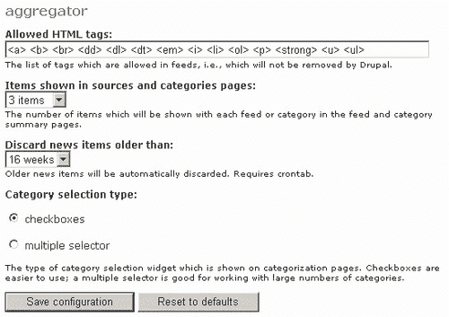
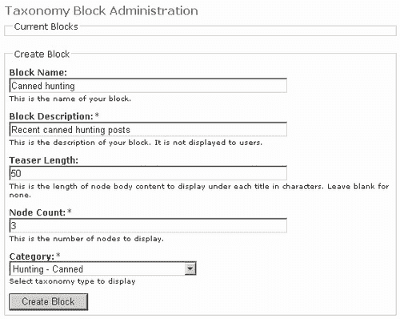

# 第六章 基本内容

我们迄今为止处理的所有内容，尽管在创建我们自己的独特网站方面可能很重要，但在 Drupal 的内容和内容管理主题上必须退居次要位置。毕竟，内容*就是*这一切的核心！随着提供动态内容网站数量的激增，现在提供有意义的、动态的、相关的内容以繁荣发展是绝对必要的。用户对幕后如何操作并不关心，但如果你能让他们浏览体验无烦恼且对他们相关，他们就会继续使用你的网站。

*在这个上下文中，“无烦恼”意味着什么？* 内容需要易于查找，这反过来意味着它需要很好地组织。它需要很好地展示并且易于互动——换句话说，简单易用。其中大部分已经由 Drupal 处理，而且只需付出很少的努力，我们就可以提供一些非常强大的功能。然而，在我们查看添加更多功能之前，我们确实应该确保我们很好地掌握了如何使用已经到位的工具。

为了这个目的，本章将在探讨 Drupal 的一些有趣和强大的功能之前，提供一个关于内容管理基础的良好基础。具体来说，我们将查看以下内容：

+   内容类型

+   与内容工作

+   与内容相关的模块

一旦我们完成这里的工作，就将是时候看看如何使用 HTML 和 PHP 组合一些整洁的页面，以及至关重要的任务，即弄清楚如何对所有的数据进行分类和分类，以提供一个复杂且直观的内容管理系统。所有这些内容将在下一章中介绍。现在，让我们继续熟悉 Drupal 及其内容。

# 内容类型

您已经接触到了一些 Drupal 内容类型的结构和用法。这实际上非常有用，因为它意味着我们可以将时间专注于更重要的问题，而不是在 Drupal 的内容和内容管理方面提供一个更广泛的概述。但这并不意味着本节和下一节的所有内容都已经涵盖。

首先，我们需要对 Drupal 中可以创建的内容类型有一个很好的了解，然后我们需要查看这些内容类型可以以各种方式使用的各种方法。了解这一点将帮助您确定实现您网站上的任何功能的最佳方式。

以下表格列出了与 Drupal 默认一起发货的内容类型：

| 博客条目 | 博客，或称网络日志，是一种作者特定的内容类型，个人可以将其用作日记或其他用途。在 Drupal 中，每个博客作者可以根据网站的设置和他们的权限，向他们的博客添加附件、HTML 或 PHP 代码。一个很好的博客例子可以在[`googleblog.blogspot.com/`](http://googleblog.blogspot.com/)找到，它展示了博客内容格式的有趣应用。 |
| --- | --- |
| 书页 | 书是由一系列书页类型（实际上现在可以使用任何类型）组成的有序集合，旨在用于协作写作。书页可以由不同的人添加，以组成一本书，然后可以将其结构化为章节和页面，或者采用最合适的任何结构，只要它是层次结构即可。由于几乎任何数据类型都可以添加到书中，因此有大量的空间来创造令人兴奋的内容（想想用 PHP 和 Flash 动画创建的动态书页，以及与之相辅相成的叙述或视觉内容，以创建一个真正独特的基于互联网的书——可能性是无限的！）。一个很好的书页例子是 Drupal 网站上为开发者提供的文档，可以在[`drupal.org/node/316`](http://drupal.org/node/316)找到。这些文档是由多位不同的作者随着时间的推移逐步建立起来的。你会注意到，如果你启用了书模块，所有/大多数网站帖子上方都会显示一个额外的轮廓标签。点击此标签允许你将帖子添加到书中——这样，书就可以从网站上发布的内容中构建起来。 |
| 评论 | 评论与其他类型略有不同，因为它们实际上不是节点。换句话说，你不能像创建其他任何内容那样创建评论。相反，你可以将评论附加到其他内容类型上，这些评论作为刺激用户讨论的手段非常受欢迎。你可以通过登录到 Drupal 论坛[`drupal.org/forum`](http://drupal.org/forum)，并在此处发布或查看各种主题上的评论来看到评论的实际应用。 |
| **论坛主题** | 论坛主题是论坛的基本构建块。论坛只能由论坛主题及其评论组成，与书不同，书可以包含几乎任何内容类型。论坛中的信息按层次结构分类，它们在举办讨论以及基于社区的支援和学习方面极为有用。互联网上充满了论坛，你还可以访问 Drupal 论坛来了解它们是如何运作的。 |
| **页面** | 页面类型旨在允许你添加基本、常见的网页，这些网页可以在任何网站上找到。"关于我们"或"使用条款"页面是页面类型的良好候选者，尽管你可以用一些动态内容和 HTML 来美化这些页面。只需查看任何网站即可看到此类页面的例子。 |
| 内容类型 | 描述 |
| --- | --- |
| **投票** | 投票类型提供了提问和提供一系列答案的功能，然后以图表格式展示。许多不同的企业使用投票来收集政治或营销信息，或进行其他研究。投票本质上通常具有有限的生命周期；因此，您将不得不自己寻找例子。许多新闻网站，如《时代》杂志，通过投票来确定公众舆论；因此，这些可能是您看到如何有效使用投票的最佳选择。 |
| **故事** | 故事页面基本上与标准页面类型相同。然而，您可能想通过使用故事类型来区分两者，例如用于短期页面，如新闻或通知。 |

以下表格查看了一些作为贡献可用的内容类型：

| 内容类型 | 描述 |
| --- | --- |
| Acidfree | Acidfree 贡献提供的相册和媒体项类型允许您处理图像和视频内容。该贡献还提供了管理您的媒体文件的功能。 |
| 每日 | 每日贡献提供了两种新的节点类型，称为每日条目和每日容器。这些用于通过日期浏览内容项，甚至控制未来在网站上提供内容项的时间。 |
| Flexinode | 此贡献允许用户定义和编辑他们自己的内容类型。 |
| 首页 | 虽然在技术上不是节点/内容类型，但首页确实允许用户创建一个首页，该首页不必符合 Drupal 网站其他部分的常规页面布局。如果您想向您的网站添加一个介绍页面，这将很有用。 |

每次您为您的网站创建新内容时，都有几个选项可供您做出适当的决定，这些选项显示在帖子正文下方的列表中。根据特定用户的权限，他们也将有一些，尽管希望不是所有，选项可供他们选择。例如，如果为认证用户启用了上传权限，那么他们可以决定是否将文件附加到他们创建的任何内容上。

作为管理员，您的权力更为重大；因此，让我们看看创建标准页面内容类型时默认可用的选项。请注意，不同类型的内容也可能有额外的选项可供选择。例如，如果您创建一个新的投票，您将不得不通过在投票类型的独特**设置**部分设置**投票持续时间**来决定投票的持续时间。

下一个部分讨论的内容选项代表了大多数类型。

# 与内容一起工作

了解在内容方面哪些可用和不可用并不一定意味着您自动知道如何使用内容。因此，本节将更深入地探讨如何编辑和配置内容，以反映网站的需求。我们已经在之前的章节中处理过内容，因此已经熟悉本节的一些部分。然而，这里的目的是提供一个单一的、连贯的参考点，以便学习。

与内容一起工作有几个不同的方面，我们将从探讨在创建新内容时如何设置正确的默认选项开始。在此之后，查看内容**管理**功能很重要，最后，我们将简要讨论在处理内容时需要注意的一般问题，因为有时与内容一起工作可能会相当复杂。

## 内容选项

在创建新内容时，我们以如下方式展示**输入格式**部分（如果**输入格式**链接被最小化，点击它以显示完整版本）：


默认情况下，**过滤 HTML**选项被选中。除非您有充分的理由使用其他选项之一，否则请坚持使用此选项。特别是要小心，不要允许任何用户将 PHP 添加到他们的内容中，因为这可能会使您的网站面临严重风险。记住，即使是**过滤 HTML**也不是完全安全的，因为用户仍然可以向他们的页面添加指向恶意网址的链接，这相当于在您的网站上拥有它。

以下是一个用户在攻击前如何获取有关您网站信息的示例（假设已启用**PHP 代码**选项）。在页面正文部分，将以下代码片段添加到您的页面中：

```php
<?
Phpinfo();
?>

```

确保启用**PHP 代码**选项，并为页面提供**标题**后，点击**预览**。您应该看到如下内容：


虽然此截图中的服务器信息可能不够清晰以便阅读，但对于在线查看页面的用户来说，足够清楚以了解有关您服务器的所有信息。在这种情况下，安全总是比后悔好，因此您应该将此类设置的默认选项保留为**过滤 HTML**。所有这些都再次重申了我们之前讨论的一个观点，当时我们讨论了用户和权限：

### 注意

确保您只给信任的用户提供足够的权限来履行他们的角色——不要更多！

在继续之前，我应该提到，在下一章中，我们将讨论如何创建自定义输入格式，因为默认选项可能并不总是适合网站的需求。

**接下来，作者信息**只有两个选项。第一个指出了内容的作者，第二个给出了内容首次创建的日期。当然，修改内容不会改变**作者日期**。如果你正在修改一个已经创建的页面，那么你会遇到一个日志选项（这可能在内容首次创建时也可用）。

例如，一个典型的日志消息可能如下所示：


如果你在想为什么我没有费心给这个日志消息添加日期，那是因为 Drupal 在自动查看内容的修订版本时会明确指出这一点。在我们讨论修订版本之前，再来看看日志消息对其内容的影响。

这个日志功能相当简单，但对于大多数人来说应该足够了。未来可能会为 Drupal 引入一个更复杂、更先进的日志系统，所以请留意这方面的信息。

**发布选项**可能很难设置正确，这取决于设置的具体情况。目前它们看起来是这样的：


正如你在下一节*管理内容*中将会看到的，你可以决定来自某些用户的某些类型的内容在可以允许其被公众消费之前是否需要经过审核。如果是这样，你或指定的用户将有权通过审核队列来确认所有内容是否符合网站的要求。

在前面的屏幕截图中，正在添加的内容是直接发布的，无需审核。启用第二个选项**在审核队列中**将强制内容在发布前得到批准。第三个选项已被选中，这将导致创建的内容在首次发布时出现在网站首页上（除非你已经在这里设置了特定的节点显示）。

默认情况下，你可能不希望，例如，新书页面出现在首页上，而优先于行业专家的博客；因此，只为那些应该吸引一些注意力的内容类型启用此选项。

第四个选项**在列表顶部固定**会使节点无论列表中有多少其他帖子都保持在列表顶部。这对于在论坛上发布重要消息非常有用。例如，如果某个论坛上对如何做某事存在一些混淆，写一个说明如何操作的笔记，并选择此选项将其固定在论坛顶部。这样，你可以确保当人们访问该论坛时，这是他们看到的第一件事。

最后一个选项，**创建新修订版**，当内容正在更新或修订时，会导致 Drupal 创建内容的新版本。这意味着你不仅保留了旧版本的内容，还创建了一个新版本。如果你想要跟踪对文档所做的更改，这很有用。如果已创建并跟踪了新修订版，那么下次你查看内容时（假设你有足够的权限），你会在页面上注意到一个新的**修订版**标签，如下所示：


使用这个**修订版**页面，现在可以轻松地处理你的内容。例如，你可以通过点击**还原**来决定哪个修订版应该是活动的（显示给其他人），或者你可以**删除**所有修订版。注意，添加到内容类型中的日志消息也会在每个修订版的底部显示。从这一点可以看出，它们对于维护经常修改的内容的良好版本控制实际上非常重要。在这种情况下，修订版的书页内容日志消息提到了标题的变化。

继续前进，下一个部分，**评论设置**，简单地允许你确定其他用户是否能够对内容添加评论，如下所示：


第一个选项，**禁用**，如果你发布的内容不适合评论，这很有用——也许，像我一样，你不喜欢对你的诗歌提出批评，或者类似的事情。第二个选项只允许具有管理权限的用户对内容发表评论，尽管其他用户可以查看评论，最后一个选项允许所有具有足够权限的用户对你的精彩诗歌（或任何其他内容）发表评论。

以下一组选项涉及将内容添加到菜单中。下一个截图显示了如何将典型的**关于我们**页面添加到**导航**菜单中：


在这种情况下，我们给这个页面分配了相当大的权重，因为我们只想在内容帖子之后显示它，这样就不会分散网站的主要焦点。如果你现在查看主菜单并将光标悬停在新的**关于我们**链接上，你会看到以下内容：


如果你希望再次删除或编辑此菜单项，只需查看相同的**菜单设置**部分，那里将有一个新的复选框，可以自动删除它。

最后一个选项涉及文件上传的使用；它易于操作，我们已经在实际操作中看到了它的效果，因此我们在这里不再进一步讨论。这基本上就涵盖了默认内容选项——然而，还有很多东西要学习，所以在我们进入内容管理世界时，请保持你的思考帽。

## 管理内容

在第四章中，我们看到了在**设置**部分，在**管理**下，可以为内容类型设置默认选项。回到那里，禁用所有**发布选项**，除了**待调节队列**对于**页面**内容类型（或任何可以使用认证用户创建的类型）之外，并保存更改。从管理员账户注销并使用标准账户登录，然后创建一个新页面。

假设认证用户在节点上没有启用**管理**权限，他将没有修改**发布选项**的权力，而只需点击**提交**来发送他们的页面进行调节。现在查看网站上所有可用的内容；刚刚提交的页面还没有出现，因为它还没有被发布。为了了解发生了什么，我们需要访问**管理**下的**内容**页面，它显示了网站上所有内容的列表，以及一系列选项，以便与之交互，如下所示：


注意，在这个屏幕截图中，前两个提交是由用户**David**发布的（而在演示网站上，管理员是**David Mercer**）。这两个页面节点都还没有被发布，因为默认设置要求它们首先进行调节。注意，**新**这个词被附加到最新提交上，以区分我们之前已经看到的帖子——当你有大量节点要处理时，这很有用。

现在，页面顶部上方**更新选项**处显示的内容筛选器是你在管理车间中非常重要的工具。它允许你只显示满足某些要求的节点。提供了三个筛选标准：**状态、类型**和**分类**。这些允许你筛选整个列表，只显示那些符合所选方法右侧下拉列表中设置的特定要求的项。

如果我们想要定位一个已经发布的节点，我们会检查**状态**标准，然后从下拉列表中选择**已发布**选项（如前一个屏幕截图所示），然后点击**筛选**。此时，显示的列表将被筛选，并且只有相关的结果会显示在页面上。这很容易做到！

这一切都很好，但是调节队列在哪里呢？嗯，如果你查看与**状态**标准一起提供的下拉列表，你会注意到有一个**待调节**选项。选择这个选项并点击**筛选**，将显示以下结果：


这些页面还没有发布，因为**发布选项已被禁用，并且所有这些都设置为待调节队列**。

### 注意

注意，你可以多次使用过滤器来细化你的结果！

现在管理员可以编辑节点，一旦一切顺利，节点就可以发布。这样做很简单！假设我们想要允许**管理我**页面发布，因为经过一些编辑后，我们对它感到满意。只需选择**标题**左侧的框，然后，在列表上方的**更新选项**部分，选择相关的选项，如下所示：


点击**更新**将确保页面现在按预期发布。你可以通过注销并以匿名用户或根据你的权限作为认证用户查看页面来确认这一点。

值得注意的是，在更新帖子方面有相当多的选项可供选择。你可以将帖子提升到首页，或者如果你选择的话，可以将其降级。你可以使帖子固定（换句话说，它将固定在其列表的前面），如下所示：


在**更新选项**下的**使选定的帖子固定**为**新主题**论坛帖子启用时，你可以看到左侧有一个固定图标，而最新的帖子（不是固定的）出现在其下方。你还可以取消发布和删除帖子，这两者都阻止权限不足的用户在网站上查看帖子。区别在于，**删除选定的帖子**选项将帖子从系统中完全删除，而未发布的帖子可以在以后重新发布——这对于只需将帖子下线，而无需删除它的情况很有用，例如你需要纠正或修改它。

最后，如果无法轻松找到内容，内容页面的**搜索**标签下提供了一个搜索工具，允许你通过关键词搜索。请记住，你可以使用`*`通配符来匹配任何字符，以扩大你的搜索范围。本页上的**高级搜索**链接还为你提供了其他几个选项来指定搜索条件。

### 注意

新内容将在你的 cron 运行完成之前不可搜索！cron 和计划任务在第十章中详细讨论。

最后，强烈建议你尝试使用搜索选项，以便熟悉每个选项的功能。

# 与内容相关的模块

除了讨论与内容相关的模块外，本节还将帮助你更好地了解可以与之一起工作的内容，以及使用默认和贡献模块可以完成的事情。

我们已经知道如何安装模块，所以不会展示如何安装我们讨论的每个贡献。如果有任何值得注意的偏离常规安装方法的情况，它们将在这里提及——否则，请安装并启用每个模块，同时记得在安装过程中检查是否需要设置任何特殊权限。

第九章涉及更高级的主题，在那里我们讨论了**Flexinode**模块，它构成了与内容直接相关的最后一点信息；所以记得在**合上内容这本书**之前也要查看那里。

## 聚合器

网络社区中最大的机会之一是分享信息的能力。你真正需要的是一套关于如何呈现这些信息的指南，一旦你有了这些，剩下的就很容易了。事实上，现在你只需点击几下，就可以从许多知名来源在你的网站上包含新闻和文章。

使包含他人的新闻、文档、文章或其他内容变得如此容易的标准被称为**丰富网站摘要（RSS）**。这允许聚合器（消费 RSS 源的程序）了解如何根据 RSS 源的结构在网页上呈现内容。Drupal 内置了一个这样的聚合器——只需在**管理**下的**模块**部分启用它，你将发现会弹出一些额外的菜单项，允许你在内容添加后进行管理和查看。

假设演示网站想要提供一些来自**国家地理**网站有关野生动物的新闻。我们访问新闻网站[`news.nationalgeographic.com/`](http://news.nationalgeographic.com/)，寻找网站上的 RSS 源图标所在位置。在这种情况下，它们看起来如下所示：


点击这里的**RSS**链接将显示以下页面——幸运的是，Drupal 为我们处理了所有脏活，我们甚至不需要理解 XML 就能消费这个源：


目前这可能对你来说意义不大，但它有助于确认在 URL 提供的地址上有一个可用的源。了解这一点后，我们现在可以前往我们的网站，在**管理**下查找**聚合器**链接，以便开始将此源添加到网站。这将显示一个尚未填写的源列表以及我们需要的所有其他内容。在此页面上，点击**添加分类**标签将显示以下表单：


假设您打算使用多种源，那么从一开始就对内容进行分类可能是明智的。请记住，提供及时有趣的新闻是您网站的一项增值服务，并鼓励用户不断返回。考虑到这一点，拥有多种相关源可能非常有价值。

完成后，点击**提交**，然后点击**添加源**标签以显示以下内容：


如您所见，我们：

1.  为新源指定了标题

1.  向 Drupal 提供了 RSS 源的位置（请与我们在实际国家地理网站上稍早前访问的 RSS 源页面 URL 进行核对）

1.  设置**更新间隔**为一天，使其成为每日新闻源

1.  将此源与新建的**商业**类别关联

在填写此表单时，有一些事情需要考虑。首先，您需要确保您没有侵犯源创建者提供的任何许可问题。如果对源的使用有明确的限制，请确保您遵守这些限制。

接下来，如果您每天只运行一次 cron 脚本，就没有必要设置一小时更新间隔——在这种情况下，cron 最多每天只能更新一次脚本。同样，如果源本身每周更新一次，就没有必要使用 cron 每十分钟更新您的源——请咨询源提供者他们建议您多久更新一次源。

考虑到这些因素，您现在可以点击**提交**按钮将源添加到您的网站。现在聚合器主页上有一些信息告诉我们，看起来可能像这样：


目前该源中尚无项目，因为`cron.php`脚本尚未运行。您可以等待它通过您的计划任务或 crontab 访问，或者如果您不想等待，可以直接在浏览器中导航到`http://localhost/drupal/cron.php`（如果您的`cron.php`脚本路径不同，请确保将此 URL 更改为适合您网站的地址）。请记住，`cron.php`只是一个脚本，没有 HTML；因此，即使它运行正确，您也不会在这个页面上看到任何内容。

完成这些操作后，点击聚合器页面上的**刷新**按钮以查看结果。假设一切正常，您应该会看到如下内容：


成功！从这您可以看出现有的源在最近一次更新后包含了**9 个项目**，更新发生在**6 秒前**。此外，您还可以**编辑**源，从源中**移除项目**，或通过点击**更新项目**手动更新源——在这种情况下，源可以修改以反映源网站上的任何更改。这就全部了！

现在，你当然可以在网站上查看源的内容。对于演示站点，已授予匿名用户和认证用户访问源权限。因此，当有人访问网站并点击主菜单中的**新闻聚合器**链接时，他们会看到如下内容：


现在所有用户都可以即时访问由*国家地理*提供的所有内容。没有任何东西阻止你从任何数量的其他源收集信息，而且有趣的是，只要你没有侵犯任何许可证，你可以让你的源对其他网站可用。这样做很简单（记得在尝试使用之前启用聚合块）！滚动到页面底部，直到你看到一个类似这样的小图标：


点击它将显示以下 URL 提供的源页面（在演示站点的情况下）：`http://localhost/drupal/aggregator/rss`，这样就可以进行内容聚合。你不仅限于聚合你获取的在线源——任何内容都可以进行聚合。

值得注意的是，你可以通过点击**新闻聚合器**下的**源**链接在导航栏中揭示你的源。在这种情况下，我们看到了以下内容；请注意，我已经添加了来自世界自然基金会（World Wide Fund for Nature，以前称为世界野生动物基金会）的源：


这为我们提供了每个源的精彩摘要。到目前为止一切顺利，但**“更多”**链接的作用是什么？点击 WWF 源的**更多**链接将显示以下页面：


从这里，你可以点击源名称以访问源网站，在本例中是[`www.panda.org`](http://www.panda.org)。与该源相关的源列在标题框下面的页面上，以便通过源轻松访问源。点击框右上角的橙色聚合图标将浏览器带到实际的源页面。在这种情况下是[`www.panda.org/rss/news.cfm?Press%20Office`](http://www.panda.org/rss/news.cfm?Press%20Office)。

此外，页面上还有两个标签页。**分类**标签页打开以下截图，允许我们将单个源项放入各种类别（假设你有多种类别可用）。

这张截图显示了第二个源项被分配了两个类别，即**商业**和**特别**。在这种情况下，**特别**类别是根据特定目的创建的。因为时不时会有一些让人感到温暖的消息，所以所有被标记在**特别**类别的项都应该在网站上的特殊块中显示，以便每个用户在查看网站上的任何页面时都能看到好消息。


**来源**页面上的最后一个标签页只是调用了创建订阅时使用的相同页面。从这里你可以轻松地对订阅进行任何所需的更改。

由于我们尚未涉及分类和分类法，你可能希望在阅读了第七章之后返回本节，因为现在可能有一些事情还不清楚。例如，我们将在本章后面添加一个模块来根据内容类别显示内容，这就是为什么我们可以以以下方式处理**特殊**类别的原因。这里提供的信息只是为了让你了解你将能够做什么——希望现在不会太令人困惑。

请记住，你完全可能希望在网站的某个地方显示一些最新的订阅，请转到**管理**链接下的**块**类别，启用其中一个新块以显示其最新项目——请注意，您也可以在类别中显示最新的订阅：


完成此操作后，您将在网页上看到新的订阅，以及其项目选择。您可以在其配置页面上的**块特定设置**中配置显示的新闻条目数量（点击**配置**以打开此页面）——就我们的目的而言，默认的五条订阅选项就足够了。

现在，假设用户有博客权限，并且订阅许可允许您的网站这样做，您可以通过点击每个项目旁边出现的这个小**b**图标来将订阅项目添加到博客中，如图所示：


将新闻条目添加到您的博客中可以使文章更具持久性，因为它不会在清除订阅项目列表时丢失。当然，如果您打算随着时间的推移积累大量内容，那么您很可能需要使用存档模块。

聚合器还有一个重要的部分需要查看——配置！如果您在主菜单下的**设置**链接下点击**聚合器**，将显示以下页面：



此界面提供了对要由您的网站消费的订阅中允许的 HTML 类型的控制。这应该足以应对您想要聚合的大多数甚至所有订阅，但在极少数情况下，如果某些订阅存在问题，它们可能正在使用本节中未指定的标签。如有疑问，请保持原样！

接下来，展示了每个源通常要显示的项目数量以及保留旧源项目的时间长度，在这里做出合理的选择很容易。最后一部分规定了是否应该使用复选框或多个选择器作为分类选择界面（在**来源**页面的**分类**选项卡上）。我们已经在使用复选框，对于演示网站来说，它们是合适的。然而，如果启用了**多个选择器**，分类选择将看起来像这样：


在我们继续之前，再次提一下，如果你在某个阶段感到有分享你网站内容的冲动，你可以启用**聚合块**来强制 Drupal 显示橙色聚合图标。此外，如果你想增强网站聚合的控制，你可以查看提供的[`drupal.org/project/syndication`](http://drupal.org/project/syndication) 上的**聚合**模块。

## 归档

**归档**模块简单直接！在**管理**下的**模块**部分启用它。然后，转到**块**部分，启用名为**按日历浏览归档**的选项，将其放置在最适合的位置，然后就可以使用了。在演示网站的情况下，预计每天都会添加大量内容，因此归档日历将是一个按时间顺序查找内容的绝佳方式。因此，**按日历浏览归档**块被赋予了低评分，以确保它始终出现在右侧侧边栏的顶部。一旦提交更改，用户可以通过在日历中搜索发布日期来导航到某个项目：


这并没有什么复杂的；然而，值得注意的是，点击日期或更改日历上显示的月份将立即在内容部分弹出一个表单，允许用户使用如下下拉列表进行搜索：


这是对 Drupal 优秀设计的证明，如此强大的功能可以如此容易地实现。如果这还不能让你印象深刻，那么其他事情可能也不会了！

## 相似条目

我不知道你们的情况如何，但我在阅读新闻故事时，经常发现我会跟随**相似/相关故事**的链接，以便尝试了解更多关于某个新闻片段的信息，或者简单地获得我对所看内容的更全面视角。能够显示相关项目的能力是非常有用的功能，而且它应该不会让人感到惊讶，因为在 Drupal 中通过安装**相似条目**模块来实现这一点非常简单。

从 Drupal 网站下载该模块并将其解压到您的`modules`文件夹中。完成此操作后，您需要在**管理**菜单项下的**模块**部分启用该模块——搜索名为**similar**的新模块。在这种情况下，仔细阅读`readme`文件很重要，因为它可能会根据您的系统设置影响您安装此模块的方式。

下一个任务是决定您想在网站上显示多少相关条目，以及其他事项。为了做到这一点，请转到**管理**下的**区块**部分，点击**Similar entries**区块旁边的**配置**，设置数量，然后启用区块并设置其**位置**和**权重**。演示网站使用了默认设置：


如果某些内容类型不可用于选择，那么这很可能是由于网站上还没有该特定类型的内容。一旦您创建了某种类型的内容，它就会出现在**要显示的节点类型**下拉列表中。此外，假设分类模块已启用（它应该已启用），有三种与相似条目模块如何查找相关内容相关的选项。在这种情况下，默认选项是合适的，因为我们不关心类别过滤。然而，如果我想只显示来自**保护**论坛容器的相关内容，那么需要做出以下设置：


本页上剩余的设置对每个区块都是标准的，我们之前已经看到如何使用这些设置。配置完成后，只需启用区块并将其放置在您想要的位置。现在当用户查看网站上的任何内容时，该模块会通过搜索具有相似性的其他帖子来展示相关内容。例如，在查看以下帖子时，请注意现在在右侧边栏中出现了一个新的区块：


如您所见，展示的五项相关条目中有三项标题包含**狩猎**，因此我们预计它们会出现在这个列表中。*那么其他两项呢？*如果您仔细观察，帖子的内容提到了捕捉和陷阱，这与两项未明确提及狩猎的条目标题相关。

因此，我们可以看到，为了展示相似帖子或条目的列表，相似条目模块会搜索网站上发布的所有标题，并列出其中任何标题具有相似性的条目。不仅如此，它还会搜索帖子的正文内容以寻找相似性，并展示这些内容（假设区块中有足够的空间）。这对于进行研究和类似新闻网站来说显然非常有用。

## 分类区块

我们接下来要讨论的最后一个模块与**分类**模块相关。不幸的是，这依赖于你的网站上已经启用了分类的事实。因此，你可能想要在阅读完紧接着这一章的“高级内容”章节之前跳过这一部分。

与之前讨论的模块类似，此模块也会根据用户所查看的内容向用户展示类似的主题。然而，在这种情况下，**分类块**会根据它们的类别显示最近发布的项目的列表。现在，你应该仔细考虑你是否更喜欢这个模块还是之前的那个模块来为读者提供相关主题。在页面上同时显示这两个模块将产生一些冗余，因为显然块的内容会有一些重叠。

### 注意

功能必须反映并满足网站的要求。其他任何东西都是冗余的！

换句话说，不要在你的网页上添加不必要的信息或功能；这会损害网站的可用性，因此，间接地，也会影响其受欢迎程度。

模块的安装相当简单——只需将下载内容的文件提取到`modules`文件夹中。你需要对你的数据库执行一个`.mysql`脚本，所以再次确保在做出此类更改之前你有最近的备份。你可以在命令行中执行以下命令来运行脚本（请记住使用你系统的正确用户名和数据库名称）：

```php
$ mysql u<username> -p drupal < C:\apache2triad\htdocs\drupal\modules\taxonomy_block\taxonomy_block.mysql

```

如果`taxonomy_block.mysql`脚本不在你的机器的这个位置，请将文件路径更改为适合你系统的路径。假设命令执行没有问题，你现在可以前往**模块**部分启用网站的新增功能——在列表中查找**taxonomy_block**。一旦模块启用，你需要决定它应该在网站上展示的位置，使用**管理**下的**块**页面。

与其他模块不同，**分类块**不会自动出现在可启用块的列表中——相反，你将在**块**菜单项下主菜单中找到指向它的链接。此链接将打开一个块创建页面，你可以根据你希望将此块与哪个类别关联来指定你想要显示的信息类型，如下所示：



在这种情况下，我们选择展示一个包含与有争议的圈养狮子狩猎问题相关的信息的块。**块描述**选项允许你输入块名称，该名称将出现在父**块**页面上的块列表中。**预告长度**设置你希望显示的每个帖子中的字符数。在这种情况下，我决定为每个帖子显示**50**个字符，但将显示的相关主题数量限制为**3**，以避免这个块占用太多空间。最后，正如预期的那样，这个块与**狩猎 - 圈养**类别相关联。

点击**创建块**保存这些更改，现在我们可以前往**块**页面，以便启用块并在网站上显示它。在**禁用**块列表中搜索你在上一页输入的**块描述**。一旦找到，就做出关于它应该在哪里显示以及它应该具有什么权重的选择，然后点击**保存块**。现在你的网站上已经运行了基于分类法的相关内容。在演示网站的情况下，类似的条目块被禁用，并启用了这个块来替代它。

现在当用户查看与圈养狩猎相关的内容时，他们会看到如下内容：


当然，根据你创建块的方式，你可能会得到截然不同的结果。你可能发现你根本不想包含任何预告，在这种情况下，你最终只会看到每篇帖子的标题。无论你的选择如何，你现在都有一些相当强大的功能可供使用。只需记住不要过于沉迷，仅仅因为它们工作得很好就添加块。

# 摘要

在与 CMS 系统（如 Drupal）一起工作时，如何高效快速地处理内容是一个非常受欢迎的特质。为此，本章为你奠定了工作基础，通过概述基本原理以及展示其他可用的内容。首先，我们简要地查看可以使用 Drupal 实现的各种内容类型，然后讨论如何使用管理工具处理这些内容。

在运营一个网站时，你将承担的一项最重要的工作就是管理网站的内容。目前这看起来可能相当直接，但随着网站规模的扩大，这项工作会变得稍微困难一些。确保你花时间熟悉**管理**菜单中与内容相关的管理区域，这将确保当你的网站被更广泛地使用，或者当你开始尝试更复杂的内容相关任务时，你能保持对事物的掌控。

本章的后半部分演示了一些与 Drupal 一起提供的强大功能或由贡献者提供的功能。我们看到了相对容易地聚合 RSS 源，并相应地分发内容，使其可供其他网站消费。仅用最少的麻烦就能做到这一点，对于整个互联网来说是一个巨大的飞跃，希望你们能传播关于如何轻松使用 Drupal 的好消息。

有了对如何处理内容以及可以使用的内容类型的扎实理解，我们现在可以开始探讨一些稍微复杂的内容问题。下一章将讨论如何创建自己的动态和吸引人的内容，以及如何通过使用分类模块来对内容进行分类。
