# 第七章：高级内容

到目前为止，我们与内容的互动相当基础，我们只需要学习启用哪些设置和输入什么文本。这与本章即将介绍的内容有根本的区别，主要是因为本章的内容要求我们提前思考和计划我们想要的内容，以防止以后出现问题。

在这一点上，在前面几章中听到很多关于分类和分组的讨论后，你可能想知道所有这些喧嚣的原因。我们关注分类的主要原因是，为了使 Drupal 的分类系统如此强大，它必须留给我们决定如何最好地实现。一开始这可能听起来有点奇怪，但我们在本章后面会看到为什么 Drupal 的这个功能是使其与其他所有事物区分开来的因素之一——这真的是一件好事！

因此，本章讨论以下主题：

+   HTML、PHP 和内容发布

+   分类

不要被这里只列出了两个项目的事实所迷惑，因为它们都代表了比我们之前讨论的所有其他主题更复杂的步骤。然而，一旦你掌握了这些主题，你在网站开发方面基本上就接近终点了——在我们开始查看更多管理类型任务之前，只剩下主题设计这一主题。

此外，在磨练你的内容创作和管理技巧的过程中学到的技能不仅对网站有用，而且在你生活的其他方面也很有用——无论是为你老板创建和管理办公室报告，建立新的网站，甚至写一本书。原因在于，总的来说，我们现在将要学习的是*如何管理和创建内容*，而不是如何点击按钮和链接来启用或禁用设置。

在任何情况下，我相信你都很渴望继续前进。

# HTML、PHP 和内容发布

我们在第三章中简要提到了可以在我们的帖子中包含 HTML 或 PHP 的事实，在那里我们添加了一些格式化和超链接到一些文本——我们还在第四章的**添加块**部分看到了一个简短的 PHP 脚本，它为网站提供了漂亮的*每日名言*功能。因此，到现在你应该已经习惯了这样一个事实：如果给予足够的权限，发布一些相当独特和有趣的内容是可能的。

很可能，在某个阶段，你将希望将至少部分内容从纯文本升级为看起来稍微有点**不同寻常**的内容。如果你说的是布局，那么你需要了解 HTML。或者，如果你想创建一些可以根据网站状态变化或响应用户交互的动态内容，那么 PHP 是前进的方向。更有可能的是，一旦你积累了一些经验，你将使用两者的组合。

很遗憾，我们在这里不可能希望给你一个关于这两种技术的全面介绍。然而，网上有大量的免费资源，你可以学习 HTML 和 PHP，我们将在本节中列出其中的一些。

现在，我们将通过演示如何创建一个包含链接到其他有用网站、**虚构团队**的图片以及一些动态内容的**关于我们**页面，来看看如何通过实现一些相当有用的任务。

## 输入格式和过滤器

首先你需要理解的是，在每篇帖子中，我们必须明确指定将要发布的内容类型。这是通过使用**输入格式**设置来完成的，该设置在向网站发布内容时显示——假设相关用户有足够的权限发布不同类型的内容。为了控制允许和不允许的内容，请转到**管理**主菜单项下的**输入格式**链接。这将显示当前定义的输入格式列表，如下所示：

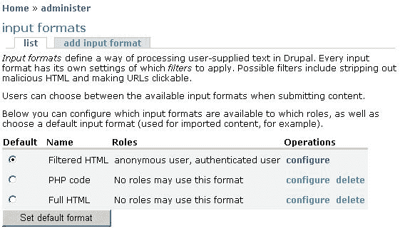

目前，你可能想知道为什么我们需要费这么大的力气来决定人们是否可以添加某些标签到他们的内容中。答案是，因为 HTML 和 PHP 都是如此强大的互联网技术，要恶意利用甚至相当简单的功能并不困难。例如，你可能会决定你想允许认证用户从他们的博客中链接到他们的首页。利用添加超链接的能力，恶意用户可以创建病毒或其他有害内容，并通过看起来无害且友好的 HTML 片段链接到它：

```php
<p>Hi Friends! My <a href="link_to_virus.exe">homepage</a> is a great place to meet and learn about my interests and hobbies. </p>

```

这段代码简单地写出一个包含链接的简短段落，理论上链接到作者的首页，但实际上超链接引用属性指向一个病毒，`link_to_virus.exe`。这只是 HTML；PHP 可以造成更大的破坏——到如果你没有适当的网络安全或灾难恢复策略，那么你的网站可能会变得毫无用处或完全被摧毁。正如你可能从之前的屏幕截图中所注意到的，除了**过滤 HTML**之外，任何其他内容对除了管理员之外的其他人都是不可用的。

再次强调，以下原则很重要：

### 注意

永远不要允许用户比他们完成任务所需的权限更多！

按照现状，您可能不会喜欢输入格式，因此 Drupal 为我们提供了一些功能来修改它们。点击**Filtered HTML**选项旁边的**配置**链接，这将显示以下页面：

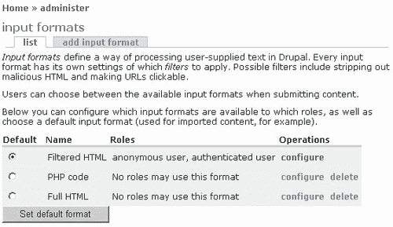

**查看**标签为您提供更改输入格式的**名称**属性选项；在这种情况下，**角色**部分不能更改，但正如您在我们创建自己的输入格式时将看到的，角色可以按您的意愿分配。最后一部分为我们提供了一个清单，列出了我们希望在使用此输入格式时应用的**过滤器**类型。在这种情况下，前两个已被选中，这导致输入格式应用**HTML 过滤器**（稍后讨论）以及**换行符转换器**，但不应用**PHP 评估器**。

换行符转换器只是让用户更容易格式化内容，因为它意味着他们不需要明确输入`<br>`或`<p>`HTML 标签来显示新行或段落分隔。如果此功能被禁用，除非用户有能力添加相关的 HTML 标签，否则您的内容可能会看起来像这样：

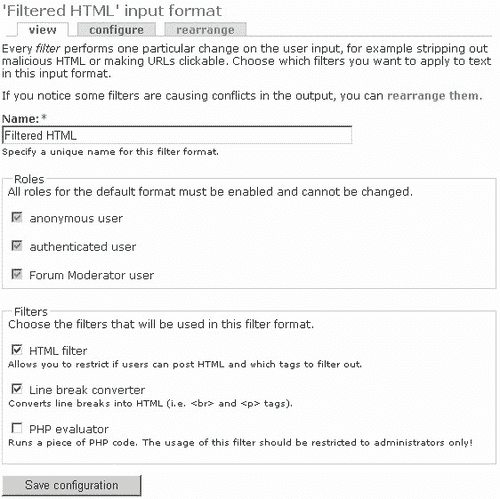

PHP 评估器只是导致帖子被发送进行 PHP 处理，以便任何位于 PHP 分隔符`<?php`和`?>`之间的代码都能正确执行。这不应该为除您自己或需要它来完成其工作的非常信任的管理员之外的人启用。然而，对于这两个选项都没有其他工作要做。我们在这里需要查看的唯一其他设置是**HTML 过滤器**。

点击页面顶部的**配置**标签，以便开始使用**HTML 过滤器**。您应该会看到类似以下内容（一旦您点击了**HTML 过滤器**链接以展开其内容）：


首先，您可以使用前两个选项来决定是否要删除不允许的 HTML 标签，或者简单地忽略任何帖子中的所有标签（选择**Escape all tags**会导致帖子中出现的任何标签都按原样显示）。请记住，如果您从内容中删除了所有标签，您应该启用**换行符转换器**，这样用户至少可以正确地分段内容。要删除哪些标签将在以下部分决定，在那里您可以输入所有允许的标签列表——其他任何内容都将被删除！

在前面的屏幕截图中，您可以看到在这个输入格式中有十一种不同的标签被允许。请注意，第一个实际上是**<a>**标签，它可以用来在内容中插入链接——因此要小心这个！

接下来，下一个设置允许我们指定在发布内容时是否为用户提供 HTML 帮助——尝试启用和禁用此选项，并在每种情况下浏览此相对 URL 以查看差异：`filter/tips`。在长过滤提示中有很多关于 HTML 的有用信息；所以请花点时间阅读一下。如果你发现网站被用来向成员发送你未授权的产品链接，**垃圾邮件链接阻挠工具**是一个有用的工具。

这并不是故事的结尾，因为我们还需要能够创建输入格式，以防我们需要默认选项无法满足的东西。在这种情况下，让我们假设我们想要将一些图片文件添加到*关于我们*页面，我们将适时创建它。现在，有几种方法可以实现这一点，但在我们可以考虑创建我们的页面之前，需要满足两个主要标准。我们需要能够：

1.  上传图片文件并将它们附加到帖子中。

1.  在帖子的正文中插入并显示图片文件。

我们在讨论第四章中关于*上传*的第四章时已经看到了如何执行任务一。所以假设你能够将文件附加到你的帖子中，这就留下了第二个标准。在帖子中显示图片文件有几种方法。我们将在这里讨论的方法不需要我们下载和安装任何贡献模块，如**Img_assist**。相反，我们将直接使用 HTML 来实现这一点——具体来说，我们需要``标签。

查看之前的截图，它显示了**过滤 HTML**输入格式的**配置**页面。你会注意到``标签不可用。让我们创建自己的输入格式来满足这一需求，而不是修改此默认选项。返回到**管理**下的**主要输入格式**页面，点击**添加输入格式**。这将打开以下页面，你可以从中构建你的新输入格式，如下所示：

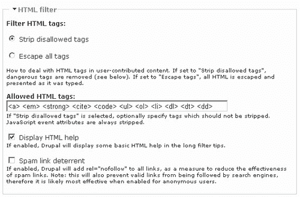

由于我们稍后需要使用一些 PHP 代码，我们已经启用了**PHP 评估器**选项，并阻止了除我们自己之外任何人使用此格式——通常你将为需要修改发布能力的用户组创建格式；但在这个案例中，我们只是演示如何创建一个新的输入格式；所以现在这样是可以的。

点击**保存配置**会将此新格式添加到列表中，现在可以通过点击列表中其名称旁边的**配置**链接来配置它，以便打开其配置页面。现在，在 HTML 方面，此输入格式与默认的**过滤 HTML**之间的唯一区别是在**允许的 HTML 标签**列表中添加了``标签，如下所示：

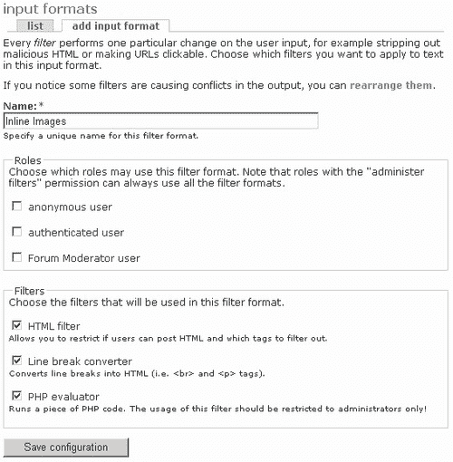

在完成这个输入格式之前，我们还需要关注另一件事。目前的情况是，我们将遇到在内容帖子中添加 PHP 代码的问题。这是因为目前**HTML 过滤器**首先处理内容，并破坏了**PHP 评估器**的代码。

在配置输入格式时，只需单击**重新排列**选项卡，并将**PHP 评估器**的权重降低，如图所示：

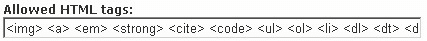

现在，PHP 评估器有权处理内容，并且可以正确地处理 PHP。为了将图片添加到您的帖子中，目前只需要这样做。完成之后，在使用它来创建“关于我们”页面之前，保存更改。不过，在这样做之前，可能最有用的是简要地讨论一下 HTML，因为您会发现，在尝试更复杂的帖子时，您需要能够处理 HTML。

## HTML

为了让浏览器渲染我们每天习惯看到的整齐排列和色彩丰富的页面，它需要有关在哪里放置什么以及给每样东西什么颜色的指令。这是**超文本标记语言**（HTML）的领域，Drupal 在这里使用 HTML 也不例外。

在我们继续之前，让我们快速了解一下 HTML 的各个方面：

+   **简单性：**从表格和框架到列表和图片，以及指定字体和样式，HTML 是网页创建和布局的一个方便且易于理解的约定。

+   **平台独立性：**HTML 是平台无关的（尽管不是所有浏览器都完全相同），如果你这样想，这是有道理的；作为网站构建者，你最不希望做的就是必须为可能使用 HTML 的每一种不同类型的机器提供服务。

+   **标签：**HTML 以开标签和闭标签的形式出现，它们告诉浏览器如何显示它们所包围的信息。例如，页面的标题将被包含在标题标签中，如下所示：`<title>我的标题页面</title>`。请注意，使用正斜杠来区分闭标签和开标签。

+   **属性：**标签可以有属性，这些属性可以修改或定义标签行为的某些方面。例如，以下 HTML 片段中的`size`属性定义了字体的大小，`<font size="2">我的字体大小为 2</font>`，当它在浏览器中渲染时。

+   **章节：**一个 HTML 页面被`<html></html>`标签包围，并分为`<head></head>`和`<body></body>`部分。主体标签包围页面的主要内容，并包含实际网页上看到的信息。在我们的情况下，我们不需要担心这一点，因为所有内容都是自动发布在`<body>`标签之间的。

这为我们提供了一个关于 HTML 是什么以及它能做什么的公平概述，但对于实际应用来说，看到我们目前可以使用 HTML 实现什么是很重要的。实际上，所有 HTML 标签都可供管理员使用，但请记住，你只应在开发期间使用此账户；一旦你的网站上线，你应该使用为该任务设计的输入格式来发布内容。正因为如此，你需要了解这些标签实际上能做什么。

下表讨论了每个默认允许的标签以及刚刚添加的``标签。请注意，在这里展示每个标签的每个属性实际上并不实用，所以如果你想了解每个标签的详细信息，请查看`http://www.w3schools.com`，这是一个关于 HTML 及其他内容的优秀资源。

| 标签 | 重要属性 | 描述 |
| --- | --- | --- |
| `` | `src:` 提供图像文件的路径`alt:` 包含图像的描述 | 与其他标签不同，``标签不需要关闭标签`</img>`。它用于在 HTML 页面中显示图像，并通过使用可选属性可以精确控制图像的显示和布局。 |
| `<a>` | `href:` 指定链接的目标 URL`name:` 允许在网页内创建书签`target:` 定义链接打开的位置——通常是新页面，`_blank`，或同一页面，`_self`。 | 锚点元素便于创建超链接或书签，用户可以通过这些链接进行导航。 |
| `<em>` |  | 强调标签将标准文本转换为斜体。 |
| `<strong>` |  | 强标签将文本以粗体显示。 |
| `<cite>` | `title:` 可以用来指定所讨论引用的来源或作者 | 引用标签允许文本被引用为来自另一个来源或作者。它通常以斜体显示。 |
| `<code>` |  | 代码标签将包围文本的样式改为模仿计算机代码的样式。 |
| `<ul>` | `type:` 定义要使用的子弹点的类型：`disc, square`，或`circle`。 | 无序列表创建一个子弹点列表——它需要使用`<li>`标签来指定列表中的项目。 |
| `<ol>` |  | 有序列表创建一个带编号的子弹列表——它需要使用`<li>`标签来指定列表中的项目。 |
| `<li>` |  | 列表项标签在有序列表或无序列表中创建一个新项目；正因为如此，它包含在`<ul></ul>`或`<ol></ol>`标签内。 |
| `<dl>` |  | 定义列表标签创建一个由`<dt>`和`<dd>`标签定义的项目结构列表。 |
| `<dt>` |  | 定义术语标签在定义列表中创建一个术语。它包含在`<dl></dl>`标签内。 |
| `<dd>` |  | 定义描述标签创建其父术语的描述——它包含在`<dl></dl>`标签内。 |

这个表格实际上只列出了一小部分你可以使用的标签。大多数标签也有各种各样的必需的、可选的或基于事件的属性，你可以通过调整这些属性来实现期望的效果。还有一个其他标签，我们需要使用它来正确布局页面，那就是非常重要的`<table>`元素。表格用于在页面内排序和放置内容，并使用`<tr>`标签，它定义了表格中的新行，以及`<td>`标签，它定义了该行中的新单元格。作为一个练习，回到你刚刚创建的输入格式，并添加这些标签。

这个表格实际上只列出了一小部分你可以使用的标签。大多数标签也有各种各样的必需的、可选的或基于事件的属性，你可以通过调整这些属性来实现期望的效果。还有一个其他标签，我们需要使用它来正确布局页面，那就是非常重要的`<table>`元素。表格用于在页面内排序和放置内容，并使用`<tr>`标签，它定义了表格中的新行，以及`<td>`标签，它定义了该行中的新单元格。作为一个练习，回到你刚刚创建的输入格式，并添加这些标签。

在完成这些之后，我们就可以开始创建一个比之前所有帖子都要稍微复杂一点的帖子了。

## 创建一个功能丰富的页面

创建这样一个新页面的酷之处在于，一旦完成，你几乎可以在任何其他地方重用代码，只需替换那些需要更改的值或内容。显然，你希望网站看起来相当统一，这支持代码重用的原则——至少在 HTML 方面。

很可能在你创建页面的某个阶段，你将想要创建的不仅仅是一个独立的页面。如果是这样的话，只需将你在这里创建的任何页面剪切并粘贴过来，并做出任何必要的修改，然后再发布。以这种方式做事将使你的所有页面在当前主题赋予它们的属性之外，拥有相似的外观和感觉。

关于我们的页面将具有以下功能：

+   结构良好的内容

+   目标列表

+   团队的内联图片

+   关于项目的信息

+   重要链接列表

+   一些基于 PHP 的动态内容

+   广告

为了满足所提出的要求，我们将需要使用以下标签：

+   `<table>`

+   `<ol>`

+   `<ul>`

+   ``

+   `<a>`

以及其他一些，我们将使用它们来展示可用的各种字体样式。为了创建这样一个稍微复杂一点的页面，你应该考虑使用一个合适的代码/HTML 编辑器（比如 EditPlus，[`www.editplus.com`](http://www.editplus.com)，就可以用——或者，在 Google 上简单搜索会找到很多结果，其中一些是免费的），它可以自动缩进你的代码，以及为各种标签和内容着色，以使生活更轻松。

好吧；我们基本上已经准备好开始了。我打算逐个列出整个页面的代码，而不是一次性列出，因为在我们进行的过程中有很多重要的事情值得讨论。然而，一旦你掌握了 HTML 和 PHP，这里没有什么太复杂的。在我们开始之前，最好先看看最终页面，以获得我们努力的方向。以下截图显示了页面的主要内容：

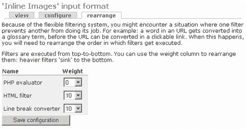

我希望你会同意这个页面看起来相当令人愉悦！只需做很少的工作，就能轻松实现这样的外观和布局。从这个页面中不明显的是，这里给出的名字列表以及他们的电子邮件链接是由一个简短的 PHP 脚本提供的，该脚本被嵌入到 HTML 页面中。

让我们继续编写代码——首先，我们有以下内容：

```php
<table border="0" cellpadding="5">
<tr>
<td align="center" colspan="2">
<strong>The CWC</strong>
</td>
</tr>
<tr>
<td colspan="2">
The <em>Contechst Wildlife Community</em> was started by a group of
individuals in <cite title="South Africa">Cape Town</cite>. Through
hard work, dedication and plenty of play time, they have built a truly
international community that strives to effect change with regards to
all things related to our biosphere.
</td>
</tr>
<tr>
<td colspan="2">
<br>
We have the following goals:
</td>
</tr>

```

这个第一部分用于声明表格，它最终将负责在我们想要放置内容的地方布局所有内容。注意，我在这里使用了两个表格属性。第一个，`border`，设置为`0`，这意味着边框是不可见的。*为什么我要这样做？* 在你构建表格的时候，将边框设置为`1`是个好主意，这样你可以看到你在做什么。当你开始制作复杂的嵌套表格等时，你会发现错误有时会悄悄出现。在这种情况下，能够看到你的表格边框的样子是非常有帮助的。一旦你完成，只需将边框值设置为`0`，就可以从页面上移除框架。

下一个选项，`cellpadding`，给表格中的每个单元格留出一点空间（或者如果你喜欢，就是填充），这样内容就不会显得挤在一起。你还可以看到我们使用`<tr>`和`<td>`标签声明了一系列的表格行和单元格。然而，第一个`<td>`标签有两个属性，它们控制内容在单元格内的放置位置（align）以及这个单元格跨越多少列（colspan）。这是必要的，因为在稍后的阶段，要添加的图片占据了表格右侧的一个单元格，但上下的行仍然需要填满整个页面（在这个例子中，整个页面是两列，因此设置了`colspan="2"`）。

为了更清楚地了解我的意思，请看以下带有`border`属性设置为`1:`的截图

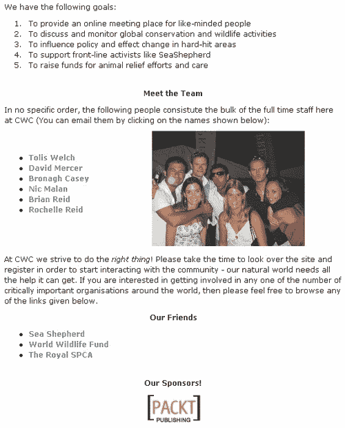

注意到上方和下方的行都跨越了中间两列。当您在更复杂的表格上工作时，您可能需要稍微调整一下才能得到正确的结果。

如果您查看前面列表中的代码片段，您会注意到使用了`<cite>`标签，并定义了一个`title`属性。这是为了向您展示提供引用的新颖用法。如果用户将鼠标悬停在`<cite>`标签内的文本上（在这个例子中，`Cape Town`），则会在屏幕上显示`title`属性中定义的文本（在这个例子中，`South Africa`）。这样，您可以在不使页面杂乱的情况下澄清或解释重要术语。

继续下去，我们得到以下有序列表的目标：

```php
<tr>
<td colspan="2">
<ol>
<li>
To provide an online meeting place for like-minded people
</li>
<li>
To discuss and monitor global conservation and wildlife activities
</li>
<li>
To influence policy and effect change in hard-hit areas
</li>
<li>
To support front-line activists like SeaShepherd
</li>
<li>
To raise funds for animal relief efforts and care
</li>
</ol>
</td>
</tr>

```

如您所见，每个列表项恰好包含一行内容（或一个目标，在这种情况下），并且所有内容都包含在`<ol>`和`</ol>`标签内。这很简单，但效果相当好，我相信您会同意。下一节我们将遇到一些 PHP 代码以及插入我们的团队图片：

```php
<tr>
<td align="center" colspan="2">
<strong>Meet the Team</strong>
</td>
</tr>
<tr>
<td colspan="2">
In no specific order, the following people constitute the bulk of the
full-time staff here at CWC (You can email them by clicking on the names
shown below):
</td>
</tr>
<tr>
<td>
<ul>
<?php
$team = array('Tolis Welch', 'David Mercer', 'Bronagh Casey', 'Nic Malan', 'Brian Reid', 'Rochelle Reid');
foreach($team as $item){
$name = explode(" ", $item);
echo '<li><a href="mailto:' . $name[0] . '@cwc.org">' . $item . '</a></li>';
}
?>
</ul>
</td>
<td align="center">

</td>
</tr>
<tr>

```

在这个例子中，我们相当巧妙，您很快就会看到！总结一下，在本节中我们：

1.  使用`<ul>`标签创建了一个无序列表

1.  通过使用`<?php`标签打开了一个 PHP 脚本

1.  创建了一个包含团队成员姓名的数组

1.  使用`foreach`循环遍历数组中的每个名称

1.  通过使用内置的`explode`函数获取每个成员的姓名

1.  将带有 HTML 标签的结果输出到屏幕上

实际的电子邮件链接是通过使用`<a>`标签和`href`属性中的特殊`mailto`选项创建的。电子邮件地址是由团队成员的姓名构建的，所以前两个地址是`<Tolis@cwc.org>`和`<David@cwc.org>`。这稍微有些牵强，因为您的电子邮件地址可能没有这样的有序系统，但这足以展示 PHP 如何很好地嵌入到您的页面中。

一旦列出所有电子邮件地址，我们就在它们旁边创建一个表格单元格，并使用图像标签插入团队的图片。如您所见，这里使用了三个属性来完成这项工作。第一个属性`src`给出了要显示的图像文件的路径；第二个属性给出了照片的描述，以便如果有人将鼠标悬停在图片上，则会在屏幕上显示文本**The Team**；最后，我们选择了一个照片宽度的大小，以便正确地将其适应到页面上。请注意：

### 注意

保持图片文件小！您可以使用图像编辑软件降低其质量和大小——大图片会减慢您的网站速度。

下面的 HTML 部分打印出了一些可能对用户感兴趣的组织的链接列表：

```php
<td colspan="2">
At CWC we strive to do the <em>right thing</em>! Please take the time
to look over the site and register in order to start interacting with
the community - our natural world needs all the help it can get.<br><br>
If you are interested in getting involved in any one of the number of
critically important organizations around the world, then please feel
free to browse any of the links given below.
</td>
</tr>
<tr>
<td align="center" colspan="2">
<strong>Our Friends</strong>
</td>
</tr>
<tr>
<td colspan="2">
<ul>
<li>
<a href="http://www.seashepherd.org" target="_blank">Sea Shepherd</a>
</li>
<li>
<a href="http://www.worldwildlife.org" target="_blank">World Wildlife Fund</a>
</li>
<li>
<a href="http://www.rspca.org.uk" target="_blank">The Royal SPCA</a>
</li>
</ul>
</td>
</tr>

```

这部分相当直接，除了我们现在正在使用一个新的属性来设置`<a>`标签。因为我们更希望人们留在网站上，而不是离开去访问我们的朋友，所以我们已经将目标属性设置为`_blank`，以强制浏览器打开一个新窗口来显示目标 URL。除此之外，这一部分相当清晰，所以我们继续到最后一个页面项——广告：

```php
<tr>
<td align="center" colspan="2">
<strong>Our Sponsors!</strong>
</td>
</tr>
<tr>
<td align="center" colspan="2">
<a href="http://www.packtpub.com" target="_blank">

</a>
</td>
</tr>
</table>

```

这使用了超链接和图像文件。实际上，我们已经通过将其包裹在`<a>`和`</a>`标签中，将图像，即**Packt**标志，转换成了一个超链接。这意味着人们不仅可以查看赞助商的标志，如果他们愿意，他们还可以通过点击图像直接访问赞助商的网站。如果您的赞助商希望跟踪人们从您的网站跟随链接的次数，他们可能需要您修改目标 URL 以提供一些额外的信息。例如，您可能最终会制作一个像这样的超链接：

```php
<a href="http://www.packtpub.com?referrer=cwc" target="_blank">

```

实际上，像跟踪横幅广告这样的东西可能会相当复杂，但这又是另一个完全不同的故事；所以我们在这里不会深入讨论！

完成这些后，您不仅有一个漂亮、闪亮的新**关于我们**页面，而且还有一个可以用来制作具有相似外观和感觉的其他页面的粗糙模板。实际上，还有很多其他因素会影响您页面的外观和感觉，但这涉及到主题的使用，我们还没有讨论过（这些将在下一章中详细讨论）。

页面完成后，我们还没有完全完成，因为它还需要被添加到网站上。为了做到这一点，我们需要看看如何实际处理我们添加的内容。

## 发布一个功能丰富的页面

我们在*内容处理*部分之前看到过如何发布页面，尽管在那个阶段我们实际上并没有任何相当复杂的页面可以处理。本简要部分将向您展示将更复杂的页面上传到网站的过程。以下列表显示了所需的步骤：

1.  创建一个新的内容帖子，或者编辑一个将要修改的帖子。在我们的例子中，我们已经有了一个**关于我们**页面，所以作为管理员，我们可以在查看**关于我们**页面时简单地点击**编辑**标签。

1.  根据需要输入或修改页面的标题。

1.  选择正确的输入格式。在这种情况下，我们有一个特别创建的格式，称为**内联图像**。

1.  将在您的 HTML 或代码编辑器中创建的 HTML 复制并粘贴到**正文**文本区域。

1.  确保所有**作者信息**和**发布选项**都是正确的。

1.  上传此帖子所需的任何图像文件，并确保你将正确的文件路径和名称输入到你的代码中。例如，**关于我们**页面中的**文件附件**部分看起来是这样的：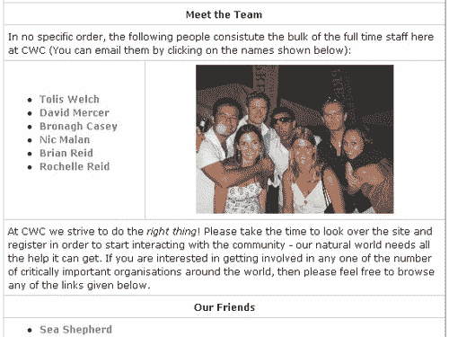

    +   在这个例子中，我没有对 bnmv.jpg 图片进行去色处理，因为我希望保留其质量以用于书籍——然而，你可能应该将图像大小控制在 10KB 以下。

        将这个屏幕截图显示的文件路径与代码中展示的文件路径进行比较（这些文件路径是在将文件的下载方法设置为公共时预期的）：

        src="img/bnmv.jpg" src="img/PacktLogosmall.png"

        注意，在代码中，我们只需要给出相对文件路径，而不是完整的路径。因为页面是从 drupal 目录中调用的，该目录包含文件目录，所以我们只需要从“files”开始显示文件路径和名称。

    ### 注意

    如果你发现，除了得到像这个演示中显示的文件路径之外，你还得到了像`http://localhost/drupal/system/files?file=PacktLogoSmall.png`这样的东西，那么这是因为你在**administer**菜单项下的**设置**菜单项的**文件系统设置**部分将**下载方法**设置为**私有**。

    这意味着文件被上传到文档根目录之外的地方（这在与**文件系统路径**相同的部分中设置），你需要输入完整的文件路径，而不是像我们在这里所做的那样简单地输入相对文件路径。

1.  对于像**关于我们**这样的页面，最好禁用评论，因为你真的希望这是一个独立的页面，不受社区其他人的任何辩论的影响。

1.  接下来，确保菜单设置适合你正在添加的页面。在这种情况下，我们已经设置了以下设置：

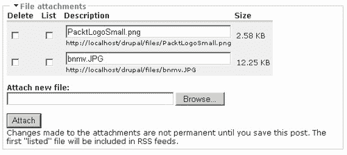

就这些！一旦你准备好查看页面，点击**预览**，如果一切看起来都正常，就提交它。如果有什么不对的地方，你可以很容易地再次编辑它；所以，在你查看网站上的页面之前，不必过于担心一切都要完美无缺。

因此，这个部分应该会让你觉得创建非常棒的网站页面非常容易。显然，如果你不熟悉 HTML 或 PHP，你需要对这些进行一些练习，但以下链接应该会给你一个好的开始：

+   [`www.php.net`](http://www.php.net)

+   [`www.phpbuilder.com`](http://www.phpbuilder.com)

+   [`www.htmlgoodies.com`](http://www.htmlgoodies.com)

+   [`www.w3schools.com`](http://www.w3schools.com)

现在你已经知道了如何发布和操作内容，学习如何对内容进行分类和组织非常重要，这样随着时间的推移，你网站上积累的信息档案就不会仅仅变成一堆未排序的杂乱无章的东西，而会变成一个直观且易于使用的资源。为了实现这一点，我们需要讨论……

# 分类

初看可能会觉得分类法和分类法是更多用作标志的术语，表明你的工作会因为某些原因而变得更加复杂。毕竟，设置一个网站设施以允许博客作者写博客、论坛发帖者发帖、管理员管理或任何其他类型的内容制作者制作内容并就此为止是完全合理的。就我们到目前为止所讨论的内容而言，这一切都是可能的，那么*为什么 Drupal 坚持要增加学习新概念和术语的负担呢？*

如果你知道你的网站永远不会收集大量内容，那么花时间与分类法等工作可能不会带来太多优势——你可以直接启用所需的任何内容类型，并让用户添加他们想要的任何内容。然而，我们的目标通常不是在创建网站时保持神秘，所以假设你希望吸引大量用户社区，你会发现 Drupal 中组织内容的方法使其成为最复杂的内容管理系统之一——绝非夸张！

抽时间掌握在 Drupal 中处理类别和分类法，因为这不仅可以帮助你更好地管理内容，而且由于内容的组织方式灵活直观，这也会让你的网站与众不同。你还会发现，你可以管理几乎任何大小可想象网站（以防你所做的工作成为*下一个大事件*），因为内容与术语和类别关联的方式。

## 什么是？为什么？

**分类法**被描述为分类的科学。在 Drupal 的应用中，它是指使用术语之间几种不同类型的关系来*组织内容的方法*。就这么简单！但这并不真正涵盖它的有用性，在我们继续之前，还有一些术语我们需要先了解：

+   **描述词**：用于描述内容的术语（也称为*术语*）

+   **词汇**：相关描述词的集合

+   **类别**：词汇的同义词

+   **同义词词典**：对内容的分类，描述了*相似于*的关系

+   **分类法**：将内容分类到层次结构中

+   **标签**：将术语（描述词）与内容关联的过程

+   **同义词**：可以将其视为当前描述词的*另一个词*

为了正确理解这些术语之间的关系，查看以下图表可能会有所帮助：

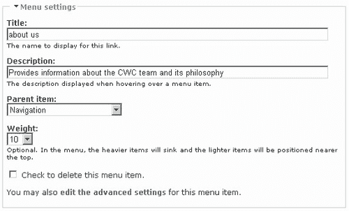

这有助于说明存在两种主要的词汇类型。每种类型都包含一组描述符，但它们之间的关系不同，因为分类法处理信息的层次结构，而同义词表处理术语之间的关系。描述符（以小框表示）及其关系（以箭头表示）在您使用的词汇类型中起着关键作用。

我们在讨论论坛模块时已经看到了一个分类法的例子。在这种情况下，论坛容器和它们包含的论坛主题之间存在一种层次关系。但是，我们为什么需要分类法呢？好吧，如果你正在创建一个科学文档，并且希望允许术语之间有大量的引用，以便用户可以浏览相关的页面，而这些页面不一定有父子关系，那么你就会选择这种结构。

因此，我们知道我们可以在 Drupal 中分类内容，但*这有什么用呢？* Drupal 分类系统之所以如此强大，其中一个原因就是它允许在创建内容时对其进行分类。这减轻了网站管理员在人力方面的负担，因为不再需要审核进入网站的每一块内容，以便将其放入预先确定的类别中。

还有可能对给定的节点进行多次标记。这意味着内容可以同时属于几个词汇表。这对于交叉引用非常有用，因为它通过实际节点突出了描述符或词汇表之间的关系。

## 在 Drupal 中实现分类法

讨论如何实现某种形式的分类的最佳方式是看到它在实际操作中的表现。正如你现在可能已经从 Drupal 中预料到的，有许多设置需要考虑，以便让一切正常运行。让我们假设 CWC 演示网站已经招募了大量专家，他们将在网站上维护自己的博客，以便有兴趣的各方可以关注知情人士的新闻。

现在，假设有些人会满足于访问他们选择的博客并阅读那里的任何新帖子，但有些人可能希望能够搜索特定主题，以查看博客作者在某些问题上的相关性或分歧。一旦网站运行了几个月，将会有大量的内容被发布，我们需要某种方式来确保特定主题易于查找，无论谁在他们的博客上讨论过它们。

### 词汇表简介

让我们快速讨论一下在管理工具中如何处理类别，以便确定如何确保满足这一要求。如果您点击“管理”下的**类别**链接，您将看到一个列出当前词汇的页面。假设您在上几章中创建了一个论坛，您应该会有类似这样的内容：

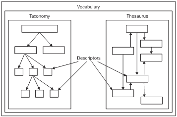

在我们查看编辑术语和词汇之前，让我们看看如何为自己创建一个词汇表。点击**添加词汇**标签页，将显示以下页面，我们可以使用它手动创建我们的第一个词汇表：

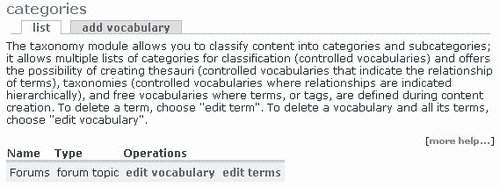

以为例，这个词汇表将处理狩猎主题，并有一些友好的说明来指导用户在提交博客条目时的意图。这仅适用于博客条目，因为这是唯一启用了此词汇表的内容（或节点）类型——您可以根据希望此词汇表应用于多少内容类型来选择多少或多少个。

查看页面下方，还有其他几个选项，我们将在稍后详细讨论。点击**提交**将此词汇表添加到列表中，因此主页现在看起来如下：


到目前为止一切顺利，但这样对我们来说并没有太大的用处！我们需要添加一些术语（描述符）以便开始标记。

### 处理描述符

点击**列出术语**，然后选择**添加术语**标签页，将显示以下页面：

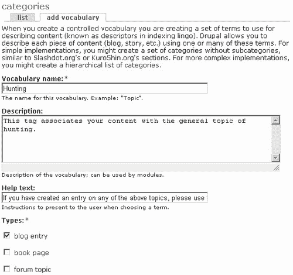

在这里添加了术语**捕获**，并附有对该术语本身的简要描述，这可以用来指导贡献者。如果我们选择，可以通过将其设为同义词来将术语**诱捕**与**捕获**关联起来。在这种情况下，术语**诱捕**（或您想添加的任何其他同义词）将被视为术语**捕获**。编辑术语**捕获**，使**同义词**选项看起来如下：

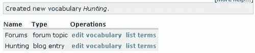

同义词目前实际上并没有什么有用的作用，除非您使用词汇表模块——虽然这里没有涉及，但您可以自由下载并尝试一下，以进行一些练习。向这个词汇表添加一些您选择的术语，使您的列表看起来如下：

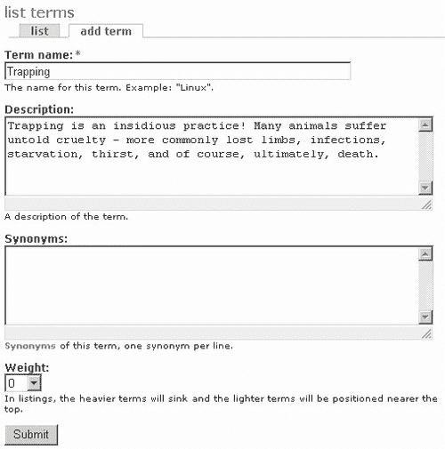

现在是时候通过发布一些博客内容来利用这些术语了。

### 启用类别发布内容

使用具有添加博客内容所需权限的任何账户，尝试向网站发布内容。现在您应该能够查看如所示的新增**类别**部分：

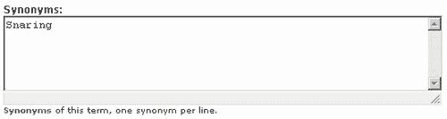

现在来谈谈真正真正聪明的地方！一旦这个博客节点被发布，用户可以像平常一样查看博客，但现在标题下方会显示其标记的描述符，如下所示：

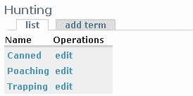

注意，有一个弹出窗口包含该术语的描述，如果用户将鼠标悬停在描述符的链接上，则会显示该描述。*说到这里，描述符链接会带我们去哪里呢？* 如果你点击术语，在这种情况下，**罐头**，你将被带到列出所有使用此术语标记的内容的页面。这应该会让你对使用 Drupal 感到非常兴奋，因为只需做很少的工作，用户现在就可以找到专注的内容，而无需那么努力地寻找——这正是内容管理的一切！

### 层次结构

我们迄今为止所看到的东西实际上只是冰山一角。正如你所想象的那样，你可以在词汇表中构建一个完整的术语层次结构，以给你一个相当复杂的分类法。记住，如果你正在构建一个层次结构，那么最广泛的术语应该位于堆栈的顶部，而更具体的术语则接近底部。然而，目前我们实际上并没有一个**层次结构**，而更多的是一个**扁平**结构。

*如果我们想要一组更具体的描述符，这可以让博主们标记他们的内容（例如，专注于特定类型的诱捕）呢？* 答案在于编辑词汇表以选择**层次结构**（在**分类**下）选项，如下所示：

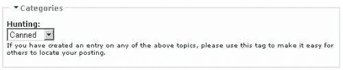

现在，如果我们想在我们的词汇表中添加一个名为**诱捕**的术语，特别是，在**诱捕**这个术语下，我们只需点击**添加术语**标签，并从现在应该可用的新的**父级**下拉列表中选择相关父项：

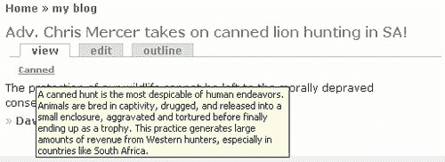

保存了这个新增项后，术语列表看起来是这样的：

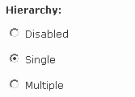

这相当容易做到，现在我们可以自由地通过在层次结构中正确位置添加术语来创建我们需要的复杂结构。你可能期望 Drupal 显示你一个层次结构的面包屑路径，但遗憾的是，这个功能目前还没有。虽然可以手动添加，但这需要一些 PHP 编码和对源文件的修改，这些超出了本书的范围。如果你感到好奇，可以看看[`www.greenash.net.au/posts/thoughts/basic_breadcrumbs_and_taxonomy`](http://www.greenash.net.au/posts/thoughts/basic_breadcrumbs_and_taxonomy)，它概述了将完整层次结构面包屑包含到你的内容页面中的过程。

但如果您的主题比简单的层次结构稍微复杂一些怎么办？例如，设陷也是常见的偷猎方法，因此它也应该出现在层次结构下的**偷猎**部分。通过在编辑您的词汇时在**层次结构**部分选择**多个**选项，可以轻松实现这一点。一旦保存此更改，您就可以通过在**编辑术语**页面的**父项**部分选择时按住**Shift**或**Control**键来编辑您希望归入多个类别的术语，如下所示：

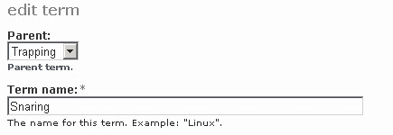

这样就解决了**层次结构**选项如何影响 Drupal 内容结构的问题。但故事还没有结束。

### 内容结构

*如果在我们演示网站的案例中，我们有**设陷**这个术语可用于标记内容（在这种情况下是博客文章），但有人实际上在谈论与狩猎完全不同的事情，并且恰好有一些内容重叠怎么办？*一个可能的场景可能如下所示：

+   几位专家被雇佣来维护关于非洲大陆的博客。

+   他们使用一个新的**非洲**词汇库标记他们的内容，该词汇库包含诸如**自然、瞪羚、捕食者、湖泊、河流、山脉、狩猎、天气**和**旅游**等术语。

+   您希望能够允许从非洲博客中创建的内容通过狩猎相关主题在**狩猎**专家博客中进行交叉引用。

为了实现这一点，有必要创建一个新的词汇库称为**非洲**。将此词汇库附加到博客内容类型，然后创建几个描述符，确保其中一个是**狩猎**，如下所示：

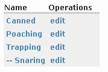

现在当用户尝试发布内容时，他们面前出现的是两个而不是一个选项来分类他们的内容，并且假设您已正确使用**权重**选项，您可以对您的标签应用一种层次结构。例如，一位**非洲**博客作者关于偷猎的博客文章可能看起来像这样：

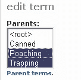

一旦将此内容发布到网站上，就可以在内容页面上查看两个类别，而不仅仅是其中一个。换句话说，节点已被标记为几个描述符，这被称为**分面标记**。基本上，分面标记使用一种*自下而上*的分类系统，其中内容的面或属性由术语描述。这样，可以创建一种非常直观的内容分类方法，而无需用户了解内容层次结构的自上而下的路径，以便找到他们想要的内容。讽刺的是，在这种情况下，这里使用的特定标记方法也有助于阐明术语的层次结构。

查看网站上的这篇帖子可以确认，用户现在可以通过点击帖子中提供的链接直接访问**狩猎**和**偷猎**类别页面。

在所有这些中，还有一些稍微微妙的东西。*你能看到吗？* Drupal 默认情况下，在撰写本文时，并没有提供分类的面包屑导航，这样我们就可以通过查看其内容类型来简单地查看任何分类的更高级别。然而，使用这种方法构建你的层次结构确实做到了这一点。看看我们刚刚提交的页面上的偷猎帖子：

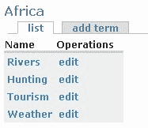

我们已经从**狩猎**词汇中了解到，它是**偷猎**的父类。然而，仅使用单个词汇，用户无法判断**偷猎**这个术语属于哪个类别。以这种方式操作，用户可以通过访问**狩猎**来有效地向上导航一个层级，或者通过访问**偷猎**保持在同一层级。但这也存在一个问题。

*如果某个狩猎博客作者只想发表一篇帖子并使用* **罐头** *这个来自* **狩猎** *词汇的术语进行标记，而不必首先指定这个内容也属于* **非洲** *词汇，会发生什么？* 答案再次在于编辑词汇页面，该页面底部有一个**必填**复选框。如果启用此选项，则发帖者必须选择至少一个标签，但如果我们不选择它，则发帖者可以选择是否包含该词汇中的术语。

谈到新选项，这里还有三个其他选项我们应该快速看一下。在撰写本文时，相关术语在标准 Drupal 网站上没有任何作用，尽管你可能想尝试使用*术语表*模块，该模块利用了这个功能。相关术语可以被视为*词汇级别*上的一种交叉引用——与*同义词*相对，后者在*术语级别*上工作。**自由标记**是一个有趣的选项，因为它允许发帖者自行决定他们内容的术语。例如，为**狩猎**词汇启用此选项意味着发帖者在创建博客条目时会被提供以下类别选项：

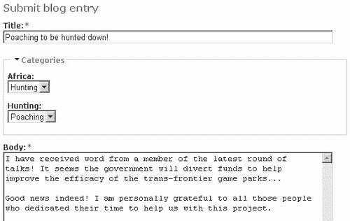

注意到**狩猎**类别上方有一个红色的上标星号。这是因为尽管我们使用的是自由标记，但**编辑词汇**页面上的**必填**选项仍然被启用——所以这里必须输入某些内容。其次，有一个包含所有可用标签的下拉列表（以你输入的字母开头）。这意味着，虽然人们可以自由输入自己的标签，但这并不像最初看起来那么随机，因为他们可以通过这个下拉列表得到关于已有标签的指导。这样，Drupal 可以鼓励更一致的描述符集合。

免费标签有一些优点，即它允许免费标签，因为人们可以真正地按照他们喜欢的任何方式标记他们的内容——使标记系统更紧密地适应内容。然而，问题是，你的词汇可能变得难以管理，因为类似的内容可能会被标记上完全不同的描述符，这使得用户难以找到他们想要的东西。如果你要允许这个选项，那么你应该确保使用这个选项的人意识到他们应该合理且尽可能统一地标记他们的内容。

无论如何，如果我们继续我们的狩猎帖子，我们可能会得到类似这样的内容：

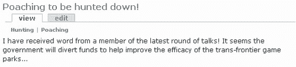

在这种情况下，我们已经为这篇博客条目添加了四个描述符；因此，当有人访问网站时，他们会看到与这篇帖子相关联的所有四个标签，如下所示：

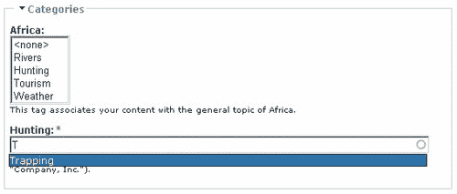

你应该注意这样一个事实，即使用免费标签系统无法创建术语的层次结构，因为每个新标签都与所有其他标签处于同一级别。所以你最终得到的是一个真正的同义词词典，而不是一个分类法。

这对于将内容用作参考资料的人来说非常有用，因为例如，如果他们点击了只标记了**夹具**的帖子描述符名称，那么显示所有与该标签相关帖子的页面无疑会显示我们刚刚添加的帖子。正因为如此，这个人能够看到**捕捉、熊夹**和**地雷陷阱**都是相关主题，并且能够通过从一篇帖子跳转到另一篇帖子来研究相关材料。

在**编辑词汇**页面上，我们可用的最后一个选项是**多选**。这与免费标签相关，因为如果你启用了免费标签，你可以为每篇帖子输入多个描述符——你只需用逗号分隔每个描述符即可。然而，如果你想允许内容有一个更类似于同义词词典的结构，而不启用免费标签，你只需启用**多选**，这将允许用户使用词汇创建者提供的所有描述符来标记他们的帖子。实际上，这在允许一些标记灵活性同时保持对内容标记控制方面是一个折中方案。

当启用**多选**并且禁用**免费标签**时，你将像之前在层次结构部分选择多个父项一样选择你想要为帖子添加的术语：

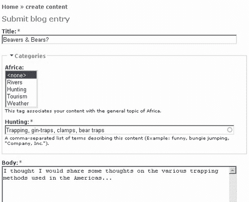

有了这些，我们就来到了分类讨论的结尾。正如我们在开始处理这个部分时提到的，可能需要一点时间来熟悉这些事情，因为 Drupal 中分类工作的方式是非典型的，并且并不明显直观。然而，一旦你掌握了它，你会发现你的内容可以轻松访问并且组织得很好，几乎不需要努力。

# 摘要

随着本章的结束，你可能会希望对创建一个功能齐全、内容导向的网站所面临的任务有一个良好的理解。如果你对 HTML 和 PHP 还不熟悉，那么我在继续下一章之前建议你花些时间学习一下 HTML。话虽如此，你已经看到了如何创建输入格式以允许不同类型的 HTML 或 PHP 内容进入你的帖子，以及如何创建一个相当不错的基于 HTML 的动态网页。

虽然这在创建一个美观的网站方面确实很重要，但你的内容管理课程真正的关键部分是在对分类的讨论中。Drupal 的分类系统使其区别于其他 CMS 技术，并提供了灵活性和强大的功能，以实现我们为内容想象中的任何类型的结构。有了像免费标签这样的强大功能，只需点击一下按钮即可使用，你就在控制着周围最好的系统之一。

尽管它很有用，但这并不意味着它容易，你无疑需要花些时间来实践这里讨论的内容。一旦你确信你已经按照网站的预期需求设置了事情，你也应该能够以最小的麻烦进行任何可能需要的修改。

在完成大部分艰苦的工作之后，我们可以将注意力转向创建 Drupal 网站最具创造性和，在我看来，最有乐趣的部分。下一章将讨论主题以及如何为新网站创建一个独特且吸引人的外观。
