# 第九章. 高级功能和修改

我们将首先查看一些模块的集合，这些模块展示了 Drupal 中一些更高级或有趣的功能，以便给你机会给你的网站添加一些*特别的东西*。无论是新类型的内容、一种从流量中赚取收入的广告策略，还是提供良好、动态内容的方式，你都应该在这里找到一些可以增加网站价值的东西。

然而，如果你需要的功能在默认发行版或任何模块中都没有提供，你并不完全处于不利地位。可能性是社区中的其他人之前已经不得不做类似的事情，你应该在论坛上得到一些有用的回应，解释至少你需要的部分。如果你在某个时候真的创造出了极其出色的事物，请通过与他人分享你的工作来回馈社区。

话虽如此，能够根据自己的需求对网站进行修改通常是很重要的。因此，我们将探讨一些有趣的装饰性代码，这些代码可以在互联网上免费获取。通过整合 JavaScript 和其他小型、实用的代码单元（通常称为小工具），你可以在不首先学习所有编程知识的情况下，完美地提升你的网站。

那么，就新模块而言，我们将查看以下内容：

+   Flexinode

+   广告联盟

第一个模块专门处理内容，而另一个模块则允许你将你的网站与另一个在线业务集成，即谷歌——希望可以赚一点钱。到本章结束时，你将成为使用稍微复杂一些的贡献的专家。

我们还将讨论一些更高级的界面修改。能够用你的网站做一些不同寻常的事情总是很有趣的，并且使用主题文件、HTML、PHP 和 CSS 进行工作，对于整个网络来说都是很好的训练，而不仅仅是 Drupal。这里的*高级网站修改*部分可能会给你一些关于你自己的网站的想法，同时也会给你一个关于实现它们的涉及范围的了解。

在我们开始之前，还有一件最后的事情需要记住，那就是你*必须，必须，必须*定期（最好是每次成功添加新功能时）备份整个网站，包括数据库。此外，在你开始处理它们之前，也应该备份你正在工作的每一页。关于备份的话题在接下来的*运行你的网站*章节中进行了讨论，我提到这一点是为了以防你觉得现在是时候在你开始捣鼓之前备份你现在拥有的内容了。

# Flexinode

在某个时候，你可能会发现现有的内容类型根本不适合你想要提供的内容类型。如果是这种情况，那么**Flexinode**贡献可能正是你所需要的。正如模块描述所说：

> Flexinode 是一个模块，允许非程序员在 Drupal 中创建新的节点类型（灵活的内容类型），当他们的需求不是很复杂时。用户可以为他们的内容类型定义节点编辑表单中的字段，并且可以选择以模块展示的方式查看节点，或者修改他们主题中的展示方式。

在演示站点的例子中，假设我们想要建立一个濒危动物的统计数据页面的数据库。在这种情况下，我们可以费心构建一个粗糙的 HTML 模板，并使用页面内容类型，将相关数据插入到表格的各个单元格中。然而，这将是一个痛苦的过程，因为如果有多个人发布这类信息，那么每个人都需要学习如何使用这个 HTML 模板。让我们看看 Flexinode 贡献如何在这里提供帮助。

## 下载和安装 Flexinode

现在这个过程对你来说应该很熟悉了；所以我们不会花太多时间仔细研究它。

### 注意

在撰写本文时，Flexinode 仍在为 4.7 版本兼容性进行升级——如果你打算在你的实际网站上使用它，请务必小心并确保获得一个合适且稳定的版本。

简单地访问 Drupal 网站，下载 Flexinode 模块的正确版本。将文件提取到你的 Drupal 安装中的`modules`目录，然后使用以下类似命令执行`.mysql`脚本（请记住修改文件路径以适应你的系统）：

```php
$ mysql udrupal p drupal < C:\apache2triad\htdocs\drupal\modules\flexinode\flexinode.mysql

```

当你登录时，系统会提示你输入密码，你可以通过登录到`mysql`命令行客户端并查找以下截图所示的新 Flexinode 表来确保相关表已被添加：

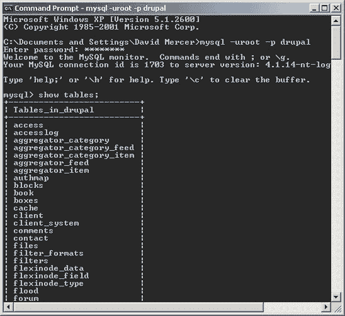

注意现在在`drupal`数据库中现在有三个`flexinode_`表。如果你不喜欢使用命令行，请记住你可以使用 phpMyAdmin 提供的可视化界面。

很有趣，这个贡献附带了一系列贡献！我的意思是，Flexinode 有一些默认未启用的附加功能。查看你的文件系统中的提取文件夹`flexinode`（位于`modules`目录下）。你会注意到有一个`contrib`文件夹，它包含一大堆`.inc`文件。

这些`.inc`文件中的每一个都负责提供与其名称相对应的功能。例如，`field_textarea.inc`提供了将文本区域包含到你的内容类型中的代码，等等。你也会注意到有许多 readme 文件可用，以帮助阐明相应的`.inc`文件的功能。例如，`README.colorpicker.txt`文件中有以下说明：

> 我希望这将有助于授予用户对其网站样式的控制权。我可以想象一个 flexinode，其中包含几个颜色选择器、选择框和复选框，可以用来覆盖特定用户的主题默认样式。

确保您阅读每个打算启用的`.inc`文件的 readme 文件，因为您可能需要先移动文件甚至安装其他模块。准备好后，转到浏览器中的**管理**下的**模块**部分，在点击**保存配置**之前启用 Flexinode 模块。

## 创建自定义内容类型

在**管理**部分下，导航到**内容**，您会注意到页面上显示了几个额外的与内容相关的标签页，允许我们指定和操作我们的新内容类型。点击**添加内容类型**标签页将显示一个类似于这样的页面：

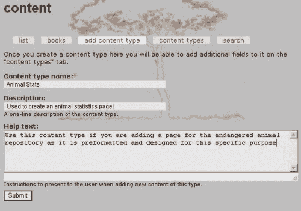

一旦**提交**，系统将自动带您进入**内容类型**页面，在那里您可以开始使用这里所示的新创建的类型：

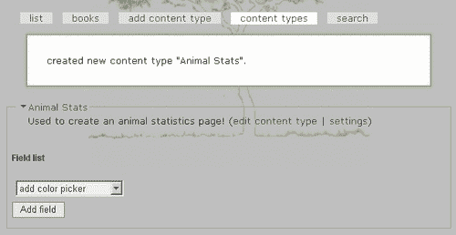

从这个点开始，您可以点击内容类型部分右上角提供的两个链接中的任何一个（在这个例子中，该部分标题为**动物统计数据**）。第一个链接**编辑内容类型**允许您更改您在创建内容类型时提供的任何信息——例如，您可能希望修改名称、描述或帮助文本。第二个选项允许您添加一些**提交指南**并配置如这里所示的标准**工作流**选项：

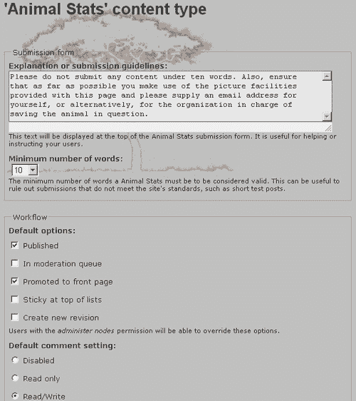

这些标准选项已经在之前的章节中进行了详细讨论，您真的需要根据您打算如何使用此内容类型来做出决定。就我们的目的而言，已启用文件附件（尽管这在屏幕截图中不可见），以便为任何声明提供证据。评论也被允许，以便人们能够协作确保事实正确且最新。

在处理完这两个选项之后，Flexinode 模块真正有趣和强大的部分就发挥作用了。**字段列表**为我们提供了指定多种不同类型输入的选项，这些输入随后被捆绑到整体内容类型中。现在，一开始这可能有点令人困惑，因为您需要记住，您是在指定制作内容所需的**内容**，而不是**实际内容**本身。

因此，在您开始在展示中添加不同的字段之前，仔细思考一下您希望您的特殊内容类型执行什么操作以及它应该看起来如何。一旦您对您要创建的内容有了清晰的想法，接下来进行构建就会容易得多。

## 添加结构

我们的**动物统计数据**页面应该是信息丰富且有趣的，为感兴趣的人提供全面且连贯的知识体系，有助于在读者的心中固定动物的形象、其概况及其困境。如果考虑这类页面可能需要包含的元素，以下内容可能适合：

+   简要介绍该动物

+   该动物的图片

+   对其当前状态的总结

+   该动物栖息地的地图

+   联系信息以及/或更多资源的链接

考虑到这一点，我们可以转向字段选择器，看看它提供了什么。由于我们希望在页面上首先展示的是一段文字，因此查找一个可以添加到页面顶部的文本区域是有意义的。在**内容类型**页面显示的下拉列表中选择此选项会弹出以下表单：

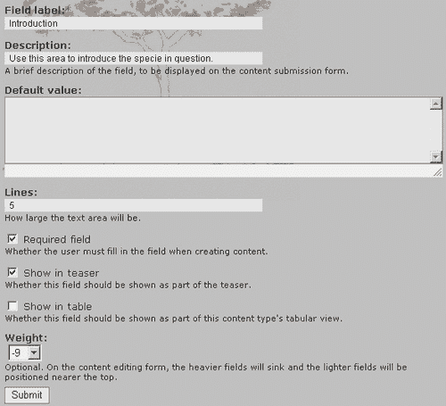

在这里，文本区域被设置为**必填字段**，因为任何想要添加**动物统计数据**页面的用户首先必须对动物有所描述——这是一个合理的假设！将此字段设为必填字段的优势在于，现在选择**在摘要中显示**（因为我们知道总会有一些简介文本）是个好主意。这意味着每当有人浏览**动物统计数据**页面时，他们都可以阅读摘要中的简介段落。

接下来，将**9**的权重分配给此字段，因为我们知道这个字段很可能始终显示在页面的顶部。同样，您可以根据页面的格式要求简单地挑选和选择其余字段。每个字段都有自己的考虑因素，您需要根据内容页的使用方式来设置。一如既往，如果事情没有按预期进行，很容易回来修改。

一旦所有字段都正确选择并设置到页面的正确部分，内容制作者就可以像使用任何其他节点一样使用该页面。就是这样！剩下要做的就是确保内容按预期工作，并且正确地履行其预期角色。由于我们已经讨论了如何使用其他内容类型，我们在这里不再进一步讨论。 

# AdSense

一旦您的网站上线并运行，如果希望有相当多的人访问，尝试通过广告赚取一些额外收入可能是个不错的选择。谷歌提供了**AdSense**广告方案，您只需将他们的代码片段粘贴到您的页面上即可添加可定制的广告块。您需要做的就是决定尺寸和颜色，以便与您的网站最佳融合，其余的由谷歌处理。

以这种方式操作虽然确实简单，但可能无法给您提供对广告的控制权，因此 Drupal 提供了一个**AdSense**模块来帮助。本节将探讨 AdSense 模块的工作原理，因为它提供了更多控制广告类型和显示时间的功能。

在我们开始之前，重要的是您需要在谷歌注册以获取账户和 ID，这些将被用于跟踪您的网站通过广告发送的流量。您可以直接访问 AdSense 网站：[`www.google.com/adsense/`](https://www.google.com/adsense/)。只需点击突出显示的**点击此处申请**按钮并按照指示操作。或者，您可以通过此页面上显示的推荐链接支持 AdSense 模块的开发者：[`baheyeldin.com/click/476/0`](http://baheyeldin.com/click/476/0)。

## 安装和配置 AdSense

AdSense 模块的安装过程非常简单，您不需要修改数据库或任何其他内容，只需将下载的文件复制到您的`modules`文件夹中。完成此操作后，您可以在**管理**链接下的**模块**部分启用该模块。

保存新模块的配置后，请转到**设置**并查找位于**设置**链接下方的新的**adsense**链接：

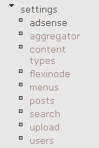

点击此处将弹出新的**adsense**配置页面，该页面还提供了一个链接到`admin/help/adsense`上的大量配置信息。您必须阅读与每个选项相关的说明，因为它们提供了有关可用广告类型、它们的尺寸以及模块如何实际显示广告的有用信息。

我们现在可以继续配置我们的广告，但请注意，一旦完成，我们仍需要手动将它们添加到网站上（在下一节中讨论）。实际的设置从以下开始：

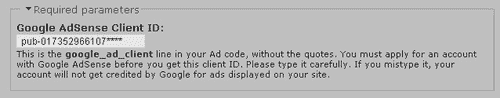

获得您的客户端 ID 后，您只需在此处输入它，通过您网站上的广告产生的任何流量都将为提供该 ID 的所有者（即您）带来收入。下一节允许您决定哪些页面应该能够显示广告，哪些不应该：

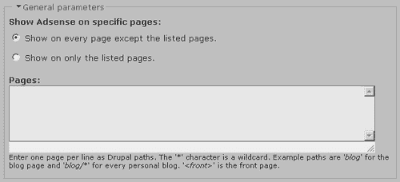

如您所见，您可以选择是否列出您可以在其上显示广告的所有页面，或者列出您不能在其上显示广告的所有页面。根据您网站的需要，您将需要选择其中之一，然后在您选择下方文本区域中添加适当的页面。

对于演示网站，我们很高兴在所有页面上展示广告，因此文本区域留空，有两个原因。一是网站上没有不适宜放置广告的部分，二是管理员根本看不到广告，所以我们不需要指定我们不想在管理页面上看到它们。

*但是，我们能够展示的广告类型有哪些呢？* 好吧，以下表格显示了您可用的各种选项：

| 广告类型 | 尺寸 |
| --- | --- |
| 广告链接 4 链接 120x90 | 120x90 |
| 垂直横幅 | 120x240 |
| 摩天大楼 | 120x600 |
| 按钮广告 | 125x125 |
| 半横幅 | 234x60 |
| 广告链接 4 链接 160x90 | 160x90 |
| 宽屏摩天大楼 | 160x600 |
| 广告链接 4 链接 180x90 | 180x90 |
| 大型矩形 | 336x280 |
| 横幅广告链接 4 链接 | 468x15 |
| 横幅 | 468x60 |
| 宽横幅广告链接 4 链接 | 728x15 |
| 横幅广告 | 728x90 |

*为什么有这么多不同类型的广告呢？* 你可能会问。原因通常是在网页上适合广告的空间有限。例如，你可能会发现网站左侧列有一些空间，在这种情况下，你需要一个长条形的广告。当然，你也可能想在页面底部展示广告，这时你想要一个长横幅广告。

你可能同时需要这两种类型的广告，在这种情况下，使用分组来区分不同类型的广告就很重要了。根据广告在页面上的位置，你可能需要指定不同的颜色，甚至完全不同类型的广告——所有这些都可以通过使用分组来处理。

在**广告类型和颜色**部分下的一个分组设置示例如下：

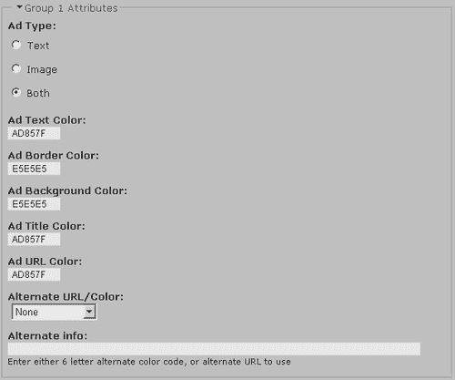

这里选择的颜色使得展示的广告与网站融为一体，看起来像是页面布局的自然部分。根据你放置广告的位置，你可能需要调整颜色设置，以确保一切看起来整洁有序。

你可以同时设置最多三个分组，所以不要觉得只能使用一个。你可能会决定在一个区域展示仅包含图片的广告，而在另一个区域展示文本广告——在这种情况下，你必须使用不同的分组。

以下选项涉及**自定义频道**，你需要在你的*Google AdSense*账户中了解它们才能使用。网站对此有这样的说明：

> 自定义频道允许你根据指定的标准跟踪性能。通过将特定频道的广告代码粘贴到你的页面上，你可以跟踪一系列 URL 上的各种指标。使用自定义频道来跟踪不同广告格式的性能，例如，或者比较不同页面主题之间的差异。

这需要您自己研究，因为这是一个与谷歌相关的问题，而不是 Drupal 的问题。一旦您创建了一些频道，在**广告设置页面**的**自定义频道**部分实现它们就很简单了。

**收入分成选项**是一个非常有用的工具，因为它允许您将 Google Ads 产生的收入的一部分分配给包含广告的页面的作者。换句话说，您现在可以使用广告收入作为鼓励博客作者写博客、故事作者写故事等方式，因为他们现在有了一个利益，那就是尽可能使他们的内容流行，以便尽可能多的流量流过他们的帖子。

不幸的是，如果您决定使用收入分成，那么您需要回到 Drupal 网站下载**用户推荐**模块的适当版本，因为这是为了使 AdSense 模块的功能正确工作所必需的。您应该会发现安装模块很容易；必须运行一个 MySQL 脚本，但请记住，我们在前面的章节中已经这样做过了。

一旦安装并启用了用户推荐，您需要在**管理**下的**访问控制**部分设置可以**使用推荐**的角色。然后您必须在**设置**下的**配置文件**页面创建一个新的**配置文件**字段，以便用户可以在他们的**我的账户**部分输入他们的 Google AdSense 客户端 ID。为了做到这一点，您首先需要启用**配置文件**模块（它是核心分发的一部分，因此不需要下载）。

在这种情况下，您应该选择一个**单行文本字段**，并像这里所示提供一些信息丰富且合理的选项：

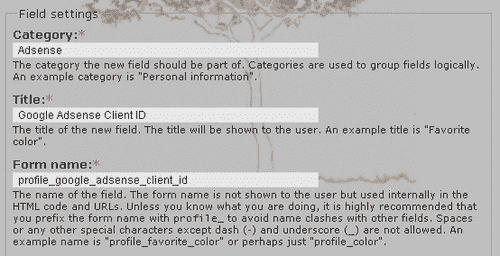

现在当用户查看他们的账户信息（或者甚至在注册时，这取决于是否在**配置文件**部分启用了它），他们有一个文本区域，可以在其中输入他们的 Google AdSense ID：

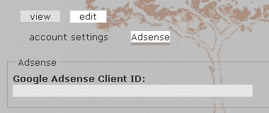

在一切设置正确后，为演示网站设置了以下以收入为导向的设置：

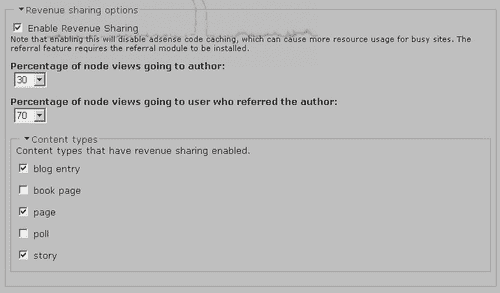

在这种情况下，内容的作者将获得从他们内容产生的流量的 30%的收入，但只有博客、页面和故事符合潜在的收入分成内容——那些在调查和书籍页面上工作的人，很遗憾，无法获得。请记住：

### 注意

任何希望从收入分成中受益的用户都必须有自己的 Google 账户，并在他们可以因收入分成而获得信用之前，需要在他们的配置文件中提供他们的 Google 客户端 ID。

最后，**高级选项**允许您指定是否禁用广告、显示占位符、限制每页广告的数量，或者**启用 AdSense 部分定位**，如下所示：

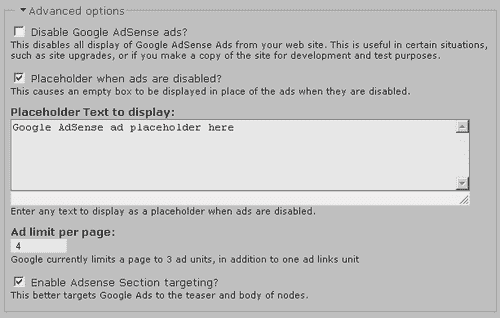

总是保持占位符启用是个好主意，因为这允许您在以管理员身份登录时跟踪您的广告位置。每次您更改广告位置时，都需要登录和注销可能会相当耗时，但通过查看占位符，就像这里所示，知道它们的位置是足够简单的：

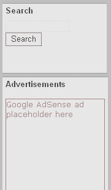

最后一个值得关注的项目，**章节定位**，是一个如这里定义的谷歌相关功能：

> 章节定位允许您建议您希望我们强调或降低的文本和 HTML 内容部分，以便在匹配您的网站内容时。通过向我们提供您的建议，您可以协助我们改进您的广告定位。我们建议只有熟悉 HTML 的人尝试实现章节定位。

在我们的情况下，我们不需要做任何事情，因为该模块会自动将谷歌广告定位到节点的标题和正文中。只需启用它，就可以继续前进！

完成配置组和类似操作后，点击**保存配置**。然后是时候实际利用这些配置选项，通过在网站的页面上物理插入广告来使用它们。

## 将谷歌广告添加到您的页面

在我们的情况下，我们希望显示一个广告，它位于页面左侧的任何其他块下方。这样做的原因是右侧边栏已经相当满了，而左侧边栏则稀疏，所以这里有空间。虽然这个广告将位于一个块中，但我们也会展示如何直接将广告添加到网站上。

让我们从块开始…

您已经看到了如何创建一个新的块；所以如果您想这样做，请转到**块**链接，并点击**添加块**标签来打开以下页面：

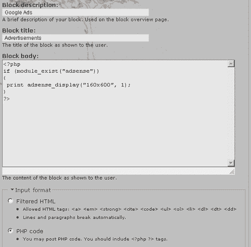

在这里，我们给块起了一个新的标题，不出所料，是**广告**（在块列表中显示的描述是**谷歌广告**）。接下来，我们输入了一些 PHP 代码来在块中显示谷歌广告。如果您想知道我是如何得到这段代码的，它都在之前提供的**adsense**配置页面上的注释中讨论了。这里要注意的重要事情是`adsense_display`函数，因为它通过您在**adsense**配置页面（在上一节中讨论）中设置的设置来控制您的广告外观。

上一张截图展示了该函数的简单用法，但让我们快速详细地看一下，以便您了解在需要稍微复杂一些的功能时它是如何工作的。从文档中，我们可以看到`adsense_display`函数接受以下三个参数：

+   **格式**：这是一个由一个`x`连接的两个数字的字符串。它可以是从提供的列表中的任何有效组合。如果没有指定，则默认为`160x600`。

+   **组**：这是表示广告类型（文本或图像）和颜色的组。这可以是`1, 2`或`3`。如果没有指定，则默认为`1`。

+   **频道**：这是在 AdSense 中配置的广告的定制频道。这是一个可选参数，如果没有指定，则默认为`1`。如果您没有配置任何频道，则可以省略此参数。

了解这一点，您可以看到在先前的屏幕截图中，我们请求了一个`160x600`像素的广告，并且该广告应属于组`1`。最后一个参数是可选的，因为我们不关心自定义频道（这是一个更高级的选项，我们将其留给您在未来您的广告政策变得更加复杂时考虑），所以我们完全省略了它。

需要注意的最后一件事是我们将**输入格式**设置为**PHP 代码**，以便 Drupal 能够实现我们为块输入的代码。一旦这个块成功添加到系统中，我们给它一个高权重（因此它会在其他所有内容之后显示）并在左侧边栏中启用，如图所示：

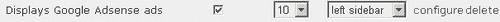

这就是全部内容！结果可以通过注销并查看页面来查看。在我们的情况下，由于我们在配置部分所做的设置以及我们指定的尺寸，我们在左侧边栏中得到了以下块显示：

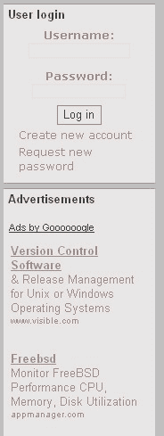

这看起来相当不错！*但我们如何直接将广告添加到页面上呢？*很简单！打开`page.tpl.php`文件，在您想要的位置插入`adsense_display`函数，如图所示：

```php
<div id="footer">
<?php if ($footer_message) : ?>
<p><?php print $footer_message;?></p>
<?php endif; ?>
<?php
if (module_exist("adsense"))
{
print adsense_display("468x60", 2);
}
?>
Validate <a href="http://validator.w3.org/check/referer">XHTML</a> or <a href="http://jigsaw.w3.org/css-validator/check/referer">CSS</a>.
</div><!-- footer -->
<?php print $closure;?>
</body>
</html>

```

这段代码创建了一个长而平的横幅，其属性在第二个属性组中配置（您需要确保您已做了适当的设置，或者更改组）。在网站上查看时，我们得到以下广告（在这种情况下，组 2 被配置为显示图像广告）：

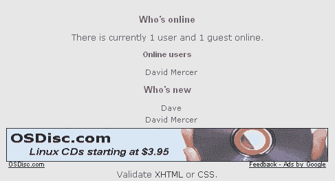

重要的是要记住，您实际上不需要 AdSense 贡献来在您的网站上显示谷歌广告。实际上，如果您没有使用 PHPTemplate 主题，或者试图在模板的某个区域插入 PHP 代码，并且该区域无法使用它，您可能会遇到问题。如果您遇到问题，您可以查看以下几件事情：

+   确保您没有以管理员身份登录，因为只有对于此用户，广告占位符才会显示。

+   检查您页面的源代码以查看`adsense_display`函数的结果。

+   检查您是否为您的广告设置了有效的尺寸——请参阅本节标题为*安装和配置 AdSense*中较早提供的表格。

+   确保您能够显示所需的广告数量——可能在这方面您有所限制。

列表中的第二点相当重要，因为查看页面源代码可以告诉您很多关于可能出错的信息。为了做到这一点，在 IE 中点击**查看**，然后点击**源代码**，或者在 Firefox 中点击*Ctrl+U*，您应该会看到如下内容（假设一切按计划进行）：

```php
<div class="adsense">
<script type="text/javascript"><!--
google_ad_client = "ca-ref-pub-0173529661****";
google_ad_type = "image";
google_ad_channel = "";
google_ad_width = 468;
google_ad_height = 60;
google_ad_format = "468x60_as";
google_color_border = "E5E5E5";
google_color_bg = "E5E5E5";
google_color_link = "AD857F";
google_color_url = "AD857F";
google_color_text = "AD857F";
//--></script>
<script type="text/javascript"
src="img/show_ads.js">
</script>
</div>

```

如果出了问题，那么您很可能会从添加到谷歌广告代码中的注释或从源代码中实际呈现的内容中找到问题。

在开发机器上遇到广告问题可能不是世界末日；无论如何，检查论坛以获取答案。然而，在您在您的实时网站上尝试了一切并允许谷歌有足够的时间爬取您的网页之前，不要过于恐慌。在此期间，谷歌可能没有显示广告，因为它不知道您的网站是关于什么的。

## 将谷歌广告添加到您的内容中

也有一种方法可以直接将广告插入到您的内容中。例如，如果您想在内容中显示广告，您首先需要启用**广告联盟过滤器**，通过在**管理**下的**输入格式**中进行修改，修改现有的输入格式或创建一个新的格式。例如，**广告联盟过滤器**已在**完整 HTML 输入格式**中启用，如下所示：

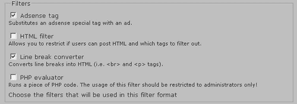

现在，当添加使用**完整 HTML**输入格式的内容时，可以添加一个`adsense`标签，并且**完整 HTML**选项有一行额外的信息说明如何使用它，如下所示：


添加包含谷歌广告的页面是一个简单任务。只需将正确的格式、组和通道插入到您的`adsense`标签中，并将其添加到您帖子中的任何位置：

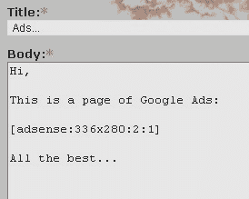

`adsense`标签有特殊的格式，如下所示：

```php
[adsense:format:group:channel]

```

其中：

+   `format` 是支持的广告格式之一（例如，`468x60`）

+   `group` 是该广告所属的数字广告组；决定颜色

+   `channel` 是数字广告通道

登出后查看此页面会得到以下结果（取决于您为从标签引用的相关组设置的设置）：

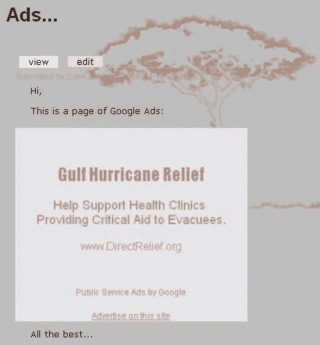

与`flexiblocks`一起使用时，也有一种特殊的格式：

```php
[adsense:flexiblock:location]

```

我们在这里不讨论**Flexiblock**的使用，因此我们现在不会深入讨论，但作为一个练习，您可能会发现下载并安装 Flexiblock 贡献并尝试它是有价值的。

# 高级网站修改

与基于 PHP 的应用程序（如 Drupal）一起工作的一个好处是，它们不仅开源，而且你可以将它们与几乎所有你能接触到的其他技术结合起来。有一个庞大的在线编程社区，许多人将他们整洁的小脚本公开提供给像我们这样的人，以便我们可以随意将其包含到我们自己的网站中。并非所有都是免费的，但许多是，而且更多是非常便宜的；因此，总是值得四处看看，看看你能学到什么。

这里有一些你应该考虑查看的网站：

+   [`www.phpbuilder.com`](http://www.phpbuilder.com)

+   [`www.hotscripts.com`](http://www.hotscripts.com)

+   [`www.php.resourceindex.com`](http://www.php.resourceindex.com%)

+   `http://drupal.org/node/257—Customization`

在本节中，我们将查看哪些内容可用，以及哪些可以轻松集成到 Drupal 网站中。你们中许多人可能在这个时候会退缩，因为你们并不热衷于参与核心 PHP 编程。不用担心！这些脚本基本上是自主和完整的，所以我们需要的只是正确位置的一些剪切和粘贴，可能还有一些微调，然后就可以出发了。记住：

### 注意

添加强大和高级功能，就像在大网站上看到的那样，*并不那么困难！*

重要的是要意识到，在利用他人的脚本时，你应该始终关注任何和所有的许可问题。你会发现，许多脚本免费提供给非商业用途，但如果你用于商业目的，则需要购买许可证。然而，随着你对脚本工作的信心增强，你应该会发现，通过使用自己的代码或结合免费提供的代码片段，可以构建相当强大的功能。

由于即将进行的修改基于 JavaScript 和 AJAX，因此提醒你，Drupal 4.7 自带通过`drupal.js`文件对 AJAX 的支持。AJAX 是一个术语，用于描述用于创建响应性和动态网页元素的基于 JavaScript 的应用程序。然而，本章的目标是向您展示如何在不学习任何编码的情况下真正地集成一些很棒的功能。因此，我们不会讨论如何使用`drupal.js`中提供的 JavaScript 功能，因为这实际上是一个开发者的任务，而不是网站管理员的任务。

如果你感兴趣于创建自己的 AJAX 小部件，请查看 Drupal 网站上提供的在线教程，网址为`http://drupal.org/node/42403`。这些教程将给你一个很好的想法，在需要自己构建一些小部件的情况下，从哪里以及如何开始。你自行进行的任何与 JavaScript 相关的开发都应该使用 Drupal 的本地 JavaScript 支持。

### 注意

本章后面所涵盖的内容有点像作弊——我们得到了一些不错的 JavaScript 特效的好处，而不必承担学习如何编码它们的负担。

许多新模块或升级模块已经（并且正在）使用 AJAX。你可能想下载并安装其中的一些，看看使用 Drupal 的原生 JavaScript 支持可以实现哪些效果。当然，Drupal 4.7 的管理界面已经通过引入可折叠页面区域等（例如，在**设置**页面）进行了 AJAX 化。

无论如何，让我们看看我们将要添加的第一个新功能。

## 滚动新闻提示器

这是许多试图为用户提供最新信息的网站的一个很好的功能。如果你需要同时展示几条信息，那么一个动态新闻提示器可能正是你所需要的。通过一点工作，你甚至可以将新闻提示器与 RSS 源集成，以展示来自其他网站的最新消息，而无需自己创建任何内容。

我们将保持简单，并在网站的每个页面的顶部创建一个滚动新闻提示器。提示器将显示存储在网站上的 `.txt` 文件中的信息。虽然从截图上你看不出这些信息正在屏幕上滚动，但最终添加的效果就是这样：

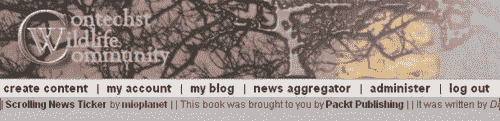

你应该可以从上面的提示器中显示的各种字体中看出，可以添加 HTML 元素，如链接到各个项目（以粗体显示）。这意味着你可以使用这个提示器添加赞助商的链接，甚至添加图片链接。有很大的改进空间；因此，我们将看看如何让一切运行起来——你使用提示器创建的内容，然后取决于你和你自己的想象力。

### 获取提示器

第一项任务是当然要找到可行的提示器脚本。在这种情况下，通过在 Google 上简短搜索后，从 **mioplanet** 网站下载了一个免费的提示器脚本，网址为 [`www.mioplanet.com/ rsc/newsticker_javascript.htm`](http://www.mioplanet.com/ rsc/newsticker_javascript.htm) 。该页面上提供的使用条件相当简单，你应该在继续之前确保你理解了这些条款。假设你愿意继续，下载名为 `webticker_lib.js` 的 JavaScript 源代码文件，并将其保存到你目前正在开发的主题文件夹中——在演示网站上，这目前是 `box_grey_dev`。

### 注意

如果你打算使用几个这样的小部件，最好在你的主题中创建一个 `widgets` 文件夹，以便保持一切整洁有序，并且易于查找。

接下来，打开 `page.tpl.php` 文件，并寻找添加股票报价的合适位置。将股票报价添加到网页所需的实际代码在 mioplanet 页面上给出，你可以直接将其复制粘贴到你的网站上。由于我想让股票报价出现在屏幕顶部，我在这里添加了代码：

```php
<?php if (count($primary_links)) : ?>
<ul id="primary">
<?php foreach ($primary_links as $link): ?>
<li><?php print $link?></li>
<?php endforeach; ?>
</ul>
<?php endif; ?>
<DIV ID="TICKER" STYLE="overflow:hidden; width:100%" onmouseover="TICKER_PAUSED=true" onmouseout="TICKER_PAUSED=false">
<? include "ticker.txt"?>
</DIV>
<script src="img/webticker_lib.js" language="javascript"></script>                            
</div>
<table id="content">
<tr>
<?php if ($sidebar_left != ""): ?>
<td class="sidebar" id="sidebar-left">
<?php print $sidebar_left ?>
</td>

```

如你所见，这把脚本放在了同一 `<div>` 标签内的头部信息之后，但在包含主要内容以及左右侧边的表格之上。

这个脚本最重要的部分是对 `webticker_lib.js` 文件的引用。在这个例子中，我添加了文件的相对路径（webticker_lib.js），这样一旦网站部署到主机服务器，这个路径就不需要更改了。

如果你发现你的滚动股票报价根本不滚动，尝试用相对文件路径引用它，例如：`/drupal/themes/box_grey_dev/webticker_lib.js`。在不太可能的情况下，如果这不起作用，尝试使用完全限定的路径：`C:\\apache2triad\\htdocs\\drupal\\themes\\box_grey_dev\\webticker_lib.js`。如果这行得通，记得在某处写一个笔记，提醒你在将网站部署到实时主机后适当更改此路径。通常来说，在脚本中包含这样的绝对文件路径是一种**不好的做法**，正是因为这个原因。

### 注意

如果你必须输入路径而不是仅仅文件名，在 Windows 系统上，用另一个反斜杠（\\）转义反斜杠是一个好主意，以防止特殊字符被错误解释——或者，你也可以使用正斜杠。

最后，请注意，我在第一个添加的 `<div>` 标签下添加了一个简短的 PHP 片段，用于包含一个名为 `ticker.txt` 的文件。如果你想在处理额外的代码之前测试股票报价是否正常工作，那么替换：

```php
<? include "ticker.txt"?>

```

用：

```php
Hi! You should see me scrolling across your page.

```

在浏览器中查看你的网站。你应该会看到消息在页面上滚动，就像这样：


如果这行得通，就用 PHP 的 `include` 语句替换文本消息，然后继续。

### 创建内容

对于我们谦逊的目的，我们真正需要做的只是将我们刚刚安装在我们网站上的 JavaScript 文件喂给一个要打印到屏幕上的行列表。假设我们将使用一个简单的文本文件来保存我们的数据，我们需要每个单独的项目都在一行中完整显示。如果你想要制作复杂的滚动项目，这可能会有些限制，但就我们演示的目的而言，这已经足够了。你几乎可以在这里添加任何你想要的东西；然而，在发布给公众之前，确保彻底测试一切。

现在创建一个`ticker.txt`文件，并将其添加到与`webticker_lib.js` JavaScript 文件相同的文件夹中。在你开始向其中添加信息行之前，请记住，你应该尝试为每个新闻条目创建一个标准格式，这样你创建新元素的工作量就会最小化。在这种情况下，每一行由一个单独的竖线分隔，除了第一个和最后一个元素，它们有两个竖线，以便保持整体的一致性。

以下代码片段显示了演示网站上`ticker.txt`文件的当前内容。这些是用于*滚动新闻条*部分第一张截图中的滚动文本的项目：

```php
|| <a href="http://www.mioplanet.com/rsc/newsticker_javascript.htm" target="_blank"><strong>Scrolling News Ticker</strong></a> by <a href="http://www.mioplanet.com" target="_blank"><strong>mioplanet</strong></a> |
| This book was brought to you by <a href="http://www.packtpub.com" target="_blank"><strong>Packt Publishing</strong></a> |
| It was written by <em>David Mercer</em> of <a href="http://www.contechst.com" target="_blank"><strong>Contechst Technical & Editorial Consultancy</strong></a> ||

```

不幸的是，由于本书页面大小的限制，本应作为*单行*显示的内容不得不在*多行*中呈现。然而，你应该明白的是，你可以在条目的开始和结束处添加某种分隔符，在这些分隔符内，你可以添加你喜欢的任何 HTML。你可能甚至想尝试在样式表中添加图像或特殊样式，并从这里引用它。这样，你可以在每个条目中添加一个高亮标题图标或徽标，例如。

你会在本章稍后注意到新闻滚动条得到了一个漂亮的新背景颜色。如何实现这种外观留给你作为练习。提示：*遵循主题的相同方法并声明一个新的* `<div>`

这个脚本目前的主要问题是它要求你手动输入每个条目，这无疑会成为如果你每天要重复做十年之久的痛苦。有几种方法可以解决这个问题：

+   创建一个脚本从数据库中提取信息。

+   从 RSS 源获取信息。

+   只输入不经常变化的内容——例如，赞助商的链接。

+   让别人为你做这件事。

虽然我们在这里不会继续这个话题；尝试之前列表中的任何一个或多个选项（除了第三个，它默认已覆盖）将是一次很好的经验。记住，你可以使用其他脚本帮助你——无论你在网上找到什么，都可以将其纳入你的脚本中。无论如何，让我们继续下一件事。

## 动态内容页面

假设你是你新网站的负责人，想要添加一个页面来概述你生活中以及你所在社区的最新和最精彩的内容、事件和动态。在演示网站的情况下，我们将向主菜单添加一个**快速选择**页面链接，人们可以快速访问，选择网站上最新和最重要的动态——例如，每周更新一次。

现在，有很多模块允许您显示相关帖子块等，但这并不是我们想要的。理想情况下，我们希望展示一个允许用户选择感兴趣主题的项目列表。同时，我们不想让他们不得不从一个节点跳转到另一个节点来查看每页的内容。

我们需要的是一种只重新加载新文章而实际上不改变我们所在页面的方法。再次强调，这可以通过使用已经开发的脚本轻松实现。在这种情况下，我们将使用一个免费可用的 **动态 AJAX 内容** 脚本，由 DynamicDrive DHTML Scripts 的人士提供，网址为 [`www.dynamicdrive.com`](http://www.dynamicdrive.com)。

### 将应用程序集成到主题中

在这个例子中，我们将使用 DynamicDrive 提供的 JavaScript 文件，并将其直接粘贴到 `page.tpl.php` 文件中的 `<head>` 标签之间。您可以在以下地址获取特定的脚本：`http://www.dynamicdrive.com/dynamicindex17/ajaxcontent.htm`。现在，您是否真正理解脚本中的内容并不重要；然而，我们将拆分代码列表，并快速查看它正在做什么，以便更清晰地理解。

一旦您复制了脚本，将其粘贴到 PHP 文件中，如下所示（我已经为了节省空间而删除了一些实际代码文件）：

```php
<!DOCTYPE html PUBLIC "-//W3C//DTD XHTML 1.0 Transitional//EN"
"http://www.w3.org/TR/xhtml1/DTD/xhtml1-transitional.dtd">
<html  lang="<?php print $language ?>" xml:lang="<?php print $language ?>">
<head>
<title><?php print $head_title ?></title>
<meta http-equiv="Content-Style-Type" content="text/css" />
<?php print $head ?>
<?php print $styles ?>
<script type="text/javascript">
/***********************************************
* Dynamic Ajax Content- © Dynamic Drive DHTML code library (www.dynamicdrive.com)
* This notice MUST stay intact for legal use
* Visit Dynamic Drive at http://www.dynamicdrive.com/ for full source code
***********************************************/
var bustcachevar=1 //bust potential caching of external pages after initial request? (1=yes, 0=no)
var loadedobjects=""
var rootdomain="http://"+window.location.hostname
function ajaxpage(url, containerid){
var page_request = false
if (window.XMLHttpRequest) // if Mozilla, Safari etc
page_request = new XMLHttpRequest()
else if (window.ActiveXObject){ // if IE
try {
page_request = new ActiveXObject("Msxml2.XMLHTTP")
}
catch (e){
try{
page_request = new ActiveXObject("Microsoft.XMLHTTP")
}
catch (e){}
}
}
else
return false
page_request.onreadystatechange=function(){
loadpage(page_request, containerid)
}
...
function loadpage(page_request, containerid){
if (page_request.readyState == 4 && (page_request.status==200 || window.location.href.indexOf("http")==-1))
document.getElementById(containerid).innerHTML=page_request.responseText
}
...
if (fileref!=""){
document.getElementsByTagName("head").item(0).appendChild(fileref)
loadedobjects+=file+" " //Remember this object as being already added to page
}
}
}
</script>                          
</head>
<body <?php print theme("onload_attribute"); ?>>
<div id="header">
<?php print $search_box ?>
<?php if ($logo) : ?>

```

从这段代码中，您应该能够了解到一旦脚本被声明，我们使用一个名为 `ajaxpage` 的函数来创建一个可以加载到我们父网页特定容器中的新页面。这个函数会检查正在使用的浏览器，并尝试确保为调用浏览器创建正确的 `page_request` 对象，以便实现一些跨浏览器兼容性。

然后，使用 `loadpage` 函数加载一个新页面，该函数在填充文档容器（ID 为 `containerid`）之前，对新创建的 `page_request` 对象进行一些检查。`containerid` 在即将到来的页面代码中指定，但显然非常重要，因为它*决定了新信息将加载到父页面的哪个位置*。

只需再次强调，您不需要理解这些脚本是如何工作的。它们有点像汽车的引擎——即使不知道它具体是如何工作的，您也可以驾驶它。话虽如此，JavaScript 是一个非常宝贵的工具，随着 AJAX 技术的出现，用于创建响应式网页，学习这些脚本所花费的时间不会白费。

### 注意

记住，如果您想创建自己的小部件，学习如何利用 Drupal 内置的 JavaScript 支持是很有必要的。

在您的页面上添加了这些函数后，艰苦的工作就完成了！我们现在需要关注的是如何在发布到 **快速选择** 页面时利用它们。

### 构建内容页面

构建一个新的动态页面，我们只需要记住几个重要的点。首先，我们需要实际上将我们要添加的页面附加到帖子中；否则，我们将无法将它们添加到页面中。接下来是实际上用`containerid`标签标记页面的一部分。

实际上，在我们有一些内容可以与之搭配之前，我们不应该开始构建页面。因此，为了这个演示的目的，我们将添加几页有趣的内容。第一页是一点新闻：

```php
<table border="0" cellpadding="5">
<tr>
<td align="center" colspan="2">
<strong>Latest News</strong>
</td>
</tr>
<tr>
<td colspan="2">
The Contechst Wildlife Community was praised for its unswerving
dedication to animal rights in a television interview last night.
<br> The project founder said he thought we did a great job when
asked by the reporter!
</td>
</tr>
<tr>
<td align="center" colspan="2">
<em>Sponsored By</em>
</td>
</tr>
<tr>
<td align="center" colspan="2">
<a href="http://www.packtpub.com" target="_blank">
</a>
</td>
</tr>
</table>

```

这个页面以日期和文章类型为前缀——在这种情况下，它在文件系统中被保存为`09_02_news.txt`。这样做的原因是，当文件附件上传并附加到帖子时，你仍然需要在需要删除时能够清楚地看到哪些材料是最过时的。下一个文件只是一些普通的内容，我们不会在这里列出。

现在，让我们转到**创建内容**页面，并添加一个名为**快速选择**的新页面。我们必须做的第一件事是将两个内容文件附加到这篇帖子。一旦完成，确保你取消选择两个的**列表**选项。如果保留这些文件在列表中，将完全违背页面的目的。接下来，最重要的事情是注意 Drupal 保存的文件名。你可以在以下**文件附件**部分检查这些文件名：

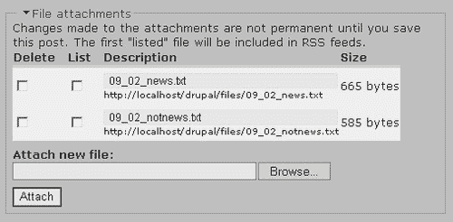

从之前的屏幕截图可以看出，两个文件已经被保存为`09_02_news.txt`和`09_02_notnews.txt`在`files`目录中。

在页面主体中，我们需要创建一些链接，这些链接将调用我们之前添加到`page.tpl.php`文件的`ajaxpage`脚本函数。以下 HTML 被添加到**快速选择**页面的正文文本区域：

```php
<table border="0">
<tr>
<td colspan="2" class="body" width="100%">
<strong>Please select a link below to view that article:</strong>
<hr>
</td>
</tr>
<tr>
<td class="body" valign="top">
<br>
<a href="javascript:ajaxpage(‘/drupal/files/09_02_news.txt', ‘contentarea');">Latest News</a>
<a href="javascript:ajaxpage(‘/drupal/files/09_02_notnews.txt', ‘contentarea');">Plain Old Content</a>
</td>
<td id="contentarea" width="70%" align="center"></td>                     
</tr>
</table>

```

如你所见，我们添加了两个链接，一个标题为`最新新闻`，另一个标题为`普通内容`。在链接中，引用了`ajaxpage`函数，并传递了附加文件的名称以及要显示每个页面内容的页面元素的`id`。稍低一点，你可以看到我们声明了一个具有`id`属性设置为`contentarea`的表格单元格，所以动态内容将在这里显示。

在发布这些内容之前，确保它们被正确发布是很重要的。确保你将**输入格式**设置为**完整 HTML**，否则有很大可能这些内容将无法正确显示。由于这将是一个主菜单项，你还需要设置以下内容：

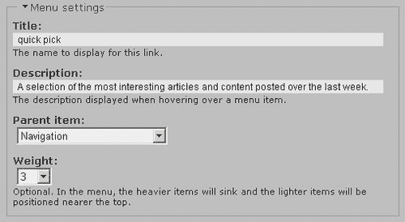

当你做这些的时候，你可能还应该考虑禁用这个页面的评论功能，除非你特别希望你的主菜单页面可以供讨论。现在将这个页面发布到网站上，会得到以下初始页面：

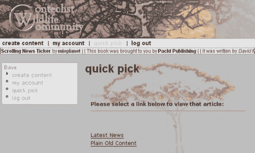

现在，当用户实际点击其中一个链接时，魔法就开始了。我们不会移动到新的节点，而是停留在完全相同的页面上，只是您附加到这个帖子的内容文件现在显示如下：

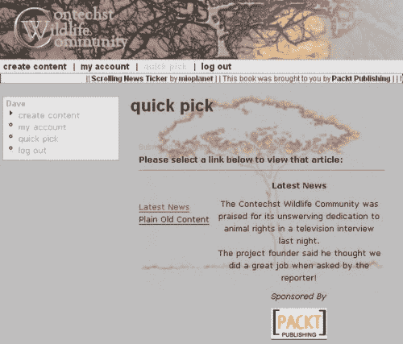

从顶部链接的较浅颜色中，您可以*希望*看到它已经被点击，正如承诺的那样，**最新新闻**文章现在以它全部的辉煌呈现。

我相信您可以为这种类型的页面想出更多新颖的用途——请记住，保持附加文件的大小尽可能小，这样用户就不会点击链接后失去兴趣，等待它显示。如果您想挑战一下，可以编写一个 PHP 脚本，将其他帖子的`<body>`部分转换为文件，这样您就可以在不手动创建附加内容文件的情况下添加有趣的帖子或文章。

希望您会同意，我们以极少的努力创造了一些非常棒的功能。这就是我们这次能做的全部，但现在您已经知道了如何做到这一点，我将它留在了您能干的手中，以便您想出完成任何重要任务的新颖方法。

# 摘要

本章重点介绍了您网站的两个截然不同的方面。

第一部分涉及功能，并探索了我们可用的几个更高级的模块。希望您会发现，您现在对模块的使用已经足够了解，可以自信地使用您选择的任何一个。最终，您可能会创建并分享自己的模块，供社区的其他成员使用，但就目前而言，能够通过 AdSense 赚取一些额外的收入，以及创建您自己的自定义内容类型，应该给您提供足够的素材来工作。

本章的第二部分讨论了如何使用互联网上的资源来寻找完整的解决方案，或者甚至是一些可以修改和/或集成到您的网站中以提供一些强大功能的部分代码。这也许已经突出了这样一个事实：即使您不是编程专家，只要进行一些搜索，并对一些重要的基于 Web 的技术有一些基本了解，您也可以为您的网站创建一些强大的功能。

总的来说，您的网站现在应该已经相当完整了，或者，如果您想添加这里没有直接讨论的东西，您应该会发现您有足够的经验去进行任何您想要的更改。获得创建高级网站的信心只是关于花时间熟悉事物，而这本书已经为您提供了一个开始的平台。

下一章将探讨与您新网站相关的管理任务，并且与前面九章相比，与您网站开发的直接关系并不那么紧密。正因为如此，我想趁此机会祝贺您现在完成了您的网站，并向您保证所有艰苦的开发工作都已经完成。

如果你希望尽快让你的网站上线运行，请随意跳过下一章，直接跳转到附录，其中概述了如何正确地将你的新网站部署到其网络上的家。你总是可以在网站上线运行后回到第十章学习如何维护和管理你的网站。
