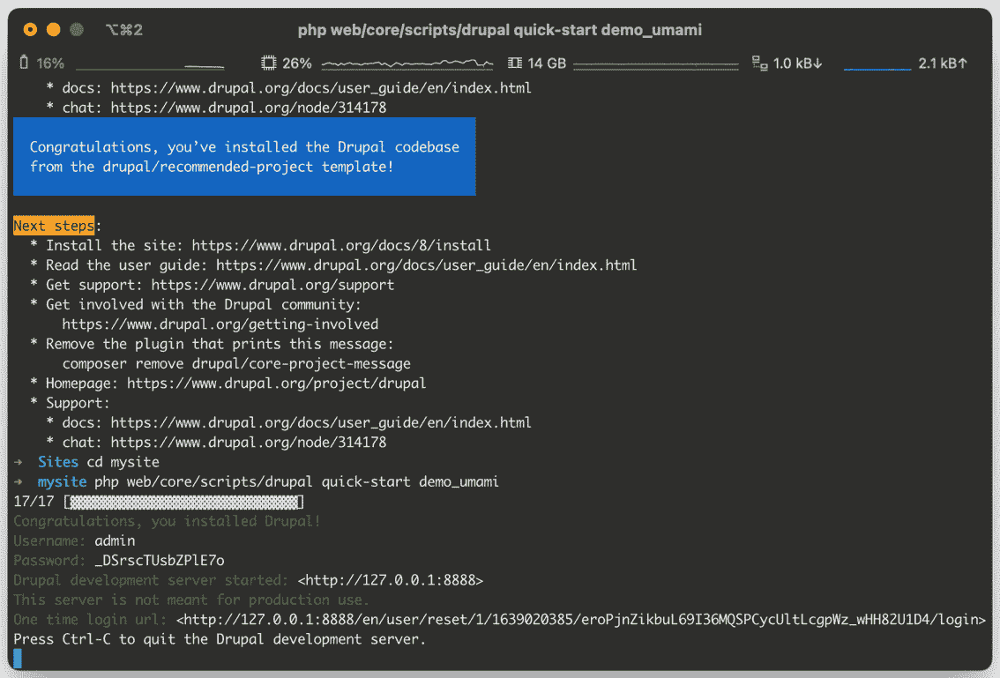

# 1

# 快速启动 Drupal

在本章中，我们将介绍如何创建新的 Drupal 网站以及运行 Drupal 的系统要求。我们还将介绍使用基于 Docker 的现代本地开发工具运行 Drupal 网站。

然后，我们将介绍如何在网站运行时添加和管理模块和主题扩展，以及如何在 Git 版本控制中管理您的 Drupal 代码库，最后部署该 Drupal 网站。到本章结束时，您将了解如何创建 Drupal 网站，在您的机器上本地运行它，并向该 Drupal 网站添加模块和主题。您还将了解如何管理版本控制中的 Drupal 代码库并部署 Drupal 网站。本章将为本书其余章节的工作奠定基础，并让您自己尝试使用 Drupal 进行实验。

在本章中，我们将介绍以下主题：

+   为新网站创建新的 Drupal 代码库

+   在本地运行 Drupal 网站

+   使用 Drush 管理 Drupal

+   使用 Composer 添加和管理模块和主题

+   使用版本控制管理您的 Drupal 代码库

+   成功部署您的 Drupal 网站

# 技术要求

本章将帮助您开始在您的计算机上本地使用 Drupal。

您将需要以下内容：

+   PHP 8.1 或更高版本

+   在您的机器上安装了 Docker 和 DDEV

+   Composer，PHP 包管理工具

+   Docker，用于运行本地环境

+   一个编辑器，例如 Visual Studio Code 或 PhpStorm

重要提示

前往 Composer 文档学习如何在您的系统上全局安装 Composer。

Linux/Unix/macOS: [`getcomposer.org/doc/00-intro.md#installation-linux-unix-osx`](https://getcomposer.org/doc/00-intro.md#installation-linux-unix-osx)

Windows: [`getcomposer.org/doc/00-intro.md#installation-windows`](https://getcomposer.org/doc/00-intro.md#installation-windows)

# 创建 Drupal 网站

使用**Composer**项目模板创建新的 Drupal 网站，并运行**快速启动**命令以创建预览网站。本节中提供的说明基于[`www.drupal.org/download`](https://www.drupal.org/download)上的推荐安装说明。

## 准备工作

**快速启动**命令使用 SQLite 作为 Drupal 的数据库。在大多数操作系统的 PHP 安装中，这通常是现成的，已经安装。如果 SQLite 不可用，安装脚本将报错。如果发生这种情况，没关系！在*本地运行您的 Drupal 网站*中，我们将使用带有数据库的本地开发环境运行 Drupal。

Drupal 还需要几个 PHP 扩展。这些通常在大多数 PHP 发行版中可用。所需 PHP 扩展的最新列表可以在网上找到：[`www.drupal.org/docs/system-requirements/php-requirements#extensions`](https://www.drupal.org/docs/system-requirements/php-requirements#extensions)。

## 如何操作...

1.  打开终端，导航到您想要创建新 Drupal 网站的位置。

1.  使用 `create-project` 命令在 `mysite` 目录中创建一个新的 Drupal 站点：

    ```php
    composer create-project drupal/recommended-project mysite
    ```

重要提示

如果您的 PHP 安装缺少 Drupal 所需的任何扩展，此命令将失败。`Composer` 命令输出将解释缺少哪些扩展。

1.  切换到新创建的 `mysite` 目录，其中包含 Drupal 站点的代码库：

    ```php
    cd mysite
    ```

1.  运行 **快速开始** 命令，使用 **Umami** **Maganize** 演示安装一个示例 Drupal 站点：

    ```php
    php web/core/scripts/drupal quick-start demo_umami
    ```

1.  一旦安装脚本完成，您的浏览器将打开您的 Drupal 站点。如果您的浏览器没有打开，终端将打印一个登录链接：



图 1.1 – 运行快速开始命令的输出

1.  按 *Ctrl* + *C* 退出 **快速开始** 服务器。

1.  接下来，在您的编辑器中打开 `web/sites/default/settings.php`。我们将修改此文件以修改配置同步目录并添加本地设置覆盖。

1.  将配置同步目录（Drupal 站点配置可以导出的位置）设置为 `../config`。路径相对于 web 目录。

快速开始命令的安装程序将生成一个默认值。在文件底部，找到类似以下的一行：

```php
$settings['config_sync_directory'] =
  'sites/default/files/config_....';
```

用以下行替换它：

```php
$settings['config_sync_directory'] = '../config';
```

这确保了您导出的 Drupal 配置不在 `web` 文档根文件夹中。

1.  在文件底部，添加以下代码片段以允许创建 `settings.local.php` 文件来覆盖 `settings.php` 文件在不同环境中的设置：

    ```php
    /**
    ```

    ```php
     * Include local environment overrides.
    ```

    ```php
     */
    ```

    ```php
    if (file_exists($app_root . '/' . $site_path .
    ```

    ```php
      '/settings.local.php')) {
    ```

    ```php
       include $app_root . '/' . $site_path .
    ```

    ```php
         '/settings.local.php';
    ```

    ```php
    }
    ```

这检查是否也有一个 `settings.local.php` 文件与您的 `settings.php` 文件一起存在，如果存在则包含它。通过使用本地设置文件，您可以在 Drupal 设置文件中添加合理的默认值，但具有每个环境的配置和数据库连接设置。

1.  通过这样，你已经设置了一个 Drupal 代码库和一个示例开发站点，我们将在这个章节和本书的其余部分中使用它。

## 它是如何工作的…

Composer 允许开发者从现有包创建新项目。Drupal 社区提供了 `drupal/recommended-project` 包作为 Drupal 站点的脚手架。当运行 `create-project` 时，它会复制 `drupal/recommended-project` 包并为我们安装依赖项，使我们的包副本可用于我们自己的。

Drupal 有一个配置管理系统，允许导出和导入配置。这允许你在本地进行配置更改并将它们推送到生产环境，而无需在您的实时站点上进行更改。这就是 `config_sync_directory` 的用途；它将在 *使用版本控制管理您的 Drupal 代码* 和 *成功部署您的 Drupal 站点* 菜单中更详细地介绍。

**快速开始**命令是在 **Drupal 8.6** 中添加的，用于快速为新开发者创建 Drupal 的开发环境。它以编程方式安装 Drupal，启动 PHP 内置的 web 服务器，并使用 SQLite 进行数据库访问。

**快速开始**命令也是可重入的。如果您重新运行该命令，它将使用现有的 SQLite 数据库文件。这允许您快速运行开发环境。我们将在“在本地运行您的 Drupal 网站”菜谱中介绍如何运行完整的环境。

## 更多内容...

虽然 `drupal/recommended-project` 是创建新 Drupal 网站的主要方式，但还有其他选项。其他项目模板包括社区替代方案和各种发行版模板，以及与 Drupal 合作的各种机构已经提供了他们自己的（内部和公开的。）

### 社区 Composer 项目模板

在 `drupal/recommended project` 之前，Drupal 没有一个标准的 Composer 项目模板。社区推动了这一倡议，并仍然维护了一个更具观点的 Drupal 项目模板。该模板可以在 [`github.com/drupal-composer/drupal-project`](https://github.com/drupal-composer/drupal-project) 找到。

该项目增加了以下增强功能：

+   对环境文件和环境变量的支持

+   对依赖项的修补支持

+   Drush（虽然是一个事实上的工具，但不是由推荐项目模板提供的）

### Drupal 发行版模板

Drupal 有一个概念叫做安装配置文件，通常被称为发行版。它们被称为发行版，因为它们提供了一个具有观点的 Drupal 构建。有几个发行版项目模板可供选择：

+   **Open Social** 是一个基于 Drupal 的社区参与软件：[`github.com/goalgorilla/social_template/`](https://github.com/goalgorilla/social_template/ )

+   **Commerce Kickstart**，一个基于 Drupal 和 Commerce 的预配置电子商务商店：[`github.com/centarro/commerce-kickstart-project`](https://github.com/centarro/commerce-kickstart-project )

+   **Contenta CMS**，一个基于 Drupal 的 API 首先解耦 CMS：[`github.com/contentacms/contenta_jsonapi_project`](https://github.com/contentacms/contenta_jsonapi_project )

## 参见

+   Composer 文档：[`getcomposer.org/doc/`](https://getcomposer.org/doc/ )

# 在本地运行您的 Drupal 网站

要与 Drupal 一起工作，您需要一个本地开发环境。本地开发环境应该能够帮助您模拟您的生产环境，例如访问特定的 PHP 版本、数据库版本、Redis 以及其他服务。

为了实现这一点，我们将使用 **Docker**。我们不会直接与 Docker 交互，而是通过一个名为 **DDEV** 的工具。DDEV 是 Docker 之上的一个抽象，它为在本地运行 Drupal 网站提供了合理的默认设置，同时提供了扩展和添加额外服务的灵活性。

DDEV 与 **Laravel 的 Sail** 类似，但支持来自 Drupal 社区的各种 PHP 项目。

## 准备工作

您需要安装 Docker：

+   macOS 和 Windows 需要使用 Docker Desktop，因为容器在这两种操作系统上都不是本地运行的：[`www.docker.com/products/docker-desktop`](https://www.docker.com/products/docker-desktop)

+   Linux 本地运行 Docker；最好查看 DDEV 的精选安装步骤：[`ddev.readthedocs.io/en/stable/users/docker_installation/#linux-installation-docker-and-docker-compose`](https://ddev.readthedocs.io/en/stable/users/docker_installation/#linux-installation-docker-and-docker-compose)

接下来，您可以安装 DDEV：

+   **macOS 和 Linux**：通过 Homebrew 软件包管理器进行安装：[`ddev.readthedocs.io/en/stable/#homebrew-macoslinux`](https://ddev.readthedocs.io/en/stable/#homebrew-macoslinux)

+   **Windows**：Windows 需要 WSL2，并提供了详细的说明：[`ddev.readthedocs.io/en/stable/#installation-or-upgrade-windows-wsl2`](https://ddev.readthedocs.io/en/stable/#installation-or-upgrade-windows-wsl2)

DDEV 安装指南详细介绍了如何在每种操作系统上安装 Docker 和 DDEV：[`ddev.readthedocs.io/en/stable/#installation`](https://ddev.readthedocs.io/en/stable/#installation)。

## 如何操作…

1.  确保 Docker 正在运行。

1.  打开终端并导航到您的 Drupal 代码库。

1.  运行 `config` 命令开始设置：

    ```php
    ddev config
    ```

1.  第一个提示是选择项目名称。使用默认名称，该名称是从当前目录名称推断出来的，或者提供自定义名称。按 *Enter* 继续操作。

1.  选择 Drupal 网站的文档根目录。DDEV 的默认值会自动检测。按 *Enter* 使用默认值 `web`。

1.  下一个提示是项目类型。DDEV 提供平台检测，默认为 `drupal10`。按 *Enter* 选择它。

1.  DDEV 设置现在已完成！我们可以通过使用 **启动** 命令来启动本地环境：

    ```php
    ddev start
    ```

1.  使用 `launch` 命令访问 Drupal 网站，这将带我们到交互式网站安装程序：

    ```php
    ddev launch
    ```

1.  通过在第一个两个表单上按 **保存并继续** 完成安装 Drupal。

1.  安装完成后，填写网站的配置表单并按 **保存**。

1.  您的 Drupal 网站现在正在运行！

## 工作原理…

DDEV 允许您构建可定制的本地开发环境，无需成为 Docker 专家，但仍可利用 Docker 的特定功能。DDEV 位于 Docker Compose 工具之上，用于运行多容器 Docker 应用程序。它为您生成 Compose 文件并运行 `docker-compose` 命令。这使得它非常适合团队共享，因为它消除了 Docker 的复杂性。

您的 DDEV 网站配置位于 Drupal 目录的 `.ddev` 目录中的 `config.yaml` 文件中。在此配置文件中可以自定义 PHP 版本、数据库类型、版本等。

当运行 Composer 或其他命令时，您需要通过 SSH 登录到 Web 应用程序容器。这可以通过 `ssh` 命令实现：

```php
ddev ssh
```

通过 SSH 登录到 Web 应用程序，您可以直接在本地环境中运行命令。

## 更多内容...

使用 DDEV 和其他类似 DDEV 的工具，可以更改多个选项。

### 更改网站的 PHP 版本

要修改项目中使用的 PHP 版本，编辑 `.ddev/config.yaml` 并更改 `php_version` 属性。**Drupal 10** 项目类型默认为 **PHP 8.1**，这是 Drupal 所需的最小 PHP 版本。但您可以选择使用更新的 PHP 版本，因为它们被 Drupal 发布并支持。

### 更改数据库版本或类型

DDEV 支持 MySQL 和 MariaDB 数据库，但不支持 Postgres（尽管它被 Drupal 支持）。默认情况下，DDEV 使用 **MariaDB 10.3**：

+   要更改您的 MariaDB 版本，编辑 `.ddev/config.yaml` 并将 `mariadb_version` 属性更改为所需的版本

+   要使用 MySQL 而不是 MariaDB，编辑 `.ddev/config.yaml` 并将 `mariadb_version` 属性替换为 `mysql_version: "8.0"`

一旦数据库中有数据，您就不能更改数据库类型或降级数据库版本。您必须首先使用 `ddev delete` 删除项目的数据库。

查看在线文档以了解每种数据库类型支持哪些版本：[`ddev.readthedocs.io/en/stable/users/extend/database_types/`](https://ddev.readthedocs.io/en/stable/users/extend/database_types/)

### 添加自定义服务

DDEV 允许您通过在 `.ddev` 目录中编写 Docker Compose 文件来添加自定义服务。DDEV 会聚合 `.ddev` 目录中所有遵循 `docker-compose.*.yml` 命名约定的 Docker Compose 文件，其中 `*` 是一个唯一的单词。

例如，要添加 Redis，我们会在 `.ddev` 目录中创建一个名为 `docker-compose.redis.yaml` 的文件。它将包含以下 Docker Compose 清单，该清单定义了 Redis 服务并将其链接到 Web 应用程序服务：

```php
version: "3.6"
services:
  redis:
    container_name: ddev-${DDEV_SITENAME}-redis
    image: redis:6
    ports:
      - 6379
    labels:
      com.ddev.site-name: ${DDEV_SITENAME}
      com.ddev.approot: $DDEV_APPROOT
  web:
    links:
      - redis:redis
```

有关附加服务的文档可以在 [`ddev.readthedocs.io/en/stable/users/extend/additional-services/`](https://ddev.readthedocs.io/en/stable/users/extend/additional-services/) 找到。

### 使用 DDEV 运行 Composer

DDEV 允许您在 Web 应用程序容器内运行 Composer。如果您在主机机器上使用不同的 PHP 版本，或者项目在 Web 应用程序容器中需要缺少的扩展，这将非常有用。

要运行 Composer 命令，请使用 `ddev composer`。例如，以下命令将向 Drupal 网站添加一个新模块：

```php
ddev composer require drupal/token
```

您可以提供任何 Composer 命令和参数。

## 参见

+   **出色的 DDEV**：DDEV 的博客、教程、技巧和窍门的集合：[`github.com/drud/awesome-ddev`](https://github.com/drud/awesome-ddev)

+   **DDEV 配置**：一组用于自定义 DDEV 网站的贡献食谱和代码片段：[`github.com/drud/ddev-contrib`](https://github.com/drud/ddev-contrib)

+   **官方本地开发** **指南**：[`www.drupal.org/docs/official_docs/en/_local_development_guide.html`](https://www.drupal.org/docs/official_docs/en/_local_development_guide.html)

# 使用 Drush 命令行工具

**Drush**是一个与 Drupal 交互的命令行工具，用于执行安装 Drupal 或执行各种维护任务等操作。在本食谱中，我们将向我们的 Drupal 网站添加 Drush，并使用它来安装 Drupal 网站。

警告

此示例使用会导致现有已安装网站数据丢失的命令。

## 准备工作

当使用 DDEV 时，您必须使用`ddev ssh`命令 SSH 到 Web 应用程序容器中，以与 Drush 交互。

## 如何操作...

1.  打开终端并导航到您的 Drupal 代码库。

1.  添加`require`命令：

    ```php
    composer require drush/drush
    ```

1.  执行`site:install`命令以安装 Drupal：

    ```php
    php vendor/bin/drush site:install --account-pass=admin
    ```

1.  安装完成后，使用`user:login`命令生成一个一次性登录链接以访问 Drupal 网站。如果您没有点击返回的链接，浏览器应该会自动打开：

    ```php
    php vendor/bin/drush user:login
    ```

1.  安装`pm:enable`命令。按*Enter*键确认以安装**布局构建器**及其依赖项：

    ```php
    php vendor/bin/drush pm:enable layout_builder
    ```

1.  使用`cache:rebuild`命令重建 Drupal 的缓存：

    ```php
    php vendor/bin/drush cache:rebuild
    ```

## 它是如何工作的...

**Drush**自**Drupal 4.7**以来一直是 Drupal 社区的一部分，并已成为每个 Drupal 开发者的必备工具。该项目可以在命令行上引导 Drupal，并执行与网站的交互。

Drush 有大量的命令，可以通过运行`list`命令找到：

```php
php vendor/bin/drush list
```

模块也可以提供自己的 Drush 命令。随着您向 Drupal 网站添加模块，可能会出现新的命令。在*使用自定义代码扩展 Drupal*的食谱中，我们将介绍如何创建自己的 Drush 命令。

## 更多...

Drush 有大量的命令和方式，可以使您与 Drupal 网站的工作变得更加容易。

### 使用 DDEV 运行 Drush

DDEV 提供了一种方法，可以在不使用`ssh`命令 SSH 到 Web 应用程序容器的情况下运行 Drush，就像它对 Composer 所做的那样。要使用 DDEV 运行 Drush 命令，请使用`ddev drush`。例如，以下命令将生成一个登录您的 Drupal 网站的链接：

```php
ddev drush user:login
```

您可以提供任何 Drush 命令和参数。

### 检查是否有挂起的更新

保持已安装的模块和主题更新很重要，尤其是如果存在安全发布。Drush 提供了`pm:security`命令，该命令检查已安装模块或主题的任何挂起的更新：

```php
php vendor/bin/drush pm:security
```

### 导出或导入 SQL 文件到您的 Drupal 数据库

Drush 提供了一系列 SQL 命令，可以直接与您的数据库交互。

`sql:dump`命令允许你创建一个可以导入到另一个数据库的数据库备份。默认情况下，除非传递了`--result-file`选项，否则将打印 SQL 语句。文件路径相对于 Drupal 的文档根（`web`目录）：

```php
php vendor/bin/drush sql:dump --result-file=../db-dump.sql
```

`sql:cli`允许你执行 SQL 语句，包括导入 SQL 备份文件。例如，你可以使用此命令将生产 Drupal 数据库的 SQL 备份导入到本地开发环境中：

```php
php vendor/bin/drush sql:cli < db-dump.sql
```

## 参见

+   Drush 主页：[`www.drush.org/latest/`](https://www.drush.org/latest/)

# 添加和管理模块和主题扩展

由于其可组合的设计和庞大的贡献模块和主题生态系统，Drupal 极其灵活。Composer 用于通过其`require`和`update`命令在你的 Drupal 站点上安装和升级扩展。在本食谱中，我们将添加流行的**Pathauto**模块([`www.drupal.org/project/pathauto`](https://www.drupal.org/project/pathauto))和**Barrio**主题([`www.drupal.org/project/bootstrap_barrio`](https://www.drupal.org/project/bootstrap_barrio))，一个 Bootstrap 5 主题。

## 如何做到这一点...

1.  打开终端并导航到你的 Drupal 代码库。

1.  首先，我们将使用`require`命令添加`Pathauto`模块：

    ```php
    composer require drupal/pathauto
    ```

当 Composer 开始解析`Pathauto`包时，它将输出一些数据。你会注意到`Pathauto`的模块依赖项也被下载了：`Token`和`Chaos Tools`。

模块将被安装到`web/modules/contrib`目录。

1.  接下来，我们将添加 Barrio 主题：

    ```php
    composer require drupal/bootstrap_barrio
    ```

这将下载 Barrio 主题并将其放置到`web/themes/contrib`目录。

1.  现在，我们将使用 Drush 的`pm:enable`命令安装`Pathauto`模块：

    ```php
    php vendor/bin/drush pm:enable pathauto
    ```

此 Drush 命令将提示我们安装`Pathauto`以及所需的模块依赖项（`Chaos Tools`和`Token`），默认选项为`yes`。按*Enter*键继续。

命令将返回以下内容：

```php
[success] Successfully enabled: pathauto, ctools,
  token
```

1.  接下来，我们将使用 Drush 的`theme:enable`命令启用 Barrio 主题，并使用`config:set`命令将其设置为默认主题：

    ```php
    php vendor/bin/drush theme:enable bootstrap_barrio
    ```

这仅启用主题；它不会使其成为你的 Drupal 站点使用的默认主题。要将其设置为默认主题，我们需要使用`config:set`命令修改站点的配置：

```php
php vendor/bin/drush config:set system.theme default
  bootstrap_barrio
```

这修改了`system.theme`配置，使其使用 Barrio 作为`default`主题设置。

1.  假设我们需要更新`Pathauto`的新版本。我们可以使用`update`命令来更新我们的包：

    ```php
    composer update drupal/pathauto
    ```

这将更新`Pathauto`模块到下一个版本。然而，它不会更新其依赖项——也就是说，`Chaos Tools`或`Token`。使用`--with-dependencies`选项确保`Pathauto`的直接依赖项也被更新。

1.  最后，我们将介绍如何从 Drupal 站点中删除我们添加的模块。首先，在从代码库中删除之前，我们必须从 Drupal 中**卸载**该模块：

    ```php
    php vendor/bin/drush pm:uninstall pathauto ctools
    ```

    ```php
      token
    ```

注意 `Chaos Tools` 和 `Token` 是如何作为参数添加的？这些模块被添加到我们的代码库中，并作为 `Pathauto` 的依赖项安装。在移除 `Pathauto` 之前，我们还需要卸载这些模块。

1.  接下来，我们可以使用 `remove` 命令从代码库中移除 `Pathauto`：

    ```php
    composer remove drupal/pathauto
    ```

## 它是如何工作的……

默认情况下，Composer 只能添加 `drupal/` 命名空间中可用的包。Drupal 项目模板添加了 Composer 模板的 `composer.json`，以便这些包可用：

```php
    "repositories": [
        {
            "type": "composer",
            "url": "https://packages.drupal.org/8"
        }
    ],
```

Drupal 采取的模式是从 `Drupal.org` 下载项目进入 `contrib` 目录，而自定义代码则进入自定义目录。

一旦模块和主题被添加到 Drupal 代码库中，它们仍然需要安装。代码的存在并不意味着它们会立即激活。这也意味着从您的代码库中移除模块必须是一个两步过程。如果在卸载之前移除了模块的代码，Drupal 将会抛出错误。

## 还有更多……

Drupal 是一个在 Composer 之前创建的项目，直到 Drupal 8 生命周期中途才成为 **Composer** 兼容。还有一些其他事项需要说明。

### Composer Library Installer 和 Drupal 扩展

默认情况下，Composer 会将包安装到 `vendor` 目录。**Composer Library Installer** 是一个框架可以用来修改特定包类型安装路径的包。

`composer/installers` 包作为 Drupal 项目模板的一部分被添加，并支持以下包类型及其目标：

+   `drupal-core`：用于 Drupal 核心代码库的包类型。它安装在 `web/core` 目录。

+   `drupal-module`：用于模块的包类型。它安装在 `web/modules/contrib` 目录。

+   `drupal-theme`：用于主题的包类型。它安装在 `web/themes/contrib` 目录。

+   `drupal-profile`：用于配置文件的包类型。它安装在 `web/modules/profiles` 目录。

+   `drupal-library`：一种特殊的包类型，用于帮助将前端库下载到 `web/libraries` 目录。

这些映射可以在您的 Drupal 项目的 `composer.json` 文件中找到。

### 更新 Drupal 核心版本

更新 Drupal 核心代码库比更新 `drupal/core-recommended` 包要复杂一些。如前所述，Drupal 最近增加了对真正的 Composer 构建支持。还有一个 `drupal/core-composer-scaffold` 包，它会复制所需的文件。

Composer 允许我们使用通配符来更新依赖项。升级 Drupal 核心最简单的方法是使用通配符和 `-with-dependencies` 选项：

```php
composer update 'drupal/core-*' –with-dependencies
```

单引号用于转义 `*` 字符。此命令将同时更新 `drupal/core-recommended` 和 `drupal/core-composer-scaffold`，以及 Drupal 核心的所有依赖包。

## 参见

+   使用 Composer 下载和更新文件的官方文档：[`www.drupal.org/docs/user_guide/en/install-composer.html`](https://www.drupal.org/docs/user_guide/en/install-composer.html)

+   从 Drupal.org 下载和安装主题的官方文档：[`www.drupal.org/docs/user_guide/en/extend-theme-install.html`](https://www.drupal.org/docs/user_guide/en/extend-theme-install.html)

# 使用版本控制管理 Drupal 代码

现在我们有了 Drupal 代码库，是时候将代码放入 Git 的版本控制中了。我们还将导出 Drupal 网站的配置到 YAML 文件中，这样我们就可以在版本控制中跟踪网站配置。

在版本控制中跟踪您的代码可以更容易地与其他开发者协作、跟踪更改以及与持续集成和部署工具集成。即使您是唯一的项目开发者，也强烈推荐这样做。

## 准备工作

此食谱要求您在您的机器上安装 Git。如果您还没有安装 Git，请参阅以下资源：

+   Git 官方下载页面：[`git-scm.com/downloads`](https://git-scm.com/downloads)

+   GitHub 的 *安装 Git* 指南：[`github.com/git-guides/install-git`](https://github.com/git-guides/install-git)

## 如何操作...

1.  打开终端并导航到您的 Drupal 代码库。

1.  使用 `init` 命令初始化一个新的 Git 仓库：

    ```php
    git init
    ```

您将看到有关初始化空仓库的消息，类似于以下内容：

```php
Initialized empty Git repository in /Users/
  mglaman/Sites/mysite/.git/
```

1.  在我们将文件添加到 Git 以进行版本控制跟踪之前，我们必须创建一个 `.gitignore` 文件来指定我们不希望跟踪的文件。在项目根目录中创建一个 `.gitignore` 文件。

1.  我们希望忽略由 Composer 管理的代码目录、用户管理的文件（如上传文件）和敏感目录。请将以下内容添加到您的 `.gitignore` 文件中：

    ```php
    # Ignore directories generated by Composer
    ```

    ```php
    /drush/contrib/
    ```

    ```php
    /vendor/
    ```

    ```php
    /web/core/
    ```

    ```php
    /web/modules/contrib/
    ```

    ```php
    /web/themes/contrib/
    ```

    ```php
    /web/profiles/contrib/
    ```

    ```php
    /web/libraries/
    ```

    ```php
    # Ignore local settings overrides.
    ```

    ```php
    /web/sites/*/settings.local.php
    ```

    ```php
    # Ignore Drupal's file directory
    ```

    ```php
    /web/sites/*/files/
    ```

这排除了 Composer 可能安装依赖项的所有目录、用户管理的文件（如上传文件）和敏感目录。我们不排除 `web/sites/default/settings.php`，但确保排除 `settings.local.php` 文件。

1.  现在，我们可以使用 `add` 命令将我们的文件添加到 Git 的跟踪列表中：

    ```php
    git add .
    ```

我们使用点（`.`）作为 `add` 命令的参数来添加当前目录中的所有文件。

1.  使用 `status` 命令验证文件是否已添加到 Git 的跟踪列表：

    ```php
    git status
    ```

您应该看到多行文件以绿色显示。绿色表示文件已暂存以供跟踪：


图 1.2 – `status` 命令的输出，绿色文件表示 Git 中跟踪的项目

1.  现在，是时候使用 `commit` 命令提交更改了：

    ```php
    git commit -m "Initial commit"
    ```

`commit` 命令记录对仓库的更改。提交需要提交信息。`-m` 标志允许您提供信息。

1.  由于我们的代码现在在 Git 中跟踪，我们希望导出 Drupal 的配置并跟踪它。我们可以使用 Drush 的`config:export`命令来完成此操作：

    ```php
    php vendor/bin/drush config:export
    ```

对于第一次导入，所有配置都将被导出。之后，您将被提示导出配置，因为它将覆盖现有文件。

1.  将导出的配置文件添加到 Git：

    ```php
    git add config
    ```

您可以使用`git status`来验证文件是否已准备好提交。

1.  提交配置文件：

    ```php
    git commit -m "Add configuration files"
    ```

1.  您的 Drupal 站点现在由 Git 管理，并且可以推送到 GitHub 或 GitLab 仓库！

## 它是如何工作的…

**Git**是一个免费的开源版本控制系统。在本食谱中，我们为构成我们的 Drupal 站点的文件创建了一个新的 Git 仓库。当文件被添加到 Git 仓库时，它们会被跟踪以监控文件的变化。然后，更改会被提交并创建版本控制历史中的新版本。Git 仓库可以被添加到 GitHub、GitLab 或其他服务以托管项目代码。

版本控制的好处在于它使得与其他开发者协作变得容易，而不会创建冲突的代码更改。它还使得代码可移植。Drupal 站点代码不仅存在于您的机器上，还存在于远程仓库（GitHub、GitLab 或其他服务）中。

几乎所有提供为 Drupal 站点提供持续集成和部署的**平台即服务**（**PaaS**）托管提供商都需要代码存在于 Git 仓库中。

## 相关内容

+   Git 文档：[`git-scm.com/docs`](https://git-scm.com/docs)

+   Drupal.org 关于 Git 的文档：[`www.drupal.org/docs/develop/git`](https://www.drupal.org/docs/develop/git)

# 成功部署您的 Drupal 站点

到目前为止，我们已经创建了一个 Drupal 代码库，设置了本地开发环境，并将我们的代码库放入版本控制中。现在，是时候介绍如何将您的 Drupal 站点部署到服务器上了。

部署您的 Drupal 站点不仅涉及复制代码文件，因为您可能需要运行模式更新和配置导入。在本食谱中，我们将使用**rsync**，一个高效的文件传输工具，将我们的 Drupal 站点代码库复制到服务器，并使用 Drush 创建成功的 Drupal 部署。

## 准备工作

本食谱需要通过**SSH**访问虚拟机，该虚拟机已安装了**Linux、Apache、MySQL 和 PHP**（**LAMP**）堆栈。许多云提供商，如**Digital Ocean**和 AWS **Lightsail**，提供 LAMP 堆栈虚拟机的单点安装：

+   一台具有 1GB 内存和一个 CPU 的虚拟机就足够了，通常是最低的虚拟机级别。

+   您必须能够使用基于 SSH 密钥的身份验证或密码身份验证访问虚拟机。

+   本食谱使用`root`用户，这不是最佳的安全实践。服务器安全实践和管理超出了本书的范围。

本食谱使用 IP 地址`167.71.255.26`来访问服务器。请将`167.71.255.26`替换为您服务器的 IP 地址。

在撰写本文时，MySQL PHP 库不支持 MySQL 实现的新的`caching_sha2_authentication`身份验证。您需要一个具有`mysql_native_password`身份验证方法访问数据库的用户。

这里是创建一个对`dbuser`用户可访问、密码为`dbpass`的`drupaldb`数据库的 SQL 命令摘要：

```php
CREATE DATABASE drupal
CREATE USER 'dbuser'@'%' IDENTIFIED WITH
  mysql_native_password BY 'dbpass';
GRANT ALL ON drupal.* TO 'dbuser'@'%';
```

## 如何操作...

1.  打开终端并导航到您的 Drupal 代码库。

1.  为`rsync`创建一个忽略文件，以排除名为`.rsyncignore`的目录，以下为代码：

    ```php
    .git/
    ```

    ```php
    .ddev/
    ```

    ```php
    .vscode/
    ```

    ```php
    .idea/
    ```

    ```php
    web/sites/*/files/
    ```

    ```php
    web/sites/*/settings.local.php
    ```

    ```php
    web/sites/*/settings.ddev.php
    ```

    ```php
    *.sql
    ```

这将用于减少传输到生产服务器的文件数量，包括开发者工具配置、本地开发文件以及任何 SQL 转储。

1.  现在，我们将使用`rsync`将我们的 Drupal 代码库部署到远程服务器：

    ```php
    rsync -rzcEl . root@167.71.255.26:/var/www/html --
    ```

    ```php
      exclude-from=".rsyncignore" --delete
    ```

`rzCE`标志控制文件如何复制到远程服务器。`r`表示递归复制，`z`在传输过程中压缩文件，`C`使用校验和检查文件是否已修改并应该复制，`E`保留文件的执行权限，`l`保留链接。`E`和`l`标志对于 Composer 的`vendor/bin`可执行文件非常重要。

`.`代表我们的当前工作目录作为源，其中`root@167.71.255.26:/var/www/html`是我们的目标。将`root@167.71.255.26`替换为您的虚拟机的用户和 IP 地址。

`exclude-from`选项使用我们的`.rsyncignore`文件来跳过上传的文件，而`delete`则从目标中删除不再有效的旧文件。

1.  我们还需要使用 Drush 的`sql:dump`命令创建一个数据库 SQL 转储，以便进行一次性导入：

    ```php
    php vendor/bin/drush sql:dump --result-file=../db-
    ```

    ```php
    dump.sql
    ```

我们还可以将其复制到服务器，稍后使用**安全文件复制**（**SFC**）导入。我们将将其上传到用户的家目录，而不是 Drupal 目录：

```php
scp db-dump.sql root@167.71.255.26:db-dump.sql
```

1.  为了完成设置，通过 SSH 连接到您的虚拟机：

    ```php
    ssh root@167.71.255.26
    ```

1.  在复制文件后，我们还需要确保可写目录对 Web 服务器是可访问的，例如写入 CSS 和 JS 聚合文件以及编译的**Twig**模板。这是在第一次文件传输后设置 Drupal 站点时的一次性操作：

    ```php
    mkdir -p /var/www/html/web/sites/default/files/
    ```

    ```php
    chown -R www-data:www-data /var/www/html
    ```

    ```php
      /web/sites/default/files/
    ```

这确保了`web/sites/default/files`目录由 Web 服务器用户拥有，以便它可以写入文件。

1.  接下来，我们需要更新 Apache 使用的文档根，默认为`/var/www/html`。新的文档根是`/var/www/html/web`。我们将使用`sed`命令来替换值：

    ```php
    sed -i "s,/var/www/html,/var/www/html/web,g"
    ```

    ```php
      /etc/apache2/sites-enabled/000-default.conf
    ```

`sed`命令代表流编辑器，使得在文件中查找和替换文本变得非常容易。

1.  我们需要让 Apache 知道我们的配置更改。使用以下命令：

    ```php
    systemctl reload apache2
    ```

这将重新加载 Apache 服务配置，并使其知道新的文档根。

1.  在我们设置站点之前，我们将在服务器上创建我们的`settings.local.php`文件，以便 Drupal 知道如何连接到数据库。我们将使用`nano`命令行编辑器来创建和编辑该文件：

    ```php
    nano /var/www/html/web/sites/default
    ```

    ```php
      /settings.local.php
    ```

1.  将以下代码添加到您的`settings.local.php`文件中：

    ```php
    <?php
    ```

    ```php
    $databases['default']['default'] = [
    ```

    ```php
      'driver' => 'mysql',
    ```

    ```php
      'database' => 'drupal',
    ```

    ```php
      'username' => 'dbuser',
    ```

    ```php
      'password' => 'dbpass',
    ```

    ```php
      'host' => 'localhost',
    ```

    ```php
      'port' => 3306,
    ```

    ```php
    ];
    ```

请确保更改数据库凭据，使其与您创建的服务器上的凭据匹配。如果不存在，Drupal 还会尝试为您创建数据库。

1.  使用*CTRL* + *X*保存文件，然后*Y*，最后点击*Enter*。

使用 Drush 验证数据库连接设置：

```php
cd /var/www/html
php vendor/bin/drush status
```

数据库凭据应与您添加到`settings.local.php`中的内容匹配。

1.  接下来，我们需要填充我们的数据库。我们将使用`sql:cli`命令从本地开发环境导入初始数据库：

    ```php
    php vendor/bin/drush sql:cli < ~/db-dump.sql
    ```

1.  然后，我们可以通过使用 Drush 的`deploy`命令来运行任何模式更新和配置导入来执行部署步骤：

    ```php
    php vendor/bin/drush deploy
    ```

1.  您现在可以访问您的 Drupal 站点并查看它了！

## 工作原理...

此配方涉及各种组件：一个虚拟服务器来托管我们的代码和提供我们的 Drupal 站点，用于传输文件的`rsync`工具，以及 Drush 来执行所需的部署步骤。

使用 rsync 而不是 FTP 或甚至 scp（另一种基于命令行的文件传输工具）的一个好处是 rsync 是增量工作的。如果一个文件没有被修改，rsync 将不会传输该文件。它还会确保在远程服务器上删除的文件也会被删除，这是其他文件传输工具所不具备的。

Drush 的`deploy`命令确保您的 Drupal 站点的数据库和配置是最新的。这是一个以最佳实践方式操作各种过程的命令。该命令运行 Drupal 的所有更新钩子以确保它们被执行（由模块提供的模式更新和状态更改），并且配置是从导出的配置文件同步的。《deploy》命令应该始终运行，就像您运行 Symfony 或 Laravel 应用程序的迁移一样。

## 还有更多...

接下来，我们将更详细地介绍关于托管和部署您的 Drupal 站点的内容。

### 平台即服务托管提供商

您可以通过利用以下列出的 Drupal（按字母顺序排列）的 PaaS 托管提供商之一来完全避免此过程：

+   Acquia Cloud：[`www.acquia.com/products/drupal-cloud/cloud-platform/drupal-hosting`](https://www.acquia.com/products/drupal-cloud/cloud-platform/drupal-hosting )

+   Pantheon：[`pantheon.io/product/drupal-hosting`](https://pantheon.io/product/drupal-hosting )

+   Platform.sh：[`platform.sh/marketplace/drupal/`](https://platform.sh/marketplace/drupal/ )

### 自动化部署

使用持续集成，此部署过程可以在 GitHub Actions、GitLab CI 或其他持续集成提供商上通过提交您的存储库来自动化。您需要配置一组额外的私钥，这些私钥被添加到您的持续集成工具中，以便服务可以 SSH 到您的服务器。

## 参见

+   Drupal.org 上的托管合作伙伴：[`www.drupal.org/hosting`](https://www.drupal.org/hosting )

+   Drush `deploy` 命令的文档：[`www.drush.org/latest/deploycommand/`](https://www.drush.org/latest/deploycommand/)
