# 通过视图显示内容

Drupal 中的 **视图** 模块是一个可视化查询构建器，它允许您在不编写任何代码的情况下构建动态内容显示。我们将介绍如何创建一个列出博客的页面以及一个显示五个最新博客的伴随区块。然后，我们将转向创建公开筛选器，以便最终用户可以控制视图结果。您还将学习一些使用上下文筛选器和自定义实体引用小部件输出的高级主题。最后，我们将介绍如何使用 **图表** 模块通过视图输出数据图表。

在本章中，我们将介绍以下菜谱：

+   创建博客落地页面

+   创建一个包含最近博客的区块

+   向用户公开筛选和排序以控制列表

+   上下文筛选器用于按路径参数筛选

+   在具有关系的视图中添加相关数据

+   提供实体引用结果视图

+   使用视图显示图表

# 创建博客落地页面

视图模块只做一件事，而且做得很好——列出内容。视图模块背后的力量在于它给予最终用户大量可配置的权力，以各种形式显示内容。本菜谱将介绍如何创建内容列表并将其链接到主菜单。我们将使用 **文章** 内容类型来创建博客落地页面。

## 如何操作...

1.  前往**结构**然后**视图**。这将带您到所有创建的视图的管理概览。点击**添加视图**以创建一个新视图：

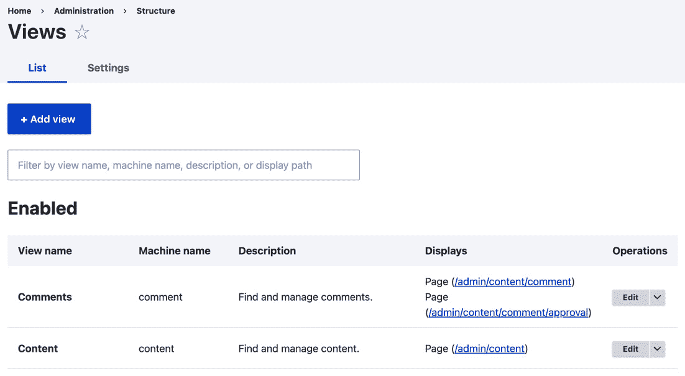

图 3.1 – 视图列表概述

1.  第一步是提供**博客**视图的名称，它将作为管理标题（默认情况下）和显示标题。

1.  接下来，我们将修改**视图设置**部分。我们想要显示**文章**类型的**内容**，并保留**标记为**字段为空。这将强制视图只显示**文章**内容类型的内容。

1.  选择**创建页面**选项。**页面标题**和**路径**字段将根据视图名称自动填充，可以根据需要修改。现在，保留显示和其他设置为其默认值：

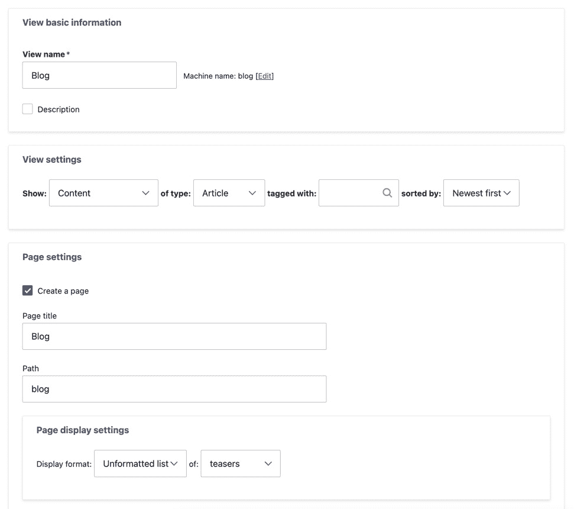

图 3.2 – 视图创建表单概述

1.  点击**保存并编辑**以继续修改您的新视图。

1.  在中间列的**页面设置**部分下，我们将更改**菜单项**设置。点击**无菜单**以更改菜单选项。

1.  选择**常规菜单项**。提供菜单链接标题和可选描述。将**父项**设置为**<主导航>**：

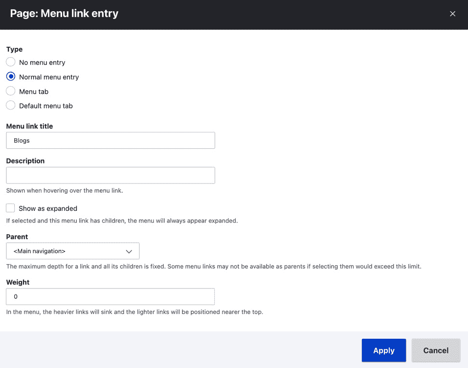

图 3.3 – 视图的菜单设置表单

1.  在对话框表单底部点击**应用**。

1.  点击**保存**以保存您的视图。

1.  保存你的视图后，从管理菜单点击**返回网站**。现在你将在 Drupal 网站的主菜单中看到链接。

## 它是如何工作的...

创建视图的第一步是选择你将要显示的数据类型。这被称为基础表，可以是任何类型的实体或专门暴露给视图的数据。

内容和节点

**节点**在视图中被标记为**内容**，你将在 Drupal 中找到这种术语的互换。

在创建视图页面时，我们添加了一个可访问的菜单路径。它告诉 Drupal 调用视图来渲染页面，这将加载你创建的视图并渲染它。然后，视图模块将此路径注册为 Drupal 路由系统中的一个路由，由它自己提供的控制器来渲染视图显示。

有显示样式和行插件用于格式化要渲染的数据。我们的配方使用了未格式化的列表样式，将每一行包裹在一个简单的`div`元素中。我们本可以将它改为表格来显示格式化的列表。行显示控制了每一行的输出方式。

## 还有更多...

视图模块是 Drupal 核心中最灵活和最常用的模块之一。在下一节中，我们将进一步探讨视图的一些组件。

### 视图和显示

在使用视图时，你会看到一些不同的术语。一个关键的概念是要理解什么是显示。一个视图可以包含多个显示。每个显示都是某种类型。视图模块提供了以下显示类型：

+   **附件**：这是一个附加到同一视图中的另一个显示的显示。这些放置在另一个视图显示的页眉或页脚部分。

+   **块**：这允许你将视图作为块放置在你的 Drupal 网站上。

+   **嵌入**：这个显示旨在通过编程嵌入。

+   **实体引用**：这允许视图为实体引用字段提供结果。

+   **订阅源**：这种显示返回一个基于 XML 的订阅源，可以附加到另一个显示以渲染一个订阅图标，让用户可以订阅内容。

+   **页面**：这允许你显示特定路径的视图。

每个显示都可以有自己的配置。然而，每个显示将共享相同的基础表（内容、文件等）。这允许你在同一个视图中以不同的方式呈现相同的数据。

### 格式样式插件 – 样式和行

在视图中，有两种类型的样式插件代表你的数据如何显示：**样式**和**行**：

+   样式插件代表视图的整体格式

+   行插件代表视图结果中每一行的格式

例如，**响应式网格**样式将使用 CSS 网格输出结果，并使其对不同屏幕尺寸做出响应。同时，表格样式创建了一个带有字段标签作为表头的表格输出。

**行**插件定义了如何渲染行。**内容**的默认类型将使用选定的视图模式渲染实体。如果你选择**字段**，你可以手动选择要包含在你的视图显示结果中的字段以及每个字段的字段格式化程序。

每个**样式**插件都有一个对应的 Twig 模板，用于主题化输出。请参考*第十章*中的*使用 Twig 模板*部分，*主题化和前端开发*，以了解更多关于 Twig 模板的信息。

### 使用嵌入式显示

可用的每种显示类型都有一种方法可以通过用户界面暴露自己，除了嵌入式。通常，贡献和自定义模块使用视图来渲染显示，而不是手动编写查询和渲染输出。Drupal 提供了一个特殊的显示类型来简化这个过程。

如果我们要在菜谱中创建的视图中添加一个**嵌入式**显示，我们可以在自定义代码中使用以下渲染数组来程序化地输出我们的视图：

```php
$view_render = [
  '#type' => 'view',
  '#name' => 'blog,
  '#display_id' => 'embed_1'
];
```

当渲染时，`#type` 键告诉 Drupal 这是一个视图元素。然后我们将其指向我们新的显示，`embed_1`。**嵌入式**显示类型没有特殊功能；它是一个简单的显示插件。这种做法的好处是它不会为了性能而执行额外的操作。

当你想在自定义页面、块或甚至表单中使用视图时，使用**嵌入式**显示是有益的。例如，Drupal Commerce 使用这种模式为其购物车块和结账时的订单摘要。视图用于在自定义块和表单中显示订单信息。

# 创建一个包含最新博客的块

在上一道菜谱中，我们使用视图模块创建了一个页面，用于在 Drupal 网站上列出文章以构建博客。视图可以包含多个显示。每个显示继承默认值，例如其样式和行格式、过滤器、排序、分页等。每种显示类型可能具有独特的设置，例如在上一道菜谱中配置菜单链接的页面设置。在这个菜谱中，我们将添加一个块显示，这样我们就可以在网站的任何地方按标题列出最新的五篇文章。

## 如何做到这一点...

1.  前往**结构**然后**视图**。这将带您到所有创建的视图的管理概览。

1.  找到在上一道菜谱中创建的**博客**视图，并点击**编辑**。

1.  在**显示**下，点击**页面**旁边的**添加**按钮，从下拉菜单中选择**块**。这将创建一个新的块显示，我们可以进行配置：

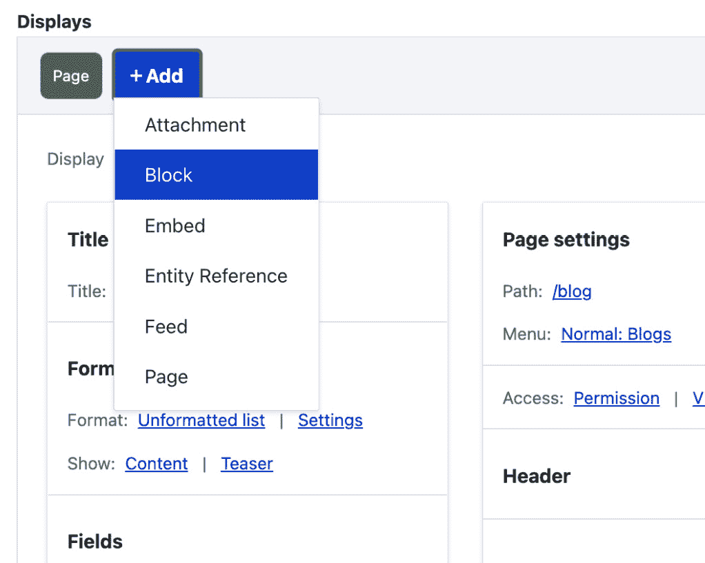

图 3.4 – 添加新显示的菜单

1.  在**格式**部分，点击**内容**（位于**显示**旁边）以配置使用的行格式。

1.  在打开的对话框中，我们需要确保我们只修改此显示的行格式。在**对于**下拉菜单中，选择**此块（覆盖）**，以便更改仅适用于此显示。

1.  从单选按钮中选择**字段**选项并点击**应用（此显示）**以设置行格式以使用单个字段而不是显示模式：

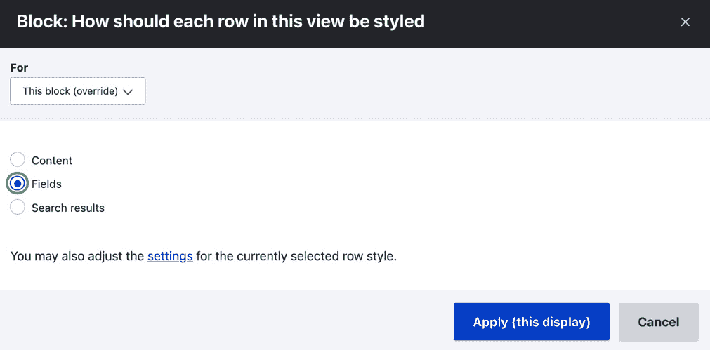

图 3.5 – 样式格式表单对话框

1.  将出现一个新对话框，允许您配置此行格式的选项。使用默认设置并点击**应用**。

重要提示

更改为使用**字段**行格式将自动添加**标题**字段，该字段已配置为链接到内容片段。

1.  我们只想让此块显示最近的五篇博客。在**分页器**部分，点击**使用分页器**旁边的字段以启动配置分页器的对话框。

1.  就像行格式一样，从**对于**选择列表中选择**此块（覆盖）**。然后，选择**显示指定数量的项目**选项。点击**应用（此显示）**：

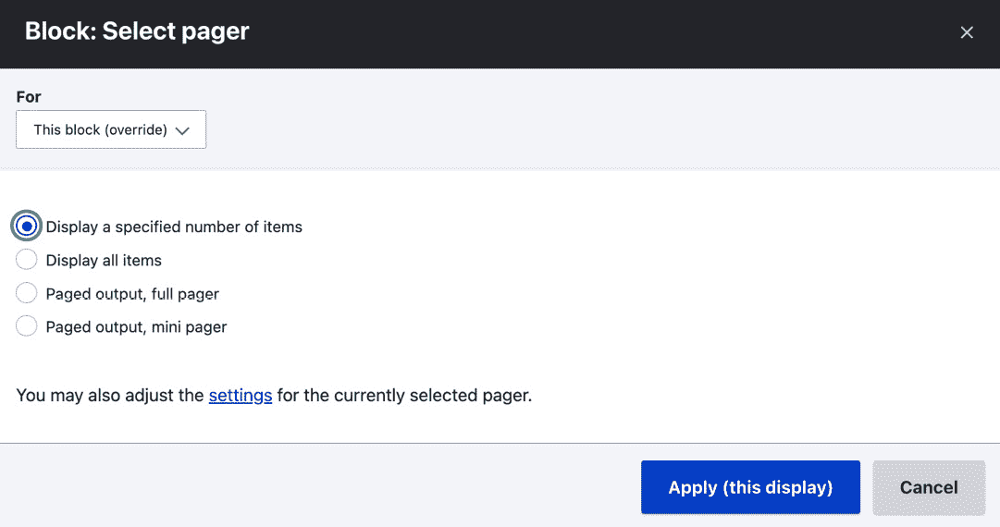

图 3.6 – 分页器选择表单对话框

1.  在下一个对话框中，允许您配置分页器设置，将**要显示的项目**更改为**5**。点击**应用**以完成更改分页器。

1.  点击**保存**以将您的更改保存到视图并创建块显示。

1.  前往**结构**和**块布局**以将块放置在您的 Drupal 网站上。点击**放置块**以选择**侧边栏****第一个**区域。

1.  通过输入您的视图名称：**博客**来过滤列表。点击**放置块**以将您的视图块添加到块布局。

1.  我们不希望此块显示在我们的博客主页上。在`/blog`到**页面**文本框中。将单选选项更改为**隐藏对于****列出的页面**。

1.  这防止了块在`/blog`路径上显示，这是我们文章列表的视图。

1.  最后，点击**保存**块以提交您的更改。

## 它是如何工作的...

在 Drupal 中，**块**是一种插件类型。这些块可以嵌入到网站布局中，并且可以根据各种可见性设置显示或隐藏。视图模块与块模块集成，允许将视图显示放置为块。这使 Drupal 网站构建者能够创建可用于整个站点的动态内容显示。

## 更多内容...

现在，我们将探讨视图与块交互的其他一些方式。

### 与布局构建器一起使用

在*第二章*，“内容构建体验”，在*使用布局构建着陆页*菜谱中，我们使用了布局构建器来放置包含内容字段值的块。您可以使用布局构建器放置任何类型的块，包括视图中的块显示。内容创建者可以使用视图提供的动态内容创建着陆页。

# 向用户展示筛选和排序功能以控制列表

视图模块支持在视图显示中公开筛选器和排序，以便用户可以与之交互以调整结果。这可以通过允许用户通过文本筛选或调整结果排序顺序来实现。在本菜谱中，我们将修改用于创建博客页面的视图。我们将添加一个公开搜索筛选器，并允许用户按最新或最旧排序文章。

## 如何操作...

1.  前往**结构**然后**视图**。这将带您到所有已创建视图的管理概览。

1.  找到在第一个菜谱中创建的**博客**视图，并点击**编辑**。

1.  在表单的**筛选条件**部分点击**添加**。

1.  在打开的对话框中，我们需要确保我们只修改此显示的行格式。在**为**下拉菜单中，选择**此页面（覆盖**）以确保更改仅适用于此页面显示，而不是在先前的菜谱中创建的块显示。

1.  在**内容**类别中选择**标题**，并点击**添加（**此显示**）**：

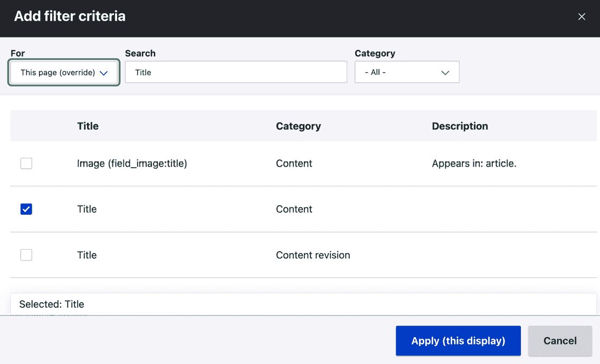

图 3.7 – 添加筛选表单对话框

1.  选中**向访客展示此筛选器，允许他们更改它**复选框，使其成为一个公开筛选器。在公开筛选器配置表单中，将**操作符**从**等于**更改为**包含**。这将允许进行更灵活的搜索。点击**应用（此显示**）以添加新筛选器。

1.  在**排序**条件部分，点击**内容：作者时间（降序**）。从**为**选择列表中选择**此页面（覆盖**）。

1.  选中**向访客展示此排序，允许他们更改它**复选框，使其成为一个公开排序。

1.  点击**应用（此显示**）以更新排序配置。

1.  点击**保存**以保存对视图的更改。

1.  现在，当你查看`/blog`时，你可以搜索文章并更改它们的排序顺序：

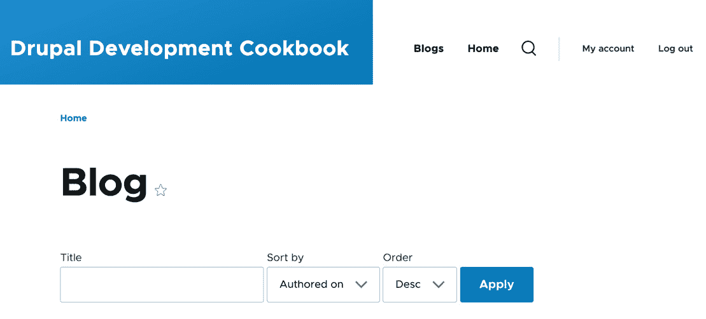

图 3.8 – 带有公开筛选器和排序的博客着陆页

## 工作原理...

当筛选或排序被公开时，视图模块会将一个表单附加到视图显示。这个表单由`\Drupal\views\Form\ViewsExposedForm`类控制。它从 URL 中读取查询参数值，并将它们映射到已知的公开筛选器和排序。它将这些值应用到筛选器和排序处理程序，覆盖它们的默认值，以便调整查询。

## 还有更多...

现在，我们将探讨使用暴露过滤器和排序时可用的一些额外选项。

### 暴露与非暴露过滤器和排序

过滤器允许您缩小视图显示的数据范围。过滤器可以是暴露的或不暴露的；默认情况下，过滤器不是暴露的。例如，使用**内容：发布状态**选项设置为**是（已发布**）以确保视图始终包含已发布的内容。这是一个您会配置以向网站访客显示内容的项。然而，如果是用于管理显示，您可能希望暴露该过滤器。这样，内容编辑者可以轻松查看尚未发布或已取消发布的内容。

所有过滤和排序标准都可以标记为暴露。

### 过滤器标识符

暴露过滤器通过解析 URL 中的查询参数来工作。在我们的博客页面上，当您通过标题搜索并提交暴露表单时，URL 现在将有一个`title`、`sort_by`和`sort_order`的查询参数。

暴露过滤器有一个可以更改 URL 组件的**过滤器标识符**选项。这可以在编辑过滤器或排序时进行修改。

### 作为块的暴露表单

如果您的视图使用暴露过滤器，您可以选择将暴露表单放置在块中。启用此选项后，您可以在页面的任何位置放置该块，甚至是非视图页面。

在块中使用暴露表单的一个例子是用于搜索结果视图。您可以添加一个用于控制搜索结果的暴露过滤器。在块中的暴露过滤器可以轻松地放置在您网站的页眉中。当提交暴露过滤器块时，它将引导用户到视图的显示。在这个菜谱中，它将允许用户搜索文章，而无需在`/``blog`页面上。

要将暴露的过滤器作为块启用，首先，您必须展开视图编辑表单右侧的**高级**部分。从**高级**部分点击**块中的暴露表单**选项。在打开的选项模态中，选择**是**单选按钮，然后点击**应用**。您可以将块放置在**块****布局**表单中。

# 根据路径参数进行过滤的上下文过滤器

视图可以被配置为接受上下文过滤器，也称为参数。上下文过滤器允许您提供一个动态或固定的参数来修改视图的查询。将其视为查询中的根条件。默认情况下，期望从 URL 中提供值；如果没有提供，可以选择默认操作。

在这个菜谱中，我们将创建一个名为`/user/{user_id}/content`的新页面路径。`{user_id}`的值将是 Drupal 中可用的任何用户 ID。

## 如何做到这一点...

1.  前往**结构**然后**视图**。这将带您查看所有已创建视图的管理概览。点击**添加视图**以创建一个新的视图。

1.  将**视图名称**设置为**我的内容**。

1.  接下来，我们将修改**视图设置**部分。我们想显示**所有**类型的**内容**，并保持**标记为**字段为空。这将允许显示所有内容类型。

1.  检查`user/%user/content`。点击**保存并编辑**以转到下一屏幕：

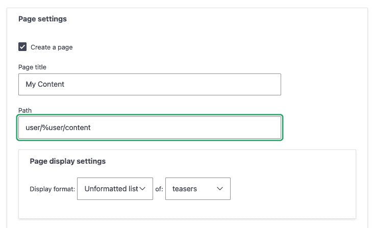

图 3.9 – 带路径变量的页面设置

路径中的百分号

当在视图页面显示路径中使用百分号时，Views 模块将其理解为上下文过滤器将使用的值的占位符。例如，给定`/user/1234/content`路径，`%user`的值将是`1234`。

1.  切换页面右侧表单的**高级**部分。在**上下文****过滤器**部分点击**添加**。

1.  从**内容**类别中选择**作者**，然后点击**添加并配置上下文****过滤器**按钮。

1.  将**当过滤器值不在 URL 中时**的默认值更改为**显示“访问拒绝”**，以防止所有内容因错误的路由值而显示。点击**应用**以添加上下文过滤器并关闭对话框：

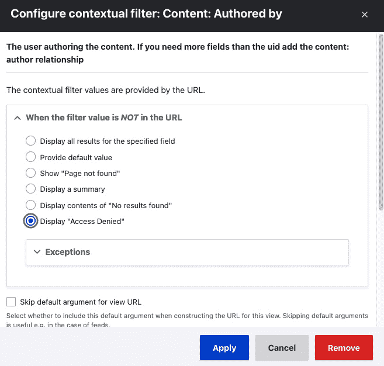

图 3.10 – 上下文过滤器设置

1.  在**页面设置**下，默认访问权限是**查看已发布内容**权限。点击**查看已发布内容**以将权限更改为**查看用户信息**。点击**应用**以设置页面显示的权限。

1.  接下来，我们将把页面添加到用户页面上的菜单标签。从**菜单**选项中点击**无菜单**。

1.  选择**菜单标签**并提供一个**菜单链接**标题，例如**我的内容**。点击**应用**以更改菜单设置：

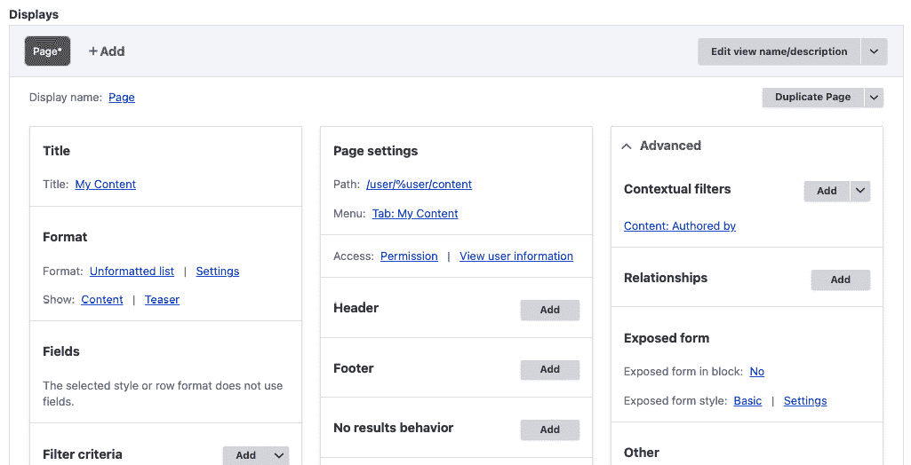

图 3.11 – 配置的视图概述

1.  然后，点击**保存**以保存视图。

1.  前往 `/user/1/content`，你将看到第一个用户创建的内容。它也将作为标签显示在**查看**和**编辑**旁边。

## 它是如何工作的…

上下文过滤器类似于在 Drupal 的路由系统中使用路由参数，该系统建立在 Symfony 的路由组件之上。路由参数在视图的页面显示路径中以百分号作为占位符。视图将按照它们放置的顺序将每个占位符与上下文过滤器匹配。这允许你拥有多个上下文过滤器，因此只需确保它们按正确顺序排列。

在其他显示类型上使用上下文过滤器

当使用其他显示类型，如块时，你需要使用**提供一个默认值****选项**。

大多数可以用作常规过滤器的字段都可以用作上下文过滤器。这种做法的好处是它们可以接收动态值，而无需强迫它们作为暴露给最终用户的过滤器。

## 更多内容…

现在我们将探讨使用上下文过滤器时可用的一些额外选项。

### 使用上下文过滤器预览

您仍然可以从编辑表单预览视图。您只需将上下文过滤器值添加到由正斜杠（`/`）连接的文本表单中即可。在这个配方中，您可以通过在预览表单中输入`1`并更新预览来复制导航到`/user/1/content`。

### 提供默认值

当过滤器值不可用时，有一个选项可以提供默认值。例如，可以提供一个固定值作为后备，或者视图可以尝试从当前 URL 获取内容 ID 或使用当前登录用户。一些选项始终可用，而一些则取决于视图中显示的数据。

当使用具有块显示的视图时，默认值选项允许您在没有路径可用以提供参数值的情况下利用上下文过滤器。这在使用布局构建器创建落地页时特别有用。

### 修改页面标题

使用上下文过滤器，您可以操作当前页面的标题。您可以在“**当过滤器值在 URL 中或提供默认值时**”部分中检查“**覆盖标题**”选项。

此文本框允许您输入将显示的新标题。**替换模式**部分包含可用于动态标题内容的占位符。

### 上下文过滤器参数的验证

上下文过滤器可以附加验证要求。如果没有指定额外的验证，视图模块将采用预期的参数并尝试使其正常工作。您可以添加验证来帮助限制此范围并过滤掉无效的路由参数。

您可以通过勾选“**指定验证标准**”从“**当过滤器值在 URL 中或提供默认值时**”部分来启用验证。默认设置为“**基本验证**”，这允许您指定视图在数据无效时应该如何反应。根据我们的配方，这将是如果找不到路由参数中的 ID 对应的用户。

**验证器**选项列表不会被您选择的上下文过滤器项过滤。因此，其中一些可能不适用。对于我们的配方，您可能希望选择“**用户 ID**”选项。此验证器将确保用户 ID 存在。

这为您提供了对视图如何操作以及在使用上下文过滤器时如何执行查询的细粒度控制。

### 多个参数和排除

您可能配置上下文过滤器以允许“**AND**”或“**OR**”操作，同时使用上下文过滤器值进行排除而不是包含。这些选项在添加或编辑上下文过滤器时位于“**更多**”部分。

“**AND**”或“**OR**”操作。如果上下文过滤器参数包含由加号（`+`）连接的一系列值，则它充当“**OR**”操作。如果值由逗号（`,`）连接，则它类似于“**AND**”操作。

当勾选了`排除`选项时，值将被排除在结果之外，而不是基于该值限制结果。例如，使用本菜谱中提供的用户 ID，我们可以排除该用户创建的内容，以显示其他所有用户创建的内容。

# 在具有关系的视图中添加相关数据

如本章开头所述，视图是一个可视化查询构建器。当你首次创建视图时，会指定一个基础表，从中提取数据。视图模块会自动知道如何连接字段数据表，例如正文文本或自定义附加字段。

当使用实体引用字段时，你可以将值显示为标识符、引用实体的标签或整个渲染的实体。然而，如果你基于引用字段添加关系，你将能够显示该实体可用的任何字段。

在本菜谱中，我们将更新用于管理文件的**文件**视图，以显示上传文件的用户的用户名。

## 如何操作…

1.  前往**结构**然后**视图**。这将带您到所有已创建视图的管理概览。

1.  找到**文件**视图并点击**编辑**：

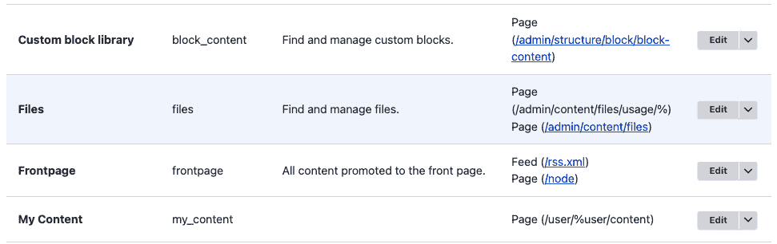

图 3.12 – 视图列表中的文件视图

1.  点击**高级**以展开该部分，然后点击**添加**，它位于**关系**旁边。

1.  搜索**用户**。选择**上传用户**的关系选项，然后点击**应用（**此显示**）**。

1.  接下来，我们将看到一个关系配置表单。点击**应用（此显示）**以使用默认值。

1.  通过在**字段**部分点击**添加**来添加一个新字段。

1.  搜索**名称**并从**用户**类别中选择**名称**字段。然后，点击**应用（**所有显示**）**：

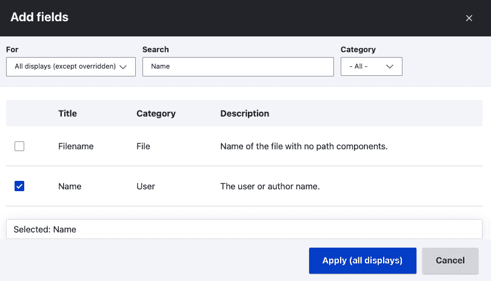

图 3.13 – 用户类别中的名称字段

1.  此视图使用聚合，当你首次添加字段时，会显示一个新的配置表单。点击**应用并继续**以使用聚合默认值。

1.  我们将使用默认字段设置，这将提供**名称**标签，并以用户名和链接到用户个人资料的方式格式化。点击**应用（**所有显示**）**。

1.  点击**保存**以完成编辑视图并提交您的更改。

1.  当在`/admin/content/files`中查看文件列表时，现在将显示上传文件的用户的用户名。

## 它是如何工作的…

Drupal 以规范化的格式存储数据。简而言之，数据库规范化涉及将数据组织到特定相关的表中。每种实体类型都有自己的数据库表，所有字段也都有各自的数据库表。当你创建一个视图并指定将显示哪种数据时，你实际上是在指定数据库中的一个基础表，视图将查询这个表。视图会自动将属于实体及其关系的字段与那些表关联起来。

当一个实体有一个实体引用字段时，你可以向引用的实体类型表添加一个关系。这是一个显式定义，而字段是隐式的。当关系被显式定义时，所有引用的实体类型的字段都会进入作用域。然后可以在引用的实体类型上显示、过滤和排序字段。

## 更多内容...

使用视图中的关系可以创建一些强大的显示效果。现在我们将讨论关于关系的一些附加信息。

### 通过实体引用字段提供的关系

Views 模块使用一系列钩子来检索数据，然后使用这些数据来表示与数据库交互的方式。其中之一是`hook_field_views_data`钩子，它处理字段存储配置实体并将其数据注册到 Views 中。Views 模块代表 Drupal 核心实现此钩子，以添加实体引用字段的正向和反向关系。

由于实体引用字段具有固定的模式信息，Views 可以通过理解字段表名、目标实体表名和目标实体标识列来动态生成这些关系。

### 通过自定义代码提供的关系

有时候，你需要使用自己的自定义代码在数据库中定义一个关系。将数据库表暴露给 Views 模块的一个例子是在`hook_views_data`钩子中，用于向 Views 模块暴露其数据库信息。

例如，`dblog_schema`钩子实现返回 watchdog 数据库表的`uid`列。这是用户表的键外键，用于将日志与用户关联起来。该列随后通过以下定义暴露给视图：

```php
  $data['watchdog']['uid'] = [
    'title' => t('UID'),
    'help' => t('The user ID of the user on which the log
        entry was written.'),
    'field' => [
      'id' => 'standard',
    ],
    'filter' => [
      'id' => 'numeric',
    ],
    'argument' => [
      'id' => 'numeric',
    ],
    'relationship' => [
      'title' => t('User'),
      'help' => t('The user on which the log entry as
          written.'),
      'base' => 'users_field_data',
      'base field' => 'uid',
      'id' => 'standard',
    ],
  ];
```

这个数组告诉 Views，`watchdog`表有一个名为`uid`的列。它在显示、过滤和排序方面是数值型的。关系键是一个信息数组，指导 Views 如何使用它来在`users`表上提供关系（`LEFT JOIN`）。用户实体使用`users`表，其主键为`uid`。

# 提供实体引用结果视图

实体引用字段允许您引用其他实体。通常，这与内容一起使用，以引用分类术语或相关内容。默认情况下，实体引用将显示所有可引用的实体。然而，使用视图模块及其实体引用视图显示类型，您可以提供更受控的结果。

在这个菜谱中，我们将创建一个实体引用视图，该视图根据当前作者创建的内容过滤引用。然后，我们将向用户账户表单添加一个字段，允许用户选择他们最喜欢的贡献内容。

## 如何做到这一点...

1.  前往**结构**然后**视图**。这将带您到所有已创建视图的管理概览。点击**添加视图**以创建新的视图。

1.  将**视图名称**设置为**我的内容引用视图**并保持当前的**视图设置**配置。

1.  不要选择创建页面或块。点击**保存并编辑**以继续编辑您的视图。

1.  点击**添加**按钮以创建新的显示。选择**实体引用**选项以创建新的显示：

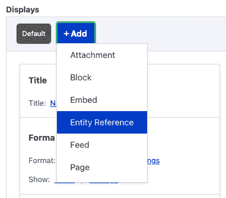

图 3.14 – 添加显示的下拉菜单

1.  样式格式将自动设置为**实体引用列表**旁边的**设置**以修改样式格式设置。

1.  对于**搜索字段**，勾选**内容：标题**选项，然后点击**应用**。这就是该字段将执行自动完成搜索的内容：

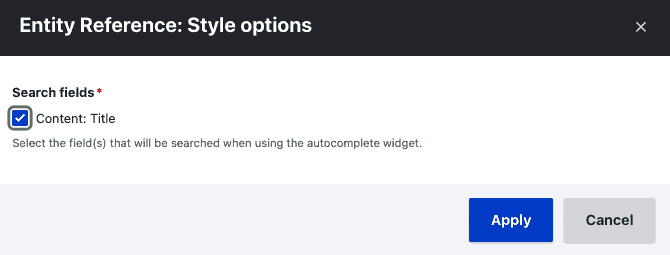

图 3.15 – 实体引用样式选项

1.  然后，我们将使用上下文过滤器来限制结果仅限于当前登录用户。在**高级**部分点击**上下文过滤器**中的**添加**。

1.  在**内容**类别中选择**作者**选项，然后点击**添加和配置上下文过滤器**。

1.  将**当过滤器值不可用**设置更改为**提供默认值**。从**类型**选择列表中选择**从登录用户获取用户 ID**。点击**应用**以添加上下文过滤器：

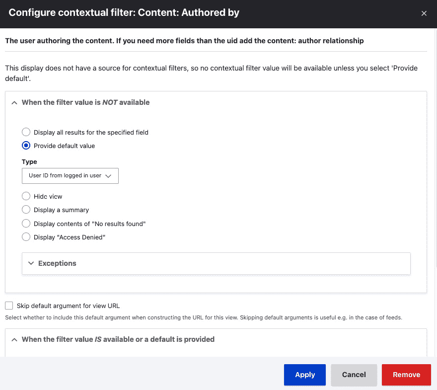

图 3.16 – 带有默认值的用户上下文过滤器

1.  点击**保存**以保存视图。

1.  在管理工具栏中转到**配置**，然后点击**账户设置**以点击**管理字段**来配置用户账户上的字段。

1.  添加一个新的**引用**字段，该字段引用**内容**。命名为**突出贡献**并允许其具有无限值。点击**保存字段设置**按钮。

1.  将**引用类型**方法更改为使用**视图：通过实体引用视图过滤**并选择我们刚刚创建的视图。点击**保存设置**按钮。

1.  现在，当用户编辑他们的账户时，他们只能引用他们创建的内容作为此引用字段的值。

## 它是如何工作的…

实体引用字段定义提供了选择插件。视图模块提供了一个实体引用选择插件。这允许实体引用将数据收集到视图中以接收可用结果。

视图的显示类型要求您选择在使用自动完成小部件时将使用哪些字段进行搜索。如果您不使用自动完成小部件，而是使用选择列表或复选框和单选按钮，则它将返回视图显示的全部结果。

# 使用视图显示图表

在本食谱中，我们将使用**图表**模块通过视图模块创建图表。图表模块将不同的绘图库与视图模块集成。本食谱中创建的视图将根据从统计模块生成的统计数据显示图表，以图表化 Drupal 站点上的内容访问。

利用图表模块创建一个渲染数据图表的视图。

## 准备工作

本食谱需要足够的数据来放入图表中。我们将使用来自统计模块的数据，该模块跟踪内容页面浏览量。为了生成内容和查看统计信息，我们将使用**Devel**（开发）模块。此模块提供了生成示例内容和填充统计信息的方法。

要使用`Devel`生成内容，我们必须使用 Composer 添加它，并使用**Drush**安装它：

```php
composer require drupal/devel
php vendor/bin/drush en devel_generate statistics --yes
```

现在，我们可以生成内容。登录到您的 Drupal 站点并访问`/admin/config/development/generate/content`。勾选**文章**复选框以生成文章。确保勾选**为每个节点（node_counter 表）添加统计信息**复选框，以便生成统计信息。按**生成**以生成示例内容。

## 如何做…

1.  首先，我们必须使用 Composer 将图表模块添加到 Drupal 站点，并使用`Drush`安装它及其 Google 图表子模块：

    ```php
    composer require drupal/charts
    ```

    ```php
    php vendor/bin/drush en charts charts_google --yes
    ```

1.  前往**结构**然后**视图**。这将带您到所有已创建视图的管理概览。点击**添加视图**以创建新的视图。

1.  将**视图名称**设置为**内容统计**，并保留默认的**视图****设置**值。

1.  打开**创建页面**复选框以创建页面。使用提供的默认值。在**页面显示设置**下，将显示格式更改为**字段**的**图表**：

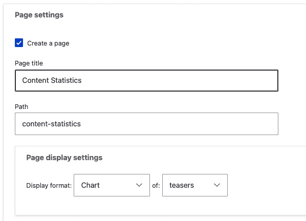

图 3.17 – 图表视图的页面设置

1.  点击**保存并编辑**以继续对视图进行工作。

1.  在**字段**部分，点击**添加**。在**内容统计**类别下搜索**总浏览量**。点击**添加和配置字段**以继续。

1.  打开**创建标签**复选框，并将**标签**设置为**总浏览量**。点击**应用**以完成字段的添加。

1.  接下来，我们需要配置图表以使用我们的**总浏览量**字段作为图表的数据。在**格式**部分，点击**图表**旁边的**设置**。

1.  从**图表库**下拉菜单中选择**Google**。

1.  保持**标签字段**选项设置为**内容：标题**。在**提供数据**列中，勾选**totalcount**复选框：

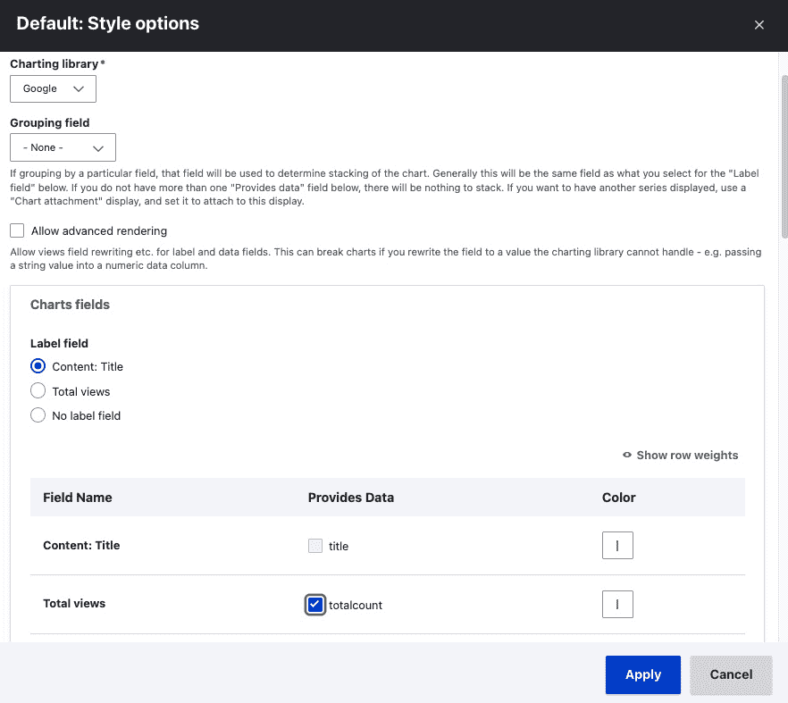

图 3.18 – 图表样式设置

1.  点击**应用**以设置图表设置。

1.  点击**保存**以保存您的视图。

1.  访问`/content-statistics`以查看使用统计图表。

## 它是如何工作的…

图表模块提供了一个 API，可以与各种图表库（如 Google Charts、Highcharts 等）集成。开发者可以使用自定义代码创建图表，但其中一个最伟大的功能是它与视图的集成。

图表模块允许您以各种图表类型显示值。它还允许您提供多种数据类型以创建高级图表。每个图表库都有各种可配置的设置。

## 参见

+   Drupal.org 上的图表模块项目页面：[`www.drupal.org/project/charts`](https://www.drupal.org/project/charts)

+   图表模块文档：[`www.drupal.org/docs/contributed-modules/charts`](https://www.drupal.org/docs/contributed-modules/charts)
