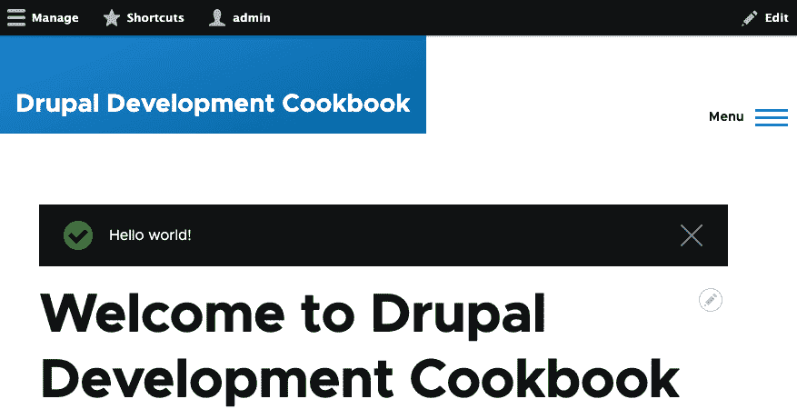
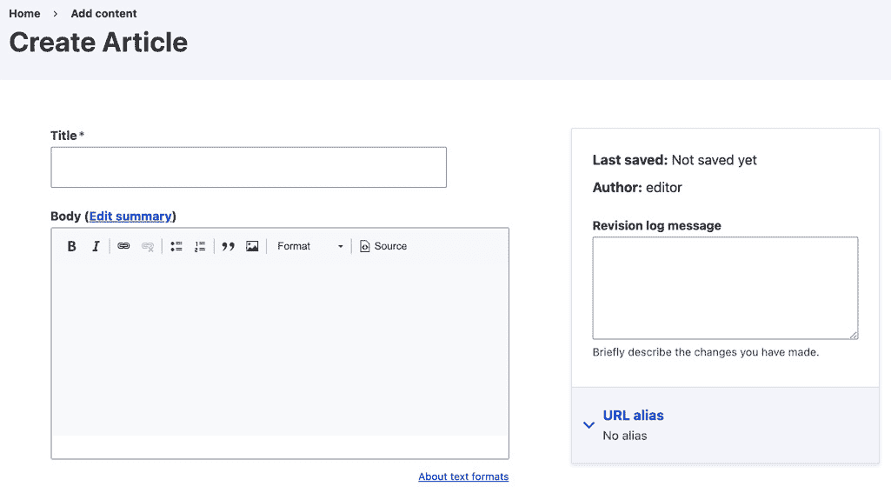
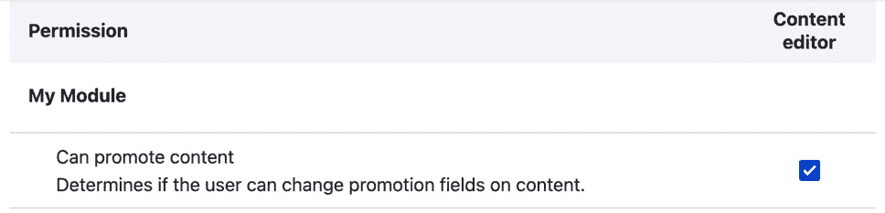
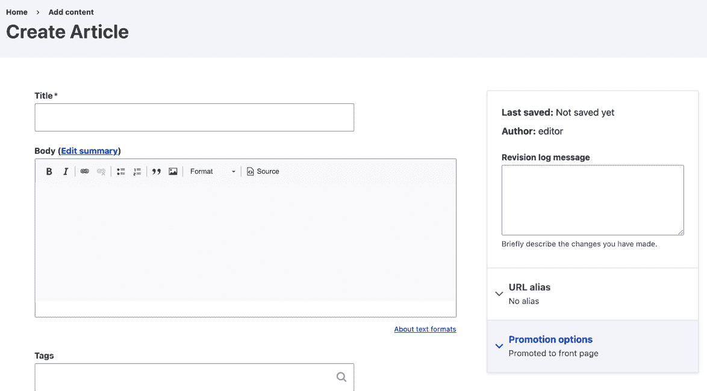
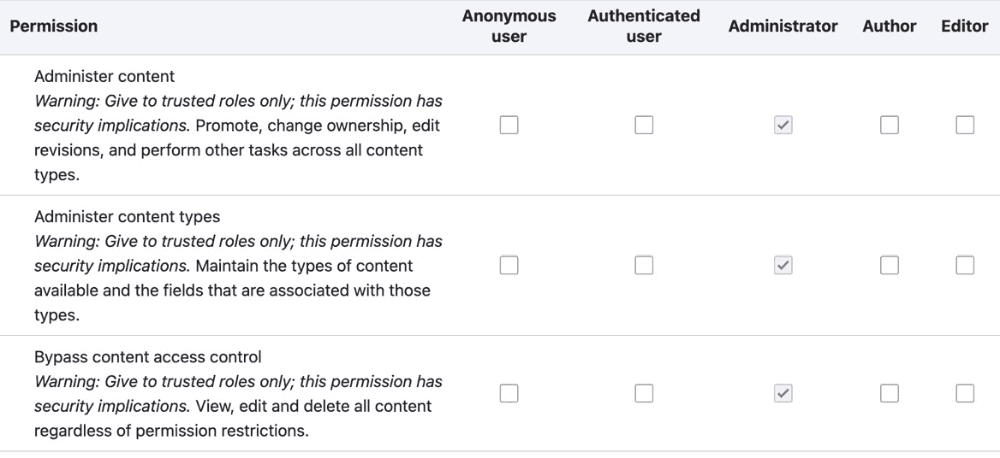
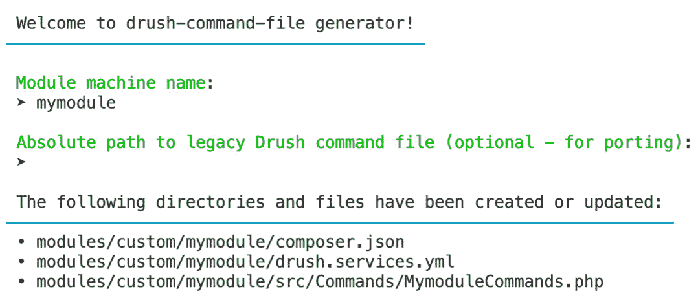

# 第四章：使用自定义代码扩展 Drupal

Drupal 最伟大的组成部分是通过模块的可扩展性。在本章中，我们将探讨如何创建一个可以在你的 Drupal 站点上安装的自定义模块。本章将解释 PSR-4 自动加载如何与扩展一起工作，以及如何利用类自动加载。你将能够为自定义页面创建控制器并指定额外的权限以检查用户是否拥有它们。你还将了解 Drupal 中的钩子和事件是什么，以及如何与之交互。本章还为后续章节奠定了基础。

本章将涵盖以下内容：

+   创建一个模块

+   为你的模块提供配置设置

+   定义权限并检查用户是否有访问权限

+   钩入 Drupal 以响应实体更改

+   创建一个事件订阅者以响应事件

+   创建自定义 Drush 命令

# 技术要求

你可以在 GitHub 上找到本章使用的完整代码：[`github.com/PacktPublishing/Drupal-10-Development-Cookbook/tree/main/chp04`](https://github.com/PacktPublishing/Drupal-10-Development-Cookbook/tree/main/chp04)

# 创建一个模块

扩展 Drupal 的第一步是创建一个自定义模块。尽管这项任务听起来令人畏惧，但可以通过几个简单的步骤完成。模块可以提供其他模块提供的功能性和定制，或者它们可以用作包含配置和站点状态的方式。

在这个示例中，我们将通过定义其`modulename.info.yml`文件来创建一个模块，这是一个包含 Drupal 用于发现扩展和安装模块的信息的文件。

## 如何操作…

1.  在你的`web/modules`目录中，创建一个名为`custom`的新目录，然后在其中创建一个名为`mymodule`的子目录。这将是你模块的目录。使用命令行，你可以使用以下命令创建目录：

    ```php
    mkdir -p web/modules/custom/mymodule
    ```

这将创建所需的目录。

1.  在你的模块目录中创建一个名为`mymodule.info.yml`的文件。这将包含标识模块给 Drupal 的元数据。

1.  在`mymodule.info.yml`文件中添加一行，使用`name`键为模块提供名称：

    ```php
    name: My Module
    ```

1.  我们必须使用键`type`定义扩展的类型。Drupal 不会仅通过目录位置来假设扩展类型：

    ```php
    type: module
    ```

1.  `description`键允许你提供有关模块的额外信息，这些信息将在模块列表页面上显示：

    ```php
    description: This is an example module from the Drupal
    ```

    ```php
    Development Cookbook!
    ```

1.  扩展需要提供一个`core_version_requirement`，以使用语义化版本控制约束来标识模块与哪些版本的 Drupal 核心兼容：

    ```php
    core_version_requirement: '>=10'
    ```

1.  保存`mymodule.info.yml`文件，其内容如下：

    ```php
    name: My Module
    ```

    ```php
    type: module
    ```

    ```php
    description: This is an example module from the Drupal
    ```

    ```php
      Development Cookbook!
    ```

    ```php
    core_version_requirement: '>=10'
    ```

1.  接下来，在你的`module`文件中创建一个名为`mymodule.module`的文件。这是允许我们添加钩子定义的扩展文件。它是一个普通的 PHP 文件，但文件扩展名与其扩展类型匹配。

1.  对于这个示例，我们将提供一个在每次有效载荷上渲染消息的钩子：

    ```php
    <?php
    ```

    ```php
    /**
    ```

    ```php
     * Implements hook_page_top().
    ```

    ```php
     */
    ```

    ```php
    function mymodule_page_top() {
    ```

    ```php
      \Drupal::messenger()->addStatus('Hello world!');
    ```

    ```php
    }
    ```

这实现了 `hook_page_top`，每当页面被渲染时都会被调用。它使用消息传递服务向页面添加状态消息。

1.  使用 Drush 安装您的模块：

    ```php
    php vendor/bin/drush en mymodule --yes
    ```

1.  访问您的 Drupal 网站。`Hello world!` 消息将被添加到每个页面：



图 4.1 – 显示“Hello world!”的 Drupal 页面

## 它是如何工作的…

Drupal 利用 `info.yml` 文件来定义扩展。Drupal 有一个扩展发现系统，它会定位这些文件并解析它们以发现模块。扩展发现将扫描您的整个 Drupal 代码库，并将 Drupal 核心目录优先考虑。

在这个配方中，我们为 `core_version_requirement` 约束提供了 `>=10`。这个约束允许您的模块与最低的 Drupal 10.0.0 版本兼容，同时也与 Drupal 11 或更高版本兼容，简化了在下一个 Drupal 核心主要版本发布时的维护工作。如果您知道您的代码与之前的次要版本不兼容，它可能需要更新到 `>=10.1.0` 或甚至特定的补丁值 `>=10.2.1`。

一种与 Drupal 集成的方法是使用其钩子系统。在运行时，其他模块可能会调用其他模块可以实现的钩子，以执行操作或修改数据。我们的配方实现了 `hook_page_top` 钩子。这个钩子是页面渲染生命周期的一部分，允许您在页面的最顶部添加可渲染内容。

### 模块命名空间

Drupal 使用由 **PHP 框架互操作性小组**（**PHP-FIG**）开发的 PSR-4 标准。PSR-4 标准是针对基于包的 PHP 命名空间自动加载类的，并被大多数库和框架使用，包括 Laravel 和 Symfony。它定义了一个标准，以了解如何根据命名空间和类名自动包含类。Drupal 模块在 Drupal 根命名空间下有自己的命名空间。

使用配方中的模块，我们的 PHP 命名空间将是 `Drupal\mymodule`，这代表 `web/modules/mymodule/src` 文件夹。

使用 PSR-4，文件只需要包含一个类、接口或特质。这些文件需要与包含的类、接口或特质的名称具有相同的文件名。这允许类加载器将命名空间解析为目录路径，并知道类的文件名。当文件在文件中使用时，它将被自动加载。

### 创建 composer.json 文件

如果您正在编写一个仅将在您的网站上使用的自定义模块，这并不是必需的。然而，如果您计划将您的代码贡献给 Drupal.org 并分发它，您应该提供一个 `composer.json` 文件。

注意

Drupal.org 上的项目不需要创建 `composer.json` 文件。如果没有，将根据其 `info.yml` 文件的内容自动为其生成一个。这就是为什么建议创建一个的原因：为了明确。

在你的模块目录中创建一个 `composer.json` 文件。它看起来与 `mymodule.info.yml` 文件类似，但格式为 JSON：

```php
{
    "name": "drupal/mymodule",
    "type": "drupal-module",
    "description": "This is an example module from the Dru
        pal Development Cookbook!",
    "require": {
        "drupal/core": ">=10"
    }
}
```

`name` 键应该以 `drupal/` 前缀开头，以标识它位于 Drupal 包命名空间中。类型以 `drupal-` 前缀开头，以与我们在 *第一章* 中介绍的 *Up and Running with Drupal* 的 Composer 安装程序包兼容。

`core_version_requirement` 被转换为 Composer 的依赖定义，并针对 `drupal/core` 包。

## 还有更多...

关于 Drupal 模块和模块 `info.yml` 文件，我们可以探索更多细节。

### 模块依赖项

模块可以定义依赖项以确保在安装你的模块之前安装那些模块。

下面是 `Pathauto` 模块的 `info.yml` 文件的一个示例：

```php
name: 'Pathauto'
description: 'Provides a mechanism for modules to automati
    cally generate aliases for the content they manage.'
type: module
dependencies:
- ctools:ctools
- drupal:path
- token:token
```

`dependencies` 键指定在安装 `Pathauto` 模块之前必须先安装来自 Drupal 核心的 `ctools` 路径和 `token` 模块。在 *第一章* 的 *Up and Running with Drupal* 中，当我们安装 `Pathauto` 模块时，它们会自动安装。

Drupal 一直支持包含附加子模块的模块，这在其他系统中是不常见的做法。随着 Drupal 采用了 Composer，它强制在 `info.yml` 文件中实施命名空间依赖。这标识了根包以及它包含要安装的特定模块。

如果你的模块有依赖项并且你打算贡献它，请记住创建一个 `composer.json` 文件并定义你的依赖项，这样它们就会与 Composer 一起下载。

## 更多信息...

+   参考关于 *PSR-4: 自动加载* 的 *规范*：[`www.php-fig.org/psr/psr-4/`](https://www.php-fig.org/psr/psr-4/)

+   通过添加 `core_version_requirement` 和其添加的原因来更改记录：[`www.drupal.org/node/3070687`](https://www.drupal.org/node/3070687)

+   [Drupal.org](http://Drupal.org) 的模块创建文档：[`www.drupal.org/docs/creating-custom-modules`](https://www.drupal.org/docs/creating-custom-modules)

# 为你的模块提供配置设置

模块可以利用配置设置来允许最终用户修改它们的工作方式。这些配置项是 YAML 文件。模块还可以在安装时为其他模块提供默认配置。一旦模块被安装，它提供的默认配置就会被导入到 Drupal 中。模块还可以通过安装钩子或更新钩子程序化地修改现有配置。

在这个菜谱中，我们将提供一个配置，创建一个新的联系表单，然后通过更新钩子来操作它。

## 准备工作

这个菜谱需要一个自定义模块，就像第一个菜谱中创建的那样。在这个菜谱中，我们将把这个模块称为 `mymodule`。在需要的地方使用你模块的适当名称。

## 如何做…

1.  在你的模块目录中创建一个 `config` 文件夹。然后，在那个目录中创建一个 `install` 目录。Drupal 在这个安装目录中查找 YAML 配置：

    ```php
    mkdir -p config/install
    ```

1.  在 `install` 目录中创建一个 `contact.form.contactus.yml` 文件来存储联系表单的 YAML 定义，即 `Contact Us`。

1.  将以下 YAML 内容添加到 `contact.form.contactus.yml` 文件中：

    ```php
    langcode: en
    ```

    ```php
    status: true
    ```

    ```php
    dependencies: { }
    ```

    ```php
    id: contactus
    ```

    ```php
    label: 'Contact Us'
    ```

    ```php
    recipients:
    ```

    ```php
    - webmaster@example.com
    ```

    ```php
    reply: ''
    ```

    ```php
    weight: 0
    ```

这个 YAML 文件代表了一个联系表单的导出配置对象。`id` 是联系表单的机器名，`label` 是用户界面的显示名称。`recipients` 键是一个有效的电子邮件地址的 YAML 数组。`reply` 键是用于 `自动回复` 消息的文本字符串。最后，`weight` 定义了表单在管理列表中的顺序。

注意

通常，你不会手动编写像这样的配置 YAML。如果需要，你通常将从 Drupal 网站中单独导出它。

1.  使用 Drush 安装模块：

    ```php
    php vendor/bin/drush en mymodule --yes
    ```

1.  现在 **联系我们** 表单将位于 **联系表单** 概览页上，位于 **结构** 之下。

1.  在模块的目录中创建一个 `mymodule.post_update.php` 文件。这个文件包含在架构更改后要运行的更新钩子。

1.  我们将创建一个名为 `mymodule_post_update_change_contactus_reply()` 的函数，该函数将由更新系统执行以修改联系表单的配置：

    ```php
    <?php
    ```

    ```php
    /**
    ```

    ```php
     * Update "Contact Us" form to have a reply message.
    ```

    ```php
     */
    ```

    ```php
    function mymodule_post_update_change_contactus_reply()
    ```

    ```php
      {
    ```

    ```php
      $contact_form = \Drupal\contact\Entity\Contact
    ```

    ```php
        Form::load('contactus');
    ```

    ```php
      $contact_form->setReply(t('Thank you for contacting
    ```

    ```php
        us, we will reply shortly'));
    ```

    ```php
      $contact_form->save();
    ```

    ```php
    }
    ```

这个函数使用实体的类来加载联系表单实体对象。它加载了 **联系我们** 的联系表单，这是我们的模块提供的，并将回复属性设置为新的值。

1.  使用 Drush 为 Drupal 网站运行更新：

    ```php
    php vendor/bin/drush updb
    ```

Drush 将列出要应用的所有更新，包括你刚刚编写的更新。更新函数的注释将被输出到要应用更新的列表中。在审查更改后，你可以在命令行中输入 `yes` 来告诉 Drush 继续执行。

1.  审查 **联系我们** 表单设置并验证回复消息是否已设置。

## 它是如何工作的…

Drupal 的 `moduler_installer` 服务，通过 `\Drupal\Core\Extension\ModuleInstaller` 提供，确保在安装时处理模块的 `config` 文件夹中定义的配置项。当安装模块时，通过 `\Drupal\Core\Config\ConfigInstaller` 提供的 `config.installer` 服务被调用以处理模块的默认配置。

如果 `config.installer` 服务尝试从模块的 `config/install` 文件夹导入已存在的配置，将抛出异常。模块不能通过 YAML 文件提供重复的配置或修改现有的配置对象。

由于模块不能通过提供给 Drupal 的 YAML 文件调整配置对象，它们可以利用更新系统来修改配置。更新系统有两个更新过程：模式更新和后续更新。由于我们没有进行模式级别的更改，我们使用了后续更新过程。这允许我们对现有配置对象进行修改。

在*第七章*《使用表单 API 创建表单》中，我们将创建一个用于修改配置设置的表单。

## 更多内容...

现在我们将深入探讨在处理模块和配置时的一些重要注意事项。

### 配置子目录

配置管理系统将在模块的`config`文件夹中检查三个目录，具体如下：

+   `install`

+   `可选`

+   `schema`

`install`文件夹指定要导入的配置。如果配置对象存在，安装将失败。`optional`文件夹包含在满足以下条件时将安装的配置：

+   配置尚不存在

+   这是一个配置实体

+   它的依赖关系可以满足

如果任何一个条件失败，配置将不会安装，但不会停止模块的安装过程。`schema`文件夹提供配置对象定义。

### 在安装时修改现有配置

配置管理系统不允许模块在已存在的安装上提供配置。例如，如果模块尝试提供`system.site`并定义站点名称，它将无法安装。这是因为当您首次安装 Drupal 时，`system`模块提供了这个配置对象。

模块也可能有一个`.install`文件，例如我们食谱模块的`mymodule.install`。这个文件是模块可能实现 Drupal 提供的`hook_install`钩子和模式更新钩子的地方。

`hook_install()`在模块的安装过程中执行。以下代码将在模块安装时将站点标题更新为`Drupal Development Cookbook`！

```php
<?php
/**
* Implements hook_install().
*/
function mymodule_install() {
  // Set the site name.
  \Drupal::configFactory()
    ->getEditable('system.site')
    ->set('name', 'Drupal Development Cookbook!')
    ->save();
}
```

可配置对象默认是不可变的，这意味着当通过默认的`config`服务加载时，它们不能被更改或保存。要修改配置对象，您需要使用配置工厂来接收一个可编辑的配置对象实例。这个对象可以有`set`和`save`方法，这些方法被执行以更新配置对象中的配置。

### 模式更新钩子

本食谱提到了模式更新钩子。这些钩子旨在用于更改任何数据库模式或实体字段定义。当更新系统运行时，首先运行模式钩子；然后执行后续更新。

架构更新钩子被定义为 `hook_update_N`，其中 `N` 是一个数字架构版本值。当架构更新钩子被执行时，它们将按照它们的架构版本顺序运行。通常，基本架构版本基于 Drupal 核心的主版本或模块的版本。在自定义代码中，它可以是你想要的任何东西。

架构更新的命名约定自 Drupal 8 以来一直在讨论中，涉及对贡献项目的语义版本支持。以下问题中讨论了这些命名约定：

+   [`www.drupal.org/project/drupal/issues/3106712`](https://www.drupal.org/project/drupal/issues/3106712)

+   [`www.drupal.org/project/drupal/issues/3010334`](https://www.drupal.org/project/drupal/issues/3010334)

## 参见

+   在 Drupal.org 上更新 API 文档：[`www.drupal.org/docs/drupal-apis/update-api`](https://www.drupal.org/docs/drupal-apis/update-api)

+   *第七章*，*使用表单 API 创建表单*

# 定义权限和检查用户是否有权访问

在 Drupal 中，角色和权限被用来定义用户强大的访问控制列表。模块使用权限来检查当前用户是否有权执行操作、查看特定项目或执行其他操作。然后模块定义了使用的权限，以便 Drupal 能够了解它们。开发者可以构建角色，这些角色由启用的权限组成。

在这个配方中，我们将在一个模块中定义新的权限，该模块用于检查用户是否可以将内容标记为推广到首页或粘性在列表顶部。此权限将用于实体字段访问钩子，如果用户缺少权限，则拒绝访问字段。

## 准备工作

创建一个新的模块，就像我们在第一个配方中所做的那样。在这个配方中，我们将把这个模块称为 `mymodule`。在以下配方中，根据需要使用你的模块名称。

创建一个新的具有内容编辑角色的 Drupal 用户。Drupal 会绕过第一个用户的访问检查。次要用户将需要展示权限。

## 如何做到这一点...

1.  权限存储在 `permissions.yml` 文件中。在你的模块基本目录中添加一个 `mymodule.permissions.yml` 文件。

1.  首先，我们需要定义用于识别此权限的内部字符串，例如 `can` `promote nodes`：

    ```php
    can promote nodes:
    ```

1.  每个权限都是一个包含数据的 YAML 数组。我们需要提供一个 `title` 键，它将在权限页面上显示：

    ```php
    can promote nodes:
    ```

    ```php
      title: 'Can promote content'
    ```

1.  权限有一个 `description` 键，用于在权限页面上提供权限的详细信息：

    ```php
    can promote nodes:
    ```

    ```php
      title: 'Can promote content'
    ```

    ```php
      description: 'Determines if the user can change pro
    ```

    ```php
        motion fields on content.'
    ```

1.  保存你的 `mymodule.permissions.yml` 文件，并编辑模块的 `mymodule.module` 文件，以便我们可以编写钩子来使用权限。

1.  在你的 `mymodule.module` 文件中，添加一个名为 `mymodule_entity_field_access` 的函数来实现 `hook_entity_field_access`。这将用于在实体表单的每个字段上以细粒度控制访问：

    ```php
    function mymodule_entity_field_access(
    ```

    ```php
      $operation,
    ```

    ```php
      \Drupal\Core\Field\FieldDefinitionInterface
    ```

    ```php
        $field_definition,
    ```

    ```php
      \Drupal\Core\Session\AccountInterface $account
    ```

    ```php
    ) {
    ```

    ```php
      return \Drupal\Core\Access\AccessResult::neutral();
    ```

    ```php
    }
    ```

Drupal 使用访问结果值对象来处理访问结果。访问结果可能是中立的、禁止的或允许的。实现`hook_entity_field_access`钩子的插件必须返回一个访问结果，并且不能返回`null`。

1.  在我们的钩子中，我们将检查正在检查的字段名称。如果字段名称是`promote`或`sticky`，我们将检查用户是否有`can promote nodes`权限，并返回该访问结果：

    ```php
    function mymodule_entity_field_access(
    ```

    ```php
      $operation,
    ```

    ```php
      \Drupal\Core\Field\FieldDefinitionInterface
    ```

    ```php
        $field_definition,
    ```

    ```php
      \Drupal\Core\Session\AccountInterface $account
    ```

    ```php
    ) {
    ```

    ```php
      $field_name = $field_definition->getName();
    ```

    ```php
      if ($field_name === 'promote' || $field_name ===
    ```

    ```php
        'sticky') {
    ```

    ```php
        $can_promote_nodes = $account->hasPermission('can
    ```

    ```php
            promote nodes');
    ```

    ```php
        return Drupal\Core\Access\AccessResult::allowedIf
    ```

    ```php
             ($can_promote_nodes);
    ```

    ```php
      }
    ```

    ```php
      return \Drupal\Core\Access\AccessResult::neutral();
    ```

    ```php
    }
    ```

访问结果对象有一个`allowedIf`方法，根据提供的参数返回适当的结果。在这种情况下，如果用户有权限，它将返回`AccessResult::allowed()`，如果没有，则返回`AccessResult::neutral()`。

注意

Drupal 的访问系统需要明确的允许。如果一个访问结果是中立的，系统将继续处理访问结果。如果一个访问结果被返回为禁止或允许，访问检查将停止，并使用该结果。如果最终结果是中立的，由于没有明确允许，访问将不被授予。

1.  新权限不会自动授予角色。在另一个浏览器或访客标签页中，以具有内容编辑角色的用户身份登录，并创建一个内容项。由于我们没有字段访问权限，侧边栏的**推广选项**部分将缺失：



图 4.2 – 由于缺少权限，推广选项被隐藏

1.  作为您的管理用户，请前往**人员**然后进入**权限**，在**我的****模块**部分添加您对内容编辑角色的权限：



图 4.3 – 向内容编辑角色添加权限

1.  使用您的内容编辑用户，再次尝试创建一个内容项。侧边栏中的**推广选项**部分将出现：



图 4.4 – 授予权限后，推广选项部分出现

## 它是如何工作的…

权限和角色由`User`模块提供。`user.permissions`服务发现由安装的模块提供的`permissions.yml`文件。默认情况下，服务是通过`\Drupal\user\PermissionHandler`类定义的。

Drupal 不会保存所有可用权限的列表。当加载权限页面时，系统的权限被加载。角色包含一个权限数组。

当检查用户的权限访问时，Drupal 会检查所有用户角色，以查看它们是否支持该权限。

注意

您可以将未定义的权限传递给用户访问检查，而不会收到错误。除非用户是 UID 1，否则访问检查将简单地失败。在 Drupal 中，UID 1 是根用户，不受安全检查或权限的约束。在授予该账户访问权限或使用用户 1 进行测试时要小心。

## 更多内容...

在接下来的章节中，我们将介绍更多在您的模块中处理权限的方法。

### 权限的访问限制标志

如果启用，权限可以标记为具有安全风险；这可以通过设置访问限制标志来完成。当此标志设置为`restrict access: TRUE`时，它将在权限的描述中添加一个警告。

这允许模块开发者提供更多关于权限可能赋予用户的控制量的背景信息：



图 4.5 – 带有访问限制标志的权限示例

我们从配方中定义的权限看起来会是这样：

```php
can promote nodes:
  title: 'Can promote content'
  description: 'Determines if the user can change promotion
    fields on content.'
  Restrict access: TRUE
```

### 通过编程定义权限

权限可以通过模块以编程方式或静态方式在 YAML 文件中定义。模块需要在它的`permissions.yml`文件中提供一个`permission_callbacks`键，该键包含一个可调用的方法或函数数组，以动态定义权限。

例如，`Filter`模块根据在 Drupal 中创建的不同文本过滤器提供细粒度的权限：

```php
permission_callbacks:
  -Drupal\filter\FilterPermissions::permissions
```

这告诉`user_permissions`服务执行`\Drupal\Filter\FilterPermissions`类的权限方法。该方法预期返回一个与`permissions.yml`文件相同结构的数组。

## 参见...

+   *第五章*，*创建* *自定义页面*

# 将 Drupal 钩入以响应实体更改

最常见的集成点之一是将 Drupal 钩入以响应实体的创建、读取、更新和删除操作。实体系统还有钩子，在实例化新实体并在保存之前修改它时提供默认值。

在这个配方中，我们将创建一个钩子，每当新内容发布时都会运行，并发送一封电子邮件到网站的电子邮件地址作为新内容的通知。

## 如何做到...

1.  首先，在您的`module`文件中创建一个名为`mymodule.module`的文件。这是模块扩展文件，用于存储钩子实现。

1.  接下来，我们将实现一个钩子来监听新节点实体被插入。创建一个名为`mymodule_node_insert`的函数，它是`hook_ENTITY_TYPE_insert`钩子的实现：

    ```php
    <?php
    ```

    ```php
    function mymodule_node_insert(\Drupal\node\
    ```

    ```php
        NodeInterface $node) {
    ```

    ```php
    }
    ```

1.  在我们的`insert`钩子中，我们将检查节点是否被保存为已发布。如果是，我们将发送电子邮件通知：

    ```php
    <?php
    ```

    ```php
    function mymodule_node_insert(\Drupal\node\
    ```

    ```php
        NodeInterface $node) {
    ```

    ```php
      if ($node->isPublished()) {
    ```

    ```php
        $site_mail = \Drupal::config('system.site')->
    ```

    ```php
            get('mail');
    ```

    ```php
        /** @var \Drupal\Core\Mail\MailManager
    ```

    ```php
            $mail_service */
    ```

    ```php
        $mail_service = \Drupal::service(
    ```

    ```php
            'plugin.manager.mail');
    ```

    ```php
        $mail_service->mail(
    ```

    ```php
          module: 'mymodule',
    ```

    ```php
          key: 'node_published',
    ```

    ```php
          to: $site_mail,
    ```

    ```php
          langcode: 'en',
    ```

    ```php
          params: ['node' => $node],
    ```

    ```php
        );
    ```

    ```php
      }
    ```

    ```php
    }
    ```

首先，我们检查节点是否已发布。节点实体类型实现了`EntityPublishedInterface`接口，该接口提供了`isPublished`方法。如果节点已发布，我们从配置中获取网站的电子邮件地址。要发送电子邮件，我们需要获取邮件管理器服务。使用邮件管理器服务，我们调用`mail`方法。`module`和`key`参数用于在模块中调用另一个钩子以生成电子邮件内容。`to`参数是电子邮件应发送的位置。`langcode`表示电子邮件应发送的语言。最后，`params`参数为生成电子邮件内容的钩子提供上下文值。

1.  我们希望添加一个钩子，监听节点更新时的情况，因为它们可能最初被保存为未发布。创建一个名为`mymodule_node_update`的函数，以便我们可以实现`hook_ENTITY_TYPE_update`钩子：

    ```php
    function mymodule_node_update(\Drupal\node\NodeInter
    ```

    ```php
        face $node) {
    ```

    ```php
    }
    ```

1.  在我们的`update`钩子中，我们将检查节点未更改的版本是否已发布。我们不希望发送重复的电子邮件。只有当节点之前未发布然后变为发布时，我们才发送电子邮件：

    ```php
    function mymodule_node_update(\Drupal\node\NodeInter
    ```

    ```php
        face $node) {
    ```

    ```php
      if ($node->isPublished()) {
    ```

    ```php
        /** @var \Drupal\node\NodeInterface $original */
    ```

    ```php
        $original = $node->original;
    ```

    ```php
        if (!$original->isPublished()) {
    ```

    ```php
          $site_mail = \Drupal::config('system.site')->
    ```

    ```php
            get('mail');
    ```

    ```php
          /** @var \Drupal\Core\Mail\MailManager
    ```

    ```php
            $mail_service */
    ```

    ```php
          $mail_service = \Drupal::service('plugin
    ```

    ```php
            .manager.mail');
    ```

    ```php
          $mail_service->mail(
    ```

    ```php
            module: 'mymodule',
    ```

    ```php
            key: 'node_published_update',
    ```

    ```php
            to: $site_mail,
    ```

    ```php
            langcode: 'en',
    ```

    ```php
            params: ['node' => $node],
    ```

    ```php
          );
    ```

    ```php
        }
    ```

    ```php
      }
    ```

    ```php
    }
    ```

如您所见，此钩子几乎与我们的`insert`钩子相同，但我们检查原始节点对象的值。实体存储在具有从数据库中未更改的值的实体上设置原始属性。这允许我们比较先前值和新的修改值。在我们的钩子中，我们在发送电子邮件之前验证原始节点尚未发布。

注意

此钩子使用`node_published_update`键，这样我们就可以使用不同的电子邮件文本。

1.  现在，我们需要创建一个名为`mymodule_mail`的函数，该函数实现`hook_mail`。这将允许我们定义电子邮件通知的内容：

    ```php
    function mymodule_mail($key, array &$message, $params) {
    ```

    ```php
    }
    ```

`key`和`params`参数是我们传递给邮件管理器`mail`方法的值，以及我们如何识别要生成的内容。`message`属性是一个表示要发送的电子邮件的数组，例如收件人和内容。

1.  在我们的`mail`钩子中，我们将根据电子邮件是针对新发布的节点还是变为发布的`update`节点提供不同的主题，以及一条消息：

    ```php
    function mymodule_mail($key, array &$message, $params)
    ```

    ```php
    {
    ```

    ```php
      /** @var \Drupal\node\NodeInterface $node */
    ```

    ```php
      $node = $params['node'];
    ```

    ```php
      if ($key === 'node_published_insert') {
    ```

    ```php
        $message['subject'] = 'Newly published node: ' .
    ```

    ```php
            $node->label();
    ```

    ```php
      }
    ```

    ```php
      elseif ($key === 'node_published_update') {
    ```

    ```php
        $message['subject'] = 'Existing node published: '
    ```

    ```php
            . $node->label();
    ```

    ```php
      }
    ```

    ```php
      else {
    ```

    ```php
        // Unknown key.
    ```

    ```php
        Return;
    ```

    ```php
      }
    ```

    ```php
      $message['body'][] = 'The following node has been
    ```

    ```php
        published:';
    ```

    ```php
      $message['body'][] = $node->label();
    ```

    ```php
      $message['body'][] = $node->toUrl()->setAbsolute()
    ```

    ```php
        ->toString();
    ```

    ```php
    }
    ```

我们检查`key`值，并根据我们定义的键设置适当的电子邮件主题。消息中的`body`键期望一个文本数组，Drupal 将将其转换为新行。

1.  现在，每当节点发布时，都会向网站的电子邮件地址发送电子邮件，通知网站管理员新发布的内容。

## 它是如何工作的…

Drupal 中的实体系统具有各种触发钩子，用于在实体加载、创建（新实体的实例化）、保存或删除时与实体交互。在本配方中，我们监听了两个保存后钩子。一旦实体已保存，实体存储的保存后过程将调用新实体的`insert`钩子或现有实体的`update`钩子。

在这个配方中，我们使用了针对特定实体类型的钩子。这使我们能够在代码中更加简洁，并在钩子中使用适当的实体接口进行类型提示。每个实体操作钩子也可以通用实现。如果我们使用 `hook_entity_insert` 或 `hook_entity_update`，它们将针对任何实体类型触发，例如分类术语或块。当使用更通用的钩子实现时，您需要使用 `\Drupal\Entity\EntityInterface` 进行类型提示，并使用 `getEntityTypeId` 方法来检查实体的类型。

实体的创建、读取、更新和删除操作的可用钩子已在 Drupal.org 上文档化，包括每个钩子的详细信息以及示例：[`api.drupal.org/api/drupal/core%21lib%21Drupal%21Core%21Entity%21entity.api.php/group/entity_crud/10.0.x`](https://api.drupal.org/api/drupal/core%21lib%21Drupal%21Core%21Entity%21entity.api.php/group/entity_crud/10.0.x).

## 还有更多...

这个配方涵盖了挂钩到后保存钩子。在下一节中，我们将探讨其他可用的钩子。

### 在保存实体之前更改值

`insert` 和 `update` 钩子在实体保存后触发。还有一个预保存钩子，允许你在保存实体之前对其进行操作。

此钩子通常用于填充空值或确保值与预期的状态相匹配。例如，在 *使用内容审核创建编辑工作流程* 的配方中，位于 *第二章*，*内容构建体验*，我们使用了 `Content Moderation` 模块。`Content Moderation` 模块使用 `hook_entity_presave()` 钩子来确保内容根据工作流程的状态被标记为已发布或未发布。

# 创建事件订阅者以响应事件

Drupal 有两种方式来集成系统的各个部分：使用钩子或事件。钩子一直是 Drupal 生命周期的一部分，而事件是在 Drupal 8 中引入的。与具有隐式注册的钩子系统不同，事件调度系统使用显式注册来注册事件。

事件调度器系统来自 Symfony 框架，允许组件轻松地相互交互。在 Drupal 中，以及集成的 Symfony 组件中，事件被调度，事件订阅者可以监听事件并对更改或其他过程做出反应。

在这个配方中，我们将订阅 `RequestEvent` 事件，该事件在请求首次处理时触发。如果用户未登录，我们将将其导航到登录页面。

## 如何做到这一点...

1.  在您的模块中创建 `src/EventSubscriber/RequestSubscriber.php`。

1.  定义 `RequestSubscriber` 类，该类实现了 `EventSubscriberInterface` 接口：

    ```php
    <?php
    ```

    ```php
    namespace Drupal\mymodule\EventSubscriber;
    ```

    ```php
    use Symfony\Component\EventDispatcher\EventSubscriber
    ```

    ```php
        Interface;
    ```

    ```php
    class RequestSubscriber implements EventSubscriber
    ```

    ```php
        Interface {
    ```

    ```php
    }
    ```

1.  为了满足接口要求，我们必须添加一个 `getSubscribedEvents` 方法。这告诉系统我们正在订阅哪些事件以及需要调用的方法：

    ```php
    <?php
    ```

    ```php
    namespace Drupal\mymodule\EventSubscriber;
    ```

    ```php
    use Symfony\Component\EventDispatcher\EventSubscriber
    ```

    ```php
        Interface;
    ```

    ```php
    use Symfony\Component\HttpKernel\Event\RequestEvent;
    ```

    ```php
    class RequestSubscriber implements EventSubscriber
    ```

    ```php
        Interface {
    ```

    ```php
      /**
    ```

    ```php
        * {@inheritdoc}
    ```

    ```php
        */
    ```

    ```php
      public static function getSubscribedEvents() {
    ```

    ```php
        return [
    ```

    ```php
          RequestEvent::class => ['doAnonymousRedirect',
    ```

    ```php
            28],
    ```

    ```php
        ];
    ```

    ```php
      }
    ```

    ```php
    }
    ```

事件名称是从事件对象的 PHP 类名派生出来的。在 `getSubscribedEvent` 方法中，我们构建一个关联数组以返回。事件类名是键，当分发该事件时将调用的我们的类方法。

注意

优先级将在 *如何工作...* 部分中讨论。它提供在 `dynamic_page_cache` 模块启用时解决可能冲突的示例。

1.  创建我们指定的 `doAnonymousRedirect` 方法，它将接收当前请求的 `RequestEvent` 对象：

    ```php
    <?php
    ```

    ```php
    namespace Drupal\mymodule\EventSubscriber;
    ```

    ```php
    use Drupal\Core\Url;
    ```

    ```php
    use Symfony\Component\EventDispatcher\EventSubscriber
    ```

    ```php
        Interface;
    ```

    ```php
    use Symfony\Component\HttpFoundation\RedirectResponse;
    ```

    ```php
    use Symfony\Component\HttpKernel\Event\RequestEvent;
    ```

    ```php
    class RequestSubscriber implements EventSubscriber
    ```

    ```php
        Interface {
    ```

    ```php
      /**
    ```

    ```php
        * Redirects all anonymous users to the login page.
    ```

    ```php
        *
    ```

    ```php
        * @param \Symfony\Component\HttpKernel\Event\
    ```

    ```php
            RequestEvent $event
    ```

    ```php
        *    The event.
    ```

    ```php
        */
    ```

    ```php
      public function doAnonymousRedirect(RequestEvent
    ```

    ```php
        $event) {
    ```

    ```php
        // Make sure we are not on the user login route.
    ```

    ```php
        if (\Drupal::routeMatch()->getRouteName() ==
    ```

    ```php
            'user.login') {
    ```

    ```php
          return;
    ```

    ```php
        }
    ```

    ```php
        // Check if the current user is logged in.
    ```

    ```php
        if (\Drupal::currentUser()->isAnonymous()) {
    ```

    ```php
          // If they are not logged in, create a redirect
    ```

    ```php
            response.
    ```

    ```php
          $url = Url::fromRoute('user.login')->toString();
    ```

    ```php
          $redirect = new RedirectResponse($url);
    ```

    ```php
          // Set the redirect response on the event,
    ```

    ```php
            canceling default response.
    ```

    ```php
          $event->setResponse($redirect);
    ```

    ```php
        }
    ```

    ```php
      }
    ```

    ```php
      /**
    ```

    ```php
        * {@inheritdoc}
    ```

    ```php
        */
    ```

    ```php
      public static function getSubscribedEvents() {
    ```

    ```php
        return [
    ```

    ```php
          RequestEvent::class => ['doAnonymousRedirect',
    ```

    ```php
            28],
    ```

    ```php
        ];
    ```

    ```php
      }
    ```

    ```php
    }
    ```

为了防止重定向循环，我们将使用 `RouteMatch` 服务来获取当前路由对象，并验证我们是否已经在 `user.login` 路由页面。

然后，我们检查用户是否是匿名用户，如果是，将事件的响应设置为重定向响应。

1.  现在我们已经创建了我们的类，在你的模块目录中创建一个 `mymodule.services.yml` 文件。

1.  我们必须将我们的类注册到服务容器中，以便 Drupal 识别它将作为事件订阅者：

    ```php
    services:
    ```

    ```php
      mymodule.request_subscriber:
    ```

    ```php
        class: Drupal\mymodule\EventSubscriber\
    ```

    ```php
            RequestSubscriber
    ```

    ```php
        tags:
    ```

    ```php
          - { name: event_subscriber }
    ```

`event_subscriber` 标签告诉容器调用 `getSubscribedEvents` 方法并注册其方法。

1.  如果模块已经安装，请安装模块或重建 Drupal 的缓存。

1.  以匿名用户身份导航到任何页面 - 你将被重定向到登录表单。

## 它是如何工作的...

在 Drupal 和 Symfony 中，组件事件可以传递给事件分发器。Drupal 中的 `event_dispatcher` 服务是 Symfony 提供的优化版本，但完全兼容，并提供与 Symfony 的向后兼容层。当容器构建时，所有标记为 `event_subscriber` 的服务都会被收集。然后，它们被注册到 `event_dispatcher` 服务中，键是 `getSubscribedEvents` 方法返回的事件。

注意

Symfony 4.3 改变了事件分发的机制。以前，事件仅通过名称标识，事件对象作为值对象。在 Symfony 4.3 中，事件名称被设置为可选的。这也与 PHP-FIG 的 PSR-14 事件分发器相一致。

当 `event_dispatcher` 服务被告知分发一个事件时，它将调用所有已订阅服务上注册的方法。Drupal 仍然主要使用命名事件而不是事件对象，因为许多事件利用了相同的事件对象类。

`\Symfony\Component\HttpKernel\KernelEvents` 类记录了可用于与请求生命周期交互的事件，以成为响应，甚至在响应发送后，就像我们使用 `RequestEvent` 一样。然后，还有诸如 `ConfigEvents::SAVE` 和 `ConfigEvents::DELETE` 之类的其他事件被触发，允许你对配置的保存或删除做出反应，但不能直接通过事件对象调整配置实体。

## 还有更多...

事件订阅者需要了解创建服务、注册它们以及甚至依赖注入。我们将在下一节中进一步讨论这一点。

### 使用依赖注入

Drupal 利用一个服务容器，允许您声明类和服务并定义它们的依赖关系。对于服务，依赖关系是一个必须传递给其构造函数的参数。依赖注入是一种软件设计概念，在其基本层面上，它提供了一种使用类而无需直接引用它的方法。在我们的示例中，我们多次使用 `\Drupal` 全局静态类检索服务。这很方便，但在服务中是一种不良做法。它可能会使测试变得更加困难。

要实现依赖注入，首先，我们将向我们的类添加一个构造函数，该构造函数接受使用的服务（`current_route_match` 和 `current_user`）并将它们与受保护的属性匹配以存储它们：

```php
  /**
    * The route match.
    *
    * @var \Drupal\Core\Routing\RouteMatchInterface
    */
  protected $routeMatch;
  /**
    * Account proxy.
    *
    * @var \Drupal\Core\Session\AccountProxyInterface
    */
  protected $accountProxy;
  /**
    * Creates a new RequestSubscriber object.
    *
    * @param \Drupal\Core\Routing\RouteMatchInterface
        $route_match
    * The route match.
    * @param \Drupal\Core\Session\AccountProxyInterface
        $account_proxy
    * The current user.
    */
  public function __construct(RouteMatchInterface
    $route_match, AccountProxyInterface $account_proxy) {
    $this->routeMatch = $route_match;
    $this->accountProxy = $account_proxy;
  }
```

我们可以替换任何对 `\Drupal::` 的调用为 `$this->`：

```php
  /**
    * Redirects all anonymous users to the login page.
    *
    * @param \Symfony\Component\HttpKernel\Event\Request
        Event $event
    *    The event.
    */
  public function doAnonymousRedirect(RequestEvent $event)
{
    // Make sure we are not on the user login route.
    if ($this->routeMatch->getRouteName() == 'user.login') {
      return;
    }
    // Check if the current user is logged in.
    if ($this->accountProxy->isAnonymous()) {
      // If they are not logged in, create a redirect
        response.
      $url = Url::fromRoute('user.login')->toString();
      $redirect = new RedirectResponse($url);
      // Set the redirect response on the event, canceling
        default response.
      $event->setResponse($redirect);
    }
  }
```

最后，我们将更新 `mymodule.services.yml` 文件以指定我们的构造函数参数，以便在容器运行我们的事件订阅者时注入：

```php
services:
  mymodule.request_subscriber:
    class: Drupal\mymodule\EventSubscriber\
        RequestSubscriber
    arguments: ['@current_route_match', '@current_user']
    tags:
      - { name: event_subscriber }
```

依赖注入一开始感觉和看起来很神奇。然而，随着使用和实践，它将开始变得更有意义，并在使用 Drupal 进行开发时变得习以为常。

## 参见

+   PSR-14 事件调度器由 PHP-FIG：[`www.php-fig.org/psr/psr-14/`](https://www.php-fig.org/psr/psr-14/)

# 创建自定义 Drush 命令

在整本书中，我们已使用 Drush 从命令行对 Drupal 网站执行操作。模块可以提供自定义 Drush 命令。这允许开发者创建帮助管理他们 Drupal 网站的命令。Drush 需要模块提供一个 `composer.json` 文件，该文件指示它们在哪里加载一个将注册 Drush 命令的服务文件。

在本食谱中，我们将创建一个新的 Drush 命令，用于打印 Drupal 安装的位置。

## 如何做到这一点...

1.  Drush 提供了一个命令来生成创建自定义命令所需的文件。首先，运行以下命令：

    ```php
    php vendor/bin/drush generate drush-command-file
    ```

1.  您将被提示提供 `Module` 机器名称的值；请输入 `mymodule` 作为我们模块的名称。

1.  接下来，按 *Enter* 键跳过转换旧版 Drush 命令文件。

1.  命令输出将显示已创建或更新的文件：



图 4.6 – 命令文件生成器的输出

`composer.json` 文件包含有关 `drush.services.yml` 的信息。`drush.services.yml` 文件是一个服务定义文件，其中包含类及其参数。它为创建的 `MymoduleCommands` 类提供了一个初始定义。`MymoduleCommands` 类是用示例命令生成的。

1.  `drush.services.yml` 文件很重要。它是一个服务定义文件，将服务标记为 `drush.command`，以便 Drush 收集类：

    ```php
    services:
    ```

    ```php
      mymodule.commands:
    ```

    ```php
        class: \Drupal\mymodule\Commands\MymoduleCommands
    ```

    ```php
        tags:
    ```

    ```php
          - { name: drush.command }
    ```

1.  命令在命令文件中定义为类方法。打开 `src/Commands/MymoduleCommands.php` 文件以创建一个新的命令。

1.  创建一个名为`helloWorld`的新方法，我们将使用它来提供`hello-world`命令：

    ```php
      public function helloWorld() {
    ```

    ```php
      }
    ```

1.  接下来，将以下代码添加到命令中，以输出消息并显示 Drupal 站点的目录：

    ```php
      public function helloWorld() {
    ```

    ```php
        $this->io()->writeln('Hello world!');
    ```

    ```php
        $self_alias = \Drush\Drush::aliasManager()->get
    ```

    ```php
            Self();
    ```

    ```php
        $drupal_root = $self_alias->root();
    ```

    ```php
        $this->io()->writeln("Drupal is located at: {$dru
    ```

    ```php
        pal_root}");
    ```

    ```php
      }
    ```

此方法使用`io()`方法来获取输入/输出辅助工具，以便将内容写回终端。然后代码从别名管理器获取当前站点别名。Drush 支持使用别名连接到远程 Drupal 站点，其中“self”别名是当前本地 Drupal 站点。然后代码调用`root`方法来显示 Drupal 代码库的目录。

1.  最后，我们需要在方法的文档块中提供注解。这是 Drush 解释命令名的方式：

    ```php
      /**
    ```

    ```php
       * @command mymodule:hello-world
    ```

    ```php
       */
    ```

    ```php
      public function helloWorld() {
    ```

    ```php
        $this->io()->writeln('Hello world!');
    ```

    ```php
        $self_alias = \Drush\Drush::aliasManager()->get
    ```

    ```php
            Self();
    ```

    ```php
        $drupal_root = $self_alias->root();
    ```

    ```php
        $this->io()->writeln("Drupal is located at: {
    ```

    ```php
            $drupal_root}");
    ```

    ```php
      }
    ```

1.  现在，我们可以执行命令。首先，我们必须清除缓存，以便 Drupal 和 Drush 可以注册新的命令。然后，我们可以执行它：

    ```php
    php vendor/bin/drush cache-rebuild
    ```

    ```php
    php vendor/bin/drush mymodule:hello-world
    ```

## 它是如何工作的...

当 Drush 启动时，它会引导 Drupal。在启动过程中，它获取 Drupal 服务容器，并添加并注册`\Drush\Drupal\FindCommandsCompilerPass`编译器传递。这个编译器传递扫描 Drupal 收集的`services.yml`文件，并找到带有`drush.command`标签的服务。这就是为什么模块必须有一个`drush.services.yml`文件。这定义了服务，并适当地标记它们以便 Drush 发现。

由于 Drush 围绕 Drupal 构建，命令文件也可能被注入其他服务作为依赖。以下是一个使用`Pathauto`模块依赖注入的`drush.services.yml`文件示例：

```php
services:
  pathauto.commands:
    class: \Drupal\pathauto\Commands\PathautoCommands
    arguments:
      - '@config.factory'
      - '@plugin.manager.alias_type'
      - '@pathauto.alias_storage_helper'
    tags:
      - { name: drush.command }
```

## 参见

+   Drush 命令编写文档：[`www.drush.org/latest/commands/`](https://www.drush.org/latest/commands/)
