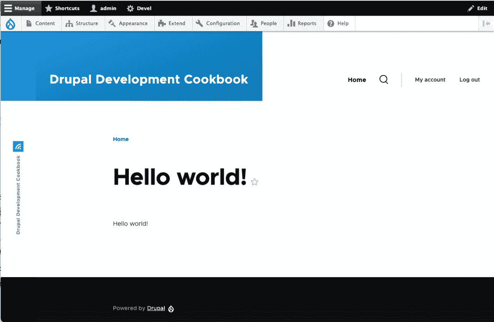
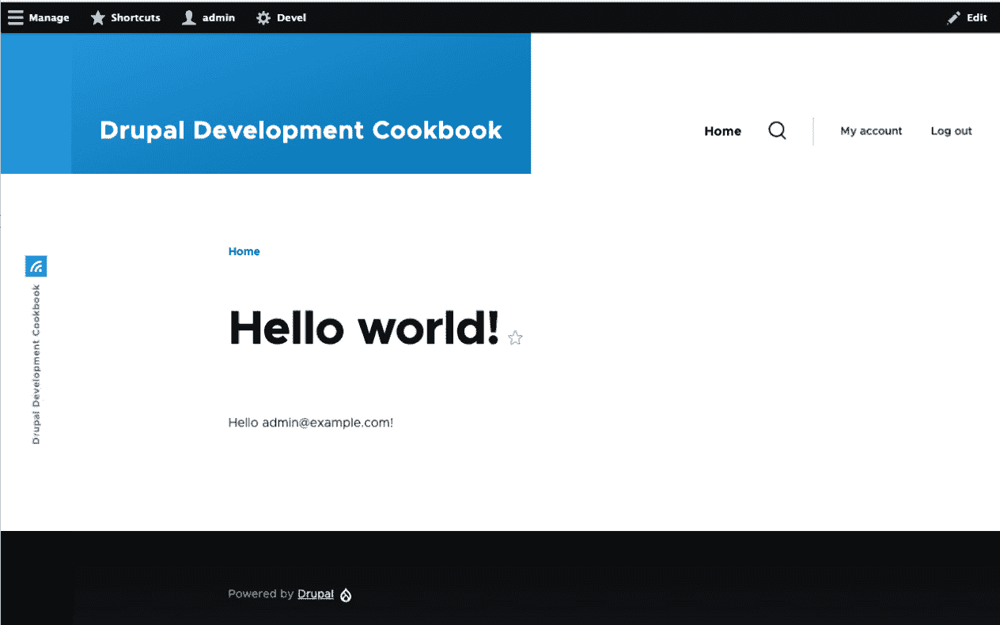

# 5

# 创建自定义页面

在本章中，我们将使用控制器创建自定义页面。控制器是一个类，它包含一个在 Drupal 访问特定路径时构建页面的方法。创建自定义页面允许你扩展 Drupal 超出仅内容页面的范围。本章将涵盖创建自定义页面、从路径接收动态值以及提供 JSON 或文件下载响应的过程。

在本章中，我们将学习以下配方：

+   定义控制器以提供自定义页面

+   使用路由参数

+   创建动态重定向页面

+   创建 JSON 响应

+   提供文件下载服务

# 技术要求

本章要求在你的 Drupal 网站上安装一个现有的自定义模块。这个自定义模块将包含在整个配方中创建的控制器。*第四章*，*使用自定义代码扩展 Drupal*，介绍了如何创建自定义模块。你可以在 GitHub 上找到本章使用的完整代码：[`github.com/PacktPublishing/Drupal-10-Development-Cookbook/tree/main/chp05`](https://github.com/PacktPublishing/Drupal-10-Development-Cookbook/tree/main/chp05)

# 定义控制器以提供自定义页面

每当对 Drupal 网站发出 HTTP 请求时，URL 的路径会被路由到控制器。控制器负责返回已定义为路由的路径的响应。通常，这些控制器返回渲染数组供 Drupal 的渲染系统转换为 HTML。

在这个配方中，我们将定义一个控制器，它返回一个渲染数组以在页面上显示消息。

## 如何操作…

1.  首先，我们需要在模块目录中创建 `src/Controller` 目录。我们将把我们的控制器类放在这个目录中，这给我们的 `controller` 类赋予了 `Controller` 命名空间：

    ```php
    mkdir -p src/Controller
    ```

1.  在控制器目录中创建一个名为 `HelloWorldController.php` 的文件。这将包含我们的 `HelloWorldController` 控制器类。

1.  我们的 `HelloWorldController` 类将扩展由 Drupal 核心提供的 `ControllerBase` 基类：

    ```php
    <?php
    ```

    ```php
    namespace Drupal\mymodule\Controller;
    ```

    ```php
    use Drupal\Core\Controller\ControllerBase;
    ```

    ```php
    class HelloWorldController extends ControllerBase {
    ```

    ```php
    }
    ```

遵循 PSR-4 自动加载约定，我们的类位于 `\Drupal\mymodule\Controller` 命名空间中，Drupal 能够将其确定为我们的模块中的 `src/Controller` 目录。根据 PSR-4，文件名和类名也必须相同。

`\Drupal\Core\Controller\ControllerBase` 类提供了一些可以利用的实用方法。

1.  接下来，我们将创建一个方法，该方法返回一个渲染数组以显示文本字符串。将以下方法添加到我们的 `HelloWorldController` 类中：

    ```php
      /**
    ```

    ```php
       * Returns markup for our custom page.
    ```

    ```php
       *
    ```

    ```php
       * @returns array
    ```

    ```php
       *   The render array.
    ```

    ```php
       */
    ```

    ```php
      public function page(): array {
    ```

    ```php
        return [
    ```

    ```php
          '#markup' => '<p>Hello world!</p>'
    ```

    ```php
        ];
    ```

    ```php
      }
    ```

页面方法返回一个渲染数组，Drupal 渲染系统将解析它。`#markup` 键表示一个没有额外渲染或主题化的值，并允许使用基本的 HTML 元素。

1.  在你的模块目录中创建 `mymodule.routing.yml` 文件。`routing.yml` 文件由模块提供，用于定义路由。

1.  定义路由的第一步是为路由提供一个名称，该名称用作其标识符，用于 URL 生成和其他目的：

    ```php
    mymodule.hello_world
    ```

1.  为路由提供一个路径：

    ```php
    mymodule.hello_world:
    ```

    ```php
      path: /hello-world
    ```

1.  接下来，我们将路径与我们的控制器注册。这是通过使用`defaults`键来完成的，我们在其中提供控制器和页面标题：

    ```php
    mymodule.hello_world:
    ```

    ```php
      path: /hello-world
    ```

    ```php
      defaults:
    ```

    ```php
        _controller: Drupal\mymodule\Controller\
    ```

    ```php
            HelloWorldController::page
    ```

    ```php
        _title: 'Hello world!'
    ```

`_controller`键是用于的完整类名，其中包含要使用的方法。`_title`键提供了要显示的页面标题。

1.  最后，定义一个`requirements`键来指定访问要求：

    ```php
    mymodule.hello_world:
    ```

    ```php
      path: /hello-world
    ```

    ```php
      defaults:
    ```

    ```php
        _controller: Drupal\mymodule\Controller\
    ```

    ```php
            HelloWorldController::page
    ```

    ```php
        _title: 'Hello world!'
    ```

    ```php
      requirements:
    ```

    ```php
        _permission: 'access content'
    ```

`_permission`选项告诉路由系统验证当前用户是否有查看页面的特定权限。

1.  Drupal 缓存其路由信息。我们必须重建 Drupal 的缓存，以便它能够了解模块的新路由：

    ```php
    php vendor/bin/drush cr
    ```

1.  访问您的 Drupal 站点上的`/hello-world`并查看您的自定义页面：



图 5.1 – /hello-world 页面

## 它是如何工作的...

Drupal 的路由建立在 Symfony 的路由组件之上。每个路由都有一个控制器类中的方法，该方法返回一个响应。最常见的是返回一个渲染数组。本章的其他食谱将向您展示如何直接返回响应对象。路由被收集到 Drupal 的路由系统中。

当 HTTP 请求到达 Drupal 时，系统会尝试将路径与已知路由匹配。如果找到路由，则使用路由的定义来提供页面。如果找不到路由，则显示 404 页面。如果找到路由，Drupal 将根据`requirements`键执行访问检查。如果`requirements`键条件失败，则 Drupal 可能返回 403 页面或 404 页面。

控制器返回响应后，Drupal 会检查该值是否是渲染数组或来自 Symfony 的`HttpFoundation`组件的响应。`MainContentViewSubscriber`类的`onViewRenderArray`方法检查控制器响应是否为数组。如果是，则解析渲染器并将渲染数组转换为 HTML 响应。否则，它允许处理返回的响应对象。

当编写控制器时，不需要`ControllerBase`基类；但它确实提供了对常见服务的简化访问，而无需设置依赖注入。

## 还有更多...

在接下来的章节中，我们将介绍更多关于路由的内容。

### 路由要求

路由可以通过`requirements`键定义不同的访问要求。可以添加多个验证器。然而，必须有一个提供真值的结果，否则路由将返回 403，访问被拒绝。如果路由没有定义要求验证器，这也适用。

路由要求验证器是通过实现`\Drupal\Core\Routing\Access\AccessInterface`定义的。以下列表显示了 Drupal 核心中定义的一些常见要求验证器：

+   `_access: 'TRUE'`: 这始终授予路由访问权限。在授予此权限而不是权限或角色检查时要小心，因为这意味着任何人都可以访问该路由。

+   `_entity_access`: 这验证当前用户能否执行实体操作。例如，`node.update` 验证用户能否更新 URL 参数中的节点。

+   `_permission`: 这检查当前用户是否有提供的权限。

+   `_user_is_logged_in`: 这验证用户是否已登录。`'TRUE'` 的值要求用户必须登录，而 `'FALSE'` 是指用户已注销。`'FALSE'` 的一个例子是用户登录页面。

### 提供动态路由

路由系统允许模块以编程方式定义路由。这可以通过提供一个 `routing_callbacks` 键来实现，该键定义了一个类和将返回一个 `\Symfony\Component\Routing\Route` 对象数组的类和方法。

在模块的 `routing.yml` 文件中，你将定义路由回调键和相关类：

```php
route_callbacks:
  - 'Drupal\mymodule\Routing\CustomRoutes::routes'
```

`Drupal\mymodule\Routing\CustomRoutes` 类将会有一个名为 routes 的方法，该方法返回一个路由对象数组：

```php
<?php
namespace Drupal\mymodule\Routing;
use Symfony\Component\Routing\Route;
class CustomRoutes {
  public function routes() {
    $routes = [];
    // Create mypage route programmatically
    $routes['mymodule.hello_world'] = new Route(
      // Path definition
      '/hello-world',
      // Route defaults
      [
        '_controller' =>
        '\Drupal\mymodule\Controller\
            HelloWorldController::page',
        '_title' => 'Hello world',
      ],
      // Route requirements
      [
        '_permission' => 'access content',
      ]
    );
    return $routes;
  }
}
```

如果一个模块提供了一个与路由交互的类，最佳实践是将它放在模块命名空间的路由部分。这有助于你识别其目的。

预期调用的方法返回一个已启动的路由对象数组。`Route` 类接受以下参数：

+   `path`: 这是路由的路径。

+   `defaults`: 这是路由及其控制器的默认值数组。

+   `requirements`: 这是一个验证器数组，确保路由可访问。

+   `options`: 这是一个数组，可以传递并可选地使用它来保存有关路由的元数据。

### 修改现有路由

当路由系统正在重建时，会触发一个事件来修改发现的路由。这涉及到实现事件订阅者。Drupal 提供了一个基类以简化此实现。在这里，`\Drupal\Core\Routing\RouteSubscriberBase` 实现了所需的接口方法并订阅了 `RoutingEvents::ALTER` 事件。

为你的模块创建一个 `src/Routing/RouteSubscriber.php` 文件来保存路由 `subscriber` 类：

```php
<?php
namespace Drupal\mymodule\Routing;
use Drupal\Core\Routing\RouteSubscriberBase;
use Symfony\Component\Routing\RouteCollection;
class RouteSubscriber extends RouteSubscriberBase {
  /**
   * {@inheritdoc}
   */
  public function alterRoutes(RouteCollection $collection) {
    // Change path of mymodule.hello_world to just 'hello'
    if ($route = $collection->get('mymodule.hello_world')) {
      $route->setPath('/hello');
    }
  }
}
```

上述代码扩展了 `RouteSubscriberBase` 并实现了 `alterRoutes` 方法。如果存在，我们从路由集合中获取路由对象，并将路径从 `/hello-world` 更改为仅 `/hello`。

然后，我们必须在模块的 `mymodule.services.yml` 文件中注册事件订阅者：

```php
services:
  mymodule.route_subscriber:
    class: Drupal\mymodule\Routing\RouteSubscriber
    tags:
      - { name: event_subscriber }
```

添加此更改后，清除 Drupal 缓存。这使 Drupal 了解我们的事件订阅者，以便它可以对 `RoutingEvents::ALTER` 事件的触发做出反应。

## 参见

+   Symfony 路由组件：[`symfony.com/doc/current/create_framework/routing.html`](https://symfony.com/doc/current/create_framework/routing.html)

# 使用路由参数

在上一个菜谱中，我们定义了一个响应 `/hello-world` 路径的路由和控制器。路由可以向路径添加变量，称为路由参数，以便控制器可以处理不同的 URL。

在此菜谱中，我们将创建一个路由，它接受一个用户 ID 作为路由参数来显示该用户的信息。

## 开始

此菜谱使用在 *定义控制器* 菜谱中创建的路由来提供自定义页面。

## 如何操作…

1.  首先，从上一个部分中删除 `src/Routing/RouteSubscriber.php` 文件和 `mymodule.services.yml`，并清除 Drupal 缓存，以免干扰我们即将要做的事情。

1.  接下来，编辑 `routing.yml` 以便我们可以将 `user` 路由参数添加到路径中：

    ```php
      path: /hello-world/{user}
    ```

路由参数用开括号（`{`）和闭括号（`}`）包裹。

1.  接下来，我们将更新要求键，指定 `user` 参数应为用户 ID 的整数，并且当前用户有权查看其他配置文件：

    ```php
      requirements:
    ```

    ```php
        user: '\d+'
    ```

    ```php
        _entity_access: 'user.view'
    ```

限制条件下的 `user` 键代表相同的路由参数。路由系统允许你提供正则表达式来验证路由参数的值。这验证了用户参数为任何数字值。

我们随后使用 `_entity_access` 要求来验证当前用户是否有权对用户类型实体执行视图操作。

1.  然后，我们在路由定义中添加一个新的选项键，以便我们可以识别用户路由参数的类型：

    ```php
      options:
    ```

    ```php
        parameters:
    ```

    ```php
          user:
    ```

    ```php
            type: 'entity:user'
    ```

这定义了用户路由参数为 `entity:user` 类型。Drupal 将使用此类型将 ID 值转换为用户对象，供我们的控制器使用。

1.  打开 `src/Controller/HelloWorldController.php` 文件，以便更新页面方法以接收用户路由参数值。

1.  将页面方法更新为接收用户路由参数作为其方法参数的用户对象：

    ```php
      /**
    ```

    ```php
       * Returns markup for our custom page.
    ```

    ```php
       *
    ```

    ```php
       * @param \Drupal\user\UserInterface $user
    ```

    ```php
       *   The user parameter.
    ```

    ```php
       *
    ```

    ```php
       * @returns array
    ```

    ```php
       *   The render array.
    ```

    ```php
       */
    ```

    ```php
      public function page(UserInterface $user): array {
    ```

    ```php
        return [
    ```

    ```php
          '#markup' => '<p>Hello world!</p>'
    ```

    ```php
        ];
    ```

    ```php
      }
    ```

路由系统根据方法参数名称将路由参数值传递给方法。我们的参数定义指定 Drupal 应将 URL 中的 ID 转换为用户对象。

1.  让我们调整从 `Hello world!` 返回的文本，用用户对象的电子邮件地址替换“world”：

    ```php
        return [
    ```

    ```php
          '#markup' => sprintf('<p>Hello %s!</p>',
    ```

    ```php
             $user->getEmail()),
    ```

    ```php
        ];
    ```

我们使用 `sprintf` 返回一个包含用户电子邮件地址的格式化字符串。

1.  Drupal 缓存其路由信息。我们必须重建 Drupal 的缓存，以便它能够意识到模块新路由的变化：

    ```php
    php vendor/bin/drush cr
    ```

1.  当你访问 `/hello-world` 时，没有路由参数的旧路径，Drupal 将返回 404 错误表示页面未找到。

1.  当你访问 `/hello-world/1` 时，页面将显示包含用户电子邮件地址的格式化文本：



图 5.2 – 包含用户电子邮件地址的格式化文本

## 工作原理…

如前一个菜谱中讨论的，路由系统比较传入 HTTP 请求的路径。然后，路径与已注册的路由进行匹配。当一个路由不包含路由参数时，匹配是简单的。为了根据从 URL 传入的路径完成路由匹配，路由有一个编译好的匹配模式。这个匹配模式将路由路径及其路由模式转换成一个可以与传入 URL 的路径进行匹配的正则表达式。

`Drupal\Core\Routing\RouteCompiler`类扩展了来自 Symfony 路由组件的`RouteCompiler`。当路由被编译时，路由的路径被转换成一个正则表达式，用于与从传入 URL 的路径进行比较。考虑到我们的路由路径`/hello-world/{user}`和`\d+`的要求，以下是用户路由参数匹配的正则表达式，用于匹配我们的路由：

```php
#^/hello\-world/(?P<user>\d+)$#sDu
```

当这个正则表达式通过`preg_match`评估时，匹配将返回一个匹配的关联数组。如果从传入 URL 的路径匹配，那么匹配数组将包含一个键为 user，其值为在路径中找到的值。

Drupal 的路由系统有一个参数转换器的概念，它将路由参数值从其原始值转换。使用路由定义的`options.parameters.user`为`entity:user`，`\Drupal\Core\ParamConverter\EntityConverter`类将用户 ID 转换为已加载的用户对象。

在路由匹配和参数转换之后，它们与控制器方法定义的参数进行匹配。来自 Symfony 的`HttpKernel`的`ArgumentResolver`使用反射在调用控制器处理请求之前组装正确的参数顺序。

## 参见

+   Symfony 的 HttpKernel 组件和参数解析的文档：[`symfony.com/doc/current/components/http_kernel.html#4-getting-the-controller-arguments`](https://symfony.com/doc/current/components/http_kernel.html#4-getting-the-controller-arguments)

+   Symfony 路由组件和路由参数的文档：[`symfony.com/doc/current/routing.html#route-parameters`](https://symfony.com/doc/current/routing.html#route-parameters)

# 创建一个动态重定向页面

Drupal 中路由的控制器可以返回由 Symfony 的`HttpFoundation`组件提供的请求对象，而不是渲染数组。当返回响应对象时，渲染系统被绕过，响应对象被直接处理。

在这个菜谱中，我们将创建一个路由，将认证用户重定向到主页，将匿名用户重定向到用户登录表单。

## 如何做到这一点…

1.  首先，我们需要在模块目录中创建`src/Controller`目录。我们将把我们的控制器类放在这个目录中，这给我们的控制器类赋予了`Controller`命名空间：

    ```php
    mkdir -p src/Controller
    ```

1.  在 `Controller` 目录下创建一个名为 `RedirectController.php` 的文件。这个文件将包含我们的 `RedirectController` 控制器类。

1.  我们的 `RedirectController` 类将扩展由 Drupal 核心提供的 `ControllerBase` 基类：

    ```php
    <?php
    ```

    ```php
    namespace Drupal\mymodule\Controller;
    ```

    ```php
    use Drupal\Core\Controller\ControllerBase;
    ```

    ```php
    class RedirectController extends ControllerBase {
    ```

    ```php
    }
    ```

根据 PSR-4 自动加载约定，我们的类位于 `\Drupal\mymodule\Controller` 命名空间中，Drupal 可以将其确定为模块中的 `src/Controller` 目录。根据 PSR-4，文件名和类名也必须相同。

`\Drupal\Core\Controller\ControllerBase` 类提供了一些实用方法，这些方法可以被利用。

1.  接下来，我们将创建一个方法来检查当前用户是否已登录。更新 `RedirectController` 类以包含以下方法：

    ```php
    <?php
    ```

    ```php
    namespace Drupal\mymodule\Controller;
    ```

    ```php
    use Drupal\Core\Controller\ControllerBase;
    ```

    ```php
    use Symfony\Component\HttpFoundation\RedirectResponse;
    ```

    ```php
    class RedirectController extends ControllerBase {
    ```

    ```php
      /**
    ```

    ```php
       * Returns redirect to home or user login form.
    ```

    ```php
       *
    ```

    ```php
       * @return \Symfony\Component\HttpFoundation\
    ```

    ```php
            RedirectResponse
    ```

    ```php
       *   The redirect response.
    ```

    ```php
       */
    ```

    ```php
      public function page(): RedirectResponse {
    ```

    ```php
        if ($this->currentUser()->isAuthenticated()) {
    ```

    ```php
          // Redirect to the homepage.
    ```

    ```php
        }
    ```

    ```php
        else {
    ```

    ```php
          // Redirect to the user login form.
    ```

    ```php
        }
    ```

    ```php
      }
    ```

    ```php
    }
    ```

`ControllerBase` 类提供了一个 `currentUser` 方法，用于访问当前用户对象。我们可以调用 `isAuthenticated` 方法来检查用户是否已登录。

1.  接下来，我们将更新代码以返回一个重定向到由路由名称生成的 URL 的 `RedirectResponse` 对象：

    ```php
      public function page(): RedirectResponse {
    ```

    ```php
        if ($this->currentUser()->isAuthenticated()) {
    ```

    ```php
          $route_name = '<front>';
    ```

    ```php
        }
    ```

    ```php
        else {
    ```

    ```php
          $route_name = 'user.login';
    ```

    ```php
        }
    ```

    ```php
        $url = \Drupal\Core\Url::fromRoute($route_name);
    ```

    ```php
        return new RedirectResponse($url->toString());
    ```

    ```php
      }
    ```

我们在 `$route_name` 变量中设置路由名称。虽然 `<front>` 不是一个典型的路径，但它是一个可用于路由到已设置为主页的适当路径的路由名称。Drupal 核心定义了如 `<front>` 和 `<none>` 这样的特殊别名，以便于路由。有关更多信息，请参阅核心 `Url` 类。

我们随后使用 `\Drupal\Core\Url` 类的静态 `fromRoute` 方法构建一个新的 URL 对象。然后我们返回一个重定向到我们 URL 的 `RedirectResponse` 对象。我们必须使用 URL 对象上的 `toString` 方法来获取 URL 字符串。

1.  在你的模块目录中创建 `mymodule.routing.yml` 文件。`routing.yml` 文件由模块提供，用于定义路由。

1.  定义路由的第一步是提供一个路由名称，该名称用作其标识符，用于 URL 生成和其他目的：

    ```php
    mymodule.user_redirect
    ```

1.  为路由指定一个路径：

    ```php
    mymodule.user_redirect:
    ```

    ```php
      path: /user-redirect
    ```

1.  接下来，我们将路径注册到我们的控制器。这是通过 `defaults` 键完成的，我们提供了控制器：

    ```php
    mymodule.user_redirect:
    ```

    ```php
      path: /user-redirect
    ```

    ```php
      defaults:
    ```

    ```php
        _controller: Drupal\mymodule\Controller\
    ```

    ```php
            RedirectController::page
    ```

`_controller` 键是带有要使用的类方法的完全限定类名。

1.  最后，定义一个 `requirements` 键来指定访问要求。我们希望路由始终可访问，因为我们处理了认证用户和匿名用户：

    ```php
    mymodule.user_redirect:
    ```

    ```php
      path: /user-redirect
    ```

    ```php
      defaults:
    ```

    ```php
        _controller: Drupal\mymodule\Controller\
    ```

    ```php
            RedirectController::page
    ```

    ```php
      requirements:
    ```

    ```php
        _access: 'TRUE'
    ```

`_access` 选项允许我们指定一个路由始终可访问。

1.  Drupal 缓存其路由信息。我们必须重建 Drupal 的缓存，以便它能够了解模块的新路由：

    ```php
    php vendor/bin/drush cr
    ```

1.  以匿名用户身份访问你的 Drupal 网站的 `/user-redirect`，你将被重定向到用户登录表单。如果你已认证，你将被重定向到主页。

## 它是如何工作的...

`RedirectResponse`对象来自 Symfony 的`HttpFoundation`组件，表示 HTTP 重定向响应。当转换为从 Web 服务器发送的响应时，它将设置位置头为提供的 URL。它还传递一个有效的 3xx HTTP 状态代码。重定向响应默认为 HTTP 状态码 302 找到。302 重定向旨在是临时的，并且不能被浏览器缓存。

Drupal 可以从给定的路由名称生成 URL。正如我们在之前的菜谱中学到的，路由名称用于标识特定的路径、控制器和其他信息。当调用`toString`时，URL 对象将调用 URL 生成器将路由名称转换为 URL。

## 参见

+   HTTP/1.1 RFC 重定向 3xx 规范：[`datatracker.ietf.org/doc/html/rfc2616#section-10.3`](https://datatracker.ietf.org/doc/html/rfc2616#section-10.3)

# 创建 JSON 响应

路由也可以返回**JavaScript 对象表示法**（**JSON**）响应。JSON 响应通常用于构建 API 路由，因为它是一种所有编程语言都支持的交换格式。这允许暴露数据供第三方消费者使用。

在这个菜谱中，我们将创建一个返回包含有关 Drupal 站点信息的 JSON 响应的路由。

## 如何实现...

1.  首先，我们需要在模块目录中创建`src/Controller`目录。我们将把我们的控制器类放在这个目录中，这将为我们的控制器类提供`Controller`命名空间：

    ```php
    mkdir -p src/Controller
    ```

1.  在`Controller`目录中创建一个名为`SiteInfoController.php`的文件。这将包含我们的`SiteInfoController`控制器类。

1.  我们的`SiteInfoController`类将扩展由 Drupal 核心提供的`ControllerBase`基类：

    ```php
    <?php
    ```

    ```php
    namespace Drupal\mymodule\Controller;
    ```

    ```php
    use Drupal\Core\Controller\ControllerBase;
    ```

    ```php
    use Symfony\Component\HttpFoundation\JsonResponse;
    ```

    ```php
    class SiteInfoController extends ControllerBase {
    ```

    ```php
    }
    ```

遵循 PSR-4 自动加载约定，我们的类位于`\Drupal\mymodule\Controller`命名空间中，Drupal 可以将其确定为我们的模块中的`src/Controller`目录。根据 PSR-4，文件名和类名也必须相同。

`\Drupal\Core\Controller\ControllerBase`类提供了一些可以利用的实用方法。

1.  接下来，我们将创建一个返回`JsonResponse`对象的方法。将以下方法添加到我们的`SiteInfoController`类中：

    ```php
       /**
    ```

    ```php
       * Returns site info in a JSON response.
    ```

    ```php
       *
    ```

    ```php
       * @return \Symfony\Component\HttpFoundation\
    ```

    ```php
            JsonResponse
    ```

    ```php
       *   The JSON response.
    ```

    ```php
       */
    ```

    ```php
      public function page(): JsonResponse {
    ```

    ```php
        return new JsonResponse();
    ```

    ```php
      }
    ```

`page`方法返回一个`JsonResponse`对象。这确保了响应的`Content-Type`头设置为`application/json`。

1.  让我们使用来自`system.site`配置对象的 数据向我们的响应对象添加内容：

    ```php
      /**
    ```

    ```php
       * Returns site info in a JSON response.
    ```

    ```php
       *
    ```

    ```php
       * @return \Symfony\Component\HttpFoundation\
    ```

    ```php
            JsonResponse
    ```

    ```php
       *   The JSON response.
    ```

    ```php
       */
    ```

    ```php
      public function page(): JsonResponse {
    ```

    ```php
        $config = $this->config('system.site');
    ```

    ```php
        return new JsonResponse([
    ```

    ```php
          'name' => $config->get('name'),
    ```

    ```php
          'slogan' => $config->get('slogan'),
    ```

    ```php
          'email' => $config->get('mail')
    ```

    ```php
        ]);
    ```

    ```php
      }
    ```

我们使用`ControllerBase`提供的`config`方法检索`system.site`配置对象。然后，我们将一个关联数组的数据提供给`JsonResponse`对象。当发送响应时，该数组将被转换为 JSON。

1.  在您的模块目录中创建`mymodule.routing.yml`文件。该文件由模块提供，用于定义路由。

1.  定义路由的第一步是提供一个路由名称，该名称用于 URL 生成和其他目的：

    ```php
    mymodule.site_info
    ```

1.  为路由指定路径：

    ```php
    mymodule.site_info:
    ```

    ```php
      path: /site-info
    ```

1.  接下来，我们将路径注册到我们的控制器中。这是通过`defaults`键完成的，我们在这里提供控制器和页面标题：

    ```php
    mymodule.site_info:
    ```

    ```php
      path: /site-info
    ```

    ```php
      defaults:
    ```

    ```php
        _controller: Drupal\mymodule\Controller\
    ```

    ```php
            SiteInfoController::page
    ```

`_controller`键是用于的完全限定类名以及要使用的方法。

1.  最后，定义一个`requirements`键来指定访问要求：

    ```php
    mymodule.site_info:
    ```

    ```php
      path: /site-info
    ```

    ```php
      defaults:
    ```

    ```php
        _controller: Drupal\mymodule\Controller\
    ```

    ```php
            SiteInfoController::page
    ```

    ```php
      requirements:
    ```

    ```php
        _access: 'TRUE'
    ```

`_access`选项允许路由始终可访问。

1.  Drupal 缓存其路由信息。我们必须重建 Drupal 的缓存，以便它能够了解模块的新路由：

    ```php
    php vendor/bin/drush cr
    ```

1.  前往你的 Drupal 网站的`/site-info`，你应该会收到如下所示的 JSON 响应：

    ```php
    {
    ```

    ```php
      "name": "Drupal Development Cookbook",
    ```

    ```php
      "slogan": "Practical recipes to harness the power of
    ```

    ```php
        Drupal 10.",
    ```

    ```php
      "email": "admin@example.com"
    ```

    ```php
    }
    ```

## 它是如何工作的…

`JsonResponse`对象用于表示 JSON 响应。其构造函数接收一个数组或对象的数据，并将其传递给 PHP 的`json_encode`函数。它将响应的`Content-Type`头设置为`application/json`。

## 还有更多…

JSON 响应控制器可以增强以利用 Drupal 的 harness-caching 功能。

### 使用 Drupal 缓存 JSON 响应

Drupal 还提供了`\Drupal\Core\Cache\CacheableJsonResponse`。这扩展了`JsonResponse`，允许 Drupal 的页面缓存缓存响应。然而，你可能希望将`system.site`配置对象作为响应的缓存依赖项。这样，如果该配置对象发生变化，响应缓存就会失效。

代码将更新如下：

```php
class SiteInfoController extends ControllerBase {
  /**
   * Returns site info in a JSON response.
   *
   * @return \Symfony\Component\HttpFoundation\JsonResponse
   *   The JSON response.
   */
  public function page(): JsonResponse {
    $config = $this->config('system.site');
    $response = new \Drupal\Core\Cache\
        CacheableJsonResponse([
      'name' => $config->get('name'),
      'slogan' => $config->get('slogan'),
      'email' => $config->get('mail')
    ]);
    $response->addCacheableDependency($config);
    return $response;
  }
}
```

主要区别是我们不直接返回响应对象。首先，我们将配置对象设置为缓存依赖项。

## 参见

+   *第十二章*，*使用 Drupal*构建 API

# 提供下载文件服务

可以使用路由来通过`BinaryFileResponse`响应对象提供文件下载。使用`BinaryFileResponse`来提供文件下载允许你保持原始文件的 URL 私有或发送动态内容作为文件下载。

在这个菜谱中，我们将创建一个提供 PDF 下载的路由。

## 开始

这个菜谱使用一个位于模块同一目录下的 PDF 文件。你可以使用任何其他可用的文件类型，例如文本文件。可以在万维网联盟网站上找到一个测试 PDF：[`www.w3.org/WAI/ER/tests/xhtml/testfiles/resources/pdf/dummy.pdf`](https://www.w3.org/WAI/ER/tests/xhtml/testfiles/resources/pdf/dummy.pdf)。

## 如何做到这一点…

1.  首先，我们需要在模块目录中创建`src/Controller`目录。我们将把我们的控制器类放在这个目录中，这给我们的控制器类赋予了`Controller`命名空间：

    ```php
    mkdir -p src/Controller
    ```

1.  在`Controller`目录下创建一个名为`DownloadController.php`的文件。这将包含我们的`DownloadController`控制器类：

    ```php
    <?php
    ```

    ```php
    namespace Drupal\mymodule\Controller;
    ```

    ```php
    class SiteInfoController {
    ```

    ```php
    }
    ```

遵循 PSR-4 自动加载约定，我们的类位于`\Drupal\mymodule\Controller`命名空间中，Drupal 能够将其确定为模块中的`src/Controller`目录。根据 PSR-4，文件名和类名也必须相同。

1.  接下来，我们将创建一个返回 `BinaryFileResponse` 对象的方法。将以下方法添加到我们的 `DownloadController` 类中：

    ```php
      /**
    ```

    ```php
       * Downloads a file.
    ```

    ```php
       *
    ```

    ```php
       * @return \Symfony\Component\HttpFoundation\
    ```

    ```php
            BinaryFileResponse
    ```

    ```php
       *   The file response.
    ```

    ```php
       */
    ```

    ```php
      public function page(): BinaryFileResponse {
    ```

    ```php
        // File paths are relative to the document root
    ```

    ```php
             (web.)
    ```

    ```php
        $file_path = 'modules/custom/mymodule/dummy.pdf';
    ```

    ```php
        $response = new BinaryFileResponse($file_path);
    ```

    ```php
        $response->setContentDisposition('attachment',
    ```

    ```php
            basename($file_path));
    ```

    ```php
        return $response;
    ```

    ```php
      }
    ```

页面方法返回一个 `BinaryFileResponse` 对象。我们定义了一个包含我们的 PDF 文件的文件路径。文件路径可能是相对于 Drupal 的文档根目录（web）。我们的模块目录是相对于文档根目录的 `modules/custom/mymodule`。我们将 `Content-Disposition` 头部设置为附件，并指定一个文件名，以便文件自动下载。我们使用 PHP 的 basename 函数从路径中获取文件名。

1.  控制器几乎准备好了。我们还应该为响应提供 `Content-Type` 头部。使用 `file.mime_type.guesser` 服务，我们可以获取正确的头部值：

    ```php
      /**
    ```

    ```php
       * Downloads a file.
    ```

    ```php
       *
    ```

    ```php
       * @return \Symfony\Component\HttpFoundation\
    ```

    ```php
            BinaryFileResponse
    ```

    ```php
       *   The file response.
    ```

    ```php
       */
    ```

    ```php
      public function page(): BinaryFileResponse {
    ```

    ```php
        // File paths are relative to the document root
    ```

    ```php
             (web.)
    ```

    ```php
        $file_path = 'modules/custom/mymodule/dummy.pdf';
    ```

    ```php
        /** @var \Drupal\Core\File\MimeType\
    ```

    ```php
            MimeTypeGuesser $guesser */
    ```

    ```php
        $guesser = \Drupal::service
    ```

    ```php
             ('file.mime_type.guesser');
    ```

    ```php
        $mime_type = $guesser->guessMimeType($file_path);
    ```

    ```php
        $response = new BinaryFileResponse($file_path);
    ```

    ```php
        $response->headers->set('Content-Type',
    ```

    ```php
            $mimetype);
    ```

    ```php
        $response->setContentDisposition('attachment',
    ```

    ```php
            basename($file_path));
    ```

    ```php
        return $response;
    ```

    ```php
      }
    ```

`file.mime_type.guesser` 服务用于根据文件的扩展名确定文件的适当 MIME 类型。在这种情况下，它将 `return application/pdf`。

1.  在您的模块目录中创建 `mymodule.routing.yml` 文件。`routing.yml` 文件由模块提供，用于定义路由。

1.  定义路由的第一步是提供一个路由名称，该名称用作其标识符，用于 URL 生成和其他目的：

    ```php
    mymodule.pdf_download
    ```

1.  为路由提供一个路径：

    ```php
    mymodule.pdf_download:
    ```

    ```php
      path: /pdf-download
    ```

1.  接下来，我们将使用我们的控制器注册路径。这是通过默认键完成的，我们在其中提供控制器和页面标题：

    ```php
    mymodule.pdf_download:
    ```

    ```php
      path: /pdf-download
    ```

    ```php
      defaults:
    ```

    ```php
        _controller: Drupal\mymodule\Controller
    ```

    ```php
            \DownloadController::page
    ```

`_controller` 键是用于的完整类名，其中包含要使用的方法。

1.  最后，定义一个 requirements 键来指定访问要求：

    ```php
    mymodule.pdf_download:
    ```

    ```php
      path: /pdf-download
    ```

    ```php
      defaults:
    ```

    ```php
        _controller: Drupal\mymodule\Controller
    ```

    ```php
            \DownloadController::page
    ```

    ```php
      requirements:
    ```

    ```php
        _user_is_logged_in: 'TRUE'
    ```

`_user_is_logged_in` 选项要求用户必须经过身份验证才能访问路由。

1.  Drupal 缓存其路由信息。我们必须重建 Drupal 的缓存，以便它能够了解模块的新路由：

    ```php
    php vendor/bin/drush cr
    ```

1.  前往您的 Drupal 网站上的 `/pdf-download`，您将被提示下载 `dummy.pdf` 文件。

## 它是如何工作的…

`BinaryFileResponse` 存储有关文件的信息，直到响应准备发送。当响应准备发送时，基于文件大小填充 `Content-Length` 头部。然后，当响应发送时，文件的内容通过 Web 服务器流式传输到访客。
