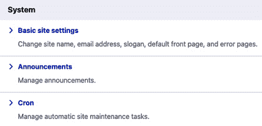
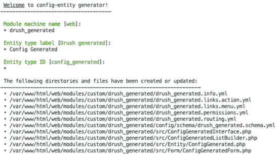
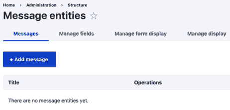
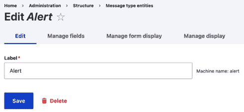
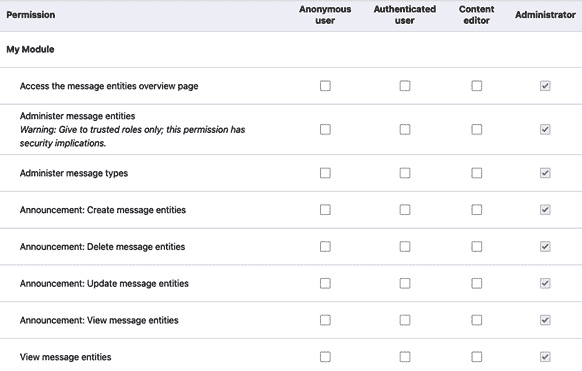

# 9

# 创建自定义实体类型

在*第六章*，*访问和操作实体*中，我们探讨了操作单个实体。本章涵盖了为自定义数据模型创建自定义实体类型。Drupal 中的**实体**由不同的实体类型组成。**实体类型**定义为注解插件。每个实体是其实体类型类的实例。实体类型也可以根据其捆绑进行增强，以具有不同的类。您将在本章中学习如何实现自己的自定义实体。

在本章中，我们将介绍以下菜谱：

+   使用自定义类为实体捆绑

+   创建配置实体类型

+   创建内容实体类型

+   为内容实体类型创建捆绑

+   实现实体的访问控制

+   提供自定义存储处理程序

# 技术要求

本章将需要一个未安装的自定义模块。Drupal 不会自动注册新的实体类型或更新已安装模块的实体类型。菜谱中的*更多内容*部分将解释如何为已安装的模块安装或更新实体类型。

在以下菜谱中，模块名称为`mymodule`。请根据您的代码适当替换`mymodule`实例。您可以在 GitHub 上找到本章使用的完整代码：[`github.com/PacktPublishing/Drupal-10-Development-Cookbook/tree/main/chp09`](https://github.com/PacktPublishing/Drupal-10-Development-Cookbook/tree/main/chp09)。

# 使用自定义类为实体捆绑

每个实体都是使用其实体类型类实例化的。一个`\Drupal\node\Entity\Node`和一个`\Drupal\taxonomy\Entity\Term`，无论实体的捆绑如何。Drupal 允许在实例化特定捆绑的实体时更改实体信息，以提供替代类。实体捆绑通常用于不同的特定业务逻辑。此功能允许创建与捆绑字段相关的特定业务逻辑的类。

在这个菜谱中，我们将创建一个实体捆绑类，用于当有**菜谱**节点时使用。

## 入门

在这个菜谱中，我们将使用 Umami 演示安装提供的**菜谱**内容类型。

## 如何做到这一点…

1.  首先，我们需要在模块目录中创建`src/Entity`目录。这将为`\Drupal\mymodule\Entity`命名空间，我们将在这里创建我们的捆绑类：

    ```php
    mkdir -p src/Entity
    ```

1.  在新创建的目录中创建一个名为`Recipe.php`的文件，以便我们可以定义用于我们的**菜谱**节点的`Recipe`类。

1.  `Recipe`类将扩展`\Drupal\node\Entity\Node`。捆绑类必须扩展其实体类型的类：

    ```php
    <?php
    ```

    ```php
    namespace Drupal\mymodule\Entity;
    ```

    ```php
    use Drupal\node\Entity\Node;
    ```

    ```php
    class Recipe extends Node {
    ```

    ```php
    }
    ```

如果捆绑类没有扩展实体类型的类，Drupal 在处理实体类型定义时将抛出`BundleClassInheritanceException`异常。

1.  默认情况下，`getTags`将返回那些引用的术语实体：

    ```php
    class Recipe extends Node {
    ```

    ```php
      public function getTags(): array {
    ```

    ```php
        /** @var \Drupal\Core\Field\EntityReferenceField
    ```

    ```php
            ItemListInterface $field_tags */
    ```

    ```php
        $field_tags = $this->get('field_tags');
    ```

    ```php
        return $field_tags->referencedEntities();
    ```

    ```php
      }
    ```

    ```php
    }
    ```

实体引用字段实现 `EntityReferenceFieldItemListInterface`，该接口定义了 `referencedEntities` 方法。该方法加载并返回所有引用的实体对象。

1.  在定义了捆绑类之后，我们必须实现 `hook_entity_bundle_info_alter` 来注册我们的捆绑类以用于 **Recipe** 内容类型：

    ```php
    <?php
    ```

    ```php
    /**
    ```

    ```php
     * Implements hook_entity_bundle_info_alter().
    ```

    ```php
     */
    ```

    ```php
    function mymodule_entity_bundle_info_alter(&$bundles) {
    ```

    ```php
      $bundles ['node']['recipe']['label'] = t('Recipe');
    ```

    ```php
      $bundles['node']['recipe']['class'] = Drupal\
    ```

    ```php
        mymodule\Entity\Recipe::class;
    ```

    ```php
    }
    ```

`$bundles` 参数是一个按实体类型键控的实体类型捆绑数组。要注册实体捆绑，您将该捆绑的 `class` 键设置为捆绑类的类名。

1.  然后，可以在 **Twig** 模板中用于 **Recipe** 内容的 `getTags` 方法：

    ```php
    
    ```

    ```php
      <div>Tag: {{ tag.label }}</div>
    ```

    ```php
    
    ```

## 它是如何工作的…

当从数据库中加载实体记录时，值会被传递到其实体类。内容实体类型支持捆绑，因此允许为每个捆绑定义类，这些类扩展了实体类型类。

这在实体存储 `\Drupal\Core\Entity\ContentEntityStorageBase` 基类及其 `getEntityClass` 方法中处理。该方法返回在将数据库记录映射到实例化的实体对象时应使用的类。此逻辑包含在 `\Drupal\Core\Entity\EntityStorageBase::mapFromStorageRecords` 方法中：

```php
foreach ($records as $record) {
  $entity_class = $this->getEntityClass();
  /** @var \Drupal\Core\Entity\EntityInterface $entity */
$entity = new $entity_class($record, $this->
    entityTypeId);
$entities[$entity->id()] = $entity;
}
```

每当加载实体实体时，可以做出断言来检查实体对象的实例以验证其捆绑并访问该捆绑类的特定方法。这些方法也允许在 Twig 模板标记中使用。Twig 模板在 *第十章*，*主题和* *前端开发* 中有所介绍。

## 参见

+   Drupal 9.3.0 引入捆绑类功能的变更记录：[`www.drupal.org/node/3191609`](https://www.drupal.org/node/3191609)

# 创建配置实体类型

在这个菜谱中，我们将创建一个名为 `Announcement` 的配置实体类型。这将提供一个 **配置实体**，允许您创建、编辑和删除可以在网站上显示的重要公告消息。

配置实体不与 Drupal 的字段 API 交互，并且没有用户界面来添加字段。它们在其类上定义属性，就像其他框架中的模型一样。然而，配置实体在数据库中没有专用表。它们以序列化数据的形式存储在 `config` 表中。配置实体的目的是用于配置。配置实体的例子包括视图显示、表单显示和联系表单。

## 如何实现...

1.  首先，我们需要在模块目录中创建 `src/Entity` 目录。这将转换为 `\Drupal\mymodule\Entity` 命名空间并允许进行实体类型发现：

    ```php
    mkdir -p src/Entity
    ```

1.  在新创建的目录中创建一个名为 `Announcement.php` 的文件，这样我们就可以为我们的实体类型定义 `Announcement` 类。

1.  `Announcement` 类将扩展 `\Drupal\Core\Config\Entity\ConfigEntityBase` 类并定义我们的实体类型的属性：

    ```php
    <?php
    ```

    ```php
    namespace Drupal\mymodule\Entity;
    ```

    ```php
    use Drupal\Core\Config\Entity\ConfigEntityBase;
    ```

    ```php
    class Announcement extends ConfigEntityBase {
    ```

    ```php
      public string $label = '';
    ```

    ```php
      public string $message = '';
    ```

    ```php
    }
    ```

我们扩展了`ConfigEntityBase`类，该类实现了`\Drupal\Core\Config\Entity\ConfigEntityInterface`接口，并满足所有必需的方法实现，这样我们只需要定义我们的属性。`label`属性将包含公告的描述，而`message`属性将包含公告的文本。

注意

通常，实体类型的属性是受保护的，并使用方法来设置和获取值。为了简化此配方中的代码，我们正在使用公共属性。

1.  接下来，我们将为我们的实体类型编写插件注解，在类文档块中：

    ```php
    /**
    ```

    ```php
     * @ConfigEntityType(
    ```

    ```php
     *   id = "announcement",
    ```

    ```php
     *   label = "Announcement",
    ```

    ```php
     *   entity_keys = {
    ```

    ```php
     *     "id" = "id",
    ```

    ```php
     *     "label" = "label"
    ```

    ```php
     *   },
    ```

    ```php
     *   config_export = {
    ```

    ```php
     *     "id",
    ```

    ```php
     *     "label",
    ```

    ```php
     *     "message",
    ```

    ```php
     *   },
    ```

    ```php
     *   admin_permission = "administer announcement",
    ```

    ```php
     * )
    ```

    ```php
     */
    ```

    ```php
    class Announcement extends ConfigEntityBase {
    ```

`@ConfigEntityType`符号指定这是一个`ConfigEntityType`注解。`id`是实体类型 ID，用于检索实体类型的存储和其他处理程序。`label`是实体类型的可读名称。`entity_keys`中的值指导 Drupal`id`和`label`属性是什么。

当指定`config_export`时，我们正在告诉配置管理系统在导出我们的实体类型时哪些属性是可导出的。`admin_permission`指定了管理实体类型所需的权限名称。

1.  接下来，我们将向我们的注解中添加`handlers`键：

    ```php
    /**
    ```

    ```php
     * @ConfigEntityType(
    ```

    ```php
     *   id = "announcement",
    ```

    ```php
     *   label = "Announcement",
    ```

    ```php
     *   entity_keys = {
    ```

    ```php
     *     "id" = "id",
    ```

    ```php
     *     "label" = "label"
    ```

    ```php
     *   },
    ```

    ```php
     *   config_export = {
    ```

    ```php
     *     "id",
    ```

    ```php
     *     "label",
    ```

    ```php
     *     "message",
    ```

    ```php
     *   },
    ```

    ```php
     *   admin_permission = "administer announcement",
    ```

    ```php
     *   handlers = {
    ```

    ```php
     *     "list_builder" = "Drupal\mymodule
    ```

    ```php
                \AnnouncementListBuilder",
    ```

    ```php
     *     "form" = {
    ```

    ```php
     *       "default" = "Drupal\mymodule
    ```

    ```php
                \AnnouncementForm",
    ```

    ```php
     *       "delete" = "Drupal\Core\Entity
    ```

    ```php
                \EntityDeleteForm"
    ```

    ```php
     *     },
    ```

    ```php
     *     "route_provider" = {
    ```

    ```php
     *       "html" = "Drupal\Core\Entity\Routing
    ```

    ```php
                \AdminHtmlRouteProvider",
    ```

    ```php
     *     },
    ```

    ```php
     *   },
    ```

    ```php
     * )
    ```

    ```php
     */
    ```

    ```php
    class Announcement extends ConfigEntityBase {
    ```

处理程序数组指定了提供 Drupal 与我们的实体类型交互功能的类。我们将创建的`list_builder`类用于显示我们的实体类型的实体表。`form`处理程序指定了在创建、编辑或删除实体时使用的表单类。`route_provider`处理程序是一个将为我们实体类型生成路由的处理程序数组。

1.  最后，对于我们的实体类型的注解，我们将提供`route_provider`用于构建我们的实体类型路由的链接模板：

    ```php
    /**
    ```

    ```php
     * @ConfigEntityType(
    ```

    ```php
     *   id = "announcement",
    ```

    ```php
     *   label = "Announcement",
    ```

    ```php
     *   entity_keys = {
    ```

    ```php
     *     "id" = "id",
    ```

    ```php
     *     "label" = "label"
    ```

    ```php
     *   },
    ```

    ```php
     *   config_export = {
    ```

    ```php
     *     "id",
    ```

    ```php
     *     "label",
    ```

    ```php
     *     "message",
    ```

    ```php
     *   },
    ```

    ```php
     *   admin_permission = "administer announcement",
    ```

    ```php
     *   handlers = {
    ```

    ```php
     *     "list_builder" = "Drupal\mymodule
    ```

    ```php
                \AnnouncementListBuilder",
    ```

    ```php
     *     "form" = {
    ```

    ```php
     *       "default" = "Drupal\mymodule
    ```

    ```php
                \AnnouncementForm",
    ```

    ```php
     *       "delete" = "Drupal\Core\Entity\
    ```

    ```php
                EntityDeleteForm"
    ```

    ```php
     *     },
    ```

    ```php
     *     "route_provider" = {
    ```

    ```php
     *       "html" = "Drupal\Core\Entity\Routing\
    ```

    ```php
                AdminHtmlRouteProvider",
    ```

    ```php
     *     },
    ```

    ```php
     *   },
    ```

    ```php
     *   links = {
    ```

    ```php
     *     "collection" = "/admin/config/system/
    ```

    ```php
                announcements",
    ```

    ```php
     *     "add-form" = "/admin/config/system/
    ```

    ```php
                announcements/add",
    ```

    ```php
     *     "delete-form" = "/admin/config/system/
    ```

    ```php
              announcements/manage/{announcement}/delete",
    ```

    ```php
     *     "edit-form" = "/admin/config/system/
    ```

    ```php
              announcements/manage/{announcement}",
    ```

    ```php
     *   },
    ```

    ```php
     * )
    ```

    ```php
     */
    ```

    ```php
    class Announcement extends ConfigEntityBase {
    ```

`links`数组定义了从`html`路由提供者期望的键，例如`collection`（列表）、`add-form`、`delete-form`和`edit-form`。路由提供者将为给定的路径生成路由。

1.  通过在`src`目录中创建一个`AnnouncementListBuilder.php`文件，定义我们的`list_builder`处理程序中的`AnnouncementListBuilder`类：

    ```php
    <?php
    ```

    ```php
    namespace Drupal\mymodule;
    ```

    ```php
    use Drupal\Core\Config\Entity\ConfigEntityListBuilder;
    ```

    ```php
    use Drupal\Core\Entity\EntityInterface;
    ```

    ```php
    class AnnouncementListBuilder extends
    ```

    ```php
        ConfigEntityListBuilder {
    ```

    ```php
    /**
    ```

    ```php
     * Builds the header row for the entity listing.
    ```

    ```php
     *
    ```

    ```php
     * @return array
    ```

    ```php
     *   A render array structure of header strings.
    ```

    ```php
     *
    ```

    ```php
     * @see \Drupal\Core\Entity
    ```

    ```php
            \EntityListBuilder::render()
    ```

    ```php
     */
    ```

    ```php
        public function buildHeader() 
    ```

    ```php
      {
    ```

    ```php
          $header['label'] = $this->t('Label');
    ```

    ```php
          return $header + parent::buildHeader();
    ```

    ```php
        }
    ```

    ```php
    /**
    ```

    ```php
     * Builds a row for an entity in the entity listing.
    ```

    ```php
     *
    ```

    ```php
     * @param \Drupal\Core\Entity\EntityInterface $entity
    ```

    ```php
     *   The entity for this row of the list.
    ```

    ```php
     *
    ```

    ```php
     * @return array
    ```

    ```php
     *   A render array structure of fields for this
    ```

    ```php
            entity.
    ```

    ```php
     *
    ```

    ```php
     * @see \Drupal\Core\Entity\
    ```

    ```php
          EntityListBuilder::render()
    ```

    ```php
     */
    ```

    ```php
      public function buildRow(EntityInterface $entity) {
    ```

    ```php
        $row['label'] = $entity->label();
    ```

    ```php
        return $row + parent::buildRow($entity);
    ```

    ```php
      }
    ```

    ```php
    }
    ```

我们的`AnnouncementListBuilder`类扩展了`\Drupal\Core\Config\Entity\ConfigEntityListBuilder`，它提供了构建我们的实体表所需的所有必需方法。我们重写了`buildHeader`和`buildRow`方法以确保显示实体标签。

1.  现在，我们将创建用于创建和编辑我们的实体类型的实体表单。在`src`目录中创建一个`AnnouncementForm.php`文件，定义`AnnouncementForm`类作为默认表单处理程序：

    ```php
    <?php
    ```

    ```php
    namespace Drupal\mymodule;
    ```

    ```php
    use Drupal\Core\Entity\EntityForm;
    ```

    ```php
    use Drupal\Core\Form\FormStateInterface;
    ```

    ```php
    use Drupal\mymodule\Entity\Announcement;
    ```

    ```php
    class AnnouncementForm extends EntityForm {
    ```

    ```php
    /**
    ```

    ```php
     * Gets the actual form array to be built.
    ```

    ```php
     *
    ```

    ```php
     * @see \Drupal\Core\Entity\EntityForm::processForm()
    ```

    ```php
     * @see \Drupal\Core\Entity\EntityForm::afterBuild()
    ```

    ```php
     */
    ```

    ```php
      public function form(array $form, FormStateInterface
    ```

    ```php
        $form_state) {
    ```

    ```php
        $form = parent::form($form, $form_state);
    ```

    ```php
        /** @var \Drupal\mymodule\Entity\Announcement
    ```

    ```php
            $entity */
    ```

    ```php
        $entity = $this->entity;
    ```

    ```php
        $form['label'] = [
    ```

    ```php
          '#type' => 'textfield',
    ```

    ```php
          '#title' => $this->t('Label'),
    ```

    ```php
          '#required' => TRUE,
    ```

    ```php
          '#default_value' => $entity->label,
    ```

    ```php
        ];
    ```

    ```php
        $form['id'] = [
    ```

    ```php
          '#type' => 'machine_name',
    ```

    ```php
          '#default_value' => $entity->id(),
    ```

    ```php
          '#disabled' => !$entity->isNew(),
    ```

    ```php
          '#machine_name' => [
    ```

    ```php
            'exists' => [Announcement::class, 'load'],
    ```

    ```php
          ],
    ```

    ```php
        ];
    ```

    ```php
        $form['message'] = [
    ```

    ```php
          '#type' => 'textarea',
    ```

    ```php
          '#title' => $this->t('Message'),
    ```

    ```php
          '#required' => TRUE,
    ```

    ```php
          '#default_value' => $entity->message,
    ```

    ```php
        ];
    ```

    ```php
        return $form;
    ```

    ```php
      }
    ```

    ```php
    /**
    ```

    ```php
     * Form submission handler for the 'save' action.
    ```

    ```php
     *
    ```

    ```php
     * Normally this method should be overridden to
    ```

    ```php
        provide specific messages to
    ```

    ```php
     * the user and redirect the form after the entity has
    ```

    ```php
          been saved.
    ```

    ```php
     *
    ```

    ```php
     * @param array $form
    ```

    ```php
     *   An associative array containing the structure of
    ```

    ```php
            the form.
    ```

    ```php
     * @param \Drupal\Core\Form\FormStateInterface
    ```

    ```php
            $form_state
    ```

    ```php
     *   The current state of the form.
    ```

    ```php
     *
    ```

    ```php
     * @return int
    ```

    ```php
     *   Either SAVED_NEW or SAVED_UPDATED, depending on
    ```

    ```php
            the operation performed.
    ```

    ```php
     */
    ```

    ```php
      public function save(array $form, FormStateInterface
    ```

    ```php
        $form_state) {
    ```

    ```php
        $result = parent::save($form, $form_state);
    ```

    ```php
        if ($result === SAVED_NEW) {
    ```

    ```php
          $this->messenger()->addMessage('The announcement
    ```

    ```php
              has been created.');
    ```

    ```php
        }
    ```

    ```php
        else {
    ```

    ```php
          $this->messenger()->addMessage('The announcement
    ```

    ```php
              has been updated.');
    ```

    ```php
        }
    ```

    ```php
        $form_state->setRedirectUrl($this->entity->
    ```

    ```php
            toUrl('collection'));
    ```

    ```php
        return $result;
    ```

    ```php
      }
    ```

    ```php
    }
    ```

我们重写了`form`方法以添加我们的表单元素。我们为`label`属性定义了一个文本字段，然后是`id`的`machine_name`元素。此元素将转写并将`label`值转换为便于存储的值，作为实体的标识符。`message`属性使用一个普通的文本区域元素。

我们还覆盖了 `save` 方法以提供关于已进行的更改的消息。我们还确保用户被重定向回实体的集合页面。

1.  为了使我们的公告可以从管理页面访问，我们需要定义一个菜单链接。创建一个 `mymodule.links.menu.yml` 文件并添加以下代码：

    ```php
    mymodule.announcements:
    ```

    ```php
      title: 'Announcements'
    ```

    ```php
      parent: system.admin_config_system
    ```

    ```php
      description: 'Manage announcements.'
    ```

    ```php
      route_name: entity.announcement.collection
    ```

这将在指定的 `parent` 下注册一个针对指定 `route_name` 的菜单链接。

1.  接下来，我们将定义一个动作链接。在 Drupal 中，动作链接是页面上通常用于将用户带到表单的按钮。我们的动作链接将添加一个 `mymodule.links.action.yml` 文件并添加以下内容：

    ```php
    announcement.add:
    ```

    ```php
      route_name: entity.announcement.add_form
    ```

    ```php
      title: 'Add announcement'
    ```

    ```php
      appears_on:
    ```

    ```php
        - entity.announcement.collection
    ```

`route_name` 与我们为 `add-form` 链接生成的路由名称匹配。`appears_on` 数组指定动作链接应在哪些路由上渲染。

1.  现在我们已经提供了我们的实体类型及其处理程序，我们需要创建一个描述我们配置实体属性的架构文件。我们必须创建 `config/schema` 目录，架构文件将驻留在该目录：

    ```php
    mkdir -p config/schema
    ```

1.  创建一个名为 `mymodule.schema.yml` 的文件，用于包含我们配置实体属性的架构定义：

    ```php
    mymodule.announcement.*:
    ```

    ```php
      type: config_entity
    ```

    ```php
      label: 'Announcement'
    ```

    ```php
      mapping:
    ```

    ```php
        id:
    ```

    ```php
          type: string
    ```

    ```php
          label: 'ID'
    ```

    ```php
        label:
    ```

    ```php
          type: label
    ```

    ```php
          label: 'Label'
    ```

    ```php
        message:
    ```

    ```php
          type: text
    ```

    ```php
          label: 'Text'
    ```

`mymodule.announcement.*` 键指示 Drupal，所有的 `announcement` 配置实体都适用于此架构。该键是通过取模块名称（提供实体类型和实体类型的 ID）构建的。

1.  在安装模块之前，我们必须定义 `admin_permission` 中指定的权限。创建一个 `mymodule.permissions.yml` 文件并添加以下内容：

    ```php
    administer announcement:
    ```

    ```php
      title: 'Administer announcements'
    ```

在实体类型的注解中定义权限并不会自动将其注册为 Drupal 的权限。

1.  安装模块。在 **配置** 页面上，你现在将看到 **公告**，允许你创建公告配置实体。



图 9.1 – 配置页面上的公告链接

## 它是如何工作的…

实体类型是 Drupal 中的插件。实体类型管理器提供实体类型的发现和访问其处理程序。`ConfigEntityType` 插件类型的类是 `\Drupal\Core\Config\Entity\ConfigEntityType`。这个类设置了默认的 `storage` 处理程序为 `\Drupal\Core\Config\Entity\ConfigEntityStorage`，以及 `entity_keys` 条目用于 `uuid` 和 `langcode` 属性，这些属性在 `ConfigEntityBase` 类中定义。

实体类型预期将定义通过 `admin_permission` 注解值的管理权限。实际模式是使用单词 `administer` 然后跟实体类型 ID。这就是为什么我们的权限名称是 `administered announcement` 而不是 `administer announcements`。关于实体类型权限和访问的更多内容，请参阅 *实现实体访问控制的* *食谱*。

实体系统与路由系统集成，以调用已注册的`route_provider`处理器。我们的实体类型使用`AdminHtmlRouteProvider`类，它扩展了`DefaultHtmlRouteProvider`类，并确保每个路由都使用管理主题渲染。

## 更多内容...

在以下章节中，我们将介绍更多关于定义配置实体类型的信息。

### 为已安装的模块注册配置实体

当模块首次安装时，Drupal 也会安装实体类型。如果模块已经安装，我们需要使用实体定义更新管理器来完成此操作。这是通过在模块的`.install`文件中编写更新钩子来实现的。

以下更新钩子会在已安装提供模块的 Drupal 网站上安装公告实体类型：

```php
function mymodule_update_10001() {
  /** @var \Drupal\Core\Entity\EntityDefinition
    UpdateManager $edum */
  $edum = \Drupal::service
     ('entity.definition_update_manager');
  $definition = $edum->getEntityType('announcement');
  $edum->installEntityType($definition);
}
```

实体定义更新管理器允许通过其`getEntityType`方法检索尚未安装的实体类型定义。然后必须将此定义传递给`installEntityType`以正确安装新的实体类型。

### 使用 Drush 生成配置实体类型

**Drush**提供了代码生成工具来自动化本章中采取的步骤。以下命令将开始代码生成过程：

```php
php vendor/bin/drush generate entity:configuration
```

命令将提示输入一个模块名称，该模块应提供实体类型、实体类型标签及其 ID。生成的代码将与本食谱中描述的代码不同，因为代码生成已得到改进。例如，在撰写本文时，它生成`routing.yml`过度使用`route_provider`。



图 9.2 – Drush 代码生成的输出

### 架构定义可用的数据类型

Drupal 核心提供了自己的配置信息。在`core/config/schema`目录下有一个`core.data_types.schema.yml`文件。这些是核心提供的基本数据类型，可以在创建配置架构时使用。该文件包含数据类型的 YAML 定义以及代表它们的类：

```php
boolean:
  label: 'Boolean'
  class: '\Drupal\Core\TypedData\Plugin\DataType
    \BooleanData'
email:
  label: 'Email'
  class: '\Drupal\Core\TypedData\Plugin\DataType\Email'
string:
  label: 'String'
  class: '\Drupal\Core\TypedData\Plugin\DataType
    \StringData'
```

当配置架构定义指定了一个类型为电子邮件的属性时，该值将由`\Drupal\Core\TypedData\Plugin\DataType\Email`类处理。数据类型是一种插件形式，每个插件的注释指定了验证约束。这是围绕 Symfony **Validator**组件构建的。

## 参见

+   *第四章*, *使用自定义代码扩展 Drupal*

+   *第八章*, *使用插件即插即用*

+   *第七章*, *使用 Form API 创建表单*

+   请参考配置架构/元数据[`www.drupal.org/node/1905070`](https://www.drupal.org/node/1905070)

# 创建内容实体类型

**内容实体**通过 **Field UI** 模块提供基础字段定义和可配置字段。内容实体还支持修订和翻译。内容实体提供了表单和视图两种显示模式，用于控制字段的编辑和显示。当实体未指定捆绑包时，将自动有一个与实体同名的捆绑包实例。

在这个菜谱中，我们将创建一个自定义内容实体，不指定捆绑包。我们将创建一个 **Message** 实体，它可以作为通用消息的内容实体。

## 如何做到这一点…

1.  首先，我们需要在模块目录中创建 `src/Entity` 目录。这将转换为 `\Drupal\mymodule\Entity` 命名空间，并允许进行实体类型发现：

    ```php
    mkdir -p src/Entity
    ```

1.  在新创建的目录中创建一个名为 `Message.php` 的文件，以便我们可以为我们的实体类型定义 `Message` 类。

1.  `Message` 类将扩展 `\Drupal\Core\Entity\ContentEntityBase` 类：

    ```php
    <?php
    ```

    ```php
    namespace Drupal\mymodule\Entity;
    ```

    ```php
    use Drupal\Core\Entity\ContentEntityBase;
    ```

    ```php
    use Drupal\Core\Entity\EntityTypeInterface;
    ```

    ```php
    use Drupal\Core\Field\BaseFieldDefinition;
    ```

    ```php
    class Message extends ContentEntityBase {
    ```

    ```php
    }
    ```

我们扩展 `ContentEntityBase`，它实现了 `\Drupal\Core\Entity\ContentEntityInterface` 并满足所有必需的方法。

1.  内容实体不为其值定义类属性，而是依赖于字段定义。我们必须为我们的内容实体类型定义基础字段：

    ```php
    class Message extends ContentEntityBase {
    ```

    ```php
      public static function baseFieldDefinitions
    ```

    ```php
         (EntityTypeInterface $entity_type) {
    ```

    ```php
        $fields = parent::baseFieldDefinitions
    ```

    ```php
           ($entity_type);
    ```

    ```php
        $fields['title'] = BaseFieldDefinition
    ```

    ```php
            ::create('string')
    ```

    ```php
          ->setLabel(t('Title'))
    ```

    ```php
          ->setRequired(TRUE)
    ```

    ```php
          ->setDisplayOptions('form', [
    ```

    ```php
            'type' => 'string_textfield',
    ```

    ```php
          ])
    ```

    ```php
          ->setDisplayConfigurable('form', TRUE)
    ```

    ```php
          ->setDisplayOptions('view', [
    ```

    ```php
            'label' => 'hidden',
    ```

    ```php
            'type' => 'string',
    ```

    ```php
          ])
    ```

    ```php
          ->setDisplayConfigurable('view', TRUE);
    ```

    ```php
        $fields['content'] = BaseFieldDefinition
    ```

    ```php
            ::create('text_long')
    ```

    ```php
          ->setLabel(t('Content'))
    ```

    ```php
          ->setRequired(TRUE)
    ```

    ```php
          ->setDescription(t('Content of the message'))
    ```

    ```php
          ->setDisplayOptions('form', [
    ```

    ```php
            'type' => 'text_textarea',
    ```

    ```php
          ])
    ```

    ```php
          ->setDisplayConfigurable('form', TRUE)
    ```

    ```php
          ->setDisplayOptions('view', [
    ```

    ```php
            'label' => 'hidden',
    ```

    ```php
            'type' => 'text_default',
    ```

    ```php
          ])
    ```

    ```php
          ->setDisplayConfigurable('view', TRUE);
    ```

    ```php
        return $fields;
    ```

    ```php
      }
    ```

    ```php
    }
    ```

`baseFieldDefinitions` 方法定义了内容实体拥有的字段。它必须返回一个字段定义数组，使用 `BaseFieldDefinition` 生成。

1.  接下来，我们将为我们的内容实体类型在类文档块中编写插件注解：

    ```php
    /**
    ```

    ```php
     * Defines the message entity class.
    ```

    ```php
     *
    ```

    ```php
     * @ContentEntityType(
    ```

    ```php
     *   id = "message",
    ```

    ```php
     *   label = @Translation("Message"),
    ```

    ```php
     *   base_table = "message",
    ```

    ```php
     *   entity_keys = {
    ```

    ```php
     *     "id" = "message_id",
    ```

    ```php
     *     "label" = "title",
    ```

    ```php
     *     "uuid" = "uuid"
    ```

    ```php
     *   },
    ```

    ```php
     *   admin_permission = "administer message",
    ```

    ```php
     *   field_ui_base_route =
    ```

    ```php
            "entity.message.collection",
    ```

    ```php
     * )
    ```

    ```php
     */
    ```

    ```php
    class Message extends ContentEntityBase {
    ```

`@ContentEntityType` 符号指定这是一个 `ContentEntityType` 注解。`id` 是实体类型 ID，用于检索实体类型的存储和其他处理器。`label` 是实体类型的人类可读名称。`base_table` 是用于实体类型的数据库表名称。`entity_keys` 中的值指示 Drupal `id`、`label` 和 `uuid` 属性是什么。

`admin_permission` 指定管理实体类型所需的权限名称。`field_ui_base_route` 包含一个路由名称，**Field UI** 将使用它来提供字段管理界面。

1.  接下来，我们将向我们的注解中添加 `handlers` 键：

    ```php
    /**
    ```

    ```php
     * Defines the message entity class.
    ```

    ```php
     *
    ```

    ```php
     * @ContentEntityType(
    ```

    ```php
     *   id = "message",
    ```

    ```php
     *   label = @Translation("Message"),
    ```

    ```php
     *   base_table = "message",
    ```

    ```php
     *   entity_keys = {
    ```

    ```php
     *     "id" = "message_id",
    ```

    ```php
     *     "label" = "title",
    ```

    ```php
     *     "uuid" = "uuid"
    ```

    ```php
     *   },
    ```

    ```php
     *   admin_permission = "administer message",
    ```

    ```php
     *   field_ui_base_route =
    ```

    ```php
            "entity.message.collection",
    ```

    ```php
     *   handlers = {
    ```

    ```php
     *     "list_builder" = "Drupal\mymodule\
    ```

    ```php
                MessageListBuilder",
    ```

    ```php
     *     "form" = {
    ```

    ```php
     *       "default" = "Drupal\mymodule\MessageForm",
    ```

    ```php
     *       "delete" = "Drupal\Core\Entity\
    ```

    ```php
                ContentEntityDeleteForm",
    ```

    ```php
     *     },
    ```

    ```php
     *     "route_provider" = {
    ```

    ```php
     *       "html" = "Drupal\Core\Entity\
    ```

    ```php
                Routing\DefaultHtmlRouteProvider",
    ```

    ```php
     *     },
    ```

    ```php
     *   },
    ```

    ```php
     * )
    ```

    ```php
     */
    ```

    ```php
    class Message extends ContentEntityBase {
    ```

处理器数组指定了提供 Drupal 与我们的实体类型交互功能的类。我们将创建的 `list_builder` 类用于显示我们实体类型的实体表。`form` 处理器指定了在创建、编辑或删除实体时使用的表单类。`route_provider` 处理器是一个处理器数组，将为我们的实体类型生成路由。

1.  对于我们的实体类型的注解，我们将提供 `route_provider` 将用于为我们的实体类型构建路由的链接模板：

    ```php
    /**
    ```

    ```php
     * Defines the message entity class.
    ```

    ```php
     *
    ```

    ```php
     * @ContentEntityType(
    ```

    ```php
     *   id = "message",
    ```

    ```php
     *   label = @Translation("Message"),
    ```

    ```php
     *   base_table = "message",
    ```

    ```php
     *   entity_keys = {
    ```

    ```php
     *     "id" = "message_id",
    ```

    ```php
     *     "label" = "title",
    ```

    ```php
     *     "uuid" = "uuid"
    ```

    ```php
     *   },
    ```

    ```php
     *   admin_permission = "administer message",
    ```

    ```php
     *   field_ui_base_route =
    ```

    ```php
            "entity.message.collection",
    ```

    ```php
     *   handlers = {
    ```

    ```php
     *     "list_builder" = "Drupal\mymodule
    ```

    ```php
                \MessageListBuilder",
    ```

    ```php
     *     "form" = {
    ```

    ```php
     *       "default" = "Drupal\mymodule\MessageForm",
    ```

    ```php
     *       "delete" = "Drupal\Core\Entity\
    ```

    ```php
                ContentEntityDeleteForm",
    ```

    ```php
     *     },
    ```

    ```php
     *     "route_provider" = {
    ```

    ```php
     *       "html" = "Drupal\Core\Entity\Routing
    ```

    ```php
                \DefaultHtmlRouteProvider",
    ```

    ```php
     *     },
    ```

    ```php
     *   },
    ```

    ```php
     *   links = {
    ```

    ```php
     *     "canonical" = "/messages/{message}",
    ```

    ```php
     *     "add-form" = "/messages/add",
    ```

    ```php
     *     "edit-form" = "/messages/{message}/edit",
    ```

    ```php
     *     "delete-form" = "/messages/{message}/delete",
    ```

    ```php
     *     "collection" = "/admin/structure/messages"
    ```

    ```php
     * },
    ```

    ```php
     * )
    ```

    ```php
     */
    ```

    ```php
    class Message extends ContentEntityBase {
    ```

`links` 数组定义了从 `html` 路由提供程序期望的键，例如 `collection`（列表）、`add-form`、`delete-form` 和 `edit-form`。路由提供程序将为给定的路径生成路由。

1.  通过在`src`目录中创建一个`MessageListBuilder.php`文件来创建在`list_builder`处理器中定义的`MessageListBuilder`类：

    ```php
    <?php
    ```

    ```php
    namespace Drupal\mymodule;
    ```

    ```php
    use Drupal\Core\Entity\EntityInterface;
    ```

    ```php
    use Drupal\Core\Entity\EntityListBuilder;
    ```

    ```php
    class MessageListBuilder extends EntityListBuilder {
    ```

    ```php
      public function buildHeader() {
    ```

    ```php
        $header['title'] = $this->t('Title');
    ```

    ```php
        return $header + parent::buildHeader();
    ```

    ```php
      }
    ```

    ```php
      public function buildRow(EntityInterface $entity) {
    ```

    ```php
        $row['title'] = $entity->toLink();
    ```

    ```php
        return $row + parent::buildRow($entity);
    ```

    ```php
      }
    ```

    ```php
    }
    ```

我们的`MessageListBuilder`类扩展了`\Drupal\Core\Entity\EntityListBuilder`，它提供了构建我们的实体表所需的所有方法。我们重写了`builderHeader`和`buildRow`方法，以确保实体标签被显示并链接到查看实体。

1.  现在，我们将创建用于创建和编辑我们的实体类型的实体表单。通过在`src`目录中创建一个`MessageForm.php`文件来创建作为默认表单处理器的`MessageForm`类：

    ```php
    <?php
    ```

    ```php
    namespace Drupal\mymodule;
    ```

    ```php
    use Drupal\Core\Entity\ContentEntityForm;
    ```

    ```php
    use Drupal\Core\Form\FormStateInterface;
    ```

    ```php
    class MessageForm extends ContentEntityForm {
    ```

    ```php
      public function save(array $form, FormStateInterface
    ```

    ```php
        $form_state) {
    ```

    ```php
        $result = parent::save($form, $form_state);
    ```

    ```php
        if ($result === SAVED_NEW) {
    ```

    ```php
          $this->messenger()->addMessage('The message has
    ```

    ```php
            been created.');
    ```

    ```php
        }
    ```

    ```php
        else {
    ```

    ```php
          $this->messenger()->addMessage('The message has
    ```

    ```php
            been updated.');
    ```

    ```php
        }
    ```

    ```php
        $form_state->setRedirectUrl($this->entity->
    ```

    ```php
            toUrl('collection'));
    ```

    ```php
        return $result;
    ```

    ```php
      }
    ```

    ```php
    }
    ```

我们重写了`save`方法以提供关于已进行的更改的消息。我们确保用户被重定向回实体的集合页面。所有其他字段值的处理都在基本表单类中完成。

1.  要使我们的消息在`mymodule.links.menu.yml`文件中的管理区域可访问，并添加以下内容：

    ```php
    mymodule.messages:
    ```

    ```php
      title: 'Messages'
    ```

    ```php
      parent: system.admin_structure
    ```

    ```php
      description: 'Manage messages.'
    ```

    ```php
      route_name: entity.message.collection
    ```

这将在指定的`parent`下注册一个菜单链接，对应于指定的`route_name`。

1.  接下来，我们将定义一个操作链接。在 Drupal 中，操作链接是页面上的按钮，通常用于将用户带到表单。我们的操作链接将添加一个`mymodule.links.action.yml`文件，并添加以下内容：

    ```php
    message.add:
    ```

    ```php
      route_name: entity.message.add_form
    ```

    ```php
      title: 'Add message'
    ```

    ```php
      appears_on:
    ```

    ```php
        - entity.message.collection
    ```

`route_name`与我们的路由提供程序为`add-form`链接生成的路由名称匹配。`appears_on`数组指定了操作链接应该渲染在哪些路由上。

1.  要从`mymodule.links.task.yml`显示字段管理标签并注册我们的路由实体集合路由作为根任务：

    ```php
    entity.message.collection_tab:
    ```

    ```php
      route_name: entity.message.collection
    ```

    ```php
      base_route: system.admin_content
    ```

    ```php
      title: 'Messages'
    ```

1.  在安装模块之前，我们必须定义`admin_permission`中指定的权限。创建一个`mymodule.permissions.yml`文件并添加以下内容：

    ```php
    administer message:
    ```

    ```php
      title: 'Administer messages'
    ```

在实体类型的注解中定义权限不会自动将其注册为 Drupal 的权限。

1.  安装模块。在`结构`页面，你现在将看到`消息`，允许你创建消息内容实体。



图 9.3 – 消息收集，带有字段管理标签

## 它是如何工作的…

`ContentEntityType`插件类型的类是`\Drupal\Core\Entity\ContentEntityType`。这个类设置`storage`处理器为`\Drupal\Core\Entity\Sql\SqlContentEntityStorage`，该处理器控制将实体存储在数据库中。它还指定了一个`view_builder`处理器，用于渲染实体，为`\Drupal\Core\Entity\EntityViewBuilder`类。

实体类型预期通过`admin_permission`注解值定义管理权限。实际模式是使用单词`administer`然后是实体类型 ID。这就是为什么我们的权限名称是`administer announcement`而不是`administer announcements`。关于实体类型权限和访问的更多内容，请参阅*为实体实现访问控制*菜谱。

当定义基本字段定义时，它们的查看和表单显示模式配置是在代码中定义的。`setDisplayOptions` 方法提供了用于字段的默认显示选项。通过调用 `setDisplayConfigurable` 并传入 `TRUE`，可以允许使用 **Field UI** 界面来控制字段，以管理查看和表单显示模式。

## 更多内容...

我们将讨论如何为我们的内容实体添加额外的功能。

### 为已安装的模块注册内容实体

当一个模块首次安装时，Drupal 也会安装实体类型。如果模块已经安装，我们需要使用实体定义更新管理器来完成此操作。这是通过在模块的 `.install` 文件中编写更新钩子来实现的。

以下更新钩子会在已经安装提供模块的 Drupal 网站上安装消息实体类型：

```php
function mymodule_update_10001() {
  /** @var \Drupal\Core\Entity\
        EntityDefinitionUpdateManager $edum */
  $edum = \Drupal::service
     ('entity.definition_update_manager');
  $definition = $edum->getEntityType('message');
  $edum->installEntityType($definition);
}
```

实体定义更新管理器允许通过其 `getEntityType` 方法检索尚未安装的实体类型定义。然后必须将此定义传递给 `installEntityType` 以正确安装新的实体类型。

### 使用 Drush 生成配置实体类型

Drush 提供了代码生成工具来自动化本章中采取的步骤。以下命令将开始代码生成过程：

```php
php vendor/bin/drush generate entity:content
```

命令将提示输入一个模块名称，该模块应提供实体类型、实体类型标签及其 ID。它允许配置实体类型以可翻译并支持修订，这些将在以下章节中讨论。生成的代码将与本菜谱中描述的不同，因为代码生成已得到改进。

### 查看、编辑和删除的标签页

当编辑内容时，你可能已经使用了 `links.task.yml`，就像在这个菜谱中定义的启用 **Field UI** 一样。以下定义将添加与本章中定义的内容实体类型相同的标签页：

```php
entity.message.canonical:
  route_name: entity.message.canonical
  base_route: entity.message.canonical
  title: 'View'
entity.message.edit_form:
  route_name: entity.message.edit_form
  base_route: entity.message.canonical
  title: Edit
entity.message.delete_form:
  route_name: entity.message.delete_form
  base_route: entity.message.canonical
  title: Delete
  weight: 10
```

### 允许内容实体类型可翻译

Drupal 的一个主要特性是它处理多语言内容的能力，我们将在 *第十一章*，*多语言和国际化* 中介绍。为了使内容实体可翻译，它必须提供一个 `langcode` 实体键并将其基本字段标记为可翻译。

`Message` 实体的更新 `entity_keys` 注解看起来如下：

```php
*   entity_keys = {
*     "id" = "message_id",
*     "label" = "title",
*     "uuid" = "uuid",
*     "langcode" = "langcode",
*   },
```

`ContentEntityBase` 类将检查此 `langcode` 实体键是否存在，并自动生成一个语言字段。

默认情况下，字段不可翻译。要将字段标记为可翻译，必须在字段定义对象上调用 `setTranslatable` 方法。以下代码使 `title` 字段可翻译：

```php
$fields['title'] = BaseFieldDefinition::create('string')
  ->setLabel(t('Title'))
  ->setRequired(TRUE)
  ->setTranslatable(TRUE)
```

### 允许内容实体类型支持修订

Drupal 有`内容审查和工作空间`模块，用于提供使用修订版本的高级内容管理工作流程，正如我们在*第三章*中所述，*通过视图显示内容*。为了支持修订版本，内容实体必须在其实体类型注释中提供附加信息，并将基字段标记为支持修订版本。

支持修订版本的内容实体类型必须定义`revision_table`和`revision_metadata_keys`。这些与`base_table`和`entity_keys`类似：

```php
*   revision_table = "message_revision",
*   show_revision_ui = TRUE,
*   revision_metadata_keys = {
*     "revision_user" = "revision_uid",
*     "revision_created" = "revision_timestamp",
*     "revision_log_message" = "revision_log"
*   },
```

`show_revision_ui`键控制是否在修改实体时在实体表单中显示修订日志。

内容实体类型必须实现`\Drupal\Core\Entity\RevisionLogInterface`，并可以使用`\Drupal\Core\Entity\RevisionLogEntityTrait`特质来自动创建支持修订版本所需的基本字段和方法：

```php
class Message extends ContentEntityBase {
  use RevisionLogEntityTrait;
public static function baseFieldDefinitions
     (EntityTypeInterface $entity_type) {
    $fields = parent::baseFieldDefinitions($entity_type);
// Add the revision metadata fields.
    $fields += static::revisionLogBaseFieldDefinitions
         ($entity_type);
```

最后，字段必须被标记为支持修订版本：

```php
$fields['title'] = BaseFieldDefinition::create('string')
  ->setLabel(t('Title'))
  ->setRequired(TRUE)
  ->setRevisionable(TRUE)
```

# 为内容实体类型创建一个包

**包**允许您拥有内容实体不同变体的版本。所有包共享相同的基字段定义，但不配置字段。这允许每个包都有自己的自定义字段。显示模式也取决于特定的包。这允许每个包都有自己的表单模式和视图模式配置。

使用前面菜谱中的自定义实体，我们将添加一个配置实体作为包。这将允许您为多个自定义字段配置有不同的消息类型。

## 如何做到这一点...

1.  在`src/Entity`目录中创建一个名为`MessageType.php`的文件，以便我们可以为我们的配置实体类型定义`MessageType`类，该类将为我们的`Message`实体提供包：

1.  `MessageType`类将扩展`\Drupal\Core\Config\Entity\ConfigEntityBundleBase`类，并定义我们的实体类型的属性：

    ```php
    <?php
    ```

    ```php
    namespace Drupal\mymodule\Entity;
    ```

    ```php
    use Drupal\Core\Config\Entity\ConfigEntityBundleBase;
    ```

    ```php
    class MessageType extends ConfigEntityBundleBase {
    ```

    ```php
      public string $label = '';
    ```

    ```php
    }
    ```

我们扩展了`ConfigEntityBundleBase`类。这是一个扩展`ConfigEntityBase`并提供用于为内容实体类型提供包的配置实体类型的各种增强功能的类。`label`属性将包含消息类型的标签。

1.  接下来，我们将为我们的实体类型在类文档块中编写插件注释：

    ```php
    /**
    ```

    ```php
     * @ConfigEntityType(
    ```

    ```php
     *   id = "message_type",
    ```

    ```php
     *   label = "Message type",
    ```

    ```php
     *   config_prefix = "message_type",
    ```

    ```php
     *   bundle_of = "message",
    ```

    ```php
     *   entity_keys = {
    ```

    ```php
     *     "id" = "id",
    ```

    ```php
     *     "label" = "label"
    ```

    ```php
     *   },
    ```

    ```php
     *   config_export = {
    ```

    ```php
     *     "id",
    ```

    ```php
     *     "label",
    ```

    ```php
     *   },
    ```

    ```php
     *   admin_permission = "administer message_type",
    ```

    ```php
    */
    ```

    ```php
    class MessageType extends ConfigEntityBundleBase {
    ```

注释定义就像其他配置实体一样，除了`bundle_of`键。`bundle_of`键定义了此配置实体类型提供的包的实体类型，并表明这是一个包配置实体类型。

1.  接下来，我们将向我们的注释中添加`handlers`键：

    ```php
    /**
    ```

    ```php
     * @ConfigEntityType(
    ```

    ```php
     *   id = "message_type",
    ```

    ```php
     *   label = @Translation("Message type"),
    ```

    ```php
     *   config_prefix = "message_type",
    ```

    ```php
     *   bundle_of = "message",
    ```

    ```php
     *   entity_keys = {
    ```

    ```php
     *     "id" = "id",
    ```

    ```php
     *     "label" = "label"
    ```

    ```php
     *   },
    ```

    ```php
     *   config_export = {
    ```

    ```php
     *     "id",
    ```

    ```php
     *     "label",
    ```

    ```php
     *   },
    ```

    ```php
     *   admin_permission = "administer message_type",
    ```

    ```php
     *   handlers = {
    ```

    ```php
     *     "list_builder" = "Drupal\mymodule\
    ```

    ```php
             MessageTypeListBuilder",
    ```

    ```php
     *     "form" = {
    ```

    ```php
     *       "default" = "Drupal\mymodule
    ```

    ```php
                \MessageTypeForm",
    ```

    ```php
     *       "delete" = "Drupal\Core\Entity
    ```

    ```php
                \EntityDeleteForm"
    ```

    ```php
     *     },
    ```

    ```php
     *     "route_provider" = {
    ```

    ```php
     *       "html" = "Drupal\Core\Entity\Routing
    ```

    ```php
                \AdminHtmlRouteProvider",
    ```

    ```php
     *     },
    ```

    ```php
     *   },
    ```

    ```php
     * )
    ```

    ```php
     */
    ```

    ```php
    class MessageType extends ConfigEntityBundleBase {
    ```

我们定义实体类型的处理程序，就像我们在*创建配置实体类型*菜谱中所做的那样，但使用我们特定的`form`和`list_builder`处理程序。

1.  最后，为了我们实体类型的注释，我们将提供`route_provider`将用于为实体类型构建路由的链接模板：

    ```php
    /**
    ```

    ```php
     * @ConfigEntityType(
    ```

    ```php
     *   id = "message_type",
    ```

    ```php
     *   label = @Translation("Message type"),
    ```

    ```php
     *   config_prefix = "message_type",
    ```

    ```php
     *   bundle_of = "message",
    ```

    ```php
     *   entity_keys = {
    ```

    ```php
     *     "id" = "id",
    ```

    ```php
     *     "label" = "label"
    ```

    ```php
     *   },
    ```

    ```php
     *   config_export = {
    ```

    ```php
     *     "id",
    ```

    ```php
     *     "label",
    ```

    ```php
     *   },
    ```

    ```php
     *   admin_permission = "administer message_type",
    ```

    ```php
     *   handlers = {
    ```

    ```php
     *     "list_builder" = "Drupal\mymodule\
    ```

    ```php
            MessageTypeListBuilder",
    ```

    ```php
     *     "form" = {
    ```

    ```php
     *       "default" = "Drupal\mymodule\
    ```

    ```php
                MessageTypeForm",
    ```

    ```php
     *       "delete" = "Drupal\Core\Entity\
    ```

    ```php
                EntityDeleteForm"
    ```

    ```php
     *     },
    ```

    ```php
     *     "route_provider" = {
    ```

    ```php
     *       "html" = "Drupal\Core\Entity\Routing
    ```

    ```php
                \AdminHtmlRouteProvider",
    ```

    ```php
     *     },
    ```

    ```php
     *   },
    ```

    ```php
     *   links = {
    ```

    ```php
     *     "collection" = "/admin/structure/message-
    ```

    ```php
            types",
    ```

    ```php
     *     "add-form" = "/admin/structure/message-
    ```

    ```php
              types/add",
    ```

    ```php
     *     "delete-form" = "/admin/structure/message-
    ```

    ```php
              types/{message_type}/delete",
    ```

    ```php
     *     "edit-form" = "/admin/structure/message-
    ```

    ```php
              types/{message_type}/edit",
    ```

    ```php
     *   },
    ```

    ```php
     * )
    ```

    ```php
     */
    ```

    ```php
    class MessageType extends ConfigEntityBundleBase {
    ```

这为我们的实体在`/admin/structure/message-types`上定义了路由。

1.  通过在 `src` 目录中创建 `MessageTypeListBuilder.php` 文件，定义我们 `list_builder` 处理器中的 `MessageTypeListBuilder` 类：

    ```php
    <?php
    ```

    ```php
    namespace Drupal\mymodule;
    ```

    ```php
    use Drupal\Core\Config\Entity\ConfigEntityListBuilder;
    ```

    ```php
    use Drupal\Core\Entity\EntityInterface;
    ```

    ```php
    class MessageTypeListBuilder extends
    ```

    ```php
        ConfigEntityListBuilder {
    ```

    ```php
    /**
    ```

    ```php
     * Builds the header row for the entity listing.
    ```

    ```php
     *
    ```

    ```php
     * @return array
    ```

    ```php
     *   A render array structure of header strings.
    ```

    ```php
     *
    ```

    ```php
     * @see \Drupal\Core\Entity\EntityListBuilder
    ```

    ```php
        ::render()
    ```

    ```php
     */
    ```

    ```php
      public function buildHeader() {
    ```

    ```php
        $header['label'] = $this->t('Label');
    ```

    ```php
        return $header + parent::buildHeader();
    ```

    ```php
      }
    ```

    ```php
    /**
    ```

    ```php
     * Builds a row for an entity in the entity listing.
    ```

    ```php
     *
    ```

    ```php
     * @param \Drupal\Core\Entity\EntityInterface $entity
    ```

    ```php
     *   The entity for this row of the list.
    ```

    ```php
     *
    ```

    ```php
     * @return array
    ```

    ```php
     *   A render array structure of fields for this
    ```

    ```php
            entity.
    ```

    ```php
     *
    ```

    ```php
     * @see \Drupal\Core\Entity\EntityListBuilder
    ```

    ```php
        ::render()
    ```

    ```php
     */
    ```

    ```php
      public function buildRow(EntityInterface $entity) {
    ```

    ```php
        $row['label'] = $entity->label();
    ```

    ```php
        return $row + parent::buildRow($entity);
    ```

    ```php
      }
    ```

    ```php
    }
    ```

1.  接下来，我们将创建用于创建和编辑实体类型的实体表单。在 `src` 目录中创建 `MessageTypeForm.php` 文件，定义 `MessageTypeForm` 类作为默认表单处理器：

    ```php
    <?php
    ```

    ```php
    namespace Drupal\mymodule;
    ```

    ```php
    use Drupal\Core\Entity\BundleEntityFormBase;
    ```

    ```php
    use Drupal\Core\Form\FormStateInterface;
    ```

    ```php
    use Drupal\mymodule\Entity\MessageType;
    ```

    ```php
    class MessageTypeForm extends BundleEntityFormBase {
    ```

    ```php
    /**
    ```

    ```php
     * Gets the actual form array to be built.
    ```

    ```php
     *
    ```

    ```php
     * @see \Drupal\Core\Entity\EntityForm::processForm()
    ```

    ```php
     * @see \Drupal\Core\Entity\EntityForm::afterBuild()
    ```

    ```php
     */
    ```

    ```php
      public function form(array $form, FormStateInterface
    ```

    ```php
        $form_state) {
    ```

    ```php
        $form = parent::form($form, $form_state);
    ```

    ```php
        /** @var \Drupal\mymodule\Entity\MessageType
    ```

    ```php
            $entity */
    ```

    ```php
        $entity = $this->entity;
    ```

    ```php
        $form['label'] = [
    ```

    ```php
          '#type' => 'textfield',
    ```

    ```php
          '#title' => $this->t('Label'),
    ```

    ```php
          '#required' => TRUE,
    ```

    ```php
          '#default_value' => $entity->label,
    ```

    ```php
        ];
    ```

    ```php
        $form['id'] = [
    ```

    ```php
          '#type' => 'machine_name',
    ```

    ```php
          '#default_value' => $entity->id(),
    ```

    ```php
          '#machine_name' => [
    ```

    ```php
            'exists' => [MessageType::class, 'load'],
    ```

    ```php
          ],
    ```

    ```php
        ];
    ```

    ```php
        return $this->protectBundleIdElement($form);
    ```

    ```php
      }
    ```

    ```php
    /**
    ```

    ```php
     * Form submission handler for the 'save' action.
    ```

    ```php
     *
    ```

    ```php
     * Normally this method should be overridden to provide specific messages to
    ```

    ```php
     * the user and redirect the form after the entity has
    ```

    ```php
          been saved.
    ```

    ```php
     *
    ```

    ```php
     * @param array $form
    ```

    ```php
     *   An associative array containing the structure of
    ```

    ```php
            the form.
    ```

    ```php
     * @param \Drupal\Core\Form\FormStateInterface
    ```

    ```php
          $form_state
    ```

    ```php
     *   The current state of the form.
    ```

    ```php
     *
    ```

    ```php
     * @return int
    ```

    ```php
     *   Either SAVED_NEW or SAVED_UPDATED, depending on
    ```

    ```php
            the operation performed.
    ```

    ```php
     */
    ```

    ```php
      public function save(array $form, FormStateInterface
    ```

    ```php
        $form_state) {
    ```

    ```php
        $result = parent::save($form, $form_state);
    ```

    ```php
        if ($result === SAVED_NEW) {
    ```

    ```php
          $this->messenger()->addMessage('The message type
    ```

    ```php
            has been created.');
    ```

    ```php
        }
    ```

    ```php
        else {
    ```

    ```php
          $this->messenger()->addMessage('The message type
    ```

    ```php
            has been updated.');
    ```

    ```php
        }
    ```

    ```php
        $form_state->setRedirectUrl($this->entity->
    ```

    ```php
            toUrl('collection'));
    ```

    ```php
        return $result;
    ```

    ```php
      }
    ```

    ```php
    }
    ```

我们扩展了 `BundleEntityFormBase` 表单类，这是一个用于作为捆绑使用的配置实体类型的特殊基类。它提供了 `protectBundleIdElement` 方法，该方法防止对实体 ID 进行更改。

1.  为了使消息类型可以从管理页面访问，我们需要定义一个菜单链接。将以下内容添加到 `mymodule.links.menu.yml` 文件中：

    ```php
    mymodule.message_types:
    ```

    ```php
      title: 'Message types'
    ```

    ```php
      parent: system.admin_structure
    ```

    ```php
      description: 'Manage message types.'
    ```

    ```php
      route_name: entity.message_type.collection
    ```

这将在指定的 `parent` 下注册一个指向指定 `route_name` 的菜单链接。

1.  接下来，我们需要更新 `mymodule.links.action.yml` 文件：

    ```php
    message.add:
    ```

    ```php
      route_name: entity.message.add_page
    ```

    ```php
      title: 'Add message'
    ```

    ```php
      appears_on:
    ```

    ```php
        - entity.message.collection
    ```

    ```php
    message_type.add:
    ```

    ```php
      route_name: entity.message_type.add_form
    ```

    ```php
      title: 'Add message type'
    ```

    ```php
      appears_on:
    ```

    ```php
        - entity.message_type.collection
    ```

现在，由于 `Message` 实体类型有了捆绑，我们必须使用 `message.add` 任务的路由来添加 `message_type`，以便在创建消息时可以选择消息类型。我们在消息类型集合页面上添加 `message_type.add` 以显示 **添加消息类型** 按钮。

1.  我们必须为消息类型编辑表单路由添加一个任务链接，以便在 `mymodule.links.task.yml` 文件中：

    ```php
    entity.message_type.edit_form:
    ```

    ```php
      route_name: entity.message_type.edit_form
    ```

    ```php
      base_route: entity.message_type.edit_form
    ```

    ```php
      title: Edit
    ```

1.  我们必须在 `mymodule.permissions.yml` 文件中定义在 `admin_permission` 注解键中定义的权限。将以下内容添加到 `mymodule.permissions.yml` 文件中：

    ```php
    administer message_types:
    ```

    ```php
      title: 'Administer message types'
    ```

1.  我们必须为我们的配置实体类型定义配置模式。在 `config/schema` 目录中创建 `mymodule.schema.yml` 文件以包含模式定义：

    ```php
    mymodule.message_type.*:
    ```

    ```php
      type: config_entity
    ```

    ```php
      label: 'Message type settings'
    ```

    ```php
      mapping:
    ```

    ```php
        id:
    ```

    ```php
          type: string
    ```

    ```php
          label: 'Machine-readable name'
    ```

    ```php
        label:
    ```

    ```php
          type: label
    ```

    ```php
          label: 'Label'
    ```

1.  接下来，我们需要更新 `Message` 实体类型的注解，以使用我们捆绑的实体类型：

    ```php
    /**
    ```

    ```php
     * Defines the message entity class.
    ```

    ```php
     *
    ```

    ```php
     * @ContentEntityType(
    ```

    ```php
     *   id = "message",
    ```

    ```php
     *   label = @Translation("Message"),
    ```

    ```php
     *   base_table = "message",
    ```

    ```php
     *   entity_keys = {
    ```

    ```php
     *     "id" = "message_id",
    ```

    ```php
     *     "label" = "title",
    ```

    ```php
     *     "uuid" = "uuid",
    ```

    ```php
     *     "bundle" = "type",
    ```

    ```php
     *   },
    ```

    ```php
     *   admin_permission = "administer message",
    ```

    ```php
     *   bundle_entity_type = "message_type",
    ```

    ```php
     *   field_ui_base_route =
    ```

    ```php
            "entity.message_type.edit_form",
    ```

    ```php
     *   handlers = {
    ```

    ```php
     *     "list_builder" = "Drupal\mymodule\
    ```

    ```php
                MessageListBuilder",
    ```

    ```php
     *     "form" = {
    ```

    ```php
     *       "default" = "Drupal\mymodule\MessageForm",
    ```

    ```php
     *       "delete" = "Drupal\Core\Entity\
    ```

    ```php
                ContentEntityDeleteForm",
    ```

    ```php
     *     },
    ```

    ```php
     *     "route_provider" = {
    ```

    ```php
     *       "html" = "Drupal\Core\Entity\Routing\
    ```

    ```php
                DefaultHtmlRouteProvider",
    ```

    ```php
     *     },
    ```

    ```php
     *   },
    ```

    ```php
     *   links = {
    ```

    ```php
     *     "canonical" = "/messages/{message}",
    ```

    ```php
     *     "add-page" = "/messages/add",
    ```

    ```php
     *     "add-form" = "/messages/add/{message_type}",
    ```

    ```php
     *     "edit-form" = "/messages/{message}/edit",
    ```

    ```php
     *     "delete-form" = "/messages/{message}/delete",
    ```

    ```php
     *     "collection" = "/admin/structure/messages"
    ```

    ```php
     *   },
    ```

    ```php
     * )
    ```

    ```php
     */
    ```

我们添加了 `bundle_entity_type` 键，并给它分配了我们的配置实体类型的标识符，`message_type`。然后我们将 `field_ui_base_route` 移动。

链接也进行了修改以支持捆绑。添加了 `add-page` 链接，这是一个创建消息时选择捆绑的着陆页。`add-form` 链接已更新，包含 `message_type` 参数。

1.  安装模块。在 **结构** 页面上，你现在将看到 **消息类型** 与 **消息** 并列，允许你管理消息类型及其字段配置。



图 9.4 – 消息类型表单和标签页概览

## 它是如何工作的…

内容实体类型通过捆绑来分割实体类型为特定类型。捆绑可以仅是一个内容实体上的字符串值，或者更常见的是，指向配置实体，如本食谱所示。当一个内容实体类型没有定义捆绑时，它被认为有一个与实体类型同名的单一捆绑。

`field_ui_base_route` 必须指向配置实体类型的编辑表单路由。

内部，Drupal 使用`bundle_entity_type`和`bundle_of`键自动获取有关相关实体类型的信息，例如构建字段 UI 表单。

当在 Drush 中使用代码生成命令时，生成内容实体类型提供了一个选项来为捆绑生成配置实体类型。

# 实体访问控制实现

所有实体类型都有一个`access`处理程序，用于控制用户是否有权创建、读取、更新或删除实体。配置和内容实体类型默认使用`\Drupal\Core\Entity\EntityAccessControlHandler`类作为它们的访问处理程序。然而，此处理程序仅支持检查实体类型的`admin_permission`。

**Entity API** 模块是一个贡献项目，用于在 Drupal 核心的实体系统中构建增强功能，并改善创建和维护自定义实体类型的开发者体验。它提供了一个权限提供者，用于为实体类型生成创建、读取、更新和删除权限。为了补充权限提供者，它还包含一个支持生成的权限的访问处理程序。

在本配方中，我们将使用`Entity API`模块提供的权限提供者和访问处理程序，用于在本章先前创建的`Message`实体类型。

## 准备工作

此配方使用`Entity API`模块提供的实体处理程序类，并将其安装以使用它提供的实体处理程序类：

```php
composer require drupal/entity
php vendor/bin/drush en entity --yes
```

## 如何操作...

1.  首先，我们需要更新`mymodule.info.yml`文件，将`Entity API`模块标记为依赖项：

    ```php
    name: My Module
    ```

    ```php
    type: module
    ```

    ```php
    description: This is an example module from the Drupal
    ```

    ```php
      Development Cookbook!
    ```

    ```php
    core_version_requirement: '>=10'
    ```

    ```php
    dependencies:
    ```

    ```php
      - entity:entity
    ```

`dependencies` 数组包含命名空间化的模块名称。Drupal 利用此模式来支持包含子模块的项目，并作为单一代码库。

1.  我们必须更新`Message`实体类型的注释，以指定实体类型的权限应按捆绑粒度划分：

    ```php
    *   admin_permission = "administer message",
    ```

    ```php
    *   permission_granularity = "bundle",
    ```

    ```php
    *   bundle_entity_type = "message_type",
    ```

    ```php
    *   field_ui_base_route =
    ```

    ```php
            "entity.message_type.edit_form",
    ```

`permission_granularity` 键告诉系统应该生成哪些权限以及是否只需检查实体类型还是还应考虑捆绑。这样，对于特定用户角色，可能会有`Announcement`消息的权限，但没有`Bulletin`消息的权限。

1.  接下来，我们添加`permission_provider`处理程序，它将生成我们的权限。请注意，`{...}`表示与上一节相同的代码，为了提高可读性在此处已删除：

    ```php
    *   handlers = {
    ```

    ```php
    *     "list_builder" = "Drupal\mymodule\
    ```

    ```php
            MessageListBuilder",
    ```

    ```php
    *     "form" = {...},
    ```

    ```php
    *     "route_provider" = {...},
    ```

    ```php
    *     "permission_provider" = "\Drupal\entity\
    ```

    ```php
            EntityPermissionProvider",
    ```

    ```php
    *   },
    ```

1.  然后，我们提供支持我们生成的权限的访问处理程序：

    ```php
    *   handlers = {
    ```

    ```php
    *     "list_builder" = "Drupal\mymodule\
    ```

    ```php
            MessageListBuilder",
    ```

    ```php
    *     "form" = {...},
    ```

    ```php
    *     "route_provider" = {...},
    ```

    ```php
    *     "permission_provider" = "\Drupal\entity\
    ```

    ```php
            EntityPermissionProvider",
    ```

    ```php
    *     "access" = "\Drupal\entity\
    ```

    ```php
            EntityAccessControlHandler",
    ```

    ```php
    *   },
    ```

1.  我们将添加一个额外的处理程序，一个`query_access`处理程序，以在查询实体时实现我们的访问控制：

    ```php
    *   handlers = {
    ```

    ```php
    *     "list_builder" = "Drupal\mymodule\
    ```

    ```php
            MessageListBuilder",
    ```

    ```php
    *     "form" = {
    ```

    ```php
    *       "default" = "Drupal\mymodule\MessageForm",
    ```

    ```php
    *       "delete" = "Drupal\Core\Entity\
    ```

    ```php
              ContentEntityDeleteForm",
    ```

    ```php
    *     },
    ```

    ```php
    *     "route_provider" = {
    ```

    ```php
    *       "html" = "Drupal\Core\Entity\Routing\
    ```

    ```php
              DefaultHtmlRouteProvider",
    ```

    ```php
    *     },
    ```

    ```php
    *     "permission_provider" = "\Drupal\entity\
    ```

    ```php
            EntityPermissionProvider",
    ```

    ```php
    *     "access" = "\Drupal\entity\
    ```

    ```php
              EntityAccessControlHandler",
    ```

    ```php
    *     "query_access" = "\Drupal\entity\QueryAccess\
    ```

    ```php
            QueryAccessHandler",
    ```

    ```php
    *   },
    ```

`query_access`处理程序确保从实体查询返回的实体对用户是可访问的。

1.  权限提供者还生成了在实体类型上指定的`admin_permission`。您可以从`mymodule.permissions.yml`中删除`administer message`权限。

1.  重建 Drupal 的缓存，或者如果尚未安装，则安装模块。您将在**权限**表单上看到生成的权限。



图 9.5 – 消息类型的权限表单

## 它是如何工作的…

`permission_provider`处理程序。权限提供程序随后检查实体类型并创建可能需要的正确权限。例如，如果实体类型实现了`\Drupal\Core\Entity\EntityPublishedInterface`，它将生成允许查看该实体类型未发布实体的权限。权限基于实体类型注解中的`permission_granularity`值。默认值是`entity_type`。当使用`entity_type`时，有一组权限用于处理该实体类型。

相关联的`access`处理程序具有与权限提供程序提供的创建、读取、更新和删除权限相匹配的逻辑。`query_access`处理程序在根据当前用户的权限查询实体时添加访问检查。当使用`EntityPublishedInterface`时，这确保未发布实体不会暴露给没有查看权限的用户。

这允许您在不编写自己的访问逻辑的情况下，为您的自定义实体类型实现强大的访问控制。

## 还有更多...

这个配方展示了如何提供基于权限的实体访问。下一节将展示如何控制对特定字段的访问。

### 控制实体字段的访问

核心实体访问控制处理程序中的`checkFieldAccess`方法可以被覆盖，以在修改实体时控制对特定实体字段的访问。如果没有被子类覆盖，默认的`\Drupal\Core\Entity\EntityAccessControlHandler`类将始终返回允许的访问结果。该方法接收以下参数：

+   查看和编辑操作

+   当前字段的定义

+   要检查的用户会话

+   字段项值可能的列表

实体类型可以实现自己的访问控制处理程序并覆盖此方法，以提供对其基本字段修改的细粒度控制。一个很好的例子是`User`模块及其`\Drupal\user\UserAccessControlHandler`。

用户实体有一个`pass`字段，用于用户的当前密码。还有一个`created`字段，用于记录用户何时被添加到网站。

对于`pass`字段，如果操作是查看，则返回`denied`，但如果传递给`checkFieldAccess`的`$operation`参数是`edit`，则允许访问：

```php
      case 'pass':
        // Allow editing the password, but not viewing it.
        return ($operation == 'edit') ? AccessResult::
            allowed() : AccessResult::forbidden();
```

`created`字段使用相反的逻辑。当用户登录时，网站可以查看但不能编辑：

```php
      case 'created':
    // Allow viewing the created date, but not editing it.
        return ($operation == 'view') ? AccessResult
            ::allowed() : AccessResult::neutral();
```

# 提供自定义存储处理程序

存储处理器控制实体的加载、保存和删除。内容实体类型具有默认的存储处理器`\Drupal\Core\Entity\Sql\SqlContentEntityStorage`。配置实体类型具有默认的存储处理器`\Drupal\Core\Config\Entity\ConfigEntityStorage`。这些类可以扩展以实现替代方法，并设置为实体类型的`storage`处理器。

在本章中，我们将为之前创建的`Message`实体类型创建一个方法来加载特定类型的所有消息。

## 如何做到这一点...

1.  在模块的`src`目录中创建一个`MessageStorage`类。这个类将扩展`SqlContentEntityStorage`类：

    ```php
    <?php
    ```

    ```php
    namespace Drupal\mymodule;
    ```

    ```php
    use Drupal\Core\Entity\Sql\SqlContentEntityStorage;
    ```

    ```php
    class MessageStorage extends SqlContentEntityStorage {
    ```

    ```php
    }
    ```

内容实体类型的默认存储是`SqlContentEntityStorage`类，这就是我们扩展该类的原因。

1.  创建一个`loadMultipleByType`方法；使用此方法，我们将提供一个简单的方式来加载特定捆绑的所有消息：

    ```php
    public function loadMultipleByType(string $type): array {
    ```

    ```php
      $message_ids = $this->getQuery()
    ```

    ```php
        ->accessCheck(TRUE)
    ```

    ```php
        ->condition('type', $type)
    ```

    ```php
        ->execute();
    ```

    ```php
      return $this->loadMultiple($message_ids);
    ```

    ```php
    }
    ```

该方法执行带有访问检查的实体查询。它对捆绑值的`type`字段执行条件，然后将返回的任何实体 ID 传递给加载和返回。

1.  更新`Message`实体类型的注释以指定定制的`storage`处理器：

    ```php
    *   handlers = {
    ```

    ```php
    *     "list_builder" = "Drupal\mymodule\
    ```

    ```php
            MessageListBuilder",
    ```

    ```php
    *     "form" = {
    ```

    ```php
    *       "default" = "Drupal\mymodule\MessageForm",
    ```

    ```php
    *       "delete" = "Drupal\Core\Entity\
    ```

    ```php
                ContentEntityDeleteForm",
    ```

    ```php
    *     },
    ```

    ```php
    *     "route_provider" = {
    ```

    ```php
    *       "html" = "Drupal\Core\Entity\Routing\
    ```

    ```php
                DefaultHtmlRouteProvider",
    ```

    ```php
    *     },
    ```

    ```php
    *     "storage" = "\Drupal\mymodule\MessageStorage",
    ```

    ```php
    *   },
    ```

1.  您现在可以使用以下代码以编程方式与您的消息实体进行交互：

    ```php
    $messages = \Drupal::entityTypeManager()
    ```

    ```php
      ->getStorage('message')
    ```

    ```php
      ->loadMultipleByType('alert');
    ```

## 它是如何工作的...

扩展`SqlContentEntityStorage`确保我们的实体类型存储与数据库中内容实体存储的要求相匹配，并允许添加用于加载实体的自定义方法。

当从实体类型管理器检索实体类型存储时，可以使用这些方法。
