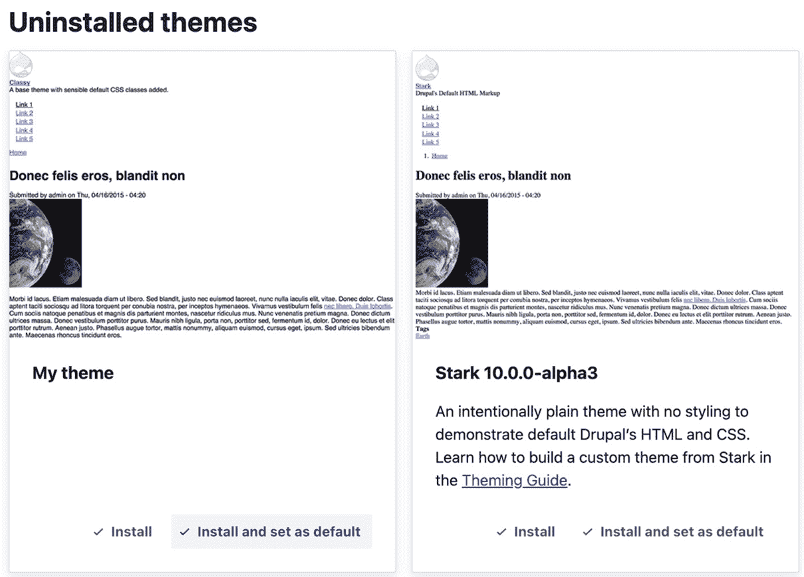
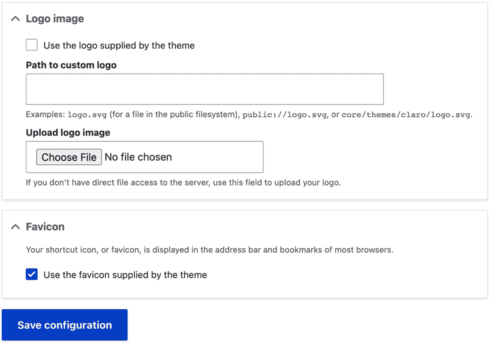
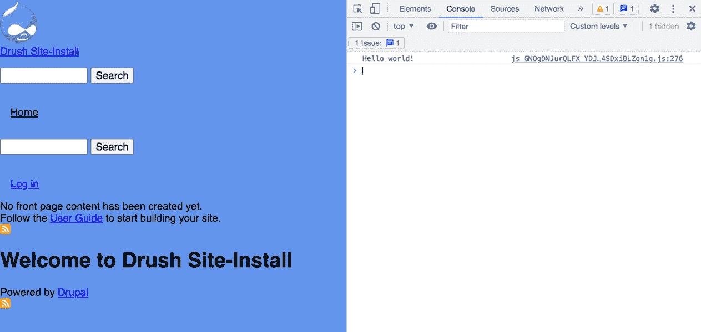
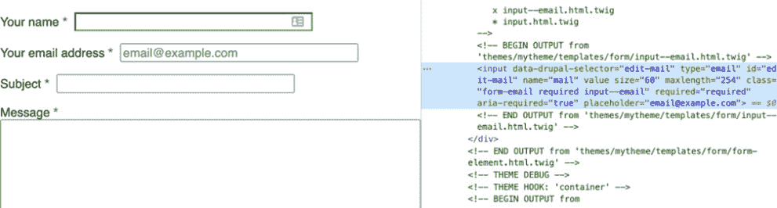
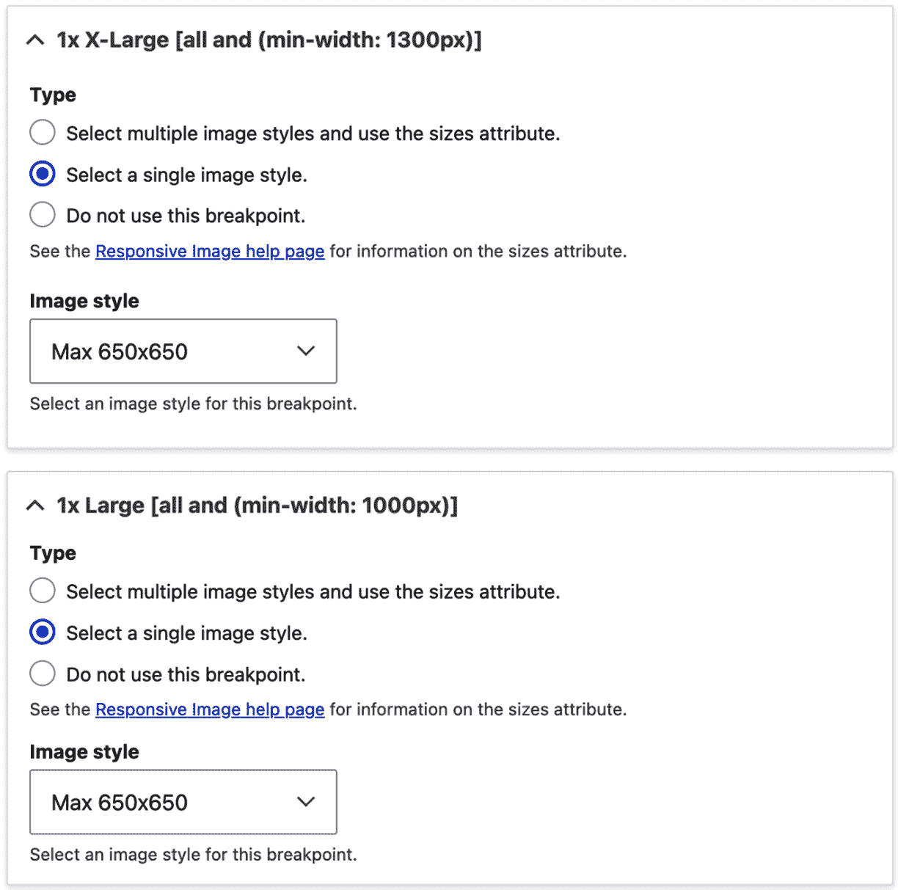
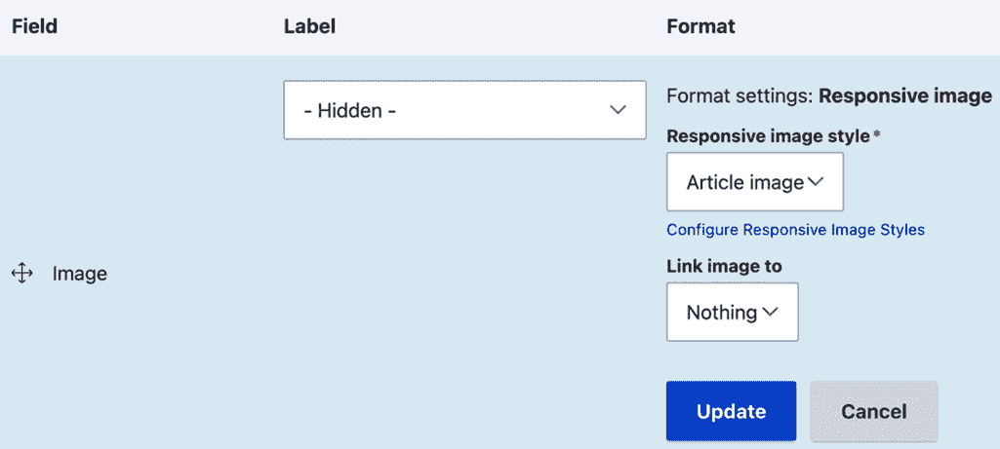

# 第十章：主题化和前端开发

**主题化** 是一个过程，通过这个过程我们可以使用 CSS、JavaScript、Twig 模板和 HTML 影响实体的输出（节点、用户、分类术语、媒体等）。Drupal 随带了一些开箱即用的主题，在安装后提供基本的视觉和感觉。Olivero 是 Drupal 10 的默认网站主题，Claro 提供了管理主题。

在 [Drupal.org](http://Drupal.org) 上有大量选项可供选择，这些选项要么为您自己的主题提供一个起点（例如 Bootstrap、ZURB Foundation 或 Barrio），要么提供一个完整的即用型解决方案。您还可以从头开始创建自己的自定义主题。

在 Drupal 页面加载后，屏幕上显示的所有内容都经过了主题化和渲染管道。这意味着您可以自定义您看到的主题，并控制其标记和样式。了解 Drupal 主题化工作原理将使您成为一个更有效的开发者，本章将帮助您做到这一点。

在本章中，我们将介绍以下食谱：

+   创建一个自定义主题以美化您的 Drupal 网站

+   将 CSS 和 JavaScript 添加到您的主题中

+   在您的主题中使用 Twig 模板

+   交付响应式图片

+   使用 Laravel Mix 编译 CSS 和 JavaScript 预处理器和后处理器

+   使用 Laravel Mix 通过实时重新加载为主题化 Drupal 网站提供

# 技术要求

您可以在 GitHub 上找到本章使用的完整代码：https://github.com/PacktPublishing/Drupal-10-Development-Cookbook/tree/main/chp10

# 创建一个自定义主题以美化您的 Drupal 网站

Drupal 提供了一个主题生成器，用于根据 Starterkit 主题创建 Drupal 网站的定制主题。这提供了所有基本的 CSS 样式表、JavaScript 文件和 Twig 模板，以开始自定义 Drupal 网站的视觉和感觉。主题生成器包含在 Drupal 核心提供的开发者命令行工具中，位于 `core/scripts/drupal`。

## 如何做到这一点…

1.  生成主题的脚本需要在 `web` 目录中执行，因此请在您的终端中导航到那里：

    ```php
    cd web
    ```

1.  从 `core/scripts/drupal` 脚本运行 `generate-theme` 命令：

    ```php
    php core/scripts/drupal generate-theme mytheme --name
    ```

    ```php
      "My theme"
    ```

`generate-theme` 命令接受一个参数 – 主题的机器名称。您还可以传递 `name` 选项来给它一个可读的名称。

1.  主题生成后，它将在 `web/themes` 目录中可用。命令将输出类似以下内容：

    ```php
    Theme generated successfully to themes/mytheme
    ```

1.  您现在可以访问 `/admin/appearance` 并安装您的新主题：



图 10.1 – 安装新自定义主题的外观管理屏幕

## 它是如何工作的…

主题生成器使用 *复制并忘记* 模型，也称为 *分支并忘记*，与 Starterkit 主题一起。这意味着您的主题是您创建主题时 Starterkit 主题的副本，如果 Starterkit 主题在 Drupal 的后续版本中发生变化，则您的主题不会损坏。

这与其他系统不同，这些系统需要建立在子主题之上，例如 WordPress，或者从头开始构建，例如*Laravel*和*Symfony*。这允许你从一个起点创建主题并开始工作，无需担心由于基础主题的变化而导致的向后不兼容性。

其他主题可以作为起始套件。它们是贡献的主题，可以使用`--starterkit`选项指定。

下一个配方将介绍如何向你的 Drupal 网站添加新的 CSS 样式表和 JavaScript 文件。

## 更多内容

接下来，我们将深入了解主题和主题生成器的更多信息。

### 创建你的起始套件主题

非常常见，组织机构在主题上有一个共享的起始基础。你可以定义自己的起始套件来创建新的主题并利用现有的设置。这是通过在你的主题的`info.yml`文件中添加`starterkit`键来完成的：

```php
startekit: true
```

当此值设置为`true`时，主题生成命令允许你使用它来生成新的主题。这个标志是必需的，因为有些主题并不打算以通用功能为基础的起始套件。

### 主题截图

主题可以在主题文件夹中的`screenshot.png`图像文件或`info.yml`文件下的`screenshot`键中指定的文件中提供截图。

### 主题、标志和 favicon

Drupal 将网站的 favicon 和标志设置作为主题设置进行控制。这些设置基于主题，而不是全局的。主题目录中放置的`favicon.ico`也将是网站`favicon`的默认值。主题可以通过在主题目录中提供`logo.svg`来提供默认的标志。可以通过在`info.yml`文件中使用`logo`键并指定文件路径来指定替代的标志文件。

你可以通过导航到**外观**然后点击当前主题的**设置**来更改网站的标志和 favicon。取消选中 favicon 和标志设置的默认复选框允许你提供自定义文件：



图 10.2 – 标志和 favicon 主题设置概览

## 相关阅读

+   Starterkit 主题的文档：[`www.drupal.org/docs/core-modules-and-themes/core-themes`](https://www.drupal.org/docs/core-modules-and-themes/core-themes)

+   主题生成的文档：[`www.drupal.org/docs/theming-drupal`](https://www.drupal.org/docs/theming-drupal)

+   关于主题的`info.yml`文件属性的文档：[`www.drupal.org/node/2349827`](https://www.drupal.org/node/2349827)

# 向你的主题添加 CSS 和 JavaScript

在 Drupal 中，CSS 样式表和 JavaScript 文件与库相关联，并且特定的库被添加到页面中。这允许 CSS 样式表和 JavaScript 文件仅在需要时附加。主题可以与必须始终附加以进行全局样式的库相关联。

在这个菜谱中，我们将更新主题的 `libraries.yml` 文件以注册由自定义主题提供的 CSS 样式表和 JavaScript 文件。

## 准备工作

此菜谱使用由主题生成器创建的主题，如 *创建自定义主题以美化你的 Drupal* *站点* 菜谱中所述。

## 如何操作…

1.  首先，在你的主题目录中创建 `css` 和 `js` 目录，分别用于存放 CSS 样式表和 JavaScript 文件：

    ```php
    mkdir -p css js
    ```

1.  在 `css` 目录下，添加一个 `styles.css` 文件，该文件将包含你的主题 CSS 声明。为了演示目的，将以下 CSS 声明添加到 `styles.css` 文件中：

    ```php
    body {
    ```

    ```php
      background: cornflowerblue;
    ```

    ```php
    }
    ```

1.  在 `js` 目录下，添加一个 `scripts.js` 文件，该文件将包含主题的 JavaScript 项。为了演示目的，将以下 JavaScript 代码添加到 `scripts.js` 文件中：

    ```php
    (function(Drupal) {
    ```

    ```php
      Drupal.behaviors.myTheme = {
    ```

    ```php
        attach() {
    ```

    ```php
          console.log('Hello world!')
    ```

    ```php
        }
    ```

    ```php
      }
    ```

    ```php
    })(Drupal);
    ```

此脚本将在脚本加载时在控制台打印一条消息。

1.  修改 `mytheme.libraries.yml` 文件并添加一个 `global-styling` 库定义到你的主题中：

    ```php
    global-styling:
    ```

    ```php
      version: VERSION
    ```

    ```php
      css:
    ```

    ```php
        theme:
    ```

    ```php
          css/styles.css: {}
    ```

    ```php
      js:
    ```

    ```php
        js/scripts.js: {}
    ```

    ```php
      dependencies:
    ```

    ```php
        - core/drupal
    ```

库的名称是 `global-styling`。库可以定义一个 `version` 键并使用 `VERSION` 作为默认值，它默认为 Drupal 核心的最新版本。`css/styles.css` 文件被添加到 `theme` 组的 `css` 键。`js/script.js` 被添加到 `js` 键。

`dependencies` 键指定了 JavaScript 运行必须存在的其他库。

1.  编辑 `mytheme.info.yml` 以将 `global-styling` 库添加到 `libraries` 键：

    ```php
    name: 'My theme'
    ```

    ```php
    type: theme
    ```

    ```php
    'base theme': stable9
    ```

    ```php
    libraries:
    ```

    ```php
      - mytheme/global-styling
    ```

    ```php
      - mytheme/base
    ```

    ```php
      - mytheme/messages
    ```

    ```php
      - core/normalize
    ```

1.  重建你的 Drupal 站点的缓存以重建库定义缓存，触发库定义和主题信息的重新发现：

    ```php
    php vendor/bin/drush cr
    ```

1.  查看你的 Drupal 站点以验证背景颜色是否已更改，以及 `Hello world!` 是否已打印到浏览器的控制台：



图 10.3 – 附加了全局库的自定义主题

## 工作原理…

Drupal 使用库将 CSS 样式表和 JavaScript 文件附加到页面。这允许库依赖于其他库，例如基础 CSS 样式表或 JavaScript 功能。在这个菜谱中，`core/drupal` 依赖项确保 `core/misc/drupal.js` 被附加到页面。`core/misc/core.js` 添加全局的 `Drupal` 对象，这使得你可以定义 `behaviors`。每当页面加载或 AJAX 事件被触发时，`Drupal.behaviors` 中的每个条目都会调用其 `attach` 函数。

资产聚合

如果 Drupal 配置为聚合资源，你将需要在每次文件更改后重建 Drupal 的缓存，以便创建一个新的聚合。这可以通过访问 `/admin/config/development/performance` 并取消聚合的复选框来完成。

**Drupal 的 CSS 架构**借鉴了**可伸缩和模块化 CSS 架构**（**SMACSS**）系统的概念来组织 CSS 声明。CSS 样式通过级联层应用。Drupal 库有不同的组，CSS 样式表可以附加到这些组上，以控制样式表加载的顺序。CSS 组如下：

+   `base`：用于针对 HTML 元素的样式

+   `layout`：用于布局页面的样式

+   `component`：用于应用于设计组件的样式

+   `state`：用于应用于组件的状态的样式

+   `theme`：用于自定义组件的样式

主题可以指定在主题被使用的每个页面上包含的库。

## 还有更多

我们将在下一节中更详细地探讨使用库的更多选项。

### 库文件选项

`{ }`)使用。

以下示例，取自`core.libraries.yml`，为库添加了`es6-promise` polyfill：

```php
es6-promise:
  version: "4.2.8"
  license:
    name: MIT
    url: https://raw.githubusercontent.com/stefanpenner
        /es6-promise/v4.2.8/LICENSE
    gpl-compatible: true
  js:
    assets/vendor/es6-promise/es6-promise.auto.min.js: {
        weight: -20, minified: true }
```

该库提供了一个兼容层，允许您控制库在其它库中的优先级。`minified`属性指定文件已经过压缩，不需要由 Drupal 进行处理。

`preprocess`属性支持布尔值。如果一个文件有`preprocess: false`，它将不会与其他文件同时聚合。

### 覆盖和扩展其他库

主题可以使用其`info.yml`文件中的`libraries-override`和`libraries-extend`键来覆盖库。这允许主题轻松地自定义现有库，而无需在特定库附加到页面时添加条件移除或添加其资产的逻辑。

`libraries-override`键可以用来替换整个库，替换库中的选定文件，从库中移除资产，或禁用整个库。以下代码将允许主题提供自定义的 jQuery UI 主题：

```php
libraries-override:
  core/jquery.ui:
    css:
      component:
        assets/vendor/jquery.ui/themes/base/core.css: false
      theme:
        assets/vendor/jquery.ui/themes/base/theme.css:
            css/jqueryui.css
```

`override`声明模仿了原始配置。指定`false`将移除资产；否则，提供的路径将替换该资产。

`libraries-extend`键可以用来加载与现有库一起使用的额外库。以下代码将允许主题将 CSS 样式表与选定的 jQuery UI 声明覆盖相关联，而无需始终将其包含在主题的其他资产中：

```php
libraries-extend:
  core/jquery.ui:
    - mytheme/jqueryui-theme
```

使用`starterkit`生成的主题已经包含了`libraries-extend`的示例。

### 使用 CDN 或外部资源作为库

库还可以与外部资源一起工作，例如通过 CDN 加载的资产。这是通过提供文件位置的 URL 以及选定的文件参数来完成的。

以下是一个从`BootstrapCDN`提供的`jsDeliver`中添加 Font Awesome 字体图标库的示例：

```php
mytheme.fontawesome:
  remote: http://fontawesome.io/
  version: 5.15.4
  license:
    name: SIL OFL 1.1
    url: https://github.com/FortAwesome/Font-
        Awesome/blob/5.x/LICENSE.txt
    gpl-compatible: true
  css:
    base:
      https://cdn.jsdelivr.net/npm/@fortawesome
        /fontawesome-free@5.15.4/css/fontawesome.min.css: {
            type: external, minified: true }
```

`remote`键描述了库使用外部资源。虽然此键的验证仅限于其存在，但最好使用外部资源的主要网站来定义它：

```php
  remote: http://fontawesome.io/
```

与所有库一样，需要`version`信息。这应该与添加的外部资源的版本相匹配：

```php
  version: 5.15.4
```

如果库定义了`remote`键，它还需要定义`license`键。这定义了许可名称和许可的 URL，并检查它是否与 GPL 兼容。如果没有提供此键，将抛出`\Drupal\Core\Asset\Extension\LibraryDefinitionMissingLicenseException`异常：

```php
  license:
    name: SIL OFL 1.1
    url: https://github.com/FortAwesome/Font-
        Awesome/blob/5.x/LICENSE.txt
    gpl-compatible: true
```

最后，特定的外部资源以正常方式添加。而不是提供相对文件路径，提供外部 URL。

### 通过钩子操作库

模块可以提供动态库定义和修改库。模块可以使用`hook_library_info()`钩子动态提供库定义。这不是定义库的推荐方式，但提供用于边缘用例。

模块不能使用`libraries-override`或`libraries-extend`，需要依赖于`hook_library_info_alter()`钩子。您可以在`core/lib/Drupal/Core/Render/theme.api.php`或[`api.drupal.org/api/drupal/core!lib!Drupal!Core!Render!theme.api.php/function/hook_library_info_alter/10`](https://api.drupal.org/api/drupal/core!lib!Drupal!Core!Render!theme.api.php/function/hook_library_info_alter/10)中了解此钩子。

### 将 JavaScript 放在页眉

默认情况下，Drupal 确保 JavaScript 放在页面最后。这通过首先加载页面的关键部分来提高页面加载性能。现在将 JavaScript 放在页眉是一个可选的选项。

要在页眉中渲染库，您需要添加`header: true`键值对：

```php
js-library:
  header: true
  js:
    js/myscripts.js: {}
```

这将在页面的页眉中加载一个自定义 JavaScript 库及其依赖项。

## 参见

+   参考 Drupal 的 CSS 架构：在[`www.drupal.org/node/1887918#separate-concerns`](https://www.drupal.org/node/1887918#separate-concerns)中分离关注点

+   SMACSS 网站：[`smacss.com/`](http://smacss.com/)

# 在您的主题中使用 Twig 模板

Drupal 的主题层使用**Twig 模板系统**，这是来自 Symfony 项目的一个组件。**Twig**是一种模板语言，其语法类似于 Django 和 Jinja 模板。

在此配方中，我们将覆盖用于文本输入的默认 Twig 模板，为电子邮件表单元素提供自定义。我们将使用**Twig 语法**向输入元素添加一个新类并提供占位符属性。

## 准备工作

此配方使用由主题生成器创建的主题，正如在*创建自定义主题以美化您的 Drupal* *网站*配方中所做的那样。

## 如何做到这一点...

1.  首先，在`template/form`目录中，将`input.html.twig`文件复制为`input--email.html.twig`。模板将如下所示：

    ```php
    {#
    ```

    ```php
    /**
    ```

    ```php
     * @file
    ```

    ```php
     * Theme override for an 'input' #type form element.
    ```

    ```php
     *
    ```

    ```php
     * Available variables:
    ```

    ```php
     * - attributes: A list of HTML attributes for the
    ```

    ```php
        input element.
    ```

    ```php
     * - children: Optional additional rendered elements.
    ```

    ```php
     *
    ```

    ```php
     * @see template_preprocess_input()
    ```

    ```php
     */
    ```

    ```php
    #}
    ```

    ```php
    <input{{ attributes }} />{{ children }}
    ```

属性变量是`\Drupal\Core\Template\Attribute`的一个实例，这是一个用于存储 HTML 元素属性的值对象。

1.  `Attribute` 类有一个用于添加新的 `class` 属性值的 `addClass` 方法。我们将使用 `addClass` 向输入元素添加一个新类：

    ```php
    <input{{ attributes.addClass('input--email') }} />{{
    ```

    ```php
        children }}
    ```

1.  在上一行之前，我们将使用三元运算符创建一个 Twig 变量，使用 `setAttribute` 方法提供一个默认占位符：

    ```php
    
    ```

    ```php
    <input{{ attributes.addClass('input--
    ```

    ```php
        email').setAttribute('placeholder', placeholder)
    ```

    ```php
            }} />{{ children }}
    ```

使用 `set` 操作符创建一个名为 `placeholder` 的新变量。问号 (`?`) 操作符检查 `attributes` 对象中的占位符属性是否为空。如果不为空，则使用现有值。如果值为空，则提供一个默认值。

1.  重建您的 Drupal 网站缓存以重建 Drupal 网站的 Twig 模板：

    ```php
    php vendor/bin/drush cr
    ```

1.  假设您已使用标准 Drupal 安装，在未登录状态下访问 `/contact/feedback`，并查看电子邮件字段的更改：



图 10.4 – 电子邮件输入的 HTML 元素源代码

## 它是如何工作的…

Drupal 的主题系统是围绕主题钩子和主题钩子建议构建的。当一个主题钩子有双下划线 (`__`) 时，Drupal 的主题系统会理解这一点，并且可以分解主题钩子以找到更通用的模板。

电子邮件输入元素的元素定义定义了 `input__email` 主题钩子。如果没有通过 Twig 模板或 PHP 函数实现 `input__email` 钩子，它将降级到仅有的 `input` 主题钩子和模板。

注意

Drupal 主题钩子使用下划线 (`_`) 定义，但在 Twig 模板文件中使用时使用连字符 (`-`)。

给定的电子邮件元素定义提供了 `input__email` 作为其主题钩子，Drupal 理解如下：

+   查找由主题或定义 `input__email` 的模块提供的名为 `input--email.html.twig` 的 Twig 模板。

+   如果找不到模板，查找名为 `input.html.twig` 的 Twig 模板或定义 `input` 的模块中的主题钩子。

Drupal 利用主题钩子建议来提供基于不同条件输出变化的方式。它允许站点主题为某些实例提供更具体的模板。主题钩子建议可以通过 `.module` 或 `.theme` 文件中的 `hook_theme_suggestions()` 钩子提供。

处理器，如 Drupal 的主题层，将变量传递给 Twig。可以通过将变量名括在花括号中来打印变量或对象属性。Drupal 核心所有默认模板都在文件的文档块中提供信息，详细说明了可用的 Twig 变量。

Twig 语法简单，包含基本的逻辑和函数。`addClass` 方法将接受 `attributes` 变量并添加提供的类，同时保留现有内容。

当提供主题钩子建议或修改现有模板时，您需要重建 Drupal 的缓存。与 PHP 一样，Drupal 会缓存编译后的 Twig 模板，这样在模板被调用时就不需要重新编译。

## 更多内容

在接下来的章节中，我们将进一步讨论使用 Twig。

### 调试模板文件选择和钩子建议

可以启用调试以检查构成页面的各种模板文件及其主题钩子建议，并检查哪些是活动的。这可以通过编辑`sites/default/services.yml`文件来完成。如果不存在`services.yml`文件，可以将`default.services.yml`复制以创建一个。

您需要在文件的`twig.config`部分下将`debug: false`更改为`debug: true`。这将导致 Drupal 主题层打印出包含模板信息的源代码注释。当`debug`开启时，Drupal 不会缓存编译后的 Twig 模板，而是即时渲染它们。

另有一个设置可以防止您在每次模板文件更改时无需启用`debug`就重建 Drupal 的缓存。可以将`twig.config.auto_reload`布尔值设置为`true`。如果设置为`true`，当源代码更改时，Twig 模板将被重新编译。

## 参见

+   请参阅[Twig 文档](https://twig.symfony.com/)

+   请参阅[hook_theme_suggestions](https://api.drupal.org/api/drupal/core%21lib%21Drupal%21Core%21Render%21theme.api.php/function/hook_theme_suggestions_HOOK/10)的 API 文档

# 交付响应式图像

`HTML5`的`<picture>`标签和源集。利用**断点**模块，将映射到断点，以表示在每个断点使用的图像样式。响应式图像样式是通过将图像格式映射到特定断点和修饰符的配置。首先，您需要定义一个响应式图像样式，然后可以将其应用于图像字段。

在本教程中，我们将创建一个名为**文章图像**的响应式图像样式集，并将其应用于**文章**内容类型的图像字段。

## 如何做到这一点…

1.  首先，您需要安装`responsive_image`模块：

    ```php
    php vendor/bin/drush en responsive_image -y
    ```

1.  从管理工具栏中，转到**配置**，然后在**媒体**部分下转到**响应式图像样式**。点击**添加响应式图像样式**以创建新的样式集。

1.  从**断点组**选择列表中选择**Olivero**以使用 Olivero 主题定义的断点。

1.  每个断点将按字段集分组。展开字段集，选择**选择单个图像样式**，然后选择合适的**图像样式**选项：



图 10.5 – 响应式图像样式表单

1.  此外，在浏览器不支持源集或发生错误的情况下，选择**备用图像样式**选项。

1.  点击**保存**以保存配置，并添加新的样式集。

1.  前往**结构**和**内容类型**，从**文章**内容类型的下拉菜单中选择**管理显示**。

1.  将**图片**字段的格式化器更改为**响应式图片**。

1.  点击字段格式化器的**设置**齿轮图标，选择您的新**响应式****图片样式**集。从**响应式图片****样式**下拉菜单中选择**文章图片**：



图 10.6 – 响应式图片样式配置表

1.  点击**更新**以保存字段格式化器设置，然后点击**保存**以保存字段显示设置。

## 它是如何工作的…

使用响应式图片格式化器的优点是其性能。浏览器将只下载适当`source`标签中`srcset`定义的资源。这不仅允许您提供更合适的图片大小，而且在小型设备上也会携带更小的负载。

**响应式图片**样式提供三个组件：

+   一个响应式图片元素

+   响应式图片样式配置实体

+   响应式图片字段格式化器

配置实体由字段格式化器消费并通过响应式图片元素显示。

响应式图片样式实体包含一个断点到图片样式映射的数组。可用的断点由选定的断点组定义。断点组可以随时更改；然而，之前的映射将会丢失。

响应式图片元素在每个断点处打印一个图片元素，定义一个新的源元素。断点的媒体查询值作为元素的媒体属性提供。

## 相关内容

+   请参考**Mozilla 开发者网络**（**MDN**）上的图片元素[`developer.mozilla.org/en-US/docs/Web/HTML/Element/picture`](https://developer.mozilla.org/en-US/docs/Web/HTML/Element/picture)

# 使用 Laravel Mix 编译 CSS 和 JavaScript 预处理器和后处理器

**Laravel Mix**是一个简化 Webpack 配置的项目，Webpack 是一个用于前端开发的打包器。Laravel Mix 最初是为了与 Laravel 项目一起使用而构建的，但也可以用于任何需要打包 JavaScript 或 CSS 预处理器和后处理的项目。

在本食谱中，我们将向主题添加 Laravel Mix 以转换我们的 ES6 JavaScript 和 PostCSS，并根据所需的浏览器支持后处理我们的 CSS。

## 准备工作

本章的*将 CSS 和 JavaScript 添加到您的主题*食谱介绍了如何为您的主题创建资产库。本节将使用该食谱中的信息。

## 如何操作…

1.  首先，在您的主题中创建一个`src`目录来存储将由 Webpack 处理的 CSS 和 JavaScript 源文件：

    ```php
    mkdir src
    ```

1.  接下来，在`src`目录中创建一个`styles.css`文件，内容如下：

    ```php
    :root {
    ```

    ```php
      --text-color: rgb(43, 43, 43);
    ```

    ```php
    }
    ```

    ```php
    body {
    ```

    ```php
      color: var(--text-color);
    ```

    ```php
    }
    ```

此 CSS 文件使用 CSS 变量。虽然现在普遍支持，但`PostCSS`将确保在后处理 CSS 样式表中保持向后兼容性。

1.  然后，在`src`目录中创建一个`scripts.js`文件，内容如下：

    ```php
    (function(Drupal) {
    ```

    ```php
      Drupal.behaviors.myTheme = {
    ```

    ```php
        attach() {
    ```

    ```php
          console.log('Hello world!')
    ```

    ```php
        }
    ```

    ```php
      }
    ```

    ```php
    })(Drupal);
    ```

1.  现在，我们将准备安装 Laravel Mix。在您的主题目录中，使用`npm init`命令初始化项目：

    ```php
    npm init -y
    ```

这创建了一个`package.json`文件，它存储了使用 npm 的项目依赖信息。

1.  使用`npm install`来安装 Laravel Mix：

    ```php
    npm install laravel-mix --save-dev
    ```

1.  我们还需要安装`postcss-present-env`以确保我们的 CSS 经过后处理以兼容所有浏览器：

    ```php
    npm install postcss-preset-env --save-dev
    ```

Laravel Mix 捆绑了`@babel/preset-env`，这确保了 JavaScript 的浏览器兼容性。

1.  现在我们有了 Laravel Mix，我们必须进行配置。在您的主题目录中创建一个`webpack.mix.js`文件，并使用以下配置：

    ```php
    let mix = require('laravel-mix');
    ```

    ```php
    mix.js('src/scripts.js', 'dist/');
    ```

    ```php
    mix.css('src/styles.css', 'dist/', [
    ```

    ```php
      require('postcss-preset-env')
    ```

    ```php
    ]);
    ```

`mix`上的`js`方法设置 Webpack 的 JavaScript 捆绑和转译。第一个参数是源文件，第二个参数是目标。`mix`上的`css`方法设置 PostCSS。第一个参数是源文件，第二个参数是目标。第三个参数将额外的插件传递给 PostCSS。

1.  要编译我们的 CSS 和 JavaScript 文件，运行`npx mix`。这将创建`dist/styles.css`和`dist/scripts.js`：

    ```php
    npx mix
    ```

1.  现在，我们需要创建我们的主题库，它将注册来自`dist`目录的 CSS 和 JavaScript 文件：

    ```php
    theme-styling:
    ```

    ```php
      version: VERSION
    ```

    ```php
      css:
    ```

    ```php
        theme:
    ```

    ```php
          dist/styles.css: {}
    ```

    ```php
      js:
    ```

    ```php
        dist/scripts.js: {}
    ```

    ```php
      dependencies:
    ```

    ```php
        - core/drupal
    ```

1.  编辑`mytheme.info.yml`以将`theme-styling`库添加到`libraries`键：

    ```php
    name: 'My theme'
    ```

    ```php
    type: theme
    ```

    ```php
    'base theme': stable9
    ```

    ```php
    starterkit: true
    ```

    ```php
    libraries:
    ```

    ```php
      - mytheme/theme-styling
    ```

    ```php
      - mytheme/base
    ```

    ```php
      - mytheme/messages
    ```

    ```php
      - core/normalize
    ```

1.  重建您的 Drupal 网站的缓存以重建库定义缓存，触发库定义和主题信息的重新发现：

    ```php
    php vendor/bin/drush cr
    ```

1.  您的 CSS 和 JavaScript 文件现在已注册，将允许您编写最新的 CSS 和 JavaScript，同时保持浏览器兼容性。

## 它是如何工作的…

Laravel Mix 是一个简化 Webpack 配置的包。当运行`npx mix`时，这将运行 Laravel Mix 的脚本。Laravel Mix 读取`webpack.mix.js`，构建 Webpack 配置，并代表您执行 Webpack。

## 参见

+   Laravel Mix 文档：[`laravel-mix.com/docs`](https://laravel-mix.com/docs)

# 使用 Laravel Mix 为您的 Drupal 网站添加实时重新加载的主题

在之前的配方*使用 Laravel Mix 编译 CSS 和 JavaScript 预和后处理器*中，我们为主题设置了 Laravel Mix。Laravel Mix 支持`Browsersync`。`Browsersync`是一个监控您的源文件更改并自动将更改注入浏览器的工具，因此您不需要手动刷新页面。

在这个配方中，我们将利用`BrowserSync`功能来加速构建您的 Drupal 主题的开发。

## 入门

确保通过访问`/admin/config/development/performance`禁用了 CSS 和 JavaScript 文件的聚合。

或者，您可以将以下配置覆盖添加到您的`settings.php`中，以强制禁用聚合：

```php
$config['system.performance']['css']['preprocess'] = FALSE;
$config['system.performance']['js']['preprocess'] = FALSE;
```

这也是默认通过在`sites/default`中的`example.settings.local.php`来设置的。

## 如何做到这一点…

1.  要使用 Laravel Mix 配置 Browsersync，我们在`mix`上调用`browserSync`方法：

    ```php
    let mix = require('laravel-mix');
    ```

    ```php
    mix.js('src/scripts.js', 'dist/');
    ```

    ```php
    mix.css('src/styles.css', 'dist/', [
    ```

    ```php
      require('postcss-preset-env')
    ```

    ```php
    ]);
    ```

    ```php
    mix.browserSync();
    ```

1.  在配置 Browsersync 之前，我们需要 Laravel Mix 下载 Browsersync 的额外 Webpack 依赖项。Laravel Mix 在运行和首次配置时会自动执行此操作：

    ```php
    npx mix
    ```

您将看到类似以下的消息：*必须安装额外的依赖项。这只需* *片刻时间* *即可*。

1.  我们需要指定我们的 Drupal 网站的 URL 以供 `Browsersync` 代理：

    ```php
    mix.browserSync({
    ```

    ```php
      proxy: 'mysite.ddev.site:80'
    ```

    ```php
    });
    ```

`localhost:3000` 并将从提供的 URL 的 Drupal 网站代理内容。将 `mysite.ddev.site` 替换为您的 Drupal 网站的域名。

1.  接下来，我们需要指定 Browsersync 应该监视哪些文件以通过提供 `files` 选项将更新注入浏览器：

    ```php
    mix.browserSync({
    ```

    ```php
      proxy: 'mysite.ddev.site:80',
    ```

    ```php
      files: [
    ```

    ```php
        'dist/styles.css',
    ```

    ```php
        'dist/scripts.js',
    ```

    ```php
      ]
    ```

    ```php
    });
    ```

这告诉 Browsersync 对我们编译的资产进行响应，这些资产是添加到页面上的。

1.  最后，我们需要以开发模式运行 Laravel Mix 来监视变化。这将打开一个使用 Browsersync 的浏览器，并在文件更改时更新：

    ```php
    npx mix watch
    ```

1.  现在您的浏览器已经打开，修改 `src/styles.css` 或 `src/scripts.js`，并监视您的 Drupal 网站的主题更新，而无需刷新页面。

## 它是如何工作的…

配置并收集所有必要的 Webpack 插件可能会很麻烦。Laravel Mix 提供了一种方法，可以轻松地在任何项目中配置 Webpack。Laravel Mix 支持 Vue、React 和 Preact 的 JavaScript 打包。它还内置了对 Sass 和 Less 的支持，以及 PostCSS。所有这些选项都可以在 Laravel Mix 的 API 文档中找到，网址为 [`laravel-mix.com/docs/6.0/api`](https://laravel-mix.com/docs/6.0/api)。

## 更多内容

Browsersync 可以用于监视不仅仅是 CSS 和 JavaScript 文件的变化。

### 监视 Twig 模板的变化

Browsersync 也可以配置为监视 Twig 文件的变化，以便在 Twig 模板被修改时更新浏览器。要监视 Twig 模板的变化，请将 `templates/**/*` 添加到 `files` 选项中：

```php
mix.browserSync({
  proxy: 'mysite.ddev.site:80',
  files: [
    'dist/styles.css',
    'dist/scripts.js',
    'templates/**/*'
  ]
});
```

每次您修改主题的 Twig 模板时，Browsersync 都会为您刷新页面。

为了获得最佳效果，您需要确保您有一个包含以下内容的 `sites/default/services.yml` 文件来启用 Twig 调试：

```php
  twig.config:
    debug: true
    auto_reload: null
    cache: true
```

这将确保每次修改 Twig 模板时都会重新构建它们。这在本食谱的 *在主题中使用 Twig 模板* 和 *调试模板文件选择和* *钩子建议* 下的 *更多内容* 部分中有所说明。

您还需要绕过 Drupal 的 `render` 缓存，这可能会导致输出过时。请确保 `settings.php` 中有以下行，这些行也可以在 `example.settings.local.php` 中找到：

```php
$settings['container_yamls'][] = DRUPAL_ROOT . '/sites/
development.services.yml';
$settings['cache']['bins']['render'] = 'cache.backend.null';
$settings['cache']['bins']['page'] = 'cache.backend.null';
$settings['cache']['bins']['dynamic_page_cache'] = 'cache.
backend.null';
```

这将强制 Drupal 使用一个不缓存任何数据的缓存后端，您的 Drupal 网站可能会运行得更慢，但它允许您在不重建 Drupal 缓存的情况下构建您的主题。

## 参见

+   Browsersync 文档：[`browsersync.io/docs/options/`](https://browsersync.io/docs/options/)

+   Laravel Mix 文档：[`laravel-mix.com/docs`](https://laravel-mix.com/docs)
