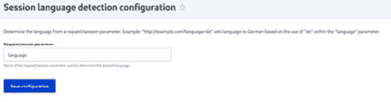

# 多语言和国际化

Drupal 最伟大的优势之一一直是其提供多语言和国际化的能力。您不仅可以让内容编辑员能够以多种语言添加网站内容，还可以翻译管理界面。

本章将介绍 **Drupal 10** 的多语言和国际化功能，这些功能自 **Drupal 6** 以来在每次发布中都得到了极大的增强。Drupal 的早期版本需要许多额外的模块来提供国际化工作，但现在大多数功能都由 Drupal 核心提供。

Drupal 核心提供了以下多语言模块：

+   **语言**：这为您提供了检测和支持多种语言的能力

+   **界面翻译**：这会将已安装的语言翻译成通过用户界面呈现的字符串

+   **配置翻译**：这允许您翻译配置实体，例如日期格式和视图

+   **内容翻译**：这带来了提供不同语言内容并在用户当前语言中显示的强大功能

每个模块在为您的 Drupal 网站创建多语言体验方面都发挥着特定的作用。在底层，Drupal 支持所有实体和缓存上下文的语言代码。这些模块公开了接口以实现和提供国际化体验。

在本章中，我们将介绍以下食谱，以使您的网站实现多语言和国际化的功能：

+   确定当前语言的选择方式

+   翻译管理界面

+   翻译配置

+   翻译内容

+   创建多语言视图

# 确定当前语言的选择方式

默认情况下，Drupal 能够确定它应该显示的内容和用户界面语言，而无需在管理屏幕上添加更多设置。这是确保在所有时间，向每个用户展示内容时都使用适当的语言所必需的步骤。

以下食谱将向您展示如何设置 Drupal 决定在页面上向用户展示内容时使用哪种语言的参数。您有几种方法可以检测要使用哪种语言。

## 准备工作

首先，登录到您的 Drupal 网站，并转到管理界面中的 **扩展** 部分。启用 **语言**、**内容翻译** 和 **界面翻译** 模块。

## 如何操作...

1.  接下来，导航到管理界面中的 **管理** | **配置** | **区域和语言** | **语言** 部分。

1.  点击 **检测和选择** 选项卡。在此屏幕上有两个部分：

    +   顶部部分，**界面文本语言检测**，允许您指定如何选择界面文本的当前语言：


图 11.1 – 管理屏幕中的语言检测选项

+   正如你所见，有许多可用的语言检测方法：**账户管理页面**、**URL**、**会话**、**用户**、**浏览器**和**选择的语言**。

+   第二个部分，**内容语言检测**，允许你指定在向用户显示内容（浏览网站）时如何选择当前语言：


图 11.2 – 自定义内容语言检测以区别于界面文本语言检测设置

因此，有两个选项可供选择——**内容语言**和**界面**。

## 它是如何工作的...

Drupal 能够以多种方式检测和设置当前语言。它是如何知道如何做到这一点的呢？

在幕后，Drupal 通过其`LanguageNegotiator`类在生成响应以服务用户时评估这些语言检测设置。它根据设置的顺序和配置选择检测到的语言。

`LanguageNegotiator`类按顺序评估语言检测设置，这些设置是通过它们特定的语言协商插件实现来评估的，这些插件位于 Drupal 的`modules/language/src/Plugin/LanguageNegotiation`目录中。

## 更多内容...

让我们来看看**检测和选择**标签页的两个部分。

### 界面文本语言检测

如所述，Drupal 能够为内容和界面本身提供翻译和语言检测功能，如图*图 11.1*所示。除此之外，Drupal 还能够控制这两种情况下的规则，使用户和编辑在网站的不同区域看到的语言具有最大灵活性。

让我们来看看*图 11.1*中显示的检测方法：

+   **账户管理页面**：此选项允许有权访问 Drupal 管理区域的用户设置管理界面的首选语言。当你启用此选项时，用户表单上会出现一个新字段，允许你选择要使用哪种语言。这对于可能希望将 Drupal 管理界面设置为一种语言，同时在另一种语言中审查/编辑内容的用户来说很有用。在这个例子中，用户将管理语言设置为**西班牙语**：


图 11.3 – 在用户账户中选择 Drupal 管理语言为西班牙语

+   `/es/admin/config/languages`，其中`es`是语言代码，并且将使用西班牙语来翻译用户界面的文本。在这种情况下，URL 中的语言代码始终设置为**西班牙语**。

+   （`/foo/bar?language=es`）或会话参数：



图 11.4 – 设置将触发翻译语言使用的会话参数

+   **用户**：此选项将根据**站点语言**下 Drupal 用户账户的语言偏好设置当前语言。如果用户编辑他们的账户，他们将看到此选项，并能够将其设置为列出的任何语言。

+   **浏览器**：此选项将根据用户的浏览器偏好设置（Chrome、Firefox 或 Safari）设置当前语言。

+   **选择语言**：此选项允许管理员设置整个站点的默认语言。这通常用作最后的回退设置，如果前面的选项都没有启用或配置。

### 内容语言检测

这些选项将确定在向用户显示内容时如何设置当前语言。只有当你启用其标题下方刚刚提到的**自定义内容语言检测以区别于界面文本语言检测设置**复选框时，它们才会出现，如图*图 11**.2*所示。

当启用时，你可以设置不同的标准来检测查看内容时的语言。如果不启用，则继承界面文本设置。本节中大多数可用的选项与我们之前提到的相同，只是有两个例外：

+   URL 中的`language_content_entity`请求参数

+   **界面**：启用此选项将使用上一节中界面文本检测配置中检测到的任何语言。

重要提示

注意，在两个部分中，选项都列在一个可拖动的表格中 - 你可以通过上下移动它们来设置语言检测的优先级。然而，在大多数情况下，默认设置就足够好了，适用于大多数场景。

# 翻译管理界面

接口翻译模块提供了一个翻译 Drupal 用户界面中找到的字符串的方法。通过利用`Language`模块，接口翻译会自动从 Drupal 翻译服务器下载。默认情况下，接口语言是通过语言代码作为路径前缀来加载的。在默认的`Language`配置下，路径将以默认语言为前缀。

接口翻译基于代码中提供的字符串，这些字符串通过内部翻译函数进行传递。

在这个菜谱中，我们将启用西班牙语，导入语言文件，并审查翻译的界面字符串，以提供缺失或自定义翻译。

## 准备工作

Drupal 为翻译文件提供自动安装过程。为了使其工作，你的 Web 服务器必须能够与[`localize.drupal.org/`](https://localize.drupal.org/)进行通信。如果你的 Web 服务器无法从翻译服务器自动下载文件，你可以参考手动安装说明，这些说明将在*更多…*部分中介绍。

## 如何操作...

1.  前往 **扩展** 并安装 **接口翻译** 模块。如果尚未安装，它将提示您启用 **语言**、**文件** 和 **字段** 模块。

1.  模块安装后，点击 **配置**。在 **区域和语言** 部分下转到 **语言** 页面。

1.  在语言概览表中点击 **添加语言**。


图 11.5 – 管理界面中的语言概览部分

1.  **添加语言** 页面提供了一个选择列表，列出了所有可翻译到接口的语言。选择 **西班牙语**，然后点击 **添加语言**。

1.  将运行一个批处理过程；安装翻译语言文件，并导入它们。

1.  **接口翻译** 列指定了具有匹配翻译的活跃可翻译接口字符串的百分比。点击链接可以查看 **用户界面** **翻译** 表单：


图 11.6 – 包含新添加的语言西班牙语的语言概览屏幕

1.  **过滤器可翻译字符串** 表单允许您搜索翻译后的字符串或未翻译的字符串。从 **搜索范围** 下拉列表中选择 **仅未翻译字符串**，然后点击 **过滤**。

1.  使用屏幕右侧的文本框，可以为 **仅未翻译字符串** 添加自定义翻译。输入条目的翻译。


图 11.7 – 在管理界面中翻译西班牙语的原始字符串

1.  点击 **保存翻译** 以保存修改。

1.  前往 `/es/node/add`，您会注意到 `基本` 页面内容类型的描述现在与您的翻译相匹配。

## 它是如何工作的...

接口翻译模块提供了 `\Drupal\locale\LocaleTranslation`，该类实现了 `\Drupal\Core\StringTranslation\Translator\TranslatorInterface` 接口。这个类在 `string_translation` 服务下注册为可用的查找方法。

当调用 `t` 函数或 `\Drupal\Core\StringTranslation\StringTranslationTrait::t` 方法时，会调用 `string_translation` 服务以提供翻译后的字符串。`string_translation` 服务将遍历所有可用的翻译器，并在可能的情况下返回一个翻译后的字符串。

重要提示

开发者需要注意，这是确保模块字符串通过翻译函数传递的一个关键原因。这允许您识别需要翻译的字符串。

接口翻译提供的翻译器将尝试将提供的字符串与当前语言的已知翻译进行匹配。如果已保存翻译，则将返回该翻译。

## 还有更多...

在接下来的章节中，我们将探讨安装其他语言、检查翻译状态以及更多内容。

### 手动安装语言文件

可以通过从 [Drupal.org](http://Drupal.org) 翻译服务器下载并通过语言界面上传来手动安装翻译文件。您还可以使用 `导入` 界面上传自定义 `.po` 文件。

Drupal 核心和大多数贡献项目在 Drupal 翻译网站上都有 `.po` 文件，可在 [`localize.drupal.org`](https://localize.drupal.org) 找到。在网站上，点击所有可用语言的 Drupal 核心模块的 `.po` 文件。此外，点击一种语言将提供跨项目的更多翻译。


图 11.8 – Drupal.org 上可用的语言文件

您可以通过访问 `.po` 文件和相应的语言来导入 `.po` 文件。您可以像对待自定义创建的翻译一样处理上传的文件。如果您提供的是由 [Drupal.org](http://Drupal.org) 未提供的自定义翻译文件，则建议这样做。如果您正在手动更新 [Drupal.org](http://Drupal.org) 的翻译，请确保勾选覆盖现有非自定义翻译的复选框。最后一个选项允许您在 `.po` 文件提供的情况下替换自定义翻译。如果您已翻译了可能现在由官方翻译文件提供的缺失字符串，这可能很有用。

### 检查翻译状态

随着您添加新的模块，可用的翻译将增加。`界面翻译` 模块提供了一个可从 `报告` 页面访问的翻译状态报告。这将检查项目的默认翻译服务器，并检查是否有 `.po` 文件可用或是否已更改。对于自定义模块，您可以提供自定义翻译服务器，这在 *为自定义 * *模块* *提供翻译* 部分中有所介绍。

如果有更新可用，您将收到通知。然后您可以自动导入翻译文件更新或下载并手动导入它们。

### 导出翻译

在 `.po` 文件中。您可以导出在当前 Drupal 网站上发现的所有未翻译的源文本。这将提供一个基础 `.po` 文件，供翻译人员工作。

此外，您还可以下载特定语言。特定语言的下载可以包括非自定义翻译、自定义翻译和缺失翻译。下载自定义翻译可以帮助为 Drupal 社区的多语言和国际工作做出贡献！

### 界面翻译权限

接口翻译模块提供了一个名为**翻译界面文本**的单个权限。此权限允许用户与模块的所有功能进行交互。它带有安全警告标志，因为它允许具有此权限的用户自定义呈现给用户的所有输出文本。

然而，它确实允许您为翻译者提供一个角色，并限制他们仅对翻译界面进行访问。

### 为自定义模块提供翻译

模块可以在它们的目录中提供自定义翻译或指向一个远程文件。这些定义被添加到模块的`info.yml`文件中。首先，如果您需要指定与项目的机器名称不同的`接口翻译项目`键。

然后，您需要通过`接口翻译服务器模式`键指定一个服务器模式。这可以是一个指向 Drupal 根目录的相对路径，例如`modules/custom/mymodule/translation.po`，或者一个远程文件 URL，如[`example.com/files/translations/mymodule/translation.po`](http://example.com/files/translations/mymodule/translation.po)。

发行版（或其他模块）可以实现`hook_locale_translation_projects_alter`来代表模块提供此信息或更改默认值。

服务器模式接受以下不同的标记：

+   `%core`用于课程的版本（例如，*10.x*）

+   `%project`用于项目的名称

+   `%version`用于当前版本字符串

+   `%language`用于语言代码

关于接口翻译键和变量的更多信息，可以在接口翻译模块的基本文件夹中的`local.api.php`文档文件中找到。

## 参见

+   请参阅[`localize.drupal.org/translate/drupal8`](https://localize.drupal.org/translate/drupal8)的 Drupal 翻译服务器

+   您可以使用本地化服务器[`www.drupal.org/node/302194`](https://www.drupal.org/node/302194)进行贡献

+   请参阅[`api.drupal.org/api/drupal/core%21modules%21locale%21locale.api.php/8`](https://api.drupal.org/api/drupal/core%21modules%21locale%21locale.api.php/8)的`locale.api.php`文档

+   请参阅[`www.drupal.org/node/1814954`](https://www.drupal.org/node/1814954)的 PO 和 POT 文件

# 翻译配置

`配置翻译`模块提供了一个接口，用于通过接口翻译和语言作为依赖项来翻译配置。此模块允许您翻译配置实体。能够翻译配置实体增加了国际化的一层。

接口翻译允许您翻译在您的 Drupal 站点代码库中提供的字符串。配置翻译允许您翻译您创建的可导入和导出的配置项，例如您的站点标题或日期格式。

在这个菜谱中，我们将翻译日期格式配置实体。我们将为丹麦语提供本地化日期格式，以提供更国际化的体验。

## 准备工作

您的 Drupal 网站需要启用两种语言才能使用**配置翻译**。从**语言**界面安装**丹麦**语言。

## 如何操作...

1.  前往**扩展**并安装**配置翻译**模块。如果尚未安装，它将提示您安装**界面翻译**、**语言**、**文件**和**字段**模块。

1.  模块安装后，转到**配置**。然后，转到**区域和语言**部分下的**配置翻译**页面。

1.  点击配置实体选项表中的**日期格式**选项列表：


图 11.9 – 选择要翻译的配置实体类型

1.  我们将翻译默认的长日期格式以表示**丹麦**格式。点击**翻译默认长日期格式**行。

1.  点击**添加**以创建**丹麦**翻译：


图 11.10 – 为不同语言添加不同的日期格式

对于 `l j. F, Y – H.i`。这将显示星期几、月份中的日期、月份、完整年份以及时间的 24 小时制表示。

1.  点击**保存翻译**。

1.  现在，当用户使用**丹麦**作为他们的语言浏览您的 Drupal 网站时，日期格式将根据他们的体验进行本地化。

## 它是如何工作的...

`配置翻译`模块需要界面翻译；然而，它的工作方式并不相同。该模块修改了所有扩展`\Drupal\Core\Config\Entity\ConfigEntityInterface`接口的实体类型。它在`config_translation_list`键下添加了一个新的处理器。这用于构建可用配置实体及其捆绑包的列表。

该模块修改了 Drupal 的配置架构，并更新了默认配置元素定义，以使用`\Drupal\config_translation\Form`下的指定类。这允许`\Drupal\config_translation\Form\ConfigTranslationFormBase`及其子类正确保存通过配置翻译屏幕可以修改的翻译配置数据。

当配置被保存时，它被识别为集合的一部分。该集合被识别为`language.LANGCODE`，所有翻译配置实体都通过此标识符保存和加载。以下是如何在数据库中存储配置项的示例：


图 11.11 – 包含特定语言配置文件的配置导出

当使用 `es` 语言代码浏览站点时，将加载适当的 `block.block.bartik_account_menu` 配置实体。如果您使用的是默认站点或没有语言代码，将使用带有空集合的配置实体。

## 还有更多...

配置实体及其可翻译的能力是 Drupal 8 多语言功能的重要组成部分。我们将在下一个配方中详细探讨它们。

### 修改配置翻译信息定义

模块可以调用 `hook_config_translation_info_alter` 钩子来修改发现的配置映射器。例如，`Node` 模块就是这样做的，以修改 `node_type` 配置实体：

```php
/**
 * Implements hook_config_translation_info_alter().
 */
function node_config_translation_info_alter(&$info) {
  $info['node_type']['class'] = 'Drupal\node\
    ConfigTranslation\NodeTypeMapper';
}
```

这将更新`node_type`定义以使用`\Drupal\node\ConfigTranslation\NodeTypeMapper`自定义映射器类。此类添加了节点类型的标题作为可配置的翻译项。

### 翻译视图

视图是配置实体。当启用`配置翻译`模块时，可以翻译视图。这将允许您翻译显示的标题、暴露的表单标签和其他项目。有关更多信息，请参阅本章中的*创建多语言视图*配方。

# 翻译内容

内容翻译模块提供了一种翻译内容实体（如节点和块）的方法。每个内容实体都需要启用翻译功能，这允许您细粒度地决定哪些属性和字段需要翻译。

内容翻译是现有实体的副本，但带有适当的语言代码标记。当访客使用语言代码时，Drupal 会尝试使用该语言代码加载内容实体。如果不存在翻译，Drupal 将渲染默认未翻译的实体。

## 准备工作

您的 Drupal 站点需要启用两种语言才能使用内容翻译。从**语言**界面安装**西班牙语**。

## 如何操作...

1.  转到**扩展**，并安装**内容翻译**模块。如果尚未安装，它将提示您安装**语言**模块。

1.  在模块安装后，转到**配置**。在**区域和语言**部分下转到**内容语言和翻译**页面。

1.  在**要公开的内容**设置旁边的复选框中勾选当前内容类型。

1.  为**基本**页面启用内容翻译，并保留提供的默认设置，这些设置使每个字段都启用了翻译。点击**保存配置**：


图 11.12 – 选择特定内容类型可翻译的属性和字段

1.  首先，创建一个新的**基本页面**节点。我们将在站点的默认语言中创建它。

1.  在查看新节点时，点击**翻译**选项卡。从**西班牙语**语言行中，点击**添加**以创建节点的翻译版本：


图 11.13 – 将节点内容翻译成其他语言

1.  内容将预填充为默认语言的内容。用翻译文本替换标题和正文：


图 11.14 – 为“关于我们”页面添加西班牙语翻译

1.  点击**保存并保持已发布（此翻译）**以保存新的翻译。

## 它是如何工作的...

`内容`翻译模块通过利用语言代码标志来工作。所有内容实体和字段定义都有一个语言代码键。内容实体有一个语言代码列，指定内容实体是哪种语言。字段定义也有一个语言代码列，用于识别内容实体的翻译。内容实体可以提供处理翻译的处理器定义；否则，`内容翻译`模块将提供自己的。

每个实体和字段记录都保存了适当的语言代码。当加载实体时，会考虑当前的语言代码以确保加载正确的实体。

## 更多内容...

内容翻译不仅仅是提供不同语言的内容。Drupal 还提供了额外的功能，使管理和显示翻译内容更加灵活和健壮。

### 标记翻译为过时

内容翻译模块提供了一个机制，可以将已翻译的实体标记为可能过时。**标记其他翻译为过时**的标志提供了一种记录需要更新翻译的实体的方法：


图 11.15 – 如果正在编辑的内容发生变化，您可以标记其他翻译为过时

此标志不会更改任何数据，而是提供了一种审核工具。这使得它

翻译员可以轻松识别已更改并需要更新的内容。

内容实体的**翻译**选项卡将突出显示所有尚未翻译的翻译内容

标记为过时。随着它们的变化，编辑者可以取消选中标志。

### 翻译内容链接

大多数情况下，Drupal 菜单包含指向节点的链接。菜单链接默认不翻译，必须在**内容翻译**下启用**自定义菜单链接**选项。您需要从菜单管理界面手动翻译节点链接。

从节点创建和编辑表单启用菜单链接与翻译不兼容。如果您从翻译编辑菜单设置，它将编辑未翻译的菜单链接。

### 定义实体翻译处理器

内容翻译模块需要实体定义来提供有关翻译处理器的信息。如果此信息缺失，它将提供自己的默认值。

内容实体定义可以提供`translation`处理器。如果没有提供，它们将默认为`\Drupal\content_translation\ContentTranslationHandler`。节点提供此定义并使用它将内容翻译信息放入垂直标签中。

`content_translation_metadata`键定义了如何与翻译元数据信息交互，例如标记其他实体为过时。`content_translation_deletion`键提供了一个表单类来处理实体翻译删除。

# 创建多语言视图

视图作为配置实体，可以进行翻译。然而，多语言视图的力量并不仅仅在于配置翻译。视图允许您构建对当前语言代码做出反应的过滤器。这确保了翻译成用户语言的内容被显示。

在本食谱中，我们将创建一个多语言视图，显示最近的文章块。如果没有内容，我们将显示翻译后的“无结果”消息。

## 准备工作

您的 Drupal 站点需要启用两种语言才能使用**内容翻译**。从**语言**界面安装**西班牙语**。为**文章**启用内容翻译。您还需要一些翻译内容。

## 如何操作…

1.  从**结构**进入**视图**，然后点击**添加****新视图**。

1.  提供视图名称，例如“最近文章”，并将内容类型更改为“文章”。标记您想要**创建一个块**，然后点击**保存**和**编辑**。

1.  添加新的**过滤条件**。搜索**翻译语言**并为**内容**添加过滤。将过滤器设置为检查**页面选定的界面文本语言**。这将仅显示内容已被翻译或基语言是当前语言：


图 11.16 – 将视图更改为以选定页面的语言返回结果

1.  将“无结果行为”添加到“当前无”**最近文章**。

1.  保存视图。

1.  点击**翻译**选项卡。点击**西班牙语**行的**添加**以翻译该语言的视图。

1.  展开主显示设置，然后修改**最近文章**显示选项的字段集。修改**显示标题**选项以提供翻译后的标题：


图 11.17 - 翻译视图显示标题属性

1.  展开**无结果行为**以修改屏幕右侧的文本，使用屏幕左侧的文本框作为原始文本的来源：


图 11.18 – 翻译无结果行为文本

1.  点击**保存翻译**。

1.  将该块放置在您的 Drupal 网站上。通过`/es`访问网站并注意翻译后的`视图`块：


图 11.19 – 翻译成西班牙语的首页

## 它是如何工作的…

视图提供了基于此元素的翻译语言过滤器。视图插件系统提供了一个收集和显示所有可用语言的机制。这些将被作为令牌内部保存，并在查询执行时用实际的语言代码替换。如果语言代码不再可用，您将看到**所选内容的语言**页面，并且当查看时视图将回退到当前语言。

重要提示

当您编辑由 Drupal 核心或贡献模块提供的视图时，会遇到翻译语言过滤器选项。虽然这不是用户界面中的选项，但将语言过滤器定义为`***LANGUAGE_language_content***`是一种默认做法，这将强制视图成为多语言。

过滤器告诉**视图**根据实体的语言代码及其字段进行查询。

视图是配置实体。配置翻译模块允许您翻译视图。您可以从**配置**区域的**主要配置翻译屏幕**或通过编辑单个视图来翻译视图。

大多数翻译项都将位于**主显示设置**选项卡下，除非在特定显示中覆盖。每种显示类型也将有其自己的特定设置。

## 更多内容…

在 Drupal 中翻译界面元素相当深入。这很好地扩展到了视图，您可以在视图中翻译暴露的过滤器、显示格式和源自视图显示的菜单项。

### 翻译暴露表单项和过滤器

每个视图都可以从**暴露表单**部分翻译暴露的表单。这不会翻译表单上的标签，而是表单元素。您可以翻译**提交**按钮文本、**重置**按钮标签、**排序**标签，以及如何翻译**升序**或**降序**。

您可以从**过滤器**部分翻译暴露的过滤器标签。每个暴露的过滤器都会显示为一个可折叠的表单组，允许您配置管理标签和前端标签：


图 11.20 – 在视图中翻译暴露的过滤器标签

默认情况下，可用的翻译需要通过全局界面翻译上下文导入。

### 翻译显示和行格式项

一些显示格式有可翻译的项。这些可以在每个显示模式的章节中翻译。例如，以下项可以使用其显示格式进行翻译：

+   `表格`格式允许您翻译表格摘要

+   `RSS 源`格式允许您翻译源描述

+   `页面`格式允许您翻译页面的标题

+   `Block`格式允许您翻译块的标题

### 翻译页面显示菜单项

可以通过内容翻译模块翻译自定义菜单链接。视图使用页面显示；然而，它们不会创建自定义菜单链接实体。`Views`模块将所有具有页面显示的视图直接注册到路由系统中，就像在模块的`routing.yml`文件中定义一样：


图 11.21 – 翻译视图提供的菜单标签

例如，列出所有用户的**People**视图可以翻译成具有更新的标签页名称和链接描述。
