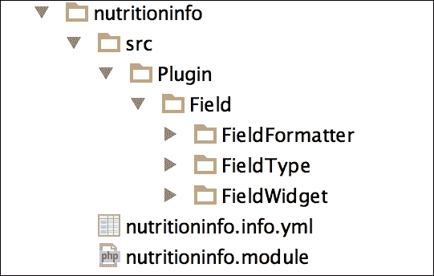
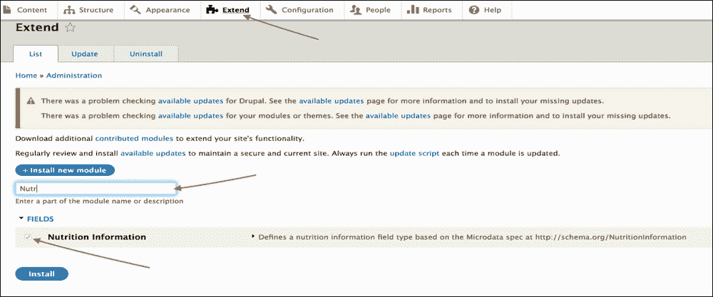
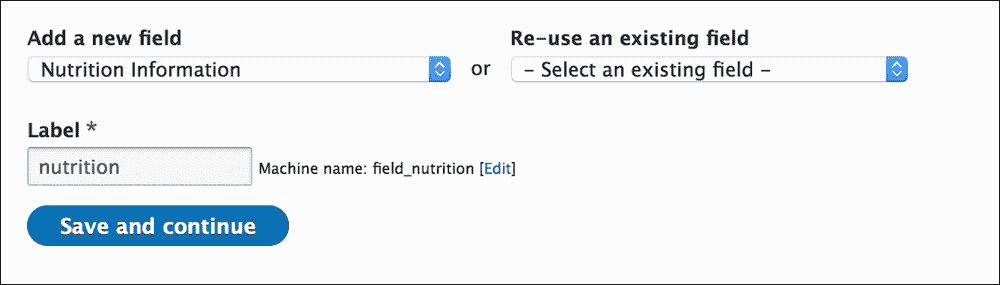

# 第四章. 字段类型 API 简介和自定义字段模块开发

*在上一章中，我们学习了如何使用视图和配置管理。现在让我们更深入地了解 Field Types API 以及如何使用它来开发自定义字段模块。*

在本章中，我们将学习以下主题：

+   使用字段 API 创建字段类型、小部件和格式化器

+   开发自定义字段模块

# 介绍 NutritionInformation 模块

在上一章中，我们没有包含在我们的 Drupal Recipe 内容类型中的[`schema.org/Recipe`](http://schema.org/Recipe)属性之一是`NutritionInformation`属性。这是因为`NutritionInformation`属性本身是来自[`schema.org`](http://schema.org)的`itemType`，因此它由许多自己的单独属性组成。为了将`NutritionInformation`添加到我们的自定义 Recipe 内容类型中，我们需要创建一个基于[`schema.org/NutritionInformation`](http://schema.org/NutritionInformation)规范的定制 Drupal 复合字段模块。

# 动手实践 – 开发一个用于复合 NutritionInformation 字段的自定义模块

我们不是将创建这个复合字段的代码添加到我们现有的模块中，而是将创建一个新的模块，因为它可能是整个 Drupal 社区都可能有用的事情，我们可能最终希望将其贡献给 Drupal ([`www.drupal.org/`](https://www.drupal.org/))。我们需要创建一个由几个不同的表单元素（一个选择数字和几个文本字段）组成的复合字段。现在，我们可以通过三个基本步骤创建一个基本的复合字段：首先定义字段（信息和模式），其次是定义字段表单（小部件），然后是定义输出（格式化器）。所有这些步骤都在这里解释：

1.  在 Phpstorm 中，在`/modules/custom`目录下创建一个名为`nutritioninfo`的新文件夹。

1.  创建与文件夹同名的`nutritioninfo.module`和`nutritioninfo.info.yml`文件——`nutritioninfo`。创建模板`src/Plugin/Field`文件夹，你应该有一个类似于以下截图的文件夹结构：

1.  现在，打开`nutrtioninfo.info`文件并添加以下配置：

    ```php
    name: Nutrition Information
    type: module
    description: 'Defines a nutrition information field type based on the Microdata spec at http://schema.org/NutritionInformation '
    package: Fields
    core: '8.x'
    ```

1.  在 Drupal 7 中，`hook_field_schema`钩子允许我们定义一个数据库模式来存储我们的自定义字段信息。但在 Drupal 8 中，字段类型变为插件系统([`www.drupal.org/node/2064123`](https://www.drupal.org/node/2064123))。

1.  接下来，我们将使用来自电话核心模块（`/core/modules/telephone/src/Plugin/Field/FieldType/TelephoneItem.php`）的以下代码。我们只是复制此文件并将其更改为`NutritioninfoItem.php`文件。在下一步中，我们创建`/modules/nutritioninfo/src/Plugin/Field/FieldType/NutritioninfoItem.php`文件和核心`TelephoneItem.php`文件，如下所示：

    ```php
    <?php

    /**
     * @file
     * Contains \Drupal\telephone\Plugin\Field\FieldType\TelephoneItem.
     */

    namespace Drupal\telephone\Plugin\Field\FieldType;

    use Drupal\Core\Field\FieldDefinitionInterface;
    use Drupal\Core\Field\FieldItemBase;
    use Drupal\Core\Field\FieldStorageDefinitionInterface;
    use Drupal\Core\TypedData\DataDefinition;

    /**
     * Plugin implementation of the 'telephone' field type.
     *
     * @FieldType(
     *   id = "telephone",
     *   label = @Translation("Telephone number"),
     *   description = @Translation("This field stores a telephone number in the database."),
     *   category = @Translation("Number"),
     *   default_widget = "telephone_default",
     *   default_formatter = "basic_string"
     * )
     */
    class TelephoneItem extends FieldItemBase {

      /**
       * {@inheritdoc}
       */
      public static function schema(FieldStorageDefinitionInterface $field_definition) {
        return array(
          'columns' => array(
            'value' => array(
              'type' => 'varchar',
              'length' => 256,
            ),
          ),
        );
      }

      /**
       * {@inheritdoc}
       */
      public static function propertyDefinitions(FieldStorageDefinitionInterface $field_definition) {
        $properties['value'] = DataDefinition::create('string')
          ->setLabel(t('Telephone number'))
          ->setRequired(TRUE);

        return $properties;
      }

      /**
       * {@inheritdoc}
       */
      public function isEmpty() {
        $value = $this->get('value')->getValue();
        return $value === NULL || $value === '';
      }

      /**
       * {@inheritdoc}
       */
      public function getConstraints() {
        $constraint_manager = \Drupal::typedDataManager()->getValidationConstraintManager();
        $constraints = parent::getConstraints();

        $max_length = 256;
        $constraints[] = $constraint_manager->create('ComplexData', array(
          'value' => array(
            'Length' => array(
              'max' => $max_length,
              'maxMessage' => t('%name: the telephone number may not be longer than @max characters.', array('%name' => $this->getFieldDefinition()->getLabel(), '@max' => $max_length)),
            )
          ),
        ));

        return $constraints;
      }

      /**
       * {@inheritdoc}
       */
      public static function generateSampleValue(FieldDefinitionInterface $field_definition) {
        $values['value'] = rand(pow(10, 8), pow(10, 9)-1);
        return $values;
      }

    }
    ```

    正如我们在第 4 步中讨论的那样，Drupal 8 引入了插件系统。Drupal 8 中的大多数插件使用注解来注册自己并描述其元数据。在这里，`@FieldType`是它注册到`telephone`字段类型的注解。`schema`函数包含列及其属性，如`type`和`length`。

    `PropertyDefinitions`函数用于设置列属性值，例如`label`和`description`。`isEmpty`函数用于确定列表中是否包含任何非空项。

1.  Drupal 8 通过 PHP 框架实现了基于包的 PHP 命名空间自动加载的 PSR-4 标准。每个模块都有一个与其模块名称对应的命名空间（例如`namespace Drupal\telephone\Plugin\Field\FieldType`）。在我们的模块中，它应该是`namespace Drupal\nutritioninfo\Plugin\Field\FieldType`。并且模块的命名空间映射到模块目录中的`./src/`文件夹。在完全限定名称（例如，使用`Drupal\Core\Field\FieldItemBase;`）内部带有反斜杠（`\`）的类和接口，不得在代码中使用它们的完全限定名称。如果命名空间与当前文件的命名空间不同，请在文件顶部放置一个`use`语句。以下是一个示例：

    ```php
      namespace Drupal\nutritioninfo\Plugin\Field\FieldType;
    use Drupal\Core\Field\FieldItemBase;
    use Drupal\Core\Field\FieldStorageDefinitionInterface;
    use Drupal\Core\TypedData\DataDefinition;
    ```

1.  现在，我们将创建`/modules/nutritioninfo/src/Plugin/Field/FieldType/NutritioninfoItem.php`文件。我们需要添加`NutritioninfoItem`类。`NutritioninfoItem.php`代码如下，尚未添加任何方法：

    ```php
    <?php
    /**
     * @file
     * Contains \Drupal\custom_field\Plugin\Field\FieldType\NutritioninfoItem.
     */

    namespace Drupal\nutritioninfo\Plugin\Field\FieldType;

    use Drupal\Core\Field\FieldItemBase;
    use Drupal\Core\Field\FieldStorageDefinitionInterface;
    use Drupal\Core\TypedData\DataDefinition;

    /**
     * Plugin implementation of the 'nutritioninfo' field type.
     *
     * @FieldType(
     *   id = "nutritioninfo",
     *   label = @Translation("Nutrition Information"),
     *   description = @Translation("A field type used for storing 
     nutrition information as defined by the Microdata spec at 
     http://schema.org/ NutritionInformation."),
     *   default_widget = "nutritioninfo_standard",
     *   default_formatter = "nutritioninfo_default"
     * )
     */

    class NutritioninfoItem extends FieldItemBase
    {

    }
    ```

    在这里，`@FieldType`注解注册了`nutritioninfo`字段类型。

1.  接下来，我们需要在`schema`函数中添加模式列。在`TelephoneItem`中，我们只有一个列值。但在`NutritioninfoItem`中，需要添加 12 个列。因此，`schema`函数看起来如下。将这些函数添加到`NutritioninfoItem`类中：

    ```php
       /**
         * {@inheritdoc}
         */
        public static function 
        schema(FieldStorageDefinitionInterface $field)
        {
            return array(
                'columns' => array(
                    'calories' => array(
                        'type' => 'varchar',
                        'length' => 256,
                        'not null' => FALSE,
                    ),
                    'carbohydrate_content' => array(
                        'type' => 'text',
                        'length' => 256,
                        'not null' => FALSE,
                    ),
                    'cholesterol_content' => array(
                        'type' => 'varchar',
                        'length' => 256,
                        'not null' => FALSE,
                    ),
                    'fat_content' => array(
                        'type' => 'varchar',
                        'length' => 256,
                        'not null' => FALSE,
                    ),
                    'fiber_content' => array(
                        'type' => 'varchar',
                        'length' => 256,
                        'not null' => FALSE,
                    ),
                    'protein_content' => array(
                        'type' => 'varchar',
                        'length' => 256,
                        'not null' => FALSE,
                    ),
                    'saturated_fat_content' => array(
                        'type' => 'varchar',
                        'length' => 256,
                        'not null' => FALSE,
                    ),
                    'serving_size' => array(
                        'type' => 'varchar',
                        'length' => 256,
                        'not null' => FALSE,
                    ),
                    'sodium_content' => array(
                        'type' => 'varchar',
                        'length' => 256,
                        'not null' => FALSE,
                    ),
                    'sugar_content' => array(
                        'type' => 'varchar',
                        'length' => 256,
                        'not null' => FALSE,
                    ),
                    'trans_fat_content' => array(
                        'type' => 'varchar',
                        'length' => 256,
                        'not null' => FALSE,
                    ),
                    'unsaturated_fat_content' => array(
                        'type' => 'varchar',
                        'length' => 256,
                        'not null' => FALSE,
                    ),

                ),
            );
        }
    ```

1.  接下来，我们需要添加`isEmpty()`函数。这个函数用于确定列表中是否包含任何非空项。将这些函数添加到`NutritioninfoItem`类中：

    ```php
       /**
         * {@inheritdoc}
         */
        public function isEmpty()
        {
            $calories = $this->get('calories')->getValue();
            $carbohydrate_content = $this
            ->get('carbohydrate_content')->getValue();
            $cholesterol_content = $this
            ->get('cholesterol_content')->getValue();
            $fat_content = $this->get('fat_content')->getValue();
            $fiber_content = $this->get('fiber_content')
            ->getValue();
            $protein_content = $this->get('protein_content')
            ->getValue();
            $saturated_fat_content = $this
            ->get('saturated_fat_content')->getValue();
            $serving_size = $this->get('serving_size')->getValue();
            $sodium_content = $this->get('sodium_content')
            ->getValue();
            $sugar_content = $this->get('sugar_content')
            ->getValue();
            $trans_fat_content = $this->get('trans_fat_content')
            ->getValue();
            $unsaturated_fat_content = $this
            ->get('unsaturated_fat_content')->getValue();

            //the nutrition field is empty if all of its properties 
           are empty
            return empty($calories)
            && empty($carbohydrate_content)
            && empty($cholesterol_content)
            && empty($fat_content)
            && empty($fiber_content)
            && empty($protein_content)
            && empty($saturated_fat_content)
            && empty($serving_size)
            && empty($sodium_content)
            && empty($sugar_content)
            && empty($trans_fat_content)
            && empty($unsaturated_fat_content);
        }
    ```

1.  这个类中的最后一个方法是`propertyDefinitions()`，用于设置列属性值，例如`label`和`description`。将这些函数添加到`NutritioninfoItem`类中：

    ```php
    /**
         * {@inheritdoc}
         */
        public static function 
        propertyDefinitions(FieldStorageDefinitionInterface 
        $field_definition)
        {
            $properties['calories'] = 
            DataDefinition::create('string')
                ->setLabel(t('Calories'))
                ->setDescription(t('The number of calories.'));

            $properties['carbohydrate_content'] = 
            DataDefinition::create('string')
                ->setLabel(t('Carbohydrate Content'))
                ->setDescription(t('The number of grams of 
                carbohydrates.'));

            $properties['cholesterol_content'] = 
            DataDefinition::create('string')
                ->setLabel(t('Cholesterol Content'))
                ->setDescription(t('The number of milligrams of 
                cholesterol.'));

            $properties['fat_content'] = 
            DataDefinition::create('string')
                ->setLabel(t('Fat Content'))
                ->setDescription(t('The number of grams of fat.'));

            $properties['fiber_content'] = 
            DataDefinition::create('string')
                ->setLabel(t('Fiber Content'))
                ->setDescription(t('The number of grams of 
                fiber.'));

            $properties['protein_content'] = 
            DataDefinition::create('string')
                ->setLabel(t('Protein Content'))
                ->setDescription(t('The number of grams of 
                protein.'));

            $properties['saturated_fat_content'] = 
            DataDefinition::create('string')
                ->setLabel(t('Saturated Fat Content'))
                ->setDescription(t('The number of grams of 
                saturated fat.'));

            $properties['serving_size'] = 
            DataDefinition::create('string')
                ->setLabel(t('Serving Size'))
                ->setDescription(t('The serving size, in terms of 
                the number of volume or mass.'));

            $properties['sodium_content'] = 
            DataDefinition::create('string')
                ->setLabel(t('Sodium Content'))
                ->setDescription(t('The number of milligrams of 
                sodium.'));

            $properties['sugar_content'] = 
            DataDefinition::create('string')
                ->setLabel(t('Sugar Content'))
                ->setDescription(t('The number of grams of 
                sugar.'));

            $properties['trans_fat_content'] = 
            DataDefinition::create('string')
                ->setLabel(t('Trans Fat Content'))
                ->setDescription(t('The number of grams of trans 
                fat.'));

            $properties['unsaturated_fat_content'] = 
            DataDefinition::create('string')
                ->setLabel(t('Unsaturated Fat Content'))
                ->setDescription(t('The number of grams of 
                unsaturated fat.'));

            return $properties;
        }
    ```

1.  最后，我们的`NutritioninfoItem.php`代码如下所示：[`raw.githubusercontent.com/valuebound/nutritioninfo/master/src/Plugin/Field/FieldType/NutritioninfoItem.php`](https://raw.githubusercontent.com/valuebound/nutritioninfo/master/src/Plugin/Field/FieldType/NutritioninfoItem.php)。

1.  接下来，我们需要告诉 Drupal 如何在节点编辑表单上处理我们的复合字段。在 Drupal 7 中，我们有`hook_field_widget_info`来让 Drupal 了解我们的自定义小部件，然后是`hook_field_widget_form`来实际将表单组件添加到节点表单中。在 Drupal 8 中，字段小部件已成为插件。现在，我们将把`FieldWidget/NutritioninfoDefaultWidget.php`文件添加到`/modules/nutritioninfo/src/Plugin/Field/FieldWidget`文件夹中。文件看起来如下，没有任何方法：

    ```php
    <?php
    /**
     * @file
     * Contains \Drupal\custom_field\Plugin\Field\FieldWidget\NutritioninfoDefaultWidget.
     */

    namespace Drupal\nutritioninfo\Plugin\Field\FieldWidget;

    use Drupal\Core\Field\FieldItemListInterface;
    use Drupal\Core\Field\WidgetBase;
    use Drupal\Core\Form\FormStateInterface;

    /**
     * Plugin implementation of the 'nutritioninfo_default' widget.
     *
     * @FieldWidget(
     *   id = "nutritioninfo_default",
     *   label = @Translation("Nutrition Field Widget"),
     *   field_types = {
     *     "nutritioninfo"
     *   }
     * )
     */
    class NutritioninfoDefaultWidget extends WidgetBase {

    }
    ```

    `FieldItemListInterface`接口用于字段，是字段项的列表。每个实体字段都必须实现此接口，而包含的字段项必须实现`FieldItemInterface`。此外，`FormStateInterface`提供了一个包含表单当前状态的接口。它将用于存储与表单中处理的数据相关的信息。

    在这里，`@FieldWidget`注解注册了`nutritioninfo_default`小部件。

1.  接下来，我们需要添加`formElement()`函数。在这个函数中，将添加表单元素，这些元素将在节点编辑/添加表单中显示营养字段。我们用一个表单元素来理解：

    ```php
    $element['calories'] = array(
                '#title' => t('Calories'),
                '#type' => 'textfield',
                '#default_value' => isset($items[$delta]->calories) ? $items[$delta]->calories : NULL,
              );
    ```

    这是卡路里`textfield`。在编辑/添加表单时，它将显示为`textfield`。`formElement()`函数的代码如下：

    ```php
       /**
         * {@inheritdoc}
         */
        public function formElement(FieldItemListInterface $items, $delta, array $element, array &$form, FormStateInterface $form_state) {
          $element['calories'] = array(
                '#title' => t('Calories'),
                '#type' => 'textfield',
                '#default_value' => isset($items[$delta]->calories) ? $items[$delta]->calories : NULL,
              );
          $element['carbohydrate_content'] = array(
                '#title' => t('Carbohydrate Content'),
                '#type' => 'textfield',
                '#default_value' => isset($items[$delta]->carbohydrate_content) ? $items[$delta]->carbohydrate_content : NULL,
              );
          $element['cholesterol_content'] = array(
                '#title' => t('Cholesterol Content'),
                '#type' => 'textfield',
                '#default_value' => isset($items[$delta]->cholesterol_content) ? $items[$delta]->cholesterol_content : NULL,
              );

            $element['fat_content'] = array(
                '#title' => t('Fat Content'),
                '#type' => 'textfield',
                '#default_value' => isset($items[$delta]->fat_content) ? $items[$delta]->fat_content : NULL,
            );

            $element['fiber_content'] = array(
                '#title' => t('Fiber Content'),
                '#type' => 'textfield',
                '#default_value' => isset($items[$delta]->fiber_content) ? $items[$delta]->fiber_content : NULL,
            );

            $element['protein_content'] = array(
                '#title' => t('Protein Content'),
                '#type' => 'textfield',
                '#default_value' => isset($items[$delta]->protein_content) ? $items[$delta]->protein_content : NULL,
            );

            $element['saturated_fat_content'] = array(
                '#title' => t('Saturated Fat Content'),
                '#type' => 'textfield',
                '#default_value' => isset($items[$delta]->saturated_fat_content) ? $items[$delta]->saturated_fat_content : NULL,
            );

            $element['serving_size'] = array(
                '#title' => t('Serving Size'),
                '#type' => 'textfield',
                '#default_value' => isset($items[$delta]->serving_size) ? $items[$delta]->serving_size : NULL,
            );

            $element['sodium_content'] = array(
                '#title' => t('sodium Content'),
                '#type' => 'textfield',
                '#default_value' => isset($items[$delta]->sodium_content) ? $items[$delta]->sodium_content : NULL,
            );

            $element['sugar_content'] = array(
                '#title' => t('Sugar Content'),
                '#type' => 'textfield',
                '#default_value' => isset($items[$delta]->sugar_content) ? $items[$delta]->sugar_content : NULL,
            );

            $element['trans_fat_content'] = array(
                '#title' => t('Trans Fat Content'),
                '#type' => 'textfield',
                '#default_value' => isset($items[$delta]->trans_fat_content) ? $items[$delta]->trans_fat_content : NULL,
            );

            $element['unsaturated_fat_content'] = array(
                '#title' => t('Unsaturated Fat Content'),
                '#type' => 'textfield',
                '#default_value' => isset($items[$delta]->unsaturated_fat_content) ? $items[$delta]->unsaturated_fat_content : NULL,
            );

            return $element;
        }
    ```

1.  完整的文件，`NutritioninfoDefaultWidget.php`，看起来如下所示：[`raw.githubusercontent.com/valuebound/nutritioninfo/master/src/Plugin/Field/FieldWidget/NutritioninfoDefaultWidget.php`](https://raw.githubusercontent.com/valuebound/nutritioninfo/master/src/Plugin/Field/FieldWidget/NutritioninfoDefaultWidget.php).

1.  现在，我们需要在显示内容项时格式化我们的复合字段。在 Drupal 7 中，我们使用了`hook_field_formatter_info`和`hook_field_formatter_view`钩子。现在在 Drupal 8 中，这些钩子被用作插件。我们将把`NutritioninfoDefaultFormatter.php`文件添加到`/modules/nutritioninfo/src/Plugin/Field/FieldFormatter`文件夹中。代码如下，没有任何方法：

    ```php
    <?php
    /**
     * @file
     * Contains \Drupal\custom_field\Plugin\field\formatter\NutritioninfoDefaultFormatter.
     */

    namespace Drupal\nutritioninfo\Plugin\Field\FieldFormatter;

    use Drupal\Core\Field\FormatterBase;
    use Drupal\Core\Field\FieldItemListInterface;

    /**
     * Plugin implementation of the 'nutritioninfo_default' formatter.
     *
     * @FieldFormatter(
     *   id = "nutritioninfo_default",
     *   label = @Translation("Nutritioninfo Formatter"),
     *   field_types = {
     *      "nutritioninfo"
     *   }
     * )
     */
    class NutritioninfoDefaultFormatter extends FormatterBase
    {

    }
    ```

    在这里，`@FieldFormatter`注解正在注册`nutritioninfo`格式化器。

1.  接下来，我们需要添加`viewElements()`函数。这个函数构建了一个可渲染的数组，用于表格主题标记。`viewElements()`函数的代码如下：

    ```php
       /**
         * {@inheritdoc}
         */
        public function viewElements(FieldItemListInterface $items)

        {
            $rows = array();
            foreach ($items as $delta => $item) {
                $rows[] = array(
                    'data' => array(
                        $item->calories,
                        $item->carbohydrate_content,
                        $item->cholesterol_content,
                        $item->fat_content,
                        $item->fiber_content,
                        $item->protein_content,
                        $item->saturated_fat_content,
                        $item->serving_size,
                        $item->sodium_content,
                        $item->sugar_content,
                        $item->trans_fat_content,
                        $item->unsaturated_fat_content
                    )

                );

            }

            $headers = array(
                t('Calories'),
                t('Carbohydrate Content'),
                t('Cholesterol Content'),
                t('Fat Content'),
                t('Fiber Content'),
                t('Protein Content'),
                t('Saturated Fat Content'),
                t('Serving Size'),
                t('Sodium Content'),
                t('Sugar Content'),
                t('Trans Fat Content'),
                t('Unsaturated Fat Content'),
            );

            $table = array(
                '#type' => 'table',
                '#header' => $headers,
                '#rows' => $rows,
                '#empty' => t('No calories information available'),
                '#attributes' => array('id' => 'nutrition-info'),
            );

            return $elements = array('#markup' => drupal_render($table));

        }
    ```

1.  完整的`NutritioninfoDefaultFormatter.php`文件的代码如下所示：[`github.com/valuebound/nutritioninfo/blob/master/src/Plugin/Field/FieldFormatter/NutritioninfoDefaultFormatter.php`](https://github.com/valuebound/nutritioninfo/blob/master/src/Plugin/Field/FieldFormatter/NutritioninfoDefaultFormatter.php).

1.  好的，现在是我们启用新模块的时候了。在你的浏览器中打开你的 d8dev Drupal 站点，点击**管理**工具栏中的**模块**链接。搜索`Nutrition`，并勾选你新创建的**营养信息**字段模块旁边的复选框：

1.  最后，滚动到页面底部并点击**安装**按钮。

## *发生了什么？*

这是一项相当复杂的发展。我们创建了一个相当复杂的自定义模块，现在我们有一个提供更完整食谱内容类型的字段。我们使用了字段类型 API 并创建了一个新的自定义字段，营养。在这个过程中，我们学习了如何创建 FieldType、Field 和 Field formatter，这些都是营养字段所需的。我们还了解了 Drupal 命名空间以及如何在自定义模块中使用它们。

# 操作时间 – 更新食谱内容类型以使用 NutritionInformation 字段

现在，让我们将我们的新模块投入使用，并将我们的新复合字段添加到我们的食谱内容类型中，使用我们新的自定义`nutritioninfo`字段来为[`schema.org/Recipe`](http://schema.org/Recipe)定义的`NutrionInformation`属性：

1.  前往食谱内容类型的**管理字段**配置页面：`http://localhost/d7dev/admin/structure/types/ manage/recipe/fields`。

1.  现在，添加一个具有以下设置的新字段——**标签**：`nutrition`，**名称**：`field_nutrition_information`，**类型**：`Nutrition Information`。点击**保存并继续**按钮：

1.  对于字段设置没有需要设置的，所以只需点击**保存字段设置**按钮。

1.  接下来，点击**快捷方式**工具栏中的**查找内容**链接，然后点击列表中第一个食谱内容项的**编辑**链接。

1.  在节点编辑表单的底部，你会看到我们新复合字段的一些输入。

## *发生了什么？*

我们完成了新模块的开发。它将程序性地创建一个营养字段，并将数据以所需的具体格式显示。

# 摘要

在本章中，我们基于[`schema.org/NutritionInformation`](http://schema.org/NutritionInformation)的微数据规范开发了一个自定义复合字段模块，使我们能够增强我们的食谱内容类型。然而，到目前为止，我们的营养信息字段模块仍然有些粗糙。

在下一章中，我们将介绍一些更多的代码示例，并清理一些那些粗糙的边缘。
