# 第六章. 增强内容作者的用户体验

*在本章中，我们将探讨 Drupal 8 核心中内置的 WYSIWYG 编辑器，并探讨 CKEditor 插件、Drupal 插件 API 和块 API 的概念。*

在本章中，我们将学习：

+   如何使用 Drupal 内置的 WYSIWYG 编辑器

+   如何进行内联编辑以及如何充分利用它

+   如何通过配置进行更改并保存它们

+   如何通过新的块 API 创建自定义块

+   如何在我们的自定义块中包含默认配置

# Drupal 8 中 CKEditor 的快速介绍

Drupal 8 终于发布了默认的 WYSIWYG 编辑器：CKEditor。CKEditor 是一个开源的文本编辑器，旨在将文字处理功能带到网页上。在 Drupal 的早期版本中，几个模块试图填补这一空白，但它们的配置大多数时候有点棘手，因为它们依赖于外部 JavaScript 库。

将 CKEditor 的功能直接集成到核心中，Drupal 8 可以为内容编辑器提供更丰富的创作体验。用户可以获得一个拖放界面来自定义可用功能并将配置导出以与其他系统共享。开发者可以获得一种统一的方式来访问属性、添加插件和扩展编辑器的功能：

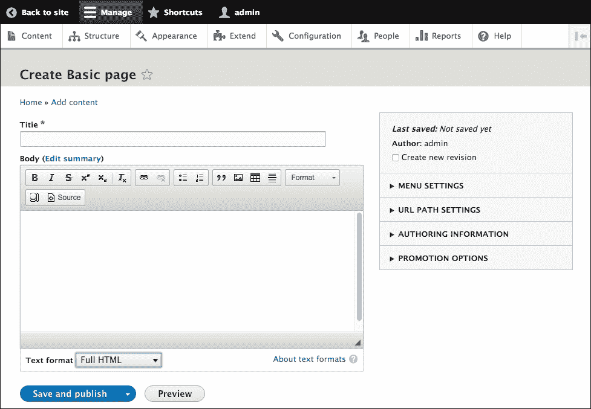

# 配置 CKEditor 配置文件

如果没有根据编辑器的喜好进行自定义的能力，CKEditor 配置文件将不会太多。现在我们将自定义基本 HTML 配置文件。登录到您的 Drupal 8 网站，您应该会看到新的管理工具栏。

# 执行时间 - 向基本 HTML 配置添加一些按钮

1.  点击 **配置** 然后点击 **文本格式和编辑器**：

1.  在 **文本格式和编辑器** 页面上，点击 **基本 HTML** 配置旁边的 **配置** 按钮：

1.  滚动到 **工具栏配置**，将图像图标从工具栏拖到其他元素池中，以从配置中移除它。注意，图像和配置不再是页面的一部分：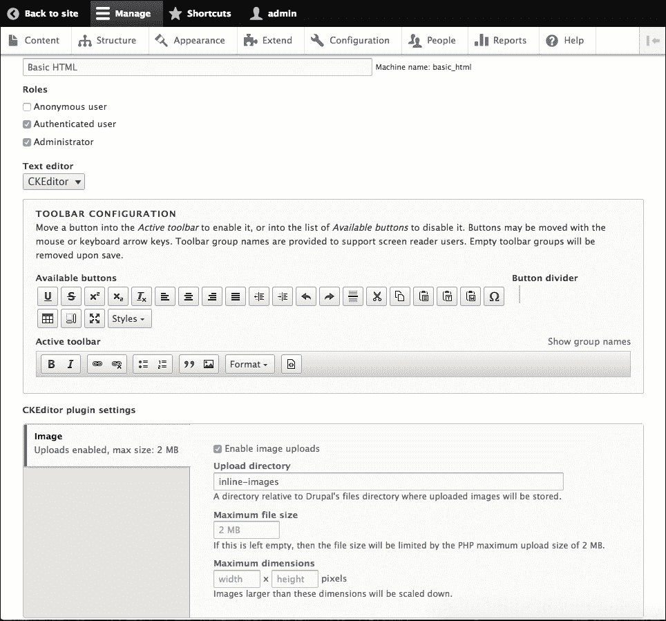

1.  在页面底部最下方点击 **保存配置**：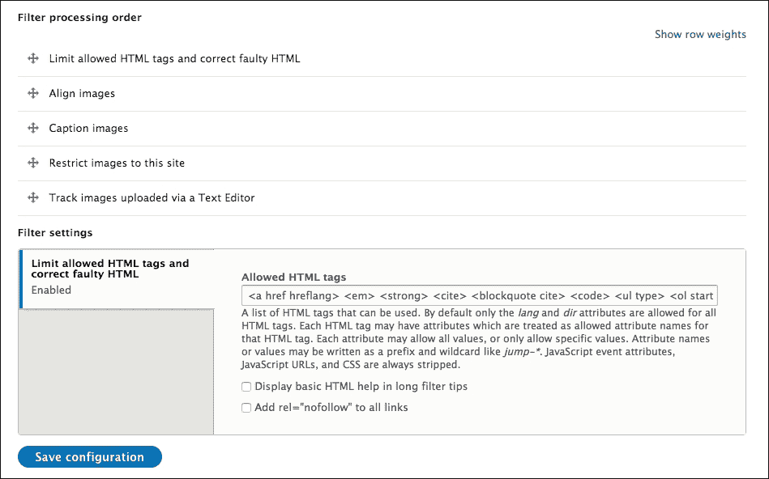

1.  就这样！如果你访问内容页面表单并选择 **基本 HTML** 配置，那么图像按钮将不再出现：

## *发生了什么事？*

按照此程序，我们通过从 CKEditor 配置文件中移除上传图像按钮来自定义现有配置文件。

配置在 D8 中可导出，并可导入到其他环境中。

# 行动时间 - 导出 CKEditor 配置

1.  点击 **配置**。然后点击 **配置同步** 并选择 **导出** 选项卡。点击 **单个项目**。

1.  在 **配置类型** 中选择 **文本编辑器**，在 **配置名称** 中选择 **基本 HTML**：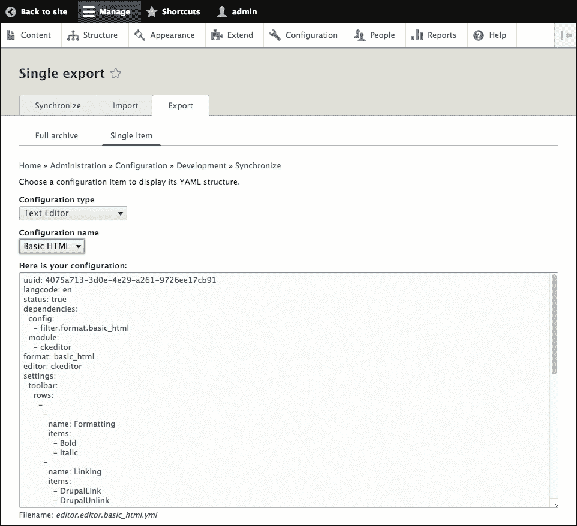

1.  通过点击 **配置**。然后点击 **配置同步** 并选择 **导入** 选项卡。点击 **单个项目**：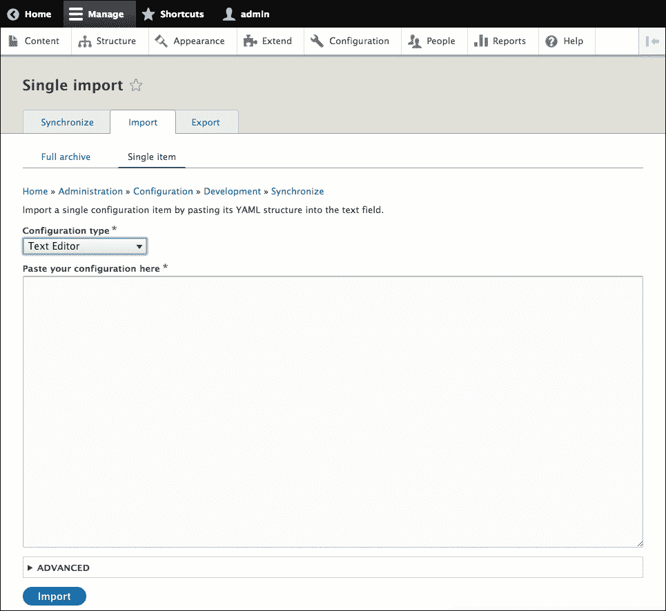

## *发生了什么？*

您已配置了一个现有配置文件，删除了一些字段，并学习了如何导出该配置并将其导入到另一个环境中。

# 添加新的 CKEditor 配置文件

通常，内置配置文件可以满足网站的需求。然而，默认配置文件不提供匿名用户在输入文本（例如，评论）时获得流畅编辑体验的方法。为了提供该功能，我们需要创建一个新的配置文件并将其分配给匿名用户。

# 行动时间 - 为匿名用户创建仅文本的控制配置文件

1.  从管理员工具栏进入 **配置** | **文本格式和编辑器** 并选择 **添加文本格式**：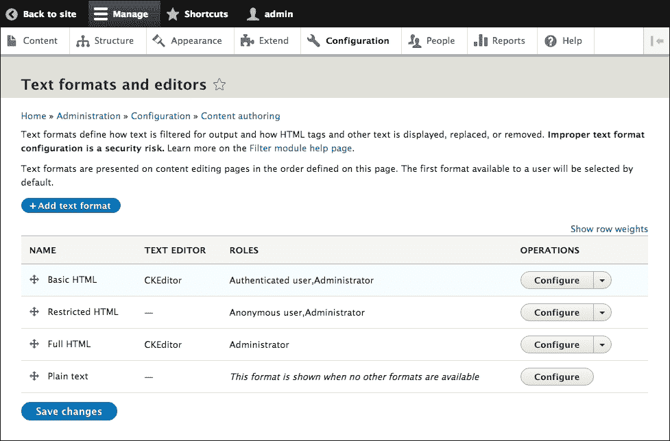

1.  在名称中输入 `Text only controls`。勾选 **匿名用户** 并在 **文本编辑器** 下拉框中选择 **CKEditor**。

1.  添加 **下划线** 按钮，并保留 **粗体、斜体和有序/无序列表**。

1.  启用以下过滤器：

    +   **限制允许的 HTML 标签并纠正错误的 HTML**

    +   **将换行符转换为 HTML（即<br>和<p>）**

    +   **纠正错误的和截断的 HTML**

1.  保存配置：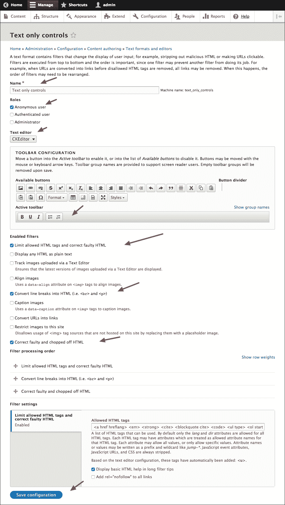

1.  **文本格式和编辑器** 配置页面应包含新创建的格式。将新格式移动到 **受限 HTML** 格式之上，这是 Drupal 为匿名用户提供的一个替代方案，即完全跳过编辑器：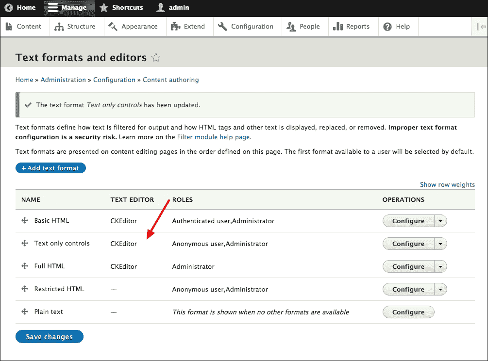

1.  就这样！如果您访问允许匿名用户发表评论的页面，新创建的格式将用于捕获这些评论：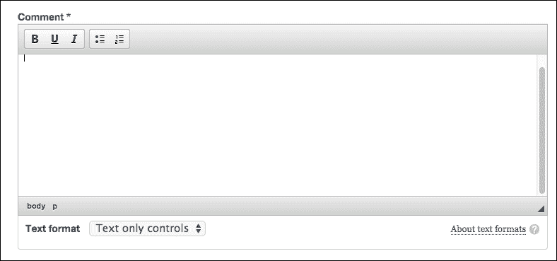

## *发生了什么？*

您刚刚添加了一个新的 CKEditor 配置文件，针对您网站上的匿名用户，使他们能够输入富文本和列表。

# 经典编辑器和内联编辑

我们迄今为止看到的示例使用了 CKEditor 作为后端。这是基于在页面中添加 iframe，并且它们不共享前端上显示的 CSS 样式。然而，您可以通过在您的 `.info.yml` 主题文件中包含以下内容来自定义编辑器的 CSS：

```php
ckeditor_stylesheets[] = css/ckeditor-iframe.css
```

Drupal 8 中的一个令人兴奋的新功能是使用内联编辑。这用于快速就地编辑，并且不使用 iframe。内联编辑使编辑器能够快速编辑内容的一部分，而无需编辑整个节点。CSS 样式从主题继承，从而提供真正的 WYSIWYG 体验。

# 操作时间 – 使用内联编辑

1.  确保已启用 **快速编辑** 模块。

1.  点击页面左上角的铅笔图标，并选择 **快速编辑**：

1.  新的编辑器实例在内容区域的顶部打开，您可以直接开始编辑文本：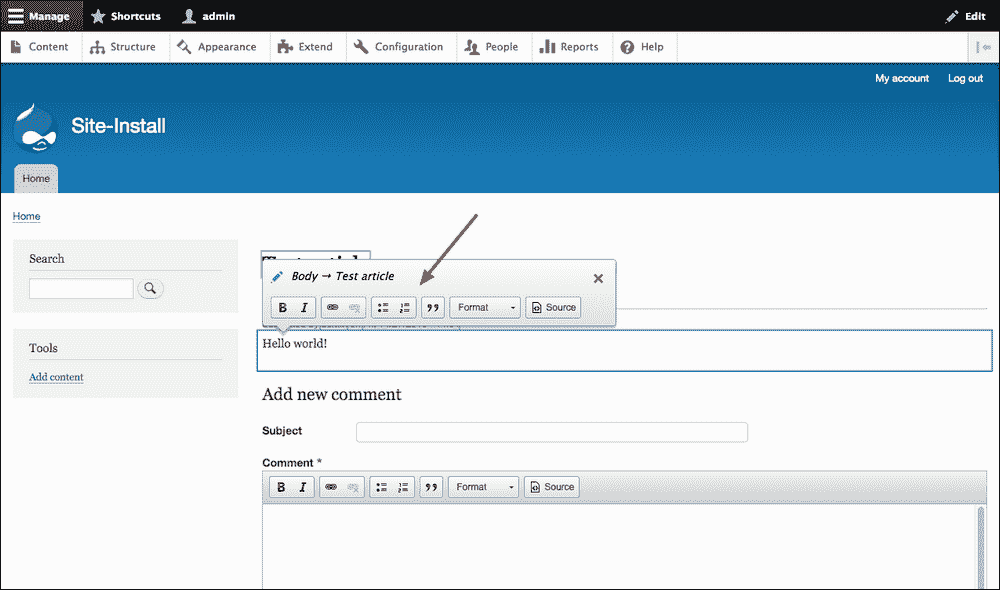

1.  就这些了！现在您可以使用这个功能，而不是访问编辑表单来快速编辑内容。

# 向 CKEditor 添加小部件

CKEditor 默认配置了一系列可以添加到配置文件中的按钮。作为程序员，您可以扩展 CKEditor 并添加自己的按钮。这可以通过添加插件或小部件来实现。两者之间的区别在于，小部件是将多个组件的行为组合在一起的插件。一个小部件的例子是一个图像，其中图像本身、替代文本和标题组成一个项目，并且它们可以作为单个项目在 WYSIWYG 区域中移动。

要使用额外的小部件，您需要做两件事：

1.  下载或创建一个 CKEditor 插件。

1.  告诉 Drupal 核心应该加载一个新的 CKEditor 插件。

要了解更多关于 CKEditor 方面的信息，请阅读有关添加 CKEditor 插件或 CKEditor 小部件的文档。CKEditor 的插件和小部件可以从 [`ckeditor.com/addons/plugins/all`](http://ckeditor.com/addons/plugins/all) 下载。

一旦您有了 CKEditor 插件，您需要通过 `\Drupal\ckeditor\CKEditorPluginInterface` 告诉 Drupal 核心需要加载一个新的 CKEditor 插件。这将创建 CKEditor JavaScript 插件和 Drupal CKEditor 插件插件（尽管名称有些令人困惑）之间的 1:1 关系。通过 `Drupal\ckeditor\CKEditorPluginBase` 提供了一个默认实现，因此并非每个方法都需要由 CKEditor 插件实现。

此外，还可以在 Drupal 端实现以下接口以扩展插件功能：

+   `\Drupal\ckeditor\CKEditorPluginButtonsInterface` 允许 CKEditor 插件定义它提供的按钮，以便用户可以通过基于拖放的用户界面配置 CKEditor 工具栏实例。

+   `\Drupal\ckeditor\CKEditorPluginContextualInterface` 允许 CKEditor 插件根据上下文自动启用自己：如果某个其他 CKEditor 插件的按钮被启用，如果某个过滤器被启用，如果某个 CKEditor 插件的设置具有某个值，或者这些条件的组合。

+   `\Drupal\ckeditor\CKEditorPluginConfigurableInterface` 允许 CKEditor 插件定义一个设置表单来配置此 CKEditor 插件可能具有的任何设置。

+   `\Drupal\ckeditor\CKEditorPluginCssInterface`允许 CKEditor 插件定义要加载到 iframe 实例中的 CKEditor 的额外 CSS。

要做到这一点，您需要创建一个新的模块，利用 Drupal Plugin API。尽管 CKEditor 和 Drupal 共享插件的符号，但请注意，这些是非常不同的东西。根据 Drupal Plugin API，插件实现必须使用`@CKEditorPlugin`注解进行注解，以便它们可以被发现。

在创建 CKEditor 插件时，请记住，您正在创建旨在为内容编辑器提供功能，因此用户界面和用户体验应该非常出色。查看`ckeditor.drupalimage.admin.js`和`ckeditor.stylescombo.admin.js`以获取良好实现的示例（另请参阅[`www.drupal.org/node/2567801`](https://www.drupal.org/node/2567801)）。

在本章的下一节中，我们将广泛使用 Drupal Plugin API 来添加一个新块，但 Drupal 插件本质上是可以互换的功能组件。

## 尝试英雄 - 创建 CKEditor 插件并允许 Drupal 发现它

要声明一个 CKEditor 插件的 Drupal 实例，您需要遵循以下步骤：

1.  按照以下结构创建您的模块结构。在`js`目录中放置 CKEditor 插件，而 Drupal 插件则放置在`lib`目录中：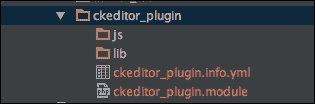

1.  确保 CKEditor 插件（在`js`目录中命名为`plugin.js`）按照 Drupal 的预期进行命名空间：

    ```php
    (function ($, Drupal, drupalSettings, CKEDITOR) {

      /* existing plugin code */

    })(jQuery, Drupal, drupalSettings, CKEDITOR)
    ```

1.  创建包含类的文件：

    ```php
    DRUPAL_ROOT/modules/MODULE_NAME/lib/Drupal/PLUGIN_NAME/Plugin/CKEditorPlugin/PLUGIN_NAME.php
    ```

1.  在该文件中扩展`CKEditorPluginBase`类：

    ```php
    <?php
    /**
     * @file
     * Contains \Drupal\PLUGIN_NAME\Plugin\CKEditorPlugin\PLUGIN_NAME.
     */

    namespace Drupal\PLUGIN_NAME\Plugin\CKEditorPlugin;

    use Drupal\ckeditor\CKEditorPluginBase;
    use Drupal\Core\Plugin\PluginBase;
    use Drupal\ckeditor\CKEditorPluginInterface;
    use Drupal\ckeditor\CKEditorPluginButtonsInterface;
    use Drupal\ckeditor\CKEditorPluginConfigurableInterface;
    use Drupal\ckeditor\CKEditorPluginContextualInterface;
    use Drupal\editor\Entity\Editor;
    use Drupal\ckeditor\Annotation\CKEditorPlugin;
    use Drupal\Core\Annotation\Translation;

    /**
     * Defines the "PLUGIN_NAME" plugin.
     * @see MetaContextual
     * @see MetaButton
     * @see MetaContextualAndButton
     *
     * @CKEditorPlugin(
     *   id = "PLUGIN_NAME",
     *   label = @Translation("PLUGIN_NAME")
     * )
     */

    class PLUGIN_NAME extends CKEditorPluginBase implements CKEditorPluginConfigurableInterface, CKEditorPluginContextualInterface {

    // your code here

    }
    ```

更多信息，您可以访问`Drupal\ckeditor`命名空间的文档，网址为[`api.drupal.org/api/drupal/namespace/Drupal%21ckeditor/8.2.x`](https://api.drupal.org/api/drupal/namespace/Drupal%21ckeditor/8.2.x)。

# Drupal 8 的 Block API 简介

在 Drupal 7 中，添加一个块只是实现一个钩子，如`hook_block_info()`，以及更多在自定义模块中的钩子。然后，该块就可以在用户界面中供您放置在任何您想要的位置。

在 Drupal 8 中，由模块提供的自定义块实现了 Block Plugin API，它是更通用的 Plugin API 的一个子集。过去用于返回数组以进行块发现的 info 钩子现在由注解和 PSR-0 的使用组成，因此 Drupal 可以找到并理解您的块。返回您块内容的回调函数现在是我们可以在自定义块代码中按需覆盖的`Drupal\block\BlockPluginInterface`上的方法。

在 Drupal 8 中创建一个块需要根据 Plugin API 和基于注解的插件发现来创建一个插件。在整个书中，我们在创建字段小部件或 CKEditor 配置文件时都看到了这两个方面的应用。

创建块的流程可以可视化如下：

1.  使用注解创建一个块插件。

1.  实现`Drupal\Core\Block\BlockBase`类。

1.  根据用例实现`Drupal\Core\Block\BlockPluginInterface`类方法。

对于名为`author_tool`的自定义块，PSR-4 兼容的结构是`author_tool/src/Plugin/Block`：


# 操作时间 – 创建一个辅助作者体验的块

让我们创建一个自定义块，该块将可供认证用户在访问食谱页面时创建新食谱。我们的模块将命名为`author_tool`：

1.  创建一个类似于我们上次看到的截图的结构。

1.  创建一个`author_tool.info.yml`文件，并使用块系统创建您模块的依赖项：

    ```php
    name: Author tool
    type: module
    description: A custom block to allow content editors to quickly add a new recipe.
    core: 8.x
    dependencies:
      - block
    ```

1.  使用您自己的实现`AuthorToolBlock`扩展`BlockBase`类，并将以下代码放入其中：

    ```php
    <?php

    /**
     * @file
     * Contains \Drupal\author_tool\Plugin\Block\AuthorToolBlock.php.
     */

    namespace Drupal\author_tool\Plugin\Block;

    use Drupal\Core\Block\BlockBase;

    /**
     * Provides a custom block.
     *
     * Drupal\Core\Block\BlockBase gives us a very useful set of basic functionality
     * for this configurable block. We can just fill in a few of the blanks with
     * defaultConfiguration(), blockForm(), blockSubmit(), and build().
     *
     * @Block(
     *   id = "author_tool_block",
     *   admin_label = @Translation("Author tool block")
     * )
     */
    classAuthorToolBlock extends BlockBase {

      // our code goes here.

    }
    ```

1.  在您的类中，像这样实现`BlockPluginInterface::build`方法：

    ```php
        /**
         * {@inheritdoc}
         */
    public function build() {

        }
    ```

1.  构建方法返回一个可渲染的数组或内容，就像 Drupal 7 中的`hook_block_view`所做的那样。渲染数组是 Drupal 8 中首选的方式。完整的实现如下所示：

    ```php
    <?php

    /**
     * @file
     * Contains \Drupal\author_tool\Plugin\Block\AuthorToolBlock.php.
     */

    namespace Drupal\author_tool\Plugin\Block;

    use Drupal\Core\Block\BlockBase;

    /**
     * Provides a custom block.
     *
     * Drupal\Core\Block\BlockBase gives us a very useful set of basic functionality
     * for this configurable block. We can just fill in a few of the blanks with
     * defaultConfiguration(), blockForm(), blockSubmit(), and build().
     *
     * @Block(
     *   id = "author_tool_block",
     *   admin_label = @Translation("Author tool block")
     * )
     */
    classAuthorToolBlock extends BlockBase {

        /**
         * {@inheritdoc}
         */
    public function build() {

            $link = array(
                '#type' => 'markup',
         '#title' => 'Author tools',
                '#markup' => $this->t('<a href=":url">Add another recipe</a>', array(':url' => 'add/recipe')),
            );

    return $link;
        }

    }
    ```

1.  您的模块已准备就绪。转到**扩展**，定位它，并启用它。

1.  现在，是时候将您的块放置在食谱页面上，以便认证用户可以看到。从主菜单中选择**结构** | **块布局**，滚动到**侧边栏第一**，然后点击**放置块**按钮：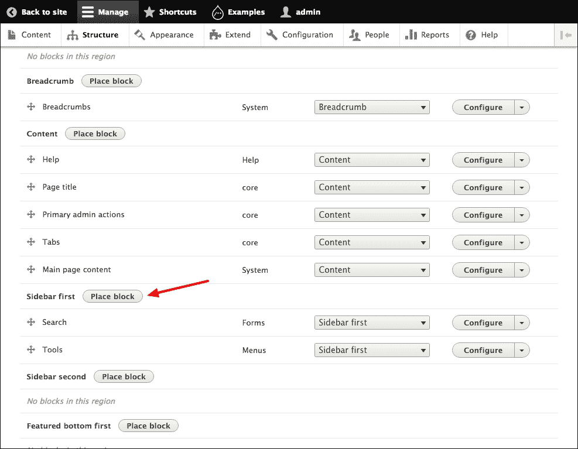

1.  定位您的块并点击**放置块**：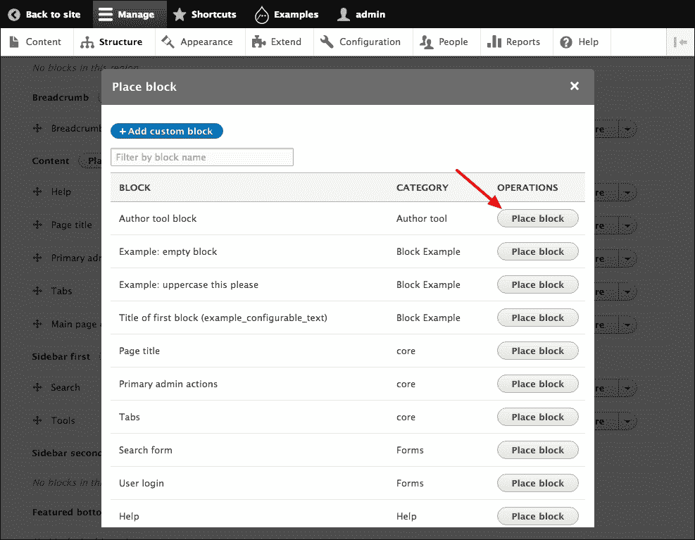

1.  配置您的块以仅显示食谱内容类型：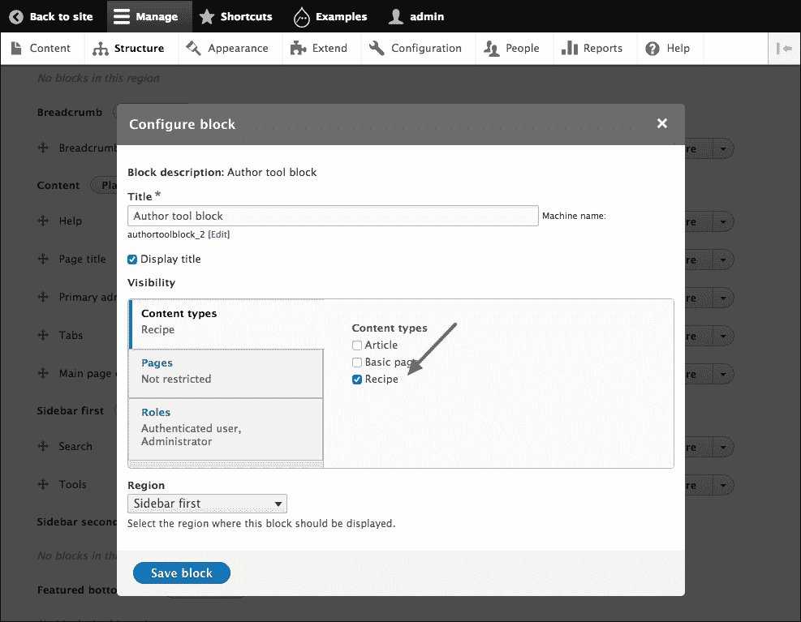

1.  配置您的块以仅对认证用户显示：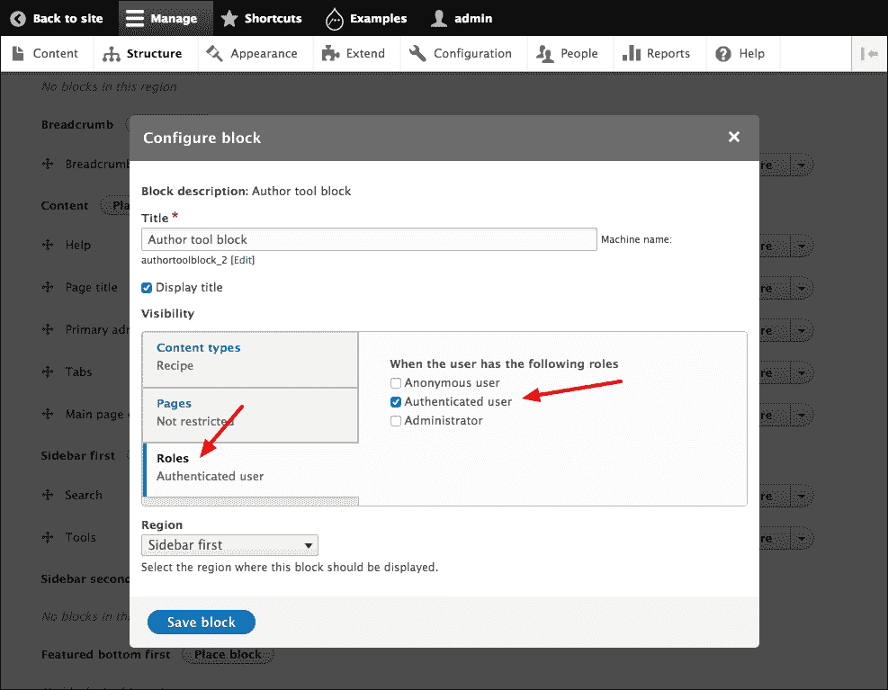

1.  保存图片，就这样！现在访问一个食谱页面以验证它是否在那里：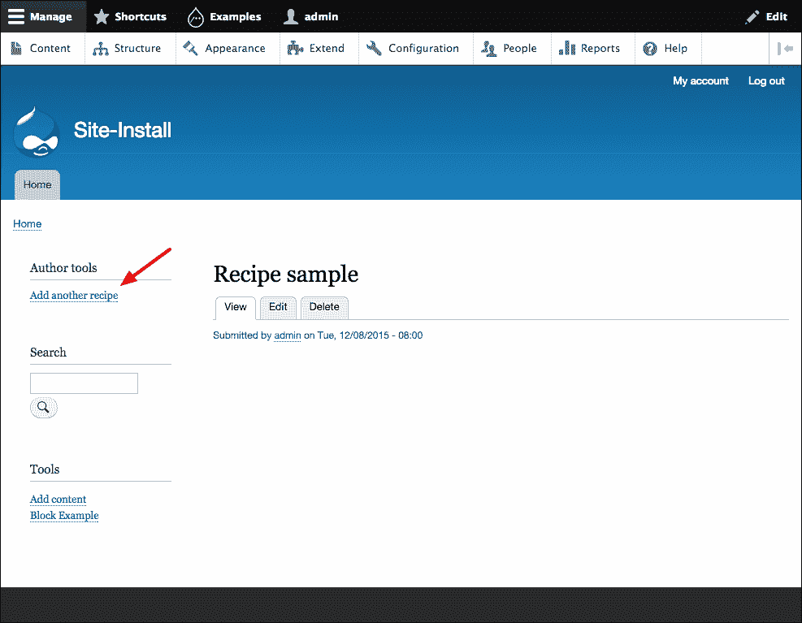

## *发生了什么？*

虽然这是一个通过代码创建块的非常简单的示例，但通过 Drupal 8 新出现的 Block API 创建块简单性是显而易见的。您创建了一个块来辅助作者 UI，并学习了扩展 Plugin API 以向系统添加自定义功能的基础知识。

要进一步探索，请查看[`api.drupal.org/api/drupal`](https://api.drupal.org/api/drupal)中的 BlockBase 类，以了解所有可以添加的方法。

# 操作时间 – 在您的模块中包含默认配置

一旦你在主题中放置了你的块，你可能希望在模块安装时包含该配置。通过在安装时包含默认配置，你可以提供一个合理的默认值来放置该块。此外，在你的部署机制中，你只需担心安装模块，其余的配置将在该步骤中应用：

1.  通过访问**结构** | **配置** | **配置同步** | **导出** | **单个项目**来导出配置，并选择**块**和**作者工具块**。

1.  确保复制粘贴所有内容，除了`uuid`行（如下截图所示）：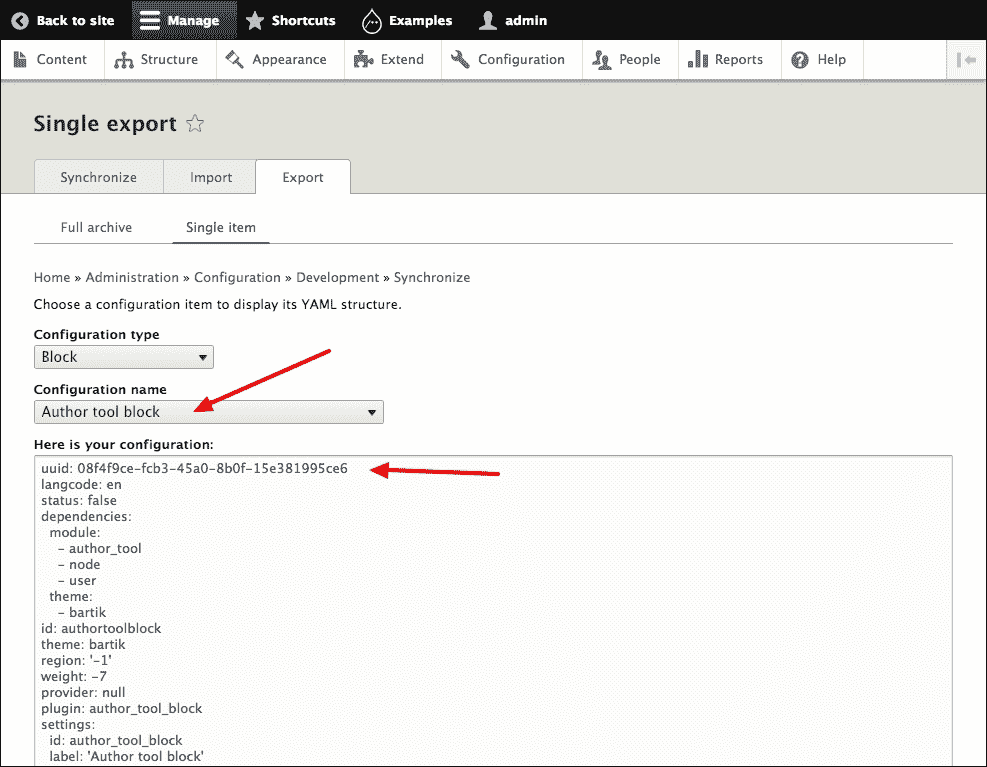

1.  在你的模块中创建以下结构，并将内容放置在名为`block.block.authortoolblock.yml`的文件中：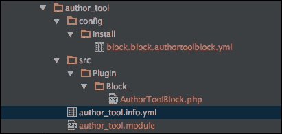

1.  又是这样做！尝试再次卸载并安装模块。块应该会自动放置在完全相同的位置，并遵循相同的可见性规则。

# 摘要

在本章中，你学习了如何通过安装、配置和重用内置 WYSIWYG 编辑器的配置来增强作者 UI，现在它是 Drupal 8 核心的一部分。你探索了后端编辑实例以及内联编辑功能，并尝试添加自己的 CKEditor 插件。你还学习了如何使用新的块 API，通过自定义模块向系统中添加新块，扩展默认方法，并在安装模块时提供默认配置。

在下一章中，我们将看到如何处理媒体并将它们集成到我们的新 Drupal 8 站点中。
