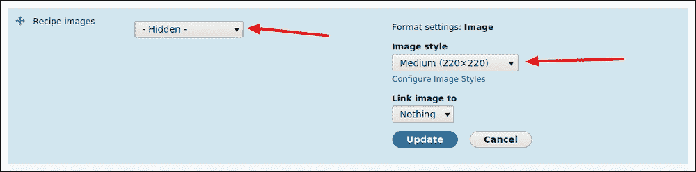

# 第七章。向我们的网站添加媒体

*仅文本的网站无法吸引访客；网站需要一些活力和特色！为您的网站增添活力的一种方法是通过添加多媒体内容，例如图片、视频、音频等。但，我们不仅仅想在这里和那里添加几张图片；实际上，我们希望提供一个沉浸式且引人入胜的多媒体体验，它易于管理、配置和扩展。Drupal 8 的文件实体([`drupal.org/project/file_entity`](https://drupal.org/project/file_entity))模块将使我们能够非常容易地管理文件。在本章中，我们将了解如何将文件实体模块集成到我们的 d8dev 网站中，并探索向用户展示图片的引人入胜的方法。这包括查看用于显示由文件实体模块管理的图片的灯箱类型 UI 元素的集成，以及学习我们如何通过 UI 和代码创建自定义图片样式。*

本章将涵盖以下主题：

+   Drupal 8 的文件实体模块

+   将食谱图片字段添加到你的内容类型中

+   代码示例——Drupal 8 的图片样式

+   在灯箱弹出窗口中显示食谱图片

+   与 Drupal 问题队列协作

# 文件实体模块简介

根据模块页面[`www.drupal.org/project/file_entity`](https://www.drupal.org/project/file_entity)：

> *文件实体提供了管理文件的接口。它还扩展了核心文件实体，允许文件可字段化、按类型分组、查看（使用显示模式）以及使用字段格式器格式化。文件实体与多个模块集成，将文件暴露给视图、实体 API、标记等。*

在我们的案例中，我们需要这个模块来轻松编辑图片属性，如标题文本和 Alt 文本。因此，这些属性将在 colorbox 弹出窗口中使用，作为标题显示。

# 与模块的开发版本协作

有时候，你会遇到一个引入了一些重大新功能且相对稳定的模块，但还不适合在实时/生产网站上使用，因此只能作为开发版本提供。这是一个为 Drupal 社区提供宝贵贡献的绝佳机会。仅通过安装和使用模块的开发版本（当然是在你的本地开发环境中），你就为模块维护者提供了宝贵的测试。当然，如果你发现任何错误或希望请求任何额外功能，你应该在项目的问题队列中提交一个问题。此外，使用模块的开发版本为你提供了承担一些自定义 Drupal 开发的机会。然而，重要的是要记住，一个模块作为开发版本发布是有原因的，它可能还不够稳定，不能部署在面向公众的网站上。

本章中我们对文件实体模块的使用是使用模块开发版本的很好例子。有一点需要注意：Drush 会下载官方和开发版本的模块。但到目前为止，Drupal 中还没有文件实体模块的官方端口，所以我们将使用非官方的，它位于 GitHub 上（[`github.com/drupal-media/file_entity`](https://github.com/drupal-media/file_entity)）。在下一步中，我们将从 GitHub 下载开发版本。

# 安装文件实体模块的开发版本的时间

在 Drupal 中，我们使用 Drush 下载和启用任何模块/主题，但文件实体模块在 Drupal 中还没有官方端口，所以我们可以使用位于 GitHub 上的非官方版本[`github.com/drupal-media/file_entity`](https://github.com/drupal-media/file_entity)：

1.  打开终端（Mac OS X）或命令提示符（Windows）应用程序，并转到您的 d8dev 站点的根目录。

1.  进入`modules`文件夹，从 GitHub 下载文件实体模块。我们使用`git`命令下载此模块：`$ git clone https://github.com/drupal-media/file_entity`。另一种方法是下载来自[`github.com/drupal-media/file_entity`](https://github.com/drupal-media/file_entity)的`.zip`文件，并在模块文件夹中提取它：

1.  接下来，在**扩展**页面（`admin/modules`）上启用文件实体模块。

## *刚才发生了什么？*

我们启用了文件实体模块，并学习了如何使用 GitHub 下载和安装。

# 我们网站上的新食谱

在本章中，我们将创建一个新的食谱：泰国罗勒鸡肉。如果您想使用更多真实内容作为示例，并自由尝试这个食谱！


+   **名称**：泰国罗勒鸡肉

+   **描述**：我最喜欢的泰国菜肴之一的一个辛辣、美味的版本

+   **产量**：四份

+   **准备时间**：25 分钟

+   **烹饪时间**：20 分钟

+   **配料**：

    +   一磅去骨鸡胸肉

    +   两大汤匙橄榄油

    +   四瓣大蒜，切碎

    +   三大汤匙酱油

    +   两大汤匙鱼露

    +   两个大甜洋葱，切片

    +   五瓣大蒜

    +   一个黄色的甜椒

    +   一个绿色的甜椒

    +   四到八个泰国辣椒（根据您想要的辣度而定）

    +   三分之一杯深棕色糖溶解在一杯热水中

    +   一杯新鲜罗勒叶

    +   两杯茉莉香米

+   **说明**：

    +   按照说明准备茉莉香米。

    +   在一个大煎锅中用中热加热橄榄油两分钟。

    +   将鸡肉加入锅中，然后倒入酱油。

    +   煮鸡肉直到没有可见的粉红色——大约 8 到 10 分钟。

    +   将热量降低到中低。

    +   加入大蒜和鱼露，煮沸 3 分钟。

    +   接下来，加入泰国辣椒、洋葱和甜椒，搅拌均匀。

    +   煮沸 2 分钟。

    +   添加红糖和水混合物。搅拌混合，然后盖上盖子。

    +   炖煮 5 分钟。

    +   揭盖，加入罗勒，搅拌以混合。

    +   搭配米饭食用。

# 操作时间 – 向我们的食谱内容类型添加食谱图片字段

我们将使用管理字段管理页面将媒体字段添加到我们的 d8dev 食谱内容类型中：

1.  在您最喜欢的浏览器中打开 d8dev 网站，点击**管理**工具栏中的**结构**链接，然后点击**内容类型**链接。

1.  接下来，在**内容类型**管理页面上，点击您食谱内容类型的**管理字段**链接：

1.  现在，在**管理字段**管理页面上，点击**添加字段**链接。在下一屏幕上，从**添加新字段**下拉菜单中选择**图片**，并将**标签**设置为**食谱图片**。点击**保存字段设置**按钮。

1.  接下来，在**字段设置**页面，将允许的值数设置为**无限**。点击**保存字段设置**按钮。在下一屏幕上，保留所有设置不变，并点击**保存设置**按钮。

1.  接下来，在**管理表单显示**页面，为**食谱图片**字段选择小部件**可编辑文件**并点击**保存**按钮。

1.  现在，在**管理显示**页面，对于**食谱图片**字段，将标签选择为**隐藏**。点击设置图标。然后选择**中等（220*220）**作为图片样式，并点击**更新**按钮。在底部，点击**保存**按钮：

1.  让我们向一个食谱添加一些食谱图片。在菜单栏中点击**内容**链接，然后点击**添加内容和食谱**。在下一屏幕上，填写标题为`泰国罗勒鸡肉`，并分别填写其他字段，如前述食谱详情中所述。

1.  现在，向下滚动到您刚刚添加的新**食谱图片**字段。点击**添加新文件**按钮或拖放您想要上传的图片。然后点击**保存并发布**按钮：

1.  重新加载您的**泰国罗勒鸡肉**食谱页面，您应该会看到以下类似的内容：

1.  所有图片都堆叠在一起。因此，我们将在`/modules/d8dev/styles/d8dev.css`文件中`field--name-field-recipe-images`和`field--type-recipe-images`样式下方添加以下 CSS，以使食谱图片更像是网格布局：

    ```php
    .node .field--type-recipe-images {
        float: none !important;
    }
    .field--name-field-recipe-images .field__item {
        display: inline-flex;
        padding: 6px;
    }
    ```

1.  现在我们将加载这个`d8dev.css`文件以影响这个网格样式。在 Drupal 8 中，加载 CSS 文件有一个过程：

    1.  将 CSS 保存到文件中。

    1.  定义一个库，其中可以包含 CSS 文件。

    1.  在钩子中将库附加到渲染数组。

1.  因此，我们已经在`styles`文件夹下保存了一个名为`d8dev.css`的 CSS 文件；现在我们将定义一个库。要定义一个或多个（资产）库，请将一个`*.libraries.yml`文件添加到您的`theme`文件夹中。我们的模块名为`d8dev`，然后文件名应该是`d8dev.libraries.yml`。文件中的每个库都是一个条目，详细说明了 CSS，如下所示：

    ```php
    d8dev:
      version: 1.x
      css:
        theme:
          styles/d8dev.css: {}
    ```

1.  现在，我们定义`hook_page_attachments()`函数来加载 CSS 文件。在`d8dev.module`文件中添加以下代码。当您想有条件地向页面添加附件时使用此钩子：

    ```php
    /**
     * Implements hook_page_attachments().
     */
    function d8dev_page_attachments(array &$attachments) {
       $attachments['#attached']['library'][] = 'd8dev/d8dev'; }
    ```

1.  现在，我们需要通过访问**配置**，点击**性能**链接，然后点击**清除所有缓存**按钮来清除我们的 d8dev 网站的缓存。重新加载您的**泰国罗勒鸡肉**食谱页面，您应该会看到以下类似的内容：

## *发生了什么？*

我们为我们的食谱内容类型添加并配置了一个基于媒体的字段。我们通过自定义 CSS 代码更新了 d8dev 模块，以便以更网格的形式布局食谱图片。同时，我们还研究了如何通过模块附加 CSS 文件。

# 创建自定义图片样式

在我们配置 colorbox 功能之前，我们将创建一个自定义图片样式，以便在添加到 colorbox 内容预览设置时使用。Drupal 8 的图片样式是核心图片模块的一部分。核心图片模块提供了三个默认图片样式——缩略图、中图和大图，如以下图片样式配置页面所示：


现在，我们将添加第五个自定义图片样式，一个介于 100 x 75 缩略图样式和 220 x 165 中图样式之间的图片样式。我们将通过图片样式管理页面演示创建图片样式的过程，并演示通过编程创建图片样式的过程。

# 通过图片样式管理页面添加自定义图片样式

首先，我们将使用图片样式管理页面（`admin/config/media/image-styles`）来创建一个自定义图片样式：

1.  在您最喜欢的浏览器中打开 d8dev 网站，点击**管理**工具栏中的**配置**链接，然后点击**媒体**部分下的**图片样式**链接。

1.  一旦图片样式管理页面加载完成，点击**添加样式**链接。

1.  接下来，将自定义图片样式的**图片样式名称**输入为`small`，然后点击**创建新样式**按钮：

    现在，我们将通过从**效果**选项中选择**缩放**并点击**添加**按钮来为我们的自定义图片样式添加唯一的效果。

1.  在**添加缩放效果**页面上，输入宽度为`160`，高度为`120`。不要勾选**允许放大**复选框，然后点击**添加效果**按钮：

1.  最后，只需在**编辑小样式**管理页面上的**更新样式**按钮上点击，我们就完成了。我们现在有一个新的自定义小图像样式，我们可以用它来调整我们网站的图像大小：

## *发生了什么？*

我们学习了如何通过管理 UI 轻松添加自定义图像样式。现在，我们将看到如何通过编写一些代码来添加自定义图像样式。基于代码的自定义图像样式的优点是，它将允许我们利用源代码仓库，例如 Git，来管理和在不同环境之间部署我们的自定义图像样式。例如，它将允许我们使用 Git 将图像样式从开发环境提升到实时生产网站。否则，我们刚才所做的手动配置将不得不为每个环境重复进行。

# 行动时间 – 创建一个程序化的自定义图像样式

现在，我们将看到如何通过代码添加自定义图像样式：

1.  我们需要做的第一件事是删除我们刚刚创建的小图像样式。因此，打开您最喜欢的浏览器中的 d8dev 网站，点击**管理**工具栏中的**配置**链接，然后在**媒体**部分下点击**图像样式**链接。

1.  一旦**图像样式**管理页面加载完成，点击我们刚刚添加的小图像样式的**删除**链接。

1.  接下来，在**在删除小样式之前可选选择一个样式**页面上，将**替换样式**选择列表的默认值保留为**无替换，仅删除**，然后点击**删除**按钮：

1.  在 Drupal 8 中，图像样式已从数组转换为扩展 ConfigEntity 的对象。所有由模块提供的图像样式都需要在每个模块的`config/install`文件夹中定义为 YAML 配置文件。

1.  假设我们的模块位于`modules/d8dev`。创建一个名为`modules/d8dev/config/install/image.style.small.yml`的文件，内容如下：

    ```php
    uuid: b97a0bd7-4833-4d4a-ae05-5d4da0503041
    langcode: en
    status: true
    dependencies: {  }
    name: small
    label: small
    effects:
      c76016aa-3c8b-495a-9e31-4923f1e4be54:
        uuid: c76016aa-3c8b-495a-9e31-4923f1e4be54
        id: image_scale
        weight: 1
        data:
          width: 160
          height: 120
          upscale: false
    ```

    ### 注意

    我们需要使用 UUID 生成器为图像样式效果分配唯一的 ID。*不要从其他代码片段或其他图像样式中复制/粘贴 UUID*！

1.  我们自定义样式的名称是"small"。在这里，名称和标签是相同的。对于我们要添加到图像样式的每个效果，我们将在键的后面指定效果本身，键后的值作为效果的设置。在我们这里使用的**image_scale**效果的情况下，我们传递了**宽度**、**高度**和**upscale**设置。最后，**weight**键的值允许我们指定效果应该处理的顺序，尽管当只有一个效果时它不太有用，但当有多个效果时，它就变得很重要了。

1.  现在，我们需要通过访问**扩展**页面来卸载并安装我们的 d8dev 模块。在下一屏幕上点击**卸载**选项卡，勾选**d8dev**复选框，然后点击**卸载**按钮。现在，点击**列表**选项卡，勾选**d8dev**，然后点击**安装**按钮。然后，返回到**图像样式**管理页面，您将看到我们通过编程创建的小图像样式。

## *发生了什么？*

我们创建了一个带有一些自定义代码的自定义图像样式。然后，我们配置了我们的食谱内容类型，使其为添加到食谱图片字段的图片使用我们的自定义图像样式。

# 集成 Colorbox 和文件实体模块

文件实体模块提供了管理文件的用户界面。对于图片，我们将能够轻松编辑标题文本、替代文本和文件名。然而，图片占据了相当大的空间。让我们创建一个弹出式相册并显示图片。当有人点击图片时，一个灯箱会弹出，并允许用户浏览所有相关图片的较大版本。

# 安装 Colorbox 模块的行动时间

在我们能够在 Colorbox 中显示食谱图片之前，我们需要下载并启用该模块：

1.  打开 Mac OS X 终端或 Windows 命令提示符，切换到`d8dev`目录。

1.  接下来，使用 Drush 下载并启用 Colorbox 模块的当前开发版本([`drupal.org/project/colorbox`](http://drupal.org/project/colorbox))：

    ```php
    $ drush dl colorbox-8.x-1.x-dev 

    Project colorbox (8.x-1.x-dev) downloaded to /var/www/html/d8dev/modules/colorbox.
    [success] 

    $ drush en colorbox 

    The following extensions will be enabled: colorbox 
    Do you really want to continue? (y/n): y 
    colorbox was enabled successfully.
    [ok]
    ```

1.  Colorbox 模块依赖于位于[`github.com/jackmoore/colorbox`](https://github.com/jackmoore/colorbox)的 Colorbox jQuery 插件。Colorbox 模块包含一个 Drush 任务，该任务将在`/libraries`目录下下载所需的 jQuery 插件：

    ```php
    $ drush colorbox-plugin 
    Colorbox plugin has been installed in libraries
    [success]
    ```

1.  接下来，我们将查看 Colorbox 显示格式化器。点击**管理**工具栏中的**结构**链接，然后点击**内容类型**链接，最后点击**操作**下拉菜单下的**管理显示**链接，以您的食谱内容类型为例：

1.  接下来，点击**格式**选择列表中的**食谱图片**字段，您将看到一个 Colorbox 选项，选择**Colorbox**后，您将看到设置发生变化。然后，点击设置图标：

1.  现在，您将看到 Colorbox 的设置。在下拉菜单中选择**内容图像样式**为**小尺寸**，并将**第一张图片的内容图像样式**也设置为**小尺寸**，并使用其他选项的默认设置。点击底部的**更新**按钮，然后点击底部的**保存**按钮：

1.  重新加载我们的**泰式罗勒鸡肉**食谱页面，你应该会看到以下类似的内容（带有新的图像样式，小尺寸）：

1.  现在，点击任何图片，然后您将看到图片在 colorbox 弹出窗口中加载：

1.  我们对 colorbox 的图片有了更多的了解，但 colorbox 也支持视频。为我们的网站添加一些活力的一种方式是添加视频。因此，有多个模块可用于与 colorbox 一起工作以处理视频。Video Embed Field 模块创建了一个简单的字段类型，允许您通过输入视频的 URL 将 YouTube 和 Vimeo 中的视频嵌入，并简单地显示它们的缩略图预览。因此，您可以尝试此模块为您的网站添加一些亮点！

## *发生了什么？*

我们已安装 Colorbox 模块，并已将其启用以用于我们的自定义食谱内容类型的“食谱图片字段”。现在，我们可以轻松地使用 Colorbox 弹出功能将图片添加到我们的 d8dev 内容中。

# 与 Drupal 问题队列协作

Drupal 拥有自己的一套问题队列，用于与全球的开发者团队协作。如果你需要特定项目、核心、模块或主题的帮助，你应该去问题队列，那里的维护者、用户和主题的追随者会进行沟通。

问题页面提供了一个筛选选项，您可以根据项目、分配、提交者、追随者、状态、优先级、类别等搜索特定的问题。

我们可以在[`www.drupal.org/project/issues/colorbox`](https://www.drupal.org/project/issues/colorbox)找到问题。在这里，将 colorbox 替换为特定的模块名称。更多信息请参阅[`www.drupal.org/issue-queue`](https://www.drupal.org/issue-queue)。

在我们的案例中，我们有一个关于 colorbox 模块的问题。对于**自动**和**内容标题**属性，标题是正常工作的，但对于**Alt 文本**和**标题文本**属性则不工作。要检查这个问题，请转到**结构** | **内容类型**并点击**管理显示**。在下一屏幕上，点击“食谱图片字段”的设置图标。现在选择**标题文本**或**Alt 文本**作为**标题**选项，并点击**更新**按钮。最后，点击**保存**按钮。重新加载**泰式罗勒鸡肉**食谱页面，并点击任何图片。然后它将在弹出窗口中打开，但我们看不到这个图片的标题。

### 注意

确保您已更新泰式罗勒鸡肉食谱的“食谱图片字段”的标题文本和 Alt 文本属性。

# 行动时间 – 为 Colorbox 模块创建一个问题

现在，在我们尝试解决 Colorbox 模块的功能问题之前，让我们先创建一个问题：

1.  在 [`www.drupal.org/project/issues/colorbox`](https://www.drupal.org/project/issues/colorbox) 上，点击 **创建新问题** 链接：

1.  在下一屏，我们将看到一个表单。我们将填写所有必填字段：**标题**，**类别**选择为“错误报告”，**版本**选择为`8.x-1.x-dev`，**组件**选择为“代码”，以及**问题摘要**字段。一旦我提交了表单，就在 [`www.drupal.org/node/2645160`](https://www.drupal.org/node/2645160) 创建了一个问题。你应该在 Drupal ([`www.drupal.org/`](https://www.drupal.org/)) 上看到一个类似的问题：

1.  接下来，colorbox 模块的维护者将调查这个问题并相应地回复。实际上，`@frjo` 回复说：“我从未使用过那个模块，但如果有人发送补丁，我会看看。”他是这个模块的贡献者，所以我们将等待一段时间，看看是否有人能通过提供补丁或发表有用的评论来解决这个问题。如果有人提供补丁，那么我们必须将其应用到 colorbox 模块中。这些信息可以在 Drupal 上找到 [`www.drupal.org/patch/apply`](https://www.drupal.org/patch/apply) 。

## *发生了什么？*

我们理解并创建了一个 Colorbox 模块问题队列列表中的问题。我们还查看了所需字段以及如何填写它们以在 Drupal 模块队列列表表单中创建问题。

# 摘要

在本章中，我们探讨了一种使用我们的 d8dev 网站与多媒体结合的方法，通过一些自定义代码创建图像样式，并学习了一些与 Drupal 开发者社区互动的新方法。我们还与 Colorbox 模块合作，使用 Colorbox 弹出功能将图像添加到我们的 d8dev 内容中。最后，我们研究了自定义模块以处理自定义 CSS 文件。

在下一章中，我们将对 Colorbox 模块进行一些改进，并添加一些功能到我们的 d8dev 网站上，这将使访问者能够为我们提供反馈并与我们网站的内容互动。
