# 第十章。Drupal 项目管理与合作

*在本章中，我们将学习将沙盒模块提升为完整项目状态的过程。在这个过程中，你将了解更多关于 Drupal 开发者社区、开发者协作以及如何更深入地参与其中。我们还将探讨如何使用新引入的配置管理和功能来管理生产网站上的增量开发。最后，我们将为 Drupal 8 创建一个旋转横幅模块。*

本章将涵盖以下主题：

+   Drupal 中的发布管理

+   更高级的模块开发

+   如何使用功能模块

# 使用视图幻灯片模块创建旋转横幅

我们将探讨一种基于视图插件的方法，其主要由视图配置组成。视图插件输出的自定义将使用自定义 CSS 来处理。

视图幻灯片模块是一个视图样式插件的优秀示例，它提供了比仅旋转横幅更多的功能。基本上，视图幻灯片模块将 jQuery Cycle 插件作为视图样式插件进行包装，但它这样做是通过一个子模块，即`views_slideshow_cycle`模块。`views_slideshow`模块不仅仅是一个视图样式插件。它是一个插件框架，它将不同的 jQuery 幻灯片插件与视图集成，并提供基于 jQuery cycle 插件的默认实现。

# 行动时间 - 安装视图幻灯片模块

在我们使用视图创建旋转横幅之前，我们需要安装视图幻灯片模块：

1.  打开终端（Mac OS X）或命令提示符（Windows）应用程序，并切换到 d8dev 站点的根目录。

1.  使用 Drush 下载并启用视图幻灯片模块：

    ```php
    $ drush dl views_slideshow
    Project views_slideshow (8.x-4.0) downloaded to /var/www/d8dev/sites/all/modules/views_slideshow.  [success]
    Project views_slideshow contains 2 modules: views_slideshow_cycle, views_slideshow.
    root@vb:/var/www/html/drupal8_3_new# drush en views_slideshow views_slideshow_cycle, 
    jQuery Cycle appears to be already installed.               [ok] 
    Directory libraries/json2 was created                  [success] 
    The latest version of JSON2 has been downloaded to libraries/json2                                        [success] 
    Directory libraries/jquery.hoverIntent was created       [success]
    The latest version of jQuery HoverIntent has been downloaded to libraries/jquery.hoverIntent                           [success]
    Directory libraries/jquery.pause was created              [success]
    The latest version of jQuery Pause has been downloaded to libraries/jquery.pause                                  [success]
    The following extensions will be enabled: views_slideshow, views_slideshow_cycle
    Do you really want to continue? (y/n): y
    views_slideshow was enabled successfully.                     [ok]
    views_slideshow_cycle was enabled successfully.                 [ok]

    ```

## *发生了什么？*

视图幻灯片模块由两个模块组成：基础`views_slideshow`模块和`views_slideshow_cycle`模块。我们需要告诉 Drush 安装`views_slideshow_cycle`模块，Drush 将自动安装属于同一父模块的任何依赖项；在这种情况下，`views_slideshow`模块将由 Drush 自动启用。同时请注意，Drush 提示我们下载`views_slideshow_cycle`的其他未满足的依赖项；在这种情况下，外部 js 库`jquery.cycle`、`jquery.hoverIntent`、`jquery.pause`和`json2`被下载到`libraries`文件夹中。

# 使用视图幻灯片创建旋转横幅

视图幻灯片模块是一个视图样式插件。我们将创建一个基于块的视图，该视图将使用此样式插件将我们的食谱图片列表转换为旋转横幅。之后，我们就能在我们的 d8dev 网站首页上显示它。

# 行动时间 - 使用视图幻灯片模块创建横幅

现在我们已经安装并设置了视图幻灯片模块，是时候我们构建一个基于视图的旋转横幅了：

1.  在浏览器中打开 d8dev 网站，点击**管理**工具栏中的**结构**链接，然后点击**视图**链接。

1.  我们正在创建一个新的视图。点击**视图列表**页面顶部的**添加新视图**链接。

1.  将**视图名称**输入为`Front Banner`，并选择**食谱**作为类型。我们将创建我们的旋转横幅作为一个块，所以勾选**创建一个块**复选框。

1.  接下来，选择**字段**的**幻灯片**用于**块显示设置**。验证添加新视图表单看起来与以下截图相似，然后点击**保存并编辑**按钮：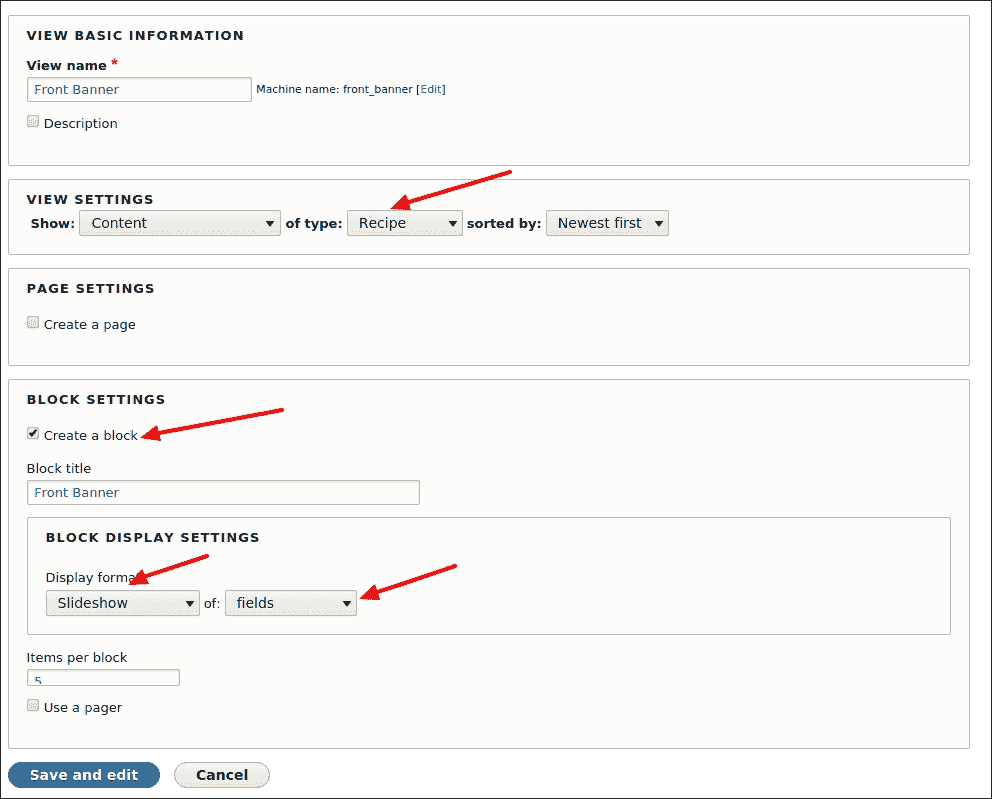

1.  现在，我们需要决定我们想在横幅中显示哪些字段。**内容：标题**字段已默认添加。但我们显然想在旋转横幅中显示一个图像。

1.  点击**字段**的**添加**按钮，在**搜索**输入中搜索`Images`，并选择**图像**。点击**应用（所有显示）**按钮。

1.  接下来，在**配置字段**表单中，选择**大**作为**图像样式**，然后点击**应用（所有显示）**按钮。

1.  现在，如果你滚动到**视图**页面的**预览**区域，你会看到一个类似以下截图的工作幻灯片：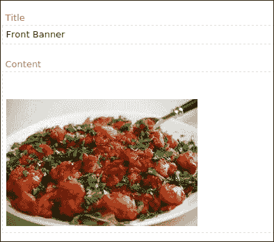

1.  点击**过滤器条件**的**添加**按钮。在搜索输入框中搜索`images`，并选择**任何图像（field_images:title）**过滤器。点击**应用（所有显示）**按钮。

1.  在下一屏幕上，选择**不是空的（NOT NULL）**运算符，然后点击**应用（所有显示）**按钮。

1.  点击**字段添加**按钮的下拉菜单，并选择**重新排列**：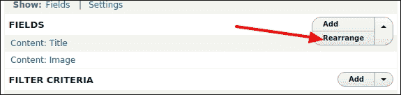

1.  接下来，只需将**内容：标题**字段拖到**内容：图像**字段下方，然后点击**应用（所有显示）**按钮。

    现在，我们准备好查看我们的新视图幻灯片横幅在首页上的样子。

1.  点击我们新视图的**保存**按钮。然后点击**管理**工具栏中的**结构**链接，最后点击**块布局**链接。

1.  滚动到**内容区域**，并点击**放置块**链接。在弹出窗口中，搜索`Front banner`，然后点击**放置块**按钮以放置**Front Banner**块。

1.  在下一屏幕上，取消选中**覆盖标题**复选框。接下来，选择**内容**作为显示我们 D8Dev 块的区域。在**可见性** | **页面**部分，选择**显示在列出的页面**，并输入`<front>`作为唯一要显示的页面：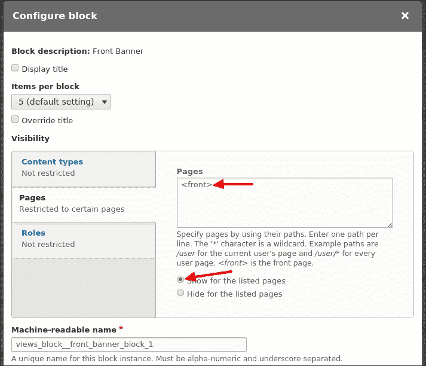

1.  点击**保存块**按钮。在**块**配置页面，将**前横幅**块拖到**内容区域**中的**主页内容**块上方，然后在屏幕底部点击**保存块**按钮。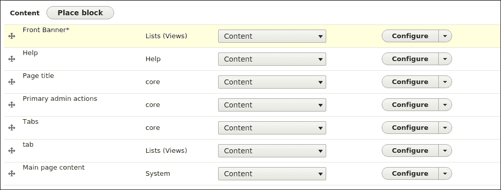

1.  当你完成时，前横幅应该看起来类似于以下截图：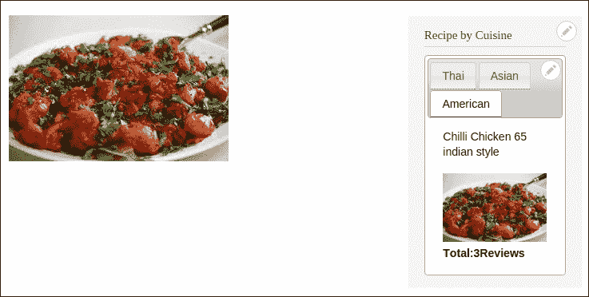

## *发生了什么？*

我们使用视图幻灯片插件创建了一个前横幅块，并将其分配到我们的 d8dev 网站的前页。

我们创建了一个幻灯片放映，但它正在显示我们与食谱一起上传的图片大小。这些大小可能各不相同。为了使图片大小统一，我们不得不创建一个可以应用于此幻灯片放映以及任何其他我们想要显示相同大小图片的位置的图像样式。

# 执行时间 – 为我们的旋转食谱横幅中的图片创建新的图像样式

在上一章中，我们学习了如何为 Drupal 8 添加图像样式。让我们添加一个名为`front_banner`的新图像样式，该样式将我们的食谱图片缩放到宽度不超过 680 像素，高度裁剪到 410 像素。我们将将其应用于我们的前横幅视图的图像字段。这将使我们的旋转横幅看起来更一致，因为它不会从幻灯片到幻灯片改变大小：

1.  在浏览器中打开 d8dev 网站，点击**管理**工具栏中的**配置**链接，然后点击**媒体**链接下的**图像样式**。

1.  我们正在创建一个新的图像样式。因此，点击**图像样式**页面顶部的**+添加图像样式**链接。

1.  将图像样式名称输入为**前横幅**，然后点击**创建新样式**按钮。

1.  选择**裁剪**作为效果，然后点击页面底部的**添加**按钮：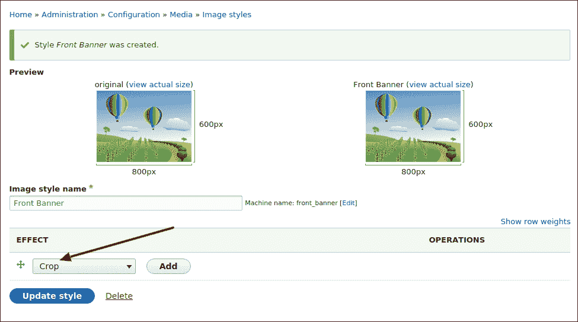

1.  接下来，将`680`输入为**宽度**，将`410`输入为**高度**，然后点击**添加效果**按钮：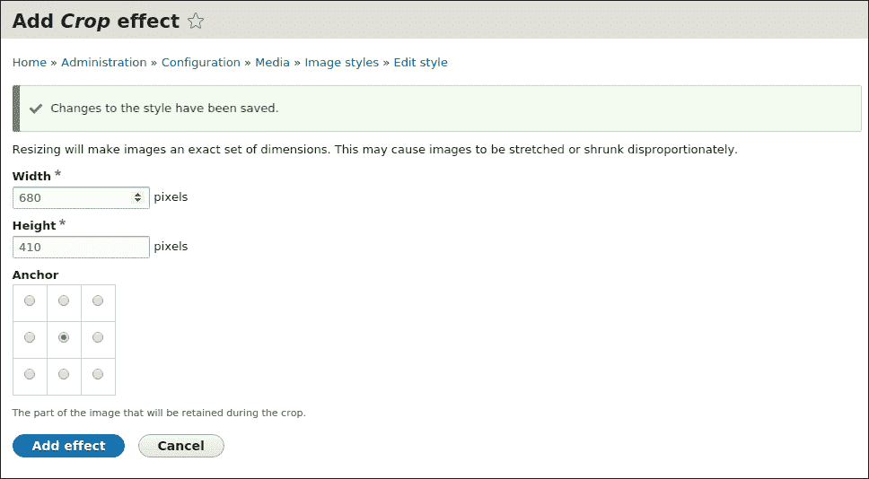

1.  现在我们需要更新这个图像样式以用于前横幅视图。点击**管理**工具栏中的**配置**链接，然后点击**视图**链接。

1.  接下来，点击前横幅视图的**编辑**链接。在下一个视图编辑页面，点击**字段**下的**内容：图片**链接，并将**图像样式**字段选择为**前横幅**。点击**应用（所有显示）**按钮。然后点击屏幕底部的**保存**按钮保存视图。

1.  当你完成时，前横幅应该看起来类似于以下截图：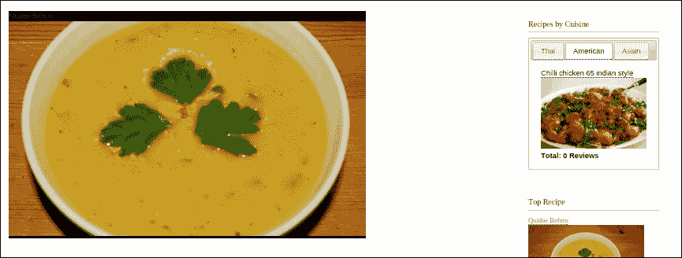

## *发生了什么？*

我们刚刚为旋转食谱横幅中的图片创建了一个新的图像样式。

# 使用翻页器和 CSS 增强前横幅的外观

我们的新前横幅工作得很好，但我们可以通过添加更多配置和 CSS 轻松改善其外观和用户体验。我们打算向我们的 d8dev 模块添加自定义 CSS 来调整旋转横幅的外观，但首先我们要添加一个翻页器，它会显示有多少幻灯片以及当前幻灯片。

# 执行时间 – 更新前横幅视图以包含幻灯片翻页器

我们将增强我们的视图旋转横幅，添加一个翻页器：

1.  在浏览器中打开 d8dev 网站，将鼠标悬停在新的前横幅上，点击上下文链接小部件，然后点击**编辑视图**链接：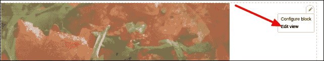

1.  接下来，我们需要向我们的视图添加一个翻页器。点击幻灯片格式化器的**设置**链接：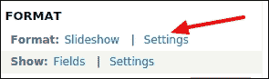

1.  在**块：样式选项**表单中，滚动到**底部小部件**部分，并勾选**翻页器**复选框。勾选此复选框后，我们可以看到其他字段出现。在**翻页器字段**部分下勾选**内容：标题**，然后点击**应用**按钮。请看以下截图：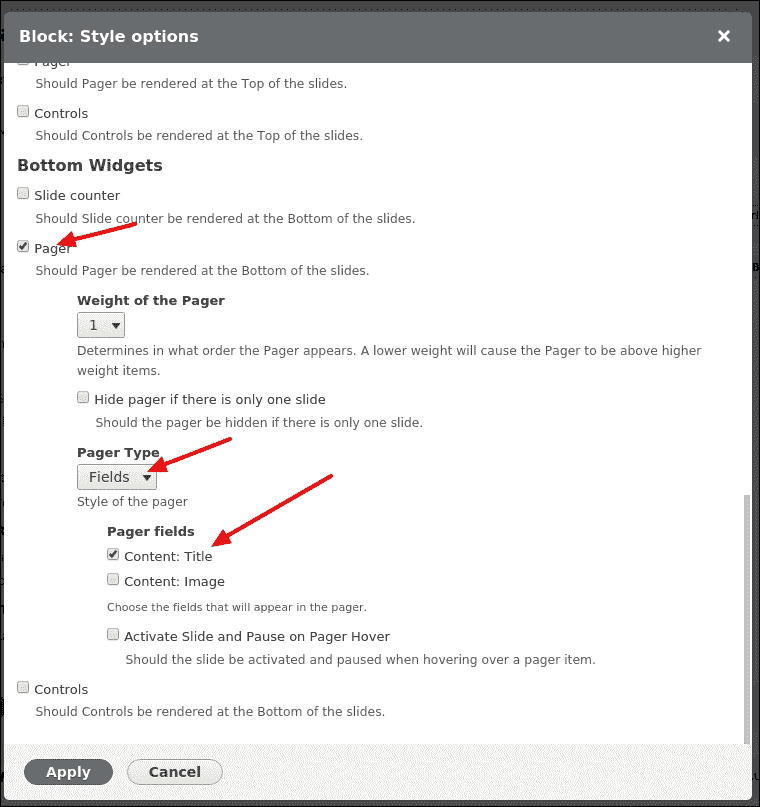

1.  现在，点击视图的**保存**按钮，查看更新的前横幅。请看以下截图：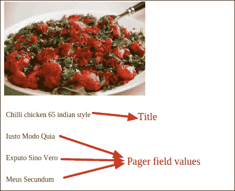

1.  虽然这并不是我们想要的视觉效果鲜明的翻页器，但如果你点击任何标题，你会注意到幻灯片会切换到相应的页面项。所以，尽管翻页器工作正常，但外观并不那么出色。让我们看看我们能为它的外观做些什么，通过向我们的 d8dev 模块添加一些自定义 CSS。

1.  在 Chrome/Firefox 中打开 d8dev 网站的前页，右键点击你的旋转横幅，并从弹出的上下文菜单中选择**Inspect Element**：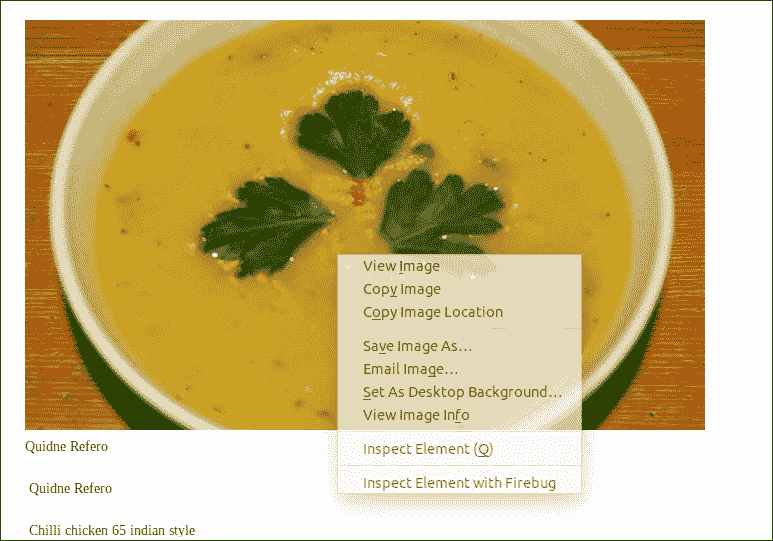

1.  在**元素**检查器中，找到带有`views-slideshow- controls-bottom`类的`div`标签，并展开它：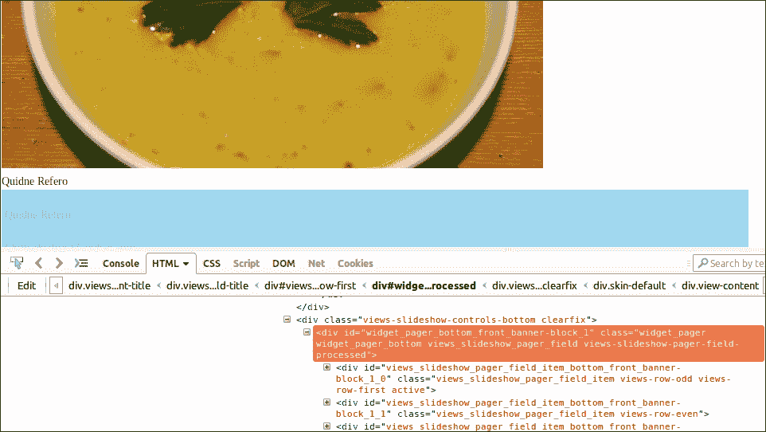

1.  选择带有`views-slideshow-pager-field`类的`div`标签，使其高亮。然后在样式检查器中的`element.style`花括号内点击，并输入`float: right;`。我们可以看到页面字段标题向右浮动时的变化。

1.  接下来，在 PhpStorm IDE 中，打开位于`d8dev/modules/d8dev/styles/`的`d8dev.css`文件。

1.  滚动到文件底部，添加以下样式：

    ```php
    div.views_slideshow_pager_field {
        bottom: 30px;
        float: left;
        position: relative;
        text-align: right;
        z-index: 113;
    }
    ```

1.  现在，回到浏览器中，展开`views-slideshow-pager-field` div，找到带有`div.views_slideshow_pager_field_item`选择器的`div`标签，并在`d8dev.css`文件中为`div.views_slideshow_pager_field_item`选择器添加以下样式：

    ```php
    div.views_slideshow_pager_field_item{
        display: inline-block;
        background-color: #999;
        width: 10px;
        height: 10px;
        text-indent: -9999px;
        border: 2px solid #CCC;
        -moz-border-radius: 4px;
        border-radius: 8px;
        margin-left: 4px;
        cursor: pointer;
    }

    div.views_slideshow_pager_field_item:hover, div.views_slideshow_pager_field_item.active{
       background-color: #BF0000;
    }
    ```

1.  清除缓存并在浏览器中刷新前页。请看以下截图：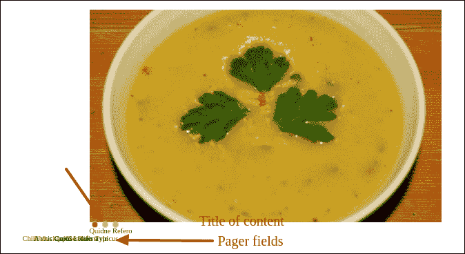

1.  现在将 CSS 添加到隐藏`views-content-title` div。在 PhpStorm IDE 中打开`style.css`文件，在文件末尾添加以下 CSS：

    ```php
    div.views-content-title {
        display: none;
    }
    ```

    ### 注意

    注意：通过从视图字段设置中排除内容标题，也会隐藏标题，但请确保其他 CSS 也会受到影响。

1.  清除缓存并在浏览器中刷新前页：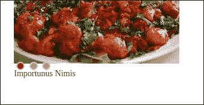

1.  现在，我们需要对菜谱标题进行一些样式设计。我们将增加字体大小，并将其定位在翻页器上方。但将文本对齐在图像中心，添加背景色番茄红，文字颜色白色。同时，我们将更新为 672 像素，因为我们取了 4 像素的填充。

1.  在 PhpStorm IDE 中将以下 CSS 添加到`div.views-field-title`选择器：

    ```php
    #views_slideshow_cycle_main_front_banner-block_1 .views-field-title {
        background: tomato none repeat scroll 0 0;
        bottom: 40px;
        color: white;
        display: block;
        font-weight: bold;
        padding: 4px;
        position: absolute;
        text-align: center;
        width: 672px;
    }
    ```

1.  清除缓存并在浏览器中刷新前页；你会看到菜谱标题的阅读更加容易。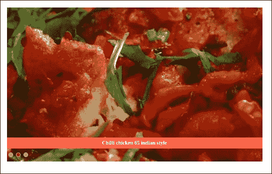

## *发生了什么？*

我们在我们的前页横幅中添加了一个翻页器和标题，尽管我们没有编写很多自定义 PHP 代码，但我们看到了如何通过适当的视图配置模块（视图幻灯片）和一点创意 CSS，将一点点的视图配置结合起来产生很好的效果。

# 是时候准备另一道菜谱了

这是一道适合寒冷冬日的美味又营养的汤。几乎任何有饮食限制的人都能享受这道健康美味的汤。

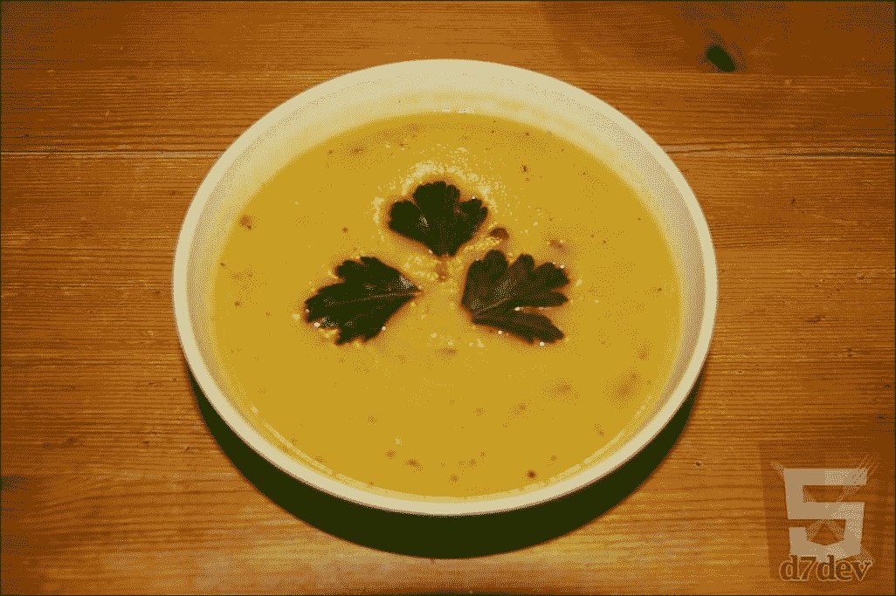

+   **名称**：土豆韭菜汤（纯素）

+   **菜系类型**：欧洲

+   **描述**：这道健康且仍然浓稠的汤会真正地温暖你的胃，在寒冷的日子里让你感到温暖。

+   **菜谱产量**：十份

+   **准备时间**：30 分钟

+   **烹饪时间**：45 分钟

+   **原料**：

    +   五到六个大土豆，去皮并切成四份

    +   四根韭菜，洗净并切成薄片

    +   一个大甜洋葱，切碎

    +   四汤匙纯素黄油

    +   一汤匙橄榄油

    +   六杯蔬菜高汤

    +   一杯普通大豆奶

    +   海盐

    +   新磨的黑胡椒

    +   一汤匙米醋

    +   两茶匙磨碎的红辣椒

    +   1/4 杯切碎的香菜

+   **说明**：

    +   在中火上用大荷兰锅融化纯素黄油。

    +   当黄油融化后，加入切碎的洋葱，炒至开始变焦糖色。

    +   在中火上加入细切的韭菜，炒至 10 分钟，大约每分钟搅拌一次。

    +   加入切碎的土豆，与韭菜和洋葱一起炒至 10 分钟，大约每分钟搅拌一次。

    +   加入橄榄油并搅拌以混合。

    +   加入蔬菜高汤和平常的豆浆。搅拌均匀。用中高火煮沸，然后降低火力至低。

    +   文火煮 15 分钟。

    +   使用浸入式手持搅拌器将汤搅拌成光滑的泥状。

    +   加入醋和磨碎的红辣椒。

    +   根据口味加入海盐和新鲜磨碎的黑胡椒。

    +   加入新鲜的香菜并享用。

## 将沙盒项目提升为完整项目

虽然我们将我们的视图语义标签模块的更改提交到了沙盒 Git 仓库——这样做使得代码可供任何想要使用它的人使用——但对于许多不是开发者只想下载模块、配置并使用的人来说，使用 Git 是一个障碍。沙盒模块也可能阻止人们尝试你的模块，因为他们可能不会信任不是一个完整项目的模块（Drupal 在所有沙盒模块页面的顶部都有一个很大的警告）。我将创建一个可以轻松下载的版本，无需 Git。

在这个阶段，我将只创建一个 alpha 版本，直到社区有机会对其进行测试。一旦收到一些反馈，我将创建一个完整版本。在我们开始之前，我们将遵循模块文档指南 [`www.drupal.org/node/161085`](https://www.drupal.org/node/161085)。阅读完这个页面后，我决定将 `README.txt` 文件添加到我们的视图语义标签模块中。

# 将 Views 语义模块提升为完整项目的时间 - 创建 README.txt 并推送到沙盒

1.  在 `views_semantic_tabs` 文件夹下创建 `README.txt` 文件，如下所示：

    ```php
    Introduction
    ------------

    This module provides a views style plugin to display views results in jQuery UI Tabs.

    Requirements
    ------------

    This module requires the following modules:

     * Views (https://drupal.org/project/views)

    INSTALLATION
    ------------

     * Install as you would normally install a contributed Drupal module. See:
       https://drupal.org/documentation/install/modules-themes/modules-8
       for further information.

    CONFIGURATION
    -------------

     * Update your view with semantic tabs style under format style in the view.

    MAINTAINERS
    -----------

    Current maintainers:
     * Krishna kanth (krknth) - https://drupal.org/u/krknth
     * Neeraj kumar (neerajskydiver) - https://drupal.org/u/neerajskydiver
    ```

1.  接下来，我们需要将其推送到 Git 沙盒。打开终端，转到 `modules/views_semantic_tabs` 文件夹，并运行以下命令：

    ```php
    $ git add README.txt
    $ git commit -m "Added README.txt file."$ git push origin 8.x.2.x

    ```

## *发生了什么？*

我们在模块文档指南中了解了一些关于 Drupal 的 `README.txt` 文件的内容。我们将其添加到模块中，并将其推送到 Drupal 项目的 Git 仓库。

# 将 Views 语义模块提升为完整项目的时间 - 提升视图语义模块到完整项目

1.  访问我们的沙盒项目页面 [`www.drupal.org/sandbox/krishnakanth17/2665888`](https://www.drupal.org/sandbox/krishnakanth17/2665888)。然后点击**编辑**标签：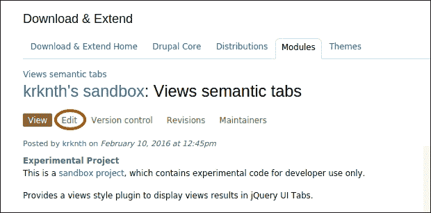

1.  然后是**提升**子标签：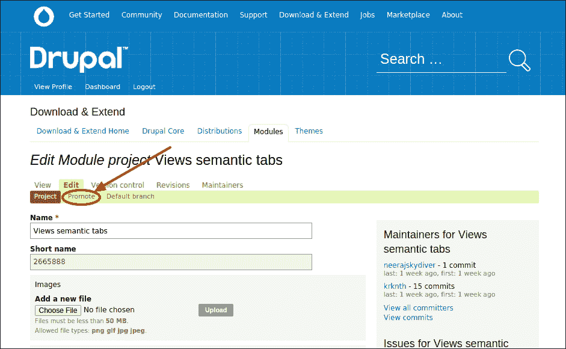

1.  填写表格，确保输入一个简短的项目名称：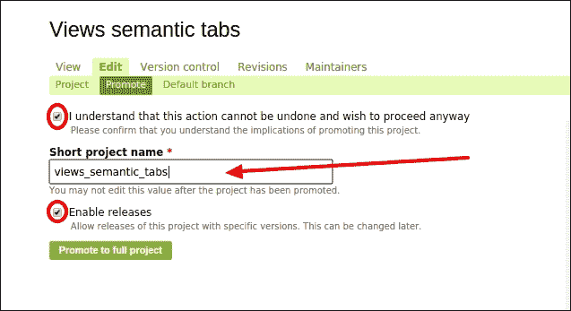

1.  下一页询问我是否确定要提升模块，我确定，所以我将点击**提升**按钮：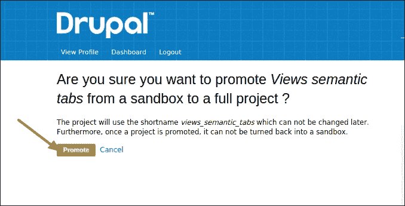

1.  现在它不再是沙盒项目，Drupal 为项目提供了关于远程仓库的一些重要说明。以下截图中的 Git 命令需要在将任何新更改推送到远程仓库之前执行，因为 Drupal 已经将其移动到新的位置，以适应完整项目和新的简短项目名称：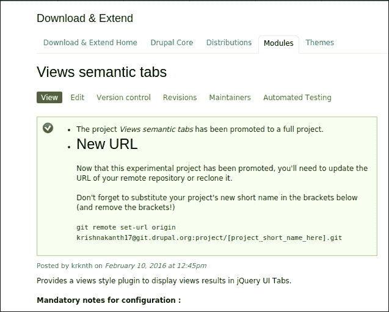

1.  经过所有这些步骤，我们的模块已提升为完整项目，并且我们可以通过 URL [`www.drupal.org/project/views_semantic_tabs`](https://www.drupal.org/project/views_semantic_tabs) 访问它。

1.  现在我们需要为 Views 语义标签模块创建一个开发版本，以便更容易下载和安装。Drupal 在完整项目页面的版本控制页面上提供了有关使用 Git 创建开发分支的说明（这些说明仅对模块维护者显示）。

1.  在我们的本地 Views 语义标签仓库上执行以下 Git 命令将创建一个新的开发分支：

    ```php
    $ git checkout -b 8.x-2.x
    $ git push -u origin 8.x-2.x

    ```

1.  现在我们已经在 Views 语义标签仓库中有一个新的开发分支，我们将能够向项目中添加一个开发版本。在 Views 语义标签模块的 **视图** 页面上，有一个位于 **项目信息** 下的 **添加新版本** 链接。点击该链接将带我们到 **创建项目版本** 页面。请看这个截图：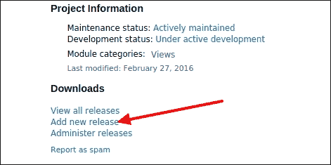

1.  **创建版本** 页面列出了两个 Git 发布分支以供选择，即我们刚刚创建的 `8.x.1.x` 和 `8.x.2.x` 分支。因此，我们只需选择 **8.x-2.x (8.x-2.x-dev)** 并点击 **下一步** 按钮：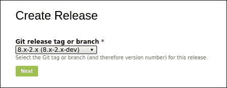

1.  在下一页，我们将输入一些 **发布说明** 并点击 **保存** 按钮；其他字段已经填写，因为这是第一个开发版本。

1.  我们已成功将 Views 语义标签模块提升为完整项目状态，并创建了一个初始开发版本。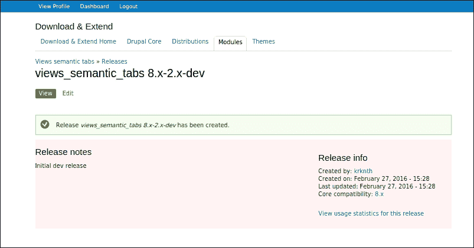

1.  Drupal 将自动生成 `tar.gz` 和 `.zip` 文件并将它们附加到项目中，但开发版本可能需要 1-2 个小时（官方非开发版本在 5 分钟内发布）。在此期间，在 Views 语义标签的发布页面只会出现一个未发布的版本节点。此外，我们可以使用 Drush 通过以下命令下载并启用模块：

    ```php
    $ drush dl views_semantic_tabs

    ```

## *发生了什么？*

我们从模块文档指南中了解了一些关于 Drupal 的 `README.txt` 文件的内容。我们还学习了如何将一个模块从沙盒项目提升为完整项目，以及如何发布一个开发版本到项目中。

# 介绍 Features 模块

Drupal 8 的 Features 模块使我们能够捕捉和管理一组 Drupal 实体，即功能。Features 模块将通过提供可导出和捆绑的 UI 和 API，从模块中获取不同的网站构建组件，并将它们捆绑成一个单独的模块。在常规术语中，一个功能可能是一个博客、一个页面或一个图片库。因此，在下一个主题中，我们将学习如何使用 Features 模块。我们将导出我们的 Recipe 内容类型并在另一个环境中使用它。

# 行动时间——安装 Features 模块

我们将使用 Drush 下载并安装 Features 模块。同时，我们还将安装 `features_ui` 模块作为其包的一部分：

1.  打开终端（Mac OS X）或命令提示符（Windows）应用程序，并切换到我们的 d8dev 网站的根目录。

1.  使用 Drush 下载并启用 Features 模块：

    ```php
    $ drush dl features 
    Project features (8.x-3.0-alpha6) downloaded to /var/www/html/d8dev/modules/features.                                               [success]
    Project features contains 2 modules: features_ui, features.
     $ drush en features 
    The following projects have unmet dependencies:                            [ok]
    features requires config_update
    Would you like to download them? (y/n): y
    Project config_update (8.x-1.0) downloaded to /var/www/html/drupal8_3_new//modules/config_update.
    [success]
    Project config_update contains 2 modules: config_update_ui, config_update.
    The following extensions will be enabled: features, config_update
    Do you really want to continue? (y/n): y
    config_update was enabled successfully.
    [ok]
    features was enabled successfully.
    [ok]
    $ drush en features_ui
    The following extensions will be enabled: features_ui
    Do you really want to continue? (y/n): y
    features_ui was enabled successfully. 

    ```

## *发生了什么？*

我们已启用 Features 模块。它由两个模块组成：基础 Features 模块和 `features_ui` 模块。Features 模块依赖于 `config_update` 模块，该模块在启用 Features 模块后自动下载。我们还启用了 `features_ui` 模块，它提供了一个易于创建功能的用户界面。

## Features 模块中的 Recipe 功能

我们将通过导出我们的 Recipe 内容类型和相关配置（如——Recipe 内容类型的字段、表单显示、表单视图显示、视图——前导横幅、随机最高评分的食谱、最高评分的食谱，以及块——顶级食谱、前导横幅）来学习如何使用 Features 模块。然后我们将探讨如何在其他环境中使用它。

# 行动时间——使用 Features 模块导出 Recipe 内容类型和相关配置

我们将导出我们的 Recipe 内容类型作为一个功能模块，并将其相关配置作为导出模块的一部分导出：

1.  在浏览器中打开 d8dev 网站，点击 **Admin** 工具栏中的 **Configuration** 链接，然后在 **DEVELOPMENT** 部分下点击 **Features** 链接。我们可以看到如下截图所示的下一页：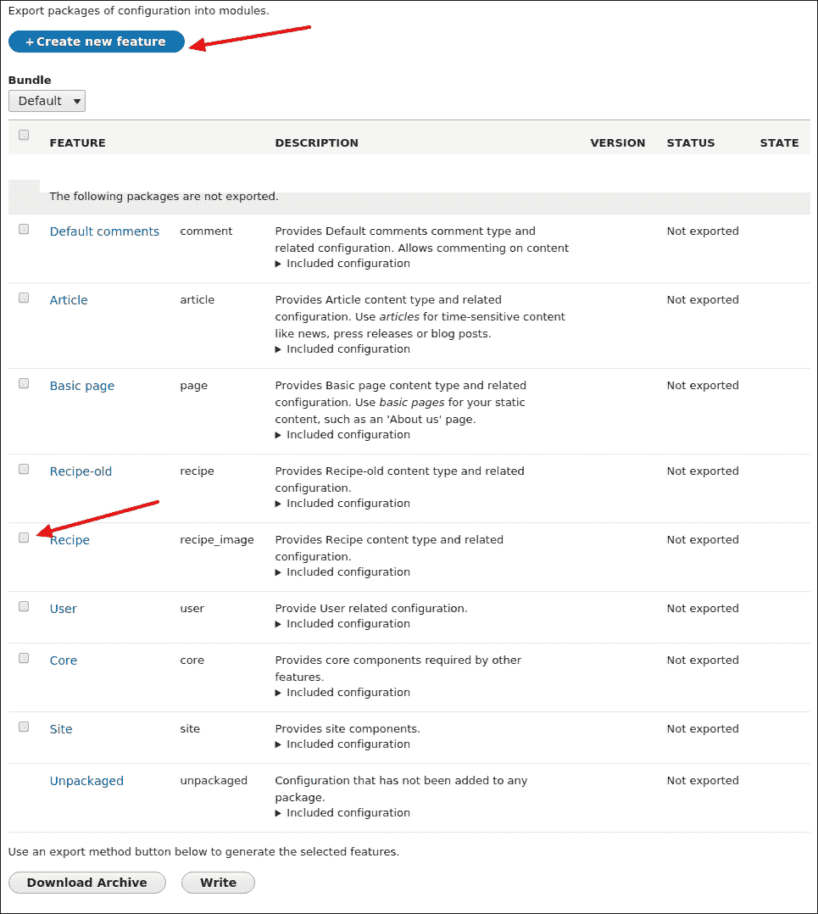

1.  接下来，点击 **DESCRIPTION** 列下的 **Included configuration** 链接，以查看 Recipe 功能。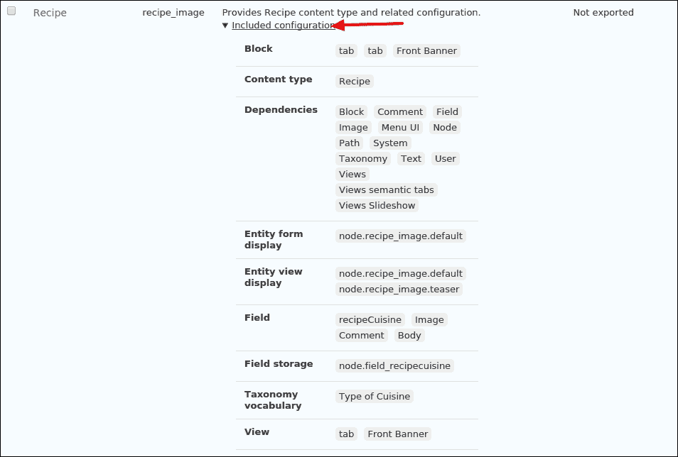

1.  在这里，我们可以了解此功能包含哪些配置。它有两个块（顶部食谱和前导横幅），三个视图以及其他我们寻找的字段相关配置。但我注意到**食谱按菜系**块缺失，因此我们将在下一步添加这个缺失的组件。

1.  现在点击**食谱**链接功能。在下一页，我们可以看到该功能的组件列表和一般信息：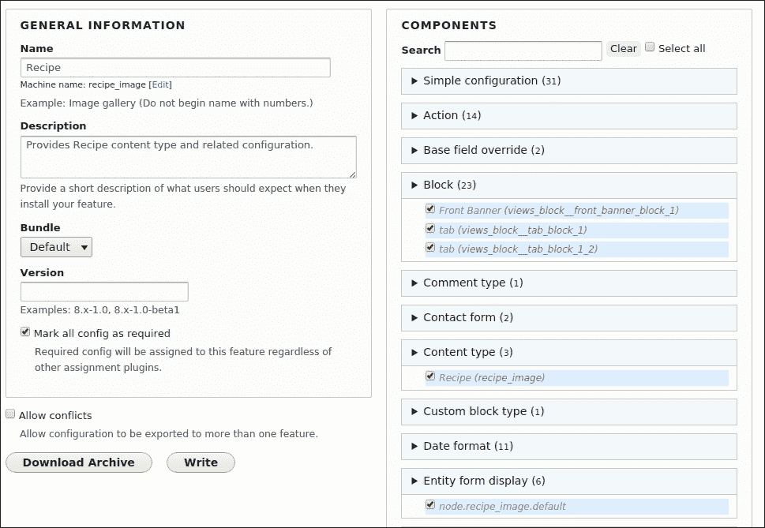

1.  在**组件**部分下面，搜索`recipes`。我们注意到在**块**部分下有**食谱按菜系：块 2（views_block__recipes_by_cuisine_block_2）**可见，并勾选该复选框：

1.  此外，在**视图**部分下，勾选**食谱按菜系（recipes_by_cuisine）**复选框。

1.  在**一般信息**部分，保留所有值默认，并将`8.x-1.0`输入为**版本**字段。点击**下载存档**按钮：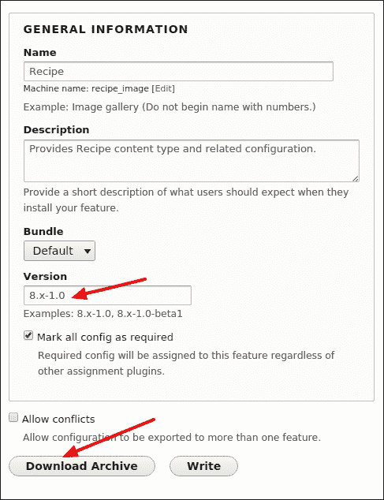

1.  我们可以看到`Recipe.tar.gz`已经下载。现在我们将这个文件提取到我们的`d8dev/module`目录下。打开 PhpStorm，查看以下截图所示的`.yml`文件和几个目录：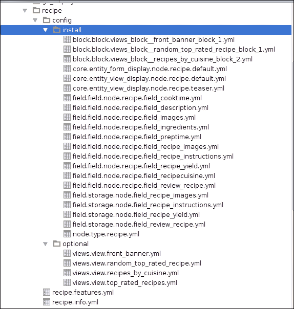

1.  我们可以看到有许多 YML 文件。所有这些文件都是视图、字段和食谱内容类型的配置文件。还有一个`info.yml`文件，因此我们可以将其用作模块。我们可以在任何已安装 Drupal 8 并安装了`views_semantic`和其他模块的其他环境中使用此模块。按照第一章，*设置 Drupal 开发环境*，安装另一个 d8dev 站点。

## *发生了什么？*

我们启用了功能模块，并了解了如何导出食谱内容类型及其字段。我们还了解了如何导出与食谱功能一起导出的视图和块。

# 与功能相比何时使用核心配置管理

在 Drupal 7 核心中，没有管理系统配置的系统，功能模块可以将配置数据作为代码打包导出和导入。功能模块用于配置管理和部署。由于以下问题，该模块并不真正适合：

+   导出配置的结构没有一致性

+   它覆盖并撤销内容管理器的修改

Drupal 8 引入了配置管理系统，可以处理此类问题，但这并不意味着我们不再需要 Features 模块。配置管理系统不适合将捆绑功能导出到其他环境、网站、客户或项目中。这就是我们仍然需要 Features 模块的原因。Drupal 8 的 Features 将返回其捆绑功能（如博客或图片库），而不仅仅是管理配置。此外，Features 允许我们以简化的方式选择和添加我们想要捆绑到包中的配置数据。此外，在开发过程中更新模块中存储的配置要容易得多。配置管理也存在一些问题：

+   将配置添加到模块是一个手动过程，意味着复制/粘贴 YML 数据。

+   模块仅提供初始配置文件。如果我们想更改配置文件，我们需要通过编写更新钩子来完成。

+   如果我们卸载一个模块，它不会删除所有配置。并且 Drupal 8 核心无法启用已存在配置的模块。

我的结论是，Features 模块在 Drupal 8 中仍然非常重要。该模块可以被标记为一个开发者模块，旨在帮助 Drupal 开发者在日常工作中打包功能，并在开发过程中轻松导入更改。

# 摘要

在本章中，我们更深入地了解了 Views 模块，并看到了一个优秀的 Views 插件以及一些自定义 CSS 如何使我们能够为 d8dev 网站创建一个非常吸引人的旋转横幅组件。

我们还了解了一些关于 Drupal `README.txt` 文件的信息，以及一个模块是如何从沙盒项目提升为完整项目的。

最后，我们学习了如何使用 Features 模块导出 Recipe 内容类型及其字段、块和视图作为模块，以便在其他环境中使用。我们还通过比较研究和确定何时使用这两个模块之一，来比较了配置管理系统与 Features 模块。

在下一章中，我们将介绍一些高级搜索概念，并指导您完成基于 Java 的 Apache Solr 搜索引擎的安装和 Drupal 集成。然后，我们将使用基于 Search API 模块的自定义分面搜索来增强我们的网站。
