# 第十一章. 使用 Search API 模块在您的网站上搜索

*在本章中，我们将探讨一个更强大、更灵活的搜索模块替代品，该模块包含在 Drupal 核心中。我们将介绍 Apache Solr 搜索服务器的安装，并探讨增强用户搜索体验的方法。*

在本章中，我们将学习：

+   如何根据您的需求选择合适的搜索配置

+   安装和配置 Search API 模块以替换 Drupal 核心搜索

+   使用两种不同的方法安装和配置 Apache Solr 搜索服务器

+   使用 Search API 模块设置搜索服务器和搜索索引

+   创建自定义的细分搜索块以增强用户的搜索体验

# Drupal 核心搜索

与 Drupal 7 类似，Drupal 8 核心自带内置的搜索模块。通过直接查询 Drupal 数据库，它提供了可用的搜索功能。Drupal 核心搜索允许您搜索用户资料和节点内容。它定期查询数据库以维护内容索引，无需任何先前的配置。

如果您只需要基本搜索功能且网站流量不大，Drupal 搜索可能适合您的需求。然而，它有几个功能限制，包括以下内容：

+   它使用 Drupal 数据库来执行其查询，这可能会给数据库增加额外的负载，而数据库可能已经是您网站上性能瓶颈的一部分

+   无法控制哪些节点被索引以供搜索

+   内容始终根据每个节点的默认显示模式进行索引

+   搜索只匹配节点的完整关键词

如果您介意这些限制中的任何一项，您应该切换到使用 Search API 模块。

除了允许对内容搜索和索引方式有更多的控制外，Search API 模块还提供了通过集成第三方搜索引擎来减轻 Drupal 数据库负载的选项。

如果您网站或其流量增加的复杂性已经达到数据库性能成为瓶颈的程度，您需要使用 Search API 模块与第三方搜索引擎结合使用，以便让 Drupal 数据库专注于其他事情。Apache Solr 是我们将在本章中使用的第三方搜索引擎的一个例子。

# Search API 模块

Search API 模块（[`www.drupal.org/project/search_api`](http://www.drupal.org/project/search_api)）用可以与不同类型的底层搜索引擎一起使用的框架替换了 Drupal 核心搜索。搜索引擎作为独立于 Drupal 网站及其数据库的第三方存在。

托马斯·赛德尔（也被称为“醉酒的猴子”）是 Search API 模块的主要贡献者之一。这是他对其起源的解释：

> *"搜索 API 是在 2010 年创建的。我参与了有关如何改进 Drupal 核心搜索模块并将其转变为 Drupal 8 框架的讨论。问题是 Drupal 中没有搜索框架，所有与搜索相关的模块都必须反复包含相同的样板代码。我取了那次讨论的最好部分，并将其转化为 Drupal 7 的贡献模块和搜索框架。"*

搜索 API 模块可以通过其他贡献的模块进行扩展，以提供非常强大的搜索功能。搜索 API 还与视图模块集成，这使得您可以根据用户输入的搜索词创建视图列表页面。

我们稍后将要使用的 Apache Solr 搜索引擎是开源的、快速的，并且具有许多功能。然而，在不使用搜索引擎的情况下，我们也有继续使用搜索 API 模块查询 Drupal 数据库的选项。这有一个优点，即我们可以根据搜索 API 设置任何所需的复杂配置，而无需在我们的开发环境中安装搜索引擎。然后，当我们将网站部署到生产环境时，我们可以切换到使用搜索引擎，并且最小化重新配置。

我们将首先设置搜索 API 模块以使用 Drupal 数据库进行搜索。这将使我们能够探索搜索 API 模块提供的一些功能和概念。稍后，我们将切换到使用 Apache Solr 搜索引擎与搜索 API，并探索一些更强大的搜索功能。

# 行动时间 - 搜索 API 模块的基本安装和配置

在以下步骤中，我们将下载、安装和配置搜索 API 模块：

1.  首先，使用您习惯的方法下载`search_api`模块。如果您已安装 Drush，如第五章中“移动优先，响应式设计”部分所述，您将能够在命令行中键入以下内容：

    ```php
    $ drush dl search_api
    $ drush en search_api

    ```

1.  在我们继续之前，我们应该遵循 Drupal 的建议卸载被搜索 API 模块替换的核心搜索模块。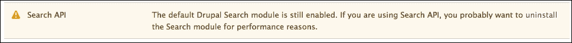

    如果您通过 Drush 安装模块，您将通过命令行消息得到通知，或者该消息将出现在**报告** | **状态报告**的**状态报告**页面上。禁用核心搜索模块将删除搜索块以及内容和用户的搜索页面。不要慌张，我们将替换它们。要使用 drush 安装核心搜索模块，请键入：

    ```php
    $ drush pm-uninstall search

    ```

1.  搜索 API 本身并不做任何事情——我们需要给它一个搜索引擎来交互。为此，我们将使用一个子模块，您将作为`search_api`的一部分下载，称为`search_api_db`。现在使用您习惯的方法启用它。

    `search_api_db`模块允许搜索 API 直接与 Drupal 数据库交互。这具有设置简单、易于配置的优点，在小型网站上，如果数据库本身没有显著的负载，您可以在生产服务器上使用这种方法进行搜索。

1.  `search_api_db`模块包含一个非常实用的子模块，该子模块设置了一些合理的默认配置。然后您可以使用这个配置作为您搜索设置的起点。为了利用这一点，启用`search_api_db_defaults`，然后再次禁用它。所有配置都是在模块最初启用时发生的，并在您禁用模块时保持不变。

1.  如果您现在导航到**配置** | **搜索和元数据** | **搜索 API**，您应该会看到一个类似于以下屏幕的界面：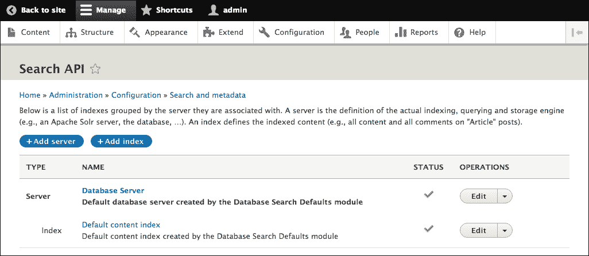

## *刚才发生了什么？*

您下载并安装了搜索 API 模块，并使用其子模块之一安装了一些默认配置。现在我们可以看到这个配置包括一个搜索服务器和一个搜索索引，我们将探讨这意味着什么。

在接下来的几节中，我们将回顾由`search_api_db_defaults`模块设置的默认设置的一些方面。请注意，我们使用的一些设置和屏幕布局可能在后续版本的模块中发生变化。我们不会涵盖所有设置，但希望足以让您开始根据自己的需求定制设置。

## 搜索服务器和搜索索引的解释

在 Drupal 术语中，搜索服务器定义了可搜索数据的索引方式。这包括在您的 Drupal 网站上如何查询它以及搜索索引是如何存储的。这些事情是由您为搜索服务器选择的*后端*决定的。在本章中，我们将探讨使用 Drupal 数据库作为后端和 Apache Solr 搜索引擎作为后端的搜索服务器。然而，您还可以使用其他后端，这将定义您的数据如何被查询和索引的其他方式。

搜索索引定义了索引过程。搜索索引与一个之前配置好的用于提供动力的搜索服务器相关联。搜索索引设置决定了诸如在您的网站上哪些内容被索引、哪些字段被索引以及数据在搜索前后处理的各种方式。

通过将配置拆分为搜索服务器和搜索索引，可以在保持数据查询和索引方式的同时更换执行工作的搜索引擎。这有点类似于能够在保持车辆外观和驾驶感受不变的情况下，将您的汽车汽油发动机更换为柴油发动机。

还有可能有多个搜索服务器，并选择在网站开发中的哪个阶段或你正在工作的哪个环境中使用最合适的搜索服务器。

为了进一步扩展搜索配置，也可以有多个搜索索引。想象一下，未来的某个时刻，你的食谱网站如此受欢迎，以至于你开始在网站上销售你的食谱书籍。你可能希望有一个单独的搜索索引，只包含书籍的详细信息，这样当用户在单独的搜索框中输入`印度`时，他们只会在搜索结果中看到与印度烹饪相关的烹饪书籍。你的两个搜索索引仍然可以基于具有 Apache Solr 后端的搜索服务器。

## 搜索服务器

在前一步配置了搜索 API 模块后，你将在搜索 API 配置表中看到第一个列出的是名为数据库服务器的搜索服务器。正如其名所示，这是一个基于 Drupal 数据库作为后端的服务器。

在操作列中点击**编辑**，你将被带到数据库服务器配置：

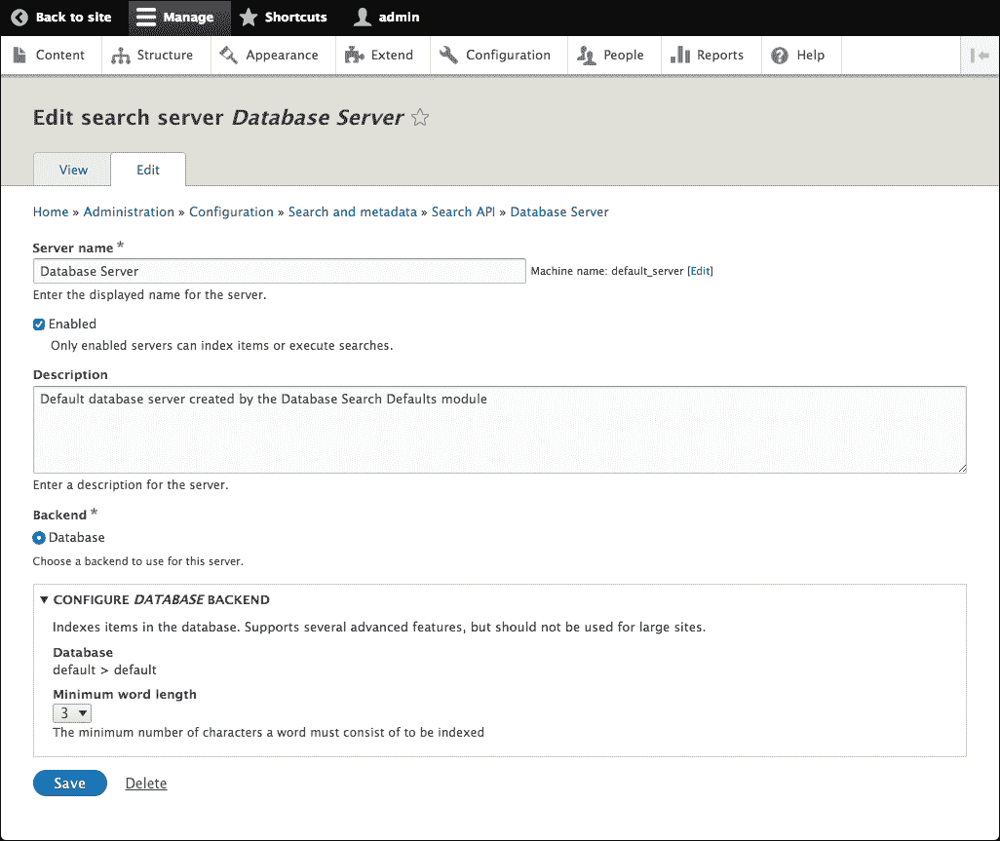

服务器配置相当直观。服务器有一个名称，并且应该通过复选框启用。它还有一个后端，在这个例子中是数据库，由我们的`search_api_db`模块提供。你还可以设置用于搜索的单词的最小字母数。

接下来，我们将查看默认内容索引的配置。

## 搜索索引

我们现在需要我们的搜索索引设置。搜索索引的配置也在搜索 API 页面的**配置** | **搜索和元数据** | **搜索 API**。点击**默认内容索引**旁边的**编辑**，以查看配置页面：

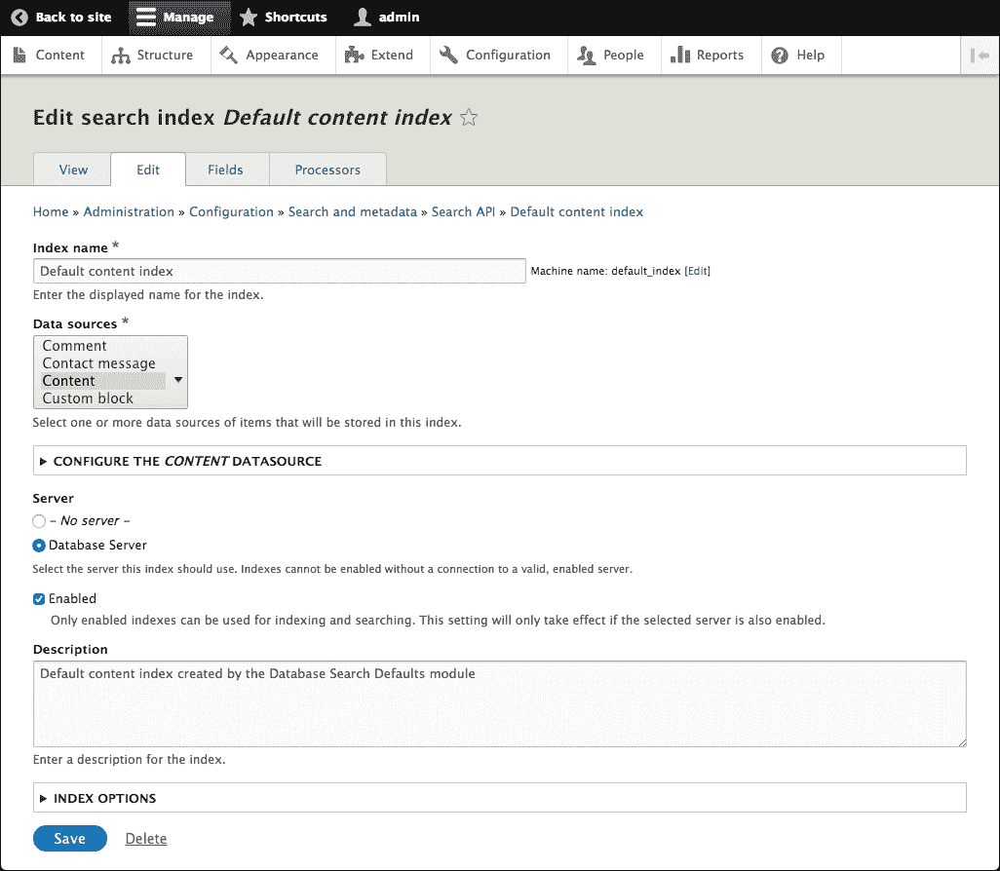

你会看到有多个数据源可供索引。我们不仅仅限于用户和节点内容，就像我们在 Drupal 核心搜索中做的那样。目前我们只索引内容，因为默认配置中已经选择了它。

你还会注意到搜索索引是通过单选按钮选择与搜索服务器链接的。在这种情况下，**服务器**字段设置为**数据库服务器**，因为我们目前只设置了这一个。

## 字段

然后，转到页面顶部的**字段**标签页。这是我们设置每个数据源上哪些字段实际上会被索引的地方：

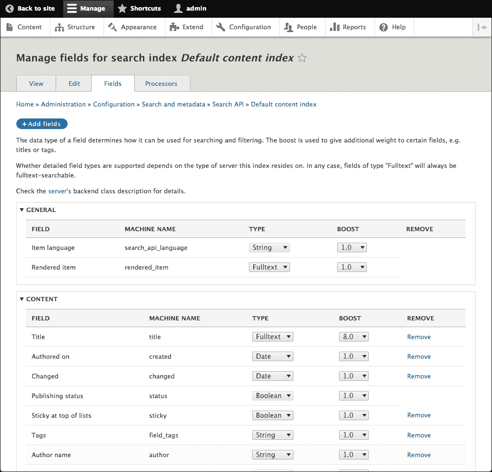

在**常规**表中，你会看到**项目语言**和**渲染项**列出。这些是所有可搜索数据源共有的属性。**渲染项**字段允许你根据实体在 Drupal 中渲染的样子进行全文搜索。

在页面底部的**内容**表中，你会看到节点共有的字段。对于字段配置页面上的每个字段，你可以设置提升值，这控制了在排序搜索结果时，该字段中的搜索匹配项的相对重要性。

## 处理器

处理器在搜索和索引过程中的不同点对数据或查询进行操作，并做出更改。进程有自己的标签页，可以在其中进行配置。

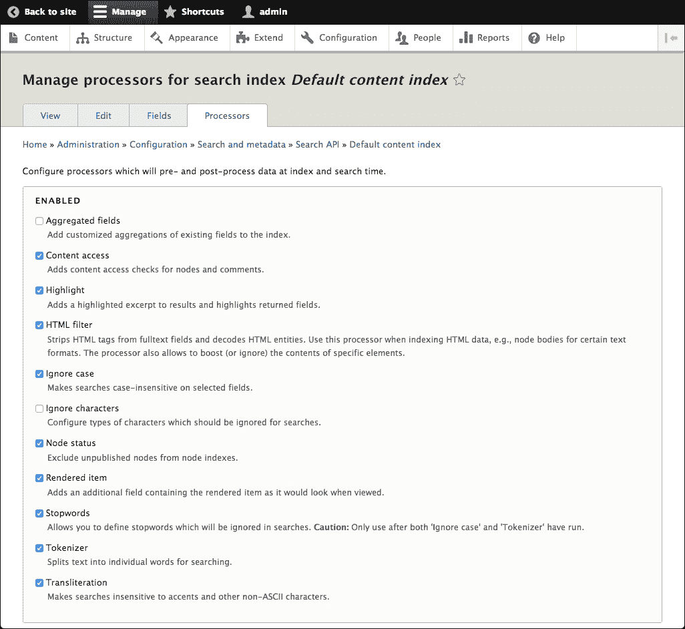

在页面中间，你可以看到处理器顺序表，它允许你控制处理器运行的顺序：

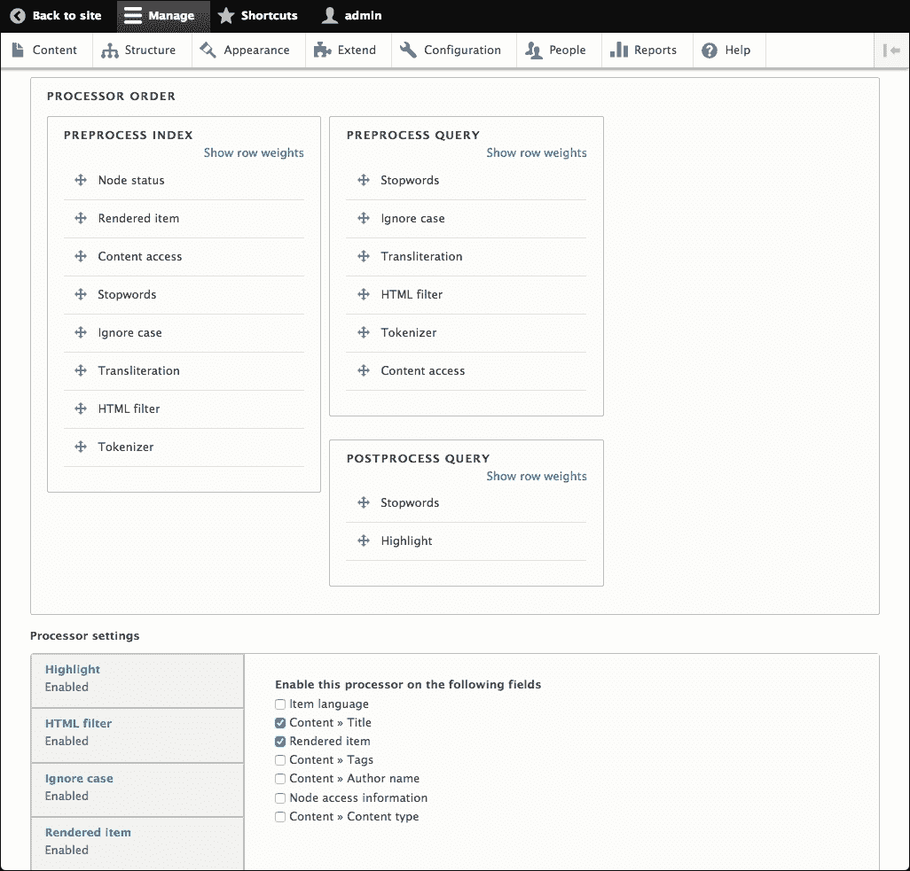

例如，**渲染项**处理器，它将整个要搜索的实体组装起来，必须在数据被索引之前运行。像高亮显示这样的处理器，它将显示在搜索结果上以显示你搜索的术语，是在查询执行之后发生的，所以你会注意到这一点位于**后处理查询**部分。

如果你正在修改处理器，请特别注意页面底部的垂直标签页中的**处理器设置**。这是配置每个处理器确切行为的地方。如果启用的处理器没有按照你预期的行为，那么这些设置应该是你的首要考虑。

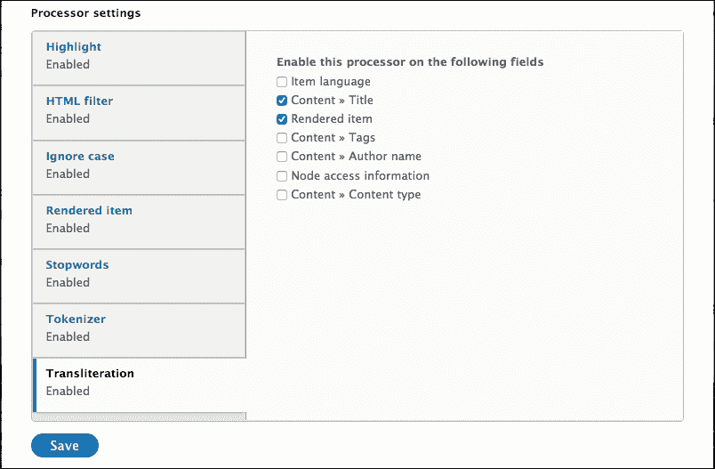

## 填充你的搜索索引

现在我们已经设置了我们的搜索后端和搜索索引，我们需要使用它们来索引我们网站上的内容。

可以通过点击**默认内容索引视图**标签页底部的**立即索引**按钮来执行内容的批量索引。当你内容被索引时，你会看到一个蓝色进度条来显示进度，然后你会返回到内容索引视图标签页。

在`cron`运行期间也可以索引内容。触发`cron`运行的一种方法是通过`drush`命令：

```php
$ drush cron

```

每次运行`cron`时索引的内容节点数默认为 50。如果你有 50 个或更少的内容项，蓝色进度条应该在一次`cron`运行后显示 100%。如果你有更多内容，你可能需要运行几次`cron`才能全部索引。你可以在搜索设置的**编辑**标签页上调整每次`cron`运行要索引的节点数（即`cron`批量大小）。滚动到页面底部并展开**索引选项**，你将能够调整此值：

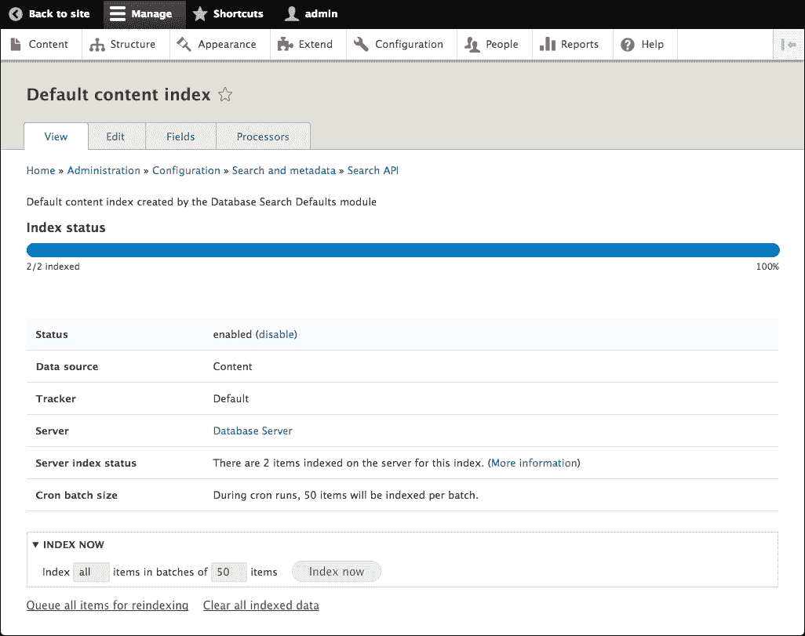

无论你是运行了`cron`还是点击了**立即索引**按钮，你的内容现在应该已经被索引。

你会注意到在内容索引视图标签页的底部有一些链接，可以提供一些额外的控制来管理你的内容索引：

+   **将所有项目排队以重新索引**将当前索引的内容项标记为准备好在下次`cron`运行或您点击**立即索引**时再次索引。在内容重新索引被触发之前，当前搜索索引将继续被使用。这有助于确保用户在内容必须重新索引时也能不间断地进行搜索。

+   **清除所有索引数据**将当前搜索索引立即变为不可用，并且搜索将停止产生结果，直到内容被重新索引。

# 向用户展示搜索

因此，我们现在有一个包含内容的搜索索引，但如何实际上允许最终用户在我们的 Drupal 网站上执行搜索呢？

搜索 API 的一个特性是它与视图模块很好地集成。这意味着您可以使用您设置的搜索服务器搜索内容，并在视图中显示它。您之前使用的`search_api_db_defaults`模块提供了一些视图配置，实现了配置的搜索索引和搜索服务器。

要查看此视图，请访问您网站上的`/search/content`。尝试搜索特定单词的内容，并检查您是否得到合理的结果。您应该会发现，如果您有两个内容项，其中一个标题中有您的搜索关键字，另一个在正文文本中有，搜索结果将根据您在之前搜索索引设置部分的**字段**选项卡中设置的增强值进行排序。默认情况下，标题字段的增强值为八，而渲染项的增强值为一。因此，标题中包含您的关键字的 内容应该出现在正文或其它地方包含您的关键字的 内容之前。

为了更好地复制我们之前为了使用搜索 API 而禁用的 Drupal 核心搜索功能，有一个可以显示在全站范围内的搜索字段会很好，这样用户就不需要导航到`/search/content`来执行搜索。

为了实现这一点，我们将以块的形式显示搜索表单。导航到**结构** | **视图**，然后点击**搜索内容**视图旁边的**编辑**按钮。展开**高级**部分，将**块中显示表单**从**否**切换到**是**。点击**保存**按钮：

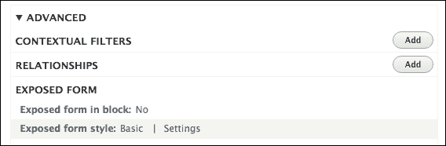

出现在我们新搜索结果页面顶部的暴露搜索字段现在可以在一个我们可以配置以出现在我们网站页面上的块中。转到**结构** | **块布局**，然后点击您想要放置该块的区域的**放置块**旁边的按钮。在出现的列表中，您将看到块**暴露表单：search_content-page_1**。以通常的方式配置块设置：

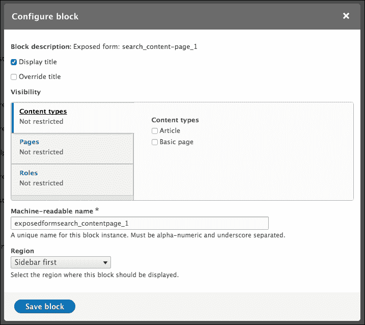

您现在应该有一个全站搜索块，它替换了我们之前移除的核心搜索块。

## 修改搜索显示

搜索 API 的一个优点是，你可以通过内容类型显示设置来控制搜索结果中每个项目的显示方式。你会注意到搜索内容视图使用的是**搜索结果高亮输入**的节点显示模式。

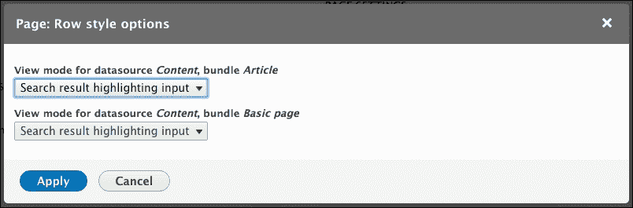

这是一个由**search_api_db_defaults**提供的节点显示模式。你可以从每个内容类型的设置中更改此显示模式的设置。

前往**结构** | **内容类型**，选择你想要更改显示设置的特定内容类型，然后转到标签**管理显示** | **搜索结果高亮输入**：

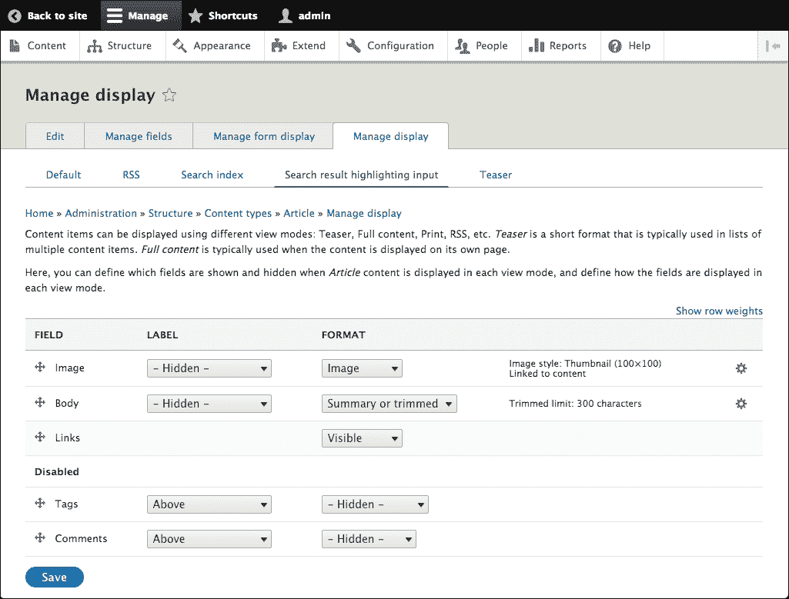

尝试更改在搜索结果中显示的内容类型的字段。例如，尝试隐藏图片并将**正文格式**设置为**截断**，截断限制为 400 个字符。

你现在应该得到类似以下截图的搜索结果：

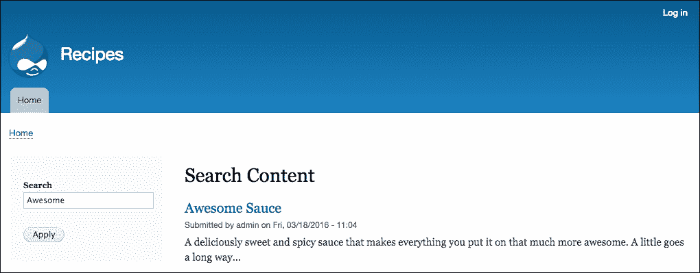

## 排除实体不被索引

到目前为止，我们已设置的配置将使你网站上的所有节点都被索引并可搜索。如果我们想选择是否将我们在网站上创建的个别菜谱显示在搜索结果中，会怎样呢？也许我们想创建指向特殊菜谱的促销链接，这些菜谱无法通过网站搜索获得。

嗯，有一个名为 Search API Exclude Entity 的模块可以做到这一点（[`www.drupal.org/project/search_api_exclude_entity`](https://www.drupal.org/project/search_api_exclude_entity)）。当你下载并安装它时，你会发现有额外的字段类型可以添加到你的节点和其他实体中。如果你将此字段添加到你的菜谱内容类型中，那么当你下次创建或编辑菜谱时，你会在菜谱编辑屏幕上注意到一些额外的元数据选项：

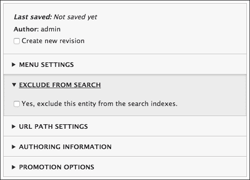

接下来，前往你的搜索索引的**处理器**配置：**配置** | **搜索和元数据** | **搜索 API**。点击**默认内容索引**旁边的**编辑**，查看配置页面，然后选择**处理器**标签。你会看到有一个新的搜索 API 排除实体可以启用。一旦启用了此处理器，滚动到屏幕底部的**处理器设置**部分，并检查你刚刚添加到内容类型中的字段名称旁边的复选框。

尝试创建一个新的菜谱并将其排除在搜索之外。检查所有内容是否已被索引，然后搜索你的新菜谱。你应该会发现它没有出现在搜索结果中。

# 安装 Apache Solr 作为搜索后端

使用搜索 API 而不是核心搜索模块的主要原因是我们可以插入不同的搜索引擎并使用它们来索引你的内容。当我们开始处理包含大量内容的网站时，这确实成为一种优势。

Apache Solr 是一个开源搜索引擎，被许多知名企业级网站使用。它不是 Drupal 或 Drupal 模块的一部分，并且通常独立于 Drupal 使用。然而，它与 Drupal 搜索 API 模块很好地集成，正如我们将看到的。

与使用数据库的搜索 API 相比，Solr 具有以下优势：

+   它更快

+   它不依赖于你的 Drupal 数据库，从而为 Drupal 释放数据库资源以完成其余工作

+   它可以托管在独立于你的数据库和代码库的服务器上，这在需要扩展你的基础设施时非常有用。

+   你可以搜索短语并使用通配符

我们将在本章后面检查这些相同的默认设置。同时，如果你想了解更多关于 Apache Solr 项目的信息，请访问其网站 [`lucene.apache.org/solr/`](http://lucene.apache.org/solr/)。

安装 Solr 有几种不同的方法。在这里，我们将解释两种方法，一种使用虚拟机和 puppet 脚本，另一种更手动的方法使用 Ubuntu 14.04 服务器。

### 注意

如果你遵循这两种方法中的任何一种，Apache Solr 默认不会阻止未经授权的用户访问你的 Solr 服务器。如果你在本地机器之外设置 Solr 服务器，或者可以通过互联网连接，那么使用某种方法来保护 Apache Solr 非常重要。否则，未经授权的用户将能够进行搜索查询，甚至可能以其他方式损害你的网站。请参阅本章的 *使用 Uncomplicated Firewall 保护 Apache Solr* 部分，了解如何保护 Solr。

## 在使用 Vagrant 和 Puppet 的虚拟机上安装 Solr 4.x

这是一个快速简单的方法来设置一个可丢弃的虚拟机，你可以用于本地开发目的。它将表现得与真实服务器上的 Solr 实例完全相同，你可以稍后设置它。

在第一章中介绍了用于生成 Puppet 部署配置的有用在线服务，*设置 Drupal 开发环境*。这个工具叫做 PuPHPet——中间的 PHP 字母大写以表明它主要用于 PHP 网络开发。在撰写本文时，PuPHPet 上可用的 Apache Solr 最新版本是 4.10.*。因此，以下说明将假设你正在使用 Solr 的 4.x 版本。

如果你真的需要 Solr 的最新和最佳版本，你可以跳到下一节，我们将解释如何在 Ubuntu 14.04 服务器上手动安装 Solr。

# 动手时间 - 创建和配置你的虚拟机

以下步骤将使用在线服务创建一个你可以使用 Vagrant 在本地启动虚拟机的 Puppet 脚本。Puppet、Vagrant 和 PuPHPet 网站在本书的第一章中介绍，*设置 Drupal 开发环境*。如果你还没有在本地设置 Puppet 和 Vagrant，请按照那里的说明来设置它们。

1.  在 PuPHPet 上创建你的虚拟机。将你的浏览器指向[`puphpet.com/`](https://puphpet.com/)并点击那个大绿色的**立即开始**按钮：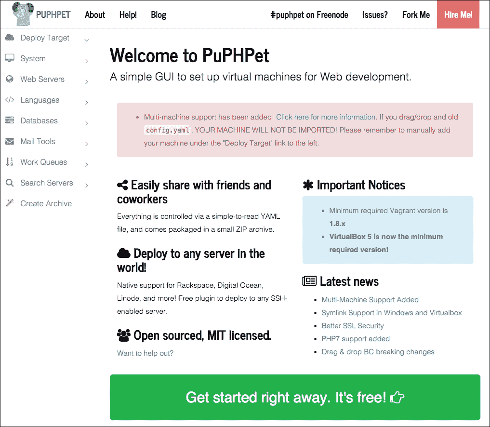

    在你将被引导的向导过程中，你通常可以接受默认选项。只需确保当你到达**搜索服务器**部分时，你选择安装最新的 4.*版本的 Apache Solr。我们还将快速查看这里的一些其他选项，以创建一个干净、可重复使用的虚拟机。

    在点击**开始**按钮后的向导的第一页，确保你已经勾选了**部署到本地主机**，并且选择 VirtualBox 作为提供者。我们还将选择 Ubuntu Trusty 14.04 LTS x64 作为发行版：

    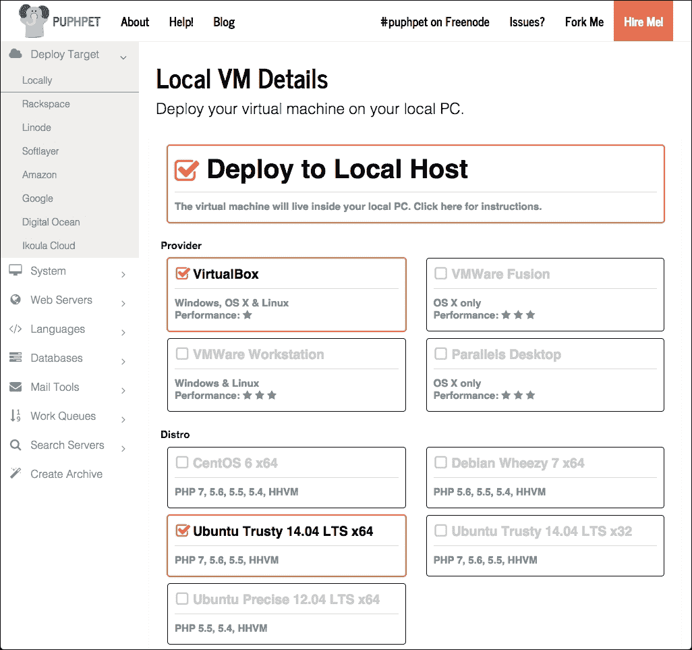

    如果你继续向下滚动这个页面，你会找到设置**内部标识符**、**主机名**和**IP 地址**的选项。如果你已经运行了其他虚拟机并且需要区分它们，你可能想要更改这些设置。

    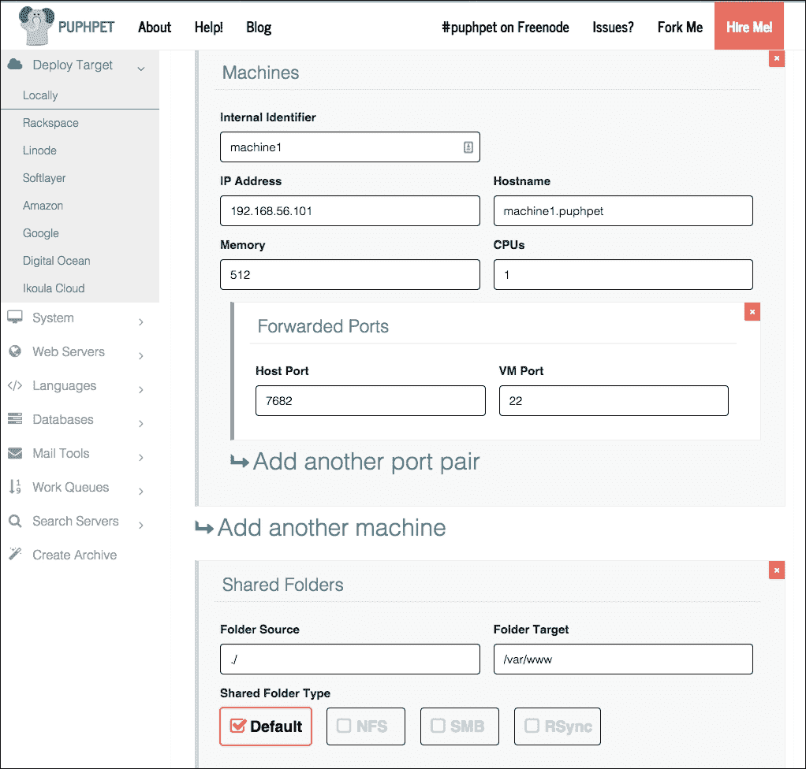

    同样重要的是，你有一个文件夹，它将在你的物理主机机器和你创建的虚拟机之间共享。默认情况下，这是为你配置好的。

    使用屏幕底部的绿色大按钮遵循向导，并接受**系统**部分的其余默认设置。

    当你到达**Web 服务器**部分时，你可以取消选择 Apache 和 Nginx（Apache Solr 不需要它们中的任何一个）。在**语言和数据库**部分的所有选项也可以取消选择——Solr 不需要这些中的任何一个。

    继续通过向导前进，继续接受进一步的默认设置，直到你到达**搜索服务器**。选择**Apache Solr**并从下拉框中选择最新版本：

    

1.  下载并设置你的虚拟机。现在你可以点击**创建存档**按钮下载一个包含你刚刚设置的 Puppet 配置的 ZIP 文件。

    如前所述，在 第一章 “设置 Drupal 开发环境”中，您现在可以通过解压 ZIP 存档，在命令行中导航到解压的文件夹（其中将包含一个名为 `Vagrantfile` 的文件），并键入以下命令来运行您的虚拟机：

    ```php
    $ vagrant up

    ```

    第一次启动虚拟机时需要一些时间，因为它需要下载包含操作系统的大型磁盘镜像。在此过程中，您应该在命令行中收到一些详细的输出，告知您正在发生的事情。

    如果一切运行正确，您现在应该能够打开浏览器并导航到 `http://localhost:8983/solr`。如果不起作用，请通过滚动回您的命令行输出并检查哪个本地端口已转发到 `8983`（Apache Solr 端口）来检查端口号是否正确。

    您现在应该在浏览器中看到以下内容：

    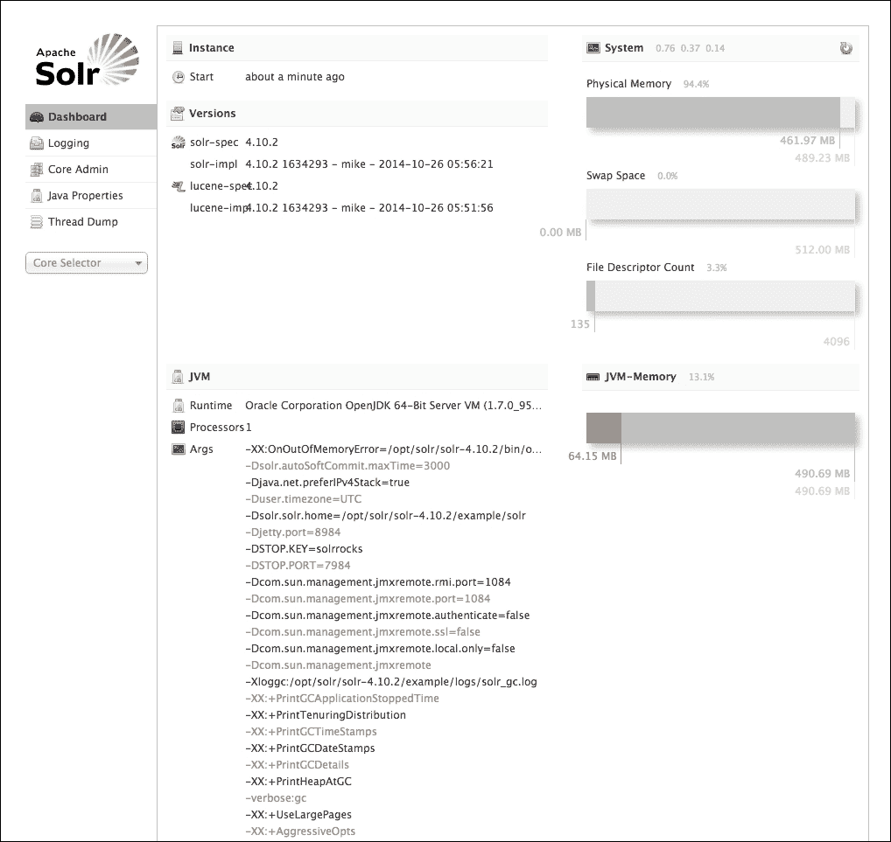

1.  安装 Drupal 架构。Apache Solr 现已安装到您的虚拟机中，您可以通过浏览器连接到它。恭喜！

    但除非我们给它一些要索引和搜索的内容，否则它将没有太大用处。我们需要将其连接到我们的 Drupal 网站。完成此操作的第一步是安装正确的配置文件，这些文件告诉 Solr 如何索引 Drupal 内容。

    下载并解压 Drupal 8 的 `search_api_solr` 模块。将其放入您网站的 `/modules` 文件夹中，但暂时不要启用它。Vagrant Solr 实例所需的配置文件可以在 Drupal 的 `search_api_solr` 模块中的 `search_api_solr/solr-conf/4.x` 找到。

    要将这些文件复制到您的虚拟机中，请将 `4.x` 文件夹复制到之前提取的 Vagrantfile 所在的 `puphpet` 文件夹中。

    接下来，通过导航到包含 Vagrantfile 的文件夹并在其中键入以下命令来 SSH 进入您的虚拟机：

    ```php
    $ vagrant ssh

    ```

    您将通过 SSH 登录到您的虚拟机，就像它是一个远程服务器一样。

    您复制的配置文件所在的 `puphpet` 文件夹在物理主机机器和虚拟机之间是共享的。您可以在虚拟机上的 `/var/www/puphpet/4.x` 找到 `4.x` 文件夹。首先，备份原始 Solr 配置，然后将新配置移动到您的 Solr 实例中的 `/opt/solr/solr-4.10.2/example/solr/collection1/conf`：

    ```php
    $ sudo cp -r /opt/solr/solr-4.10.2/example/solr/collection1/conf /opt/solr/solr-4.10.2/example/solr/collection1/conf-orig
    $ mv /var/www/puphpet/4.x/* /opt/solr/solr-4.10.2/example/solr/collection1/conf/

    ```

    现在，我们将重新启动 Solr。一个简单的方法是直接重新启动整个虚拟机。

    接下来，退出 SSH 终端：

    ```php
    $ exit

    ```

    然后停止虚拟机：

    ```php
    $ vagrant halt

    ```

    然后再次启动它：

    ```php
    $ vagrant up

    ```

    通过在浏览器中再次访问 Solr 管理页面来检查一切是否运行正确。

    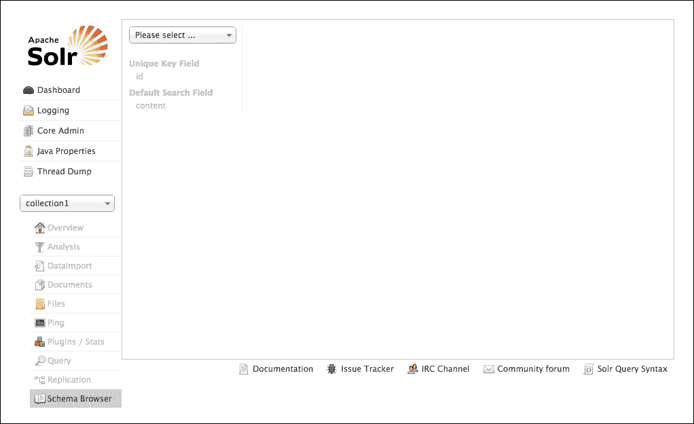

    从侧边栏的下拉菜单中选择 **collection1**，然后点击侧边栏底部的 **Schema Browser**。在随后出现在页面主要内容区域的下拉菜单中，您应该会看到一些与 Drupal 相关的 **字段**、**bundle_name**、**entity_id**、**entity_type** 等等。

    接下来，您需要在 Drupal 中启用和配置 `seach_api_solr` 模块。要执行此操作，请跳转到“搜索 API Solr 模块”部分。

## *刚才发生了什么？*

您使用 Vagrant 和 Puppet 来设置运行 Apache Solr 的虚拟机。然后，您通过安装随 Drupal 搜索 API Solr 模块提供的配置文件来配置 Solr 服务器以与 Drupal 一起工作。当您在 Apache Solr 上进行实验和开发时，此虚拟机配置可以反复使用。

## 在 Ubuntu 14.04 上手动安装 Solr 5.x

如果以下任何一项适用，请使用此方法：

+   您希望拥有比 PuPHPet 上可用的 Apache Solr 更新的版本

+   您需要在本地机器之外的服务器上运行 Solr

+   您希望在安装过程中有更多的控制权

这些说明将假设您正在 Ubuntu 4.x 箱子上安装 Solr 5.x。这可能就是您的网站正在运行的服务器，或者是一个专门用于 Solr 的服务器。

Ubuntu 软件仓库中可用的 Solr 版本比当前版本低一个主要版本。我们不会简单地使用 Ubuntu 的 apt 软件包管理工具来安装早期版本，而是会遵循一种允许我们安装最新 5.x 版本 Solr 的方法。

# 是时候采取行动——在 Ubuntu 上安装和配置 Solr

首先，我们将安装一些必需的软件包，然后从 Apache Solr 网站手动安装最新版本的 Solr：

1.  安装必需的软件包。首先，使用 `apt-get` 确保您有 `python-software-properties` 软件包可用。这将允许您添加一个新的软件包仓库：

    ```php
    $ sudo apt-get install python-software-properties

    ```

    现在，添加非官方的 Java 安装程序仓库：

    ```php
    $ sudo add-apt-repository ppa:webupd8team/java

    ```

    当提示时，确认您想要添加此仓库，然后更新源软件包列表：

    ```php
    $ sudo apt-get update

    ```

    我们现在可以安装 Oracle Java JDK 版本 8：

    ```php
    $ sudo apt-get install oracle-java8-installer

    ```

    这是一个 Oracle 软件包，您必须同意许可条款才能继续。当提示时，只需按 *Enter* 键。

1.  运行 Apache Solr 安装程序。现在我们已经安装了 Java JDK，我们可以安装 Apache Solr 的最新版本。转到可从 [`www.apache.org/dyn/closer.lua/lucene/solr/`](http://www.apache.org/dyn/closer.lua/lucene/solr/) 下载 Solr 的镜像列表。

    选择一个镜像，然后选择以 `5.*` 开头的最新版本号目录。

    接下来，右键单击最新版本的 `.tgz` 文件（文件名中不包含 `src`），并复制其链接。在撰写本文时，这是 `solr-5.5.0.tgz`，下面的命令中的版本号将替换为您下载的版本。

    回到您正在安装 Solr 的服务器的命令行，将文件下载到您的家目录，并解压它：

    ```php
    $ cd ~
    $ wget http://<download_path>/solr-5.5.0.tgz
    $ tar -xvzf solr-5.5.0.tgz

    ```

    Solr 5.x 附带自己的安装脚本，这使得它比以前的版本更容易设置。我们将按以下方式运行脚本：

    ```php
    $ sudo bash solr-5.5.0/bin/install_solr_service.sh solr-5.5.0.tgz

    ```

    当它启动时，Solr 将输出它正在运行的端口号，通常是 `8983`。打开浏览器窗口，导航到服务器的 IP 地址后跟端口号。例如：`http://<服务器 IP 地址>:8983`。

    您应该会看到以下 Solr 管理界面：

    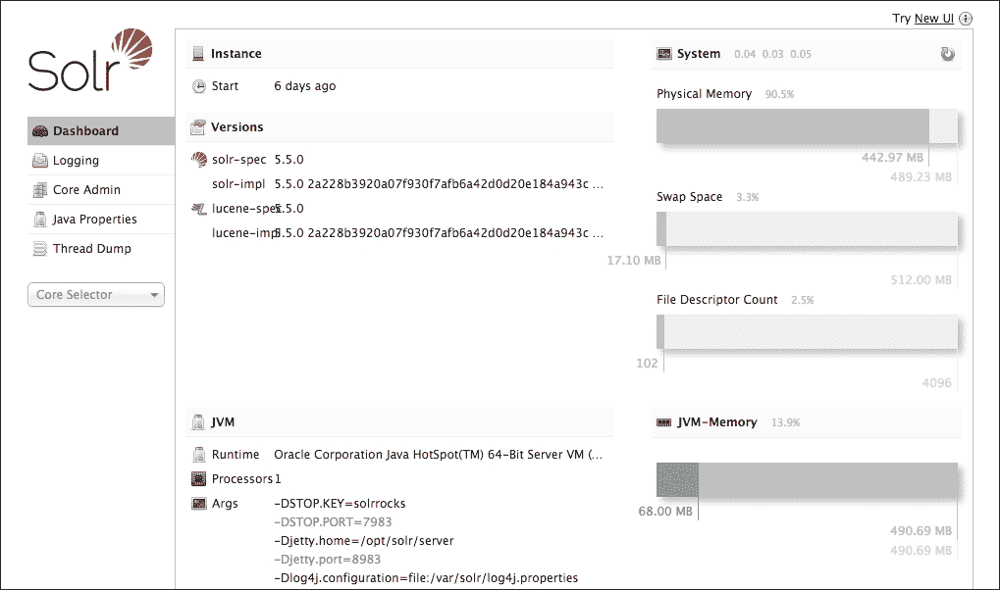

    ### 注意

    确保您特别注意本章的以下部分 *使用简单防火墙保护 Apache Solr*，以确保没有未经授权的访问您的 Solr 接口。

1.  安装 Drupal 架构。Apache Solr 现已安装到您的虚拟机中，您可以通过浏览器连接到它。恭喜！

    然而，除非我们给它一些内容来索引和搜索，否则它将没有太大用处。我们需要将其连接到我们的 Drupal 网站。完成此操作的第一步是安装正确的配置文件，这些文件告诉 Solr 如何索引 Drupal 内容。

    使 Solr 与 Drupal 一起工作的所需配置文件可以在 `search_api_solr` 模块中找到。导航到 Drupal 上的模块页面以获取最新打包的 `tar.gz` 文件的链接。将其下载到您的 Apache Solr 服务器并解压文件：

    ```php
    $ cd ~
    $ wget https://ftp.drupal.org/files/projects/search_api_solr-8.x-1.0-alpha2.tar.gz
    $ tar -xvf search_api_solr-8.x-1.0-alpha2.tar.gz

    ```

    您将需要将前面命令中的文件名替换为模块的最新版本文件名。

    接下来，创建一个目录，您将复制 Solr 配置文件到该目录：

    ```php
    $ sudo mkdir -p /var/solr/data/drupal/conf

    ```

    将 Drupal 模块中的文件复制到 Solr 配置目录：

    ```php
    $ sudo cp search_api_solr/solr-conf/5.x/* /var/solr/data/drupal/conf/

    ```

    设置文件的正确所有权：

    ```php
    $ sudo chown -R solr:solr /var/solr /opt/solr

    ```

    创建一个新的 Solr 核心库：

    ```php
    $ sudo /opt/solr/bin/solr create -c drupal

    ```

    重新启动 Solr 服务：

    ```php
    $ sudo service solr restart

    ```

    再次在浏览器中导航到 Solr 管理界面。在侧边栏的 **核心选择器** 下拉菜单中，您现在应该有一个名为 **drupal** 的核心：

    

## *发生了什么？*

您已使用包管理器在 Ubuntu 上安装了 Apache Solr 的最新版本。这是您在将 Solr 从头开始在生产服务器上设置时将使用的流程。只需确保您也保护它即可！

# 使用简单防火墙保护 Apache Solr

保护 Apache Solr 非常重要，以防止外部访问。如果您的 Solr 服务器可以通过互联网或甚至通过您的本地网络访问，您应该采用一种控制对它的未经授权访问的方法。

# 是时候采取行动——配置简单防火墙

在 Ubuntu 上，您可以使用内置的简单防火墙工具在防火墙级别设置对服务器的访问权限：

1.  首先拒绝所有访问：

    ```php
    $ sudo ufw default deny

    ```

    然而，我们不想打断我们目前正在使用的 SSH 连接，所以请确保我们允许 SSH 连接的访问：

    ```php
    $ sudo ufw allow ssh

    ```

    此外，我们希望允许来自我们本地 IP 地址的所有连接：

    ```php
    $ sudo ufw allow from <ip address>

    ```

    在这里，`<IP 地址>`是您连接的机器的 IP 地址。如果您要连接的 Drupal 服务器的 IP 地址与 Solr 服务器不同，您还需要在这里添加 Drupal 服务器的 IP 地址。只需再次运行前面的命令，将 IP 地址更改为您的 Drupal 服务器。有关更多详细信息，请参阅 Ubuntu UFW 文档：[`help.ubuntu.com/community/UFW`](https://help.ubuntu.com/community/UFW)。

1.  现在启用防火墙，使用以下设置：

    ```php
    $ sudo ufw enable

    ```

    您可能会收到一个警告，表示现有的 SSH 命令可能会被中断。只要您已经使用我们之前运行的命令允许了 SSH 连接的访问，您就可以继续操作。

1.  现在检查您的防火墙状态：

    ```php
    $ sudo ufw status

    ```

1.  您应该会收到如下所示的输出：

    ```php
    Status: active

    To               Action      From
    --               ------      ----
    22               ALLOW       Anywhere
    Anywhere         ALLOW       <ip address>
    22 (v6)          ALLOW       Anywhere (v6)

    ```

现在，你应该能够从您的本地机器或网络访问 Solr 管理界面，但不能从其他任何地方访问。尝试导航到以下 URL：`http://<服务器 IP 地址>:8983`。

## *刚才发生了什么？*

您已配置 Ubuntu 的简单防火墙，仅允许从特定的 IP 地址访问您的 Solr 安装。

# 搜索 API Solr 模块

在 Drupal 8 之前，Drupal 使用一个独立于搜索 API 的模块来与 Apache Solr 集成。该模块被称为 Apache Solr 搜索。然而，决定将搜索 API 作为 Drupal 8 所有搜索集成的模块。Search API 项目和早期 Drupal 7 的 Apache Solr 搜索模块的主要贡献者是 Nick Veenhof（在 Drupal.org 上也被称为"Nick_vh")。他解释了将 Search API 模块作为新 Search API Solr 模块要求的理由：

> *"Drupal 8 还迫使我们重新思考某些概念，并履行我们避免在 Drupal 7 中 Apache Solr 模块和搜索 API 之间存在的分歧的承诺。Drupal 8 中的搜索 API 将作为 Apache Solr 集成的唯一提供者。Drupal 8 中的搜索 API 带有合理的默认设置（您可以选择启用或禁用），这些设置预先配置了模块，使其可以立即使用。"*

# 行动时间 - 配置 Drupal 以使用 Apache Solr

无论您如何设置 Apache Solr，现在您都希望配置 Drupal 以使用您的新 Solr 服务器作为 Drupal 中的搜索服务器：

1.  安装搜索 API Solr 模块。首先，我们需要在我们的 Drupal 网站上安装`search_api_solr`模块。下载模块并将其解压到您的 Drupal 网站的`/modules`文件夹中，就像平常一样。该模块有一些由 composer 管理的依赖项，因此请导航到您的模块目录并运行：

    ```php
    $ composer install

    ```

    在撰写本文时，为了修复在模块页面下载的官方 alpha 版本中显示的一些错误，需要使用`search_api_solr`的开发版本。为了获取这个版本，最好使用 Git：

    ```php
    $ git clone --branch 8.x-1.x https://git.drupal.org/project/search_api_solr.git

    ```

1.  配置搜索 API Solr 模块。当我们在本章早期安装`search_api_db_defaults`模块时，它为我们创建了一个基于数据库的搜索服务器。

    现在我们已经安装了 Search API Solr 模块，我们可以根据 Solr 服务器设置第二个搜索服务器。

    导航到**配置** | **搜索和元数据** | **搜索 API**，然后单击**添加服务器**按钮。

    按照下面的示例填写表单。Solr 路径应该是`/solr/`后跟您的核心名称。如果您按照之前的说明安装了 Solr 5.x，这将将是`drupal`；如果您按照安装 Solr 4.x 的说明操作，这将将是`collection1`：

    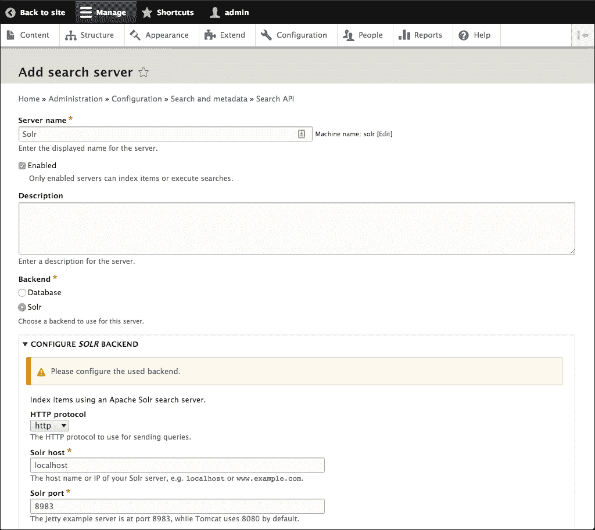

    如果您已经使用上一节中解释的防火墙规则保护了 Solr 管理界面，您将不需要为 HTTP 身份验证添加登录详细信息。留空并单击**保存**：

    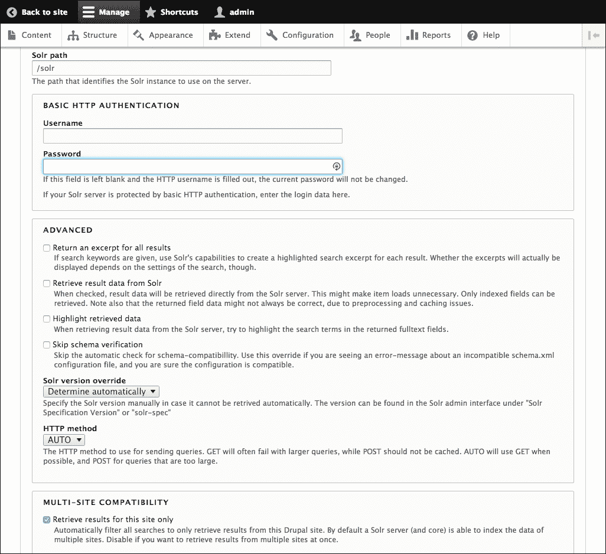

    现在您已经在 Drupal 配置中创建了第二个搜索服务器，Search API 模块的一个优点是您可以轻松地在它们之间切换。例如，您可能希望将您的 Solr 服务器专用于生产站点，但您仍然希望在预发布和开发站点上能够进行开发目的的搜索。

    在开发和预发布环境中，您可以将搜索索引设置为使用数据库，而在生产环境中，您可以将它切换到使用 Solr。

    编辑本章中较早设置的默认内容索引，并将**服务器**单选按钮更改为**Solr**：

    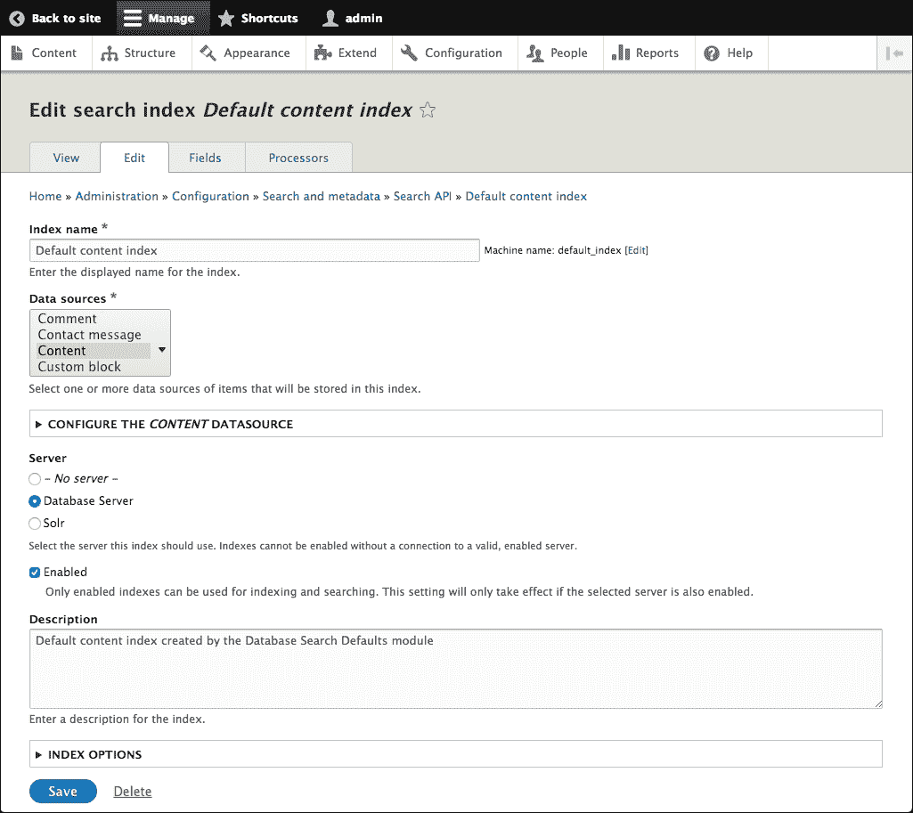

    单击**保存**，然后重新索引内容。就是这样！返回您的搜索页面并测试新的搜索，这次是由 Solr 提供支持。

## *发生了什么？*

您已安装了 Drupal 的 Search API Solr 模块，并将其配置为通过新的搜索服务器连接到您的 Apache Solr 安装。然后，您将搜索索引连接到新的搜索服务器，并使用 Solr 索引了内容。

## 使用只读模式

在某些情况下，您可能希望使搜索索引为只读模式。如果您在多个服务器上实施 Drupal 开发工作流程，这可能很有帮助。例如，当您将 Drupal 数据库从生产环境复制到您的预发布和开发环境以保持它们与生产站点的最新内容同步时。与其为每个环境创建一个新的 Apache Solr 服务器，您可能希望使用相同的 Apache Solr 服务器，但确保只有添加到您的生产服务器的内容被索引。

在您的预发布和生产环境中，您可以在**索引选项**中勾选**只读**复选框。这将防止您在此处创建的任何测试内容进入 Apache Solr 索引：

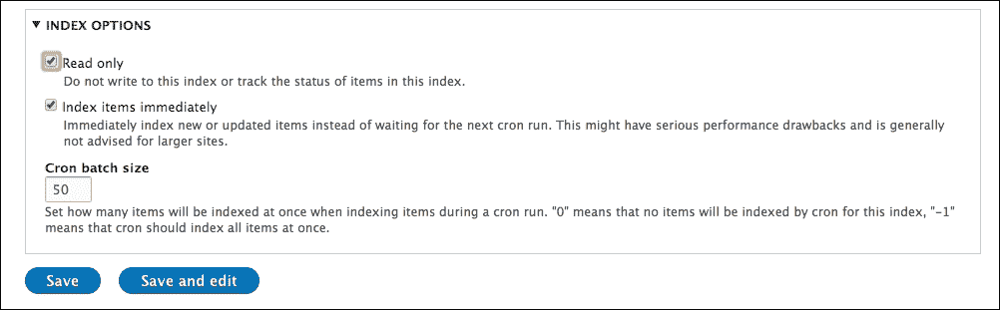

你应该注意，如果你向系统中添加新的内容类型，你需要确保搜索索引没有被设置为只读，以便内容类型可以被索引。当索引被设置为读写（即，取消选中只读复选框）时，使用你的新内容类型创建的任何新内容将像往常一样自动索引。

# 搜索分面

为了进一步展示搜索 API 的强大功能，我们将创建一个与搜索列表一起使用的分面块。你可能熟悉来自其他网站的分面块，这些网站有大量分类内容可供搜索和排序。

例如，以下是一些来自流行食谱网站的分面搜索块：

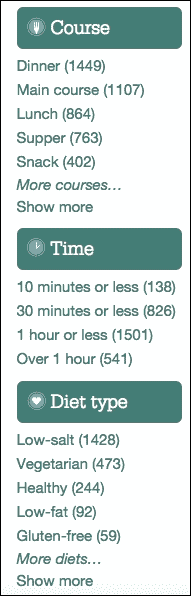

[`www.bbcgoodfood.com/search/recipes?query=family`](http://www.bbcgoodfood.com/search/recipes?query=family)

# 行动时间 - 构建分面搜索块

让我们看看如何使用搜索 API 和 Drupal 8 分面模块构建这些分面搜索块之一：

1.  按照你习惯的方式，从([`www.drupal.org/project/facets`](https://www.drupal.org/project/facets))下载并启用分面模块。

1.  导航到**配置** | **搜索 API** | **分面**，然后点击蓝色的添加分面按钮。作为一个例子，我们将创建一个使用我们食谱标题中的单词的分面块。然而，如果你已经使用分类法术语对食谱进行了分类，你也可以基于该字段创建你的分面块。

    给分面一个可读的人名和一个机器名：

    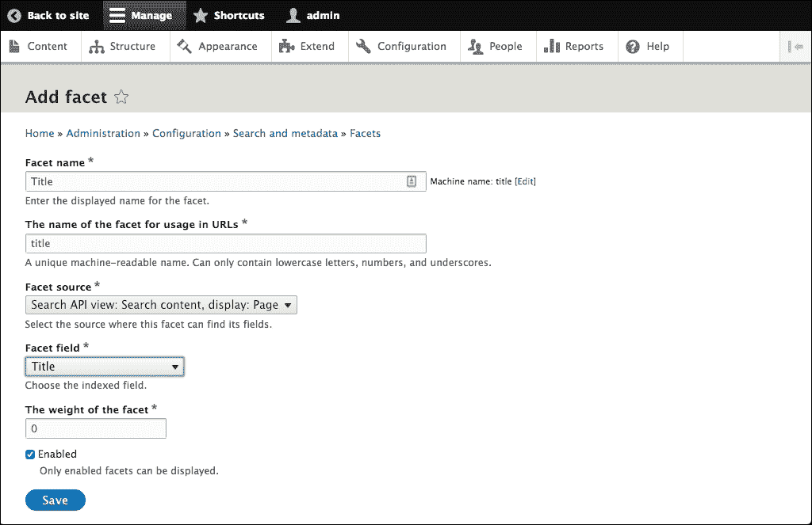

1.  分面块需要从一个源获取数据。在**分面字段**下拉菜单中，你将有一个选项，即我们之前创建的搜索视图。将**分面字段**设置为**标题**，并将分面的权重设置为`0`，然后保存设置。

1.  你也可以通过点击页面顶部的**显示**选项卡来配置分面的显示设置。在这里，你可以选择是否将你的分面列表显示为下拉菜单、复选框或链接列表。你还可以选择分面列表的行为方式，例如隐藏不会进一步缩小当前显示的搜索结果的项目。我们的目标是使我们的分面列表类似于本节开头的示例。因此，我们将选择**链接列表**作为**小部件**，并勾选**隐藏非缩小结果**：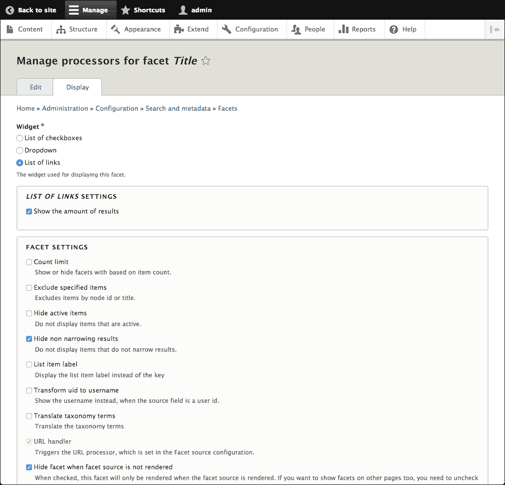

1.  现在，你已经创建了一个与分面源相关的分面。你现在在**配置** | **搜索 API** | **分面**下看到的分面表应该如下所示：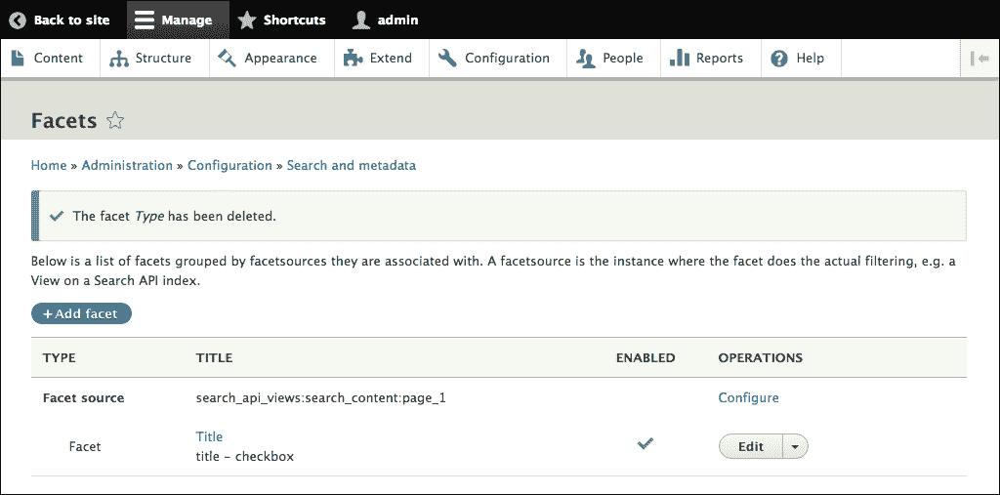

1.  你创建的分面将表现为一个块。我们将通过在**结构** | **块布局**中使用块布局配置将其放置在区域中使其可见。在“侧边栏第一”旁边，点击**放置块**按钮，并在弹出的列表中搜索你的块：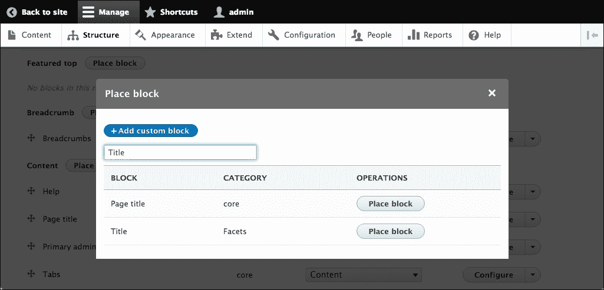

    块将具有你在配置中较早为面指定的名称。

1.  点击**放置块**。

1.  在块配置屏幕中，在**其他分面**块字段中，选择你创建的分面的单选按钮：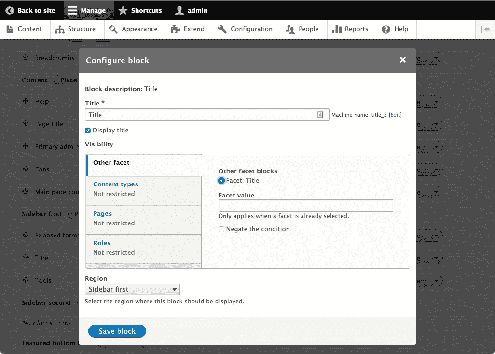

1.  点击**保存块**并导航到你的搜索页面`/search/content`。

1.  你将必须确保你的网站上有一些建议的内容，它们的标题中包含相同的单词，以展示分面的功能。例如，我有三个标题中包含单词`awesome`的食谱。首先，分面块列出了我的食谱标题中的所有离散单词：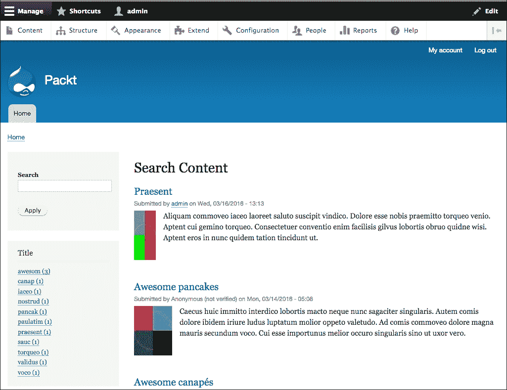

1.  当我搜索`awesome`时，搜索结果和分面列表被缩小：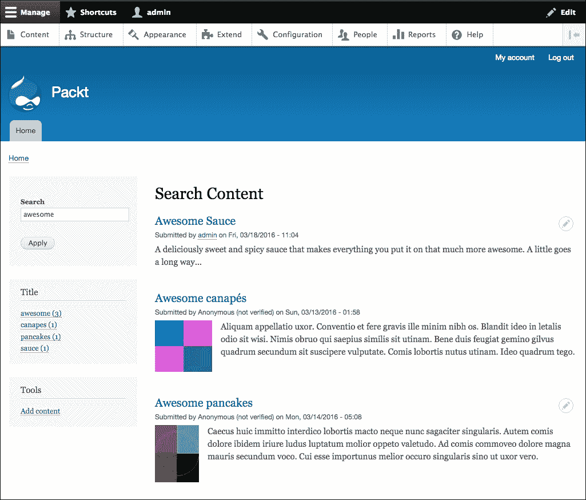

1.  我现在可以点击分面块中的任何其他单词，这些单词也出现在标题中，并且也包含单词`awesome`。这使得过滤到所需的搜索结果变得非常容易：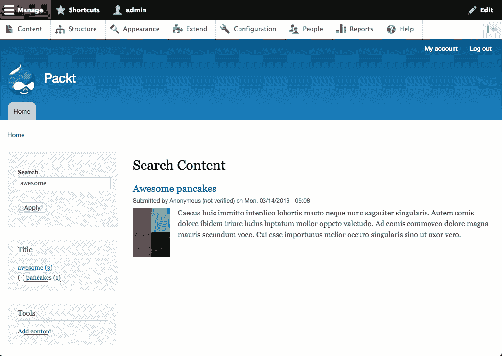

当你在网站上积累了大量内容时，你的用户将能够通过关键词搜索和分面过滤的强大组合进行搜索、筛选和探索。

## *刚才发生了什么？*

你已配置 Drupal 的分面模块以显示一个包含搜索词的块，以便在搜索结果旁边进行筛选。这允许你的用户通过选择内容标题中的搜索关键词列表进一步细化他们的搜索。

## 尝试英雄

尝试为你的食谱创建一个分类法词汇表，用于使用不同的分类进行标记。例如，菜系、起源国家、不同的饮食要求、制作难度或辣度级别。然后创建新的分面块，允许你的用户通过每个这些类别进行筛选。例如，他们可能希望从搜索`rice`开始，然后使用分面进一步筛选`意大利`，最后筛选`素食`以得到美味的芦笋烩饭！

## 快速测验

Q1. 选择以下哪些可以使用简单防火墙：

1.  为了防止从某个 IP 地址远程访问服务器。

1.  为了阻止用户使用 root 权限登录你的服务器。

1.  为了防止你的服务器上的某个端口被访问。

1.  当用户登录你的服务器时显示欢迎信息。

Q2. 选择以下哪些是使用 Apache Solr 而不是数据库搜索的有效理由：

1.  您希望能够搜索您网站上节点的标题以及正文内容。

1.  您的网站有很多访客，并且您的 Drupal 数据库的负载经常很高。

1.  您希望匿名用户和登录用户都能在您的网站上搜索。

1.  您希望当用户在搜索框中输入时，能够自动建议搜索词。

# 摘要

在本章中，我们学习了 Drupal 搜索概念以及如何为访客配置一个强大且灵活的搜索解决方案，以便他们在您的网站上找到他们想要的内容。我们介绍了搜索 API 模块，并了解了它如何配置与 Drupal 数据库协同工作。然后，我们介绍了 Apache Solr 搜索引擎，并探讨了使用该引擎作为搜索引擎而不是依赖 Drupal 数据库的优点。最后，我们学习了如何创建类似于在线商店或其他内容丰富的网站所使用的分面搜索界面。

在下一章中，我们将探讨 Drupal 8 中的一个主要新开发者功能：内置对 REST 的支持。我们将开发一个 Angular JS 应用程序，该应用程序将消费我们网站上的 REST API。
