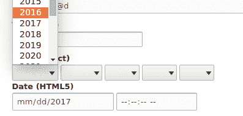

# 内容创作体验

在本章中，我们将探讨 Drupal 8 为内容创作体验带来的变化：

+   配置所见即所得编辑器

+   添加和编辑内容

+   创建菜单并链接内容

+   提供内联编辑

+   创建自定义内容类型

+   应用新的 Drupal 8 核心字段类型

+   自定义节点表单显示

+   自定义节点显示输出

# 简介

在本章中，我们将介绍 Drupal 8 的内容创作体验。我们将向您展示如何配置文本格式并设置随 Drupal 8 一起提供的捆绑 CKEditor。我们将探讨如何添加和管理内容以及如何使用菜单链接到内容。Drupal 8 提供了前端对每个字段的修改的内联编辑。

本章深入探讨**创建自定义内容类型**并利用不同的字段创建高级内容。我们将介绍添加到 Drupal 8 核心的五个新字段以及如何使用它们，以及通过贡献项目配置新字段类型。我们将探讨自定义内容的显示以及修改 Drupal 8 中添加的新表单显示。

# 配置所见即所得编辑器

Drupal 8 见证了 Drupal 开发社区和 CKEditor 开发社区的协作。因此，Drupal 现在默认附带 CKEditor 作为**所见即所得**（**WYSIWYG**）编辑器。新的编辑器模块提供了一个 API 来集成所见即所得编辑器。尽管 CKEditor 默认提供，但贡献模块可以提供与其他所见即所得编辑器的集成。

文本格式控制内容格式化和内容作者所见即所得编辑器配置。标准的 Drupal 安装配置文件提供了一个完全配置的文本格式，启用了 CKEditor。我们将逐步介绍重新创建此文本格式的步骤。

在本食谱中，我们将创建一个新的文本格式，并带有自定义 CKEditor WYSIWYG 配置。

# 准备工作

在开始之前，请确保已启用 CKEditor 模块，这还要求启用编辑器

作为依赖项。**编辑器**是提供 API 以集成所见即所得编辑器的模块

与文本格式一起。

# 如何操作...

让我们创建一个新的文本格式，并带有自定义 CKEditor WYSIWYG 配置：

1.  从管理工具栏访问“配置”并转到“内容创作”下的“文本格式和编辑器”。

1.  点击“添加文本格式”开始创建新的文本格式：


1.  为文本格式输入一个名称，例如编辑器格式。

1.  选择哪些角色可以访问此格式--这允许你对用户在创作内容时可以使用的内容进行细粒度控制。

1.  从文本编辑器选择列表中选择 CKEditor。然后，将加载 CKEditor 的配置表单。

1.  您现在可以使用内联编辑器将按钮拖放到提供的工具栏中，以配置您的 CKEditor 工具栏！:![img/f3f5e25d-ee6a-47aa-a1eb-3cd534782d4f.png]

1.  选择你想要的任何启用过滤器，除了“显示任何 HTML 为纯文本”。这在使用所见即所得编辑器时可能会让人感到不直观！

1.  当你满意时，点击“保存配置”以保存你的配置并创建文本过滤器。

# 它是如何工作的...

过滤器模块提供了控制如何向用户展示富文本字段的文本格式。Drupal 将根据字段的定义文本格式渲染在文本区域中保存的富文本。标题中包含“格式化”的文本字段将尊重文本格式设置；其他字段将以纯文本形式渲染。

文本格式和编辑器屏幕警告由于配置不当存在安全风险。这是因为你可能会授予匿名用户访问允许完整 HTML 或允许图像来源来自远程 URL 的文本格式的权限。

编辑器模块提供了一个连接到 WYSIWYG 编辑器和文本格式的桥梁。它修改文本格式表单和渲染，以允许集成 WYSIWYG 编辑器库。这使得每个文本格式都可以为其 WYSIWYG 编辑器拥有自己的配置。

默认情况下，编辑器模块本身不提供编辑器。CKEditor 模块与编辑器 API 一起工作，以启用 WYSIWYG 编辑器的使用。

Drupal 可以通过贡献模块支持其他 WYSWIG 编辑器，例如 markItUp ([`markitup.jaysalvat.com/home/`](http://markitup.jaysalvat.com/home/)) 或 TinyMCE ([`www.tinymce.com/`](https://www.tinymce.com/))。

# 还有更多...

Drupal 提供了对富文本渲染的细粒度控制，以及可扩展的方式，我们将在后面进一步讨论。

# 过滤器模块

当将字符串数据添加到支持文本格式的字段时，数据将按原始输入保存并保留。对于文本格式的启用过滤器将在内容查看时才应用。Drupal 以保存原始内容并在显示时进行过滤的方式工作。

启用过滤器模块后，你可以指定基于创建文本的用户角色如何渲染文本。理解使用 WYSIWYG 编辑器的文本格式中应用的过滤器非常重要。例如，如果你选择了“显示任何 HTML 为纯文本”选项，当查看时，WYSIWYG 编辑器所做的格式化将被移除。

# 改进的链接

WYSIWYG 编辑的一个主要组成部分是插入指向其他内容或外部网站的链接的能力。与 CKEditor 集成的默认链接按钮允许进行基本的链接嵌入。这意味着你的内容编辑必须在事先知道内部内容 URL 的情况下才能链接到它们。解决这个问题的解决方案是 Linkit 模块，位于[`www.drupal.org/project/linkit`](https://www.drupal.org/project/linkit)。

可以通过运行以下命令使用 Composer 安装该模块：

```php
$ cd /path/to/drupal8
$ composer require drupal/linkit
```

**Linkit**模块提供了对默认链接功能的直接替换。它增加了对内部内容的自动完成搜索，并为显示字段添加了额外的选项。**Linkit**通过创建不同的配置文件来实现，允许您控制可以引用的内容、可以管理的属性以及哪些用户和角色可以使用 Linkit 配置文件。


# CKEditor 插件

`CKEditor`模块提供了一个名为`CKEditorPlugin`的插件类型。插件是 Drupal 8 中可互换功能的小块。插件和插件开发在*第七章*，*插件即插即用*中有所介绍。此类型提供了`CKEditor`和 Drupal 8 之间的集成。

图片和链接功能是定义在`CKEditor`模块内的插件。可以通过贡献项目或自定义开发提供额外的插件。

请参阅`\Drupal\ckeditor\Annotation\CKEditorPlugin`类以获取插件定义，以及作为工作示例的`\Drupal\ckeditor\Plugin\CKEditorPlugin\DrupalImage`类。

# 参见

+   关于 Drupal 如何采用`CKEditor`作为官方 WYSIWYG 编辑器的官方博客文章，请参阅[`ckeditor.com/blog/CKEditor-Joins-Drupal`](http://ckeditor.com/blog/CKEditor-Joins-Drupal)。

+   请参阅*第七章*，*插件即插即用*。

# 添加和编辑内容

内容管理系统的主要功能在其名称本身中就体现出来了——管理内容的能力；也就是说，添加、编辑和组织内容。Drupal 提供了一个中央表单，允许您管理网站内的所有内容，并允许您创建新内容。此外，您可以在查看内容时查看内容，并点击编辑链接。

# 准备工作

此菜谱假设您已安装标准安装配置文件，并且可以使用默认的节点内容类型。

# 如何操作...

通过添加、编辑和组织内容来管理内容：

1.  前往内容以查看内容管理概述。

1.  点击添加内容以查看可用的内容类型列表。

1.  点击文章作为您想要制作的内容。

1.  为内容提供标题。内容标题总是必需的。填写文章的主体文本：


您可以更改文本格式以自定义允许的文本类型。如果用户只有一个格式可用，则不会有选择框，但“关于文本格式”链接仍然存在。

1.  在您添加文本后，点击表单底部的保存并发布。然后您将被重定向到查看新创建的内容。

1.  注意，内容 URL 为`/node/#`。这是内容的默认路径，可以通过编辑内容进行更改。

1.  点击内容上方右侧的“编辑”标签页。

1.  从右侧边栏中，点击“URL 路径设置”以展开部分并输入自定义别名，例如`/awesome-article`（注意所需的`/`符号）：


1.  保存内容，并注意您的文章 URL 为`/awesome-article`。

1.  你也可以通过点击内容表中的“编辑”来编辑这篇文章，而不是从查看内容处编辑。

# 它是如何工作的...

内容页面是一个**视图**，将在*第三章*，*通过视图显示内容*中讨论。这创建了一个包含你网站上所有内容的表格，可以进行搜索和筛选。从这里，你可以查看、编辑或删除任何单个内容。

在 Drupal 中，有内容实体提供创建、编辑、删除和查看的方法。节点是一种内容实体。当你创建一个节点时，它将构建适当的表单，允许你填写内容的数据。编辑内容的过程遵循相同的步骤。

当你保存内容时，Drupal 将节点的内容及其所有相关字段数据写入数据库。

# 还有更多...

Drupal 8 的内容管理系统提供了许多功能；我们将涵盖一些额外信息。

# 保存为草稿

Drupal 8 新增了轻松将内容保存为草稿而不是直接发布的功能。不是点击“保存并发布”，而是点击旁边的箭头以展开“保存为未发布”选项：


上述按钮有几项可用性和用户体验审查，将在 Drupal 的未来版本中改进。要跟踪的一个问题位于[`www.drupal.org/node/1899236`](https://www.drupal.org/node/1899236)。该问题强调了根据现有前端库中定义的统一用户体验模式提出的不同修复方案。

# Pathauto

有一个名为 Pathauto 的捐赠项目，它简化了提供 URL 别名的过程。它允许你定义模式，这些模式将自动为内容创建 URL 别名。此模块利用标记来允许内容拥有非常健壮的路径。

Pathauto 项目可以在[`www.drupal.org/project/pathauto`](https://www.drupal.org/project/pathauto)找到。

有一个提议要为 Drupal 核心提供 Pathauto 的功能，可以在[`www.drupal.org/node/229568`](https://www.drupal.org/node/229568)跟踪。

# 批量管理

你还可以对内容执行批量操作。这在内容管理屏幕上可用。列出网站内容的表格在每个行的开头都有复选框。对于每个选定的项目，你可以从“与选择一起”中选择一个项目来执行批量更改，例如删除、发布和取消发布内容：


# 参见

+   参考本章的*自定义节点表单显示*配方。

# 创建菜单和链接内容

Drupal 提供了一种将正在创建的内容链接到网站上的指定菜单的方法，通常是主菜单。然而，您也可以创建一个自定义菜单以提供内容链接。在本教程中，我们将向您展示如何创建自定义菜单并将内容链接到它。然后，我们将把菜单作为一个块放置在页面的侧边栏中。

# 准备工作

本配方假设您已安装标准安装配置文件，并且有默认节点内容类型可供使用。您应该有一些内容创建以创建链接。

# 如何操作...

1.  访问结构并点击菜单。

1.  点击添加菜单。

1.  提供标题“侧边栏”和可选摘要，然后点击保存。

1.  保存菜单后，点击添加链接按钮。

1.  输入链接标题，然后输入内容的标题。表单将提供可链接内容的自动完成建议：


1.  点击保存以保存菜单链接。

1.  保存菜单链接后，转到结构，然后是块布局。

1.  首先点击侧边栏旁边的放置块。在模态窗口中，搜索侧边栏菜单并点击放置块：


1.  在以下表单中，点击保存块。

1.  通过点击管理菜单中的“首页”来查看您的 Drupal 网站，您将看到以下菜单：


# 工作原理...

菜单和链接是 Drupal 核心的一部分。创建自定义菜单和菜单链接的能力是通过**菜单 UI**模块提供的。此模块在标准安装配置文件中已启用，但在其他配置文件中可能未启用。

菜单链接表单的链接输入允许您开始键入节点标题并轻松地将它们链接到现有内容。这是以前 Drupal 版本中不可用的功能。它将自动将标题转换为内部路径。链接输入还接受常规路径，例如`/node/1`或外部路径。

您必须有一个有效的路径；您不能向菜单添加空链接。正在进行工作以允许添加空或 ID 选择器链接路径--请参阅[`www.drupal.org/node/1543750`](https://www.drupal.org/node/1543750)。

# 更多...

链接可以通过内容编辑表单本身进行管理，这将在下一部分介绍。

# 从其表单管理内容菜单链接

一块内容可以从添加或编辑表单链接到菜单。菜单设置部分允许您切换菜单链接的可用性。默认情况下，菜单链接标题将反映内容的标题。

父项目允许您决定它将出现在哪个菜单和哪个项目下。默认情况下，内容类型仅允许主菜单。编辑内容类型可以允许使用多个菜单或仅选择自定义菜单。

这允许您填充主菜单或辅助菜单，而无需访问菜单管理屏幕。

# 提供内联编辑

Drupal 8 的一个备受推崇的功能是提供内联编辑。内联编辑通过标准安装配置文件默认启用，通过**快速编辑**模块实现。快速编辑模块允许在查看内容时编辑单个字段，并将其与编辑器模块集成以实现 WYSIWYG 编辑器！

# 如何操作...

让我们提供内联编辑：

1.  前往一个已创建的内容页面。

1.  为了启用内联编辑，您必须通过在管理工具栏右上角点击“编辑”来切换页面上的上下文链接：


1.  这将切换页面上的上下文链接。点击内容旁边的上下文链接并选择快速编辑：


1.  将鼠标悬停在正文文本上并点击“编辑”。现在您可以使用 WYSIWYG 编辑器工具栏的简化版本来编辑文本：


1.  修改文本后，点击保存。

1.  变更将立即保存。

# 它是如何工作的...

**上下文链接**模块为特权用户提供修改块或内容的快捷链接。上下文链接通过在工具栏中点击“编辑”来切换。编辑链接切换页面上的上下文链接的可见性。在 Drupal 7 中，上下文链接在悬停特定区域时显示为齿轮。

快速编辑模块建立在上下文链接功能之上。它允许字段格式化器，用于显示字段数据，描述它们将如何交互。默认情况下，快速编辑将其设置为表单。点击一个元素将使用 JavaScript 加载表单并通过 AJAX 调用保存数据。

快速编辑功能不适用于管理页面。

# 更多...

随着 Drupal 8 的每个小版本发布，内联编辑体验都有更多改进。

# 从外向内的方法

Drupal 8.2 中有一个实验性模块允许您从网站的前端编辑块和其他网站配置，就像内容的快速编辑一样。要启用此功能，请安装**设置托盘**模块。

当您浏览 Drupal 网站时，您会在工具栏左侧注意到一个新的**编辑**按钮。点击此按钮将允许您编辑块和网站配置。


更多信息，请参阅 Drupal.org 手册中关于此功能的文档，网址为[`www.drupal.org/docs/8/core/modules/outside-in/overview`](https://www.drupal.org/docs/8/core/modules/outside-in/overview)。

# 创建自定义内容类型

Drupal 在内容管理领域表现出色，允许不同类型的内容。在这个菜谱中，我们将向您展示如何创建自定义内容类型。我们将创建一个具有一些基本字段并用于关注公司提供服务的场景的服务类型。

您还将学习如何在菜谱中向内容类型添加字段，这通常与在 Drupal 网站上创建新的内容类型相辅相成。

# 如何操作...

1.  前往结构，然后内容类型。点击添加内容类型以开始创建新的内容类型。

1.  输入服务作为名称，并可选地输入描述。

1.  选择显示设置，取消选中显示作者和日期信息复选框。这将隐藏作者和提交时间从服务页面：


1.  点击保存和管理字段按钮以保存新的内容类型并管理其字段。

1.  默认情况下，新内容类型会自动添加一个正文字段。我们将保留这个字段。

1.  我们将添加一个字段，提供一种输入服务营销标题的方法。点击添加字段。

1.  从下拉菜单中选择文本（纯文本），并将营销标题作为标签输入：


文本（纯文本）选项是一个常规文本字段。文本（格式化）选项将允许您在字段中显示的文本上使用文本格式。

1.  在下一个表单上点击保存字段设置。在随后的表单上，点击保存设置以完成字段的添加。

1.  字段现在已经添加，可以创建此类内容：


# 工作原理...

在 Drupal 中，有一些实体具有捆绑包。捆绑包只是可以附加特定配置和字段的一种实体类型。当与节点一起工作时，捆绑包通常被称为内容类型。

只要启用节点模块，就可以创建内容类型。当通过用户界面创建内容类型时，它会调用 `node_add_body_field()` 函数。此函数为内容类型添加默认的正文字段。

只有在启用字段 UI 模块的情况下，才能管理或添加字段。字段 UI 模块公开了实体（如节点和块）的**管理字段**、**管理表单显示**和**管理显示**。

# 应用新的 Drupal 8 核心字段类型

字段系统是使在 Drupal 中创建内容如此强大的原因。在 Drupal 8 中，一些最常用的贡献字段类型已经被合并到 Drupal 核心作为它们自己的模块。实际上，实体引用不再是一个模块，而是现在已经是主字段 API 的一部分了。

这个菜谱实际上是一系列迷你菜谱，用于突出 Drupal 8 核心提供的新字段：`链接`、`电子邮件`、`电话`、`日期`和`实体引用`。

# 准备工作

标准安装配置文件没有启用提供这些字段类型的所有模块。对于此配方，您需要手动启用选择模块，以便您可以创建字段。提供字段类型及其在标准配置文件中的安装状态的模块将被突出显示。

每个配方都将开始假设您已启用模块（如果需要），并且您正在内容类型的“管理字段”表单中，已点击“添加字段”并提供了字段标签。这里的配方涵盖了每个字段的设置。

# 如何做到这一点...

本节包含一系列迷你配方，展示了如何使用每个新的核心字段类型。

# 链接

链接字段由链接模块提供。它默认安装在标准安装配置文件中。它是**菜单 UI**、**自定义菜单链接**和**快捷方式模块**的依赖项。

1.  链接字段类型在所有捆绑包中都没有任何额外的字段级别设置。

1.  点击“保存字段设置”以自定义此特定捆绑包的字段。

1.  使用允许的链接类型设置，您可以控制提供的 URL 是否可以是外部链接、内部链接或两者都可以。选择内部或两者都会允许通过自动完成标题来链接到内容。

1.  允许链接文本定义用户是否必须提供与链接一起的文本。如果没有提供文本，则显示 URL 本身。

1.  链接字段的字段格式化器允许您指定`rel="nofollow"`或链接是否应在新窗口中打开。

# 电子邮件字段

电子邮件字段由 Drupal 核心提供，无需安装任何附加模块即可使用：

1.  电子邮件字段类型在所有捆绑包中都没有任何额外的字段级别设置。

1.  点击“保存字段设置”以自定义此特定捆绑包的字段。

1.  对于电子邮件字段实例，没有更多的设置。此字段使用 HTML5 电子邮件输入，将利用浏览器输入验证。

1.  电子邮件字段的字段格式化器允许您将电子邮件显示为纯文本或`mailto:`链接。

# 电话字段

电话字段由电话模块提供。它默认不与标准安装配置文件一起安装，必须通过扩展表单安装。

1.  电话字段类型在所有捆绑包中都没有任何额外的字段级别设置。

1.  点击“保存字段设置”以自定义此特定捆绑包的字段。

1.  对于电话字段实例，没有更多的设置。此字段使用 HTML5 电话输入，将利用浏览器输入验证。

1.  电话字段的字段格式化器允许您将电话号码显示为纯文本项，或使用带有可选替换标题的`tel:link`。

# 日期字段

日期字段由日期时间模块提供。它默认与标准安装配置文件一起启用。

1.  日期模块有一个设置，用于定义它将存储哪种类型的数据：日期和时间，或仅日期。一旦字段数据已保存，此设置就不能更改。

1.  点击“保存字段设置”以自定义此特定捆绑包的字段。

1.  日期字段有两种提供默认值的方式。它可以是当前日期或使用 PHP 的日期时间修改符语法表示的相对日期。

1.  默认情况下，日期字段使用 HTML5 日期和时间输入，从而提供浏览器提供的原生日期和时间选择器。

1.  此外，日期字段可以配置为为每个日期和时间组件使用选择列表：



1.  默认日期字段格式化器显示使用 Drupal 的时间格式来渲染时间格式。这些配置在“配置”和“区域和语言”下的日期和时间格式表中进行。

1.  日期和时间可以显示为“时间前”，以提供对时间在未来或过去距离的语义显示。这两种格式的显示设置都是可定制的。

1.  最后，日期和时间可以使用 PHP 日期格式指定的自定义格式进行显示。

# 实体引用字段

实体引用字段是 Drupal 核心的一部分，无需启用其他模块即可使用。与其他字段不同，实体引用在添加字段时显示为特定项目的分组。这是因为您必须选择要引用的实体类型。请按照以下步骤操作：

1.  界面允许您选择内容、文件、图像、分类术语、用户或其他。选择预定义选项将预配置字段的目标实体类型。

1.  当使用“其他”选项创建实体引用字段时，您必须指定要引用的项目类型。一旦您的数据已保存，此选项就不能更改。

您会注意到有两个组：**内容**和**配置**。Drupal 使用配置实体。尽管配置是一个选项，您可能不会从引用这些实体类型中受益。只有内容实体才有被查看的方式。引用配置实体将属于高级用例实现。

1.  点击“保存字段设置”以自定义此特定捆绑包的字段。

1.  实体引用字段有两种不同的方法允许用户搜索内容：使用默认的自动完成或视图。

1.  根据您引用的实体类型，将会有不同的实体属性，您可以根据这些属性对结果进行排序。

1.  实体引用字段的默认字段小部件是自动完成，然而，您可以选择使用选择列表或复选框来显示可用选项。

1.  实体引用字段的值可以显示引用实体的标签或渲染后的输出。在渲染标签时，可以可选地将其链接到实体本身。在显示渲染后的实体时，您可以选择特定的视图模式。

# 它是如何工作的...

在 Drupal 8 中处理字段时，有两个步骤需要注意。当你第一次创建一个字段时，你正在定义一个要保存的基本字段。这种配置是一个基础配置，它指定了一个字段可以支持多少个值以及是否由字段类型定义了任何额外的设置。当你将字段附加到一个捆绑包上时，它被视为一个字段存储，并包含特定捆绑包的独特配置。如果你在文章和页面内容类型上都有相同的链接字段，那么标签、链接类型和链接文本设置是针对每个实例的。

每个字段类型都提供了一种存储和呈现特定类型数据的方法。使用这些字段的优点来自于验证和数据操作。它还允许你利用 HTML5 表单输入。使用 HTML5 的电话、电子邮件和日期，作者体验使用浏览器提供的工具而不是额外的第三方库。这也为使用移动设备进行创作提供了更原生体验。

# 还有更多...

Drupal 8 发布时带有新字段，这是将广泛使用的贡献模块集成到 Drupal 核心中的重大改进。在接下来的章节中，我们将介绍更多的改进和一些额外的主题。

# 即将更新的内容

每个配方都涵盖了一个曾是贡献项目空间一部分的字段类型。这些项目在撰写本书时提供了比 Drupal 核心更多的配置选项。随着时间的推移，越来越多的功能将从它们的源项目中引入到 Drupal 核心中。

例如，Datetime 模块基于贡献的 Date 项目。然而，并非所有贡献项目的功能都进入了 Drupal 核心。Drupal 8 的每个小版本都看到更多功能被移动到核心。一个例子是 Datetime 范围模块，这是一个计划在 Drupal 8.4 附近稳定的实验性模块。此模块为 Datetime 字段添加了对开始日期和结束日期的支持。Datetime 范围模块的文档可以在[`www.drupal.org/docs/8/core/modules/datetime-range`](https://www.drupal.org/docs/8/core/modules/datetime-range)找到。

# 查看和实体引用

在*第三章*中，*通过视图显示内容*中涵盖了使用实体引用字段查看的内容。使用查看，你可以自定义获取引用字段结果的方式。

# 参见

+   请参阅*第三章*中的*提供实体引用结果视图*配方，*通过视图显示内容*。

# 自定义节点表单显示

Drupal 8 的最新进展是表单显示模式的可用性。表单模式允许网站管理员为每个内容实体捆绑包的编辑表单配置不同的字段配置。在节点的情况下，你有能力重新排列和改变节点编辑表单上字段和属性显示。

在本食谱中，我们将修改标准安装配置文件中包含的文章内容类型的默认表单：


# 如何操作...

1.  要自定义表单显示模式，请转到结构，然后是内容类型。

1.  我们将修改文章内容类型的表单。点击展开操作下拉菜单，并选择管理表单显示。


1.  首先，我们将修改评论字段。点击左侧的拖动图标，将行拖入禁用部分。对于列表顶部的固定选项，遵循相同的步骤：


1.  点击正文字段的设置齿轮。输入字段的占位符，例如`在此处输入您的文章文本`。点击更新。

占位符仅会在使用不提供所见即所得编辑器的文本格式的`textarea`中显示。

1.  点击页面底部的保存按钮以保存您的更改。您现在已自定义了表单显示。

1.  前往内容 | 添加内容，然后转到文章。请注意，评论设置不再显示，推广选项下的固定选项也不再显示：


# 它是如何工作的...

Drupal 中的实体为每个捆绑包提供各种视图模式。在 Drupal 7 中，只有显示视图模式，这将在下一食谱中介绍。Drupal 8 引入了新的表单模式，以允许更精确地控制实体编辑表单的显示方式。

表单显示模式是配置实体。表单显示模式决定了当编辑实体时`\Drupal\Core\EntityContentEntityForm`类将如何构建表单。这始终设置为默认值，除非更改或以编程方式指定为不同的模式。

由于表单显示模式是配置实体，因此可以使用配置管理进行导出。

隐藏字段属性除非提供默认值，否则将没有价值。例如，如果你隐藏了作者信息但没有提供设置默认值的代码，内容将由匿名用户（无用户）创建。

# 还有更多...

在下一节中，我们将讨论更多关于管理内容实体表单的内容。

# 管理表单显示模式

所有实体的表单显示模式都在一个区域中管理，并为每个捆绑包类型启用。您必须首先创建显示模式，然后可以通过捆绑包管理界面进行配置。

# 以编程方式为隐藏表单项提供默认值

在*第六章*，*使用表单 API 创建表单*中，我们将有一个食谱详细说明如何修改表单。为了为在表单显示中隐藏的实体属性提供默认值，您需要修改表单并提供默认值。字段 API 提供了一种在创建字段时设置默认值的方法。

# 参见

+   参考第*第十章*，*实体 API*。

+   参考第*第六章*，*使用表单 API 创建表单*。

# 自定义节点显示输出

Drupal 提供了显示视图模式，允许自定义附加到实体的字段和其他属性。在本教程中，我们将调整文章的摘要显示模式。每个字段或属性都有一个用于显示标签、显示信息的格式以及格式的额外设置的控件。

利用视图显示，您可以完全控制内容在您的 Drupal 站点上的查看方式。

# 如何做到这一点...

1.  现在，是时候通过导航到结构然后内容类型来自定义表单显示模式了。

1.  我们将修改文章内容类型的显示。点击下拉按钮箭头并选择管理显示。

1.  点击“摘要视图模式”选项来修改它。摘要视图模式用于节点列表中，例如默认的首页：


1.  将标签的格式更改为“隐藏”。此外，这也可以通过将其拖动到隐藏部分来完成。在查看摘要视图模式时，文章上的标签将不再显示。

1.  点击正文字段的设置齿轮来调整截断限制。截断限制是当没有提供`textarea`字段的摘要时作为摘要或截断的回退。将其从`600`更改为`300`。

1.  点击“保存”以保存您所做的所有更改。

1.  查看首页并查看您所做的更改是否生效。


# 它是如何工作的...

视图显示模式是配置实体。视图显示模式决定了当查看实体时`\Drupal\Core\EntityContentEntityForm`类将如何构建视图显示。这始终设置为默认值，除非更改或以不同的模式程序化指定。

由于视图显示模式是配置实体，它们可以使用配置管理进行导出。
