# 第三章：通过 Views 显示内容

本章将介绍 Views 模块及其主要功能的用法。在本章中，我们将涵盖以下食谱：

+   列出内容

+   编辑默认管理界面

+   从视图创建块

+   利用动态参数

+   在视图中添加关系

+   提供实体引用结果视图

# 简介

对于之前使用过 Drupal 的用户，Views 是 Drupal 8 的核心功能。如果你是 Drupal 的新用户，请注意，Views 一直是 Drupal 6 和 Drupal 7 中最常用的贡献项目之一。

简要来说，Views 是一个可视化查询构建器，允许您从数据库中提取内容并以多种格式渲染。Drupal 提供的所有内置管理区域和内容列表都是由 Views 驱动的。我们将深入了解如何使用 Views 自定义管理界面，自定义显示内容的方式，以及与实体引用字段交互。

# 列出内容

Views 只做一件事，而且做得很好——列出内容。Views 模块背后的力量在于它给予最终用户在多种形式中显示内容的可配置能力。

本食谱将涵盖创建内容列表并将其链接到主菜单。我们将使用标准安装提供的`文章`内容类型，并创建一个文章的落地页面。

# 准备工作

必须安装**Views UI**模块才能从用户界面操作视图。默认情况下，这通过标准安装配置启用。

# 如何操作...

让我们列出视图列出的内容：

1.  前往结构，然后是视图，如图所示；这将带您到所有已创建视图的管理概览：

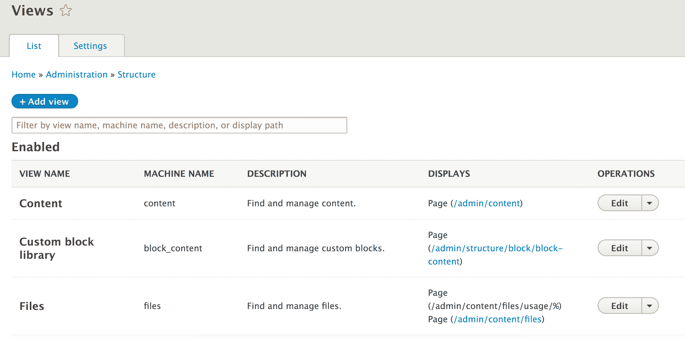

1.  点击添加视图以创建一个新的视图。

1.  第一步是提供文章视图的名称，这将作为管理和（默认）显示的标题。

1.  接下来，我们将修改视图设置。我们希望显示类型为`文章`的内容，并将标记字段留空。这将强制视图只显示`文章`内容类型的内容。

1.  选择创建页面选项。页面标题和路径将根据视图名称自动填充，可以根据需要修改。目前，请保留显示和其他设置为其默认值：

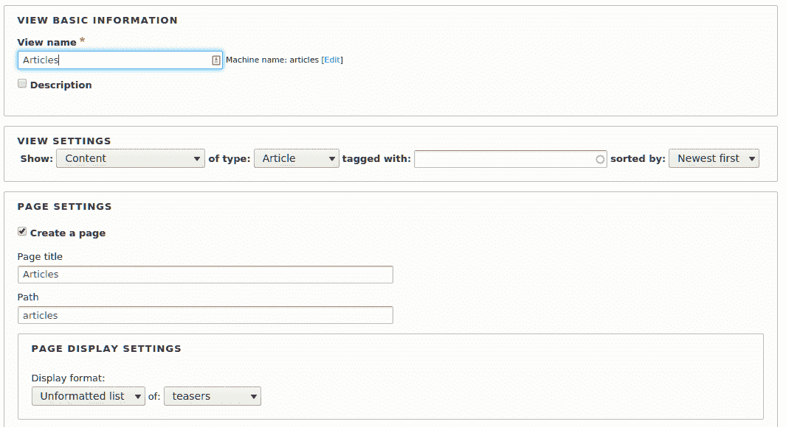

1.  点击保存并编辑以继续修改您的新视图。

1.  在中间列的页面设置部分下，我们将更改菜单项设置。点击无菜单以更改默认设置。

1.  选择正常菜单条目。提供菜单链接标题和可选描述。将父级设置为<主导航>：

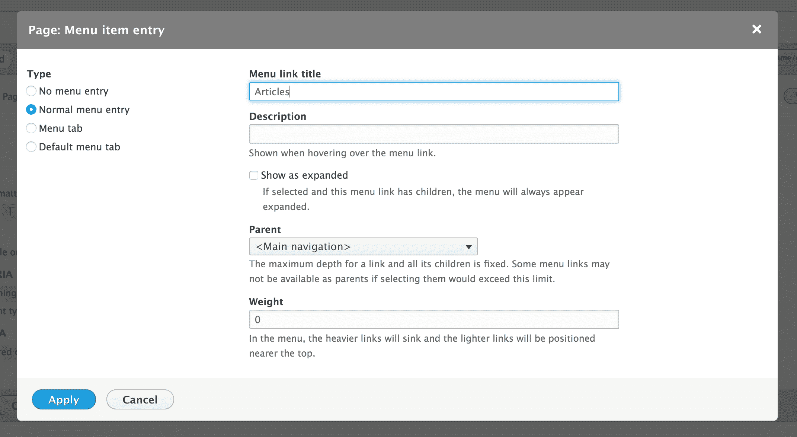

1.  点击表单底部的应用按钮。

1.  点击保存以保存您的视图。

1.  保存你的视图后，从管理菜单中点击“返回站点”。现在你将在 Drupal 站点的主菜单中看到链接。

# 它是如何工作的...

创建视图的第一步是选择你将显示的数据类型。这被称为基本表，可以是任何类型的实体或专门暴露给视图的数据。

在视图中，节点被标记为**内容**，你将在 Drupal 中找到这种术语的互换。

当创建视图页面时，我们添加一个可访问的菜单路径。它告诉 Drupal 调用视图以渲染页面，这将加载你创建的视图并将其渲染。

有显示`样式`和`行`插件，它们格式化要渲染的数据。我们的配方使用了未格式化的列表样式，将每一行包裹在一个简单的`div`元素中。我们可以将其更改为表格以形成格式化列表。行显示控制每行如何输出。

# 更多...

视图模块自首次推出以来一直是必用模块之一，以至于几乎每个 Drupal 7 站点都使用了此模块。在下一节中，我们将进一步深入了解视图。

# Drupal 核心中的视图倡议

视图模块直到 Drupal 8 都是一个贡献模块。事实上，它是最常用的模块之一。尽管该模块现在是 Drupal 核心的一部分，但它仍然需要许多改进，并且正在被提交。

通过它们的 8.1、8.2 和 8.3 版本发布，已经进行了许多改进。我们将在每个未来的小版本更新中继续看到这种模式。

# 视图和显示

当与视图一起工作时，你会看到一些不同的术语。其中需要掌握的关键项目之一是了解什么是显示。一个视图可以包含多个显示。每个显示都是某种类型。视图包含以下显示类型：

+   **附件**：这是一个附加到同一视图中的另一个显示的显示

+   **块**：这允许你将视图作为一个块放置

+   **嵌入**：此显示旨在以编程方式嵌入

+   **实体引用**：这允许视图为实体引用字段提供结果

+   **Feed**：此显示返回基于 XML 的 feed，可以附加到另一个显示以渲染 feed 图标

+   **页面**：这允许你从特定的路由显示视图

每个显示也可以有自己的配置。然而，每个显示将共享相同的基本表（内容、文件等）。这允许你以不同的方式表示相同的数据。

# 格式样式插件 - 样式和行

在视图内部，有两种类型的样式插件代表你的数据如何显示：样式和行：

+   **样式**插件代表整体格式

+   **行**插件代表每行结果的格式

例如，`网格`样式将输出多个具有指定类的`div`元素以创建响应式`网格`。同时，`表格`样式创建带有标签的表格输出，用作表格标题。

行插件定义了如何渲染行。默认内容将根据其选定的显示模式渲染实体。如果你选择字段，你可以手动选择要包含在你的视图中的字段。

每个格式样式插件都有一个对应的`Twig`文件，主题层使用它。请参阅*第五章*，*前端为王*，以了解更多关于 Drupal 8 中的 Twig 的信息。

你可以在自定义模块中定义新插件或使用贡献模块来访问不同的选项。

# 使用嵌入显示

可用的每种显示类型都有一种方法可以通过用户界面暴露自己，除了嵌入。通常，贡献和自定义模块使用视图来渲染显示，而不是手动编写查询和渲染输出。Drupal 8 提供了一个特殊的显示类型来简化这一点。

如果我们要在菜谱中创建的视图中添加嵌入显示，我们可以传递以下渲染数组来程序化地输出我们的视图：

```php
$view_render = [ 
  '#type' => 'view', 
  '#name' => 'articles', 
  '#display_id' => 'embed_1', 
]; 
```

当渲染时，`#type`键告诉 Drupal 这是一个视图元素。然后我们将其指向我们新的显示`embed_1`。嵌入显示类型没有特殊功能，实际上，它是一个简单的显示插件。好处是它没有为了性能而进行的额外操作。

当你想在自定义页面、块或甚至表单中使用视图时，使用嵌入显示是有益的。例如，Drupal Commerce 使用这种模式为其购物车块和结账中的订单摘要。视图用于在自定义块和表单中显示订单信息。

# 参见

+   参考 VDC 倡议[`www.drupal.org/community-initiatives/drupal-core/vdc`](https://www.drupal.org/community-initiatives/drupal-core/vdc)。

+   参考第*第七章*，*插件即插即用*，以了解更多关于插件的信息。

# 编辑默认管理界面

在 Drupal 核心中添加视图后，许多管理界面都由视图提供支持。这允许自定义默认管理界面，以增强网站管理和内容创作体验。

在 Drupal 6 和 7 中，有一个名为“Administrative Views”的贡献模块，它提供了一种使用视图覆盖管理页面的方法。由于该功能现在直接包含在 Drupal 核心中，因此不再需要此模块。

在这个菜谱中，我们将修改默认的内容概览表单，该表单用于查找和编辑内容。我们将添加按作者过滤内容的能力。

# 如何操作...

1.  前往结构，然后是视图。这将带您到所有现有视图的管理概览。

1.  从“已启用”部分，在操作列中选择内容视图的编辑选项。这是在管理内容时在`/admin/content`上显示的视图。

1.  要按内容作者进行筛选，我们必须向我们的视图添加一个过滤器标准，我们将公开以下内容供用户修改：

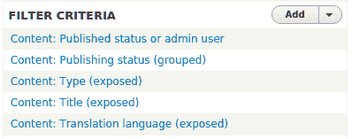

1.  在过滤器标准部分点击添加以添加新的过滤器。在搜索框中输入“由...创建”以搜索可用选项。为内容类别选择“由...创建”。点击添加并配置过滤器标准：

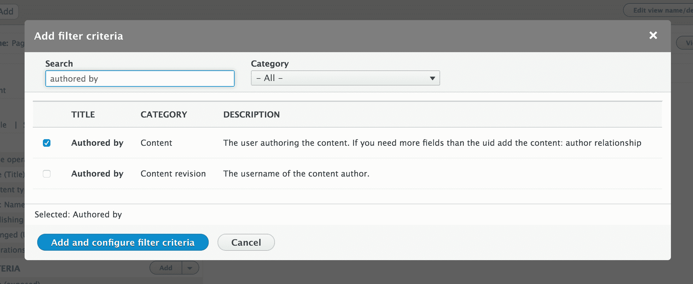

1.  选择“允许访客公开此过滤器以允许他们更改它”复选框。这将允许用户修改过滤器数据。

1.  您可以修改标签并添加描述来提高过滤器选项在您用例中的可用性。

1.  再次点击应用以完成配置过滤器。现在它将显示在过滤器标准列表中。您还会在表单下方的预览中看到新的过滤器。

1.  点击保存以提交对视图的所有更改。

1.  查看 `/admin/content`，您将找到您的过滤器。内容编辑员将能够通过自动完成的用户名搜索搜索由用户创建的内容：

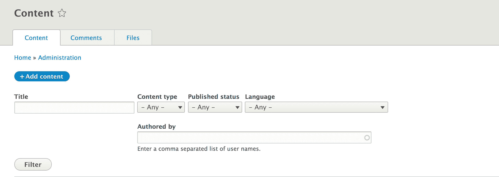

# 它是如何工作的...

当创建的视图路径与现有路由匹配时，它将覆盖它并显示自己。这就是`/admin/content`和其他管理页面能够由视图提供动力的原因。

如果您禁用了视图模块，您仍然可以管理内容和用户。默认表单是表格，不提供过滤器或其他额外功能。

Drupal 使用覆盖的路由并使用视图来渲染页面。从那时起，页面就像任何其他视图页面一样被渲染。

# 更多...

我们将深入了解通过视图提供的其他功能，这些功能可以增强您使用视图的方式，并在您的 Drupal 网站上展示它们。

# 公开与非公开

过滤器允许您缩小视图显示的数据范围。过滤器可以是公开的或不公开的；默认情况下，过滤器不是公开的。一个例子是使用内容：发布状态设置为“是”（已发布）以确保视图始终包含发布的内容。这是一项您会配置以向网站访客显示内容的设置。然而，如果是用于管理显示，您可能希望公开该过滤器。这样，内容编辑员可以轻松地查看尚未发布或已取消发布的内容。 

所有过滤和排序标准都可以标记为公开。

# 过滤器标识符

公开的过滤器通过解析 URL 中的查询参数来工作。例如，在内容管理表单中，更改`类型`过滤器将添加`type=Article`等参数到当前 URL 中。

使用此配方，作者过滤器将显示为 URL 中的 uid。公开的过滤器有

可以更改 URL 组件的过滤器标识符选项：


这可以更改为`作者`或其他值，以增强 URL 背后的用户体验，或掩盖 Drupal 的特性。

# 使用视图覆盖路由

由于 Drupal 中路由和模块系统的工作方式，视图可以替换管理页面，以增强版本。模块按照模块的权重顺序执行，如果权重相同，则按字母顺序执行。自然地，在英文字母表中，字母*V*位于字母表的末尾。这意味着任何由视图提供的路由都将添加到路由发现周期的末尾。

如果创建了一个视图并提供了一个路由路径，它将覆盖该路径上存在的任何视图。没有碰撞检查机制（在合并到 Drupal 核心之前，视图中没有这样的机制）来防止这种情况。

这允许您轻松地自定义大多数现有路由，但请注意，您可能会轻易地遇到冲突的路由，并且视图通常会覆盖其他路由。

# 从视图创建块

之前的配方已经展示了如何创建和操作由视图创建的页面。视图提供了不同的显示类型，可以创建，例如块。在这个配方中，我们将创建一个由视图驱动的块。视图块将列出已添加到`文章`内容类型的所有标签分类术语。

# 准备工作

此配方假设您已安装标准安装配置文件，并且有默认节点内容类型可供使用。

# 如何做到这一点...

1.  前往结构然后视图。这将带您到所有创建的视图的管理概览。

1.  点击添加视图以创建新视图。

1.  第一步是提供标签的视图名称，这将作为管理标题和（默认情况下）显示标题。

1.  接下来，我们将修改视图设置。我们希望显示类型为标签的分类术语。这将使视图默认只显示在标签词汇表下创建的分类术语。

1.  在块设置部分勾选创建块复选框。

1.  从显示格式选择中，选择 HTML 列表选项。保留样式为字段：

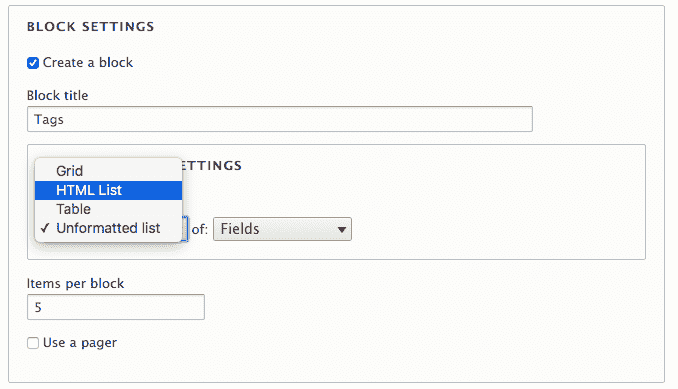

1.  点击保存并编辑以创建视图。

1.  我们希望显示所有可用的标签。在分页部分，点击使用分页旁边的字段，选择显示所有项目并点击应用。

1.  接下来，我们将按标签名称而不是创建顺序对视图进行排序。在排序标准部分点击添加。选择名称：分类术语的复选框，点击添加并配置排序标准以使用默认设置，即升序。点击应用：


1.  点击保存以保存视图。

1.  前往结构并布局块，将块放置在您的 Drupal 网站上。在 Bartik 主题中，首先点击侧边栏第一个区域的放置块。

1.  通过输入您的视图名称（`标签`）来过滤列表。点击放置块以将您的视图块添加到布局中。

1.  最后，点击保存块以提交您的更改。

# 它是如何工作的...

在 Drupal 8 插件系统中，有一个称为派生的概念。插件是 Drupal 8 中可互换功能的小块。插件和插件开发在*第七章*，*插件即插即用*中有所介绍。派生允许模块动态地提供插件的多个变体。在视图的情况下，它允许模块为每个具有块显示的视图提供 `ViewsBlock` 插件的变体。视图实现了 `\Drupal\views\Plugin\Block\ViewsBlock\ViewsBlock` 类，为这些块的动态可用性提供了基础。每个派生块是这个类的一个实例。

当 Drupal 初始化块时，视图传递所需的正确配置。然后视图被执行，并在块显示时渲染显示。

# 更多内容...

我们现在将探讨视图与块交互的其他一些方式。

# 暴露表单作为块

如果您的视图使用了暴露的过滤器，您可以选择将暴露的表单放置在块中。启用此选项后，您可以将块放置在页面的任何位置，甚至是非您视图的页面。

在块中使用暴露表单的一个例子是用于搜索结果视图。您将为控制搜索结果的关键字添加一个暴露的过滤器。在块中的暴露过滤器，您可以轻松地将它放置在您网站的页眉中。当提交暴露的过滤器块时，它将用户引导到视图的显示。

要启用作为块的暴露过滤器，您必须首先展开视图编辑表单右侧的高级部分。从高级部分点击暴露表单在块中的选项。在打开的选项对话框中，选择是单选按钮，然后点击应用。然后您可以从块布局表单放置块：

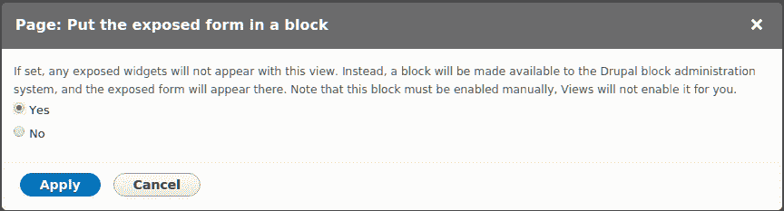

# 相关内容

+   参考*第七章*，*插件即插即用*，了解更多关于派生的信息

# 利用动态参数

视图可以被配置为接受**上下文过滤器**。上下文过滤器允许您提供一个动态参数，该参数修改视图的输出。值应从 URL 传递；然而，如果它不存在，有方法可以提供默认值。

在这个菜谱中，我们将创建一个名为 `My Content` 的新页面，该页面将在 `/user/%/content` 路由上显示用户的创作内容。

# 如何操作...

1.  前往结构，然后是视图。这将带您查看所有创建的视图的行政概览。点击添加视图以创建一个新的视图。

1.  将视图名称设置为 My Content。

1.  接下来，我们将修改视图设置。我们希望显示类型为所有内容的条目，并将标记为空。这将允许显示所有内容。

1.  选择“创建页面”。保持页面标题不变。我们需要将路径更改为 `user/%user/content`。点击“保存并编辑”以移动到下一个屏幕并添加上下文过滤器。

在构建视图页面时，在路径中添加百分号标识一个路由变量。通过添加实体类型的名称，Drupal 将将输入匹配为该类型的实体标识符。

1.  在页面右侧的表单的“高级”部分切换。在上下文过滤器部分点击“添加”。

1.  选择“作者：内容”，然后点击“添加”并配置上下文过滤器。

1.  将“当过滤器值不在 URL 中时”的默认值更改为“显示“访问被拒绝””，以防止所有内容都显示为具有不良路由值的错误：

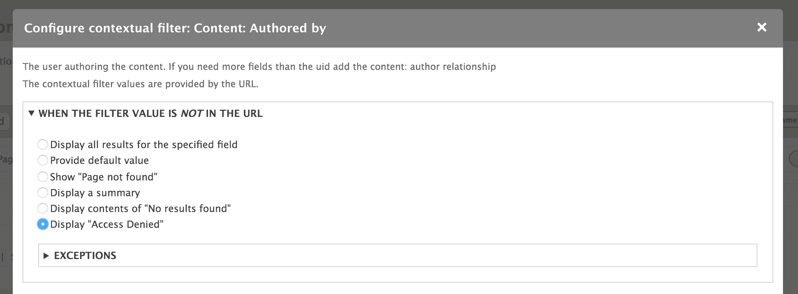

1.  点击“应用”，然后点击“保存”以保存视图。

1.  前往 `/user/1/content`，您将看到由第一个用户创建的内容。

# 它是如何工作的...

上下文过滤器模仿 Drupal 路由系统中找到的路由变量。变量由百分号作为视图路径中的占位符表示。视图将根据它们的放置顺序将每个占位符与上下文过滤器匹配。这允许您有多个上下文过滤器；您只需确保它们按正确顺序排列。

视图模块知道如何处理占位符，因为您在添加过滤器时选择了数据类型。一旦添加了上下文过滤器，就会有额外的选项来处理路由变量。

# 更多内容...

我们现在将探索使用上下文过滤器时可用的一些额外选项。

# 使用上下文过滤器预览

您仍然可以从编辑表单预览视图。您只需将上下文过滤器值添加到由正斜杠（`/`）连接的文本表单中。在这个配方中，您可以

将导航到 `/user/1/content` 的操作替换为在预览表单中简单地输入 `1` 并更新预览。

# 在用户页面上显示为标签页

即使在配方中创建的视图遵循 `/user` 下的路由，它也不会作为本地任务标签显示，直到它有一个菜单条目定义。

返回并编辑“我的内容”视图。在页面设置部分，您需要将菜单选项中的“无菜单”更改为“菜单”。点击该链接将打开菜单链接设置对话框。

选择“菜单”标签页，提供一个菜单链接标题，例如“我的内容”。选择“<用户账户菜单）”作为父级。点击“应用”并保存您的视图。当您再次访问 `/user` 页面时，它将提供“我的内容”页面。

您可能需要重建 Drupal 的缓存，以便重新构建路由系统，使 Drupal 能够意识到菜单标签。

# 修改页面标题

使用上下文过滤器，您有权操作当前页面的标题。当添加或编辑上下文过滤器时，您可以修改页面标题。您可以在“当过滤器值存在于 URL 中或提供默认值”部分中检查“覆盖标题”选项。

此文本框允许您输入将显示的新标题。此外，您可以使用格式为`%#`的路由上下文传递的信息，其中`#`是参数顺序。

# 验证

上下文过滤器可以附加验证。如果不指定额外的验证，视图将采用预期的参数并尝试使其“正常工作”。您可以通过添加验证来帮助限制此范围并过滤掉无效的路由变量。

您可以通过勾选“当过滤器值存在于 URL 中或提供默认值”部分中的“指定验证标准”来启用验证。默认设置为基本验证，这允许您指定如果数据无效，视图应该如何反应；根据我们的配方，这将是如果用户未找到。

验证器选项列表不会被您选择的上下文过滤器项过滤，因此其中一些可能不适用。对于我们的配方，可能需要选择“用户 ID”并验证用户是否有权访问“用户”。此验证器将确保当前用户能够查看路由的用户配置文件。此外，还可以根据其角色进一步限制：

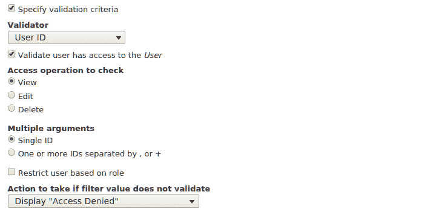

这为您提供了更细粒度的控制，当使用上下文过滤器进行路由参数时，视图如何操作。

# 多重和排除

您还可以配置上下文过滤器以允许`AND`或`OR`操作以及排除。这些选项在添加或编辑上下文过滤器时位于“更多”部分。

可以勾选“允许多个值”选项以启用`AND`或`OR`操作。如果上下文过滤器参数包含由加号（`+`）连接的值系列，则它充当`OR`操作。如果值由逗号（`,`）连接，则它充当`AND`操作。

当勾选“排除”选项时，值将被排除在结果之外，而不是视图被其限制。

# 在视图中添加关系

如本章开头所述，视图是一个可视化查询构建器。当您首次创建视图时，会指定一个基础表，从中提取数据。视图自动知道如何连接表以获取字段数据，例如正文文本或自定义附加字段。

当使用实体引用字段时，您可以显示原始标识符、引用实体的标签或整个渲染的实体。然而，如果您基于引用字段添加关系，您将能够显示该实体可用的任何字段。

在本配方中，我们将更新用于管理文件的“文件”视图，以显示上传文件的用户的用户名。

# 如何做到这一点...

1.  前往结构然后是视图。这将带您到所有已创建视图的管理概览

1.  找到文件视图并点击编辑。

1.  点击高级以展开该部分，然后点击位于关系旁边的添加。

1.  搜索用户。选择上传关系的用户选项，然后点击应用（此显示）：

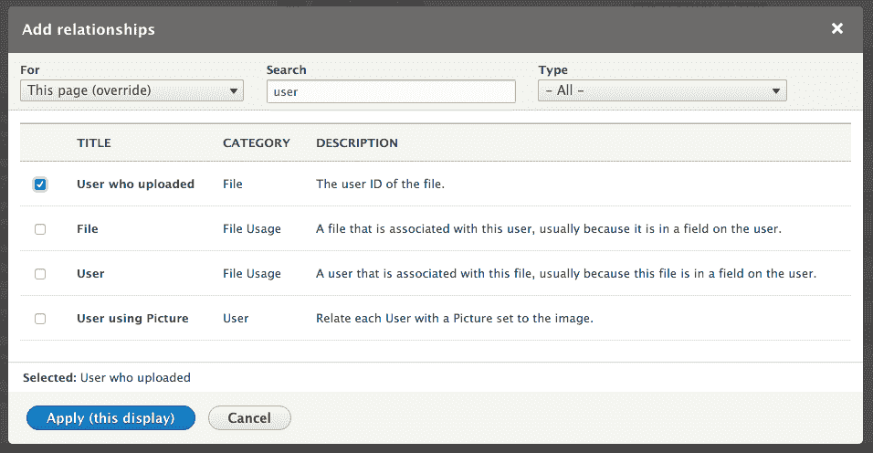

1.  接下来，我们将看到一个关系的配置表单。点击应用（此显示）以使用默认设置。

1.  在字段部分点击添加以添加新字段。

1.  搜索名称并选择名称：用户字段，然后点击应用（所有显示）。

1.  此视图使用聚合，当您第一次添加字段时，将显示一个新的配置表单。点击应用并继续使用默认设置。

我们将在本食谱的*更多内容...*部分讨论视图和聚合。

1.  我们将使用默认的字段设置，这将提供名称标签并将其格式化为用户名并链接到用户的个人资料。点击应用（此显示）。

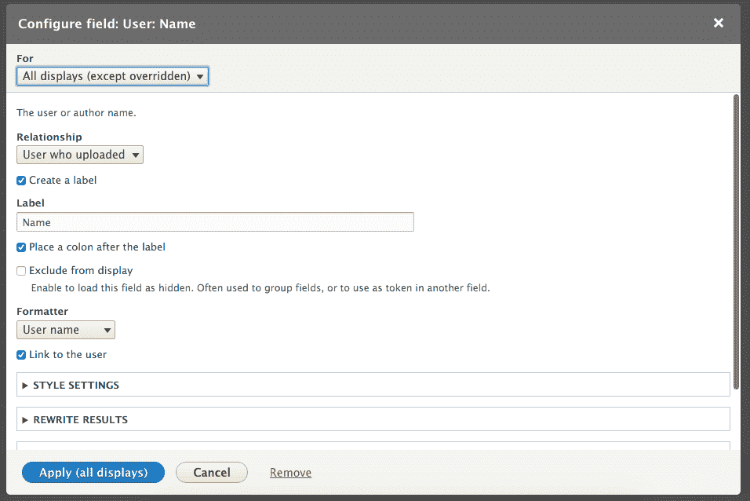

1.  点击保存以完成编辑视图并提交您的更改。

1.  当在`/admin/content/files`中查看文件列表时，现在将显示上传文件的用户名：

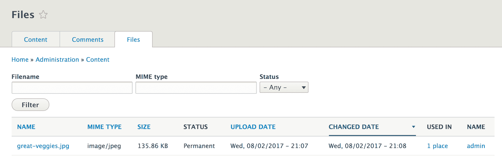

# 它是如何工作的...

Drupal 以规范化的格式存储数据。简而言之，数据库规范化涉及在特定相关表中组织数据。每个实体类型都有自己的数据库表，所有字段都有自己的数据库表。当您创建一个视图并指定将显示哪种数据时，您正在指定数据库中的基础表，视图将查询此表。视图将自动为您关联属于实体及其关系的字段到那些表。

当一个实体有一个实体引用字段时，您可以将关系添加到引用实体类型的表中。这是一个显式定义，而字段是隐式的。当关系被显式定义时，所有引用实体类型的字段都将进入作用域。然后可以显示、过滤和排序引用实体类型上的字段。

# 更多内容...

在视图中使用关系允许您创建一些强大的显示。我们将讨论聚合和关于关系的附加信息。

# 实体引用字段提供的关系

视图模块使用一系列钩子来检索数据，然后使用这些数据来表示与数据库交互的方式。其中之一是`hook_field_views_data`钩子，它处理字段存储配置实体并将其数据注册到视图中。视图模块代表 Drupal 核心实现这一点，以添加关系和反向关系，用于实体引用字段。

由于实体引用字段已设置架构信息，视图可以通过理解字段表名、目标实体表名和目标实体标识列来动态生成这些关系。

# 通过自定义代码提供的关联

有时候您需要自己定义一个关系，使用自定义代码。通常，当在 Drupal 中处理自定义数据时，您更有可能创建一个新的实体类型；这个主题在*第九章*，*配置管理 - 在 Drupal 8 中部署*中有所涉及。然而，这并不总是情况，您可能只需要一种简单的方法来存储数据。一个例子可以在数据库日志模块中找到。数据库日志模块定义了一个数据库表的架构，然后使用 `hook_views_data` 将其数据库表暴露给视图。

`dblog_schema` 钩子实现返回由模块创建的监视数据库表上的 `uid` 列。然后，该列通过以下定义暴露给视图：

```php
  $data['watchdog']['uid'] = array( 
    'title' => t('UID'), 
    'help' => t('The user ID of the user on which the log entry 
       was written..'), 
    'field' => array( 
      'id' => 'numeric', 
    ), 
    'filter' => array( 
      'id' => 'numeric', 
    ), 
    'argument' => array( 
      'id' => 'numeric', 
    ), 
    'relationship' => array( 
      'title' => t('User'), 
      'help' => t('The user on which the log entry as written.'), 
      'base' => 'users', 
      'base field' => 'uid', 
      'id' => 'standard', 
    ), 
  ); 
```

此数组告诉视图，`watchdog` 表有一个名为 `uid` 的列。它具有数字性质，用于显示、过滤和排序能力。关系

键是一个信息数组，指示视图如何使用它来在 `users` 表上提供关系（`LEFT JOIN`）。`User` 实体使用 `users` 表，其主键为 `uid`。

# 使用聚合和视图。

在高级部分有一个视图设置，允许您启用聚合。

此功能允许您启用使用 SQL 聚合函数，例如 `MIN`、`MAX`、`SUM`、`AVG` 和 `COUNT`。在本食谱中，文件视图使用聚合来汇总 Drupal 网站上每个文件的用法计数。

聚合设置针对每个字段设置，启用时，它们有自己的链接来配置这些设置：

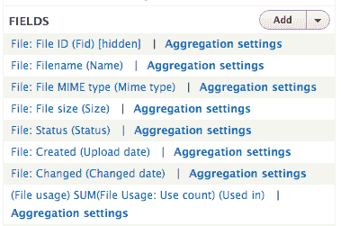

# 提供实体引用结果视图

在*第二章*，*内容创作体验*中介绍的实体引用字段可以利用自定义视图来提供可用的字段值。默认的实体引用字段将显示它可以引用的所有类型的实体。唯一可用的过滤器是基于实体捆绑，例如仅返回 `Article` 节点。使用实体引用视图，您可以提供更多过滤器，例如仅返回用户创作的内容。

在本食谱中，我们将创建一个实体引用视图，通过作者过滤内容。我们将添加字段到用户账户表单中，允许用户选择他们喜欢的贡献内容。

# 如何做到这一点...

1.  前往结构，然后是视图。这将带您到所有已创建视图的管理概览。点击添加视图以创建一个新的视图。

1.  将视图名称设置为“我的内容引用视图”，并保留当前的视图设置配置。

1.  不要选择创建页面或块。点击保存并编辑以继续编辑视图。

1.  点击添加按钮创建新的显示。选择实体引用选项以创建显示：

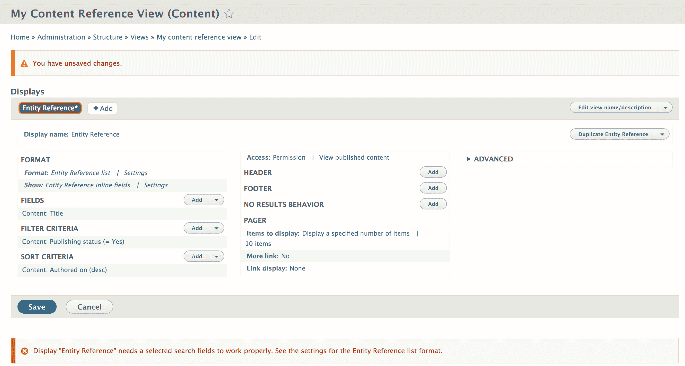

1.  格式将自动设置为实体引用列表，它使用字段。点击旁边的设置来修改样式格式。

1.  对于搜索字段，勾选“内容：标题”选项，然后点击应用。这就是字段将执行自动完成搜索的地方。

1.  您需要修改“内容：标题”字段以停止将其作为链接包装结果。点击字段标签并取消选中链接到内容。点击应用以保存字段设置：

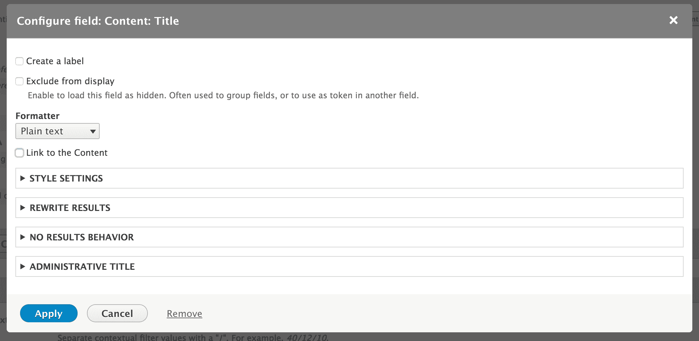

1.  然后，我们将使用上下文筛选器来限制结果仅限于当前登录用户。在高级部分点击上下文筛选器的添加。

1.  选择“由谁创建：内容”选项，然后点击添加并配置上下文筛选器。

1.  将“当筛选器值不可用时的设置”更改为“提供默认值”。从登录用户中选择用户 ID 作为类型值。点击应用以配置上下文筛选器。

1.  点击保存以保存视图。

1.  前往配置然后账户设置，以便能够管理用户账户上的字段。

1.  添加一个新的实体引用字段，引用内容，命名为“突出贡献”，并允许它有无限值。点击保存字段设置按钮。

1.  将引用类型方法更改为使用视图：通过实体引用视图进行筛选并选择我们刚刚创建的视图：

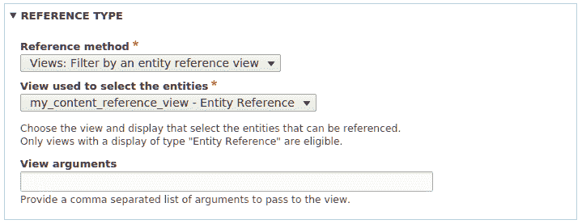

1.  现在，当用户编辑他们的账户时，他们只能引用在此引用字段中创建的内容。

# 它是如何工作的...

实体引用字段定义提供了选择插件。视图模块提供了一个实体引用选择插件。这允许实体引用将数据收集到视图中以接收可用结果。

视图的显示类型要求您选择在使用自动完成小部件时用于搜索的字段。如果您不使用自动完成小部件，而是使用选择列表或复选框和单选按钮，则它将返回视图的所有结果。

# 参见

+   参考第*第七章*，*插件即插即用*，了解更多关于插件的信息。
