# 扩展 Drupal

本章深入探讨使用自定义模块扩展 Drupal：

+   创建模块

+   定义自定义页面

+   定义权限

+   在安装或更新时提供配置

+   创建事件订阅者

+   使用 Features 3.0

# 简介

Drupal 的一项特性使其变得令人向往，那就是能够通过模块进行自定义。无论是自定义还是贡献的，模块都扩展了 Drupal 的功能和能力。模块不仅可以扩展 Drupal，还可以创建提供配置和可重用功能的方式。

本章将讨论如何创建模块并允许 Drupal 发现它，从而可以从扩展页面安装它。权限、自定义页面和默认配置都来自模块。我们将探讨如何通过自定义模块提供这些功能。

除了创建模块外，我们还将讨论 Features 模块，它提供了一套生成模块和导出其配置的工具。

# 创建模块

扩展 Drupal 的第一步是创建一个自定义模块。尽管这项任务听起来令人畏惧，但它可以通过几个简单的步骤完成。模块可以提供功能性和对其他模块提供的功能的自定义，或者它们可以用作包含配置和站点状态的方式。

在本食谱中，我们将通过定义一个 `info.yml` 文件来创建一个模块，该文件包含 Drupal 用于发现扩展的信息，并启用该模块。

# 如何操作...

1.  在您的 Drupal 站点的 `modules` 文件夹的根目录下创建一个名为 `mymodule` 的文件夹。这将成为您的模块目录。

1.  在您的模块目录中创建一个 `mymodule.info.yml` 文件。它包含标识模块给 Drupal 的元数据。

1.  在 `name` 键下添加一行以提供模块的名称：

```php
name: My Module! 
```

1.  我们需要提供 `type` 键来定义扩展的类型。我们提供 `module` 值：

```php
type: module 
```

1.  `description` 键允许您提供有关您的模块的额外信息，这些信息将在模块列表页面上显示：

```php
description: This is an example module from the Drupal 8 Cookbook! 
```

1.  所有模块都需要定义 `core` 键以指定主要版本兼容性：

```php
core: 8.x 
```

1.  保存 `mymodule.info.yml` 文件，其代码如下：

```php
name: My Module! 
type: module 
description: This is an example module from the Drupal 8 Cookbook! 
core: 8.x
```

1.  登录您的 Drupal 网站，并从管理工具栏转到扩展。

1.  搜索“我的模块”以过滤选项列表。

1.  打勾并点击安装以启用您的模块：

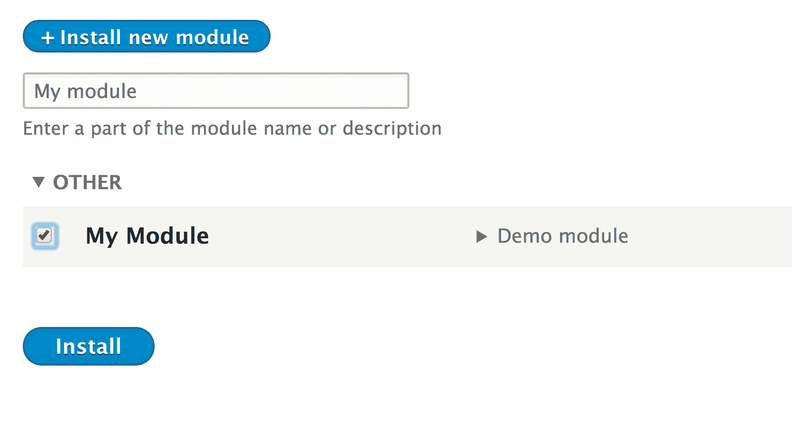

# 它是如何工作的...

Drupal 利用 `info.yml` 文件来定义扩展。Drupal 有一个发现系统，用于定位这些文件并将它们解析为发现模块。由 `\Drupal\Core\Extension\InfoParser` 类提供的 `info_parser` 服务读取 `info.yml` 文件。解析器保证存在所需类型、`core` 和 `name` 键。

当模块安装时，它会被添加到`core.extension`配置对象中，该对象包含已安装模块和主题的列表。`core.extension`模块数组中的模块集合将被安装，并将解析 PHP 命名空间、加载服务和注册钩子。

当 Drupal 准备执行钩子或注册服务时，它将遍历`core.extension`中的`module`键的值。

# 更多...

关于 Drupal 模块和模块`info.yml`文件，我们可以探索更多细节。

# 模块命名空间

Drupal 8 使用由**PHP 框架互操作性小组**（**PHP-FIG**）开发的 PSR-4 标准。PSR-4 标准是针对基于包的 PHP 命名空间自动加载。它定义了一个标准，以了解如何根据命名空间和类名自动包含类。Drupal 模块在 Drupal 根命名空间下有自己的命名空间。

使用配方中的模块，我们的 PHP 命名空间将是`Drupal\mymodule`，这代表`modules/mymodule/src`文件夹。

使用 PSR-4，文件只需要包含一个类、接口或特质。这些文件需要与包含的类、接口或特质的名称具有相同的文件名。这允许类加载器将命名空间解析为目录路径并知道类的文件名。当文件被使用时，它将被自动加载。

# 模块发现位置

Drupal 支持多个模块发现位置。模块可以放置在以下目录中并被发现：

+   `/profiles/CURRENT PROFILE/modules`

+   `/sites/all/modules`

+   `/modules`

+   `/sites/default/modules`

+   `/sites/example.com/modules`

`\Drupal\Core\Extension\ExtensionDiscovery`类通过类型处理扩展的发现。它将迭代扫描每个位置并发现可用的模块。发现顺序很重要。如果同一模块放置在`/modules`中，但也放在`sites/default/modules`目录中，则后者将具有优先权。

# 定义一个包组

模块可以定义一个`package`键来在模块列表页面上分组模块：

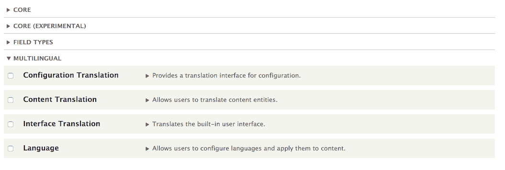

包含多个子模块的项目，如 Drupal Commerce，指定包以规范化模块列表形式。Drupal Commerce 项目的贡献模块使用包名`Commerce (contrib)`在模块列表页面上分组。

# 模块依赖

模块可以定义依赖关系以确保在您的模块启用之前，那些模块已被启用。

这是`Responsive Image`模块的`info.yml`文件：

```php
name: Responsive Image 
type: module 
description: 'Provides an image formatter and breakpoint mappings to output responsive images using the HTML5 picture tag.' 
package: Core 
version: VERSION 
core: 8.x 
dependencies: 
  - breakpoint 
  - image 
```

`dependencies`键指定在启用`Responsive Image`模块之前需要首先启用`breakpoint`和`image`模块。当启用需要依赖项且依赖项已禁用的模块时，安装表单将提供一个提示，询问你是否想安装依赖项。如果缺少依赖模块，则无法安装。依赖项将显示为（缺失）的状态。

作为另一个模块依赖项的模块将在其描述中声明信息，以及其他模块的状态。例如，Breakpoint 模块将显示 Re 模块需要它作为依赖项并且已禁用：

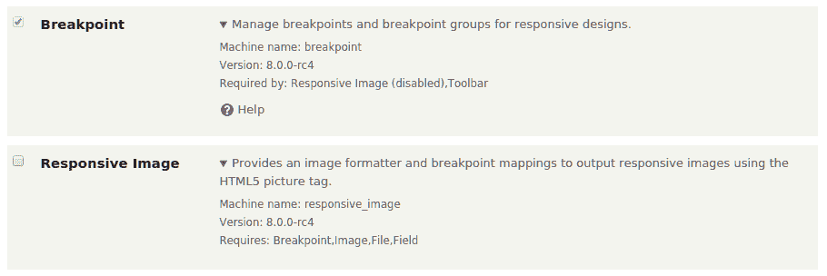

# 指定模块的版本

有一个`version`键定义了当前模块的版本。Drupal.org 上的项目不会直接指定此版本，因为当创建发布时，Drupal.org 扩展打包器会添加它。然而，这个键对于私有模块跟踪发布信息可能很重要。

预期版本是单个字符串，例如`1.0-alpha1`和`2.0.1`。你也可以传递`VERSION`，它将解析为 Drupal 核心的当前版本。

Drupal.org 目前不支持贡献项目的语义版本。在问题队列中有一个现在已推迟的政策讨论，可以在[`www.drupal.org/node/1612910`](https://www.drupal.org/node/1612910)找到。

# 参见...

+   参考 PSR-4：自动加载规范[`www.php-fig.org/psr/psr-4/`](http://www.php-fig.org/psr/psr-4/)

+   参考 Drupal.org 文档创建模块[`www.drupal.org/docs/8/creating-custom-modules`](https://www.drupal.org/docs/8/creating-custom-modules)

# 定义自定义页面

在 Drupal 中，有一些代表 URL 路径的路由，Drupal 将这些路径解释为返回内容。模块可以定义路由和方法，这些方法返回要渲染并显示给最终用户的数据。

在这个菜谱中，我们将定义一个控制器，它提供输出和路由。路由提供了一个 URL 路径，Drupal 会将该路径与我们的控制器关联起来以显示输出。

# 准备工作

创建一个新的模块，就像第一个菜谱中的那样。在整个菜谱中，我们将把该模块称为`mymodule`。根据需要使用你的模块名称。

# 如何做到这一点...

1.  首先，我们将设置控制器。在你的模块基本目录中创建一个`src`文件夹，并在其中创建一个名为`Controller`的另一个文件夹。

1.  创建将包含路由控制器类的`MyPageController.php`：

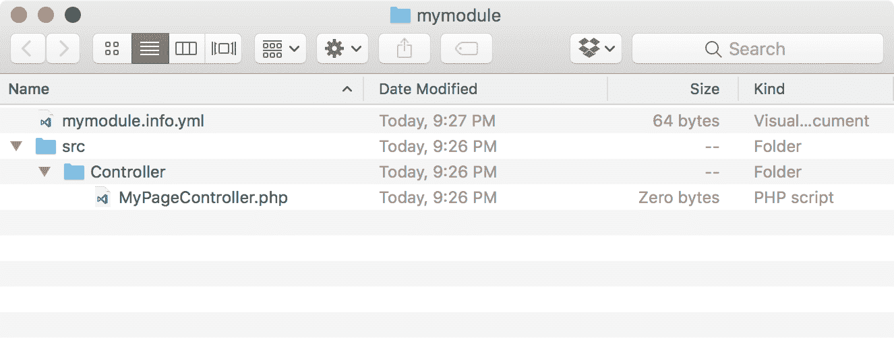

1.  PSR-4 标准规定，文件名与它们包含的类名相匹配，因此我们将创建一个`MyPageController`类：

```php
<?php 

namespace Drupal\mymodule\Controller; 

use Drupal\Core\Controller\ControllerBase; 

/** 
 * Returns responses for My Module module. 
 */ 
class MyPageController extends ControllerBase { 

} 
```

这将创建一个`MyPageController`类，它扩展了`\Drupal\Core\Controller\ControllerBase`类。这个基类提供了一些与容器交互的实用工具。

`Drupal\mymodule\Controller`命名空间允许 Drupal 自动从`/modules/mymodule/src/Controller`目录加载文件。

1.  接下来，我们将在我们的`MyPageController`类中创建一个返回文本字符串的方法。将以下方法添加到我们的`MyPageController`类中：

```php
/** 
 * Returns markup for our custom page. 
 */ 
public function customPage() { 
  return [ 
    '#markup' => t('Welcome to my custom page!'), 
  ]; 
} 
```

`customPage`方法返回一个渲染数组，Drupal 的主题层可以解析。`#markup`键表示一个没有额外渲染或主题处理的价值。

1.  在您模块的根目录中创建一个`mymodule.routing.yml`文件，以便可以向此控制器和方法添加路由。

1.  第一步是为路由定义一个内部名称，以便引用该路由：

```php
mymodule.mypage: 
```

1.  给路由指定一个路径（`mypage`）：

```php
mymodule.mypage: 
  path: '/mypage' 
```

1.  `defaults`键允许我们向控制器提供完全限定的类名、要使用的方法和页面的标题：

```php
mymodule.mypage: 
  path: '/mypage' 
  defaults: 
    _controller: '\Drupal\mymodule\Controller\MyPageController::customPage' 
    _title: 'My custom page' 
```

在提供完全限定的类名时，需要提供初始的反斜杠`\`。

记住，Drupal 使用 PSR-4 自动加载。Drupal 能够确定具有`\Drupal\mymodule\Controller`命名空间的类位于`/path/to/drupal/modules/mymodule/src/Controller`目录中。

1.  最后，定义一个`requirements`键来设置访问回调：

```php
mymodule.mypage: 
  path: '/mypage' 
  defaults: 
  _controller: '\Drupal\mymodule\Controller\MyPageController::customPage' 
  _title: 'My custom page' 
requirements: 
  _permission: 'access content' 
```

1.  前往配置，然后在开发部分中的性能，点击清除所有缓存按钮以重建 Drupal 的路由。

1.  访问您的 Drupal 站点上的`/mypage`并查看您的自定义页面：

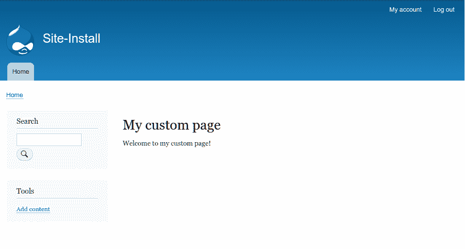

# 它是如何工作的...

Drupal 使用路由，这些路由定义了一个路径，用于返回内容。每个路由在控制器类中都有一个方法，该方法以渲染数组的形式生成内容，以便发送给用户。当请求到达 Drupal 时，系统会尝试将路径与已知的路由进行匹配。如果找到路由，则使用路由的定义来显示页面。如果找不到路由，则显示 404 页面。

HTTP 内核接收请求并加载路由。它将调用定义的控制器方法或过程函数。调用方法或函数的结果随后被交给 Drupal 的表现层，以将其渲染成可以发送给用户的内容。

Drupal 8 基于 Symfony HTTP 内核构建，以提供其路由系统的底层功能。它增加了提供访问要求、将占位符转换为加载的对象以及提供部分页面响应的能力。

# 还有更多...

路由具有额外的可配置功能；我们将在下一节中探讨这些功能。

# 路由中的参数

路由可以接受动态参数，这些参数可以传递给路由控制器的方法。可以在路由中使用花括号定义占位符元素，以表示动态值。

以下示例代码显示了路由可能的样子：

```php
mymodule.cats: 
  path: '/cat/{name}' 
  defaults: 
    _controller: '\Drupal\mymodule\Controller\MyPageController::cats' 
  requirements: 
    _permission: 'access content' 
```

此路由指定了`/cat/{name}`路径。`{name}`占位符将接受动态值并将它们传递给控制器的方法：

```php
class MyPageController { 
  // ... 
  public function cats($name) { 
    return [ 
      '#markup' => t('My cats name is: @name', [ 
         '@name' => $name, 
      ]), 
    ]; 
  } 
} 
```

此方法接受路由中的`name`变量并将其替换到渲染数组中，以显示为文本。

Drupal 的路由系统提供了一种将变量提升为加载对象的方法。在 Drupal 中，提升是将路由参数转换为更丰富的数据的过程。这包括将实体 ID 转换为提供加载的实体给系统。在`\Drupal\Core\ParamConverter`命名空间下有一组参数转换类。`EntityConverter`类将读取路由中定义的选项，并用加载的实体对象替换占位符值。

如果我们有一个名为**cat**的实体类型，我们可以将`name`占位符转换为在控制器方法中提供加载的`cat`对象的方法：

```php
mymodule.cats: 
  path: '/cat/{name}' 
  defaults: 
    _controller: '\Drupal\mymodule\Controller\MyPageController::cats' 
  requirements: 
    _permission: 'access content' 
  options: 
    parameters: 
      name: 
         type: entity:cat 
```

对于实体来说，这不是必需的，因为定义的实体路由处理器可以自动生成它。实体在*第十章*，*实体 API*中有详细说明。

# 验证路由中的参数

Drupal 提供了对路由参数的正则表达式验证。如果参数未通过正则表达式验证，将返回 404 页面。使用示例路由，我们可以添加验证以确保在路由参数中只使用字母字符：

```php
mymodule.cats: 
  path: '/cat/{name}' 
  defaults: 
    _controller: '\Drupal\mymodule\Controller\MyPageController::cats' 
  requirements: 
    _permission: 'access content' 
    name: '[a-zA-z]+' 
```

在`requirements`键下，你可以添加一个与占位符名称匹配的新值。然后你可以将其设置为使用正则表达式。这将防止`c@ts`或`cat!`成为有效的参数。

# 路由要求

路由可以通过`requirements`键定义不同的访问要求。可以添加多个验证器。然而，必须有一个提供真值的结果，否则路由将返回 403，拒绝访问。如果路由没有定义要求验证器，这也是正确的。

路由要求验证器是通过实现`\Drupal\Core\Routing\Access\AccessInterface`定义的。以下是在 Drupal 核心中定义的一些常见要求验证器：

+   `_access: TRUE`：始终授予路由访问权限

+   `_entity_access`：验证当前用户是否有执行的能力

    `entity_type.operation`，例如`node.view`

+   `_permission`：检查当前用户是否有提供的权限

+   `_user_is_logged_in`：验证当前用户是否已登录，这在`routing.yml`文件中以布尔值定义

# 提供动态路由

路由系统允许模块以编程方式定义路由。这可以通过提供一个`routing_callbacks`键来实现，该键定义了一个类和方法，该方法将返回一个包含`\Symfony\Component\Routing\Route`对象的数组。

如果你正在处理实体，请参考*第十章*，*实体 API*来了解如何覆盖默认路由处理器以创建动态路由。

在模块的`routing.yml`中，你将定义路由回调键和相关类：

```php
route_callbacks: 
  - '\Drupal\mymodule\Routing\CustomRoutes::routes' 
```

`\Drupal\mymodule\Routing\CustomRoutes`类将有一个名为`routes`的方法，它返回一个 Symfony 路由对象的数组：

```php
<?php 

namespace Drupal\mymodule\Routing; 
use Symfony\Component\Routing\Route; 

class CustomRoutes { 
  public function routes() { 
    $routes = []; 

    // Create mypage route programmatically 
    $routes['mymodule.mypage'] = new Route( 
        // Path definition 
       'mypage', 
        // Route defaults 
       [ 
          '_controller' => '\Drupal\mymodule\Controller\MyPageController::customPage', 
          '_title' => 'My custom page', 
        ], 
        // Route requirements 
       [ 
          '_permission' => 'access content', 
        ] 
    ); 
    return $routes; 
  } 
} 
```

如果一个模块提供了一个与路由交互的类，最佳实践是将它放在模块命名空间的路由部分。这有助于你识别其目的。

调用的方法预期返回一个已启动的路由对象数组。路由类接受以下参数：

+   `路径`: 这代表路由

+   `默认值`: 这是一个默认值数组

+   `需求`: 这是一个必需验证器的数组

+   `选项`: 这是一个可以传递和可选使用的数组

# 修改现有路由

当 Drupal 的路由系统因模块启用或缓存重建而重建时，会触发一个事件，允许模块更改在 YAML 中静态定义或在动态中定义的路由。这涉及到通过扩展`\Drupal\Core\Routing\RouteSubscribeBase`实现事件订阅者，该订阅者订阅`RoutingEvents::ALTER`事件。

在你的模块中创建一个`src/Routing/RouteSubscriber.php`文件。它将包含路由订阅者类：

```php
<?php 

namespace Drupal\mymodule\Routing; 

use Drupal\Core\Routing\RouteSubscriberBase; 
use Symfony\Component\Routing\RouteCollection; 

class RouteSubscriber extends RouteSubscriberBase { 

  /** 
   * {@inheritdoc} 
   */ 
  public function alterRoutes(RouteCollection $collection) { 
    // Change path of mymodule.mypage to use a hyphen 
    if ($route = $collection->get('mymodule.mypage')) { 
      $route->setPath('/my-page'); 
    } 
  } 

} 
```

上述代码扩展了`RouteSubscribeBase`并实现了`alterRoutes()`方法。我们尝试加载`mymodule.mypage`路由，如果存在，则将其路径更改为`my-page`。由于对象总是通过引用传递，我们不需要返回一个值。

为了让 Drupal 识别订阅者，我们需要在模块的`services.yml`文件中描述它。在你的模块基本目录中创建一个`mymodule.services.yml`文件，并添加以下代码：

```php
services: 
  mymodule.route_subscriber: 
    class: Drupal\mymodule\Routing\RouteSubscriber 
    tags: 
      - { name: event_subscriber } 
```

这将我们的路由订阅者类注册为容器中的服务，以便 Drupal 在事件触发时执行它。

本章后面的*创建事件订阅者*配方将涵盖更多关于事件分派和订阅的内容。

# 参考信息

+   请参阅[`symfony.com/doc/current/book/routing.html`](http://symfony.com/doc/current/book/routing.html)上的 Symfony 路由文档

+   请参阅*第十章*，*实体 API*

+   请参阅[`www.drupal.org/node/2122195`](https://www.drupal.org/node/2122195)上的路由访问检查社区文档

# 定义权限

在 Drupal 中，有角色和权限用于定义用户强大的访问控制列表。模块使用权限来检查当前用户是否有权执行操作、查看特定项目或执行其他操作。然后模块定义使用的权限，以便 Drupal 了解它们。开发者可以构建角色，这些角色由启用的权限组成。

在这个配方中，我们将定义一个新的权限来查看模块中定义的自定义页面。该权限将被添加到自定义路由中，并将访问限制为具有包含权限的角色的用户。

# 准备工作

创建一个新的模块，就像第一个配方中的那样。在整个配方中，我们将把这个模块称为`mymodule`。在以下配方中，根据需要使用你的模块名称。

此配方还会修改模块中定义的路由。我们将把这个路由称为`mymodule.mypage`。修改你模块的`routing.yml`文件中的适当路径。

# 如何操作...

1.  权限存储在`permissions.yml`文件中。在你的模块基本目录中添加一个`mymodule.permissions.yml`。

1.  首先，我们需要定义用于识别此权限的内部字符串，例如`查看我的模块页面`：

```php
view mymodule pages: 
```

1.  每个权限都是一个包含数据的 YAML 数组。我们需要提供一个`title`键，该键将在权限页面上显示：

```php
view mymodule pages: 
  title: 'View my module pages' 
```

1.  权限有一个`description`键，用于在权限页面上提供权限的详细信息：

```php
view mymodule pages: 
  title: 'View my module pages' 
  description: 'Allows users to view pages provided by My Module' 
```

1.  保存你的`permissions.yml`并编辑模块的`routing.yml`以使用权限来控制对路由的访问。

1.  修改路由的`requirements`键，使其包含一个等于定义权限的`_permission`键：

```php
mymodule.mypage: 
  path: '/mypage' 
  defaults: 
  _controller: '\Drupal\mymodule\Controller\MyPageController::customPage' 
  _title: 'My custom page' 
requirements: 
  _permission: 'view mymodule pages' 
```

1.  前往配置，然后在开发部分的性能中点击清除所有缓存以重建 Drupal 的路由。

1.  前往人员，然后到权限，以认证用户和匿名用户角色为我的模块添加你的权限！：

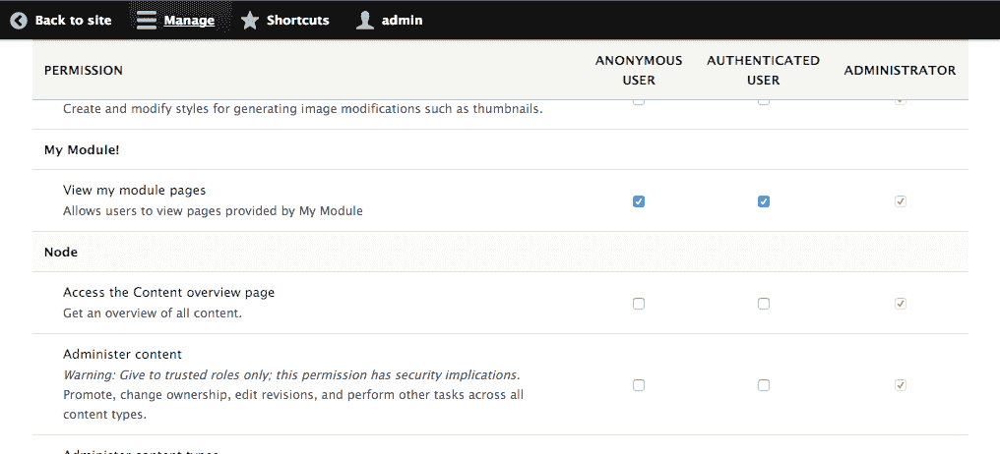

1.  从你的 Drupal 站点注销并查看`/mypage`页面。你会看到内容，而不会收到访问拒绝页面。

# 它是如何工作的...

权限和角色由`User`模块提供。`user.permissions`服务发现由已安装模块提供的`permissions.yml`。默认情况下，服务是通过`\Drupal\user\PermissionHandler`类定义的。

Drupal 不会保存所有可用权限的列表。当权限页面被加载时，系统的权限会被加载。角色包含一个权限数组。

当检查用户对某个权限的访问时，Drupal 会检查所有用户角色，以查看它们是否支持该权限。

你可以将一个未定义的权限传递给用户访问检查，而不会收到错误。除非用户是 UID 1，否则访问检查将简单地失败。

# 更多内容...

在接下来的章节中，我们将介绍更多在模块中处理权限的方法。

# 权限的访问限制标志

如果启用，权限可能会被标记为具有安全风险；这是`restrict access`标志。当此标志设置为`restrict access: TRUE`时，它将在权限描述中添加一个警告。

这允许模块开发者提供更多上下文，以说明权限可能给予用户的控制程度：

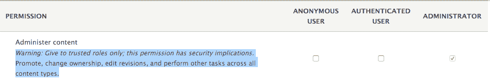

我们从配方中定义的权限看起来会像以下这样：

```php

view mymodule pages: 
 title: 'View my module pages' 
 description: 'Allows users to view pages provided by My Module' 
 restrict access: TRUE
```

# 以编程方式定义权限

权限可以通过模块以编程方式或静态方式在 `YAML` 文件中定义。模块需要在它的 `permissions.yml` 中提供一个 `permission_callbacks` 键，该键包含一个类及其方法的数组或一个过程函数名。

例如，过滤器模块根据 Drupal 中创建的不同文本过滤器提供细粒度的权限：

```php
permission_callbacks: 
- Drupal\filter\FilterPermissions::permissions 
```

这告诉 `user_permissions` 服务执行权限方法

`\Drupal\Filter\FilterPermissions` 类。该方法预期返回一个与 `permissions.yml` 文件相同结构的数组。

使用生成的权限的示例将在 *第十章*，*实体 API* 的 *实现实体自定义访问控制* 菜谱中介绍。

# 检查用户是否有权限

用户账户界面提供了一个检查用户实体是否有权限的方法。要检查当前用户是否有权限，你需要获取当前用户，并需要调用 `hasPermission` 方法：

```php
\Drupal::currentUser()->hasPermission('my permission'); 
```

`\Drupal::currentUser()` 方法返回当前活动的用户对象。这允许你检查活动用户是否有执行某些类型操作所必需的权限。

# 在安装或更新时提供配置

Drupal 提供了一个配置管理系统，这在 *第九章*，*配置管理 - 在 Drupal 8 中部署* 中有讨论，模块可以在安装或通过更新系统提供配置。模块在首次安装时通过 `YAML` 文件提供配置；然而，可以通过 Drupal 更新系统在代码中对配置进行更新。

在这个菜谱中，我们将提供一个配置 YAML，它创建一个新的联系表单，然后通过更新系统中的模式版本更改来操作它。

# 准备工作

创建一个类似于第一个菜谱中的新模块。在整个菜谱中，我们将把这个模块称为 `mymodule`。在必要时，请使用你模块的适当名称。

# 如何做...

1.  在你模块的基本目录中创建一个 `config` 文件夹。Drupal 要求其配置 YAML 必须位于 `config` 的子文件夹中。

1.  在 `config` 文件夹中创建一个名为 `install` 的文件夹。此文件夹中的配置 YAML 将在模块安装时导入。

1.  在 `install` 文件夹中，创建一个 `contact.form.contactus.yml` 文件来存储联系表单的 YAML 定义，联系我们：![img/7ec6fd6a-85a9-4d4e-879a-6683f5a26cd9.png]

1.  我们将根据 Contact 模块提供的 `contact.schema.yml` 文件定义联系表单的配置。将以下 YAML 内容添加到文件中：

```php
langcode: en 
status: true 
dependences: {}
id: contactus 
label: 'Contact Us' 
recipients: 
  - webmaster@example.com 
reply: '' 
weight: 0 
```

配置条目基于模式定义，我们将在*第九章*，“配置管理 - 在 Drupal 8 中部署”中介绍。`langcode`、`status`和`dependencies`是必需的配置管理键。

`id`是联系表单的机器名称，而`label`是人类的显示名称。`recipients`键是一个有效的电子邮件地址的 YAML 数组。`reply`键是自动回复字段的文本字符串。最后，`weight`定义了表单在管理列表中的权重。

1.  前往“扩展”并启用您的模块以导入配置项。

1.  联系我们表单现在将位于“联系表单概览”页面，位于“结构”下：

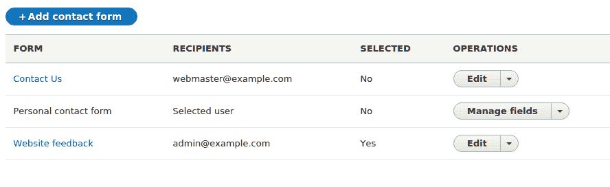

1.  在模块的基本目录中创建一个`mymodule.install`文件。Drupal 检查`.install`文件以查找更新钩子。

1.  我们将创建一个名为`mymodule_update_8001()`的函数，该函数将被更新系统读取并执行我们的配置更改：

```php
<?php 

/** 
 * Update "Contact Us" form to have a reply message. 
 */ 
function mymodule_update_8001() { 
  $contact_form = \Drupal\contact\Entity\ContactForm::load('contactus'); 
  $contact_form->setReply(t('Thank you for contacting us, we will reply shortly')); 
  $contact_form->save(); 
} 
```

此函数使用实体的类来加载我们的配置实体对象。它加载了我们的模块提供的`contactus`，并将回复属性设置为新的值。

1.  在浏览器中前往`/update.php`以运行 Drupal 的数据库更新系统。点击“应用挂起更新”以运行更新系统：

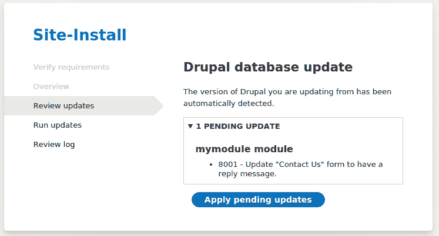

1.  检查联系我们表单设置并验证回复消息是否已设置。

# 它是如何工作的...

Drupal 的`moduler_installer`服务，通过`\Drupal\Core\Extension\ModuleInstaller`提供，确保在安装时处理模块的`config`文件夹中定义的配置项。当安装模块时，通过`\Drupal\Core\Config\ConfigInstaller`提供的`config.installer`服务被调用以处理模块的默认配置。

在事件中，`config.installer`服务尝试从已存在的`install`文件夹导入配置，并将抛出异常。模块不能通过静态 YAML 定义提供对现有配置所做的更改。

由于模块不能通过提供给 Drupal 的静态 YAML 定义来调整配置对象，因此它们可以利用数据库更新系统来修改配置。Drupal 为模块使用模式版本。模块的基本模式版本是`8000`。模块可以提供`hook_update_N`形式的更新钩子，其中`N`代表下一个模式版本。当 Drupal 运行更新时，它们将执行适当的更新钩子并更新模块的模式版本。

配置对象默认是不可变的。要编辑配置，需要通过配置工厂服务加载可变对象。

# 更多...

我们将在*第九章*，*配置管理 - 在 Drupal 8 中部署*中讨论配置；然而，现在我们将深入探讨在处理模块和配置时的一些重要注意事项。

# 配置子目录

配置管理系统将在模块的 `config` 文件夹中检查三个目录，如下所示：

+   `install`

+   `optional`

+   `schema`

`install` 文件夹指定要导入的配置。如果配置对象存在，安装将失败。`optional` 文件夹包含在以下条件满足时将安装的配置：

+   配置尚未存在

+   它是一个配置实体

+   其依赖关系可以满足

如果任何一个条件失败，配置将不会安装，但不会停止模块的安装过程。

`schema` 文件夹提供配置对象定义。这使用 YAML 定义来结构化配置对象，并在*第九章*，*配置管理 - 在 Drupal 8 中部署*中进行了深入探讨。

# 在安装时修改现有配置

配置管理系统不允许模块在已存在的安装上提供配置。例如，如果模块尝试提供 `system.site` 并定义站点的名称，它将无法安装。这是因为当您首次安装 Drupal 时，系统模块提供了此配置对象。

Drupal 提供了 `hook_install()`，模块可以在其 `.install` 文件中实现。此钩子在模块的安装过程中执行。以下代码将在模块安装时将站点标题更新为 *Drupal 8 Cookbook*！

```php
/** 
 * Implements hook_install(). 
 */ 
function mymodule_install() { 
  // Set the site name. 
  \Drupal::configFactory() 
    ->getEditable('system.site') 
    ->set('name', 'Drupal 8 Cookbook!') 
    ->save(); 
} 
```

可配置对象在默认的 `config` 服务加载时默认是不可变的。要修改配置对象，您需要使用配置工厂来接收一个可变对象。可变对象可以有 `set` 和 `save` 方法，这些方法用于在配置对象中更新配置。

# 参见

+   参见*第九章*，*配置管理 - 在 Drupal 8 中部署*

# 创建事件订阅者

Drupal 8 的新特性之一是事件调度系统。Drupal 的许多优点之一是能够对特定过程做出反应并对其进行更改或做出反应。与存在于 Drupal 8 中并且已经存在许多版本的 Drupal 中的钩子系统不同，事件调度系统使用显式注册到事件。

事件调度系统来自 Symfony 框架，允许组件之间轻松交互。在 Drupal 中，集成的 Symfony 组件会触发事件，事件订阅者可以监听事件并对更改或其他过程做出反应。

在这个菜谱中，我们将订阅 `REQUEST` 事件，该事件在请求首次处理时触发。如果用户未登录，我们将将其导航到登录页面。

# 如何操作...

1.  在你的模块中创建 `src/EventSubscriber/RequestSubscriber.php`。

1.  定义 `RequestSubscriber` 类，该类实现了 `EventSubscriberInterface` 接口：

```php
<?php

 namespace Drupal\mymodule\EventSubscriber;

 use Symfony\Component\EventDispatcher\EventSubscriberInterface;

 class RequestSubscriber implements EventSubscriberInterface {

 } 

```

1.  为了满足接口要求，我们必须添加一个 `getSubscribedEvents` 方法。这告诉系统我们正在订阅哪些事件以及需要调用的方法：

```php
<?php

 namespace Drupal\mymodule\EventSubscriber;

 use Symfony\Component\EventDispatcher\EventSubscriberInterface;
 use Symfony\Component\HttpKernel\KernelEvents;

 class RequestSubscriber implements EventSubscriberInterface {

   /**
    * {@inheritdoc}
    */
   public static function getSubscribedEvents() {
     return [
       KernelEvents::REQUEST => ['doAnonymousRedirect', 28],
     ];
   }

 } 
```

`KernelEvents` 类提供了可用事件的常量。我们返回的数组指定了要调用的方法和该事件的优先级。

优先级将在 *如何工作*... 部分讨论。它提供在启用 `dynamic_page_cache` 模块时解决可能冲突的示例。

1.  创建我们指定的 `doAnonymousRedirect` 方法，该方法将接收一个 `GetResponseEvent` 参数：

```php
<?php

 namespace Drupal\mymodule\EventSubscriber;

 use Drupal\Core\Url;
 use Symfony\Component\EventDispatcher\EventSubscriberInterface;
 use Symfony\Component\HttpFoundation\RedirectResponse;
 use Symfony\Component\HttpKernel\Event\GetResponseEvent;
 use Symfony\Component\HttpKernel\KernelEvents;

 class RequestSubscriber implements EventSubscriberInterface {

   /**
    * Redirects all anonymous users to the login page.
    *
    * @param \Symfony\Component\HttpKernel\Event\GetResponseEvent $event
    *   The event.
    */
   public function doAnonymousRedirect(GetResponseEvent $event) {
     // Make sure we are not on the user login route.
     if (\Drupal::routeMatch()->getRouteName() == 'user.login') {
       return;
     }

     // Check if the current user is logged in.
     if (\Drupal::currentUser()->isAnonymous()) {
       // If they are not logged in, create a redirect response.
       $url = Url::fromRoute('user.login')->toString();
       $redirect = new RedirectResponse($url);

       // Set the redirect response on the event, cancelling default response.
       $event->setResponse($redirect);
     }
   }

   /**
    * {@inheritdoc}
    */
   public static function getSubscribedEvents() {
     return [
       KernelEvents::REQUEST => ['doAnonymousRedirect', 28],
     ];
   }

 } 
```

为了防止重定向循环，我们将使用 `RouteMatch` 服务来获取当前路由对象并验证我们是否已经在 `user.login` 路由页面。

然后我们检查用户是否为匿名用户，如果是匿名用户，则将事件的响应设置为重定向响应。

1.  现在我们已经创建了我们的类，在你的模块目录中创建一个 `mymodule.services.yml` 文件。

1.  我们必须将我们的类注册到服务容器中，以便 Drupal 理解它将作为事件订阅者。

```php
services:
   mymodule.request_subscriber:
     class: Drupal\mymodule\EventSubscriber\RequestSubscriber
     tags:
       - { name: event_subscriber } 
```

`event_subscriber` 标签告诉容器调用 `getSubscribedEvents` 方法并注册其方法。

1.  如果模块已经安装，请安装模块或重建 Drupal 的缓存。

1.  以匿名用户身份访问任何页面--你将被重定向到登录表单。

# *如何工作*...

在 Drupal 和 Symfony 组件中，甚至在其他第三方 PHP 库中，事件可以被传递给事件调度器。Drupal 中的 `event_dispatcher` 服务是 Symfony 提供的优化版本，但完全兼容。

当容器构建时，所有标记为 `event_subscribers` 的服务都被收集。然后它们被注册到 `event_dispatcher` 服务中，键为 `getSubscribedEvents` 方法返回的事件。

当 `event_dispatcher` 服务被告知分发一个事件时，它将在所有已订阅的服务上调用适当的方法。对于 `KernelEvents::REQUEST`、`KernelEvents::EXCEPTION` 和 `KernelEvents::VIEW`，你有机会在控制器被调用之前提供响应。然后还有像 `ConfigEvents::SAVE` 和 `ConfigEvents::DELETE` 这样的事件被分发，允许你对配置的保存或删除做出反应，但实际上无法通过事件对象直接调整配置实体。

# 还有更多...

事件订阅者需要了解创建服务、注册它们以及甚至依赖注入。我们将在下一节中进一步讨论。

# 使用依赖注入

使用 Drupal 8 和服务容器的实现，引入了依赖注入的概念。依赖注入是一种软件设计概念，在其基本层面上，它提供了一种使用类而不必直接引用它的方法。在我们的例子中，我们多次使用全局静态类 `\Drupal` 来检索服务。这在服务中是一种不良做法，可能会使测试变得更加困难。

要实现依赖注入，首先，我们将向我们的类添加一个构造函数，该构造函数接受使用的服务（`current_route_match` 和 `current_user`）并将受保护的属性匹配以存储它们：

```php
/**
  * The route match.
  *
  * @var \Drupal\Core\Routing\RouteMatchInterface
  */
 protected $routeMatch;

 /**
  * Account proxy.
  *
  * @var \Drupal\Core\Session\AccountProxyInterface
  */
 protected $accountProxy;

 /**
  * Creates a new RequestSubscriber object.
  *
  * @param \Drupal\Core\Routing\RouteMatchInterface $route_match
  *   The route match.
  * @param \Drupal\Core\Session\AccountProxyInterface $account_proxy
  *   The current user.
  */
 public function __construct(RouteMatchInterface $route_match, AccountProxyInterface $account_proxy) {
   $this->routeMatch = $route_match;
   $this->accountProxy = $account_proxy;
 } 
```

我们可以替换任何对 `\Drupal::` 的调用为 `$this->`：

```php
/**
  * Redirects all anonymous users to the login page.
  *
  * @param \Symfony\Component\HttpKernel\Event\GetResponseEvent $event
  *   The event.
  */
 public function doAnonymousRedirect(GetResponseEvent $event) {
   // Make sure we are not on the user login route.
   if ($this->routeMatch->getRouteName() == 'user.login') {
     return;
   }

   // Check if the current user is logged in.
   if ($this->accountProxy->isAnonymous()) {
     // If they are not logged in, create a redirect response.
     $url = Url::fromRoute('user.login')->toString();
     $redirect = new RedirectResponse($url);

     // Set the redirect response on the event, cancelling default response.
     $event->setResponse($redirect);
   }
 } 

```

最后，我们将更新 `mymodule.services.yml` 以指定我们的构造函数参数，以便在容器运行我们的事件订阅者时进行注入：

```php
services:
   mymodule.request_subscriber:
     class: Drupal\mymodule\EventSubscriber\RequestSubscriber
     arguments: ['@current_route_match', '@current_user']
     tags:
       - { name: event_subscriber } 

```

依赖注入一开始感觉和看起来都很神奇。然而，随着使用和实践，它将开始变得更有意义，并在使用 Drupal 8 开发时变得习以为常。

# 参考信息

+   请参考 Drupal.org API 文档中的事件和可用事件列表，链接为 [`api.drupal.org/api/drupal/core%21core.api.php/group/events/8.3.x`](https://api.drupal.org/api/drupal/core%21core.api.php/group/events/8.3.x)

+   请参考 Drupal.org API 文档中关于服务和依赖注入的内容，链接为 [`api.drupal.org/api/drupal/core%21core.api.php/group/container/8.3.x`](https://api.drupal.org/api/drupal/core%21core.api.php/group/container/8.3.x)

# 使用 Features 3.0

许多 Drupal 用户创建自定义模块以提供特定的功能集，他们可以在多个网站上重复使用这些功能。事实上，有一个模块专门用于提供导出配置和创建提供功能的模块的方法。这就是 Features 模块得名的原因。

Features 模块有两个子模块。主 Features 模块提供所有功能。Features UI 模块提供了一个用户界面来创建和管理功能。

我们将使用 Features 导出包含默认页面和文章内容类型的配置模块，以便它们可以在其他安装配置文件中使用。

# 如何操作...

1.  首先，我们将使用 Composer 安装 Features 模块，这将同时下载其依赖项，即 **配置更新管理器** 模块：

```php
$ cd /path/to/drupal8
$ composer require drupal/features
```

1.  前往“扩展”并安装 Features UI 模块，确认安装 Features 和配置更新管理器的需求。

1.  前往“配置”，在“开发”部分中，你会找到访问 Features 用户界面的链接；点击 Features：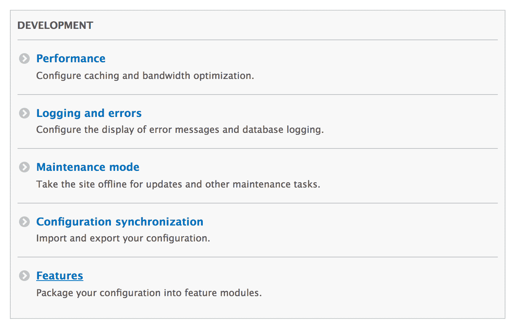

1.  点击“创建新功能”以开始制作自定义功能模块。

1.  为功能提供“名称”，例如内容创作。

1.  可选地，你可以提供描述。这作为模块的 `info.yml` 文件中的 `description` 键。

1.  切换内容类型分组并勾选文章和基本页面复选框以标记它们用于导出。

1.  功能模块将自动添加检测到的依赖项或重要的配置项，例如字段和视图模式，以便也导出：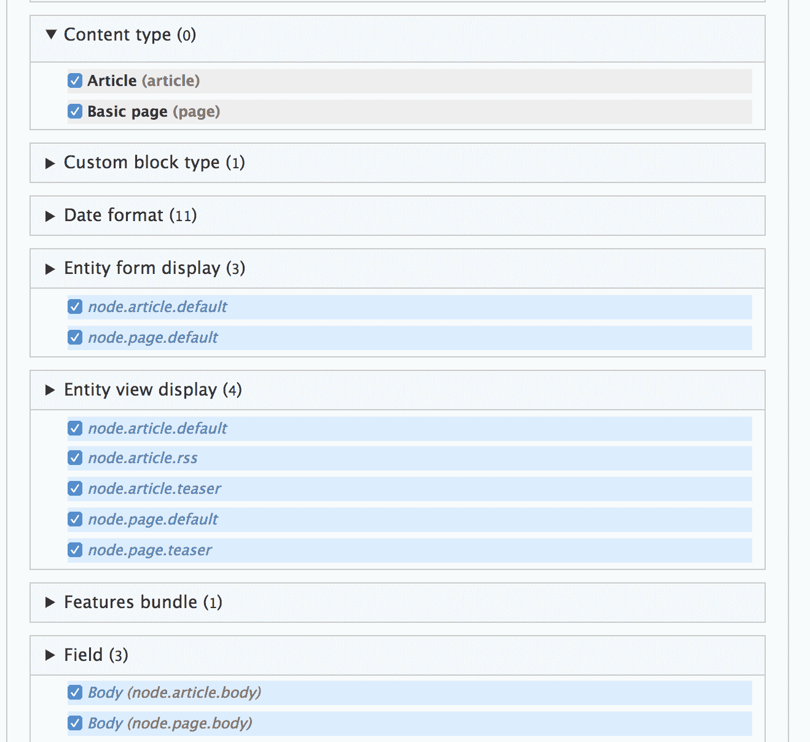

1.  点击写入，将模块写入导出到你的 Drupal 站点`/modules/custom`目录中的模块和配置。

1.  前往扩展，搜索内容创作模块，并安装你新创建的模块。

# 它是如何工作的...

功能将静态 YAML 配置文件导出到模块的`config/install`文件夹中。功能通过确保存在特定类型的配置来修改标准的配置管理工作流程。配置管理不允许模块覆盖现有的配置对象，但功能管理和允许这样做。

为了实现这一点，功能（Features）提供了`\Drupal\features\FeaturesConfigInstaller`，它扩展了默认的`config.install`服务类。然后它修改服务定义以使用其`FeaturesConfigInstaller`类而不是默认的`\Drupal\Core\Config\ConfigInstaller`类。

除了调整`config.install`服务外，功能（Features）利用了配置管理系统的所有功能，以提供一种更简单的方式来生成模块。

任何模块都可以通过在它的`info.yml`中添加`features: true`键来被视为功能模块。这将允许通过功能 UI 来管理它。

# 更多内容...

功能是一个强大的工具，可以轻松提供捆绑配置；我们将在下一节中讨论更多使用功能模块的方法。

# 推荐的功能模块

功能模块提供了一个智能捆绑方法，它审查当前 Drupal 站点的配置，并建议应该创建以保留配置的功能模块。这些通过包分配插件提供。

这些插件使用逻辑将配置分配给特定的包：

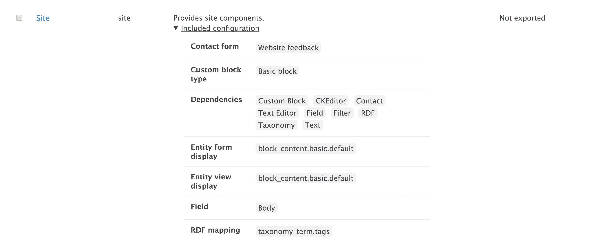

当你访问功能 UI 时，它将向你展示建议导出的功能模块。展开项目将列出将要捆绑的配置项。点击建议功能链接将打开创建表单。或者，可以使用复选框与表单底部的下载存档或写入按钮一起使用。

未打包部分显示了一个未满足任何打包规则以将配置分组到指定模块的配置。这需要手动添加到创建的功能模块中。

# 功能捆绑包

在功能模块中，有捆绑包，捆绑包有自己的分配方法配置。功能内部捆绑包的目的是提供一种可以将配置分组到导出模块中的自动分配配置：

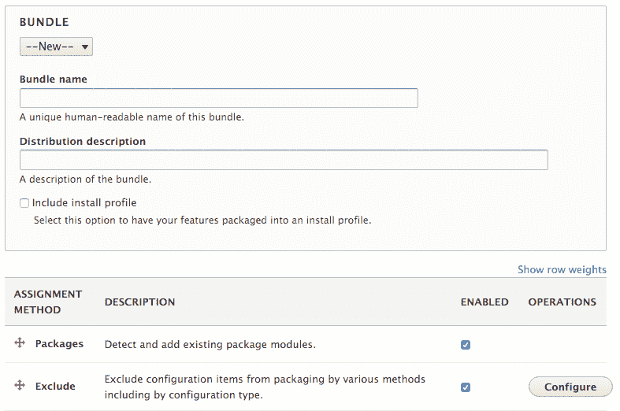

一个捆绑包有一个人类显示名称和机器名称。该捆绑包的机器名称将作为前缀添加到该捆绑包下生成的所有功能模块。你还可以指定捆绑包作为安装配置文件。在 Drupal 7 中，features UI 被广泛用于构建发行版和产生捆绑包功能的概念。

可以重新排列和配置分配方法，以满足你的需求。

# 管理 Features 的配置状态

Features UI 提供了一种方式来查看对功能配置所做的更改。如果一个由功能模块控制的项目被修改了，它将在 Features UI 的差异部分显示出来。这将允许你导入或更新功能模块以包含这些更改。

导入选项将强制网站使用模块配置 `YAML` 文件中定义的配置。例如，在下面的屏幕截图中，我们有一个导出的内容类型，其描述在导出后在用户界面中被修改了：

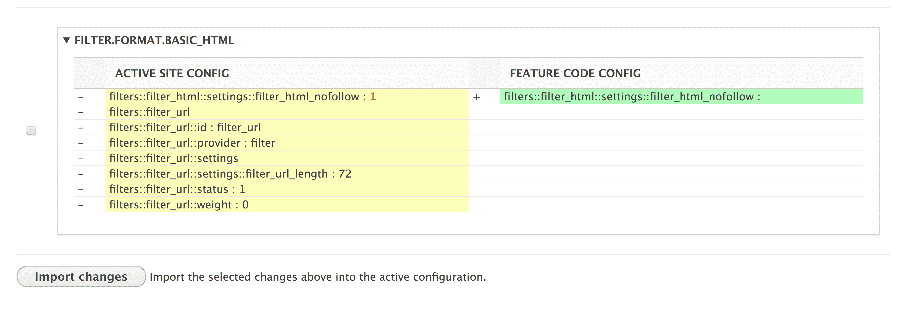

功能模块创建的差异被突出显示。如果检查了差异，并且你点击了“导入更改”，内容类型的描述将重置为配置中定义的版本。

从主要功能概览表中，可以将功能模块重新导出以包含更改并更新导出的 YAML 文件。

# 参见

+   请参考 Drupal.org 手册中的 Features 模块，链接为 [`www.drupal.org/docs/8/modules/features`](https://www.drupal.org/docs/8/modules/features)
