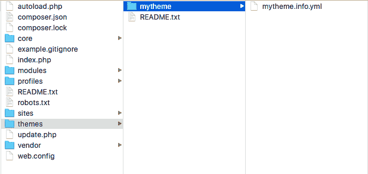
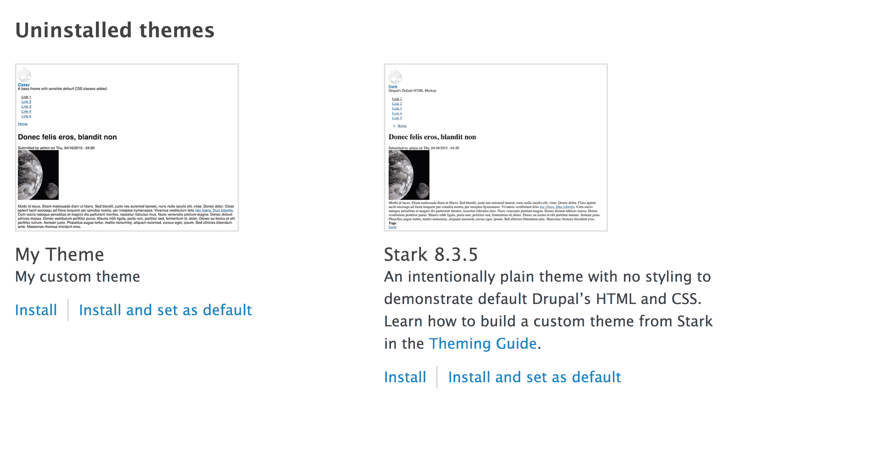
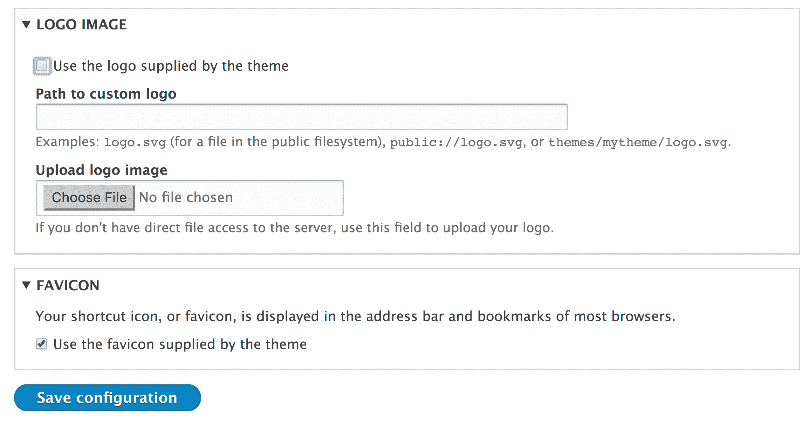
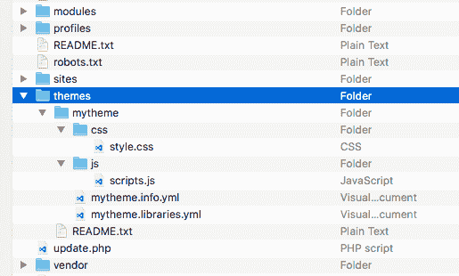
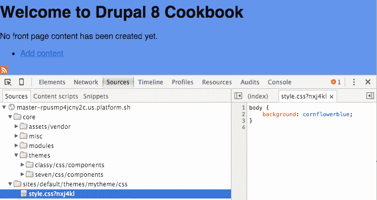
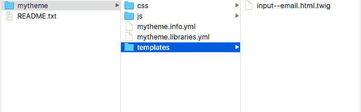
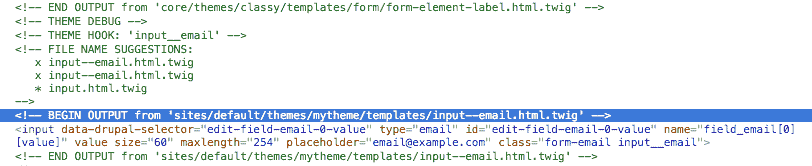
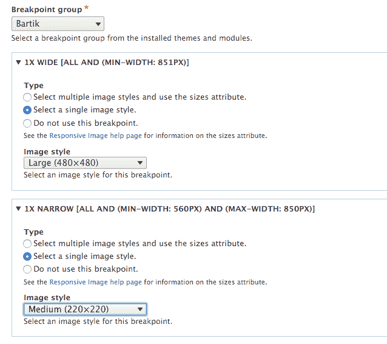
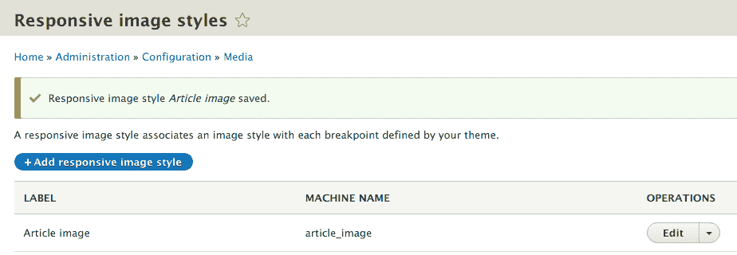
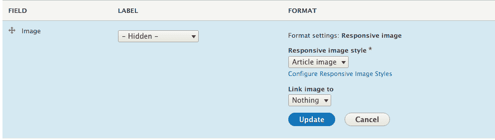

# 第五章：前端为王

在本章中，我们将探索 Drupal 8 的前端开发世界。在本章中，我们将涵盖以下食谱：

+   基于 Classy 创建自定义主题

+   使用新的资产管理系统

+   Twig 模板

+   使用 Breakpoint 模块

+   使用 Responsive Image 模块

# 简介

Drupal 8 在前端方面带来了许多变化。现在它专注于以移动端为先的响应式设计。前端性能被赋予了高优先级，与 Drupal 的先前版本不同。有一个基于库的新资产管理系统，将为带有 Drupal 8 的页面提供所需的最小资产。

在 Drupal 8 中，我们有一个新特性，即 Twig 模板引擎，它取代了之前使用的 PHPTemplate 引擎。Twig 是大型 PHP 社区的一部分，并拥抱了更多 Drupal 8 的“在其他地方制作”的倡议。Drupal 7 支持库来定义 JavaScript 和 CSS 资源。然而，它非常基础，并且不支持库依赖的概念。

Drupal 核心提供了两个模块来实现带有服务器端组件的响应式设计。Breakpoint 模块提供了模块可以利用的媒体查询表示。Responsive Image 模块实现了 HTML5 的`<picture>`标签，用于图像字段。

本章深入探讨如何利用 Drupal 8 的前端特性以获得最佳效果。

# 基于 Classy 创建自定义主题

Drupal 8 附带了一个新的基础主题，旨在展示最佳实践和 CSS 类管理。Classy 主题由 Drupal 核心提供，是默认前端主题 Bartik 和管理主题 Seven 的基础主题。

与 Drupal 的先前版本不同，Drupal 8 提供了两个基础主题--Classy 和 Stable--以快速启动 Drupal 主题开发。Stable 提供了一个更精简的前端主题方法，具有更少的类和包装元素，并保证不会引入可能破坏子主题的更改。在本食谱中，我们将创建一个名为`mytheme`的新主题，其基础为 Classy。

# 如何操作...

1.  在您的 Drupal 站点根目录中，在`themes`文件夹内创建一个名为`mytheme`的文件夹。

1.  在`mytheme`文件夹内，创建一个`mytheme.info.yml`文件，以便 Drupal 能够发现`主题`。然后我们将编辑此文件：



1.  首先，我们需要使用`name`键定义`themes`名称：

```php
name: My Theme 
```

1.  所有主题都需要提供一个`description`键，该键将在外观页面上显示：

```php
description: My custom theme 
```

1.  接下来，我们需要定义扩展的类型，即主题和核心版本的支持：

```php
type: theme 
core: 8.x 
```

1.  `base theme`调用允许我们指示 Drupal 使用特定的主题作为基础：

```php
base theme: classy 
```

1.  最后一个项目是一个`regions`键，用于定义可以放置的块区域，这是一个基于 YAML 的键值对数组：

```php
regions: 
  header: 'Header' 
  primary_menu: 'Primary menu' 
  page_top: 'Page top' 
  page_bottom: 'Page bottom' 
  breadcrumb: 'Breadcrumb' 
  content: 'Content' 
```

区域在页面 `template` 文件中渲染，这将在下一节中介绍，*Twig 模板*。

1.  登录到你的 Drupal 网站，并从管理工具栏转到“外观”。

1.  在“我的主题”条目中点击“安装”并设置默认值以启用和使用新的自定义主题：



# 它是如何工作的...

在 Drupal 8 中，`info.yml` 文件定义 Drupal 主题和模块。创建主题的第一步是提供 `info.yml` 文件，以便主题可以被发现。Drupal 将解析这些值并注册主题。

当你定义一个主题时，以下键是必需的，至少需要这些键：

+   `name`

+   `description`

+   `type`

+   `base theme`

+   `core`

`name` 键定义了将在外观页面上显示的主题的易读名称。描述将在外观页面的主题显示名称下方显示。所有 Drupal 项目都需要定义 `type` 键以指示正在定义的扩展类型。对于主题，类型必须始终是 `theme`。你还需要定义项目兼容的 Drupal 版本，使用 `core` 值。当你定义一个主题时，你还需要提供基本的 `theme` 键。如果你的主题不使用基本主题，则需要将值设置为 `false`。

`libraries` 和 `region` 键是可选的，但这是大多数主题提供的键。Drupal 的资产管理系统解析主题的 `info.yml` 文件，并在需要时添加这些库。区域在 `info.yml` 文件中定义，并为块模块提供放置块的区域。

# 还有更多...

接下来，我们将深入了解主题的附加信息。

# 主题截图

主题可以提供一个在“外观”页面上显示的截图。可以将一个 `screenshot.png` 图片文件放置在 `theme` 文件夹中，或者在一个 `info.yml` 文件中指定 `screenshot` 键下的文件来提供主题的截图。

如果截图缺失，将使用默认值，如 Classy 和 Stark 主题所示。通常，截图是使用主题的 Drupal 网站，包含通用内容。

# 主题、logo 和 favicon

Drupal 通过主题设置控制网站的 favicon 和 logo 设置。主题设置按主题逐个激活，而不是全局性的。主题可以通过在 `theme` 根文件夹中提供 `logo.svg` 来提供一个默认的 logo。放置在 `theme` 文件夹中的 `favicon.ico` 也将是网站 `favicon` 的默认值。

目前，无法为主题指定不同文件类型的 logo。Drupal 的早期版本寻找 `logo.png`。Drupal 8.5 计划了一个功能，允许 `themes` 定义 logo 的文件名和扩展名。有关更多信息，请参阅核心问题[`www.drupal.org/node/1507896`](https://www.drupal.org/node/1507896)。

您可以通过导航到外观并点击当前主题的设置来更改网站的标志和 favicon。取消选中 favicon 和标志设置的默认复选框，允许您提供自定义文件：



# 基础主题和共享资源

许多具有主题系统且支持基础（或父）主题的内容管理系统在术语使用上有所不同。基础主题的概念用于提供共享的既定资源，从而减少创建新主题所需的工作量。

在基础主题中定义的所有库都将默认继承并使用，允许子主题重用现有的样式和 JavaScript。这允许前端开发者重用他们的工作，并且只需创建对子主题所需的特定更改。

子主题也将继承基础主题提供的所有 Twig 模板覆盖。这是创建 Classy 主题所使用的倡议之一。与之前的版本相比，Drupal 8 对元素上应提供哪些类名做出了更少的假设。Classy 覆盖了核心的所有模板，并提供了合理的默认类，使主题能够使用它们并接受这些类名或提供一个空白画布。

# CKEditor 样式表

如在第*第二章*“内容创作体验”中讨论的，Drupal 默认配备了 WYSIWYG 支持和 CKEditor 作为默认编辑器。CKEditor 模块将检查活动主题及其基础主题（如果提供），并加载在`ckeditor_stylesheets`键中定义的任何样式表作为值数组。

例如，以下代码可以在`bartik.info.yml`中找到：

```php
ckeditor_stylesheets: 
  - css/base/elements.css 
  - css/components/captions.css 
  - css/components/table.css 
```

这允许主题提供样式表，以美化 CKEditor 模块内的元素，从而增强编辑器的“所见即所得”体验。

# 参考信息

+   要使用`info.yml`文件定义主题，请参阅[`www.drupal.org/node/2349827`](https://www.drupal.org/node/2349827)

+   要使用 Classy 作为基础主题，请参阅社区文档[`www.drupal.org/theme-guide/8/classy`](https://www.drupal.org/theme-guide/8/classy)

+   请参阅核心主题文档[`www.drupal.org/docs/8/core/themes`](https://www.drupal.org/docs/8/core/themes)

+   要创建 Drupal 8 子主题，请参阅社区文档[`www.drupal.org/node/2165673`](https://www.drupal.org/node/2165673)

# 使用新的资产管理系统

资产管理系统是最近加入 Drupal 8 的。资产管理系统允许模块和主题注册库。库定义了需要与页面一起加载的 CSS 样式表和 JavaScript 文件。Drupal 8 采用这种方法来提高前端性能。而不是加载所有 CSS 或 JavaScript 资产，只有指定库中当前页面所需的那些资产会被加载。

在这个菜谱中，我们将定义一个 `libraries.yml` 文件，该文件将定义由自定义主题提供的 CSS 样式表和 JavaScript 文件。

# 准备工作

这个菜谱假设你已经创建了一个自定义主题，例如你在第一个菜谱中创建的主题。当你在这个菜谱中看到 `mytheme` 时，请使用你创建的主题的机器名。

# 如何做到这一点...

1.  在你的主题基本目录中创建一个名为 `css` 的文件夹。

1.  在你的 `css` 文件夹中，添加一个 `style.css` 文件，该文件将包含主题的 CSS 声明。为了演示目的，将以下 CSS 声明添加到 `style.css`：

```php
body { 
  background: cornflowerblue;
} 
```

1.  然后，在你的主题目录中创建一个名为 `js` 的文件夹，并添加一个 `scripts.js` 文件，该文件将包含主题的 JavaScript 项目。

1.  在你的主题文件夹中，创建一个 `mytheme.libraries.yml` 文件，如下截图所示：

1.  编辑 `mytheme.libraries.yml` 文件。添加以下 `YAML` 文本以定义你的主题的 `global-styling` 库，该库将加载 CSS 和 JavaScript 文件：

```php
global-styling: 
  version: VERSION 
  css: 
    theme: 
      css/style.css: {} 
  js: 
    js/scripts.js: {} 
```

1.  前面的文本告诉 Drupal 存在一个 `global-styling` 库。你可以指定库版本并使用主题的 `VERSION` 默认值。它还定义了 `css/styles.css` 样式表作为 `theme` 组库的一部分。

1.  编辑你的 `mytheme.info.yml`，并向你的 `global-styling` 库添加声明：

```php
name: My Theme 
description: My custom theme 
type: theme
core: 8.x 
base theme: classy
libraries: 
  - mytheme/global-styling 
```

1.  主题可以指定一个 `libraries` 键来定义应该始终加载的库。此 `YAML` 数组列出了为每个页面加载的库。

1.  前往配置，然后在开发部分下的性能中重建 Drupal 的缓存。

1.  将你的主题设置为默认，导航到你的 Drupal 网站的首页。

1.  你的主题的 `global-styling` 库将被加载，页面的背景颜色将被适当地样式化：



# 它是如何工作的...

Drupal 聚合所有可用的 `library.yml` 文件并将它们传递给 `library.discovery.parser` 服务。此服务提供者的 `default` 类是 `\Drupal\Core\Asset\LibraryDiscoveryParser`。此服务从每个 `library.yml` 读取库定义并将其值返回给系统。在解析文件之前，解析器允许主题提供库的覆盖和扩展。

库是队列，因为它们附加到渲染的元素上。主题可以通过它们的 `info.yml` 文件通过 `libraries` 键通用地添加库。当主题处于活动状态时，这些库将始终在页面上加载。

CSS 样式表被添加到构建页面 head 标签的数据中。出于性能原因，JavaScript 资源默认在页面底部渲染。

# 还有更多...

我们将在下一节中更详细地探讨 Drupal 8 中围绕库的选项。

# CSS 组

使用库，你可以通过不同的组指定 CSS。Drupal 的资产管理系统提供了以下 CSS 组：

+   基础

+   布局

+   组件

+   状态

+   主题

样式表按组列表的顺序加载。每一个都与 `/core/includes/common.inc` 中定义的 PHP 常量相关。这允许在处理样式表时分离关注点。Drupal 8 的 CSS 架构借鉴了 **Scalable and Modular Architecture for CSS** (**SMACSS**) 系统的概念来组织 CSS 声明。您可以在 [`smacss.com/`](https://smacss.com/) 上了解更多关于构建灵活和可扩展的 CSS 样式表的技巧。

# 库资产选项

库资产可以附加配置数据。如果没有提供配置项，将添加一个简单的空括号集合。因此，在每个示例中，行都以 `{}` 结尾。

以下示例取自 `core.libraries.yml`，添加了 `HTML5shiv`：

```php
assets/vendor/html5shiv/html5shiv.min.js: { weight: -22, browsers: { IE: 'lte IE 8', '!IE': false }, minified: true } 
```

让我们看看 `html5shiv.min.js` 的属性：

+   `weight` 键确保脚本比其他库更早渲染

+   `browser` 标签允许您指定条件规则来加载脚本

+   如果资产已经被压缩，您应该始终传递 `minified` 为 `true`

对于 CSS 资产，您可以传递一个媒体选项来指定资产的媒体查询。查看实现 `\Drupal\Core\Asset\AssetCollectionRendererInterface` 的类。

# 库依赖项

库可以指定其他库作为依赖项。这允许 Drupal 在前端性能上提供最小的占用。

只有当 JavaScript 库将其指定为依赖项时，才会加载 jQuery；有关库依赖项的更多信息，请参阅 [`www.drupal.org/node/1541860`](https://www.drupal.org/node/1541860)。

以下是从快速编辑模块的 `libraries.yml` 文件中的一个示例：

```php
quickedit: 
  version: VERSION 
  js:  
    ... 
  css: 
    ... 
  dependencies: 
    - core/jquery 
    - core/jquery.once 
    - core/underscore 
    - core/backbone 
    - core/jquery.form 
    - core/jquery.ui.position 
    - core/drupal 
    - core/drupal.displace 
    - core/drupal.form 
    - core/drupal.ajax 
    - core/drupal.debounce 
    - core/drupalSettings 
- core/drupal.dialog 
```

快速编辑模块定义了 *jQuery*、*jQuery Once 插件*、*Underscore* 和 *Backbone*，并将其他定义的库作为依赖项。Drupal 将确保在 `quickedit/quickedit` 库附加到页面时这些库都存在。

Drupal 核心提供的默认库的完整列表可以在 `core.libraries.yml` 中找到，该文件位于 `core/core.libraries.yml`。

# 覆盖和扩展其他库

主题可以通过在它们的 `info.yml` 中使用 `libraries-override` 和 `libraries-extend` 键来覆盖库。这允许主题轻松地自定义现有库，而无需在特定库附加到页面时添加条件性地移除或添加其资产的逻辑。

`libraries-override` 键可以用来替换整个库，替换库中选定的文件，从库中移除资产，或者禁用整个库。以下代码将允许主题提供自定义 jQuery UI 主题：

```php
libraries-override: 
  core/jquery.ui: 
    css: 
      component: 
         assets/vendor/jquery.ui/themes/base/core.css: false 
      theme: 
         assets/vendor/jquery.ui/themes/base/theme.css: css/jqueryui.css 
```

覆盖声明模仿了原始配置。指定 `false` 将移除资产，否则提供的路径将替换该资产。

可以使用 `libraries-extend` 键来加载与现有库相关的额外库。以下代码将允许主题将 CSS 样式表与选定的 jQuery UI 声明覆盖相关联，而无需始终将其包含在主题的其他资产中：

```php
libraries-extend: 
  core/jquery.ui: 
    - mytheme/jqueryui-theme 
```

# 使用 CDN 或外部资源作为库

库也可以与外部资源一起工作，例如通过 CDN 加载的资产。这是通过提供文件位置的 URL 以及选定的文件参数来完成的。

以下是一个示例，说明如何从 MaxCDN 提供的 `BootstrapCDN` 添加 `FontAwesome` 字体图标库：

```php
mytheme.fontawesome: 
  remote: http://fontawesome.io/ 
  version: 4.4.0 
  license: 
    name: SIL OFL 1.1 
    url: http://fontawesome.io/license/ 
    gpl-compatible: true 
  css: 
    base: 
      https://maxcdn.bootstrapcdn.com/font-awesome/4.4.0/css/font-awesome.min.css: { type: external, minified: true } 
```

远程库需要额外的元信息才能正常工作：

```php
remote: http://fontawesome.io/ 
```

`remote` 键描述了库使用外部资源。虽然此键的验证仅限于其存在，但最好使用外部资源的主要网站来定义它：

```php
version: 4.4.0 
```

与所有库一样，需要一个版本号。这应该与添加的外部资源的版本相匹配：

```php
license: 
    name: SIL OFL 1.1 
    url: http://fontawesome.io/license/ 
    gpl-compatible: true 
```

如果库定义了 `remote` 键，它还需要定义 `license` 键。这定义了许可证名称、许可证的 URL 以及检查它是否与 GPL 兼容。如果没有提供此键，将抛出 `\Drupal\Core\Asset\Extension\LibraryDefinitionMissingLicenseException` 异常：

```php
  css: 
    base: 
      https://maxcdn.bootstrapcdn.com/font-awesome/4.4.0/css/font-awesome.min.css: { type: external, minified: true } 
```

最后，特定的外部资源以正常方式添加。而不是提供相对文件路径，提供外部 URL。

# 从钩子中操作库

模块具有提供动态库定义和修改库的能力。一个模块可以使用 `hook_library_info()` 钩子来提供库定义。这不是定义库的推荐方式，但提供它是为了应对边缘用例。

模块没有使用 `libraries-override` 或 `libraries-extend` 的能力，需要依赖于 `hook_library_info_alter()` 钩子。您可以在 `core/lib/Drupal/Core/Render/theme.api.php` 或 [`api.drupal.org/api/drupal/core!lib!Drupal!Core!Render!theme.api.php/function/hook_library_info_alter/8`](https://api.drupal.org/api/drupal/core!lib!Drupal!Core!Render!theme.api.php/function/hook_library_info_alter/8) 中查看此钩子。

# 将 JavaScript 放置在头部

默认情况下，Drupal 确保 JavaScript 被放置在页面最后。这通过首先加载页面的关键部分来提高页面加载性能。现在将 JavaScript 放置在头部是一个可选的选项。

为了在头部渲染库，您需要添加 `header: true` 键/值对：

```php
js-library: 
  header: true 
  js: 
    js/myscripts.js: {} 
```

这将在页面的头部加载自定义 JavaScript 库及其依赖项。

# 参见

+   参考 Drupal 8 的 CSS 架构：在[`www.drupal.org/node/1887918#separate-concerns`](https://www.drupal.org/node/1887918#separate-concerns)中分离关注点

+   更多关于 SMACSS 的信息，请参阅[`smacss.com/book/`](http://smacss.com/book/)

# Twig 模板

Drupal 8 的主题层由 Symfony 框架的组件 Twig 补充。Twig 是一种模板语言，其语法类似于 Django 和 Jinja 模板。Drupal 之前版本使用 PHPTemplate，这要求前端开发者对 PHP 有基本的了解。

在本食谱中，我们将覆盖 Twig 模板以提供对电子邮件表单元素的定制。我们将使用基本的 Twig 语法添加一个新类并提供一个默认占位符。

# 准备工作

本食谱假设你已经创建了一个自定义主题，例如你在第一个食谱中创建的主题。当你看到以下食谱中的 `mythemein` 时，请使用你创建的主题的机器名。

在撰写本书时，Classy 主题不提供电子邮件输入的模板建议，也没有对与 Drupal 核心不同的输入模板进行任何定制。

# 如何操作...

1.  在你的主题基本目录中创建一个 `templates` 文件夹来存放你的 Twig 模板。

1.  要开始，你需要将 `input.html.twig` 文件从 `core/themes/classy/templates/form/input.html.twig` 复制到你的主题的 `templates` 文件夹。

1.  将 `input.html.twig` 文件重命名为 `input--email.html.twig` 以使用正确的主题钩子建议，如以下截图所示：



1.  我们将使用 `addClass` Twig 函数来添加一个 `input__email` 类：

```php
<input{{ attributes.addClass('input__email') }}/>{{ children }} 
```

1.  在上一行之前，我们将使用三元运算符创建一个 Twig 变量以提供一个客户占位符：

```php
 
<input{{ attributes.addClass('input__email').setAttribute('placeholder', placeholder) }}/>{{ children }} 
```

1.  这使用设置运算符创建了一个名为 `placeholder` 的新变量。问号 (`?`) 运算符检查 `attributes` 对象中的 `placeholder` 属性是否为空。如果不为空，则使用现有值。如果值为空，则提供一个默认值。

1.  转到配置选项卡，然后在开发部分下的性能下重建 Drupal 的缓存。我们需要这样做，因为 Drupal 缓存生成的 Twig 输出和模板覆盖。

主题提供的新 Twig 模板覆盖以及对 Twig 模板的任何更改都需要重建缓存。

1.  假设你已经使用了标准的 Drupal 安装，请转到 `/contact/feedback` 上安装的反馈联系表单，在未登录状态下，并审查电子邮件字段的更改：



这个截图包含了主题调试输出。在本章的 *更多内容...* 部分中，我们将讨论如何启用主题调试注释的输出。

# 它是如何工作的...

Drupal 的主题系统是围绕钩子和钩子建议构建的。电子邮件输入元素的元素定义定义了 `input__email` 主题钩子。如果没有通过 Twig 模板或 PHP 函数实现 `input__email` 钩子，它将降级到仅输入。

Drupal 主题钩子使用下划线 (`_`) 定义，但在 Twig 模板文件中使用时使用连字符 (`-`)。

处理器，如 Drupal 的主题层，将变量传递给 Twig。可以通过将变量名用花括号括起来来打印变量或对象属性。Drupal 核心的所有默认模板都在文件的文档块中提供信息，详细说明了可用的 Twig 变量。

Twig 具有简单的语法，包括基本的逻辑和函数。`addClass`方法将接受`attributes`变量，并添加除现有内容之外的类。

当提供主题钩子建议或修改现有模板时，您需要重新构建 Drupal 的缓存。编译后的 Twig 模板，就像 PHP 一样，被 Drupal 缓存，这样 Twig 就不需要在每次调用模板时都进行编译。

# 更多...

我们将在接下来的章节中讨论更多关于使用 Twig 的内容。

# 安全第一

Twig 默认自动转义输出，这使得 Drupal 8 成为迄今为止最安全的版本之一。对于 Drupal 7，大多数安全顾问都关注于贡献项目中**跨站脚本**（**XSS**）漏洞。使用 Twig，这些安全警告应该会大幅减少。

# 主题钩子建议

Drupal 利用主题钩子建议来允许基于不同条件输出变化。它允许站点主题为某些实例提供更具体的模板。

当一个主题钩子包含双下划线（`__`）时，Drupal 的主题系统会理解这一点，并且可以分解主题钩子以找到更通用的模板。例如，电子邮件元素定义提供了`input__email`作为其主题钩子。Drupal 理解如下：

+   寻找名为`input--email.html.twig`的 Twig 模板或定义`input__email`的主题钩子

+   如果您不满意，请寻找名为`input.html.twig`的 Twig 模板或定义输入的主题钩子

主题钩子建议可以通过`.module`或`.theme`文件中的`hook_theme_suggestions()`钩子提供。

# 调试模板文件选择和钩子建议

可以启用调试来检查构成页面的各种模板文件及其主题钩子建议，并检查哪些是活动的。这可以通过编辑`sites/default/services.yml`文件来完成。如果不存在`services.yml`文件，请复制`default.services.yml`以创建一个。

您需要在文件的`twig.config`部分下将`debug: false`更改为`debug: true`。这将导致 Drupal 主题层打印出包含模板信息的源代码注释。当调试开启时，Drupal 不会缓存编译后的 Twig 模板版本，而是即时渲染它们。

另有一个设置可以防止您在每次模板文件更改时都重新构建 Drupal 的缓存，但不要留下调试开启。可以将`twig.config.auto_reload boolean`设置为`true`。如果设置为`true`，当源代码更改时，Twig 模板将被重新编译。

# Twig 逻辑和运算符

Twig 有三元运算符用于逻辑。使用问号（`?`），我们可以执行基本的*是否为真或非空*操作，而问号和冒号（`?:`）执行基本的*是否为假或为空*操作。

你也可以使用`if`和`else`逻辑根据变量提供不同的输出。

# 参见

+   请参阅 Twig 文档[`twig.sensiolabs.org/documentation`](http://twig.sensiolabs.org/documentation)

+   请参阅[`api.drupal.org/api/drupal/core%21lib%21Drupal%21Core%21Render%21theme.api.php/function/hook_theme_suggestions_HOOK/8`](https://api.drupal.org/api/drupal/core%21lib%21Drupal%21Core%21Render%21theme.api.php/function/hook_theme_suggestions_HOOK/8)的`hook_theme_suggestions` API 文档

# 使用 Breakpoint 模块

Breakpoint 模块提供了一个在 Drupal 中创建媒体查询断点定义的方法。这些可以被其他组件，如响应式图像和工具栏模块使用，以使 Drupal 响应。

断点是插件的一种类型，可以在模块或主题的目录中的`breakpoints.yml`中定义。在这个菜谱中，我们将在一个自定义组下定义三个不同的断点。

断点仅由安装的模块和主题的`YAML`文件定义，并且不能通过用户界面进行配置。

# 准备工作

确保 Breakpoint 模块已启用--如果你使用了标准的 Drupal 安装，该模块已启用。

此菜谱假设你已经创建了一个自定义模块。当你看到`mymodule`时，请使用你创建的模块的机器名。

# 如何做...

1.  在你的模块基本目录中创建`mymodule.breakpoints.yml`。此文件将包含断点配置。

1.  首先，我们将添加一个标准的移动断点，它没有媒体查询，遵循移动优先的实践：

```php
mymodule.mobile: 
  label: Mobile 
  mediaQuery: '' 
  weight: 0
```

1.  第二，我们将创建一个标准断点，它将在更大的视口中运行：

```php
mymodule.standard: 
  label: Standard 
  mediaQuery: 'only screen and (min-width: 60em)' 
  weight: 1 
```

1.  第三，我们将为具有大视口的设备创建一个宽断点：

```php
mymodule.wide: 
  label: Wide 
  mediaQuery: 'only screen and (min-width: 70em)' 
  weight: 2 
```

1.  你的`mymodule.breakpoints.yml`应该类似于以下内容：

```php
mymodule.mobile:
  label: Mobile
  mediaQuery: ''
  weight: 0 
mymodule.standard:
  label: Standard
  mediaQuery: 'only screen and (min-width: 60em)'
  weight: 1 
mymodule.wide:
  label: Wide
  mediaQuery: 'only screen and (min-width: 70em)'
  weight: 2 
```

1.  前往配置选项卡，然后转到性能以重建 Drupal 的缓存并使系统意识到新的断点。

# 它是如何工作的...

Breakpoint 模块定义了断点配置实体。断点没有任何特定的直接功能形式，除了提供保存媒体查询和分组的方式。

Breakpoint 模块提供了一个默认的管理服务。该服务被其他模块用来发现断点组，然后是组内的所有断点。

# 还有更多...

使用 Breakpoint 模块的更多信息将在接下来的章节中介绍。

# 提供断点时的注意事项

主题有提供断点的功能；然而，如果安装后添加了新的断点，它们将无法自动发现。Drupal 仅在主题安装或卸载时读取主题提供的断点。

在 `breakpoint.manager` 中，有两个钩子：一个用于 `theme install`，另一个用于 `theme uninstall`。每个钩子都会检索断点管理器服务并重建断点定义。除非这些钩子被触发，否则新添加到主题中的新断点不会被发现。

# 以编程方式访问断点

断点（Breakpoints）是其他模块的实用配置。可以通过断点管理器服务和指定一个组来加载断点。例如，以下代码返回了由工具栏模块使用的所有断点：

```php
\Drupal::service('breakpoint.manager')->getBreakpointsByGroup('toolbar');
```

此代码调用 Drupal 容器以返回管理断点的服务，默认为 `\Drupal\breakpoint\BreakpointManager`。`getBreakpointsByGroup` 方法返回组内的所有断点，这些断点作为 `\Drupal\breakpoint\BreakpointInterface` 对象启动。

工具栏元素类利用此工作流程将断点媒体查询值作为 JavaScript 设置推送到 JavaScript 模型进行交互。

# 倍数

倍数值用于支持像素分辨率倍数。这个倍数与 *视网膜* 显示一起使用。它是视口设备分辨率的度量，作为设备物理尺寸和独立像素尺寸的比率。以下是一个标准倍数的示例：

+   1x 是正常情况

+   5x 支持 Android

+   2x 支持 Mac 视网膜设备

# 参见

+   要在 Drupal 8 中使用断点，请参考社区文档[`www.drupal.org/documentation/modules/breakpoint`](https://www.drupal.org/documentation/modules/breakpoint)

# 使用响应式图像模块

响应式图像模块为使用 HTML5 图片标签和源集的图像字段提供字段格式化器。利用断点模块，将断点映射到表示每个断点要使用的图像样式。

响应式图像字段格式化器与定义的响应式图像样式一起使用。响应式图像样式是将图像格式映射到特定断点和修饰符的配置。首先，您需要定义一个响应式图像样式，然后可以将其应用于图像字段。

在这个菜谱中，我们将创建一个名为 `Article image` 的响应式图像样式集，并将其应用于 `Article` 内容类型的图像字段。

# 准备工作

您需要启用 `Responsive Image` 模块，因为它在标准安装中不会自动启用。

# 如何操作...

1.  前往配置，然后在媒体部分下的响应式图像样式。点击添加响应式图像样式以创建一个新的样式集。

1.  提供一个标签，该标签将用于管理上识别响应式图像样式集。

1.  选择一个将用作定义图片样式映射的断点源的断点组。

1.  每个断点都会有一个 `fieldset`。展开 `fieldset` 并选择“选择单个图片样式”，然后选择合适的图片样式：



1.  此外，选择一个回退图片样式，以防浏览器不支持源集，例如 Internet Explorer 8。

1.  点击“保存”以保存配置，并添加新的样式集：



1.  前往结构并选择内容类型，从文章内容类型的下拉菜单中选择“管理显示”。

1.  将图片字段的格式化器更改为响应式图片。

1.  点击字段格式化器的“设置”选项卡以选择您的新响应式图片样式集。从响应式图片样式下拉菜单中选择“文章图片”：



1.  点击“更新”以保存字段格式化设置，然后点击“保存”以保存字段显示设置。

# 它是如何工作的...

响应式图片样式提供三个组件：一个响应式图片元素、响应式图片样式配置实体和响应式图片字段格式化器。配置实体被字段格式化器消费并通过响应式图片元素显示。

响应式图片样式实体包含一个断点到图片样式映射的数组。可用的断点由所选断点组定义。断点组可以随时更改；然而，之前的映射将会丢失。

响应式图片元素为每个断点打印一个 `picture` 元素，定义一个新的 `source` 元素。断点的媒体查询值作为元素的 `media` 属性提供。

对于 Internet Explorer 9，Drupal 8 随带 `picturefill` 多重填充。Internet Explorer 9 不识别由 `picture` 元素包裹的源元素。多重填充将源元素包裹在 `picture` 元素内的视频元素周围。

# 还有更多...

在以下章节中，我们将更详细地讨论响应式图片字段。

# 首先考虑性能

使用响应式图片格式化器的优点是性能。浏览器将只下载在适当的 `source` 标签的 `srcset` 中定义的资源。这不仅允许你提供更合适的图片大小，而且在小型设备上也会携带更小的负载。

# 移除 picturefill 多重填充

响应式图片模块将 `picturefill` 库附加到响应式图片元素定义。元素的模板还提供了实现多重填充的 HTML。可以通过覆盖元素的模板并覆盖 `picturefill` 库来禁用多重填充。

以下片段，当添加到主题的 `info.yml` 中时，将禁用 `picturefill` 库：

```php
libraries-override: 
  core/picturefill: false 
```

然后，`responsive-image.html.twig` 必须由主题覆盖以删除模板中为 polyfill 生成的额外 HTML：

1.  将 `responsive-image.html.twig` 从 `core/modules/responsive_image/templates` 复制到 `theme` 模板文件夹。

1.  编辑 `responsive-image.html.twig` 并删除 Twig 注释和 IE 条件语句以输出初始视频标签。

1.  删除最后一个条件语句，该语句提供了关闭视频标签。

# 参考以下内容

+   参考 Mozilla 开发者网络（**MDN**）上的图片元素，链接为 [`developer.mozilla.org/en-US/docs/Web/HTML/Element/picture`](https://developer.mozilla.org/en-US/docs/Web/HTML/Element/picture)

+   参考针对 IE9 的 `picturefill`，链接为 [`scottjehl.github.io/picturefill/#ie9`](http://scottjehl.github.io/picturefill/#ie9)
