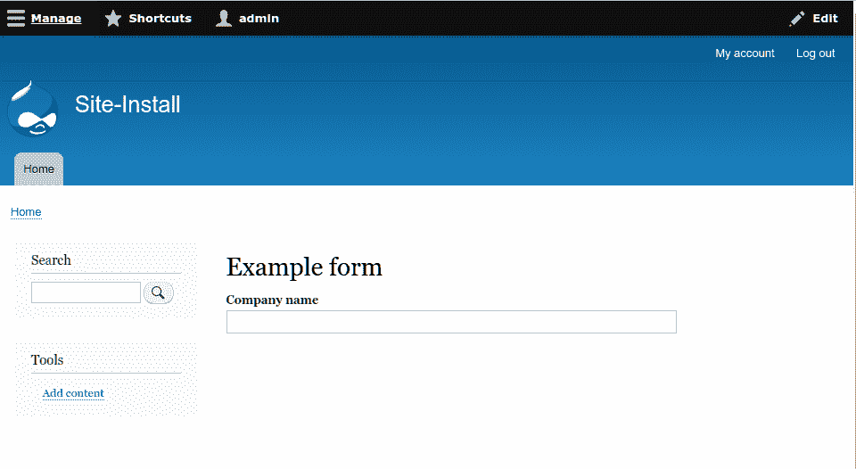
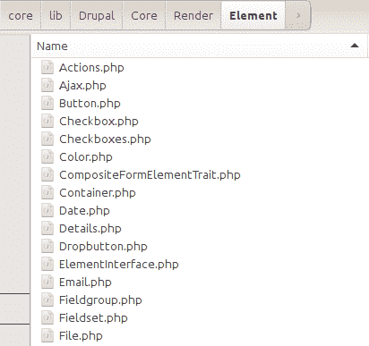
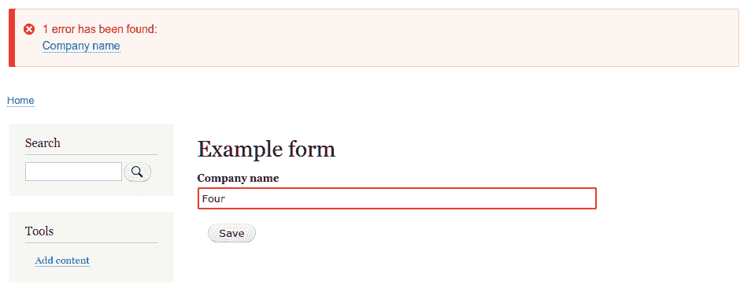
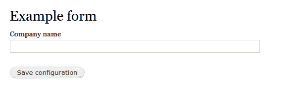
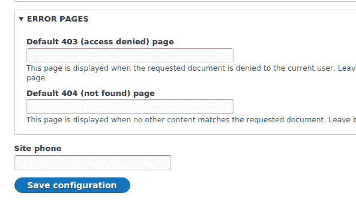

# 使用 Form API 创建表单

在本章中，我们将探讨各种与 Drupal 中的表单一起工作的菜谱：

+   创建一个表单

+   使用新的 HTML5 元素

+   验证表单数据

+   处理提交的表单数据

+   修改其他表单

# 简介

Drupal 提供了一个强大的 API 来创建和管理表单，而无需编写任何 HTML。Drupal 处理表单构建、验证和提交。Drupal 处理构建表单或处理 HTTP POST 请求的请求。这允许开发者简单地定义表单中的元素，提供所需的任何额外验证，然后通过特定方法处理成功的提交。

本章包含各种通过 Form API 与 Drupal 中的表单一起工作的菜谱。在 Drupal 8 中，表单和表单状态是对象。

# 创建一个表单

在这个菜谱中，我们将创建一个表单，它可以通过菜单路径访问。这涉及到创建一个路由，告诉 Drupal 调用我们的表单并将其显示给最终用户。

表单被定义为类，这些类实现了`\Drupal\Core\Form\FormInterface`。`\Drupal\Core\Form\FormBase`作为一个实用类，旨在被扩展。我们将扩展这个类来创建一个新的表单。

# 准备工作

由于我们将编写代码，你将需要一个自定义模块。在 Drupal 中创建自定义模块很简单：创建一个文件夹和一个`info.yml`文件。对于这个菜谱，我们将在你的 Drupal 文件夹的`/modules`下创建一个名为`drupalform`的文件夹。

在`drupalform`文件夹中，创建`drupalform.info.yml`。Drupal 将解析`info.yml`文件以发现模块。一个模块的`info.yml`文件示例如下：

```php
name: Drupal form example 
description: Create a basic Drupal form, accessible from a route 
type: module 
version: 1.0 
core: 8.x 
```

名称将是你的模块名称，描述将在扩展页面上列出。指定核心告诉 Drupal 它为哪个版本的 Drupal 构建。*第四章*，*扩展 Drupal*，涵盖了如何深入创建模块。

# 如何做到这一点...

1.  在你的模块目录中创建一个`src`文件夹。在这个目录中，创建一个`Form`目录，它将包含定义你的表单的类。

1.  接下来，在你的模块的`src/Form`目录中创建一个名为`ExampleForm.php`的文件。

Drupal 利用 PSR4 来发现和自动加载类。为了简洁，这定义了每个文件应该有一个类，每个文件名应与类名匹配。文件夹结构也将模仿预期的命名空间。

1.  我们将编辑`ExampleForm.php`文件，并添加适当的 PHP 命名空间、使用的类以及类本身：

```php
<?php 

namespace Drupal\drupalform\Form; 

use Drupal\Core\Form\FormBase; 
use Drupal\Core\Form\FormStateInterface; 

class ExampleForm extends FormBase { 

} 
```

`namespace`定义了模块的`Form`目录中的类。`autoloader`现在将查看`drupalform`模块路径，并从`src/Form`目录加载`ExampleForm`类。

使用语句允许我们在引用`FormBase`和，在接下来的步骤中，`FormStateInterface`时只使用类名。否则，我们被迫在每次使用每个类时使用完全限定的命名空间路径。

1.  `\Drupal\Core\Form\FormBase` 是一个抽象类，并要求我们实现四个剩余的接口方法：`getFormId`、`buildForm`、`validateForm` 和 `submitForm`。后两个方法将在接下来的食谱中介绍；然而，我们需要定义方法占位符：

```php

class ExampleForm extends FormBase { 

  /** 
   * {@inheritdoc} 
   */ 
  public function getFormId() { 
    return 'drupalform_example_form'; 
  } 

  /** 
   * {@inheritdoc} 
   */ 
  public function buildForm(array $form, FormStateInterface $form_state) { 
     // Return array of Form API elements. 
  } 

  /** 
   * {@inheritdoc} 
   */ 
  public function validateForm(array &$form,  FormStateInterface $form_state) { 
    // Validation covered in later recipe, required to satisfy interface. 
  } 

  /** 
   * {@inheritdoc} 
   */ 
  public function submitForm(array &$form,  FormStateInterface $form_state) { 
    // Validation covered in later recipe, required to satisfy interface. 
  } 
} 
```

这段代码清除了前面步骤中的初始类定义。`FormBase` 提供了 `utility` 方法，并不满足 `FormStateInterface` 的接口要求。我们在这里定义这些，因为它们在每个表单定义中都是独特的。

`getFormId` 方法返回一个唯一的字符串来标识表单，例如，`site_information`。你可能会遇到一些表单在其表单 ID 的末尾附加 `_form`。这不是必需的，而只是 Drupal 早期版本中常见的命名约定。

`buildForm` 方法将在以下步骤中介绍。`validateForm` 和 `submitForm` 方法都在表单 API 过程中调用，将在后面的食谱中介绍。

1.  `buildForm` 方法将被调用以返回渲染给最终用户的表单 API 元素。我们将添加一个简单的文本字段来请求公司名称和一个提交按钮：

```php
/** 
 * {@inheritdoc} 
 */ 
public function buildForm(array $form, FormStateInterface $form_state) { 
  $form['company_name'] = [ 
    '#type' => 'textfield', 
    '#title' => $this->t('Company name'), 
  ]; 
  $form['submit'] = [ 
    '#type' => 'submit', 
    '#value' => $this->t('Save'), 
  ]; 
  return $form; 
} 
```

我们向 `form` 数组中添加了一个表单元素定义。表单元素通过指定元素类型和用作标签的标题来定义，标题使用 `t` 方法来确保它是可翻译的。

添加提交按钮是通过提供一个类型为提交的元素来完成的。

1.  要访问表单，我们将在模块文件夹中创建 `drupalform.routing.yml`。将创建一个路由条目来指示 Drupal 使用 `\Drupal\Core\Form\FormBuilder` 创建和显示我们的表单：

```php
drupalform.form: 
  path: '/drupal-example-form' 
  defaults: 
    _title: 'Example form' 
    _form: '\Drupal\drupalform\Form\ExampleForm' 
  requirements: 
    _access: 'TRUE' 
```

在 Drupal 中，所有路由都有一个名称，这个例子将其定义为 `drupalform.form`。路由定义了一个路径属性并覆盖了默认变量。这个路由定义改变了路由的标题，将其指定为表单，并给出了此表单类的完全限定命名空间路径。

路由需要传递一个具有特定说明的 `requirements` 属性，否则路由将被拒绝访问。

1.  前往扩展页面并安装我们创建的 Drupal 表单示例模块。

1.  前往 `/drupal-example-form`，现在表单应该可见，如下面的截图所示：



# 它是如何工作的...

这个食谱创建了一个路由来显示表单。通过在我们的路由条目默认部分传递 `_form` 变量，我们告诉路由控制器如何渲染我们的路由内容。包含命名空间的完全限定类名被传递到表单构建器中的方法。根据食谱，路由控制器将调用 `\Drupal::formBuilder()->getForm` (`\Drupal\drupalform\Form\ExampleForm`)。同时，这也可以手动调用以在其他地方嵌入表单。

一个实现 `\Drupal\Core\Form\FormBuilderInterface` 的表单构建实例将调用 `buildForm` 并启动渲染过程来处理表单。`buildForm` 方法预期返回一个表单元素和其他 API 选项的数组。这将发送到渲染系统以输出表单作为 HTML。

# 还有更多...

许多组件构成了通过 Drupal 的表单 API 创建的表单。我们将深入探讨其中的一些。

# 表单元素定义

表单是一组表单元素，这些元素是 Drupal 8 中的插件类型。插件是 Drupal 8 中的可互换功能的小块。插件和插件开发在*第七章*，*使用插件轻松连接*中有所介绍。

这里有一些最常用的元素属性，可以使用：

+   `weight`: 这用于改变表单元素在表单中的位置。默认情况下，元素将按照它们被添加到表单数组中的顺序显示。定义一个权重允许开发者控制元素的位置。

+   `default_value`: 这使开发者能够预先填充元素，例如，在构建具有现有数据的配置表单或编辑实体时。

+   `placeholder`: 这在 Drupal 8 中是新的。Drupal 8 提供了新的 HTML5 支持，此属性将在 HTML 输入上设置占位符属性。

要查看可用表单元素及其属性的完整参考，请访问 Drupal.org API 文档页面[`api.drupal.org/api/drupal/elements/`](https://api.drupal.org/api/drupal/elements/)。

# 表单状态

`\Drupal\Core\Form\FormStateInterface` 对象表示表单及其数据的当前状态。表单状态包含用户提交给表单的数据以及构建状态信息。表单提交后的重定向通过处理。

表单状态，同样。你将在验证和提交过程中更多地与表单状态交互。

# 表单缓存

Drupal 使用表单缓存表。它保存了由表单构建标识符识别的构建表。这允许 Drupal 在 AJAX 请求期间验证表单，并在需要时轻松构建它们。保持表单缓存在持久存储中很重要；否则，可能会有不良后果，例如丢失表单数据或使表单无效。

# 参见

+   Drupal 8 中的表单 API[`www.drupal.org/node/2117411`](https://www.drupal.org/node/2117411)

+   请参阅[Drupal 8 表单 API 参考](https://api.drupal.org/api/drupal/elements/)

+   参阅*第四章*，*扩展 Drupal*

+   参阅*第七章*，*使用插件轻松连接*，了解更多关于派生内容的信息。

# 使用新的 HTML5 元素

随着 Drupal 8 的发布，Drupal 终于进入了 HTML5 的领域。表单 API 现在允许直接使用 HTML5 输入元素。以下是一些元素类型：

+   `电话`

+   `电子邮件`

+   `数字`

+   `日期`

+   `网址`

+   `搜索`

+   `范围`

这使得 Drupal 中的表单可以利用原生设备输入方法和原生验证支持。

# 准备工作

这个菜谱将指导您如何在 Drupal 表单中添加元素。您需要通过模块实现自定义表单，例如本章中*创建表单*菜谱中创建的表单。

# 如何操作...

1.  要使用电话输入，您需要在`buildForm`方法中添加一个新的`tel`类型的`form`元素定义：

```php
$form['phone'] = [ 
  '#type' => 'tel', 
  '#title' => $this->t('Phone'), 
]; 
```

1.  要使用电子邮件输入，您需要在`buildForm`方法中添加一个新的`email`类型的`form`元素定义。它将在表单 API 中验证电子邮件地址的格式：

```php
$form['email'] = [ 
  '#type' => 'email', 
  '#title' => $this->t('Email'), 
]; 
```

1.  要使用数字输入，您需要在`buildForm`方法中添加一个新的数字类型的`form`元素定义。它将验证数字的范围和格式：

```php
$form['integer'] = [ 
  '#type' => 'number', 
  '#title' => $this->t('Some integer'), 
  // The increment or decrement amount 
  '#step' => 1, 
  // Miminum allowed value 
  '#min' => 0, 
  // Maxmimum allowed value 
  '#max' => 100, 
];
```

1.  要使用日期输入，您需要在`buildForm`方法中添加一个新的`date`类型的`form`元素定义。您还可以传递`#date_date_format`选项来更改输入使用的格式：

```php
$form['date'] = [ 
  '#type' => 'date', 
  '#title' => $this->t('Date'), 
  '#date_date_format' => 'Y-m-d', 
]; 
```

1.  要使用 URL 输入，您需要在`buildForm`方法中添加一个新的`url`类型的`form`元素定义。该元素有一个验证器来检查 URL 的格式：

```php
$form['website'] = [ 
  '#type' => 'url', 
  '#title' => $this->t('Website'), 
]; 
```

1.  要使用搜索输入，您需要在`buildForm`方法中添加一个新的`search`类型的`form`元素定义。您可以指定搜索字段将查询以自动完成选项的路由名称：

```php
$form['search'] = [ 
  '#type' => 'search', 
  '#title' => $this->t('Search'), 
  '#autocomplete_route_name' => FALSE, 
]; 
```

1.  要使用`range`输入，您需要在`buildForm`方法中添加一个新的`range`类型的`form`元素定义。它是数字元素的扩展，接受`min`、`max`和`step`属性来控制范围输入的值：

```php
$form['range'] = [ 
  '#type' => 'range', 
  '#title' => $this->t('Range'), 
  '#min' => 0, 
  '#max' => 100, 
  '#step' => 1, 
]; 
```

# 它是如何工作的...

每个类型都引用了`\Drupal\Core\Render\Element\FormElement`的扩展类。它提供了元素的定义和附加功能。每个元素在其类中定义了一个`prerender`方法，该方法定义了`input`类型属性以及其他附加属性。

每个输入定义其主题为`input__TYPE`，允许您将`input.html.twig`基本模板复制到`input.TYPE.html.twig`以进行模板化。模板随后解析属性并渲染 HTML。

一些元素，如电子邮件，为元素提供了验证器。电子邮件元素定义了`validateEmail`方法。以下是从`\Drupal\Core\Render\Element\Email::validateEmail`的代码示例：

```php
  /** 
   * Form element validation handler for #type 'email'. 
   * 
   * Note that #maxlength and #required is validated by _form_validate() already. 
   */ 
  public static function validateEmail(&$element, FormStateInterface $form_state, &$complete_form) { 
    $value = trim($element['#value']); 
    $form_state->setValueForElement($element, $value); 

    if ($value !== '' && !\Drupal::service('email.validator')->isValid($value)) { 
      $form_state->setError($element, t('The email address %mail is not valid.', array('%mail' => $value))); 
    } 
  } 
```

此代码将在表单提交时执行，并验证提供者的电子邮件。它通过获取当前值并删除任何空白字符，并使用表单状态对象来更新值来实现这一点。调用 `email.validator` 服务来验证电子邮件。如果此方法返回 `false`，则调用表单状态来标记元素为有错误的元素。如果元素有错误，表单构建器将阻止表单提交，将用户返回到表单以修复值。

# 还有更多...

元素通过 Drupal 的插件系统提供，并在接下来的章节中详细探讨。

# 特定元素属性

元素可以有自己的独特属性以及单独的验证方法。您可以通过 Drupal.org API 文档页面在 [`api.drupal.org/api/drupal/elements/`](https://api.drupal.org/api/drupal/elements/) 中参考可用的元素。然而，也可以检查这些类，并阅读定义方法来了解每个元素的属性。这些类位于 `/core/lib/Drupal/Core/Render/Element` 下的 `\Drupal\Core\Render\Element` 命名空间中：



# 创建新元素

在 Form API 中使用的每个元素都扩展了 `\Drupal\Core\Render\Element\FormElement` 类，这是一个插件。模块可以通过向它们的 `Plugins/Element` 命名空间添加类来提供新的元素类型。有关如何实现插件的更多信息，请参阅第 *7 章**，*使用插件轻松连接*。

# 参见

+   Drupal 8 的表单 API 在 [`www.drupal.org/node/2117411`](https://www.drupal.org/node/2117411)

+   参考第 *7 章*，使用插件轻松连接

# 验证表单数据

所有表单都必须实现 `\Drupal\Core\Form\FormInterface` 接口。该接口定义了一个 `validation` 方法。`validateForm` 方法在表单提交后调用，并提供了一种验证数据和在需要时停止数据处理的方式。表单状态对象提供了标记特定字段为错误的方法，为用户提供了一个工具来提醒用户指定问题输入。

在这个菜谱中，我们将验证提交字段的长度。

# 准备工作

此菜谱将使用在第一个 *创建表单* 菜谱中创建的模块和自定义表单。

# 如何实现...

1.  在模块的 `src/Form` 目录中打开并编辑 `\Drupal\drupalform\Form\ExampleForm` 类。

1.  在验证 `company_name` 值之前，我们需要使用 `\Drupal\Core\Form\FormStateInterface` 对象中的 `isValueEmpty()` 方法来检查值是否为空：

```php
/** 
 * {@inheritdoc} 
 */ 
public function validateForm(array &$form,  FormStateInterface $form_state) { 
  if (!$form_state->isValueEmpty('company_name')) { 
    // Value is set, perform validation. 
  } 
} 
```

1.  `\Drupal\Form\FormStateInterface::isValueEmpty` 方法接受表单元素的键名；例如，从 `buildForm` 方法中的 `$form['company_name']` 通过 `isValueEmpty` 方法中的 `company_name` 进行引用。

1.  接下来，我们将检查值的长度是否大于五：

```php
/**               
 * {@inheritdoc} 
 */ 
public function validateForm(array &$form,  FormStateInterface $form_state) { 
  if (!$form_state->isValueEmpty('company_name')) { 
    if (strlen($form_state->getValue('company_name')) <= 5) { 
      // Set validation error. 
    } 
  } 
} 
```

1.  `getValue`接受表单元素的键并返回值。由于我们已经验证了值不为空，我们可以检索该值。

如果您对 Drupal 的先前版本有任何经验，请注意，表单状态现在是一个对象而不是数组。

1.  如果逻辑检查发现长度为五个或更短的值，它将抛出表单错误以防止提交：

```php
/** 
 * {@inheritdoc} 
 */ 
public function validateForm(array &$form,  FormStateInterface $form_state) { 
  if (!$form_state->isValueEmpty('company_name')) { 
    if (strlen($form_state->getValue('company_name')) <= 5) { 
 $form_state->setErrorByName('company_name', t('Company name is less than 5 characters')); 
    } 
  } 
} 
```

我们可以在`strlen`逻辑检查中放置`setErrorByName`方法。如果字符串少于五个字符，将在元素上设置错误。第一个参数是元素的键，第二个参数是要向用户显示的消息。

1.  当表单提交时，公司名称文本字段将包含超过五个字符或为空才能提交。



# 它是如何工作的...

在表单构建服务调用表单对象的`submitForm`方法之前，它将调用对象的`validateForm`方法。在验证方法中，可以使用表单状态来检查值和执行逻辑检查。如果项目被认为*无效*并在元素上设置错误，则表单无法提交，并将显示错误给用户。

当向元素添加错误时，表单上的错误总数会增加。如果表单有任何错误，表单构建服务将不会执行提交方法。

此过程通过`\Drupal\Core\Form\FormValidator`类执行，该类通过表单构建服务运行。

# 更多...

表单验证可以通过多个处理程序和元素级别进行。以下章节将介绍这些内容。

# 多个验证处理程序

表单可以有多个验证处理程序。默认情况下，所有表单都至少有一个验证器，即其自己的`validateForm`方法。还可以添加更多。然而，默认情况下，表单将仅执行`::validateForm`和所有元素验证器。这允许您在类或表单上调用方法。

如果一个类提供了它希望执行的`method1`和`method2`，则可以在`buildForm`方法中添加以下代码：

```php
$form_state->setValidateHandlers([ 
  ['::validateForm'], 
  ['::method1'], 
  [$this, 'method2'], 
]); 
```

这将设置验证器数组以执行默认的`validateForm`方法和两个附加方法。您可以使用两个冒号（`::`）和方法名称在当前类中引用方法。或者，您可以使用一个包含类实例和要调用的方法的数组。

# 访问多维数组值

表单支持在表单数组中嵌套表单元素。默认的`\Drupal\Core\Form\FormStateInterface`实现，`\Drupal\Core\Form\FormState`，支持访问多维数组值。您可以通过传递表示表单数组中父数组结构的数组，而不是传递字符串。

如果元素定义为 `in $form['company']['company_name']`，则我们将 `['company', 'company_name']` 传递给表单状态的方法。

# 元素验证方法

表单元素可以有自己的验证器。表单状态将聚合所有元素验证方法并将它们传递给表单验证服务。这将与表单的验证一起运行。

有一个 `limit_validation_errors` 选项，可以设置为允许传递选定的无效错误。此选项允许你绕过表单中特定元素的验证。如果表单有两个提交按钮，并且每个按钮都打算验证和提交特定数据，这很有用。此属性定义在提交按钮中，也称为表单状态中的 *触发* 元素。它是一个由表单元素键组成的数组值。

# 处理提交的表单数据

表单的目的是收集数据并对提交的数据做些处理。所有表单都需要实现 `\Drupal\Core\Form\FormInterface` 接口。该接口定义了一个提交方法。一旦表单 API 调用了类的验证方法，就可以运行提交方法。

此配方将基于本章 *创建表单* 配方中创建的自定义模块和表单。我们将表单转换为 `\Drupal\Core\Form\ConfigBaseForm`，这样我们就可以保存我们的配置并重用 Drupal 核心提供的代码。

# 准备工作

在此配方中，我们将使用在第一个 *创建表单* 配方中创建的模块和自定义表单。

# 如何做到这一点...

1.  在你的模块目录中，创建一个 `config` 目录，然后在其中创建一个名为 `install` 的目录。

1.  创建一个名为 `drupalform.schema.yml` 的文件。此文件将告诉 Drupal 我们想要保存的配置项。

1.  将以下配置模式定义添加到 `drupalform.schema.yml` 文件中：

```php
  drupalform.company: 
    type: config_object 
    label: 'Drupal form settings' 
    mapping: 
      company_name: 
        type: string 
        label: 'A company name' 
```

这告诉 Drupal 我们有一个名为 `drupalform.company` 的配置，并且它有一个有效的选项 `company_name`。我们将在*第九章*，*配置管理 - 在 Drupal 8 中部署*中更详细地介绍这一点。

1.  接下来，编辑模块的 `src/Form/ExampleForm.php` 文件。将 `FormBase` 使用语句替换为使用 `ConfigFormBase` 类：

```php
<?php 

namespace Drupal\drupalform\Form; 

use Drupal\Core\Form\ConfigFormBase; 
use Drupal\Core\Form\FormStateInterface; 
```

1.  将 `ExampleForm` 类更新为扩展 `ConfigFormBase`，以利用其现有方法和提供的代码：

```php
<?php 

namespace Drupal\drupalform\Form; 

use Drupal\Core\Form\ConfigFormBase; 
use Drupal\Core\Form\FormStateInterface; 

class ExampleForm extends ConfigFormBase {
...
}
```

这允许我们重用 `ConfigFormBase` 类中的方法并减少我们自己的实现。

1.  为了使 `ExampleForm` 实现 `ConfigFormBase`，需要实现 `getEditableConfigNames` 方法以满足 `\Drupal\Core\Form\ConfigBaseTrait` 特性。此方法可以添加到类的任何位置：

```php
<?php 

namespace Drupal\drupalform\Form; 

use Drupal\Core\Form\ConfigFormBase; 
use Drupal\Core\Form\FormStateInterface; 

class ExampleForm extends ConfigFormBase {
...
 /** 
 * {@inheritdoc} 
 */ 
 protected function getEditableConfigNames() { 
 return ['drupalform.company']; 
 } 
...
}
```

此函数定义了配置名称，这些名称可以通过表单进行编辑。这使 `drupalform.company` 对象下的所有属性在通过 `ConfigFormBaseTrait` 提供的 `config` 方法访问时都可编辑。

1.  我们将移除提交表单元素（`$form['submit']`）并更新`buildForm`方法，使其从父方法返回数据而不是从`$form`本身返回。我们还需要向`company_name`添加`#default_value`选项，以便在下次加载我们的表单时使用现有值：

```php
/** 
 * {@inheritdoc} 
 */ 
public function buildForm(array $form, FormStateInterface $form_state) { 
  $form['company_name'] = [ 
    '#type' => 'textfield', 
    '#title' => $this->t('Company name'), 
 '#default_value' => $this->config('drupalform.company')->get('company_name'), 
  ]; 
 return parent::buildForm($form, $form_state); 
} 
```

`ConfigFormBase`类实现了`buildForm`方法以提供可重用的提交按钮。它还统一了 Drupal 配置表单的展示：



1.  `ConfigFormBase`提供了一个配置工厂方法。我们将向我们的元素添加一个`default_value`属性，以包含当前保存的项目：

```php
/** 
 * {@inheritdoc} 
 */ 
public function buildForm(array $form, FormStateInterface $form_state) { 
  $form['company_name'] = [ 
    '#type' => 'textfield', 
    '#title' => $this->t('Company name'), 
    '#default_value' => $this->config('drupalform.company')->get('name'), 
  ]; 
  return parent::buildForm($form, $form_state); 
} 
```

`#default_value`键被添加到元素的定义中。它调用由`ConfigFormBaseTrait`提供的`config`方法来加载我们的配置组并访问特定的配置值。

1.  最后一步是在`submitForm`方法中保存配置。向你的类中添加以下方法：

```php
/** 
 * {@inheritdoc} 
 */ 
public function submitForm(array &$form, FormStateInterface $form_state) { 
  parent::submitForm($form, $form_state); 
  $this->config('drupalform.company')->set('name', $form_state->getValue('company_name')); 
} 
```

通过指定我们的配置组来调用`config`方法。然后我们将使用`set`方法来定义名称作为`公司名称`文本字段的值。

1.  完成后，你的表单类应类似于以下内容：

```php
<?php

namespace Drupal\drupalform\Form;

use Drupal\Core\Form\ConfigFormBase;
use Drupal\Core\Form\FormStateInterface;

class ExampleForm extends ConfigFormBase {

  /**
   * {@inheritdoc}
   */
  protected function getEditableConfigNames() {
      return ['drupalform.company'];
  }

  /**
   * {@inheritdoc}
   */
  public function getFormId() {
    return 'drupalform_example_form';
  }

  /**
   * {@inheritdoc}
   */
  public function buildForm(array $form, FormStateInterface $form_state) {
    $form['company_name'] = array(
      '#type' => 'textfield',
      '#title' => t('Company name'),
      '#default_value' => $this->config('drupalform.company')->get('name'),
    );
    return parent::buildForm($form, $form_state);
  }

  /**
   * {@inheritdoc}
   */
  public function validateForm(array &$form, FormStateInterface $form_state) {
    if (!$form_state->isValueEmpty('company_name')) {
      if (strlen($form_state->getValue('company_name')) <= 5) {
        $form_state->setErrorByName('company_name', t('Company name is less than 5 characters'));
      }
    }
  }
  /**
   * {@inheritdoc}
   */
  public function submitForm(array &$form, FormStateInterface $form_state) {
    parent::submitForm($form, $form_state);
    $this->config('drupalform.company')->set('name', $form_state->getValue('company_name'));
  }
}
```

1.  当你编辑你的表单并点击提交按钮时，你在公司名称字段中输入的值现在将被保存在配置中。

# 它是如何工作的...

`ConfigFormBase`利用`ConfigFormBaseTrait`提供对配置工厂的便捷访问。该类对`buildForm`的实现还向表单添加了`submit`按钮和主题样式。提交处理程序显示配置保存消息，但依赖于实现模块来保存配置。

该表单在`drupalform.company`命名空间下保存其数据。公司名称值存储为`name`，可以通过`drupalform.company.name`访问。请注意，配置名称不必与表单元素的键匹配。

# 更多内容...

在下一节中，我们将介绍如何处理多个提交回调。

# 多个提交处理程序

表单可以有多个提交处理程序。默认情况下，所有表单都实现了一个提交处理程序，即其自己的`submitForm`方法。表单将自动执行`::submitForm`并触发元素上定义的任何其他方法。还可以添加更多内容。然而，这允许你调用其他类或其他表单上的`static`方法。

如果一个类提供了`method1`和`method2`，它希望同时执行，可以在`buildForm`方法中添加以下代码：

```php
$form_state->setSubmitHandlers([ 
  ['::submitForm'], 
  ['::method1'], 
  [$this, 'method2'] 
]); 
```

这将设置提交处理程序数组以执行默认的`submitForm`方法以及两个附加方法。你可以使用两个冒号（`::`）和方法名称来引用当前类中的方法。或者，你可以使用一个包含类实例和要调用的方法的数组。

# 参见

+   参阅*第九章*，*配置管理-在 Drupal 8 中部署*

# 修改其他表单

Drupal 的表单 API 不仅提供创建表单的方式。还有通过自定义模块来修改表单的方法，该模块允许你操作核心和贡献的表单。使用这种技术，可以添加新元素，更改默认值，甚至可以将元素隐藏以简化用户体验。

表单的修改不是在自定义类中发生的；这是一个在模块文件中定义的钩子。在这个配方中，我们将使用`hook_form_FORM_ID_alter()`钩子向网站的配置表单添加电话字段。

# 准备工作

这个配方假设你已经有一个自定义模块来添加代码。

# 如何操作...

1.  在你的 Drupal 站点的`modules`文件夹中，创建一个名为`mymodule`的文件夹。

1.  在`mymodule`文件夹中，创建一个`mymodule.info.yml`文件，包含以下代码：

```php
name: My module 
description: Custom module that uses a form alter 
type: module 
core: 8.x 

```

1.  接下来，在你的模块目录中创建一个名为`mymodule.module`的文件：

```php
<?php 

/** 
 * @file 
 * Custom module that alters forms. 
 */
```

1.  添加`mymodule_form_system_site_information_settings_alter()`钩子。可以通过查看表单的类并审查`getFormId`方法来找到表单 ID：

```php
/** 
 * Implements hook_form_FORM_ID_alter(). 
 */ 
function  mymodule_form_system_site_information_settings_alter(&$form, \Drupal\Core\Form\FormStateInterface $form_state) { 
  // Code to alter form or form state here 
}
```

Drupal 将调用此钩子并传递当前表单数组和其表单状态对象。表单数组是通过引用传递的，允许我们的钩子修改数组而不返回任何值。这就是为什么`$form`参数前面有反引号（`&`）。在 PHP 中，所有对象都是通过引用传递的，这就是为什么我们在`$form_state`前面没有反引号（`&`）。

当在普通文件中调用类时，例如模块文件，你需要使用完全限定的类名，或者在文件开头添加一个 use 语句。在这个例子中，我们可以添加`\Drupal\Core\Form\FormStateInterface`。

1.  接下来，我们将添加我们的`telephone`字段到表单中，以便它可以显示和保存：

```php
/** 
 * Implements hook_form_FORM_ID_alter(). 
 */ 
function  mymodule_form_system_site_information_settings_alter(&$form, \Drupal\Core\Form\FormStateInterface $form_state) { 
  $form['site_phone'] = [ 
    '#type' => 'tel', 
    '#title' => t('Site phone'), 
    '#default_value' => Drupal::config('system.site')->get('phone'), 
  ]; 
} 
```

我们从`system.site`检索当前电话值，以便如果已经设置，则可以对其进行修改。

1.  前往扩展页面并安装我们创建的模块“我的模块”。

1.  注意配置下的基本站点设置表单，并测试设置站点电话号码：

1.  我们需要添加一个提交处理程序来保存我们新字段的配置。我们需要向表单添加一个提交处理程序和一个提交处理程序回调：

```php
/** 
 * Implements hook_form_FORM_ID_alter(). 
 */ 
function  mymodule_form_system_site_information_settings_alter(&$form, \Drupal\Core\Form\FormStateInterface $form_state) { 
  $form['site_phone'] = [ 
   '#type' => 'tel', 
   '#title' => t('Site phone'), 
   '#default_value' => Drupal::config('system.site')->get('phone'), 
  ]; 
  $form['#submit'][] = 'mymodule_system_site_information_phone_submit'; 
} 

/** 
 * Form callback to save site_phone 
 * @param array $form 
 * @param \Drupal\Core\Form\FormStateInterface $form_state 
*/ 
function mymodule_system_site_information_phone_submit(array &$form,  \Drupal\Core\Form\FormStateInterface $form_state) { 
  $config = Drupal::configFactory()->getEditable('system.site'); 
  $config 
  ->set('phone', $form_state->getValue('site_phone')) 
  ->save(); 
} 
The $form['#submit'] modification adds our callback to the form's submit handlers. This allows our module to interact with the form once it has been submitted. 
The mymodule_system_site_information_phone_submit callback is passed the form array and form state. We load the current configuration factory to receive the configuration that can be edited. We then load system.site and save phone based on the value from the form state. 
```

1.  提交表单，并验证数据是否已保存。

# 它是如何工作的...

`\Drupal\system\Form\SiteInformationForm`类扩展了`\Drupal\Core\Form\ConfigFormBase`以处理将表单元素作为单个配置值写入。然而，它不会自动将值写入表单状态。在这个配方中，我们需要添加一个提交处理程序，通过在`mymodule.module`文件中的过程函数手动保存我们添加的字段。

表单数组是通过引用传递的，允许在钩子中修改原始数据。这使我们能够添加元素，甚至修改现有项目，如标题或描述。

# 还有更多...

我们将讨论如何使用表单修改向其他表单添加额外的处理程序。

# 添加额外的验证处理程序

使用表单修改钩子，我们可以向表单添加额外的验证器。正确的方法是加载当前的验证器，将新的一个添加到数组中，并在表单状态中重置验证器：

```php
$validators = $form_state->getValidateHandlers(); 
$validators[] = 'mymodule_form_validate'; 
$form_state->setValidateHandlers($validators); 
```

首先，我们将从表单状态中接收所有当前设置的验证器，作为变量 `$validators`。然后，我们将一个新的回调函数添加到数组的末尾。一旦 `$validators` 变量被修改，我们将通过执行 `setValidateHandlers` 方法来覆盖表单状态的验证器数组。

您还可以使用 PHP 数组操作函数以不同的执行顺序添加您的验证器。例如，`array_unshift` 将您的验证器放置在数组的开头，以便它首先运行。

# 添加额外的提交处理程序

使用表单修改钩子，我们可以向表单添加额外的提交处理程序。正确的方法是加载当前的提交处理程序，将新的一个添加到数组中，并在表单状态中重置验证器：

```php
$submit_handlers = $form_state->getSubmitHandlers(); 
$submit_handlers[] = 'mymodule_form_submit'; 
$form_state->setSubmitHandlers($submit_handlers ); 
```

首先，我们将从表单状态中接收所有当前设置的提交处理程序，作为变量 `$submit_handlers`。然后，我们将一个新的回调函数添加到数组的末尾。

一旦 `$submit_handlers` 变量被修改，我们将通过执行 `setSubmitHandlers` 方法来覆盖表单状态的提交处理程序数组。

您还可以使用 PHP 数组操作函数以不同的执行顺序添加您的回调。例如，`array_unshift` 将您的回调放置在数组的开头，以便它首先运行。
