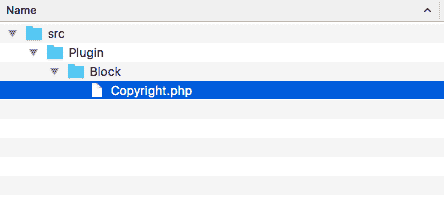
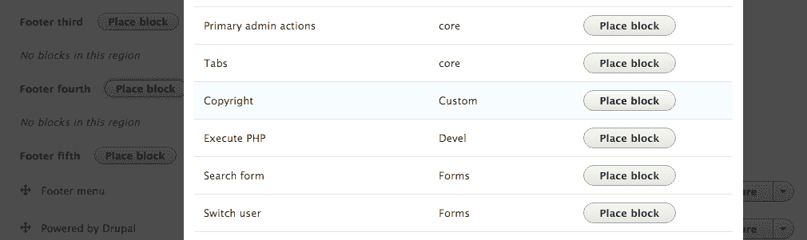
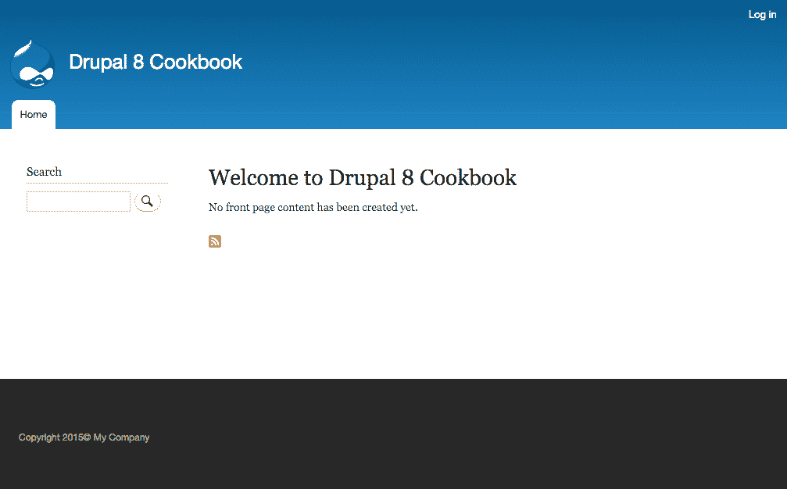
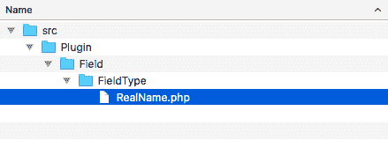
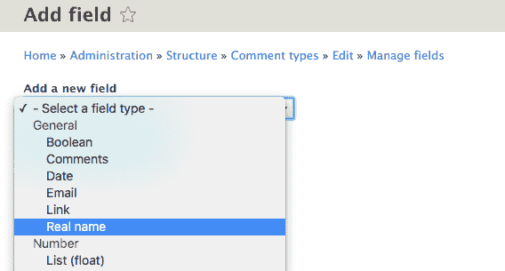
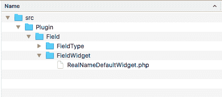
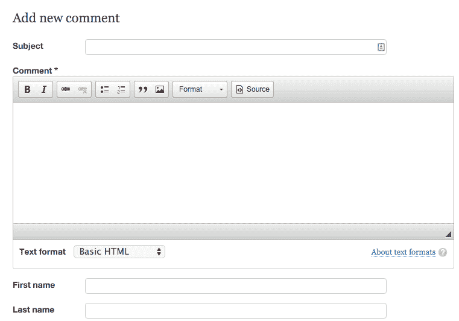
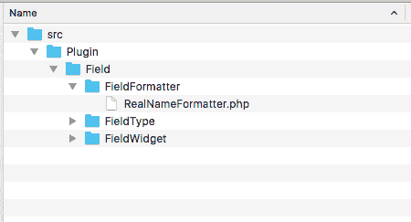
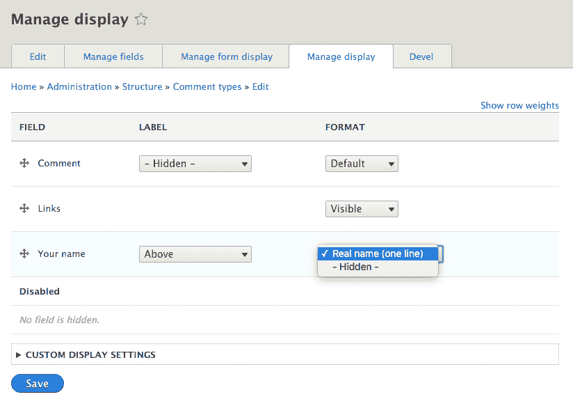

# 插件即插即用

在本章中，我们将深入探讨 Drupal 8 中提供的新插件 API：

+   使用插件创建块

+   创建自定义字段类型

+   创建自定义字段小部件

+   创建自定义字段格式化器

+   创建自定义插件类型

# 简介

Drupal 8 引入了插件。插件在 Drupal 中驱动许多项目，例如块、字段类型和字段格式化器。插件和插件类型由模块提供。它们提供可交换和特定的功能。正如在*第五章*，*前端为王*中讨论的，断点也是插件。在本章中，我们将讨论插件在 Drupal 8 中的工作方式，并展示如何创建块、字段和自定义插件类型。

每个版本的 Drupal 都有子系统，它们提供了可插拔的组件和贡献模块。然而，这些子系统的实现和管理带来了问题。块、字段和图像样式各自有不同的系统需要学习和理解。插件 API 存在于 Drupal 8 中，以减轻这个问题并提供一个基础 API 来实现可插拔组件。这大大提高了与 Drupal 核心子系统一起工作的开发者体验。在本章中，我们将实现一个块插件。我们将使用插件 API 来提供自定义字段类型以及字段的部件和格式化器。最后一个食谱将向您展示如何创建和使用自定义插件类型。

# 使用插件创建块

在 Drupal 中，块是可以放置在主题提供的区域中的内容片段。块用于展示特定类型的内容，例如用户登录表单、文本片段等等。

块是注解插件。注解插件使用文档块来提供插件的详细信息。它们在模块的 `Plugin` 类命名空间中被发现。`Plugin/Block` 命名空间中的每个类都将被块模块的插件管理器发现。

在本食谱中，我们将定义一个块，该块将显示版权片段和当前年份，并将其放置在页脚区域：

# 准备工作

创建一个新模块，如本食谱中所示，并定义 `info.yml` 以便 Drupal 能够发现它。在整个食谱中，我们将把该模块称为 `mymodule`。请使用您模块的适当名称。

# 如何操作...

1.  在您的模块中创建一个 `src/Plugin/Block` 目录。这将翻译

    `\Drupal\mymodule\Plugin\Block` 命名空间并允许块插件发现。

1.  在新创建的文件夹中创建一个 `Copyright.php` 文件，以便我们可以为我们的块定义 `Copyright` 类：



1.  `Copyright` 类将扩展 `\Drupal\Core\Block\BlockBase` 类：

```php
<?php 

namespace Drupal\mymodule\Plugin\Block; 

use Drupal\Core\Block\BlockBase; 

class Copyright extends BlockBase { 

} 
```

我们将扩展实现 `\Drupal\Core\Block\BlockPluginInterface` 的 `BlockBase` 类，并为我们提供接口几乎所有方法的实现。

1.  我们将提供块的标识符、管理标签和类别：

```php
<?php 

namespace Drupal\mymodule\Plugin\Block; 

use Drupal\Core\Block\BlockBase; 

/** 
 * @Block( 
 *   id = "copyright_block", 
 *   admin_label = @Translation("Copyright"), 
 *   category = @Translation("Custom") 
 * ) 
 */ 
class Copyright extends BlockBase { 

} 
```

类的注释文档块通过 `@Block` 识别插件类型。Drupal 将解析此信息并使用其中定义的属性启动插件。`id` 是内部机器名称，`admin_label` 在块列表页面上显示，而 `category` 则出现在块选择列表中。

1.  我们需要提供一个 `build` 方法以满足 `\Drupal\Core\Block\BlockPluginInterface` 接口。这个方法返回要显示的输出：

```php
<?php 

namespace Drupal\mymodule\Plugin\Block; 

use Drupal\Core\Block\BlockBase; 

/** 
 * @Block( 
 *   id = "copyright_block", 
 *   admin_label = @Translation("Copyright"), 
 *   category = @Translation("Custom") 
 * ) 
 */ 
class Copyright extends BlockBase { 

  /** 
   * {@inheritdoc} 
   */ 
  public function build() { 
    $date = new \DateTime(); 
    return [ 
      '#markup' => t('Copyright @year&copy; My Company', [ 
          '@year' => $date->format('Y'), 
      ]), 
    ]; 
  } 
} 
```

`build` 方法返回一个使用 Drupal 的 `t` 函数替换 `@year` 的渲染数组，该数组是格式化为完整年份的 `\DateTime` 对象的输出。

自 PHP 5.4 以来，如果您在 PHP 的配置中没有明确设置时区，将会显示警告。

1.  如果您的模块尚未安装，请通过访问扩展页面来安装您的模块。如果您已经安装了您的模块，请转到性能页面并重新构建 Drupal 的缓存。

1.  从管理菜单中的结构进入黑色布局页面。在页脚第四区域中，点击放置块。

1.  审查块列表，并将自定义块添加到您的区域中，例如页脚区域。找到版权块，并点击放置块：



1.  取消选择显示标题复选框，以便只渲染我们的块内容。点击保存块并接受所有其他默认设置。

1.  查看您的 Drupal 网站，并验证版权声明将始终保持年份动态：



# 它是如何工作的...

插件系统通过插件定义和插件管理器来实现。`\Drupal\Core\Block\BlockManager` 类定义了需要位于 `Plugin/Block` 命名空间中的块插件。它还定义了需要实现的基接口，以及用于解析类的文档块的 `Annotation` 类。

当 Drupal 的缓存重新构建时，所有可用的命名空间都会被扫描以检查在给定的插件命名空间中是否存在类。通过注释处理定义，并将信息缓存起来。

然后从管理器检索块，对其进行操作，并调用其方法。在查看 `块布局` 页面以管理块时，会调用 `\Drupal\Core\Block\BlockBase` 类的 `label` 方法以显示可读名称。当一个块在渲染的页面上显示时，会调用 `build` 方法并将其传递给主题层以输出。

# 更多...

在创建块插件时，可以使用更多深入的项目。我们将在以下部分中介绍这些内容。

# 修改块

块可以通过三种不同的方式修改：修改插件定义、修改构建数组或修改视图数组。

一个模块可以在其 `.module` 文件中实现 `hook_block_alter` 并修改所有发现的块的注释定义。这将允许模块将默认的 `user_login_block` 从用户登录更改为 `Login`：

```php
/** 
 * Implements hook_block_alter(). 
 */ 
function mymodule_block_alter(&$definitions) { 
  $definitions['user_login_block']['admin_label'] = t('Login'); 
} 
```

一个模块可以实现 `hook_block_build_alter` 并修改块的构建信息。钩子通过构建数组和当前块的 `\Drupal\Core\Block\BlockPluginInterface` 实例传递。模块开发者可以使用此功能添加缓存上下文或更改元数据的缓存能力：

```php
/** 
 * Implements hook_block_build_alter(). 
 */ 
function hook_block_build_alter(array &$build, \Drupal\Core\Block\BlockPluginInterface $block) { 
  // Add the 'url' cache the block per URL. 
  if ($block->getBaseId() == 'myblock') { 
    $build['#contexts'][] = 'url'; 
  } 
} 
```

您可以通过更改食谱的块以输出时间戳来测试缓存元数据的修改。启用缓存后，您将看到值在相同的 URL 上持续存在，但每个页面的值将不同。

最后，一个模块可以实现 `hook_block_view_alter` 以修改要渲染的输出。模块可以添加要渲染的内容或删除内容。这可以用来删除 `contextual_links` 项，这允许在网站的首页上进行内联编辑：

```php
/** 
 * Implements hook_block_view_alter(). 
 */ 
function hook_block_view_alter(array &$build, \Drupal\Core\Block\BlockPluginInterface $block) { 
  // Remove the contextual links on all blocks that provide them. 
  if (isset($build['#contextual_links'])) { 
    unset($build['#contextual_links']); 
  } 
} 
```

# 块设置表单

块可以提供一个 `setting` 表单。本菜谱为版权文本提供了文本 *My Company*。相反，这可以通过块设置表单中的文本字段来定义。

让我们重新审视包含我们块类的 `Copyright.php` 文件。我们将覆盖基类提供的方法。以下方法将被添加到本食谱中编写的类中。

一个块可以覆盖默认的 `defaultConfiguration` 方法，该方法返回一个设置键及其默认值的数组。然后 `blockForm` 方法可以覆盖 `\Drupal\Core\Block\BlockBase` 的空数组实现，以返回一个表单 API 数组来表示设置表单：

```php
  /** 
   * {@inheritdoc} 
   */ 
  public function defaultConfiguration() { 
    return [ 
      'company_name' => '', 
    ]; 
  } 

  /** 
   * {@inheritdoc} 
   */ 
  public function blockForm($form, \Drupal\Core\Form\FormStateInterface $form_state) { 
    $form['company_name'] = [ 
      '#type' => 'textfield', 
      '#title' => t('Company name'), 
      '#default_value' => $this->configuration['company_name'], 
    ]; 
    return $form; 
  } 
```

然后，必须实现 `blockSubmit` 方法，该方法更新块的配置：

```php
  /** 
   * {@inheritdoc} 
   */ 
  public function blockSubmit($form, \Drupal\Core\Form\FormStateInterface $form_state) { 
    $this->configuration['company_name'] = $form_state->getValue('company_name'); 
  } 
```

最后，可以将 `build` 方法更新为使用新的配置项：

```php
  /** 
   * {@inheritdoc} 
   */ 
  public function build() { 
    $date = new \DateTime(); 
    return [ 
      '#markup' => t('Copyright @year&copy; @company', [ 
        '@year' => $date->format('Y'), 
        '@company' => $this->configuration['company_name'], 
      ]), 
    ]; 
  } 
```

您现在可以返回到 `块布局` 表单，并在版权块上单击配置。新的设置将在块实例的配置表单中可用。

# 定义块的访问权限

默认情况下，块会为所有用户渲染。默认访问方法可以被覆盖。这允许块只对认证用户或基于特定权限的用户显示：

```php
  /** 
   * {@inheritdoc} 
   */ 
  protected function blockAccess(AccountInterface $account) { 
    $route_name = $this->routeMatch->getRouteName(); 
    if ($account->isAnonymous() && !in_array($route_name, 
       array('user.login', 'user.logout'))) { 
      return AccessResult::allowed() 
        ->addCacheContexts(['route.name', 
           'user.roles:anonymous']); 
    } 
    return AccessResult::forbidden(); 
  } 
```

上述代码来自 `user_login_block`。它允许在用户注销且不在登录或注销页面时访问块。访问基于当前路由名称和用户当前角色为匿名者进行缓存。如果没有传递这些，则返回的访问被禁止，并且块不会被构建。

其他模块可以实现 `hook_block_access` 以覆盖块的访问权限：

```php
/** 
 * Implements hook_block_access(). 
 */ 
function mymodule_block_access(\Drupal\block\Entity\Block $block, $operation, \Drupal\Core\Session\AccountInterface $account) { 
  // Example code that would prevent displaying the Copyright' block in 
  // a region different than the footer. 
  if ($operation == 'view' && $block->getPluginId() == 'copyright') { 
    return \Drupal\Core\Access\AccessResult::forbiddenIf($block->getRegion() != 'footer'); 
  } 

  // No opinion. 
  return \Drupal\Core\Access\AccessResult::neutral(); 
} 
```

实现上述钩子的模块将阻止我们的版权块在没有放置在页脚区域时访问。

# 参见

+   参考本章的 *创建自定义插件类型* 菜谱

+   请参考基于注释的插件文档，链接为[`www.drupal.org/docs/8/api/plugin-api/annotations-based-plugins`](https://www.drupal.org/docs/8/api/plugin-api/annotations-based-plugins)

+   关于`block.api.php`的信息可在[`api.drupal.org/api/drupal/core%21modules%21block%21block.api.php/8`](https://api.drupal.org/api/drupal/core%21modules%21block%21block.api.php/8)找到

# 创建自定义字段类型

字段类型是通过插件系统定义的。每种字段类型都有自己的类和定义。可以通过自定义类来定义新的字段类型，该类将提供模式和属性信息。

在本例中，我们将创建一个简单的字段类型，称为*真实姓名*，用于存储姓氏和名字。

字段类型定义了通过 Field API 存储和处理数据的方式。字段小部件提供了在用户界面中编辑字段类型的方法。字段格式化器提供了向用户显示字段数据的方法。两者都是插件，将在后续食谱中介绍。

# 准备工作

创建一个新模块，类似于本食谱中展示的模块，并定义一个`info.yml`文件，以便 Drupal 能够发现它。在整个食谱中，我们将把这个模块称为`mymodule`。请使用你模块的适当名称。

# 如何操作...

1.  我们需要在模块的基本位置创建`src/Plugin/Field/FieldType`目录。`Field`模块在`Plugin\Field\FieldType`命名空间中查找字段类型。

1.  我们将在新创建的目录中创建一个`RealName.php`文件，以便我们可以定义`RealName`类。这将为我们提供用于姓氏和名字的`realname`字段：



1.  `RealName`类将扩展`\Drupal\Core\Field\FieldItemBase`类：

```php
<?php 

namespace Drupal\mymodule\Plugin\Field\FieldType; 

use Drupal\Core\Field\FieldItemBase; 
use Drupal\Core\Field\FieldStorageDefinitionInterface; 
use Drupal\Core\TypedData\DataDefinition; 

class RealName extends FieldItemBase { 

} 
```

`\Drupal\Core\Field\FieldItemBase`满足继承接口定义的方法，除了`schema`和`propertyDefinitions`。

1.  字段类型是注释插件。注释插件使用文档块来提供插件详情。我们将提供字段类型的标识符、标签、描述、类别和默认小部件和格式化器：

```php
<?php 

namespace Drupal\mymodule\Plugin\Field\FieldType; 

use Drupal\Core\Field\FieldItemBase; 
use Drupal\Core\Field\FieldStorageDefinitionInterface; 
use Drupal\Core\TypedData\DataDefinition; 

/** 
 * Plugin implementation of the 'realname' field type. 
 * 
 * @FieldType( 
 *   id = "realname", 
 *   label = @Translation("Real name"), 
 *   description = @Translation("This field stores a first and last name."), 
 *   category = @Translation("General"), 
 *   default_widget = "string_textfield", 
 *   default_formatter = "string" 
 * ) 
 */ 

class RealName extends FieldItemBase { 

} 
```

`@FieldType`告诉 Drupal 这是一个`FieldType`插件。以下属性被定义：

+   `Id`：这是插件的机器名

+   `Label`：这是字段的可读性名称

+   `description`：这是字段的可读性描述

+   `category`：这是字段在用户界面中显示的类别

+   `default_widget`：这是用于编辑的默认表单小部件

+   `default_formatter`：这是可以用来显示字段的默认格式化器

1.  `RealName`类需要实现定义在

    `\Drupal\Core\Field\FieldItemInterface`。这返回一个数据库 API 模式信息的数组。请向你的类中添加以下方法：

```php
/** 
 * {@inheritdoc} 
 */ 
public static function schema(\Drupal\Core\Field\FieldStorageDefinitionInterface $field_definition) { 
  return [ 
    'columns' => [ 
      'first_name' => [ 
        'description' => 'First name.', 
        'type' => 'varchar', 
        'length' => '255', 
        'not null' => TRUE, 
        'default' => '', 
      ], 
      'last_name' => [ 
        'description' => 'Last name.', 
        'type' => 'varchar', 
        'length' => '255', 
        'not null' => TRUE, 
        'default' => '', 
      ], 
    ], 
    'indexes' => [ 
       'first_name' => ['first_name'], 
       'last_name' => ['last_name'], 
    ], 
  ]; 
} 
```

`schema`方法定义了字段数据表中的列。我们将定义一个列来存储`first_name`和`last_name`值。

1.  我们还需要实现 `propertySchema` 方法以满足 `\Drupal\Core\TypedData\ComplexDataDefinitionInterface`。此方法返回 `schema` 方法中定义的值的类型化定义。将以下方法添加到您的类中：

```php
/** 
 * {@inheritdoc} 
 */ 
public static function propertyDefinitions(\Drupal\Core\Field\FieldStorageDefinitionInterface $field_definition) { 
  $properties['first_name'] = \Drupal\Core\TypedData\DataDefinition::create('string') 
->setLabel(t('First name')); 
  $properties['last_name'] = \Drupal\Core\TypedData\DataDefinition::create('string') 
->setLabel(t('Last name')); 
  return $properties; 
} 
```

此方法返回一个数组，其键与`schema`中提供的列名相同。它返回一个类型化数据定义来处理字段类型的值。

1.  如果尚未安装，请通过访问扩展页面来安装您的模块。如果您已经安装了您的模块，请转到性能页面并重新构建 Drupal 的缓存。

1.  字段现在将出现在字段类型管理屏幕上。要使用它，请转到结构，然后转到评论类型。现在您可以转到管理字段并点击添加字段来为您的评论添加真实姓名条目：



# 它是如何工作的...

Drupal 核心定义了一个 `plugin.manager.field.field_type` 服务。默认情况下，这是通过 `\Drupal\Core\Field\FieldTypePluginManager` 类来处理的。此插件管理器定义了应位于 `Plugin/Field/FieldType` 命名空间中的字段类型插件，并且该命名空间中的所有类都将被加载并假定是字段类型插件。

管理器的定义还设置了 `\Drupal\Core\Field\FieldItemInterface` 作为所有字段类型插件将实现的预期接口。这就是为什么大多数字段类型都扩展 `\Drupal\Core\Field\FieldItemBase` 以满足这些方法要求。

由于字段类型是注解插件，管理器提供了 `\Drupal\Core\Field\Annotation\FieldType` 作为满足注解定义的类。

当用户界面定义可用的字段时，将调用 `plugin.manager.field.field_type` 服务以检索可用字段类型的列表。

# 还有更多...

可以修改现有的字段类型以修改它们的定义，并且自定义字段类型可以实现一个方法来定义值是否为空。我们将在下一节中介绍这些内容。

# 修改字段类型

`\Drupal\Core\Field\FieldTypePluginManager` 类将 `alter` 方法定义为 `field_info`。实现 `.module` 文件中的 `hook_field_info_alter` 的模块有权修改由管理器发现的字段类型定义：

```php
/** 
 * Implements hook_field_info_alter(). 
 */ 
function mymodule_field_info_alter(&$info) { 
  $info['email']['label'] = t('E-mail address'); 
} 
```

前面的 `alter` 方法将在用户界面中选择字段时将电子邮件字段的易读标签更改为 **电子邮件地址**。

# 定义字段是否为空

`\Drupal\Core\TypedDate\ComplexDataInterface` 接口提供了一个 `isEmpty` 方法。此方法用于检查字段值是否为空，例如，在验证所需字段是否有数据时。`\Drupal\Core\TypedData\Plugin\DataType\Map` 类实现了此方法。默认情况下，此方法确保值不为空。

字段类型可以提供它们自己的实现以提供更健壮的验证。例如，字段可以验证可以输入第一个名称但不能输入最后一个名称，或者字段可以要求输入第一个和最后一个名称。

# 参见

+   参考本章的 *使用插件创建块* 配方

# 创建自定义字段小部件

字段小部件提供了编辑字段的表单界面。这些与表单 API 集成，以定义字段如何编辑以及数据在保存之前如何格式化。字段小部件通过表单显示界面进行选择和定制。

在本配方中，我们将创建一个用于本章中 *创建自定义字段类型* 配方中创建的字段的表单小部件。字段小部件将为输入第一个和最后一个名称项提供两个文本字段。

# 准备工作

创建一个新的模块，例如来自 *创建自定义字段类型* 的配方。在整个配方中，我们将把该模块称为 `mymodule`。使用您模块的适当名称。

# 如何操作...

1.  我们需要在模块的基本位置创建 `src/Plugin/Field/FieldWidget` 目录。`Field` 模块在 `Plugin\Field\FieldWidget` 命名空间中查找字段小部件。

1.  在新创建的目录中创建一个 `RealNameDefaultWidget.php` 文件，以便我们可以定义 `RealNameDefaultWidget` 类。这将提供一个自定义表单元素来编辑我们字段的第一个和最后一个名称值：



1.  `RealNameDefaultWidget` 类将扩展 `\Drupal\Core\Field\WidgetBase` 类：

```php
<?php 

namespace Drupal\mymodule\Plugin\Field\FieldWidget; 

use Drupal\Core\Field\WidgetBase; 

class RealNameDefaultWidget extends WidgetBase { 

} 
```

1.  我们将在插件的注解中提供字段小部件的标识符、标签和支持的字段类型：

```php
<?php 

namespace Drupal\mymodule\Plugin\Field\FieldWidget; 

use Drupal\Core\Field\WidgetBase; 
use Drupal\Core\Field\FieldItemListInterface; 
use Drupal\Core\Form\FormStateInterface; 

/** 
 * Plugin implementation of the 'realname_default' widget. 
 * 
 * @FieldWidget( 
 *   id = "realname_default", 
 *   label = @Translation("Real name"), 
 *   field_types = { 
 *     "realname" 
 *   } 
 * ) 
 */ 
class RealNameDefaultWidget extends WidgetBase { 

} 
```

`@FieldWidget` 告诉 Drupal 这是一个字段小部件插件。它定义了 `id` 来表示机器名，可读名称为 `label`，以及小部件交互的字段类型。

1.  我们需要实现 `formElement` 方法以满足在扩展 `\Drupal\Core\Field\WidgetBase` 后剩余的 `interface` 方法。将以下方法添加到您的类中：

```php
/** 
 * {@inheritdoc} 
 */ 
public function formElement(FieldItemListInterface $items, $delta, array $element, array &$form, FormStateInterface $form_state) { 
  $element['first_name'] = [ 
    '#type' => 'textfield', 
    '#title' => t('First name'), 
    '#default_value' => '', 
    '#size' => 25, 
    '#required' => $element['#required'], 
  ]; 
  $element['last_name'] = [ 
    '#type' => 'textfield', 
    '#title' => t('Last name'), 
    '#default_value' => '', 
    '#size' => 25, 
    '#required' => $element['#required'], 
  ]; 
return $element; 
} 
```

`formElement` 方法返回一个表示要设置的表单 API 数组的数组，并编辑字段数据。

1.  接下来，我们需要修改我们的原始 `RealName` 字段类型插件类，以使用我们创建的默认小部件。修改 `src/Plugin/FieldType/RealName.php` 文件，并将 `default_widget` 注解属性更新为 `realname_default`：

```php
/** 
 * Plugin implementation of the 'realname' field type. 
 * 
 * @FieldType( 
 *   id = "realname", 
 *   label = @Translation("Real name"), 
 *   description = @Translation("This field stores a first and last name."), 
 *   category = @Translation("General"), 
 *   default_widget = "realname_default", 
 *   default_formatter = "string" 
 * ) 
 */ 
class RealName extends FieldItemBase { 
```

1.  重建 Drupal 的缓存，以便插件系统可以发现新的字段小部件。

1.  添加一个 `Real name` 字段并使用新的 `Real name` 小部件。例如，将其添加到评论类型中：



# 工作原理...

Drupal 核心定义了一个 `plugin.manager.field.widget` 服务。默认情况下，这是通过 `\Drupal\Core\Field\FieldWidgetPluginManager` 类处理的。这个插件管理器定义了应在 `Plugin/Field/FieldWidget` 命名空间中的字段小部件插件，并且这个命名空间中的所有类都将被加载并被假定是字段小部件插件。

管理器的定义也将 `\Drupal\Core\Field\FieldWidgetInterface` 设置为所有字段小部件插件应实现的预期接口。这就是为什么大多数字段类型都扩展 `\Drupal\Core\Field\WidgetBase` 来满足这些方法要求。

由于字段小部件是注解插件，管理器提供 `\Drupal\Core\Field\Annotation\FieldWidget` 作为满足注解定义的类。

实体表单显示系统使用 `plugin.manager.field.widget` 服务来加载字段定义并将从 `formElement` 方法返回的字段元素添加到实体表单中。

# 更多...

字段小部件有额外的方法来提供更多信息；它们将在下一节中介绍。

# 字段小部件设置和摘要

`\Drupal\Core\Field\WidgetInterface` 接口定义了三个可以被重写的方法，用于提供设置表单和当前设置的摘要：

+   `defaultSettings`：这个方法返回一个设置键和默认值的数组

+   `settingsForm`：这个方法返回一个用于设置表单的 Form API 数组

+   `settingsSummary`：这个方法允许返回并显示在字段管理显示表单上的字符串数组

可以使用小部件设置来更改用户看到的表单。可以创建一个设置，允许字段元素仅通过一个文本字段输入姓名的首字母或最后一个字母。

# 参见

+   本章的 *创建自定义插件类型* 食谱

# 创建自定义字段格式化器

字段格式化器定义了字段类型将被呈现的方式。这些格式化器返回由主题层处理的渲染数组信息。字段格式化器在显示模式接口上进行配置。

在本食谱中，我们将创建一个格式化器，用于本章中 *创建自定义字段类型* 食谱中创建的字段。字段格式化器将显示一些设置下的姓名的首字母和最后一个字母。

# 准备工作

创建一个新的模块，就像第一个食谱中已有的那样。在本食谱中，我们将把模块称为 `mymodule`。使用你模块的适当名称。

# 如何操作...

1.  我们需要在模块的基础位置创建 `src/Plugin/Field/FieldFormatter` 目录。`Field` 模块在 `Plugin\Field\FieldFormatter` 命名空间中查找字段格式化器。

1.  在新创建的目录中创建一个 `RealNameFormatter.php` 文件，以便我们可以定义 `RealNameFormatter` 类。这将提供一个自定义表单元素来显示字段的值：



1.  `RealNameFormatter` 类将扩展 `\Drupal\Core\Field\FormatterBase` 类：

```php
<?php 

namespace Drupal\mymodule\Plugin\Field\FieldFormatter; 

use Drupal\Core\Field\FormatterBase; 
use Drupal\Core\Field\FieldItemListInterface; 

class RealNameFormatter extends FormatterBase { 

} 
```

1.  我们将提供字段小部件的标识符、标签和支持的字段类型：

```php
<?php 

namespace Drupal\mymodule\Plugin\Field\FieldFormatter; 

use Drupal\Core\Field\FormatterBase; 
use Drupal\Core\Field\FieldItemListInterface; 

/** 
 * Plugin implementation of the 'realname_one_line' formatter. 
 * 
 * @FieldFormatter( 
 *   id = "realname_one_line", 
 *   label = @Translation("Real name (one line)"), 
 *   field_types = { 
 *     "realname" 
 *   } 
 * ) 
 */ 
class RealNameFormatter extends FormatterBase { 

} 
```

1.  我们需要实现 `viewElements` 方法以满足 `\Drupal\Core\Field\FormatterInferface` 接口。这用于渲染字段数据。将以下方法添加到您的类中：

```php
/** 
{@inheritdoc} 
*/ 
public function viewElements(FieldItemListInterface $items, $langcode) { 
  $element = []; 

  foreach ($items as $delta => $item) { 
    $element[$delta] = [ 
      '#markup' => $this->t('@first @last', [ 
        '@first' => $item->first_name, 
        '@last' => $item->last_name, 
      ]), 
    ]; 
  } 
  return $element; 
} 
```

1.  接下来，我们需要修改我们原始的 `RealName` 字段类型的 `plugin` 类，以使用我们创建的默认格式化器。打开 `src/Plugin/FieldType/RealName.php` 文件，并将 `default_formatter` 注解属性更新为 `realname_one_line`：

```php
/** 
 * Plugin implementation of the 'realname' field type. 
 * 
 * @FieldType( 
 *   id = "realname", 
 *   label = @Translation("Real name"), 
 *   description = @Translation("This field stores a first and last name."), 
 *   category = @Translation("General"), 
 *   default_widget = " string_textfield ", 
 *   default_formatter = "realname_one_line" 
 * ) 
 */ 
```

1.  重建 Drupal 的缓存，以便插件系统可以发现新的字段小部件。

1.  更新一个具有 `Real name` 字段的实体视图模式，以使用真实姓名（单行）格式化器：



# 它是如何工作的...

Drupal 核心定义了一个 `plugin.manager.field.formatter` 服务。默认情况下，这是通过 `\Drupal\Core\Field\FormatterPluginManager` 类处理的。此插件管理器定义了应在 `Plugin/Field/FieldFormatter` 命名空间中的字段格式化器插件，并且该命名空间中的所有类都将被加载并假定是字段格式化器插件。

管理器的定义也将 `\Drupal\Core\Field\FormatterInterface` 设置为所有字段格式化器插件将实现的预期接口。这就是为什么大多数字段格式化器都扩展 `\Drupal\Core\Field\FormatterBase` 来满足这些方法要求。

由于字段格式化器是注解插件，管理器提供 `\Drupal\Core\Field\Annotation\FieldFormatter` 作为满足注解定义的类。

实体视图显示系统使用 `plugin.manager.field.formatter` 服务来加载字段定义并将从 `viewElements` 方法返回的字段渲染数组添加到实体视图渲染数组中。

# 还有更多...

字段格式化器有额外的方法来提供更多信息；它们将在下一节中介绍。

# 格式化器设置和摘要

`\Drupal\Core\Field\FormatterInterface` 接口定义了三个可以重写的方法，以提供设置表单和当前设置的摘要：

+   `defaultSettings`: 这返回一个设置键和默认值的数组

+   `settingsForm`: 这返回一个用于设置表单的表单 API 数组

+   `settingsSummary`: 这允许返回并显示在字段管理显示表单上的字符串数组

设置可以用来改变格式化器显示信息的方式。例如，可以实现这些方法来提供设置以隐藏或显示姓名的首字母或最后一个字母。

# 参见

+   参考本章的 *创建自定义插件类型* 菜谱。

# 创建自定义插件类型

插件系统提供了一种在 Drupal 中创建专用对象的方法，这些对象不需要实体系统的数据存储功能。

本食谱基于作者启动的将**GeoIP API**模块移植到 Drupal 8 的项目。**GeoIP API**模块提供了一种从网站访问者的 IP 地址获取国家的方法。

在本食谱中，我们将创建一个名为`GeoLocator`的新插件类型，该类型将返回给定 IP 地址的国家代码。我们将创建一个插件管理器、默认插件接口、插件注解定义，并提供一个默认插件，通过网站的 CDN 查找国家。

# 准备工作

在本食谱中，我们将使用`geoip`命名空间和模块名称。

# 如何操作...

1.  所有插件都需要有一个作为插件管理器的服务。在你的模块的`src`目录中创建一个新文件，命名为`GeoLocatorManager.php`。这将保存`GeoLocatorManager`类。

1.  通过扩展`\Drupal\Core\Plugin\DefaultPluginManager`类创建`GeoLocatorManager`类：

```php
<?php 

namespace Drupal\geoip; 

use Drupal\Core\Plugin\DefaultPluginManager; 
use Drupal\Core\Cache\CacheBackendInterface; 
use Drupal\Core\Extension\ModuleHandlerInterface; 

class GeoLocatorManager extends DefaultPluginManager { 

}
```

1.  当创建一个新的插件类型时，建议插件管理器为新插件提供一组默认值，以防定义中缺少项目：

```php
<?php 

namespace Drupal\geoip; 

use Drupal\Core\Plugin\DefaultPluginManager; 
use Drupal\Core\Cache\CacheBackendInterface; 
use Drupal\Core\Extension\ModuleHandlerInterface; 

class GeoLocatorManager extends DefaultPluginManager { 

  /** 
   * Default values for each plugin. 
   * 
   * @var array 
   */ 
  protected $defaults = [ 
    'label' => '', 
    'description' => '', 
    'weight' => 0, 
  ]; 

} 
```

1.  接下来，我们需要覆盖`\Drupal\Core\Plugin\DefaultPluginManager`类的构造函数以定义模块处理程序和缓存后端：

```php
<?php 

namespace Drupal\geoip; 

use Drupal\Core\Plugin\DefaultPluginManager; 
use Drupal\Core\Cache\CacheBackendInterface; 
use Drupal\Core\Extension\ModuleHandlerInterface; 

class GeoLocatorManager extends DefaultPluginManager { 

  /** 
   * Default values for each plugin. 
   * 
   * @var array 
   * / 
  protected $defaults = [ 
    'label' => '', 
    'description' => '', 
    'weight' => 0, 
  ]; 

  /** 
   * Constructs a new GeoLocatorManager object. 
   * 
   * @param \Traversable $namespaces 
   *   An object that implements \Traversable which contains the root paths 
   *   keyed by the corresponding namespace to look for plugin implementations. 
   * @param \Drupal\Core\Cache\CacheBackendInterface $cache_backend 
   *   Cache backend instance to use. 
   * @param \Drupal\Core\Extension\ModuleHandlerInterface $module_handler 
   *   The module handler. 
   */ 
  public function __construct(\Traversable $namespaces, CacheBackendInterface $cache_backend, ModuleHandlerInterface $module_handler) { 
    parent::__construct( 
      'Plugin/GeoLocator',  
      $namespaces,  
      $module_handler,  
      'Drupal\geoip\Plugin\GeoLocator\GeoLocatorInterface',  
      'Drupal\geoip\Annotation\GeoLocator' 
    ); 
    $this->setCacheBackend($cache_backend, 'geolocator_plugins'); 
  } 

} 
```

我们覆盖构造函数，以便可以指定特定的缓存键。这允许插件定义被正确缓存和清除；否则，我们的插件管理器将不断从磁盘读取以查找插件。

1.  下一步将在我们模块的根目录下创建一个`geoip.services.yml`文件。这将描述我们的插件管理器给 Drupal，允许插件发现：

```php
services: 
  plugin.manager.geolocator: 
    class: Drupal\geoip\GeoLocatorManager 
    parent: default_plugin_manager 
```

Drupal 利用服务和依赖注入。通过将我们的类定义为服务，我们告诉应用程序容器如何初始化我们的类。我们可以使用`parent`定义来告诉容器使用与`default_plugin_manager`定义相同的参数。

1.  所有基于注解的插件都必须提供一个类，该类作为注解定义。在`src/Annotation`目录下创建`GeoLocator.php`文件以提供`GeoLocator`注解类：

```php
<?php 

namespace Drupal\geoip\Annotation; 

use Drupal\Component\Annotation\Plugin; 

/** 
 * Defines a GeoLocator annotation object. 
 * 
 * @Annotation 
 */ 
class GeoLocator extends Plugin { 

  /** 
   * The human-readable name. 
   * 
   * @var \Drupal\Core\Annotation\Translation 
   * 
   * @ingroup plugin_translatable 
   */ 
  public $label; 

  /** 
   * A description of the plugin. 
   * 
   * @var \Drupal\Core\Annotation\Translation 
   * 
   * @ingroup plugin_translatable 
   */ 
  public $description; 

} 
```

每个属性都是可以在插件注解中定义的项目。对于我们的插件，注解定义将始于`@GeoLocator`。

1.  接下来，我们将定义在插件管理器中定义的插件接口。插件管理器将验证实现此接口的`GeoLocator`插件。在我们的模块的`src/Plugin/GeoLocator`目录下创建一个`GeoLocatorInterface.php`文件以保存接口：

```php
<?php 

namespace Drupal\geoip\Plugin\GeoLocator; 

/** 
 * Interface GeoLocatorInterface. 
 */ 
interface GeoLocatorInterface { 

  /** 
   * Get the plugin's label. 
   * 
   * @return string 
   *   The geolocator label 
   */ 
  public function label(); 

  /** 
   * Get the plugin's description. 
   * 
   * @return string 
   *   The geolocator description 
   */ 
  public function description(); 

  /** 
   * Performs geolocation on an address. 
   * 
   * @param string $ip_address 
   *   The IP address to geolocate. 
   * 
   * @return string|NULL 
   *   The geolocated country code, or NULL if not found. 
   */ 
  public function geolocate($ip_address); 

} 
```

我们提供了一个接口，以确保在处理`GeoLocator`插件时，我们有这些预期的方法，并且无论每个方法背后的逻辑如何，都有输出。

1.  接下来，我们将创建一个默认插件，如果可用，则从 CDN 头中返回国家代码。在`src/Plugin/GeoLocator`目录下创建一个`Cdn.php`文件以创建我们的`Cdn`插件类：

```php
<?php 

namespace Drupal\geoip\Plugin\GeoLocator; 

use Drupal\Core\Plugin\PluginBase; 

/** 
 * CDN geolocation provider. 
 * 
 * @GeoLocator( 
 *   id = "cdn", 
 *   label = "CDN", 
 *   description = "Checks for geolocation headers sent by CDN services", 
 *   weight = -10 
 * ) 
 */ 
class Cdn extends PluginBase implements GeoLocatorInterface { 

  /** 
   * {@inheritdoc} 
   */ 
  public function label() { 
    return $this->pluginDefinition['label']; 
  } 

  /** 
   * {@inheritdoc} 
   */ 
  public function description() { 
    return $this->pluginDefinition['description']; 
  } 

  /** 
   * {@inheritdoc} 
   */ 
  public function geolocate($ip_address) { 
    // Check if CloudFlare headers present. 
    if (!empty($_SERVER['HTTP_CF_IPCOUNTRY'])) { 
      $country_code = $_SERVER['HTTP_CF_IPCOUNTRY']; 
    } 
    // Check if CloudFront headers present. 
    elseif (!empty($_SERVER['HTTP_CLOUDFRONT_VIEWER_COUNTRY'])) { 
      $country_code = $_SERVER['HTTP_CLOUDFRONT_VIEWER_COUNTRY']; 
    } 
    else { 
      $country_code = NULL; 
    } 

    return $country_code; 
  } 

} 

```

1.  `GeoLocator`插件类型现在已设置，并带有默认的基于 CDN 的插件。

# 它是如何工作的...

Drupal 8 实现了一个服务容器，这是一个从 Symfony 框架中采用的概念。为了实现一个插件，需要有一个可以发现和处理插件定义的管理器。这个管理器在模块的 `services.yml` 文件中定义为一个服务，并带有其所需的构造函数参数。这允许服务容器在需要时启动类。

在我们的示例中，`GeoLocatorManager` 插件管理器通过注解插件发现来发现 `GeoLocator` 插件定义。在第一次发现之后，所有已知的插件定义都将在 `geolocator_plugins` 缓存键下缓存。

插件管理器还提供了一个方法来返回这些定义或基于可用定义创建一个对象实例。对于 CDN 插件，这将是一个完整的实例化的 `Cdn` 类对象。

让我们考虑以下示例：

```php
// Load the manager service. 
$geolocator_manager = \Drupal::service('plugin.manager.geolocator'); 

// Create a class instance through the manager. 
$cdn_instance = $unit_manager->createInstance('cdn'); 

// Get country code. 
$country_code = $cdn_instance->geolocate('127.0.0.1'); 
```

# 还有更多...

创建自定义插件类型有许多附加项；我们将在以下章节中讨论其中的一些。

# 指定一个修改钩子

插件管理器有定义一个修改钩子的能力。以下代码行将被添加到 `GeoLocatorManager` 类的构造函数中，以提供 `hook_geolocator_plugins_alter`。这将被传递给模块处理服务以进行调用：

```php
/**
 * Constructs a new GeoLocatorManager object.
 *
 * @param \Traversable $namespaces
 * An object that implements \Traversable which contains the root paths
 * keyed by the corresponding namespace to look for plugin implementations.
 * @param \Drupal\Core\Cache\CacheBackendInterface $cache_backend
 * Cache backend instance to use.
 * @param \Drupal\Core\Extension\ModuleHandlerInterface $module_handler
 * The module handler.
 */
public function __construct(\Traversable $namespaces, CacheBackendInterface $cache_backend, ModuleHandlerInterface $module_handler) {
  parent::__construct(
    'Plugin/GeoLocator',
    $namespaces,
    $module_handler,
    'Drupal\geoip\Plugin\GeoLocator\GeoLocatorInterface',
    'Drupal\geoip\Annotation\GeoLocator'
  );
  $this->alterInfo('geolocator_info');
  $this->setCacheBackend($cache_backend, 'geolocator_plugins');
}
```

实现 `.module` 文件中的 `hook_geolocator_plugins_alter` 的模块具有修改所有发现插件定义的能力。它们还具有删除定义的插件条目或修改为注解定义提供的任何信息的功能。

# 使用缓存后端

插件可以使用缓存后端来提高性能。这可以通过在管理器的构造函数中使用 `setCacheBackend` 方法来指定缓存后端来实现。以下代码行将允许 `Unit` 插件被缓存，并且只在缓存重建时被发现。

`$cache_backend` 变量传递给构造函数。第二个参数提供缓存键。缓存键将添加当前语言代码作为后缀。

有一个可选的第三个参数，它接受一个字符串数组，表示将导致插件定义被清除的缓存标签。这是一个高级功能，插件定义通常应通过管理器的 `clearCachedDefinitions` 方法来清除。缓存标签允许在相关缓存被清除时清除插件定义。

# 通过管理器访问插件

插件通过管理服务加载，应始终通过服务容器来访问。以下代码行将在您的模块的钩子或类中使用，以访问插件管理器：

```php
$geolocator_manager = \Drupal::service('plugin.manager.geolocator');
```

插件管理器有各种方法来检索插件定义，如下所示：

+   `getDefinitions`：此方法将返回一个插件定义数组。它首先尝试检索缓存的定义（如果有），然后在返回之前设置已发现定义的缓存。

+   `getDefinition`: 这接受一个预期的插件 ID 并返回其定义。

+   `createInstance`: 这接受一个预期的插件 ID 并返回该插件的初始化类。

+   `getInstance`: 这接受一个充当插件定义的数组，并从定义中返回一个初始化类。

# 参见

+   请参阅[`www.drupal.org/node/2133171`](https://www.drupal.org/node/2133171)中的服务和依赖注入
