# 第八章：多语言和国际化

在本章中，我们将介绍以下菜谱，以确保您的网站是多语言的并且是国际化的：

+   翻译管理界面

+   翻译配置

+   翻译内容

+   创建多语言视图

# 简介

本章将介绍 Drupal 8 的多语言和国际化功能，这些功能自 Drupal 7 以来得到了极大的增强。之前的 Drupal 版本需要许多额外的模块来提供国际化工作，但现在大多数工作都由 Drupal 核心提供。

Drupal 核心提供了以下多语言模块：

+   **语言**：这为您提供了检测和支持多种语言的能力

+   **界面翻译**：这会将已安装的语言翻译成通过用户界面呈现的字符串

+   **配置翻译**：这允许您翻译配置实体，例如日期格式和视图

+   **内容翻译**：这带来了提供不同语言内容并根据用户当前语言显示内容的能力

每个模块在为您的 Drupal 网站创建多语言体验方面都发挥着特定的作用。在幕后，Drupal 支持所有实体和缓存上下文的语言代码。这些模块公开接口以实现和提供国际化体验。

# 翻译管理界面

界面翻译模块提供了一种翻译在 Drupal 用户界面中找到的字符串的方法。利用语言模块，界面翻译会自动从 Drupal 翻译服务器下载。默认情况下，界面语言通过语言代码作为路径前缀加载。使用默认的 **语言** 配置，路径将以默认语言为前缀。

界面翻译基于代码中提供的字符串，这些字符串通过内部翻译函数传递。

在本菜谱中，我们将启用西班牙语，导入语言文件，并审查翻译的界面字符串，以提供缺失或自定义翻译。

# 准备工作

Drupal 8 提供了翻译文件的自动化安装过程。为此，您的 Web 服务器必须能够与 [`localize.drupal.org/`](https://localize.drupal.org/) 进行通信。如果您的 Web 服务器无法从翻译服务器自动下载文件，您可以参考手动安装说明，这些说明将在本菜谱的 *还有更多...* 部分中介绍。

# 如何操作...

1.  前往扩展并安装界面翻译模块。如果尚未安装，它将提示您启用语言、文件和字段模块。

1.  模块安装完成后，点击配置。在区域和语言部分下转到语言页面。

1.  在语言概述表中点击添加语言：

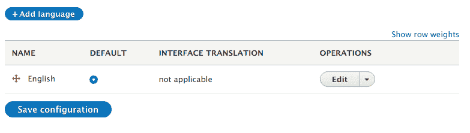

1.  添加语言页面提供了一个可供选择的所有可用语言的列表，界面可以翻译成这些语言。选择西班牙语，然后点击添加语言。

1.  将运行一个批处理过程，安装翻译语言文件并将它们导入。

1.  **接口翻译**列指定了具有匹配翻译的活跃可翻译界面字符串的百分比。点击链接可以查看用户界面翻译表单：

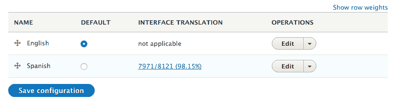

1.  过滤可翻译字符串表单允许你搜索已翻译字符串或未翻译字符串。从搜索列表中选择“仅未翻译字符串”，然后点击过滤。

1.  使用屏幕右侧的文本框，可以添加自定义翻译到“仅未翻译字符串”。为该条目输入翻译：

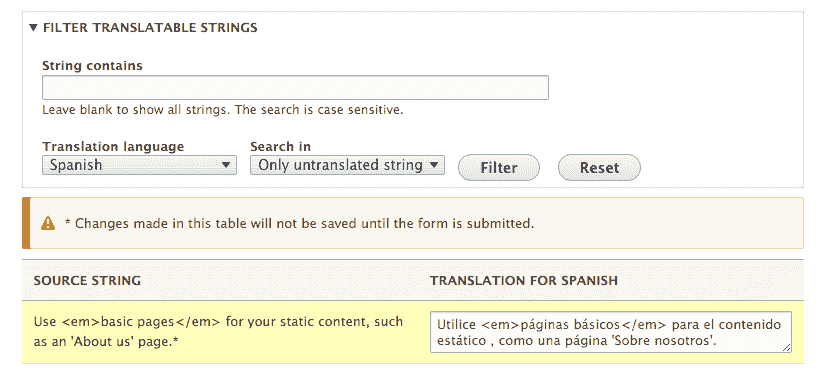

1.  点击保存翻译以保存修改。

1.  前往 `/es/node/add`，你会注意到**基本页面**内容类型的描述现在将与你的翻译相匹配。

# 它是如何工作的...

接口翻译模块提供了 `\Drupal\locale\LocaleTranslation`，它实现了 `\Drupal\Core\StringTranslation\Translator\TranslatorInterface`。这个类在 `string_translation` 服务下注册为可用的查找方法。

当调用 `t` 函数或 `\Drupal\Core\StringTranslation\StringTranslationTrait::t` 方法时，`string_translation` 服务会被调用以提供翻译后的字符串。`string_translation` 服务将遍历所有可用的翻译器，并在可能的情况下返回一个翻译后的字符串。

开发者需要注意，这是确保模块字符串通过翻译函数传递的关键原因。这允许你识别需要翻译的字符串。

接口翻译中提供的翻译器将尝试将提供的字符串与当前语言的已知翻译进行匹配。如果已保存翻译，则将返回该翻译。

# 更多内容...

在接下来的章节中，我们将探讨安装其他语言、检查翻译状态以及做更多的事情的方法。

# 手动安装语言文件

可以通过从 Drupal.org 翻译服务器下载并通过语言界面上传来手动安装翻译文件。你也可以使用导入界面上传自定义的 **gettext 可移植对象**（**.po**）文件。

Drupal 核心和大多数贡献项目在 Drupal 翻译网站上都有 `.po` 文件，[`localize.drupal.org`](https://localize.drupal.org)。在网站上，点击下载以下载所有语言的 Drupal 核心文件的 `.po` 文件。此外，点击一个语言将提供跨项目的特定语言的更多翻译，如下所示：

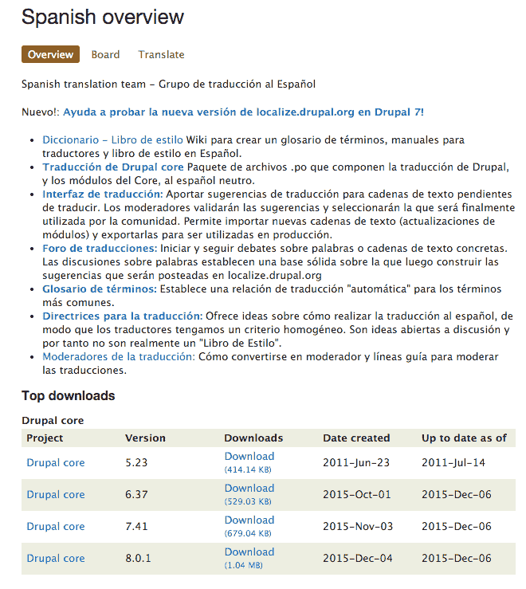

你可以通过访问`用户界面翻译`表单并选择`导入`选项卡来导入`.po`文件。你需要选择`.po`文件和适当的语言。你可以将上传的文件视为自定义创建的翻译。如果你提供的是由 Drupal.org 未提供的自定义翻译文件，这建议这样做。如果你正在手动更新 Drupal.org 的翻译，请确保勾选覆盖现有非定制翻译的复选框。最后一个选项允许你在`.po`文件提供的情况下替换定制翻译。如果你已经翻译了可能现在由官方翻译文件提供的缺失字符串，这可能很有用。

# 检查翻译状态

随着你添加新的模块，可用的翻译将不断增加。`界面翻译`模块提供了一个可以从`报告`页面访问的翻译状态报告。这将检查项目的默认翻译服务器，并检查是否存在`.po`文件或它是否已更改。在自定义模块的情况下，你可以提供一个自定义翻译服务器，这在*提供自定义模块的翻译*中有所介绍。

如果有更新可用，你会收到通知。然后你可以自动导入翻译文件更新，或者下载并手动导入它们。

# 导出翻译

在`用户界面翻译`表单中，有一个`导出`选项卡。此表单将提供一个`Gettext 便携对象`（`.po`）文件。你可以导出在你当前 Drupal 网站上发现的所有未翻译的源文本。这将提供一个基础`.po`文件，供翻译者工作。

此外，你可以下载特定语言。特定语言的下载可以包括未定制的翻译、定制的翻译和缺失的翻译。下载定制的翻译可以帮助你为 Drupal 社区的多语言和国际化的努力做出贡献。

# 界面翻译权限

`界面翻译`模块提供了一个名为**翻译界面文本**的单个权限。这个权限授予用户与模块所有功能交互的权限。它带有安全警告标志，因为它允许具有此权限的用户自定义所有展示给他们的输出文本。

然而，它确实允许你为翻译者提供一个角色，并限制他们仅能访问翻译界面。

# 使用界面翻译来自定义默认的英文字符串

`界面翻译`模块在其典型的多语言用途之外也非常有用。你可以用它来自定义那些无法通过典型钩子方法修改的界面字符串，或者如果你不是开发者的话。

首先，您需要从语言屏幕编辑英语语言。勾选启用英语界面翻译的复选框并点击保存语言。现在您将能够自定义现有的界面字符串。

这仅建议用于无法通过正常用户界面或提供的 API 机制进行定制的界面区域。

# 界面文本语言检测

`Language`模块提供检测和选择规则。默认情况下，该模块将根据 URL 检测当前语言，语言代码作为当前路径的前缀。例如，`/es/node`将显示西班牙语的节点列表页面，如下面的截图所示：

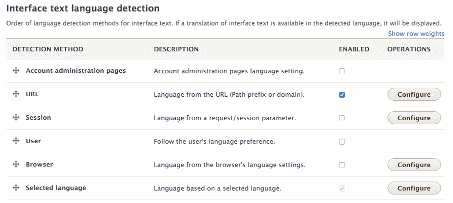

您可以同时启用多个检测选项，并使用排序来决定哪个优先。这可以允许您首先使用 URL 中的语言代码，但如果它们缺失，则回退到用户浏览器指定的语言。

一些检测方法有设置。例如，URL 检测方法可以基于默认路径前缀或子域。

# 为自定义模块提供翻译

模块可以在它们的目录中提供自定义翻译或指向远程文件。这些定义添加到模块的`info.yml`文件中。首先，您需要指定`interface translation project`键，如果它与项目的机器名称不同。

然后，您需要通过`interface translation server pattern`键指定一个服务器模式。这可以是一个指向 Drupal 根目录的相对路径，例如`modules/custom/mymodule/translation.po`，或者一个远程文件 URL，例如`http://example.com/files/translations/mymodule/translation.po`。

分布式（或其他模块）可以实现`hook_locale_translation_projects_alter`来代表模块提供此信息或更改默认值。

服务器模式接受以下不同的标记：

+   `%core`：表示课程的版本（例如，8.x）

+   `%project`：表示项目的名称

+   `%version`：表示当前版本字符串

+   `%language`：表示语言代码

更多关于界面翻译键和变量的信息可以在界面翻译模块基本文件夹中的`local.api.php`文档文件中找到。

# 参考信息

+   参考 Drupal 翻译服务器[`localize.drupal.org/translate/drupal8`](https://localize.drupal.org/translate/drupal8%20)

+   您可以使用位于[`www.drupal.org/node/302194`](https://www.drupal.org/node/302194)的本地化服务器进行贡献

+   参考位于[`api.drupal.org/api/drupal/core%21modules%21locale%21locale.api.php/8`](https://api.drupal.org/api/drupal/core%21modules%21locale%21locale.api.php/8)的`locale.api.php`文档

+   参考 PO 和 POT 文件[`www.drupal.org/node/1814954`](https://www.drupal.org/node/1814954)

# 翻译配置

**配置翻译**模块提供了一个界面，用于通过接口翻译和语言依赖来翻译配置。此模块允许我们翻译配置实体。翻译配置实体的能力增加了国际化的一层。

接口翻译允许我们翻译在 Drupal 网站代码库中提供的字符串。配置翻译允许我们翻译我们创建的可导入和可导出的配置项，例如网站标题或日期格式。

在这个菜谱中，我们将翻译日期格式配置实体。我们将为丹麦语提供本地化的日期格式，以提供更国际化的体验。

# 准备工作

您的 Drupal 网站需要启用两种语言才能使用配置翻译。从语言界面安装丹麦语。

# 如何操作...

1.  前往扩展并安装配置翻译模块。如果尚未安装，它将提示您启用接口翻译、语言、文件和字段模块。

1.  在模块安装后，转到配置。然后，转到区域和语言部分下的配置翻译页面。

1.  在配置实体选项表中点击日期格式选项的列表：

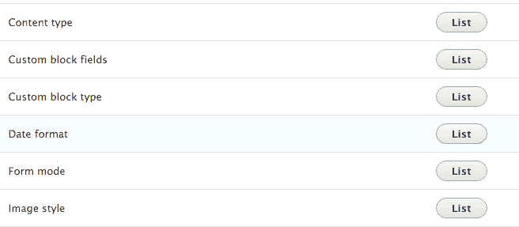

1.  我们将翻译默认的长日期格式以表示丹麦格式。点击“翻译”以翻译默认长日期格式行。

1.  点击“添加”以创建丹麦语翻译：

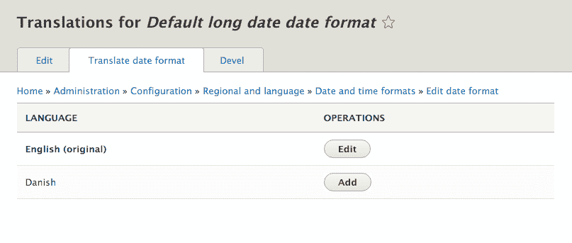

1.  对于丹麦语，我们将提供以下 PHP 日期格式：`l j. F, Y - H.i`。这将显示星期几、月份中的日期、月份、完整年份以及时间的 24 小时制表示。

1.  点击“保存翻译”。

1.  当用户使用丹麦语浏览您的 Drupal 网站时，日期格式现在将根据他们的体验进行本地化。

# 它是如何工作的...

配置翻译模块需要接口翻译；然而，它的工作方式并不相同。该模块修改了所有扩展`\Drupal\Core\Config\Entity\ConfigEntityInterface`接口的实体类型。它在`config_translation_list`键下添加了一个新的处理器。这用于构建可用配置实体及其捆绑包的列表。

该模块修改 Drupal 的配置架构，并更新默认配置元素定义以使用`\Drupal\config_translation\Form`下的指定类。这允许`\Drupal\config_translation\Form\ConfigTranslationFormBase`及其子类正确保存翻译后的配置数据，然后可以通过配置翻译屏幕进行修改。

当配置保存时，它被识别为集合的一部分。该集合被标识为`language.LANGCODE`，所有翻译后的配置实体都通过此标识符保存和加载。以下是如何在数据库中存储配置项的示例：

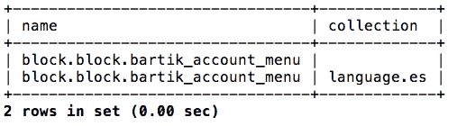

在使用`es`语言代码浏览站点时，将加载适当的`block.block.bartik_account_menu`配置实体。如果您使用的是默认站点或没有语言代码，将使用空集合的配置实体。

# 更多内容...

配置实体和翻译它们的能力是 Drupal 8 多语言功能的重要组成部分。我们将在下一个配方中详细探讨它们。

# 修改配置翻译信息定义

模块可以调用`hook_config_translation_info_alter`钩子来修改发现的配置映射器。例如，**节点**模块就是这样做的，以修改`node_type`配置实体：

```php
/** 
 * Implements hook_config_translation_info_alter(). 
 */ 
function node_config_translation_info_alter(&$info) { 
  $info['node_type']['class'] = 'Drupal\node\ConfigTranslation\NodeTypeMapper'; 
} 
```

这将更新`node_type`定义，使用`\Drupal\node\ConfigTranslation\NodeTypeMapper`自定义映射类。此类将节点类型的标题添加为可配置的翻译项。

# 翻译视图

视图是配置实体。当配置翻译模块启用时，可以翻译视图。这将允许您翻译显示标题、暴露表单标签和其他项目。有关更多信息，请参阅本章中的`创建多语言视图`配方。

# 相关内容

+   请参阅*第八章*的*创建多语言视图*配方，*多语言和国际化*。

# 翻译内容

内容翻译模块提供了一种翻译内容实体（如节点和块）的方法。每个内容实体都需要启用翻译，这样您可以细粒度地决定哪些属性和字段需要翻译。

内容翻译是对现有实体的重复，但会使用适当的语言代码进行标记。当访客使用语言代码时，Drupal 会尝试使用该语言代码加载内容实体。如果不存在翻译，Drupal 将渲染默认未翻译的实体。

# 准备工作

您的 Drupal 站点需要启用两种语言才能使用内容翻译。从语言界面安装西班牙语。

# 如何操作...

1.  前往“扩展”并安装内容翻译模块。如果尚未安装，它将提示您安装语言模块。

1.  在模块安装后，前往配置，然后在区域和语言部分下转到内容语言和翻译页面。

1.  在“内容”旁边的复选框中勾选，以显示当前内容类型的设置。

1.  启用基本页面的内容翻译，并保留提供的默认设置，这些设置使每个字段都启用翻译。点击保存配置：

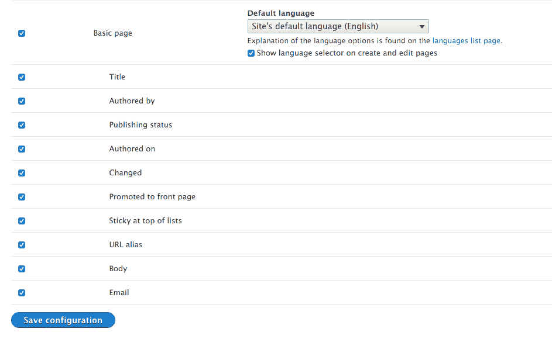

1.  创建一个新的基本页面节点。我们将使用网站的默认语言创建此节点。

1.  在查看新节点时，点击翻译标签。从西班牙语语言行，点击添加以创建节点的翻译版本：

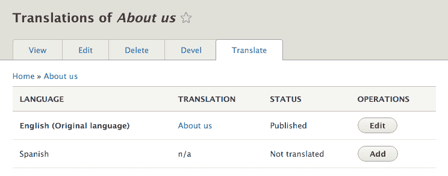

1.  内容将预先填充为默认语言的内容。用翻译文本替换标题和正文：

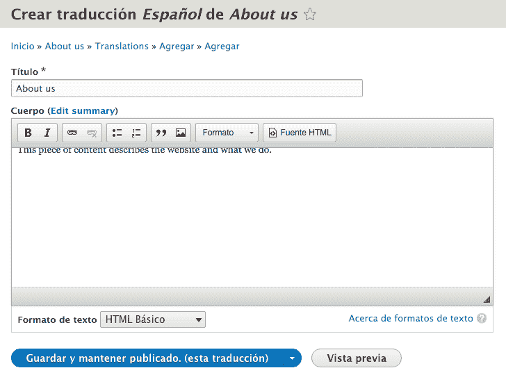

1.  点击保存并保持已发布（此翻译）以保存新的翻译。

# 工作原理

内容翻译模块通过利用语言代码标志来工作。所有内容实体和字段定义都有一个语言代码键。内容实体有一个语言代码列，指定内容实体是哪种语言。字段定义也有一个语言代码列，用于识别内容实体的翻译。内容实体可以提供处理器定义来处理翻译，否则内容翻译模块将提供自己的。

每个实体和字段记录都保存了适当的语言代码以使用。当加载实体时，会考虑当前的语言代码以确保加载正确的实体。

# 更多...

有额外的操作来翻译内容；我们将在下一节中介绍它们。

# 标记翻译为过时

内容翻译模块提供了一个机制来标记翻译实体可能已过时。标记其他翻译为过时的标志提供了一个记录需要更新翻译的实体的方式：

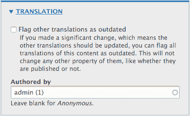

此标志不会更改任何数据，而是一种审核工具。这使得翻译者能够轻松识别已更改并需要更新的内容。内容实体的翻译标签将突出显示所有仍标记为过时的翻译。随着它们的更改，编辑者可以取消选中标志。

# 翻译内容链接

通常，Drupal 菜单包含指向节点的链接。菜单链接默认不翻译，必须在内容翻译中启用自定义菜单链接选项。您需要从菜单管理界面手动翻译节点链接。

从节点创建和编辑表单启用菜单链接与翻译不兼容。如果您从翻译编辑菜单设置，它将编辑未翻译的菜单链接。

# 为实体定义翻译处理器

内容翻译模块需要实体定义来提供关于翻译处理器的信息。如果缺少此信息，它将提供自己的默认值。*实体 API*在*第十章*，*实体 API*中有介绍，但我们将快速讨论内容翻译模块如何与实体 API 交互。

内容实体定义可以提供 `translation` 处理器。如果没有提供，它将默认为 `\Drupal\content_translation\ContentTranslationHandler`。一个节点提供此定义并使用它将内容翻译信息放入垂直标签中。

`content_translation_metadata` 键定义了如何与翻译元数据信息交互，例如标记其他实体为过时。`content_translation_deletion` 键提供了一个表单类来处理实体翻译删除。

目前，截至 8.0.1 版本，没有核心模块提供覆盖默认的 `content_translation_metadata` 或 `content_translation_deletion` 的实现。

# 相关内容

+   参考 *第十章*，*实体 API*。

# 创建多语言视图

视图作为配置实体，可以进行翻译。然而，多语言视图的力量并不仅仅在于配置翻译。视图允许您构建对当前语言代码做出反应的过滤器。这确保了翻译成用户语言的内容被显示。

在这个菜谱中，我们将创建一个多语言视图，显示最近的文章块。如果没有内容，我们将显示翻译后的 `无结果` 消息。

# 准备工作

您的 Drupal 网站需要启用两种语言才能使用内容翻译。从语言界面安装西班牙语。为文章启用内容翻译。您还需要一些翻译内容。

# 如何操作...

1.  从结构转到视图，并点击添加视图。

1.  提供一个视图名称，例如 `Recent articles`，并将内容类型更改为文章。标记您想要创建一个块，然后点击保存并编辑。

1.  添加新的过滤器标准。搜索翻译语言，并为内容类别添加过滤器。点击添加并配置过滤器标准。将过滤器设置为检查页面选择的界面文本语言。这将仅显示已翻译的内容或基本语言是当前语言：

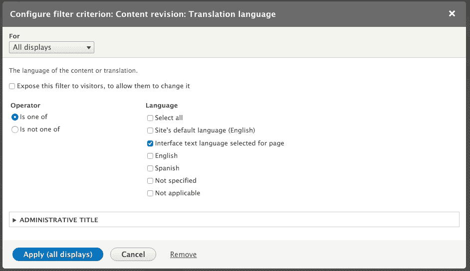

1.  点击无结果旁边的添加，搜索文本区域。勾选复选框，然后点击添加并配置无结果行为。提供一些示例文本，例如 `目前没有最近的文章`。

1.  保存视图。

1.  点击翻译视图标签。点击西班牙语行的添加以翻译该语言的视图。

1.  展开主显示设置，然后展开最近的文章显示选项字段集。修改显示标题选项以提供翻译的标题：

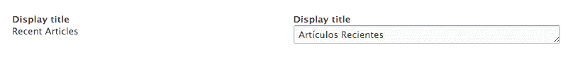

1.  将无结果行为展开以修改屏幕右侧的文本，使用屏幕左侧的文本框作为原始文本的来源：

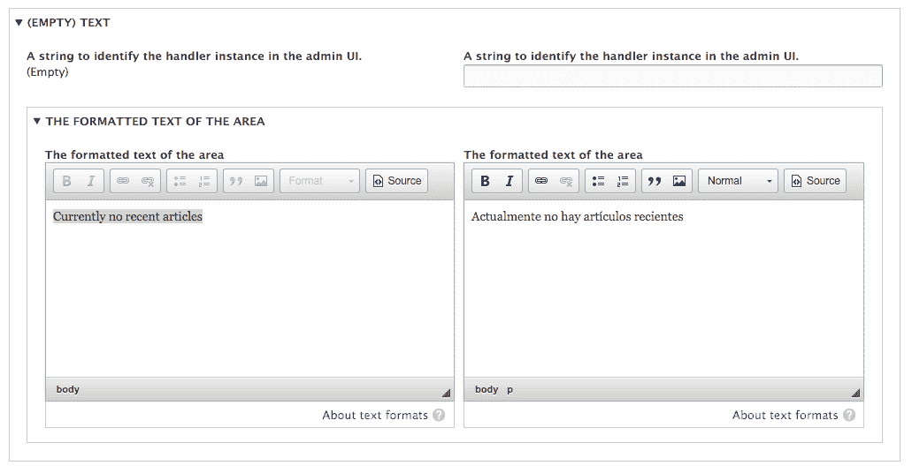

1.  点击保存翻译。

1.  通过转到结构然后转到块布局来在您的 Drupal 网站上放置该块。

1.  通过`/es`访问网站并注意翻译后的`视图`块：

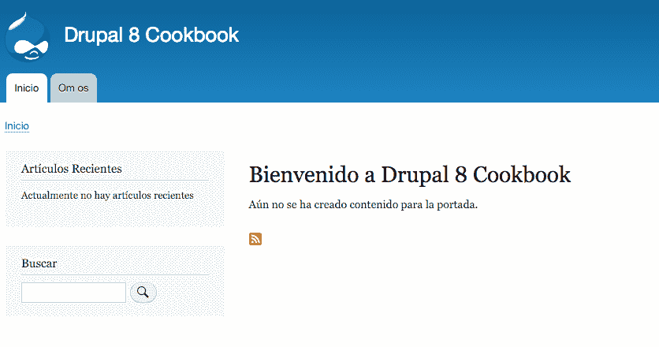

# 它是如何工作的...

视图提供了基于此元素的翻译语言过滤器。视图插件系统提供了一个机制来收集和显示所有可用的语言。这些语言将作为令牌内部保存，并在查询执行时替换为实际的语言代码。如果某个语言代码不再可用，则选择页面和视图的内容语言将回退到当前语言。

当您编辑 Drupal 核心或贡献模块提供的视图时，您会遇到此选项。尽管这不是用户界面中的选项，但将定义为`***LANGUAGE_language_content***`的语言过滤器添加为默认做法，这将强制视图为多语言。

过滤器告诉视图根据实体的语言代码及其字段进行查询。

视图是配置实体。配置翻译模块允许您翻译视图。您可以从`配置`区域的`配置翻译`主屏幕或通过编辑单个视图来翻译视图。

大多数翻译项都将位于主显示设置选项卡下，除非在特定显示中进行了覆盖。每种显示类型也将有自己的特定设置。

# 还有更多...

可以对视图进行更多翻译；我们将在下一节中讨论。

# 翻译暴露的表单项和过滤器

每个视图都可以从`暴露表单`部分翻译暴露的表单。这不会翻译表单上的标签，而是翻译表单元素。您可以翻译`提交`按钮文本、`重置`按钮标签、`排序`标签以及`升序`或`降序`。

您可以从`过滤器`部分翻译暴露过滤器的标签。每个暴露的过滤器将显示为一个可折叠的字段集，允许您配置管理标签和前端标签。


默认情况下，需要通过全局界面翻译上下文导入可用的翻译。

# 翻译显示和行格式项

一些显示格式有可翻译项。这些可以在每个显示模式的相应部分进行翻译。例如，以下项可以使用其显示格式进行翻译：

+   `表格`格式允许您翻译表格摘要

+   `RSS 源`格式允许您翻译源描述

+   `页面`格式允许您翻译页面的标题

+   `块`格式允许您翻译块的标题

# 翻译页面显示菜单项

自定义菜单链接可以通过内容翻译模块进行翻译。使用页面显示的视图不会创建自定义菜单链接实体。因此，必须通过视图本身进行翻译。`视图`模块将所有具有页面显示的视图直接注册到路由系统中，就像在模块的`routing.yml`文件中定义一样：

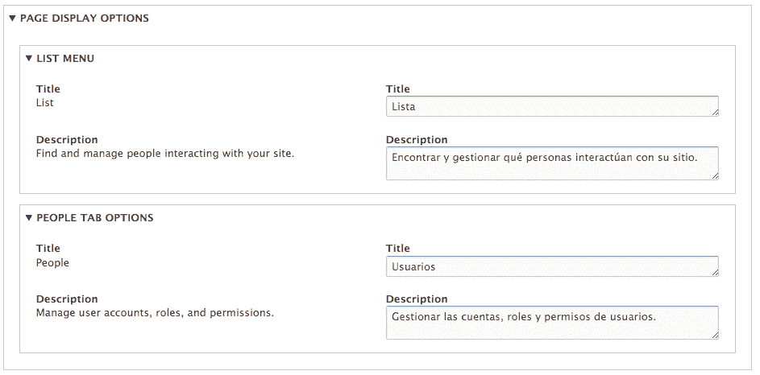

例如，列出所有用户的**人员**视图可以被翻译成具有更新的标签名称和链接描述。

# 另请参阅

+   请参阅*第三章*，*通过视图显示内容*。
