# 配置管理 - 在 Drupal 8 中部署

在本章中，我们将探讨配置管理系统和配置更改的部署。以下是在本章中涵盖的食谱列表：

+   导入和导出配置

+   同步站点配置

+   使用命令行工作流程过程

+   更新和安装新的模块配置

# 简介

Drupal 8 提供了一个新的、统一的系统来管理配置。在 Drupal 8 中，所有配置都保存在与定义的配置模式相匹配的配置实体中。这个系统提供了一个在 Drupal 站点环境之间部署配置和更新站点配置的标准方式。

一旦配置被创建或导入，它就会进入一个不可变状态。如果一个模块尝试安装已存在的配置，它将抛出异常并被阻止。在典型用户界面之外，配置只能通过配置管理系统进行修改。

配置管理系统可以通过配置管理模块提供的用户界面或通过命令行界面工具进行操作。这些工具允许你遵循使用生产站点和开发站点的开发范例，其中更改是在开发站点上进行的，然后推送到生产环境。

在本章中，对于食谱的示例，你不需要创建两个不同的 Drupal 站点，而是可以利用 Drupal 的多站点功能。有关此功能的更多信息，请参阅*第一章*的“安装 Drupal”食谱，“使用 Drupal 8 启动”。请注意，如果你使用多站点，你需要将你的开发站点的数据库克隆到作为生产站点的站点中，以复制一个真实的发展和生产站点工作流程。

# 导入和导出配置

Drupal 8 中的配置管理为在多个环境中与网站工作时的常见问题提供了一个解决方案。无论工作流程模式是什么，配置最终都需要从一个地方移动到另一个地方，例如从生产环境到本地环境。当将开发工作推送到生产环境时，你需要有一种方法来放置配置。

Drupal 8 的用户界面提供了一种通过 YAML 格式导入和导出配置实体的方式。在本食谱中，我们将创建一个内容类型，导出其配置，然后将其导入到另一个 Drupal 站点。配置 YAML 导出将被导入到生产站点以更新其配置。

# 准备工作

你需要一个作为开发站点的基 Drupal 站点。另一个 Drupal 站点，它是开发站点的克隆，必须可用，作为生产 Drupal 站点。

# 如何操作...

1.  要开始，在开发站点上创建一个新的内容类型。将内容类型命名为 Staff Page，然后点击保存和管理字段以保存内容类型。我们不会添加任何额外的字段。

1.  一旦内容类型已保存，前往扩展并安装配置管理模块（如果尚未安装）：

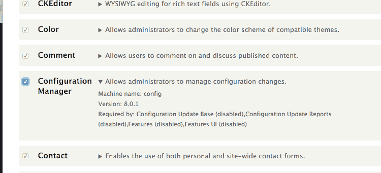

1.  从您的 Drupal 站点的配置页面，前往开发组下的配置同步。此部分允许您导入和导出配置：

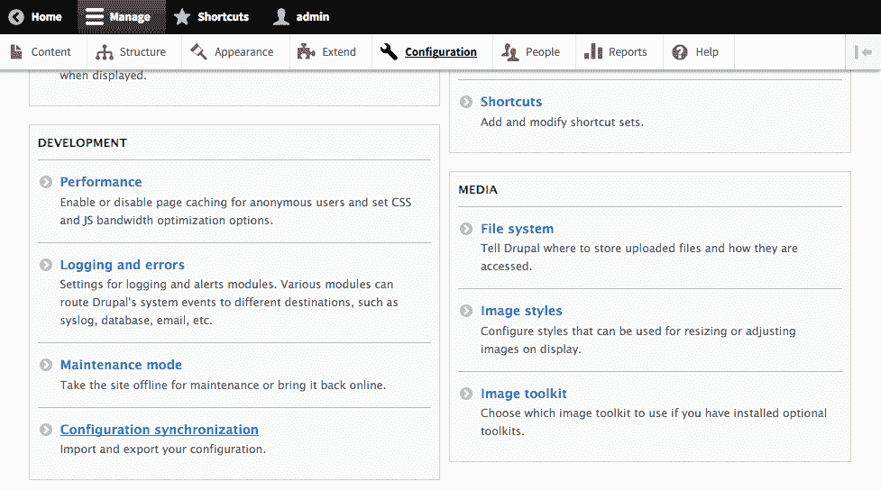

1.  在页面顶部点击导出标签页。默认页面将是一个完整存档导出，包含您整个 Drupal 站点的配置。点击单项子标签以导出单个配置实体：

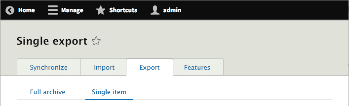

1.  从配置类型下拉菜单中选择内容类型。然后，从配置名称下拉菜单中选择您的内容类型。其配置将填充到配置文本框中：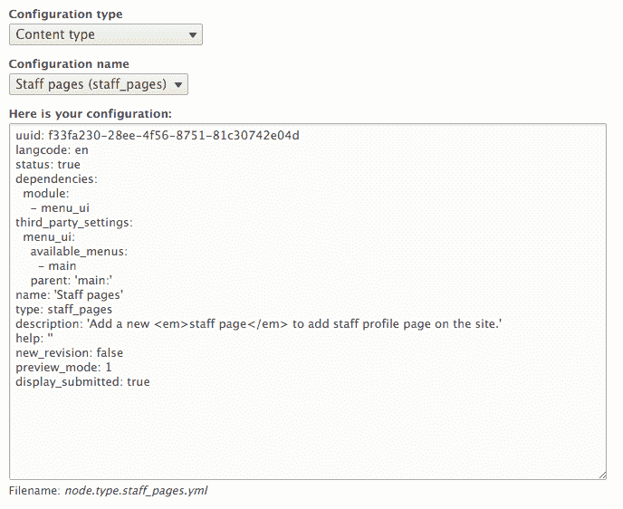

1.  从文本框中复制 YAML 内容，以便您可以将其导入到您的其他 Drupal 站点。

1.  在您的生产 Drupal 站点上，如果尚未安装，请像开发站点一样安装配置管理模块。

1.  前往配置同步页面，点击导入标签页。

1.  点击单项，从配置类型中选择内容类型：

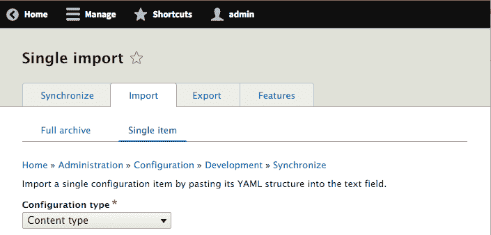

1.  将导出的配置 YAML 粘贴到文本框中，然后点击导入：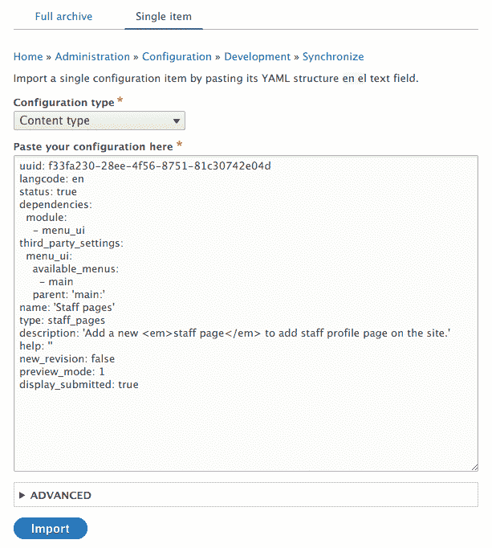

1.  在确认表单上点击确认，以最终将您的自定义内容类型的导入到生产 Drupal 站点。

1.  前往结构页面，然后是内容类型页面，以验证您的内容类型是否已导入。

# 如何工作...

在最基本层面上，配置只是键和值的映射，这可以表示为一个 PHP 数组，并转换为 YAML 格式。

配置管理使用配置实体的模式定义。模式定义提供了一个配置命名空间和可用的键和数据类型。模式定义为每个选项提供了类型化的数据定义，允许验证单个值和配置。

导出过程读取配置数据并将其转换为 YAML 格式。配置管理器随后以 YAML 的形式接收配置并将其转换回 PHP 数组。然后，数据在数据库中更新。

在导入配置时，Drupal 会检查配置 YAML 的`uuid`键的值，如果存在，则与任何具有相同**通用唯一标识符**（**UUID**）的当前配置进行比较。UUID 是在软件中用于在不同环境中识别对象的模式。这允许 Drupal 根据 UUID 关联数据，因为数据库标识符可能在不同环境中有所不同。如果配置项具有匹配的机器名称，但 UUID 不匹配，则会抛出错误。

# 还有更多...

我们将在稍后的章节中更深入地讨论在 Drupal 站点内导入和导出配置。

# 配置依赖项

配置实体在导出时定义依赖项。依赖定义确保配置实体的架构和其他模块功能可用。

当你审查`field.storage.node.body.yml`的配置导出时，它将`node`和`text`定义为`dependencies`：

```php
dependencies: 
  module: 
    - node 
    - text 
```

如果`node`或`text`模块未启用，导入将失败并抛出错误。

# 将模块配置安装保存到 YAML 文件

*第六章*中的“在安装或更新时提供配置”配方，*使用表单 API 创建表单*，讨论了如何使用模块在模块安装时提供配置。而不是手动编写安装配置`YAML`文件，可以使用`配置管理`模块来导出配置并将其保存到模块的`config/install`目录中。

通过用户界面导出的任何项目都可以使用。唯一的要求是您需要删除`uuid`键，因为它表示站点的 UUID 值，并在尝试安装时使配置无效。

# 配置架构

Drupal 8 中的配置管理系统利用配置架构来描述可以存在的配置。这为什么很重要？它允许 Drupal 在存储的配置值上正确实现类型数据并对其进行验证，为处理配置和配置项提供了一种标准化的方式。

当一个模块使用配置系统来存储数据时，它需要为它希望存储的每个配置定义提供一个架构。架构定义用于验证其值的类型数据定义。

以下代码定义了`navbar_awesome`模块的配置架构，该模块包含两个不同的布尔配置值：

```php
navbar_awesome.toolbar: 
  type: config_object 
  label: 'Navbar Awesome toolbar settings' 
  mapping: 
    cdn: 
      type: boolean 
      label: 'Use the FontAwesome CDN library' 
    roboto: 
      type: boolean 
      label: 'Include Roboto from Google Fonts CDN' 
```

这定义了`navbar_awesome.toolbar`配置命名空间；它属于`navbar_awesome`模块，并具有`toolbar`配置。然后我们需要两个表示类型数据值的`cdn`和`roboto`子值。该架构的配置 YAML 文件将在命名空间之后命名为`navbar_awesome.toolbar.yml`，并包含以下代码：

```php
cdn: true 
roboto: true 
```

反过来，当这些值以 PHP 数组表示时，它们将看起来像这样：

```php
[ 
  'navbar_awesome' => [ 
    'cdn' => TRUE, 
    'roboto' => TRUE, 
  ] 
] 
```

配置工厂类随后提供基于对象的包装器，围绕这些配置定义，并提供对其值的模式验证。例如，如果您尝试将`cdn`值保存为字符串，将抛出一个验证异常。

# 参见

+   请参阅*第四章*，*扩展 Drupal*

+   在 Drupal.org 社区手册中的配置架构/元数据，请参阅[`www.drupal.org/node/1905070`](https://www.drupal.org/node/1905070)

# 同步站点配置

管理 Drupal 网站的一个关键组件是配置完整性。维护这种完整性的一个关键部分是确保您在开发中做出的配置更改被推送到生产环境。通过用户界面手动导出和导入配置更改可能很繁琐，并且无法跟踪已导出或导入的内容。同时，手动编写模块钩子来操作配置可能很耗时。幸运的是，配置管理解决方案为您提供了导出和导入整个站点配置的能力。

站点导出只能导入到其自身的另一个副本。每个站点都必须有相同的 UUID，这是在安装期间设置的。这允许您导出本地开发环境的配置，并将其带到预发布或生产环境，而无需直接修改内容或数据库。

在这个菜谱中，我们将导出开发站点完整配置实体定义。然后我们将导出的配置导入到生产站点。这将模拟一个典型的部署，其中在开发中创建的更改已准备好在生产中发布。

# 准备工作

您需要一个基 Drupal 站点作为开发站点。另一个 Drupal 站点，它是开发站点数据库的副本，必须可用，作为生产 Drupal 站点。

如果尚未安装，您需要安装**配置管理**模块。

# 如何操作...

1.  前往开发站点。修改站点以模拟创建需要部署到我们的其他 Drupal 站点的更改。

1.  例如，让我们修改站点的名称；转到配置页面和基本站点设置表单。

1.  从配置页面，转到配置同步。

1.  导航到导出标签页；我们将到达完整存档页面。点击导出按钮开始导出和下载过程：

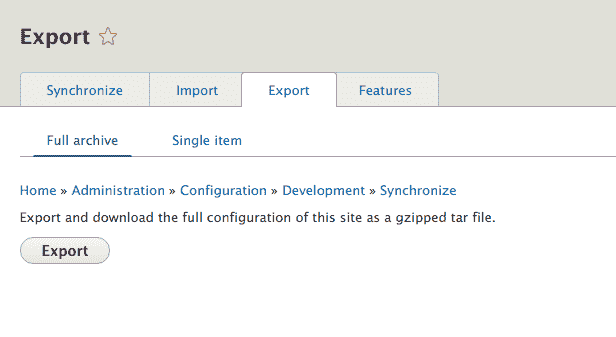

1.  保存`gzip`存档；这包含所有站点配置的 YAML 存档。

1.  导航到您的其他 Drupal 站点，然后转到其配置同步页面。

1.  点击“导入”标签页，然后点击“完整存档”标签页。使用配置存档文件输入，点击“选择文件”以选择您刚刚下载的 tarball。点击“上传”以开始导入过程。

1.  您将被带到“同步”标签页以审查需要导入的更改：

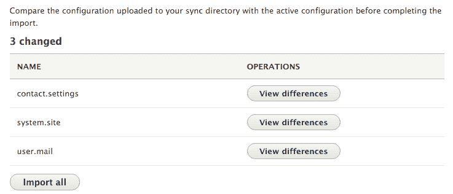

1.  点击“导入全部”以更新当前站点的配置为存档中的项目。

1.  批量操作将随导入过程开始：

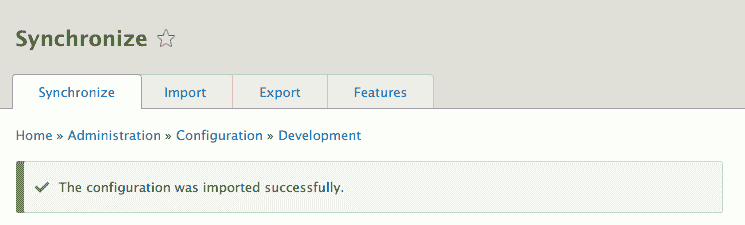

# 它是如何工作的...

配置同步表单提供了一种与您的 Drupal 站点的`config`数据库表进行接口的方式。当您转到导出页面并创建 tarball 时，Drupal 实际上会转储`config`表的内容。每一行代表一个配置实体，并将成为其自己的`YAML`文件。`YAML`文件的内容代表其数据库值。

当您导入 tarball 时，Drupal 会提取其内容。文件被放置在可用的`CONFIG_SYNC_DIRECTORY`目录中。同步页面解析配置实体 YAML，并提供与当前站点配置的差异检查。每个配置项都可以进行审查，然后可以导入所有项。您不能选择选择性地导入单个项。

# 更多...

我们现在将讨论站点配置同步所需的各项内容。

# 通用唯一标识符

当 Drupal 站点安装时，UUID 被设置。此 UUID 添加到导出的配置实体中，并由`uuid`键表示。Drupal 使用此键来识别配置的来源。Drupal 不会同步在其 YAML 定义中没有匹配 UUID 的配置。

您可以通过查看`system.site`配置对象来审查站点的当前 UUID 值。这也可以使用 Drush 或 Drupal Console 命令行工具完成。

使用 Drush，输入以下命令：

```php
$ drush config-get system.site
```

使用 Drupal Console，输入以下命令：

```php
$ drupal debug:config system.site
```

# 一个同步文件夹

Drupal 使用一个同步文件夹来保存要导入到当前站点的配置 YAML 文件。此文件夹由`CONFIG_SYNC_DIRECTORY`常量表示。如果您在站点的`settings.php`全局`$config_directories`变量中未定义此变量，则它将是站点文件目录中的一个随机命名的目录。

当 Drupal 8 进入其 beta 发布周期时，此文件夹被引用为预发布文件夹，并由`CONFIG_STAGING_DIRECTORY`引用。现在已弃用；然而，配置管理系统的内部支持将`CONFIG_STAGING_DIRECTORY`作为`CONFIG_SYNC_DIRECTORY`读取。这将在 Drupal 9 中删除。

同步表单将使用配置管理发现服务来查找需要从该文件夹导入的配置更改。

# 从新站点安装配置

Drupal 的配置管理系统不允许导入来自不同 Drupal 站点的配置实体。当安装 Drupal 站点时，`system.site`配置实体会保存当前站点实例的 UUID。只有该站点数据库的克隆版本才能接受从其导入的配置。

配置安装器配置文件是一个自定义发行版，它将允许您导入配置，即使配置的站点 UUID 不同。配置文件不会自行安装。当您使用配置文件时，它将提供一个界面来上传配置导出文件，然后将其导入，如下面的截图所示：

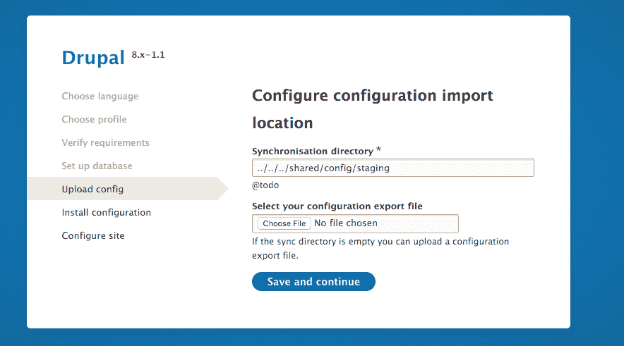

发行版可以在[`www.drupal.org/project/config_installer`](https://www.drupal.org/project/config_installer)找到。

# 使用命令行工作流程

Drupal 8 的配置系统解决了在 Drupal 7 中导出和部署配置时遇到的问题。然而，同步配置的任务仍然是一个用户界面任务，需要操作包含 Drupal 8 站点配置导出的存档文件。

配置管理可以通过 Drush 在命令行上完成，无需安装。这减轻了登录到生产网站以导入更改的要求。它还打开了将配置放入版本控制的高级工作流程的能力。

在本菜谱中，我们将使用 Drush 将开发站点的配置导出到文件系统。然后，将导出的配置文件复制到生产站点的配置目录。使用 Drush，将配置导入生产环境以完成部署。

# 准备中...

您需要一个作为开发站点的基 Drupal 站点。另一个 Drupal 站点，它是开发站点的克隆版本，必须可用以作为生产 Drupal 站点。

本菜谱使用 Drush。如果您尚未安装 Drush，可以在[`docs.drush.org/en/master/install/`](http://docs.drush.org/en/master/install/)找到说明。Drush 需要在您的两个 Drupal 站点的位置安装。

# 如何操作...

1.  为了演示目的，将您的开发站点名称更改为`Drush Config Sync Demo!`。这样，至少有一个配置更改需要导入到生产 Drupal 站点。

1.  打开命令行终端，并将您的目录更改为开发 Drupal 站点的当前工作目录。

1.  使用`drush config-export`命令将配置导出到一个目录。该命令将默认为在您的 Drupal 8 站点中定义的`sync`配置目录。

如果您没有明确定义同步目录，Drupal 会自动在当前站点的上传文件目录中创建一个受保护的文件夹，并在目录名称上添加一个唯一的哈希后缀。

1.  你将收到一条消息，表明配置已导出到目录中。

1.  使用你选择的方法，将配置`sync`文件夹的内容复制到其他匹配`配置同步`文件夹的 Drupal 站点。例如，Drupal 生成的默认文件夹可以是`sites/default/files/config_XYZ/sync`。

1.  打开命令行终端，并将你的目录更改为你的生产 Drupal 站点的工作目录。

1.  使用`drush config-import`命令开始导入你的配置过程。

1.  审查对配置实体键所做的更改，并输入`y`以确认更改：

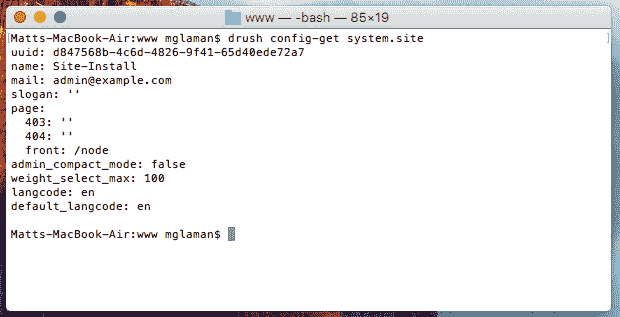

1.  检查你的配置更改是否已导入。

# 它是如何工作的...

**Drush**命令行工具可以利用 Drupal 中的代码与之交互。`config-export`命令复制了`配置管理`模块完整站点导出提供的功能。然而，你不需要启用配置管理模块，该命令才能工作。该命令将提取可用的站点配置并将其写入目录，该目录未存档。

`config-import`命令会解析目录中的文件。它将尝试运行与配置管理模块的同步概览表类似的差异检查，然后导入所有更改。

# 还有更多...

在 Drupal 中，还有其他一些与配置管理系统协同工作的方法。我们将在下一节中探讨这些选项。

# Drush config-pull

Drush 提供了一种简化配置在不同站点之间传输的方法。`config-pull`命令允许你指定两个 Drupal 站点，并在它们之间移动导出配置。你可以指定`/sites`目录下的子目录名称或 Drush 别名。

以下命令将复制开发站点的配置并将其导入到预发布服务器的站点：

```php
drush config-pull @mysite.local @mysite.staging 
```

此外，你可以指定`--label`选项。这代表`$config_directories`设置中的一个文件夹键。该选项默认自动设置为`sync`。或者，你可以使用`--destination`参数指定一个未在`$config_directories`设置中指定的任意文件夹。

# 使用 Drupal 控制台

Drush 自 Drupal 4.7 以来一直是 Drupal 社区的一部分，是一个自定义构建的命令行工具。Drupal 控制台是一个基于 Symfony 控制台的应用程序，用于与 Drupal 交互。Drupal 控制台项目提供了一种通过命令行进行配置管理的方法。

你可以在*第十三章*，*Drupal CLI*或[`www.drupalconsole.com/`](http://www.drupalconsole.com/)了解更多关于 Drupal 控制台的信息。

工作流程相同，只是命令的命名不同。配置导出命令是 `config:export`，并且它将自动导出到你的系统临时文件夹，直到传递一个目录。然后你可以使用 `config:import` 命令导入配置。

# 从命令行编辑配置

Drush 和 Drupal 控制台都支持通过命令行以 YAML 格式编辑配置的能力。这两个工具以相同的方式操作，并且具有相似的命令名称：

+   **Drush**: `config-edit [name]`

+   **控制台**: `config:edit [name]`

差异在于，如果你没有传递一个名称，Drush 将列出所有可编辑的选项，而控制台允许你进行搜索。

当你编辑一个配置项时，你的默认基于终端的文本编辑器将打开。你将看到一个可以编辑的 `YAML` 文件。一旦你保存了更改，配置就会被保存在你的 Drupal 网站上：

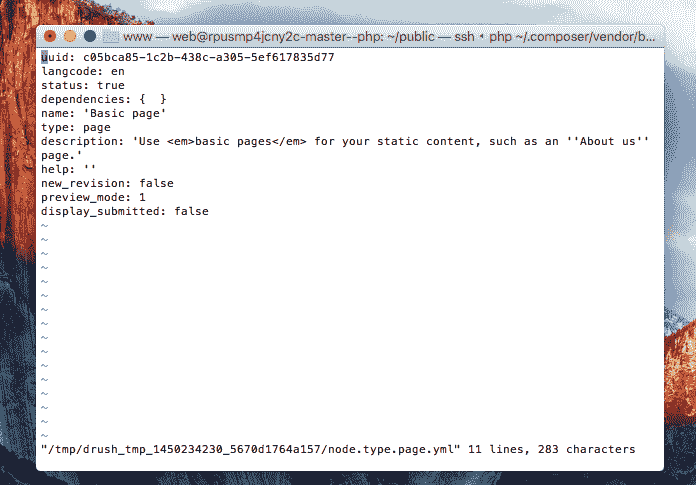

# 导出单个配置项

Drush 和控制台都提供了自己的机制来导出单个配置实体：

+   **Drush**: `config-get [name]`

+   **控制台**: `config:debug [name]`

Drush 将配置的输出打印到终端，而控制台默认的行为是将输出写入文件磁盘。例如，以下命令将以 YAML 格式输出 `system.site` 的值：

```php
$ drush config-get system.site 
$ drupal debug:config system.site 
```


# 使用版本控制和命令行工作流程

将配置导出为 YAML 文件的好处是配置可以保持在版本控制中。Drupal 网站的 `CONFIG_SYNC_DIRECTORY` 目录可以提交到版本控制，以确保它在不同环境中传输并正确更新。部署工具随后可以使用 Drush 或控制台自动导入更改。

Drush 提供的 `config-export` 命令提供了 Git 集成：

```php
drush config-export --add  
```

添加 `--add` 选项将运行 `git add -p` 以进行交互式暂存更改的配置文件：

```php
drush config-export --commit --message="Updating configuration " 
```

`--commit` 和可选的 `--message` 选项将暂存所有配置文件更改，并使用你的消息提交：

```php
drush config-export --push --message="Updating configuration "  
```

最后，你也可以指定 `--push` 以提交更改并将其推送到远程仓库。

# 参考信息

+   请参阅*第十三章*，*Drupal 命令行*

+   请参阅 Drush 在 [`docs.drush.org/en/master/`](http://docs.drush.org/en/master/)

+   请参阅 Drupal 控制台在 [`www.drupalconsole.com/`](http://www.drupalconsole.com/)

# 更新和安装新的模块配置

Drupal 8 中的模块在其`config/install`目录内提供配置 YAML 文件。由于站点控制配置，模块的`config/install`目录中的新配置不会自动安装。模块开发者必须编写更新函数，以便在添加时导入新的配置。虽然这是贡献模块应遵循的实践，但对于私人项目来说，这个过程可能有些繁琐。

幸运的是，Drupal 社区已经提出了一种解决方案，该解决方案提供了一种配置管理流程，允许更新模块提供的默认配置。**配置更新管理器**模块允许您从模块导入新的配置，或者在修改后将其还原到原始配置。实际上，该模块是讨论在*第四章*，“扩展 Drupal”中提到的功能模块的依赖项。

在本食谱中，我们将使用配置更新管理器来审查模块的配置差异，并还原已修改的配置。

# 如何操作...

1.  使用以下 Composer 命令将配置更新管理器项目添加到您的 Drupal 安装中：

```php
$ cd /path/to/drupal8
$ composer require drupal/config_update
```

1.  前往“扩展”页面，安装配置更新报告模块，这是配置更新管理器的用户界面：

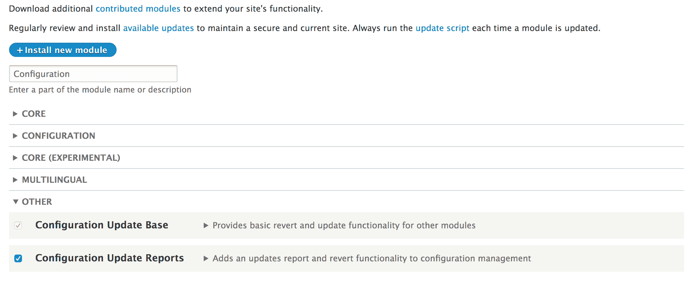

1.  要访问配置报告，请转到开发部分下的工具栏中的“配置”，然后点击“配置同步”。

1.  前往“更新报告”选项卡。这提供了生成配置报告的概述：按配置类型、模块、主题和配置文件。

1.  审查系统模块的配置。从模块的下拉按钮中选择系统模块。

1.  对于`system.site`行，点击“显示差异”按钮链接。这将审查默认配置和当前站点配置之间的差异报告：

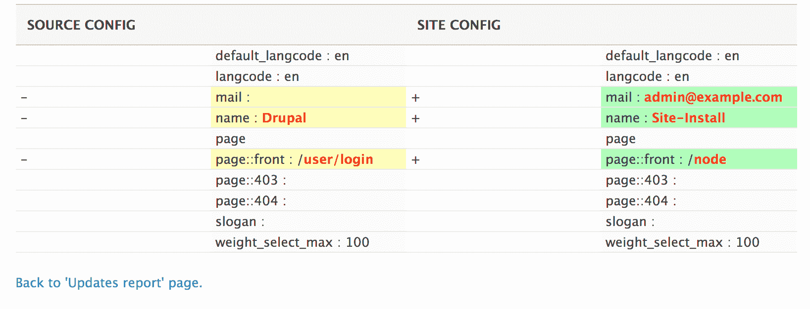

1.  点击“返回到‘更新报告’页面”以返回到主报告，以便可以还原配置。

1.  展开下拉按钮，以便您可以点击“还原到源”：

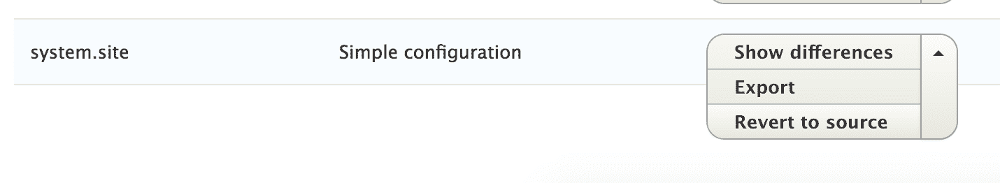

1.  点击确认表单上的“还原”以完成操作。

1.  配置已还原到原始安装状态。

# 它是如何工作的...

配置更新管理器提供两个模块：**配置更新基础**和**配置更新报告**。基础模块提供了一个底层 API，用于列出配置、还原配置以及运行带有结果的差异检查。它扩展了 Drupal 核心的配置操作。报告模块在基础模块之上提供了一个用户界面。功能模块使用基础模块来提供差异审查和配置的自动还原。

在回滚配置时，会收集原始值，然后用来覆盖系统中当前存在的配置。报告还允许导入添加到模块中的新配置。

# 更多内容...

还有其他贡献项目和方法，用于在模块中处理配置。

# 配置开发模块

对于模块开发者，有配置开发模块。配置开发模块提供了一种命令行方法来导入和导出配置。这对于贡献模块的开发者来说很有用。它简化了将配置导出到`config/install`目录以及更新配置的过程。

该模块在模块的`info.yml`文件中查找`config_devel`条目。以下是一个从 Drupal Commerce 模块的 Commerce Store 子模块中取出的示例：

```php
config_devel: 
  install: 
    - commerce_store.commerce_store_type.online 
    - commerce_store.settings 
    - core.entity_view_display.commerce_store.online.default 
    - views.view.commerce_stores 
    - system.action.commerce_delete_store_action 

```

使用 Drush，可以通过配置开发提供的命令来导出和导入数据。以下命令将导出列出的配置到`config/install`目录：

```php
$ drush config-devel-export commerce_store
```

# 参见

+   参考配置更新管理器项目页面，[`www.drupal.org/project/config_update`](https://www.drupal.org/project/config_update)

+   参考基于命令行的配置开发项目，[`www.drupal.org/project/config_devel`](https://www.drupal.org/project/config_devel)
