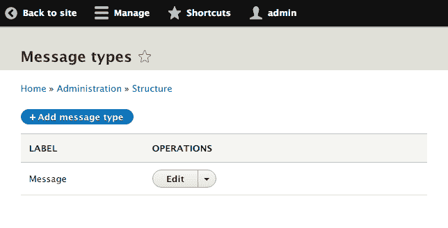

# 第十章：实体 API

在本章中，我们将探索 Entity API 以创建自定义实体，并了解它们是如何被处理和覆盖以下菜谱：

+   创建配置实体类型

+   创建内容实体类型

+   为内容实体类型创建捆绑包

+   为实体实现自定义访问控制

+   提供自定义存储处理程序

+   创建路由提供者

# 简介

在 Drupal 中，实体是具有特定结构的数据的表示。存在特定的实体类型，它们具有不同的捆绑包和附加到这些捆绑包的字段。捆绑包是实体的实现，可以附加字段。从编程的角度来看，可以将支持捆绑包的实体视为一个抽象类，每个捆绑包作为一个扩展该抽象类的类。字段被添加到捆绑包中。这也是术语的推理部分：实体类型可以包含一个 *捆绑包* 的字段。

实体是 Drupal 中定义的实体类型的实例。Drupal 8 提供了两种实体类型：`configuration` 和 `content`。配置实体不可字段化，代表网站内的配置。内容实体可字段化，并且可以有捆绑包。捆绑包通常通过配置实体进行控制。

在 Drupal 8 中，有一个 **Entity API** 模块。它是在 Drupal 7 中创建的，用于扩展实体子系统；其大部分功能现在都已集成到 Drupal 核心中。该模块的目标是通过在每个小版本发布周期（8.1.x、8.2.x 等）中将更多功能合并到 Drupal 核心中，来为开发者体验中的实体开发改进。每个菜谱中都会有一个 *还有更多...* 部分，介绍如何使用 Entity API 模块简化菜谱。

# 创建配置实体类型

Drupal 8 利用实体 API 为配置提供配置验证和扩展功能。使用底层实体结构，配置有一个适当的 **创建**、**读取**、**更新** 和 **删除**（**CRUD**）过程，可以对其进行管理。配置实体不可字段化。配置实体的所有属性都定义在其配置架构定义中。

最常见的配置实体与 Drupal 核心的 `config_object` 类型交互，如在第 *第四章* “扩展 Drupal” 和 *第九章* “配置管理 - 在 Drupal 8 中部署” 中所述，用于存储和管理网站的配置。配置实体还有其他用途，例如菜单、视图显示、表单显示和联系表单，这些都是配置实体。

在这个菜谱中，我们将创建一个新的配置实体类型，称为 `SiteAnnouncement`。这将提供一个简单的配置实体，允许您创建、编辑和删除可以在网站上显示的重要公告的简单消息。

# 准备工作

你需要一个自定义模块来放置代码以实现配置实体类型。让我们为你的类创建一个`src`目录。有关创建自定义模块的信息，请参阅*第四章*的*创建模块*配方，*扩展 Drupal*。

不要使用当前已安装的模块，否则 Drupal 将无法安装您的新实体类型。

# 如何做到这一点...

1.  在我们的模块的基本目录中，让我们创建一个`config`目录，并在其中创建一个名为`schema`的子目录。在子目录中，创建一个名为`mymodule.schema.yml`的文件，该文件将包含您的配置实体模式：


1.  在我们的`mymodule.schema.yml`中，为`mymodule.announcement.*:`添加一个定义以提供我们的标签和消息存储：

```php
# Schema for the configuration files of the Site Announcement. 

mymodule.announcement.*: 
  type: config_entity 
  label: 'Site announcement' 
  mapping: 
    id: 
      type: string 
      label: 'ID' 
    label: 
      type: label 
      label: 'Label' 
    message: 
      type: text 
      label: 'Text' 
```

我们将定义配置实体命名空间为公告，我们将将其提供给 Drupal 的实体注解块。然后我们将告诉 Drupal 这是一个`config_entity`并提供模式标签。

使用映射数组，我们将提供构成我们的实体和将要存储的数据的属性。

1.  在我们的模块的`src`文件夹中创建一个`Entity`目录。首先，我们将通过创建一个`SiteAnnouncementInterface.php`文件来为我们的实体创建一个接口。`SiteAnnouncementInterface`接口将扩展`\Drupal\Core\Config\Entity\ConfigEntityInterface`：

```php
<?php 

namespace Drupal\mymodule\Entity; 

use Drupal\Core\Config\Entity\ConfigEntityInterface; 

interface SiteAnnouncementInterface extends ConfigEntityInterface { 

  /** 
   * Gets the message value. 
   * 
   * @return string 
   */ 
  public function getMessage(); 

} 
```

这将通过我们的实体来实现，并提供方法要求。为实体提供一个接口是最佳实践。这允许你在其他开发者扩展你的实体或在进行高级测试并需要模拟一个对象时提供所需的方法。我们还提供了一个返回我们自定义属性的方法。

1.  让我们在`src/Entity`目录中创建`SiteAnnouncement.php`。此文件将包含`SiteAnnouncement`类，该类扩展`\Drupal\Core\Config\Entity\ConfigEntityBase`并实现我们的实体接口：

```php
<?php 

namespace Drupal\mymodule\Entity; 

use Drupal\Core\Config\Entity\ConfigEntityBase; 

class SiteAnnouncement extends ConfigEntityBase implements SiteAnnouncementInterface { 

  /** 
   * The announcement's message. 
   * 
   * @var string 
   */ 
  protected $message; 

  /** 
   * {@inheritdoc} 
   */ 
  public function getMessage() { 
    return $this->message; 
  } 

} 
```

在前面的代码中，我们添加了在模式中定义的`message`属性作为类属性。我们在实体接口中定义的方法用于返回该值并与我们的配置实体交互。

1.  实体使用注解文档块。我们将从提供实体 ID、标签、配置前缀和配置导出键名称开始我们的注解块：

```php
<?php 

namespace Drupal\mymodule\Entity; 

use Drupal\Core\Config\Entity\ConfigEntityBase; 

/** 
 * @ConfigEntityType( 
 *   id ="announcement", 
 *   label = @Translation("Site Announcement"), 
 *   config_prefix = "announcement", 
 *   entity_keys = { 
 *     "id" = "id", 
 *     "label" = "label" 
 *   }, 
 *   config_export = { 
 *     "id", 
 *     "label", 
 *     "message", 
 *   } 
 * ) 
 */ 
class SiteAnnouncement extends ConfigEntityBase implements SiteAnnouncementInterface { 

  /** 
   * The announcement's message. 
   * 
   * @var string 
   */ 
  protected $message; 

  /** 
   * {@inheritdoc} 
   */ 
  public function getMessage() { 
    return $this->message; 
  } 

} 
```

注解文档块告诉 Drupal 这是一个`ConfigEntityType`插件的实例。`id`是实体类型的内部机器名标识符，而`label`是其可读版本。`config_prefix`与我们使用`mymodule.announcement`定义的模式相匹配。实体键定义告诉 Drupal 代表我们的标识符和标签的属性。

当指定`config_export`时，我们正在告诉配置管理系统在导出我们的实体时哪些属性是可导出的。

1.  接下来，我们将向我们的实体注释添加`handlers`。我们将定义一个将显示可用实体条目和表单的类，以处理我们的实体：

```php
/** 
 * @ConfigEntityType( 
 *   id ="announcement", 
 *   label = @Translation("Site Announcement"), 
 *   handlers = { 
 *     "list_builder" = "Drupal\mymodule\SiteAnnouncementListBuilder", 
 *     "form" = { 
 *       "default" = "Drupal\mymodule\SiteAnnouncementForm", 
 *       "add" = "Drupal\mymodule\SiteAnnouncementForm", 
 *       "edit" = "Drupal\mymodule\SiteAnnouncementForm", 
 *       "delete" = "Drupal\Core\Entity\EntityDeleteForm" 
 *     } 
 *   }, 
 *   config_prefix = "announcement", 
 *   entity_keys = { 
 *     "id" = "id", 
 *     "label" = "label" 
 *   }, 
 *   config_export = { 
 *     "id", 
 *     "label", 
 *     "message", 
 *   } 
 * ) 
 */ 
```

`handlers`数组指定了提供与我们的实体交互功能的类。`list_builder`类将被创建以显示我们的实体表。`form`数组提供了用于创建、编辑或删除我们的配置实体的表单的类。

1.  最后，为了我们的实体注释，我们需要为我们的`delete`、`edit`和`collection`（列表）页面定义路由。Drupal 将根据我们的注释自动构建路由：

```php
/** 
 * @ConfigEntityType( 
 *   id ="announcement", 
 *   label = @Translation("Site Announcement"), 
 *   handlers = { 
 *     "list_builder" = "Drupal\mymodule\SiteAnnouncementListBuilder", 
 *     "form" = { 
 *       "default" = "Drupal\mymodule\SiteAnnouncementForm", 
 *       "add" = "Drupal\mymodule\SiteAnnouncementForm", 
 *       "edit" = "Drupal\mymodule\SiteAnnouncementForm", 
 *       "delete" = "Drupal\Core\Entity\EntityDeleteForm" 
 *     } 
 *   }, 
 *   config_prefix = "announcement", 
 *   entity_keys = { 
 *     "id" = "id", 
 *     "label" = "label" 
 *   }, 
 *   links = { 
 *     "delete-form" = "/admin/config/system/site-announcements/manage/{announcement}/delete", 
 *     "edit-form" = "/admin/config/system/site-announcements/manage/{announcement}", 
 *     "collection" = "/admin/config/system/site-announcements", 
 *   }, 
 *   config_export = { 
 *     "id", 
 *     "label", 
 *     "message", 
 *   } 
 * ) 
 */ 
```

存在着一个为实体提供路由服务的路由服务，它将自动根据此注释为 Drupal 提供具有适当控制器的路由。

1.  通过在模块的`src`目录中创建一个`SiteAnnouncementListBuilder.php`文件并扩展`\Drupal\Core\Config\Entity\ConfigEntityListBuilder`来创建在`list_builder`处理程序中定义的`SiteAnnouncementListBuilder`类：

    `\Drupal\Core\Entity\EntityForm`:

```php
<?php 

namespace Drupal\mymodule; 

use Drupal\Core\Config\Entity\ConfigEntityListBuilder; 
use Drupal\mymodule\Entity\SiteAnnouncementInterface; 

class SiteAnnouncementListBuilder extends ConfigEntityListBuilder { 

  /** 
   * {@inheritdoc} 
   */ 
  public function buildHeader() { 
    $header['label'] = t('Label'); 
    return $header + parent::buildHeader(); 
  } 

  /** 
   * {@inheritdoc} 
   */ 
  public function buildRow(SiteAnnouncementInterface $entity) { 
    $row['label'] = $entity->label(); 
    return $row + parent::buildRow($entity); 
  } 
} 
```

在我们的列表构建器处理程序中，我们重写`buildHeader`和`builderRow`方法，以便我们可以将配置实体属性添加到表中。

1.  现在，我们需要创建一个实体表单，如我们的表单处理程序数组中定义的那样，以处理我们的添加和编辑功能。在`src`目录中创建`SiteAnnouncementForm.php`以提供扩展`\Drupal\Core\Entity\EntityForm`类的`SiteAnnouncementForm`类：

```php
<?php 

namespace Drupal\mymodule; 

use Drupal\Component\Utility\Unicode; 
use Drupal\Core\Entity\EntityForm; 
use Drupal\Core\Form\FormStateInterface; 
use Drupal\Core\Language\LanguageInterface; 

class SiteAnnouncementForm extends EntityForm { 
  /** 
   * {@inheritdoc} 
   */ 
  public function form(array $form, FormStateInterface $form_state) { 
    $form = parent::form($form, $form_state); 

    $form['label'] = [ 
      '#type' => 'textfield', 
      '#title' => t('Label'), 
      '#required' => TRUE, 
      '#default_value' => $entity->label(), 
    ]; 
    $form['message'] = [ 
      '#type' => 'textarea', 
      '#title' => t('Message'), 
      '#required' => TRUE, 
      '#default_value' => $entity->getMessage(), 
    ]; 

    return $form; 
  } 

  /** 
   * {@inheritdoc} 
   */ 
  public function save(array $form, FormStateInterface $form_state) { 
    $entity = $this->entity; 
    $is_new = !$entity->getOriginalId(); 

    if ($is_new) { 
      // Configuration entities need an ID manually set. 
      $machine_name = \Drupal::transliteration() 
        ->transliterate($entity->label(), LanguageInterface::LANGCODE_DEFAULT, '_'); 
      $entity->set('id', Unicode::strtolower($machine_name)); 

      drupal_set_message(t('The %label announcement has been created.', array('%label' => $entity->label()))); 
    } 
    else { 
      drupal_set_message(t('Updated the %label announcement.', array('%label' => $entity->label()))); 
    } 

    $entity->save(); 

    // Redirect to edit form so we can populate colors. 
    $form_state->setRedirectUrl($this->entity->toUrl('collection')); 
  } 
} 
```

我们重写`form`方法以向我们的`label`和`message`属性添加表单 API 元素。我们还重写`save`方法以提供关于所做的更改的用户消息。我们利用实体的`toUrl`方法将其重定向到`collection`（列表）页面。我们使用转写服务根据标签生成我们实体的标识符的机器名。

1.  接下来，我们将在模块目录中创建一个`mymodule.links.action.yml`文件。这将允许我们在路由上定义操作链接。我们将在实体的集合路由上添加一个`添加公告`链接到我们的实体添加表单：

```php
announcement.add: 
  route_name: entity.announcement.add_form 
  title: 'Add announcement' 
  appears_on: 
    - entity.announcement.collection 
```

这将指示 Drupal 在`appears_on`值中指定的路由上渲染`entity.announcement.add_form`链接。

1.  为了使我们的网站公告可以从主管理页面访问，我们需要在模块目录中创建一个`mymodule.links.menu.yml`文件：

```php
mymodule.site_announcements:
  title: 'Site announcements'
  parent: system.admin_config_system
  description: 'Manage site announcements.'
  route_name: entity.announcement.collection
```

1.  我们模块的结构应该看起来像以下截图：


1.  安装模块并检查配置页面。现在，您可以从网站公告链接管理`Site Announcement`条目。

# 它是如何工作的...

当创建配置架构定义时，用于配置命名空间的第一个属性之一是`type`。此值可以是`config_object`或`config_entity`。当类型为`config_entity`时，定义将用于创建数据库表，而不是为`config`表结构化序列化数据。

实体由 Drupal 的插件系统提供支持，这意味着存在一个插件管理器。默认的`\Drupal\Core\Entity\EntityTypeManager`提供实体的发现和处理。实体类型的插件类的`ConfigEntityType`类将强制在`entity_keys`定义中设置`uuid`和`langcode`。配置实体的存储处理程序默认为`\Drupal\Core\Config\Entity\ConfigEntityStorage`。`ConfigEntityStorage`类与配置管理系统交互，以加载、保存和删除自定义配置实体。

# 更多内容...

Drupal 8 引入了一种类型化数据系统，配置实体和字段都使用该系统。

# 可用于模式定义的数据类型

Drupal 核心提供自己的配置信息。在`core/config/schema`位置有一个`core.data_types.schema.yml`文件。这些是核心提供的基本数据类型，可以在创建配置模式时使用。该文件包含数据类型的 YAML 定义以及表示它们的类：

```php
boolean: 
  label: 'Boolean' 
  class: '\Drupal\Core\TypedData\Plugin\DataType\BooleanData' 
email: 
  label: 'Email' 
  class: '\Drupal\Core\TypedData\Plugin\DataType\Email' 
string: 
  label: 'String' 
  class: '\Drupal\Core\TypedData\Plugin\DataType\StringData' 
```

当配置模式定义指定一个具有电子邮件类型的属性时，该值将由`\Drupal\Core\TypedData\Plugin\DataType\Email`类处理。数据类型是一种插件形式，每个插件的注释指定了验证约束。这是围绕 Symfony **Validator** 组件构建的。

# 参考以下内容

+   参考第*第六章**，使用 Form API 创建表单*

+   参考第*第四章*，扩展 Drupal*

+   参考第*第九章，配置管理 - 在 Drupal 8 中部署*

+   参考配置模式/元数据在 [`www.drupal.org/node/1905070`](https://www.drupal.org/node/1905070)

# 创建内容实体类型

内容实体提供基础字段定义和可配置字段，通过字段模块实现。内容实体还支持修订和翻译。内容实体有显示模式，包括表单和视图，用于控制字段的编辑和显示。当一个实体没有指定包时，会自动有一个与实体同名的包实例。

在本食谱中，我们将创建一个自定义内容实体，不指定任何包。我们将创建一个`Message`实体，它可以作为通用消息的内容实体。

# 准备工作

您需要一个自定义模块来放置代码以实现配置实体类型。为您的类创建一个`src`目录。有关创建自定义模块的信息，请参考第*第四章*，*扩展 Drupal*中的*创建模块*食谱。

不要使用当前已安装的模块，否则 Drupal 不会安装您的新实体类型。

# 如何操作...

1.  让我们在模块的`src`文件夹中创建一个`Entity`目录。首先，我们将通过创建一个`MessageInterface.php`文件来为我们的实体创建一个接口：


1.  `MessageInterface`将扩展`\Drupal\Core\Entity\ContentEntityInterface`：

```php
<?php 

namespace Drupal\mymodule\Entity; 

use Drupal\Core\Entity\ContentEntityInterface; 

interface MessageInterface extends ContentEntityInterface { 

  /** 
   * Gets the message value. 
   * 
   * @return string 
   */ 
  public function getMessage(); 

} 

```

这将由我们的实体实现，并提供方法要求。为实体提供一个接口是最佳实践。这允许你在其他开发者扩展你的实体或在进行高级测试并需要模拟对象时提供所需的方法。我们还提供了一个方法来返回我们的主要基础字段定义（待定义）。

1.  然后，让我们在`src`目录中的`Entity`目录下创建`Message.php`。此文件将包含`Message`类，它扩展自`\Drupal\Core\Entity\ContentEntityBase`并实现了我们实体的接口：

```php
<?php 

namespace Drupal\mymodule\Entity; 

use Drupal\Core\Entity\ContentEntityBase; 

class Message extends ContentEntityBase implements MessageInterface { 

} 
```

1.  我们需要在我们的类上创建一个注解文档块，以提供有关我们实体的信息，例如其`id`、`label`和`entity`键：

```php
<?php 

namespace Drupal\mymodule\Entity; 

use Drupal\Core\Entity\ContentEntityBase; 

/** 
 * Defines the message entity class. 
 * 
 * @ContentEntityType( 
 *   id = "message", 
 *   label = @Translation("Message"), 
 *   base_table = "message", 
 *   fieldable = TRUE, 
 *   entity_keys = { 
 *     "id" = "message_id", 
 *     "label" = "title", 
 *     "langcode" = "langcode", 
 *     "uuid" = "uuid" 
 *   }, 
 * ) 
 */ 
class Message extends ContentEntityBase implements MessageInterface { 

} 
```

`id`是实体类型的内部机器名称标识符，而`label`是其可读版本。实体键定义告诉 Drupal 哪些属性代表我们的标识符和标签。

`base_table`定义了实体将存储的数据库表，而`fieldable`允许通过 Field UI 模块配置自定义字段。

1.  接下来，我们将向我们的实体添加`handlers`。我们将使用 Drupal 提供的默认处理器：

```php
/** 
 * Defines the message entity class. 
 * 
 * @ContentEntityType( 
 *   id = "message", 
 *   label = @Translation("Message"), 
 *   handlers = { 
 *     "list_builder" = "Drupal\mymodule\MessageListBuilder", 
 *     "form" = { 
 *       "default" = "Drupal\Core\Entity\EntityForm", 
 *       "add" = "Drupal\Core\Entity\EntityForm", 
 *       "edit" = "Drupal\Core\Entity\EntityForm", 
 *       "delete" = "Drupal\Core\Entity\ContentEntityDeleteForm", 
 *     }, 
 *   }, 
 *   base_table = "message", 
 *   fieldable = TRUE, 
 *   entity_keys = { 
 *     "id" = "message_id", 
 *     "label" = "title", 
 *     "langcode" = "langcode", 
 *     "uuid" = "uuid" 
 *   }, 
 * ) 
 */ 
```

`handlers`数组指定了提供与我们的实体交互功能的类。将创建一个列表构建器类来显示我们的实体表。表单数组提供了用于创建、编辑或删除我们的内容实体时使用的表单的类。

1.  可以添加一个额外的`handler`，即`route_provider`，它可以动态生成我们的规范（查看）、`edit`、`add`、`delete`和`collection`（列表）路由：

```php
/** 
 * Defines the message entity class. 
 * 
 * @ContentEntityType( 
 *   id = "message", 
 *   label = @Translation("Message"), 
 *   handlers = { 
 *     "list_builder" = "Drupal\mymodule\MessageListBuilder", 
 *     "form" = { 
 *       "default" = "Drupal\Core\Entity\EntityForm", 
 *       "add" = "Drupal\Core\Entity\EntityForm", 
 *       "edit" = "Drupal\Core\Entity\EntityForm", 
 *       "delete" = "Drupal\Core\Entity\ContentEntityDeleteForm", 
 *     }, 
 *     "route_provider" = { 
 *       "html" = "Drupal\Core\Entity\Routing\DefaultHtmlRouteProvider", 
 *     }, 
 *   }, 
 *   base_table = "message", 
 *   fieldable = TRUE, 
 *   entity_keys = { 
 *     "id" = "message_id", 
 *     "label" = "title", 
 *     "langcode" = "langcode", 
 *     "uuid" = "uuid" 
 *   }, 
 *  links = { 
 *    "canonical" = "/messages/{message}", 
 *    "edit-form" = "/messages/{message}/edit", 
 *    "delete-form" = "/messages/{message}/delete", 
 *    "collection" = "/admin/content/messages" 
 *   }, 
 * ) 
 */ 
```

为实体存在一个路由服务，它将自动为 Drupal 提供基于此注解的正确控制器路由。

1.  然后，我们在实体的注解中定义一个管理权限属性，系统默认会检查所有创建、更新和删除操作：

```php
/** 
 * Defines the message entity class. 
 * 
 * @ContentEntityType( 
 *   id = "message", 
 *   label = @Translation("Message"), 
 *   handlers = { 
 *     "list_builder" = "Drupal\mymodule\MessageListBuilder", 
 *     "form" = { 
 *       "default" = "Drupal\Core\Entity\EntityForm", 
 *       "add" = "Drupal\Core\Entity\EntityForm", 
 *       "edit" = "Drupal\Core\Entity\EntityForm", 
 *       "delete" = "Drupal\Core\Entity\ContentEntityDeleteForm", 
 *     }, 
 *     "route_provider" = { 
 *       "html" = "Drupal\Core\Entity\Routing\DefaultHtmlRouteProvider", 
 *     }, 
 *   }, 
 *   admin_permission = "administer message",
 *   base_table = "message", 
 *   fieldable = TRUE, 
 *   entity_keys = { 
 *     "id" = "message_id", 
 *     "label" = "title", 
 *     "langcode" = "langcode", 
 *     "uuid" = "uuid" 
 *   }, 
 *  links = { 
 *    "canonical" = "/messages/{message}",
 *    "add-form" = "/messages/add",
 *    "edit-form" = "/messages/{message}/edit", 
 *    "delete-form" = "/messages/{message}/delete", 
 *    "collection" = "/admin/content/messages" 
 *   }, 
 * ) 
 */
```

1.  我们需要实现`baseFieldDefinitions`方法以满足`FieldableEntityInterface`接口，这将为我们提供字段定义到实体的基础表中。将以下方法添加到你的类中：

```php
  /** 
   * {@inheritdoc} 
   */ 
  public static function baseFieldDefinitions(EntityTypeInterface $entity_type) { 
    $fields = parent::baseFieldDefinitions($entity_type); 

    $fields['title'] = BaseFieldDefinition::create('string') 
      ->setLabel(t('Title')) 
      ->setRequired(TRUE) 
      ->setTranslatable(TRUE) 
      ->setRevisionable(TRUE) 
      ->setSetting('max_length', 255) 
      ->setDisplayOptions('view', array( 
        'label' => 'hidden', 
        'type' => 'string', 
        'weight' => -5, 
      )) 
      ->setDisplayOptions('form', array( 
        'type' => 'string_textfield', 
        'weight' => -5, 
      )) 
      ->setDisplayConfigurable('form', TRUE); 

    $fields['content'] = BaseFieldDefinition::create('text_long') 
      ->setLabel(t('Content')) 
      ->setDescription(t('Content of the message')) 
      ->setTranslatable(TRUE) 
      ->setDisplayOptions('view', array( 
        'label' => 'hidden', 
        'type' => 'text_default', 
        'weight' => 0, 
      )) 
      ->setDisplayConfigurable('view', TRUE) 
      ->setDisplayOptions('form', array( 
        'type' => 'text_textfield', 
        'weight' => 0, 
      )) 
      ->setDisplayConfigurable('form', TRUE); 

    return $fields; 
  } 

```

`FieldableEntityInterface`接口是通过`ContentEntityBase`类使用`ContentEntityInterface`实现的。该方法需要返回一个`BaseFieldDefinitions`数组，用于类型化数据定义。父类为我们实体注解中的大多数`entity_keys`值提供了字段定义。我们必须提供标签字段以及我们实现中的任何特定字段。

`content`基础字段定义将保存消息的实际文本。

1.  接下来，我们将在我们的类中实现 `getMessage` 方法以满足我们的接口，并提供一种检索消息文本值的方式：

```php
/** 
 * {@inheritdoc} 
 */ 
public function getMessage() { 
  return $this->get('content')->value; 
} 
```

此方法提供了一个围绕定义的基本字段值的包装，并返回它。

1.  通过创建一个 `MessageListBuilder.php` 文件并扩展 `\Drupal\Core\Entity\EntityListBuilder` 来定义我们列表构建器处理程序中的 `MessageListBuilder` 类。我们需要覆盖默认实现以显示我们的基本字段定义：

```php
<?php 

namespace Drupal\mymodule; 

use Drupal\Core\Entity\EntityInterface; 
use Drupal\Core\Entity\EntityListBuilder; 

class MessageListBuilder extends EntityListBuilder { 
  public function buildHeader() { 
    $header['title'] = t('Title'); 
    return $header + parent::buildHeader(); 
  } 

  public function buildRow(EntityInterface $entity) { 
    $row['title'] = $entity->label(); 
    return $row + parent::buildRow($entity); 
  } 

} 
```

在我们的列表构建器处理程序中，我们覆盖了 `buildHeader` 和 `builderRow` 方法，以便我们可以将配置实体属性添加到表中。

1.  在我们继续之前，我们必须在模块的根目录中创建一个 `mymodule.permissions.yml` 文件。我们需要提供 `administer message` 的权限定义，正如我们在注解中所提供的：

```php
administer message:
    title: 'Administer messages'
```

1.  我们模块的结构应该类似于以下截图：


1.  安装模块。转到 `/messages/add` 创建我们的第一个自定义内容实体条目，然后在 `/admin/content/messages` 上查看：


# 它是如何工作的...

内容实体是 `EntityType` 插件的一种版本。当你定义内容实体类型时，注解块以 `@ContentEntityType` 开始。这个声明以及其中的属性代表了初始化 `\Drupal\Core\Entity\ContentEntityType` 类实例的定义，就像所有其他的插件注解一样。`ContentEntityType` 插件类实现了一个构造函数来提供默认的 `storage` 和 `view_builder` 处理程序，这迫使我们实现 `list_builder` 和 `form` 处理程序数组。

实体类型的插件管理器位于 `entity_type.manager` 服务名称下，默认通过 `\Drupal\Core\Entity\EntityTypeManager` 提供。然而，虽然注解定义了插件信息，但扩展 `ContentEntityBase` 的 `Message` 类提供了操作它所表示数据的方式。

# 还有更多...

我们将讨论如何为你的实体添加额外的功能，并使用实体模块来简化开发过程。

# 使用 AdminHtmlRouteProvider 提供者

我们的 `Message` 实体类型实现了 `DefaultHtmlRouteProvider` 类。还有一个 `\Drupal\Core\Entity\Routing\AdminHtmlRouteProvider` 类。这个类覆盖了 `getEditFormRoute` 和 `getDeleteFormRoute` 方法，并用 `_admin_route` 标记它们。这将导致这些表单在管理主题中渲染。

# 将集合路由作为本地任务标签

在这个菜谱中，我们指定了消息集合路由为 `/admin/content/messages`。如果不将此路由作为 `/admin/content` 路由下的本地任务实现，它将不会作为标签显示。这可以通过为模块创建一个 `links.task.yml` 文件来完成。

在 `mymodule.links.task.yml` 中，添加以下 YAML 内容：

```php
entity.message.collection_tab: 
  route_name: entity.message.collection 
  base_route: system.admin_content 
  title: 'Messages' 
```

这指示 Drupal 使用在`routing.yml`文件中定义的`entity.message.collection`路由，作为`system.admin_content`路由的子路由：


# 参见

+   参见*第四章*，*扩展 Drupal*

# 为内容实体类型创建一个捆绑包

捆绑包允许你拥有内容实体不同变体的内容。所有捆绑包共享相同的基字段定义，但不配置字段。这允许每个捆绑包拥有自己的自定义字段。显示模式也依赖于特定的捆绑包。这允许每个捆绑包为表单模式和查看模式拥有自己的配置。

使用前一个菜谱中的自定义实体，我们将添加一个配置实体作为捆绑包。这将允许你为多个自定义字段配置有不同的消息类型。

# 准备工作

我们需要一个自定义模块来放置代码以实现配置实体类型。为你的类创建一个`src`目录。我们需要实现一个自定义内容实体类型，例如本章*创建内容实体类型*菜谱中的那个。

# 如何做到这一点...

1.  由于内容实体捆绑包是配置实体，我们需要定义我们的配置实体模式。创建一个`config/schema`目录和`mymodule.schema.yml`文件，该文件将包含配置实体的模式：

```php
mymodule.message_type.*: 
  type: config_entity 
  label: 'Message type settings' 
  mapping: 
    id: 
      type: string 
      label: 'Machine-readable name' 
    uuid: 
      type: string 
      label: 'UUID' 
    label: 
      type: label 
      label: 'Label' 
    langcode: 
      type: string 
      label: 'Default language' 
```

我们将定义配置实体的配置前缀为`message_type`，并将其提供给 Drupal 在实体的注释块中。我们将告诉 Drupal 这是一个`config_entity`，并为模式提供标签。

通过映射数组，我们提供构成我们的实体的属性和将要存储的数据。

1.  在我们模块的`src/Entity`目录中，让我们通过创建一个`MessageTypeInterface.php`文件为我们的捆绑包创建一个接口。`MessageTypeInterface`将扩展`\Drupal\Core\Config\Entity\ConfigEntityInterface`：

```php
<?php 

namespace Drupal\mymodule\Entity; 

use Drupal\Core\Config\Entity\ConfigEntityInterface; 

interface MessageTypeInterface extends ConfigEntityInterface { 
  // Empty for future enhancements. 
} 
```

这将由我们的实体实现，并提供方法要求。为实体提供一个接口是最佳实践。这允许你在其他开发者扩展你的实体或在进行高级测试并需要模拟对象时提供所需的方法。

我们将实现一个非常基础的捆绑包。即使在未来的增强和测试中的模拟能力，提供接口也是明智的。

1.  在`src/Entity`中创建一个`MessageType.php`文件。这将持有`MessageType`类，该类将扩展`\Drupal\Core\Config\Entity\ConfigEntityBundleBase`并实现我们捆绑包的接口：

```php
<?php 

namespace Drupal\mymodule\Entity; 

use Drupal\Core\Config\Entity\ConfigEntityBundleBase; 

class MessageType extends ConfigEntityBundleBase implements MessageTypeInterface { 

} 
```

在大多数用例中，捆绑实体类可以是一个空类，不提供任何属性或方法。如果捆绑包在其模式定义中提供了额外的属性，它们也会在这里提供，就像任何其他配置实体一样。

1.  实体需要被注释。为`id`、`label`、`entity`键和`config_export`键创建一个基本注释：

```php
<?php 

namespace Drupal\mymodule\Entity; 

use Drupal\Core\Config\Entity\ConfigEntityBundleBase; 

/** 
 * Defines the message type entity class. 
 * 
 * @ConfigEntityType( 
 *   id = "message_type", 
 *   label = @Translation("Message type"), 
 *   config_prefix = "message_type", 
 *   bundle_of = "message", 
 *   entity_keys = { 
 *     "id" = "id", 
 *     "label" = "label" 
 *   }, 
 *   config_export = { 
 *     "id", 
 *     "label", 
 *   }, 
 * ) 
 */ 
class MessageType extends ConfigEntityBundleBase implements MessageTypeInterface { 

} 
```

注释文档块告诉 Drupal 这是一个`ConfigEntityType`插件的实例。`id`是实体类型的内部机器名称标识符，而`label`是其可读版本。`config_prefix`与我们使用`mymodule.message_type`定义的模式相匹配。实体键定义告诉 Drupal 哪些属性代表我们的标识符和标签。

当指定`config_export`时，我们正在告诉配置管理系统在导出我们的实体时要导出哪些属性。

1.  然后我们将添加处理程序，这些处理程序将与我们的实体交互：

```php
/** 
 * Defines the message type entity class. 
 * 
 * @ConfigEntityType( 
 *   id = "message_type", 
 *   label = @Translation("Message type"), 
 *   handlers = { 
 *     "list_builder" = "Drupal\mymodule\MessageTypeListBuilder", 
 *     "form" = { 
 *       "default" = "Drupal\Core\Entity\EntityForm", 
 *       "add" = "Drupal\Core\Entity\EntityForm", 
 *       "edit" = "Drupal\Core\Entity\EntityForm", 
 *       "delete" = "Drupal\Core\Entity\EntityDeleteForm" 
 *     }, 
 *   }, 
 *   config_prefix = "message_type", 
 *   bundle_of = "message", 
 *   entity_keys = { 
 *     "id" = "id", 
 *     "label" = "label" 
 *   }, 
 *   config_export = { 
 *     "id", 
 *     "label", 
 *   }, 
 * ) 
 */ 
```

`handlers`数组指定了提供与我们的实体交互功能的类。列表构建器类将被创建以显示我们的实体表。表单数组提供了用于创建、编辑或删除我们的配置实体的表单的类。

1.  可以添加另一个处理程序，即`route_provider`，以动态生成我们的规范（视图）、`编辑`、`删除`和`集合`（列表）路由：

```php
/** 
 * Defines the message type entity class. 
 * 
 * @ConfigEntityType( 
 *   id = "message_type", 
 *   label = @Translation("Message type"), 
 *   handlers = { 
 *     "list_builder" = "Drupal\mymodule\MessageTypeListBuilder", 
 *     "form" = { 
 *       "default" = "Drupal\Core\Entity\EntityForm", 
 *       "add" = "Drupal\Core\Entity\EntityForm", 
 *       "edit" = "Drupal\Core\Entity\EntityForm", 
 *       "delete" = "Drupal\Core\Entity\EntityDeleteForm" 
 *     }, 
 *     "route_provider" = { 
 *       "html" = "Drupal\Core\Entity\Routing\DefaultHtmlRouteProvider", 
 *     }, 
 *   }, 
 *   config_prefix = "message_type", 
 *   bundle_of = "message", 
 *   entity_keys = { 
 *     "id" = "id", 
 *     "label" = "label" 
 *   }, 
 *   config_export = { 
 *     "id", 
 *     "label", 
 *   }, 
 *   links = { 
 *     "add-form" = "/admin/structure/message-types/add", 
 *     "delete-form" = "/admin/structure/message-types/{message_type}/delete", 
 *     "edit-form" = "/admin/structure/message-types/{message_type}", 
 *     "admin-form" = "/admin/structure/message-types/{message_type}", 
 *     "collection" = "/admin/structure/message-types" 
 *   } 
 * ) 
 */ 
```

存在着一个用于实体的路由服务，它将自动根据此注释为 Drupal 提供带有适当控制器的路由。添加表单路由尚未支持，需要手动添加。

1.  我们需要修改我们的内容实体以使用我们定义的捆绑配置实体。编辑`src/Entity/Message.php`文件并调整实体注释：

```php
/** 
 * Defines the message entity class. 
 * 
 * @ContentEntityType( 
 *   id = "message", 
 *   label = @Translation("Message"), 
 *   handlers = {...}, 
 *   base_table = "message", 
 *   fieldable = TRUE, 
 *   bundle_entity_type = "message_type", 
 *   field_ui_base_route = "entity.message_type.edit_form", 
 *   entity_keys = { 
 *     "id" = "message_id", 
 *     "label" = "title", 
 *     "langcode" = "langcode", 
 *     "bundle" = "type", 
 *     "uuid" = "uuid" 
 *   }, 
 *   links = {...}, 
 * ) 
 */ 

```

`bundle_entity_type`键指定了用作捆绑的实体类型。插件将其验证为实际的实体类型，并标记为配置依赖项。通过`field_ui_base_route`键指向捆绑的主要编辑表单，它将在捆绑中生成`管理字段`、`管理表单显示`和`管理显示`选项卡。最后，`bundle`实体键指示 Drupal 使用字段定义来识别实体捆绑，该捆绑将在下一步创建。

添加了`bundle`实体键后，`ContentEntityBase`类将自动将一个名为`type`的实体引用基础字段添加到我们的实体中，该字段引用捆绑配置实体类型。

1.  在我们的`list_builder`处理程序中创建`MessageTypeListBuilder`类，在`MessageTypeListBuilder.php`文件中，并扩展`\Drupal\Core\Config\Entity\ConfigEntityListBuilder`。我们需要覆盖默认实现以显示我们的配置实体属性：

```php
<?php 

namespace Drupal\mymodule; 

use Drupal\Core\Entity\EntityInterface; 
use Drupal\Core\Config\Entity\ConfigEntityListBuilder; 

class MessageTypeListBuilder extends EntityListBuilder { 
  public function buildHeader() { 
    $header['label'] = t('Label'); 
    return $header + parent::buildHeader(); 
  } 

  public function buildRow(EntityInterface $entity) { 
    $row['label'] = $entity->label(); 
    return $row + parent::buildRow($entity); 
  } 

} 
```

1.  在我们的列表构建器处理程序中，我们将覆盖`buildHeader`和`builderRow`方法，以便我们可以将配置实体属性添加到表中：


1.  我们模块的结构应该类似于以下截图：


# 它是如何工作的...

捆绑包主要通过`Field`和`Field UI`模块在配置的字段级别得到最广泛的应用。当你创建一个新的字段时，它有一个用于其全局设置的基存储项。一旦字段被添加到捆绑包中，就会创建一个新的字段配置并将其分配给捆绑包。字段可以为特定捆绑包设置自己的设置，以及表单和视图显示配置。

内容实体捆绑包的工作方式与任何其他配置实体实现一样，但它们扩展了 Field API 在内容实体类型中的可用性。

# 更多内容...

我们将讨论如何向我们的实体捆绑包添加更多功能，并使用实体模块简化开发者的工作流程。

# 提供添加新捆绑包的动作链接

Drupal 中有一些称为**动作链接**的特殊链接。它们出现在页面顶部，通常用于创建`links.action.yml`文件以允许创建项目的链接。

在你的`mymodule.links.action.yml`中，每个动作链接定义了它将链接到的路由、标题以及它出现在哪些路由上：

```php
message_type_add: 
  route_name: entity.message_type.add_form 
  title: 'Add message type' 
  appears_on: 
    - entity.message_type.collection 
```

`appears_on` 键接受多个值，这将允许此路由链接出现在多个页面上：



# 参考以下内容

+   请参考*第四章*，*扩展 Drupal*

+   请参考*第九章*，*配置管理 - 在 Drupal 8 中部署*

+   请参考*第十章*中的*创建配置实体类型*配方，*实体 API*

# 为实体实现自定义访问控制

所有实体都有一组处理程序，用于控制特定的功能。一个处理程序处理访问控制。当未指定访问处理程序时，基础 `\Drupal\Core\Entity\EntityType` 模块将实现 `\Drupal\Core\Entity\EntityAccessControlHandler` 作为访问处理程序。默认情况下，这将检查是否有模块实现了 `hook_entity_create_access` 或 `hook_entity_type_create_access` 并使用它们的意见。否则，如果实现了实体类型的默认管理权限，则默认为该权限。

在此配方中，我们将为我们的实体提供一个管理权限，并实现通过实体 API 模块提供的访问处理程序和权限提供程序。我们将基于一个名为**消息**的实体来实现。

此配方特别使用实体 API 模块的功能，因为它已经过测试和彻底审查，并减少了样板代码。理想情况下，这将作为 Drupal 核心即将推出的一个小版本的一部分。

# 准备工作

我们需要一个自定义模块来放置代码以实现配置实体类型。让我们为我们的 PSR-4 风格类创建一个`src`目录。我们需要实现一个自定义内容实体类型，例如本章中*创建内容实体类型*配方中的那个。

# 如何做到这一点...

1.  首先，我们需要为实体定义一个管理权限。这是通过确保实体注释文档块中存在`admin_permission`键来完成的：

```php
/** 
 * Defines the message entity class. 
 * 
 * @ContentEntityType( 
 *   id = "message", 
 *   label = @Translation("Message"), 
 *   handlers = {...}, 
 *   base_table = "message", 
 *   fieldable = TRUE, 
 *   admin_permission = "administer messages", 
 *   entity_keys = { 
 *     "id" = "message_id", 
 *     "label" = "title", 
 *     "langcode" = "langcode", 
 *     "uuid" = "uuid" 
 *   }, 
 *   links = {...}, 
 * ) 
 */ 
```

核心提供的实体访问处理器将检查实体是否实现了此选项。如果提供了，它将作为访问检查的基础。

1.  接下来，我们将想要指定按捆绑包粒度指定的权限：

```php
/** 
 * Defines the message entity class. 
 * 
 * @ContentEntityType( 
 *   id = "message", 
 *   label = @Translation("Message"), 
 *   handlers = {...}, 
 *   base_table = "message", 
 *   fieldable = TRUE, 
 *   admin_permission = "administer messages", 
 *   permission_granularity = "bundle", 
 *   bundle_entity_type = "message_type", 
 *   field_ui_base_route = "entity.message_type.edit_form", 
 *   entity_keys = { 
 *     "id" = "message_id", 
 *     "label" = "title", 
 *     "langcode" = "langcode", 
 *     "bundle" = "type", 
 *     "uuid" = "uuid" 
 *   }, 
 *  links = {...}, 
 * ) 
 */ 

```

`permission_granularity`键将告诉系统应该生成哪些权限以及如何检查访问。这样，一个用户可以创建*公告*消息但不能创建*公告板*消息。

1.  然后，我们定义`permission_provider`处理器，它将生成我们的权限：

```php
/** 
 * Defines the message entity class. 
 * 
 * @ContentEntityType( 
 *   id = "message", 
 *   label = @Translation("Message"), 
 *   handlers = { 
 *     "list_builder" = "Drupal\mymodule\MessageListBuilder", 
 *     "permission_provider" = "\Drupal\entity\EntityPermissionProvider", 
 *     "form" = {...}, 
 *     "route_provider" = {...}, 
 *   }, 
 *   base_table = "message", 
 *   fieldable = TRUE, 
 *   admin_permission = "administer messages", 
 *   permission_granularity = "bundle", 
 *   bundle_entity_type = "message_type", 
 *   field_ui_base_route = "entity.message_type.edit_form", 
 *   entity_keys = {...}, 
 *  links = {...}, 
 * ) 
 */ 

```

1.  我们对实体注释的最终调整是更改默认的访问处理器：

```php
/** 
 * Defines the message entity class. 
 * 
 * @ContentEntityType( 
 *   id = "message", 
 *   label = @Translation("Message"), 
 *   handlers = { 
 *     "list_builder" = "Drupal\mymodule\MessageListBuilder", 
 *     "access" = "\Drupal\entity\EntityAccessControlHandler", 
 *     "permission_provider" = "\Drupal\entity\EntityPermissionProvider", 
 *     "form" = {...}, 
 *     "route_provider" = {...}, 
 *   }, 
 *   base_table = "message", 
 *   fieldable = TRUE, 
 *   admin_permission = "administer messages", 
 *   permission_granularity = "bundle", 
 *   bundle_entity_type = "message_type", 
 *   field_ui_base_route = "entity.message_type.edit_form", 
 *   entity_keys = {...}, 
 *  links = {...}, 
 * ) 
 */ 

```

1.  重建 Drupal 的缓存，或者如果尚未安装，则安装该模块。

1.  在权限概述页面上验证权限是否可用：


# 它是如何工作的...

实体由 Drupal 的插件系统提供支持，这意味着存在一个插件管理器。默认的`\Drupal\Core\Entity\EntityTypeManager`提供实体的发现和处理。`ContentEntityType`和`ConfigEntityType`实体类型和类都扩展了基`\Drupal\Core\Entity\EntityType`类。

`EntityType`类构造函数提供了一个默认的`access`处理器，如果未通过`\Drupal\Core\Entity\EntityAccessControlHandler`类提供，则提供。每个提供实体类型的核心模块都实现此接口以覆盖至少`checkAccess`和`checkCreateAccess`。同时，实体 API 访问处理器扩展此接口以支持捆绑包粒度权限和基于所有者的权限，如果实体以可重用的方式实现了`EntityOwnerInterface`。

`\Drupal\Core\Access\AccessibleInterface`定义了一个`access`方法，所有实体都继承了这个接口。在`\Drupal\Core\Entity\Entity`中的默认实现将如果操作是`create`则调用`checkCreateAccess`，否则调用访问控制器的通用`access`方法，这将调用实体访问钩子和类的`checkAccess`方法。

当 Drupal 生成可用权限时，实体 API 模块会找到定义了`permission_provider`处理器的实体定义，然后调用该类来生成权限。

# 还有更多...

我们将讨论如何实现实体的自定义访问控制，并使用实体来简化访问控制。

# 控制实体字段的访问

核心实体访问控制处理器中的`checkFieldAccess`方法可以被覆盖，以在修改实体时控制对特定实体字段的访问。如果没有被子类覆盖，`\Drupal\Core\Entity\EntityAccessControlHandler::checkFieldAccess`将始终返回允许的访问结果。该方法接收以下参数：

+   查看和编辑操作

+   当前字段的定义

+   检查访问的用户会话

+   字段项值的一个可能列表

实体类型可以实现自己的访问控制处理程序并覆盖此方法，以提供对其基本字段修改的细粒度控制。一个很好的例子是 `User` 模块及其 `\Drupal\user\UserAccessControlHandler`。

用户实体有一个 `pass` 字段，用于用户的当前密码。还有一个 `created` 字段，记录用户何时被添加到网站。

对于 `pass` 字段，如果操作是 `view`，则返回 `denied`，但如果操作是 `edit`，则允许访问：

```php
case 'pass': 
  // Allow editing the password, but not viewing it. 
  return ($operation == 'edit') ? AccessResult::allowed() : AccessResult::forbidden(); 
```

`created` 字段使用相反的逻辑。当用户登录时，可以查看网站但不能编辑：

```php
case 'created': 
  // Allow viewing the created date, but not editing it. 
  return ($operation == 'view') ? AccessResult::allowed() : AccessResult::forbidden(); 
```

# 参见

+   参考第 *第四章*，*扩展 Drupal*

# 提供自定义存储处理程序

存储处理程序控制实体的加载、保存和删除。`\Drupal\Core\Entity\ContentEntityType` 为所有内容实体类型提供基本实体类型定义。如果没有指定，则默认存储处理程序是 `\Drupal\Core\Entity\Sql\SqlContentEntityStorage`。这个类可以扩展以实现替代的 `load` 方法或保存时的调整。

在这个菜谱中，我们将实现一个方法，支持通过特定的属性来加载实体，而不是必须编写特定的 `loadByProperties` 方法调用。

# 准备工作

您需要一个自定义模块来放置代码以实现配置实体类型。为您的 PSR-4 风格类创建一个 `src` 目录。需要实现一个自定义内容实体类型，例如本章 *创建内容实体类型* 菜谱中的那个。

# 如何做...

1.  在模块的 `src` 目录中创建一个 `MessageStorage` 类。这个类将扩展默认的 `\Drupal\Core\Entity\Sql\SqlContentEntityStorage` 类：

```php
<?php 

namespace Drupal\mymodule; 

use Drupal\Core\Entity\Sql\SqlContentEntityStorage; 

/** 
 * Defines the entity storage for messages. 
 */ 
class MessageStorage extends SqlContentEntityStorage { 

} 
```

通过扩展我们实体类型的默认存储类，我们可以简单地添加与我们的需求相关的新方法，而不是实现额外的业务逻辑。

1.  创建一个 `loadMultipleByType` 方法；使用这个方法，我们将提供一个简单的方式来加载特定捆绑包的所有消息：

```php
  /** 
   * Load multiple messages by bundle type. 
   * 
   * @param string $message_type 
   *   The message type. 
   * 
   * @return array|\Drupal\Core\Entity\EntityInterface[] 
   *   An array of loaded message entities. 
   */ 
  public function loadMultipleByType($message_type) { 
    return $this->loadByProperties([ 
      'type' => $message_type, 
    ]); 
  } 

```

我们传递 `type` 属性，这样我们就可以根据消息捆绑包来查询它，并返回所有匹配的消息实体。

1.  更新实体的注解块以包含新的存储处理程序定义：

```php
handlers = { 
  "list_builder" = "Drupal\mymodule\MessageListBuilder", 
  "access" = "\Drupal\entity\EntityAccessControlHandler", 
  "permission_provider" = "\Drupal\entity\EntityPermissionProvider", 
 "storage" = "Drupal\mymodule\MessageStorage", 
  "form" = { 
    "default" = "Drupal\Core\Entity\EntityForm", 
    "add" = "Drupal\Core\Entity\EntityForm", 
    "edit" = "Drupal\Core\Entity\EntityForm", 
    "delete" = "Drupal\Core\Entity\EntityDeleteForm" 
  }, 
  "route_provider" = { 
    "html" = "Drupal\Core\Entity\Routing\DefaultHtmlRouteProvider", 
  }, 
}, 
```

1.  您现在可以使用以下代码以编程方式与您的消息实体交互：

```php
// Get the entity type manager from the container. 
\Drupal::entityTypeManager() 

// Access the storage handler. 
->getStorage('message') 

// Invoke the new method on custom storage class. 
->loadMultipleByType('message'); 
```

# 它是如何工作的...

在定义内容实体类型时，注解块以 `@ContentEntityType` 开始。这个声明以及其中的属性代表了初始化实体实例的定义

`\Drupal\Core\Entity\ContentEntityType` 类就像所有其他插件注解一样。

在类构造函数中，有一个合并操作，如果未提供，将为 `storage` 处理程序提供默认处理程序。这始终默认为 `\Drupal\Core\Entity\Sql\SqlContentEntityStorage`，因为它提供了帮助其父类 `ContentEntityStorageBase` 与基于 SQL 的存储交互的方法和逻辑。

配置实体也可以有它们的默认 `\Drupal\Core\Config\Entity\ConfigEntityStorage`。然而，对于配置实体，配置管理使用 `\Drupal\Core\Config\StorageInterface` 实现进行存储，而不是扩展 `ConfigEntityStorage` 的类，这个逻辑位于配置工厂服务中。

扩展 `SqlContentEntityStorage` 重新使用默认 Drupal 实现所需的方法，并提供了一种创建与加载、保存等交互的自定义方法的简单方法。

# 更多...

我们将讨论自定义存储处理程序以及不同存储后端的利用。

# 为实体使用不同的存储后端

Drupal 提供了支持不同数据库存储后端的机制，这些后端不是 Drupal 核心提供的，例如 MongoDB。尽管在撰写本书时它对 Drupal 8 来说还不稳定，但有一个 MongoDB 模块提供了存储交互。

该模块提供了 `\Drupal\mongodb\Entity\ContentEntityStorage`，它扩展了 `\Drupal\Core\Entity\ContentEntityStorageBase`。这个类覆盖了用于创建、保存和删除的方法，将它们写入 MongoDB 集合。

项目可以在 [`www.drupal.org/project/mongodb`](https://www.drupal.org/project/mongodb) 找到。

虽然为内容实体及其字段提供自定义存储后端还有更多步骤，但这作为如何选择将自定义实体放置在不同存储后端的示例。

# 参见

+   参阅 *第四章*，*扩展 Drupal*

+   参阅 *第七章*，*使用插件即插即用*

# 创建路由提供者

实体可以实现一个路由提供者，为实体的规范（查看）、编辑、删除和集合（列表）路由创建路由定义。截至 Drupal 8.3.0，所有通常所需的路由都已生成（在 8.0.0 中并非如此）。提供者接受特定链接定义的路径，并将其转换为路由和可访问路径。

在这个菜谱中，我们将扩展默认的 `\Drupal\Core\Entity\Routing\DefaultHtmlRouteProvider` 并覆盖规范路由以与编辑路由相同，因为我们假设消息总是嵌入的。

这与在 8.4 中修复的错误有关，内容翻译模块通过假设所有实体都有一个规范链接来导致错误，而它们可能只支持编辑--请参阅 [`www.drupal.org/node/2479377`](https://www.drupal.org/node/2479377)。

# 准备工作

你需要一个自定义模块来放置代码以实现配置实体类型。为你的类创建一个`src`目录。需要实现一个自定义内容实体类型，例如本章中*创建内容实体类型*配方中的那个。

# 如何实现...

1.  在`src`目录中创建一个`MessageHtmlRouteProvider`类，该类扩展了

    `\Drupal\Core\Entity\Routing\DefaultHtmlRouteProvider`：

```php
<?php 

namespace Drupal\mymodule; 

use Drupal\Core\Entity\Routing\DefaultHtmlRouteProvider; 

/** 
 * Provides HTML routes for the message entity type. 
 */ 
class MessageHtmlRouteProvider extends DefaultHtmlRouteProvider { 

}
```

1.  覆盖提供的`getCanonicalRoute`方法并返回`getEditFormRoute`的值：

```php
<?php 

namespace Drupal\mymodule; 

use Drupal\Core\Entity\EntityTypeInterface; 
use Drupal\Core\Entity\Routing\DefaultHtmlRouteProvider; 

/** 
 * Provides HTML routes for the message entity type. 
 */ 
class MessageHtmlRouteProvider extends DefaultHtmlRouteProvider { 

  /** 
   * {@inheritdoc} 
   */ 
  protected function getCanonicalRoute(EntityTypeInterface $entity_type) { 
    // Messages use the edit-form route as the canonical route. 
    // @todo Remove this when #2479377 gets fixed. 
    return $this->getEditFormRoute($entity_type); 
  } 

} 
```

1.  重建 Drupal 的缓存以使更改生效并重新构建路由。

1.  导航到`/message/{message}`现在将加载编辑表单，就像`/message/{message}/edit`一样。

# 它是如何工作的...

实体由 Drupal 中的插件系统提供支持，这意味着存在一个插件管理器。默认的`\Drupal\Core\Entity\EntityTypeManager`提供了实体的发现和处理。`\Drupal\Core\Entity\EntityTypeManagerInterface`指定了一个`getRouteProviders`方法，该方法预期返回一个字符串数组，提供`\Drupal\Core\Entity\Routing\EntityRouteProviderInterface`接口实现的完全限定类名。

在`core.services.yml`中定义了一个事件订阅者，名为`entity_route_subscriber`。这个服务订阅了动态路由事件。当发生这种情况时，它使用实体类型管理器来检索所有实体类型实现，这些实现提供路由订阅者。然后，它将接收到的所有`\Symfony\Component\Routing\RouteCollection`实例聚合起来，并将它们合并到系统的主路由集合中。

# 更多内容...

Drupal 8 引入了路由类型，并为我们的实体提供了添加路由的功能。

# 实体 API 模块提供了额外的提供者

实体模块提供了两个针对支持修订和批量删除表单选项的实体的新路由提供者。

如果你有一个实现了`RevisionLogInterface`接口的实体，修订路由提供者会生成用于管理修订的用户界面。然后，你为`router_providers`数组添加一个`revision`条目，指向新的路由提供者：

```php
 *     "route_provider" = { 
 *       "html" = "Drupal\Core\Entity\Routing\DefaultHtmlRouteProvider", 
 *       "revision" = "Drupal\entity\Routing\RevisionRouteProvider", 
 *     }, 
```

然后，你只需在你的实体`links`定义中定义额外的项：

```php
*   links = { 
*     "revision" = "/messages/{message}/revisions/{message_revision}/view",
 *     "revision-revert-form" = "/messages/{message_enhanced}/revisions/{message_revision}/revert",
 *     "version-history" = "/messages/{message}/revisions", 
*    "canonical" = "/messages/{message}", 
 *    "edit-form" = "/messages/{message}/edit", 
 *    "delete-form" = "/messages/{message}/delete", 
 *    "collection" = "/admin/content/messages" 
 *   } 
```

这减少了实现`Entity`所需的样板代码量。对于实现示例，请参考实体 API 测试模块`entity_module_test`中的`EnhancedEntity`类。

# 参见

+   参考第*4 章*，*扩展 Drupal*

+   参考 Drupal 8 的路由系统，见[`www.drupal.org/developing/api/8/routing`](https://www.drupal.org/developing/api/8/routing)
