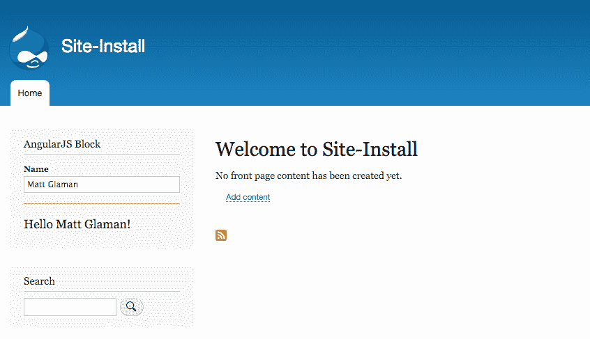
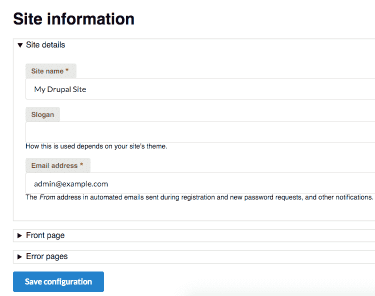

# 离开 Drupalicon 岛

在本章中，我们将详细说明如何使用第三方库，例如 JavaScript、CSS 和 PHP：

+   实现和使用第三方 JavaScript 库

+   实现和使用第三方 CSS 库

+   实现和使用第三方 PHP 库

# 简介

Drupal 8 带着一种**自豪地在外地建造**的态度。已经做出了努力，使用更多由整个 PHP 社区和其他社区创建的组件。Drupal 8 是用 Symfony 构建的。它包括 Twig 作为其模板系统，提供的 WYSIWYG 编辑器作为其 CKEditor，以及 PHPUnit 用于测试。

Drupal 8 是如何推广使用其他地方制作的库的？Drupal 8 中的新资产管理系统使得使用前端库变得更加容易。Drupal 实现了来自**PHP 框架互操作性小组**（**PHP-FIG**）的 PSR-0 和 PSR-4，**PHP 标准建议**（**PSRs**）是用于增加 PHP 应用程序之间互操作性的建议标准。这简化了集成第三方 PHP 库的过程。

这两个领域将在 Drupal 8 的每个小版本中不断改进。这些领域将在本章中提到。

# 实现和使用第三方 JavaScript 库

在过去，Drupal 只包含 jQuery 和几个 Drupal 核心用于 JavaScript API 的 jQuery 插件。这种情况在 Drupal 8 中发生了变化。**Underscore.js**和**Backbone.js**现在包含在 Drupal 中，为开发者带来了两个流行的 JavaScript 框架。

然而，有许多 JavaScript 框架可以使用。在第*5 章*“前端为王”中，我们介绍了资产管理系统和库。在这个配方中，我们将创建一个模块，提供**Angular.js**作为库和自定义 Angular 应用程序；演示可在 AngularJS 主页上查看。

# 准备工作

在这个例子中，我们将使用 Bower 来管理我们的第三方`Angular.js`库组件。如果您不熟悉 Bower，它只是一个前端组件的包管理器。您可以选择不使用 Bower，只需手动下载并放置所需的文件。

如果您没有 Bower，您可以按照从`bower.io`安装 Bower 的说明进行操作：

[`bower.io/#install-bower`](http://bower.io/#install-bower)。如果您不想安装 Bower，我们将提供手动下载库的链接。

拥有 AngularJS 的背景不是必需的，但很有益。这个配方实现了来自库主页的示例。

# 如何操作...

1.  创建一个名为`mymodule`的自定义模块，该模块将提供 AngularJS 库及其实现：

```php
name: My Module! 
type: module 
description: Provides an AngularJS app. 
core: 8.x
```

1.  运行`bower init`命令在我们的模块目录中创建一个 Bower 项目。我们将为提示问题使用大多数默认值：

```php
$ bower init 
? name mymodule 
? description Example module with AngularJS 
? main file  
? what types of modules does this package expose?  
? keywords  
? authors Matt Glaman <nmd.matt@gmail.com> 
? license GPL 
? homepage  
? set currently installed components as dependencies? Yes 
? would you like to mark this package as private which prevents it from being accidentally published to the registry? No 
{ 
  name: 'mymodule', 
  authors: [ 
    'Matt Glaman <nmd.matt@gmail.com>' 
  ], 
  description: 'Example module with AngularJS', 
  main: '', 
  moduleType: [], 
  license: 'GPL', 
  homepage: '', 
  ignore: [ 
    '**/.*', 
    'node_modules', 
    'bower_components', 
    'test', 
    'tests' 
  ] 
} 

? Looks good? Yes 
```

1.  接下来，我们将使用`bower install`安装 AngularJS 库：

```php
$ bower install --save angular 
bower angular#*                 cached git://github.com/angular/bower-angular.git#1.5.0 
bower angular#*               validate 1.5.0 against git://github.com/angular/bower-angular.git#* 
bower angular#¹.5.0           install angular#1.5.0 
angular#1.5.0 bower_components/angular 
```

`--save`选项将确保包的依赖被保存在创建的`bower.json`中。如果您没有 Bower，可以从[`angularjs.org/`](https://angularjs.org/)下载 AngularJS 并将其放置在`bower_components`文件夹中。

1.  创建`mymodule.libraries.yml`。我们将定义 AngularJS 为其自己的库：

```php
angular: 
  js: 
    'bower_components/angular/angular.js: {} 
  css: 
    component: 
      'bower_components/angular/angular-csp.css': {} 
```

当`angular`库被附加时，它将添加 AngularJS 库文件并附加 CSS 样式表。

1.  接下来，创建一个`mymodule.module`文件。我们将使用主题层的预处理器函数将`ng-app`属性添加到根 HTML 元素：

```php
<?php 

/** 
 * Implements hook_preprocess_html(). 
 */ 
function mymodule_preprocess_html(&$variables) { 
    $variables['html_attributes']['ng-app'] = ''; 
} 
```

AngularJS 使用`ng-app`属性作为引导 AngularJS 应用的指令。它标记了应用的根。

1.  我们将使用自定义区块来实现 AngularJS 示例所需的 HTML。创建一个`src/Plugin/Block`目录和一个`AngularBlock.php`文件。

1.  扩展`BlockBase`类并实现`build`方法以返回我们的 Angular 应用的 HTML：

```php
<?php 

namespace Drupal\mymodule\Plugin\Block; 

use Drupal\Core\Block\BlockBase; 

/** 
 * Provides a block for AngularJS example. 
 * 
 * @Block( 
 *   id = "mymodule_angular_block", 
 *   admin_label = @Translation("AngularJS Block") 
 * ) 
 */ 
class AngularBlock extends BlockBase { 

  public function build() { 
    return [ 
      'input' => [ 
        '#type' => 'textfield', 
        '#title' => $this->t('Name'), 
        '#placeholder' => $this->t('Enter a name here'), 
        '#attributes' => [ 
          'ng-model' => 'yourName', 
        ], 
      ], 
      'name' => [ 
        '#markup' => '<hr><h1>Hello {{yourName}}!</h1>', 
      ], 
      '#attached' => [ 
        'library' => [ 
          'mymodule/angular', 
        ], 
      ], 
    ]; 
  } 

} 
```

我们返回一个包含`input`、`name`和我们的`library`附件的渲染数组。`input`数组返回文本字段的表单 API 渲染信息。`name`返回一个常规标记，将 Angular 的变化绑定到`yourName`作用域变量。

1.  安装您的自定义模块，或者如果模块已经安装，重新构建 Drupal 的缓存。

1.  从结构页面进入区块布局表单，并将您的区块放置在区域中，例如侧边栏的第一个区域。

1.  查看您的 Drupal 站点并与由 AngularJS 驱动的区块进行交互：



# 它是如何工作的...

Drupal 8 的新资产管理系统提供了与 JavaScript 框架集成的简便性。**Bower**的使用是可选的，但通常是一种用于管理前端依赖的首选方法。使用 Bower，我们可以将`bower_components`放置在一个`ignore`文件中，以防止第三方库进入版本控制。

# 还有更多...

Drupal 8 使用 Composer 处理 PHP 依赖项，但前端库的最佳实践仍在整理中。

# 处理外部库的最佳实践

在我们的配方中，我们通过模块内的代码本地副本添加了第三方库。然而，这种方法使得在另一个模块中重用相同的库变得困难。其他模块必须声明对提供库的模块的依赖，或者定义自己的副本，页面上将加载两个版本的 AngularJS。

目前，社区在 Drupal 核心问题队列中正在讨论如何最好地解决这个问题--请参阅[`www.drupal.org/node/2605130`](https://www.drupal.org/node/2605130)。

一种最佳实践是在 Drupal docroot 中放置一个`libraries`目录（与`modules`和`themes`并列）。一个例子可以在 DropzoneJS 集成模块中找到：

```php

dropzonejs: 
  title: 'Dropzonejs' 
  website: http://www.dropzonejs.com 
  version: 4.0.1 
  license: 
    name: MIT 
    url: https://github.com/enyo/dropzone/blob/master/LICENSE 
    gpl-compatible: true 
  js: 
    /libraries/dropzone/dist/min/dropzone.min.js: {} 
  css: 
    component: 
      /libraries/dropzone/dist/min/dropzone.min.css: {} 

```

这种模式将允许任何模块通过此路径加载库。它的作者建议你有一个定义库和简单集成的基础模块，并始终将其作为一个依赖项。

# 参见

+   在[添加 Backbone.js 和 Underscore.js 的核心问题]中参考

    [`www.drupal.org/node/1149866`](https://www.drupal.org/node/1149866)

+   参考*第五章*的*使用新的资产管理系统*食谱，*前端获胜*

+   参考*第四章*的*创建模块*食谱，*扩展 Drupal*

# 实现和使用第三方 CSS 库

Drupal 提供了许多东西。然而，它不提供任何类型的 CSS 组件库。在*第五章*的*使用新的资产管理系统*食谱中，*前端获胜*，我们添加了`FontAwesome`作为库。CSS 框架实现了强大的用户界面设计组件，如果你使用包含所有捆绑内容的编译版本，它们可以相当大。资产管理系统可以用来定义每个组件为其自己的库，仅传递为强大的前端性能所需的精确文件。

在这个食谱中，我们将实现 Semantic UI 框架，使用仅 CSS 的发行版，它为每个单独的组件提供 CSS 文件。我们将注册`form`、`button`、`label`和`input`组件作为库。然后我们的自定义主题将修改 Drupal 的`buttons`、`labels`和`inputs`元素，使其具有 Semantic UI 类并加载适当的库。

# 准备工作

在这个例子中，我们将使用 Bower 来管理我们的第三方组件。如果你不熟悉 Bower，它是一个用于前端组件的包管理器。除了使用 Bower，你也可以手动下载并放置所需的文件。

# 如何做到...

1.  对于这个食谱，使用 Classy 作为基础主题创建一个名为`mytheme`的新自定义主题。这样，你可以重用一些现有的样式。如果你不熟悉创建基础主题，请参考*第五章*的*基于 Classy 创建自定义主题*食谱，*前端获胜*。

1.  使用你的终端，导航到你的主题目录。运行`bower init`来创建一个`bower`项目：

```php
$ bower init 
? name mytheme 
? description Example theme with Semantic UI 
? main file  
? what types of modules does this package expose?  
? keywords  
? authors Matt Glaman <nmd.matt@gmail.com> 
? license GPL 
? homepage  
? set currently installed components as dependencies? Yes 
? would you like to mark this package as private which prevents it from being accidentally published to the registry? No 
{ 
  name: 'mytheme', 
  authors: [ 
    'Matt Glaman <nmd.matt@gmail.com>' 
  ], 
  description: 'Example theme with Semantic UI, 
  main: '', 
  moduleType: [], 
  license: 'GPL', 
  homepage: '', 
  ignore: [ 
    '**/.*', 
    'node_modules', 
    'bower_components', 
    'test', 
   'tests' 
  ] 
} 

? Looks good? Yes 
```

1.  接下来，使用`bower install`保存 Semantic UI 库：

```php
$ bower install --save semantic-ui 
bower semantic-ui#*         not-cached git://github.com/Semantic-Org/Semantic-UI.git#* 
bower semantic-ui#*            resolve git://github.com/Semantic-Org/Semantic-UI.git#* 
bower semantic-ui#*           download https://github.com/Semantic-Org/Semantic-UI/archive/2.1.8.tar.gz 
bower semantic-ui#*            extract archive.tar.gz 
bower semantic-ui#*           resolved git://github.com/Semantic-Org/Semantic-UI.git#2.1.8 
bower jquery#>=1.8          not-cached git://github.com/jquery/jquery-dist.git#>=1.8 
bower jquery#>=1.8             resolve git://github.com/jquery/jquery-dist.git#>=1.8 
bower jquery#>=1.8            download https://github.com/jquery/jquery-dist/archive/2.2.0.tar.gz 
bower jquery#>=1.8             extract archive.tar.gz 
bower jquery#>=1.8            resolved git://github.com/jquery/jquery-dist.git#2.2.0 
bower semantic#².1.8          install semantic#2.1.8 
bower jquery#>=1.8             install jquery#2.2.0 
```

`--save`选项将确保包的依赖被保存在创建的`bower.json`中。如果你没有 Bower，你可以从[`github.com/semantic-org/semantic-ui/`](https://github.com/semantic-org/semantic-ui/)下载 Semantic UI 并将其放置在`bower_components`文件夹中。

1.  在你的主题基础目录中创建`mytheme.libraries.yml`。这将包含你的主要 Semantic UI 定义以及特定的组件库定义。

1.  然后你将为`form`组件添加一个新的库：

```php
semantic_ui.form: 
  js: 
    bower_components/semantic/dist/components/form.js: {} 
  css: 
    component: 
      bower_components/semantic/dist/components/form.css: {} 
```

Semantic UI 的 `form` 组件包含一个样式表和 JavaScript 文件。您的库确保在库附加时两者都被加载。

1.  `button`、`input` 和 `label` 组件没有 JavaScript 文件。为每个组件添加一个库：

```php
semantic_ui.button: 
  css: 
    component: 
      bower_components/semantic/dist/components/button.css: {} 
semantic_ui.input: 
  css: 
    component: 
      bower_components/semantic/dist/components/input.css: {} 
semantic_ui.label: 
  css: 
    component: 
      bower_components/semantic/dist/components/label.css: {} 
```

1.  现在库已经定义，您可以在添加 Semantic UI 类时使用 `attach_library` Twig 函数将您的库添加到适当的模板中。

1.  将 Classy 主题的 `templates` 文件夹中的 `form.html.twig` 文件复制到您的主题模板文件夹中。然后，附加 `mytheme/semantic_ui.form` 并添加 `ui` 和 `form` 类：

```php
{{ attach_library('mytheme/semantic_ui.form') }} 
  <form{{ attributes.addClass(['ui', 'form']) }}> 
{{ children }} 
</form> 
```

`attach_library` 函数将附加指定的库。使用 Twig 的 `addClass` 方法添加 `ui` 和 `form` 类。Semantic UI 要求所有元素都具有匹配的 `ui` 类。

1.  然后，将 Classy 主题中的 `input.html.twig` 文件复制到您的主题的 `template` 文件夹中。然后，附加 `mytheme/semantic_ui.input` 并添加 `ui` 和 `input` 类：

```php
{{ attach_library('mytheme/semantic_ui.input') }} 
<input{{ attributes.addClass(['ui', 'input']) }} />{{ children }} 
```

1.  将您刚刚创建的 `input.html.twig` 文件复制并使用它来制作 `input-submit.html.twig`。此模板文件将用于 `submit` 和其他按钮：

```php
{{ attach_library('mytheme/semantic_ui.button') }} 
<input{{ attributes.addClass(['ui', 'button', 'primary']) }} />{{ children }} 
```

1.  最后，将 Classy 中的 `form-element-label.html.twig` 文件复制到您的主题中，并添加标签库以及 Classy 定义的默认类：

```php
{{ attach_library('mytheme/semantic_ui.label') }} 

 
 
  <label{{ attributes.addClass(classes) }}>{{ title }}</label> 
 
```

1.  查看表单并检查它是否已被 Semantic UI CSS 框架样式化：



# 它是如何工作的...

Drupal 8 的新模板系统 Twig 和资产管理系统的简单性提供了与 CSS 框架集成的便利。Bower 的使用是可选的，但通常它是管理前端依赖的首选方法，并且可以用来将第三方库排除在版本控制之外。

虽然将每个组件作为单独的库添加并仅在特定需要时附加可能是一项任务，但它确保了最优的资产交付。启用 CSS 和 JavaScript 聚合后，每个页面将只包含所需的最小资源。当整个 Semantic UI 压缩版仍然有 524 KB 时，这是一个优势。

# 参考信息

+   请参考 Semantic UI 在 [`semantic-ui.com/`](http://semantic-ui.com/)

+   请参考 *基于 Classy 创建自定义主题* 的 *第五章* 菜谱 *第五章*，*前端为王*

+   请参考 *使用新的资产管理系统* 的 *第五章* 菜谱 *第五章*，*前端为王*

+   请参考 *第五章* 的 *Twig 模板* 菜谱 *第五章*，*前端为王*

# 实现和使用第三方 PHP 库

Drupal 8 使用 Composer 来处理包依赖和基于 PSR 标准的 `autoloading` 类。这使得我们比在 Drupal 的先前版本中更容易使用任何可用的 PHP 库。

在这个菜谱中，我们将添加`IpRestrict Stack Middleware`库，以添加基于允许 IP 地址的白名单访问 Drupal 网站的功能。

# 准备工作

您需要安装 Composer 才能使用 Composer 管理器工作流程。您可以参考[`getcomposer.org/doc/00-intro.md`](https://getcomposer.org/doc/00-intro.md)中的*入门*文档。我们将添加`alsar/stack-ip-restrict`库作为我们的 Drupal 安装的依赖项。

# 如何操作...

1.  使用您的终端，导航到您的 Drupal 网站根目录。

1.  使用 Composer 的`require`命令添加库：

```php
composer require alsar/stack-ip-restrict 
```

1.  编译器将随后将库添加到`composer.json`文件中，并安装库及其所有依赖项。它的命名空间现在已被注册。

1.  现在，您需要实现一个模块，将库注册为中间件服务。我们将该模块命名为`ip_restrict`。将以下代码添加到`ip_restrict.info.yml`文件中：

```php
name: IP Restrict 
type: module 
description: Restricts access to the Drupal site based on allowed IP addresses 
core: 8.x 
```

1.  创建`ip_restrict.services.yml`。这将注册库到 Drupal 的服务容器中：

```php
parameters: 
  ip_restrict: 
    enabled: true 
    ipAddresses: ['127.0.0.1', 'fe80::1', '::1'] 
services: 
  ip_restrict.middleware: 
    class: Alsar\Stack\IpRestrict 
    arguments: ['%ip_restrict%'] 
    tags: 
      - { name: http_middleware } 
```

`parameters`部分定义了配置值，这些值可以在网站的`services.yml`文件中覆盖。`services`部分定义了服务的机器名称、类文件、其构造函数参数以及任何标签。

1.  接下来，您需要实现编译器传递注入。这将允许我们在编译容器定义时修改我们的服务。创建一个`src/Compiler`目录并创建`IpRestrictPass.php`。

在创建编译器传递类时，类和文件名必须以特定的方式格式化。它是模块名称的驼峰式版本，后面跟着`Pass`。

1.  `IpRestrictPass.php`将提供`IpRestrictPass`类，该类实现了`\Symfony\Component\DependencyInjection\Compiler\CompilerPassInterface`接口：

```php
<?php 

namespace Drupal\ip_restrict\Compiler; 

use Symfony\Component\DependencyInjection\ContainerBuilder; 
use Symfony\Component\DependencyInjection\Compiler\CompilerPassInterface; 

/** 
 * Adds the IP Restrict middleware if enabled. 
 */ 
class IpRestrictPass implements CompilerPassInterface { 

  /** 
   * {@inheritdoc} 
   */ 
  public function process(ContainerBuilder $container) { 
    if (FALSE === $container->hasDefinition('ip_restrict.middleware')) { 
      return; 
    } 

    $ip_restrict_config = $container->getParameter('ip_restrict'); 

    if (!$ip_restrict_config['enabled']) { 
      $container->removeDefinition('ip_restrict.middleware'); 
    } 
  } 

} 
```

在我们的编译器传递中，我们检查`enabled`参数，如果已禁用我们的中间件（以便它不会限制允许的 IP 地址），则将其移除。

1.  启用模块。堆栈中间件服务将被注册，现在支持从本地 IP 地址限制访问。

# 它是如何工作的...

Drupal 8 利用了 Symfony 组件。其中之一是服务容器及其已注册的服务。在容器构建过程中，有一个编译器传递过程，允许修改容器的服务。

首先，我们需要在模块的`services.yml`文件中注册服务。核心提供的`\Drupal\Core\DependencyInjection\Compiler\StackedKernelPass`类将自动加载所有带有`http_middleware`标签的服务，例如我们的`ip_restrict.middleware`服务。

我们的`arguments`定义加载在`parameters.ip_restrict`中定义的项，这些项用于类的构造函数。

使用我们提供的 `IpRestrictPass` 类，我们也在利用容器的编译周期。我们将查看 `ip_restrict` 部分的参数值，以检查它们是否已启用。如果启用设置设置为 `false`，我们将从容器中移除我们的服务。

# 参见

+   参阅 Drupal 8 文档中的服务和依赖注入 [`www.drupal.org/docs/8/api/services-and-dependency-injection/services-and-dependency-injection-in-drupal-8`](https://www.drupal.org/docs/8/api/services-and-dependency-injection/services-and-dependency-injection-in-drupal-8)

+   请参阅 Symfony 服务容器文档

    [`symfony.com/doc/current/book/service_container.html`](http://symfony.com/doc/current/book/service_container.html)

+   请参阅 Symfony 依赖注入组件文档

    [`symfony.com/doc/current/components/dependency_injection/introduction.html`](http://symfony.com/doc/current/components/dependency_injection/introduction.html)
