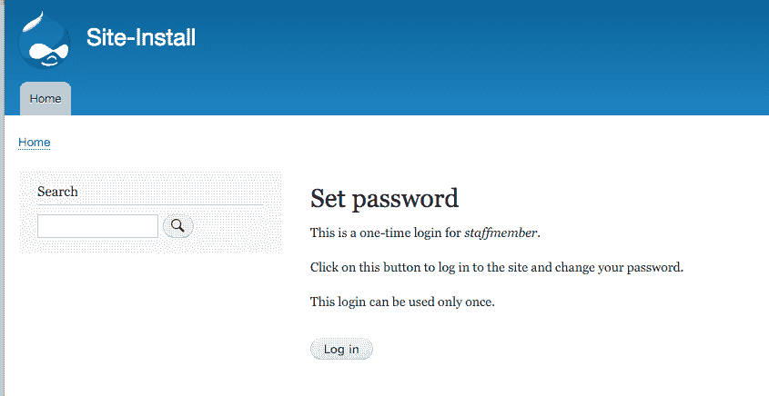
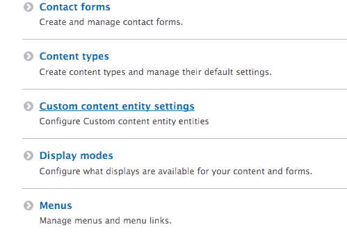

# Drupal CLI

Drupal 8 有两个命令行工具：**Drupal Console** 和 **Drush**。在本章中，我们将通过以下菜谱来讨论它们如何通过简化与 Drupal 的工作来使工作变得更轻松：

+   在 Drupal Console 或 Drush 中重建缓存

+   使用 Drush 与数据库交互

+   使用 Drupal Console 调试 Drupal

+   通过 Drupal Console 生成代码框架

+   创建 Drush 命令

+   创建 Drupal Console 命令

# 简介

在本书的前几章中，有一些菜谱提供了使用命令行工具简化 Drupal 工作的方法。有两个贡献项目为 Drupal 提供了命令行界面体验。

首先，是 Drush。Drush 首次为 Drupal 4.7 创建，并已成为用于日常 Drupal 操作的必备工具。然而，随着 Drupal 8 及其与 Symfony 的集成，出现了 Drupal Console。Drupal Console 是基于 Symfony Console 的应用程序，这使得它能够重用更多组件，并更容易与贡献模块集成。

本章包含了一些菜谱，将突出使用 Drush 或 Console 可以简化的操作。在本章结束时，您将能够通过命令行与您的 Drupal 网站进行交互。

在撰写本书时，Drush 仍然是 Drupal 8 的首选主要工具；然而，Drupal Console 正在赢得更多的市场份额。Drupal Console 正在快速发展。由于这种快速发展，命令将仍然存在，但输出可能不同。

Drush 和 Drupal Console 都支持全局安装，但这两个项目都在迁移到使用 Composer 的按项目安装。要开始，请参考以下每个工具的安装指南以获取最新的安装信息：

+   **Drush**：[`docs.drush.org/en/master/install/`](http://docs.drush.org/en/master/install/)

+   **Drupal Console**：[`docs.drupalconsole.com/en/getting/project.html`](https://docs.drupalconsole.com/en/getting/project.html)

# 在 Drupal Console 或 Drush 中重建缓存

Drupal 利用缓存来存储插件定义、路由等。当您添加新的插件定义或新的路由时，您需要重建 Drupal 的缓存，以便它被识别。

通过命令行重建缓存比使用用户界面更高效，因为它不会使用 web 服务器资源来执行缓存重建。

在这个菜谱中，我们将向您展示如何使用 Drush 和 Drupal Console 清除 Drupal 中的各种缓存区。了解如何清除特定的缓存区非常重要，这样在可能的情况下，您就不需要重建一切。

# 如何操作...

1.  打开终端并导航到已安装的 Drupal 目录。

1.  我们在 Drush 中使用 `cache-rebuild` 命令来重建 Drupal 的所有缓存，包括路由：

```php
$ drush cache-rebuild
Cache rebuild complete.
```

1.  在 Drupal Console 中，我们使用 `cache:rebuild` 命令来清除特定的缓存区。输入使用自动完成来帮助指定要清除的特定缓存区。在这个例子中，我们清除渲染缓存：

```php
$ drupal cache:rebuild all
 Select cache. [all]:
 > render
 Rebuilding cache(s), wait a moment please.
 [OK] Done clearing cache(s). 
```

1.  如果我们只需要在 Drupal 中重建我们的路由，我们可以在控制台中使用 `router:rebuild` 命令。这将保持渲染、发现和其他缓存，但会暴露新的路由：

```php
$ drupal router:rebuild
 Rebuilding routes, wait a moment please
 [OK] Done rebuilding route(s).
```

1.  Drush 提供了 `twig-compile` 来重建模板。传递详细选项将显示正在编译的模板：

```php
$ drush twig-compile --verbose
```

# 它是如何工作的…

Drush 和 Drupal Console 都会从 Drupal 安装中加载文件并引导应用程序。这使得命令可以调用 Drupal 中找到的函数和方法。

对于 Drush 8.x，Drush 没有实现依赖注入容器，仍然需要依赖于 Drupal 的过程函数。

然而，Drupal Console 利用依赖注入容器，允许它重用 Drupal 的容器和服务。

*创建 Drush 命令* 和 *创建 Drupal Console 命令* 的配方将更详细地描述这些差异。

# 参见

+   Drush 文档位于 [`docs.drush.org/en/master/`](http://docs.drush.org/en/master/)

+   Drupal Console 文档位于 [`docs.drupalconsole.com/`](https://docs.drupalconsole.com/)

+   Drush 命令速查表位于 [`drushcommands.com/`](https://drushcommands.com/)

+   Drupal Console 命令速查表位于 [`drupalconsole.com/cheatsheet/`](http://drupalconsole.com/cheatsheet/)

# 使用 Drush 与数据库交互

当与任何使用数据库的应用程序一起工作时，有时您需要导出数据库并将其导入其他地方。通常，您会这样做以将生产站点上的内容本地化。这样，您可以创建一个可以导出并推送到生产的配置，如在第 *第九章* 中讨论的，*配置管理 – 在 Drupal 8 中部署*。

在这个配方中，我们将从生产站点导出数据库转储以设置本地开发。数据库转储将通过命令行导入并清理。然后，我们将通过 Drush 执行 SQL 查询以验证清理。

# 准备工作

Drush 有能力使用站点别名。站点别名是配置项，允许您与远程 Drupal 站点交互。在这个配方中，我们将使用以下别名与一个虚构的远程站点交互，以展示典型的流程是如何获取远程数据库的。

注意，您不需要使用 Drush 别名来下载配方中创建的数据库转储；您可以使用您熟悉的方法（手动从命令行使用 `mysqldump` 或 `phpMyAdmin`）：

```php
$aliases['drupal.production'] = [
  'uri' => 'example.com',
  'remote-host' => 'example.com',
  'remote-user' => 'someuser',
  'ssh-options' => '-p 2222',
];
```

有关站点别名的更多信息，请参阅 Drush 文档 [`docs.drush.org/en/master/usage/#site-aliases`](http://docs.drush.org/en/master/usage/#site-aliases)。站点别名允许您与远程 Drupal 安装交互。

我们还假设本地开发站点尚未配置以连接到数据库。

# 如何操作...

1.  我们将使用 `sql-dump` 命令将数据库导出到文件。该命令返回需要重定向到文件的输出：

```php
$ drush @drupal.production sql-dump > ~/prod-dump.sql 
```

1.  导航到你的本地 Drupal 网站目录，并将 `sites/default/default.settings.php` 复制到 `sites/default/settings.php`。

1.  编辑新的 `settings.php` 文件，并在文件末尾添加一个数据库配置数组；这将用于 Drupal 的数据库：

```php
// Database configuration.
$databases['default']['default'] = [
  'driver' => 'mysql',
  'host' => 'localhost',
  'username' => 'mysql',
  'password' => 'mysql',
  'database' => 'data',
  'prefix' => '',
  'port' => 3306,
  'namespace' => 'Drupal\\Core\\Database\\Driver\\mysql',
];
```

1.  使用 `sql-cli` 命令，我们可以导入我们创建的数据库导出：

```php
$ drush sql-cli < ~/prod-dump.sql 
```

1.  `sql-sanitize` 命令允许你在数据库中混淆用户电子邮件和密码：

```php
$ drush sql-sanitize
```

1.  为了验证我们的信息已导入并清理，我们将使用 `sql-query` 命令对数据库运行查询：

```php
$ drush sql-query "SELECT uid, name, mail FROM users_field_data;" 
```

# 它是如何工作的...

当使用 Drush 时，我们有使用 Drush 别名的功能。Drush 别名包含一个配置，允许工具连接到远程服务器并与该服务器的 Drush 安装交互。

为了使用站点别名，你需要在远程服务器上安装 Drush。

`sql-dump` 命令执行数据库驱动程序的适当导出命令，通常是 MySQL 和 `mysqldump` 命令。它流到终端，必须管道到目的地。当管道到本地 SQL 文件时，我们可以导入它并执行创建命令以导入我们的数据库模式和数据。

`sql-dump` 命令支持 `--result-file` 选项；然而，它会将文件保存到 Drupal 安装的相关位置。

使用 `sql-cli` 命令，我们将能够通过 Drush 执行数据库的 SQL 命令。这允许我们将文件内容重定向到 `sql-cli` 命令并运行 SQL 命令集。数据导入后，`sql-sanitize` 命令将替换用户名和密码。

最后，`sql-query` 命令允许我们直接将 SQL 命令传递到数据库并返回其结果。在我们的配方中，我们将查询 `users_field_data` 以验证我们已导入用户并且电子邮件已被清理。

# 更多内容...

通过命令行与 Drupal 交互简化了数据库操作。我们将在以下章节中更详细地探讨这一点。

# 使用 gzip 与 sql-dump

有时，数据库可以相当大。`sql-dump` 命令有一个 `gzip` 选项，它将使用 `gzip` 命令输出 SQL 导出。为了运行该命令，你只需：

```php
$ drush sql-dump –-gzip dump.sql.gz
```

最终结果减少了导出文件的大小：

```php
-rw-r--r--   1 user  group  3058522 Jan 14 16:10 dump.sql
-rw-r--r--   1 user  group   285880 Jan 14 16:10 dump.sql.gz
```

如果你创建了一个压缩的数据库导出，确保在尝试使用 `sql-cli` 命令导入之前解压缩它。

# 使用控制台与数据库交互

在撰写本书时，控制台不提供清理数据库的命令。该功能目前记录在这个问题中；请参阅 [`github.com/hechoendrupal/drupal-console/issues/3192`](https://github.com/hechoendrupal/drupal-console/issues/3192)。

`database:connect`和`database:client`命令将启动数据库客户端。这允许你登录到数据库的命令行界面：

```php
$ drupal database:client
$ drupal database:connect 
```

这些命令类似于 Drush 的`sql-cli`和`sql-connect`命令。客户端命令将带你去数据库的命令行工具，其中 connect 显示连接字符串。

Drupal Console 还提供了`database:dump`命令。与 Drush 不同，这将为你将数据库转储写入 Drupal 目录：

```php
$ drupal database:dump
  [OK] Database exported to: /path/to/drupal/www/data.sql 
```

# 使用 Drush 管理用户

当你需要将账户添加到 Drupal 时，你将访问“人员”页面并手动添加新用户。Drush 为 Drupal 提供完整用户管理，从创建到角色分配、密码恢复和删除。此工作流程允许你轻松创建用户，并为他们提供登录，无需进入你的 Drupal 网站。

在这个菜谱中，我们将创建一个带有`staffmember`用户的`staff`角色，并通过 Drush 以该用户身份登录。

# 如何操作...

1.  使用`role-create`命令创建一个标记为`staff`的新角色：

```php
$ drush role-create staff
 Created "staff" 
```

1.  使用`role-lists`命令验证角色是否已在 Drupal 中创建：

```php
$ drush role-list
ID Role Label 
anonymous Anonymous user 
authenticated Authenticated user 
administrator Administrator 
staff Staff
```

1.  `user-create`命令将创建我们的用户：

```php
$ drush user-create staffmember
User ID : 2 
User name : staffmember 
User roles : authenticated 
User status : 1 
```

1.  为了添加角色，我们需要使用`user-add-role`命令：

```php
$ drush user-add-role staff staffmember
Added role staff role to staffmember
```

1.  我们现在将使用`user-login`命令以`staffmember`用户身份登录：

```php
$ drush user-login staffmember --uri=http://example.com
http://example.com/user/reset/2/1452810532/Ia1nJvbr2UQ3Pi_QnmITlVgcCWzDtnKmHxf-I2eAqPE
```

1.  复制链接并将其粘贴到浏览器中以登录该用户：



# 它是如何工作的...

当你在 Drupal 中重置密码时，将生成一个特殊的单次登录链接。登录链接基于生成的哈希值。Drush 命令验证存在于 Drupal 网站上的给定用户，然后将它传递给用户模块的`user_pass_reset_url`函数。

URL 由用户的 ID、生成链接时的时间戳以及基于用户最后登录时间、链接生成和电子邮件的哈希值组成。当链接加载时，此哈希值将被重建并验证。例如，如果用户在生成链接之后登录，链接将变得无效。

当在已安装网络浏览器的机器上使用时，Drush 将尝试在网页浏览器中为你打开链接。浏览器选项允许你指定应启动哪个浏览器。此外，你可以使用 no-browser 来防止浏览器启动。

# 更多内容...

命令行提供了简化用户管理和用户管理的能力。接下来，我们将更详细地探讨这个主题。

# 高级用户登录用例

`user-login`命令是一个有用的工具，允许一些高级用例。例如，你可以在用户名后附加一个路径并跳转到该路径。你可以传递 UID 或电子邮件而不是用户名来以用户身份登录。

您可以使用`user-login`来保护您的管理员用户账户。在 Drupal 中，标识为 1 的用户被视为根用户，可以绕过所有权限。很多时候，这是默认的维护账户，用于在 Drupal 站点上工作。您不必手动登录，可以将账户设置为非常健壮的密码短语，并在需要访问您的站点时使用`user-login`命令。这样，唯一能够以管理员账户登录的用户是那些可以访问在网站上运行 Drush 命令的用户。

# 使用 Drupal Console

Drupal Console 还提供与用户交互的命令。尽管它们不允许创建用户或角色，但它们提供基本的用户管理。

`user:login:url` 命令将为指定的用户 ID 生成一个一次性登录链接。这使用与 Drush 命令相同的方法：

```php
$ drupal user:login:url 2
```

`user:password:reset` 命令允许您将用户的密码重置为新提供的密码。您可以提供用户 ID 和新密码作为参数，但如果缺失，将交互式地提示输入：

```php
$ drupal user:password:reset 2 newpassword
```

`create:users` 命令提供了一种交互式生成大量用户的方法，这对于调试很有用。然而，它不能像 Drush 那样创建具有特定密码的单独用户：

# 通过 Console 生成代码框架

当 Drupal Console 首次推出时，最大的亮点之一是其生成代码的能力。该项目已经变成一个更大的 Drupal 运行器，通过命令行界面，但其中大部分的机智在于代码生成。

如您在前几章和食谱中可能已经注意到的，可能会有一些日常任务和一些样板代码。Drupal Console 使 Drupal 开发者能够创建各种组件，而无需编写所有样板代码。

在第十章《实体 API》中，我们介绍了自定义实体类型的创建。在这个食谱中，我们将使用 Drupal Console 自动化大部分过程，以生成我们的内容实体。

# 准备工作

对于这个食谱，您需要安装 Drupal Console。该工具将为我们生成其他所有内容。您需要安装一个 Drupal 8 站点。许多 Console 的命令将无法工作（或列出），除非它们可以访问已安装的 Drupal 站点。这是因为它与 Drupal 的服务容器交互的方式。

# 如何做到这一点...

1.  从您的 Drupal 站点的根目录开始，使用`generate:module`命令生成一个模块，并遵循交互式过程。使用提示的默认值，以及给它一个模块名称：

```php
$ drupal generate:module
 // Welcome to the Drupal module generator
 Enter the new module name:
 > Content Entity Provider

 Enter the module machine name [content_entity_provider]:
 > 

 Enter the module Path [/modules/custom]:
 > 

 Enter module description [My Awesome Module]:
 > 

 Enter package name [Custom]:
 > 

 Enter Drupal Core version [8.x]:
 > 

 Do you want to generate a .module file (yes/no) [yes]:
 > 

 Define module as feature (yes/no) [no]:
 > 

 Do you want to add a composer.json file to your module (yes/no) [yes]:
 > 

 Would you like to add module dependencies (yes/no) [no]:
 > 

 Do you want to generate a unit test class (yes/no) [yes]:
 > 

 Do you want to generate a themeable template (yes/no) [yes]:
 > 

 Do you confirm generation? (yes/no) [yes]:
 > 

Generated or updated files
 1 - modules/custom/content_entity_provider/content_entity_provider.info.yml
 2 - modules/custom/content_entity_provider/content_entity_provider.module
 3 - modules/custom/content_entity_provider/composer.json
 4 - modules/custom/content_entity_provider/tests/src/Functional/LoadTest.php
 5 - modules/custom/content_entity_provider/content_entity_provider.module
 6 - modules/custom/content_entity_provider/templates/content-entity-provider.html.twig
```

1.  接下来，我们将生成我们的`content`实体。指定将提供实体的模块名称：

```php
$ drupal generate:entity:content
Enter the module name [devel]:
> content_entity_provider

Enter the class of your new content entity [DefaultEntity]:
> CustomContentEntity

Enter the machine name of your new content entity [custom_content_entity]:
>

Enter the label of your new content entity [Custom content entity]:
>

Enter the base-path for the content entity routes [/admin/structure]:
> 

Do you want this (content) entity to have bundles (yes/no) [no]:
>

Is your entity translatable (yes/no) [yes]:
>

Is your entity revisionable (yes/no) [yes]:
>

Generated or updated files
1 - modules/custom/content_entity_provider/content_entity_provider.permissions.yml
2 - modules/custom/content_entity_provider/content_entity_provider.links.menu.yml
3 - modules/custom/content_entity_provider/content_entity_provider.links.task.yml
4 - modules/custom/content_entity_provider/content_entity_provider.links.action.yml
5 - modules/custom/content_entity_provider/src/CustomContentEntityAccessControlHandler.php
6 - modules/custom/content_entity_provider/src/CustomContentEntityTranslationHandler.php
7 - modules/custom/content_entity_provider/src/Entity/CustomContentEntityInterface.php
8 - modules/custom/content_entity_provider/src/Entity/CustomContentEntity.php
9 - modules/custom/content_entity_provider/src/CustomContentEntityHtmlRouteProvider.php
10 - modules/custom/content_entity_provider/src/Entity/CustomContentEntityViewsData.php
11 - modules/custom/content_entity_provider/src/CustomContentEntityListBuilder.php
12 - modules/custom/content_entity_provider/src/Form/CustomContentEntitySettingsForm.php
13 - modules/custom/content_entity_provider/src/Form/CustomContentEntityForm.php
14 - modules/custom/content_entity_provider/src/Form/CustomContentEntityDeleteForm.php
15 - modules/custom/content_entity_provider/custom_content_entity.page.inc
16 - modules/custom/content_entity_provider/templates/custom_content_entity.html.twig
17 - modules/custom/content_entity_provider/src/Form/CustomContentEntityRevisionDeleteForm.php
18 - modules/custom/content_entity_provider/src/Form/CustomContentEntityRevisionRevertTranslationForm.php
19 - modules/custom/content_entity_provider/src/Form/CustomContentEntityRevisionRevertForm.php
20 - modules/custom/content_entity_provider/src/CustomContentEntityStorage.php
21 - modules/custom/content_entity_provider/src/CustomContentEntityStorageInterface.php
22 - modules/custom/content_entity_provider/src/Controller/CustomContentEntityController.php
```

1.  使用 Drupal Console 安装您的模块：

```php
$ drupal module:install content_entity_provider
 Installing module(s) "content_entity_provider"

 [OK] The following module(s) were installed successfully: "content_entity_provider" 
                                                               // cache:rebuild
Rebuilding cache(s), wait a moment please.
 [OK] Done clearing cache(s).
```

1.  查看结构并找到您的自定义内容实体设置：



# 它是如何工作的...

控制台最大的特点之一是它能够减少开发者编写 Drupal 8 代码所需的时间。控制台利用 Twig 模板引擎提供代码生成。这些 Twig 模板包含变量和逻辑，它们被编译成最终结果代码。

一组生成器类接收特定的参数，这些参数通过适当的命令接收，并将它们传递给 Twig 进行渲染。这使得控制台能够轻松地与 Drupal 核心的变化保持同步，同时仍然提供有价值的代码生成。

# 创建 Drush 命令

Drush 提供了一个 API，允许开发者编写他们自己的命令。这些命令可以是模块的一部分，通过 Drupal 安装加载，或者它们可以被放置在本地用户的 Drush 文件夹中用于一般目的。

通常，贡献的模块会创建命令来自动化用户界面操作。然而，为特定操作创建自定义 Drush 命令可能很有用。在这个菜谱中，我们将创建一个命令，该命令加载在过去 10 天内未登录的所有用户并重置他们的密码。

# 准备工作

对于这个菜谱，你需要 Drush 可用。我们将在本地用户目录中创建一个命令。

# 如何操作...

1.  在你的用户`~/.drush`文件夹中创建一个名为`disable_users.drush.inc`的文件：

```php
<?php

/**
 * @file
 * Loads all users who have not logged in within 10 days and disables them.
 */

```

1.  添加 Drush 命令钩子，该钩子将允许 Drush 发现我们通过文件提供的命令：

```php
/**
 * Implements hook_drush_command().
 */
function disable_users_drush_command() {
  $items = [];
  $items['disable-users'] = [
    'description' => 'Disables users after 10 days of inactivity',
  ];
  return $items;
}
```

1.  接下来，我们将创建命令回调函数，它将包含所有我们的逻辑。由于我们的文件名是`disable_users.drush.inc`，我们的命令是`disable-users`，所以钩子最终变成了`drush_disable_users_disable_users`：

```php
/**
 * Implements drush_hook_COMMAND().
 */
function drush_disable_users_disable_users() {

}
```

1.  更新函数以创建一个表示 10 天前的`DateTime`对象。我们将使用它来生成查询的时间戳：

```php
/**
 * Implements drush_hook_COMMAND().
 */
function drush_disable_users_disable_users() {
  // Get the default timezone and make a DateTime object for 10 days ago.
  $system_date = \Drupal::config('system.date');
  $default_timezone = $system_date->get('timezone.default') ?: date_default_timezone_get();
  $now = new DateTime('now', new DateTimeZone($default_timezone));
  $now->modify('-10 days');
}
```

1.  现在，我们将添加我们的查询，该查询将查询所有登录时间戳超过 10 天的用户实体：

```php
/**
 * Implements drush_hook_COMMAND().
 */
function drush_disable_users_disable_users() {
  // Get the default timezone and make a DateTime object for 10 days ago.
  $system_date = \Drupal::config('system.date');
  $default_timezone = $system_date->get('timezone.default') ?: date_default_timezone_get();
  $now = new DateTime('now', new DateTimeZone($default_timezone));
  $now->modify('-10 days');

  $query = \Drupal::entityQuery('user')->condition('login', $now->getTimestamp(), '>');
  $results = $query->execute();
  if (empty($results)) {
    drush_print('No users to disable!');
  }

}
```

1.  接下来，我们将遍历结果并标记用户为禁用：

```php

/**
 * Implements drush_hook_COMMAND().
 */
function drush_disable_users_disable_users() {
  // Get the default timezone and make a DateTime object for 10 days ago.
  $system_date = \Drupal::config('system.date');
  $default_timezone = $system_date->get('timezone.default') ?: date_default_timezone_get();
  $now = new DateTime('now', new DateTimeZone($default_timezone));
  $now->modify('-10 days');

  $query = \Drupal::entityQuery('user')->condition('login', $now->getTimestamp(), '>');
  $results = $query->execute();
  if (empty($results)) {
    drush_print('No users to disable!');
  }

  foreach ($results as $uid) {
    /** @var \Drupal\user\Entity\User $user */
    $user = \Drupal\user\Entity\User::load($uid);
    $user->block();
    $user->save();
  }

  drush_print(dt('Disabled !count users', ['!count' => count($results)]));
}
```

1.  为了发现你的新命令，Drush 的缓存需要被清除：

```php
$ drush cache-clear drush 
```

1.  检查命令是否存在：

```php
$ drush disable-users --help
 Disables users after 10 days of inactivity 
```

# 它是如何工作的...

Drush 通过扫描特定目录以查找遵循`COMMANDFILE.drush.inc`模式的文件来工作。你可以将 Drush 中的`COMMANDFILE`视为 Drupal 钩子系统中模块名称的表示。在实现 Drush 钩子时，以`HOOK_drush`格式，你需要将 HOOK 替换为你的`COMMANDFILE`名称，就像你在 Drupal 中使用模块名称一样。

在这个菜谱中，我们创建了一个`disable_users.drush.inc`文件。这意味着文件中的所有钩子和命令都需要使用`disable_users`进行钩子调用。Drush 使用此来加载返回我们命令信息的`hook_drush_command`钩子。

我们然后在 `drush_hook_command` 钩子中提供了我们逻辑的功能。对于这个钩子，我们将钩子替换为我们的 `COMMANDFILE` 名称，即 `disable_users`，得到 `drush_disable_users_command`。我们将命令替换为我们在 `hook_drush_command` 中定义的命令，即 `disable-users`。然后我们有了最终的 `drush_disable_users_disable_users` 钩子。

# 更多内容…

Drush 命令在其定义中可以指定额外的选项。我们探讨了它们控制命令所需 Drupal 集成级别的功能。

# 指定 Drupal 的引导级别

Drush 命令在执行前可以指定 Drupal 引导的级别。Drupal 有多个引导级别，其中只有系统的特定部分被加载。默认情况下，命令的引导级别为 `DRUSH_BOOTSTRAP_DRUPAL_LOGIN`，这与通过 Web 访问 Drupal 的级别相同。

命令根据其目的可以选择完全不引导 Drupal 或仅引导到数据库系统加载。例如，Git 发布说明模块这样的实用程序 Drush 命令不与 Drupal 交互。它指定了一个引导级别为 `DRUSH_BOOTSTRAP_DRUSH`，因为它只与存储库交互，根据 Git 标签和提交生成变更日志。

# 相关链接

+   参考如何创建自定义 Drush 命令，请访问 [`docs.drush.org/en/master/commands/`](http://docs.drush.org/en/master/commands/)。

+   参考如何安装 Drush，请访问 [`docs.drush.org/en/master/install/`](http://docs.drush.org/en/master/install/)。

+   参考 Drush 引导过程，请访问 [`docs.drush.org/en/master/bootstrap/`](http://docs.drush.org/en/master/bootstrap/)。

# 创建控制台命令

Drupal Console 利用了 Symfony Console 项目和其他第三方库，以利用现代 PHP 的最佳实践。在这个过程中，它遵循 Drupal 8 的实践。这使得 Console 能够通过读取其类加载器来使用命名空间进行命令检测和与 Drupal 的交互。

这允许开发者通过在模块中实现自定义类来轻松创建控制台命令。

在这个菜谱中，我们将创建一个命令，该命令加载过去 10 天内未登录的所有用户并重置他们的密码。我们将使用脚手架命令生成我们命令的基础。

# 准备工作

对于这个菜谱，你需要安装 Drupal Console。该工具将为我们生成其他所有内容。你需要安装一个 Drupal 8 站点。

# 如何操作…

1.  创建一个新的模块来存放你的 Drupal Console 命令，例如

    `console_commands`：

```php
drupal generate:module

// Welcome to the Drupal module generator
Enter the new module name:
 > Console Commands

Enter the module machine name [console_commands]:
 >

Enter the module Path [/modules/custom]:
 >

Enter module description [My Awesome Module]:
 >

Enter package name [Custom]:
 >

Enter Drupal Core version [8.x]:
 >

Do you want to generate a .module file (yes/no) [yes]:
 >

Define module as feature (yes/no) [no]:
 >

Do you want to add a composer.json file to your module (yes/no) [yes]:
 >

Would you like to add module dependencies (yes/no) [no]:
 >

Do you want to generate a unit test class (yes/no) [yes]:
 >

Do you want to generate a themeable template (yes/no) [yes]:
 > 

Do you confirm generation? (yes/no) [yes]:
 >

Generated or updated files
1 - modules/custom/console_commands/console_commands.info.yml
 2 - modules/custom/console_commands/console_commands.module
 3 - modules/custom/console_commands/composer.json
 4  modules/custom/console_commands/tests/src/Functional/LoadTest.php
 5 - modules/custom/console_commands/console_commands.module
 6 - modules/custom/console_commands/templates/console-commands.html.twig
```

1.  接下来，我们将使用 `generate:command` 命令生成命令的基本文件。将其命名为 `disable_users` 命令：

```php
drupal generate:command

// Welcome to the Drupal Command generator
 Enter the extension name [devel]:
 > console_commands

Enter the Command name. [console_commands:default]:
 > console_commands:disable_users

Enter the Command Class. (Must end with the word 'Command'). [DefaultCommand]:
 > DisableUsersCommand

Is the command aware of the drupal site installation when executed?. (yes/no) [no]:
 > yes 

Do you confirm generation? (yes/no) [yes]:
 >

Generated or updated files
 1 - modules/custom/console_commands/src/Command/DisableUsersCommand.php
 2 - modules/custom/console_commands/console.services.yml
 3 - modules/custom/console_commands/console/translations/en/console_commands.disable_users.yml
```

1.  编辑创建的 `DisableUsersCommand.php` 文件，并从执行方法中删除样板示例代码：

```php
/**
 * {@inheritdoc}
 */
protected function execute(InputInterface $input, OutputInterface $output) {
}
```

1.  更新函数以创建一个表示 10 天前的`DateTime`对象。我们将使用它来生成查询的时间戳：

```php
/**
 * {@inheritdoc}
 */
protected function execute(InputInterface $input, OutputInterface $output) {
  // Get the default timezone and make a DateTime object for 10 days ago.
  $system_date = \Drupal::config('system.date');
  $default_timezone = $system_date->get('timezone.default') ?: date_default_timezone_get();
  $now = new \DateTime('now', new \DateTimeZone($default_timezone));
  $now->modify('-10 days');
}
```

1.  现在，我们将添加我们的查询，该查询将查询所有登录时间戳大于 10 天的用户实体：

```php
/**
 * {@inheritdoc}
 */
protected function execute(InputInterface $input, OutputInterface $output) {
  // Get the default timezone and make a DateTime object for 10 days ago.
  $system_date = \Drupal::config('system.date');
  $default_timezone = $system_date->get('timezone.default') ?: date_default_timezone_get();
  $now = new \DateTime('now', new \DateTimeZone($default_timezone));
  $now->modify('-10 days');

 $query = \Drupal::entityQuery('user')->condition('login', $now->getTimestamp(), '>');
  $results = $query->execute();

  if (empty($results)) {
    $output->writeln('<info>No users to disable!</info>'); }
}
```

1.  接下来，我们将遍历结果并将用户标记为禁用：

```php
/**
 * {@inheritdoc}
 */
protected function execute(InputInterface $input, OutputInterface $output) {
  // Get the default timezone and make a DateTime object for 10 days ago.
  $system_date = \Drupal::config('system.date');
  $default_timezone = $system_date->get('timezone.default') ?: date_default_timezone_get();
  $now = new \DateTime('now', new \DateTimeZone($default_timezone));
  $now->modify('-10 days');

  $query = \Drupal::entityQuery('user')->condition('login', $now->getTimestamp(), '>');
  $results = $query->execute();

  if (empty($results)) {
    $output->writeln('<info>No users to disable!</info>');
  }

 foreach ($results as $uid) {
    /** @var \Drupal\user\Entity\User $user */
    $user = \Drupal\user\Entity\User::load($uid);
    $user->block();
    $user->save();
  }

  $total = count($results);
  $output->writeln("Disabled $total users");
}
```

1.  启用模块以访问以下命令：

```php
$ drupal module:install console_commands 
```

# 它是如何工作的...

Drupal Console 通过使用命名空间发现方法与模块集成。当控制台在 Drupal 安装中运行时，它将发现所有可用的项目。然后，它将发现`\Drupal\{ a module }\Command`命名空间中的任何文件，这些文件实现了`\Drupal\Console\Command\Command`接口。

每次调用 Drupal Console 时，它都会重新扫描 Drupal 目录以查找可用的命令，因为它不会保留可用命令的缓存。

# 更多内容...

Drupal Console 提供了更直观的开发者体验，因为它遵循 Drupal 核心的编码格式。我们将讨论如何使用控制台创建实体。

# 使用控制台命令创建实体

控制台的一个优点是它能够利用 Symfony Console 的提问助手，提供强大的交互体验。Drupal Commerce 使用控制台提供`commerce:create:store`命令来生成商店。该命令的目的是简化特定实体的创建。

`\Drupal\commerce_store\Command\CreateStoreCommand`类覆盖了默认的交互方法，该方法用于从用户那里提示数据。它将提示用户输入商店的名称、电子邮件、国家/地区和货币。

开发者可以实现类似的命令，为高级用户提供更简单的方式来处理模块和配置。

# 参见

+   请参阅如何创建自定义命令的说明：[`docs.drupalconsole.com/en/extending/creating-custom-commands.html`](https://docs.drupalconsole.com/en/extending/creating-custom-commands.html)
