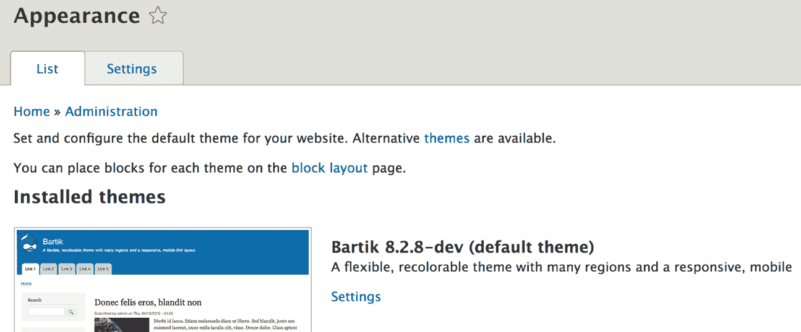

# 第四章：主题化

Drupal 主题系统最明显的部分是位于`admin/appearance`的“外观”管理页面，它列出了您网站上安装的所有主题：



当你在外观页面上选择一个主题时，你实际上是在为你的网站数据和功能应用一个特定的图形设计。然而，实际应用的主题只是整个主题层的一小部分。

本书主要关注构建封装功能块模块。然而，由于我们最终是在构建一个网络应用程序，我们功能输出的所有内容都需要用 HTML 进行标记。在 Drupal 中，将数据包裹在 HTML 和 CSS 中的这个过程被称为主题化。

在本章中，我们将讨论我们的模块如何与主题层集成。我们将讨论系统的架构、主题模板、钩子、渲染数组等内容，并提供一些实际示例。

# 业务逻辑与展示逻辑

我们从讨论现代应用程序做出的一个重要架构选择开始这一章：如何将数据转换为展示。

那么，获取我们的数据和功能标记的最佳方法是什么？我们是否简单地用 HTML 包裹每一块数据，然后返回一个巨大的字符串，如下面的示例所示？

```php
return '<div class="wrapper">' . $data . '</div>';
```

不，我们不是这样做的。像所有其他设计良好的应用程序一样，Drupal 将业务逻辑与其展示逻辑分开。确实，Drupal 的早期版本曾使用过这种方法，尤其是在主题函数方面，但即便如此，它们也容易被覆盖。因此，这些结构并不是直接位于业务逻辑的中间，而是封装在由客户端代码调用的特殊主题函数中。因此，业务逻辑与展示逻辑的分离是明显的，尽管有时 PHP 和 HTML 代码之间的界限并不那么清晰。

传统上，这种关注点分离的主要动机如下：

+   为了使代码更容易维护

+   为了能够轻松地替换一层实现，而无需重写其他层

正如我们将看到的，Drupal 在“可替换性”方面做得相当彻底。你可能认为你在外观页面上选择的主题负责应用网站的 HTML 和 CSS。这是真的，但只到一定程度。Drupal.org 上有数千个贡献模块。你也可以编写大量的自定义模块。主题是否应该负责标记所有这些模块的数据？显然不是。

由于模块最熟悉自己的数据和功能，因此它有责任提供默认的主题实现——这种独立于设计的初始外观和感觉，并且无论主题如何都应该正确显示数据。然而，只要模块正确使用主题系统，主题就可以通过交换模块的实现与自己的实现来覆盖任何 HTML 和/或 CSS。

换句话说，在模块（业务逻辑）内部检索和处理数据之后，它需要提供默认的主题实现来将其包裹在其标记内。有时，特定的主题可能需要覆盖这个实现以达到特定的设计目标。如果主题提供了自己的实现，Drupal 将使用该主题实现而不是模块的默认实现。这通常被称为*覆盖*。否则，默认的回退仍然存在。主题还提供了仅通过 CSS 应用样式并保持模块提供的标记不变的选择。

# Twig

主题引擎负责通过模板文件进行实际输出。尽管 Drupal 的早期版本能够使用不同的主题引擎，但有一个引擎脱颖而出，并且被 99.9%的时间使用（我现场编造的统计数据）：`PHPTemplate`。这个主题引擎使用具有`.tpl.php`扩展名的 PHP 文件，并包含标记和 PHP。经验丰富的 Drupal 开发者习惯了这种做法，但这对前端开发者来说使用和主题化总是更困难。

在 Drupal 8 中，它被放弃，转而使用由 SensioLabs（负责 Symfony 项目的人）创建的 Twig 模板引擎。正如所提到的，主题函数也被弃用，转而通过`Twig`文件输出所有内容。这为主题系统带来了许多改进，也让前端社区感到非常高兴。例如，它提高了安全性，增强了可读性，并且使得实际上掌握 PHP 知识以参与 Drupal 站点的主题设计变得不那么重要。

Drupal 8 中所有的 Twig 模板文件都有`.html.twig`扩展名。

# 主题钩子

由于我们已经介绍了一些 Drupal 主题系统背后的原则——最值得注意的是，关注点的分离——让我们更深入地了解一下它们是如何实际应用的。这一切都始于主题钩子。是的，Drupal 总是喜欢把事物称为*钩子*。

主题钩子定义了特定数据应该如何渲染。它们通过使用`hook_theme()`由模块（和主题）注册到主题系统中。这样做时，它们获得一个名称，一个它们输出的变量列表（需要用标记包裹的数据），以及其他选项。

注册主题钩子的模块和主题还需要提供一个实现（默认情况下将使用的实现）。在 Drupal 7 中，这是通过以下两种方式完成的：要么是通过返回字符串（标记）的 PHP 函数，要么是通过`PHPTemplate`模板文件。两者都很重要，但后者在我的（以及许多人的）观点中总是更“正确”。这也得到了事实的支持，即函数方法在 Drupal 8 中被完全抛弃，转而使用`Twig`模板。此外，与主题系统的全面重写相结合，现在几乎所有输出都是通过 Twig 模板文件完成的，这真是太好了。

作为例子，让我们看看两种常见的注册主题钩子的方式，我们经常能找到。为此，我们将使用 Drupal 核心中已经存在的示例：

```php
function hook_theme($existing, $type, $theme, $path) {
  return [
    'item_list' => array(
      'variables' => array('items' => array(), 'title' => '', 'list_type' => 'ul', 'wrapper_attributes' => array(), 'attributes' => array(), 'empty' => NULL, 'context' => array()),
    ),
    'select' => array(
      'render element' => 'element',
    ),
  ];
}
```

在先前的`hook_theme()`示例中，我包括了 Drupal 核心中的两个主题钩子。一个是基于变量的，而另一个是基于渲染元素的。当然，这里可以定义的选项还有很多，我强烈建议你阅读 Drupal.org API 文档页面以了解这个钩子。

然而，一开始你就能看到注册主题钩子是多么简单。在第一种情况下，我们有`item_list`，默认情况下（如果没有其他指定），它将映射到`item-list.html.twig`文件以输出变量。在其定义中，我们可以找到它使用的变量，如果客户端没有传递，还有一些方便的默认值。第二个主题钩子是`select`，它不使用变量，而是一个渲染元素（我们很快会讨论）。此外，其模板文件很容易确定，基于名称：`select.html.twig`。我鼓励你检查这两个模板文件在核心代码（由系统模块提供）中的情况。

除了实际实现之外，注册主题钩子的模块和主题还可以提供一个默认模板预处理器。这个责任是“预处理”（即准备）在发送到模板之前的数据。例如，如果一个主题钩子只接收一个实体（一个复杂的数据对象）作为其唯一变量，预处理器可以用来将这个实体分解成在模板中需要输出的小块（如标题和描述）。

模板预处理器是简单的程序性函数，遵循命名模式，并在模板渲染之前由主题系统调用。正如我之前提到的，注册主题钩子的模块和主题也可以提供一个默认预处理器。因此，对于一个名为`component_box`的主题钩子，默认预处理器函数看起来可能如下所示：

```php
function template_preprocess_component_box(&$variables) {
  // Prepare variables.
}
```

函数名以单词`template`开头，表示它是此主题钩子的原始预处理器，然后跟随传统的`preprocess`单词，并以主题钩子的名称结尾。参数始终是一个作为引用传递的数组，包含有关该主题钩子的某些信息，更重要的是，与主题钩子一起定义并从调用代码传递给它的数据变量。这就是我们通常在这个函数中处理的内容。由于它是通过引用传递的，所以在这个函数中我们不返回任何内容，但我们总是直接在`$variables`数组中操作值。最后，模板文件可以打印出以该数组键命名的变量。当然，这些值将是映射到这些键的值。

另一个模块（或主题）可以通过实现自己的来覆盖此预处理器函数。然而，在其命名中，它需要用模块名称替换单词`template`（以避免冲突）。如果存在这样的覆盖，则将按特定顺序调用两个预处理器。第一个始终是默认的，然后是模块定义的，然后是主题定义的。这是 Drupal 的另一个优秀扩展点，因为更改预处理器内部发现的数据或选项可以在很大程度上定制现有功能以满足你的需求。

作为遵循先前命名约定的替代方案，你还可以在注册`hook_theme()`时注册预处理器函数名称。然而，我建议你坚持使用默认的命名约定，因为它更容易发现函数的目的。随着你变得更加高级，你也会反过来欣赏能够快速理解这些*约定*函数的能力。

我之前提到过，模块和主题也可以覆盖其他模块和主题定义的主题钩子。这有两种方法。最常见的一种是一个主题覆盖主题钩子。这是因为之前提到的理由——模块为其数据定义了一个默认实现，但主题可以轻松地接管其展示。此外，主题覆盖主题钩子的方式是简单地创建一个与原始文件同名的新的 Twig 文件，并将其放置在其`templates`文件夹中的某个位置。如果启用该主题，它将被使用。一个不太常见但绝对有效的用例是一个模块覆盖另一个模块定义的主题钩子。例如，这可能是因为你需要更改一个流行的贡献模块的数据渲染方式。为了实现这一点，你需要实现`hook_theme_registry_alter()`并更改现有主题钩子使用的模板文件。还值得一提的是，如果你想改变整个主题钩子定义，可以使用这个钩子，而不仅仅是模板。此外，既然我们提到了这个钩子，请注意，主题钩子一旦定义，就会存储和缓存在一个主题*注册表*中，以优化性能，而这个注册表就是我们通过这个钩子来更改的。这也意味着当我们对主题注册表进行更改时，我们需要定期清理缓存。

所有这些都很好，但是业务逻辑仍然需要与主题系统交互，以告诉它使用哪个特定的主题钩子。在 Drupal 7 中，我们有一个`theme()`函数，它接受钩子名称作为参数，并负责一切：确定使用哪个模板文件（或函数），调用预处理器、处理器等等。在 Drupal 8 中，`theme()`函数不再存在，已被一个基于渲染数组的更健壮的系统所取代，该数组包含主题钩子信息、变量以及任何其他关于如何渲染该组件的元数据。我们也会在本章中讨论渲染数组。

# 主题钩子建议

主题钩子的一个优点是它们是可重用的。然而，你可能会遇到的一个问题是，当主题钩子被重用时，主题钩子模板会丢失上下文。例如，我们在上一节中看到的`item_list`主题钩子，它不知道它正在为主题哪个列表。这使得根据内容的不同来不同地样式化变得困难。幸运的是，我们可以通过使用主题钩子模式而不是原始的主题钩子名称来为主题系统提供上下文，这个模式看起来像这样：

```php
base_theme_hook__some_context 
```

模式的一部分由双下划线分隔，合在一起称为*主题钩子建议*。但它是如何工作的呢？

客户端代码（即将看到的渲染数组），当使用主题钩子渲染数据片段时，可以将上下文附加到主题钩子，将其转换为建议。主题系统随后将检查以下内容：

+   如果存在匹配该建议的模板文件（在主题内部），则使用它而不是原始的主题钩子模板

+   或者，如果已注册具有该实际名称的主题钩子，则使用该钩子

+   或者，它会检查基本主题钩子并使用它（回退）

在这种情况下，调用者（渲染数组）负责“提出”一个建议。例如，考虑以下渲染数组：

```php
return [
  '#theme' => 'item_list__my_list',
  '#items' => $items,
];
```

基本主题钩子是`item_list`，它使用 Drupal 核心提供的`item-list.html.twig`模板文件进行渲染。如果主题中没有`item-list—my-list.html.twig`模板文件，并且没有注册`item_list__my_list`主题钩子，则将使用默认的`item_list`主题钩子。否则，我们将遵循之前提到的顺序。一个模块可以将该建议注册为钩子，然后将其用作替代。然而，主题可以通过仅创建具有该名称的模板文件来进一步覆盖它。

所有这些操作都是为了在渲染可重用的主题钩子时，给主题设计师和操作者提供确定具体主题内容的机会。然而，我们刚才看到的例子在某种程度上是静态的，因为我们硬编码了`my_list`作为主题钩子建议。我们可以做得更好。

注册主题钩子的模块还可以提供与该主题钩子自动关联的建议列表。它是通过实现`hook_theme_suggestions_HOOK()`来实现的，其中`HOOK`是主题钩子名称。此钩子在主题系统运行时触发，试图确定某个渲染数组需要如何渲染。它接收与模板预处理器相同的`$variables`数组作为参数。这意味着我们可以利用这些变量并动态提供主题钩子建议。我们将在本章后面看到这个例子。

此外，作为模块开发者，我们还可以为其他模块或 Drupal 核心注册的主题钩子提供一系列主题钩子建议。我们可以通过实现`hook_theme_suggestions_HOOK_alter()`来实现这一点，在那里我们除了接收变量外，还接收该主题钩子的可用建议。

总结来说，主题钩子建议是向负责渲染多个内容的通用主题钩子添加一些上下文的一种强大方式。

# 渲染数组

渲染数组也存在于 Drupal 的先前版本中，并且对于主题系统来说非常重要。然而，在 Drupal 8 中，它们已经成为了*核心*——渲染 API 的核心部分，负责将标记表示转换为实际的标记。

承认我作为一个作家的局限性，我将参考 Drupal.org 文档中的定义，该定义最好地描述了渲染数组是什么：

...一个包含要渲染的数据及其渲染方式的属性的分层关联数组。

简单，但强大。

拥有渲染数组的一个主要原因是它们允许 Drupal 将实际将某物渲染为标记的过程推迟到最后一刻。我这是什么意思呢？例如，在 Drupal 7 中，我们作为模块开发者通常会调用实际的渲染服务（`theme()` 函数）在预处理器内部来“渲染”一些数据，以便在模板中打印出结果字符串（标记）。然而，这使得在管道中的后续步骤中更改这些数据变得不可能，例如，在执行此渲染的预处理器之后的另一个预处理器。

因此，在 Drupal 8 中，我们不再需要/应该手动渲染任何内容（除非在非常特定的情况下）。我们始终与渲染数组一起工作。Drupal 将知道如何将它们转换为标记。这样，模块和主题可以在处理过程中的不同级别拦截渲染数组并进行修改。

我们现在将讨论渲染数组以及与之一起工作的不同方面。

# 渲染数组的结构

渲染数组由 `renderer` 服务（`RendererInterface`）渲染，它遍历数组并递归渲染每个级别。数组的每个级别可以有一个或多个元素，这些元素可以是两种类型之一：属性或子元素。属性是键前面带有 `#` 符号的那些，而子元素则不是。子元素本身也可以是一个包含属性和子元素的数组。但是，每个级别至少需要有一个属性才能被视为一个级别，因为它负责告诉渲染系统该级别应该如何渲染。因此，属性名称特定于 Render API 和它们需要渲染的实际事物，而子元素的名称可以灵活。除了这两种类型（是的，我撒谎了，可以有多于两种）之外，我们还可以有由主题钩子定义的变量，它们也以 `#` 符号开头。它们本身不是属性，但主题系统知道它们，因为它们已在 `hook_theme()` 内部注册。

Render API 使用了许多属性来处理渲染数组。其中一些属性非常重要，例如 `#cache` 和 `#attached`。然而，还有一些属性是强制性的，因为它们定义了渲染数组的核心职责。以下是一些描述渲染数组应该做什么的属性，每个渲染数组都应该具有其中之一。

# #type

`#type` 属性指定数组包含需要使用特定 *渲染元素* 渲染的数据。渲染元素是封装了定义的可渲染组件的插件（是的，插件）。它们本质上包装了另一个渲染数组，该数组可以使用主题钩子或更复杂的渲染数组来处理它们负责渲染的数据。你可以把它们看作是标准化的渲染数组。

渲染元素有两种类型：通用和表单输入元素。它们各自都有相应的插件类型、注解和接口。它们在渲染标准化的 HTML 片段方面相似；然而，表单输入元素需要处理表单处理、验证、数据映射等问题。记住，当我们定义我们的表单在第二章中时——*创建你的第一个模块*，我们遇到了带有 `#` 符号的数组。这些是（表单）具有不同选项（属性）的渲染元素。

要找到这两种类型渲染元素的示例，请查找实现了 `ElementInterface` 和 `FormElementInterface` 接口的插件。

# #theme

`#theme` 属性与本章前面讨论的主题紧密相关——主题钩子。它指定渲染数组需要使用定义的主题钩子之一来渲染某种类型的数据。与这个属性一起，你通常会遇到其他映射到主题钩子在 `hook_theme()` 中注册的变量名称的属性。这些是主题系统用来渲染模板的变量。

这是你在业务逻辑中使用的属性，用于传达你的数据需要使用特定的主题钩子进行渲染。如果你认为你只能使用你注册的主题钩子，那么你就错了。有许多主题钩子已经被 Drupal 核心和贡献的模块注册，这使得 Drupal 开发者的生活变得更加容易。只需查看 `drupal_common_theme()`，你可能会发现一些常见的主题钩子可以使用。

# #markup

有时，注册一个主题钩子和一个用于输出某些数据的模板可能是过度设计。想象一下，你只有一段需要用 `<span>` 标签包裹的字符串。在这种情况下，你可以使用 `#markup` 属性，该属性指定数组直接提供需要输出的 HTML 字符串。注意，然而，提供的 HTML 字符串会通过 `\Drupal\Component\Utility\Xss::filterAdmin` 进行清理（主要是 XSS 保护）。这是完全可以接受的，因为如果你试图在这里包含的 HTML 被删除，这通常意味着你过度使用了 `#markup` 属性，而应该注册一个主题钩子。

除了简单的标记之外，还有`#plain_text`属性，你可以通过它指定由这个渲染数组提供的文本需要完全转义。所以基本上，如果你需要输出一些简单的文本，你可以在这两个之间选择，以实现非常快速的输出。

现在，如果你记得在第二章，*创建你的第一个模块*中，我们的控制器在某个时候返回了这个数组：

```php
return [
 '#markup' => $this->t('Hello World')
];
```

这是你将见到的最简单的渲染数组。它只有一个元素，使用`#markup`属性输出的一个小字符串。在本章的后面部分，我们将调整这个数组，并使用我们的`HelloWorldSalutation`服务提供的渲染数组，以便使事情更具主题性。那将是我们将在这里学到的许多东西付诸实践的部分。

然而，尽管这个数组看起来很小，但它只是更大层次渲染数组的一部分，它构建了整个 Drupal 页面，并包含所有各种块和其他组件。同时，负责构建这个整个大东西的是 Drupal 渲染管道。

# 渲染管道

在第一章，*为 Drupal 8 开发*中，当我们概述了 Drupal 8 如何处理用户请求并将其转换为响应的高级示例时，我们提到了渲染管道的概念。所以让我们看看这个是什么，因为实际上有两个渲染管道需要讨论：Symfony 渲染管道和 Drupal 渲染管道。

如你所知，Drupal 8 使用了许多 Symfony 组件，其中之一就是 HTTPKernel 组件([`symfony.com/doc/current/components/http_kernel.html`](http://symfony.com/doc/current/components/http_kernel.html))。它的主要作用是将用户请求（从 PHP 超级全局变量构建成请求对象）转换成一个标准化的响应对象，并将其发送回用户。这些对象定义在 Symfony HTTP Foundation 组件[(http://symfony.com/components/HttpFoundation)](http://symfony.com/components/HttpFoundation)中。为了协助这个过程，它使用了事件分发器组件来分发旨在处理多层工作负载的事件。正如我们所看到的，这在 Drupal 8 中也是如此。

Drupal 8 中的控制器可以返回两种东西之一——直接返回一个响应对象，或者返回一个渲染数组。如果它们返回第一个，那么工作几乎就完成了，因为 Symfony 渲染管道知道如何处理这个响应（假设响应是正确的）。然而，如果它们返回一个渲染数组，Drupal 渲染管道就会在较低级别启动，试图将其转换为响应。我们始终需要一个响应。

为了确定谁可以处理这个渲染数组，会触发`kernel.view`事件。Drupal 8 附带了一个`MainContentViewSubscriber`，它监听这个事件并检查请求格式以及控制器是否返回了一个渲染数组。根据前者，它实例化一个`MainContentRendererInterface`对象（默认情况下，并且大多数时候，这将是一个基于 HTML 的`HtmlRenderer`），并要求它将渲染数组转换为响应。然后，它将响应设置到事件上，以便 Symfony 渲染管道可以继续其愉快的旅程。

除了 HTML 渲染器之外，Drupal 8 还附带了一些其他需要处理不同类型请求的渲染器：

+   `AjaxRenderer`处理 Ajax 请求并与 Ajax 框架集成。我们将在本书的后面看到 Ajax 功能的示例。

+   `DialogRenderer`处理旨在在屏幕上打开对话框的请求。

+   `ModalRenderer`处理旨在在屏幕上打开模态的请求。

回到 HTML 渲染器，让我们看看它是如何将我们的渲染数组转换为实际相关的 HTML 并在响应对象上实现的。不深入细节，以下是它所做的高层次概述：

+   它的第一个目标是构建一个具有`#type => 'page'`属性的渲染数组，因为这是负责整个页面的渲染元素。这意味着如果控制器返回它，它就不需要做太多。然而，通常控制器不包括这一点，因此它触发一个事件来确定谁可以构建这个渲染数组。

+   默认情况下，使用`SimplePageVariant`插件来构建页面数组，但启用 Block 模块后，将使用`BlockPageVariant`插件，将渲染管道中的某些级别进一步向下。主要内容区域被侧边栏、页眉、页脚等处的块所包裹。

+   一旦有了页面渲染数组，它就会将其包装成另一个渲染元素，即`#type => 'html'`（负责诸如`<head>`元素等事物）。

+   一旦它有了整个页面的主要渲染数组，它就使用`Renderer`服务来遍历它并在每个级别（可能有多个）进行实际渲染。它是通过将渲染元素（`#type`）、主题钩子（`#theme`）、简单标记的文本片段（`#markup`）或纯文本片段（`#plain_text`）转换为它们各自的 HTML 表示来做到这一点的。

因此，正如你所看到的，渲染管道从 Symfony 级别开始，当遇到渲染数组时进入 Drupal 领域，但继续向下构建控制器返回的页面上找到的每个组件。然后，它回到这些级别，直到创建了一个巨大的渲染数组并可以将其转换为 HTML。此外，在它返回的过程中，各种元数据可以冒泡到主渲染数组中。

我故意省略了缓存这个因素，尽管它非常重要，我们将在后面的章节中介绍。但是，可以说，缓存元数据就是这样一种从底层向上冒泡的例子，一直到达顶层，并用于确定页面级缓存。但关于这一点，我们稍后再说。

# 资产和库

现在我们对渲染数组有了更多的了解，包括它们的结构以及它们所经过的流程，我们可以从模块开发的角度谈谈资产管理的相关内容。因为尽管这通常是一个主题责任，模块开发者通常需要向他们的模块中添加和使用 CSS 和 JS 文件，而这些操作都是在渲染数组中完成的。

与 CSS 和 JS 文件一起工作在 Drupal 8 中已经标准化了，与之前的版本相比，我们当时有不止一种方法可以做到这一点。库现在是关键，让我们通过一些使用 CSS 或 JS 文件的示例来了解它们是如何工作的。

将资产添加到你的页面有三个步骤：

+   创建你的 CSS/JS 文件

+   创建包含它们的库

+   将该库附加到渲染数组

# 库

假设你已经有了 CSS/JS 文件，库在模块根文件夹中的 `module_name.libraries.yml` 文件内定义。这个文件中库定义的一个简单例子如下：

```php
my-library:
 version: 1.x
 css:
   theme:
     css/my_library.css: {}
 js:
   js/my_library.js: {}
```

这是一个标准的 YAML 表示法，通过它我们定义了一个名为 `my-library` 的库，并提供了有关它的信息。我们可以指定一个版本号，然后添加尽可能多的 CSS 和 JS 文件引用。文件路径相对于包含此库定义的模块文件夹，我们可以在大括号之间添加一些选项（更高级，但我们将稍后看到一个示例）。

此外，你还会注意到 CSS 文件有一个额外的层级键名为 `theme`。这是为了指明要包含的 CSS 类型，可以是以下之一（基于 SMACSS ([`smacss.com/`](https://smacss.com/)) 标准）：

+   `base`：通常包含 CSS 重置/标准化和 HTML 元素样式

+   `layout`：高级页面样式，例如网格系统

+   `component`：UI 元素和可重用组件

+   `state`：用于组件客户端更改的样式

+   `theme`：组件的视觉样式

这里的选择也反映在 CSS 文件包含的权重上，后者是“最重”的——它将被最后包含。

在任何应用程序中使用库的一个重要方面是能够包含外部托管文件（通常来自 CDN），以获得更好的性能。让我们看看一个使用外部托管文件的示例库定义：

```php
angular.angularjs:
   remote: https://github.com/angular/angular.js
   version: 1.4.4
   license:
     name: MIT
     url: https://github.com/angular/angular.js/blob/master/LICENSE
     gpl-compatible: true
   js:
     https://ajax.googleapis.com/ajax/libs/angularjs/1.4.4/angular.min.js: { type: external, minified: true }
```

这个例子是从 Drupal.org ([`www.drupal.org/docs/8/creating-custom-modules/adding-stylesheets-css-and-javascript-js-to-a-drupal-8-module`](https://www.drupal.org/docs/8/creating-custom-modules/adding-stylesheets-css-and-javascript-js-to-a-drupal-8-module)) 上关于在 Drupal 8 中定义库的内容中摘取的。然而，正如你所看到的，结构与我们之前的例子相同，只是它有一些关于外部库的更多元信息。而且，我们有一个远程 URL 到实际资源的引用，而不是本地路径引用。此外，我们还在大括号内看到了一些选项，我们可以通过这些选项指定文件实际上是外部定位和压缩的。

当涉及到 Drupal 8 中的 JS 时，一个重要的变化是 Drupal 不再默认包含所有库，如 jQuery。它只在需要时才这样做。因此，这使得库依赖的概念变得突出，因为某些脚本需要加载其他库才能工作。

假设 `my-library` 依赖于 jQuery，并将其指定为依赖项。我们只需要添加到我们的库定义中的是以下内容：

```php
dependencies:
  - core/jquery
```

请记住，`dependencies` 键与 `css` 和 `js` 处于相同的 YML 级别。

通过这种方式，我们声明 Drupal 核心 jQuery 库是我们库所需的。这意味着如果我们使用我们的库某处，而 jQuery 没有被包含，Drupal 将处理依赖关系并将它们全部包含。这个好处是依赖关系总是在我们脚本之前包含，因此我们也可以控制这一点。

`core/jquery` 表示法表明定义 `jquery` 库的扩展（模块或主题）是 Drupal 核心。如果它是一个模块或主题，`core` 将会被模块或主题的机器名所替换。因此，例如，要在某处使用我们的新库，它将被引用为 `module_name/my-library`。

# 附加库

你最常见的方式是将库附加到你的渲染数组上。这种方法意味着库对于该组件的渲染是必需的，因此如果该组件从页面中缺失，库资源将不再被包含。

这里是一个渲染数组的样子，其中我们之前定义的库被附加到它上面：

```php
return [
  '#theme' => 'some_theme_hook',
  '#some_variable' => $some_variable,
  '#attached' => [
    'library' => [
      'my_module/my-library',
     ],
  ],
];
```

`#attached` 属性在这里很重要，它表示我们实际上正在将某些内容附加到渲染数组上，在我们的例子中，这恰好是一个库。在 Drupal 7 中，我们可以直接附加 CSS 和 JS 文件，但现在我们有一个标准化的库 API 来以更稳健的方式这样做。

然而，你可能会有这样的情况，你需要的库并没有链接到特定的渲染数组（页面上的组件），而是链接到整个页面——所有页面或子集。要在整个页面上附加库，你可以实现 `hook_page_attachments()`。考虑以下示例：

```php
function hook_page_attachments(array &$attachments) {
  $attachments['#attached']['library'][] = 'my_module/my-library';
}
```

这个钩子在每一页上都会被调用，因此您也可以根据上下文附加库（例如，如果用户具有特定的角色或类似的东西）。此外，还有一个 `hook_page_attachments_alter()` 钩子，您可以使用它来修改任何现有的附件（例如，从页面上删除附件）。

另一种附加库的方法是在预处理器函数内部。我们在这章的早期讨论了预处理器函数；实现起来很简单：

```php
function my_module_preprocess_theme_hook(&$variables) {
  $variables['#attached']['library'][] =  'my_module/my_library';
}
```

您需要做的只是将 `#attached` 键（如果它已经存在）添加到变量数组中。

这三种附加库的方法是最常见的方法，您可能会遇到并使用。然而，还有其他一些方法和地方可以添加附件——您可以修改现有的渲染元素定义，您也可以直接在 Twig 文件中附加库。我建议您阅读 Drupal.org 文档（[`www.drupal.org/docs/8/creating-custom-modules/adding-stylesheets-css-and-javascript-js-to-a-drupal-8-module`](https://www.drupal.org/docs/8/creating-custom-modules/adding-stylesheets-css-and-javascript-js-to-a-drupal-8-module)）以获取有关这些方法的更多信息。

# 常见主题钩子

在本节中，我们将探讨 Drupal 核心附带的三种常见主题钩子，您可能会非常频繁地使用。当然，理解它们最好的方法是通过参考如何使用它们的示例。所以，让我们开始吧。

# 列表

最常见的 HTML 构造之一是列表（有序或无序列表），任何网络应用程序最终都会有很多这样的列表，无论是用于列出项目还是用于看起来根本不像列表的组件，但在标记的目的上，`ul` 或 `ol` 是最合适的。幸运的是，Drupal 一直都有 `item_list` 主题钩子，它足够灵活，可以让我们在几乎所有情况下使用它。

`item_list` 主题钩子定义在 `drupal_common_theme()` 中，默认情况下在 `template_preprocess_item_list()` 中进行预处理，默认使用 `item-list.html.twig` 模板，并且没有默认的主题钩子建议（因为它非常通用，并且是在任何业务逻辑之外注册的）。如果我们检查其定义，我们会注意到它接受许多变量，这些变量构建了其灵活性。让我们看看如何使用它的一个示例。

假设我们有一个以下的项目数组：

```php
$items = [
  'Item 1',
  'Item 2'
];
```

我们可以将这个渲染为 `<ul>` 的最简单方法是以下这样：

```php
return [
  '#theme' => 'item_list',
  '#items' => $items
];
```

请注意，相应的 `<ul>` 被包装在 `<div class="item_list">` 中，并且我们数组中的项目也可以渲染数组本身。

如果我们要将列表转换为 `<ol>`，我们需要将 `#list_type` 变量设置为 `ol`。我们甚至可以在列表之前设置一个标题标题（`<h3>`），如果我们设置 `#title` 变量。此外，我们还可以在 `<div>` 包装器上添加更多属性。关于其他选项如何工作的更多信息，我建议您检查模板文件和预处理器函数。然而，这些是您最常使用的。

# 链接

在第二章 *创建您的第一个模块* 中，我们简要地探讨了如何以编程方式处理链接，以及如何以两种不同的方式构建和渲染它们。我们还指出，如果我们希望链接在将来可更改，最好使用`#link`渲染元素（我们现在也理解了这是什么）。现在，让我们看看如何使用有用的`links`主题钩子构建链接列表。

`links`主题钩子接受要渲染的链接数组、可选属性、可选标题以及一个用于动态设置活动类的标志。然后它使用`links.html.twig`模板来构建一个`<ul>`，就像`item_list`钩子一样。

在这里最重要的变量是链接数组，因为它需要包含具有以下键的单独数组：`title`（链接文本）、`url`（一个`Url`对象）和`attributes`（要添加到每个链接项的属性数组）。如果您查看`template_preprocess_links`预处理器内部，您会看到它接受这些项目并将它们转换为一个带有`#type => 'link'`（渲染元素）的渲染数组。

除了链接数组之外，我们还可以传递一个标题（就像`item_list`一样）和一个用于设置活动类的标志—`set_active_class`。后者将使它向列表中的`<li>`项和链接本身添加`is-active`类，如果链接与当前路由匹配。这很方便，不是吗？然而，对于更多信息，请查看`template_preprocess_links()`实现上方的文档。现在，让我们看看一个快速示例，看看如何在实践中使用它：

```php
$links = [
  [
    'title' => 'Link 1',
    'url' => Url::fromRoute('<front>'),
  ],
  [
    'title' => 'Link 1',
    'url' => Url::fromRoute('hello_world.hello'),
  ]
];

return [
  '#theme' => 'links',
  '#links' => $links,
  '#set_active_class' => true,
];
```

那就是全部了。我们构建了一个链接数据数组，然后使用`links`主题钩子来构建渲染数组。我们还只是为了好玩使用了`set_active_class`选项。这意味着如果这个渲染在主页上，`is-active`类将出现在第一个链接上；如果渲染在*Hello World*页面上，则出现在第二个链接上。就这么简单。

# 表格

我们现在将要查看的最后一个常见主题钩子将帮助您构建表格。在 Drupal 中，使用主题钩子构建表格而不是自己创建标记一直是最佳实践。这也部分是因为它一直非常灵活。所以，让我们看看。

`table`主题钩子接受许多变量，其中许多是可选的。然而，最重要的是`header`（一个标题定义数组）和`rows`（一个行定义的多维数组）。在这里重复所有可能的表格构建选项是没有意义的，因为它们都在`template_preprocess_table()`预处理器函数上方有很好的文档说明。所以，请查看那里以获取更多信息。相反，我们将专注于渲染表格的简单用例，并通过一个示例来实现：

```php
$header = ['Column 1', 'Column 2'];
$rows = [
  ['Row 1, Column 1', 'Row 1, Column 2'],
  ['Row 2, Column 1', 'Row 2, Column 2']
];

return [
  '#theme' => 'table',
  '#header' => $header,
  '#rows' => $rows,
];
```

因此，正如你所见，我们有两个关键变量。我们有标题项的列表和行（其单元格的顺序与标题中的顺序相同）。当然，你还有很多其他选项，包括表格所有级别的属性、方便的排序功能，这使得它很容易与数据库查询集成，还有更多。我强烈建议你在文档中探索这些选项。

# 属性

在我们遇到的之前三个主题钩子示例中，我们遇到了在渲染 HTML 元素时使用`attributes`的概念。这里的属性理解方式与 HTML 中相同。例如，`class`、`id`、`style`和`href`都是 HTML 元素属性。这为什么很重要？

主题钩子的可重用性使得我们无法在 Twig 模板文件中硬编码所有的 HTML 属性。我们可以有一些，包括类，但我们始终需要允许业务逻辑通知主题钩子它需要在 HTML 元素上打印的某些属性值。例如，一个链接上的`active`类。这就是为什么我们有这个属性概念。

你会看到的绝大多数主题钩子都有某种形式的属性，变量通常被称为`$attributes`、`$wrapper_attributes`或类似的东西。此外，这个变量始终需要是一个多维数组，包含你想要传递的属性数据。这个数组中的键是属性的名称，而值是属性值。如果值可以有多个项目，例如类，它也将是一个数组。考虑以下示例：

```php
$attributes = [
  'id' => 'my-id',
  'class' => ['class-one', 'class-two'],
  'data-custom' => 'my custom data value'
];
```

正如你所见，我们有一些常见的属性，但根据需要你也可以自己创建（通常以数据属性的形式）。然而，这并不是强制性的，你只能添加你实际需要的属性。不过，始终要阅读有关主题钩子的文档，以了解它们的使用方式和哪些元素实际上会获得它们。

从 API 的角度来看，Drupal 通过一个名为`Attribute`的便捷类来处理属性。你会注意到，许多模板预处理程序都会使用那个数组，并构建一个新的`Attribute`对象，以便更轻松地操作它们。此外，这样的对象也是可渲染的，因为它实现了`MarkupInterface`接口，并且 Twig 将直接知道如何将其转换为字符串。

因此，如果你在编写自己的主题钩子并需要处理具有更多类的属性（有意为之），请记住这一点。

# 布局

作为 Drupal 8 发布周期的一部分，为了为贡献模块提供一个统一的定义布局的方法，引入了布局 API。例如，像 Panels 和 Layout Builder 这样的模块就利用这个 API 来定义包含区域并可以渲染内容以及各种事物的布局。

在 Drupal 8.3 版本中引入了布局功能作为一个实验性模块（称为布局发现），并在 8.4 版本中将其标记为稳定。同时，还引入了一个新的实验性模块，称为布局构建器，它使用此 API 为网站构建者提供了一种构建常规内容布局的方法。

在本书接下来的内容中，我们不会使用布局，但了解如何使用它们是很重要的，以防你需要它们。所以让我们快速讨论一下，作为模块开发者，你如何定义和程序化地使用布局。

# 定义布局

简而言之，布局是插件。但与之前见过的插件不同，这些是在 YAML 文件中定义的，而不是在类之上的注释中。这样做的一个原因是因为布局更多的是定义而不是功能，因此它们不一定需要类。它们可以简单地定义在`YAML`文件中的几行内。

虽然不一定，但基于 YAML 的插件通常定义在模块根目录下名为`module_name.plugin_type_name.yml`的文件中。因此，在布局的情况下，这将是在`module_name.layouts.yml`。但定义包含什么内容呢？

让我们假设我们想要定义一个包含左右区域的两列布局。我们的简单定义可能如下所示：

```php
two_column: 
  label: 'Two column' 
  category: 'My Layouts' 
  template: templates/two-column 
  regions: 
    left: 
      label: Left region 
    right: 
      label: Right region 
```

那么，我们从这个定义中学到了什么呢？

+   首先，我们有一个名称和类别，这是强制性的。这些可以在任何 UI 中用来显示有关布局的信息。

+   其次，我们指定应该渲染此布局的模板。相应的主题钩子将在幕后定义。在上面的例子中，模板文件将在`templates`文件夹中，并被称为`two-column.html.twig`。

+   最后，我们使用标签定义布局的区域，其中`left`和`right`键很重要，因为它们是区域的机器名称。

+   作为额外的好处，如果我们想要附加一个库，我们可以在定义中添加另一行，如下所示：

```php
library: my_module/my_library
```

在布局注册完成之前，我们还需要创建我们引用的模板文件。它可能看起来像这样：

```php
<div class="two-column"> 
  <div class="left-region"> 
    {{ content.left }} 
  </div> 
  <div class="right-region"> 
    {{ content.right }} 
  </div> 
</div>
```

在模板中，我们可以访问`content`变量，我们可以从中获取可以打印的区域值。

就这样了。清除缓存（并启用布局发现模块）将把此布局注册到系统中。

# 渲染布局

好的，但注册布局并不能帮我们太多。除非，当然，我们使用布局构建器或某些使用布局进行各种操作的贡献模块。在这种情况下，我们已经在提供很大的价值。但如果我们想自己使用这个布局怎么办？换句话说，用这个布局渲染内容。

使用此布局渲染内容的简单方法可能如下所示：

```php
$layoutPluginManager = \Drupal::service('plugin.manager.core.layout'); 
$layout = $layoutPluginManager->createInstance('two_column'); 

$regions = [ 
  'left' => [ 
    '#markup' => 'my left content', 
  ], 
  'right' => [ 
    '#markup' => 'my right content', 
  ], 
]; 

return $layout->build($regions); 
```

在不深入太多关于插件系统（目前）的细节的情况下，但使用上述内容，我们使用布局插件管理器创建了一个新实例的布局（其机器名为`two_column`）。然后我们在`$regions`数组中准备要打印在布局内的数据。正如你所看到的，数组结构反映了布局中的区域。最后，我们通过传递区域数据来构建布局。就是这样。生成的渲染数组将渲染模板，并在相应的区域打印内容。

# 主题化我们的 Hello World 模块

我们在第二章“创建您的第一个模块”中构建的`HelloWorldController`目前使用一个服务来检索用作问候语的字符串，然后返回一个包含该字符串的简单标记渲染数组。现在让我们假设我们想要输出这条消息，但将其包裹在我们自己的特定标记中。为了使事情变得复杂，我们想要将问候语字符串拆分成几个部分，以便它们可以稍微不同地样式化。此外，我们希望允许其他人通过配置表单是否覆盖了问候语来使用建议覆盖我们的主题。那么，让我们看看我们如何做这些事情。

为了开始，这是我们想要的标记：

```php
<div class="salutation">
  Good morning <span class="salutation—target">world</span>
</div>
```

我们需要做的第一件事是定义一个能够输出此内容的自定义主题钩子。为此，我们实现了`hook_theme()`函数：

```php
/**
 * Implements hook_theme().
 */
function hello_world_theme($existing, $type, $theme, $path) {
  return [
    'hello_world_salutation' => [
      'variables' => ['salutation' => NULL, 'target' => NULL, 'overridden' => FALSE],
    ],
  ];
}
```

目前，我们只返回一个名为`hello_world_salutation`的主题钩子，它接受你可以看到的变量。每个变量都有一个默认值，以防客户端（渲染数组）没有传递。前两个很明显，但我们还希望有一个标志来表示问候语是否被覆盖。这将有助于主题钩子建议。

默认情况下，如果我们没有指定模板文件名，这个主题钩子将在我们的模块的`/templates`文件夹中查找名为`hello-world-salutation.html.twig`的 Twig 模板。由于这对我们来说已经足够好了，让我们继续创建它：

```php
<div {{ attributes }}>
  {{ salutation }}
  
    <span class="salutation—target">{{ target }}</span>
  
</div>
```

Twig 语法易于理解。`{{ }}`表示我们正在打印一个具有该名称的变量（这甚至可以是一个渲染数组），而``指的是控制结构，例如`if`语句或循环。如果你不确定，请查看 Twig 文档([`twig.symfony.com/`](https://twig.symfony.com/))以获取更多信息。

有一些很好的方法可以调试在 Twig 模板中最终打印的值。你可以使用原生的 Twig `dump()`函数，它将使用 PHP 的`var_dump()`输出内容，或者你可以安装 Devel 模块并使用`kint()`函数，它将以更可读的方式格式化内容。

我们在`target`变量中包裹了一个`if`语句，这样如果它缺失，我们就不打印一个空的 span 标签。最好是将你的模板与主题钩子使用默认值调用的可能性相匹配。

最后，我们还有一个打印在包装器上的`attributes`数组。我们没有定义它，但每个主题钩子都自带它。这个变量是一个`Attribute`对象，正如我们之前讨论的，它被打印成单个属性的字符串。

现在，我们不再直接在模板中打印我们想要的类，而是使用预处理器使事情更加动态。

所以，让我们接下来实现预处理器：

```php
/**
 * Default preprocessor function for the hello_world_salutation theme hook.
 */
function template_preprocess_hello_world_salutation(&$variables) {
  $variables['attributes'] = [
    'class' => ['salutation'],
  ];
}
```

如我之前提到的，在这个阶段，我们仍在使用一个属性数组。主题系统将在渲染模板之前将其转换为`Attribute`对象，然后它将知道如何处理它。

其他模块或主题现在可以自己实现这个预处理器，并根据需要更改类（或任何其他包装属性）。如果我们直接在模板文件中硬编码类，它们将不得不覆盖整个模板——尽管这仍然是一个可行的选项，但如果只需要添加一个类，这将是过度杀鸡用牛刀。

现在，让我们允许主题设计师根据问候语是否被管理员覆盖，为我们的问候语消息有不同的实现。我知道这个特定的例子在实用性方面相当牵强，但它允许我们展示这种方法。这非常有用。

因此，正如我们之前讨论的，我们可以为我们的主题钩子定义一个建议：

```php
/**
 * Implements hook_theme_suggestions_HOOK().
 */
function hello_world_theme_suggestions_hello_world_salutation($variables) {
  $suggestions = [];

  if ($variables['overridden'] == TRUE) {
    $suggestions[] = 'hello_world_salutation__overridden';
  }

  return $suggestions;
}
```

如果你还记得，我们的主题钩子有一个`overridden`变量，它可以用来设置这个标志。所以，在我们的主题钩子建议实现中，我们检查它，如果它是真的，我们就添加我们的建议。这个函数在渲染时即时调用，如果问候语被覆盖，则使用遇到的特定建议。如果是这种情况，它将尝试`hello_world_salutation__overridden`，如果没有找到，它将回退到`hello_world_salutation`，后者是存在的。

现在主题可以有两组不同的模板，根据消息是否被覆盖，以两种不同的方式呈现问候语：

+   `hello-world-salutation.html.twig`

+   `hello-world-salutation—overridden.html.twig`

好的，我们的主题钩子现在可以使用了。让我们使用它。

由于我们的主题模板将问候语消息拆分成片段，甚至可以接收`overridden`标志，仅仅在`HelloWorldController`中使用这个主题钩子是不够的。相反，我们需要回到我们的服务中，让它返回负责输出问候语的渲染数组。毕竟，业务逻辑知道某个组件需要如何渲染的结构方面。主题只需要根据良好的功能实现提供的灵活性来样式化和修改它。

然而，我们不要在服务中覆盖`getSalutation()`方法，而是创建一个新的方法，称为`getSalutationComponent()`。这将返回可以输出整个内容的渲染数组：

```php
/**
 * Returns the Salutation render array.
 */
public function getSalutationComponent() {
  $render = [
    '#theme' => 'hello_world_salutation',
  ];

  $config = $this->configFactory->get('hello_world.custom_salutation');
  $salutation = $config->get('salutation');

  if ($salutation != "") {
    $render['#salutation'] = $salutation;
    $render['#overridden'] = TRUE;
    return $render;
  }

  $time = new \DateTime();
  $render['#target'] = $this->t('world');

  if ((int) $time->format('G') >= 00 && (int) $time->format('G') < 12) {
    $render['#salutation'] = $this->t('Good morning');
    return $render;
  }

  if ((int) $time->format('G') >= 12 && (int) $time->format('G') < 18) {
    $render['#salutation'] = $this->t('Good afternoon');
    return $render;
  }

  if ((int) $time->format('G') >= 18) {
    $render['#salutation'] = $this->t('Good evening');
    return $render;
  }
}
```

这就是它将呈现的样子。我们首先创建一个使用我们新主题钩子的渲染数组。然后，我们在配置对象中查找，如果其中存储有消息，我们就使用它，将`overridden`标志设置为 true，并返回渲染数组。你会注意到我们没有设置`target`，这意味着它不会在模板文件中打印出来（正如预期的那样）。然而，如果它没有被覆盖，我们就继续使用我们之前的逻辑，动态设置消息，同时保持`target`不变。你可以很容易地看到现在它如何映射到主题钩子和模板对不同情况的要求。

在继续之前，有几个要点需要说明。首先，我想重申由于缓存等问题，动态问候消息实际上不会按预期工作。我们需要设置一些缓存元数据来防止这个渲染数组被缓存，以便它能够工作。然而，我们将在第十一章缓存中看到更多关于这个内容。其次，你会注意到我们在主题钩子中定义的变量前面有一个`#`符号，好像它们是渲染系统已知属性一样。正如我之前所说的，它们实际上不是属性，但主题系统将它们视为变量，因为我们这样定义了它们。因此，在阅读你未编写的代码时能够区分这些是很重要的。当然，有很多属性你并不知道（我当然不知道大多数），但通过经验，你将能够阅读代码，找出源代码，并理解它的含义。在这方面，优秀开发者和杰出开发者之间的区别在于后者能够通过阅读源代码来解决问题，而不是依赖于文档。

现在，我们有一个可以返回我们消息的字符串表示形式和完整的可渲染组件的服务。因此，我们编辑我们的控制器，让它返回这个组件而不是它自己的渲染数组：

```php
/**
 * Hello World.
 *
 * @return array
 */
public function helloWorld() {
  return $this->salutation->getSalutationComponent();
}
```

你会注意到我们不再需要`#markup`属性了，因为我们已经有了自己的渲染数组。对于`salutation`标记和我们所创建的块，我们不要使用这个组件，而是依赖字符串版本。这样我们可以在代码中保留两种选项供你查看。

# 摘要

Drupal 8 的主题系统既复杂又灵活，因此在模块开发书籍的一章中完全覆盖是不可能的。然而，我们确实介绍了让你入门的基础知识——理解主题系统的核心原则，其中一些最重要的 Drupal 特定性和实际用例。

我们本章开始时讨论了将业务逻辑与展示逻辑分离的抽象原则——这是许多现代 Web 应用所使用的原则。我们看到了为什么这对于灵活和动态的主题化是至关重要的。接下来，我们讨论了 Drupal 如何实现这种分离——强大的主题钩子，它们在两层之间充当桥梁。在这里，我们还涵盖了围绕它们的一些高度使用的实践——预处理函数和主题钩子建议，以增加灵活性。然后，我们讨论了业务逻辑如何实际使用主题钩子——渲染数组（可能是 Drupal 最重要的结构之一）。由于我们正在讨论这个主题，我们还概述了 Drupal 和 Symfony 渲染管道，以更好地理解构建整个页面渲染数组的流程。接下来，我们讨论了库以及我们如何将它们“附加”到渲染数组上。在本书后面讨论 JavaScript 时，我们肯定会看到更多示例。

最后，我们通过举例说明 Drupal 8 核心中的一些常见主题钩子，开始过渡到模块主题化的实际方面。在这个过程中，我们也遇到了属性这一主题，这是在使主题钩子更加动态时需要理解的一个重要概念。我们以对*Hello World*问候信息的全面改写结束本章，以创建一个可主题化的组件。我们这样做是通过实践之前学到的关于主题钩子的许多知识：我们定义了一个主题钩子和相应的模板、一个预处理函数，以及一个主题钩子建议，并动态构建了一个渲染数组来触发所有这些。对于 Drupal 8 模块开发者来说，这真是一个不错的一天。

在下一章中，我们将探讨菜单和 Drupal 8 中不同类型的菜单链接。没有菜单链接的 Web 应用会是什么样子呢？
