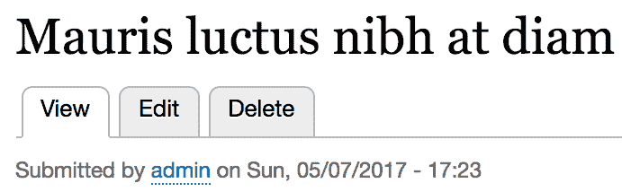
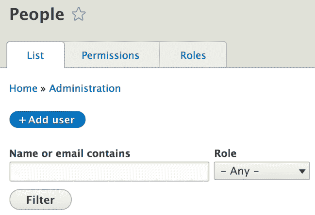
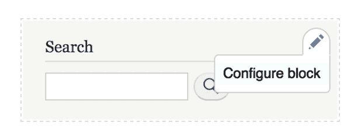
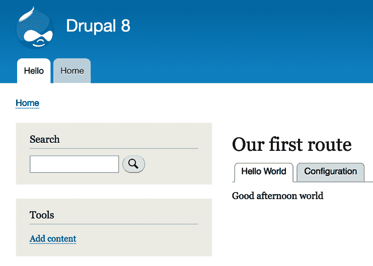
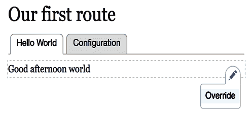

# 菜单和菜单链接

导航是任何网络应用的重要组成部分。能够轻松创建菜单和链接以连接页面是任何内容管理系统的一个核心方面。Drupal 8 完全配备了网站构建能力和开发者 API，可以轻松构建和操作菜单和链接。

在本章中，我们将从 Drupal 8 模块开发者的角度讨论菜单和菜单链接。在这样做的时候，我们将涉及几个关键方面：

+   Drupal 8 中菜单系统的总体架构

+   操作和渲染菜单

+   定义各种类型的菜单链接

到本章结束时，你应该能够理解什么是菜单和菜单链接，如何在你的代码中使用它们，以及如何在你的模块中定义菜单链接。那么，让我们开始吧。

# 菜单系统

在我们动手操作菜单和菜单链接之前，让我们简要谈谈菜单系统背后的总体架构。为此，我想谈谈其主要组件，一些关键参与者以及你应该查看的类。就像往常一样，没有一个伟大的开发者仅仅依靠书籍或文档来弄清楚复杂的系统。

# 菜单

菜单是由以下类表示的配置实体：`Drupal\system\Entity\Menu`。我在第一章，*为 Drupal 8 开发*中提到，Drupal 8 中有一种称为配置实体，我们将在本书的后面部分详细探讨。然而，目前来说，理解菜单可以通过 UI 创建并成为可导出的配置就足够了。此外，这个导出的配置也可以包含在一个模块中，以便在模块首次安装时导入。这样，一个模块可以附带自己的菜单。当我们谈到 Drupal 8 中不同类型的存储时，我们将看到这个后者的工作方式。现在，我们将使用与 Drupal 8 核心一起提供的菜单进行工作。

每个菜单可以有多个菜单链接，这些链接以树状结构组织，最大深度为 `9`。菜单链接的顺序可以通过 UI 或通过在代码中定义的菜单链接权重轻松完成。

# 菜单链接

在最基本层面上，菜单链接是基于 YAML 的插件（就像我们在上一章中看到的布局插件）。为此，常规菜单链接在`module_name.links.menu.yml`文件中定义，并且可以通过实现`hook_menu_links_discovered_alter()`由其他模块进行修改。当我提到常规时，我指的是那些进入菜单的链接。我们很快就会看到还有一些其他类型。

尽管在这个架构中有很多重要的类你应该检查：`MenuLinkManager`（插件管理器）和`MenuLinkBase`（菜单链接插件基类，并实现了`MenuLinkInterface`）。

菜单链接也可以是内容实体。通过 UI 创建的链接被存储为实体，因为它们被视为内容。其工作原理是，对于每个创建的`MenuLinkContent`实体，都会创建一个插件派生版本。我们正越来越接近高级主题，而这些主题可能还太早讨论。但简而言之，通过这些派生版本，对于每个`MenuLinkContent`实体，就好像创建了一个新的菜单链接插件，使后者表现得像任何其他菜单链接插件。这是一个非常强大的、特定于 Drupal 8 的系统。

菜单链接有许多属性，其中之一是路径或路由。当通过 UI 创建时，路径可以是外部或内部，也可以引用现有资源。当通过编程创建时，你通常会使用一个路由。

# 多种类型的菜单链接

我们之前讨论的菜单链接是显示在菜单中的链接。还有一些不同类型的链接出现在其他地方，但仍然被视为菜单链接，并且工作方式类似。

# 本地任务

本地任务，也称为标签页，是一组链接，通常显示在页面主要内容上方（取决于标签块放置的区域）。它们通常用于将处理当前页面的相关链接分组在一起。例如，在一个实体页面上，如节点详情页，你可以有两个标签页——一个用于查看节点，一个用于编辑它（也许还有一个用于删除它）；换句话说，本地任务：



本地任务会考虑访问规则，因此如果当前用户没有访问给定标签页的路由权限，则不会渲染该链接。此外，如果这意味着集合中只剩下一个链接可访问，那么该链接也不会被渲染，因为没有意义。所以，对于标签页，至少需要两个链接才能显示出来。

模块可以在`module_name.links.task.yml`文件中定义本地任务链接，而其他模块可以通过实现`hook_menu_local_tasks_alter()`来修改它们。

# 本地操作

本地操作是与给定路由相关的链接，通常用于操作。例如，在一个**列表**页面上，你可能有一个用于创建新列表项的本地操作链接，这将带你到相关的表单页面。

在以下屏幕截图中，我们可以看到一个用于在主要用户管理页面上创建新用户的本地操作链接：



模块可以在`module_name.links.action.yml`文件中定义本地操作链接，而其他模块可以通过实现`hook_menu_local_actions_alter()`来修改它们。

# 上下文链接

上下文链接由上下文模块用于在给定组件（一个渲染数组）旁边提供便捷的链接。你可能遇到过这种情况，比如在悬停于一个块上时，会看到一个带有下拉菜单的小图标，其中包含配置块的链接：



上下文链接与渲染数组相关联。实际上，任何渲染数组都可以显示之前定义的一组上下文链接。

模块可以在`module_name.links.contextual.yml`文件中定义上下文链接，而其他模块可以通过实现`hook_contextual_links_alter()`来修改它们。

# 菜单链接树

正如我在关于菜单的部分提到的，菜单链接是按层次存储在菜单中的。这个层次结构通过菜单链接树来表示。这里有几个关键角色我们需要了解。

我们有`MenuLinkTree`服务，它是用来加载和准备某个菜单树界面的接口。加载操作被延迟到`MenuTreeStorage`服务，该服务基于一个包含对加载的菜单链接应用某些限制的元数据的`MenuTreeParameters`对象来执行。我们稍后会看到一些这方面的例子。

`MenuLinkTree`服务输出的是一个`MenuLinkTreeElement`对象的数组。这些实际上是封装了`MenuLinkInterface`插件的值对象，并提供了一些关于它们在加载的树中的位置额外数据。其中一条重要信息是子树（位于其下的`MenuLinkTreeElement`对象的数组）。

# 菜单链接树操作符

当加载菜单链接树时，你会得到符合指定参数的整个树。然而，当使用该树时，你可能想要执行一些检查并删除某些项目。一个常见的例子是删除用户无权访问的菜单链接。这就是操作符发挥作用的地方。

`MenuLinkTree`服务有一个`transform()`方法，它根据一个操作符数组来改变树。后者以可调用对象的形式出现，通常是具有特定方法的服务名称。因此，实际的操作符是遍历树并对树项、它们的顺序等进行修改的服务。

# 菜单活动路径

菜单路径是一个菜单链接插件列表（数组），这些插件是菜单链接的父级。对于活动路径，特定的菜单链接代表当前路由（如果存在该路由的菜单链接）。

Drupal 8 的菜单系统还有一个服务，可以用来确定当前路由的活动路径，如果使用菜单链接的话。通过传递一个要查找的菜单名称，`MenuActiveTrail`服务返回一个包含所有父级插件 ID 的数组，直到菜单根，如果当前路由确实是一个活动链接。还有一个方法可以用来检查这一点：`getActiveLink()`。

# 渲染菜单

现在我们已经介绍了一些关于菜单系统的理论，是时候动手写一些代码了。我们将首先查看如何以在模块中渲染菜单的方式程序化地处理菜单。为此，我们将使用 Drupal 核心中默认的 **管理** 菜单，它包含许多链接，位于不同的级别。请注意，本节中编写的代码将不会包含在代码库中。

Drupal 核心提供了一个名为 `SystemMenuBlock` 的块，可以用来在块中渲染任何菜单。然而，让我们看看我们如何自己来做这件事。

我们需要做的第一件事是获取 `MenuLinkTree` 服务。我们可以注入它，或者，如果不可能，可以通过辅助 `\Drupal` 类静态地获取它：

```php
$menu_link_tree = \Drupal::menuTree(); 
```

接下来，我们需要创建一个 `MenuTreeParameters` 对象，以便我们可以使用它来加载我们的菜单树。我们可以以两种方式做到这一点。我们可以自己创建它并设置自己的选项，或者我们可以基于当前路由获取一个默认值：

```php
$parameters = $menu_link_tree->getCurrentRouteMenuTreeParameters('admin');  
```

提供菜单的名称（在我们的情况下，是“admin”），这个方法给我们一个设置了以下选项的 `MenuTreeParameters` 实例：

+   当前路由活动路径中的链接被标记为展开，即它们将显示在我们加载的结果树中。

+   活动路径中具有“展开”属性的链接的子链接也包括在结果树中。

实际上，这组参数给我们提供了一个在当前路由上下文中的树。换句话说，它将加载菜单中的所有根链接以及当前路由活动路径中的根链接的子链接。它将省略其他根链接的子链接。

你当然可以进一步自定义这组参数或从头开始创建一个。例如，如果我们只想加载菜单中根链接的树，我们可以这样做：

```php
$parameters = new MenuTreeParameters();
$parameters->setRoot($plugin_id);
```

在这个例子中，`$plugin_id` 是应该位于树根处的菜单链接的 ID（在 YAML 文件中定义或通过派生得到）。

我鼓励你查看 `MenuTreeParameters` 类，并探索你用于加载树的其他选项。

对于我们的示例，我们想要处理整个“管理”菜单的整个菜单树，因此只需实例化一个新的 `MenuTreeParameters` 对象就足够了，因为我们想要加载菜单中的所有链接。我们可以这样做：

```php
$tree = $menu_link_tree->load('admin', $parameters); 
```

现在，我们在 `$tree` 变量中有一个 `MenuLinkTreeElement` 对象的数组，其中包含，但不仅限于以下内容：

+   链接属性，即菜单链接插件

+   子树属性，它是一个包含 `MenuLinkTreeElement` 对象的数组，沿着树向下延伸

+   树中链接的各种元数据（深度、是否在活动路径中、是否有子链接、访问权限等）

然而，重要的是要注意，尽管我们可能有一些`MenuTreeParameters`，但我们现在位于该菜单的所有菜单链接的顶部，无论任何访问检查。确保我们不会渲染用户无权访问的链接是我们的责任（因为他们到达那里时会收到 403 错误）。为此，我们使用之前讨论过的操作器，这些操作器是服务上的简单方法。

Drupal 8 的菜单系统自带了一些默认操作器，可以在`DefaultMenuLinkTreeManipulators`服务中找到。大多数情况下，它们将对你足够用：

+   访问（由`checkAccess()`方法处理）：检查用户是否有访问树中链接的权限。如果没有，链接将变成`InaccessibleMenuLink`的一个实例，并且其子树中的任何链接都将被清除。

+   节点访问（由`checkNodeAccess()`方法处理）：检查用户是否有访问由菜单链接链接的节点实体的权限。如果你知道菜单有链接到节点，你可以在常规访问检查之前使用这个方法，因为它性能更好。

+   索引和排序（由`generateIndexAndSort()`方法处理）：在树中创建唯一的索引并按它们排序。

+   扁平化（由`flatten()`方法处理）：将菜单树扁平化到一级。

如果这些还不够，你可以根据需要添加自己的操作器。你所要做的就是定义一个具有公共方法的服务，然后在转换树时引用它。然而，说到转换，让我们继续使用访问检查操作器来确保当前用户可以访问我们的树形链接：

```php
$manipulators = [
  ['callable' => 'menu.default_tree_manipulators:checkAccess']
];
$tree = $menu_link_tree->transform($tree, $manipulators);
```

如我之前提到的，我们在服务上使用`transform()`方法，并传递一个可调用对象的数组。后者不过是服务名称，后面跟着`:`和要使用的方法名称（如上面代码所示）。因此，如果你创建了自己的服务，你可以用同样的方式引用它。

现在，树中剩余的每个`MenuLinkTreeElement`都具有其`access`属性填充了`AccessResultInterface`的一个实例（这是我们将在稍后章节中更多讨论的访问表示系统）。如果链接不可访问，它将变成`InaccessibleMenuLink`的一个实例，因此我们知道我们无法渲染它，即使我们渲染了它，它也会跳转到主页而不是 403。

现在，为了渲染树形结构，我们只需将这个树形结构转换成一个渲染数组：

```php
$menu = $menu_link_tree->build($tree);  
```

在`$menu`中，我们现在有一个使用`menu`主题钩子的渲染数组，其主题钩子建议基于菜单名称。在我们的例子中，它是`menu__admin`。记得这些是从上一章学到的吗？

`menu`主题钩子将使用`menu.html.twig`（或如果它位于主题中，则为`menu--admin.html.twig`）文件来渲染简单的、尽管是分层结构的 HTML 列表中的菜单链接。

作为对主题章节的快速回顾，到现在为止，你有几个选项可以完全控制菜单的输出：

+   创建一个新的主题钩子并模仿 `build()` 方法来构建渲染数组

+   修改主题注册表以替换模板

+   在主题内部覆盖模板

+   实现主题钩子的预处理器并更改那里的变量

因此，正如你所见，你有许多选项。你的选择取决于你需要实现什么，你对默认标记的满意度如何，等等。

# 与菜单链接一起工作

现在我们知道了如何加载和操作菜单链接树，让我们再谈谈常规的菜单链接。在本节中，我们将探讨我们的模块如何定义菜单链接，以及一旦我们从树或其他地方获取它们后，我们如何以编程方式与它们一起工作。

# 定义菜单链接

在我们的 *Hello World* 模块中，我们定义了一些路由，其中之一映射到 `/hello` 路径。现在让我们创建一个链接到该路径，该链接位于与 Drupal 核心一起提供的菜单中。

正如我提到的，菜单链接是在 `*.links.menu.yml` 文件中定义的。所以，让我们为我们的模块创建该文件，并在其中添加我们的菜单链接定义：

```php
hello_world.hello:
  title: 'Hello'
  description: 'Get your dynamic salutation.'
  route_name: hello_world.hello
  menu_name: main
  weight: 0
```

在典型的 YAML 表示法中，我们有机器名（在这种情况下，也是插件 ID）`hello_world.hello`，然后是其下面的相关信息。这些是你为菜单链接定义的最常见内容：

+   `title` 是菜单链接的标题，而 `description` 默认设置为结果链接标签的 `title` 属性。

+   `route_name` 指示此链接背后的路由。

+   `menu_name` 指示该菜单应位于其中；这是菜单的机器名。

+   `weight` 可以用来对菜单中的链接进行排序。

另一个常见的属性是 `parent`，它可以用来指示另一个菜单链接，当前链接应该是其子链接。因此，你可以构建层次结构。

一旦设置好，你应该清除缓存并检查菜单中的链接。你会注意到你可以编辑它，但由于它们在代码中定义，因此一些内容无法通过 UI 进行更改。

注意，由插件衍生创建的链接，例如在 UI 中创建的链接，具有以下格式的机器名（插件 ID）：

```php
main_plugin_id:plugin_derivative_id
```

`main_plugin_id` 是负责派生多个链接的菜单链接插件的 ID，而 `plugin_derivative_id` 是分配给每个单独的衍生品的 ID。例如，在 `MenuLinkContent` 实体的情况下，格式如下：

```php
menu_link_content:867c544e-f1f7-43aa-8bf7-22fcb08a4b50  
```

之前代码中的 UUID 实际上是菜单链接内容实体的 UUID，碰巧也是插件衍生 ID。

# 与菜单链接一起工作

我之前提到 `MenuLinkTreeElement` 对象封装了单个菜单链接，但如果你选择自己处理这些数据而不是依赖于 `menu` 主题钩子，你可以对这些对象进行哪些编程操作呢？让我们了解一下你可以做的几个常见操作。

首先，最重要的事情是访问菜单链接插件。你可以直接这样做，因为它是 `MenuLinkTreeElement` 的公共属性：

```php
$link = $data->link;  
```

现在，你可以使用 `$link` 变量，它是一个 `MenuLinkInterface` 的实例，而且通常是一个扩展了 `MenuLinkBase` 类的 `MenuLinkDefault` 实例。

因此，如果我们检查该接口，我们可以看到许多方便的方法。其中最常见的是我们之前在定义插件时看到的菜单链接定义的获取器。`getUrlObject()` 也是一个重要的方法，它将菜单链接的路径转换为我们已经知道如何使用的 `Url` 对象。如果菜单链接是在 UI 中创建的，它可能没有路由，只有路径，在这种情况下，此方法仍然可以根据该路径构建一个通用的 `Url` 对象。

如果你有一个不是来自你已经处理过访问的树的菜单链接，你可以在实际使用之前要求 `Url` 对象检查访问权限：

```php
$access = $url->access()  
```

如果链接没有路由，访问将始终返回 `TRUE`，因为这表示链接是外部的，或者在任何情况下都无法进行访问检查。我们将在单独的章节中详细讨论访问系统。

# 定义本地任务

现在，让我们通过回到我们的 *Hello World* 模块来查看如何定义本地任务链接的示例。在 `/hello` 页面上，让我们添加两个本地任务——一个用于常规的 `/hello` 页面，另一个用于可以更改问候语的配置表单。这是一个使用本地任务（标签页）的好例子，因为配置表单严格相关于页面上的内容，并用于对其进行更改。

正如我提到的，本地任务位于 `*.links.task.yml` 文件中。所以，让我们为我们的模块创建一个包含两个链接的文件：

```php
hello_world.page:
  route_name: hello_world.hello
  title: 'Hello World'
  base_route: hello_world.hello
 hello_world.config:
  route_name: hello_world.greeting_form
  title: 'Configuration'
  base_route: hello_world.hello
  weight: 100
```

如常，最上面的行是链接的机器名（插件 ID），我们下面有它们的定义。我们再次有一个 `route_name` 属性来指定这些链接应该去的路由，一个 `title` 属性用于链接标题，以及一个 `base_route`。后者是本地任务应该显示的路由。正如你所看到的，我们的两个链接都将显示在 `/hello` 页面上。`weight` 属性可以用来对标签页进行排序。

如果你清除缓存并访问那个页面（作为一个可以访问这两个路由的用户），你将能够看到以下两个标签页：



如果你以匿名用户身份访问，前面提到的原因会导致它们都不会显示。

# 定义本地操作

我们在 Hello World 模块中没有必要定义一个局部操作链接。所以，我们不妨看看一个真正有意义的例子。如果你导航到`admin/content`屏幕，你会看到`+ Add content`按钮。它看起来和我们在用户管理页面上看到的例子完全一样。这是一个针对这个路由的局部操作链接。`+`样式表示这些链接主要用于添加或创建与当前路由相关的新项目。

这个特定的局部操作链接定义在`node`模块内部的`node.links.action.yml`文件中，其外观如下：

```php
node.add_page:
  route_name: node.add_page
  title: 'Add content'
  appears_on:
    - system.admin_content
```

再次，我们有机器名（插件 ID）和定义。希望到现在为止，`route_name`和`title`对你来说已经很清晰了。不过，这里有一个新东西，那就是`appears_on`键，它用来指示这个操作链接应该显示在哪些路由（复数）上。所以，一个关键特性是，一个操作链接可以存在于多个页面上。

# 定义上下文链接

上下文链接比我们之前看到的链接类型要复杂一些，但对我们来说，没有什么太具挑战性的。让我们看看如何将上下文链接添加到我们的问候组件中，以便用户可以通过上下文链接导航到配置表单。

首先，我们需要创建`.links.contextual.yml`文件并定义链接：

```php
hello_world.override:
  title: 'Override'
  route_name: hello_world.greeting_form
  group: hello_world
```

这里没有太多复杂的东西。再次强调，我们有一个`title`链接和一个`route_name`。此外，我们还有一个`group`键，它表示这个链接将属于哪个组名。我们稍后会引用这个键。

接下来，我们需要修改我们的主题钩子模板文件，因为上下文链接是在所有主题钩子中可用的`title_suffix`变量中打印的，并且被各种模块用来向模板添加杂项数据。上下文模块就是这样一个例子。因此，我们需要打印出这个内容。现在它看起来是这样的：

```php
<div {{ attributes }}>
  {{ title_prefix }}
  {{ salutation }}
  
        <span class="salutation--target">{{ target }}</span>
  
  {{ title_suffix }}
</div>
```

你会注意到我们包括了`title_prefix`变量来保持事情的一致性。通常，这些变量会是空的，所以无需担心。

最后，是更复杂的一部分——这部分可能会在未来发生变化，但就目前而言，这是我们必须要走的步骤。

我们的`hello_world_salutation`主题钩子定义的是单个变量，而不是渲染元素。在这种情况下，在通用预处理器中，上下文模块会查看第一个定义的变量，以检查是否有定义上下文链接。对于使用渲染元素的主题钩子，它会检查那个元素。

这就是上下文链接定义在渲染数组中的样子，也是我们需要为我们的用例添加的内容：

```php
'#contextual_links' => [
  'hello_world' => [
    'route_parameters' => []
  ],
]
```

在这里，我们定义了`hello_world`组上下文链接应该在这里渲染。我们还指定了一个路由参数数组，在我们的情况下，它是空的。这是因为，通常，上下文链接就是这样的——上下文相关的，意味着它们通常与一个实体或具有 ID 的东西一起工作，并且其路由需要一个参数。因此，这就是我们可以提供的地方，因为我们已经看到，`*.links.contextual.yml`定义是静态和通用的。

`#contextual_links`属性实际上是一个渲染元素，它会被另一个渲染元素（`contextual_links_placeholder`）替换。后者在 HTML 中输出一个简单的文本占位符，它会被 JavaScript 替换为正确的链接。

因此，现在我们知道了如何使用上下文链接，让我们修改我们的 Hello World 问候组件以利用这一点。这就是它现在的样子：

```php
public function getSalutationComponent() {
  $render = [
    '#theme' => 'hello_world_salutation',
    '#salutation' => [
      '#contextual_links' => [
        'hello_world' => [
          'route_parameters' => []
        ],
      ]
    ]
  ];

  $config = $this->configFactory->get('hello_world.custom_salutation');
  $salutation = $config->get('salutation');

  if ($salutation != "") {
    $render['#salutation']['#markup'] = $salutation;
    $render['#overridden'] = TRUE;
    return $render;
  }

  $time = new \DateTime();
  $render['#target'] = $this->t('world');

  if ((int) $time->format('G') >= 00 && (int) $time->format('G') < 12) {
    $render['#salutation']['#markup'] = $this->t('Good morning');
    return $render;
  }

  if ((int) $time->format('G') >= 12 && (int) $time->format('G') < 18) {
    $render['#salutation']['#markup'] = $this->t('Good afternoon');
    return $render;
  }    

  if ((int) $time->format('G') >= 18) {
    $render['#salutation']['#markup'] = $this->t('Good evening');
    return $render;
  }
}
```

主要变化如下。首先，我们在顶部已经定义了`#salutation`变量并将其转换为渲染数组。正如你记得的那样，这些是高度可嵌套的。在这个渲染数组中，我们添加了我们的`#contextual_links`渲染元素。其次，每次我们需要设置下面问候字符串的值时，这次我们在`#markup`元素中这样做，因为，正如我们在上一章中看到的，我们需要一个属性来定义渲染数组如何渲染。

因此，现在如果你清除缓存并导航到`/hello`页面，你应该能够悬停在问候上并看到上下文链接图标弹出并包含我们的`Override`链接。当你点击链接时，你应该会跳转到问候**配置**表单，并注意 URL 中的`destination`查询参数：



目标查询参数被 Drupal 用来在用户在页面上提交表单后返回他们之前所在的页面。这是一个值得记住的技巧，因为它是一个非常流行的用户体验技术。

# 摘要

在这一章中，我们为使用菜单和菜单链接做了很多工作。我们首先对 Drupal 8 中菜单系统的架构进行了概述。我向你扔了很多类和钩子，因为我坚信，最好的学习方法是深入代码。

我们还看到了在 Drupal 8 中存在哪些类型的菜单链接。我们不仅有属于实际菜单的常规链接，还有各种其他实用链接系统，例如本地任务、本地操作和上下文链接。

然后，我们亲自动手，通过一个实际示例来了解如何在树中加载菜单链接，如何操作它们，最后将它们转换为渲染数组。在那之后，我们看了如何定义所有这些类型的菜单链接，以及如果我们需要以编程方式处理它们时如何理解它们。

在下一章中，我们将探讨任何内容管理系统框架最重要的一个方面——在 Drupal 8 中我们可以拥有的不同类型的数据存储以及如何与它们协同工作。
