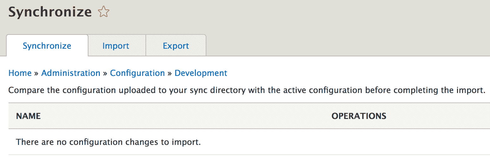
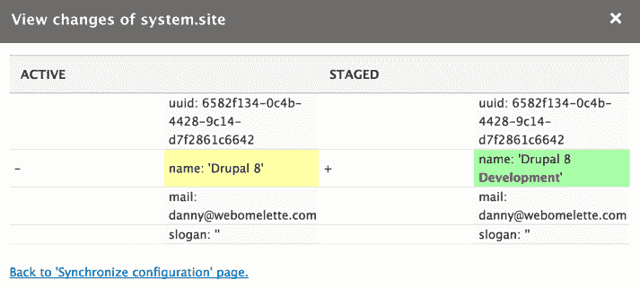
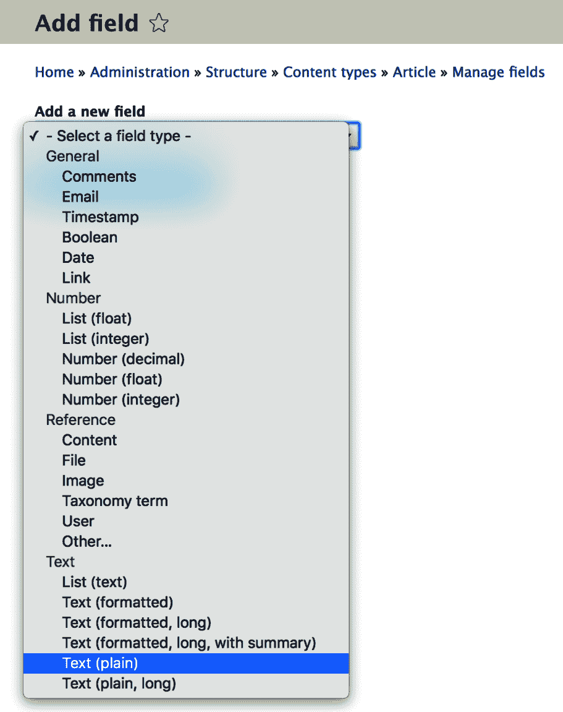
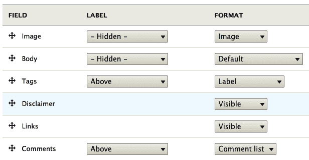

# 第六章：数据建模和存储

我们在这本书中已经完成了五个章节，但我们还没有涵盖与 CMS 主要目的之一——数据存储相关的话题。好吧，我们在上一章中提到了它，也在第二个示例中看到了配置对象的例子。然而，我们只是触及了可能性的表面。现在是时候深入探讨与如何在 Drupal 8 中存储数据相关的所有内容了。

在本章和下一章中，我们将讨论许多与存储和数据操作相关的内容，并在过程中查看许多示例。然而，本章的重点将更加理论化。有许多内容需要覆盖，因为有许多 API 和概念你需要理解。不过，我们仍将看到许多代码示例，以展示在实践中我们讨论的内容。然而，在下一章中，为了弥补这一点，我们将几乎完全使用代码，并构建一些功能。

然而，更具体地说，本章将分为三个主要逻辑部分（不一定由标题表示）。

首先，我们将讨论你的数据存储选项。我们将讨论状态系统及其键/值存储、tempstore、用户数据、配置，最后是实体——这个大问题。我们将不讨论缓存，因为它将在单独的章节中介绍。我们将看到所有这些选项的示例，并深入了解理解它们如何工作的必要架构细节。

第二，我们将深入探讨 Drupal 8 实体 API，以了解其背后的架构——数据是如何存储的，更重要的是，是如何建模的。在这里，我指的是`TypedData`系统。

最后，我们将探讨如何操作实体；换句话说，如何与它们一起工作并提取数据——基本上，是日常与实体的工作。这里的一个主要话题当然是查询和加载实体。此外，我们还将涵盖此过程的验证方面。

到本章结束时，你应该能够对 Drupal 8 中的存储有很好的理解，并能够根据你的需求做出选择哪个选项的决定。你会了解不同选项之间的差异以及使用一个而不是另一个的原因。此外，你将对实体 API 有一个很好的理解，这将反过来让你更容易地导航 Drupal 代码并与实体系统集成。最后，可能是 Drupal 开发者最常做的事情之一，你将能够与实体一起工作：执行 CRUD 操作、读取和写入字段值以及更多类似的事情。

那么，让我们开始吧。

# 不同类型的数据存储

存储和使用数据是任何（网络）应用的关键部分。如果没有某种方式持久化数据，我们就无法构建很多东西。然而，不同的数据用途需要不同的存储和操作系统。在本章的目的上，我将使用“数据”一词来表示几乎任何需要持久化到某个地方的东西，无论持续多长时间。

如果你已经在 Drupal 7 中进行了开发，你已经知道了几种存储数据的方法。我们有过实体（主要是节点实体类型，但也可以定义其他类型）；`variables` 表，这是一个相对简单的键/值存储；以及一个与数据库交互并执行我们想要的任何操作的 API。这导致了许多问题，如 API 之间缺乏一致性，以及过度依赖数据库进行配置存储。

在 Drupal 8 中，引入了各种分层 API 来处理数据存储的常见用例。这些新系统的优势体现在我们很少，如果有的话，甚至需要使用所有存储 API 的母亲——数据库 API。这是因为一切都被抽象成不同的层，帮助我们处理我们需要的绝大多数事情。因此，创建一个自定义表可能不再是存储你的数据的正确做法，尽管在 Drupal 7 中这确实是一种常见的做法。

# 状态 API

状态 API 是一种键/值数据库存储，是你在 Drupal 8 中存储数据的简单方式之一。其主要目的是允许开发者存储与系统状态（因此得名）相关的信息。由于系统的状态可以有多种解释，可以将此视为与当前环境（Drupal 安装）相关的简单信息，这些信息不是编辑性的（内容）。一个例子是 Cron 上次运行的时间戳或系统设置的任何标志或标记，以跟踪其任务。它与缓存不同，因为它不需要经常清除，并且只有设置它的代码负责更新它。

这个系统的主要特点之一是它并不是为人类交互而设计的。我的意思是，应用程序本身需要利用它。人类的选择是我们在稍后章节中将详细讨论的配置系统。

既然我们已经了解了状态 API，让我们深入技术细节，看看它是由什么构成的以及我们如何使用它。

状态系统围绕着 `Drupal\Core\State\StateInterface`，它提供了你与之交互所需的所有方法。这个接口由 `State` 服务实现，我们可以将其注入到你的类中，或者通过 `\Drupal::state()` 简写方式静态地使用。一旦我们有了这个接口，事情就变得非常简单，因为它会告诉我们确切可以做什么。

我们可以设置一个值：

```php
\Drupal::state()->set('my_unique_key_name', 'value'); 
```

或者我们可以获取一个值：

```php
$value = \Drupal::state()->get('my_unique_key_name');
```

我们还可以一次设置/获取多个值（多么方便！）：

```php
\Drupal::state()->setMultiple(['my_unique_key_one' => 'value', 'my_unique_key_two' => 'value']);
$values = \Drupal::state()->getMultiple(['my_unique_key_one', 'my_unique_key_two']);
```

难道不是很容易吗？我们还可以消除它们：

```php
\Drupal::state()->delete('my_unique_key_name');
\Drupal::state()->deleteMultiple(['my_unique_key_one', 'my_unique_key_two']);
```

这里有几个需要注意的地方：

+   首先，你选择的键名位于单个命名空间中，因此建议你在它们前面加上你的模块名称——`my_module.my_key`。这样你就可以避免冲突。

+   其次，你存储的值也可以比简单的字符串更复杂。你可以存储任何标量值，也可以存储对象，因为它们会自动进行序列化和反序列化。不过，请注意你打算存储的对象。

确保你放入那里的任何类化对象都能正确地进行序列化和反序列化。

到现在为止，你可能想知道这些值最终会去哪里。它们会进入 `key_value` 表，位于 `state` 集合的命名空间下。此外，这也很好地过渡到讨论支撑 State API 的底层系统：键/值存储。

注意，State 系统只是底层键/值存储框架的一个实现。如果你查看 `State` 服务，你会注意到它使用 `KeyValueFactoryInterface`（默认情况下由 `KeyValueDatabaseFactory` 实现）。这反过来又创建了一个键/值存储实例（默认情况下是 `DatabaseStorage`），它实现了与存储进行交互的公共 API。如果你查看数据库中的 `key_value` 表，你会注意到除了 *state* 之外还有其他集合。这些是针对各种子系统的特定实现，例如实体 API 和系统模式。猜猜看？你可以轻松编写自己的并根据自己的需求进行定制。然而，State API 被创建的原因是让模块开发者可以使用它。此外，它的有效用途涵盖了像键/值存储这样的需求的大部分。所以，你很可能不需要自己实现。

# TempStore

我们接下来要查看的系统是 *TempStore*（临时存储）。

TempStore 是一个键/值、会话类似的存储系统，用于在多个请求之间保持临时数据。想象一下多步骤表单或具有多个页面的向导，这些都是 tempstore 使用案例的绝佳例子。你甚至可以考虑“工作进度”，即尚未永久保存但保存在 tempstore 中，以便某个用户可以继续工作直到完成。TempStore 的另一个关键特性是条目可以有一个过期日期，届时它们会自动清除。所以用户最好快点。

存储 API 有两种类型：私有和共享。这两种之间的区别在于，第一种中条目严格属于单个用户，而第二种中它们可以在用户之间共享。例如，填写多步骤表单的过程属于单个用户，因此相关的数据必须对他们来说是私有的。然而，该表单也可以对多个用户开放，在这种情况下，数据可以在用户之间共享（相当不常见）或者用来触发一个锁定机制，阻止用户 B 在用户 A 编辑时进行更改（更常见）。所以，有很多选择，但我们很快就会看到一些示例。

首先，让我们看看这个系统中的一些关键参与者。

我们从`PrivateTempStore`类开始，它提供了处理私有临时存储的 API。它不是一个服务，因为为了使用它，我们必须通过`PrivateTempStoreFactory`来实例化它。因此，如果我们想使用它，我们必须将其注入到我们的类中。后者有一个`get($collection)`方法，它接受我们决定的集合名称，并为其创建一个新的`PrivateTempStore`对象。如果你仔细看，它使用的存储基于`KeyValueStoreExpirableInterface`，这与 State API 使用的`KeyValueStoreInterface`非常相似。唯一的区别是前者有一个过期日期，这允许自动删除旧条目。默认情况下，Drupal 8 中使用的存储是`DatabaseStorageExpirable`，它使用`key_value_expire`表来存储条目。

到目前为止，`SharedTempStore`与私有存储非常相似。它是通过`SharedTempStoreFactory`服务实例化的，默认使用相同的底层数据库存储。主要区别在于`key_value_expire`表中占用的命名空间，它由`user.shared_tempstore.collection_name`组成，而不是`user.private_tempstore.collection_name`。

此外，当请求工厂的`SharedTempStore`时，我们有传递一个所有者来检索它的选项。否则，它默认为当前用户（登录用户 ID 或匿名会话 ID）。此外，我们与之交互的方式及其目的，与任何其他事物相比，都存在差异。

那么，让我们看看我们如何与私有和共享的临时存储一起工作。

# 私有 TempStore

下面是我们刚才讨论的简单示例：

```php
/** @var \Drupal\Core\TempStore\PrivateTempStoreFactory $factory */
$factory = \Drupal::service('user.private_tempstore');
$store = $factory->get('my_module.my_collection');
$store->set('my_key', 'my_value');
$value = $store->get('my_key');
```

首先，我们获取`PrivateTempStoreFactory`服务，并请求它为我们选择的集合名称提供的存储。总是建议在前面加上你的模块名称以避免冲突。如果另一个模块将它们的集合命名为`my_collection`，那么这看起来可能不太美观（即使存储是私有的）。

接下来，我们使用非常简单的设置器和获取器来设置值，这与我们使用 State API 的方式相似。

如果你以用户 1（主要管理员用户）的身份运行此代码，你会在`key_value_expire`数据库表中注意到一个新的条目。集合将是`user.private_tempstore.my_module.my_collection`，而名称将是`1:my_key`。这是私有临时存储的核心原则：每个条目名称都以前缀形式包含创建条目时登录用户的 ID。如果你是一个匿名用户，它可能看起来像这样：`4W2kLm0ovYlBneHMKPBUPdEM8GEpjQcU3_-B3X6nLh0:my_key`，其中那个长字符串是用户的会话 ID。

条目值将比使用状态 API 更复杂。这次它将始终是一个序列化的`stdClass`对象，它包含我们设置的实际值（这本身可以是任何可以正确序列化的标量值或对象），所有者（用户或会话 ID），以及最后更新时间戳。

最后，我们有`expire`列，默认情况下，将从条目创建的那一刻起持续一周。这是一个“全局”时间范围，作为参数设置在`user.services.yml`定义文件中，如果你想要的话，可以在你自己的服务定义文件中更改它。然而，它仍然是全局的。

我们也可以这样删除条目：

```php
$store->delete('my_key'); 
```

我们还可以读取关于条目的信息（最后更新日期，所有者）：

```php
$metadata = $store->getMetadata('my_key'); 
```

这将返回包装条目值的`stdClass`对象，但不包含实际值。

# 共享 TempStore

现在我们已经看到了私有临时存储的工作方式，让我们看看共享存储。为了与之交互，我们首先需要使用工厂创建一个新的共享存储：

```php
/** @var \Drupal\Core\TempStore\SharedTempStoreFactory $factory */
$factory = \Drupal::service('user.shared_tempstore');
$store = $factory->get('my_module.my_collection');
```

然而，与私有临时存储不同，我们可以将用户标识符（ID 或会话 ID）作为`get()`方法的第二个参数传递，以检索特定所有者的共享存储。如果我们不这样做，它默认为当前用户（登录或匿名）。

然后，我们存储/读取条目的最简单方法与之前相同：

```php
$store->set('my_key', 'my_value');
$value = $store->get('my_key');
```

现在，如果我们快速跳转到数据库，我们可以看到值列与之前相同，但集合反映了这是一个共享存储，并且键不再以前缀形式包含所有者。这是因为其他用户如果愿意，也应该能够检索条目。并且原始所有者可以通过检查条目的元数据来确定：

```php
$metadata = $store->getMetadata('my_key'); 
```

此外，我们可以像删除私有存储一样删除它：

```php
$store->delete('my_key'); 
```

好的。然而，我们还能用共享存储做些什么，而其他存储做不到的呢？

首先，我们有两种额外的方式可以设置一个条目。如果我们还没有设置它，我们可以设置它：

```php
$store->setIfNotExists('my_key', 'my_value'); 
```

或者，如果它不存在或属于当前用户（即用户拥有它），我们可以设置它：

```php
$store->setIfOwner('my_key', 'my_value'); 
```

这两种方法都将返回一个布尔值，指示操作是否成功。本质上，它们很方便用于检查冲突。例如，如果你有一个多个用户都可以编辑的大块配置，你只能在它不存在的情况下创建存储正在进行的工作的条目，或者如果它存在且当前用户拥有它（虚拟地覆盖他们自己的先前工作，这可能是可以接受的）。

然后，你还有`getIfOwner()`和`deleteIfOwner()`方法，你可以使用这些方法来确保你只使用或删除属于当前用户的条目。

所有这些麻烦，究竟是为了什么？为什么不直接使用私有存储呢？这是因为，在许多情况下，一个流程只能由一个人同时处理。所以，如果有人开始处理它，你需要知道这一点，以防止其他人同时处理，但更重要的是，你可以允许某些用户在“没有完成就回家”的情况下“踢出”先前的用户从流程中。然后他们可以继续或者清除所有更改。这一切都取决于你的使用场景。

此外，作为一个最后的要点，共享的临时存储也使用与私有存储相同的过期系统。

# Tempstore 结论

因此，我们有两种不同但相似的临时存储，你可以用于各种情况。如果你需要存储在多个请求中可供用户使用但对他们来说是私有的会话数据，你可以使用`PrivateTempStore`。或者，如果这些数据需要同时被多个用户使用，或者相反，防止多个用户同时工作，你可以使用`SharedTempStore`。

它们两者都有一个易于理解的 API，具有简单的方法，你可以根据自己的需求灵活地创建自己的集合。

# UserData

现在，我想简要地谈谈另一个由用户模块提供的特定用户存储选项，称为*UserData*。

UserData API 的目的在于允许存储与特定用户相关的某些信息片段。其概念与 State API 类似，即存储的信息类型不是应该导出的配置。换句话说，它是特定于当前环境的（但属于特定用户，而不是系统或子系统）。

用户是内容实体，可以具有各种数据类型的字段。这些字段通常用于与用户相关的结构化信息，例如，一个名字和一个姓氏。然而，如果你需要存储更不规则的东西，比如用户偏好或标记一个特定用户已经做了某事，UserData 是一个很好的地方来存储这些信息。这是因为信息要么不是结构化的，要么不是打算由用户自己管理的。那么，让我们看看它是如何工作的。

UserData API 由两部分组成——`UserDataInterface`，其中包含我们可以用来与之交互的方法（以及开发者文档），以及`UserData`服务，它实现了它并且可以被客户端代码（我们）使用：

```php
/** @var \Drupal\user\UsedDataInterface $userData */
$userData = \Drupal::service('user.data');
```

现在，我们已经准备好在界面上使用这三个方法：

+   `get()`

+   `set()`

+   `delete()`

所有这些方法的第一个三个参数都是相同的：

+   `$module`: 在我们模块名称的特定命名空间中存储数据，从而防止冲突

+   `$uid`: 将数据与特定用户关联——不一定是当前用户

+   `$name`: 正在存储的条目名称

自然地，`set()` 方法也有 `$value` 参数，这是要存储的数据，它可以是一个标量值或可序列化的对象。

这些参数共同构成了一个非常灵活的存储系统，与 Drupal 7 选项相比有了很大的改进。对于单个模块，我们可以为特定用户存储多个条目，而且这还远不止于此。由于这是可能的，许多这些参数都是可选的。例如，我们可以一次性获取特定模块的所有条目，或者一次性获取特定模块和用户组合的所有条目。删除条目也是如此。但所有这些数据都去哪里了呢？

用户模块定义了 `users_data` 数据库表，其列基本上映射到这些方法的参数。额外的 `serialized` 列用于指示存储的数据是否已序列化。此外，在这个表中，可以为特定用户存在多个记录。

关于 UserData API 就这么多要说的。明智地使用它。现在，是时候转向配置 API 了，它是 Drupal 8 中最大的子系统之一。

# 配置

配置 API 是 Drupal 8 开发者需要理解的最重要的话题之一。它有许多方面与其他子系统相关联，因此能够正确地使用和理解它是至关重要的。

在这一小节中，我们将详细介绍配置系统。我们首先了解什么是配置以及它通常用于什么。然后，我们将探讨在 Drupal 8 中管理配置的不同选项，无论是作为网站构建者还是使用 Drush 命令的开发者。接下来，我们将讨论配置是如何存储的、它属于哪里以及如何在系统中定义。我们还将介绍一些可以在不同级别覆盖配置的方法。最后，我们将探讨如何以编程方式与简单的配置进行交互。那么，让我们从简介开始。

# 简介

配置是应用程序正常运行所依赖的数据。它是那些描述事物应该如何行为的信息片段，有助于控制代码的执行。换句话说，它配置系统以特定方式运行，同时期望它也可以以不同的方式运行。为此，配置可以简单到只是一个开关（打开或关闭某个功能），也可以复杂到包含数百个参数，描述整个流程。

Drupal 8 的配置系统在 Drupal 世界中可以说是一场革命。这不仅仅是一个改进——这是一种全新的思考管理配置的方式。在此之前，几乎可以说没有配置管理可言。所有内容都以一种使得无法正确和一致地部署 Drupal 所知的多项配置选项的方式存储在数据库中。是的，有 Features 模块和 Ctools 可导出功能，但它们的存在恰恰凸显了缺乏一致性，这也给许多 Drupal 开发者带来了不少麻烦。

在 Drupal 8 中，整个系统已经被彻底改造成一个定义明确且一致的子系统，任何需要配置的小事都可以依赖它。我绝不敢称它完美；它仍然有其不足之处，并且正在进行改进，以使其更好，并创建处理特定配置流程的工具。然而，它已经使得管理和部署配置变得容易得多。

# 配置有什么用？

在 Drupal 8 中，配置用于存储需要在不同环境之间同步的所有内容（例如，从开发到生产）。因此，它与迄今为止我们所看到的其他类型的数据存储不同，它们是特定于一个环境的。

另一种看待配置的方式是通过考察传统网站构建者的角色。他们通常会导航用户界面并配置网站以特定方式运行——在主页上显示这个标题，使用这个标志，在主页上显示这种类型的内容，等等。正如我们提到的，他们交互的结果会转化为网站构建者期望能够轻松迁移到验收环境的配置，最终到达生产环境。

一些配置实际上对应用程序的正确运行至关重要。某些代码在没有使用其值的参数的情况下可能会出错。例如，如果没有设置全局电子邮件地址，系统将使用什么电子邮件发送自动邮件给用户？因此，许多这些配置参数都带有合理的默认值（在安装时）。然而，这也表明配置是应用程序的一部分，与实际代码一样重要。

# 管理配置

正如我们很快就会看到的，Drupal 为了性能原因将配置数据存储在数据库中，但它使所有数据都可以导出到 YAML 文件。因此，管理它的典型流程将包括您在 UI 中进行更改，导出配置，将其添加到 Git 中，并将代码部署到下一个环境。在那里，只需导入代码中的内容即可。

导入、导出和同步可以通过 Drush 和 UI 中的 `admin/config/development/configuration` 进行：



典型的流程是将活动网站配置与 YAML 文件中的配置同步。这意味着将所有与数据库中配置不同的 YAML 文件中的配置导入到数据库中。这些 YAML 文件位于配置 `sync` 文件夹中，应提交到 Git（您可以在 `settings.php` 文件中配置哪个目录应该是 `sync` 文件夹），相反，是将活动配置导出到 YAML 文件中，以便将其提交到代码中。

UI 只允许第一个选项（将 YAML 文件中的内容与数据库同步），但它提供了一个很好的 Diff 界面，以查看 YAML 与数据库相比有什么不同：



在此屏幕截图中，我们可以看到 YAML 文件包含站点名称配置的一小部分更改。点击“导入全部”将使数据库与 YAML 文件保持一致。

第一次安装 Drupal 8 网站时，配置 `sync` 文件夹将是空的。您需要手动导出所有活动配置并将其放置在那里。您可以通过 UI 手动导出或通过 Drush 来完成此操作：

```php
drush config-export
```

每当您通过 UI 进行配置更改并希望将其导出到 YAML 文件时，您都会执行此步骤。

然后，您可以在 UI 中同步，就像我们看到的，或者通过以下命令通过 Drush 进行同步：

```php
drush config-import
```

作为 Drupal 开发者，您将主要使用这两个 Drush 命令。

除了整个配置项集之外，您还可以通过复制粘贴来导入/导出单个配置项。但请注意，某些依赖项可能不允许您这样做。然而，如果您想快速在其他环境中看到某些内容生效，这很有用，但如果滥用这种方法，它不会为基于版本控制的流程提供良好的解决方案。

# 不同的配置类型

Drupal 8 提供两种不同的配置类型——简单配置和配置实体。让我们看看它们之间的区别。

简单配置是存储基本数据的一种类型，通常由整数或字符串等标量值表示。另一方面，配置实体更复杂，并使用与内容实体相同的 CRUD API。

通常，简单的配置项是独一无二的。例如，一个模块可以创建和管理一个配置项，该配置项可以启用或禁用其功能之一。很可能，这个模块需要这个配置来知道它应该对这个功能做什么。然而，即使它不需要，它仍然是一个与该功能相关的单一项目。

配置实体，另一方面，是同一配置类型的多个实例。例如，视图是一个配置实体，一个特定的站点可以有无限数量的视图。它甚至可以没有视图。当我们讨论一般实体时，我们将更详细地讨论配置实体。

# 配置存储

配置基本上存储在两个地方：

+   默认情况下，活动存储（在数据库中）

+   同步存储（默认为 YAML 文件）

这里是一个简单的配置 YAML 文件的示例：

```php
my_string: 'Hello!'
  my_int: 10
  my_boolean: true
  my_array:
    my_deep_string: 'Yes, hello!'
```

这个文件的名称是由你需要与配置 API 一起使用的 ID 给出的。

除了实际数据之外，你可以在`dependencies`键下列出这个配置项所依赖的内容：

```php
dependencies:
  module:
    - views
  theme:
    - bootstrap
  config:
    - system.site
```

有三种类型的依赖项：模块、主题和其他配置项。

如果你记得在第二章，*创建您的第一个模块*，我们创建了一个具有`hello_world.custom_salutation` ID 的配置对象，并在其中存储了一个简单的值：

```php
salutation: 'Whatever the user set in the form' 
```

我们通过表单程序化地这样做，并没有提供 YAML 文件。这意味着我们用于显示问候语的代码不依赖于这个配置项的存在或具有某种类型的值。如果我们的代码必须工作，我们可以在模块安装时创建它。有两种方法可以实现这一点。

最常见的方式是静态的。在一个模块的`config/install`文件夹中，我们可以有在模块安装时被导入的 YAML 配置文件。然而，如果我们需要设置的配置值是未知的（它们需要动态检索），我们可以在`hook_install()`实现中这样做（还记得第三章，*日志和邮件*？）。在那里，我们可以尝试获取我们的值并创建包含它的配置对象。

注意，如果模块的`config/install`文件夹中的配置存在未满足的依赖项，即它们所依赖的任何内容在系统中不存在，那么在安装模块时，这些配置将不会被导入；也就是说，模块本身将无法安装。

作为额外的好处，您还可以提供配置文件与模块一起，只有当它们的依赖项满足时才导入。换句话说，这是可选的配置。如果这些配置的依赖项未满足，模块将正确安装，但不会包含这些配置。此外，如果后来依赖项得到满足，这些可选配置也会自动导入。然而，请记住，可选配置仅限于配置实体，因为它与简单配置无关。

# 模式

为了让各种系统能够正确地与配置项交互，引入了配置模式。模式是一种定义配置项并指定它们存储的数据类型的方式，无论是字符串、布尔值、整数等等。当然，它们以 YAML 格式表示，并位于模块的 `config/schema` 文件夹中。

配置需要模式定义有三个主要原因：

+   **多语言支持**：正如我们稍后将要看到的，Drupal 8 中的配置是可翻译的。然而，为了知道配置的哪些部分需要或可以翻译，引入了模式系统以提供这一额外的层。这样，与贡献模块一起提供的配置项可以在 [localize.drupal.org](https://localize.drupal.org/) 网站上获得自己的翻译。此外，模式识别哪些配置位可以翻译，这使用户能够在用户界面中提供翻译。

+   **配置实体**：配置实体需要模式定义，以便在持久化层中正确识别需要与其一起导出的数据类型。此外，模式也用于验证配置实体。

+   **类型转换**：配置模式确保配置 API 能够始终正确地将值转换为它们正确的数据类型。

让我们看看 Drupal 核心提供的配置示例，以了解模式是如何工作的，即由 `System` 模块提供的 `system.mail` 配置。记住在 第三章，*日志和邮件*，我们讨论了如何控制用于发送电子邮件的邮件插件？默认情况下，它看起来是这样的：

```php
interface:
  default: 'php_mail'
```

它是一个非常简单的多维数组。因此，如果我们现在查看 `system.schema.yml` 文件中的模式定义，我们将找到与系统模块一起提供的所有配置项的定义。顶级行代表配置项的名称，因此如果我们向下滚动，我们将找到 `system.mail`：

```php
system.mail:
  type: config_object
  label: 'Mail system'
  mapping:
   interface:
     type: sequence
     label: 'Interfaces'
     sequence:
       type: string
       label: 'Interface'
```

如果我们忽略模式比实际配置大五倍这一讽刺之处，我们可以很好地理解这个配置项的实质。更重要的是，Drupal 本身也能做到这一点。

我们可以看到 `system.mail` 配置是 `config_object` 类型。这是配置的两种主要类型之一，另一种是 `config_entity`。`label` 键用于表示此项目的可读名称，而 `mapping` 键包含其单个元素的定义。我们可以看到 `interface` 有标签“接口”和类型 `sequence`。后者是一个特定的类型，表示一个数组，其中键不重要。每当我们要考虑键时，我们将使用 `mapping`（如在此架构定义的最高级别所做的那样）。由于我们正在查看 `sequence` 类型，因此它内部的单个项目也被定义为具有自己标签的字符串类型。

现在我们为之前看到的示例配置文件编写我们自己的架构定义：

```php
my_string: 'Hello!'
my_int: 10
my_boolean: true
my_array:
  my_deep_text: 'Yes, hello, is anybody there?!'
```

如果这个配置位于名为 `my_module.settings.yml` 的文件中，这将是对应的架构定义：

```php
my_module.settings:
  type: config_object
  label: 'Module settings'
  mapping:
     my_string:
       type: string
       label: 'My string that can also be of type text if it was longer'
     my_boolean:
       type: boolean
       label: 'My boolean'
     my_array:
        type: mapping
        label: 'My array in which the keys are also important, hence not a sequence'
        mapping:
          my_deep_text:
            type: text
            label: 'My hello string'
```

作为额外信息，任何 `config_object` 类型的配置都继承了以下属性：

```php
langcode:
  type: string
  label: 'Language code'
```

这有助于多语言系统，并邀请我们为每个配置项添加一个 `langcode` 属性。

我们迄今为止看到的大多数属性都是 `type`，`label`，`mapping` 和 `sequence`。还有两个你应该注意的：

+   `translatable`：非常重要，因为它表示一个类型是否可以被翻译。默认情况下，`text` 和 `label` 类型已经设置为可翻译，所以你不需要自己进行设置。

+   `nullable`：表示值是否可以留空。如果缺失，则被视为必需。

这里有一些你可以用来定义配置的类型：

+   标量类型：`string`，`integer`，`boolean`，`email`，`float`，`uri`，`path`

+   列表：`mapping`，`sequence`

+   复杂（扩展标量类型）：`label`，`path`，`text`，`date_format` 等。

确保你查看 `core.data_types.schema.yml` 文件，其中定义了所有这些内容。

在我们继续之前，让我们确保我们为我们在第二章，“创建你的第一个模块”中程序化创建的配置项创建配置架构，即存储覆盖问候信息的那个。因此，在 *Hello World* 模块的 `/config/schema` 文件夹中，我们可以有 `hello_world.schema.yml` 文件，内容如下：

```php
hello_world.custom_salutation:
  type: config_object
  label: 'Salutation settings'
  mapping:
   salutation:
     type: string
     label: 'The salutation message'
```

这解决了我们之前在不知道配置架构的情况下引入的一些技术债务。

# 覆盖

我们看到配置存在于配置文件中，但实际上应该属于组织良好且描述清晰的 YAML 文件中。为了使 YAML 文件中的配置能够使用，它们需要被导入——无论是通过同步还是对于由模块提供的配置，在模块安装时进行导入。因此，这意味着数据库仍然保留着活动的配置。

为了使事情更加动态，配置 API 还提供了一个覆盖系统，我们可以通过这个系统在各个级别上动态覆盖活动配置。在 Drupal 7 中，这是通过全局`$conf`变量完成的，但这也是不幸地将覆盖泄露到实际配置池中的方法。在 Drupal 8 中，情况不再是这样，我们还可以在三个不同的层级上覆盖配置（全局、模块和语言覆盖）。

配置 API 会考虑到这些覆盖，以防止它们意外地泄露到活动配置中。当我们讨论如何与配置 API 交互时，我们将看到示例。

# 全局覆盖

在 Drupal 8 中，我们仍然可以通过全局变量来获得这种可能性，这次称为`$config`。这个变量在`settings.php`文件中可用于网站范围的覆盖，但你也可以在模块内部使用它（如果你真的需要的话！）以覆盖特定的配置：

```php
global $config;
$config['system.maintenance']['message'] = 'Our own message for the site maintenance mode';
```

在这个例子中，我们动态地更改了用于网站维护模式的消息。你为什么要这样做并不重要，但你可能有一些其他配置可以从这种覆盖中受益。无论如何，你注意到了我们使用的数组表示法。第一个键是配置项的名称（文件名减去`.yml`扩展名），然后是我们配置文件中个别元素的键。如果它是嵌套的，我们将进一步遍历。

全局配置覆盖是一个很好的地方，你可以使用特定环境或敏感数据，例如 API 密钥。这类信息绝不应该导出到同步存储中。相反，你可以在模块中定义一个配置对象，并在没有值的情况下安装它。然后，使用全局覆盖，你可以提供针对相关环境的特定值。

# 模块覆盖

虽然你可以简单地使用全局`$config`数组，但这并不是模块应该修改的地方。首先，因为它是一个全局变量，改变全局变量从来不是一个好主意，它应该留给`settings.php`文件。其次，因为没有办法控制多个模块以相同方式修改它的优先级。相反，我们有模块覆盖系统可以使用。

通过模块覆盖，我们可以创建一个带有`config.factory.override`标签的服务（记得标签化服务是什么吗？）在这个服务中处理我们的覆盖。为了举例，让我们使用这个系统来覆盖维护模式消息。在我们的 Hello World 模块中，我们可以有以下服务类：

```php
namespace Drupal\hello_world;

use Drupal\Core\Cache\CacheableMetadata;
use Drupal\Core\Config\ConfigFactoryOverrideInterface;
use Drupal\Core\Config\StorageInterface;

/**
 * Overrides configuration for the Hello World module.
 */
class HelloWorldConfigOverrides implements ConfigFactoryOverrideInterface {

  /**
   * {@inheritdoc}
   */
  public function loadOverrides($names) {
    $overrides = [];
    if (in_array('system.maintenance', $names)) {
      $overrides['system.maintenance'] = ['message' => 'Our own message for the site maintenance mode.'];
    }

    return $overrides;
  }

  /**
   * {@inheritdoc}
   */
  public function getCacheSuffix() {
    return 'HelloWorldConfigOverrider';
  }

  /**
   * {@inheritdoc}
   */
  public function createConfigObject($name, $collection = StorageInterface::DEFAULT_COLLECTION) {
    return NULL;
  }

  /**
   * {@inheritdoc}
   */
  public function getCacheableMetadata($name) {
    return new CacheableMetadata();
  }
}
```

在这里，我们必须实现`ConfigFactoryOverrideInterface`接口，该接口包含四个方法：

+   在`loadOverrides()`中，我们提供我们的覆盖配置值。

+   在`getCacheSuffix()`中，我们返回一个简单的字符串，用于我们覆盖的静态缓存标识符。

+   在 `createConfigObject()` 方法中，我们实际上并没有做任何事情，但我们可以创建一个配置 API 对象，该对象将在安装或同步过程中使用。

+   在 `getCacheableMetadata()` 方法中，我们返回与我们的覆盖相关的任何缓存元数据。我们没有这样的元数据，所以我们返回一个空对象。

由于这是一个服务，我们可以注入依赖项并在需要计算覆盖时使用它们。根据这个计算，设置一些适当的缓存元数据可能变得很重要，但我们将另章介绍缓存。

接下来，我们将此注册为带标签的服务：

```php
 hello_world.config_overrider:
   class: \Drupal\hello_world\HelloWorldConfigOverrides
   tags:
     - {name: config.factory.override, priority: 5}
```

我们将优先级设置为 5，这样我们就可以控制模块覆盖配置的顺序。优先级高的将优先于优先级低的。

就这些了。清除缓存将注册此服务并更改我们的配置。如果你现在将站点置于维护模式，你会注意到显示的消息就是我们在这里设置的。然而，如果你转到 `admin/config/development/maintenance` 的维护模式管理页面，你仍然会看到原始消息。这是为了防止管理员意外地将覆盖值保存到配置存储中。

# 语言覆盖

尽管我们还会进一步讨论 Drupal 8 的多语言特性，但让我们简要地提一下语言覆盖的可能性。

如果我们启用配置翻译并添加更多语言到我们的站点，我们可以翻译可翻译的配置项（如它们的模式所描述）。在这样做的时候，我们正在覆盖特定语言的默认配置，这个覆盖将被存储在配置存储中，并可以导出为 YAML 文件。所以这是一种可导出的覆盖类型。

即使不在特定的语言环境中，我们也可以编程式地使用这个覆盖。以下是一个示例代码，假设我们有一个针对维护模式消息的法语覆盖，并且我们想使用它：

```php
$language_manager = \Drupal::service('language_manager');
$language = $language_manager->getLanguage('fr');
$original_language = $language_manager->getConfigOverrideLanguage();
$language_manager->setConfigOverrideLanguage($language);
$config = \Drupal::config('system.maintenance');
$message = $config->get('message');
$language_manager->setConfigOverrideLanguage($original_language);
```

这看起来有点复杂，但实际上并不复杂。首先，我们加载语言管理器服务并获取我们语言的 `Language` 对象（我们想要获取覆盖值的语言）。然后，我们跟踪原始配置覆盖语言（这基本上是当前语言），但同时也将法语设置为后续要使用的语言。最后，我们加载 `system.maintenance` 配置对象，在语言管理器上恢复原始语言之前，读取其法语消息。这是一种快速展示我们可以通过临时切换语言环境来实现配置覆盖的方法。而且这将是我们以不同于当前语言的方式加载配置实体的方式。

# 优先级

我们有三个配置覆盖层：全局、模块和语言。这实际上是它们实际优先级的顺序。全局覆盖优先于其他所有内容，而模块覆盖优先于语言覆盖。这就是为什么如果我们已经在模块中覆盖了`system.maintenance`配置，我们无法在我们的代码中使用语言覆盖。所以，请记住这一点。

# 与简单配置交互

既然我们已经讨论了 Drupal 8 配置 API 是什么，它用于什么，如何管理和存储它，以及一些覆盖它的选项，现在是时候讨论 API 本身以及我们如何与之交互了。在本节中，我们将仅关注简单配置，因为我们将在介绍所有实体时更多地讨论配置实体。

在第二章“创建您的第一个模块”中，我们已经通过`SalutationConfigurationForm`对配置 API 有所了解，我们在其中存储和读取了一个简单的配置值。现在是时候深入理解 API 并查看一些更多示例，了解我们如何使用它。

表示简单配置的类是`Drupal\Core\Config`，它围绕单个配置项中找到的数据进行包装。此外，它还处理了之前提到的所有必要的与底层存储系统交互操作，以便持久化配置（默认情况下存储到数据库中）。此外，它自动处理我们之前讨论的覆盖。

我们经常与之打交道的`Config`的一个重要子类是`ImmutableConfig`。它的目的是防止对配置对象进行更改，因此它适用于只读用途。

我们获取这些类实例的方式是通过`ConfigFactory`服务，该服务有两个方便的方法用于获取配置对象：

```php
/** @var \Drupal\Core\Config\ConfigFactoryInterface $factory */
$factory = \Drupal::service('config.factory');
$read_only_config = $factory->get('hello_world.custom_salutation');
$read_and_write_config = $factory->getEditable('hello_world.custom_salutation');
```

`get()`方法返回一个只读的`ImmutableConfig`对象，而`getEditable()`方法返回一个`Config`对象，也可以用于更改配置值。我们通过`set()`和`save()`方法来完成这项操作：

```php
$read_and_write_config->set('salutation', 'Another salutation');
$read_and_write_config->save();
```

非常简单。我们还有`setData()`方法，它允许我们一次性更改配置项的全部数据。作为参数，它期望一个值关联数组。

提示：如果您无法注入`ConfigFactory`但必须依赖静态调用，`Drupal`类有一个直接加载配置对象的快捷方式：`$config = \Drupal::config('system.maintenance');`。`config()`方法接受配置名称作为参数，并返回一个`ImmutableConfig`对象。

读取数据时，我们有多种选择。我们可以从配置中读取一个元素：

```php
$value = $read_and_write_config->get('salutation'); 
```

如果元素是嵌套的，我们可以通过点`(.)`表示法向下遍历：

```php
$config = $factory->get('system.site');
$value = $config->get('page.403');
```

这将返回为 `system.site` 配置中的 403 页面设置的值。我们也可以通过不向 `get()` 方法传递任何参数来获取所有值，这将返回一个关联数组。

如果你还记得我们关于配置覆盖的讨论，默认情况下，`get()` 方法将返回通过模块或全局（或如果语言管理器为配置设置了不同的语言）覆盖的值。然而，如果我们想，我们也可以检索原始值：

```php
$config = $factory->get('system.maintenance');
$value = $config->getOriginal('message', FALSE);
```

`getOriginal()` 方法的第二个参数表示是否应用覆盖，默认情况下它是 `TRUE`。因此，这样我们就能获取到在活动存储中设置的配置值。

最后，我们还可以清除配置值或整个对象本身。例如，考虑以下代码：

```php
$config->clear('message')->save();
```

它将移除配置对象中的 `message` 键并保存不带该值的配置。或者，我们也可以完全移除它：

```php
$config->delete(); 
```

大概就是这样。这个 API 的强大之处也源于其简单性。

# 实体

我们终于到了讨论 Drupal 8 中最复杂、最稳健、最强大的数据建模和内容建模系统的点——实体 API。

实体自 Drupal 7 以来就存在了，当时它包含了一些类型，如节点、分类术语、用户、评论、文件等。然而，Drupal 核心只为定义实体和一致地加载它们提供了基本的 API。*实体 API* 贡献模块填补了很大的差距，并为实体提供了很多功能，使实体变得更加强大。但在 Drupal 8 中，这些原则（以及更多）作为稳健的数据建模系统的一部分包含在核心中。

实体 API 无缝集成到多语言系统中，以提供完全可翻译的内容和配置实体。这意味着你存储的大多数数据都可以轻松地翻译成多种语言。在 Drupal 7 中，这始终是一项艰巨的任务，需要超过 10 个贡献模块才能实现现在所拥有的功能。

因为关于实体有很多要讲的内容，所以在本节中，我们将从对实体系统的概述开始。但不用担心，在下一节，以及本章的结尾，我们将将其分解并讨论所有重要的方面。

# 内容与配置实体类型

让我们先确立一些基本术语，以避免后续的混淆：

+   实体是给定实体类型的实例。因此，我们可以有一个或多个某种类型的实体，后者是单个实体的蓝图。

+   实体类型可以分为两种：内容和配置。

在上一节中，我们简要讨论了配置实体。在那里，我们看到它们是某种特定**类型**配置的多个实例，而不是简单的配置，后者只有一组配置值。本质上，配置实体是可导出的配置值集合，它们继承了与内容实体相同的大量处理 API。

一些配置实体类型的示例：

+   视图：构成视图的一组配置值

+   图片样式：定义了在给定样式下图像需要如何被操作

+   角色：定义可以分配给用户的角色

内容实体，另一方面，是不可导出的，并且是我们可以在 Drupal 8 中建模和持久化数据的最重要方式。这些可以用于内容以及所有其他在您的业务逻辑中需要持久化但不需要部署到其他环境中的结构化数据。

一些内容实体类型的示例：

+   节点

+   评论

+   用户

+   分类术语

除了可导出方面，内容和配置实体之间的主要区别在于它们使用的字段类型。后者使用更简单的字段，这些字段的组合存储为数据库中的一个实体“记录”（并导出到 YAML）。内容实体字段在代码建模和持久化层（数据库）中都是复杂和结构化的。

此外，配置实体还缺少捆绑。捆绑是实体分类的另一种形式，位于内容实体类型之下。这意味着每个内容实体类型都可以有（但不一定有）一个或多个捆绑，可配置字段可以附加到这些捆绑上。而且为了避免给您带来更多困惑，捆绑实际上是配置实体本身，因为它们需要被导出，并且可以有多个。

实体 API 在存储数据类型方面非常灵活。内容实体类型包含多种不同的字段类型，用于各种形式的数据，从原始值到更复杂的数据，如日期或引用。

内容实体也可以被设置为可修订的。这意味着内容实体类型可以被配置为存储与变更过程相关的额外元数据的同一实体的旧版本。

在本节以及接下来的内容中，我将通过举例说明两种实体类型来展示实体的最常见功能：

+   节点：Drupal 核心中最丰富的内容实体类型，通常用作主要的内容建模实体类型

+   节点类型：定义节点捆绑的配置实体类型

在下一章中，我们将学习如何创建自己的。但有了这里的一切，那将是一件轻而易举的事情。

# 实体类型插件

实体类型以插件的形式注册到 Drupal 中。是的，又是这样。`Drupal\Core\Entity\Annotation\EntityType` 类是这些插件的基础注解类，你将主要看到两个子类（注解）：`ContentEntityType` 和 `ConfigEntityType`。这些用于分别注册内容和配置实体类型。

注解类映射到用于表示实体类型的插件类。这些插件的基础类是 `Drupal\Core\Entity\EntityType`，然后由另一个 `ContentEntityType` 和 `ConfigEntityType` 扩展。这些插件类用于在系统中表示实体类型，并且是查看我们可以在这些插件的注解中使用哪些数据的良好资源。快速浏览一下，我们就可以看到这两种类型之间的差异并不大。

实体类型的插件管理器是 `EntityTypeManager`，这是一个作为 Drupal 开发者你可能会与之交互最多的重要服务。除了我们稍后会看到的各种实用功能外，它还负责使用基于常规注解的发现方法管理实体类型插件。

节点实体类型定义在 `Drupal\node\Entity\Node` 中，在那里你会在类的顶部看到一个巨大的注解。另一方面，节点类型配置实体类型位于 `Drupal\node\Entity\NodeType` 中。你可以看到它们使用的注解之间的差异。

# 标识符

实体类型注解以一些关于它们的基本信息开始：ID、标签等。例如，考虑节点实体：

```php
  *   id = "node",
  *   label = @Translation("Content"),
  *   label_singular = @Translation("content item"),
  *   label_plural = @Translation("content items"),
  *   label_count = @PluralTranslation(
  *     singular = "@count content item",
  *     plural = "@count content items"
  *   ),
```

这些在系统中的多个地方被用来通过机器和可读名称正确地引用实体类型。

# 束

节点实体类型恰好有束，这也是为什么我们还有一个 `bundle_label` 属性的原因：

```php
bundle_label = @Translation("Content type"), 
```

我们可以通过它引用定义束配置实体类型的插件 ID 来推断出节点有束。

```php
bundle_entity_type = "node_type", 
```

哇，这就是节点类型的 `ConfigEntityType` 插件 ID。在其插件注解中，我们可以找到反向的 `bundle_of` 属性，它引用了节点实体类型。不用说，这并不是所有配置实体类型的强制要求，但用于那些作为内容实体束的实体类型。例如，`View` 配置实体类型就没有这个属性。

此外，我们还在节点插件注解中找到了配置束的路径：

```php
field_ui_base_route = "entity.node_type.edit_form",
```

这是一个为节点类型配置实体定义的路径。

如我之前提到的，束对于配置实体来说是不存在的。

# 数据库表

对于内容实体来说，另一个重要的信息是它们将用于存储的数据库表名：

```php
base_table = "node",
data_table = "node_field_data",
```

在这个例子中，`node` 表存储了关于实体（如 ID、uuid 或 bundle）的原始信息，而`node_field_data` 表则存储了单一且不可翻译的字段数据。否则，这些字段会自动拥有自己的数据库表。我将在稍后解释字段数据是如何存储的。

# 实体键

实体 API 定义了一套*键*，这些键在所有实体类型中都是一致的，并且可以通过这些键检索常见的实体信息。由于并非所有实体类型都需要存储这些数据的相同字段，因此可以在注释中进行映射：

```php
*   entity_keys = { 
*     "id" = "nid", 
*     "revision" = "vid", 
*     "bundle" = "type", 
*     "label" = "title", 
*     "langcode" = "langcode", 
*     "uuid" = "uuid", 
*     "status" = "status", 
*     "published" = "status", 
*     "uid" = "uid", 
*     "owner" = "uid", 
*   }, 

```

节点实体类型有一个相对全面的实体键示例。正如你所见，节点的唯一标识字段一直是`nid`。然而，系统内实体的通用标识符是`id`。因此，这里的映射有助于简化这个过程。

# 链接

每个实体类型都需要一系列系统需要了解的链接。例如，规范 URL、编辑 URL、创建 URL 等。对于节点实体，我们有以下链接：

```php
*   links = { 
*     "canonical" = "/node/{node}", 
*     "delete-form" = "/node/{node}/delete", 
*     "delete-multiple-form" = "/admin/content/node/delete", 
*     "edit-form" = "/node/{node}/edit", 
*     "version-history" = "/node/{node}/revisions", 
*     "revision" = "/node/{node}/revisions/{node_revision}/view", 
*     "create" = "/node", 
*   } 
```

与实体键一样，这些链接在所有实体类型中都是通用的（取决于它们启用的功能）。例如，所有实体类型都有一个规范 URL，API 允许根据定义快速找到它。

关于这些路径有一点需要注意，它们需要定义为路由。因此，你可以在`node.routing.yml`文件中找到它们（在那里你也可以找到由 NodeType 配置实体类型使用的路由）。不过，这些路由也可以动态定义，以防止重复。这可以通过使用路由提供者处理器来实现。我们将在稍后讨论处理器，并在下一章中看到一个具体的示例。如果你想知道节点链接缺失的路由在哪里，请查看注册它们的`NodeRouteProvider`。

# 实体翻译

实体在全局范围内都是可翻译的——就像 Drupal 8 中的大多数其他内容一样。为了标记一个实体类型为可翻译，我们只需要在插件注释中包含以下内容：

```php
translatable = TRUE, 
```

这使得实体类型能够利用所有多语言功能。然而，正如我们稍后将看到的，各个字段也需要声明为可翻译。

# 实体修订

在 Drupal 8 中，所有内容实体类型都可以通过最小努力实现可修订（并可发布）。由于节点是一个很好的例子，我们可以检查其构建方式以更好地理解这一点。

首先，注释需要包含存储修订的数据库表信息。这正好与之前看到的原始表相对应：

```php
revision_table = "node_revision",
revision_data_table = "node_field_revision",
```

其次，注释需要包含我们之前看到的修订 ID 和发布状态的实体键：

```php
*   entity_keys = { 
*     "revision" = "vid", 
*     "published" = "status", 
*   }, 
```

第三，在注释中还需要引用修订元数据键：

```php
*   revision_metadata_keys = { 
*     "revision_user" = "revision_uid", 
*     "revision_created" = "revision_timestamp", 
*     "revision_log_message" = "revision_log" 
*   },   
```

这些映射到修订表中的表列。为了确保创建所有必要的列，实体类型类应该扩展 `EditorialContentEntityBase`，它提供了为此所需的字段定义。但也要知道，这个基类已经实现了 `EntityPublishedInterface`，这使得实体类型可发布。

最后，实体字段本身不是自动可修订的，因此也需要在它们上设置一个标志。我们将在讨论字段时再次看到这一点。

# 配置导出

配置实体类型在其插件定义中有一些额外的选项，这些选项与实体的可导出性相关。默认情况下，许多配置实体字段都会被持久化和导出。然而，需要使用 `config_export` 属性来声明应包含在导出中的其他字段。例如，节点类型配置实体类型定义了以下内容：

```php
*   config_export = {
*     "name",
*     "type",
*     "description",
*     "help",
*     "new_revision",
*     "preview_mode",
*     "display_submitted",
*   }
```

请记住，如果没有这个定义，配置模式将用作后备来确定哪些字段需要持久化。如果配置实体类型没有模式（尽管它应该有），则不会持久化任何额外字段。

此外，配置实体类型有一个用于配置系统中命名空间的名称前缀。这也在插件注解中定义：

```php
config_prefix = "type", 
```

# 处理器

在实体类型插件注解中找到的最后一个主要设置组是处理器。处理器是实体 API 用来管理与实体相关的各种任务的对象。节点实体类型是一个很好的例子，因为它定义了相当多的处理器，给我们提供了一个学习的机会：

```php
*   handlers = { 
*     "storage" = "Drupal\node\NodeStorage", 
*     "storage_schema" = "Drupal\node\NodeStorageSchema", 
*     "view_builder" = "Drupal\node\NodeViewBuilder", 
*     "access" = "Drupal\node\NodeAccessControlHandler", 
*     "views_data" = "Drupal\node\NodeViewsData", 
*     "form" = { 
*       "default" = "Drupal\node\NodeForm", 
*       "delete" = "Drupal\node\Form\NodeDeleteForm", 
*       "edit" = "Drupal\node\NodeForm", 
*       "delete-multiple-confirm" = "Drupal\node\Form\DeleteMultiple" 
*     }, 
*     "route_provider" = { 
*       "html" = "Drupal\node\Entity\NodeRouteProvider", 
*     }, 
*     "list_builder" = "Drupal\node\NodeListBuilder", 
*     "translation" = "Drupal\node\NodeTranslationHandler" 
*   }, 
```

如我们立即可以注意到的，这些都是对类的简单引用。所以，当有疑问时，总是一个好的主意去查看它们做什么以及它们是如何工作的。但让我们简要地谈谈所有这些，看看它们的主要责任是什么。

+   `storage` 处理器是最重要的之一。它处理所有与 CRUD 操作和与底层存储系统交互相关的事情。它始终是 `EntityStorageInterface` 的一个实现，有时是 `ContentEntityStorageBase` 或 `ConfigEntityStorage` 类的父类。如果实体类型没有声明一个，它将默认使用 `SqlContentEntityStorage`（因为我们大多数时候使用 SQL 数据库）或 `ConfigEntityStorage` 用于配置实体。

+   `storage_schema` 处理器不是你将过多接触的东西。它的目的是处理存储处理器的模式准备。如果没有提供，它将默认使用 `SqlContentEntityStorageSchema`，并负责为实体类型定义所需的数据库表。

+   `view_builder` 处理器是一个 `EntityViewBuilderInterface` 实现，负责从实体创建一个渲染数组，目的是为显示做准备。如果没有指定，则默认为 `EntityViewBuilder`。

+   `access` 处理器是一个 `EntityAccessControlHandlerInterface` 实现，负责检查给定类型的实体上任何 CRUD 操作的访问权限。如果没有提供，则使用默认的 `EntityAccessControlHandler`；它还会触发模块可以实现的访问钩子，以便在给定实体的访问规则中发表意见。我们将在后面的专门章节中详细讨论访问问题。

+   `views_data` 处理器是一个 `EntityViewsDataInterface` 实现，负责将相应的实体类型暴露给 Views API。这是为了让 Views 能够正确理解实体和字段。如果没有提供，则默认使用 `EntityViewsData`。

+   `form` 处理器是用于各种实体操作（如创建、编辑和删除）的 `EntityFormInterface` 实现。所引用的类是用于管理实体的表单。

+   `route_provider` 处理器是负责为相应实体类型动态提供必要路由的 `EntityRouteProviderInterface` 实现。节点实体类型定义了一个用于 HTML 页面的路由，但也可以为其他类型的 HTTP 格式定义。

+   `list_builder` 处理器是一个 `EntityListBuilderInterface` 实现，负责构建相应类型的实体列表。这个列表通常用于管理实体的管理屏幕。这是非常重要的，因为没有它，管理员列表将无法工作。默认实现是 `EntityListBuilder`。

+   `translation` 处理器是一个 `ContentTranslationHandlerInterface` 实现，负责将此类型的实体暴露给翻译 API。

# 字段

实体通过字段建模数据的主要方式。实体本身基本上只是一个不同类型字段的集合，这些字段持有各种类型的数据。

Drupal 7 开发者会记得，在 D7 中，实体有两种类型的字段，通常被称为属性和 Field UI 字段。前者实际上是实体类上的简单属性，存储在实体表中。后者是通过 UI 附属于捆绑的，并且有单独的数据库表。

在 Drupal 8 中，情况有些相似，但也非常不同。首先，内容实体和配置实体所属的字段之间存在很大差异。然后，就像在 D7 中一样，我们仍然区分两种内容实体字段：基本字段和可配置字段。然而，这并不像 D7 中那样大，因为它们都有相同的基础。

# 配置实体字段

由于它们的存储处理，配置实体具有相对简单的字段。我们可以存储复杂的配置，但没有复杂的数据库模式来反映这一点。相反，我们有配置模式层，它描述了配置实体，以便实体 API 可以理解它们存储和表示的数据类型。我们之前在查看配置系统时讨论了这一点。但让我们检查 NodeType 配置实体类型，以更好地理解其字段。

配置实体的字段基本上被声明为类属性。因此，我们可以看到 NodeType 具有诸如`$description`、`$help`等字段。正如我之前提到的，插件注解包括对要持久化和导出的类属性的引用。正如你可以想象的那样，一个类应该允许有一些属性，这些属性实际上不是需要导出的字段值。

配置实体类也可以为其字段提供一些特定的获取器和设置器方法，但也可以依赖于`ConfigEntityBase`父类的`set()`和`get()`方法来设置和访问字段值。事情相对简单易懂。

现在，让我们检查一下在`node.schema.yml`中找到的 NodeType 配置模式，看看它究竟是什么：

```php
node.type.*:
  type: config_entity
  label: 'Content type'
  mapping:
   name:
     type: label
     label: 'Name'
   type:
     type: string
     label: 'Machine-readable name'
   ....
   new_revision:
     type: boolean
     label: 'Whether a new revision should be created by default'
   ...
```

这只是一个没有一些字段的模式定义示例，因为我们已经知道如何读取那些。然而，也有一些新事物。

我们可以看到通配符表示法，这表明此模式应适用于以该前缀开头的所有配置项。所以，本质上，适用于所有特定类型的实体。在这种情况下，实体类型名称是`type`，正如在 NodeType 注解的`config_prefix`属性中所表示的。当然，命名空间由模块名称作为前缀。

接下来，我们看到类型是`config_entity`，这是除了用于表示简单配置的`config_object`之外的另一个主要复杂类型。这些基本上是`mapping`类型的扩展，包含一些额外信息。在配置实体的情况下，这些是自动导出的字段定义——`uuid`、`langcode`、`status`、`dependencies`和`third_party_settings`。也就是说，这些字段存在于任何类型的所有配置实体上，并且始终被持久化和导出。

最后，我们有每个单独字段的模式定义，例如`name`、`type`等。因此，现在系统知道`new_revision`字段应该被视为布尔值，或者`name`字段是可翻译的（因为它是一种类型标签，它扩展了简单的`string`类型，并带有翻译标志）。

因此，正如你所看到的，配置实体类型的字段矩阵并不复杂，容易理解。内容实体要复杂得多，我们将在下一节讨论这些。

# 内容实体字段

与 Drupal 7 类似，D8 中的内容实体有两种类型的字段：基础字段和可配置字段。对于 Drupal 7 开发者来说，前者实际上是旧的“属性”字段，而后者是“字段 UI”字段。然而，正如我们一会儿将看到的，它们现在在实现上非常不同，因为它们非常相似。

首先，Drupal 8 中的内容实体字段是建立在低级的 TypedData API 之上的。后者是一个用于在代码中建模数据的复杂系统，并且在 Drupal 8 中被广泛使用。不幸的是，它也是开发者最不理解的 API 之一。不用担心，在下一节中，我会为您分解它。由于我们对此一无所知，我们现在将从更高级的角度来讨论字段。

# 基础字段

基础字段是离给定实体类型最近的字段，例如标题、创建/修改日期、发布状态等。它们作为 `BaseFieldDefinition` 实现定义在实体类型类中，并基于这些定义安装到数据库中。一旦安装，它们就不再可以通过 UI 从存储的角度进行配置（除了在某些情况下，可以覆盖某些方面）。此外，仍然可以做出一些显示和表单小部件配置更改（也取决于个别定义是否允许这样做）。

让我们来看看节点实体类型的 `baseFieldDefinitions()` 方法，并查看一个基础字段定义的示例：

```php
$fields['title'] = BaseFieldDefinition::create('string')
  ->setLabel(t('Title'))
  ->setRequired(TRUE)
  ->setTranslatable(TRUE)
  ->setRevisionable(TRUE)
  ->setSetting('max_length', 255)
  ->setDisplayOptions('view', [
    'label' => 'hidden',
    'type' => 'string',
    'weight' => -5,
  ])
  ->setDisplayOptions('form', [
    'type' => 'string_textfield',
    'weight' => -5,
  ])
  ->setDisplayConfigurable('form', TRUE);
```

这是节点 `title` 字段的定义。我们可以推断出它属于 `string` 类型，因为这是传递给 `BaseFieldDefinition` 类的 `create()` 方法的参数。后者是建立在 TypedData API 之上的一个复杂的数据定义类。

可以定义的其他常见字段类型包括 `boolean`、`integer`、`float`、`timestamp`、`datetime`、`entity_reference`、`text_long` 以及许多其他类型。您可以通过检查 Drupal 核心和任何其他模块提供的可用 `FieldType` 插件来找出您可以使用哪些字段类型。这些是 UI 中可配置字段可以使用的相同类型的字段。在后面的章节中，我们将看到如何编写我们自己的自定义字段类型。

字段定义可以包含多个选项，这些选项可能也取决于正在定义的字段类型。在这里，我将跳过显而易见的选项，直接跳到 `setTranslatable()` 和 `setRevisionable()` 方法，并请您记住我们之前看到节点实体类型插件注解表明节点将是可翻译和可修订的。这就是字段本身被配置为这种效果的地方。如果没有这些设置，它们将无法使用翻译功能和修订。

如果你查看`baseFieldDefinitions()`方法是如何开始的，你会看到它也从父类继承了一些字段。这就是常见字段定义被继承的地方，这允许实体类型可修订和可发布。

`setSetting()`方法用于向字段提供各种选项。在这种情况下，它用于指示最大长度，这也在数据库的表列中得到了反映。然后，我们有显示选项，这些选项配置了字段应使用的视图格式化和表单小部件。它们分别引用了`FieldFormatter`（`string`）和`FieldWidget`（`string_textfield`）插件类型。在后面的章节中，我们将看到如何定义我们自己的字段插件，这些插件可以用于基础字段和可配置字段。

最后，我们有`setDisplayConfigurable()`方法，它用于通过 UI 启用/禁用表单小部件或显示的配置更改。在这种情况下，只有表单小部件会暴露给更改。

并非所有这些选项和配置总是被使用或强制要求。这取决于我们正在定义的字段类型，我们希望字段如何配置，以及默认值是否对我们来说可以接受。一个可以在所有字段类型上使用的选项是基数——字段是否可以具有多个相同类型的值。这允许字段存储多个遵循同一数据定义的实体字段值。

如果我们创建自己的实体类型，并希望在以后添加或修改基础字段，我们可以在最初定义它们的地方进行——在实体类中。然而，对于不属于我们的实体，我们需要实现一些钩子，以便贡献我们自己的更改。为了向现有实体类型提供一个新的基础字段定义，我们可以在我们的模块中实现`hook_entity_base_field_info()`，并返回一个`BaseFieldDefinition`项目数组，就像我们在 Node 实体类型中看到的那样。或者，我们可以实现`hook_entity_base_field_info_alter()`并修改现有的基础字段定义以满足我们的需求。但请记住，这个后置钩子可能会在未来发生变化，尽管在撰写本文时，并没有给予它很高的优先级。

# 可配置字段

可配置字段通常通过 UI 创建，**附加到实体类型包**，并导出到代码中。加粗的部分是这些字段与基础字段之间一个关键的区别，即基础字段存在于实体类型的所有包中。你应该已经熟悉创建可配置字段的 UI：



它们还使用 TypedData API 进行定义，以及我们之前提到的相同的字段类型、小部件和格式化插件。从架构上来说，基本字段和可配置字段之间的主要区别在于后者由两部分组成：存储配置（`FieldStorageConfig`）和字段配置（`FieldConfig`）。这些都是配置实体类型，它们的实体共同构成一个可配置字段。前者定义了与字段存储相关的字段设置。这些选项适用于可能附加到其实体类型包上的所有包中的特定字段（如基数、字段类型等）。后者定义了特定于附加包的字段选项。在某些情况下，这些选项可以是存储配置的覆盖，也可以是新的设置（如字段描述、是否必需等）。

创建可配置字段最简单的方法是通过 UI。同样容易，您可以将它们导出到代码中。您也可以自己编写字段存储配置和字段配置，并将其添加到模块的 `config/install` 文件夹中，但您也可以通过 UI 导出它们来实现相同的效果。

此外，您可以使用几个钩子来修改现有字段。例如，通过实现 `hook_entity_field_storage_info_alter()`，您可以修改字段存储配置，而使用 `hook_entity_bundle_field_info_alter()`，您可以修改字段配置，这些配置是附加到实体类型包上的。

# 字段存储

我们之前看到配置实体是根据配置架构和插件定义进行持久化和导出的。让我们快速谈谈内容实体上使用的字段在数据库中的存储方式。

默认情况下，基本字段最终会出现在实体基表中（在插件注解中定义为 `base_table`）。这使得它们比在单独的表中更高效。然而，也有一些例外。

如果实体类型是可翻译的，则会创建一个“数据”表，用于存储同一实体基字段在不同语言中的记录。这是 Node 实体类型插件注解中声明了具有属性 `data_table` 的表。如果此属性不存在，则默认表名为 `[base_table]_field_data`。

此外，如果给定字段的字段基数大于 1，则会为该字段创建一个名为 `[entity_type_name]__[field_name]` 的新表，其中可以存储同一字段的多个记录。

如果实体和字段启用了翻译，并且相应的字段基数大于一，则“数据”表包含实体在所有翻译语言中的记录，而 `[entity_type_name]__[field_name]` 表包含给定字段在所有语言中的所有值记录。

可配置字段，另一方面，总是有一个名为 `[entity_type_name]__[field_name]` 的单独字段数据表，其中可以存储同一字段在多种语言中的多个值。

# 实体类型摘要

Entity API 非常复杂。我们刚刚开始了解不同类型的实体类型、捆绑、字段等。到目前为止，我们已经讨论了配置和内容实体类型之间的区别以及它们究竟由什么组成。为此，我们还简要提到了它们可以使用的不同类型的字段以及这些字段中的数据是如何存储的。

然而，关于实体还有很多东西需要理解，尤其是内容实体，这是我们将在下一节中关注的重点。我们将首先查看 TypedData API，以便更好地理解内容实体字段数据是如何建模的。到目前为止，这仍然是一个黑盒；我说的对吗？接下来，我们将看看如何实际使用 API 来查询、创建和操作实体（内容和配置）。最后，我们将简要谈谈内容实体和字段使用的一致性验证 API，以确保它们持有适当的数据。那么，让我们开始吧。

# TypedData

为了真正理解实体数据是如何建模的，我们需要了解 TypedData API。不幸的是，这个 API 对许多人来说仍然是一个谜。但你有幸，因为在本节中，我们将深入探讨这个问题。

# 为什么需要 TypedData？

如果我们首先谈谈为什么需要这个 API，这有助于更好地理解事物。这一切都与 PHP 作为一种语言 *是* 的方式有关，与其他语言相比，它是松散类型的。这意味着在 PHP 中，很难使用原生语言结构来依赖于某些数据类型或了解更多关于该数据的信息。

字符串 `"1"` 和整数 `1` 之间的区别是一个非常常见的例子。我们常常害怕使用 `===` 符号来比较它们，因为我们永远不知道它们实际上从数据库或其他地方返回的是什么。所以，我们要么使用 `==`（这其实并不好），要么强制将它们转换为相同的类型，并希望 PHP 能够正确处理。

在 PHP 7 中，我们在函数参数中对标量值有类型提示，这是好的，但仍然不够。如果你考虑 `1495875076` 和 `2495877076` 之间的区别，标量值本身是不够的。第一个是一个时间戳，而第二个是一个整数。更重要的是，第一个有含义，而第二个则没有。至少表面上是这样。也许我想让它有某种含义，因为它是我的包裹跟踪应用中 ID 的特定格式。

Drupal 并没有免除 PHP 这种松散类型特性可能造成的问题。Drupal 7 开发者非常清楚以这种方式处理字段值意味着什么。但不再是了，因为我们现在在 Drupal 8 中有了 TypedData API。

# 什么是 TypedData？

`TypedData` API 是一个低级和通用 API，本质上执行两项主要任务，从中衍生出许多强大和灵活的功能。

首先，它包装了任何类型的“值”。更重要的是，它形成了“值”。这可以是一个简单的标量值，也可以是一个多维映射，其中包含不同类型的关联值，这些值共同被视为一个值。以纽约车牌为例：`405-307`。这是一个简单的字符串，但我们用 `TypedData` 包装它以赋予它意义。换句话说，我们知道它是一个车牌，而不仅仅是一个随机的 PHP 字符串。但是等等，这个车牌号码也可能在其他州找到（可能，我不知道）。因此，为了更好地定义车牌，我们还需要一个州代码：`NY`。这是另一个简单的字符串，用 `TypedData` 包装以赋予它意义——州代码。结合起来，它们可以成为一个稍微复杂一点的 `TypedData`：美国车牌，它有自己的意义。

其次，正如你可能推断的那样，它为其包装的数据赋予了意义。如果我们继续之前的例子，美国的车牌数据类型现在具有丰富的意义。因此，我们可以通过编程方式询问它是什么，以及关于它的各种其他信息，例如车牌的州代码是什么。API 简化了与数据的这种交互。

正如我之前提到的，从这个灵活性中可以构建很多功能。例如，数据验证在 Drupal 8 中非常重要，并且依赖于 `TypedData`。正如我们将在本章后面看到的那样，验证是在 `TypedData` 层通过底层数据的约束来进行的。

# 低级 API

现在我们对 `TypedData` 的原理及其必要性有了基本的了解，让我们开始探索 API，从最小的部分开始，逐步深入。

该 API 的两个主要支柱是 `DataType` 插件和数据定义。

# 数据类型插件

数据类型插件负责定义系统中可用的数据类型。例如，`StringData` 插件用于模拟简单的原始字符串。此外，它们还负责与数据本身进行交互；例如设置和访问相应的值。

数据类型插件由 `TypedDataManager` 管理，并由 `DataType` 注解类进行注解。它们实现了 `TypedDataInterface` 接口，通常扩展了 `TypedData` 基类或其子类之一。

根据它们实现的接口，存在三种主要的 `DataType` 插件类型：

+   首先，就是我之前提到的 `TypedDataInterface`；这通常用于简单的原始值，如字符串或整数。

+   其次，是 `ListInterface`，它用于形成其他 `TypedData` 元素的集合。它提供了特定于与元素列表交互的方法。

+   第三，有`ComplexDataInterface`，它用于由多个具有名称并可相应访问的属性组成的更复杂的数据。向前看，我们将看到所有这些类型的示例。

理解这些插件如何使用的最好方法是首先谈谈数据定义。

# 数据定义

数据定义是用于存储我们之前讨论的底层数据的所有含义的对象。它们定义它们可以持有的数据类型（使用现有的 DataType 插件）以及关于该数据的任何其他有意义的信息。因此，与插件一起，数据定义是一个强大的数据建模机器。

在最低级别，它们实现了`DataDefinitionInterface`，通常扩展`DataDefinition`类（或其子类之一）。`DataDefinition`的重要子类是`ListDefinition`和`ComplexDefinitionBase`，它们用于定义更复杂的数据类型。正如你所期望的，它们与之前提到的`ListInterface`和`ComplexDataInterface`插件相关联。

让我们通过模拟一个简单的字符串`my_value`来查看数据定义和 DataType 插件的一个简单用法示例。

所有这一切都始于定义：

```php
$definition = DataDefinition::create('string'); 
```

我们传递给`create()`方法的参数是我们想要定义数据的 DataType 插件 ID。在这种情况下，它是`StringData`插件。

我们已经有一些现成的选项来定义我们的字符串数据。例如，我们可以设置一个标签：

```php
$definition->setLabel('Defines a simple string');  
```

我们也可以将其标记为只读或设置我们想要的任何“设置”到定义上。然而，我们不做的一件事是处理实际值。这就是 DataType 插件发挥作用的地方。这种方式是，我们必须基于我们的定义和值创建一个新的插件实例：

```php
/** @var \Drupal\Core\TypedData\TypedDataInterface $data */
$data = \Drupal::typedDataManager()->create($definition, 'my_value');
```

我们使用`TypedDataManager`创建了一个新的实例，该实例包含我们实际的字符串值。我们得到的是一个插件，我们可以用它来与我们的数据交互，更好地理解它，更改其值，等等：

```php
$value = $data->getValue();
$data->setValue('another string');
$type = $data->getDataDefinition()->getDataType();
$label = $data->getDataDefinition()->getLabel();
```

我们可以看到我们正在处理什么类型的数据，其标签以及其他信息。

让我们看看一个稍微复杂一点的例子，并模拟我们之前讨论过的车牌使用案例。

我们首先定义数字：

```php
$plate_number_definition = DataDefinition::create('string');
$plate_number_definition->setLabel('A license plate number.');
```

然后，我们定义状态代码：

```php
$state_code_definition = DataDefinition::create('string');
$state_code_definition->setLabel('A state code');
```

我们保留这些通用性，因为没有人说我们不能在其他地方重用这些；我们可能需要处理状态代码。

接下来，我们创建我们的完整定义：

```php
$plate_definition = MapDataDefinition::create();
$plate_definition->setLabel('A US license plate');
```

我们在这里使用`MapDataDefinition`，它默认使用`Map` DataType 插件。本质上，这是一个定义良好的属性关联数组。因此，让我们将我们的定义添加到其中：

```php
$plate_definition->setPropertyDefinition('number', $plate_number_definition);
$plate_definition->setPropertyDefinition('state', $state_code_definition);
```

此映射定义获得两个命名的属性定义：`number`和`state`。你现在可以看到 TypedData API 的层次结构方面。

最后，我们实例化插件：

```php
/** @var \Drupal\Core\TypedData\Plugin\DataType\Map $plate */
$plate = \Drupal::typedDataManager()->create($plate_definition, ['state' => 'NY', 'number' => '405-307']);
```

我们传递给这种类型数据的值是一个数组，其键应映射到属性名称，值映射到单个属性定义（在这种情况下是字符串）。

现在，我们可以从 TypedData API 的所有优点中受益：

```php
$label = $plate->getDataDefinition()->getLabel();
$number = $plate->get('number');
$state = $plate->get('state');
```

`$number`和`$state`变量是`StringData`插件，然后可以用来访问内部的单个值：

```php
$state_code = $state->getValue(); 
```

它们的相应定义可以通过与我们之前相同的方式进行访问。因此，我们在这些几行代码中成功地定义了一个美国车牌结构，并使其余的代码能够理解。接下来，我们将查看更复杂的示例，并检查内容实体数据是如何使用 TypedData 进行建模的。正如我们所见，配置实体依赖于配置模式来定义数据类型。在底层，模式类型本身引用了 TypedData API 数据类型插件。因此，在幕后，使用的是相同的低级 API。为了使事情更简单一些，我们将查看内容实体，其中此 API 更为明确，并且你实际上必须处理它。

# 内容实体

让我们现在检查实体和字段，看看它们是如何使用 TypedData API 来建模它们存储和管理的数据的。这也有助于你更好地理解在调试实体及其字段时数据的组织方式。

数据存储和建模的主要地方是字段。正如我们所见，我们有两种类型：基字段和可配置字段。然而，当涉及到 TypedData 时，它们并没有很大的区别。它们两者都使用`FieldItemList`数据类型插件（直接或其子类）。在定义方面，基字段使用`BaseFieldDefinition`实例，而可配置字段使用`FieldConfig`实例。后者稍微复杂一些，因为它们实际上是配置实体本身（用于存储字段配置），但最终实现了`DataDefinitionInterface`。因此，它们结合了两个任务。此外，基字段还可以使用`BaseFieldOverride`定义实例，这些实例本质上也是配置实体，用于存储通过 UI 对作为基字段定义的字段所做的更改。就像`FieldConfig`定义一样，这些扩展了`FieldConfigBase`类，因为它们具有相同的可导出特性。

除了字段之外，实体本身还有一个 TypedData 插件，可以用来包装实体并将其直接暴露给 API——`EntityAdapter`。这些使用`EntityDataDefinition`实例，它基本上包括所有单个字段定义。使用插件派生，每个实体类型动态地获得一个`EntityAdapter`插件实例。

让我们现在检查一个简单的基字段，并了解在字段上下文中 TypedData API 的使用。`BaseFieldDefinition`类扩展了`ListDataDefinition`，它负责在列表中定义多个数据项。列表中的每个项也是`DataDefinitionInterface`的一个实例，因此你可以看到与我们的车牌示例相同的类型层次结构。但为什么一个字段是项的列表呢？

你可能知道，当你创建一个字段时，你可以选择这个字段可以包含多少项——它的基数。你通常选择一个，但也可以选择多个。所有类型的字段都是如此。无论你选择什么基数，数据都被建模为一个列表。如果一个字段有一个基数为 1，列表将只有一个项。就这么简单。所以，如果基本字段定义是定义列表，那么单个项定义是什么呢？答案是`FieldItemDataDefinition`的实现。

在数据类型插件方面，正如我提到的，我们有`FieldItemList`类，它实现了我之前提到的`ListInterface`，作为更复杂的数据类型之一。内部的项目是`FieldItemBase`的子类（它扩展了我们之前遇到的`Map`数据类型）。所以我们有相同类型的数据结构。但为了使事情稍微复杂一些，这里又出现了一种插件类型——`FieldType`。单个字段项实际上是这种插件类型的实例（它扩展了某种`DataType`插件）。所以，例如，一个文本字段将使用`StringItem``FieldType`插件，它从`Map`数据类型继承了许多功能。所以，你可以看到 TypedData API 处于一个非常低级的位置，并且可以在其之上构建东西。

所以现在，如果我们结合我们所学的知识，并观察一个基本字段，我们会看到以下内容：一个使用`BaseFieldDefinition`（或`BaseFieldOverride`）数据定义的`FieldItemList`数据类型。在内部，每个项目都是一个`FieldItemBase`实现（一个扩展某种`DataType`插件的`FieldType`插件）使用`FieldItemDataDefinition`。所以，实际上并没有那么复杂。当我们看到如何与实体和字段数据交互时，我们将在本章的最后部分将这一知识运用到实际中。我并不是为了这些概念而向你抛出这些概念。

可配置的字段几乎以完全相同的方式工作，只是对应于`FieldItemList`的定义是一个`FieldConfig`实例（它也是一个存储此字段设置的配置实体，类似于`BaseFieldOverride`）。然而，它也是一种列表定义，其中单个列表项与基本字段相同。

# 类型化数据摘要

因此，正如我们所看到的，在 Drupal 8 中理解 TypedData API 的范围相当广泛。我们可以使事情非常简单，就像我们的第一个例子一样，但随后在实体系统中的应用会进入一些非常复杂的领域。本节的目的就是要让你了解这个 API，理解其推理，看到几个简单的例子，并分解在实体 API 中使用到的所有组件。

然而，我必须承认，这一定是一个很难理解的章节。所有这些术语和理论可能相当令人畏惧。但如果你没有完全理解一切，那没关系。它在那里供你在我们进入下一节时参考，因为我们将应用所有这些知识，你将看到了解它的有用之处。换句话说，我们现在将专注于与实体（内容和配置）交互，并在这样做的时候，大量使用由 TypedData API 提供的功能。

# 与实体 API 交互

在本章的最后部分，我们将介绍你将最常与内容配置实体一起做的事情。这些是我们接下来将要讨论的主要主题：

+   查询和加载实体

+   读取实体

+   操作实体（更新/保存）

+   创建实体

+   渲染实体

+   验证实体数据

因此，让我们开始吧。

# 查询实体

作为程序员，你将要做的一件最常见的事情就是查询东西，比如数据库中的数据。这正是我们在 Drupal 7 中大量做的事情来获取我们的数据。很多。我们要么使用数据库 API，要么使用简单的查询字符串来加载数据。然而，在 Drupal 8 中，实体 API 已经变得更加健壮，并提供了减少直接查询数据库需求的一层。在后面的章节中，我们将看到当事情变得更加复杂时，我们如何仍然可以做到这一点。现在，由于我们的大部分结构化数据都属于实体，我们将使用实体查询系统来检索实体。

如果你记得我们之前讨论实体类型处理器时，其中之一是提供实体 CRUD 操作 API 的存储处理器。这就是我们将用来访问实体查询的处理程序。我们通过`entity_type.manager`服务（`EntityTypeManager`）来做这件事：

```php
$query = \Drupal::entityTypeManager()->getStorage('node')->getQuery(); 
```

我们请求存储处理器，然后它可以给我们该实体类型的查询工厂。在这个例子中，我使用了静态调用，但，就像往常一样，你应该在可能的地方注入服务。

# 构建查询

现在我们手头有一个实体查询工厂，我们可以构建一个由条件和各种典型查询元素组成的查询。以下是一个查询最后 10 篇已发布文章节点的简单示例：

```php
$query
  ->condition('type', 'article')
  ->condition('status', TRUE)
  ->range(0, 10)
  ->sort('created', 'DESC');
$ids = $query->execute();
```

你首先可以看到的是，工厂上的方法是可以链式的。我们有设置条件、范围、排序等预期的方法。正如你所能推断出的，第一个参数是字段名，第二个是值。可选的第三个参数也可以是条件的运算符。

我强烈建议你查看`\Drupal\Core\Entity\Query\QueryInterface`类中关于这些方法的文档，特别是`condition()`方法，这是最复杂的。

这里是一个稍微复杂一些的条件，它将返回两种不同类型的节点：

```php
->condition('type', ['article', 'page'], 'IN') 
```

此外，你还可以使用条件组，使用 OR 或 AND 连接词：

```php
$query
   ->condition('status', TRUE);
 $or = $query->orConditionGroup()
   ->condition('title', 'Drupal', 'CONTAINS')
   ->condition('field_tags.entity.name', 'Drupal', 'CONTAINS');
 $query->condition($or);
 $ids = $query->execute();
```

在之前的查询中，我们看到了一些新事物。首先，我们创建了一个类型为 OR 的条件组，在其中添加了两个条件。其中一个检查节点标题字段是否包含字符串"Drupal"。另一个检查由`field_tags`字段（在这种情况下为分类术语）引用的任何实体是否有其名称中包含字符串"Drupal"。因此，你可以看到我们在遍历引用实体方面的强大能力。最后，我们将这个条件组用作查询的`condition()`方法的第一个参数（而不是字段名和值）。

节点实体的实体查询会考虑到访问限制，因为它们是在当前用户的上下文中运行的。这意味着，例如，如果一个匿名用户访问的页面触发了对未发布节点的查询，那么它不会返回结果，但如果是由管理员触发的，则会返回结果。如果你确定结果不会向用户暴露不受欢迎的内容，你可以通过向查询添加`->accessCheck(FALSE)`指令来禁用此功能。我们将在后面的章节中更多地讨论节点访问。

配置实体以相同的方式工作。我们获取该实体类型的查询工厂并构建一个查询。在底层，由于存储的扁平化特性，查询当然会以不同的方式运行。

每个配置实体在数据库中都有一个记录，因此它们需要被加载并检查。此外，条件也可以编写来匹配配置实体字段数据的嵌套特性。例如：

```php
$query = \Drupal::entityTypeManager()->getStorage('view')->getQuery();
$query
  ->condition('display.*.display_plugin', 'page');
$ids = $query->execute();
```

这个查询搜索所有具有类型为"page"的显示插件的视图配置实体。条件本质上是在`display`数组中查找任何元素（因此有`*`通配符）。如果这些元素中的任何一个有`display_plugin`键，其值为"page"，则匹配。以下是一个示例视图实体在 YAML 格式中的样子：

```php
...
 base_field: nid
 core: 8.x
 display:
   default:
     display_options:
       ...
     display_plugin: default
     display_title: Master
    ...
   page_1:
     display_options:
       ...
     display_plugin: page
     display_title: Page
```

我从该实体中删除了大量数据，只是为了使其更简洁。但正如你所见，我们有`display`数组，其中包含`default`和`page_1`元素，每个元素都有一个`display_plugin`键，其中包含插件 ID。

# 加载实体

现在我们已经通过查询找到了实体 ID，是时候加载它们了。这样做非常简单。我们只需使用该实体类型的存储处理程序（并且我们从实体类型管理器中获取它）：

```php
$nodes = \Drupal::entityTypeManager()->getStorage('node')->loadMultiple($ids); 
```

这将返回一个`EntityInterface`对象数组（在这种情况下为`NodeInterface`）。或者如果我们只有一个 ID 要加载：

```php
$nodes = \Drupal::entityTypeManager()->getStorage('node')->load($id); 
```

这些将返回一个单独的`NodeInterface`对象。

实体类型存储处理程序还有一个快捷方法，允许你一次性执行简单查询并加载结果实体。例如，如果我们想加载所有文章节点：

```php
$nodes = \Drupal::entityTypeManager()->getStorage('node')->loadByProperties(['type' => 'article']); 
```

`loadByProperties()` 方法接受一个参数：一个包含需要匹配的简单字段值条件的关联数组。幕后，它根据这些条件构建一个查询并加载返回的实体。请记住，这里不能有复杂的查询，并且底层构建的查询将考虑访问检查。因此，为了完全控制，请自行构建查询。

# 读取实体

因此，我们已经加载了实体，现在可以读取其数据。对于内容实体，这是 TypedData 知识发挥作用的地方。在我们查看这一点之前，让我们快速看看如何从配置实体中获取数据。为了这个目的，让我们检查 Article 的`NodeType`：

```php
/** @var \Drupal\node\Entity\NodeType $type */
$type = \Drupal::entityTypeManager()->getStorage('node_type')->load('article');
```

我们可以做的第一件事和最简单的事是检查实体类型类上的单个方法。例如，`NodeType` 有一个 `getDescription()` 方法，这是一个方便的辅助工具来获取描述字段：

```php
$description = $type->getDescription(); 
```

这始终是尝试获取配置实体字段值的最佳方式，因为您可能会得到返回类型文档，这在您的 IDE 中可能很有用。作为替代，`ConfigEntityBase` 类有一个 `get()` 方法，可以用来访问任何字段：

```php
$description = $type->get('description');
```

这将执行相同的事情，并且这是任何字段跨不同配置实体类型访问的常见方式。结果值是原始字段值，在这种情况下是一个字符串。所以，这很简单。

除了典型的字段数据外，我们还有实体键（如果您还记得实体类型插件定义）。这些对于配置和内容实体都是通用的，相关的访问器方法可以在 `EntityInterface` 上找到。以下是一些更常见的例子：

```php
$id = $type->id();
$label = $type->label();
$uuid = $type->uuid();
$bundle = $type->bundle();
$language = $type->language();
```

结果信息自然取决于实体类型。例如，配置实体没有捆绑包或某些内容实体类型也没有。因此，`bundle()` 方法在没有捆绑包的情况下将返回实体类型的名称。迄今为止最重要的一个是 `id()`，但您通常会使用 `label()` 作为到用作实体类型标签的字段原始字段值的快捷方式。还有其他实体键，各个实体类型可以声明。例如，扩展 `EditorialContentEntityBase` 的实体类型，如节点实体，有一个 `published` 实体键和相应的 `isPublished()` 方法。因此，对于任何其他实体键，请检查相应的实体类型，看看您是否可以使用它们。

你可以使用的一些额外的检查任何类型实体的方法：

+   `isNew()` 检查实体是否已经被持久化。

+   `getEntityTypeId()` 返回实体的实体类型的机器名。

+   `getEntityType()` 返回给定实体的 `EntityTypeInterface` 插件。

+   `getTypedData()` 返回包装实体的 `EntityAdapter` DataType 插件实例。它可以用于进一步的检查以及验证；

此外，我们还可以检查它们是内容实体还是配置实体：

```php
$entity instanceof ContentEntityInterface
$entity instanceof ConfigEntityInterface
```

同样，我们也可以检查它们是否是特定类型的实体：

```php
$entity instanceof NodeInterface  
```

这与使用 `$entity->getEntityTypeId === 'node'` 类似，但它更加明确和清晰，IDE 也能在许多情况下从中受益。

现在，让我们转向内容实体，看看我们如何读取它们的字段数据。

与配置实体类型类似，许多内容实体类型可以在它们的类（或父类）上具有辅助方法，以便更容易地访问某些字段。例如，节点实体类型有 `getTitle()` 方法，它获取其标题字段的第一个原始值。然而，让我们看看我们如何在 `TypedData` 部分学到的知识，并像专业人士一样导航字段值。为了举例说明，我们将检查一个简单的文章节点。

内容实体也有 `get()` 方法，但与配置实体不同，它不返回原始字段值。相反，它返回 `FieldItemList` 的实例：

```php
/** @var \Drupal\node\NodeInterface $node */
$node = Node::load(1);
/** @var \Drupal\Core\Field\FieldItemListInterface $title */
$title = $node->get('title');
```

对于快速原型设计，在这个例子中，我使用了内容实体类上的静态 `load()` 方法通过 ID 加载实体。在底层，这将委托给相关的存储类。这是一个使用实体管理器的快速替代方案，但你只应该在无法注入依赖的情况下依赖它。

这里有一些关于标题 `FieldItemList` 的我们可以了解的事情：

```php
$parent = $title->getParent();  
```

这是它的父级（它所属的数据类型插件，在这种情况下，是 `EntityAdapter`）：

```php
$definition = $title->getFieldDefinition();  
```

这是列表的 `DataDefinitionInterface`。在这种情况下，它是一个 `BaseFieldDefinition` 实例，但可以是 `BaseFieldOverride` 或 `FieldConfig`，用于完全可配置的字段：

```php
$item_definition = $title->getItemDefinition();  
```

这是列表中单个项目的 `DataDefinitionInterface`，通常是 `FieldItemDataDefinition`：

```php
$total = $title->count();
$empty = $title->isEmpty();
$exists = $title->offsetExists(1);
```

这些是一些方便的方法来检查列表。我们可以看到列表中有多少项，它是否为空，以及给定偏移量是否有任何值。请记住，值键从 0 开始，所以如果字段的基数是 1，值将在键 0 处。

要从列表中检索值，我们有多种选择。你最终最常做的事情如下：

```php
$value = $title->value; 
```

这是一个指向列表中第一个原始值的魔法属性。然而，非常重要的一点是，尽管大多数字段使用 `value` 属性，但一些字段有不同的属性名。例如，实体引用字段使用 `target_id`：

```php
$id = $field->target_id; 
```

这返回引用实体的 ID。作为额外的好处，如果你使用魔法 `entity` 属性，你将得到完全加载的实体对象：

```php
$entity = $field->entity; 
```

但关于这种魔法般做事的方式就到这里吧；让我们看看我们还有哪些其他选择：

```php
$value = $title->getValue(); 
```

`getValue()` 方法存在于所有 `TypedData` 对象上，并返回它存储的原始值。在我们的例子中，它将返回一个包含单个项的数组（因为我们列表中只有一个项），该数组包含单个项的原始值。在这种情况下，它是一个键为 `value` 并以标题字符串作为其实际值的数组。我们稍后将看到为什么这是键 `value`。

在某些情况下，我们可能希望返回这个值并且觉得它很有用。然而，在其他情况下，我们可能只想获取单个字段的值。为此，我们可以请求列表中的某个特定项：

```php
$item = $title->get(0);
$item = $title->offsetGet(0);
```

这两个都做同样的事情并返回一个 `FieldType` 插件，正如我们所看到的，它扩展了 `FieldItemBase`，这不过是一个花哨的 `Map` 数据类型插件。一旦我们有了这个，我们又有几个选择：

```php
$value = $item->getValue(); 
```

这再次返回一个包含原始值的数组，在这种情况下，有一个键名为 `value`，字符串标题作为实际值。所以，就像我们在列表上调用 `getValue()` 一样，但这次返回的是单个项的原始值，而不是多个项的原始值数组。

我们之所以使用 `value` 作为键的实际标题字符串，是因为我们正在从 `StringItem` 字段类型插件请求原始值，在这种情况下，它恰好定义了值列名为 `value`。其他可能不同（例如，存储名为 `target_id` 的值的实体引用字段）。

或者，再次，我们可以进一步导航：

```php
$data = $item->get('value');  
```

我们知道这个字段使用 `value` 作为其属性名，因此我们可以使用 `Map` 数据类型（如果你记得，它是 `StringItem` 字段类型的子类）的 `get()` 方法通过名称检索其属性。这与我们处理车牌地图和请求号码或州代码时所做的完全相同。在 `StringItem` 字段类型的情况下，这将是一个 `StringData` 数据类型插件。

就像我们之前做的那样，我们可以从这个最终插件请求其值：

```php
$value = $data->getValue();  
```

现在我们有了标题的最终字符串。当然，从顶部到底部，我们都有机会检查每个插件的定义并了解更多关于它们的信息。

通常，在日常使用中，你会根据基数使用两种方法来从字段中检索值，如果字段只有一个值，你最终会使用类似这样的方法：

```php
$title = $node->get('title')->value;
$id = $node->get('field_referencing_some_entity')->target_id;
$entity = $node->get('field_referencing_some_entity')->entity;
```

如果字段可以有多个值，你最终会使用类似这样的方法：

```php
$names = $node->get('field_names')->getValue();
$tags = $node->get('field_tags')->referencedEntities();
```

`referencedEntities()` 方法是由 `EntityReferenceFieldItemList`（它是 `FieldItemList` 的一个子类）提供的辅助方法，它加载所有引用的实体并将它们以字段（即 delta）中的位置为键返回到一个数组中。

# 实体操作

现在我们知道了如何以编程方式读取字段数据，让我们看看我们如何更改这些数据并将其持久化到存储中。所以，让我们看看相同的 Node 标题字段并对其进行程序化更新。

你可以更改内容实体字段值的最常见方法是这个：

```php
$node->set('title', 'new title');  
```

这对于只有一个值（基数 = 1）的字段效果很好，幕后实际上发生的是：

```php
$node->get('title')->setValue('new title');
```

由于我们正在处理项目列表，这个值将转换为一个包含一个值的原始数组。如果字段有更高的基数，并且我们传递一个这样的值，我们实际上会删除两个值并替换为只有一个。所以，如果我们想确保我们不是删除项目而是在列表中添加，我们可以这样做：

```php
$values = $node->get('field_multiple')->getValue();
$values[] = ['value' => 'extra value'];
$node->set('field_multiple', $values);
```

如果我们要更改列表中的特定项，我们可以这样做：

```php
$node->get('field_multiple')->get(1)->setValue('changed value');  
```

这将改变列表中第二个项目的值。你只需确保在链式操作之前先设置它：

```php
$node->get('field_test')->offsetExists(1);
```

我们对字段值所做的所有这些修改都保留在内存中（它们不会被持久化）。为了将它们保存到数据库，我们必须做一些极其复杂的事情：

```php
$node->save();  
```

就这些。我们也可以通过实体类型管理器实现相同的功能：

```php
\Drupal::entityTypeManager()->getStorage('node')->save($node);  
```

由于我们正在谈论保存，删除实体可以通过与实体对象上的`delete()`方法相同的方式进行，我们也在存储处理程序上拥有这个方法。然而，它接受一个要删除的实体数组，因此你可以一次性删除更多实体。

配置实体更容易一些，因为它们的字段不处理 TypedData。这就是我们可以轻松更改配置实体字段值的方法：

```php
/** @var \Drupal\node\Entity\NodeType $type */
$type = \Drupal::entityTypeManager()->getStorage('node_type')->load('article');
$type->set('name', 'News');
$type->save();
```

这里没有太多复杂的事情。我们加载实体，设置属性值，并使用相同的 API 保存它。

# 创建实体

以编程方式创建新实体也不是什么难事，我们再次使用实体类型存储处理程序来完成：

```php
$values = [
  'type' => 'article',
  'title' => 'My title'
];
/** @var \Drupal\node\NodeInterface $node */
$node = \Drupal::entityTypeManager()->getStorage('node')->create($values);
$node->set('field_custom', 'some text');
$node->save();
```

存储处理程序有`create()`方法，它接受一个形式为字段值关联数组的参数。键代表字段名，值代表值。这就是你可以设置一些初始简单值的地方，对于更复杂的字段，我们仍然有之前提到的 API。

如果实体类型有捆绑包，例如上面的节点示例，则在`create()`方法中需要指定捆绑包。它对应的键是捆绑包的实体键。如果你记得节点实体类型插件，那就是`type`。

大概就是这样。再次强调，我们需要保存它以便将其持久化到我们的存储中。

# 渲染内容实体

现在，让我们看看我们可以对实体做什么来在页面上渲染它。在这样做的时候，我们将坚持现有的视图模式，并尽量避免通过我们自己的主题钩子将其拆分成片段进行自定义模板渲染。如果你想这样做，你可以。你应该已经具备所有这方面的知识：

+   定义带有变量的主题钩子

+   查询和加载实体

+   读取实体的值

+   创建一个使用主题钩子的渲染数组

相反，我们将依赖实体默认的构建方法，这允许我们根据 UI 中配置的显示模式渲染它，例如，作为预告或完整显示模式。一如既往，我们将继续以节点为例。

我们需要做的第一件事是获取实体类型的 *视图构建器* 处理器。记得从实体类型插件定义中提到的这一点吗？就像存储处理器一样，我们可以从 `EntityTypeManager` 中请求它：

```php
/** @var \Drupal\node\NodeViewBuilder $builder */
$builder = \Drupal::entityTypeManager()->getViewBuilder('node');
```

现在我们有了这个，将我们的实体转换为渲染数组的最简单方法就是使用 `view()` 方法：

```php
$build = $builder->view($node);  
```

默认情况下，这将使用完整视图模式，但我们可以传递第二个参数并指定另一个，例如预告或我们已配置的任何内容。第三个可选参数是我们想要渲染的翻译的 langcode（如果有的话）。

`$build` 变量现在是一个使用由 Node 模块定义的 `node` 主题钩子构建的渲染数组。你还会注意到一个 `#pre_render` 主题属性，它指定了一个在渲染此数组之前要运行的调用。这实际上是对 `NodeViewBuilder`（节点实体类型视图构建器）的引用，它负责准备所有字段值和所有其他我们现在不会覆盖的处理。但由 `*_preprocess_node()` 预处理器预处理的 `node.twig.html` 模板文件，在提供一些额外变量以供模板使用或渲染方面也起着重要作用。

如果我们想，我们还可以一次构建多个实体的渲染数组：

```php
$build = $builder->viewMultiple($node); 
```

这仍然会返回一个包含每个渲染实体的多个子元素的渲染数组。然而，我之前提到的 `#pre_render` 属性将保持在顶级，这次将负责构建多个实体。

实际上，从加载实体到将其转换为渲染数组的过程非常简单。你有很多不同的地方可以控制输出。正如我说的，你可以编写自己的主题钩子并将实体分解为变量。你还可以实现其默认主题函数的预处理器并更改那里的某些变量。你甚至可以更改使用的主题钩子，并向其中添加一个建议，然后从那里继续，就像我们在主题章节中看到的那样：

```php
$build = $builder->view($node);
$build['#theme'] = $build['#theme'] . '__my_suggestion';
```

我们控制输出的另一种重要方式是通过实现一个在实体被构建用于渲染时触发的钩子：`hook_entity_view()` 或 `hook_ENTITY_TYPE_view()`。那么，让我们通过一个示例来看看我们如何在我们所有节点实体在 `full` 视图模式下显示时，在底部添加一条免责声明信息。我们可以这样做：

```php
function module_name_entity_view(array &$build, EntityInterface $entity, EntityViewDisplayInterface $display, $view_mode) { 
  if ($entity->getEntityTypeId() == 'node' && $view_mode == 'full') { 
    $build['disclaimer'] = [ 
      '#markup' => t('The content provided is for general information purposes only.'), 
      '#weight' => 100 
    ]; 
  } 
} 
```

我们处理的三项重要参数是通过引用传递的`$build`数组，它包含整个实体的渲染数组，`$entity`对象本身，以及后者正在渲染的`$view_mode`。所以我们只需在`$build`数组中添加我们自己的渲染部分。作为额外的好处，我们尝试通过在渲染数组上使用`#weight`属性来确保消息打印在底部。

# 伪字段

从我们实现`hook_entity_view()`的示例中，有一个巧妙的小技巧我们可以使用，以进一步增强我们的站点构建者对那条免责声明消息的控制。这就是通过将其转换为*伪字段*。通过这样做，站点构建者将能够选择它应该在哪些包上显示，以及相对于其他字段的相对位置，所有这些都可以通过管理显示部分中的 UI 来完成：



因此，我们需要做两件事。首先，我们需要实现`hook_entity_extra_field_info()`并定义我们的*伪字段*：

```php
/** 
 * Implements hook_entity_extra_field_info(). 
 */ 
function module_name_entity_extra_field_info() { 
  $extra = []; 

  foreach (NodeType::loadMultiple() as $bundle) { 
    $extra['node'][$bundle->id()]['display']['disclaimer'] = [ 
      'label' => t('Disclaimer'), 
      'description' => t('A general disclaimer'), 
      'weight' => 100, 
      'visible' => TRUE, 
    ]; 
  } 

  return $extra; 
} 
```

正如您所看到的，我们遍历所有可用的节点类型，并在`node`实体显示列表中添加我们的`disclaimer`定义和一些默认值以供使用。权重和可见性当然可以被用户覆盖，每个节点包各不相同。

接下来，我们需要回到我们的`hook_entity_view()`实现并做一些修改。因为我们知道我们只想将此应用于节点实体，所以我们可以实现更具体的钩子：

```php
/** 
 * Implements hook_ENTITY_TYPE_view(). 
 */ 
function module_name_node_view(array &$build, EntityInterface $entity, EntityViewDisplayInterface $display, $view_mode) { 
  if ($display->getComponent('disclaimer')) { 
    $build['disclaimer'] = [ 
      '#markup' => t('The content provided is for general information purposes only.'), 
    ]; 
  } 
} 
```

在这种情况下，我们不需要检查视图模式或实体类型，而是使用实体视图显示配置对象来检查是否存在这个额外的`disclaimer`字段（技术上称为*组件*）。如果找到，我们只需将我们的标记添加到`$build`数组中。Drupal 将负责处理诸如权重和可见性等方面的事情，以匹配用户通过 UI 设置的任何内容，就这样了。清除缓存后，我们应该仍然看到我们的免责声明消息，但现在我们可以从 UI 中稍微控制它。

# 实体验证

在本章的最后，我们将讨论实体验证以及我们如何确保字段和实体数据作为一个整体包含有效数据。当我提到有效时，我并不是指它是否遵守严格的 TypedData 定义，而是在那个定义中，它是否遵守我们对其施加的某些限制（约束）。因此，大多数情况下，实体验证适用于内容实体。然而，我们也可以对配置实体进行验证，但仅限于确保字段值符合配置模式中描述的正确数据类型。在这方面，我们谈论的是底层的 TypedData 定义。

Drupal 8 使用 Symfony 验证器组件来应用约束，然后验证实体、字段和任何其他数据是否与这些约束相符。我确实建议你查看有关此组件的 Symfony 文档页面，以更好地理解其原理。现在，让我们快速看看它在 Drupal 8 中的应用。

验证有三个主要部分：约束插件、验证器类和潜在的违规。第一个主要负责定义它可以应用于哪种类型的数据，它应该显示的错误信息，以及哪个验证器类负责验证它。如果它省略了后者，验证器类名称将默认为约束类名称，并在其后附加 `Validator` 字样。另一方面，验证器是由验证服务调用来验证约束并构建违规列表的。最后，违规是提供有关验证中发生错误的有用信息的数据对象：例如约束的错误信息、违规值以及失败属性的路径。

为了更好地理解这些内容，我们必须回到 TypedData 并查看一些简单的示例，因为验证是在这个级别发生的。

因此，让我们看看我在本章前面介绍的与 TypedData 相同的示例：

```php
$definition = DataDefinition::create('string');
$definition->addConstraint('Length', ['max' => 20]);
```

数据定义有应用和读取约束的方法。如果你还记得，我们需要这个 API 的一个原因是为了能够用元信息丰富数据。约束就是这样的信息。在这个例子中，我们正在应用一个名为 `Length`（约束的插件 ID）的约束，并使用该约束期望的一些任意参数（在这种情况下是一个最大长度，但也可以使用最小长度）。应用了这个约束之后，我们本质上是在说，这段字符串数据只有在它的长度小于 20 个字符时才是有效的。我们可以这样使用它：

```php
/** @var \Drupal\Core\TypedData\TypedDataInterface $data */
$data = \Drupal::typedDataManager()->create($definition, 'my value that is too long');
$violations = $data->validate();
```

DataType 插件在其上有一个 `validate()` 方法，它使用验证服务来验证其底层数据定义与对其应用的任何约束。结果是 `ConstraintViolationList` 迭代器的一个实例，它包含每个验证失败的一个 `ConstraintViolationInterface` 实例。在这个例子中，我们应该有一个违规项，我们可以从中获取一些信息，如下所示：

```php
/** @var \Symfony\Component\Validator\ConstraintViolationInterface $violation */
foreach ($violations as $violation) {
  $message = $violation->getMessage();
  $value = $violation->getInvalidValue();
  $path = $violation->getPropertyPath();
}
```

`$message` 是来自失败约束的错误信息，`$value` 是实际的不正确值，而 `$path` 是表示到失败值所在层级路径的字符串表示。如果你还记得我们的车牌示例或内容实体字段，TypedData 可以嵌套，这意味着你可以在不同级别拥有各种值。在我们的上一个例子中，`$path` 将会是 `""`（一个空字符串），因为数据定义只有一个级别。

让我们回顾一下我们的车牌例子，看看这样的约束在那里是如何工作的。想象一下，我们想要向状态码定义添加一个类似的约束：

```php
$state_code_definition = DataDefinition::create('string');
$state_code_definition->addConstraint('Length', array('max' => 2));
// The rest of the set up code we saw earlier.

/** @var Map $plate */
$plate = \Drupal::typedDataManager()->create($plate_definition, ['state' => 'NYC', 'number' => '405-307']);
$violations = $plate->validate();
```

如果你仔细观察，我用一个超过两个字符的状态码实例化了该盘子。现在，如果我们为单个违规行为请求属性路径，我们会得到`state`，因为这是我们在大地图定义中称呼状态定义属性的内容。

# 内容实体

现在我们来看一个验证实体约束的例子。首先，我们可以在整个实体上运行`validate()`方法，然后它将使用其 TypedData 包装器（`EntityAdapter`）对实体上的所有字段以及任何实体级别的约束进行验证。后者可以通过`EntityType`插件定义（注解）添加。例如，评论实体类型有如下内容：

```php
*    constraints = {
*     "CommentName" = {}
*   }
```

这意味着约束插件 ID 是`CommentName`，它不接受任何参数（因为括号是空的）。我们甚至可以通过实现`hook_entity_type_alter()`将约束添加到不属于我们的实体类型，例如：

```php
function my_module_entity_type_alter(array &$entity_types) {
  $node = $entity_types['node'];
  $node->addConstraint('ConstraintPluginID', ['option']);
}
```

下一级，我们知道内容实体字段是基于 TypedData API 构建的，因此所有这些级别都可以有约束。我们可以将约束常规地添加到字段定义中，或者，在字段不是“我们自己的”或可配置字段的情况下，我们可以使用钩子来添加约束。使用`hook_entity_base_field_info_alter()`我们可以添加到基本字段上的约束，而使用`hook_entity_bundle_field_info_alter()`我们可以添加到可配置字段（以及重写的基字段）上的约束。让我们看看如何将约束添加到节点 ID 字段的例子：

```php
function my_module_entity_base_field_info_alter(&$fields, EntityTypeInterface $entity_type) {
  if ($entity_type->id() === 'node') {
    $nid = $fields['nid'];
    $nid->addPropertyConstraints('value', ['Range' => ['mn' => 5, 'max' => 10]]);
  }
}
```

如您所见，我们仍在处理数据定义。然而，值得注意的是，当涉及到基本字段和可配置字段（它们是项目列表）时，我们也有`addPropertyConstraints()`方法可用。这仅仅确保我们添加的任何约束都是针对列表中的实际项目（指定哪个属性），而不是整个列表，如果我们使用主要的`addConstraint()` API，就会发生这种情况。这个方法与另一个区别是，约束被包装进`ComplexDataConstraint`插件中。然而，你不必过于担心这一点；只需在你看到它时意识到即可。

我们甚至可以检查数据定义对象上找到的约束。例如，这是读取节点 ID 字段上找到的约束的方法：

```php
$nid = $node->get('nid');
$constraints = $nid->getConstraints();
$item_constraints = $nid->getItemDefinition()->getConstraints();
```

其中`getConstraints()`方法返回一个约束插件实例数组。

现在我们来看一下我们如何验证实体：

```php
$node_violations = $node->validate(); 
$nid = $node->get('nid');
$nid_list_violations = $nid->validate();
$nid_item_violations = $nid->get(0)->validate();
```

实体级别的 `validate()` 方法返回一个 `EntityConstraintViolationList` 实例，这是之前提到的 `ConstraintViolationList` 的一个更具体版本。然而，后者是由上述其他情况的 `validate()` 方法返回的。但对于所有这些情况，我们内部都有一个 `ConstraintViolationInterface` 实例的集合，我们可以从中了解一些关于哪些没有通过验证的信息。

实体级别的验证会遍历所有字段并对它们进行验证。接下来，列表将包含列表中任何项目的违规行为，而项目将只包含列表中单个项目的违规行为。属性路径是值得关注的一个点。以下是在上述示例中从三个结果违规列表中找到的违规的 `getPropertyPath()` 调用结果：

```php
nid.0.value
0.value
value
```

如你所见，这反映了 TypedData 层次结构。当我们验证整个实体时，它给我们一个属性路径，一直到底部的值：字段名 -> delta（列表中的位置）-> 属性名。一旦我们验证了字段，我们就已经知道我们正在验证哪个字段，所以这部分被省略了。同样，对于单个项目也是如此（我们也知道项目的 delta）。

关于可以按包覆盖的基本字段（如节点标题字段）的警告。如我之前提到的，这些字段的基本定义使用 `BaseFieldOverride` 实例，这允许通过 UI 对定义进行某些更改。在这方面，它们与可配置字段非常相似。这个问题在于，如果我们尝试像刚才对 `nid` 应用约束一样，对节点 `title` 字段应用约束，我们在验证时不会得到任何违规。这是因为验证器在 `BaseFieldOverride` 定义上执行验证，而不是在 `BaseFieldDefinition` 上。

这并不是问题，因为我们可以使用 `hook_entity_bundle_field_info_alter()` 并执行与之前相同的事情，这样就会将约束应用到覆盖的定义上。在这个过程中，我们还可以考虑我们想要应用此约束的包。这与你在 UI 中创建的可配置字段应用约束的方式相同。

# 配置实体

在数据定义方面，配置实体字段并未暴露给 TypedData API。如果你还记得，我们确实有配置模式，它描述了在实体中认为有效的数据类型。目前，这就是我们可以验证配置实体的范围，因为它们尚未（尚未）暴露给约束验证器系统。

但在我们结束这一章之前，让我们快速看看我们如何验证一个配置实体。以下是一个快速示例：

```php
$config_entity = View::load('content'); 
$config_entity->set('status', 'not a boolean'); 
$typed_config_entity = ConfigEntityAdapter::createFromEntity($config_entity); 
$violations = $typed_config_entity->validate(); 
```

我们首先加载一个配置实体。在这种情况下，它是一个视图，但这并不重要，因为它由一个模式定义支持（在`views.schema.yml`中找到）。默认情况下，实体是有效的，所以在本例中，我将`status`字段改为字符串（而不是布尔值）。然后，对于实际的验证，我们创建一个新的`ConfigEntityAdapter`实例（类似于我们之前看到的用于内容实体的`EntityAdapter`）。现在我们可以像以前一样调用`validate()`。结果将是一个违规列表，在本例中，将包含一个说我们为`status`字段使用了不正确的原始值。这就是全部内容。

# 验证摘要

正如我们所见，Drupal 8 将 Symfony 验证组件应用于其自己的 TypedData 和插件 API，既为了可发现性，也为了数据验证处理。这样做，我们得到了一个低级 API，可以应用于任何类型的数据，从简单的原始数据定义到复杂的实体和字段。我们在这里没有涉及这一点，但如果提供的不够，我们也可以轻松创建自己的约束和验证器。

此外，我们还看到我们也可以将模式验证应用于配置实体。这种功能在 8.6 版本中已经提供。目前正在进行工作，以将配置实体暴露给完整的验证系统。

# 摘要

你难道以为你永远不会看到这个标题了吗？这一章内容非常长，但非常理论化。我们没有构建任何有趣的东西，我们看到的唯一代码只是为了举例说明我们讨论的大部分内容。这是一个很难的章节，因为它涵盖了数据存储和处理的大量复杂方面。但是相信我，了解这些事情很重要，这一章既可以作为深入挖掘代码的起点，也可以作为在不确定某些方面时的参考。

我们看到了在 Drupal 8 中存储数据的主要选项。从 State API 到实体，你有一系列替代方案。在介绍了更简单的方法，如 State API、私有和共享 tempstores 以及 UserData API 之后，我们更深入地了解了配置系统，这是一个非常重要的系统需要理解。在那里，我们看到了我们有哪些配置类型，如何处理简单的配置，它是如何管理和存储的，等等。最后，在可能是本章最复杂的一部分，我们看了实体，包括内容和配置。正当你从阅读有关实体类型是具有许多选项的插件的全部内容中恢复过来时，我向你介绍了 TypedData API。但就在之后，我们立即将其用于实际操作，并看到了我们如何与实体交互：查询、加载、操作和基于 TypedData 验证数据。

在下一章中，我们将非常实际地应用在这一章中学到的许多知识，特别是与内容实体和配置实体相关，还包括插件类型等等。因此，这应该会更有趣，因为我们将创建一个真正有用的新模块。
