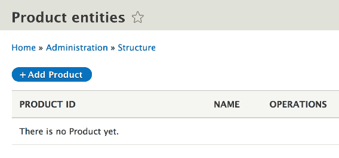
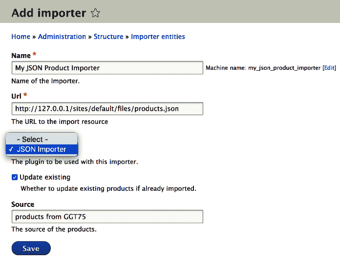
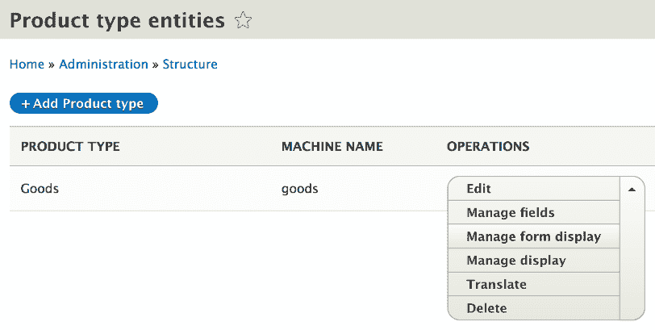

# 您自己的自定义实体和插件类型

我相信你正在期待应用从上一章中获得的一些知识，做一些实际而有趣的事情。正如承诺的那样，在本章中，我们将这样做。此外，除了实现我们自己的实体类型外，我们还将介绍一些新内容。所以，这就是我们的计划。

前提是我们希望在网站上拥有包含一些基本产品信息的产品，例如 ID、名称和产品编号。然而，这些产品需要以某种方式出现在我们的网站上。一种方式是手动输入。另一种，更重要的一种方式是通过从多个外部来源（如 JSON 端点）导入。现在，事情将保持简单。从所有目的和意图来看，这些产品不会做太多，所以不要期待为你提供一个电子商务解决方案。相反，我们将练习在 Drupal 8 中建模数据和功能。

首先，我们将创建一个简单的内容实体类型来表示我们的产品。在这样做的时候，我们将确保通过利用许多现成的实体 API 优势，我们可以轻松地使用 UI 创建、编辑和删除这些产品。

其次，我们将建模我们的导入功能。一枚硬币的一面将是一个简单的配置实体类型，用于表示我们各种导入器所需的配置。同样，我们将利用实体 API 进行快速脚手架和实体管理。另一面将是一个自定义插件类型，它将根据在实体中找到的配置实际执行导入。因此，这些将链接到配置实体的方向，配置实体将选择使用一个插件或另一个。

所以，这些都是重点。在构建所有这些时，我们将看到定义内容、配置实体类型以及用于封装逻辑的插件类型所需的大部分内容，这些类型具有用于存储数据和配置的字段。在定义这些内容时，我们将采取手动、更繁琐的路线，以确保我们理解每个组件的作用，并且对我们所做的事情感到舒适。一旦你了解了所有这些，你将能够使用 Drupal Console 自动生成大量样板代码来大大加快这些过程。

本章中我们编写的代码将放入一个名为 `products` 的新模块中。由于我们已经学会了从头创建模块的方法，因此我将不会涵盖启动该模块所需的初始步骤。

# 自定义内容实体类型

如前一章所见，当查看节点和节点类型实体类型时，实体类型定义属于我们模块命名空间中的 `Entity` 文件夹。在那里，我们将创建一个名为 `Product` 的类，该类顶部将有一个注解来告诉 Drupal 这是一个内容实体类型。这是定义新实体类型最重要的部分：

```php
namespace Drupal\products\Entity;

use Drupal\Core\Entity\ContentEntityBase;

/**
 * Defines the Product entity.
 *
 * @ContentEntityType(
 *   id = "product",
 *   label = @Translation("Product"),
 *   handlers = {
 *     "view_builder" = "Drupal\Core\Entity\EntityViewBuilder",
 *     "list_builder" = "Drupal\products\ProductListBuilder",
 *
 *     "form" = {
 *       "default" = "Drupal\products\Form\ProductForm",
 *       "add" = "Drupal\products\Form\ProductForm",
 *       "edit" = "Drupal\products\Form\ProductForm",
 *       "delete" = "Drupal\Core\Entity\ContentEntityDeleteForm",
 *     },
 *    "route_provider" = {
 *      "html" = "Drupal\Core\Entity\Routing\AdminHtmlRouteProvider"
 *    }
 *   },
 *   base_table = "product",
 *   admin_permission = "administer site configuration",
 *   entity_keys = {
 *     "id" = "id",
 *     "label" = "name",
 *     "uuid" = "uuid",
 *   },
 *   links = {
 *     "canonical" = "/admin/structure/product/{product}",
 *     "add-form" = "/admin/structure/product/add",
 *     "edit-form" = "/admin/structure/product/{product}/edit",
 *     "delete-form" = "/admin/structure/product/{product}/delete",
 *     "collection" = "/admin/structure/product",
 *   }
 * )
 */
class Product extends ContentEntityBase implements ProductInterface {}
```

在上面的代码块中，我省略了类的实际内容，首先关注注解和一些其他方面。我们很快就会看到其余的部分。然而，整个工作代码可以在附带的存储库中找到。

如果您还记得上一章的内容，我们有`ContentEntityType`注解和实体类型插件定义。与 Node 等相比，我们的示例相对简单，因为我想保持事情简单。它没有捆绑包，也不可修订，也不可翻译。此外，对于其中的一些处理器，我们回退到实体 API 默认值。

实体类型 ID 和标签立即可见，因此无需解释；我们可以直接跳到“处理器”部分。

对于视图构建器处理器，我们选择默认使用基本的`EntityViewBuilder`，因为没有我们产品需要渲染的特定内容。很多时候，这已经足够了，但您也可以扩展这个类并创建自己的。

对于列表构建器，尽管我们仍然保持简单，但我们需要自己的实现来处理列表标题等问题。我们很快就会看到这个类。创建和编辑产品的表单处理器是我们模块`Form`命名空间中的自定义实现，我们很快就会看到它以获得更好的理解。尽管如此，我们仍然依赖 Drupal 8 来帮助我们处理删除表单。

最后，对于路由提供者，我们使用了默认的`AdminHtmlRouteProvider`，它负责管理在管理 UI 中管理实体类型所需的所有路由。这意味着我们不再需要为注释中`links`部分的链接进行路由。说到链接，将它们放在我们示例的`admin/structure`部分下是有意义的，但您可以选择其他位置。

我们产品将存储的数据库表是`products`，用户管理它们的权限是`administer site configuration`。我故意省略了创建特定于此实体类型的权限，因为我们将在一个专门讨论访问的章节中介绍这个话题。所以我们将使用随 Drupal 核心提供的这个权限。

最后，我们还有一些基本的实体键可以映射到相应的字段。

我们的`Product`类扩展了`ContentEntityBase`类，以从 API 继承所有必要的功能，并实现了我们自己的`ProductInterface`，它将包含所有用于访问相关字段值的方法。让我们快速在这个`Entity`文件夹中创建这个接口：

```php
namespace Drupal\products\Entity;

use Drupal\Core\Entity\ContentEntityInterface;
use Drupal\Core\Entity\EntityChangedInterface;

/**
 * Represents a Product entity.
 */
interface ProductInterface extends ContentEntityInterface, EntityChangedInterface {

  /**
   * Gets the Product name.
   *
   * @return string
   */
  public function getName();

  /**
   * Sets the Product name.
   *
   * @param string $name
   *
   * @return \Drupal\products\Entity\ProductInterface
   *   The called Product entity.
   */
  public function setName($name);

  /**
   * Gets the Product number.
   *
   * @return int
   */
  public function getProductNumber();

  /**
   * Sets the Product number.
   *
   * @param int $number
   *
   * @return \Drupal\products\Entity\ProductInterface
   *   The called Product entity.
   */
  public function setProductNumber($number);

  /**
   * Gets the Product remote ID.
   *
   * @return string
   */
  public function getRemoteId();

  /**
   * Sets the Product remote ID.
   *
   * @param string $id
   *
   * @return \Drupal\products\Entity\ProductInterface
   *   The called Product entity.
   */
  public function setRemoteId($id);

  /**
   * Gets the Product source.
   *
   * @return string
   */
  public function getSource();

  /**
   * Sets the Product source.
   *
   * @param string $source
   *
   * @return \Drupal\products\Entity\ProductInterface
   *   The called Product entity.
   */
  public function setSource($source);

  /**
   * Gets the Product creation timestamp.
   *
   * @return int
   */
  public function getCreatedTime();

  /**
   * Sets the Product creation timestamp.
   *
   * @param int $timestamp
   *
   * @return \Drupal\products\Entity\ProductInterface
   *   The called Product entity.
   */
  public function setCreatedTime($timestamp);
}
```

如您所见，我们正在扩展必填的`ContentEntityInterface`，同时也扩展了`EntityChangedInterface`，后者提供了一些方便的方法来管理实体的最后更改日期。这些方法实现将通过`EntityChangedTrait`添加到我们的`Product`类中：

```php
use EntityChangedTrait; 
```

`ProductInterface` 上的方法相对比较直观。我们将有一个产品名称、编号、远程 ID 和来源字段，因此为这些字段提供 getter 和 setter 方法是很不错的。如果你还记得，实体 API 提供了`get()`和`set()`方法，我们可以通过这些方法一致地访问和存储所有实体类型的字段值。然而，我发现使用具有明确定义方法的接口可以使代码更加清晰，更不用说 IDE 自动补全是一个节省时间的伟大功能了。我们还有一个`created`日期字段的 getter 和 setter，这是一个内容实体通常具有的典型字段。

现在，我们可以看看我们的`Product`实体类型的`baseFieldDefinitions()`方法，看看我们实际上是如何定义我们的字段的：

```php
public static function baseFieldDefinitions(EntityTypeInterface $entity_type) {
  $fields = parent::baseFieldDefinitions($entity_type);

  $fields['name'] = BaseFieldDefinition::create('string')
    ->setLabel(t('Name'))
    ->setDescription(t('The name of the Product.'))
    ->setSettings([
      'max_length' => 255,
      'text_processing' => 0,
    ])
    ->setDefaultValue('')
    ->setDisplayOptions('view', [
      'label' => 'hidden',
      'type' => 'string',
      'weight' => -4,
    ])
    ->setDisplayOptions('form', [
      'type' => 'string_textfield',
      'weight' => -4,
    ])
    ->setDisplayConfigurable('form', TRUE)
    ->setDisplayConfigurable('view', TRUE);

  $fields['number'] = BaseFieldDefinition::create('integer')
    ->setLabel(t('Number'))
    ->setDescription(t('The Product number.'))
    ->setSettings([
      'min' => 1,
      'max' => 10000
    ])
    ->setDefaultValue(NULL)
    ->setDisplayOptions('view', [
      'label' => 'above',
      'type' => 'number_unformatted',
      'weight' => -4,
    ])
    ->setDisplayOptions('form', [
      'type' => 'number',
      'weight' => -4,
    ])
    ->setDisplayConfigurable('form', TRUE)
    ->setDisplayConfigurable('view', TRUE);

  $fields['remote_id'] = BaseFieldDefinition::create('string')
    ->setLabel(t('Remote ID'))
    ->setDescription(t('The remote ID of the Product.'))
    ->setSettings([
      'max_length' => 255,
      'text_processing' => 0,
    ])
    ->setDefaultValue('');

  $fields['source'] = BaseFieldDefinition::create('string')
    ->setLabel(t('Source'))
    ->setDescription(t('The source of the Product.'))
    ->setSettings([
      'max_length' => 255,
      'text_processing' => 0,
    ])
    ->setDefaultValue('');

  $fields['created'] = BaseFieldDefinition::create('created')
    ->setLabel(t('Created'))
    ->setDescription(t('The time that the entity was created.'));

  $fields['changed'] = BaseFieldDefinition::create('changed')
    ->setLabel(t('Changed'))
    ->setDescription(t('The time that the entity was last edited.'));

  return $fields;
}
```

首先，我们需要继承父类的基字段。这包括诸如 ID 和 UUID 字段等。

第二，我们定义自己的字段，从产品名称字段开始，它是`string`类型。这种`string`类型不过是我在上一章中提到的`FieldType`插件。如果你还记得，这个插件本身扩展了`TypedData`类。除了明显的标签和描述外，它还有一些设置，最值得注意的是值的最大长度，为 255 个字符。`view`和`form`显示选项分别引用`FieldFormatter`和`FieldWidget`插件，这两个插件与`FieldType`一起构成了一个字段。最后，通过`setDisplayConfigurable()`，我们指定这个字段的一些选项可以通过 UI 进行配置。例如，我们可以在 UI 中更改标签。

然后，我们有`number`字段，它是`integer`类型，在这个例子中，限制在 1 到 10,000 之间。这个限制设置在底层变成了约束。其余的选项与名称字段类似。

接下来，我们有`remote_id`字符串字段，但它没有任何小部件或显示设置，因为我们不一定想显示或编辑这个值。它主要用于内部使用，以跟踪来自远程源的产品 ID。同样，`source`字符串字段也不显示或可配置，因为我们想用它来存储产品的来源，它从哪里导入，以及程序化跟踪它。

最后，`created`和`changed`字段是特殊的字段，用于存储实体创建和修改的时间戳。除了这些，不需要做更多的事情，因为这些字段会自动将当前时间戳设置为字段值。

到现在为止，我们也可以看到类内容的其余部分，这主要是`ProductInterface`所需的方法：

```php
use EntityChangedTrait;

/**
 * {@inheritdoc}
 */
public function getName() {
  return $this->get('name')->value;
}

/**
 * {@inheritdoc}
 */
public function setName($name) {
  $this->set('name', $name);
  return $this;
}

/**
 * {@inheritdoc}
 */
public function getProductNumber() {
  return $this->get('number')->value;
}

/**
 * {@inheritdoc}
 */
public function setProductNumber($number) {
  $this->set('number', $number);
  return $this;
}

/**
 * {@inheritdoc}
 */
public function getRemoteId() {
  return $this->get('remote_id')->value;
}

/**
 * {@inheritdoc}
 */
public function setRemoteId($id) {
  $this->set('remote_id', $id);
  return $this;
}

/**
 * {@inheritdoc}
 */
public function getSource() {
  return $this->get('source')->value;
}

/**
 * {@inheritdoc}
 */
public function setSource($source) {
  $this->set('source', $source);
  return $this;
}

/**
 * {@inheritdoc}
 */
public function getCreatedTime() {
  return $this->get('created')->value;
}

/**
 * {@inheritdoc}
 */
public function setCreatedTime($timestamp) {
  $this->set('created', $timestamp);
  return $this;
}
```

正如我们所承诺的，我们正在使用`EntityChangedTrait`来处理`changed`字段，并为我们在基础字段中定义的字段值实现简单的 getter 和 setter。如果你还记得`TypedData`部分，我们访问值的方式（因为这些字段的基数始终为 1）是通过运行以下命令：

```php
$this->get('field_name')->value 
```

在我们完成产品实体类的编写之前，让我们确保使用顶部剩余的所有类：

```php
use Drupal\Core\Entity\EntityChangedTrait; 
use Drupal\Core\Entity\EntityTypeInterface; 
use Drupal\Core\Field\BaseFieldDefinition; 
```

现在让我们通过实体类型插件注解来遍历，并创建我们在此处引用的处理程序。我们可以从列表构建器开始，我们可以将其放置在我们的命名空间根目录下：

```php
namespace Drupal\products;

use Drupal\Core\Entity\EntityInterface;
use Drupal\Core\Entity\EntityListBuilder;
use Drupal\Core\Link;
use Drupal\Core\Url;

/**
 * EntityListBuilderInterface implementation responsible for the Product entities.
 */
class ProductListBuilder extends EntityListBuilder {

  /**
   * {@inheritdoc}
   */
  public function buildHeader() {
    $header['id'] = $this->t('Product ID');
    $header['name'] = $this->t('Name');
    return $header + parent::buildHeader();
  }

  /**
   * {@inheritdoc}
   */
  public function buildRow(EntityInterface $entity) {
    /* @var $entity \Drupal\products\Entity\Product */
    $row['id'] = $entity->id();
    $row['name'] = Link::fromTextAndUrl(
      $entity->label(),
      new Url(
        'entity.product.canonical', [
          'product' => $entity->id(),
        ]
      )
    );
    return $row + parent::buildRow($entity);
  }

}
```

此处理器的目的是构建一个列出可用实体的管理页面。在这个页面上，我们将了解一些关于它们的信息，以及编辑、删除和其他可能需要的操作链接。对于我们的产品，我们简单地从默认的`EntityListBuilder`类扩展，但覆盖了`buildHeader()`和`buildRow()`方法来添加一些特定于我们产品的信息。这些方法的名称是自解释的，但需要注意的一点是，我们从`$header`数组返回的键需要与从`$row`数组返回的键匹配。当然，数组需要具有相同数量的记录，以便表头与单个行匹配。如果你查看`EntityListBuilder`内部，你可以注意一些你可能想要覆盖的其他实用方法，例如构建查询和加载实体的方法。对我们来说，这已经足够了。

目前，我们的产品列表构建器将只有两列：ID 和名称。对于后者，每一行实际上都是一个链接到产品规范 URL（该实体在 Drupal 中的主要 URL）。最后，你还记得从第二章中，*创建您的第一个模块*，如何使用`Link`类构建链接吗？

实体规范路由的构造格式为：`entity.[entity_type].canonical`。其他有用的实体链接可以通过将`links`定义中实体类型插件注解的键替换为`canonical`来构建。

对于列表构建器来说，这就差不多了，我们可以继续到表单处理器。由于创建和编辑实体在表单需求方面有很多相似之处，我们使用相同的`ProductForm`来处理这两个操作。现在让我们在模块命名空间的`Form`目录中创建这个表单类：

```php
use Drupal\Core\Entity\ContentEntityForm;
use Drupal\Core\Form\FormStateInterface;

/**
 * Form for creating/editing Product entities.
 */
class ProductForm extends ContentEntityForm {

  /**
   * {@inheritdoc}
   */
  public function save(array $form, FormStateInterface $form_state) {
    $entity = &$this->entity;

    $status = parent::save($form, $form_state);

    switch ($status) {
      case SAVED_NEW:
        drupal_set_message($this->t('Created the %label Product.', [
          '%label' => $entity->label(),
        ]));
        break;

      default:
        drupal_set_message($this->t('Saved the %label Product.', [
          '%label' => $entity->label(),
        ]));
    }
    $form_state->setRedirect('entity.product.canonical', ['product' => $entity->id()]);
  }

}
```

我们扩展了`ContentEntityForm`，这是一个专门用于内容实体的表单类。它本身扩展了`EntityForm`，而`EntityForm`又继承了我们在第二章中遇到的`FormBase`。然而，前两个类为我们提供了许多管理实体所需的功能，而无需我们编写太多代码。

我们实际上想要做的只是覆盖`save()`方法，以便向用户发送消息，告知他们产品已被创建或更新。我们知道发生了什么，因为`EntityInterface::save()`方法返回一个特定的常量来表示发生的操作类型。

当保存发生时，我们还想重定向到产品实体的规范 URL。我们通过`FormStateInterface`对象上的一个非常方便的方法来完成这个操作，我们可以指定一个路由（以及任何必要的参数），并且它将确保当表单提交时，用户将被重定向到该路由。这不是很酷吗？

您可以看到我们使用了已弃用的`drupal_set_message()`全局函数来向用户打印消息。我故意这样做是为了让事情变得简单。然而，正如我们在第二章，“创建您的第一个模块”中看到的，您应该注入`Messenger`服务并使用它。如果您不确定如何注入服务，请参阅该章节以回顾如何注入服务。

正如我提到的，对于删除操作，我们只需使用`ContentEntityDeleteForm`，它就完成了我们所需的所有工作：它呈现一个确认表单，我们提交并触发删除操作。这是在 Drupal 中删除资源的典型流程。正如我们将在稍后看到，对于配置实体，我们将需要编写一些自己的方法来完成相同的过程。 

我们的所有处理程序都已完成，我们的产品实体类型现在是可操作的。然而，为了能够使用它，让我们在管理菜单中创建一些链接，以便能够轻松地管理它们。

首先，创建`products.links.menu.yml`文件：

```php
# Product entity menu items
entity.product.collection:
  title: 'Product list'
  route_name: entity.product.collection
  description: 'List Product entities'
  parent: system.admin_structure
  weight: 100
```

这定义了一个位于产品列表（使用我们的列表构建器处理程序构建的页面）结构链接下的菜单链接。

接下来，让我们创建一些本地任务（标签页），以便我们在产品页面上获得方便的链接来编辑和删除产品实体。因此，在`products.links.task.yml`文件中：

```php
# Product entity task items
entity.product.canonical:
  route_name: entity.product.canonical
  base_route: entity.product.canonical
  title: 'View'

entity.product.edit_form:
  route_name: entity.product.edit_form
  base_route: entity.product.canonical
  title: 'Edit'

entity.product.delete_form:
  route_name: entity.product.delete_form
  base_route: entity.product.canonical
  title: Delete
  weight: 10
```

您还记得第五章，“菜单和菜单链接”，不是吗？基本路由始终是实体的规范路由，这本质上将标签分组在一起。然后，我们用于其他两个任务的路由是实体类型的`edit_form`和`delete_form`链接。您可以参考实体类型插件注释中的*links*部分来了解这些链接的来源。我们之所以不需要在这里指定任何参数（因为这些路由确实需要产品 ID），是因为基本路由已经在 URL 中包含了该参数。因此，任务将使用该参数。这非常方便。

最后，我们还想在产品列表页面上添加一个创建新产品实体的操作链接。因此，在`products.links.action.yml`文件中：

```php
entity.product.add_form:
  route_name: entity.product.add_form
  title: 'Add Product'
  appears_on:
    - entity.product.collection
```

再次强调，这些内容不应该陌生，因为我们已经在第五章中详细介绍了，*菜单和菜单链接*。我们终于完成了。

如果在编写所有实体代码之前您的网站上启用了`products`模块，您需要运行`drush entity-updates`命令，以便在数据库中创建所有必要的表。否则，安装模块将自动完成此操作。然而，请注意，当您添加新的内容实体类型和字段或更改实体类型上的现有字段时，需要记住第一点。底层存储可能需要更改以适应您的修改。此外，还需要注意的是，在某些情况下，更改已包含数据的字段可能不符合 Drupal 的要求，并阻止您进行这些更改。因此，您可能需要删除现有实体。

在撰写本文时，`entity-update` Drush 命令正在被淘汰，转而使用更新钩子来更新实体。请参阅[Drupal.org](https://www.drupal.org/node/3034742)上的相关变更记录。这意味着当您尝试使用该命令时，它可能不再有效。如果是这种情况，请查看变更记录以获取有关在开发期间可以在哪个贡献模块中找到此命令的信息。

现在我们已经完成了这些，我们可以去`admin/structure/product`查看我们的（空）产品实体列表：



我们现在可以创建新产品，编辑它们，最后，删除它们。记住，由于我们的字段配置，手动创建/编辑产品不允许管理`remote_id`和`source`字段。对于我们的目的，我们希望这些字段只能通过程序访问，因为任何手动创建的产品都将被视为不需要这些数据。例如，如果我们想使源字段以表单小部件的形式显示，我们只需要将其基本字段定义更改为以下内容：

```php
$fields['source'] = BaseFieldDefinition::create('string')
  ->setLabel(t('Source'))
  ->setDescription(t('The source of the Product.'))
  ->setSettings([
    'max_length' => 255,
    'text_processing' => 0,
  ])
  ->setDefaultValue('')
  ->setDisplayOptions('form', [
    'type' => 'string_textfield',
    'weight' => -4,
  ]);
```

此外，我们还需要清除缓存。这将使源字段的表单元素显示出来，但值仍然不会在实体的规范页面上显示，因为我们没有设置任何`view`显示选项。换句话说，我们还没有选择一个格式化器。

然而，在我们的情况下，产品实体已经准备好存储数据，我们在上一章中与节点实体类型一起练习的所有 TypedData API 都将与这个实体一样正常工作。因此，我们现在可以转向编写我们的导入逻辑，将一些远程产品导入到我们的网站上。

# 自定义插件类型

由于这本书的几乎第二页都在讲述插件的重要性以及它们在 Drupal 8 中的广泛使用。我通过在基本上每一章中引用“这个或那个”是插件来支持这个说法。然而，我并没有真正解释如何创建自己的自定义插件类型。然而，由于我们的导入逻辑是插件的完美候选者，我将在这里这样做，并且为了说明理论，我们将实现一个`Importer`插件类型。

插件类型最需要的是管理服务。它负责将插件的两个关键方面（但不仅限于此）结合起来：发现和工厂（实例化）。对于这两个任务，它委托给专门的对象。最常见的方法是通过注解（`AnnotatedClassDiscovery`），最常见的工厂是容器感知的——`ContainerFactory`。所以，本质上，管理器是中央玩家，它找到并处理所有插件定义并实例化插件。此外，它还借助那些其他人的帮助来完成这些工作。

Drupal 8 中许多插件类型，因为它们遵循我之前提到的默认设置，使用`DefaultPluginManager`，或者说，它们扩展了这个类。它为它们提供了注解发现和容器感知的工厂。所以这就是我们将要做的，并且看看创建插件类型管理器有多简单。

通常，它位于模块的`Plugin`命名空间中，所以我们的可以看起来像这样：

```php
namespace Drupal\products\Plugin;

use Drupal\Core\Plugin\DefaultPluginManager;
use Drupal\Core\Cache\CacheBackendInterface;
use Drupal\Core\Extension\ModuleHandlerInterface;

/**
 * Provides the Importer plugin manager.
 */
class ImporterManager extends DefaultPluginManager {

  /**
   * ImporterManager constructor.
   *
   * @param \Traversable $namespaces
   *   An object that implements \Traversable which contains the root paths
   *   keyed by the corresponding namespace to look for plugin implementations.
   * @param \Drupal\Core\Cache\CacheBackendInterface $cache_backend
   *   Cache backend instance to use.
   * @param \Drupal\Core\Extension\ModuleHandlerInterface $module_handler
   *   The module handler to invoke the alter hook with.
   */
  public function __construct(\Traversable $namespaces, CacheBackendInterface $cache_backend, ModuleHandlerInterface $module_handler) {
    parent::__construct('Plugin/Importer', $namespaces, $module_handler, 'Drupal\products\Plugin\ImporterInterface', 'Drupal\products\Annotation\Importer');

    $this->alterInfo('products_importer_info');
    $this->setCacheBackend($cache_backend, 'products_importer_plugins');
  }
}
```

除了扩展`DefaultPluginManager`之外，我们还需要重写构造函数并使用一些特定于我们插件的参数重新调用父构造函数。这是最重要的部分，按照顺序，以下是这样（省略了那些只是传递的）：

+   这种类型的插件将被找到的相对命名空间——在这个例子中，是在`Plugin/Importer`文件夹中

+   这种类型的每个插件都需要实现接口——在我们的例子中，是`Drupal\products\Plugin\ImporterInterface`（我们必须创建它）

+   我们插件类型使用的`annotation`类（其类属性映射到在插件类上方的 DocBlock 中找到的可能注解属性）——在我们的例子中，是`Drupal\products\Annotation\Importer`（我们必须创建）

除了使用这些选项调用父构造函数之外，我们还需要提供“alter”钩子，用于可用的定义。这将使其他模块能够实现此钩子并修改找到的插件定义。在我们的情况下，结果是`hook_products_importer_info_alter`。

最后，我们还为负责缓存插件定义的后端提供了一个特定的缓存键。这是为了提高性能：正如你现在应该已经知道的，创建一个新的插件需要清除缓存。

我们的经理就到这里。然而，由于这是一个服务，我们还需要在`products.services.yml`文件中将其注册为服务：

```php
services:
  products.importer_manager:
    class: Drupal\products\Plugin\ImporterManager
    parent: default_plugin_manager
```

如您所见，我们继承自`default_plugin_manager`服务中的依赖（参数），而不是在这里再次复制它们。如果您还记得第三章中的内容，*日志和邮件*，这是 Drupal 8 中的一个巧妙的小技巧。

现在，由于我们在管理器中引用了一些类，我们需要创建它们。让我们从注解类开始：

```php
namespace Drupal\products\Annotation;

use Drupal\Component\Annotation\Plugin;

/**
 * Defines an Importer item annotation object.
 *
 * @see \Drupal\products\Plugin\ImporterManager
 *
 * @Annotation
 */
class Importer extends Plugin {

  /**
   * The plugin ID.
   *
   * @var string
   */
  public $id;

  /**
   * The label of the plugin.
   *
   * @var \Drupal\Core\Annotation\Translation
   *
   * @ingroup plugin_translatable
   */
  public $label;
}
```

这个类需要扩展`Drupal\Component\Annotation\Plugin`，这是注解的基类，并且已经实现了`AnnotationInterface`。

对于我们的目的，我们保持简单。我们需要的只是一个插件 ID 和一个标签。如果我们愿意，我们可以向这个类添加更多属性并描述它们。这样做是一个标准实践，因为否则就没有明确的方式来知道插件注解可以包含哪些属性。

接下来，让我们也编写插件必须实现的接口：

```php
namespace Drupal\products\Plugin;

use Drupal\Component\Plugin\PluginInspectionInterface;

/**
 * Defines an interface for Importer plugins.
 */
interface ImporterInterface extends PluginInspectionInterface {

  /**
   * Performs the import. Returns TRUE if the import was successful or FALSE otherwise.
   *
   * @return bool
   */
  public function import();
}
```

同样，我们保持简单。目前，我们的导入器将只有一个特定的方法：`import()`。然而，它将会有其他特定的插件方法，这些方法可以在我们扩展的`PluginInspectionInterface`中找到。这些是`getPluginId()`和`getPluginDefinition()`，它们也非常重要，因为系统期望能够从插件中获取这些信息。

接下来，任何类型的插件都需要扩展`PluginBase`，因为它包含了一系列必须实现的方法（例如我之前提到的那些）。然而，对于引入插件类型的模块来说，提供一个插件基类供插件扩展也是一个最佳实践。它的目标是扩展`PluginBase`，并提供所有此类插件所需的所有必要逻辑。例如，当我们创建一个新的块时，我们扩展`BlockBase`，而`BlockBase`在某个地方会扩展`PluginBase`。

在我们的情况下，这个基类（抽象）可以看起来像这样：

```php
namespace Drupal\products\Plugin;

use Drupal\Component\Plugin\Exception\PluginException;
use Drupal\Component\Plugin\PluginBase;
use Drupal\Core\Entity\EntityTypeManager;
use Drupal\Core\Plugin\ContainerFactoryPluginInterface;
use Drupal\products\Entity\ImporterInterface;
use Drupal\products\Plugin\ImporterInterface as ImporterPluginInterface;
use GuzzleHttp\Client;
use Symfony\Component\DependencyInjection\ContainerInterface;

/**
 * Base class for Importer plugins.
 */
abstract class ImporterBase extends PluginBase implements ImporterPluginInterface, ContainerFactoryPluginInterface {

  /**
   * @var \Drupal\Core\Entity\EntityTypeManager
   */
  protected $entityTypeManager;

  /**
   * @var \GuzzleHttp\Client
   */
  protected $httpClient;

  /**
   * {@inheritdoc}
   */
  public function __construct(array $configuration, $plugin_id, $plugin_definition, EntityTypeManager $entityTypeManager, Client $httpClient) {
    parent::__construct($configuration, $plugin_id, $plugin_definition);
    $this->entityTypeManager = $entityTypeManager;
    $this->httpClient = $httpClient;

    if (!isset($configuration['config'])) {
      throw new PluginException('Missing Importer configuration.');
    }

    if (!$configuration['config'] instanceof ImporterInterface) {
      throw new PluginException('Wrong Importer configuration.');
    }
  }

  /**
   * {@inheritdoc}
   */
  public static function create(ContainerInterface $container, array $configuration, $plugin_id, $plugin_definition) {
    return new static(
      $configuration,
      $plugin_id,
      $plugin_definition,
      $container->get('entity_type.manager'),
      $container->get('http_client')
    );
  }
}
```

我们实现`ImporterInterface`（重命名以避免冲突）来要求子类必须有一个`import()`方法。然而，我们也使插件容器知道，并已经注入了一些有用的服务。一个是`EntityTypeManager`，因为我们预计所有导入器都需要它。另一个是我们用于 Drupal 8 中向外部资源发起 PSR-7 请求的 Guzzle HTTP 客户端。

在这里添加它是一个判断性的选择。我们可以想象不止一个插件需要外部请求，但如果最终证明它们不需要，我们当然应该将其从插件中移除，并仅在特定插件中添加它。相反的情况也成立。如果在第三个插件实现中我们识别出另一个通用服务，我们可以将其从插件中移除，并在这里注入它。同时，我们还要注意向后兼容性。

在讨论我们在构造函数中抛出的那些异常之前，了解插件管理器如何创建插件的新实例是很重要的。它使用其`createInstance()`方法，该方法将插件 ID 作为第一个参数，将插件配置的可选数组作为第二个参数。相关的工厂然后将该配置数组传递给插件构造函数本身作为第二个参数。通常情况下，这是空的。然而，对于我们的插件类型，我们需要将配置以配置实体（我们接下来必须创建）的形式传递给插件。如果没有这样的实体，我们希望插件失败，因为它们没有这个实体中找到的说明就无法工作。因此，在构造函数中，我们检查`$configuration['config']`是否是`Drupal\products\Entity\ImporterInterface`的实例，这将是我们配置实体将要实现的接口。如果不是，我们抛出异常，因为此插件没有它无法工作。

我们现在完成了插件类型的创建。显然，我们还没有任何插件，在我们创建一个之前，让我们首先创建配置实体类型。

# 自定义配置实体类型

如果你还记得上一章中的`NodeType`，你就知道创建自定义配置实体类型的基本要素。因此，让我们现在创建我们的`Importer`类型。像之前一样，我们从注解部分开始，这次是`ConfigEntityType`：

```php
namespace Drupal\products\Entity;

use Drupal\Core\Config\Entity\ConfigEntityBase;

/**
 * Defines the Importer entity.
 *
 * @ConfigEntityType(
 *   id = "importer",
 *   label = @Translation("Importer"),
 *   handlers = {
 *     "list_builder" = "Drupal\products\ImporterListBuilder",
 *     "form" = {
 *       "add" = "Drupal\products\Form\ImporterForm",
 *       "edit" = "Drupal\products\Form\ImporterForm",
 *       "delete" = "Drupal\products\Form\ImporterDeleteForm"
 *     },
 *     "route_provider" = {
 *       "html" = "Drupal\Core\Entity\Routing\AdminHtmlRouteProvider",
 *     },
 *   },
 *   config_prefix = "importer",
 *   admin_permission = "administer site configuration",
 *   entity_keys = {
 *     "id" = "id",
 *     "label" = "label",
 *     "uuid" = "uuid"
 *   },
 *   links = {
 *     "add-form" = "/admin/structure/importer/add",
 *     "edit-form" = "/admin/structure/importer/{importer}/edit",
 *     "delete-form" = "/admin/structure/importer/{importer}/delete",
 *     "collection" = "/admin/structure/importer"
 *   },
 *   config_export = { 
 *     "id",
 *     "label",
 *     "url",
 *     "plugin",
 *     "update_existing",
 *     "source",
 *     "bundle"
 *   }
 * )
 */
class Importer extends ConfigEntityBase implements ImporterInterface {}
```

与`Product`实体一样，我们需要创建一个列表构建器处理程序，以及表单处理程序。然而，在这种情况下，我们还需要为`delete`操作创建一个表单处理程序，因为我们很快就会看到原因。最后，由于我们有一个配置实体，我们还指定了用于导出的`config_export`和`config_prefix`键。如果你还记得上一章，第一个表示应该持久化的字段名称（我们很快就会看到它们），而第二个表示配置名称在存储时应获得的名称前缀。你会注意到我们没有规范链接，因为我们实际上并不需要——我们的实体不需要详情页面，因此不需要定义指向它的规范链接。

现在，是时候创建实体实现所需的`ImporterInterface`了。它的名称与之前创建的插件接口相同，但它位于不同的命名空间中：

```php
namespace Drupal\products\Entity;

use Drupal\Core\Config\Entity\ConfigEntityInterface;
use Drupal\Core\Url;

/**
 * Importer configuration entity.
 */
interface ImporterInterface extends ConfigEntityInterface {

  /**
   * Returns the Url where the import can get the data from.
   *
   * @return Url
   */
  public function getUrl();

  /**
   * Returns the Importer plugin ID to be used by this importer.
   *
   * @return string
   */
  public function getPluginId();

  /**
   * Whether or not to update existing products if they have already been imported.
   *
   * @return bool
   */
  public function updateExisting();

  /**
   * Returns the source of the products.
   *
   * @return string
   */
  public function getSource();
}
```

在这些配置实体中，我们目前想要存储的是可以从中检索产品的资源 URL、要使用的导入器插件 ID、是否希望更新已导入的现有产品，以及产品的来源。对于所有这些字段，我们创建了一些获取方法。你会注意到`getUrl()`需要返回一个`Url`实例。同样，我们为实体类型的公共 API 创建了一个定义良好的接口，就像我们为产品实体类型所做的那样。

这是实现此接口的`Importer`类体：

```php
/**
 * The Importer ID.
 *
 * @var string
 */
protected $id;

/**
 * The Importer label.
 *
 * @var string
 */
protected $label;

/**
 * The URL from where the import file can be retrieved.
 *
 * @var string
 */
protected $url;

/**
 * The plugin ID of the plugin to be used for processing this import.
 *
 * @var string
 */
protected $plugin;

/**
 * Whether or not to update existing products if they have already been imported.
 *
 * @var bool
 */
protected $update_existing = TRUE;

/**
 * The source of the products.
 *
 * @var string
 */
protected $source;

/**
 * {@inheritdoc}
 */
public function getUrl() {
  return $this->url ? Url::fromUri($this->url) : NULL;
}

/**
 * {@inheritdoc}
 */
public function getPluginId() {
  return $this->plugin;
}

/**
 * {@inheritdoc}
 */
public function updateExisting() {
  return $this->update_existing;
}

/**
 * {@inheritdoc}
 */
public function getSource() {
  return $this->source;
}
```

如果你记得上一章的内容，定义配置实体类型的字段就像在类本身上定义属性一样简单。此外，你可能还记得注解上的`config_export`键，它列出了哪些属性需要导出和持久化。我们省略了它，因为我们将简单地依赖于配置方案（我们很快就会创建）。最后，实现接口方法，这并不涉及任何火箭科学。正如预期的那样，`getUrl()`将尝试从值中创建一个`Url`实例。

我们不要忘记在顶部添加它的`use`语句：

```php
use Drupal\Core\Url;  
```

由于我们讨论了配置模式，让我们也定义一下。如果你记得，它位于我们模块的`config/schema`文件夹中，在一个`*.schema.yml`文件中。这可以以模块的名称命名，包含模块中所有配置的方案定义。或者，它可以以单个配置实体类型的名称命名，在我们的情况下是`importer.schema.yml`（以保持事情整洁有序）：

```php
products.importer.*:
  type: config_entity
  label: 'Importer config'
  mapping:
   id:
     type: string
     label: 'ID'
   label:
     type: label
     label: 'Label'
   uuid:
     type: string
   url:
     type: uri
     label: Uri
   plugin:
     type: string
     label: Plugin ID
   update_existing:
     type: boolean
     label: Whether to update existing products
   source:
     type: string
     label: The source of the products
```

如果你记得，通配符用于将模式应用于所有匹配前缀的配置项。因此，在我们的情况下，它将匹配所有`importer`配置实体。接下来，我们有`config_entity`模式，它映射了我们定义的字段。除了每个实体类型都有的默认字段外，我们还使用了一个`uri`、`string`和`boolean`模式类型（在底层映射到相应的`TypedData`数据类型插件）。这个模式现在帮助系统理解我们的实体。

现在，让我们继续创建列表处理程序，它将负责管理实体列表：

```php
namespace Drupal\products;

use Drupal\Core\Config\Entity\ConfigEntityListBuilder;
use Drupal\Core\Entity\EntityInterface;

/**
 * Provides a listing of Importer entities.
 */
class ImporterListBuilder extends ConfigEntityListBuilder {

  /**
   * {@inheritdoc}
   */
  public function buildHeader() {
    $header['label'] = $this->t('Importer');
    $header['id'] = $this->t('Machine name');
    return $header + parent::buildHeader();
  }

  /**
   * {@inheritdoc}
   */
  public function buildRow(EntityInterface $entity) {
    $row['label'] = $entity->label();
    $row['id'] = $entity->id();
    return $row + parent::buildRow($entity);
  }
}
```

这次我们扩展了`ConfigEntityListBuilder`，它提供了一些特定于配置实体的功能。然而，我们基本上与产品列表做的是同样的事情——设置表头和单个行数据，没有太大的不同。我建议你检查`ConfigEntityListBuilder`，看看你可以在子类中做些什么。

现在，我们终于可以处理表单处理程序，并开始使用默认的创建/编辑表单：

```php
namespace Drupal\products\Form; 

use Drupal\Core\Entity\EntityForm; 
use Drupal\Core\Form\FormStateInterface; 
use Drupal\Core\Messenger\MessengerInterface; 
use Drupal\Core\Url; 
use Drupal\products\Plugin\ImporterManager; 
use Symfony\Component\DependencyInjection\ContainerInterface; 

/** 
 * Form for creating/editing Importer entities. 
 */ 
class ImporterForm extends EntityForm { 

  /** 
   * @var \Drupal\products\Plugin\ImporterManager 
   */ 
  protected $importerManager; 

  /** 
   * ImporterForm constructor. 
   * 
   * @param \Drupal\products\Plugin\ImporterManager $importerManager 
   * @param \Drupal\Core\Messenger\MessengerInterface $messenger 
   */ 
  public function __construct(ImporterManager $importerManager, MessengerInterface $messenger) { 
    $this->importerManager = $importerManager; 
    $this->messenger = $messenger; 
  } 

  /** 
   * {@inheritdoc} 
   */ 
  public static function create(ContainerInterface $container) { 
    return new static( 
      $container->get('products.importer_manager'), 
      $container->get('messenger') 
    ); 
  } 

  /** 
   * {@inheritdoc} 
   */ 
  public function form(array $form, FormStateInterface $form_state) { 
    $form = parent::form($form, $form_state); 

    /** @var \Drupal\products\Entity\Importer $importer */ 
    $importer = $this->entity; 

    $form['label'] = [ 
      '#type' => 'textfield', 
      '#title' => $this->t('Name'), 
      '#maxlength' => 255, 
      '#default_value' => $importer->label(), 
      '#description' => $this->t('Name of the Importer.'), 
      '#required' => TRUE, 
    ]; 

    $form['id'] = [ 
      '#type' => 'machine_name', 
      '#default_value' => $importer->id(), 
      '#machine_name' => [ 
        'exists' => '\Drupal\products\Entity\Importer::load', 
      ], 
      '#disabled' => !$importer->isNew(), 
    ]; 

    $form['url'] = [ 
      '#type' => 'url', 
      '#default_value' => $importer->getUrl() instanceof Url ? $importer->getUrl()->toString() : '', 
      '#title' => $this->t('Url'), 
      '#description' => $this->t('The URL to the import resource'), 
      '#required' => TRUE, 
    ]; 

    $definitions = $this->importerManager->getDefinitions(); 
    $options = []; 
    foreach ($definitions as $id => $definition) { 
      $options[$id] = $definition['label']; 
    } 

    $form['plugin'] = [ 
      '#type' => 'select', 
      '#title' => $this->t('Plugin'), 
      '#default_value' => $importer->getPluginId(), 
      '#options' => $options, 
      '#description' => $this->t('The plugin to be used with this importer.'), 
      '#required' => TRUE, 
    ]; 

    $form['update_existing'] = [ 
      '#type' => 'checkbox', 
      '#title' => $this->t('Update existing'), 
      '#description' => $this->t('Whether to update existing products if already imported.'), 
      '#default_value' => $importer->updateExisting(), 
    ]; 

    $form['source'] = [ 
      '#type' => 'textfield', 
      '#title' => $this->t('Source'), 
      '#description' => $this->t('The source of the products.'), 
      '#default_value' => $importer->getSource(), 
    ]; 

    return $form; 
  } 

  /** 
   * {@inheritdoc} 
   */ 
  public function save(array $form, FormStateInterface $form_state) { 
    /** @var \Drupal\products\Entity\Importer $importer */ 
    $importer = $this->entity; 
    $status = $importer->save(); 

    switch ($status) { 
      case SAVED_NEW: 
        $this->messenger->addMessage($this->t('Created the %label Importer.', [ 
          '%label' => $importer->label(), 
        ])); 
        break; 

      default: 
        $this->messenger->addMessage($this->t('Saved the %label Importer.', [ 
          '%label' => $importer->label(), 
        ])); 
    } 

    $form_state->setRedirectUrl($importer->toUrl('collection')); 
  } 

} 
```

在这种情况下，我们直接扩展了`EntityForm`，因为配置实体没有像内容实体那样的特定表单类。因此，我们还需要在`form()`方法中实现所有字段的表单元素。

但首先，我们知道我们希望配置实体选择一个插件来使用，因此，出于这个原因，我们注入了我们之前创建的`ImporterManager`。我们将使用它来获取所有现有的定义。我们还注入了`Messenger`服务，以便稍后将其用于向用户打印消息。

在`form()`方法内部，我们定义了所有字段的表单元素。我们使用`textfield`来设置标签，使用`machine_name`字段来设置实体的 ID。后者是一个特殊的由 JavaScript 驱动的字段，它从“源”字段（如果没有指定，则默认为`label`字段）获取其值。如果我们正在编辑表单，它也会被禁用，并使用动态回调尝试通过提供的 ID 加载实体，如果存在则验证失败。这有助于确保 ID 不会重复。接下来，我们有一个`url`表单元素，它执行一些 URL 特定的验证和处理，以确保添加了正确的 URL。然后，我们创建一个包含所有可用导入插件定义的`select`元素选项数组。为此，我们使用插件管理器的`getDefinitions()`，从中我们可以获取 ID 和标签。插件定义主要包含在注释中找到的数据以及由管理器（在我们的情况下，只有默认值）处理和添加的一些其他数据。在这个阶段，我们的插件尚未实例化。然后，我们在选择列表中使用这些选项。最后，我们有简单的`checkbox`和`textfield`元素用于最后两个字段，因为我们想将`update_existing`字段存储为布尔值，将`source`字段存储为字符串。

`save()`方法几乎和产品实体表单中的相同；我们只是显示一条消息并将用户重定向到实体列表页面（使用实体上的方便的`toUrl()`方法构建 URL）。由于我们命名表单元素与字段完全相同，我们不需要对表单值到字段名称进行映射。这已经由系统处理了。

现在我们来编写删除表单处理器：

```php
namespace Drupal\products\Form; 

use Drupal\Core\Entity\EntityConfirmFormBase; 
use Drupal\Core\Form\FormStateInterface; 
use Drupal\Core\Messenger\MessengerInterface; 
use Drupal\Core\Url; 
use Symfony\Component\DependencyInjection\ContainerInterface; 

/** 
 * Form for deleting Importer entities. 
 */ 
class ImporterDeleteForm extends EntityConfirmFormBase { 

  /** 
   * ImporterDeleteForm constructor. 
   * 
   * @param \Drupal\Core\Messenger\MessengerInterface $messenger 
   */ 
  public function __construct(MessengerInterface $messenger) { 
    $this->messenger = $messenger; 
  } 

  /** 
   * {@inheritdoc} 
   */ 
  public static function create(ContainerInterface $container) { 
    return new static( 
      $container->get('messenger') 
    ); 
  } 

  /** 
   * {@inheritdoc} 
   */ 
  public function getQuestion() { 
    return $this->t('Are you sure you want to delete %name?', ['%name' => $this->entity->label()]); 
  } 

  /** 
   * {@inheritdoc} 
   */ 
  public function getCancelUrl() { 
    return new Url('entity.importer.collection'); 
  } 

  /** 
   * {@inheritdoc} 
   */ 
  public function getConfirmText() { 
    return $this->t('Delete'); 
  } 

  /** 
   * {@inheritdoc} 
   */ 
  public function submitForm(array &$form, FormStateInterface $form_state) { 
    $this->entity->delete(); 

    $this->messenger->addMessage($this->t('Deleted @entity importer.', ['@entity' => $this->entity->label()])); 

    $form_state->setRedirectUrl($this->getCancelUrl()); 
  } 

} 
```

如我之前提到的，对于配置实体，我们需要自己实现这个表单处理器。然而，这并不是什么大问题，因为我们可以扩展`EntityConfirmFormBase`并仅实现一些简单的方法：

+   在`getQuestion()`函数中，我们返回用于确认表单的问题字符串。

+   在`getConfirmText()`函数中，我们返回删除按钮的标签。

+   在`getCancelUrl()`函数中，我们提供用户在取消或成功删除后的重定向 URL。

+   在`submitForm()`函数中，我们删除实体，打印成功消息，并重定向到我们在`getCancelUrl()`中设置的 URL。

就这样，我们完成了我们的配置实体类型。我们可能还想做的最后一件事是创建一些菜单链接，以便能够导航到相关页面（和我们对产品实体类型所做的一样）。对于实体列表页面，我们可以在我们的`products.links.menu.yml`文件中这样写：

```php
# Importer entity menu items
entity.importer.collection:
  title: 'Importer list'
  route_name: entity.importer.collection
  description: 'List Importer entities'
  parent: system.admin_structure
  weight: 99
```

这里没有什么新内容。我们也可以在`products.links.action.yml`文件中创建添加新实体的操作链接：

```php
entity.importer.add_form:
  route_name: 'entity.importer.add_form'
  title: 'Add Importer'
  appears_on:
    - entity.importer.collection
```

我们在这里做的和之前对产品所做的相同。然而，我们不会创建本地任务，因为我们没有配置实体的规范路由，所以我们实际上不需要它。

现在，如果我们清除我们的缓存并转到`admin/structure/importer`，我们应该看到空的导入实体列表：


# 导入插件

好吧，既然所有设置都已经到位，我们现在可以继续创建我们的第一个导入插件。正如我们在管理器中定义的那样，这些需要放在模块的`Plugin/Importer`命名空间中。所以，让我们从一个简单的`JsonImporter`开始，它将使用远程 URL 资源导入产品。这是一个示例 JSON 文件，它将由这个插件处理，仅用于测试目的：

```php
{
   "products" : [
     {
       "id" : 1,
       "name": "TV",
       "number": 341
     },
     {
       "id" : 2,
       "name": "VCR",
       "number": 123
     },
     {
       "id" : 3,
       "name": "Stereo",
       "number": 234
     }
   ]
 }
```

我知道，VCR 对吧？我们有一个 ID，一个名称和一个产品编号。这些都是关于产品的完全虚构的信息，只是为了说明这个过程。所以，让我们创建我们的`JsonImporter`：

```php
namespace Drupal\products\Plugin\Importer; 

use Drupal\products\Plugin\ImporterBase; 

/** 
 * Product importer from a JSON format. 
 * 
 * @Importer( 
 *   id = "json", 
 *   label = @Translation("JSON Importer") 
 * ) 
 */ 
class JsonImporter extends ImporterBase { 

  /** 
   * {@inheritdoc} 
   */ 
  public function import() { 
    $data = $this->getData(); 
    if (!$data) { 
      return FALSE; 
    } 

    if (!isset($data->products)) { 
      return FALSE; 
    } 

    $products = $data->products; 
    foreach ($products as $product) { 
      $this->persistProduct($product); 
    } 
    return TRUE; 
  } 

  /** 
   * Loads the product data from the remote URL. 
   * 
   * @return \stdClass 
   */ 
  private function getData() { 
    /** @var \Drupal\products\Entity\ImporterInterface $config */ 
    $config = $this->configuration['config']; 
    $request = $this->httpClient->get($config->getUrl()->toString()); 
    $string = $request->getBody()->getContents(); 
    return json_decode($string); 
  } 

  /** 
   * Saves a Product entity from the remote data. 
   * 
   * @param \stdClass $data 
   */ 
  private function persistProduct($data) { 
    /** @var \Drupal\products\Entity\ImporterInterface $config */ 
    $config = $this->configuration['config']; 

    $existing = $this->entityTypeManager->getStorage('product')->loadByProperties(['remote_id' => $data->id, 'source' => $config->getSource()]); 
    if (!$existing) { 
      $values = [ 
        'remote_id' => $data->id, 
        'source' => $config->getSource() 
      ]; 
      /** @var \Drupal\products\Entity\ProductInterface $product */ 
      $product = $this->entityTypeManager->getStorage('product')->create($values); 
      $product->setName($data->name); 
      $product->setProductNumber($data->number); 
      $product->save(); 
      return; 
    } 

    if (!$config->updateExisting()) { 
      return; 
    } 

    /** @var \Drupal\products\Entity\ProductInterface $product */ 
    $product = reset($existing); 
    $product->setName($data->name); 
    $product->setProductNumber($data->number); 
    $product->save(); 
  } 
} 
```

你可以立即看到插件注解，我们指定了一个 ID 和一个标签。接下来，通过扩展`ImporterBase`，我们继承了依赖的服务并确保实现了所需的接口。说到这一点，我们基本上只需要实现`import()`方法。所以，让我们分解我们在做什么：

1.  在`getData()`方法内部，我们从远程资源检索产品信息。我们通过从`Importer`配置实体获取 URL 并使用 Guzzle 向该 URL 发出请求来做到这一点。我们期望它是 JSON 格式，所以我们只需将其解码为这种格式。当然，在这个例子中，错误处理几乎不存在，这是不好的。

1.  我们遍历生成的产品数据，并对每个项目调用`persistProduct()`方法。在那里，我们首先检查我们是否已经有了产品实体。我们通过在产品实体存储上使用简单的`loadByProperties()`方法来做到这一点，并尝试找到具有特定来源和远程 ID 的产品。如果不存在，我们就创建它。这一切都应该在上一章中熟悉，当时我们讨论了实体的操作。如果产品已经存在，我们首先检查根据配置，我们是否可以更新它，并且只有在这样做允许的情况下才这样做。`loadByProperties()`方法始终返回一个实体数组，但由于我们只期望有一个具有相同远程 ID 和来源组合的单个产品，我们只需简单地`reset()`这个数组以获取那个实体。然后，我们只需在实体上设置名称和产品编号。

正如你所见，我们不是使用实体 API/类型数据`set()`方法来更新实体字段值，而是使用我们自己的接口方法。我发现这要干净得多，更现代，并且是 IDE 友好的方式，因为一切都是非常明确的。

您可能会注意到，在这个导入过程中存在错误处理，或者更确切地说，是缺乏错误处理。这是因为我为了专注于当前主题，故意保持了简单。通常，您可能想要抛出并捕获一些异常，并且肯定要记录一些消息（无论是错误还是成功）。您知道如何从第三章，*日志和邮件*中做后者。

大概就是这样。我们现在可以创建我们的第一个导入实体，并使其使用这个导入插件（当然是在清除缓存之后）：



上一张截图中的 URL 只是一个本地 URL，其中包含了示例 JSON 文件的位置，我们可以看到可选择的唯一插件，以及其他我们为表单元素创建的实体字段。通过保存这个新实体，我们可以程序化地使用它（假设 URL 中引用的`products.json`文件存在）：

```php
$config = \Drupal::entityTypeManager()
  ->getStorage('importer')
  ->load('my_json_product_importer');
$plugin = \Drupal::service('products.importer_manager')
  ->createInstance($config->getPluginId(), ['config' => $config]);
$plugin->import();
```

我们首先通过 ID 加载导入实体。然后，我们使用`ImporterManager`服务通过`createInstance()`方法创建一个插件的新实例。只需要一个参数——插件的 ID——但正如我之前所说的，我们希望传递配置实体给它，因为它依赖于它。所以我们就这样做了。然后，我们在插件上调用`import()`方法。运行此代码后，产品实体列表将显示一些闪亮的新产品。

然而，让我们改进一下。由于配置实体和插件紧密相连，让我们使用插件管理器来完成整个操作，而不是首先加载一个实体，然后从它请求插件。换句话说，让我们在插件管理器中添加一个方法，我们可以传递配置实体 ID，它返回相关插件的实例；类似于这样：

```php
/**
 * Creates an instance of ImporterInterface plugin based on the ID of a
 * configuration entity.
 *
 * @param $id
 *   Configuration entity ID
 *
 * @return null|\Drupal\products\Plugin\ImporterInterface
 */
public function createInstanceFromConfig($id) {
  $config = $this->entityTypeManager->getStorage('importer')->load($id);
  if (!$config instanceof \Drupal\products\Entity\ImporterInterface) {
    return NULL;
  }

  return $this->createInstance($config->getPluginId(), ['config' => $config]);
}
```

在这里，我们基本上与之前做的是同一件事，但如果找不到配置实体，我们返回`NULL`。您可以选择抛出异常，如果您愿意的话。然而，正如您可能正确注意到的，我们还需要将`EntityTypeManager`注入到这个类中，所以我们的构造函数也改变了，将其作为最后一个参数传递，并将其设置为类属性。您应该能够自己做到这一点。但我们还需要修改插件管理器的服务定义，以添加`EntityTypeManager`作为依赖项：

```php
products.importer_manager:
  class: Drupal\products\Plugin\ImporterManager
  parent: default_plugin_manager
  arguments: ['@entity_type.manager']
```

如您所见，我们保留了`parent`继承键，以便接受所有父参数。然而，我们还在上面添加了我们自己的常规`arguments`键，它将附加来自父级的参数。

通过这种方式，我们简化了客户端代码：

```php
$plugin = \Drupal::service('products.importer_manager')
  ->createInstanceFromConfig('my_json_product_importer');
$plugin->import();
```

我们只需要与插件管理器交互，就可以直接运行导入。这在某些方面是更好的，因为我们的配置实体不是我们为其他人使用而设计的。它们是简单的配置存储，由我们的导入插件使用。

# 内容实体包

我们已经编写了一个小巧的功能。我们还可以，并将会在后面的章节中做出改进，但那些改进将在我们覆盖其他需要了解的主题时进行。现在，然而，让我们退一步回到我们的内容实体类型，通过启用捆绑包来扩展我们的产品。我们希望有不止一种类型的产品可以被导入。这将是一个捆绑包，它将在创建导入器配置时作为一个选项来选择。然而，首先，让我们将产品实体类型设置为“可捆绑”。

我们首先调整我们的产品实体插件注解：

```php
/**
 * Defines the Product entity.
 *
 * @ContentEntityType(
 *   ...
 *   label = @Translation("Product"),
 *   bundle_label = @Translation("Product type"),
 *   handlers = {
 *   ...
 *   entity_keys = {
 *     ...
 *     "bundle" = "type",
 *   },
 *   ...
 *   bundle_entity_type = "product_type",
 *   field_ui_base_route = "entity.product_type.edit_form"

 * )
 */
```

我们为我们的捆绑包添加一个 `bundle_label`，一个实体键，它将映射到 `type` 字段，`bundle_entity_type` 引用将指向作为产品捆绑包的配置实体类型，以及 `field_ui_base_route`。这个后者选项是我们之前可以添加的，但不是必需的。现在，我们可以（并且应该）添加它，因为我们需要一个路由，我们可以从管理 UI 字段和捆绑包的角度来配置我们的产品实体。我们将在稍后看到这些。

此外，我们还需要对链接做一些更改。首先，我们需要修改 `add-form` 链接：

```php
"add-form" = "/admin/structure/product/add/{product_type}",  
```

现在将通过 URL 中的产品类型来识别我们正在创建哪个捆绑包。如果你还记得上一章中我们通过编程创建实体时的情况，如果实体类型有捆绑包，那么捆绑包是一个从一开始就必需的值。

然后，我们添加一个新的链接，如下所示：

```php
"add-page" = "/admin/structure/product/add",  
```

这将导航到初始的 `add-form` 路径，但会列出可用于创建新产品的可用捆绑包选项。点击其中一个选项将带我们到 `add-form` 链接。

由于我们进行了这些更改，我们还需要快速修改产品实体动作链接，使用 `add-page` 路由而不是 `add-form` 路由：

```php
entity.product.add_page:
  route_name: entity.product.add_page
  title: 'Add Product'
  appears_on:
    - entity.product.collection
```

这是因为，在产品实体列表页面（集合 URL）上，我们没有上下文中的产品类型，因此我们无法构建到 `add-form` 的路径；而且这样做也不合逻辑，因为我们不知道用户想要创建哪种类型的产品。作为快速奖励，如果只有一个捆绑包，Drupal 将将用户重定向到该特定捆绑包的 `add-form` 链接。

好事是，由于我们为捆绑包指定了一个实体键，我们不必定义将引用捆绑配置实体的字段。这将由父 `ContentEntityType::baseFieldDefinitions()` 方法为我们完成。所以，剩下要做的就是创建一个 `ProductType` 配置实体类型，它将作为产品捆绑包使用。我们或多或少已经知道它是如何工作的。在我们的 `Entity` 命名空间中，我们这样开始我们的类：

```php
namespace Drupal\products\Entity;

use Drupal\Core\Config\Entity\ConfigEntityBundleBase;

/**
 * Product type configuration entity type.
 *
 * @ConfigEntityType(
 *   id = "product_type",
 *   label = @Translation("Product type"),
 *   handlers = {
 *     "list_builder" = "Drupal\products\ProductTypeListBuilder",
 *     "form" = {
 *       "add" = "Drupal\products\Form\ProductTypeForm",
 *       "edit" = "Drupal\products\Form\ProductTypeForm",
 *       "delete" = "Drupal\products\Form\ProductTypeDeleteForm"
 *     },
 *     "route_provider" = {
 *       "html" = "Drupal\Core\Entity\Routing\AdminHtmlRouteProvider",
 *     },
 *   },
 *   config_prefix = "product_type",
 *   admin_permission = "administer site configuration",
 *   bundle_of = "product",
 *   entity_keys = {
 *     "id" = "id",
 *     "label" = "label",
 *     "uuid" = "uuid"
 *   },
 *   links = {
 *     "canonical" = "/admin/structure/product_type/{product_type}",
 *     "add-form" = "/admin/structure/product_type/add",
 *     "edit-form" = "/admin/structure/product_type/{product_type}/edit",
 *     "delete-form" = "/admin/structure/product_type/{product_type}/delete",
 *     "collection" = "/admin/structure/product_type"
 *   },
 *   config_export = { 
 *     "id",
 *     "label"
 *   }
 * )
 */
class ProductType extends ConfigEntityBundleBase implements ProductTypeInterface  {

  /**
   * The Product type ID.
   *
   * @var string
   */
  protected $id;

  /**
   * The Product type label.
   *
   * @var string
   */
  protected $label;
}
```

这大部分与创建导入配置实体类型时完全相同。唯一的区别是我们在注解中有了 `bundle_of` 键，它表示这个内容实体类型作为捆绑所服务的内容类型。而且，我们实际上不需要其他字段。正因为如此，`ProductTypeInterface` 可以看起来像这样简单：

```php
namespace Drupal\products\Entity;

use Drupal\Core\Config\Entity\ConfigEntityInterface;

/**
 * Product bundle interface.
 */
interface ProductTypeInterface extends ConfigEntityInterface {}
```

让我们快速看一下单个处理器，现在它们看起来也应该非常熟悉。列表构建器看起来几乎与导入器相同：

```php
namespace Drupal\products;

use Drupal\Core\Config\Entity\ConfigEntityListBuilder;
use Drupal\Core\Entity\EntityInterface;

/**
 * List builder for ProductType entities.
 */
class ProductTypeListBuilder extends ConfigEntityListBuilder {

  /**
   * {@inheritdoc}
   */
  public function buildHeader() {
    $header['label'] = $this->t('Product type');
    $header['id'] = $this->t('Machine name');
    return $header + parent::buildHeader();
  }

  /**
   * {@inheritdoc}
   */
  public function buildRow(EntityInterface $entity) {
    $row['label'] = $entity->label();
    $row['id'] = $entity->id();
    return $row + parent::buildRow($entity);
  }
}
```

创建/编辑表单处理器看起来也非常相似，但由于配置实体类型上没有很多字段，所以它要简单得多：

```php
namespace Drupal\products\Form;

use Drupal\Core\Entity\EntityForm;
use Drupal\Core\Form\FormStateInterface;

/**
 * Form handler for creating/editing ProductType entities
 */
class ProductTypeForm extends EntityForm {

  /**
   * {@inheritdoc}
   */
  public function form(array $form, FormStateInterface $form_state) {
    $form = parent::form($form, $form_state);

    /** @var \Drupal\products\Entity\ProductTypeInterface $product_type */
    $product_type = $this->entity;
    $form['label'] = [
      '#type' => 'textfield',
      '#title' => $this->t('Label'),
      '#maxlength' => 255,
      '#default_value' => $product_type->label(),
      '#description' => $this->t('Label for the Product type.'),
      '#required' => TRUE,
    ];

    $form['id'] = [
      '#type' => 'machine_name',
      '#default_value' => $product_type->id(),
      '#machine_name' => [
        'exists' => '\Drupal\products\Entity\ProductType::load',
      ],
      '#disabled' => !$product_type->isNew(),
    ];

    return $form;
  }

  /**
   * {@inheritdoc}
   */
  public function save(array $form, FormStateInterface $form_state) {
    $product_type = $this->entity;
    $status = $product_type->save();

    switch ($status) {
      case SAVED_NEW:
        drupal_set_message($this->t('Created the %label Product type.', [
          '%label' => $product_type->label(),
        ]));
        break;

      default:
        drupal_set_message($this->t('Saved the %label Product type.', [
          '%label' => $product_type->label(),
        ]));
    }
    $form_state->setRedirectUrl($product_type->toUrl('collection'));
  }
}
```

再次强调，在这个表单中，我使用了全局的 `drupal_set_message()` 函数来节省空间。你应该注入 `Messenger` 服务来向用户打印消息。

由于我们创建了保存字段值的表单，所以我们不能忘记此实体类型的配置模式：

```php
products.product_type.*:
  type: config_entity
  label: 'Product type config'
  mapping:
  id:
  type: string
  label: 'ID'
  label:
  type: label
  label: 'Label'
  uuid:
  type: string
```

接下来，我们也应该快速编写删除产品类型的表单处理器：

```php
namespace Drupal\products\Form; 

use Drupal\Core\Entity\EntityConfirmFormBase; 
use Drupal\Core\Form\FormStateInterface; 
use Drupal\Core\Messenger\MessengerInterface; 
use Drupal\Core\Url; 
use Symfony\Component\DependencyInjection\ContainerInterface; 

/** 
 * Form handler for deleting ProductType entities. 
 */ 
class ProductTypeDeleteForm extends EntityConfirmFormBase { 

  /** 
   * ProductTypeDeleteForm constructor. 
   * 
   * @param \Drupal\Core\Messenger\MessengerInterface $messenger 
   */ 
  public function __construct(MessengerInterface $messenger) { 
    $this->messenger = $messenger; 
  } 

  /** 
   * {@inheritdoc} 
   */ 
  public static function create(ContainerInterface $container) { 
    return new static( 
      $container->get('messenger') 
    ); 
  } 

  /** 
   * {@inheritdoc} 
   */ 
  public function getQuestion() { 
    return $this->t('Are you sure you want to delete %name?', ['%name' => $this->entity->label()]); 
  } 

  /** 
   * {@inheritdoc} 
   */ 
  public function getCancelUrl() { 
    return new Url('entity.product_type.collection'); 
  } 

  /** 
   * {@inheritdoc} 
   */ 
  public function getConfirmText() { 
    return $this->t('Delete'); 
  } 

  /** 
   * {@inheritdoc} 
   */ 
  public function submitForm(array &$form, FormStateInterface $form_state) { 
    $this->entity->delete(); 

    $this->messenger->addMessage($this->t('Deleted @entity product type.', ['@entity' => $this->entity->label()])); 

    $form_state->setRedirectUrl($this->getCancelUrl()); 
  } 

} 
```

你应该已经熟悉我们在这里所做的事情，因为它与导入实体类型相同。

最后，我们应该创建指向 `ProductType` 实体列表 URL 的菜单链接，就像我们在 `products.links.menu.yml` 内部为其他两个实体类型所做的那样：

```php
# Product type entity menu items 
entity.product_type.collection: 
  title: 'Product types' 
  route_name: entity.product_type.collection 
  description: 'List Product bundles' 
  parent: system.admin_structure 
  weight: 99 

```

同样，对于创建新产品捆绑所使用的操作链接，在 `products.links.action.yml` 内部：

```php
entity.product_type.add_form: 
  route_name: 'entity.product_type.add_form' 
  title: 'Add Product type' 
  appears_on: 
    - entity.product_type.collection 
```

现在，我们已经完成了。我们可以清除缓存并运行 `drush entity-updates` 命令，因为 Drupal 需要在产品实体上创建 `type` 字段。一旦完成，我们就可以在 `admin/structure/product_type` 的 UI 中查看我们的更改。

现在我们有一个产品类型实体列表，我们可以在这里创建产品捆绑。此外，我们还有一些额外的操作，因为此实体类型用作捆绑：我们可以为每个单独的捆绑管理字段和显示（包括查看和表单）：



如果我们向产品实体类型提供了 `field_ui_base_route` 并为其创建了一个菜单链接，那么在创建捆绑之前管理字段和显示是可能的。

现在，我们可以向我们的单个捆绑添加字段，并区分我们的产品类型——例如，我们可以有一个商品捆绑和一个服务捆绑。我们可以想象这两种类型可能需要不同的字段集，或者它们可能来自不同的外部资源。所以，让我们更新我们的导入逻辑，允许选择一个捆绑，因为现在在尝试创建产品时实际上必须指定一个。

我们首先向导入实体类型添加一个新字段。首先，对于接口更改：

```php
/**
 * Returns the Product type that needs to be created.
 *
 * @return string
 */
public function getBundle();
```

然后，我们将查看类中的实现：

```php
/**
 * The product bundle.
 *
 * @var string
 */
protected $bundle;
...
/**
 * {@inheritdoc}
 */
public function getBundle() {
  return $this->bundle;
}

```

接下来，我们必须在配置模式中包含新的字段：

```php
...
bundle:
  type: string
  label: The product bundle 
```

在导入实体类型上，我们最后需要做的是添加选择捆绑的表单元素：

```php
$form['bundle'] = [
  '#type' => 'entity_autocomplete',
  '#target_type' => 'product_type',
  '#title' => $this->t('Product type'),
  '#default_value' => $importer->getBundle() ? $this->entityTypeManager->getStorage('product_type')->load($importer->getBundle()) : NULL,
  '#description' => $this->t('The type of products that need to be created.'),  '#required' => TRUE,
];
```

在这里，我们使用一个`entity_autocomplete`表单元素，它为我们提供了使用自动完成文本字段查找现有实体并选择找到的其中一个的选项。所选实体的 ID 将被作为值提交到表单中。这个字段定义需要选择一个`#target_type`，这是我们想要自动完成的实体类型。有一点需要注意，即使提交的值只有 ID（在我们的例子中是一个字符串），`#default_value`也需要完整的实体对象本身（或实体对象的数组）。这是因为该字段显示的关于引用实体的信息比仅仅 ID 更多。

为了加载默认值所引用的实体，我们需要注入`EntityTypeManger`。你应该已经知道如何进行这种注入，所以在这里我不会再次展示。我们只需将依赖项附加到已经注入的`Messenger`服务上。

对于导入器实体类型修改来说，这就足够了。我们最后需要做的是处理我们编写的`JsonImporter`插件内部的包。然而，这就像在创建产品实体时添加`type`值一样简单：

```php
if (!$existing) {
  $values = [
    'remote_id' => $data->id,
    'source' => $config->getSource(),
    'type' => $config->getBundle(),
  ];
  /** @var \Drupal\products\Entity\ProductInterface $product */
  $product = $this->entityTypeManager->getStorage('product')->create($values);
  ...
```

我们就到这里。运行导入代码现在将创建在导入器配置中指定的包的产品。

# Drush 命令

因此，我们的逻辑已经到位，但我们需要创建一种方便的方式来触发导入。一个选项是创建一个管理表单，我们可以在那里按按钮。然而，一个更典型的例子是可以在 crontab 中添加的命令，它可以在特定的时间间隔自动运行。所以这就是我们现在要做的，我们将使用 Drush 来完成。

我们将要编写的 Drush 命令将接受一个可选参数，用于处理我们想要处理的导入器配置实体 ID。这将允许命令用于不止一个导入器。作为替代，不传递任何选项将处理每个导入器（如果这是我们稍后想要做的）。有一点需要注意，我们不会在这个例子中关注性能。这意味着命令对于较小的数据集（大到可以处理一个请求的大小）将运行得很好，但对于较大的数据集，最好使用队列和/或批量处理。此外，我们将在稍后的章节中专门介绍这些子系统，但现在，让我们继续我们的例子。

在我们实际编写新的 Drush 命令之前，让我们对我们的逻辑做一些修改，因为它们将在我们想要做的上下文中变得有意义。

首先，让我们给导入器插件添加一个获取器方法来检索相应的配置实体。我们以这样的接口开始：

```php
/**
 * Returns the Importer configuration entity.
 *
 * @return \Drupal\products\Entity\ImporterInterface
 */
public function getConfig();
```

然后，我们可以向`ImporterBase`类添加实现（它将适用于所有单个插件实例）：

```php
/**
 * {@inheritdoc}
 */
public function getConfig() {
  return $this->configuration['config'];
}
```

如你所见，这并不是什么高难度的科学。

其次，让我们向`ImporterManager`添加一个`createInstanceFromAllConfigs()`方法，该方法将为每个现有的`Importer`配置实体返回一个插件实例数组：

```php
/**
 * Creates an array of importer plugins from all the existing Importer
 * configuration entities.
 *
 * @return \Drupal\products\Plugin\ImporterInterface[]
 */
public function createInstanceFromAllConfigs() {
  $configs = $this->entityTypeManager->getStorage('importer')->loadMultiple();
  if (!$configs) {
    return [];
  }
  $plugins = [];
  foreach ($configs as $config) {
    $plugin = $this->createInstanceFromConfig($config->id());
    if (!$plugin) {
      continue;
    }

    $plugins[] = $plugin;
  }

  return $plugins;
}
```

在这里，我们使用实体存储处理器的`loadMultiple()`方法，如果我们不带任何参数使用它，它将加载所有现有实体。如果我们得到任何结果，我们使用现有的`createInstanceFromConfig()`方法根据每个配置实体实例化插件。就是这样；我们现在可以继续创建我们的 Drush 命令。

在 Drush 的新版本（9 及以上）中，命令不再在过程代码中声明。那么，让我们看看我们如何使用 OOP 创建我们的命令。我们需要采取几个步骤。

我们需要为我们模块创建一个`*composer.json*`文件。它可以看起来非常简单：

```php
{ 
  "name": "drupal/products", 
  "description": "Importing products like a boss.", 
  "type": "drupal-module", 
  "autoload": { 
    "psr-4": { 
      "Drupal\\products\\": "src/" 
    } 
  }, 
  "extra": { 
    "drush": { 
      "services": { 
        "drush.services.yml": "⁹" 
      } 
    } 
  } 
} 
```

除了正常的包和自动加载信息之外，我们还有一个`extras`部分，其中我们指定一个 YAML 文件，Drush 可以在其中找到包含命令的服务定义。由于撰写本文时 Drush 的最新版本是 9，我们也指定了这一点。

在 Drush 9 中，这实际上不是必需的。只需在模块根目录中有一个`drush.services.yml`文件就足够 Drush 加载它了。然而，在 Drush 10 中，这变得强制性的，所以你最好现在就使用正确的方法。

现在我们已经引用了 Drush 特定的服务文件，让我们继续创建它。它看起来就像我们习惯的其他服务文件一样：

```php
services: 
  products.commands: 
    class: Drupal\products\Commands\ProductCommands 
    arguments: ['@products.importer_manager'] 
    tags: 
      - { name: drush.command } 

```

如您所见，我们还有一个标记的服务（`drush.command`），其类应该包含一些 Drush 命令。而且我已经知道我们需要插件管理器，所以我们已经将其作为参数添加。

那么，让我们看看我们如何启动命令类，它应该放在我们模块的`*Commands*`命名空间中：

```php
namespace Drupal\products\Commands; 

use Drush\Commands\DrushCommands; 
use Symfony\Component\Console\Input\InputOption; 
use Drupal\products\Plugin\ImporterManager; 

/** 
 * Drush commands for products. 
 */ 
class ProductCommands extends DrushCommands { 

  /** 
   * @var \Drupal\products\Plugin\ImporterManager 
   */ 
  protected $importerManager; 

  /** 
   * ProductCommands constructor. 
   * 
   * @param \Drupal\products\Plugin\ImporterManager $importerManager 
   */ 
  public function __construct(ImporterManager $importerManager) { 
    $this->importerManager = $importerManager; 
  } 

  /** 
   * Imports the Products 
   * 
   * @option importer 
   *   The importer config ID to use. 
   * 
   * @command products-import-run 
   * @aliases pir 
   * 
   * @param array $options 
   *   The command options. 
   */ 
  public function import($options = ['importer' => InputOption::VALUE_OPTIONAL]) { 
    // ... add the logic here. 
  } 

} 
```

我们正在扩展`DrushCommands`基类以继承所有对 Drush 命令必要或有用的东西。我们有一个映射到单个命令的单个方法。使这成为一个实际命令的是顶部注释，它描述了与之相关的所有事情：

+   `@command`是最重要的，它指定了实际的 Drush 命令名称。

+   `@alias`指定了命令的其他别名。

+   `@param`是对命令输入参数的简单文档。在我们的例子中，我们没有强制性的参数。但我们确实有可选参数。如果我们想要强制性的参数，我们可以在没有默认值的情况下简单地添加更多方法参数。

+   `@option`指定了可以传递的选项名称；这是在`$options`数组参数中的一个键。由于它是强制性的，我们使用一个常量来表示它。

使用这个定义，我们目前已经可以使用这个命令了。在我们清除缓存后，我们可以像以下示例那样运行命令：

```php
drush products-import-run 
drush products-import-run —importer=my_json_product_importer 
```

显然，如果我们运行这些代码，因为回调方法为空，所以不会发生任何事。所以让我们完善它：

```php
$importer = $options['importer'];

if (!is_null($importer)) {
  $plugin = $this->importerManager->createInstanceFromConfig($importer);
  if (is_null($plugin)) {
    $this->logger()->log('error', t('The specified importer does not exist.'));
    return;
  }

  $this->runPluginImport($plugin);
  return;
}

$plugins = $this->importerManager->createInstanceFromAllConfigs();
if (!$plugins) {
  $this->logger()->log('error', t('There are no importers to run.'));
  return;
}

foreach ($plugins as $plugin) {
  $this->runPluginImport($plugin);
}
```

这里发生了什么？首先，我们检查导入器 ID，如果命令中传递了一个 ID，我们就简单地使用我们的导入器管理器来创建相应插件的实例，并将任务委托给辅助方法在该插件上运行导入。如果没有传递导入器 ID，我们就使用内置的 Drush 记录器记录错误。相反，如果没有传递导入器 ID，我们使用插件管理器上的新`createInstanceFromAllConfigs()`方法从所有现有的配置实体创建插件实例。然后我们遍历每个实例，再次委托给我们的辅助方法来运行它们。

在我们总结之前，让我们也看看这个辅助方法：

```php
/** 
 * Runs an individual Importer plugin. 
 * 
 * @param \Drupal\products\Plugin\ImporterInterface $plugin 
 */ 
protected function runPluginImport(\Drupal\products\Plugin\ImporterInterface $plugin) { 
  $result = $plugin->import(); 
  $message_values = ['@importer' => $plugin->getConfig()->label()]; 
  if ($result) { 
    $this->logger()->log('status', t('The "@importer" importer has been run.', $message_values)); 
    return; 
  } 

  $this->logger()->log('error', t('There was a problem running the "@importer" importer.', $message_values)); 
}­ 
```

这个方法主要用于记录插件导入的结果：根据过程的成功与否显示不同的消息。在这个过程中，我们使用实际的导入器标签而不是传递的 ID，这样读起来更方便。

现在如果我们清除缓存，我们可以再次运行命令（带有或没有导入器 ID）并看到它正确地导入了产品，并将消息打印到终端。更好的是，我们现在可以将其添加到我们的 crontab 中，使其在特定的时间间隔运行，例如每天一次。

# 摘要

在这一章中，我们实现了有趣的东西。我们创建了我们的内容实体类型和配置实体类型，以及一个自定义插件类型来处理我们的逻辑。

我们构建了一个产品实体类型，它包含一些类似产品的数据，并在各种类型的字段中。我们甚至创建了一个捆绑配置实体类型，这样我们就可以有多个类型的产品，并且每个捆绑包都有可能有不同的字段——一个很好的数据模型。

我们希望能够从各种外部资源导入产品。因此，我们创建了导入器插件类型，它负责执行实际的导入——一个很好的功能模型。然而，这些插件仅基于一组配置工作，我们通过配置实体类型来表示这些配置。然后可以在 UI 中创建它们，并像其他任何配置一样导出为 YAML 文件。

最后，为了使用导入器，我们创建了一个 Drush 命令，它可以处理单个导入器或所有现有的导入器。这可以用于 crontab 中的自动导入。

在我们构建导入功能的方式上还有一些不足之处。例如，我们在导入器配置实体上添加了 URL 字段，好像所有的导入都需要从一个外部资源发生。如果我们想从 CSV 文件导入呢？URL 字段就变得多余了，我们需要在配置实体上添加一个文件上传字段。这非常指向通用导入器配置值和插件特定值之间的差异。在未来的章节中，我们将回到我们的模块，并在这个方面做一些调整。

在下一章中，我们将探讨数据库 API 以及我们如何直接与底层存储引擎交互。
