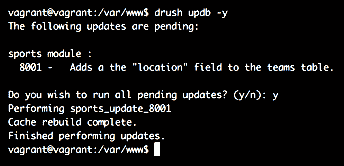

# 数据库 API

在前两章中，我们详细讨论了作为 Drupal 8 模块开发者，我们在 Drupal 8 中建模和存储数据的选项。我们还看到了一些如何使用诸如状态、配置和实体 API 的例子，通过使用后者构建有用的东西来更详细地介绍后者。从那些章节中，一个关键的收获是需要自定义数据库表和/或直接对它们和数据库进行查询的需求已经变得很小。

实体系统更加灵活和健壮，配置和内容实体的组合提供了存储数据的大部分需求。此外，实体查询和加载机制也使得查找它们变得容易。很可能，这已经足够满足大多数用例。

此外，诸如状态 API（键/值）和 UserData 之类的存储子系统也已经消除了创建自定义表来存储那种“一次性”数据的大部分需求。此外，配置 API 提供了一个统一的方式来建模可导出数据，从而不再需要其他任何东西。

然而，除了这些特性之外，Drupal 还有一个强大的数据库 API，实际上在幕后为它们提供动力。这个 API 在我们需要时提供给我们。例如，我们可以创建自己的数据库表，然后以我们想要的方式对它们进行查询，所有这些都在一个可以工作在多种数据库之上的安全层中完成。

创建自定义数据库表并不是你经常要做的事情——也许永远不会——但在本章中，你仍然会学习如何使用 API 来做到这一点。有些贡献的模块确实有合法用途，而且谁知道呢，你可能也会有。因此，理解这个系统仍然很重要。然而，更重要的是运行查询的 API（尤其是选择查询），因为你可能需要运行这些查询，甚至针对实体。有时实体查询并不能提供你需要的一切，因此基于复杂查询查找实体实际上可能更常见。因此，我们将在本章中介绍如何做到这一点。

更具体地说，在本章中，我们将首先创建几个数据库表，以便我们可以看到 Schema API 在 Drupal 8 中的工作方式。对于 D7 开发者来说，这看起来非常熟悉。然后，我们将看到我们可以通过使用数据库抽象层对这些表执行查询的各种方式。我们可以执行两种不同的选择查询，我们将练习这两种。对于其他（`INSERT`、`UPDATE`和`DELETE`），有标准的方法来做。接下来，我们将看看如何修改查询以及如何为它们标记以实现更好的定位。最后，我们将探讨数据库更新钩子，这是在 Drupal 的前几个版本中配置部署的主要方式之一。实际上，这些钩子的目的是在表已经创建后进行数据库更新。

# 模式 API

Schema API 的目的是允许在 PHP 中定义数据库表结构，并让 Drupal 与数据库引擎交互，将这些定义转化为现实。除了我们永远不需要看到诸如 `CREATE TABLE` 这样的语句之外，我们还确保我们的表结构可以应用于多种类型的数据库。如果您还记得在 第一章，*为 Drupal 8 开发* 中，我提到 Drupal 可以与 MySQL、PostgreSQL、SQLite 等数据库一起工作，如果它们支持 PDO，那么 Schema API 确保了这种跨兼容性。

Schema API 的核心组件是 `hook_schema()`。这个钩子用于提供给定模块的初始表定义。此钩子的实现应位于模块的 `*.install` 文件中，并在模块首次安装时触发。如果需要对现有数据库表进行修改，可以在更新钩子内部使用多种方法来执行这些更改。

在本节中，我们将创建一个名为 `sports` 的新模块，我们希望在其中定义两个表：`players` 和 `teams`。前者的记录可以引用后者的记录，因为每个球员一次只能属于一个团队。这是一个简单的例子，并且可以也应该使用实体来实现。然而，为了演示数据库 API，我们将坚持手动设置。

因此，在我们的 `sports.install` 文件中，我们可以这样实现 `hook_schema()`：

```php
/**
 * Implements hook_schema().
 */
function sports_schema() {
  $schema = [];

  $schema['teams'] = [
    'description' => 'The table that holds team data.',
    'fields' => [
      'id' => [
        'description' => 'The primary identifier.',
        'type' => 'serial',
        'unsigned' => TRUE,
        'not null' => TRUE,
      ],
      'name' => [
        'description' => 'The team name.',
        'type' => 'varchar',
        'length' => 255,
        'not null' => TRUE,
      ],
      'description' => [
        'description' => 'The team description.',
        'type' => 'text',
        'size' => 'normal',
      ],
    ],
    'primary key' => ['id'],
  ];

  $schema['players'] = [
    'description' => 'The table that holds player data.',
    'fields' => [
      'id' => [
        'description' => 'The primary identifier.',
        'type' => 'serial',
        'unsigned' => TRUE,
        'not null' => TRUE,
      ],
      'team_id' => [
        'description' => 'The ID of the team it belongs to.',
        'type' => 'int',
        'unsigned' => TRUE,
      ],
      'name' => [
        'description' => 'The player name.',
        'type' => 'varchar',
        'length' => 255,
        'not null' => TRUE,
      ],
      'data' => [
        'description' => 'Arbitrary data about the player.',
        'type' => 'blob',
        'size' => 'big',
      ],
    ],
    'primary key' => ['id'],
  ];

  return $schema;
}
```

此钩子的实现需要返回一个关联数组，以表名为键，其值是一个定义相应表的数组。表定义由各种类型的信息组成，特别是各个列的定义（字段），以及哪些字段代表主键、外键（严格来说仅用于文档目的）、唯一键和索引等。要查看所有可用选项的完整参考，请查阅 Drupal.org ([`www.drupal.org/`](https://www.drupal.org/)) 的 Schema API 文档页面。

在我们的示例中，我们定义了之前提到的两个表，并在 `fields` 数组中定义了它们的字段。`primary key` 指示哪个字段将用于此目的，我们选择了标准的 `id` 字段。说到这一点，后者是一个 `serial` 类型的字段，这意味着它是一个具有自增选项的整数。对于整数、浮点数和数值等数字字段，`unsigned` 选项意味着数字不能低于 0。`not null` 也很容易理解——它防止列始终为空。

对于团队和玩家名称，我们选择了一个简单的`varchar`字段，它最多可以接受 255 个字符（这是一个相当标准的表列定义），这些字段也不能为空。另一方面，描述字段是`text`类型，大小为`normal`（与`tiny`、`small`、`medium`或`big`相对）。在这里，我们希望存储超过 255 个字符的字符串。在撰写这本书的时候，关于 Drupal 8 可用数据类型（及其选项）的完整文档还不存在；然而，D7 版本（[`www.drupal.org/docs/7/api/schema-api/data-types`](https://www.drupal.org/docs/7/api/schema-api/data-types)）是一个很好的指标，并且将几乎完全相同地工作。 

最后，对于玩家表，我们还有一个`team_id`，它是一个简单的整数字段，还有一个`data`列，我们想在其中存储一些任意序列化的数据。这是一个`blob`类型，也可以是`big`或`normal`。

对于我们的模式定义，这基本上就结束了。安装`sports`模块将根据这些定义自动为我们创建这些表。同样重要的是，卸载模块也会删除这些表，所以我们不需要进行任何处理。然而，如果我们的模块已经启用，并且之后添加了这个实现，它将不会被触发。相反，我们需要实现一个更新钩子并使用`drupal_install_schema()`函数，这将触发它。如下所示：

```php
drupal_install_schema('sports');  
```

我们很快就会看到更多关于更新钩子的内容。

# 执行查询

现在我们有一些表可以操作了，让我们看看如何对它们执行查询。如果你在跟随，为了测试目的，你可以通过你选择的数据库管理工具向表中添加一些虚拟数据。我们很快就会看到`INSERT`语句，但在那之前，我们需要讨论你将运行更常见的查询类型——`SELECT`。

使用 Drupal 8 数据库抽象层的查询是通过一个中央数据库连接服务——`database`来执行的。静态地，可以通过快捷方式访问它：

```php
$database = \Drupal::database();  
```

与我们之前看到的那些服务相比，这个服务是特殊的一个，因为它实际上是使用工厂创建的。这是它的定义，以更好地帮助你理解我的意思：

```php
database:
  class: Drupal\Core\Database\Connection
  factory: Drupal\Core\Database\Database::getConnection
  arguments: [default]
```

这是一个定义，其中将实例化的责任委托给之前提到的工厂，而不是像之前那样委托给容器。因此，生成的类不一定需要与`class`键指定的类匹配。然而，在这种情况下，`Drupal\Core\Database\Connection`是一个抽象基类，生成的服务会扩展它。再次强调，在这种情况下，`arguments`负责指定它必须创建的连接类型。使用的是“site-default”类型（通常是 MySQL），这意味着生成的服务将是一个`Drupal\Core\Database\Driver\mysql\Connection`的实例。

从这个连接服务中，我们可以请求相关的对象，从而构建查询。那么，让我们看看这些是如何工作的。

# 选择查询

在 Drupal 8 中，我们可以有两种方式运行选择查询，它们的工作方式与 Drupal 7 中的方式相似。我们拥有`db_query()`和`db_query_range()`的 D8 等价函数，以及`db_select()`的等价函数。这对于 D7 开发者来说应该很熟悉。在 Drupal 8 中，这些过程式函数仍然存在，但处于弃用状态。这意味着我们不应该使用旧函数，而应该使用我接下来要提到的连接服务。

第一种选择查询通常性能更好，因为我们通过编写 SQL 语句（当然，包括占位符）来构建它们，而`db_select()`类型的查询是一个面向对象的查询构建器，它仍然需要将链式对象结构转换为 SQL 语句。然而，不要让这种性能成为真正的决定因素，因为正如你可以想象的那样，影响微乎其微。此外，查询构建器是运行查询的正确方式，因为它们是可更改的（可以分解）。

第一种选择查询通常用于更简单的查询，但如果你是 SQL 大师，实际上使用该方法编写复杂查询可能会更快、更简单。此外，它们依赖于开发者确保 SQL 语句与底层数据库兼容。因此，在选择这两种类型时，需要考虑所有这些因素。

让我们先看看如何使用类似`db_query()`的方法运行对表格的基本查询。然后，我们将看到同样的查询如何以其他方式运行：

```php
$database = \Drupal::database();
$result = $database->query("SELECT * FROM {players} WHERE id = :id", [':id' => 1]);
```

这是一个简单的 SQL 语句，尽管如果你没有进行过任何 D7 开发，它可能有点奇怪。我们将查询字符串作为第一个参数传递给连接对象的`query()`方法。第二个参数是查询字符串的占位符值数组。这些占位符值在整个 SQL 字符串中由冒号（`:id`）引导，稍后会被与占位符值数组中相同键对应的值所替换。另外，需要注意的是，查询中的表名被大括号包围。这是因为实际上，当站点安装时，表名可能会被添加前缀，而我们的代码不应该关心这个前缀。Drupal 会自动添加它。

现在，让我们看看如何使用查询构建器运行相同的查询：

```php
$result = $database->select('players', 'p')
   ->fields('p')
   ->condition('id', 1)
   ->execute();
```

这次，我们将使用连接对象上的 `select()` 方法来获取一个 `SelectInterface` 实例，我们可以用它来构建我们的查询。我们需要传递我们想要查询的表，以及该表的别名。这在执行连接操作时尤其重要。然后，我们使用 `fields()` 方法来指定我们想要检索的表列。第一个参数是表别名，而第二个（可选）是一个列名数组。所有列都将被包括（`*`）。接下来，我们有一个单一的条件应用于查询的 `id` 列和值 `1`。第三个可选参数是默认为 `=` 的运算符。最后，我们执行查询并得到与前面示例相同的结果。

如果你记得的话，你会立即注意到，这个查询构建器的结构非常类似于实体查询，并且组件在某种程度上也是可链式的，正如我们将看到的。

# 处理结果

之前的两个查询都返回一个 `StatementInterface`，它是可迭代的。因此，要访问其数据，我们可以这样做：

```php
foreach ($result as $record) {
  $id = $record->id;
  $team_id = $record->team_id;
  $name = $record->name;
  $data = $record->data;
}
```

循环中的每个项目都是一个 `stdClass`，它们的属性名是返回的实际列名，而它们的值是列值。

或者，`StatementInterface` 也有一些可以以不同方式为我们准备结果的获取器方法。这些方法大多来自父类 `\PDOStatement`，它是原生 PHP。最简单的是 `fetchAll()`：

```php
$records = $result->fetchAll();  
```

这返回了一个 `stdClass` 对象数组，正如我们之前看到的，所以它为我们做了所有的循环来提取记录。如果我们想按记录中字段的值来键控这个数组，我们可以执行以下操作：

```php
$records = $result->fetchAllAssoc('id');
```

这将使用 `id` 字段中的值作为数组的键。

如果我们期望单条记录，我们也可以使用 `fetch()` 方法，它只返回这样一个对象（结果集中的下一个对象）；`fetchObject()` 做的是同样的事情。

# 更复杂的查询选择

现在我们创建一个更复杂的查询，将我们的团队表和球员信息连接起来，并在同一记录中检索团队信息：

```php
$result = $database->query("SELECT * FROM {players} p JOIN {teams} t ON t.id = p.team_id WHERE p.id = :id", [':id' => 1]);  
```

这将返回与之前相同的记录，但包括匹配的团队记录的值。注意，由于我们有一个连接，所以我们在这里也必须使用表别名。然而，这个查询有一个问题——由于两个表都有 `name` 列，我们不能使用 `*` 来包含所有字段，因为它们将被覆盖。相反，我们需要手动包含它们：

```php
$result = $database->query("SELECT p.id, p.name as player_name, t.name as team_name, t.description as team_description, p.data FROM {players} p JOIN {teams} t ON t.id = p.team_id WHERE p.id = :id", [':id' => 1]); 
```

如你所见，我们指定了想要包含的两个表中的字段，并在存在名称冲突的地方使用了不同的别名。现在，让我们使用查询构建器来编写相同的查询：

```php
$query = $database->select('players', 'p');
$query->join('teams', 't');
$query->addField('p', 'name', 'player_name');
$query->addField('t', 'name', 'team_name');
$query->addField('t', 'description', 'team_description');
$result = $query
  ->fields('p', ['id', 'data'])
  ->condition('p.id', 1)
  ->execute();

$records = $result->fetchAll();
```

首先，查询构建器上的不是所有方法都是可链式的。`join()`方法（以及其他类型的连接方法，如`innerJoin()`、`leftJoin()`和`rightJoin()`）以及`addField()`方法是一些突出的例子。后者是一种我们可以通过指定别名来向查询中添加字段的方法（我们无法通过`fields()`方法来做）。此外，`condition()`字段也带有它需要的表别名前缀（在我们之前没有使用连接时这不是必要的）。

关于构建查询的所有其他有用方法的更多信息，请访问`SelectInterface`和`ConditionInterface`。它们在那里通常有很好的文档说明。

# 范围查询

由于将查询限制到特定范围取决于底层数据库引擎，我们还在数据库连接服务上有一个`queryRange()`方法，我们可以用它来编写包含范围的查询：

```php
 $result = $database->queryRange("SELECT * FROM {players}", 0, 10);  
```

在这个例子中，我们查询所有球员并将结果集限制为前 10 条记录（从 0 到 10）。因此，使用这种方法，占位符值数组是`$from`和`$count`之后的第四个参数。

或者，使用`SELECT`查询构建器，我们在`SelectInterface`上有一个方法，可以指定一个范围。因此，按照这种格式，之前的查询将看起来像这样：

```php
$result = $database->select('players', 'p')
   ->fields('p')
   ->range(0, 10)
   ->execute();
```

如你所见，我们有`range()`方法，它接受这些参数并限制查询。

关于在实体表上运行选择查询的注意事项：如果你可以使用实体查询来完成，请使用它。如果不能，请随意使用数据库 API。然而，坚持使用查询来确定所需实体的 ID，然后使用实体存储处理程序正确加载这些实体。这与 Drupal 7 中的许多情况不同，那时我们直接从这样的查询中使用了字段值。在 Drupal 8 中，这被高度不建议。

# 分页器

现在我们已经看到了如何进行各种类型的`SELECT`查询，让我们看看如何使用 Drupal 内置的分页功能以及 Drupal 8 中的分页器是如何工作的。我们将通过运行一些查询并在表格中渲染结果来展示这些。如果你不记得输出表格的主题方面，请参阅第四章，*主题化*。

我们的游乐场将位于一个新的控制器方法中（`SportsController::players()`），它映射到具有`/players`路径的路由。如果你不记得如何创建路由，请参阅第二章，*创建您的第一个模块*，以刷新记忆。

我们首先要做的是创建一个简单的查询，该查询加载所有球员并在表格中输出它们。为了简单起见，我们只显示球员名字：

```php
/** 
 * Renders a table of players. 
 */ 
public function players() { 
  $query = $this->database->select('players', 'p') 
    ->fields('p'); 
  $result = $query->execute()->fetchAll(); 
  $header = [$this->t('Name')]; 
  $rows = []; 

  foreach ($result as $row) { 
    $rows[] = [ 
      $row->name 
    ]; 
  } 

  $build = []; 
  $build[] = [ 
    '#theme' => 'table', 
    '#header' => $header, 
    '#rows' => $rows, 
  ]; 

  return $build; 
} 
```

所有这些对你来说应该都很熟悉。我们正在运行查询并准备表格数据，使用`table`主题钩子来渲染它。你会注意到我们正在创建一个`$build`数组，这样我们就可以在最终输出中包含更多内容。

通过导航到`/players`，我们现在应该已经看到了一个包含我们玩家名称的表格。这将成为我们探索分页器的基线。

分页器通过在全局状态中存储有关查询的一些信息来工作，即要分页的总项目数、每页的项目限制以及相应分页器的标识符（这样我们就可以同时拥有多个分页器）。所有这些信息都使用以下代码设置（你现在不需要在任何地方添加此代码）：

```php
pager_default_initialize($total, $limit, $element = 0);  
```

此外，当前页码由 URL 中的查询参数确定，名称为`page`。

一旦分页器初始化，我们就有一个`pager`渲染元素，我们可以用它轻松渲染一个使用这些信息并构建所有必要链接以在页面之间移动的主题分页器。作为查询构建者，我们接下来必须读取当前页码并在我们的查询中使用它。

然而，处理分页器有一个更简单的方法，那就是使用*选择扩展器*。这些是针对我们之前看到的`SELECT`查询类的装饰器类，它们允许我们通过额外的功能对其进行装饰，例如分页或排序；它们封装了处理查询中分页所需的所有功能。让我们看看它是如何工作的。

下面是我们的玩家查询将如何使用`PagerSelectExtender`来显示：

```php
$limit = 5; // The number of items per page. 
$query = $this->database->select('players', 'p') 
  ->fields('p') 
  ->extend('\Drupal\Core\Database\Query\PagerSelectExtender') 
  ->limit($limit); 
$result = $query->execute()->fetchAll();  
```

如您所见，我们在`SELECT`查询构建器上有一个`extend()`方法，它允许我们传递将装饰结果`SELECT`查询类的类名。这也为我们提供了一个名为`limit()`的新方法，通过它我们可以指定每页要加载的记录数。在底层，它使用我们之前看到的`range()`方法。此外，在运行查询时，它使用`pager_default_initialize()`为我们初始化分页器，甚至自己确定当前页码。所以通常你会直接使用扩展器。

*装饰器模式*是一种面向对象的编程设计模式，它允许我们静态或动态地向现有对象添加行为，而不会改变它或同一类其他对象的行为。装饰器本质上是对现有对象的包装，以提供从外部额外的功能。

因此，我们现在需要做的就是渲染以下分页器（在表格下方）：

```php
$build[] = [ 
  '#type' => 'pager' 
]; 
```

这不是正火箭科学吗？其实不是。如果我们刷新页面，现在我们应该只看到表格中的五个玩家，以及它下面的分页器。

分页渲染元素([`api.drupal.org/api/drupal/core%21lib%21Drupal%21Core%21Render%21Element%21Pager.php/class/Pager/8.2.x`](https://api.drupal.org/api/drupal/core%21lib%21Drupal%21Core%21Render%21Element%21Pager.php/class/Pager/8.2.x))有一些有趣的属性，我们可以使用它们来进一步定制它。我们可以向生成的链接中添加查询元素，或者如果我们想的话，甚至可以指定另一个路由。当然，我们可以控制分页链接的标签，甚至输出的链接数量。查看该元素的文档以获取更多信息。

此外，为了实现完全定制，我们还可以选择通过实现自己的预处理器（例如`template_preprocess_page`）来预处理这些变量，或者覆盖`pager.twig.html`模板文件。我们在第四章，*主题化*中学习了如何做这些事情。

# 插入查询

为了将数据插入到我们的自定义数据库表中，我们有一个可用的`INSERT`查询构建器。对于这种和其他类型的查询，强烈建议不要使用`db_query()`方法，因为 Drupal 无法保证它在不同的数据库引擎类型上都能正常工作。相反，我们可以使用连接服务上的`insert()`方法，并使用返回的`Insert`对象来构建我们的查询。那么，让我们看看我们如何向我们的`players`表中添加一条记录：

```php
$database->insert('players');
$fields = ['name' => 'Diego M', 'data' => serialize(['known for' => 'Hand of God'])];
$id = $database->insert('players')
  ->fields($fields)
  ->execute();
```

插入查询的主要问题是`fields()`方法。它期望一个键/值对的数组，其中键是列名，值是需要添加到相应列的数据。或者，第一个参数可以是一个列名的数组，第二个是一个与第一个数组中列名顺序相同的值的数组。

我们也可以使用多组值（记录）运行一个`INSERT`查询：

```php
$values = [
  ['name' => 'Novak D.', 'data' => serialize(['sport' => 'tennis'])],
  ['name' => 'Micheal P.', 'data' => serialize(['sport' => 'swimming'])]
];
$fields = ['name', 'data'];
$query =  $database->insert('players')
  ->fields($fields);
foreach ($values as $value) {
  $query->values($value);
}
$result = $query->execute();
```

在这个例子中，`fields()`方法只接收需要插入的列名的数组，我们使用`values()`方法调用来添加单个值。

`execute()`方法通常返回最后插入的记录的 ID（主键）。这很有用，尤其是如果你只插入一条记录。然而，对于多个插入，它也可能具有误导性。所以，请根据自己的不同用例进行实验。

# 更新查询

现在我们已经看到了`INSERT`查询，让我们看看我们如何更新现有记录。假设我们想要更新我们的玩家记录之一；我们将这样做：

```php
$result = $database->update('players')
  ->fields(['data' => serialize([
    'sport' => 'swimming', 
    'feature' => 'This guy can swim'
  ])])
  ->condition('name', 'Micheal P.')
  ->execute();
```

`UPDATE`查询类似于`INSERT`查询，不同之处在于它们需要一个`condition()`来确定要更新的记录（所有符合该条件的记录）。省略这一点将自然地更新所有记录。使用`fields()`方法，我们将简单地指定哪些列正在更新，以及更新为什么。如果我们省略一个列，它将保持不变。最后，这个查询的结果是受影响的记录总数。

# 删除查询

最后，我们还可以使用 `DELETE` 查询删除我们的记录：

```php
$result = $database->delete('players')
   ->condition('name', 'Micheal P.')
   ->execute();
```

所有匹配条件的记录都将被删除。请注意这一点，因为与更新查询一样，省略条件基本上会截断你的表。查询将返回受影响的记录数，即被删除的记录数。

虽然你可以针对实体和字段表编写 `SELECT` 查询以找到你想要加载的实体的 ID，但你绝不应该对这些表执行 `INSERT`、`UPDATE` 或 `DELETE` 查询。你面临很高的风险会损坏你的数据。

# 事务

Drupal 数据库 API 还提供了一种表示和处理数据库事务（对于支持这些数据库类型的数据库）的方法。事务是一种将数据库操作包装并分组在一起，并以“全部或无”的方式提交它们的方式。例如，如果你有多个相关的记录，可能你只想在其中一个记录的 `INSERT` 操作因某些原因失败时写入其中一些。这可能会导致你得到损坏或不完整的数据，从而使你的应用程序陷入混乱。

在开启事务之后执行多个数据库更改操作，只有在事务关闭时才会最终确定（提交）这些更改到数据库。如果出现问题，它也可以回滚，这将防止数据被提交。

在 Drupal 8 中，事务由一个 `Transaction` 对象表示（每个数据库类型都有一个特定的子类）。一旦对象被销毁（不再在作用域内），操作就会被提交到数据库。然而，如果我们得到我们的操作中出错的指示（通常是通过捕获异常），我们可以回滚事务，这将阻止这些操作被提交。此外，事务可以嵌套，因此 Drupal 会跟踪在另一个事务的作用域内打开的事务。

让我们看看如何使用事务的示例：

```php
$transaction = $database->startTransaction();
try {
  $database->update('players')
    ->fields(['data' => serialize(['sport' => 'tennis', 'feature' => 'This guy can play tennis'])])
    ->condition('name', 'Novak D.')
    ->execute();
}
catch (\Exception $e) {
  $transaction->rollback();
  watchdog_exception('my_type', $e);
}
```

我们首先使用我们的连接服务启动了一个事务。然后，我们将操作包装在一个 *try/catch* 块中，以捕获在执行过程中可能抛出的任何异常。如果抛出了异常，我们将回滚事务，因为我们不想将任何内容提交到数据库，因为我们不知道什么失败了，我们的数据处于什么状态。最后，我们使用了 `watchdog_exception()` 辅助函数将异常记录到数据库日志中。请注意，在回滚之前记录这个异常将防止异常被写入数据库。

如果没有异常，操作会在`$transaction`变量被移除且不再在作用域内（通常在函数末尾）时立即提交。值得注意的是，如果在这次事务中我们调用另一个执行数据库操作的功能，这些操作将默认成为同一事务的一部分。因此，如果我们回滚，它们也会回滚；如果我们不回滚，它们会提交。这就是为什么在回滚之前调用数据库看门狗日志不会被保存的原因。

# 查询修改

在 Drupal 中，许多东西都可以通过各种钩子进行修改；查询也不例外。这意味着如果一个模块编写了之前看到的查询，其他模块可以通过实现`hook_query_alter()`来修改它。所以让我们考虑一个例子，看看它是如何工作的。

让我们假设以下查询，它简单地返回所有球员记录：

```php
$result = $database->select('players', 'p')
   ->fields('p')
   ->execute();
```

假设另一个模块想要修改这个查询并限制结果只找到特定队伍的球员。有一个问题。我们的查询没有标记可以指示另一个模块需要修改的是这个查询。正如你可以想象的那样，在任何请求中都会运行大量的查询，因此识别查询变得不可能。这时就出现了*查询标签*。

之前的查询无法修改，因为它无法识别，因此`hook_query_alter()`甚至不会在其上触发。为了使其可修改，我们需要添加一个查询标签并使其可识别。查询构建器上有一个简单的方法可以做到这一点：`addTag()`：

```php
$result = $database->select('players', 'p')
   ->fields('p')
   ->addTag('player_query')
   ->execute();
```

查询标签是简单的字符串，可以从`hook_query_alter()`实现内部读取。因此，我们可以这样修改查询：

```php
/**
 * Implements hook_query_alter().
 */
function module_name_query_alter(Drupal\Core\Database\Query\AlterableInterface $query) {
  if (!$query->hasTag('player_query')) {
    return;
  }

  // Alter query
}
```

这个钩子的唯一参数是我们可以对其应用更改的查询对象。它还有读取标签的方法，例如`hasTag()`、`hasAnyTag()`或`hasAllTags()`。在之前的例子中，我们采取了防御性方法，如果查询不是关于我们的`player_query`标签查询，就简单地退出。我稍后会回到这个问题。

现在，让我们看看我们如何修改这个查询以实现我们的目标：

```php
$query->join('teams', 't', 't.id = p.team_id');
$query->addField('t', 'name', 'team_name');
$query->condition('t.name', 'My Team');
```

如你所见，我们正在做与之前构建联合查询时类似的事情。我们将队伍表连接起来，添加其名称字段（作为额外奖励），并设置一个条件，只返回特定队伍的球员。轻而易举。

让我们再次回到我对这个钩子实现采取的防御性方法的评论。我个人更喜欢保持方法简短并尽早返回，而不是有一堆难以理解的嵌套条件。在面向对象的环境中，这通常很容易做到。然而，在过程式代码中，这会变得有点繁琐，因为你需要许多难以命名的私有函数，而且在钩子实现中，你可能需要添加多个代码块。例如，在我们的`hook_query_alter()`实现中，我们可能需要在稍后添加对另一个查询的修改。此外，由于我们尽早返回，我们需要添加另一个条件来检查两个标签，然后是一些更多的条件和*if*语句，以及更多的条件（好吧，发牢骚结束了）。从 PHP 的角度来看，在这种情况下，你会根据查询的标签将实际逻辑委托给另一个函数，要么使用简单的 switch 块，要么使用*if*条件。这样，如果出现新的标签，可以为其创建一个新的函数，并从 switch 块中调用它。然而，在这种情况下，我们可以做得更好。

有几个钩子，尤其是*修改*钩子，具有一般的目标，但也具有更具体的目标。在这个例子中，我们还有一个针对特定标签的`hook_query_TAG_alter()`钩子。因此，我们不是将任务委托给其他函数，而是可以实施更具体的：

```php
/**
 * Implements hook_query_TAG_alter().
 */
function module_name_query_player_query_alter(Drupal\Core\Database\Query\AlterableInterface $query) {
  // Sure to alter only the "player_query" tagged queries.
}
```

因此，本质上，标签本身成为了函数名的一部分，我们不需要任何额外的函数。

# 更新钩子

在本章的开头，我们使用`hook_schema()`定义了两个表格，该函数与模块一起安装。为了重申，如果模块已经安装，我们可以通过使用`drupal_install_schema()`函数来触发模式安装。然而，如果我们稍后需要向`teams`表添加另一列，那该怎么办呢？我们的模块已经安装，模式也是如此；所以我们不能在生产环境中完全卸载它来再次触发模式创建，更不用说丢失数据了。幸运的是，有一个系统可以处理这种情况，即*更新*钩子——`hook_update_N()`——其中`N`代表模式版本。这些是按顺序命名的钩子实现，它们位于模块`*.install`文件中，并且在运行更新时被触发，无论是通过访问`/update.php`还是使用`drush updatedb`命令。

这些更新钩子的主要目的是对现有的数据库表进行模式更改。然而，部分原因是早期版本的 Drupal 中配置管理系统较弱，它们已经通过开发者的创造力发展成为一种更新各种类型配置或执行部署到下一个环境时的任务（甚至与内容相关的任务）的机制。帮助实现这一点的是传递给钩子实现的`$sandbox`参数，它可以用来批量这些操作（以防止执行超时）。我们在这里不会涉及这个方面，而是在未来的章节中讨论独立的批量 API，从中学到的经验你将能够在这里应用。相反，我们将看到如何实现这样的钩子以执行模式更新。

如前所述，这些钩子实现会放入`*.install`文件中。让我们看看一个例子：

```php
/**
 * Update hook for performing an update task.
 */
function my_module_update_8001(&$sandbox) {
  // Do stuff
}
```

此钩子实现的 DocBlock 应该包含对其功能的描述。当运行更新时（无论是通过 UI 还是使用 Drush）会显示出来。

函数的名称是其最重要的方面之一。它以模块名称开头，然后是`update`，最后是模块的模式版本（如果我们希望此更新钩子实际运行，则是下一个版本）；但模块的模式版本是什么？

安装后，Drupal 为每个模块设置一个模式版本：8000。在 Drupal 7 中，它是 7000，在 6 中是 6000。你得到了 Drupal 主要版本的差异。当更新钩子运行时，Drupal 将该模块的模式版本设置为更新钩子中找到的编号。所以，在前面的例子中，它将是 8001。这是为了跟踪所有更新钩子，并且不运行它们超过一次。按照惯例，但不是必需的，模式版本从左数第二个数字代表模块本身的主要版本号。例如，对于`8.x-1.x`版本，它将是 8101。

现在我们来看看如何通过更新钩子来修改我们的`teams`数据库表，并添加一个用于存储`location`字符串字段的列。我们首先想要做的是更新我们的`hook_schema()`实现，并将这些信息也添加进去。在我们的情况下，这不会做任何事情；然而，由于更新钩子的工作方式，我们仍然需要将其添加进去。我的意思是，如果一个模块首先安装并且其中已经存在更新钩子，那么这些更新钩子不会运行，但模块的模式版本会被设置为在模块中找到的最后一个更新钩子的编号。所以，如果我们不在`hook_schema()`内部添加我们的新列，那么在另一个站点（甚至是在卸载后当前站点）安装此模块将不会得到我们的新列。因此，我们需要考虑这两种情况。

在我们的`teams`表模式定义的字段定义中，我们可以添加以下列定义：

```php
'location' => [
   'description' => 'The team location.',
   'type' => 'varchar',
   'length' => 255,
 ],
```

就这么简单。接下来，我们可以实现一个更新钩子并将此字段添加到表中：

```php
/**
 * Adds the "location" field to the teams table.
 */
function sports_update_8001(&$sandbox) {
  $field = [
    'description' => 'The team location.',
    'type' => 'varchar',
    'length' => 255,
  ];
  $schema = \Drupal::database()->schema();
  $schema->addField('teams', 'location', $field);
}
```

在这里，我们使用了相同的字段定义，加载了数据库连接服务，并使用其模式对象将此字段添加到表中。代码本身相当直观，但还值得一提的是，这是一个我们不能注入服务的示例，因此我们必须静态地使用它。所以，对于这种情况，请不要感到难过。

接下来，我们可以使用 Drush 来运行更新：



当然，`teams`表现在有一个新列。如果您再次尝试运行更新，您会注意到没有可运行的更新，因为 Drupal 已将`sports`模块的模式版本设置为 8001。因此，下一个要运行的更新必须在末尾有 8002（或者，在任何情况下，大于 8001 且小于 9000 的任何数字）。

在前面的示例中，我们向一个现有的表中添加了一个新字段。然而，我们可能需要完全创建一个新表，甚至删除一个。数据库连接服务上的模式对象提供了相关方法来完成这些操作。以下是一些示例，但我建议您查看`Drupal\Core\Database\Schema`基类以了解可用的方法：

```php
$schema->createTable('new_table', $table_definition);
$schema->addField('teams', 'location', $field);
$schema->dropTable('table_name');
$schema->dropField('table_name', 'field_to_delete');
$schema->changeField('table_name', 'field_name_to_change', 'new_field_name', $new_field_definition);
```

在使用更新钩子时，有几个注意事项需要考虑。例如，在钩子实际运行之前，您无法确定环境的状况，因此请确保您考虑到这一点。我建议您查看关于`hook_update_N()`的文档([`api.drupal.org/api/drupal/core%21lib%21Drupal%21Core%21Extension%21module.api.php/function/hook_update_N/8.2.x`](https://api.drupal.org/api/drupal/core%21lib%21Drupal%21Core%21Extension%21module.api.php/function/hook_update_N/8.2.x))，并仔细阅读关于函数体的部分。

# 摘要

在本章中，我们探讨了与数据库 API 交互的基础知识。尽管在日常 Drupal 模块开发中，它在重要性上已经退步了很多，但了解它并能够与之工作是很重要的。

我们以创建我们自己的数据库表开始本章，以关系方式存储玩家和团队信息。我们这样做是使用一个 API，该 API 将定义转换为实际的表，而无需我们了解太多关于 MySQL 的知识。然而，SQL 术语和基本操作是每个开发者都应该熟悉的，尽管他们在 Drupal 的实际日常应用中可能并不常用。

然后，我们查看了一些示例，展示了如何使用更偏向 SQL 的语句编写方式以及查询构建器方法来运行`SELECT`、`INSERT`、`UPDATE`和`DELETE`查询。我们还看到了这些查询如何被封装到事务中（在支持的情况下），以便在最小化数据不完整或损坏的潜在风险的同时提交数据更改。最后，我们看到了如何使用查询标签来修改这些查询，这为其他模块通过贡献提供了另一个小的扩展点。然而，无论我们如何构建我们的查询，一个关键要点是使用此 API 对于与数据库的安全交互至关重要。此外，它还考虑了与 Drupal 可以工作的不同数据库类型的跨兼容性。

最后，我们探讨了更新钩子及其如何被用来对数据库表进行更改。不仅如此，它们还可以被用来执行一些可能需要编码并部署到下一个环境以运行一次的其他任务。然而，由于 Drupal 8 配置 API，这种需求已经显著减少。

在下一章中，我们将探讨自定义 Drupal 8 实体字段，并了解我们如何定义自己的字段；是的，我们将玩一些更多的插件。
