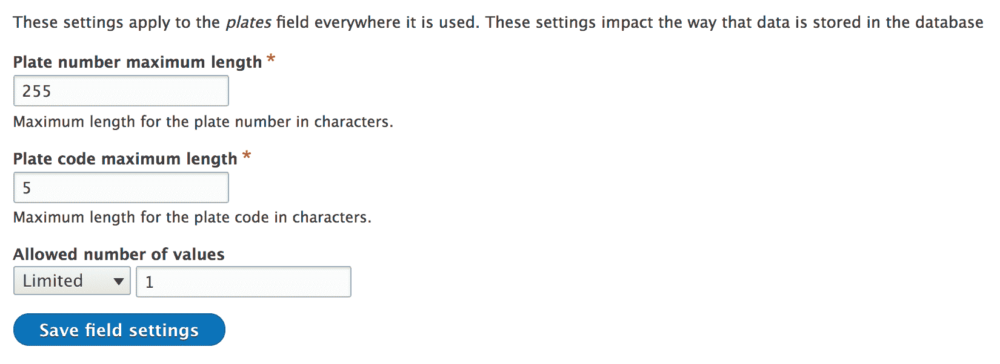
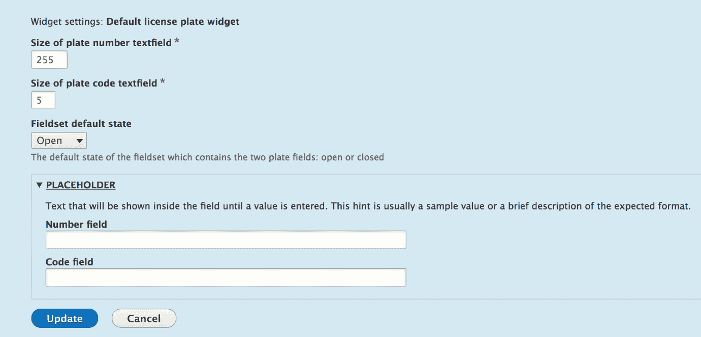

# 自定义字段

在第六章《数据建模和存储》和第七章《您的自定义实体和插件类型》中，我们广泛地讨论了内容实体以及它们如何使用字段来存储它们应该表示的实际数据。然后，我们看到了这些字段如何除了与存储层交互以持久化数据之外，还扩展了 Typed Data API 类，以便在代码级别更好地组织这些数据。例如，我们看到了在实体上使用的`BaseFieldDefinition`实例实际上是数据定义（`FieldConfig`也是）。此外，我们还看到了起作用的 DataType 插件，即`FieldItemList`及其各自的项，这些项最终扩展了一个基本的 DataType 插件（在大多数情况下是`Map`）。此外，如果你还记得，当我们讨论这些项时，我提到了它们实际上是另一种插件的实例——`FieldType`。所以本质上，它们是一种插件类型，其插件扩展了另一种类型的插件。我建议如果你对此事不太清楚，请重新阅读那一节。

这些概念中的大多数都隐藏在实体 API 内部，只有开发人员才能看到和理解。然而，`FieldType`插件（以及它们对应的`FieldWidget`和`FieldFormatter`插件）脱颖而出，是网站构建者和内容编辑人员在 UI 中实际操作的主要事物之一。它们允许用户输入结构化数据并将其保存到数据库中。如果你还记得，我在第六章和第七章中提到了它们几次，并承诺会有一章介绍我们如何创建网站构建者可以添加到实体类型并用于输入数据的字段类型。好吧，这就是那一章，但首先，让我们快速回顾一下我们对它们的了解。

# 字段类型插件回顾

字段类型插件扩展了低级别的 TypedData API，以创建一种独特的方式，不仅表示数据（在实体的上下文中），而且将其存储到数据库中（以及其他一些内容）。它们主要被用作网站构建者可以添加到实体类型包中的字段类型。例如，一个纯文本字段或具有多个选项的选择列表。在 CMS 中，没有什么比这更常见了。

然而，它们也被用作实体基本字段类型。如果你还记得我们的产品实体类型的`name`字段定义，我们实际上确实使用了这些插件类型：

```php
$fields['name'] = BaseFieldDefinition::create('string') 
  ->setLabel(t('Name')) 
  ->setDescription(t('The name of the Product.')) 
  ->setSettings([ 
    'max_length' => 255, 
    'text_processing' => 0, 
  ]) 
  ->setDefaultValue('') 
  ->setDisplayOptions('view', [ 
    'label' => 'hidden', 
    'type' => 'string', 
    'weight' => -4, 
  ]) 
  ->setDisplayOptions('form', [ 
    'type' => 'string_textfield', 
    'weight' => -4, 
  ]) 
  ->setDisplayConfigurable('form', TRUE) 
  ->setDisplayConfigurable('view', TRUE);

```

定义类的`create()`方法接受一个`FieldType`插件 ID。此外，下面代码中提供的`view`显示选项的`type`是一个`FieldFormatter`插件 ID，而下面代码中提供的`form`显示选项的`type`是一个`FieldWidget`插件 ID。

从这个回顾中，我坚持要你记住的一个关键教训：当你定义自定义实体时，要考虑你需要哪些类型的字段。如果有需要不同字段集的捆绑包，可配置字段是你的选择。否则，基础字段可能更合适。它们紧密地与你的实体类型类相关联，出现在所有捆绑包上（如果你需要的话），并鼓励你探索 Drupal 代码库，更好地理解现有的字段类型、小部件和格式化器（以及它们附带的相关设置）。

此外，当你定义基础字段时，要以你通过 UI 添加它们的方式相同地思考——我想使用哪种字段类型（找到一个`FieldType`插件），我希望用户如何与之交互（找到一个`FieldWidget`插件），以及我希望如何显示其值（找到一个`FieldFormatter`插件）。然后，检查相关的类以确定将与之一起使用的正确设置。

在本章中，我们将探讨如何创建我们自己的自定义字段类型，包括其默认的小部件和格式化器。为了保持一定的连贯性，我将要求你回顾我们在讨论 TypedData API 时使用的更复杂的例子——车牌。我们将创建一个专门用于存储车牌的字段类型，其格式如下：*代码编号*（正如我们在纽约车牌的例子中所见）。为什么？

目前，还没有字段类型能够准确表示这一点。当然，我们有简单的文本字段，但这意味着必须将构成车牌的两个数据部分都添加到同一个字段中，从而剥夺了它们的意义。当我们讨论 TypedData API 时，我们看到了其核心原则之一就是能够将意义应用于数据片段，以便理解`$license_plate`（例如）实际上是一张车牌，我们可以从中获取其代码和编号（以及如果我们想的话，一个一般性的描述）。类似于这一点（或者实际上是在这一点之上构建的），字段也是关于存储这些数据的。因此，除了在代码中理解它之外，我们还需要以相同的方式持久化它。也就是说，将单个数据片段放置在具有意义的单独表列中，以便也持久化那种意义。

Drupal 核心中有一个例子也做了同样的事情，那就是`Text (formatted)`字段。除了其字符串值外，此字段还存储每个值的格式，该格式在渲染时使用。如果没有这个格式，字符串值就会失去其意义，Drupal 也无法可靠地按照创建时的意图进行渲染。因此，你现在可以明白，字段从 TypedData 中吸取了“意义”的概念，并在需要时将其应用于存储。所以，在本章中，你将通过创建自己的车牌类型字段来学习这三种插件类型是如何工作的。让我们开始吧。

# 字段类型

创建字段的主要插件类型，正如我们讨论的那样，是 `FieldType`。它负责定义字段结构、如何在数据库中存储以及各种其他设置。此外，它还定义了一个默认的 widget 和 formatter 插件，当我们在 UI 中创建字段时将自动选择。您可以看到，单个字段类型可以与多个 widget 和 formatter 一起工作。如果存在更多，网站构建者可以在创建字段并将其添加到实体类型包时选择一个。

否则，它将是默认的；每个字段都需要一个，因为没有 widget，用户无法添加数据，没有 formatter，他们无法看到数据。同样，如您所预期的那样，widgets 和 formatters 也可以与多个字段类型一起工作。

我们在本节中创建的字段是用于车牌数据的，正如我们所看到的，它需要两个独立的信息片段：一个代码（例如州代码）和一个数字。世界各地的车牌比这更复杂，但我选择这个例子是为了保持简单。

我们新开发的 `FieldType` 插件需要放置在我们即将创建的新模块 `license_plate` 的 `Plugin/Field/FieldType` 命名空间内。虽然这不是强制性的，但类的名称应该以单词 `Item` 结尾。这在 Drupal 核心中是一个相当标准的事情，我们将遵循这一做法。因此，让我们来看看我们的 `LicensePlateItem` 插件实现，然后讨论代码：

```php
namespace Drupal\license_plate\Plugin\Field\FieldType; 

use Drupal\Core\Field\FieldItemBase; 
use Drupal\Core\StringTranslation\StringTranslationTrait; 

/** 
 * Plugin implementation of the 'license_plate_type' field type. 
 * 
 * @FieldType( 
 *   id = "license_plate", 
 *   label = @Translation("License plate"), 
 *   description = @Translation("Field for creating license plates"), 
 *   default_widget = "default_license_plate_widget", 
 *   default_formatter = "default_license_plate_formatter" 
 * ) 
 */ 
class LicensePlateItem extends FieldItemBase { 
  use StringTranslationTrait; 
} 
```

我省略了类的内容，因为我们将会逐个添加方法并分别讨论。然而，首先，我们有插件注释，这非常重要。我们有了典型的插件元数据，如 ID、标签和描述，以及默认情况下将与该字段类型一起使用的 widget 和 formatter 插件的插件 ID。请记住这些，因为我们很快就会创建它们。

从经验来看，在创建字段类型时，通常会扩展一个已经存在的字段类型插件类，例如文本字段或实体引用。这是因为 Drupal 核心已经提供了一套很好的可用类型，通常你只需要对现有的一种类型进行一些调整，也许将它们组合起来或添加额外的功能。这使得事情变得更容易，你不必复制粘贴代码或自己再次想出它。然而，自然地，在某个时候，你将需要从 `FieldItemBase` 扩展，因为这是所有字段类型都需要扩展的基类。

然而，在我们的例子中，我们将直接从 `FieldItemBase` 抽象类扩展，因为我们希望我们的字段能够独立存在。此外，在这种情况下从任何现有的类扩展并不十分实用。但这并不意味着它与其他字段类型没有共性，例如 `TextItem`。

现在让我们来看看我们类中的第一个方法：

```php
/** 
 * {@inheritdoc} 
 */ 
public static function defaultStorageSettings() { 
  return [ 
    'number_max_length' => 255, 
    'code_max_length' => 5, 
  ] + parent::defaultStorageSettings(); 
} 
```

在我们的类中，我们首先重写 `defaultStorageSettings()` 方法。父类方法返回一个空数组；然而，将父类方法返回的内容包含到我们自己的数组中仍然是一个好主意。如果父类方法在以后更改并返回某些内容，我们就会更加健壮。

这个方法的目的有两个：指定这个字段有哪些存储设置，并为它们设置一些默认值。此外，请注意，这是一个静态方法，这意味着我们不在插件实例内部。然而，你可能想知道什么是存储设置？

存储设置是应用于字段在其使用的任何地方的配置。正如你所知，一个字段可以被添加到实体类型的多个捆绑包中。在 Drupal 7 中，你可以跨实体类型重用字段，但现在这不再可能，因为字段现在只能在单个实体类型的捆绑包中重用。如果你需要在其他内容实体类型上使用它，你需要创建另一个该类型的字段。因此，存储设置是应用于这个字段在其附加的每个捆绑包中的那些设置。

它们通常处理与架构相关的事情——如何为该字段构建数据库表列——但它们也处理许多其他事情。更重要的是，要知道一旦字段表中有了数据，它们就不能更改。当你无法轻松更改包含数据的数据库表时，这很有意义。这种限制是我们强制执行的，正如我们稍后将看到的那样。

在我们的例子中，我们只有两个存储设置：`number_max_length` 和 `code_max_length`。这些设置将在定义存储车牌数据的两个表列的架构时使用（作为那些表字段可以存储的最大长度）。默认情况下，我们将使用在数字列上常用的 255 个字符的最大长度，以及代码列的 5 个字符，但这些只是默认值。用户在创建字段或编辑时可以更改它们，只要还没有数据。

接下来，我们可以编写我们的存储设置表单，允许用户在创建字段时提供实际设置：

```php
/** 
 * {@inheritdoc} 
 */ 
public function storageSettingsForm(array &$form, FormStateInterface $form_state, $has_data) { 
  $elements = []; 

  $elements['number_max_length'] = [ 
    '#type' => 'number', 
    '#title' => $this->t('Plate number maximum length'), 
    '#default_value' => $this->getSetting('number_max_length'), 
    '#required' => TRUE, 
    '#description' => $this->t('Maximum length for the plate number in characters.'), 
    '#min' => 1, 
    '#disabled' => $has_data, 
  ]; 

  $elements['code_max_length'] = [ 
    '#type' => 'number', 
    '#title' => $this->t('Plate code maximum length'), 
    '#default_value' => $this->getSetting('code_max_length'), 
    '#required' => TRUE, 
    '#description' => $this->t('Maximum length for the plate code in characters.'), 
    '#min' => 1, 
    '#disabled' => $has_data, 
  ]; 

  return $elements + parent::storageSettingsForm($form, $form_state, $has_data); 
} 
```

这个方法由主字段配置表单调用，我们需要返回一个表单元素数组，可以用来设置我们之前定义的存储设置值。我们有权访问嵌入此表单的 `$form` 和 `$form_state` 的主要部分，以及一个方便的布尔值 `$has_data`，它告诉我们这个字段中是否已经有数据。我们使用这个布尔值来禁用如果字段中有数据我们不希望更改的元素（在我们的例子中，是两个）。

因此，基本上，我们的表单由两个数字表单元素组成（都是必填项），其值默认为我们之前指定的长度。`number`表单元素还带有`#min`和`#max`属性，我们可以使用这些属性来限制数字的范围。显然，我们希望我们的最小长度是一个正数，即大于 1。如果你现在已经掌握了表单 API 的基础，这个方法相对容易理解。

最后，对于我们的存储处理，我们需要实现模式方法并定义我们的表列：

```php
/** 
 * {@inheritdoc} 
 */ 
public static function schema(FieldStorageDefinitionInterface $field_definition) { 
  $schema = [ 
    'columns' => [ 
      'number' => [ 
        'type' => 'varchar', 
        'length' => (int) $field_definition->getSetting('number_max_length'), 
      ], 
      'code' => [ 
        'type' => 'varchar', 
        'length' => (int) $field_definition->getSetting('code_max_length'), 
      ], 
    ], 
  ]; 

  return $schema; 
} 
```

这是一个静态方法，但它接收当前字段的`FieldStorageDefinitionInterface`实例。从那里，我们可以访问用户在创建字段时保存的设置，并根据这些设置定义我们的模式。如果你在上一章讨论`hook_schema()`时注意到了，这应该对你来说已经很清晰了。我们需要返回的是一个按名称键控的列定义数组。因此，我们定义了两个`varchar`类型的列，其最大长度与用户配置的长度相同。当然，如果我们想有更多的存储设置，并使这个模式定义更加可配置，我们也可以做到。

使用这三个方法，我们的存储处理就完成了；然而，我们的字段类型还没有完成。我们还有几件事情要处理。

除了存储之外，正如我们讨论的，字段还通过 TypedData 结构在代码级别处理数据表示。因此，我们的字段类型需要定义其单个属性，为这些属性创建存储。为此，我们有两个主要方法：首先，实际定义属性，然后对它们设置一些潜在的约束：

```php
/** 
 * {@inheritdoc} 
 */ 
public static function propertyDefinitions(FieldStorageDefinitionInterface $field_definition) { 
  $properties['number'] = DataDefinition::create('string') 
    ->setLabel(t('Plate number')); 

  $properties['code'] = DataDefinition::create('string') 
    ->setLabel(t('Plate code')); 

  return $properties; 
} 
```

之前的代码与第六章中的代码非常相似，*数据建模与存储*，我们在讨论 TypedData 时提到了。再次强调，这是一个静态方法，需要为单个属性返回`DataDefinitionInterface`实例。我们选择分别称它们为`number`和`code`，并设置一些合理的标签——不会太复杂。

之前的代码实际上足以定义属性，但如果你还记得，我们的存储有一些最大长度限制，这意味着表列的长度是有限的。因此，如果进入我们字段的数据过长，数据库引擎将以不太优雅的方式抛出异常。换句话说，它会抛出一个大异常，我们无法接受这种情况。所以，为了防止这种情况，我们可以做两件事：在表单小部件上设置相同的最大长度，以防止用户输入过多的内容，并在我们的数据定义上添加约束。

第二个更重要，因为它确保数据在任何情况下都是有效的，而第一个只处理表单。然而，由于 Drupal 8 比其前一个版本更加面向 API，如果我们以编程方式创建实体并设置其字段值，我们将完全绕过表单。但是，不用担心；我们也会处理表单，这样我们的用户就可以有一个更好的体验，并且知道他们需要输入的值的最大大小。

因此，让我们添加以下约束：

```php
/** 
 * {@inheritdoc} 
 */ 
public function getConstraints() { 
  $constraints = parent::getConstraints(); 
  $constraint_manager = \Drupal::typedDataManager()->getValidationConstraintManager(); 
  $number_max_length = $this->getSetting('number_max_length'); 
  $code_max_length = $this->getSetting('code_max_length'); 
  $constraints[] = $constraint_manager->create('ComplexData', [ 
    'number' => [ 
      'Length' => [ 
        'max' => $number_max_length, 
        'maxMessage' => $this->t('%name: may not be longer than @max characters.', [ 
          '%name' => $this->getFieldDefinition()->getLabel() . ' (number)', 
          '@max' => $number_max_length 
        ]), 
      ], 
    ], 
    'code' => [ 
      'Length' => [ 
        'max' => $code_max_length, 
        'maxMessage' => $this->t('%name: may not be longer than @max characters.', [ 
          '%name' => $this->getFieldDefinition()->getLabel() . ' (code)', 
          '@max' => $code_max_length 
        ]), 
      ], 
    ], 
  ]); 

  return $constraints; 
}   
```

由于我们的领域类实际上实现了`TypedDataInterface`，因此它也必须实现`getConstraints()`方法（`TypedData`父类已经启动）。然而，我们可以覆盖它并提供基于我们字段值的自己的约束。

我们在这里采取的方法与我们在第六章中看到的添加约束的方法略有不同，*数据建模和存储*。我们不会直接将它们添加到数据定义中，而是会手动使用验证约束管理器（这是我们在第六章中看到的`Constraint`插件类型的插件管理器，*数据建模和存储*）来创建它们。这是因为字段使用一个特定的`ComplexDataConstraint`插件，它可以组合多个属性（数据定义）的约束。请注意，即使在这个字段中只有一个属性，我们仍然会使用这个约束插件。

在 Drupal 8 中，有很多类类型你不能注入依赖项，但`FieldType`插件就是其中之一。这是因为这些插件实际上建立在`Map` TypedData 插件之上，并且它们的经理不使用容器感知工厂进行实例化，而是将其委托给`TypedDataManger`服务，正如我们所看到的，它也不是容器感知的。因此，我们必须静态地请求我们需要的服务。

创建此约束插件所需的数据是一个多维数组，以属性名为键，包含每个属性的约束定义。因此，我们为两个属性都设置了`Length`约束，其选项表示最大长度以及如果超过该长度将显示的消息。如果我们愿意，我们也可以以相同的方式设置最小长度：`min`和`minMessage`。至于实际长度，我们将使用用户在创建字段时选择的值（存储最大值）。现在，无论表单小部件如何，我们的字段只有在遵守最大长度的情况下才会进行验证。

是时候使用以下两种方法来完成这门课程了：

```php
/** 
 * {@inheritdoc} 
 */ 
public static function generateSampleValue(FieldDefinitionInterface $field_definition) { 
  $random = new Random(); 
  $values['number'] = $random->word(mt_rand(1, $field_definition->getSetting('number_max_length'))); 
  $values['code'] = $random->word(mt_rand(1, $field_definition->getSetting('code_max_length'))); 
  return $values; 
} 

/** 
 * {@inheritdoc} 
 */ 
public function isEmpty() { 
  // We consider the field empty if either of the properties is left empty. 
  $number = $this->get('number')->getValue(); 
  $code = $this->get('code')->getValue(); 
  return $number === NULL || $number === '' || $code === NULL || $code === ''; 
} 
```

使用`generateSampleValue()`，我们创建一些适合我们字段的随机单词。就是这样。这可以在配置文件或站点构建时用于填充字段的演示值。可以说，这不会是你的首要任务，但了解这一点是好的。

最后，我们有`isEmpty()`方法，用于确定字段是否有值。这看起来可能非常明显，但它是一个重要的方法，特别是对我们来说，您可能可以从实现中推断出原因。在 UI 中创建字段时，用户可以指定是否为必填项。然而，通常这适用于字段中的整个值集。另外，如果字段不是必填项，并且用户只输入车牌代码而没有号码，这种有用的值是什么？因此，我们想要确保两者在考虑此字段作为有值（非空）之前都有内容，这正是我们在该方法中检查的。

自从我们开始编写类以来，我们已经引用了一堆我们应该在顶部使用它们之前就引用的类：

```php
use Drupal\Component\Utility\Random; 
use Drupal\Core\Field\FieldDefinitionInterface; 
use Drupal\Core\Field\FieldStorageDefinitionInterface; 
use Drupal\Core\Form\FormStateInterface; 
use Drupal\Core\TypedData\DataDefinition; 
```

现在我们已经完成了实际的插件类，还有最后一件事需要我们注意，这是我们往往容易忘记的，包括我自己：配置模式。我们的新字段是一个可配置的字段，其设置被存储。猜猜在哪里？在配置中。此外，如您所记得的，所有配置都需要通过模式来定义。Drupal 已经处理了来自父级的存储设置。然而，我们需要包含我们自己的。因此，让我们创建典型的`license_plate.schema.yml`（在`config/schema`内部），我们将在这里放置我们在这个模块中需要的所有模式定义：

```php
field.storage_settings.license_plate_type: 
  type: mapping 
  label: 'License plate storage settings' 
  mapping: 
    number_max_length: 
      type: integer 
      label: 'Max length for the number' 
    code_max_length: 
      type: integer 
      label: 'Max length for the code' 
```

实际的定义已经熟悉，所以唯一需要解释的是其命名。模式是`field.storage_settings.[field_type_plugin_id]`。Drupal 将动态读取模式并将其应用于正在导出的实际`FieldStorageConfig`实体设置。

这就是我们的`FieldType`插件的全部内容。在创建此类新字段时，我们可以配置两个存储设置（如果数据库中已有实际字段数据，则编辑时将禁用）：



除非我们仅通过编程或通过 API 来管理使用此字段的实体，否则它实际上将没有用处，因为没有与之协同工作的小部件或格式化工具。因此，我们还需要创建这些小部件。实际上，在我们可以创建此类字段之前，我们需要确保我们已经有小部件和格式化插件。

# 字段小部件

我们的新车牌字段类型可以添加到实体类型中，但用户将无法使用它。为此，我们至少需要一个小部件。然而，给定字段类型可以与多个小部件协同工作。因此，让我们创建我们在字段类型注释中引用的默认车牌小部件插件，它属于我们模块的`Plugin/Field/FieldWidget`命名空间：

```php
namespace Drupal\license_plate\Plugin\Field\FieldWidget; 

use Drupal\Core\StringTranslation\StringTranslationTrait; 

/** 
 * Plugin implementation of the 'default_license_plate_widget' widget. 
 * 
 * @FieldWidget( 
 *   id = "default_license_plate_widget", 
 *   label = @Translation("Default license plate widget"), 
 *   field_types = { 
 *     "license_plate" 
 *   } 
 * ) 
 */ 
class DefaultLicensePlateWidget extends WidgetBase { 

  use StringTranslationTrait; 
} 
```

再次强调，我们首先检查了注释和类父级，只是稍微看了看。你会发现没有什么特别复杂的地方，除了可能有点复杂的`field_types`键，它指定了此小部件可以与之协同工作的`FieldType`插件 ID。就像字段类型可以有多个小部件一样，小部件也可以与多个字段类型协同工作。此外，我们在这里指定它很重要，否则网站构建者将无法使用我们的车牌字段类型来使用这个小部件。

我们扩展了`WidgetBase`，它实现了必需的`WidgetInterface`，并为所有子类提供了一些常见默认值。

在类内部，我们首先处理设置。首先，我们将定义这个小部件有哪些设置，并设置这些设置的默认值：

```php
/** 
 * {@inheritdoc} 
 */ 
public static function defaultSettings() { 
  return [ 
    'number_size' => 60, 
    'code_size' => 5, 
    'fieldset_state' => 'open', 
    'placeholder' => [ 
      'number' => '', 
      'code' => '', 
    ], 
  ] + parent::defaultSettings(); 
} 
```

我们有一些特定于如何为我们的字段配置表单小部件的设置。我们将使用前一段代码中提到的前两个设置来限制表单元素的尺寸。这实际上并不能阻止用户填写较长的值，但会为他们提供一个关于值应该有多长的良好指示。然后，我们有`fieldset_state`设置，我们将用它来指示用于组合两个车牌文本字段的表单字段集默认是打开还是关闭。我们将在下一分钟看到这一点。最后，每个文本字段都可以有一个占位符值（可能）。因此，我们也设置了该设置。请注意，这些都是我们编写的并且对我们字段有意义的设置。如果您想的话，可以添加自己的设置。

接下来，我们有用于配置这些设置的表单（作为小部件配置的一部分）：

```php
/** 
 * {@inheritdoc} 
 */ 
public function settingsForm(array $form, FormStateInterface $form_state) { 
  $elements = []; 

  $elements['number_size'] = [ 
    '#type' => 'number', 
    '#title' => $this->t('Size of plate number textfield'), 
    '#default_value' => $this->getSetting('number_size'), 
    '#required' => TRUE, 
    '#min' => 1, 
    '#max' => $this->getFieldSetting('number_max_length'), 
  ]; 

  $elements['code_size'] = [ 
    '#type' => 'number', 
    '#title' => $this->t('Size of plate code textfield'), 
    '#default_value' => $this->getSetting('code_size'), 
    '#required' => TRUE, 
    '#min' => 1, 
    '#max' => $this->getFieldSetting('code_max_length'), 
  ]; 

  $elements['fieldset_state'] = [ 
    '#type' => 'select', 
    '#title' => $this->t('Fieldset default state'), 
    '#options' => [ 
      'open' => $this->t('Open'), 
      'closed' => $this->t('Closed') 
    ], 
    '#default_value' => $this->getSetting('fieldset_state'), 
    '#description' => $this->t('The default state of the fieldset which contains the two plate fields: open or closed') 
  ]; 

  $elements['placeholder'] = [ 
    '#type' => 'details', 
    '#title' => $this->t('Placeholder'), 
    '#description' => $this->t('Text that will be shown inside the field until a value is entered. This hint is usually a sample value or a brief description of the expected format.'), 
  ]; 

  $placeholder_settings = $this->getSetting('placeholder'); 
  $elements['placeholder']['number'] = [ 
    '#type' => 'textfield', 
    '#title' => $this->t('Number field'), 
    '#default_value' => $placeholder_settings['number'], 
  ]; 
  $elements['placeholder']['code'] = [ 
    '#type' => 'textfield', 
    '#title' => $this->t('Code field'), 
    '#default_value' => $placeholder_settings['code'], 
  ]; 

  return $elements; 
} 
```

我们必须返回我们的小部件设置元素，这些元素将被添加到一个更大的表单中（作为参数传递）。前三个表单元素没有什么特别之处。我们有两个`number`字段和一个`select`列表来控制我们在默认值中看到的第一个三个设置。对于前两个设置，我们希望数字是正数，并且最大长度与我们在存储中设置的相同。我们不希望小部件超过这个长度。然而，如果我们想的话，我们可以缩短元素的尺寸。

两个占位符值的文本字段被包裹在一个`details`表单元素中。后者是一个可以打开或关闭的字段集，可以包含其他表单元素。我们将使用它来包裹用户将输入车牌数据的实际文本字段。

当用户配置小部件时，之前的格式将看起来像这样：



最后，我们有小部件设置的摘要，它将在我们的字段的“管理表单显示页面”上显示：

```php
/** 
 * {@inheritdoc} 
 */ 
public function settingsSummary() { 
  $summary = []; 

  $summary[] = $this->t('License plate size: @number (for number) and @code (for code)', ['@number' => $this->getSetting('number_size'), '@code' => $this->getSetting('code_size')]); 
  $placeholder_settings = $this->getSetting('placeholder'); 
  if (!empty($placeholder_settings['number']) && !empty($placeholder_settings['code'])) { 
    $placeholder = $placeholder_settings['number'] . ' ' . $placeholder_settings['code']; 
    $summary[] = $this->t('Placeholder: @placeholder', ['@placeholder' => $placeholder]); 
  } 
  $summary[] = $this->t('Fieldset state: @state', ['@state' => $this->getSetting('fieldset_state')]); 

  return $summary; 
} 
```

此方法需要返回一个字符串数组，这些字符串将组成设置摘要。这就是我们现在所做的事情：读取我们所有的设置值并以人性化的方式列出它们。最终结果将看起来像这样：


接下来，我们将必须实现字段小部件插件的内核——用于输入字段数据的实际表单：

```php
/** 
 * {@inheritdoc} 
 */ 
public function formElement(FieldItemListInterface $items, $delta, array $element, array &$form, FormStateInterface $form_state) { 
  $element['details'] = [ 
    '#type' => 'details', 
    '#title' => $element['#title'], 
    '#open' => $this->getSetting('fieldset_state') == 'open' ? TRUE : FALSE, 
    '#description' => $element['#description'], 
  ] + $element; 

  $placeholder_settings = $this->getSetting('placeholder'); 
  $element['details']['code'] = [ 
    '#type' => 'textfield', 
    '#title' => $this->t('Plate code'), 
    '#default_value' => isset($items[$delta]->code) ? $items[$delta]->code : NULL, 
    '#size' => $this->getSetting('code_size'), 
    '#placeholder' => $placeholder_settings['code'], 
    '#maxlength' => $this->getFieldSetting('code_max_length'), 
    '#description' => '', 
    '#required' => $element['#required'], 
  ]; 

  $element['details']['number'] = [ 
    '#type' => 'textfield', 
    '#title' => $this->t('Plate number'), 
    '#default_value' => isset($items[$delta]->number) ? $items[$delta]->number : NULL, 
    '#size' => $this->getSetting('number_size'), 
    '#placeholder' => $placeholder_settings['number'], 
    '#maxlength' => $this->getFieldSetting('number_max_length'), 
    '#description' => '', 
    '#required' => $element['#required'], 
  ]; 

  return $element; 
}  
```

乍一看，这似乎有些复杂，但我们会将其分解，你会发现它实际上与你在前几章中学到的内容相符。

传递给此方法的第一个参数是此字段的全部值列表。请记住，每个字段可以有多个值，因此使用`FieldItemListInterface`实例来持有它们。因此，我们可以从列表中获取任何项目的值。第二个参数是列表中项目的实际增量，我们可以使用它来定位正在构建表单的那个项目（以便检索默认值）。然后，我们有一个应该实际返回的`$element`数组，但它包含了一些基于字段配置已经为我们准备好的数据。例如，在创建字段时，如果我们将其设置为必填项，那么这个`$element`已经包含了表单属性`#required => TRUE`。同样，它包含了字段的权重（与其他实体类型上的字段相比）、`#title`属性以及许多其他属性。我建议你调试这个数组，看看里面有什么。你还可以查看`WidgetBase::formMultipleElements()`和`WidgetBase::formSingleElement()`，看看这个数组是如何准备的。最后，我们获取了字段元素嵌入的较大表单的表单定义和表单状态信息。

因此，我们在方法内部对所拥有的数据进行了一些创造性的处理。对于单值（列）字段，通常会将其添加到`$element`数组中，然后简单地返回。然而，我们有两个值想要包裹在一个漂亮的可折叠字段集中，所以我们为它创建了一个`details`元素。

就在这个元素上，我们复制了用户在创建字段时指定的字段标题和描述，这些信息已经以`$element`数组的形式为我们准备好了。这是因为这些信息与整个字段相关，而不仅仅是其中一个值。此外，我们还设置了默认的`#open`状态，使其与小部件设置中存储的内容一致。最后，我们将`$elements`数组中找到的其他值也添加进来，因为我们希望继承它们。

注意，我本可以将`#title`和`#description`也设置为继承，但我故意添加了它们，以便让你更容易看到。

接下来，在我们的 `details` 元素内部，我们可以添加车牌代码和编号的两个文本字段。对于这两个字段，我们使用小部件设置来设置元素大小和占位符值，以及一个等于字段项存储的最大长度值。这将防止用户提供比数据库列可以处理的更长的值。两个表单元素的默认值将被设置为这些属性的实际情况字段值，通过使用当前 delta 键从项目列表中检索。最后，我们将 `#required` 属性设置为用户为该字段配置的任何内容。这个属性在父 `details` 元素上将是无用的，所以我们必须将其移动到实际的文本字段。就这样了。

我们可以实施，并且在我们这个案例中，必须实施的最后一个方法是在提交时对字段值进行一些准备：

```php
/** 
 * {@inheritdoc} 
 */ 
public function massageFormValues(array $values, array $form, FormStateInterface $form_state) { 
  foreach ($values as &$value) { 
    $value['number'] = $value['details']['number']; 
    $value['code'] = $value['details']['code']; 
    unset($value['details']); 
  } 

  return $values; 
}  
```

下面是会发生什么。从我们的属性定义中，我们的字段期望有两个属性：编号和代码。然而，提交此表单将只显示一个名为 "details" 的属性，因为这是我们任意命名的字段集表单元素（它包含属性）。由于我们做出了这个选择，我们现在需要稍微调整提交的值以匹配预期的属性。换句话说，我们必须将编号和代码属性带到 `$values` 数组的顶层，并取消 `details` 元素的设置，因为它在提交后不再需要。因此，现在，字段以以下格式接收数组：

```php
$values = [ 
  'number' => 'My number', 
  'code' => 'My code' 
];   
```

如果你还记得，这也是如果我们想在字段上设置此值时，会传递给字段 `set()` 方法的。看看下面的例子：

```php
$node->set('field_license_plate', ['code' => 'NY', 'number' => '63676']);  
```

这样，我们的小部件就完成了；嗯，还不完全。我们应该确保我们使用所有新引用的类在顶部：

```php
use Drupal\Core\Field\FieldItemListInterface; 
use Drupal\Core\Form\FormStateInterface;  
```

此外，我们又忘记了配置模式。让我们不要再犯同样的错误。在写入字段存储模式的同一文件中，我们可以添加小部件设置的定义：

```php
field.widget.settings.default_license_plate_widget: 
  type: mapping 
  label: 'Default license plate widget settings' 
  mapping: 
    number_size: 
      type: integer 
      label: 'Number size' 
    code_size: 
      type: integer 
      label: 'Code size' 
    fieldset_state: 
      type: string 
      label: 'The state of the fieldset which contains the two fields: open/closed' 
    placeholder: 
      type: mapping 
      label: 'The placeholders for the two fields' 
      mapping: 
        number: 
          type: string 
          label: 'The placeholder for the number field' 
        code: 
          type: string 
          label: 'The placeholder for the code field' 
```

它的工作方式与之前相同：一个以 `field.widget.settings.` 开头的动态模式名称，并在末尾包含实际的插件 ID；并且内部，我们有我们之前看到的属性映射。有了这个，我们真的就完成了。

# 字段格式化器

好吧，所以我们的字段现在也有了一个用户可以输入数据的工具。让我们创建默认字段格式化器，使字段完整。 

在实际编码之前，让我们确定我们想要的格式化器看起来和表现如何。默认情况下，我们希望车牌数据被渲染如下：

```php
<span class="license-plate—code">{{ code }}</span> <span class="license-plate—number">{{ number }}</span>  
```

因此，每个组件都被包裹在其自己的 span 标签内，并应用了一些方便的类。或者，我们可能希望将两个值连接到一个单独的 span 标签中：

```php
<span class="license-plate">{{ code }} {{ number }}</span>  
```

这可以在格式化器中作为一个设置，允许用户选择首选的输出。那么，我们就这么做吧。

字段格式化器位于我们模块的 `Plugin/Field/FieldFormatter` 命名空间内，所以让我们继续创建我们自己的：

```php
namespace Drupal\license_plate\Plugin\Field\FieldFormatter; 

use Drupal\Core\Field\FormatterBase; 
use Drupal\Core\StringTranslation\StringTranslationTrait; 

/** 
 * Plugin implementation of the 'default_license_plate_formatter' formatter. 
 * 
 * @FieldFormatter( 
 *   id = "default_license_plate_formatter", 
 *   label = @Translation("Default license plate formatter"), 
 *   field_types = { 
 *     "license_plate" 
 *   } 
 * ) 
 */ 
class DefaultLicensePlateFormatter extends FormatterBase { 

  use StringTranslationTrait; 
} 
```

再次，我们首先检查注解，它看起来非常不出所料。它看起来几乎与之前我们的小部件注解一样，因为格式化器也可以用于多种字段类型。

该类扩展了`FormatterBase`，它本身实现了必需的`FormatterInterface`。到现在为止，你应该已经认识到了插件使用的模式——它们都必须实现一个接口，并且通常扩展一个基类，这为所有这些类型的插件提供了一些共同的帮助功能。字段也不例外。

在这个格式化器类内部，我们首先再次处理其自己的设置（如果我们需要的话）。碰巧的是，我们有一个可配置的格式化器设置，让我们定义它并提供一个默认值：

```php
/** 
 * {@inheritdoc} 
 */ 
public static function defaultSettings() { 
  return [ 
    'concatenated' => 1, 
  ] + parent::defaultSettings(); 
}  
```

这与之前的插件类似。`concatenated`设置将用于确定此字段的输出，根据我们之前讨论的两个选项。

接下来，不出所料，我们需要表单来管理这个设置：

```php
/** 
 * {@inheritdoc} 
 */ 
public function settingsForm(array $form, FormStateInterface $form_state) { 
  return [ 
    'concatenated' => [ 
      '#type' => 'checkbox', 
      '#title' => $this->t('Concatenated'), 
      '#description' => $this->t('Whether to concatenate the code and number into a single string separated by a space. Otherwise the two are broken up into separate span tags.'), 
      '#default_value' => $this->getSetting('concatenated'), 
    ] 
  ] + parent::settingsForm($form, $form_state); 
} 
```

再次强调，这并没有什么特别之处；我们有一个复选框，我们用它来管理布尔值（用 1 或 0 表示）。最后，就像小部件一样，我们还可以为格式化器定义一个摘要显示：

```php
 /** 
   * {@inheritdoc} 
   */ 
  public function settingsSummary() { 
    $summary = []; 
    $summary[] = t('Concatenated: @value', ['@value' => (bool) $this->getSetting('concatenated') ? 'Yes' : 'No']); 
    return $summary; 
  } 
```

在这里，我们只是打印出配置的任何内容的可读名称，当在 UI 中管理字段显示时，它将看起来与小部件一样。一致性是件好事。

现在，我们已经到达了任何字段格式化器的最关键部分——实际的显示：

```php
/** 
 * {@inheritdoc} 
 */ 
public function viewElements(FieldItemListInterface $items, $langcode) { 
  $elements = []; 

  foreach ($items as $delta => $item) { 
    $elements[$delta] = $this->viewValue($item); 
  } 

  return $elements; 
} 

/** 
 * Generate the output appropriate for one field item. 
 * 
 * @param \Drupal\Core\Field\FieldItemInterface $item 
 *   One field item. 
 * 
 * @return array 
 */ 
protected function viewValue(FieldItemInterface $item) { 
  $code = $item->get('code')->getValue(); 
  $number = $item->get('number')->getValue(); 
  return [ 
    '#theme' => 'license_plate', 
    '#code' => $code, 
    '#number' => $number, 
    '#concatenated' => $this->getSetting('concatenated') 
  ]; 
} 
```

用于此的方法是`viewElements()`，但对于列表中的每个元素，我们只是简单地委托给一个辅助方法，因为正如你记得的那样，字段本身是一个值项的列表（取决于字段的基数），即使字段中只有一个值。这些项通过一个增量来标识，我们也用它来标识从方法返回的`$elements`数组。

对于列表中的每个单独的项目，我们随后使用之前看到的 TypedData 访问器检索车牌代码和数字的值。记住，在这个阶段，我们正在处理一个`FieldItemInterface`，其`get()`方法返回代表实际值的 DataType 插件，在我们的例子中是`StringData`。因为这就是我们的字段属性定义：

```php
$properties['number'] = DataDefinition::create('string') 
  ->setLabel(t('Plate number'));  
```

此外，这些插件中的实际值是用户实际提供的字符串表示。我们使用这些值与设置一起确定是否要连接并将它们传递给一个自定义主题函数（我们尚未定义）。需要记住的重要事情是，我们需要为每个项目返回一个渲染数组。这可以是任何东西；考虑以下示例：

```php
return [ 
  '#markup' => $code . ' ' . $number, 
];  
```

然而，这看起来并不美观，也不可配置或可覆盖。因此，我们选择了一个干净的新主题函数，它接受这三个参数：

```php
/** 
 * Implements hook_theme(). 
 */ 
function license_plate_theme($existing, $type, $theme, $path) { 
  return [ 
    'license_plate' => [ 
      'variables' => ['code' => NULL, 'number' => NULL, 'concatenated' => TRUE], 
    ], 
  ]; 
} 
```

我们将`concatenated`的值默认设置为`TRUE`，因为我们也在`defaultSettings()`内部使用了它。我们必须保持一致。与这个设置一起的模板文件`license-plate.html.twig`也非常简单：

```php
 
  <span class="license-plate">{{ code }} {{ number }}</span> 
 
  <span class="license-plate—code">{{ code }}</span> <span class="license-plate—number">{{ number }}</span> 
 
```

根据我们的设置，我们以不同的方式输出标记。现在，其他模块和主题有许多选项可以改变这种输出：

+   他们可以完全创建一个新的格式化插件。

+   他们可以在主题内部覆盖模板。

+   他们可以改变由这个主题钩子使用的模板。

这就是格式化插件本身的内容，但这次我们并没有忘记配置方案。尽管我们只有一个微不足道的布尔值来定义，但仍然需要这样做：

```php
field.formatter.settings.default_license_plate_formatter: 
  type: mapping 
  label: 'Default license plate formatter settings' 
  mapping: 
    concatenated: 
      type: boolean 
      label: 'Whether to concatenate the two fields into one single span tag' 
```

这与其他的运作方式相同，但前缀不同：`field.formatter.settings`。

这样，我们就有了字段格式化器。然而，我们不应该忘记，格式化插件类顶部的缺失`use`语句：

```php
use Drupal\Core\Field\FieldItemInterface; 
use Drupal\Core\Field\FieldItemListInterface; 
use Drupal\Core\Form\FormStateInterface;  
```

现在在清除缓存后，新的字段类型可以用来创建字段。

然而，我认为我们还可以做得更好。由于我们正在处理涉及某些已知格式的车牌，如果我们使我们的字段可配置以提供在输入数据时可以使用的车牌代码列表，会怎么样？这将带来额外的益处，即我们了解有关字段的新知识——字段设置。

# 字段设置

当我们创建字段类型时，我们指定了一些存储设置，并看到这些通常与底层存储相关联，一旦字段中有数据，就不能更改。这是因为数据库在它们中有数据时很难更改表列。然而，除了存储设置之外，我们还有称为字段设置的东西，它是特定于某个实体捆绑的字段实例的。更重要的是，它们（或应该）可以在字段创建后并具有数据的情况下进行更改。这样一个字段设置的例子，它可以从 Drupal 核心在所有字段类型中获取，是“必需”选项，它标记一个字段为必需或不必需。那么，让我们看看我们如何添加自己的字段设置来配置我们想要做的事情。

回到我们的`LicensePlateItem`插件类，我们首先添加默认字段设置：

```php
/** 
 * {@inheritdoc} 
 */ 
public static function defaultFieldSettings() { 
  return [ 
      'codes' => '', 
    ] + parent::defaultFieldSettings(); 
} 
```

这是我们一直在看到的相同模式，我们指定了设置是什么以及它们的默认值是什么。然后，正如预期的那样，我们需要表单，用户可以在其中指定每个字段实例的设置值：

```php
/**
 * {@inheritdoc}
 */
public function fieldSettingsForm(array $form, FormStateInterface $form_state) {
  $element = [];

  $element['codes'] = [
    '#title' => $this->t('License plate codes'),
    '#type' => 'textarea',
    '#default_value' => $this->getSetting('codes'),
    '#description' => t('If you want the field to be have a select list with license plate codes instead of a textfield, please provide the available codes. Each code on a new line.')
  ];

  return $element;
}
```

所以我们在这里提供的是一个`textarea`表单元素，管理员可以通过它添加多个车牌代码，每行一个。在我们的小工具中，我们将使用这些代码并将它们转换成一个选择列表。然而，在我们这样做之前，我们需要提供这个新设置的配置方案：

```php
field.field_settings.license_plate_type: 
  type: mapping 
  label: 'License plate field settings' 
  mapping: 
    codes: 
      type: string 
      label: 'Codes'  
```

在这个基础上，我们可以转向我们的字段小工具并做出必要的更改。

在`formElement()`方法中，让我们用以下内容替换我们定义代码表单元素的部分：

```php
$this->addCodeField($element, $items, $delta, $placeholder_settings);  
```

由于确定该元素的逻辑取决于配置，所以它稍微复杂一些，因此最好将其重构为单独的方法。现在让我们把它写出来：

```php
/** 
 * Adds the license plate code field to the form element. 
 * 
 * @param $element 
 * @param \Drupal\Core\Field\FieldItemListInterface $items 
 * @param $delta 
 * @param $placeholder_settings 
 */ 
protected function addCodeField(&$element, FieldItemListInterface $items, $delta, $placeholder_settings) { 
  $element['details']['code'] = [ 
    '#title' => t('Plate code'), 
    '#default_value' => isset($items[$delta]->code) ? $items[$delta]->code : NULL, 
    '#description' => '', 
    '#required' => $element['#required'], 
  ]; 

  $codes = $this->getFieldSetting('codes'); 
  if (!$codes) { 
    $element['details']['code'] += [ 
      '#type' => 'textfield', 
      '#placeholder' => $placeholder_settings['code'], 
      '#maxlength' => $this->getFieldSetting('code_max_length'), 
      '#size' => $this->getSetting('code_size'), 
    ]; 
    return; 
  } 

  $codes = explode("\r\n", $codes); 
  $element['details']['code'] += [ 
    '#type' => 'select', 
    '#options' => array_combine($codes, $codes), 
  ]; 
} 
```

我们首先定义代码表单元素的默认值，例如标题、默认值和值。然后，我们获取我们刚刚创建的`codes`设置的字段设置。请注意，`getFieldSetting()`和`getFieldSettings()`委托给实际的字段类型，并返回存储和字段设置的组合。因此，我们不需要使用单独的方法。然而，这意味着你可能应该坚持为两个类别使用不同的设置名称。

然后，如果我们在这个特定的字段实例中没有配置任何代码，我们就像以前一样构建我们的文本字段表单元素。否则，我们将它们拆分成一个数组，并在选择列表表单元素中使用它们。此外，请注意，在这种情况下，我们不再需要应用任何长度限制，因为选择列表固有的验证已经足够。不在原始选项列表中的值将被视为无效。

这就是全部了。现在，该字段可以被配置为默认为开放文本字段以添加车牌代码，或者为预定义的选择列表。同样，同一个字段可以以这两种方式在两个不同的包中使用，这很方便。

# 使用我们的自定义字段类型作为基本字段

在本章的开头，我强调了理解字段（类型、小部件和格式化器）的构成的重要性，以便轻松地在自定义实体类型上定义基本字段。这种理解使您能够导航到 Drupal 核心代码，发现它们的设置并在基本字段中使用它们。因此，让我们通过查看我们的新字段如何在自定义实体类型上定义为一个基本字段来巩固这种理解。

这里有一个示例，我们实际上使用了为每个插件定义的所有可用设置。请注意，任何未指定的设置都将默认为我们已在相关*默认*方法中指定的值，如下所示：

```php
$fields['plate'] = BaseFieldDefinition::create('license_plate') 
  ->setLabel(t('License plate')) 
  ->setDescription(t('Please provide your license plate number.')) 
  ->setSettings([ 
    'number_max_length' => 255, 
    'code_max_length' => 5, 
    'codes' => implode("\r\n", ['NY', 'FL', 'IL']), 
  ]) 
  ->setDisplayOptions('view', [ 
    'label' => 'above', 
    'type' => 'default_license_plate_formatter', 
    'weight' => 5, 
    'settings' => [ 
      'concatenated' => 0, 
    ] 
  ]) 
  ->setDisplayOptions('form', [ 
    'type' => 'default_license_plate_widget', 
    'weight' => 5, 
    'settings' => [ 
      'number_size' => 60, 
      'code_size' => 5, 
      'fieldset_state' => 'open', 
      'placeholder' => [ 
        'number' => '', 
        'code' => '', 
      ], 
    ] 
  ]) 
  ->setDisplayConfigurable('form', TRUE) 
  ->setDisplayConfigurable('view', TRUE); 
```

这与我们之前看到的情况非常相似。对于`create()`方法，我们使用`FieldType`插件 ID。在`setSettings()`方法中，我们传递存储和字段设置。然后，它们将被适当地使用。请注意，由于`codes`设置以字符串形式存储，代码之间由换行符分隔，因此我们需要相应地添加它。

类似地，对于`view`和`form`显示选项，我们分别使用格式化器和小部件插件 ID，并在`settings`数组中传递我们定义的任何设置。最后，`setDisplayConfigurable()`表示所有这些格式化器和小部件的设置也可以通过 UI 进行配置。这样做将`BaseFieldDefinition`转换为`BaseFieldOverride`，因为它需要存储配置的覆盖。

这应该是对你的回顾，因为我们已经在前面的章节中涵盖了所有这些概念。

# 摘要

在本章中，我们探讨了如何创建自定义字段，这些字段可以被网站构建者（和开发者）添加到实体类型中。这暗示了定义三种插件类型：`FieldType`、`FieldWidget`和`FieldFormatter`，每种类型都有其自己的职责。第一种定义了实际的字段，其存储和单个数据属性，使用 TypedData API。第二种定义了用户在创建或编辑使用该字段的实体时可以输入字段数据的表单。第三种定义了在查看实体时如何显示该字段内的值。

我们还看到，这些插件都可以有任意数量的可配置设置，这些设置可以用来自定义字段——既包括小部件的工作方式，也包括值的显示方式。此外，这些设置是导出字段配置的一部分，因此我们看到了如何定义它们各自的配置模式。

最后，我们还看到了除了通过 UI 创建我们的新字段外，开发者还可以将其作为基础字段添加到实体类型中，使其在该实体类型的所有捆绑包中可用。

在下一章中，我们将讨论访问控制，这是一个非常重要的主题，因为我们需要确保我们的数据和功能只在我们需要的时候，向想要的用户暴露。
