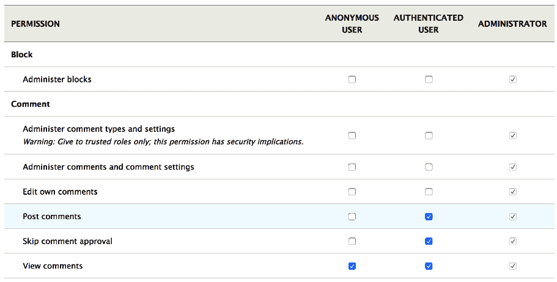
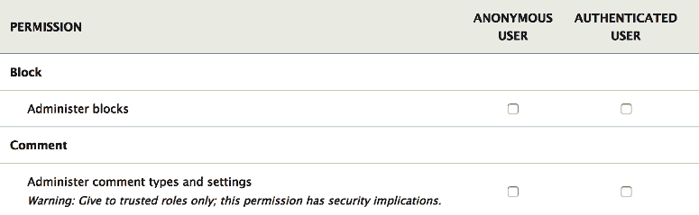
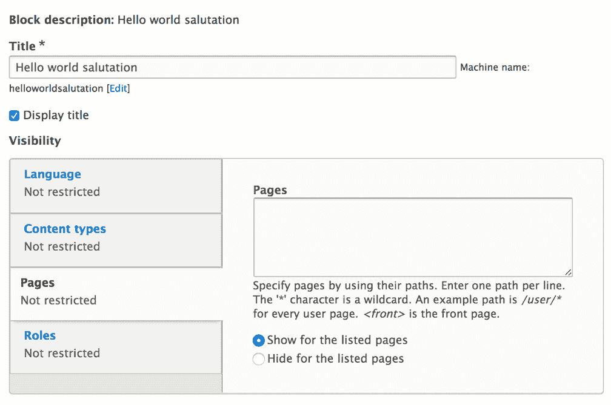

# 访问控制

在前面的章节中，我们已经讨论了许多主题，但我们故意在许多主题中省略了一个重要的方面——访问控制。我们涵盖的大部分内容以某种方式或另一种方式涉及访问，但我们将其排除在我们的讨论之外，以使事情更加直接。然而，访问控制对于 Drupal 开发来说是一个极其重要的主题，因为它几乎影响我们做的每一件事。因此，为此目的，我们有一个专门的章节，我们将涵盖你需要知道的最重要的事情，以便保持你的应用程序安全。

当我说“安全”时，我并不是指以安全的方式编写代码来防止你的网站被黑客攻击。为此，我们在书的末尾有一个附录，为你提供一些指导。相反，我的意思是程序化地处理访问控制，以确保你的页面和任何其他资源只对正确的用户可访问。

在本章中，除了介绍一些独立的概念之外，我们还将回顾一些先前的主题，并了解我们如何在那个环境中应用访问控制。我们将从讨论 Drupal 在高级别如何看待访问限制开始，然后深入到更具体和复杂的例子。同样，我们还将看到代码，以便更好地理解我们在谈论什么。

然而，我们将在本章中具体学习什么呢？

首先，我们将介绍 Drupal 的角色和权限访问系统，并了解我们如何在代码中创建它们。对我们作为模块开发者来说，更重要的是，我们将了解我们如何以编程方式检查用户是否有权限。这仍然是在保持事情一般性的同时进行的。

接下来，我们将通过查看路由权限来深入了解更多有趣的内容。在这里，我们有巨大的灵活性，我们将探讨我们可以用来限制对自定义和现有路由的访问的多种方法——从简单的基于权限的访问控制到动态面向服务的访问处理器。

在覆盖了路由之后，我们将查看实体以及访问控制如何与它们一起工作。在这个过程中，我们将对我们在第七章中创建的“你自己的自定义实体和插件类型”的 Product 实体进行一些工作。第七章。此外，我们还将讨论*节点访问权限*系统，这是一个针对节点实体类型的特定访问控制的有力方式。

最后，我们还将查看块插件，并了解我们如何控制访问以及确保它们在页面上渲染。块可以有一些上下文规则，这些规则决定了它们是否在添加到的区域中的某个页面上显示。因此，我们也会就此进行一些讨论。

本章的目的是汇集您作为 Drupal 8 模块开发者开始所需的所有与访问控制相关的方面。然而，您可以期待更多，因此，本章也可以作为资源，用于返回阅读您可能在自己的项目中想要使用的某些访问控制方法，而不是让它们散布在书中。 

# Drupal 访问系统简介

如果您已经在 Drupal 8 中做过一些站点构建或对之前的 Drupal 版本有经验，您可能已经对角色和权限有所了解。如果没有，无需担心，因为我们将简要讨论这些是如何工作的。

实际上，使 Drupal 特别的一个因素是其开箱即用的灵活访问系统，该系统基于用户角色和权限。角色是可以赋予用户的属性。后者可以分配多个角色，但始终至少有默认的*认证用户*角色。权限是可以分配给角色的个别访问指示器。通过传递属性，用户拥有分配给他们的所有角色的权限。因此，最终结果是按角色划分的权限矩阵，这正是它在 UI 中的`admin/people/permissions`视图中所展示的：



Drupal 核心默认包含三个角色——**匿名用户**、**认证用户**和**管理员**。此外，默认情况下，Drupal 核心（和贡献）模块已经定义了大量权限，可供分配给各种角色。

匿名用户角色相当直观，可以用作所有匿名用户应拥有的权限的集合——即未认证的用户。同样，认证用户角色在登录时自动分配给所有用户（且不能被移除）。因此，它可以用作所有认证用户应拥有的权限的集合。

超级管理员用户（ID 为 1 的那个用户）实际上拥有该网站的所有权限，无需显式分配角色或权限。大多数情况下，它绕过了任何给定子系统中大部分的访问控制。

# 内部角色和权限

角色是配置实体（`user_role`），由`Role`实体类型类表示。它们可以通过 UI 创建，并作为配置导出，以便在所有环境中可用。因此，在您的代码中定义角色时，您不需要做很多事情，只需在 UI 中按需创建它们并将它们导出到配置即可。如您所记得的，如果您想由您的模块提供角色，请将导出的 YAML 文件添加到`config/install`文件夹中（并删除 UUID）。有关更多信息，请参阅第六章，*数据建模和存储*。

另一方面，权限是一个自定义构造。在 Drupal 7 中，它们通过实现 `hook_permissions()` 来定义，但现在是通过 YAML 文件创建的（与我们定义菜单链接的方式非常相似）。然而，它们不是插件，而是由核心用户模块创建的自定义构造。`PermissionHandler` 服务负责读取所有 YAML 文件并确定网站上所有现有的权限。这不是你需要担心的事情，因为你不会与这个服务交互。你主要会对定义新权限、检查用户是否拥有这些权限，或在各种访问上下文中设置这些权限感兴趣。

# 定义权限

在自定义模块中创建权限的方式是创建一个 `*.permissions.yml` 文件，并在其中添加定义。考虑以下示例：

```php
administer my feature: 
  title: 'Administer my feature' 
  restrict access: true 
```

在这个例子中，`administer my feature` 是权限的机器名称，实际上是最重要的部分。这就是你将在代码中用它来引用的部分。然后，我们有一个标题，它会在我们之前看到的权限管理页面上显示。最后，我们有一个 `restrict access` 键，通过它可以指定我们是否需要在权限管理页面上输出有关安全影响的警告，如下所示：*警告：仅授予可信角色；此权限具有安全影响：*



这是为了表明我们的权限更加敏感，管理员应该注意将它们分配给谁。然而，这个选项可以省略（实际上在大多数情况下都是这样）。

你可能已经注意到这种定义权限的静态性质。换句话说，我们硬编码了权限名称，并且只有一个权限。在大多数情况下，这将是可行的。然而，有时你可能需要根据应用程序中的其他因素动态定义多个权限。为此，我们可以使用权限回调。

例如，节点模块为管理其每个捆绑包定义了单独的权限，这是有意义的。一些角色应该有权访问某些捆绑包，而其他角色应该有权访问其他捆绑包。然而，它无法知道在任何给定时刻它将有哪些捆绑包。因此，它使用权限回调：

```php
permission_callbacks: 
  - \Drupal\node\NodePermissions::nodeTypePermissions  
```

这可以在 `node.permissions.yml` 文件中找到，就像静态定义的那样，但它将获取权限的责任委托给 `NodePermissions` 类的 `nodeTypePermissions` 方法。这是我们用来在路由中定义控制器相同的符号。事实上，相同的类解析器被用来实例化它。

# 检查用户凭据

只要你有那个用户账户，你就可以轻松地检查一个给定的用户是否应该访问某个特定资源。在这里，你可能会遇到两种情况：

+   你想“调查”当前用户。

+   您想“调查”的是特定用户，而不一定是当前用户。

正如我们在第二章，“创建您的第一个模块”中看到的，当前用户由一个实现`AccountProxyInterface`接口的服务表示。这个服务可以通过`current_user`键或使用以下简写静态访问：

```php
$accountProxy = \Drupal::currentUser();  
```

从这个账户代理中，我们可以请求代表实际已登录用户账户的`AccountInterface`（即`UserSession`对象）。它持有对用户实体的引用，以及一些与其账户相关的数据，但基本上就是这样。如果我们需要访问其实体字段，我们需要像通常那样加载实体：

```php
$user = \Drupal::entityTypeManager()
  ->getStorage('user')
  ->load($accountProxy->id());
```

顺便说一句，生成的`UserInterface`也实现了相同的`AccountInterface`，因此这些常用方法可以用于这两个对象。因此，`User`实体类型基本上是代表浏览网站的用户的`AccountInterface`的存储设施。然而，目前，用户实体并不那么相关，所以我们将回到账户，我们可以从代理中检索它，如下所示：

```php
$account = $accountProxy->getAccount();  
```

该接口上的方法允许我们“调查”账户（无论是当前用户账户还是由给定用户实体表示的账户）的凭据。其中许多也存在于`AccountProxy`中，这意味着您可以直接询问这些。

以下两种非常通用但经常很有帮助的方法是：

```php
$account->isAnonymous(); 
$account->isAuthenticated();  
```

这些检查账户是否匿名，不考虑任何角色或权限。有时，您的访问控制仅基于这种区分。

我们还可以获取账户拥有的角色列表，如下所示：

```php
$account->getRoles();  
```

乃至更重要的是，检查用户是否具有特定的权限：

```php
$account->hasPermission($permission)  
```

其中`$permission`是一个字符串（权限的机器名，正如我们之前所定义的）。这个方法非常有用，因为它检查用户对指定权限的所有角色。

当您需要检查用户是否应该访问您功能的一部分时，您可以在代码的任何地方使用这些方法。

# 路由访问

现在我们已经看到了 Drupal 8 中访问系统在基本层面的工作原理以及我们如何定义权限和检查用户凭据，是时候讨论路由了。

正如我们从本书第一次编写代码时所见，路由是进入您应用程序的入口点。此外，作为一名开发者，这也是您将主要处理的事情之一，因此控制谁可以访问这些路由是访问系统的责任。

我们有几种方法可以确保路由只能被正确的用户访问，所以让我们看看这些方法。

最简单的方法是检查权限。我们在第二章，“创建您的第一个模块”中实际上就是这样做的，当我们定义我们的`hello_world.hello`路由时：

```php
hello_world.hello: 
  path: '/hello' 
  defaults: 
    _controller: '\Drupal\hello_world\Controller\HelloWorldController::helloWorld' 
    _title: 'Our first route' 
  requirements: 
    _permission: 'access content' 
```

路由定义中的`requirements`键包含请求尝试到达此路由必须具有的所有数据。这主要包含类似访问的信息，但也包括诸如请求格式之类的信息。

之前示例中的要求是`_permission`（所有这些选项通常以下划线开头）。它用于指定访问此路由的用户需要拥有该权限，类似于我们之前检查用户是否拥有它的方式：

```php
$account->hasPermission($permission).   
```

`访问内容`权限是由 Drupal 核心定义的，基本上是在限制非常宽松时使用的，这意味着所有用户都应该能够访问资源。默认情况下，此权限也存在于*匿名*用户角色中。

说到宽松的限制，还有一个选项甚至更加开放，完全开放：

```php
_access: "TRUE"  
```

这实际上是在任何情况下都将路由向几乎所有的人开放——你可能不会经常使用，但在某些情况下很有用。

回到权限方面，我们还可以将多个权限包含在这个要求中。例如，为了检查用户是否拥有两个权限中的**任何一个**，我们用逗号将它们分开：

```php
_permission: "my custom permission,administer site configuration"  
```

为了检查用户是否拥有所有给定的权限，我们用加号（+）将它们分开：

```php
_permission: "my custom permission+my other permission"  
```

因此，我们已能看到相当大的灵活性。

`管理网站配置`是 Drupal 核心的另一个基本权限，我们可以用它来确保用户是管理员；这通常是一个敏感权限，仅授予这些用户。

接下来，我们还有一个要求，可以用来检查用户是否具有特定的角色。以类似的方式，我们可以包含多个角色进行检查，具体取决于我们想要进行 AND 或 OR 检查：

```php
_role: "administrator" 
_role: "editor,administrator" 
_role: "editor+administrator"  
```

这种方法不如使用权限灵活，它有点“硬编码”。我的意思是，你正在根据网站配置（因为角色是配置实体）硬编码一个访问规则。如果该配置被删除，你的代码可能会出错。另一方面，权限也是代码，因为它们是在模块（或 Drupal 核心）中定义的。然而，如果你需要，这个选项是存在的。

我们接下来应该在这里介绍的要求类型是`_entity_access`。然而，理解这一点需要我们首先了解实体级别的访问，所以我们现在将跳过它；我们肯定会在本章的后面回到它。相反，我们将讨论所有路由访问方法之母——自定义方法。

路由访问要求也可以堆叠，这意味着我们可以向路由添加多个访问要求，并且只有当所有这些要求都允许访问时，才会授予访问权限。如果其中一个拒绝，则拒绝访问该路由。这是通过简单地向路由添加多个要求来完成的。

# 自定义路由访问

之前控制路由的方法功能强大且相对灵活，但它们是静态的。我们将规则硬编码到文件中，并期望来宾用户遵守这些规则。然而，如果事情比这更复杂，我们需要一个更动态的方法怎么办？相信我，事情会很快变得复杂。我们可以使用路由要求的`_custom_access`选项。

在本小节中，我们将看到这些是如何工作的，以及我们如何创建我们的自定义访问检查器；只是简单演示一下这个过程。然后，我们将看到一种更高级的实现，这将让我们在程序上对路由进行一些操作。

创建和使用自定义访问检查器与路由结合的方式有两种，它们都涉及到创建一个类。这个类是如何被使用的决定了区别：我们既可以直接（静态地）引用它，也可以将其变成一个服务并这样引用。我们将在本章后面看到这两个示例。

为了演示，假设我们想要确保我们的 Hello World 路由只能对没有特定角色——`editor`——的用户可访问。这听起来不太合理，但这是一个我们可以运行的简单示例。

# 静态方法

静态方法涉及到在我们的控制器（或其他地方）创建一个方法，通常称为`access()`，并从路由定义中引用它。因此，在我们的控制器中我们可以有如下代码：

```php
/** 
 * Handles the access checking. 
 * 
 * @param \Drupal\Core\Session\AccountInterface $account 
 * 
 * @return \Drupal\Core\Access\AccessResultInterface 
 */ 
public function access(AccountInterface $account) { 
  return in_array('editor', $account->getRoles()) ? AccessResult::forbidden() : AccessResult::allowed(); 
} 
```

以及新的`use`语句：

```php
use Drupal\Core\Access\AccessResult; 
use Drupal\Core\Session\AccountInterface;  
```

这个方法接收当前用户的`AccountInterface`，我们可以用它来确定角色。此外，如果我们对一些额外的参数进行类型提示，Drupal 也会将它们传递给这个方法：

+   `\Symfony\Component\Routing\Route $route`

+   `\Drupal\Core\Routing\RouteMatch $route_match`

我们已经在第二章“创建您的第一个模块”中讨论了`CurrentRouteMatch`服务，我们了解到我们可以用它来了解刚刚访问的路由的信息。实际上，这个服务只是简单地使用了`RouteMatch`对象。因此，如果我们的路由访问规则依赖于与路由相关的东西，这个参数可能非常重要。很快，我将更详细地演示这一点。

同样，我们也可以对包含路由数据的实际`Route`对象进行类型提示。这与我刚才提到的观点一致，我们也可以在逻辑中使用它。但是，不幸的是，对于我们的用例，这些将不是必需的，所以我们将坚持使用`AccountInterface`。

在这个方法中我们返回的内容非常重要，因为它需要是一个`AccessResultInterface`的实例。这是 Drupal 8 中访问系统使用的标准接口。以下是你经常会遇到的三种主要接口实现：

+   `AccessResultAllowed`

+   `AccessResultNeutral`

+   `AccessResultForbidden`

然而，这些对象的入口通常是`AccessResult`抽象基类（所有这些实现都扩展了它）及其静态方法。正如你在前面的示例中看到的，我们使用了`allowed()`和`forbidden()`方法来实例化这些对象。当然，我们还有一个相应的`neutral()`方法，可以用来表示我们没有在事情上发言。通常，这用于涉及多个决定访问特定资源的参与者的情况，其中一个参与者遇到了他们不需要控制访问的资源。

在 Drupal 8.3 中，中性和禁止的访问结果也支持原因。这通常用于 REST 场景，以显示为什么访问被拒绝或跳过。例如，当我们拒绝访问时，我们可以返回如下内容：

```php
return AccessResult::forbidden('Editors are not allowed');
```

`AccessResult`基类的一些其他内置功能与缓存性相关，但它也有方便的方法来实现更复杂的访问逻辑。例如，以下方法可能很有用：

+   `allowedIf($condition)`

+   `forbiddenIf($condition)`

你只需传递一个布尔值给这些方法，它们就会返回正确的访问对象。当然，请记住，如果条件评估为 FALSE，这些方法返回一个`AccessResultNeutral`对象。所以，如果你需要将布尔值映射到显式允许或显式拒绝的结果，你不能使用这些方法。

此外，我们还有以下类似的方法：

+   `allowedIfHasPermission()`

+   `allowedIfHasPermissions()`

这将检查给定的账户是否具有一个或多个权限，并根据情况返回正确的访问对象。

最后，我们还有`orIf()`和`andIf()`方法，我们可以用它们构建更复杂的访问结构，这些结构结合了多个`AccessResultInterface`结果。

在`AccessResultInterface`的括号上关闭，让我们在我们的路由中引用这个方法，以便真正使用它。这就是现在的路由定义看起来像这样：

```php
hello_world.hello: 
  path: '/hello' 
  defaults: 
    _controller: '\Drupal\hello_world\Controller\HelloWorldController::helloWorld' 
    _title: 'Our first route' 
  requirements: 
    _custom_access: '\Drupal\hello_world\Controller\HelloWorldController::access' 
```

我们不再使用`_permission`需求，而是使用带有对我们控制器方法引用的`_custom_access`。在清除缓存后，我们新的访问检查器将“踢出”那些讨厌的`editor`用户。

如你所想，这种静态方法比使用基于权限或角色的访问检查更强大，因为它允许你编写 PHP 逻辑来确定访问。然而，它在许多方面都存在不足，这就是基于服务的方法可以发挥作用的地方。

# 服务方法

服务方法涉及创建一个标记的服务，并在路由定义中将其作为需求进行引用。与我们所看到的方法相比，这种方法有许多优点：

+   允许你将复杂的访问逻辑封装在其自己的类中

+   允许你在计算访问时注入依赖项并使用它们

+   允许你在多个路由上重用访问检查器

让我们看看我们如何为我们的 Hello World 路由实现这一点。我们将替换之前的方法，但保持拒绝编辑访问的目标。然而，为了增加一点复杂性，如果 Hello World 问候没有被配置表单覆盖，编辑将被允许。如果你还记得，在第二章，*创建你的第一个模块*中，我们创建了一个表单，其中问候消息可以被覆盖并存储在配置对象中。

首先，让我们创建我们的类。通常，与访问相关的类放在模块命名空间的`Access`文件夹中——这并不一定是这样，但将其放在那里是有意义的。然后，我们可以有如下内容：

```php
namespace Drupal\hello_world\Access; 

use Drupal\Core\Access\AccessResult; 
use Drupal\Core\Config\ConfigFactoryInterface; 
use Drupal\Core\Routing\Access\AccessInterface; 
use Drupal\Core\Session\AccountInterface; 

/** 
 * Access handler for the Hello World route. 
 */ 
class HelloWorldAccess implements AccessInterface { 

  /** 
   * @var \Drupal\Core\Config\ConfigFactoryInterface 
   */ 
  protected $configFactory; 

  /** 
   * HelloWorldAccess constructor. 
   * 
   * @param \Drupal\Core\Config\ConfigFactoryInterface $configFactory 
   */ 
  public function __construct(ConfigFactoryInterface $configFactory) { 
    $this->configFactory = $configFactory; 
  } 

  /** 
   * Handles the access checking. 
   * 
   * @param AccountInterface $account 
   * 
   * @return AccessResult 
   */ 
  public function access(AccountInterface $account) { 
    $salutation = $this->configFactory->get('hello_world.custom_salutation')->get('salutation'); 
    return in_array('editor', $account->getRoles()) && $salutation != "" ? AccessResult::forbidden() : AccessResult::allowed(); 
  } 
} 
```

一开始，我想提到，我们正在实现的`AccessInterface`目前还处于不确定的状态。如果你查看内部结构，你会发现它没有任何方法。这是因为我们之前讨论过的动态参数解析，通过它可以获取路由和路由匹配，如果我们对它们进行类型提示的话。在撰写本书时，有一个关于将其标记为已弃用并可能最终完全移除（或找到另一种解决方案）的持续讨论。因此，这是长期值得关注的点。

此外，由于没有接口，`access()`方法命名不是强制性的。然而，我们仍然需要它，因为这是访问系统在调用服务时寻找的名称。和之前一样，我们获取发起请求的用户，从而可以获取角色。此外，我们注入了配置工厂并检查问候文本是否已被覆盖。只有在这种情况发生时，编辑才会被拒绝访问。对我们来说，这并不复杂。

现在，让我们看看我们如何定义它作为一个服务，供我们的路由作为访问检查器使用：

```php
hello_world.access_checker: 
  class: \Drupal\hello_world\Access\HelloWorldAccess 
  arguments: ['@config.factory'] 
  tags: 
    - { name: access_check, applies_to: _hello_world_access_check } 
```

如你所见，标记服务在 Drupal 8 中非常重要，它是我们可以贡献自己的代码到现有功能集的一个很好的扩展点示例。在这个例子中，除了为访问检查标记它之外，我们还看到了这个标记的另一个选项：`applies_to`。相应的字符串是我们现在可以在我们的路由定义中使用以针对这个特定的访问检查器的字符串。所以，而不是以下这一行：

```php
_custom_access: '\Drupal\hello_world\Controller\HelloWorldController::access'  
```

我们有这个：

```php
_hello_world_access_check: 'TRUE'  
```

我们设置的`TRUE`值并没有太大的影响。如果我们愿意，我们可以添加一个字符串值，这个值实际上可以被访问检查器内部使用。然而，我们将稍后使用不同的方法来处理。所以，现在，标准做法就是只使用`TRUE`。

清除缓存后，我们新的访问检查器将启动，这就是全部。

# 对路由进行程序化访问检查

如果我们定义了路由，并且用户访问这些路由，Drupal 会自动为我们检查访问权限（根据路由定义中设定的要求）。然而，我们可能经常需要以编程方式检查特定路由的访问权限，例如，确定是否应该向当前用户显示该链接。

在 第二章，*创建您的第一个模块* 中，我们看到了如何使用 `Url` 对象来创建链接，并且我们可以使用这些 `Url` 对象来检查给定路由的访问权限；考虑以下示例：

```php
$url = Url::fromRoute('hello_world.hello'); 
if ($url->access()) { 
  // Do something. 
}  
```

`Url` 对象上的 `access()` 方法仅与 *路由* URL 一起工作，即那些已经确定后面有路由的 URL。显然，它不会与外部 URL 等事物一起工作，因此在这些情况下，它总是返回 TRUE。此外，如果我们想检查特定用户是否有权访问该路由，我们可以向此方法传递一个 `AccountInterface`。如果没有参数，它默认为当前用户。

在底层，`Url` 类使用 `AccessManager` 服务静态地检查路由的访问权限。这是静态完成的，所以如果您愿意，您可以自己注入服务（`access_manager`）并检查路由访问权限：

```php
$access = $accessManager()->checkNamedRoute('hello_world.hello', [], $account)  
```

我们传递的空数组作为第二个参数是路由需要的参数数组。您还记得从 第二章，*创建您的第一个模块* 中如何使用路由参数，对吧？

我之前提到，如果您需要使用账户、路由和路由匹配来计算访问逻辑，那么使用这些动态参数而不是注入当前用户或当前路由匹配服务非常重要。也许现在，您可以开始理解为什么。让我来解释一下。

我之前提到的一个优点是，基于服务的访问检查方法允许我们在多个路由上使用相同的服务。这意味着我们可以拥有高度动态的访问规则，通过这些规则我们可以在访问检查器中检查路由选项并基于这些选项计算访问权限，这非常强大。

然而，如果您注入当前路由匹配服务并使用它，您的访问规则只有在浏览器请求该路由时才会生效，所以基本上，当用户试图访问该路径时。这是因为当前路由恰好与访问检查器使用的路由（注入的那个）相同。然而，如果您从另一个页面（正如我们刚才看到的）以编程方式检查该路由的访问权限，当前路由匹配将是那个其他页面的路由，而不是您实际想要检查访问权限的路由。

即使您没有手动检查带有菜单链接的路由的访问权限，您也会看到这种情况发生。如果一个给定的路由被用于菜单链接并在页面上打印出来，Drupal 将会自动进行访问检查，以确保用户可以访问该链接。此外，回想一下第五章，*菜单和菜单链接*，如果您想以编程方式渲染菜单链接，您通常会执行的操作之一是通过一系列操作器运行菜单树。一个重要的操作器是检查当前用户是否有权访问该路由。

在这些情况下，您会遇到相同的问题。所以，请记住为您的访问检查器使用路由和/或路由匹配对象进行类型提示，并且不要注入它们。当然，也不要注入当前用户服务（除非您有非常具体的原因这样做）。

# 奖励——动态路由选项用于访问控制

我们已经看到了如何创建一个基于服务的访问检查器，我们可以在我们的路由上使用它。使用这种技术，我想展示在多个路由上使用服务的灵活性。想象一下，我们有多条路由用于显示一些用户信息。然而，这些路由是特定于用户类型的，因此只有该用户类型可以访问。在这个例子中，用户类型将基于用户实体上的一个简单文本字段的值来定义，我们希望在路由定义中指定它应该对哪种用户类型可访问。我们为这个演示编写的代码将放在一个新的`user_types`模块中。

对于这个例子，检查路由内部访问的另一种方法是简单地验证控制器中的当前用户是否有权访问它。如果没有，在控制器方法中抛出`AccessDeniedHttpException`将请求转换为 403（访问拒绝）。然而，这几乎总是错误的方法，因为路由将无法再进行访问验证，我们最终会在网站上放置可能导向 403 页面的链接。我们不希望这样。因此，如果页面有访问规则，它们属于访问系统，而不是控制器。

在这个例子中，我们假设用户实体上已经有一个名为`field_user_type`的字段；我们有三种类型的用户：`board_member`、`manager`和`employee`；并且我们有以下四个路由定义：

```php
user_types.board_members: 
  path: '/board-member' 
  defaults: 
    _controller: '\Drupal\user_types\Controller\UserTypesController::boardMember' 
    _title: 'Board member' 
user_types.manager: 
  path: '/manager' 
  defaults: 
    _controller: '\Drupal\user_types\Controller\UserTypesController::manager' 
    _title: 'Manager' 
user_types.employee: 
  path: '/employee' 
  defaults: 
    _controller: '\Drupal\user_types\Controller\UserTypesController::employee' 
    _title: 'Employee' 
user_types.leadership: 
  path: '/leadership' 
  defaults: 
    _controller: '\Drupal\user_types\Controller\UserTypesController::leadership' 
    _title: 'Leadership' 
```

这些路由目前还没有任何访问要求，因为我们的任务是现在创建它们。然而，您已经可以理解哪些类型的用户应该能够访问这些路由。`user_types.board_members`路由是为董事会成员设计的，`user_types.manager`是为经理设计的，`user_types.employee`是为员工和经理（因为两者都是真正的员工）设计的，而`user_types.leadership`是为董事会成员和经理设计的。所以，一些混合匹配来强调我们访问检查器中灵活性的需求。

显然，我们不想为处理这里的每种用户类型的组合编写一个服务。使用静态方法也不合适，因为我们需要注入一个依赖项，而且我们也不想使用不同的可调用项重复逻辑。

因此，让我们为这个访问检查器定义我们的服务定义：

```php
user_types.access_checker: 
  class: \Drupal\user_types\Access\UserTypesAccess 
  arguments: ['@entity_type.manager'] 
  tags: 
    - { name: access_check, applies_to: _user_types_access_check } 
```

我们注入实体类型管理器服务，以便我们可以加载与正在检查访问的用户对应的用户实体。正如你所记得的，`AccountInterface`不足以从该用户读取字段数据。

现在，我们可以更新我们的路由要求（针对所有四个路由）以利用这个访问检查器：

```php
 requirements: 
    _user_types_access_check: 'TRUE'  
```

之前，我们看到静态访问检查器是通过`_custom_access`要求引用的。这与我们现在创建的是同一个，但由 Drupal 核心提供，映射到`CustomAccessCheck`服务（而不是我们现在编写的自定义服务）。这反过来又委托了责任到定义中设置的类方法。

现在，是时候根据应该有权访问它们的用户类型来区分我们的四个路由了，我们可以使用*路由选项*来做这件事。选项是一组任意的数据片段，我们可以将其放在路由定义上并在以后程序化地检索。如果你还记得，在第二章，*创建您的第一个模块*中，参数转换器就是一个可以作为选项在路由中定义的例子。

让我们以一个路由为例，全面地看一下，然后你将推断出其他路由将是什么样的：

```php
hello_world.employee: 
  path: '/employee' 
  defaults: 
    _controller: '\Drupal\hello_world\Controller\UserTypesController::employee' 
    _title: 'Employee' 
  requirements: 
    _user_types_access_check: 'TRUE' 
  options: 
    _user_types: 
      - manager 
      - employee 
```

路由选项放在`options`键下，并且传统上以一个下划线开头（然而，这并非强制要求）。在标准的 YAML 表示法中，我们在`_user_types`选项下有一个字符串值的序列，当将其读入路由对象时，将转换为 PHP 数组。

现在，我们可以创建我们的访问检查器服务，并利用所有这些来控制访问：

```php
namespace Drupal\user_types\Access; 

use Drupal\Core\Access\AccessResult; 
use Drupal\Core\Entity\EntityTypeManager; 
use Drupal\Core\Routing\Access\AccessInterface; 
use Drupal\Core\Session\AccountInterface; 
use Symfony\Component\Routing\Route; 

/** 
 * Access handler for the User Types routes. 
 */ 
class UserTypesAccess implements AccessInterface { 

  /** 
   * @var \Drupal\Core\Entity\EntityTypeManager 
   */ 
  protected $entityTypeManager; 

  /** 
   * UserTypesAccess constructor. 
   * 
   * @param \Drupal\Core\Entity\EntityTypeManager $entityTypeManager 
   */ 
  public function __construct(EntityTypeManager $entityTypeManager) { 
    $this->entityTypeManager = $entityTypeManager; 
  } 

  /** 
   * Handles the access checking. 
   * 
   * @param AccountInterface $account 
   * @param \Symfony\Component\Routing\Route $route 
   * 
   * @return \Drupal\Core\Access\AccessResult 
   */ 
  public function access(AccountInterface $account, Route $route) { 
    $user_types = $route->getOption('_user_types'); 
    if (!$user_types) { 
      return AccessResult::forbidden(); 
    } 
    if ($account->isAnonymous()) { 
      return AccessResult::forbidden(); 
    } 
    $user = $this->entityTypeManager->getStorage('user')->load($account->id()); 
    $type = $user->get('field_user_type')->value; 
    return in_array($type, $user_types) ? AccessResult::allowed() : AccessResult::forbidden(); 
  } 
} 
```

根据服务定义，我们注入实体类型管理器作为依赖项。这是使用静态方法无法做到的。然后，在我们的`access()`方法中，我们还对使用此服务进行访问评估的路由进行类型提示。现在，有趣的部分来了。

我们检查路由并尝试通过名称检索我们的选项。作为一个安全措施，如果选项缺失，我们将拒绝访问。这种情况不应该发生，因为我们只在这个具有选项的路由上使用这个访问检查器，但你永远不知道。此外，如果用户是匿名用户，我们也会拒绝访问。匿名用户肯定不会有任何用户类型字段值。

然后，我们加载当前账户的用户实体，简单地检查该字段值，并根据它是否在路由允许的范围内返回访问权限。我建议你检查`Route`类，看看你可以利用哪些其他方便的数据。

就这样。现在我们有一个灵活的访问检查服务，我们可以在需要此 *用户类型* 访问控制的任何数量的路由上使用它。

从这个附加技术中得出的一个关键教训是，您可以使用路由上的选项构建极其灵活的架构。在这个例子中，我们使用了它们来处理访问，但您也可以将它们用于其他与路由相关联并可以从路由控制的功能。

# 路由的 CSRF 保护

Drupal 配备了各种处理 CSRF 保护的工具。

跨站请求伪造（CSRF）是一种攻击，它强制最终用户在当前已认证的 Web 应用程序中执行他们不希望执行的操作。

——(OWASP)

其中一个工具是用于处理将 CSRF 令牌添加到使用 Drupal API 自动构建的路由。让我们看看一个例子。

想象一下，您有一个用作某种回调的路由。击中此路由会触发一个过程（对于已登录用户），因此您需要确保用户只能从他们应该来的地方到达这个路由（需要触发该过程的流程的一部分）。令牌可以用于此，Drupal 8 已经提供了这个功能。

我们需要做两件事：为 CSRF 保护添加路由要求，然后使用我们在第二章创建您的第一个模块中看到的常规 Drupal API 构建该链接。以下是要求：

```php
_csrf_token: 'TRUE' 
```

此外，请注意，这可以与其他基于访问的要求一起使用，例如我们在本节中讨论的那些。

现在添加 CSRF 令牌要求后，如果仅通过在浏览器中导航到路径来访问路由，则该路由将不可访问。为了使其可访问，我们需要使用 Drupal API 在某处打印出指向它的链接：

```php
$url = Url::fromRoute('my_module.my_route'); 
$link = [ 
  '#type' => 'link', 
  '#url' => $url, 
  '#title' => 'Protected callback' 
];  
```

这是一种方法，但我们也可以使用 `LinkGenerator` 服务或 `Link` 类，就像我们在第二章创建您的第一个模块中看到的那样。它们都会将带有附加到 URL 作为查询参数的令牌的链接渲染出来。然后 Drupal 将评估该令牌作为访问控制的一部分，并确保它是有效的。事实上，链接构建实际上不起作用。处理它的是 URL 生成器。因此，如果您以这种方式获取字符串 URL，则它将自动包含令牌：

```php
$path = $url->toString();  
```

在底层，为了管理令牌的创建和验证，Drupal 使用 `CsrfTokenGenerator` 服务，我们也可以使用它。例如，在获得服务（`csrf_token`）之后，我们可以创建一个令牌：

```php
$token = $generator->get('my_value'); 
```

在这里，`my_value` 是生成器可以用来使令牌唯一的可选字符串。它还使用当前用户会话和私有站点密钥。请注意，如果用户是匿名用户且未启动会话，则令牌在每个请求上都是唯一的。

我们可以按以下方式验证此令牌：

```php
$valid = $generator->validate($token, 'my_value');  
```

这里，`$generator` 是我们用于创建它的相同服务。

使用令牌生成器手动操作可能很方便，但正如我们所见，只需在路由上添加一个要求，让 Drupal 完成其余的工作就非常简单了。此外，CSRF 保护已经嵌入到表单 API 中，因此当涉及到需要额外保护的形式时，我们根本不需要做任何事情。

# 修改路由

我们已经看到了如何在我们自己的路由上创建访问规则。然而，如果修改现有路由并更改它们的访问规则不是那么容易，那么它就不是 Drupal 了。这是我们的自定义模块可以贡献给现有功能的另一个小的扩展点。

通过修改路由本身来修改路由访问。当然，访问不是修改路由的唯一原因，因为你可以更改定义中的几乎所有其他内容。那么，让我们看看你如何根据需要修改路由。

通过订阅一个事件，可以修改路由，正如我们在第二章“创建您的第一个模块”中看到的，当时我们订阅了`kernel.request`事件。此事件在所有路由正在构建并且它们被缓存之前被触发。因此，修改不会动态发生（当有人访问路由时），而只会在它们全部重建时发生。让我们看看我们如何订阅这个事件。

与大多数其他订阅者不同，路由的`EventSubscriberInterface`类通常位于模块的`Routing`命名空间中，所以我们将把它放在那里。此外，我们正在监听的事件是`RoutingEvents::ALTER`。然而，路由系统为我们提供了一个基类订阅者，我们可以扩展它，它包含所有这些样板代码，只留下我们进行修改。

这些修改可能看起来像这样：

```php
namespace Drupal\hello_world\Routing; 

use Drupal\Core\Routing\RouteSubscriberBase; 
use Symfony\Component\Routing\RouteCollection; 

/** 
 * Subscribes to route events for the Hello World module. 
 */ 
class HelloWorldRouteSubscriber extends RouteSubscriberBase { 

  /** 
   * {@inheritdoc} 
   */ 
  protected function alterRoutes(RouteCollection $collection) { 
    $route = $collection->get('user.register'); 
    if (!$route) { 
      return; 
    } 

    // Example 1: 
    // We deny access to the Register page in all cases. With this requirement, 
    // it doesn't matter anymore what other access requirements exist or if they 
    // evaluate positively. 
    $route->setRequirement('_access', 'FALSE'); 

    // Example 2: 
    // We check for the presence of a specific access requirement and if it exists, 
    // we clear all the access requirements on the route and set our own. 
    if ($route->hasRequirement('_access_user_register')) { 
      $route->setRequirements([]); 
      $route->setRequirement('_user_types_access_check', 'TRUE'); 
    } 
  } 
} 
```

我们扩展了`RouteSubscriberBase`，它订阅了该事件，并为我们提供了`alterRoutes()`方法和网站上所有路由的集合。我鼓励你研究一下`RouteCollection`类，因为它在处理路由时非常有用。一个重要的特性是我们可以根据名称检索路由，就像我们在上一个例子中所做的那样。

然后，我们将像之前稍微早些时候做的那样处理`Route`对象。我们可以看到两个示例，所有这些注释我都不会在这里重复。第二个示例在现实世界的场景中没有任何意义，因为我们不能让已登录的用户注册新账户。然而，它有助于说明我们如何向现有路由添加自己的访问检查器。

与我们如何操作访问要求类似，我们可以改变很多其他事情：选项、参数、控制器，甚至实际的路由路径。为此，我鼓励您熟悉`Route`类的各种方法，看看您可以在新路由上设置什么。结合关于您可以在路由上添加的所有内容的文档([`www.drupal.org/docs/8/api/routing-system/structure-of-routes`](https://www.drupal.org/docs/8/api/routing-system/structure-of-routes))，以获得更好的理解。

要使这项工作起作用，唯一剩下的事情就是将订阅者注册为带标签的服务，就像我们在第二章，“创建您的第一个模块”中所做的那样：

```php
hello_world.route_subscriber: 
  class: Drupal\hello_world\Routing\HelloWorldRouteSubscriber 
  tags: 
    - { name: event_subscriber } 
```

这样，我们就完成了对路由的修改。

# 实体访问

现在我们已经介绍了如何在路由上实现访问控制，让我们深入了解实体访问系统，看看我们如何确保只有正确的用户与我们的实体进行交互。为了演示这些，我们将使用我们在第七章，“您自己的自定义实体和插件类型”中创建的产品实体类型。

当我们创建产品实体类型时，我们写的注解中有一个`admin_permission`属性，其中我们引用了用于与该类型实体进行任何交互的通用权限。由于我们没有引用并实现访问控制处理程序，这是对产品进行的唯一访问检查。在许多情况下，这已经足够了。毕竟，实体类型可以仅用于结构化一些数据，甚至没有人需要在 UI 中与之交互。然而，许多其他情况需要对操作实体进行更细粒度的访问控制，尤其是面向内容的，如节点。

在实体访问方面，我们可以控制访问的四个操作是：`view`、`create`、`update`和`delete`。第一个显然是最常见的，但我们始终需要考虑到其余的操作。让我们首先为所有这些操作定义权限（你还记得吗？）：

```php
view product entities: 
  title: 'View Product entities' 
edit product entities: 
  title: 'Edit Product entities' 
delete product entities: 
  title: 'Delete Product entities' 
add product entities: 
  title: 'Create new Product entities'  
```

这些是四个简单的权限，它们映射到可以在产品实体上执行的操作。

现在，让我们继续为我们的产品实体类型创建一个访问控制处理程序。你还记得从第六章，“数据建模和存储”中了解到的这些处理程序吗？

首先，我们将引用我们在产品注解上构建的类：

```php
"access" = "Drupal\products\Access\ProductAccessControlHandler",  
```

我选择将此处理程序放在模块的`Access`命名空间中，但请随意将其放在您想要的位置。

其次，我们需要实际的类：

```php
namespace Drupal\products\Access; 

use Drupal\Core\Entity\EntityAccessControlHandler; 
use Drupal\Core\Entity\EntityInterface; 
use Drupal\Core\Session\AccountInterface; 
use Drupal\Core\Access\AccessResult; 
use Drupal\products\Entity\ProductInterface; 

/** 
 * Access controller for the Product entity type. 
 */ 
class ProductAccessControlHandler extends EntityAccessControlHandler { 

  /** 
   * {@inheritdoc} 
   */ 
  protected function checkAccess(EntityInterface $entity, $operation, AccountInterface $account) { 
    /** @var ProductInterface $entity */ 
    switch ($operation) { 
      case 'view': 
        return AccessResult::allowedIfHasPermission($account, 'view product entities'); 

      case 'update': 
        return AccessResult::allowedIfHasPermission($account, 'edit product entities'); 

      case 'delete': 
        return AccessResult::allowedIfHasPermission($account, 'delete product entities'); 
    } 

    return AccessResult::neutral(); 
  } 

  /** 
   * {@inheritdoc} 
   */ 
  protected function checkCreateAccess(AccountInterface $account, array $context, $entity_bundle = NULL) { 
    return AccessResult::allowedIfHasPermission($account, 'add product entities'); 
  } 
} 
```

如我在第六章“数据建模和存储”中提到的，实体访问控制处理程序需要扩展 `EntityAccessControlHandler` 基类。如果没有提供特定的实现，那么实际上就是实体类型默认的处理程序。此外，我们还需要在这里实现两个方法（重写）：

+   `checkAccess()` 方法，用于控制视图、更新和删除操作上的访问

+   `checkCreateAccess()` 方法，用于控制创建操作上的访问

这些是分开的原因是，对于创建操作，我们在这个过程中没有可以检查的实体。

我们对产品实体类型的访问规则非常简单。对于每个操作，如果用户拥有相关的权限，我们就允许访问；否则，访问是中性的。然而，在这种情况下会发生什么呢？

值得研究的是 `EntityAccessControlHandler` 基类，并了解其中发生的情况。主要的访问入口点是 `access()` 和 `createAccess()` 方法。我们永远不应该重写这些方法，因为那里的逻辑相当标准化，并且是每个人的预期行为。相反，我们的规则应该放在我们自己的处理程序子类中看到的两个方法内部。

`access()` 和 `createAccess()` 方法会调用实体访问钩子（我们稍后会讨论这些）。如果它们没有返回访问拒绝的消息，它们会调用我们自己在子类中重写的相应访问方法，并将这些方法的输出与访问钩子内部的 `orIf()` 访问结果结合起来。还记得我们之前提到的 `AccessResult` 基类及其方便的 `orIf()` 和 `andIf()` 方法吗？

重要的是要注意如何通过所有这些因素来确定访问权限。如果至少有一个钩子实现授予访问权限且没有拒绝访问，则用户将有权访问，除非我们在访问处理程序中拒绝访问。中性访问在这个等式中不起作用，除非所有钩子实现和访问处理程序都返回中性访问（即没有授予特定的访问权限），那么访问将被拒绝。

在我们的示例中，我们定义了权限，处理程序只是简单地检查这些权限。这已经相当灵活，因为管理员现在可以将这些权限分配给角色，并控制哪些用户可以执行这些操作中的任何一项。然而，我们并没有阻止在这些方法中添加更多逻辑。例如，我们甚至可以检查实体（以及/或用户账户）并根据一些给定的值确定访问权限。此外，我们可以将服务注入访问处理程序，并在这些计算中使用它们。

# 将服务注入实体处理程序

使用访问处理程序的一个优点是，我们可以使其了解服务容器，并注入我们可能需要的任何服务以确定访问权限。然而，这并不立即清楚如何做到这一点，所以我们将在这里分解它。

我们首先需要确保我们的访问处理器实现了`\Drupal\core\Entity\EntityHandlerInterface`接口。请注意，这同样适用于其他类型的处理器，而不仅仅是与访问相关的处理器。此接口有一个方法，它将接收容器和实体类型定义：`createInstance()`。

了解这一点后，其余部分与使用`create()`方法将服务注入到控制器和表单中非常相似，该方法只接受容器作为参数，或者注入到插件中，后者也接受一些插件信息：

```php
/** 
 * @var \Drupal\Core\Entity\EntityTypeManagerInterface 
 */ 
protected $entityTypeManager; 

/** 
 * ProductAccessControlHandler constructor. 
 * 
 * @param \Drupal\Core\Entity\EntityTypeInterface $entity_type 
 * @param \Drupal\Core\Entity\EntityTypeManager $entityTypeManager 
 */ 
public function __construct(EntityTypeInterface $entity_type, EntityTypeManagerInterface $entityTypeManager) { 
  parent::__construct($entity_type); 
  $this->entityTypeManager = $entityTypeManager; 
} 

/** 
 * {@inheritdoc} 
 */ 
public static function createInstance(ContainerInterface $container, EntityTypeInterface $entity_type) { 
  return new static( 
    $entity_type, 
    $container->get('entity_type.manager') 
  ); 
} 
```

以及新的*使用*语句：

```php
use Drupal\Core\Entity\EntityTypeInterface; 
use Drupal\Core\Entity\EntityTypeManagerInterface; 
use Symfony\Component\DependencyInjection\ContainerInterface;  
```

通过这种方式，我们已经将实体类型管理器注入到访问处理器中，如果我们需要，我们可以使用它。当然，如果我们不需要它，我们最初就不应该注入它。

# 实体访问钩子

正如我提到的，核心实体访问处理器会调用模块实现的访问钩子，这些模块不拥有实体类型，以便它们可以在实体的访问中发表意见。有两个访问钩子集要讨论。第一组涵盖了*创建*操作，如下所示：

+   `hook_entity_create_access()`

+   `hook_[entity_type]_create_access()`

第二组涵盖了`view`、`update`和`delete`操作：

+   `hook_entity_access()`

+   `hook_[entity_type]_access()`

对于每一组，我们同时调用两个钩子，从通用到实体类型特定。例如，当尝试查看一个节点时，被调用的第二个钩子是`hook_node_access()`。

如您从我们之前的讨论中记得，实体访问钩子实现还必须返回一个`AccessResultInterface`。这是因为结果在`orIf()`组合中使用，与访问处理器的访问结果一起使用。

因此，让我们看看我们如何实现这些访问钩子，特别是它们的签名。因此，我们从第一组开始：

```php
/** 
 * Implements hook_entity_create_access(). 
 */ 
function my_module_entity_create_access(\Drupal\Core\Session\AccountInterface $account, array $context, $entity_bundle) { 
  // Perform access check and return an AccessResultInterface instance. 
}  
```

这是通用的实体创建访问钩子。为了使其特定于一个实体类型，我们将函数名中的单词`entity`替换为实际的目标实体类型 ID。然而，参数保持不变——被检查访问的用户账户，一个上下文（一个包含实体类型 ID 和正在创建的实体 langcode 的数组），以及正在创建的实体的捆绑包。

第二组看起来像这样：

```php
function  
my_module_entity_access(\Drupal\Core\Entity\EntityInterface $entity, $operation, \Drupal\Core\Session\AccountInterface $account)  
{ 
  // Perform access check and return an AccessResultInterface instance. 
} 
```

再次强调，为了使它特定于一个实体类型，我们只需将单词`entity`替换为我们想要的目标实体类型的 ID。再次强调，参数在本质上保持一致——被访问的实体（如果实现了更具体的钩子，则使用相关实体接口进行类型提示），尝试进行的操作（三个字符串之一：`view`、`update`和`delete`），以及被检查访问的用户账户。

大致就是这样。这些钩子会在检查实体给定操作的访问时动态调用。让我们来谈谈一些这方面的例子。

首先，默认的实体路由会检查这些操作，所以无需担心。因此，如果我们导航到规范、表单或删除 URL，将会检查访问权限。

第二，如果我们以编程方式加载一个实体，并像在第六章“数据建模和存储”中看到的那样，使用视图构建器处理器渲染它，那么`view`操作的实体访问会被调用。然而，如果我们加载实体并简单地从中检索一些数据，并在我们自己的模板中打印它，我们将绕过访问控制。如果我们这样做，我们需要确保我们始终手动检查访问权限：

```php
$access = $entity->access('view', $account);  
```

这将返回一个布尔值，除非你指定第三个参数为 TRUE，这将返回一个`AccessResultInterface`对象；具体情况取决于环境。

第三，如果我们以编程方式加载一个在表单构建器内部使用的实体，并想要渲染表单，我们再次绕过访问检查。因此，我们应该再次手动使用`update`操作来执行它。

当涉及到以编程方式处理与实体有 CRUD 关联的页面 URL 和菜单链接时，我们需要自己执行访问检查，但我们将稍后讨论路由中的实体访问；首先，提醒一下。

之前，我提到了关于提取实体数据并简单地渲染字段值的问题。当运行实体查询时，同样的问题会出现——结果将包含当前用户可能没有访问权限的实体。因此，我们必须意识到这一点，并适当地处理它。随着视图的出现，这个问题变得更加突出，视图可以执行自定义数据库查询，并将可能无法访问的实体包含在结果集中。加上视图渲染字段值的可能性，这可能会导致非常意外的行为。因此，请记住，在这种情况下，实体访问钩子和访问控制处理器不会触发。然而，Node 模块有一个复杂的授权系统，负责处理所有这些，但遗憾的是，这仅适用于节点实体。我们很快也会讨论这些内容。

# 字段访问

到目前为止，我们已经看到了实体级别访问是如何工作的。然而，对于实体内部的字段，也存在一个非常类似的系统。如果你查看`EntityAccessControlHandler`内部，你会注意到有一个`fieldAccess()`方法。这个方法会在需要检查给定字段的访问权限时被调用。例如，`FieldItemList::access()`方法就是这样做，并将任务委托给实体处理器。在这个内部，会调用`checkFieldAccess()`，这是我们可以在我们的访问处理器子类中实现以自定义访问规则的地方。

以类似的方式，我们有多个操作可以检查访问权限，但 `view` 将是您最常见的一个。例如，当手动使用实体构建处理程序渲染实体时，就像我们之前看到的，每个字段都会被检查是否有 `view` 操作的访问权限。同样，**这次**，当为编辑实体而构建实体表单时，每个在表单中渲染的字段都会首先使用 `edit` 操作进行检查访问权限。

再次强调，我们也有访问钩子，其他模块可以实现这些钩子，以便在字段是否可访问的问题上有发言权：

+   `hook_entity_field_access()`

+   `hook_entity_field_access_alter()`

在这种情况下，我们没有实体类型或字段类型特定的钩子可以实施。然而，我们有一个可以用来修改其他模块提出的访问规则的修改钩子。

与实体级访问处理程序类似，字段级处理程序从多个来源获取输入——子类和钩子实现。然而，它们的顺序和组合是不同的。首先，调用访问处理程序子类（通过 `checkFieldAccess()` 方法）。然后，所有 `hook_entity_field_access()` 钩子被调用以提供它们的输入。这两个钩子随后都可以通过实现 `hook_entity_field_access_alter()` 来修改。最后，生成的访问规则被组合成一个 `orIf()` 并返回。所以，与我们在实体级别看到的相同原则可用，但顺序不同。

# 路由中的实体访问

现在我们已经了解了实体级访问控制是如何工作的，让我们暂时回到路由上。如果你还记得，我提到了 `_entity_access` 路由要求，以及在我们覆盖了实体访问之后我们将如何讨论它。

`_entity_access` 路由要求不过是一个基于服务的访问检查器，就像我们自己编写的那个一样。然而，它是实体系统创建的，以便根据那些路由中的动态实体参数来控制对这些路由的访问。让我们看看一个可以使用 `_entity_access` 要求的快速路由定义示例：

```php
products.view_product: 
  path: '/our-products/{product}' 
  defaults: 
    _controller: '\Drupal\products\Controller\ProductsController::showProduct' 
  requirements: 
    _entity_access: 'product.view' 
  options: 
    parameters: 
      product: 
        type: 'entity:product' 
```

这个路由有一个名为 `product` 的动态参数。在选项中，我们将这个参数映射到产品实体类型，这样我们的控制器方法（`showProduct()`）就已经接收到了加载的产品实体，而不仅仅是 ID。这个附加的好处是，如果找不到产品，它会为我们抛出一个 404 错误。由于这个路由显然依赖于那个特定的产品，我们还想确保只有当用户有权查看该产品时，它才能被访问。

我们可以确保访问的一种方式是添加一个与查看产品实体权限相匹配的权限要求。然而，出于两个原因，这并不是一个好主意：

+   如果我们更改产品实体的权限，我们也必须在这个定义中更改它。

+   更重要的是，如果实体访问逻辑依赖于更多内容，比如来自用户或实体的动态数据，那么这将不再有效。

另一种解决这些问题的方法是实现一个访问检查器服务，并在该服务内部检查实体的访问权限：

```php
$access = $entity->access('view', $account);  
```

然而，仅仅为了这一行代码，就需要大量的样板设置。我们必须为所有实体类型和操作都这样做。

相反，我们使用内置的`_entity_access`访问检查器，就像在示例路由定义中那样。与`TRUE`（我们一直在使用的访问检查器）不同，这个实际上期望一个它将使用的值，这是一个由点(`.`)分隔的两个部分组成的字符串。第一部分是实体类型，而第二部分是操作。在底层，`EntityAccessCheck`将检查路由参数，并使用提供的操作检查找到的实体的访问权限。简单易懂。

# 节点访问权限

之前我警告过，我们一直在讨论的实体访问控制在我们编写的查询（无论是我们自己编写的还是通过 Views 编写的）中并没有被考虑。这是需要注意的一点。例如，如果你要列出实体，你需要在打印结果之前确保用户有权访问这些实体。这里的问题在于使用实体查询或数据库 API 内置的分页功能。这是因为分页信息将反映所有查询结果。所以，如果你不打印不可访问的实体，分页信息和可见结果之间将出现不匹配。

如果你记得，在第六章《数据建模与存储》中，我提到当涉及到节点时，实体查询会考虑访问权限。如果你想避免这种情况，你应该在查询构建器上使用`accessCheck(FALSE)`方法。让我们对此进行详细说明。

首先，这个方法适用于所有实体类型，而不仅仅是节点。然而，它真正有用的地方仅限于那些定义了`status`字段以表示实体可以是已发布或未发布的实体（或/off，启用/禁用，根据你的喜好）。查询将简单地添加一个条件到该字段，并且只返回状态等于 1 的实体。将 FALSE 传递给这个方法简单地移除这个条件。

其次，节点实体类型有一个更强大的内置访问系统，称为*访问权限*。这些功能从 Drupal 的早期版本就已经存在，这也是为什么我们在 D8 版本中也提供了它。不幸的是，它并不适用于其他实体类型。然而，如果你确实需要它，现在你了解了实体访问系统的工作原理，你可以自己编写它，并且可以研究节点访问权限是如何构建的。但这个系统究竟是什么呢？

节点访问权限系统是我们控制对节点上任何操作访问的一种细粒度方式。这是通过结合*领域*和*权限*来实现的。当一个节点被保存时，我们有创建该节点*访问记录*的机会，这些记录包含以下信息：

+   *realm*（字符串）：我们访问记录的类别。通常，这用于表示访问控制发生的特定功能。

+   *gid（权限 ID）*（整数）：通过它可以验证尝试访问节点的用户的权限 ID。通常，这会映射到一个角色或用户所属的自定义定义的“组”。例如，一个*经理*用户类型（从之前的例子中）可以映射到权限 ID 1。你很快就会明白这一点。

+   *grant_view*，*grant_update*，*grant_delete*（整数）：布尔值，表示此访问记录是否用于此操作。

+   *langcode*（字符串）：此访问记录应应用的节点语言。

然后，当用户尝试访问节点时，我们可以为给定的用户返回权限记录。对于给定的用户，我们可以作为多个领域的一部分返回多个权限。

节点访问记录存储在`node_access`表中，在你开发和准备访问记录时，检查该表是个好主意。默认情况下，如果没有提供访问记录的模块，该表中将只有一行，引用节点 ID 0 和领域`all`。这意味着基本上节点访问权限系统没有被使用，所有节点在所有领域中都可以查看。也就是说，默认访问规则适用。一旦模块创建记录，正如我们将看到的，这一行将被删除。

为了更好地理解这个系统是如何工作的，让我们看看一个实际的代码示例。为此，我们将回到我们的用户类型模块，并基于这些用户类型创建一些节点访问限制。我们将从一个简单的例子开始，然后扩展它使其更复杂（也更实用）。

首先，我们想要确保文章节点只能由所有三种类型的用户查看（因此仍然有一些限制，因为用户需要有一个类型）。另一方面，页面节点仅限于经理和董事会成员。所以让我们完成它。

我们现在所做的所有工作都在模块的`.module`文件中进行。首先，让我们创建一个基本的映射函数，我们可以向它提供一个用户类型字符串（就像我们之前看到的），然后返回相应的权限 ID。然后我们将一致地使用它来获取给定用户类型的权限 ID：

```php
/** 
 * Returns the access grant ID for a given user type. 
 * 
 * @param $type 
 * 
 * @return int 
 */ 
function user_types_grant_mapping($type) { 
  $map = [ 
    'employee' => 1, 
    'manager' => 2, 
    'board_member' => 3 
  ]; 

  if (!isset($map[$type])) { 
    throw new InvalidArgumentException('Wrong user type provided'); 
  } 

  return $map[$type]; 
} 
```

这并不复杂。我们有三种用户类型，它们对应简单的整数。如果传递了错误的用户类型，我们会抛出一个异常。现在到了有趣的部分。

与节点访问权限限制一起工作涉及两个钩子的实现：一个用于创建节点的访问记录，另一个用于提供当前用户的权限。让我们首先实现`hook_node_access_records()`:

```php
/** 
 * Implements hook_node_access_records(). 
 */ 
function user_types_node_access_records(\Drupal\node\NodeInterface $node) { 
  $bundles = ['article', 'page']; 
  if (!in_array($node->bundle(), $bundles)) { 
    return []; 
  } 

  $map = [ 
    'article' => [ 
      'employee', 
      'manager', 
      'board_member', 
    ], 
    'page' => [ 
      'manager', 
      'board_member' 
    ] 
  ]; 

  $user_types = $map[$node->bundle()]; 
  $grants = []; 

  foreach ($user_types as $user_type) { 
    $grants[] = [ 
      'realm' => 'user_type', 
      'gid' => user_types_grant_mapping($user_type), 
      'grant_view' => 1, 
      'grant_update' => 0, 
      'grant_delete' => 0, 
    ]; 
  } 

  return $grants; 
} 
```

这个钩子会在节点保存时被调用，并且需要返回该节点的访问记录数组。正如预期的那样，参数是节点实体。

我们首先做的事情是，如果节点不是我们感兴趣的节点之一，就简单地返回一个空数组。如果我们不返回任何访问记录，这个节点将为`all`领域分配一个带有 ID 为 1 的`view`操作的单一记录。这意味着它将按照默认的节点访问规则可访问。

然后，我们将创建一个简单的映射，映射出我们希望查看我们的节点包的用户类型。对于与当前包对应的每个用户类型，我们为`user_type`领域创建一个访问记录，其授权 ID 映射到该用户类型，并且具有查看此节点的权限。

我们有两种方法可以触发这个钩子并持久化访问记录。我们可以编辑并保存一个节点，这将为此节点创建记录。或者我们可以重建权限，这将为此站点的所有节点执行此操作。执行此操作的链接可以在状态报告页面上找到。

在开发过程中重建权限是个好主意，以确保您的更改应用于所有节点。一旦我们这样做，我们的节点现在基本上对任何人（除了 ID 为 1 的超级用户）都不可访问。这是因为我们需要通过实现`hook_node_grants()`来指定给定用户应拥有的授权：

```php
/** 
 * Implements hook_node_grants(). 
 */ 
function user_types_node_grants(\Drupal\Core\Session\AccountInterface $account, $op) { 
  if ($account->isAnonymous()) { 
    return []; 
  } 

  if ($op !== 'view') { 
    return []; 
  } 

  $user = \Drupal::entityTypeManager()->getStorage('user')->load($account->id()); 
  $user_type = $user->get('field_user_type')->value; 
  if (!$user_type) { 
    return []; 
  } 

  try { 
    $gid = user_types_grant_mapping($user_type); 
  } 
  catch (InvalidArgumentException $e) { 
    return []; 
  } 

  return ['user_type' => [$gid]]; 
} 
```

每当在给定节点（针对给定操作）上进行访问检查时，节点访问系统都会调用这个钩子。此外，当对节点实体类型运行实体查询且未禁用访问检查时，它也会被调用。最后，当在数据库 API 查询中使用`node_access`标签时，它也会被调用。记得我们之前在第八章“数据库 API”中讨论过的基于标签的查询会改变吗？

作为参数，它接收需要检查访问的用户账户（它在给定操作的节点访问授权系统中的授权）。所以我们在这里首先返回一个空数组（没有授权），如果用户是匿名用户或者他们尝试执行的操作不是`view`——他们没有被授予访问权限。如果用户实体在`field_user_type`字段中没有任何值，也会发生同样的事情。然而，如果他们有值，我们就获取相应的授权 ID，并返回一个按领域键控的访问授权数组。对于每个领域，我们可以包括多个授权 ID。但在这个情况下，只有一个，因为用户只能属于一种类型。如果需要，我们也可以返回多个领域，当然，其他模块也可以这样做，结果将被集中并用于访问逻辑。

在此基础上，我们所有的页面节点现在仅供董事会成员和管理员用户查看，而文章则可供员工查看。如果用户没有任何类型，他们将无法访问。好事是，这些限制现在在运行查询时也被考虑在内。因此，我们可以自动从查询结果中排除用户无法访问的节点。这也适用于视图。

让我们现在通过以下更改来增强这个解决方案：

+   未发布的文章节点仅对管理者和管理委员会成员可用。

+   管理者也有权更新和删除文章和页面。

第一件事很简单。在我们定义`user_types_node_access_records()`内部的内部映射之后，我们可以从数组中取消设置`employee`，以防节点未发布：

```php
if (!$node->isPublished()) { 
  unset($map['article'][0]); 
}
```

这是一个非常简单的例子，但目的是引起你注意一个重要但经常被遗忘的点。如果你为节点创建访问记录，你需要自己考虑节点状态。这意味着，如果你授予某人查看节点的访问权限，他们将能够查看该节点，无论其状态如何。这种情况通常不是你想要的。所以，请确保在实现访问权限时考虑这一点。

现在，让我们看看我们如何修改我们的逻辑，以便让管理者能够更新和删除节点（包括文章和页面）。这就是现在的`user_types_node_access_records()`看起来像这样：

```php
$bundles = ['article', 'page']; 
if (!in_array($node->bundle(), $bundles)) { 
  return []; 
} 

$view_map = [ 
  'article' => [ 
    'employee', 
    'manager', 
    'board_member', 
  ], 
  'page' => [ 
    'manager', 
    'board_member' 
  ] 
]; 

if (!$node->isPublished()) { 
  unset($view_map['article'][0]); 
} 

$manage_map = [ 
  'article' => [ 
    'manager', 
  ], 
  'page' => [ 
    'manager', 
  ] 
]; 

$user_types = $view_map[$node->bundle()]; 
$manage_user_types = $manage_map[$node->bundle()]; 
$grants = []; 

foreach ($user_types as $user_type) { 
  $grants[] = [ 
    'realm' => 'user_type', 
    'gid' => user_types_grant_mapping($user_type), 
    'grant_view' => 1, 
    'grant_update' => in_array($user_type, $manage_user_types) ? 1 : 0, 
    'grant_delete' => in_array($user_type, $manage_user_types) ? 1 : 0, 
  ]; 
} 

return $grants; 
```

我们所做不同的地方是，首先，我们将`$map`变量重命名为`$view_map`，以便反映实际的授权关联。然后，我们创建一个`$manage_map`来保存可以编辑和删除节点的用户类型。基于这个映射，我们可以为允许的用户类型设置`grant_update`和`grant_delete`值为 1。否则，它们保持不变。

现在我们需要做的就是回到`hook_node_grants()`实现中，并删除以下内容：

```php
if ($op !== 'view') { 
  return []; 
}  
```

我们现在对所有操作都感兴趣，因此用户应该被提供所有可能的权限。在重建权限后，管理用户类型将能够更新和删除文章和页面，而其他用户类型则不会有这些权限。这对查询的影响不大，因为那些使用`view`操作。

在关闭节点访问权限的主题之前，你还应该知道，有一个可用的 alter 钩子，可以用来修改由其他模块创建的访问记录——`hook_node_access_records_alter()`。这将在所有模块为给定节点提供其记录之后调用，并且你可以用它来修改在存储之前他们提供的任何内容。

如前所述，访问权限系统仅限于节点实体类型。它自 Drupal 的早期版本以来一直存在，并且并没有成为实体系统的标准。然而，有人提到要这样做，但这还处于初级阶段。

为了更好地理解其内部工作原理，以便你在需要编写自己的系统时，我鼓励你探索`NodeAccessControlHandler`。你会注意到它的`checkAccess()`方法将委托给负责调用我们之前看到的授权钩子的`NodeGrantDatabaseStorage`服务。此外，你还可以查看`node_query_node_access_alter`实现，这是在`hook_query_QUERY_TAG_alter()`中实现的，节点模块使用相同的授权服务来修改查询，以便考虑访问记录。这不是一个最容易分解的系统，尤其是如果你是初学者，但它非常值得深入研究以了解更多。

# 块访问

另一个你需要处理访问权限的主要领域是在尝试控制自定义块访问权限时。如果你还记得在第二章，“创建你的第一个模块”，我们创建了`HelloWorldSalutationBlock`插件，以便我们的问候语也可以通过块来渲染。现在这个块可以被放置在区域中，甚至可以配置为仅在特定页面上显示，针对特定用户角色，甚至可以限制在特定捆绑包的节点页面上显示。所有这些操作都在 UI 中完成：



然而，这通常是不够的，你可能希望将块放置在区域中，并自行控制它在什么情况下应该显示。这就是块访问的用武之地。

在`BlockBase`插件基类中，有一个`blockAccess()`方法，它总是返回正值。这是因为，默认情况下，一旦块被放置在区域中，它们就会被渲染。除非，当然，它们被配置为仅在特定情况下显示，在这种情况下，基于可用上下文的可见性系统就会启动来控制这一点。然而，如果我们在这个块插件类中重写这个方法，我们就可以控制块是否显示。因此，当我们把块放置在区域中时，我们可以留空可见性选项，然后在`blockAccess()`方法中处理关于其可见性的所有操作。这不是很酷吗？

此外，正如预期的那样，该方法有一个参数，即被检查的账户，并需要返回一个`AccessResultInterface`。由于我们可以在我们的块插件中注入服务（通过实现我们在第二章，“创建你的第一个模块”中看到的`ContainerFactoryPluginInterface`），我们可以使用我们想要的来检查给定用户是否应该看到该块。如果我们拒绝访问，块将简单地不会被渲染。

这就是块访问控制的主要内容。

# 摘要

在本章中，我们讨论了许多与访问相关的主题和技术。在这个过程中，我们涵盖了在开始 Drupal 8 模块开发时你需要了解的内容。当然，随着你的进步，你将更深入地研究代码，并学习更多细微的方面和高级概念，这些你可以在你的模块中使用。然而，我们所涵盖的内容应该能让你顺利地开始。那么，我们究竟讨论了什么呢？

我们首先介绍了由角色和权限之间的矩阵组成的 Drupal 8 高级访问系统。在这个过程中，我们看到了如何在代码中定义权限，以及如何检查用户是否有这些权限。当然，我们还探讨了其他检查用户凭据的方法，并看到了如何使用`AccountInterface`来完成这项工作。

然后，我们转向路由，并看到了确保这些路由上的访问控制的各种方法。在这个过程中，我们涵盖了简单的检查，如权限和角色，但也探讨了使用自定义访问检查器的更高级示例。我们看到这些可以是静态的，也可以是基于服务的，以使访问检查完全动态。为了展示这些概念，我们还研究了一个案例研究，即使用路由选项来基本配置在一系列类似路由上使用的访问检查器。

我们还讨论了实体的访问问题。我们看到了如何创建自己的访问控制处理器并检查针对实体的所有特定操作的访问权限。基础访问处理器调用的访问钩子也与这一点密切相关，这允许其他模块对给定实体的访问发表意见。此外，我们还看到了如何在具有实体参数的路由上使用实体访问检查。

最后，我们简要介绍了通过规则控制块可见性的块访问，包括用户凭据。

将这些课程应用到你的代码中，不要轻视访问问题。如果你从一开始就应该非常了解的一件事，那就是访问。因此，本章也作为你在开发时的参考点；请随时多次查阅。

在下一章中，我们将探讨缓存以及如何确保我们的应用程序性能良好。
