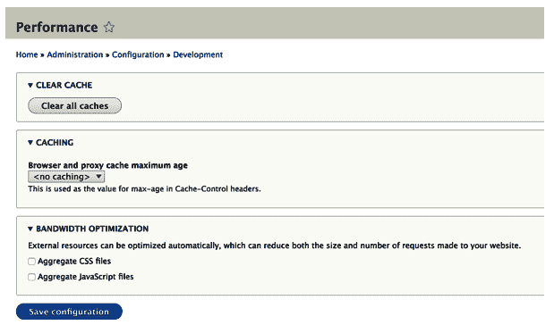

# 缓存

应用性能始终是使用 Drupal 进行开发时的一个痛点，这有很多原因。例如，PHP 并不是最快的语言。许多初学者 Drupal 开发者会陷入众多模块的诱惑，过度启用不必要的模块。确实，Drupal 架构也不是最高效的。然而，为了辩护，一个非常复杂的架构，它提供了很多开箱即用的功能，将有一些速度上的权衡。

在这个游戏中，一个关键组件却是缓存。对于那些不熟悉这个术语的人来说，缓存是一种存储处理过的代码副本（或其结果）的应用策略，以便在后续请求时更快地将它们提供给用户。例如，当你访问一个网站时，你的浏览器很可能会在电脑上本地缓存（存储）某些资源，以便下次访问该网站时可以更快地显示它们。

尽管缓存在 Drupal 最近版本中一直在稳步改进，但它仍然存在显著不足。尤其是当涉及到为注册用户提供服务时。然而，Drupal 8 却是一个完全不同的游戏。系统已经被彻底翻新，并融入 Drupal 架构的各个方面。不幸的是，这又给 Drupal 7 开发者需要学习的内容增加了另一个大项目。因为这个系统很复杂，我们根本不能（也不应该）回避它。但幸运的是，在本章中，我们将将其分解，看看我们正在处理什么。所以，当你正在 Drupal 8 中进行模块开发时，你的代码将更高效，你的网站将运行得更快，最终你的用户将更满意。

那么，我们将在本章中具体讨论些什么呢？

首先，我们将介绍一些关于 Drupal 8 中缓存系统的基本概念，并查看可用的主要缓存类型。在这里，我们还将了解在开发过程中如何禁用缓存以提高我们的生产力。

接下来，我们将讨论缓存性元数据。当涉及到缓存时，这是作为 Drupal 8 模块开发者你需要了解的最重要的事情之一。它与以 Drupal 能够正确缓存（并相应地使缓存失效）的方式声明渲染数组（和其他对象）有关。我们将讨论诸如缓存标签、上下文和最大存活时间（max-age）等问题，同时也会看到如何将它们应用于渲染数组、块插件和访问结果。

之后，我们将探讨如何处理那些不能或不应缓存的动态组件（渲染数组）。Drupal 8 有一个强大的自动占位符系统，它使用懒加载构建器将渲染推迟到更晚的阶段，这可以大大提高缓存性和感知性能。

最后，我们将探讨如何我们自己与缓存 API 交互，以创建、读取和使我们的缓存条目失效。有时我们需要执行昂贵的计算或在我们的网站上显示外部数据，这些都可以从缓存中受益。

那么，让我们开始吧。

# 缓存简介

在深入探讨缓存 API 之前，我想先提到的是，这个子系统是文档最完善的之一（截至撰写本文时）。您可以查看主入口页面（[`www.drupal.org/docs/8/api/cache-api/cache-api`](https://www.drupal.org/docs/8/api/cache-api/cache-api)），我建议在开发时将其放在手边。

Drupal 8 中的缓存系统提供了处理缓存数据的创建、存储和失效所需的 API。从存储的角度来看，它是可扩展的，允许我们编写自己的自定义缓存后端（`CacheBackendInterface`）。然而，默认情况下，缓存数据存储在数据库中，因此默认后端是 `DatabaseBackend`。向前发展，我们将只关注这一实现，因为它是最常用的，尤其是在启动新项目时。尽管如此，一旦网站变得更加复杂，可以采用替代的缓存后端来提高性能——例如 Memecache 或 Redis。

Drupal 8 中最简单的缓存类型是所谓的 *内部页面缓存*，其功能位于页面缓存核心模块内部。这个缓存层的目的是为匿名用户提供完全缓存的响应。主要假设是某些页面一旦缓存就可以为所有匿名用户提供相同的响应——这与我们在 Drupal 7 中所做的方法类似。然而，与之前的版本不同，这个版本在（不）提供过时内容方面要聪明得多，因为它使用了所谓的 *缓存标签* 来使缓存页面在页面上的某些内容发生变化时失效。我们很快就会详细介绍缓存标签。

在安装 Drupal 8 时，此模块默认启用，可以通过访问 `admin/config/development/performance` 来进行配置，其配置方式与 Drupal 7 大致相同：



尽管在 Drupal 7 中，为不太复杂的网站中的匿名用户提供服务并不那么糟糕，但当涉及到认证用户时，情况则完全相反。对于动态和细粒度的缓存，`Authcache` 扩展模块是最佳解决方案，但它极难使用和实现。然而，其中的一些核心原则已被用于 Drupal 8 中 `Dynamic Page Cache` 模块的开发，这使得事情变得更加简单（且稳健）。

此核心模块默认启用，并为所有类型的用户提供缓存页面所需的所有必要功能。也就是说，可以依赖于某些**缓存上下文**的页面。简而言之，该模块的方法是将可以服务于所有用户的页面部分一起缓存，并单独处理依赖于上下文的动态内容。它可以这样做，因为这些部分被标准化为渲染数组和可以提供**缓存性元数据**的其他组件。后者被收集并用于缓存和使最终结果失效。我们将在本章中讨论缓存上下文和所有这些元数据，并更好地理解它们。

在继续之前，我建议你回顾一下第一章的*开发者设置*部分，*为 Drupal 8 开发*，我在那里建议你在开发时使用开发者设置。其中一个原因是缓存，主要是动态页面缓存，你可以在`settings.php`文件中禁用它：

```php
$settings['cache']['bins']['dynamic_page_cache'] = 'cache.backend.null';  
```

在启用缓存的情况下进行实际开发是困难的，但与此同时，经常启用缓存并确保你的代码仍然能够正确运行是很重要的。很容易忘记某些依赖于上下文或应在某些操作后失效的代码片段，有时只有在启用缓存的情况下测试时才会发现这些问题。

话虽如此，让我们来谈谈缓存性元数据以及它是如何与渲染数组一起工作的。

# 缓存性元数据

缓存性元数据用于描述与它的**动态性**相关的**事物**。大多数时候，作为 Drupal 8 模块开发者，我们将在处理渲染数组时使用这些元数据。我们稍后会看到这些元数据在其他地方的应用，但现在，让我们看看实际的属性以及它们在渲染数组上下文中的用途。

在创建渲染数组时，我们需要考虑一些与缓存相关的事项。而且我们始终需要考虑这些事项。

# 缓存标签

我们首先需要考虑的是我们的渲染数组依赖于什么。我们是渲染某些实体数据吗？我们是使用某些配置值？或者任何可能在其他地方改变并影响我们必须渲染的内容的东西？如果答案是肯定的，我们需要使用**缓存标签**。如果我们不使用它们，我们的渲染数组将按原样缓存，如果底层数据发生变化，我们最终会向用户展示过时的内容或数据。

从另一个角度来看，想象一个简单的文章节点。这种内容可以在其主详情页、文章摘要列表或文章标题列表（以及许多其他潜在的地方）显示。由于无法知道它将在哪里使用，因此标记此节点实体为依赖项的责任在于显示此内容的渲染数组使用缓存标签。这样，当节点更新时，所有依赖于它的渲染数组也会被无效化。

缓存标签是简单的字符串，我们可以为单个渲染数组声明多个缓存标签。它们具有以下特殊形式：`thing:identifier`，或者在某些情况下，仅仅是`thing`（如果只有一个这样的`thing`）。例如，给定节点的缓存标签将是`node:1`的格式，其中标识符是实际的节点 ID。或者对于配置对象，它将是`config:hello_world.custom_salutation`。

我之前已经暗示过，例如，某些节点内容可以出现在列表中，因此我们可以使用缓存标签来确保当节点更新时，该节点的渲染数组也会得到更新。由于渲染数组非常细粒度，这可能会带来一个小问题，因为列表本身可能就是一个渲染数组，甚至可能不知道它渲染了哪些节点。或者更严重的是，它不知道何时创建了新的节点，应该将其包含在内。为了解决这个问题，我们有一个特殊的**列表**缓存标签，可以在渲染实体时使用。例如，`node_list`缓存标签可以用于节点实体，而`product_list`缓存标签可以用于产品实体。这些标签会被 Drupal 缓存系统自动理解，所以我们只需要适当地使用它们即可。

然而，为了让生活更简单，所有实体和配置对象都可以被“查询”以提供它们各自的缓存标签。例如：

```php
$tags = $node->getCacheTags();  
```

`$tags`将是一个包含一个标签的数组——`node:[nid]`。

同样适用于配置对象，这很方便，因为它可以防止拼写错误和错误。这是由于它们实现的通用`CacheableDependencyInterface`定义了检索缓存元数据属性的方法。实际上，任何需要成为缓存依赖的值都可以也应该实现这个接口。你会发现，Drupal 核心中有相当多的类实现了这个接口。

你还会遇到`RefinableCacheableDependencyInterface`，它在底层对象的缓存性可以在运行时改变的情况下使用。例如，添加了一个实体翻译，这意味着需要为该语言添加一个新的缓存上下文。

我们还可以确定特定实体类型的“列表”缓存标签。例如，而不是硬编码`product_list`标签，我们可以使用`EntityTypeInterface`上的`getListCacheTags()`方法。

如果你的渲染数组依赖于某些自定义内容，你可以使用自定义缓存标签，但当你更改底层数据时，你也必须负责使它们失效。当我们直接与缓存 API 交互时，我们将看到这是如何完成的。始终一致地使用 `CacheableDependencyInterface` 对于任何自定义值对象来说都是一件好事。

# 缓存上下文

一旦我们考虑了渲染数组的依赖关系，接下来要考虑的第二件最重要的事情是它有什么不同之处。换句话说，有没有什么理由让这个渲染数组有时以一种方式显示，有时以另一种方式显示？

让我们以一个简单的例子来说明一个渲染数组，它会打印出当前用户的名称。这再简单不过了。现在忽略缓存标签，我们立刻意识到我们不能向所有用户展示相同的用户名，对吧？所以，用户 *Danny* 应该看到“Hi Danny”，而用户 *John* 应该看到“Hi John”。我们谈论的是同一个渲染数组，但它在上下文中有所不同。换句话说，这个渲染数组的变体需要为每个遇到的上下文单独缓存。这就是我们使用前面提到的 *缓存上下文* 的地方。

与缓存标签类似，缓存上下文是简单的字符串，渲染数组可以定义多个。例如，`user` 上下文将为每个用户缓存给定渲染数组的变体。

此外，它们在本质上具有层次性，因为某些上下文可以包含其他上下文。例如，让我们继续我们之前的例子。假设具有 `editor` 角色的用户应该看到问候信息，而具有 `contributor` 角色的用户应该看到不同的、更复杂的信息。在这种情况下，缓存上下文将基于用户拥有的角色。但由于它已经因为需要显示其用户名而依赖于实际用户，因此甚至没有必要考虑角色上下文，因为前者已经包含了后者。此外，Drupal 足够智能，足以在组合构成页面的所有渲染数组的缓存上下文时删除多余的上下文。但如果我们的渲染数组仅在用户角色上有所不同，而不一定是用户本身，我们应该使用特定的上下文——`user.roles`。正如你可能注意到的，层次性体现在上下文的点（`.`）分隔上。

Drupal 核心已经定义了许多缓存上下文。虽然你可能不需要，至少在开始时不需要，但你也可以定义其他上下文。我建议你查看文档页面（[`www.drupal.org/docs/8/api/cache-api/cache-contexts`](https://www.drupal.org/docs/8/api/cache-api/cache-contexts)），了解开箱即用的可用缓存上下文。

# Max-age

在创建渲染数组时，我们需要考虑的最后一件主要事情是它们应该在缓存中存储多长时间，除非底层数据发生变化而使它们失效。这通常是你很少设置的事情，默认情况下它将是永久的。然而，更常见的情况是，你会将这个缓存属性设置为 0，以表示这个渲染数组永远不应该被缓存。这就是当你渲染一些高度动态的内容，根本不值得缓存的时候。

# 使用缓存元数据

现在我们已经查看过了三个主要的缓存属性，我们需要考虑创建渲染数组，所以让我们回顾一下我们之前的工作，并在需要时将其应用于实践中。

很常见，你会在 Drupal 8 核心代码中看到`CacheableMetadata`对象被使用和传递。这仅仅用于表示缓存元数据，并提供了一些方便的方法来将此元数据应用于渲染数组，从其中静态实例化自己，或者从一个`CacheableDependencyInterface`对象中实例化，以及与另一个`CacheableMetadata`对象合并。

我们将要查看的渲染数组位于`HelloWorldSalutation::getSalutationComponent()`服务中，用于渲染问候消息。我们构建它相当动态，但简化版本看起来像这样（省略了一些内容）：

```php
$render = [ 
  '#theme' => 'hello_world_salutation', 
  '#salutation' => [ 
    '#markup' => $salutation 
  ] 
];    
```

在这里，`$salutation`要么是来自配置对象的消息，要么是基于一天中的时间生成的。

马上要提到的是，这是那种我们由于其高度动态的特性而无法真正缓存渲染数组的情况之一。这是由于对一天中的时间的依赖造成的。当然，我们可以设置几秒或一小时的最高年龄，但这值得吗？而且我们还冒着显示错误问候的风险。

因此，在这种情况下，我们可以做的是添加一个最大年龄为 0：

```php
$render = [ 
  '#theme' => 'hello_world_salutation', 
  '#salutation' => [ 
    '#markup' => $salutation 
  ], 
  '#cache' => [ 
    'max-age' => 0 
  ] 
];   
```

如上所示，缓存元数据位于`#cache`渲染数组属性下。

指定最大年龄基本上告诉 Drupal 永远不要缓存这个渲染数组。关于这一点，重要的是要知道，这个声明将冒泡到顶级渲染数组，从而阻止整个内容被缓存。因此，不要轻易做出阻止缓存的决定。在我们的例子中，这基本上是整个控制器响应，而且实际上是一个非常简单的计算，所以我们没问题。在章节的后面，我们将讨论如何减轻这种情况。

在这个例子中，我们将`max-age`设置为 0 仍然存在问题。尽管它将与动态页面缓存（`max-age`将冒泡）一起工作，但为匿名用户服务的内部页面缓存将不会得到这个信息。因此，匿名用户每次都会看到相同的内容。可能在未来的 Drupal 8 版本中，这个问题将会得到解决。我们不会考虑这个问题，因为它是一个很好的例子，说明了使用自动化测试时出现的错误，我们将在本书的最后一章中看到这一点——当然，还有解决方案。

让我们暂时假设我们的问候组件只是渲染配置对象中存储的消息，并且不显示特定时间的内容。如果你还记得：

```php
$config = $this->configFactory->get('hello_world.custom_salutation'); 
$salutation = $config->get('salutation');  
```

在这种情况下，我们可以缓存渲染数组，但正如我们之前讨论的，我们还需要考虑依赖关系以及它可能有的潜在变化。依赖关系已经很明显了——配置对象。因此，我们会这样做：

```php
$render = [ 
  '#theme' => 'hello_world_salutation', 
  '#salutation' => [ 
    '#markup' => $salutation 
  ], 
  '#cache' => [ 
    'tags' => $config->getCacheTags() 
  ] 
];  
```

基本上，我们正在请求这个特定配置对象的缓存标签，并将这些标签设置到渲染数组上。如果我们有更多来自多个对象的缓存标签集要设置，我们就必须合并它们。我们可以使用一个工具来确保我们正确地做到这一点。例如：

```php
$tags = Cache::mergeTags($config_one->getCacheTags(), $config_two->getCacheTags());  
```

这将简单地合并两个缓存标签数组。`Drupal\Core\Cache\Cache`类也有静态辅助方法用于合并缓存上下文和最大年龄（以及其他事情，我鼓励你在学习过程中查看这些）。

幸运的是，我们的渲染数组很简单且不变化，因此我们不需要缓存上下文。然而，如果我们已经将当前用户名附加到问候语中，我们就必须将`user`上下文添加到渲染数组中，如下所示：

```php
'#cache' => [
  'tags' => $config->getCacheTags(),
  'contexts' => ['user']
]
```

这将为每个访问页面的用户缓存不同的渲染数组，并在后续访问时相应地为他们提供服务。

# 块插件的缓存

我们之前看到的渲染数组被用作控制器响应的一部分。后者也被称为*主要内容*，因为它构成了页面的主要输出。在一个普通的 Drupal 安装中，它使用块模块，包含在`主页面内容`块中。我们还提到，将 max-age 设置为 0 将冒泡到顶级渲染数组，导致整个页面不会被缓存。就控制器响应而言，这是正确的。其他块仍然根据它们自己的元数据独立缓存。

在这本书中，你已经学习了我们可以如何创建自定义块，我们看到了它们也是使用渲染数组构建的。既然是这样，缓存元数据也可以应用于这些数组以正确缓存它们。然而，由于我们在创建块插件时扩展了`BlockBase`类，所以我们实际上是在实现`CacheableDependencyInterface`，因为`BlockPluginInterface`扩展了它。

因此，我们不应该在渲染数组上设置元数据，而应该尽可能使用该接口上的方法，通过覆盖默认的父级实现来实现。例如：

```php
/** 
* {@inheritdoc} 
*/ 
public function getCacheContexts() { 
  return Cache::mergeContexts(parent::getCacheContexts(), ['user']); 
}  
```

我们应该始终将我们自己的值与父级的值合并。

然而，在某些情况下，尤其是在声明缓存标签时，将它们设置在`build()`方法的渲染数组中更有意义。这是因为你可能已经做了一些工作来获取依赖对象，重复在另一个方法中做这些工作是没有意义的。这是完全可以的。

# 缓存访问结果

需要考虑缓存元数据的重要地方之一是在`AccessResultInterface`对象上。如果你还记得上一章的内容，实现此接口的对象被一致地用来表示对某个资源的访问。除此之外，它们还可以包含缓存性元数据。这是因为访问可能依赖于某些可能影响访问结果本身的数据。由于 Drupal 试图缓存访问，我们需要通知它这些依赖关系。

一个很好的例子是`HelloWorldAccess`服务，我们在其中动态检查对`hello_world.hello`路由的访问。因此，我们不是简单地返回`AccessResultInterface`，而是在这样做之前向其添加缓存依赖项。重写的`access()`方法现在可以看起来像这样：

```php
$config = $this->configFactory->get('hello_world.custom_salutation'); 
$salutation = $config->get('salutation'); 
$access = in_array('editor', $account->getRoles()) && $salutation != "" ? AccessResult::forbidden() : AccessResult::allowed(); 
$access->addCacheableDependency($config); 
$access->addCacheableDependency($account); 
return $access;  
```

`addCacheableDependency()`方法通常接受`CacheableDependencyInterface`对象来读取它们的缓存元数据。如果传递了其他内容，则认为访问结果不可缓存。因此，在我们的情况下，由于访问依赖于问候配置对象和用户账户，我们将它们两者都添加为缓存依赖项。

# 占位符和延迟构建

现在我们已经了解了一些关于如何在更常见的场景中使用缓存性元数据的信息，让我们转换一下话题，讨论那些具有高度动态数据的页面组件。

当我们将 Hello World 问候的最大年龄设置为 0 秒（不缓存）时，我提到过有方法可以改进这一点以帮助性能。这涉及到通过占位符将相应的渲染推迟到最后一刻。但首先，让我们了解一下背景。

我们讨论的每个缓存属性都可能具有使缓存渲染数组变得无意义的值。我们已经讨论了将最大年龄设置为 0 的情况，但你也可以非常低地设置过期时间以达到相同的效果。此外，某些缓存标签可能被频繁地失效，再次使依赖于它们表示的渲染数组变得无意义。最后，某些缓存上下文可能提供许多变体，这会显著限制缓存的有效性，甚至可能适得其反（高存储成本）。

缓存标签是我们正在构建的应用程序中非常具体的东西，因此不能对哪些具有高失效率做出一般假设。然而，有两个缓存上下文默认被认为具有过高基数，以至于无法有效：`session`和`user`。是的，我们之前已经讨论了`user`上下文作为一个好例子，但在现实中——默认情况下——将此上下文添加到渲染数组的效果几乎与将最大存活时间设置为 0 相同——它将不会被缓存。对于`session`上下文也是如此，因为网站上可能有如此多的会话和用户，你可能不希望为每个单独的会话或用户保留缓存记录。

由于这些规则并非必须适用于所有应用，Drupal 将这些值配置为服务参数，以便在需要时进行更改。在`core.services.yml`文件（其中列出了大多数核心服务）中，我们还可以找到一些参数定义，包括这个：

```php
renderer.config: 
  auto_placeholder_conditions: 
    max-age: 0 
    contexts: ['session', 'user'] 
    tags: [] 
```

如您所见，包括 0 的最大存活时间值和之前提到的缓存上下文，但没有标签。我们也可以更改这些值。例如，如果我们知道在我们的应用程序中用户不会太多，并且实际上按用户上下文进行缓存是有意义的，或者我们知道某些缓存标签具有高失效频率，那么更改这些值是有意义的。我们可以通过两种方式来实现：要么使用我们网站范围的`services.yml`文件并复制这些声明（同时进行适当的更改），要么我们可以以相同的方式使用给定模块的服务文件。这两种方法都会覆盖 Drupal 核心设置的默认参数。

既然我们已经清楚为什么某些事物不可缓存，让我们看看如何使用*自动占位符*来解决这个问题。

自动占位符过程是 Drupal 识别那些由于我们之前提到的原因不能或不应缓存的渲染数组，并用占位符替换它们的过程。然后，在最后可能的一刻替换占位符，同时允许页面的其余部分进行缓存。这也被称为*懒惰构建*。

Drupal 通过适合我们之前看到的条件的缓存元数据和渲染数组上`#lazy_builder`属性的存在来识别需要懒惰构建的部分。后者映射到一个返回其自己的渲染数组的回调函数，该渲染数组也可以包含上述缓存元数据。并且，无论哪个渲染数组包含后者都无关紧要。

# 懒惰的构建者

懒构建器不过是渲染数组上的回调，Drupal 可以使用它来在后续阶段构建渲染数组。回调可以是静态的（对类和方法的引用）或动态的（对服务和方法的引用）。使用后者方法更为灵活，因为我们可以从容器中注入依赖，就像我们通常对服务所做的那样。此外，回调可以接受参数，这意味着它可以在已经拥有至少部分所需数据的情况下构建渲染数组。

理解这一点最好的方式是看一个例子。由于我们决定我们的问候组件应该有 0 秒的缓存生命周期，这是一个使用懒构建器构建的好机会。

我们需要做的第一件事是将我们的`helloWorld`控制器方法中的直接调用问候服务替换为以下内容：

```php
return [ 
  '#lazy_builder' => ['hello_world.lazy_builder:renderSalutation', []], 
  '#create_placeholder' => TRUE, 
]; 
```

回到第四章，关于*主题化*，当我提到渲染数组需要至少包含四个属性（`#type`、`#theme`、`#markup`或`#plain_text`）时，我说谎了。我们还可以使用这样的懒构建器来延迟构建渲染数组到后续阶段。

`#lazy_builder`需要是一个数组，其第一个元素是回调函数，第二个元素是要传递给它的参数数组。在我们的例子中，我们不需要后者的任何内容。我们可以传递问候服务，但我们将将其注入到我们将在下一分钟创建的新的`hello_world.lazy_builder`服务中。回调引用的格式为`service_name:method`（使用一个冒号进行分隔）或者对于静态调用`class_name::method`（使用两个冒号）。我们还明确声明了`#create_placeholder`，以明确指出这个渲染数组应该被占位符替换。最后，正如我之前提到的，缓存元数据可以应用于这个渲染数组，也可以应用于懒构建器生成的结果数组。因此，在这种情况下，我们将选择后者方法。

让我们现在定义我们的服务：

```php
hello_world.lazy_builder: 
  class: Drupal\hello_world\HelloWorldLazyBuilder 
  arguments: ['@hello_world.salutation']  
```

这里没有什么特别之处，但我们正在将`HelloWorldSalutation`服务作为依赖项注入，这样我们就可以请求我们的问候组件。实际的服务类看起来是这样的：

```php
namespace Drupal\hello_world; 

/** 
 * Lazy builder for the Hello World salutation. 
 */ 
class HelloWorldLazyBuilder { 

  /** 
   * @var \Drupal\hello_world\HelloWorldSalutation 
   */ 
  protected $salutation; 

  /** 
   * HelloWorldLazyBuilder constructor. 
   * 
   * @param \Drupal\hello_world\HelloWorldSalutation $salutation 
   */ 
  public function __construct(HelloWorldSalutation $salutation) { 
    $this->salutation = $salutation; 
  } 

  /** 
   * Renders the Hello World salutation message. 
   */ 
  public function renderSalutation() { 
    return $this->salutation->getSalutationComponent(); 
  } 
}  
```

这一切都非常简单。由于我们在懒构建器中引用了`renderSalutation()`方法，所以需要这个方法。这就是我们必须要做的。但是，这究竟会发生什么呢？

当 Drupal 渲染我们的控制器时，它会找到懒加载构建器并将其与占位符注册，然后使用占位符代替实际的最终渲染数组。然后，在页面构建过程的后期，懒加载构建器被调用，实际输出被渲染以替换占位符。这种方法有几个优点和影响。首先，它允许 Drupal 绕过这个高度动态的输出部分，并将动态页面缓存中的其余组件缓存起来。这是为了防止缓存不可用的问题影响到整个页面。其次，有几种不同的策略（到目前为止）可以处理占位符。默认情况下，使用所谓的“单次刷新”方法，占位符替换被推迟到最后一刻，但在完成之前不会将响应发送回浏览器。因此，动态页面缓存确实改善了事情（缓存了它能缓存的内容），但响应仍然依赖于占位符处理完成。根据这需要多长时间，页面的加载通常可能会受到影响。然而，当使用**BigPipe**（[`www.facebook.com/notes/facebook-engineering/bigpipe-pipelining-web-pages-for-high-performance/389414033919`](https://www.facebook.com/notes/facebook-engineering/bigpipe-pipelining-web-pages-for-high-performance/389414033919)）方法时，在替换占位符之前，响应就被发送回浏览器。随着后者的完成，替换也被流式传输到浏览器。这大大提高了网站的感知性能，因为用户可以在较慢的部分出现之前看到页面的大部分内容。

*BigPipe* 技术是由 Facebook 发明的一种处理高度动态页面的方法，并逐渐被引入 Drupal 8 作为实验性核心模块。在版本 8.3 中，它已被标记为稳定，并准备好在生产网站上使用。我强烈建议您保持此模块启用，因为它包含标准安装配置文件。

如您现在可能已经猜到的，懒加载构建器方法仅在动态页面缓存时有用。也就是说，当我们为认证用户缓存时。它不会与用于匿名用户的内部页面缓存一起工作。

# 使用缓存 API

到目前为止，在这一章中，我们主要关注渲染数组和如何将它们暴露给缓存 API 以获得更好的性能。现在是时候谈谈默认情况下 Drupal 如何存储缓存条目，以及我们如何在代码中与它们交互了。

如前所述，缓存系统的中心接口是`CacheBackendInterface`，这是任何缓存系统都需要实现的接口。它基本上提供了创建、读取和使缓存条目无效的方法。

正如我们所预期的，当我们想要与缓存 API 交互时，我们使用一个服务来检索`CacheBackendInterface`的一个实例。然而，我们使用的服务名称取决于我们想要与之工作的缓存`bin`。缓存`bin`是根据它们的类型将缓存条目组合在一起的存储库。因此，上述实现包装了一个单独的缓存区，每个区都有一个机器名。服务名称将是以下格式：`cache.[bin]`。这意味着对于每个缓存区，我们都有一个单独的服务。

获取此服务的静态简写如下：

```php
$cache = \Drupal::cache();  
```

这将返回由`CacheBackendInterface`实现表示的`default`缓存区。如果我们想要请求特定的缓存区，我们传递名称作为参数：

```php
$cache = \Drupal::cache('render');  
```

这将返回`render`缓存区。

当然，如果我们需要在某处注入一个缓存区包装器，我们只需使用前面提到的格式中的服务机器名。

尽管我们为每个缓存区都有一个单独的服务，但它们基本上都做同样的事情，那就是使用`CacheFactory`为该区实例化正确的缓存后端类型。单个缓存后端可以注册并设置为全局或特定缓存区的默认后端。

如我在本章开头提到的，Drupal 中的默认缓存后端——这个工厂将为所有缓存区实例化——是`DatabaseBackend`。每个缓存区由一个数据库表表示。这与 Drupal 7 中的概念类似。

既然我们已经知道了如何加载缓存后端服务，让我们看看我们如何使用它来读取和缓存东西。当涉及到这一点时，你的首要参考点是`CacheBackendInterface`，它记录了所有方法。然而，由于它不强化返回值，我们接下来要看到的例子将使用数据库缓存后端。它们可能与其他缓存后端实现不同。

我们将要讨论的第一个方法是`get()`，它接受我们想要检索的缓存条目的 ID（`$cid`）和一个可选的`$allow_invalid`参数。第一个参数已经很明确了，但第二个参数用于在条目已过期或已失效的情况下检索条目。这在那些宁愿选择过时数据而不是多个并发请求的计算成本的情况下可能很有用：

```php
$data = $cache->get('my_cache_entry_cid');  
```

结果的`$data`变量是一个包含`data`键（已缓存的资料）和关于缓存条目的各种元数据的 PHP 标准类：过期时间、创建时间戳、标签、有效状态等等。

当然，还有一个`getMultiple()`方法，你可以用它一次性检索多个条目。

更有趣的是，`set()`方法允许我们在缓存中存储东西。此方法有四个参数：

+   `$cid`：用于检索条目的缓存 ID。

+   `$data`：一个可序列化的数据结构，如数组或对象（或简单的标量值）。

+   `$expire`：UNIX 时间戳，在此时间戳之后，此条目被认为是无效的，或者使用`CacheBackendInterface::CACHE_PERMANENT`来表示此条目永远不会无效，除非明确使其无效。后者是默认值。

+   `$tags`：一个缓存标签数组，如果这个条目依赖于其他东西（缓存元数据，基本上），则将使用这些标签来使该条目无效。

因此，要使用它，我们会这样做：

```php
$cache->set('my_cache_entry_cid', 'my_value');  
```

通过这个语句，我们在选择的 bin 中创建了一个简单的非序列化缓存条目，除非明确使其无效（或删除），否则不会过期。随后的相同缓存 ID 调用将简单地覆盖条目。如果缓存值是数组或对象，它将自动序列化。

当涉及到删除时，有两种简单的方法：`delete()`和`deleteMultiple()`，它们分别以`$cid`（或缓存 ID 数组）作为参数，并将条目从 bin 中完全删除。如果我们想删除 bin 中的所有项目，我们可以使用`deleteAll()`方法。

与删除条目相比，很多时候使它们无效是一个好主意。我们仍然可以使用`$allow_invalid`参数检索数据，并在新条目被重新计算时使用条目。这几乎可以像删除一样完成，但使用以下方法代替：`invalidate()`、`invalidateMultiple()`和`invalidateAll()`。

好的，但那些我们可以与条目一起存储的缓存标签是什么？我们多少已经知道了它们的作用，那就是在多个 bin 中使用某些数据标记来标记缓存条目，这样当数据更改时可以轻松使它们无效。就像渲染数组一样。那么，我们如何做到这一点呢？

假设我们存储以下缓存条目：

```php
$cache->set('my_cache_entry_cid', 'my_value', CacheBackendInterface::CACHE_PERMANENT, ['node:10']);  
```

我们基本上使其依赖于 ID 为 10 的节点更改。这意味着当该节点更改时，我们的条目（以及所有其他 bin 中的所有其他条目，这些条目具有相同的标签）将变得无效。就这么简单。

但我们也可以有自己的标签，使其依赖于我们自己的某些自定义内容，如数据值（正如我们在本章前面讨论的，应该实现`CacheableDependencyInterface`）或某种过程。在这种情况下，我们还需要负责使所有带有我们标签的缓存条目无效。我们可以通过以下最简单的方式静态地做到这一点，使用我们在合并元数据时遇到的`Cache`类：

```php
Cache::invalidateTags(['my_custom_tag']);  
```

这将使所有带有数组中传递的任何标签的缓存条目无效。在底层，此方法使用对缓存无效化服务器的静态调用，因此，尽可能的情况下，最好实际注入该服务——`cache_tags.invalidator`。

# 创建我们自己的缓存 bin

通常，现有的缓存存储，尤其是默认的，足以存储我们的缓存条目。然而，有时我们需要为同一功能创建多个条目，在这种情况下，有一个专门的存储会很有帮助。那么，让我们看看如何创建它。

这相当简单，因为我们只需要定义一个服务：

```php
cache.my_bin: 
  class: Drupal\Core\Cache\CacheBackendInterface 
  tags: 
    - { name: cache.bin } 
  factory: cache_factory:get 
  arguments: [my_bin] 
```

在这个服务定义中使用的类实际上是一个接口。这是因为我们使用工厂来实例化服务而不是直接使用容器。这意味着我们不知道将实例化哪个类。在这种情况下，相关的工厂是名为`cache_factory`的服务及其`get()`方法。在第三章“日志和邮件”中，我们看到了一个例子，当我们讨论日志通道时，发生了类似的事情。

`cache.bin`标签用于让 Drupal 理解这个服务的功能，即它是一个缓存存储。确保这个存储获得其存储的责任属于实际的后端。因此，在我们的例子中，`DatabaseBackend`根据需要创建和删除缓存表。

最后，静态参数是传递给工厂并用于为这个特定存储创建缓存后端的存储名称。就是这样。如果我们清除缓存，我们已经在数据库中看到了我们存储的新缓存表。

# 摘要

在本章中，我们介绍了 Drupal 8 中任何模块开发者都需要熟悉的缓存的主要方面。我们介绍了一些关键概念，并讨论了两种主要的缓存类型——内部页面缓存（用于匿名用户）和动态页面缓存（用于认证用户）。

我们更深入地研究了缓存性元数据，这可能是我们最需要理解和最常见的事情。正确使用它是强制性的，以确保我们构建的所有渲染数组都被正确缓存和使失效。我们还看到了如何使用特定的方法来定义块插件的缓存性元数据，以及访问结果应该如何根据需要接收缓存性依赖。在此基础上，我们还探讨了懒加载构建器和允许我们在保持整体良好缓存性的同时处理高度动态组件的*自动占位符*策略。

最后，我们探讨了如何自己使用 Cache API 来存储、读取和使我们的缓存条目失效。我们还看到了如何创建我们自己的自定义缓存存储。

缓存是 Drupal 8 模块开发的一个重要方面。在之前的版本中，它甚至无法接近，我们经常能够忽略它而无需特别注意。现在，我们有一个强大的系统来提高渲染性能，我们应该充分利用它。

在下一章中，我们将讨论 JavaScript 以及我们如何在 Drupal 环境中使用它，以及强大的 Ajax API。
