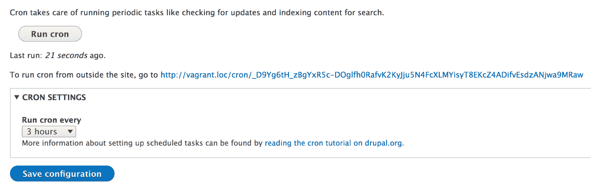
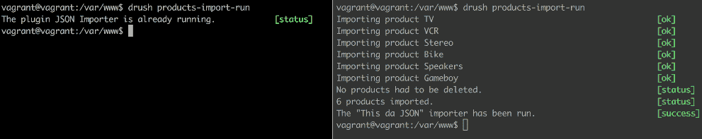

# 第十四章：批处理、队列和 Cron

如果在前一章中我们保持了一些理论性，让我向你抛出“规则”，那么在这一章中，我将弥补这一点，我们将有一些乐趣。这意味着我们将编写一些代码来展示与数据处理相关的概念，特别是大量数据处理。在这个过程中，我们将涵盖几个主题。

首先，我们将回顾在第八章中看到的`hook_update_N()`钩子，*数据库 API*。更具体地说，我们将看看如何使用`&$sandbox`参数来处理需要处理一些可能需要较长时间且应跨多个请求分批进行的数据更新。接下来，我们将查看独立*批处理*（基本上使用相同的系统）以跨多个请求批量处理数据。那么，用我们的需要处理未定义数量产品的导入器来展示这个技术不是更好吗？

我们将查看一个相关的子系统，它允许我们为后续处理（无论是批量、cron 还是简单请求）排队*事物*。由于我们正在谈论 cron，我们也将深入探讨这个系统在 Drupal 中的工作方式。最后，我们将通过查看 Drupal 8 中的 Lock API 来结束本章，这是一个允许我们确保多个请求不会同时运行一个进程的 API。

到本章结束时，你将变成一个精简、高效的数据处理机器。所以，让我们开始吧。

# 批量驱动的更新钩子

我们将要首先查看的是更新钩子，回顾我们在第八章中创建的之前的 Sports 模块，*数据库 API*。我们将关注当时我们没有使用的`&$sandbox`参数。目标是运行对`players`表中的每个记录的更新，并将它们标记为*退役*。目的是说明我们如何逐个处理这些记录，以单个请求的形式来防止 PHP 超时。如果我们有很多记录，这会很有用。

为了让我们开始，这里有一切代码，我们将在之后看到每一部分的意义：

```php
/** 
 * Update all the players to mark them as retired. 
 */ 
function sports_update_8002(&$sandbox) { 
  $database = \Drupal::database(); 

  if (empty($sandbox)) { 
    $results = $database->query("SELECT id FROM {players}")->fetchAllAssoc('id'); 
    $sandbox['progress'] = 0; 
    $sandbox['ids'] = array_keys($results); 
    $sandbox['max'] = count($results); 
  } 

  $id = $sandbox['ids'] ? array_shift($sandbox['ids']) : NULL; 

  $player = $database->query("SELECT * FROM {players} WHERE id = :id", [':id' => $id])->fetch(); 
  $data = $player->data ? unserialize($player->data) : []; 
  $data['retired'] = TRUE; 
  $database->update('players') 
   ->fields(['data' => serialize($data)]) 
   ->condition('id', $id) 
   ->execute(); 
  $sandbox['progress']++; 
  $sandbox['#finished'] = $sandbox['progress'] / $sandbox['max']; 
} 
```

如果你还记得，函数名包含模块的新架构版本，这个版本将在运行时设置。有关更多信息，请参阅第八章，*数据库 API*。

当这个钩子被触发时，`$sandbox`参数（通过引用传递）是空的。它的目标是作为在函数内部处理所有内容所需的请求之间的临时存储。我们可以用它来存储任意数据，但我们应该注意其大小，因为它必须适合`LONGBLOB`表列。

我们首先要做的是获取数据库服务以对`players`表进行查询。但更重要的是，我们正在检查`$sandbox`变量是否为空，这表明这是过程的开始。如果是的话，我们会添加一些特定于我们过程的数据。在这种情况下，我们想要存储进度（这很常见），需要更新的玩家的 ID，以及记录总数（也很常见）。为了做到这一点，我们执行一个简单的查询。

一旦设置了 sandbox，我们就可以获取列表中的第一个 ID，同时移除它，这样，迭代地，我们处理的记录就越来越少。基于这个 ID，我们加载相关的玩家，将我们的数据添加到其中，并在数据库中更新它。一旦完成，我们就将进度增加 1（因为我们处理了一条记录）。最后，sandbox 中的`#finished`键是 Drupal 用来确定过程是否完成的关键。它期望一个介于 0 和 1 之间的整数，后者表示我们已经完成。如果发现任何小于 1 的值，函数将被再次调用，`$sandbox`数组将包含我们离开时的数据（增加的进度和少一个待处理的 ID）。在这种情况下，函数的主体将再次运行，处理下一条记录，依此类推，直到进度除以最大记录数等于 1。如果我们有 100 条记录，当进度达到 100 时，以下是真的：100 / 100 = 1。然后，Drupal 知道完成过程，不再调用该函数。

这个过程在 Drupal 术语中也被称作批处理，非常有用，因为 Drupal 会根据需要发出尽可能多的请求来完成它。我们可以控制每个请求需要完成的工作量。前一个例子可能有点过度，因为一个请求完全能够处理多个玩家。我们实际上在浪费时间，因为像这样，Drupal 需要为每个请求重新启动自己。所以，这取决于我们找到那个甜蜜点。在我们之前的例子中，我们本可以将 ID 数组分成大约五块的块，并允许一个请求处理五条记录而不是一条。这肯定会提高速度，但我鼓励你在理解了使用`$sandbox`进行批处理的原则后，现在就自己尝试一下。

# 批量操作

现在我们已经对 Drupal 的多请求处理能力有了基本的了解，让我们转换一下，看看 Batch API。

为了演示这是如何工作的，我们将重建我们的产品`JsonImporter`插件处理它检索到的产品数据的方式。目前，我们只是将所有产品加载到一个对象数组中，然后遍历每个对象，将它们保存到数据库中。所以，如果 JSON 响应中有 100,000 个产品，我们可能会遇到麻烦。公平地说，如果远程提供者有这么多产品，它通常会提供一个分页的方式通过传递偏移量和限制来请求它们。这保持了负载更小（这对通信服务器双方都有好处），并且使处理更容易。在我们的这一边，我们可以将其视为我们处理数据库的方式。但就目前而言，我们将假设返回的产品数量很大，但不是大到足以引起通信问题或 PHP 存储在内存中的能力问题。

此外，在演示批次 API 的同时，我们还将执行在第七章“您自己的自定义实体和插件类型”中“忘记”的操作。在导入过程中，我们还想删除任何之前已导入但不再在 JSON 响应中的产品。如果你愿意，这是一种两种数据源之间的同步。所以，让我们开始吧。

# 创建批次

在`JsonImporter::import()`方法内部，一旦我们获得了`$products`数组，让我们用以下代码替换循环：

```php
$batch_builder = (new BatchBuilder()) 
  ->setTitle($this->t('Importing products')) 
  ->setFinishCallback([$this, 'importProductsFinished']); 

$batch_builder->addOperation([$this, 'clearMissing'], [$products]); 
$batch_builder->addOperation([$this, 'importProducts'], [$products]); 
batch_set($batch_builder->toArray());  
```

以及顶部的新`use`语句：

```php
use Drupal\Core\Batch\BatchBuilder;  
```

创建批次涉及多个步骤，第一步是创建一个批次定义，这只是一个包含一些数据的数组。在 Drupal 8.6 版本之前，批次定义是通过实际定义一个数组来创建的。现在我们使用一个专门的批次构建器对象，但最终结果是一样的。

批次可以有一个标题，用于设置进度页面上使用的标题。同样，它还可以有一个可选的初始化、进度和错误消息，这些可以通过相应的方法设置，但同时也提供了合理的默认值。有关您可以使用它们做什么以及您还有哪些其他选项的更多信息，请确保查看`BatchBuilder`类和`batch_set`全局函数。

批次定义最重要的部分是操作列表，其中我们指定在批次中需要发生什么。这些定义为任何有效的 PHP 回调函数和一个传递给这些回调函数的参数数组。如果后者位于尚未加载的文件中，可以使用`setFile()`方法指定文件路径以包含。每个操作都在其自己的 PHP 请求上运行，按照它们定义的顺序。此外，每个操作还可以跨多个请求运行，类似于我们之前编写的更新钩子。

我们的第一个操作将负责从 Drupal 中删除在 JSON 响应中不再存在的产品，而后者将执行导入。这两个操作都只接收一个参数——产品数组。

定义数组中的`finished`键（使用`setFinishCallback()`方法设置）是另一个在批处理结束时触发的回调，在所有操作完成后。

最后，我们调用全局的`batch_set()`方法，它静态地设置批处理定义并标记它为准备好运行。触发批处理只需再走一步，那就是调用`batch_process()`。但我们没有使用它的原因是，如果导入作为表单提交的一部分运行，表单 API 会自动触发它。所以如果我们在这里也触发它，它将不起作用。表单 API 为我们这样做的原因是，大多数情况下我们希望批处理只在采取行动的结果下运行。通常，这是通过表单完成的。然而，另一个主要可能性是通过 Drush 命令触发批处理（我们实际上可以这样做）。在这种情况下，我们需要使用`drush_backend_batch_process()`函数。

因此，我们首先会检查我们是否处于命令行环境（即 Drush），并且只在那种情况下触发它：

```php
if (PHP_SAPI == 'cli') {
  drush_backend_batch_process();
}
```

否则，我们将其留给表单 API。通过这样做，我们可以从表单提交处理程序和通过 Drush 触发导入，并且我们可以拥有不必要使用批处理的插件。

# 批处理操作

现在我们已经设置了批处理定义，但我们缺少在定义中引用的那三个回调方法。所以，让我们看看第一个：

```php
/** 
 * Batch operation to remove the products which are no longer in the list of 
 * products coming from the JSON file. 
 * 
 * @param $products 
 * @param $context 
 */ 
public function clearMissing($products, &$context) { 
  if (!isset($context['results']['cleared'])) { 
    $context['results']['cleared'] = []; 
  } 

  if (!$products) { 
    return; 
  } 

  $ids = []; 
  foreach ($products as $product) { 
    $ids[] = $product->id; 
  } 

  $ids = $this->entityTypeManager->getStorage('product')->getQuery() 
    ->condition('remote_id', $ids, 'NOT IN') 
    ->execute(); 
  if (!$ids) { 
    $context['results']['cleared'] = []; 
    return; 
  } 

  $entities = $this->entityTypeManager->getStorage('product')->loadMultiple($ids); 

  /** @var \Drupal\products\Entity\ProductInterface $entity */ 
  foreach ($entities as $entity) { 
    $context['results']['cleared'][] = $entity->getName(); 
  } 
  $context['message'] = $this->t('Removing @count products', ['@count' => count($entities)]); 
  $this->entityTypeManager->getStorage('product')->delete($entities); 
}  
```

这是批处理过程中的第一个操作。作为一个参数，它接收我们在批处理定义中定义的所有变量（在我们的情况下，是产品数组）。但它还通过引用接收一个`$context`数组变量，我们可以像在更新钩子中使用`$sandbox`一样使用它（具有一些额外的功能）。

当前任务相当简单。我们准备一个包含所有产品 ID 的列表，基于这些 ID，我们查询我们的产品实体以获取不在该列表中的那些。如果找到任何，我们将删除它们。你可能会注意到，在这个操作中，我们并不依赖于 Drupal 批处理 API 的实际多请求功能，因为我们预计工作负载将是最低的。毕竟，在任何给定时间可能会有多少产品缺失并需要被删除？我们将假设在我们的用例中不会很多。

但在我们做所有这些的同时，我们也在某种程度上与批处理进行交互。你会注意到`$context`数组有一个`results`键。这个键用于存储与批处理中每个操作结果相关的信息。我们不应该用它来管理进度，而是要跟踪已经完成的工作，以便在最后，我们可以向用户提供一些有用的信息，说明发生了什么。所以，在我们的例子中，我们创建了一个以`cleared`为键的数组（为了为这个特定的操作命名空间数据），并向其中添加了已删除的每个产品的名称。

此外，我们还有一个`message`键，我们用它来在动作发生时打印消息。这些消息会实时打印出来，以向用户指示当前正在处理的内容。如果通过 UI 表单运行批处理，由于处理速度的原因，你可能会看不到所有消息。然而，如果由 Drush 触发（正如我们的情况），每个这些消息都会打印到终端屏幕上。

这样，我们的第一个操作就完成了。现在是时候看看第二个，更复杂的操作了：

```php
/** 
 * Batch operation to import the products from the JSON file. 
 * 
 * @param $products 
 * @param $context 
 */ 
public function importProducts($products, &$context) { 
  if (!isset($context['results']['imported'])) { 
    $context['results']['imported'] = []; 
  } 

  if (!$products) { 
    return; 
  } 

  $sandbox = &$context['sandbox']; 
  if (!$sandbox) { 
    $sandbox['progress'] = 0; 
    $sandbox['max'] = count($products); 
    $sandbox['products'] = $products; 
  } 

  $slice = array_splice($sandbox['products'], 0, 3); 
  foreach ($slice as $product) { 
    $context['message'] = $this->t('Importing product @name', ['@name' => $product->name]); 
    $this->persistProduct($product); 
    $context['results']['imported'][] = $product->name; 
    $sandbox['progress']++; 
  } 

  $context['finished'] = $sandbox['progress'] / $sandbox['max']; 
} 
```

它接收的参数与我们之前的操作完全相同，因为我们以相同的方式定义了它们。

在这里，我们再次确保我们有了一些产品，并启动了我们的`results`数组，这次是为了跟踪导入的记录。但这次我们也与`$context`数组的`sandbox`键一起工作，以便使用多请求处理功能。方法与我们在更新钩子中做的是相似的——我们保持一个进度计数，存储产品数量的最大值，然后根据这两个值计算`$context['finished']`键。然而，在这种情况下，我们选择一次处理三个产品。同样，就像我们之前的操作一样，我们使用`message`键来通知用户正在发生的事情，并使用`results`键来编译已导入的产品列表。

在继续之前，让我们谈谈我们导入产品的方式。如果 JSON 资源能够返回分页结果，我们就需要改变我们的方法。首先，我们无法以相同的方式删除缺失的产品。相反，我们必须跟踪导入产品的 ID，然后才能删除缺失的产品。因此，两个操作的顺序将会颠倒。其次，产品的检索将是在`importProducts`操作内部完成的，使用存储在沙盒中的偏移量和限制。因此，每个 Drupal 批处理请求都会向 JSON 资源发出新的请求。当然，我们必须跟踪所有已处理的产品，以便我们知道哪些是可以被删除的。

最后，让我们看看批处理完成时使用的回调函数：

```php
/** 
 * Callback for when the batch processing completes. 
 * 
 * @param $success 
 * @param $results 
 * @param $operations 
 */ 
public function importProductsFinished($success, $results, $operations) { 
  if (!$success) { 
    drupal_set_message($this->t('There was a problem with the batch'), 'error'); 
    return; 
  } 

  $cleared = count($results['cleared']); 
  if ($cleared == 0) { 
    drupal_set_message($this->t('No products had to be deleted.')); 
  } 
  else { 
    drupal_set_message($this->formatPlural($cleared, '1 product had to be deleted.', '@count products had to be deleted.')); 
  } 

  $imported = count($results['imported']); 
  if ($imported == 0) { 
    drupal_set_message($this->t('No products found to be imported.')); 
  } 
  else { 
    drupal_set_message($this->formatPlural($imported, '1 product imported.', '@count products imported.')); 
  } 
}  
```

此回调接收三个参数：一个布尔值，指示处理是否成功，我们用于在 `$context` 中跟踪已完成工作的结果数组，以及操作数组。我们实际做的事情实际上非常简单。我们首先打印一个通用的消息，如果批量处理失败。在这种情况下，我们也提前返回。否则，我们使用 `$results` 数组打印有关我们已执行的操作的相关消息。注意使用你在上一章中学到的 `t()` 和 `formatPlural()` 方法。更重要的是，注意使用全局的 `drupal_set_message()` 来打印消息。正如我们已经学到的，这种方法现在已被弃用，**你应该改为注入 Messenger 服务**（在父类中最为有益）。我省略了这部分以节省空间并保持内容集中。

我们重构的 JSON 导入器现在使用批量处理来使过程更加稳定，以防需要处理的记录数量太大。在我们尝试之前，我们需要做最后一步，那就是在 `ImporterBase` 插件类中使用 `DependencySerializationTrait`：

```php
use DependencySerializationTrait;  
```

原因是当批量运行时，Drupal 存储有关运行该对象的一些信息。为了做到这一点，它需要对其进行序列化。然而，由于它具有如 `EntityTypeManager` 这样的依赖项，Drupal 需要一种在序列化过程中处理这些依赖项的方法。这个特性有助于解决这个问题。此外，我们可以在基类中使用它，这样所有插件类都可以轻松地使用批量处理，而无需担心这一步骤。

但现在如果我们运行我们在第七章第七章中编写的 Drush 命令来触发我们的导入器，我们会得到类似以下输出：


注意在导入每条记录时设置的消息，以及我们在处理结束时设置的消息，这提供了一种对发生情况的总结。

当调用 `batch_process()` 时，我们还可以传入一个 URL，以便在处理完成后进行重定向。然而，更好的方式是在 `finished` 回调中返回一个 `RedirectResponse`。不用说，如果我们从 Drush 触发批量操作，将不会有实际的重定向。然而，在表单上下文中它将正常工作。

# Cron

在上一节中，我们创建了一个出色的多请求批量处理我们的 JSON 产品导入。在下一节中，我们将跳入 Queue API，看看我们如何在稍后阶段计划多个项目的处理。然而，在我们深入之前，让我们谈谈 Drupal 8 的 cron 的工作原理以及我们可以用它做什么。这是因为我们关于 Queue API 的讨论与它密切相关。

首先，Drupal 实际上并没有一个完整的 cron 系统。这是因为它是一个应用程序，不是一个能够安排在一天中指定时间间隔运行的任务的服务器。然而，它确实有一个类似 cron 的系统，这在繁忙的网站上可以非常接近。通常，它被亲切地称为*穷人版的 cron*。为什么？因为 Drupal 本身没有某种推动力就无法做任何事情，它依赖于访客访问网站来触发 cron 任务。所以，即使我们可以配置 Drupal cron 的频率，我们也依赖于访客访问网站并无意中触发它。Drupal 会跟踪 cron 运行的时间，并确保下一次运行是在配置的时间过去之后。所以本质上，如果 cron 被设置为每小时运行一次，但下一个访客在三个小时后到来，它将只在那时运行：



Drupal cron 对于维护任务和相对较小的任务非常有用，这些任务不会从网站访客那里消耗太多资源。它可以手动从 UI、外部脚本或通过以下命令使用 Drush 触发：

```php
drush cron  
```

有许多 Drupal 核心和贡献模块依赖于这个系统来执行各种任务，作为模块开发者，我们也可以通过实现`hook_cron()`来做同样的事情。后者每次 cron 运行时都会被触发，所以基本上 Drupal 的 cron 是一系列对各个模块的函数调用。因此，我们必须避免在请求中加载过重的处理，否则请求可能会崩溃。但正如我们将在下一节中看到的，如果我们有这类工作要运行，我们可以做些事情来控制这一点。

首先，让我们看看一个示例实现，看看它是如何工作的。我们想要实现的是，每当 cron 运行时，我们删除`teams`表中所有不再被任何球员引用的记录（我们在第八章，*数据库 API*中创建的）。本质上，如果队伍没有球员，它们就需要被删除。因此，我们可以做些简单的事情，如下所示：

```php
/** 
 * Implements hook_cron(). 
 */ 
function sports_cron() { 
  $database = \Drupal::database(); 
  $result = $database->query("SELECT id FROM {teams} WHERE id NOT IN (SELECT team_id FROM {players} WHERE team_id IS NOT NULL)")->fetchAllAssoc('id'); 
  if (!$result) { 
    return; 
  } 

  $ids = array_keys($result); 
  $database->delete('teams') 
    ->condition('id', $ids, 'IN') 
    ->execute(); 
}  
```

我们正在实现`hook_cron()`，在内部，我们基本上确定哪些队伍没有球员，并将它们删除。你会注意到，执行前者的查询实际上更复杂，因为我们使用了子查询，但这还不是火箭科学。请随意查看第八章，*数据库 API*，以复习 Drupal 8 数据库 API。

此函数将在我们的 Drupal cron 每次运行时被触发，我们可以争论说执行此任务对我们的资源并没有太大的压力。然而，在下一节中，我们将看到如何处理类似的情况。此外，我们还将看到为什么这种方法可能甚至比这种方法更好，无论资源密集程度如何。

# 队列

现在是时候谈谈队列 API 了，它是如何工作的，以及它的主要组件是什么；基本上是理论。在我们深入代码示例之前，我们将这样做，我们所有人都非常喜欢这些示例。

# 队列 API 简介

队列 API 的主要目的是为我们提供一个将项目添加到*队列*中的方法，以便稍后处理。负责处理这些项目的有*队列工作进程*插件，这些插件可以通过 Drupal cron 自动调用，或者通过我们手动（程序化地）调用，或者通过 Drush 调用。我们将查看这三个示例。

在此 API 中，中心角色是`QueueInterface`的实现，这是我们实际放入项目的队列。Drupal 可以处理两种类型的队列：可靠和不可靠。第一种保留了项目处理的顺序（先进先出）并保证每个项目至少被处理一次。在本章中，我们将只关注这种类型的队列。但还有与不可靠队列一起工作的可能性，它们在保持项目顺序方面尽力而为，但不保证所有项目都会被处理。

默认情况下，当我们使用 Drupal 8 中的队列时，我们使用一个基于数据库表存储项目的可靠队列。这由`DatabaseQueue`实现表示。实际上，批处理 API 使用的是从 Drupal 自带默认队列扩展出来的队列类型。好吧，那么队列有什么作用呢？

队列有三个主要角色：

+   它创建项目（将*东西*添加到需要在某个时间点处理的列表中）。

+   它声明项目（在工作进程处理期间暂时保留它们）。

+   它会删除项目（一旦项目完成处理，就从队列中移除）。或者，如果另一个工作进程需要处理它们，或者出了点问题需要稍后恢复，它也可以释放它们。

我们很快就会看到一个实际示例，说明它是如何工作的。但首先，让我们看看队列是如何产生的。

`QueueInterface`实现是通过`QueueFactory`服务创建的，命名为`queue`。工厂将委托给另一个特定于创建的队列类型的工厂服务。默认情况下，这是`QueueDatabaseFactory`服务（命名为`queue.database`），它预期返回`DatabaseQueue`类的实例。后者使用的表简单地称为`queue`。

最后，对于我们这些模块开发者来说，队列 API 的核心是负责处理队列中单个项目的`QueueWorker`插件系统。这些插件可以以两种方式编写。最简单的方法是让它们由 cron 触发。在这种情况下，插件 ID 需要与它需要处理的项目队列的名称匹配。这样，我们就不必担心声明、释放或删除项目。cron 系统会为我们处理这些。然而，一个更灵活的方法是我们实际上自己执行这些操作。我们不依赖于 cron，而是在我们想要的时候自行处理项目。此外，这两种类型的队列工作员都可以通过 Drush 使用一个命令来注册，该命令触发具有给定名称的队列的处理。

# 基于 cron 的队列

在上一节中，我们编写了`sports_cron()`的实现，每次运行时都会查找不再有球员的球队并将它们从数据库中删除。然而，如果我们每小时运行一次 Drupal 的 cron 任务，即使我们相当确信球队不会频繁地失去所有球员，我们也会继续执行那个查询。此外，我们还基于一个简单的假设（我们尚未编写的功能）认为有一些代码负责从球队中移除球员。这实际上是一个检查该球队是否失去了所有球员的理想位置。因此，我们的想法是检查球队是否被留空，并将其添加到队列中以便稍后删除（无论 cron 何时运行）。

我们不会深入探讨特定于球员和球队管理的代码，而是专注于将需要删除的球队添加到队列的部分。

我们需要做的第一件事是获取`QueueFactory`服务：

```php
/** @var \Drupal\Core\Queue\QueueFactory $queue_factory */ 
$queue_factory = \Drupal::service('queue');  
```

然后，我们需要创建一个默认的`QueueInterface`（数据库）实例，其名称为我们的未来工作插件 ID：

```php
/** @var \Drupal\Core\Queue\QueueInterface $queue */ 
$queue = $queue_factory->get('team_cleaner');  
```

这显然是加载服务的静态方法，你应该尽可能地将它们注入。但如果不能这样做，也有以下简写方法，可以在一行中实现相同的效果：

```php
$queue = \Drupal::queue('team_cleaner');  
```

`$queue`是一个名为`team_cleaner`的`DatabaseQueue`实例。

我们需要做的下一件事是将项目添加到其中（假设我们已经识别出一个没有球员的球队）：

```php
$item = new \stdClass(); 
$item->id = $team_id; 
$queue->createItem($item);  
```

创建一个 PHP 对象来封装队列项的数据是标准做法。在里面，我们可以放置任何可以正确序列化的东西，仅此而已。现在我们可以转向我们的`TeamCleaner`工作插件，它自然位于我们模块的`Plugin/QueueWorker`命名空间中：

```php
namespace Drupal\sports\Plugin\QueueWorker; 

use Drupal\Core\Database\Connection; 
use Drupal\Core\Plugin\ContainerFactoryPluginInterface; 
use Drupal\Core\Queue\QueueWorkerBase; 
use Symfony\Component\DependencyInjection\ContainerInterface; 

/** 
 * A worker plugin that removes a team from the database. Normally used to clear 
 * teams that have run out of players. 
 * 
 * @QueueWorker( 
 *   id = "team_cleaner", 
 *   title = @Translation("Team Cleaner"), 
 *   cron = {"time" = 10} 
 * ) 
 */ 
class TeamCleaner extends QueueWorkerBase implements ContainerFactoryPluginInterface { 

  /** 
   * @var \Drupal\Core\Database\Connection 
   */ 
  protected $database; 

  /** 
   * Constructs a TeamCleaner worker. 
   * 
   * @param array $configuration 
   * @param string $plugin_id 
   * @param mixed $plugin_definition 
   * @param \Drupal\Core\Database\Connection $database 
   */ 
  public function __construct(array $configuration, $plugin_id, $plugin_definition, Connection $database) { 
    parent::__construct($configuration, $plugin_id, $plugin_definition); 
    $this->database = $database; 
  } 

  /** 
   * {@inheritdoc} 
   */ 
  public static function create(ContainerInterface $container, array $configuration, $plugin_id, $plugin_definition) { 
    return new static( 
      $configuration, 
      $plugin_id, 
      $plugin_definition, 
      $container->get('database') 
    ); 
  } 

  /** 
   * {@inheritdoc} 
   */ 
  public function processItem($data) { 
    $id = isset($data->id) && $data->id ? $data->id : NULL; 
    if (!$id) { 
      throw new \Exception('Missing team ID'); 
      return; 
    } 

    $this->database->delete('teams') 
      ->condition('id', $id) 
      ->execute(); 
  } 
}  
```

由于我们已经习惯了，我们的插件扩展了其类型的基插件类以继承任何潜在的基本功能。在我们的例子中，这仅限于实现`QueueWorkerInterface`，它有一个方法名称很容易描述其职责：`processItem($data)`。同样，我们也不陌生于`ContainerFactoryPluginInterface`的实现，它允许我们将`database`服务注入到我们的插件中。我们使用它来删除队列中的队伍。

实际上，所有的动作都发生在`processItem()`方法中，我们只是查看`$data`对象并删除具有指定 ID 的队伍。如果出现问题，我们也会抛出一个简单的异常。我们将在稍后讨论队列处理中的异常。

然而，对于队列 API 来说，插件注解更有趣。除了标准的预期插件定义外，我们还遇到了以下内容：

```php
cron = {"time" = 10}
```

这仅仅表明这个插件应该由 cron 系统使用。换句话说，当 Drupal 的 cron 运行时，它会加载所有工作插件定义，并且具有该信息的任何一个都会被处理。这里的关键是`时间`信息，我们将其设置为 10 秒。这实际上意味着当 cron 运行时，我们说的是：*在 10 秒内尽可能多地处理队列项目；一旦时间限制到达，停止并继续处理剩余的 cron 任务。* 这实际上非常强大，因为我们从 PHP 请求中分配了一段时间并专门用于我们的队列。这意味着我们不需要猜测为请求分配多少项目（就像我们在批处理中做的那样）。然而，这也意味着剩余的时间必须足够用于其他所有事情。因此，我们需要仔细调整。至于那些无法在 10 秒内处理完的队列项目，它们将在下一次 cron 运行时简单地被处理。

这种方法比我们之前的方法更好，因为我们自己实现了`hook_cron()`，因为我们不想总是检查队伍中的玩家，而是可以创建队列项目并在需要时推迟删除。

对于队列 API 来说，有一点更有趣的是插件注解。除了标准的预期插件定义外，我们还遇到了以下内容：

# 处理队列的程序化

现在我们有了我们的队列工作进程，它可以删除团队（据它所知，团队甚至不需要有任何玩家），如果我们不想使用 cron 选项，我们可以探索如何自己处理这个队列。如果我们想使用 Drush 命令来处理它，我们就不必自己编写。Drush 自带一个，它的工作方式如下：

```php
drush queue-run team_cleaner
```

然而，我们可能想创建一个管理界面，某种形式的表单，允许用户触发队列处理。在这种情况下，我们可以这样做：

```php
$queue = \Drupal::queue('team_cleaner'); 
/** @var \Drupal\Core\Queue\QueueWorkerInterface $queue_worker */ 
$queue_worker = \Drupal::service('plugin.manager.queue_worker')->createInstance('team_cleaner'); 

while($item = $queue->claimItem()) { 
  try { 
    $queue_worker->processItem($item->data); 
    $queue->deleteItem($item); 
  } 
  catch (SuspendQueueException $e) { 
    $queue->releaseItem($item); 
    break; 
  } 
  catch (\Exception $e) { 
    // Log the exception. 
  } 
}  
```

在这个例子中，我们获取我们的`QueueInterface`对象，就像之前做的那样。然后，我们还创建了我们自己的`QueueWorker`插件的一个实例。接下来，我们在一个*while*循环中使用`claimItem()`方法，该方法返回一个包含要传递给队列工作进程的数据的对象。此外，它会在一个（租约）时间周期内阻止该项目被另一个工作进程使用（默认为一个小时）。

然后，我们尝试使用工作进程来处理项目，如果没有抛出异常，我们就删除该项目。完成了！然而，如果我们捕获到`SuspendQueueException`，这意味着我们预计整个队列可能存在问题。这种异常类型是在预期所有其他项目也可能失败的情况下抛出的，在这种情况下，我们释放项目并退出循环。释放项目意味着其他工作进程现在可以自由地使用`claimItem()`方法来处理它。或者更好，我们的工作进程可以在稍后尝试。最后，我们还捕获任何其他异常，在这种情况下，我们只是记录错误，但不释放项目以防止无限循环。目前，该特定项目无法处理，因此我们需要跳到下一个；它需要保持阻塞，直到我们的循环完成。后者只能发生在`$queue->claimItem()`不再返回任何内容时。

这基本上是我们自己处理队列的逻辑：我们声明一个项目，将其传递给一个工作进程并删除它。如果出现问题，我们通过异常来确定队列是否可以继续，或者是否应该完全跳过。

# 锁定 API

当我们定期处理数据时，尤其是如果它需要一段时间才能完成，我们可能会遇到一个情况，即并行请求想要在第一个仍在运行时再次触发该过程。大多数时候，这不是一个好主意，因为它可能导致冲突和/或数据损坏。一个很好的例子是 Drupal 核心中的 cron，如果启动它，整个过程可能需要几秒钟。记住，它需要收集`hook_cron()`实现并运行它们。所以当这个过程在进行时，如果我们再次触发 cron 运行，它会给我们一个友好的消息，让我们冷静下来，因为 cron 已经在运行了。它是通过锁定 API 来做到这一点的。

锁 API 是 Drupal 的一个低级解决方案，用于确保进程不会相互践踏。由于在本章中我们讨论的是批处理操作、队列和其他可能耗时的进程，让我们看看锁 API，看看我们如何利用它来为我们的自定义代码。但首先，让我们了解这种锁定是如何工作的。

这个概念非常简单。在开始一个进程之前，我们根据给定的名称*获取*一个锁。这意味着我们检查这个进程是否已经被启动。如果我们得到绿灯（我们*获取*了锁），我们就继续开始进程。在这个时候，API 锁定这个命名的进程，这样其他请求就不能再次*获取*它，直到最初的请求*释放*它。这通常发生在进程完成时，其他请求可以再次启动它。在此之前，我们得到红灯，这告诉我们不能启动它——为了保持交通灯的类比。说到类比，Drupal 中主要的锁 API 实现，即使用数据库的那个，非常重视这个类比，因为它将存储锁的表命名为`semaphore`。

API 实际上非常简单。我们有一个锁服务，它是`LockBackendInterface`的一个实现。默认情况下，Drupal 8 自带两个：`DatabaseLockBackend`和`PersistentDatabaseLockBackend`。通常，前者被使用。这两个之间的区别在于后者可以用于在多个请求之间保持锁。前者实际上在请求结束时释放所有锁。我们将使用这个来演示 API 的工作原理，因为这也是 Drupal 核心主要使用的方法。

如果您还记得第七章中的内容，即*您的自定义实体和插件类型*，我们创建了一个 Drush 命令，该命令将运行我们所有的产品导入器。当然，到目前为止，我们只创建了一个插件。但我们想要确保，如果这个 Drush 命令在几乎相同的时间（在实际导入完成之前）多次执行，我们不会同时运行导入。这可能不是一个最现实的例子，因为 Drush 命令必须由某人实际运行，因此对其时间有很好的控制。然而，正如我们将看到的，同样的方法可以应用于由不可预测的请求触发的进程。

我们定义了`ProductCommands::runPluginImport()`辅助方法，用于运行特定插件的导入。我们可以用*锁块*包装这个触发器。不过，首先我们需要注入这个服务，我们可以使用`lock`键（或者如果我们不能注入它，可以使用静态简写：`\Drupal::lock()`）。到现在你应该知道如何注入一个新的服务，所以这里我不会重复那个步骤。

因此，我们不仅可以在插件上运行`import()`方法，我们还可以先做这个：

```php
if (!$this->lock->acquire($plugin->getPluginId())) { 
  $this->logger()->log('notice', t('The plugin @plugin is already running.', ['@plugin' => $plugin->getPluginDefinition()['label']])); 
  return; 
}  
```

我们尝试通过传递一个任意的名称（在这种情况下，我们的插件 ID）来*获取*锁。我们在这里一次只处理一个插件，所以实际上多个插件应该能够同时运行。如果`acquire()`方法返回`FALSE`，这意味着我们遇到了红灯，锁已经被*获取*。在这种情况下，我们打印一条相应的消息并退出。然而，如果没有，这意味着我们有绿灯，我们可以继续执行我们的代码。`acquire()`方法已经锁定，其他请求在我们不*释放*它之前无法获取它。说到这里，我们需要在最后添加一件事情（在导入之后）：

```php
$this->lock->release($plugin->getPluginId());  
```

我们需要*释放*锁，以便其他请求可以在喜欢的时候再次运行它。基本上就是这样。如果我们同时运行我们的 Drush 命令两次，终端上会有类似以下内容：



正如你所见，只有一次调用 Drush 命令是真正成功的。正如预期的那样。

但我们也可以稍微不同一点。假设我们想要在第二个请求等待第一个请求完成后再运行它。毕竟，我们不希望错过任何更新。我们可以使用`LockBackendInterface`的`wait()`方法来实现这一点。重做的工作很小：

```php
if (!$this->lock->acquire($plugin->getPluginId())) { 
  $this->logger()->log('notice', t('The plugin @plugin is already running. Waiting for it to finish.', ['@plugin' => $plugin->getPluginDefinition()['label']])); 
  if ($this->lock->wait($plugin->getPluginId())) { 
    $this->logger()->log('notice', t('The wait is killing me. Giving up.')); 
    return; 
  } 
}  
```

所以基本上，如果我们没有*获取*锁，我们会打印一条消息，表示我们在等待批准。然后，我们使用`wait()`方法，这个方法会将请求暂停最多 30 秒。在这段时间内，它将每 25 毫秒（直到达到 500 毫秒，此时它开始每 500 毫秒检查一次）连续检查锁是否可用。如果可用，它将跳出循环并返回`FALSE`（这意味着我们可以继续，因为锁已经可用）。否则，如果 30 秒已经过去，它将返回`TRUE`，这意味着我们仍然需要等待。此时我们放弃。猜猜看：`wait()`方法的第二个参数是最大等待秒数，因此我们也可以控制这一点。我建议你查看代码以更好地理解它是如何工作的。

就像这样，我们可以并行运行我们的两个 Drush 命令，并确保请求的第二个命令只在第一个完成后运行。如果它花费的时间超过 30 秒，我们就放弃，因为可能出了点问题。这样我们就有了锁 API。

# 摘要

在本章中，我们探讨了作为模块开发者，我们可以以任何我们想要的时间设置简单和复杂的数据处理任务的一些方法。

我们首先开始探索使用更新钩子的多请求功能。这延续自第八章，*数据库 API*，在那里我们首次介绍了这些功能，并且我们现在已经看到了如何扩展它们的能力。然后，我们转向了更复杂的批处理 API，它使用类似但更复杂的技术。这个系统允许我们构建一系列利用 Drupal 多请求能力的操作。我们的游乐场是 JSON 产品导入器，现在它可以处理大量数据而不用担心 PHP 内存超时。接下来，我们研究了 Drupal 的 cron 系统是如何工作的以及为什么它存在，甚至看到了一个例子，即作为模块开发者，我们如何可以将其挂钩并处理我们自己的任务，无论它何时运行。但是，然后，我们通过引入队列 API 将事情提升到了下一个层次，这个 API 允许我们将项目添加到队列中，以便它们可以在稍后阶段进行处理。正如我们所看到的，这种处理可以由 cron 触发，或者我们可以自己动手逐个处理。更不用说 Drush 选项也可以使事情变得简单。最后，我们研究了锁 API，它允许我们控制某些耗时较长的过程的触发。所有这些都是在防止它们同时多次运行，从而造成错误或数据损坏的情况下完成的。

在下一章中，我们将讨论视图以及作为模块开发者，我们如何可以以编程方式与之交互。
