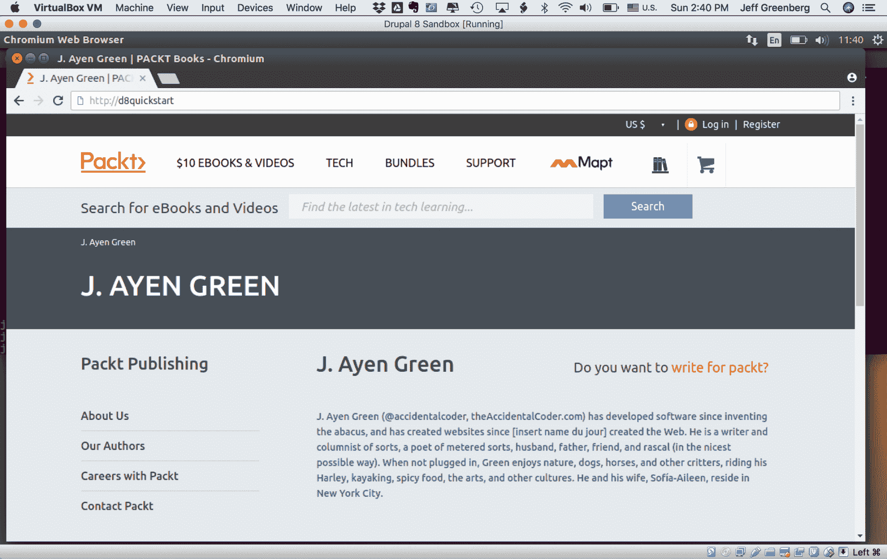
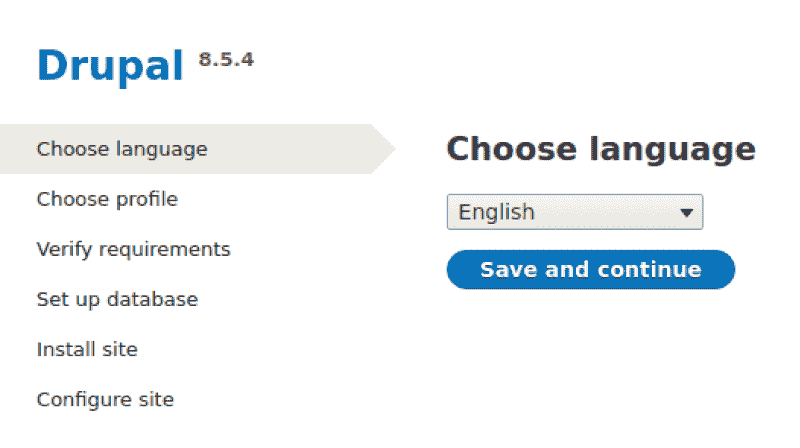
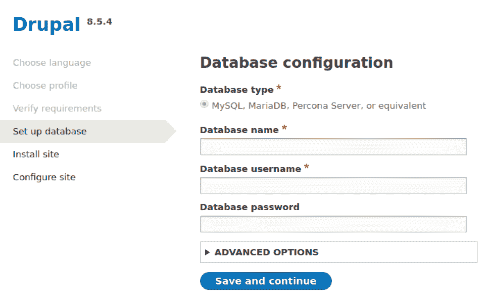
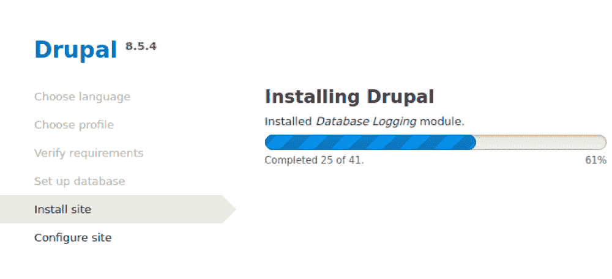
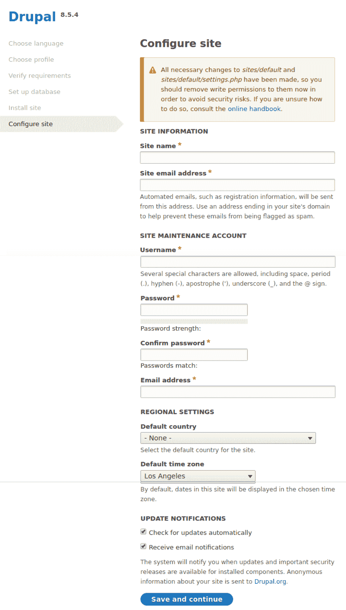
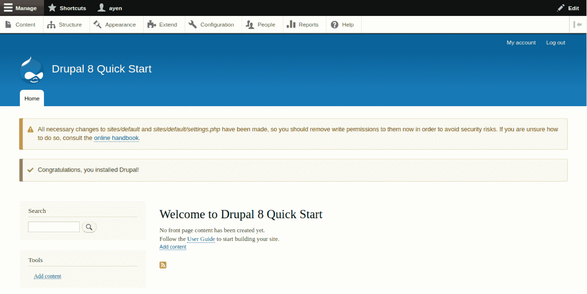
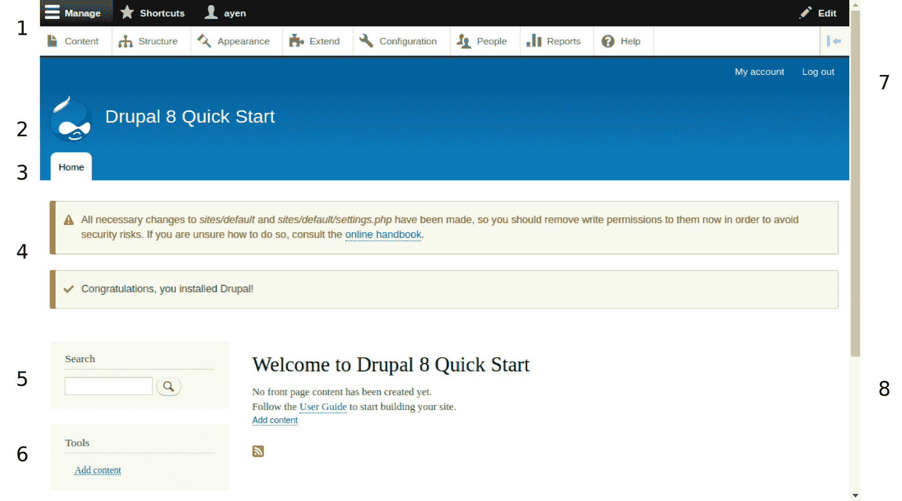

# 在 Drupal 中找到你的位置

本章将逐步引导你通过 Drupal 站点安装过程。之后，我们将快速浏览 Drupal 管理界面。在本章的整个过程中，你将了解以下主题：

+   如何导航 Drupal 安装脚本

+   如何登录到 Drupal 管理界面

+   如何导航和使用管理界面

+   Drupal 特定术语

# 安装 Drupal

安装 Drupal 是一个两阶段的过程。第一阶段是准备环境以托管 Drupal 网站，第二阶段是运行安装脚本以创建网站。让我们快速了解一下 Drupal 是什么以及第一阶段的要求。

# 准备环境

物理上，Drupal 是一组文件夹和文件，通常位于一个称为 Drupal 根的父文件夹中。Drupal 还包括一个数据库，其中保存了网站的内容和各种设置。

Drupal 根通常位于一个称为网络服务器的计算机上，该服务器可能包含许多网站，尽管网络服务器也可能存在于笔记本电脑上，用于开发网站。Drupal 存在的环境将包括以下内容：

+   操作系统，通常是 Linux，但也可能是任何其他操作系统，例如 Windows、OS X 或 Unix

+   一个网络服务器，例如 Apache 或 Nginx

+   一个数据库，通常是 MySQL，可能位于同一服务器或单独的数据库服务器上

+   PHP 语言

Drupal 存在的环境统称为 LAMP 环境，代表 Linux、Apache、MySQL 和 PHP，尽管也存在其他组合，如 Windows 的 WAMP 而不是 Linux。

在运行 Drupal 站点安装过程之前，需要进行的整体安装操作的主题，例如准备 LAMP 环境、下载 Drupal 代码以及安装与其协同使用的相关技术，超出了本书的范围。

要开始，管理员应首先遵循以下步骤，或类似步骤：

1.  完成了 Drupal 8 的安装 ([`www.drupal.org/docs/8/install/before-a-drupal-8-installation`](https://www.drupal.org/docs/8/install/before-a-drupal-8-installation))

1.  收集了代码 ([`www.drupal.org/docs/8/install/step-1-get-the-code`](https://www.drupal.org/docs/8/install/step-1-get-the-code))

1.  使用 Composer 安装依赖项 ([`www.drupal.org/docs/8/install/step-2-install-dependencies-with-composer`](https://www.drupal.org/docs/8/install/step-2-install-dependencies-with-composer))

1.  创建了一个数据库 ([`www.drupal.org/docs/8/install/step-3-create-a-database`](https://www.drupal.org/docs/8/install/step-3-create-a-database))

1.  配置了安装 ([`www.drupal.org/docs/8/install/step-4-configure-your-installation`](https://www.drupal.org/docs/8/install/step-4-configure-your-installation))

完成这些后，你现在拥有创建 Drupal 网站所需的环境。你可能认为前面的步骤已经创建了 Drupal 网站，但这并不是事实。既然我现在要这么做，这是一个很好的时机来提到，我经常使用的网站类比是房屋。前面的步骤所做的只是选择了地点，准备了地块，为它提供了基础设施，打下了地基，并确保你有建造房屋所需的材料。*现在*，我们将开始建造它。

“哦，不！”你可能正在说，“那是不是意味着我需要学习所有那些网络编程知识，比如 HTML？”不用担心。Drupal 所做的一个神奇的事情是创建网站所需的全部技术性内容。遵循几个步骤后，你将拥有一个“纯朴”的 Drupal 网站，未经装饰，也没有过多定制，但它是现成的并且完全可用的。是的，就像可能以标准化的方式建造的房屋一样，你有能力选择油漆、地毯、瓷砖、窗帘和电器，使其独特并最好地反映你的愿景，但这些定制超出了本书的范围，尽管我们*将会*稍后选择一些“电器”。

与房屋不同，这里没有切割、钉钉或其他需要大量劳动的原始材料组装工作——只需几个简单的步骤。不过，首先，你需要了解一些信息，以便在 Drupal 安装过程中回答有关新网站的问题：

1.  网站分配了哪个 URL？如果网站位于远程服务器上，它可能看起来很熟悉，比如[`www.mysite.com`](http://www.mysite.com)。在本地系统上，它可能很简单，比如`http://mysite`或者甚至是`http://localhost`。

1.  Drupal 管理员的用户名和密码是什么？

1.  网站的电子邮件地址是什么？

1.  数据库的用户名和密码是什么，它的名字是什么？

如果网站不是作为注册网站访问的，那么很可能需要在你的工作站的主机文件中添加一个条目，这相当于一个带有你输入的名称和可以找到的地址的联系人条目。

没有这些问题的答案，安装过程无法完成。一旦你有了这些信息，我们就可以继续了！

我们将首先打开浏览器。可以使用任何常见的浏览器版本，如 Chrome、Firefox、IE、Edge 或 Safari。在地址栏中，输入分配给此网站的 URL：

我在这本书中使用的 URL 是 d8quickstart，你将在包含一个 URL 的任何插图中的地址栏中看到这一点，如下面的图片所示。你需要使用分配给你的网站的 URL。

# 运行 Drupal 安装脚本

这是当你发现你的管理员执行的预安装步骤是否成功完成的时候。如果是这样，你将看到一个类似于以下屏幕：

在这个阶段，可能出现各种问题，原因包括以下几方面：

+   Web 服务器条目配置错误或指向错误的文件夹

+   URL 与配置的 URL 不匹配

+   需要 URL 的主机条目，但缺失或输入错误

+   Drupal 文件不在正确的位置，或者 Web 服务器条目指向 Drupal 文件夹而不是其内的 web/folder

+   文件权限不正确

希望你能收到前面截图所示的页面；如果不是，前面提到的问题可以迅速解决，以便你能。

你会注意到地址栏中的 URL 与你输入的不同。当 Drupal 确定网站尚未安装时，在这种情况下，这是通过没有可行的数据库来确定的，它将请求主页（你输入的 URL）重定向到安装页面，位于`d8quickstart/core/install.php`。

让我们来看看这个第一个屏幕上的一些内容。Drupal 版本号位于页面左上角；在我的情况下是**8.5.4**。关于安装哪个版本由你决定，但肯定应该是 8.x.x 版本，值得注意的是，安装较旧版本，如安装 8.5.3 而不是当时（撰写本文时）的 8.5.4，可能会使用包含已修复的安全问题的版本。

显示默认的安装语言。

你可以选择一个与提供的不同的语言。Drupal 提供了数十种语言，但如果你想让屏幕与本书中使用的示例匹配，请继续使用英语。

最后，左侧的步骤列表不可点击，因为它们用作进度指示器而不是菜单。随着你通过安装过程，当前步骤将被突出显示，就像现在突出显示的*选择语言*一样。让我们通过点击*保存并继续*按钮来继续。

安装配置文件是一个预先确定用于特定目的的配置或设置和软件集合。目前，在正常安装中，Drupal 只有三个可供选择：标准、最小化和 Unami，其中标准是默认设置，也是我们想要的。从这里，点击*保存并继续*按钮。

如果 Drupal 找到了它继续所需的文件和文件夹，它将快速跳过验证要求步骤，进入设置数据库。否则，它将显示一个需要解决的问题列表，以便它能够继续。在预安装阶段中，一些经常出现的问题包括以下几项：

+   在 Drupal 的文件文件夹结构中，站点文件夹内有一个默认文件夹，默认文件夹内应该有一个文件文件夹。这个文件夹在 Drupal 安装文件中不存在，需要手动创建。通常，这一步会被忽略，或者文件夹虽然创建了，但以这种方式创建将不允许 Drupal 对其进行写入。

+   默认站点文件夹中包含一个名为`default.settings.php`的文件。该文件需要复制到同一文件夹中，并命名为`settings.php`。这一点也常常被忽略，或者文件虽然存在，但不会允许 Drupal 对其进行写入。

+   缺少的 PHP 扩展，如`ext-gd`。此类问题的消息应咨询你的服务器管理员。

一旦一切如 Drupal 所期望的那样，它将进入询问数据库配置的阶段：

是时候使用你获得的数据库凭据了。在提供的文本框中，输入数据库名称、数据库用户名和数据库密码，然后点击`保存并继续`按钮。

在这一点上，Drupal 将开始安装，将配置信息输入数据库并初始化数据结构。一个仪表盘会告诉你它的进度，如下面的截图所示：

一旦 Drupal 安装完成，过程中还有最后一步，即提供站点配置。你需要使用之前获得的信息来回答这些问题：

# 站点信息

你输入的站点名称将是 Drupal 识别站点的名称，如果配置为显示站点名称而不是仅显示标志或标志型，它将显示这个名称。这个页面上的任何设置都可以随时更改。

站点电子邮件地址用于在启用联系表单时发送联系消息。

# 站点维护账户

在 Drupal 中执行各种任务的权限是通过授予的*权限*来赋予用户的，不是通过用户名，而是通过用户*角色*。我们将在后面的章节中更详细地讨论这个话题。现在，你需要知道的主要事情是，拥有最高权限的用户角色是管理员，而在管理员中，有一个单独的*超级用户*登录权限被授予了所有权限。这个角色通常被称为*用户 1*，因为这是为网站配置的第一个用户，因此获得了这个用户 ID。

在这里输入的用户名、电子邮件地址和密码将被分配给用户 1。如果你不是这个人，并且你没有获得代表这个人使用的凭据，请记下你输入的值，以便他们可以使用这些值登录并更改它们。

# 地区设置

Drupal 会为某些事件创建日志条目，并代表网站发送消息，例如向订阅用户发送新内容的通知、为新账户接收者的用户发送登录说明等。服务器本身可能位于一个时区，并且可能托管多个网站。计算机上的日期和时间可能不一定与网站所属的组织的日期和时间相同。这里输入的位置和时间区用于确保日志条目和通讯使用正确的时间。

# 更新通知

就像任何软件一样，Drupal 偶尔需要更新。此外，由于其许多功能是通过附加模块和贡献模块实现的，它们偶尔也需要更新，并且每个模块都可能有不同的更新计划或完全根据需要更新。因此，Drupal 将每天进行一次检查，以查看是否有任何新版本可用。

这些检查很重要，因为更新的原因可能是为了修复与安全相关的问题。因此，通常最好保持复选框选中。然而，在某些情况下，没有必要这样做，例如，当有一个 IT 团队将监控发布，这样网站就不需要这样做，或者当网站是用于开发的网站本地副本，它将始终与另一个网站的版本匹配。再次强调，这里做出的选择可以随时更改，所以如果你不确定，请保持选中。

点击“保存并继续”按钮，Drupal 将为你渲染并显示新的网站！

恭喜！快速入门感觉如何？你现在看到的是一个完全功能的 Drupal 网站。然而，没有内容的网站管理网站又是什么呢？你准备好了吗？让我们继续前进，给你一个全面的游览。

# 背后的游览

就像在没有地图的情况下进入任何复杂的地点——商场、地铁系统、游乐园——Drupal 可能会让你难以找到方向。因此，在本章的剩余部分，我将担任你的导游，为你绘制 Drupal 的地图。

新网站的首页是通过*主题*呈现给你的。主题控制元素在页面上的位置、大小、颜色以及其他*用户界面*或 UI 方面的方面。Drupal 8 的默认主题被称为 Bartik。重要的是要记住，由于以下任何变化，首页可能会（并且很可能在某个时候）看起来有些或非常不同：

+   浏览器或浏览器版本

+   设备类型（例如，iPhone 而不是台式计算机）

+   主题

+   网站的首页布局

+   用户角色权限

+   菜单中添加或删除的项目

因此，尽量不要专注于页面元素的精确位置或外观，而是理解它们是什么，这样你知道你想去哪里或需要什么功能，无论外观如何：

前面的截图在左侧和右侧有数字，用于标识页面上的功能区域。以下表格中的每个区域都有一个标识。接下来将提供更详细的描述：

|  | **部分** |
| --- | --- |
| **1** | 管理菜单 |
| **2** | 品牌标识 |
| **3** | 标签页 |
| **4** | 系统消息区域 |
| **5** | 搜索小部件 |
| **6** | 用户菜单 |
| **7** | 主要导航 |
| **8** | 内容区域 |

# 管理菜单

管理菜单，或称为管理员菜单，通常只有具有管理员角色的用户才能看到。像任何其他 Drupal 菜单一样，显示在其上的条目取决于用户的角色和分配给该角色的权限。例如，具有编辑角色的人可能看不到“扩展”选项，因为这与站点管理相关。

*管理*链接作为一个切换按钮，交替显示或隐藏其下包含链接到主要管理页面的行。

*快捷方式*链接用当前用户添加的书签替换了管理链接。例如，如果你通过连续点击链接到达五次点击后的页面，而不是每次都这样做，你可以将其添加为快捷方式。

那一行最后的链接是当前用户账户的链接，它指向用户页面。用户页面有标签页，用户可以通过这些标签页管理账户设置，包括密码，以及用户添加的任何快捷方式。根据站点及其定制方式，这通常是用户可以访问用户资料并编辑这些字段的页面。字段及其说明如下：

+   **内容** 链接到内容管理页面，在该页面上列出内容标题，并可以管理内容。这将在第四章，*创建和编辑内容*中进一步介绍。

+   **结构** 链接到一个进一步的菜单，可以从中管理各种站点结构。对内容编辑者感兴趣的有内容类型和分类法，这些将在第二章，*结构化内容类型*中讨论。

+   **外观** 在这里列出了已安装的站点主题，并且可以对其进行配置。主题是一组文件和设置，用于控制站点页面的外观。通常，一个站点应用两个主题：访客看到的主题，以及管理员访问站点后端使用的主题。

+   **扩展** 链接到模块管理部分。模块是 Drupal 的附加组件，提供额外的功能（参见第五章，*使 Drupal 更加有用*）。在这里，可以安装和卸载模块。

+   **配置**显示一个页面菜单，这些页面作为主要管理门户，在这里配置了许多网站设置，例如在安装过程中提供的网站名称。以下是一系列设置类别的列表，请注意，提供的选项取决于用户角色：

    +   **账户设置**: 用户注册和账户取消处理方式、系统生成消息的内容、是否提供联系表单以及与网站管理员关联的角色。

    +   **文本格式和编辑器**: 对内容可以包含的内容（如 HTML 标签）的限制以及内容编辑工具为每个用户角色提供的功能（例如，你可能不希望非编辑者能够添加链接）。

    +   **维护模式**: 在维护活动期间防止用户登录网站的能力。

    +   **配置同步**: 用于导入或导出网站配置设置的工具，以便可以将它们传输到或从另一个系统。

    +   **搜索页面**: 用于配置网站搜索、索引设置、搜索日志以及添加网站搜索页面

    +   **URL 别名**: 用于为特定页面创建别名，以便默认的 Drupal URL（如`mysite.com/node/22`）可以更友好，例如`mysite.com/using-drupal`。我在第五章[“使 Drupal 更有用”](https://cdp.packtpub.com/drupal_8_quick_start_guide/wp-admin/post.php?post=24&action=edit#post_28)中讨论了一个更好的方法。

    +   **RSS 发布**: 提供从您的网站提供内容源配置设置。我们将在第七章“喂养大众 - RSS”中查看创建选择性 RSS 内容源。

    +   **基本网站设置**: 可以更改网站名称、电子邮件地址等初始设置的地方。

    +   **Cron**: Drupal 在一天中的特定时间间隔内在后台执行某些任务，这意味着不是通过浏览器，这里可以配置间隔，并且可以发出一个临时的请求来运行 cron。

    +   **快捷方式**: 如前所述，快捷方式允许您将 Drupal 目标放置在任务栏上，以便可以一键访问，并且可以在这里管理它们，例如针对单一目的的组。 

    +   **文件系统**: 图像、PDF 和媒体文件等资产保存在 Web 服务器的文件系统中，这里管理它们的存储位置。

    +   **图像样式**: 可以创建不同的配置，当浏览器请求图像时，根据它们的使用上下文（例如，用于项目列表的裁剪缩略图或用于内容全页显示的全尺寸版本）应用这些配置。在第七章[“喂养大众 - RSS”](https://cdp.packtpub.com/drupal_8_quick_start_guide/wp-admin/post.php?post=24&action=edit#post_30)中，将展示图像样式的使用示例。

    +   **图像工具包**：如果存在多个用于操作图像的系统库（通过图像样式），可以在此处选择使用哪个。

    +   **区域设置**：用于更改在安装过程中选择或未更改的本地化和时区设置。

    +   **日期和时间格式**：用于设置网站默认的日期和时间显示方式，例如星期一，2020 年 12 月 15 日或 Mon, 12/15/20。

随着模块的添加，本节中显示的配置页面列表可以增长：

+   **人员**是维护、创建或仅针对用户和角色的删除用户账户、用户角色和用户权限的地方。我们将在第三章“管理用户”中介绍这一点。

+   **报告**提供管理报告，例如网站状态报告，以及显示网站上使用的前十大搜索词的报告。附加模块可以添加更多报告，同样，视图也可以，我们将在第八章“欢迎回家！”中添加报告。

+   **帮助**提供入门提示，有关附加模块的帮助文本的附加信息，以及其他信息。

# 选项卡

选项卡是一种在页面上提供上下文信息的方式，而不是需要离开页面来更改上下文。例如，默认主页只有“主页”选项卡作为唯一上下文，但像用户页面这样的页面可能有一个包含用户设置（如用户名和密码）的用户选项卡，以及一个用于管理个人资料信息（如国家、性别和社交链接）的个人资料选项卡。

# 系统消息区域

系统消息区域是重要通知出现的地方。请记住，位置可能在另一个主题中不同，格式也可能不同。未更改的情况下，位置将在主页面内容上方，格式将是以下之一：

+   **绿色**：值得注意的一般信息

+   **黄色**：表示警告；值得注意但不是关键，通常意味着系统完成了它被请求执行的任务，但没有发生意外

+   **粉色**：需要采取行动或调查的错误，通常表示系统无法完成请求

这些状态也用于用户完成表单时，典型的展示如下：

+   **绿色**：表示表单已保存或提交的消息

+   **黄色**：邀请用户在内容中查看某物或确认其提交

+   **粉色**：表示必填字段没有值或值在上下文中不正确

# 搜索小部件

一个内容网站如果没有用户根据一个或多个特定的搜索词或短语搜索内容的能力，将几乎没有价值。因此，某种形式的搜索小部件很常见，其中包含一个输入术语的字段，以及一个用于启动搜索的链接或按钮。

# 用户菜单

可以有针对特定用户角色或特定用户的特定操作或目标，用户菜单是一个提供链接到这些操作的好地方。用户菜单并不总是存在，因为通常网站会将导航限制为编织到主题中的特定集合。

# 主导航

默认的主导航包括一个链接到用户的账户页面，有时用轮廓或用户图像表示，以及一个注销链接。定制还可以提供额外的选择。主导航可以更加突出，例如在电子商务网站上，操作对用户的重要性不亚于内容本身。

# 主要内容区域

CMS 网站的核心毕竟还是内容，大多数主页和内页都会有一个区域用于展示内容，无论是文本、视频还是其他形式的媒体。根据主题的不同，主内容区域上方和/或下方可能会有初始内容，主内容区域内可能有多个内容块，页面的其他部分，如前一个截图中的搜索和工具菜单，可能会有额外的内容区域、块。

# 摘要

在本章中，我们学习了如何运行 Drupal 安装脚本，该脚本创建了一个新的 Drupal 网站。我们还探讨了 Drupal 主页和行政导航的主要部分。

在下一章中，我们将探讨内容是如何存储的，以及您如何配置系统以存储对您和您的网站访客有意义的各种类型的内容。
