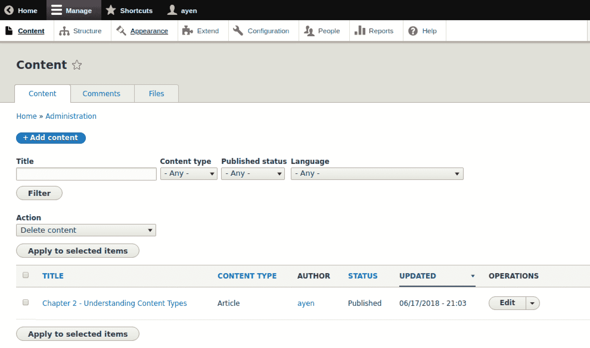
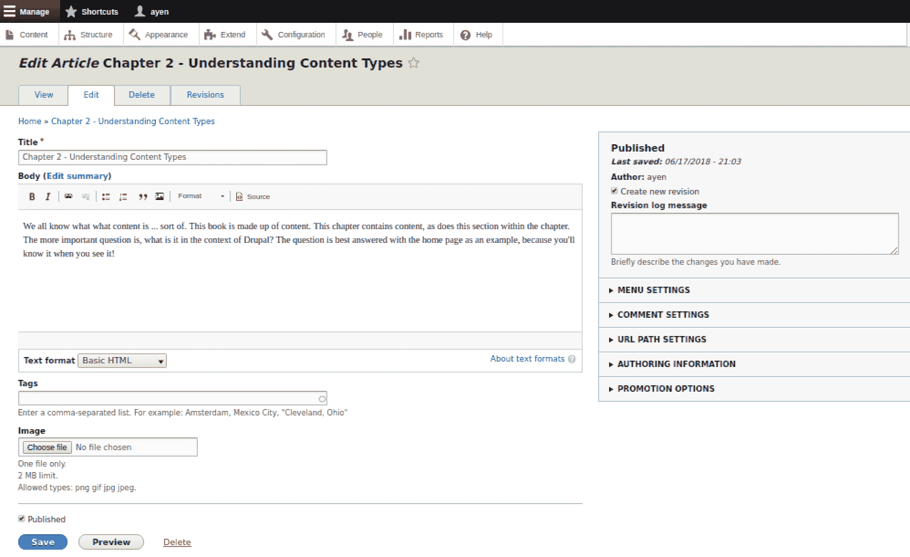
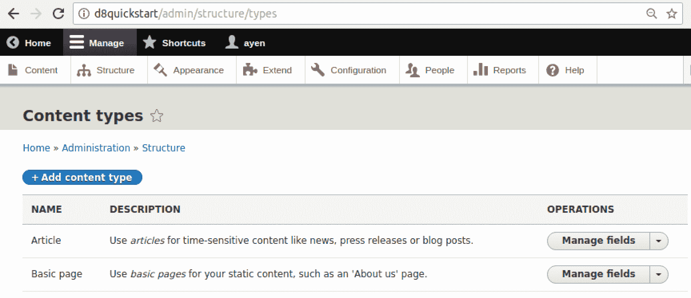
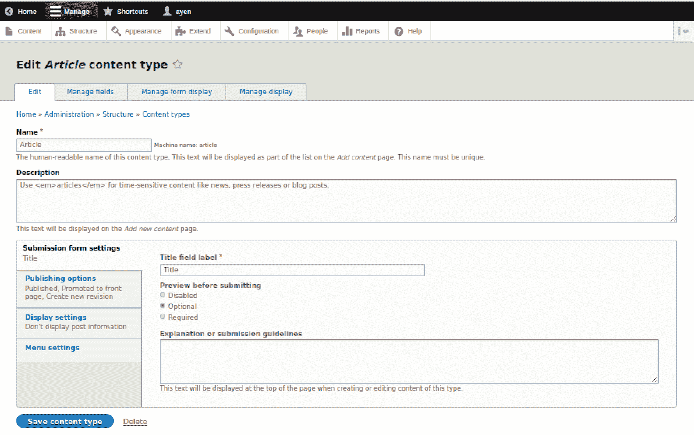
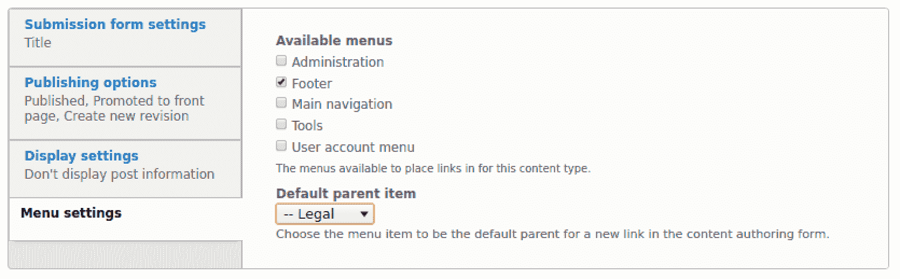
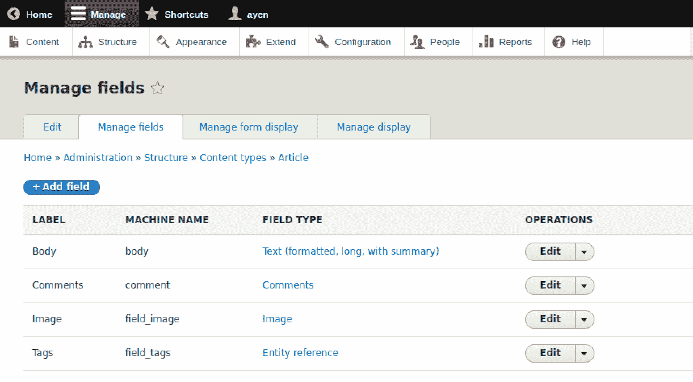
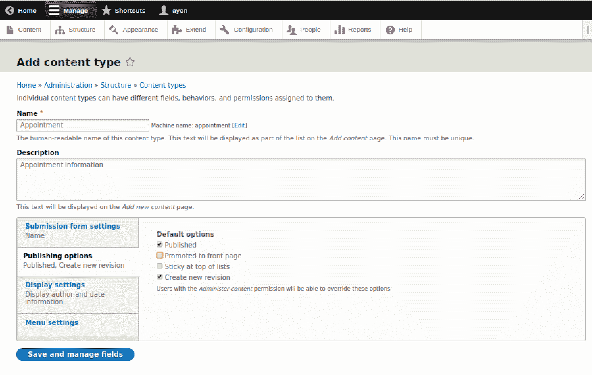
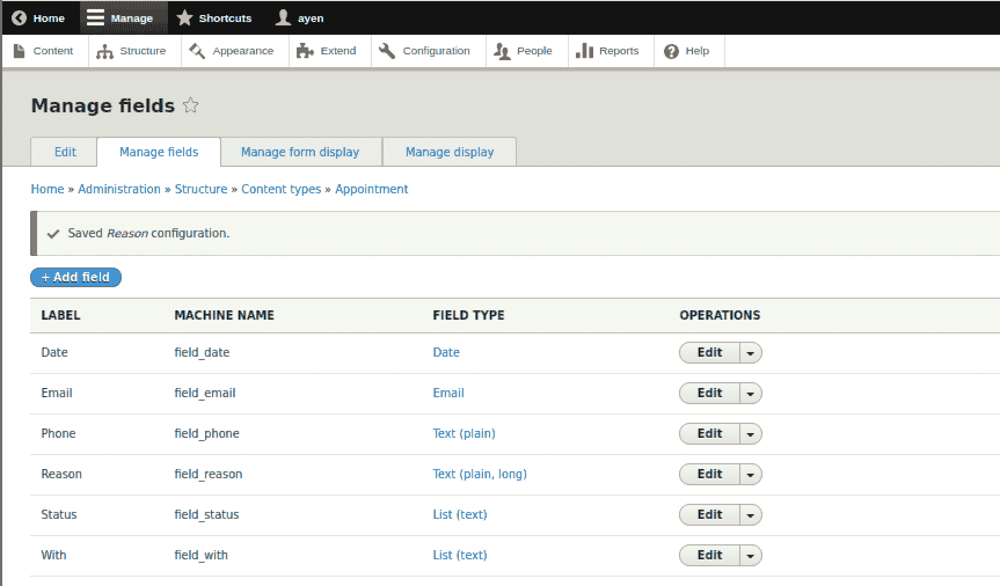

# 第二章：结构化内容类型

在第一章“在 Drupal 中找到你的方向”，我们学习了 Drupal 是什么以及如何安装它。本章将探讨 Drupal 内容类型的基础，以及定义每块内容保存信息的格式。阅读本章后，你将了解内容类型和字段，创建内容类型，向内容类型添加字段，自定义用于输入内容的表单，以及自定义内容显示的方式。

# 内容是什么？

我们都知道内容是什么…… sorts of。这本书由内容组成。本章包含内容，本章内的这一节也是如此。更重要的问题是：在 Drupal 的上下文中它是什么？这个问题最好用主页作为例子来回答，因为当你看到它时，你就会知道！

以下截图显示了我在网站上添加的一块内容，它在主要内容区域，周围有一个粗矩形：


当在浏览器中渲染和显示时，它只是内容，但在此之前，它是某种类型的内容，即内容类型，在 Drupal 中也称为节点包。Drupal 是否只是将此内容视为：

第二章 - 理解内容类型

我们都知道内容是什么…… sorts of。这本书由内容组成。本章包含内容，本章内的这一节也是如此。更重要的问题是，在 Drupal 的上下文中它是什么？这个问题最好用主页作为例子来回答，因为当你看到它时，你就会知道。

不，内容在 Drupal 中以方便根据你几乎任何希望的标准选择它的方式存储。

让我们暂时看看数据库。这不是你需要学习的东西，但它对说明很有用。如果我们查看 Drupal 数据库中此块内容的主要识别信息，我们会看到这个：

```php
+-----+------+---------+--------------------------------------+----------+
| nid | vid | type | uuid | langcode |
+-----+------+---------+--------------------------------------+----------+
| 1 | 3 | article | 6166dc8e-1c64-4897-807e-7c535934f616 | en |
+-----+------+---------+--------------------------------------+----------+
```

你可以在“类型”列中的“文章”值中看到这一点，它包含了这个表格中的内容类型。“文章”是我们内容的内容类型。让我们把数据库放在一边，以你将使用的方式查看我们的内容和其内容类型，即通过**用户界面**（**UI**）。

在 Drupal 文档中，你经常会看到以缩写方式指定的 URL，省略域名以避免混淆，因为大多数用户将使用不同的域名，所以你可能会看到`/page1`而不是`mysite.com/page1`。

内容编辑最常使用的页面之一是内容管理页面。我们将从点击管理菜单中的内容链接开始，这将带我们到`admin/content`，如下面的截图所示：



如您在前面的屏幕截图中所见，我们的内容被列出，标题在左侧，给出的类型是文章。我们将在第四章“创建和编辑内容”中了解更多关于这个页面的使用，但现在我们想要用它来引导我们到可以编辑我们内容的页面。让我们点击内容标题另一端的编辑链接，这将显示一个内容编辑表单，如下面的屏幕截图所示：

# 内容作为字段

我们有时倾向于将内容视为一个大块的正文，但内容可以存储为独立的字段，以便重要元素可以轻松访问和正确格式化：



您可以在这个表单中看到与页面上相同的内容。然而，您在这里还可以看到包含该内容的字段。内容标题在一个标记为标题的字段中，主要文本在一个标记为正文的字段中。还有两个未使用此特定内容字段的额外字段：一个用于分类的字段，标记为标签，另一个用于将图片附加到内容上，标记为图片。

通过拥有标题字段和正文字段，用户和 Drupal 都理解每个字段中的信息是相互独立的。这并不意味着它们不能一起显示，但有许多原因我们可能想要能够区分它们。

例如，当此内容在主页上显示时，标题和正文文本的格式不同。另一个例子是，我们可能希望 Drupal 为我们提供一个内容标题列表。在这两个例子中，对于 Drupal 能够确定内容的哪个部分是标题来说，这非常重要。如果将内容中的所有内容都混合在一起，Drupal 将无法知道标题在哪里结束，正文文本从哪里开始。将它们放在单独的字段中消除了任何歧义。

因此，我们已经看到了当内容被分离成单独字段时的内容样子。但是，这些字段是从哪里来的？Drupal 是如何知道提供哪些字段来接收我们的输入的呢？让我们接下来看看这一点。

# 理解内容类型

内容类型本质上是一组字段，用于存储构成整个内容的各种项目。在我们所使用的内容的情况下，它是一个文章内容类型的例子，这是在您首次创建新的 Drupal 站点时存在的两种内容类型之一，另一种是页面内容类型。

如果你想到一家公司的职位申请，每个申请都包含相同的信息输入字段，尽管信息各不相同。在这个例子中，职位申请是一个内容类型。让我们从 Drupal 如何提供它来分析一下文章内容类型。

要通过管理菜单导航，请点击“结构”。然后，在下一页上，点击“内容类型”，这将带您到一个页面，您也可以通过浏览器在 `/admin/structure/types` 路径下访问，如下面的截图所示：



# 定义内容类型

现在，我们将查看内容类型定义。首先，而不是点击默认选择“管理字段”，请点击其旁边的箭头并选择“编辑”：



让我们简要看看前面表单中的设置：

+   名称：这是内容类型将被识别的普通语言名称。在这种情况下，这是“文章”。在可读名称的右侧是所谓的机器名称，这是内部名称。这是由 Drupal 自动生成的，通常是名称的小写版本，多个单词之间的空格被下划线替换。

+   描述：这是一个描述内容类型目的和（或许）其使用规则的地方。在此处输入的描述性文本将在创建内容时提供可用内容类型列表时与内容类型名称一起显示。

在这两个字段之后是一系列垂直标签页，提供了额外的配置项。

# 提交表单设置

提交表单是用于创建内容的表单：

+   标题字段标签：所有内容都有一个标识键，当内容显示时也充当标题。默认情况下，将此值称为“标题”，但在某些情况下，这可能不合适。例如，对于定义旅行目的地的内容类型，标题作为“目的地”或“位置”会比“标题”更合适。此字段是必需的。其值将在创建此类内容时作为输入屏幕上的提示使用。

+   提交前预览：在创建或编辑内容时，编辑器中查看的内容可能与网页上查看的内容不同。预览提供了后者的视图。这里的选项将决定是否提供预览，以及是否在提交前必须进行预览。

+   说明或提交指南：这是一个输入描述的地方，该描述将显示给创建或编辑内容的人。

# 发布选项

通常，内容是在表单中的富文本编辑器窗口中输入的。由于这个输入可能是该内容的第一个草稿，可能不希望立即发布。某些内容类型将是这种类型，这种情况更为常见，而其他类型，如仅包含标题和 URL 的类型，则不需要多个草稿。因此，提供了发布选项。在这里，在内容类型表单中，可以设置这些选项的默认选择：

+   *已发布*：如果选中，内容将在保存时立即发布

+   *提升到首页*：并非所有内容都一定是为了首页，具有此值或未设置的内容可以用来确定它是否应该出现在那里

在 Drupal 中，网站的首页有时被称为*首页*，就像报纸上的那样。

+   *粘性在列表顶部*：如果没有设置其他方案，首页将显示指定数量的文章摘要，随着更多内容的创建，较旧的内容“掉落”到页面。如果某块内容意在保持页面，而其他内容交替显示，例如欢迎信息，可以通过设置此值来实现。

+   *创建新修订版*：想象一下对内容进行更改，保存它们，然后意识到某些不应该更改的东西被更改了。你该怎么办？原始版本消失了！还是说没有？当创建新修订版时，它包含更改之前的内容。如果需要，当前版本可以回滚到修订版，提供完整的撤销。

# 显示设置

*显示作者和日期信息*：是否设置这取决于将要显示的内容类型以及网站希望的外观。

# 菜单设置

有时，将一块内容添加到菜单中是有益的，尤其是如果它在网站上相对静态的话。例如，条款和条件将是持久性的网站内容，而关于本周活动的通知则不是。前者可能属于特定内容类型，例如法律，你可能希望将此类内容的每一项都列在页脚菜单中。在这个例子中，页脚将在可用菜单列表中被选中，如果该菜单中已经有一个标题，例如“法律”，则可以将其选为默认父项。在这种情况下，默认情况下，该类型的所有内容都将作为子内容添加到页脚菜单中：



更多关于菜单的内容将在第八章中找到。

这就完成了内容类型的主体表单。我们将在本章的后面创建一个新的内容类型。现在，让我们继续管理内容类型字段。

# 管理内容类型字段

字段可以被视为一个容器，你可以在其中放置某些东西，在我们的上下文中，这些是内容。为什么内容类型有字段而不是一个可以放置内容的大的盒子，就像 MS Word 中的页面一样？让我们考虑一个例子。

假设我们的内容与预约相关。琼斯女士正在预约。一种可能性是将预约以文本形式输入，如下所示：

*1 月 20 日下午 1:30，琼斯女士将与金先生会面讨论投资。*

所需的所有信息都在那里。然而，当需要列出接下来两周的所有预约时，或者需要列出琼斯女士的所有预约时，或者当决定更改所有预约的日期格式时，如果信息在一个难以聚合、搜索或全局编辑的表单中，那就成问题了。

如果预约像电子表格一样存储会怎样？

| 日期/时间 | 客户 | 观察 | 原因 |
| --- | --- | --- | --- |
| 2018 年 1 月 20 日 | 琼斯女士 | 金先生 | 投资讨论 |

将信息分割成有意义的片段后，查找所需内容并进行编辑要容易得多。这正是字段背后的理念。

我们一直在使用文章内容类型。让我们看看其字段是如何定义的。在当前页面的顶部，我们将点击“管理字段”标签页：



我们在内容类型表单上看到了标题字段。这个屏幕是用于可选字段的。内容类型可能根本不需要额外的字段，但既然所有内容类型都必须有一个标题字段，无论其标签如何，它都没有包含在这里。

当我们查看内容编辑表单时，我们看到了标题和正文字段。正文字段在这里列出。该字段是用于存放没有特定用途或格式的文本的类型。我们将在本章后面创建新内容类型时更详细地了解字段类型。

评论字段是用来存放关于内容的评论的。可能有多个此类字段，每个评论创建一个。实际上，评论是一个内容实体类型，因此尽管在查看文章内容时可以看到评论，但评论字段的实际内容只是评论的 ID。

图片字段用于显示与内容一起的图片，允许上传图片。图片字段是检索实际图片所需信息的引用，如果使用了图片，文章图片字段将包含该记录的地址。

最后一个字段是用于标签的。将标签视为可用于搜索内容的分类信息。这是使用另一种参考字段类型，如评论和图像，即分类法。我们将在第七章中更详细地探讨分类法。

*分类法*是内容结构，在 Drupal 中被称为*实体*。另一种实体类型是*用户*。文章是一个内容类型，也称为*捆绑包*，它是称为*节点*的实体类型的子类型。捆绑包可以包括文章、页面、博客文章和其他类型的内容，这些内容是为读者准备的。

我们可以查看页面顶部的其他两个标签页，即“管理表单显示”和“创建内容类型时管理显示”。事实上，我们现在就来做这件事！

# 设计内容类型

我们已经查看过 *文章* 内容类型。它包含一个标题和输入文本的地方，并允许添加图片和分类标签。所以，有了所有这些，为什么还要创建内容类型呢？嗯，因为原味是一个不错的口味，但不是唯一的口味！

我们需要一个预约列表。好吧，实际上不是，但我们确实需要一个与文章完全不同类型的内容示例，而预约就是一个很好的例子。

确定需要新的内容类型后，首先要做的是设计它。回顾一下 *文章* 内容类型，它有设置和字段。所以这个也会有。提前决定这些将有助于创建设计，让我们来做吧。我们将使用两个表单进行设计——没有什么花哨的，只是当输入内容类型表单中的信息时用来参考的列表。

# 内容类型设置

| 设置 | 值 |
| --- | --- |
| **姓名** | 职位 |
| **描述** | 职位信息 |
| **标题字段标签** | 姓名 |
| **默认选项** | 发布 推广 置顶 修订 |

对于这个内容类型，我们将假装我们在一个为客户提供预约的办公室里。内容类型的 *名称* 和 *描述* 值是显而易见的。

*标题字段* 标签将是姓名，因为它将包含预约人的姓名。

选定的默认选项将是 *发布* 和 *修订版*。我们选择 *发布* 是因为我们希望预约一旦保存就立即生效并设置为活动状态。

*推广* 未设置，因为我们不希望预约像文章一样显示在首页上，也不希望最近输入的预约被显示。我们希望显示的是距离当前日期和时间最近的预约。

*Sticky* 未设置，因为我们没有让任何预约保持在首页上的需求。

最后，我们确实设置了 *创建新修订版*，这样每次预约更改时，Drupal 都会保存之前的版本而不是简单地覆盖它。

我们不会对其他选项卡上的默认设置进行任何更改，因为它们符合我们的需求，所以它们不会出现在列表中。我们的列表完成后，在管理菜单中，我们可以点击 *结构*，然后 *内容类型*，然后点击 *+添加内容类型* 按钮，这将带我们到 `/admin/structure/types/add` 页面。一旦到达那里，输入表单中的信息，并确保 *默认选项* 设置如以下表单所示，然后点击 *保存并管理字段* 按钮：



# 处理内容类型

到目前为止，我们已经创建了*预约*内容类型。在此阶段，它可以用于创建内容。然而，它尚未构建来完成其目的。它只有两个字段，一个是标题，名称，另一个是正文字段，其中此内容类型将没有正文。我们需要做一些工作来使此内容类型适用于我们的目的。

为了向内容类型添加必要的字段，了解选择项会有所帮助。

# 字段类型

Drupal 的新安装包含了一些现成的字段类型，以及一些需要首先启用才能使用的字段：

**通用字段**:

+   **布尔值**: 只有两个值，例如是/否、开/关，或者有一个值被理解，例如已完成。这通常用复选框表示

+   **日期**: 以配置的任何格式显示日期

+   **电子邮件**: 接受格式为有效电子邮件地址的文本

+   **链接**: 接受格式为有效 URL 的文本和将被点击的文本

+   **时间戳**: 一个存储日期、时间和时区的长数字值

**数值字段**:

+   **数字（小数）**: 可以有小数点前后的数字

+   **数字（整数）**: 不包含小数部分的值

+   **数字（浮点数）**: 需要大量小数位数和极高精度的值

+   **列表（浮点数）**: 必须与提供的值列表中的一个匹配的浮点数

+   **列表（整数）**: 必须与提供的值列表中的一个匹配的整数值

**引用字段（引用其他内容的字段）**:

+   **内容**: 指向另一篇内容，该内容是配置用于与字段一起使用的某个内容类型

+   **评论**: 用于接受关于内容的评论

+   **文件**: 指向上传到系统的文件，例如 PDF 文件

+   **图像**: 指向上传的图像，例如 JPG 或 PNG

+   **分类术语**: 在一个共同类别（分类）中，如标签、国家、月份等，与其他信息值或值组

+   **用户**: 指向用户账户

+   **其他**: 指向除之前提到的类型之外的实体自定义类型

**文本字段**:

+   **列表（文本）**: 一个文本字段，其值必须是提供的列表中的一个

+   **文本（格式化）**: 短文本，可以格式化，例如加粗、斜体等

+   **文本（格式化，长文本，带摘要）**: 可以格式化、较长的文本，并且可以有一个单独的摘要用于作为简短的预告

+   **文本（纯文本）**: 一段不会进行任何格式化的简短文本

+   **文本（纯文本，长文本）**: 不会进行任何格式化且可以较长的文本

**需要启用的字段**:

+   **地址**: 一个可以根据地址适用的国家以及所需字段进行配置的地址字段

+   **计算字段**: 可以与编程相关联以确定特定值的字段

+   **日期时间范围**：存储开始和结束日期，格式根据需要而定

+   **实体引用修订版**：提供一个实体的引用，并在实体被修改时提供存储修订版的功能

+   **简单谷歌地图**：提供显示谷歌地图链接或一行地址作为谷歌地图的能力

+   **电话**：用于存储格式正确的电话号码

这些是从新的 Drupal 安装中可用的字段。随着添加额外的模块，此列表可以增长。

# 我们的内容类型字段

您可以从前面的列表中看到，大多数需要存储的各种类型的信息都有相应的字段。这不仅仅涉及数据的类型，如文本或数字，还经常涉及数据所代表的信息，例如电话号码或 URL，这是因为通常存在提供格式化或验证已输入内容的编程代码。例如，在电话号码字段中输入电子邮件地址将导致显示错误。

因此，让我们看看我们将要存储的预约信息列表，以及我们可以用于此的字段类型。我们还将为每个字段决定一个名称，该名称将用于输入表单上的标签，并带有描述性的帮助文本，以提醒我们或告知其他用户有关字段用途的信息：

| 需要的信息 | 字段类型 | 标签 | 帮助文本 |
| --- | --- | --- | --- |
| 客户名称 | 文本（普通） | 名称¹ |  |
| 客户电话号码 | 文本（普通）² | 电话 | `###-###-####` |
| 客户电子邮件地址 | 电子邮件 | 电子邮件 | 例如，`bill@gmail.com` |
| 预约日期和时间 | 日期 | 日期 |  |
| 预约是与谁 | 列表（文本） | 与 | 选择一个名字 |
| 预约的目的 | 文本（普通，长） | 原因 |  |
| 预约的状态 | 列表（文本） | 状态 | 选择状态 |

¹ 这是已重命名的标题字段

² 存储电话号码的字段类型是有的，但它尚未启用，因此我们将使用普通文本

我们的列表准备好了，现在是时候创建我们内容类型的字段了。

# 向内容类型添加字段

仍然在“管理字段”页面（`/admin/structure/types/manage/appointment/fields`），让我们首先对现有的一个字段进行更改：正文。在这个内容类型中，我们不会有正文文本，所以：

1.  点击编辑旁边的箭头

1.  选择删除

1.  确认删除

完成这些后，点击“+添加字段”按钮。

我们将按照前面的顺序添加显示的字段。现在我们看到的页面有两个下拉选择小部件：一个用于创建新字段，另一个用于重用此内容类型上已存在的字段。

考虑到名称字段已经存在于我们的内容类型中，它是所有内容类型都包含的已重命名的标题字段，我们将首先添加的是客户电话号码：

1.  点击“添加新字段”下拉菜单

1.  滚动并从列表中选择“文本（普通）”。

出现了一个新的字段，*标签*，并用红色星号标记，表示您必须在字段中输入一些内容：

+   标签，如我们前面的表格所示，将是**电话**

输入标签后，您会注意到在字段的右侧出现了一个*机器名*。机器名是 Drupal 用来识别字段的名称。一旦保存字段，标签可以随时更改，但字段名称不会更改，因为它已经在数据库中“确定”了。如果您希望有一个特定的机器名，现在就是更改它的时候，通过点击*编辑*链接。您将能够编辑名称，同时考虑到一些命名规则，例如需要使用下划线而不是连字符，以及**field_**前缀不能被移除。我们没有必要覆盖字段名称：

+   点击*保存并继续*

加载了一个新页面，用于定义字段存储。Drupal 中的字段有三个组成部分：*定义*，它描述了字段；*存储*，它定义了字段如何在数据库中存储；以及当创建特定内容时字段的实际*内容*。

第一字段是*最大长度*，是必填项。对于此字段类型，希望使用标准（而非长）文本字段。默认值为 255，表示该字段可以存储最多 255 个字符。当创建内容时，如果输入的字符少于 255 个，那是可以的。只有当内容需要特定长度且不超过该长度时，才需要更改此值。在电话字段的情况下，这取决于具体情况。如果所有客户联系都是本地的，或者至少是国内的话，那么限制长度以匹配您的电话号码结构是可以的。例如，在美国，电话号码是十位数字。但话虽如此，如果以(212) 555-1212 这样的格式输入，这样的电话号码长度可以超过十位数字。因此，在限制长度时要小心。我们将其保留为 255。

*允许的值数量*字段定义了内容（在这个例子中是预约）是否可以包含此字段的多个实例。我们有选择将其保留为**限制**为一个值，或将数字更改为另一个特定数量，或者点击下拉小部件并选择**无限**以表示可以创建任意数量的此字段实例。我们希望能够在需要联系客户且第一次尝试不成功的情况下，为该客户获取两个联系电话号码：

1.  将 1 改为 2

1.  点击*保存字段设置*

字段创建过程的第三页，也是最后一页，现在显示出来了。如果我们想更改我们刚刚保存的存储设置，我们可以点击字段设置选项卡并执行更改。

一旦创建了使用该字段的内容，就无法更改字段的存储设置，除非首先删除所有此类内容。在创建内容后尝试点击此选项卡将导致显示设置，并显示一条消息，指出由于存在内容，它们不能再更改。

表单中的第一个字段是*标签*。这是我们之前输入的值。如果我们已经决定了一个新名称，现在可以更改它。*机器名*不能再更改。

如果*帮助文本*字段中有内容，它将在你创建的字段下方的内容表单中显示。我们将使用表中的条目为内容创建者提供有关字段内容的提示，在我们的例子中是本地使用的电话号码格式：

+   在*帮助文本*字段中输入**###-###-####**

帮助文本字段可以包含 HTML，如其自身的帮助文本所示。例如，我们可以通过输入以下内容来详细说明我们的描述：

输入格式为**###-###-####**的电话号码

它将显示如下：

输入格式为**###-###-####**的电话号码

表单中的下一个字段是*必填*字段。如果勾选此框，该字段将出现在内容表单中，其标签包含站点主题中定义的必填字段的任何格式。默认情况下，这将是一个红色的星号，正如我们在当前表单中看到的那样，位于*标签*旁边。

如果字段是必填项，除非为该字段提供了值，否则无法保存内容。请注意，不要要求一个可以合法留空的字段。例如，可选地址的邮政编码或邮编，没有适用的选项列表，或者复选框，其中空白表示“无”。

在我们这个例子中，我们将把电话字段设置为非必填项。最后一个字段用于默认值。当然，考虑到我们不知道具体值是什么，电话号码字段不太可能有默认值。在某些情况下，默认值是有意义的。例如，如果我们有一组地址字段，其中之一是国家，并且大多数条目都来自英国，那么提供默认值而不是强迫用户滚动到国家列表中的“U”项是有意义的。

如果你提供了默认值，要准备好由于用户不小心未更改字段并使用默认值保存表单而导致的错误内容。

我们将保留没有默认值的表单：

+   点击*保存设置*

到目前为止，我们已经保存了第一个字段配置，*电话*。从技术上讲，直到使用此字段创建内容之前，该字段不存在，但它的定义和配置现在存在。你可以看到，我们的内容类型字段列表已经发生了变化，*field_phone*已被添加到其中。

我们将对表格中剩余的每个字段遵循相同的流程。对于每个字段，我会记录其存储和配置设置的考虑因素，如下所示：

*日期*：*日期*字段类型 – 应该勾选*必需*复选框。

*使用*：*列表（文本）*字段类型 – 在*允许的值列表*框中，按以下格式添加 2-3 个姓名，每人一行。例如，我已经添加了以下内容：

**琼斯，珍妮特**

**史密斯，史蒂夫**

*状态*：*列表（文本）*字段类型 – 在*允许的值列表*框中，添加以下内容：

**已取消**

**活跃**

**已取消**

**完成**

在*默认值*下拉菜单中，选择**挂起**。

在我们的表格中创建完所有字段后，管理字段页面应该如下所示：



# 摘要

在本章中，我们学习了以下内容：首先，内容类型是什么，然后我们为什么要创建一个。此外，我们研究了内容字段，了解了它们是什么，并查看可用的字段类型。然后，我们继续研究如何设计和创建内容类型，最后通过向我们的内容类型添加字段来完成。

+   内容类型是什么

+   我们为什么要创建内容类型

+   内容类型字段是什么

+   可用的字段类型有哪些

+   如何设计内容类型

+   如何创建内容类型

+   如何向内容类型添加字段

当我们学习如何为其创建内容、配置内容创建表单以及设计内容显示方式时，我们将在本书的后面部分回到我们的内容类型。

在本章中，我们向新的内容类型添加了字段。同样，使用相同的管理页面，也可以编辑现有内容类型，向它们添加新字段，更改现有字段，以及删除不再需要的字段。

在下一章，我们将学习如何管理用户、他们的角色以及分配给这些角色的权限。
