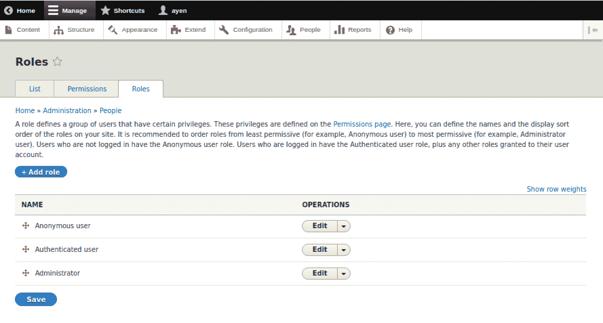
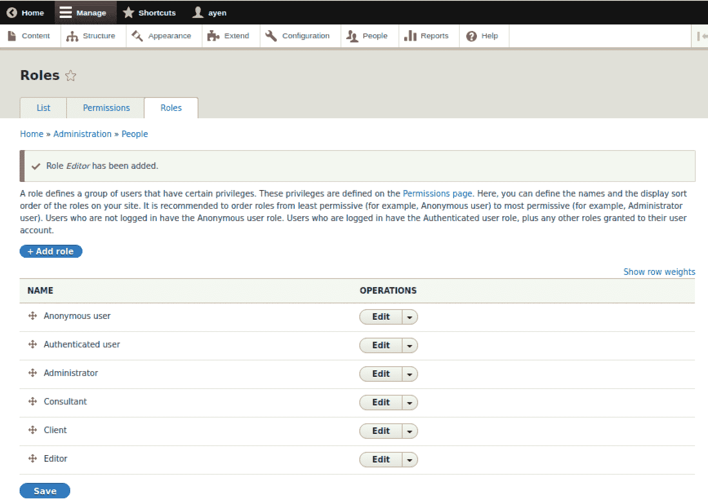

# 管理用户

在第二章《结构化内容类型》中，我们学习了内容是如何以类型存储的，关于内容类型，构成它们的字段，以及如何创建自定义内容类型。

这章全部关于拥有 Drupal 网站，或者任何网站的原因：用户。

如果没有人访问网站的内容，那么拥有这个网站的理由就很少了，对吧？然而，并非所有的访问都是一样的。你将了解用户类型以及 Drupal 如何为你提供一种确保没有人拥有超过他们所需访问权限的方法。更具体地说，本章涵盖了以下主题：

+   用户类型

+   用户角色

+   用户权限

+   创建用户

# 用户类型

在**内容管理系统**（**CMS**）的背景下，用户仅仅是使用网站的人。如果这就是全部，如果每个人在 Drupal 的**眼中**都是一样的，我们就可以在这里停止了。所以，你读到所有用户并不一定相同，你不会感到惊讶。当然，当我写那句话时，我并不是指用户的个人方面；我的意思是，用户在访问网站的原因以及他们被赋予的能力方面并不一定相同。

如果我们将用户视为一个顶级分类，并考虑进一步对他们进行分类，那么这样做取决于一个选择：我们是按照现实世界的某种方式对他们进行分类，还是像 Drupal 那样？在下表中，我们可以看到它们的比较：

| **用户** |
| --- |
| **管理** | **创意** | **消费者** |
| 专注于网站的配置和设置，而不是网站内容。 | 专注于网站内容 | 网站内容的获取者 |

从现实世界的角度来看，我们倾向于根据用户与网站的功能关系来对用户进行分类。如果你从家庭的角度来考虑这些关系，有些人可能只是住在那里并消费食物（想想青少年），有些人会为家庭的外观和内容做出贡献，而其他人则负责维护它。是的，用户可以出现在多个类别中，如下表所示：

| **用户** |
| --- |
| **管理** | **认证** | **匿名** |
| 认证并拥有执行高级活动权限。 | 匿名用户，需要登录以访问受保护的功能或内容。 | 作为未知网站访客对账户拥有一些访问权限。 |

从 Drupal 的角度来看，这基本上取决于你将在网站上允许做什么，以及你是否需要账户来做这些事情。例如，一些网站允许未知访客阅读内容并对其进行评论。其他网站只允许他们阅读内容而不允许评论，还有一些网站根本不允许匿名访问。回到家的类比，那些可以随意对其做任何事情的人拥有管理访问权限；那些被允许进入的人拥有经过验证的访问权限，尽管有不同的“角色”，比如朋友与居民；那些来到前门（如果没有守门人或门卫阻止）而身份不为人知的人是匿名的。

大多数情况下，*消费者*用户是*匿名*的，一些高级或安全内容要求他们必须是*认证*的。*创意*用户通常是*认证*的。*管理员*通常总是拥有*管理*权限。要点是：网站各不相同，因此用户类型的隔离（如果有的话）也各不相同。

# 用户角色

对于 Drupal 来说，*角色*的含义与 Drupal 之外的含义相同：用户的职能方面，有时被认为是一个*角色扮演者*。值得一提的是，Drupal 在角色和用户类型之间稍微模糊了界限，因为它预定义了三个角色，它们就是之前提到的用户类型。虽然*管理员*作为一个角色是有意义的，但*认证*和*匿名*并不是真正的角色，但它们出现在那里是为了简化事情，至少对于管理员来说是这样。

因此，在我们继续讨论为什么你需要额外的角色之前，让我们先看看 Drupal 中的默认用户角色。如果你在使用菜单，点击管理菜单中的*人员*（`admin/people`），然后点击标签页上标有*角色*的选项，如下所示：

上述截图显示了 Drupal 中预定义的角色。我不同意对角色的给定描述，因为它不够明确。Drupal 的操作顺序是先给角色分配权限，然后给用户分配角色。我们将在添加用户和分配一些权限时，在本章的后面部分进一步讨论这个问题。

现在，让我们先关注默认的 Drupal 角色本身。正如我之前提到的，*匿名*和*认证*实际上是比角色更多的用户类型，但在 Drupal 中它们被称为角色。这三个角色单独就足够了吗？一个例子是，所有登录用户都可以创建内容，而没有登录的所有用户只能查看该内容。如果这些就是你的组织和网站复杂性的限制，那么如果你想的话，可以跳到关于*用户创建*的部分。

让我们考虑一下。匿名角色是独立的。为什么？因为它被定义为没有账户或登录的用户，也就是说，一个未识别的用户。我们不会将 *匿名* 角色分配给用户账户，因为如果有账户，使用该账户的用户就不再是匿名的。为匿名用户创建不同角色的做法是没有意义的，因为没有用户账户可以分配这些角色。因此，这就留下了其他两个角色，我们可以使用它们来推导示例。

在我们的网站上，我们将有四种非管理认证用户类型。第一种是一般认证用户。也就是说，具有此角色的用户将能够登录，并且除了能够看到匿名用户和所有用户都能看到的文章和页面网站内容之外，他们还能够看到我们定义的预约类型的内容。

这可能是我们使用认证角色的用途，因为所有登录的用户至少都将具备这些能力，但我们不会为此使用该角色。为什么？因为我们必须考虑到将来可能会有一些用户可以登录但不能访问预约数据的情况。一般来说，我更喜欢为了这个原因保持预定义的角色不变……用作模型，或者保持原样。因此，我们将新角色称为客户端。

在为登录用户创建新角色时需要记住的一件事是，由于用户已登录，因此也是一个认证用户，该用户将接收到分配给认证角色的所有权限。

在我们的网站上，将有三类认证用户角色：能够查看预约的客户端；能够创建和编辑预约的顾问；以及能够创建和编辑除预约之外内容的编辑。我们用户角色的完整列表及其用途如下表所示：

| 角色 | 用途 |
| --- | --- |
| 匿名 | 未知用户。能够阅读 *文章* 和 *页面* 内容。 |
| 认证 | 有账户的用户。能够对 *文章* 内容进行评论。 |
| 客户端 | 认证 + 能够查看 *预约* 内容 |
| 顾问 | 认证 + 能够执行 *预约* CRUD^* |
| 编辑 | 认证 + 能够执行 *文章* 和 *页面* CRUD^* |
| 管理员 | 认证 + 能够访问 Drupal 管理功能和管理用户账户 |

* **CRUD** = **创建/读取/更新/删除**

按照以下步骤添加客户端角色：

1.  点击 + **添加角色** 按钮，这将带您进入页面 `admin/people/roles/add`

1.  输入 *角色名称*，`Client`

1.  点击 **保存**

注意，角色列表现在包括 Client。按照上述步骤为顾问和编辑角色也执行操作。角色列表现在应如图所示：

所有角色现在都可以使用。然而，它们的权限尚未定义。既然我们已经涵盖了有关创建角色的所有必要内容，让我们继续讨论权限的话题。

# 管理权限

用户可以查看、收听或以其他方式与之交互的任何页面元素，例如菜单链接，都可供使用，因为用户通过角色已被授予这样做权限。这是一个非常重要的概念，所以我会给出一个例子。您无疑在大多数网站上看到过“条款和条件”链接。

在 Drupal 网站上，如果您看到这样的链接，那是因为您的用户角色已被授予访问该内容（条款和条件页面）的权限。如果未为您的用户授予该权限，链接可能不会可见。如果它仍然可见，或者您在浏览器中输入该页面的 URL，您将收到一条消息，表明您未被授予访问该内容。

由于权限可以是细粒度和详细的，因此有很多权限，添加模块通常会向列表中添加更多。我们将关注其中的一小部分以保持简单。

提醒大家注意，点击页面顶部的“权限”标签页，这将带我们到`admin/people/permissions`。

权限页面的结构是一个可滚动的表格，其中包含了所有提供的权限。表格顶部列出了网站上定义的角色。您会发现它们与之前列出的相同。表格最左侧列出了按字母顺序主题和/或定义它们的模块名称分类的权限列表。

管理方式相当简单。如果复选框被勾选，则该列的角色拥有列出的权限。例如，查看第一个权限，它与*Block*模块相关联，只有拥有管理员角色的用户被授予了*管理块*的能力。

为了避免为每个角色上下滚动，我们将通过权限来处理，这样我们只需滚动一次。在下面的表格中，我将提供需要我们注意的每个类别及其内的权限，以及您检查适当的复选框后，应该看起来像什么，以完成我们为角色定义的早期权限。

我们不会更改管理员列中的任何设置，但我包括它，以便每个角色的相对位置与您在屏幕上看到的一致。

我只为需要更改设置的权限提供行。例如，您会在“评论”类别下注意到，所有经过身份验证的用户类型都已经具有发布评论的能力，而匿名用户具有查看评论的能力，因此不需要更改，这就是为什么该行不会出现在这个表格中的原因：

| **类别/权限** | **匿名用户** | **认证用户** | **管理员** | **客户** | **顾问** | **编辑** |
| --- | --- | --- | --- | --- | --- | --- |
| NODE |  |  |  |  |  |  |
|     *预约*: 创建新内容 |  |  | x |  | x |  |
|     *文章*: 创建新内容 |  |  | x |  |  | x |
| *    预约*: 删除自己的内容 |  |  | x |  | x |  |
| *    文章*: 删除自己的内容 |  |  | x |  | x |  |
| *    文章*: 编辑任何内容 |  |  | x |  | x |  |
| *    预约*: 编辑自己的内容 |  |  | x |  | x |  |
| *    文章*: 编辑自己的内容 |  |  | x |  | x |  |
| 访问内容概览页面 |  |  | x |  | x | x |
|  查看自己的未发布内容 |  |  | x |  | x | x |

前表中的大多数权限都与特定内容类型的 CRUD 操作相关。也就是说，能够创建（添加）、编辑（更新）和删除特定类型的内容，例如我们创建的*预约*类型。你可以看到，我们授予了顾问执行此类操作的权限，但没有授予编辑者权限，而我们对*文章*内容授予了执行相同操作的权限，但没有授予顾问权限。

访问权限、权限立即生效。也就是说，即使你有执行特定动作或访问特定类型内容的权限，如果从你的角色中移除该权限，你对该动作/内容的访问就会消失，除非和直到它被恢复。

你会注意到，一些权限描述看起来非常相似，例如：

+   预约：编辑自己的内容

+   预约：编辑任何内容

两者之间的区别在于，使用第二种权限时，用户可以编辑无论谁创建的预约内容，而使用第一种权限时，用户需要自己创建它。

最后一个权限，*查看自己的未发布内容*，也值得关注。除非授予此权限，否则如果新内容保存为*未发布*，其作者将无法访问它，只能访问标记为*已发布*的内容。拥有此权限的用户还可以访问自己的未发布内容，这对于处理草稿是必要的。

你可能还会注意到，没有特定内容类型的阅读/查看权限。这是因为，虽然存在查看已发布内容的权限，但这已经是查看内容权限的最细粒度；没有关于查看特定内容类型的权限。然而，有一个模块提供了这些权限，我们将在第五章，*使 Drupal 更加有用*中添加。一旦我们有这些可授予的权限，我们就可以确保只有我们选择的角色可以评论特定内容类型，因为如果你不能查看内容，你就不能评论它！

# 用户

我们已经为我们的网站创建了特定的角色，并为他们分配了授予他们所需访问权限的权限。我们现在唯一缺少的是...用户。每个用户都需要一个账户。他们从哪里来？

大多数用户获取 Drupal 账户的方式有三种：

+   具有创建用户账户权限的用户代表用户创建账户

+   用户注册账户

+   用户通过**单点登录**（**SSO**），例如通过 Facebook 账户获得账户

在这些方法中，后者超出了本书的范围，因为它是一个更深入的行政主题。让我们看看其他两种方法。

# 创建用户账户

我们将学习如何创建用户账户。一些网站选择允许用户创建一个立即激活的账户，无需审查，一些网站选择要求账户保持不活跃状态，直到管理员批准，这正是我们将在这里模拟的，还有一些网站创建所有用户账户都是行政性的，不允许用户注册。

让我们为编辑角色创建一个账户，这是我们创建的角色之一。如果你顶部还有带有列表、权限和角色标签页的页面，请点击列表。否则，你可以点击管理菜单中的“人员”，或者导航到`admin/people`。以下是创建账户的方法：

1.  点击“+添加用户”按钮，这将带您到添加用户页面，`admin/people/create`。

1.  对于电子邮件地址，如果您有，可以输入真实的电子邮件地址，或者一个假的（`@example.com`是用于假电子邮件地址和 URL 的好域名）。

1.  用户名可以是任何东西。我们的编辑将是*埃迪编辑*，所以我将她的用户名设置为`Edie`。

1.  选择一个你记得的密码。用户登录后可以更改密码。要获得绿色条（强密码），尝试使用`Password123`。在确认密码字段中再次输入你的选择。

1.  对于状态，保持设置为“活动”。如果您想提前创建用户账户但不想立即激活，请选择“阻止”。

1.  在角色下，勾选“编辑”以赋予此用户该角色。

你会注意到“角色”已选择“认证”，并且不能取消选择。这是因为所有有账户的用户都是按定义认证的。

1.  我们将不勾选“通知新账户用户”。通常情况下，你会勾选这个选项，以便向新用户发送电子邮件，但在此情况下我们不希望发送电子邮件。

1.  当有类似博客文章的内容，作者附有照片时，这幅图片看起来很漂亮，但我们不会使用照片。

1.  你的内容编辑员是否希望通过网站联系？如果是，请勾选下一个复选框以选择“个人联系表单”。

1.  时区选择确保用户看到基于他们时区显示的时间，而不是位于网站服务器所在时区的时间。

在处理完所有字段后，点击创建新账户。您将停留在添加用户页面，顶部将显示类似于以下截图的消息：

当用户被允许通过注册请求账户时，通常有两种处理方式，这取决于您的网站配置：注册可以导致立即激活的账户，或者用户账户将被创建为已阻止到非活动状态，直到它被批准。

用户注册在配置 | 人员 | 账户设置（`/admin/config/people/accounts`）中进行配置。了解更多信息请访问：[`www.drupal.org/docs/user_guide/en/config-user.html`](https://www.drupal.org/docs/user_guide/en/config-user.html)。

要批准它，您需要从用户列表中编辑账户，将状态从已阻止更改为活动状态，并分配用户所需的任何角色。唯一将预先选择的角色是认证用户，就像我们创建用户时一样。

# 摘要

我们已经探讨了管理用户的主要方面，包括角色和权限。确保用户拥有适当的角色，并且这些角色只授予他们应有的功能访问权限，对于您的内容和网站的安全性至关重要。

现在我们已经拥有了一个网站，一些内容类型，以及具有适当权限处理内容的编辑器，是时候花些时间在内容管理系统最核心的主题上了：内容，这正是我们将在第四章，“创建和编辑内容”中要做的。
