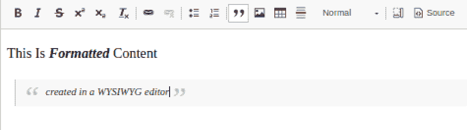
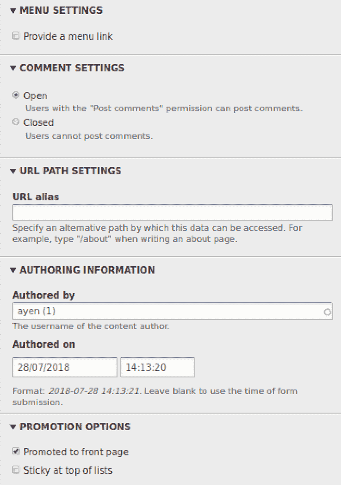
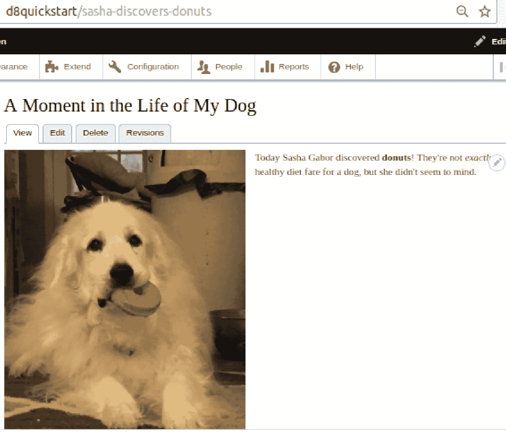

# 第四章：创建和编辑内容

在上一章中，我们学习了内容类型。我们还学习了针对特定需求设计新内容类型、如何创建它们以及如何向它们添加字段以存储数据并使其作为选择标准可用。现在我们已经讨论了内容的分类和存储，让我们转向内容本身。

Drupal 网站都是关于内容的。为了使网站能够向访客展示内容，它需要包含内容。内容是如何进入 Drupal 网站的？在本章中，您将学习如何与内容一起工作，创建和编辑它。在本章的整个过程中，您将创建内容（用于本书后面的使用），并将学习以下内容：

+   使用所见即所得编辑器

+   为其他角色配置编辑器

+   在内容创建表单上导航各种字段

+   预览内容

+   发布内容

+   为内容定义自定义 URL

+   添加附件和字段的多个实例

+   让内容固定在主页上

# 使用所见即所得编辑器

当您从手机发送短信时，您输入文字，从内容的外观来看，这基本上就是全部了。您只能选择是否想使用大写字母。如果您想对自己的消息有更多控制权，您可以切换到发送电子邮件消息，这可能使您能够选择粗体、斜体或下划线文字。

如果您想发送格式化程度高的内容，例如带有标题、字体更改、文字颜色、项目符号列表等，您可能需要使用文字处理软件，如 Word、Pages 或 LibreOffice。

这类软件创建的是所谓的**富文本**，即具有丰富样式的文本，而能够创建包含富文本文档的软件的通用术语是**富文本编辑器**。

Drupal 8 包括一个名为 CKEditor 的富文本编辑器。它是一个高度可配置的编辑器，具有一个类似于以下截图中的独立文字处理软件的格式按钮的编辑区域。这种类型的编辑器被称为**所见即所得**（WYSIWYG），发音为 wizzy-wig，代表**所见即所得**（What You See Is What You Get），意味着它显示的文本显示了所选的格式：



让我们创建一个内容片段并重现图像中的内容。在管理菜单中点击“内容”，然后点击“*+添加内容*”按钮。当您看到内容类型列表时，点击“文章”。

在页面标题旁边的“创建文章”旁边有一个星星 。如果您点击它，其轮廓将变为彩色，这表示当前页面已被保存为您的收藏之一。您可以通过在管理菜单中点击快捷键并选择页面标题来简单地导航到将来的同一页面。

该页面包含创建文章内容所需的所有字段和设置。那些需要输入的字段在其名称后面有一个星号，我们将在依次介绍每个字段时也包括一个星号。

# 标题*

*标题*是所有内容的必填字段，因为它用于将一篇内容与另一篇内容区分开来，尽管它不必是唯一的，所以多篇内容可以具有相同的标题，这很快就会变得令人困惑。该字段中的输入将出现在内容的摘要管理列表中。它还用作内容单独页面上的页面标题。因此，最好输入一个对您有意义且对网站访客有信息量的标题。现在输入一个。我的标题将是**我的狗生活中的一个瞬间**。

# 正文

您可能想知道为什么*正文*字段不是必需的，因为如果没有正文文本，文章将毫无用处。这是因为您可能想创建一个草稿文章，稍后再回来实际创建正文文本。这是不可能的，因为没有标题，就很难找到文章。

# 摘要字段

字段名旁边有一个链接，上面写着编辑摘要。在创建内容类型时，创建者决定正文文本字段是否应该容纳一个单独的摘要，如果是这样，那么就会显示该链接。摘要用于例如为网站访客提供内容列表的情况，其中提供了一个内容的简短描述——*预告*。

提供预告文本有两种方式：通过单独的摘要或通过裁剪，即从内容开头摘录文本。我更喜欢使用摘要，因为裁剪基于一个固定的字符数，对于所有相同类型的所有内容都是相同的，比如前 40 个字符，所以我无法控制摘录在哪里结束……也许它会在一个单词的中间结束。使用摘要，我可以精确控制将要显示的内容。即使它与我的正文文本开头相同，我也能确保它在一个合适的地方结束。

点击*编辑摘要*链接。摘要文本框将出现在正文上方。它包含一个链接，可以再次隐藏该字段。编辑摘要/隐藏摘要的切换操作允许您在需要使用它之前移除其干扰。您会注意到文本框的右下角有一个小部件，它的形状类似于页角，可以用鼠标抓住并拖动以放大或缩小文本框的大小。它下面还有一个注释，告诉您如果您没有在字段中输入摘要文本，Drupal 将使用正文文本的裁剪版本作为摘要。在字段中输入一些摘要文本。我的摘要将是：**莎莎有一个令人兴奋的发现**。

你会注意到在字段下方有一个设置为**基本 HTML**的选项框。默认情况下还有两个其他设置可用：**受限**和**完整**。并非所有用户角色都必然拥有所有设置。每个设置允许某些 HTML 标签，这相当于文本的某些格式化。有关更多信息，请点击*关于文本格式*链接。

# 正文文本

在正文字段中输入文章的全文。根据所选的文本格式，编辑器将提供各种按钮来格式化文本。我的文本看起来如下：

*今天莎莎·加博发现了甜甜圈！这对狗来说并不完全是健康的饮食，但她似乎并不介意。*

为你的文章输入一些文本，并使用**B**（粗体）或*I*（斜体）按钮格式化其中的一部分。输入完成后，点击*源*按钮查看实际的 HTML 标记看起来像什么。我的应该是这样的：

```php
<p>Today Sasha Gabor discovered <strong>donuts</strong>! They're not <em>exactly</em> healthy diet fare for a dog, but she didn't seem to mind.</p>
```

如果你需要自定义正文文本的底层 HTML，这里就是你可以做到的地方。再次点击源按钮返回 WYSIWYG 模式。

# 文本格式

*文本格式*下拉菜单用于选择在输入文本时将使用的过滤器。在接受用户输入的网站上，安全性是一个持续关注的问题，因为一些不良行为者会尝试输入可能造成混乱的标记。允许哪种类型的标记有助于减轻潜在的问题。这些过滤器可以定义和配置，例如，配置将确定哪些 HTML 标签将被允许，哪些进程将被运行（如 HTML 校正）以及它们的顺序。过滤器分配给用户角色，并且一个用户角色可以访问多个过滤器。Drupal 附带并默认配置的过滤器如下：

+   **纯文本**：不接受任何 HTML 标签

+   **受限 HTML**：通常用于匿名用户（未登录用户）的最小 HTML 集，如斜体、粗体和标题

+   **基本 HTML**：类似于受限 HTML，但通常包括 WYSISYG 工具栏按钮的配置，因为过滤器通常用于认证（登录）用户，他们将能够访问编辑器

+   **完整 HTML**：允许任何有效的 HTML 标签，应谨慎分配

此过滤器将不会包含在下拉菜单中，因为它在没有任何其他过滤器可用时使用。

# 标签

*标签*字段用于包含与内容相关的术语。这些术语可以被用户用来搜索内容。多个术语应该用逗号分隔。该字段是一个自动完成字段，这意味着任何与输入字符匹配的现有术语都将被提供给你点击，而不是输入整个术语。我的标签将是**Sasha**和**甜甜圈**。

# 图片

*图片*字段允许从您使用的设备中选择文件并将其上传以存储并关联到内容。文件的最大大小在字段下方给出（通常是 2 MB），以及将被接受的文件类型。我将添加一张图片，并将**莎莎和她的甜甜圈**作为 alt 文本。Alt 文本用于向使用屏幕阅读器或其他形式的访问而不是查看图片的用户提供有关图片的信息。

内联图片与附件图片：

通过所见即所得编辑器插入到文本中的图片被视为文本的一部分，而通过图片上传对话框附加到内容中的图片被视为内容的一个独立部分，就像标题一样，并且可以根据各种上下文配置其可见性，例如预告片、RSS 源等。

# 发布内容

发布复选框将内容的状态设置为草稿（未选中）或发布（选中）。通常，只有编辑者、管理员和内容的作者在草稿状态下会被允许查看内容。内容不会出现在没有权限查看它的角色的菜单或列表中。让我们勾选复选框以发布我们的内容。

# 其他设置

这涵盖了创建*文章*内容所使用的的主要字段。还有其他配置选项可以通过垂直标签访问。让我们看看那些：



这些附加设置被称为元数据，它是用于描述内容的但不实际是内容的一部分的信息。

# 修订日志消息

如果您正在处理的内容类型设置为修订，您可以在该框中输入您对内容所做的更改的描述，该描述将被保存并在查看此内容的可用修订时列出。

# 菜单设置

如果您想为该内容创建一个菜单链接，勾选此框将打开一个对话框以提供以下设置：

+   菜单链接标题：作为链接显示的文本

+   描述：鼠标悬停时显示的文本

+   父项：此菜单链接下的缩进菜单链接

+   重量：一个值，用于确定此菜单项相对于同一父项的其他菜单项的位置（基于它们的重量）

# 评论设置

如果您的内容类型设置为允许评论，您可以设置此特定内容以接受评论（开启）或不再接受评论（关闭）。

# URL 路径设置

当创建一个新的内容项时，它会被分配一个称为节点 ID 或 NID 的顺序数字 ID。默认情况下，当内容呈现时显示的 URL 类似于`http://mysite.com/node/123`，其中 123 是 NID。如果您希望内容有一个比 node/123 更有意义的 URL，例如 sasha-discovers-donuts，那么可以在此处定义这个自定义 URL，称为别名。

当为内容定义别名时，原始 URL 仍然可用于使用。你可以使用任何形式的 URL 来访问此内容，例如 https://mysite.com/node/123 或 https://mysite.com/my-friendly-content-name。

# 作者信息

如果你代表其他用户创建内容，你可以在此选项卡的文本框中开始键入他们的用户名，并从提供的匹配项中选择该名称，以及指定应考虑的内容创建日期。

# 提升选项

内容可以被“提升”到更高的状态，以便将其包含在主页上，甚至突出显示它。

+   提升到首页：一些网站通过仅选择已提升的内容来确定首页上显示的内容。

+   列表顶部固定：如果内容是固定的，它将保持在主页上，而其他内容将被新内容替换。这是一种让欢迎信息保持不变同时循环其他内容的好方法。

# 完成流程

到目前为止，我们已经准备好通过点击*保存*按钮来保存我们的新内容。完成此操作后，内容将显示给你看。注意显示的 URL。在我的情况下，它是*node/2*。我更希望有一个对用户和良好的 SEO 更有意义的东西，所以我将点击编辑标签并导航到*URL 路径设置*的垂直标签。在那里，我将输入`/sasha-discovers-donuts`（需要初始斜杠）并再次保存文章。现在，浏览器将显示我改进的 URL。我仍然可以使用 node/2 的原始 URL。它没有被删除。以相同的方式为你的内容创建一个更好的 URL。



你会注意到你文章上方的其中一个标签是*修订版*。点击它。因为文章内容类型被配置为在保存时创建修订版，我们没有通过取消选中创建新修订版复选框来覆盖它，所以我们所做的更改和保存的目的是为了改进我们的 URL，结果是将更改保存为新的版本，而不是简单地覆盖原始版本。以这种方式，我们可以每次编辑内容时创建一个新的修订版。从修订版页面，我们可以做以下操作：

+   查看先前版本的列表

+   查看先前版本

+   删除先前版本

+   回滚到（恢复）早期版本，放弃自那时起所做的更改

# 摘要

这就结束了本章的内容。在这里，我们学习了如何创建内容，使用所见即所得编辑器，配置内容的各种选项，发布它，使其固定，保存它，编辑它，更改其 URL，以及处理修订版。

在下一章中，我们将学习如何通过扩展附加模块使 Drupal 更加有用。
