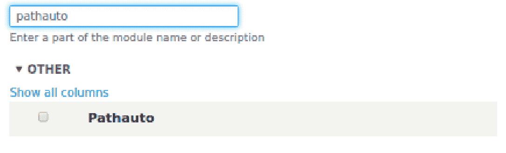
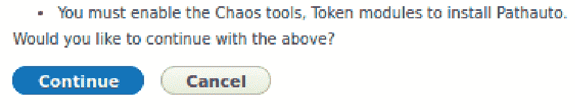
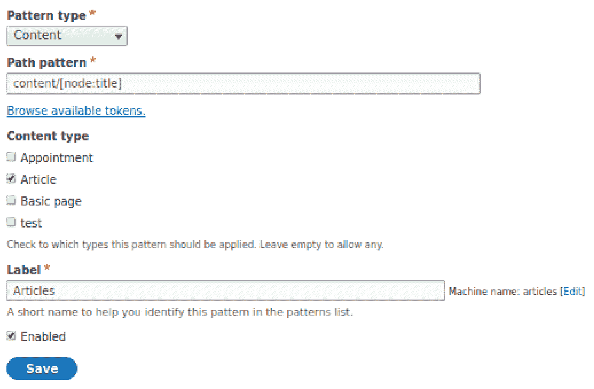
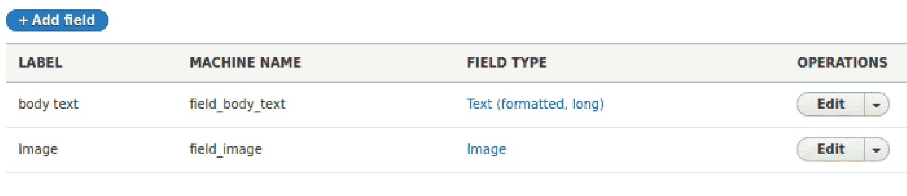
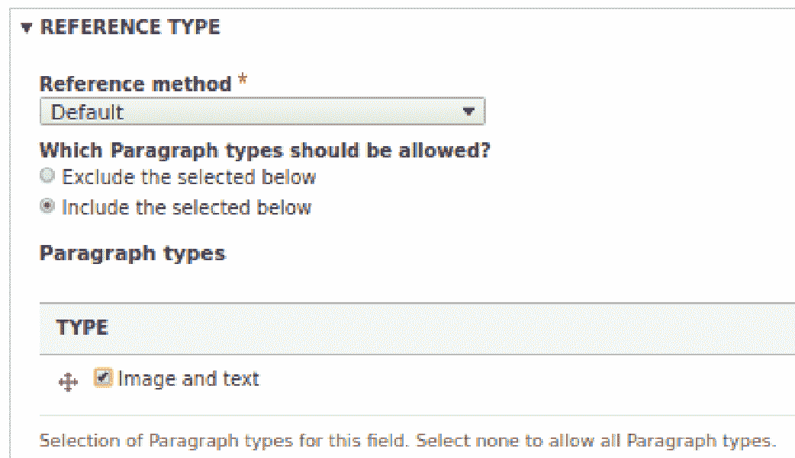
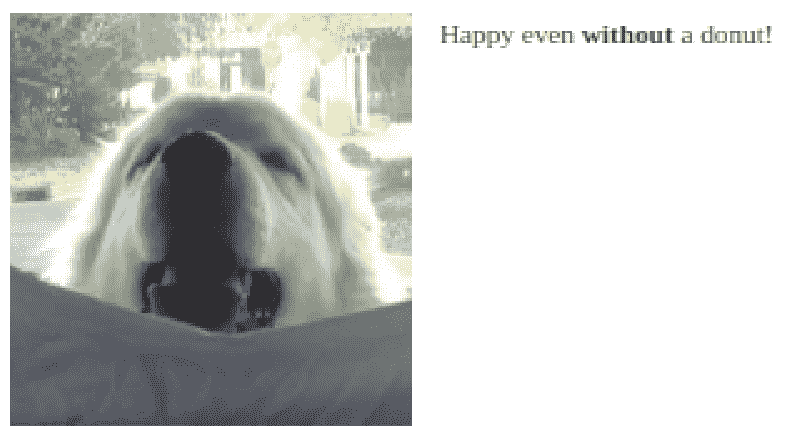
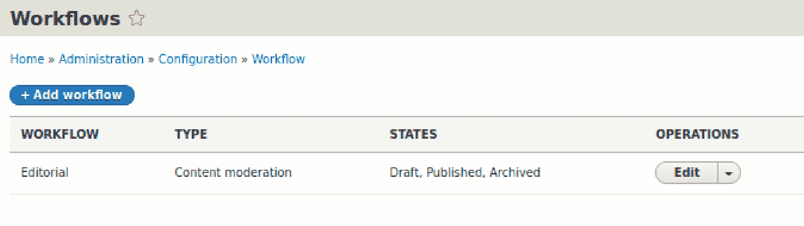
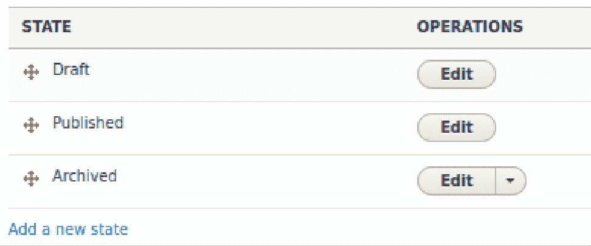
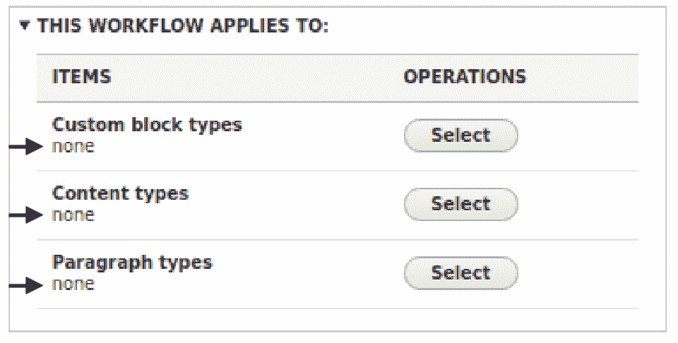
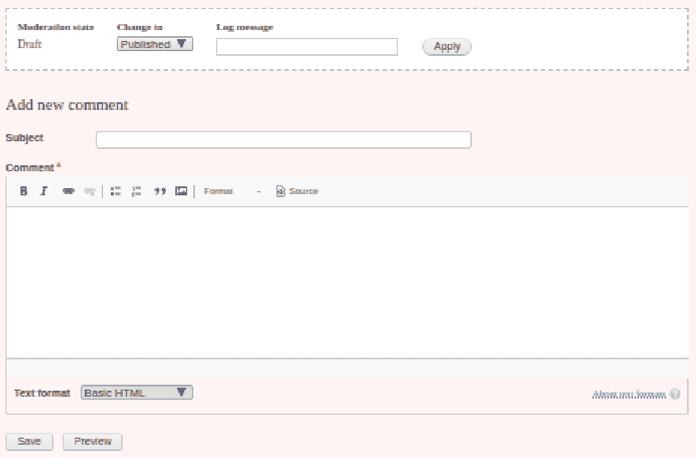

# 使 Drupal 更加有用

在上一章中，我们学习了如何创建内容，这是 Drupal 网站的主要组成部分。创建内容可以通过一个简单的内置过程来完成。Drupal 作为一个内容管理系统，无需任何定制即可完全使用。然而，你的网站或商业模式可能需要额外的功能。也许你想安排活动，或者接受支付，或者显示产品目录。因此，有大量的附加功能可供选择，这些功能可以极大地增加其效用和灵活性。

可能你已经通过浏览器插件为你的浏览器添加了功能，或者通过应用为你的智能手机添加了功能。在 Drupal 中，功能扩展也是通过一些附加代码片段来实现的，这些代码片段被称为模块。模块被安排在一个文件夹中，包含程序代码和其他文件，当它们被放置在 Drupal 文件夹的正确位置时，会提供超出 Drupal 本身所包含的功能或服务。与 Drupal 本身一样，模块是开源的，且免费，尽管有些模块的作用是将 Drupal 连接到付费的第三方服务。

模块来自以下三个来源之一：

+   **核心**: 随 Drupal 一起提供，有时使用是可选的

+   **贡献**: 不属于核心 Drupal 包的一部分，但通常可以从 Drupal 的模块库[`drupal.org/project/project_module`](https://drupal.org/project/project_module)获得

+   **自定义**: 通常专门为使用该模块的网站开发

模块涵盖了各种类别、功能和服务的宝库，从社交媒体集成到图像编辑和预约安排。本章探讨了几个更受欢迎的模块，这些模块扩展了 Drupal 对内容用户的实用性。本书的范围不包括自定义模块。本章我们将使用并查看的模块如下：

+   **Pathauto（贡献，但包含在 Drupal 中）**: 根据你创建的规则自动生成内容的 URI/路径别名

+   **段落（贡献）**: 提供了一种简单的方法，可以将预格式化的内容片段添加到你的更大型内容中

+   **内容审核（核心）**: 促进在内容发布前进行审核的过程

# Pathauto

安装模块有许多方法，所有这些都需要一些管理权限。贡献模块的安装超出了本书的范围。我们将从模块文件位于正确位置这一点开始。

因为 pathauto 模块包含在 Drupal 中，所以文件肯定存在。我们可以通过导航到管理菜单中的“扩展”或`/admin/modules`来验证这一点。一旦到达那里，在页面顶部的过滤文本框中输入 pathauto。你应该会看到以下条目列在列表中：

让我们勾选它旁边的复选框并点击安装按钮。根据你网站上启用的其他模块，你可能会收到以下消息：

如果你确实收到了这条消息，或者安装模块时收到类似的警告，那是因为该模块依赖于其他模块，而其中一个或多个模块没有被启用。如果存在必要的模块，Drupal 将提供启用它们的选项。只需点击继续。在这种情况下，如果一切顺利，你将在重新加载页面的顶部收到一条状态消息，表明已启用三个模块：pathauto、Chaos tools 和 Token。

在这个阶段，我们可以配置 Pathauto。大多数模块都有一个配置页面，但并非所有模块都有。滚动到 Pathauto 条目，或者使用筛选文本框来查找它，然后点击模块描述左侧的箭头。一个手风琴控制将打开，并显示配置链接等。点击它，你将被重定向到 Pathauto 的配置页面，网址为`/admin/config/search/path/patterns`。页面将很简洁，因为没有存在任何模式。让我们创建一个。

点击+添加 Pathauto 模式按钮。生成的页面，标题与刚刚点击的按钮相同，包含一个下拉选择，提供适合路径模式的多种实体类型。最初，选项是内容、分类法、术语和用户。对于任何这些，都可以指定路径模式以创建有意义的 URL。我们将为内容创建一个模式，并选择相同的。

我们的选择会导致页面略有变化，因为现在每个内容类型都被列出。你可以勾选文章的复选框，因为我们正在为它创建一个模式。

我们需要定义我们想要使用的模式。有许多可能性。我们将选择一个简单的模式。我们将有包含单词“content”和文章标题的 URL，形式为`content/my-article-title`。我们如何让文章标题也被使用呢？点击浏览可用标记的链接。

标记是占位符，它们将在适当的时候提供特定类型的值。将弹出一个包含多个标记类别的窗口。我们感兴趣的是*节点*，所以点击它旁边的箭头。一个扩展的列表将出现，在其中你可以找到*标题*，指的是节点的标题，或者在这个案例中，文章的标题。在其右侧有一个包含节点标题标记的链接，[node:title]。在模式文本框内点击，然后点击标记链接。它将出现在文本框中。现在，将光标移到标记的左侧并输入`content/`。

最后，在标签文本框中输入*文章*以标识此模式。表单应该看起来与以下截图相似，尽管你的内容类型列表可能不同：

点击“保存”以保存您的模式，您将被返回到模式列表，其中现在将有一个条目。让我们通过创建一篇文章来测试它。导航到 `/node/add/article`。

添加您想要的任何标题和正文文本。我将我的文章命名为“我的新文章”。当您保存它时，魔法就会出现。当我这样做时，我的 URL 不是像`*http://d8quickstart/node/5*`这样的，而是`*http://d8quickstart/content/my-new-article*`。请注意，原始 URL 仍然存在并且仍然可以使用。/admin/config/search/path 上的 Pathauto 列表列出了基于模式的别名和每个节点的原始 URL。在我的情况下，我创建的节点有一个节点 ID 为 2，因此如果我想的话，我仍然可以输入`http://d8quickstart/node/2`作为 URL。

注意，Pathauto 会自动将文章标题转换为 URL 友好的字符串，通过用连字符替换空格并将标题转换为小写。这些设置的控件可以在 Pathauto 配置页面的“设置”选项卡下找到。那里有一个非常重要的附加选项卡：批量生成。假设你在创建了一些节点之后创建了一个模式。你不必编辑每个节点并更改 URL 以匹配你的模式，你可以指示 Drupal 为每个现有文章生成一个模式化的 URL。

# 段落

段落是一个贡献模块，这意味着它是 Drupal 社区中某个人开发的，并贡献给了 Drupal.org。它提供了一种创建可以轻松重用的预格式化内容的方法。

一旦文件被存放到正确的文件夹中，通常在`/modules/contrib`，我们将像 Pathauto 一样通过`/admin/modules`上的扩展页面启用它。你可能会收到一条消息，表明必须启用*Entry Reference Revisions*模块。只需点击继续。

导航到结构（`/admin/structure`），你将在列表底部看到一个新条目：段落类型。点击它，这将带您到`/admin/structure/paragraphs_type`上的段落类型页面。你将看到一个消息，其中通常会有一个列表，表明还没有段落类型。所以，让我们创建一个。

点击“+添加段落类型”按钮。我们将为图像和文本创建一个段落类型，所以让我们在“标签”文本框中输入“图像和文本”，然后点击保存和管理字段。我们需要为我们的段落类型创建两个字段：一个用于包含图像，另一个用于文本。

点击“+添加字段”按钮。从选择列表中，选择图像。你可以将“图像”作为标签输入，或者输入你喜欢的任何值。点击保存并继续。保留页面上的设置，然后点击保存字段设置。在下一个设置页面上，也保留那些设置，然后点击保存设置按钮。

再次点击“+添加字段”按钮。从选择列表中选择文本（格式化，长），并输入标签的正文文本。点击“保存并继续”按钮，然后在下一页上，点击“保存字段设置”按钮。最后，点击“保存设置”按钮。我们现在已经定义了段落类型。

列表页面看起来会像以下截图所示：

到目前为止，我们已经定义了一个段落类型。现在，我们需要将其添加到内容类型中，以便创建该类型内容的用户可以使用该段落类型。让我们导航到“结构”|“内容类型”（`/admin/structure/types`），并点击文章内容类型旁边的“管理字段”。

点击“+添加字段”，从“添加新字段”选择列表中选择列表，选择段落。对于标签，让我们输入`段落类型`，然后点击“保存并继续”。在下一页上，保持设置不变，尽管要确保“要引用的项目类型”字段已选择段落。点击“保存字段设置”。

在下一页，段落类型设置，在“引用类型”部分，我们确定哪些段落类型应该作为选项提供给内容创建者。默认情况下，在类型子部分中勾选复选框将表示包含该类型。我们还有选项表明任何勾选的复选框都是一个我们想要*排除*从提供给用户的选项中的类型。我们将使用默认的包含方法，并勾选可用的一个复选框，因为我们只创建了一个段落类型，即图片和文本，如以下截图所示：

点击“保存设置”。现在，让我们在“内容”|“创建内容”|“文章”（`/node/add/article`）处创建一篇文章。给文章起一个标题。向下滚动，你会看到已经添加了一个*段落类型*部分，其中包含我们创建的图片和文本段落类型。如果我们创建了额外的段落类型，并且标记为作为选项包含，它们也会出现。在这种情况下，如果我们决定在创建这篇文章时想要使用多个段落类型，可以使用类型名称左侧的句柄将类型拖动到内容中应该出现的顺序。

点击“选择文件”按钮选择*图片*，并浏览到要包含的图片。请记住为图片提供替代文本。然后，将随图片一起的文字输入到正文文本框中。请注意，此字段有一个可用的 WYSIWYG 编辑器用于格式化。

在我们输入的图片和文本下方有一个按钮，我们可以使用它来添加另一个段落。如果我们只想让用户在内容中添加一个段落类型的实例，我们可以在创建字段时将“无限”更改为 1 个实例在字段设置中。

点击保存按钮。当我们查看渲染的文章时，它并不完全符合我们创建段落类型时的想法。我的图片很大，而且两个字段都显示了它们的标题。让我们来解决这个问题。

导航到结构 | 段落类型（`/admin/structure/paragraphs_type`），并从选择字段中选择管理显示。在图像行右侧点击设置齿轮。在标签选择字段中，选择隐藏，并从图像样式选择字段中选择中等（220x220）。

你可以在`admin/config/media/image-styles`创建额外的图像样式。

点击更新按钮保存你的更改。然后，在正文文本行中，从标签选择字段中选择隐藏。点击保存按钮。

这解决了段落中*字段*的显示设置，但我们还想要更改段落字段本身的设置。它也显示了字段名称，这不是我们想要的行为。因此，导航到结构 | 内容类型（`/admin/structure/types`），并从*文章*旁边的选择字段中选择管理显示。对于*段落类型*字段，将标签设置更改为隐藏，然后点击保存。

现在，当我们查看预览时，它正是我们预期的样子：左边是一张图片，右边是文字：

如果我们想要相反的方式，我们可以编辑段落类型并交换其中图片和文字字段的顺序。段落类型可以包含的字段数量几乎没有限制，可以创建的段落类型数量也是如此。

当你启用了段落模块时，它下面列出的另一个模块是段落库。启用该模块将允许你将创建的段落类型存储在类型库中，以便可以轻松选择并用于其他内容类型。

在成功创建、编辑和使用我们的段落类型之后，让我们继续本章的最后一个示例。

# 内容审核

通常，一个组织需要发布内容的路径是间接的。作者不能直接发布文章，它必须首先经过审核，无论是由主管、同行还是编辑进行。*内容审核*模块引入了将审核过程注入内容发布流程的能力。

*内容审核*是核心模块中的一个模块，这意味着它包含在定义 Drupal 的主编程代码中。返回到扩展页面（`/admin/modules`）并启用内容审核。你将收到一条消息，指出为了这样做，*工作流*也必须启用。

让我们配置该模块。启用后，配置页面（`/admin/config`）上现在有一个新的部分：工作流。点击它，或直接导航到`/admin/config/workflow/workflows`。在这里，你会看到一个当你启用模块时创建的内容审核工作流：

点击“编辑”；在这里，我们将详细查看工作流程的各个部分。

# 状态

在这里，“状态”一词缺乏上下文，因此可能有些模糊。例如，如果我决定从我家步行去商店，那么存在三种状态：

+   在家

+   步行去商店

+   到达商店

然而，在流程的上下文中，状态不一定相同。默认情况下，状态与*静态*状态同义。让我们再次看看我的例子，这次用更精确的描述来描述状态：

+   在家 - 静态

+   步行去商店 - 过渡性

+   到达商店 - 静态

状态 1 和 3 代表静态状态——里程碑和平台——已经实现并且可以保持这种状态。状态 2 是过渡性的，因为它描述了导致从一个静态状态过渡到下一个状态的活动。

在查看状态时，如以下截图所示，所有三个都是静态状态：

+   **草稿**：内容已被创建，或正在创建过程中。

+   **已发布**：内容被标记为已发布，并且可供具有查看此类已发布内容权限的用户角色访问。

+   **存档**：内容已被发布，但现在已从被认为是当前材料的内容中移除，可能仍然可供查看：

注意，存档状态有一个下拉选择框，而草稿和发布则没有。这是因为前者是一个可选状态，可以使用下拉菜单进行删除，但草稿和发布不是可选的。

如你所见，三种状态都是静态的。尽管如此，在流程的上下文中，状态不一定相同。默认情况下，状态与*静态*状态同义。让我们再次看看我的例子，这次用更精确的描述来描述状态：

点击“编辑”链接查看“已发布”。名称“已发布”可以根据你的实现更改，如果有一个更合适的术语。接下来的两个复选框很重要：

+   **已发布**：无论此术语用于状态，还是如果你更改了状态标签，勾选此框表示当达到此状态时，内容被视为已发布，并且针对每个用户角色授予的关于已发布内容的权限适用，通常尤其是内容将可供查看。

+   **默认修订版**：在 Drupal 中，如果正在使用的内容类型已被配置为允许修订，每次内容（重新）保存时，都会创建一个新的修订版，并且任何具有适当权限的人都可以将内容恢复到早期版本。如果勾选此框，当内容的状态达到发布时，当前版本将被视为活动版本。

接下来是过渡。让我们看看“创建新草稿”，因为它的包含在这里可能不太直观。点击它的“编辑”链接。再次，如果你有一个更适合你流程的标签，标签是可编辑的。

在标签下方，你可以看到“从”来源，“状态”和“到”目标，“状态”的选择。这个转换的目标状态是草稿，并且不可更改，尽管如果你创建自己的转换，它将是可更改的。在任何情况下，只能定义一个目标状态，因为“内容在任何时候只能处于一个状态”。

可以选择多个源状态。选定的两个源状态可能看起来与目标状态草稿不符。然而，这些选择所涵盖的事件如下：

+   修改草稿并保存，它仍然是一个草稿，所以草稿⇒草稿

+   修改已发布的内容并保存它，但现在作为需要再次审核的未发布内容，所以已发布⇒草稿

对于发布转换的过渡，也有类似的特殊性，因为你可能正在（重新）发布已经发布的内容，或者发布草稿内容。

这种架构的好处是，当一篇文章发布时，可以创建一个新的草稿版本，并通过审核状态，直到它被发布，成为新的默认版本和可查看版本。

# 转换

我们已经看到了转换的编辑页面，但这个部分仍然值得一看。你会注意到，有多个转换被定义，源状态为已发布，以及源状态为存档。如果你添加一些状态，并且如果每个状态都可以与多个其他状态交互，这个排列列表可能会变得很长。这并不是说不应该定义额外的状态，只是简单地说，可能需要比你想象的更多计划。

# 工作流程应用

这种类型的工作流程需要有一个可以执行的动作。目前，这并不适用于任何可审核的内容结构：

对于我们的目的，这个工作流程应该适用于所有文章，所以让我们点击内容类型的选择按钮。在弹出的窗口中，勾选文章旁边的框并点击保存。然后，点击保存此工作流程。

如果你现在创建一篇文章，你可能可以选择将其保存为草稿或已发布，这是因为在页面底部有选择选项。如果是这样，这是因为你是管理员或已被赋予这种权限。否则，你只能将内容保存为草稿。那些被赋予审核此内容或查看其未发布版本权限的人，在查看时将看到以下截图：

此表单允许审核员更改内容的状态，并添加关于转换的日志评论。

# 摘要

在本章中，我们学习了模块是什么以及它们的用途，它们的来源，以及如何启用它们。我们查看了一个使用三个流行模块的示例，以提供其他情况下不存在的能力。

在下一章中，我们将探讨通过使我们的内容和网站的用户界面支持更多语言，利用 Drupal 的一些国际化特性来扩大我们内容的受众范围。

¡Hasta la vista!
