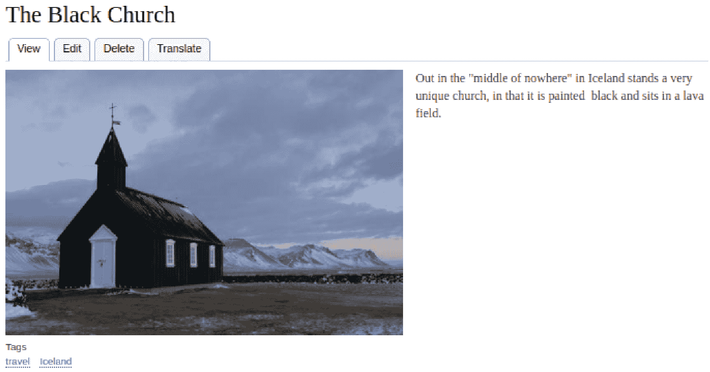
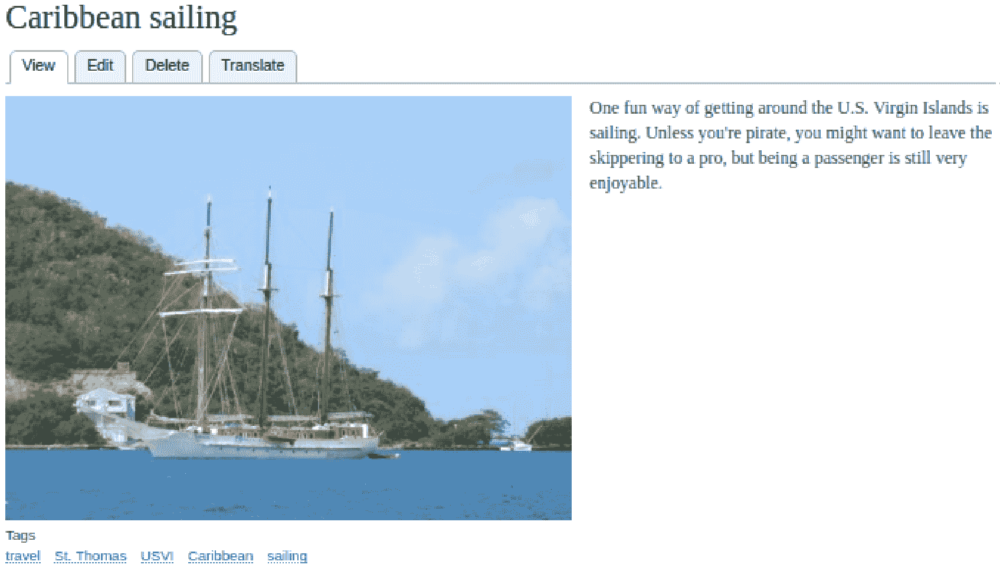
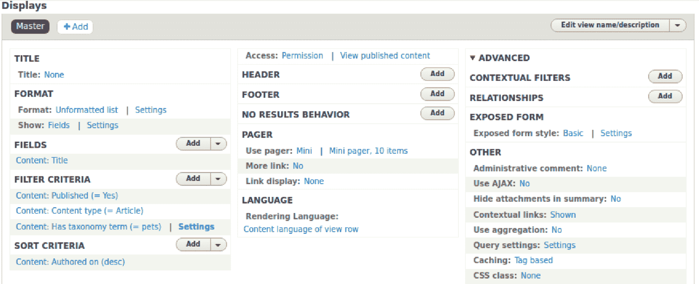
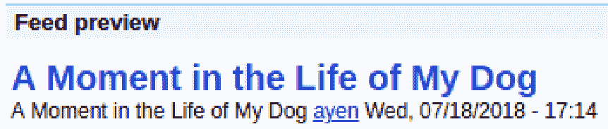
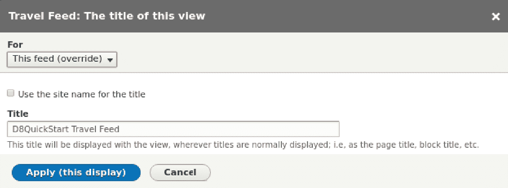
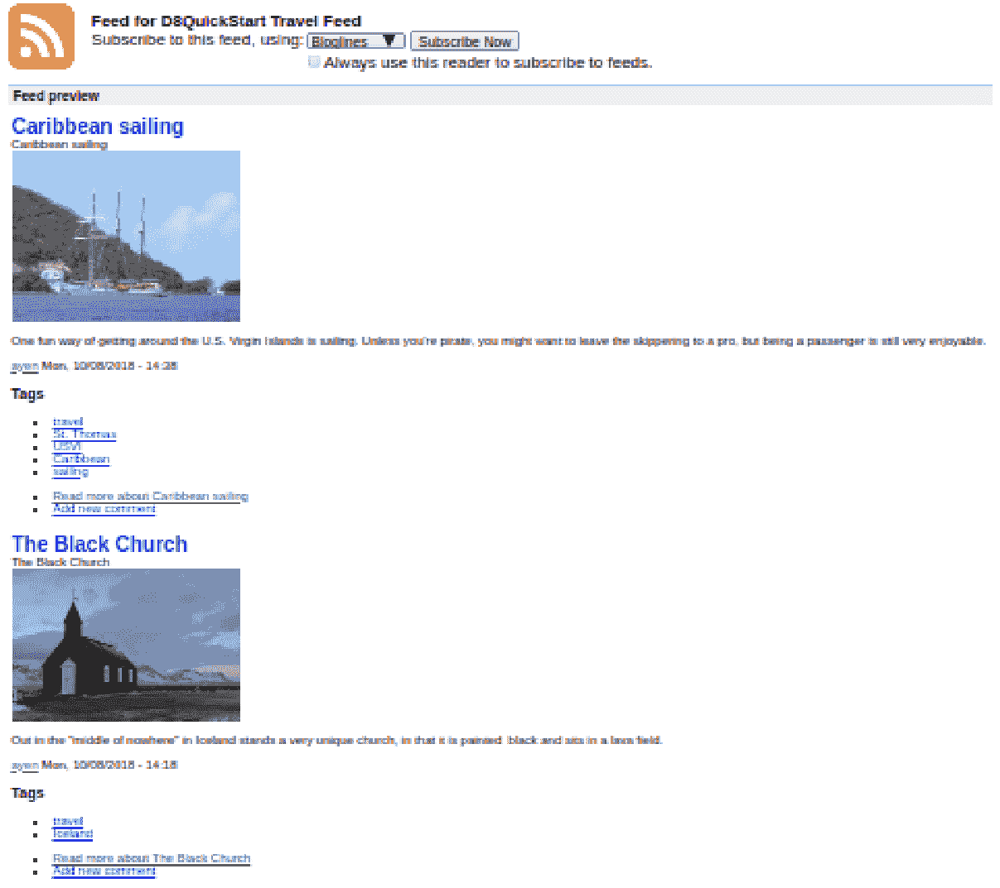

# 满足大众需求 – RSS

在本章中，我们将探讨什么是频道以及如何创建一个。实际上，我们将创建两个！以下是我们将涵盖的主题：

+   为什么您想提供频道？

+   决定要包含在频道中的内容

+   修改内容以启用频道选择

+   视图模块的简要概述

+   使用视图模块创建频道

+   创建一组频道链接

# 为什么需要频道？

什么是*频道*？**RSS**代表**丰富网站摘要**。单词“频道”有许多含义。在我们的上下文中，要考虑的含义是您可能已经在关于广播电视中听到的那个。例如，可能有一个事件正在伦敦外发生，并被当地网络报道。然后，该网络允许其他网络和电台在需要时接入他们的连续广播。这种连续广播被称为*频道*，因为它是对另一个消费的“食物”。在互联网上，频道与这非常相似。一个网站提供其内容流，该流被（请求）由想要使用该内容的网站拉取。这个流就是频道。

一些频道提供新闻内容。一些是电子商务频道，提供任何注册电子商务网站都可以销售并获得佣金的商品。一些只是提供对订阅频道读者感兴趣的主题的文章。

那么，为什么您想为您的网站提供频道呢？

曝光。提供频道使得其他网站能够消费它，并将您网站的内容展示给那些可能永远不会看到它的人。

# 选择用于频道的文章

如果您的一些网站内容是安全的，或者仅对高级订阅者可用怎么办？没问题！我们将探讨一种过滤为频道选择的内容的方法，或者相反，过滤掉您不希望被选择的内容。

我们将创建三个频道。首先，我们需要决定频道将包含什么内容……这意味着确定选择标准。

我们的一个频道是为宠物爱好者社区准备的。它将包含我们与宠物相关的任何文章。

我们的第二个频道是为旅行者准备的。它将包含我们与旅行相关的任何文章。

最后，我们的第三个频道将包含前两个频道未包含的任何文章。

# 修改内容以进行频道选择

因此，我们知道我们的频道有哪些标准，但 Drupal 将如何知道哪些内容符合这些标准呢？让我们讨论两种可能的方法。

# 吸引注意的标志

*吸引注意*标志是一个内容字段，其目的是突出内容适用于特定事物的事实，因此选择该标志的标志也是如此。它由一个布尔字段表示，包含`True (-1)`或`False (0)`，因此您可以将其视为开启或关闭。它通常由复选框表示。

因此，为了我们的用途，我们可以在文章内容类型中添加一个名为宠物的字段，并在创建文章时如果文章涉及宠物，就勾选该框，同样对于旅行内容有一个旅行复选框。

这是有意义的，并且是确定要选择的内容的简单方法，但这个计划中有一个小问题。每次出现新的标准时，就意味着需要在内容类型中添加另一个字段。事情可能会很快变得混乱。

一个“让我来”标志最适合独立的需求，例如当一篇文章被标记为已发布时。幸运的是，我们还有另一种方法可用。

# 标签

正如内容被保存在一个称为 *节点* 的实体中一样，Drupal 也有一个称为 *分类* 的实体类型，这是一个用于分类的科学术语。正如节点由内容表示一样，分类由包含术语的词汇表表示。

Drupal 内置了一个分类词汇表，称为标签。标签的预期用途是对内容进行分类。也可以创建额外的词汇表来存储特定用途的标签，例如与旅行相关的术语或西班牙语术语的词汇表，但为了分配适用于内容的类别，这是标签词汇表被设计的目的，并且它将适用于我们。

我将返回并编辑文章 *我的狗生活中的一个瞬间*，在当前包含 `Sasha` 和 `甜甜圈` 的 *标签* 字段中，我将添加一个额外的标签，`pets`，然后再次保存。

然后，我将添加两个额外的与旅行相关的内容，并将它们标记为旅行，以及特定于旅行类型和目的地的标签，如下面的截图所示。以下截图与冰岛相关：



另一个与加勒比海相关：



现在，我们需要为我们的第三个内容源添加最后一块内容。这个内容的标签将是 *剩菜*，因为这个源是为任何未标记为宠物或旅行的内容。

在为测试我们的源创建了一些内容之后，让我们看看我们将如何进行。

# 视图

Views 是一个非常受欢迎的 Drupal 模块。它曾经是一个贡献模块，但现在它是 Drupal 核心代码的一部分。

Views 提供了许多功能，因此难以用一句话来描述。与其试图描述它是做什么的，不如让我给你一个简单的工作原理描述，从中你可以推断出许多潜在用途。

Views 根据选择标准和数据关系从 Drupal 获取数据，对其进行排列，并以任何数量的方式输出，无论是作为 Drupal 页面的组件、外部文件还是作为源 - 这对我们来说是有意义的。

要开始，导航到扩展（`/admin/modules`）并启用 Views 和 Views UI。前者是提供每个视图运行服务的模块，而后者提供了一个用于创建视图的视觉工具。

# 创建容器视图

在这里，我们将创建三个信息源。视图模块的输出选项和显示包括信息源和块，一个视图可以作为多个显示的容器。尽管我们将创建三个视图显示，但它们都将包含在一个视图中。让我们按照以下步骤创建它：

1.  导航到结构 | 视图 (`/admin/structure/views`) 并点击 + 添加视图按钮。

1.  在视图名称文本框中，我们将输入 **自定义 RSS 信息源**。我这样命名是为了区分模块中包含的预定义 RSS 视图。

1.  在名称下方有一个描述复选框。让我们勾选它，并在出现的文本框中输入 `教程示例`。这个描述将出现在 */admin/structure/views* 的视图列表中。

1.  页面的其余部分允许我们以易于理解的方式提供信息，这些信息将被传递到视图 UI，在那里我们仍然可以输入，但需要更多的努力。然而，我们专注于创建信息源，而信息源显示类型在这里没有提供。

1.  点击保存并编辑按钮以保存您的更改。

# 创建宠物信息源

我们现在处于我们视图的视图 UI 表单。以下屏幕将看起来与您看到的不同，因为我已经打开了右侧的“高级”列，以便您可以看到整个表单：



到目前为止，我们视图中的唯一显示是主显示，它就像一个模板。在其中所做的设置会应用到视图添加的任何显示上。由于我们将创建多种类型的显示、信息源和块，我们不会进入主显示的设置。

我们需要做的第一件事是选择我们想要的显示类型。通常情况下，这将是一个页面或一个块，但我们要创建一个信息源。点击顶部的 + 添加按钮，从列表中选择信息源。现在，已经添加了一个显示，主显示将被隐藏并替换为信息源。星号存在是因为显示已被修改但尚未保存。

让我们逐个面板地处理设置。

# 显示名称

当前显示名称是“信息源”，如果我们只在一个视图中有一个，那将是完全可以的。由于我们将有三个，我们将使名称更加具体。点击“信息源”这个词，在弹出的窗口中输入“宠物信息源”，然后点击应用*.*

# 标题

我们想添加一个标题，所以点击无，在弹出的窗口中输入 `D8QuickStart 宠物信息源`，然后点击应用*.*

# 格式

我们希望格式是一个 RSS 信息源，所以可以保持不变。点击设置链接，并输入我们用于信息源标题的相同字符串，即 D8QuickStart 宠物信息源。我们不必使用相同的名称，但它提供了一个描述性的标题，同时也适用于描述 RSS 内容。点击应用按钮。

# 信息源设置

我暂时跳过顺序。这样做的原因是视图提供了实时预览区域，它显示了基于已输入的设置视图输出将是什么。这个预览在页面底部，但如果你向下滚动，你只会看到一个错误告诉你推送应该有一个路径，但没有提供。只要存在错误，就不会生成预览，所以让我们消除这个错误。

我们将路径设置为 `/pets/feed`。点击路径，在弹出窗口中的文本框中输入该路径，点击应用，然后在页面底部点击保存。

向下滚动到预览区域，你现在将看到推送的预览。它可能看起来有点奇怪，但 RSS 阅读器将知道如何处理它。但所有我们的内容都在那里...不仅仅是关于宠物的文章。让我们接下来解决这个问题。

# 筛选标准

我们跳过了字段面板，因为我们不会指定特定的字段。我们将让视图本身解析我们的文章内容。

关于内容发布，可能存在某些情况下应该将未发布的内容包含在推送中，但这不是其中之一。视图已将其设置为 **是** 以显示仅发布的内容。

我们想要实施的下一个筛选标准是将选择限制为文章。点击添加按钮，在搜索文本框中输入 **内容类型**。筛选标准列表将仅过滤到那个，然后我们将在旁边勾选复选框。

在此期间，我们还可以输入允许我们仅选择关于宠物的标准的条件。清除搜索文本框，并输入 `Tax`。从结果列表中，勾选包含分类术语的复选框，然后点击添加和配置筛选条件按钮。

第一个弹出窗口用于指定我们希望在推送中包含的内容类型。由于我们只想包含文章，我们将勾选该复选框，然后点击应用并继续。

下一个弹出窗口用于选择将包含我们想要限制的内容的术语的分类词汇表。由于标签是我们拥有的唯一词汇表，它已经选中。点击应用并继续。在随后的弹出窗口中，在文本框中输入 `pets` 并点击应用。

现在，当我们滚动到预览区域时，唯一存在的内容是 *A Moment in the Life of My Dog* 文章。

# 排序标准

只有一个标准存在，但它正是我们想要的。内容将根据其创建日期排序，最新的排在前面。

有了这个，我们已经完成了第一次推送。为了测试它，你需要在浏览器中安装一个 RSS 推送阅读器。考虑到这一点，并输入 `/pets/feed`，我们可以看到推送正如预期那样工作：



让我们点击保存，继续到下一个推送。

# 创建旅行推送

我们的旅行源将与宠物源非常相似。我们想要做的一件事是让源包含内容的一部分图片，因为旅行消费网站非常注重视觉。

由于我们已创建了一个源显示，我们可以克隆它并做出所需的更改，而不是从头开始。找到显示为“查看宠物源”的下拉菜单，点击箭头，然后点击 *复制宠物源*。

你会注意到我们现在在显示面板中有两个宠物源列表。突出显示的是新的一个。在我们对两个都使用相同的名称而感到困惑之前，让我们快速更改其名称。点击显示名称旁边的宠物源链接，在点击应用之前将名称更改为 `Travel Feed`。

# 标题

我们将对标题进行相同的更改，将宠物更改为 `Travel`，但在点击应用之前，确保将下拉菜单从 *所有显示* 更改为 *此源（覆盖）*，这将更改 *应用* 按钮的文本为 *应用（此显示）*，否则你将更改两个源：



当处理多个显示时，在更改设置时要小心，确保更改已正确配置，无论是仅针对您当前正在编辑的显示，还是针对所有显示（如果这是您的意图）。意外地将更改应用于所有显示（默认）可能会导致大量额外工作。记住这一点最简单的方法是始终注意应用按钮上显示的内容。

# 源设置

我又乱了顺序。这次，我们需要更改路径，该路径是从宠物源复制的。

我们将路径设置为 `/travel/feed`。点击 *路径* 并将其输入到弹出窗口中的文本框中，然后点击 *应用*。

# 格式

在格式部分的设置中，通过将 **宠物** 更改为 **旅行** 来进行相同的更改。你会注意到此设置不提供我们刚才讨论的选项。某些设置仅适用于单个显示。

我们将做一些改变，以便适应我们需要在源中包含内容图片的需求。让我们告诉 Drupal 我们希望源以不同于默认的格式显示，正如你在宠物源中看到的那样。

在 *显示* 旁边点击 *使用站点默认 RSS 设置* 并从弹出菜单中选择 *摘要*。内容摘要通常包含文本和图片（如果内容包含的话），这正是我们想要的。点击 *应用* 按钮。

# 过滤条件

我们将跳过字段面板，因为我们不会指定特定字段。我们将让 Views 解析我们的文章内容本身。

只需从宠物源中更改一个设置。点击 *包含分类术语（=宠物）* 链接。在随后的弹出窗口中，将 `travel` 输入到文本框中，在顶部的下拉菜单中选择 *此源（覆盖）*，然后点击 *应用（此显示）*。

现在，当我们滚动到预览区域时，我们将能够看到我们的带有旅行内容摘要的源：



两个已经完成，还有一个待完成！

# 创建剩菜源

我们将克隆宠物源，因为它不包含图片，这个也不会。在显示中点击宠物源按钮，从旅行源切换到它。找到显示为*查看宠物源*的下拉菜单，点击箭头，然后点击*复制宠物源*。

你会注意到我们现在在*显示*面板中有两个*宠物源*列表。突出显示的是新的一个。在我们对两个具有相同名称的内容感到困惑之前，让我们快速更改其名称。点击*显示名称*旁边的*宠物源*链接，在点击*应用*之前将其名称更改为`剩菜源`。

# 标题

我们将对*标题*进行相同的更改，将宠物更改为`剩菜`，但在点击*应用*之前，确保将下拉菜单从*所有显示*更改为*此源（覆盖）*，这将更改*应用*按钮的文本为*应用（此显示）*，否则您将更改所有源。

# 源设置

我们将路径设置为`/leftovers/feed`。点击*路径*，在弹出窗口中的文本框中输入该路径，然后点击*应用*。

# 格式

在格式部分的设置下进行相同的更改，将宠物更改为`旅行`。

# 过滤条件

点击*具有分类术语（=宠物）*链接。在随后的弹出窗口中，将*是之一*更改为*不是之一*。在**宠物**之后，在文本框中输入**旅行**，用逗号分隔它们，在顶部的下拉菜单中选择*此源（覆盖）*，然后点击*应用（此显示）*。

现在，当我们滚动到预览区域时，我们将看到我们的最终源，它包含除用于前两个源的内容之外的所有内容。

太好了！我们已经完成了视图。让我们创建菜单块！

# 创建源链接块

如果网站访客找不到我们的内容，那么我们的内容将没有太大用处，因此我们将为他们创建一种查找方式。我们不会使用视图来完成这个任务。你可能想知道为什么，因为视图可以创建块显示。视图是为了选择项目（数据行）并为每个项目创建输出而设计的，无论是内容源、文章页面还是项目符号列表。我们的链接将是与行无关的 HTML 文本。换句话说，这是一段没有考虑文章内容或其他内容选择的文本块。正因为如此，最简单的方法是创建一个自定义块，作为主页上的内容菜单，如下所示：

1.  导航到*结构* | *块布局* (`/admin/structure/block`)，然后点击*自定义块库*选项卡。然后，点击*+添加自定义块*按钮。

1.  在*块描述*中输入`RSS 源`。

1.  对于*正文*，在工具栏中点击源，然后输入以下内容：

```php
<a href="/pets/feed">Pets</a><br />
<a href="/travel/feed">Travel</a><br />
<a href="/leftovers/feed">Other topics</a>
```

1.  再次点击源，然后点击保存。

# 摘要

在本章中，我们学习了 RSS 源是什么以及它们是如何被使用的，以及如何创建为源准备的内容。我们还了解了视图模块以及视图是什么，如何创建一个具有多个源显示的视图，以及如何创建一个块菜单。

在我们的最后一章，我们将把所有内容整合到一个主页上，包括使用本章创建的块。
