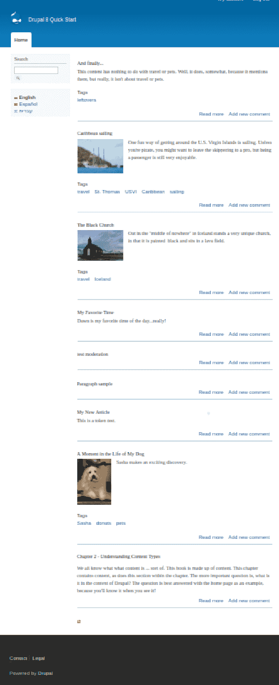
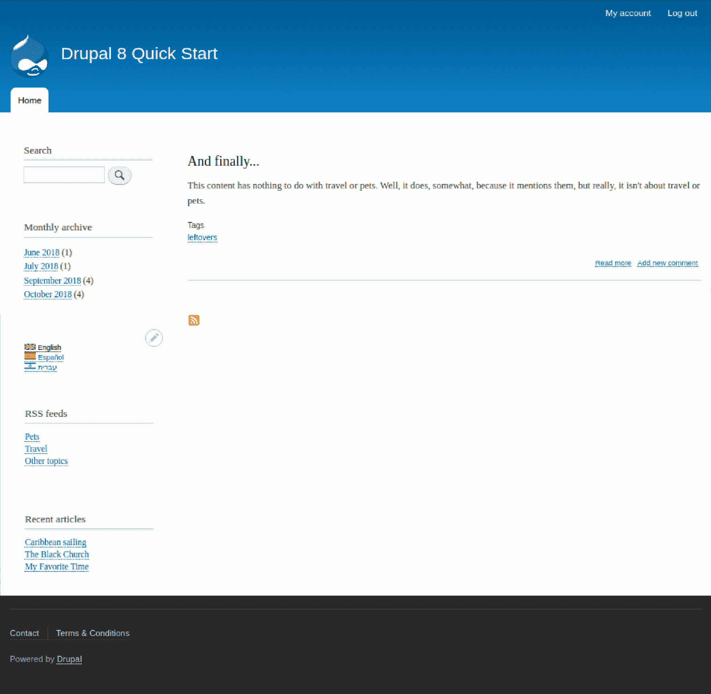

# 欢迎回家！

到目前为止，在这本书中，我们已经学习了快速搭建 Drupal 网站所需做的许多事情：创建内容类型、字段和内容；管理用户；添加模块；提供翻译；以及为其他网站创建内容源。在所有这些主题中，还有一些内容尚未涉及，当我们查看我们的主页时这一点就变得很明显。

# 糟糕的主页！

如下截图所示，我们的主页有很多问题：

一些与设计相关的内容超出了本书的范围，但还有一些我们可以解决。让我们列出我们主页上存在的问题：

+   内容过多！

+   没有访问主页之外的内容

+   我们的 RSS 源菜单需要添加

+   页脚菜单显示的是“法律”而不是“条款和条件”

+   “法律”链接会返回到主页

# 设计改进

接下来，让我们看看我们的列表，考虑一下存在的不足以及如何加以改进。

# 内容过多！

当然，Drupal 是一个内容管理系统，但这并不意味着所有内容都应该放在主页上。内容太多，显得杂乱无章。最好只展示一个完整的内容或少数几个简介。

有一个视图提供了主页内容的选取。它的默认行为是包括所有通过勾选“提升到首页”复选框而被提升的内容。因此，我们可以通过限制这些被提升内容的数量来限制显示的内容数量。让我们有点创意。

我们将限制简介只显示最新被提升的内容，并创建一个块，提供其他内容的链接列表。

# 没有内容访问权限

这是第一个问题的反面。如果我们打算展示最新内容以及一些其他内容列表中的内容，那么那些比这更早的内容怎么办？这是一个适合使用与博客中常见的相同解决方案的困境：存档。我们将创建一个来展示更早的内容。

# 没有 RSS 源菜单

这是一个容易解决的问题。我们已经创建了一个自定义块，为我们的 RSS 源提供了一个菜单。我们所需做的只是将这个块放置在主页上。

# 我们需要一个“条款和条件”页面

页脚菜单中的“法律”链接会返回到主页。我们将将其更改为我们想要的标题，并创建一个页面来链接到它。

# 进行更改

现在我们有了计划，让我们开始忙碌起来！

# 改进首页视图

导航到 *结构* | *视图* (`/admin/structure/views`)。向下滚动到 *首页* 视图。这是 Drupal 附带的一个视图。我们可以对其进行修改，但保留原始视图不变，而是创建一个副本进行修改，这正是我们在这里要做的：

1.  从其行中的下拉菜单中选择*复制*。

1.  在随后出现的“视图名称”文本框中，将名称更改为“首页 - 自定义”并点击*复制*。

1.  在视图配置页面，我们将更改视图显示的项目数量。它目前配置为显示 10 个项目和一个分页器，但我们将将其更改为只显示一个。点击*全部*并从下拉菜单中选择*此页（覆盖）*。选择*显示指定数量的项目*的设置，然后点击*应用（此显示）*。

1.  在*分页器选项*对话框中，将*每页项目数*更改为`1`，点击*应用*，然后点击*保存*。

1.  返回到`/admin/structure/views`的视图列表。如果你查看列表，你会看到原始的*首页*和我们的*自定义首页*都有相同的路径。

1.  由于技术原因，路径需要是`/node`，但我们不能有两个视图响应相同的路径。因此，在原始首页的行中，从下拉菜单中选择*禁用*。

1.  此更改将确保只显示最新内容。让我们编辑我们的新视图，以便我们可以向其中添加额外的显示。当前的显示是为首页，但我们还想要一个提供额外内容标题链接块的显示。

1.  在其配置页面，点击显示面板中的*添加*按钮，并选择*块*。

# 标题

点击*标题*链接，从下拉菜单中选择*此块（覆盖）*。然后在弹出窗口中输入`Recent articles`，点击*应用（此显示）*。

# 格式

点击*内容*链接，从下拉菜单中选择*此块（覆盖）*。然后，选择*字段*并点击*应用（此显示）*。在随后的弹出窗口中，点击*应用*。

# 字段

到目前为止，我们已经告诉视图我们想要输出一个列表，并且我们想要能够选择列表中将包含的字段，但我们还没有选择任何字段。视图不喜欢这样，并且它没有帮助我们，给出了一个空输出。让我们让视图知道我们想要一个包含链接回内容的标题列表。

点击*添加*按钮。从下拉菜单中选择*此块（覆盖）*，向下滚动并勾选*标题*复选框，然后点击*应用（此显示）*。在随后的弹出窗口中，点击*应用（此显示）*。

# 筛选条件

有多个筛选条件生效，但我们还想根据内容类型进行筛选，限制为文章。

点击*添加*按钮，从下拉菜单中选择*此块（覆盖）*，向下滚动并勾选*内容类型*复选框，然后点击*应用（此显示）*。在随后的弹出窗口中，勾选*文章*复选框，然后点击*应用（此显示）*。

# 块设置

在“*块名称*”旁边点击*无*，在文本框中输入`Recent articles`，然后点击*应用*。

# 分页器

点击*10 个项目*，将`10`更改为`3`，设置偏移量为`1`，然后点击*应用*。这告诉视图使用最新文章之后的三个最新文章。我们忽略最新的原因是它将作为主要内容区域中的预告出现，所以我们不希望其标题也出现在块中。

这就完成了我们的块。别忘了点击*保存*。

导航到 *结构* | *区块布局* (`/admin/structure/block`)。在 *侧边栏第一* 部分，点击 *放置区块*。然后，在 *最近文章* 行中点击 *放置区块*，然后点击 *保存区块*。

# 添加存档

导航到 *结构* | *视图* (`/admin/structure/views`)，向下滚动到 *禁用* 部分，并启用 *存档* 视图。

导航到 *结构* | *区块布局* (`/admin/structure/views`)，在 *侧边栏第一* 部分。然后，点击 *放置区块*，在 *存档* 行中向下滚动。在这里，点击 *放置区块*，然后点击 *保存区块* 按钮。

# 添加 RSS 源菜单

之前，我们在视图中创建了一个 RSS 源区块显示。现在让我们将这个区块添加到我们的主页上。

导航到 *结构* | *区块布局* (`/admin/structure/views`)。在 *侧边栏第一* 部分，点击 *放置区块*。然后，在 *RSS 源* 行中向下滚动，点击 *放置区块*，最后点击 *保存区块* 按钮。

# 修复页脚菜单

我们想修复法律链接。我们需要修复的事情之一是它目前链接到主页而不是条款和条件页面。除非路径已经存在，否则 Drupal 不会允许为菜单项指定路径。因此，我们需要首先创建一个条款和条件页面。

导航到内容 | 创建内容 (`/node/add`) 并选择基本页面作为内容类型。在标题文本框中输入 `条款和条件`。我们现在不会输入法律术语，但暂时在正文中输入 `占位符`。点击 URL 路径设置选项卡，输入 `/termsandconditions`，然后点击保存。

导航到 *结构* | *菜单* (`/admin/structure/menu`)，点击页脚菜单的编辑菜单按钮。

点击法律链接的编辑按钮，将标题从法律改为条款和条件。对于链接，输入“条款”，然后当自动完成字段提供内容标题时，点击它。在描述文本框中输入 `T's & C's` 并点击保存。

这完成了我们的改进。

# 摘要

在本章中，我们学习了如何通过编辑视图、提供存档和最近内容区块以及更改页脚菜单来改进一个弱的主页。

这完成了 *Drupal 8 快速入门*。我希望这本书能帮助你将网站搭建起来并运行，同时也帮助你理解基本的 Drupal 功能。感谢阅读！
