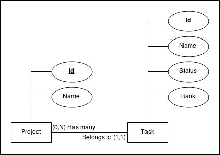
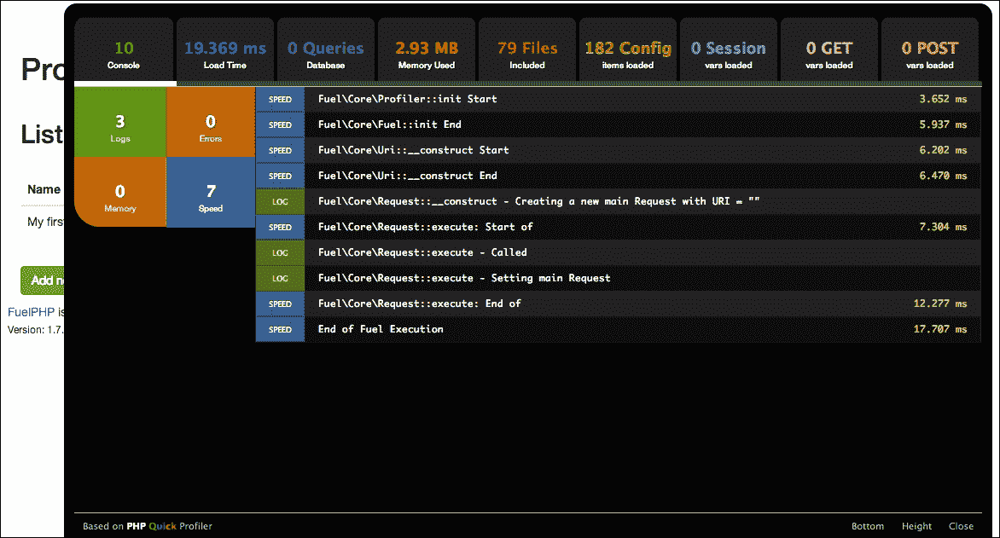
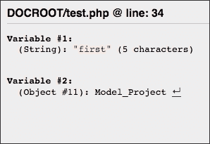
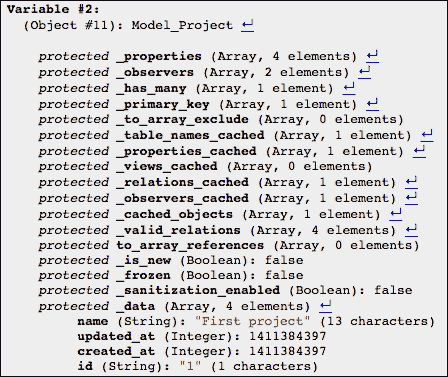

# 第二章. 构建待办事项列表应用程序

在上一章中，我们看到了 FuelPHP 框架的一些基础知识，但还有许多东西需要学习才能感到舒适。在这里，我们将创建我们的第一个真实世界应用程序，以便更深入地了解 FuelPHP 的主要功能。我们将创建一个待办事项列表应用程序，这是介绍框架时的常见训练示例。再次强调，这不会是一个非常复杂的应用程序，但这个项目将作为介绍 FuelPHP 基本组件的基础。

到本章结束时，你应该了解以下内容：

+   **实体关系图**（**ER**）是什么

+   分析器是什么以及如何使用它

+   如何使用`Debug`类

+   **对象关系映射器**（**ORM**）是什么以及如何在项目中使用它

+   如何使用`Model_Crud`和`Model_Orm`的基本操作

+   ORM 关系

+   观察者是什么以及如何使用它们

+   如何处理 Ajax 请求

我们在这里假设你已经阅读了第一章，*构建你的第一个 FuelPHP 应用程序*，因为框架的基本内容已经在那里解释过了。我们还将使用 JavaScript 和 jQuery 来改进待办事项列表的用户界面。由于本书面向中级网络开发者，我们假设你对这些技术有一定的了解。如果不是这样，不要担心，我们将非常轻量地使用它们，你可以在网上找到大量关于这些工具的资源。

# 规范

首先，让我们定义我们的最终应用程序应该期望的内容如下：

+   创建一个待办事项列表来监控项目的进度。一个项目通过名称描述，并具有许多任务（待办事项列表）。我们在这里假设用户可能有多个同时进行的项目，因此可以创建和管理尽可能多的项目。每个项目也可以被删除。

+   一个任务通过名称和布尔状态（“完成”或“未完成”）来描述。

+   任务在项目中排序，并且用户应该能够通过拖放轻松地在列表中移动项目。

这仍然是一个简单的应用程序，我们不会支持任何隐私功能，例如身份验证（这将在第三章，*构建博客应用程序*和第五章，*构建你自己的 RESTful API*中解决）。

# 概念

此步骤应该从规范阶段开始非常直接。我们将生成以下两个模型：

+   **项目**：此模型将只具有一个名称属性。

+   **任务**：此模型将具有名称、状态和排名属性。一个项目包含许多任务，每个任务都与一个项目相关联，因此我们将在这里添加一个额外的列，命名为`project_id`。此列将包含与每个任务关联的项目的 ID。

我们可以用以下**ER**图来表示我们的模型：



实体关系图（最小-最大表示法）

一个 **ER** 图可以帮助你描述应用程序的数据结构。正如你所注意到的，我们之前写的几乎所有内容都可以在图中找到：

+   模型（在 ER 图中称为实体），由矩形表示

+   模型的属性（称为属性），由省略号表示（主键被下划线标注）并通过线与模型相连

+   模型之间的关系，由一个模型到另一个模型的线表示

我们使用了最小-最大表示法来表示关系。以下是理解它的方法：

在连接 **Project** 模型和 **Task** 模型的线上，你可以看到 **Project** 矩形旁边写着 **(0, N) Has many**，而 **Task** 矩形旁边写着 **Belongs to (1, 1)**。图上你可以读到的 **(0, N)** 和 **(1, 1)** 代表了一个实例可以链接的最小和最大元素数量：在我们的例子中，一个项目可以链接到任意数量的任务（介于 *0* 和 *N* 之间），而一个任务只能链接到一个项目（介于 *1* 和 *1* 之间）。**(0, N)** 和 **(1, 1)** 旁边的文本是关系的名称。在这里，我们简单地使用了我们将要使用的 FuelPHP 关系类型（我们将在 *ORM 关系* 部分解释这些关系）。即使是非程序员也可以通过以下方式阅读它：“每个项目都有多个任务”，“每个任务属于一个项目”。

如果你难以理解如何组织你的数据，画一个 ER 图可能很有用。我们将在接下来的章节中使用这个图，如果你想要理解具有许多模型及其之间关系的复杂数据结构，特别推荐你阅读。建议你在此主题上阅读更多内容，请参阅 [`en.wikipedia.org/wiki/Entity-relationship_model`](http://en.wikipedia.org/wiki/Entity-relationship_model)。

# FuelPHP 的安装和配置

你首先需要：

+   安装一个新的 FuelPHP 实例

+   配置 Apache 和你的主机文件以处理它：在本章中，我们将通过请求 URL `http://mytodolists.app` 来访问我们的应用程序

+   如有必要，更新 Composer

+   为你的应用程序创建一个新的数据库

+   并配置 FuelPHP 以允许你的应用程序访问此数据库

这些步骤已在 第一章，*构建你的第一个 FuelPHP 应用程序* 中介绍，所以你可能想看看它。

此项目还需要 ORM 包，由于它已经安装，我们只需要启用它。为此，只需打开 `APPPATH/config/config.php` 文件，并在返回数组的末尾插入以下内容：

```php
  'always_load'  => array(
    'packages'  => array(
      'orm',
    ),
  ),
```

或者，你可以取消注释适当的行。这将每次加载 FuelPHP 实例时都加载 ORM 包。

### 注意

你也可以使用 `Package::load` 方法以临时方式加载一个包。这将在 第三章，*构建博客应用程序* 中介绍。

# 脚手架

我们现在将生成，正如在第一章中看到的，*构建你的第一个 FuelPHP 应用程序*，处理我们的对象所需的必要代码。

让我们先生成项目模型的结构：

```php
php oil generate scaffold/orm project name:string

```

命令应打印以下输出：

```php
Creating migration: APPPATH/migrations/001_create_projects.php
Creating model: APPPATH/classes/model/project.php
Creating controller: APPPATH/classes/controller/project.php
Creating view: APPPATH/views/project/index.php
Creating view: APPPATH/views/project/view.php
Creating view: APPPATH/views/project/create.php
Creating view: APPPATH/views/project/edit.php
Creating view: APPPATH/views/project/_form.php
Creating view: APPPATH/views/template.php

```

注意，我们在第一章中使用了`scaffold/orm`而不是`scaffold/crud`：这样，Oil 将生成使用 ORM 包的代码文件。例如，我们将在后面看到生成的模型将扩展`Orm\Model`而不是`Model_Crud`。

我们现在需要生成管理我们的任务所需的模型。我们在这里不会使用 scaffold，因为我们计划在项目的可视化页面上管理任务，所以我们只需要模型。

```php
php oil generate model/orm task name:string status:boolean rank:int project_id:int

```

此命令应打印以下输出：

```php
Creating model: APPPATH/classes/model/task.php
Creating migration: APPPATH/migrations/002_create_tasks.php

```

如你所见，我们在这里只生成了模型和迁移文件。你现在需要做的就是执行迁移文件：

```php
php oil refine migrate

```

# 路由配置

你现在可以通过请求 URL `http://mytodolists.app/project`来管理你的项目。

由于这是我们的人口点，我们希望在请求根 URL `http://mytodolists.app/`时访问此页面。

正如我们在第一章中看到的，*构建你的第一个 FuelPHP 应用程序*，你只需要编辑`APPPATH/config/routes.php`配置文件。将`'_root_' => 'welcome/index'`替换为`'_root_' => 'project/index'`。

# 分析器

由于我们将在下一节需要分析器，所以我们在这里介绍它。FuelPHP 提供了一个分析器，它允许你在请求网页时了解正在发生的事情。它确实可以显示许多性能指标、执行的 SQL 请求、当前日志、会话以及 POST / GET 变量。

你将需要激活它。在开发模式下仅使用此工具是明智的，因为否则可能会出现严重的安全问题。为此，你首先需要创建`APPPATH/config/development/config.php`配置文件，并写入以下内容：

```php
<?php

return array(
    'profiling'  => true,
);
```

你还需要编辑`APPPATH/config/development/db.php`配置文件，以便查看数据库查询（否则分析器不会显示它们）：在`default`数组的末尾添加`'profiling' => true,`。

如果你现在请求你的根 URL `http://mytodolists.app/`，你将在屏幕的右下角看到一个标记为**代码分析器**的黑色矩形。如果你点击它，你应该看到以下内容：



以下描述了你可以访问的几个标签页：

+   **注意控制台**（**NB**代表日志数量）：此标签页显示所有日志。例如，如果你在项目控制器的索引操作开始处添加`Log::info('Index Action', 'This is a test');`，然后刷新网页，你应该在这个标签页中看到一个新条目出现。

+   **TIME 加载时间**（**TIME** 表示网页总加载时间）：此选项卡显示与时间标记相关的日志。请注意，这些日志也出现在第一个选项卡中。例如，如果你在项目控制器的索引动作的开始处添加 `Profiler::mark('Index Action');`，你应该会看到此选项卡中出现一个新项目。

+   **NB 查询数据库**（**NB** 表示查询数量）：此选项卡显示在加载网页时执行的数据库查询。对于每个查询，其分析和调用跟踪都会显示。还会显示重复次数，你可以通过查看 **Speed** 旁边的 **DUPLICATE** 单词来识别似乎重复前一个查询的查询。

+   **SIZE 内存使用量**（**SIZE** 表示使用的内存量）：此选项卡显示与内存标记相关的日志。请注意，这些日志也出现在第一个选项卡中。例如，如果你在项目控制器的索引动作的开始处添加 `Profiler::mark_memory($this, 'Controller_Project 对象');`，你应该会看到此选项卡中出现一个新项目。

+   **NB 包含的文件**（**NB** 表示文件数量）：此选项卡显示为显示网页而加载的所有文件（代码或配置）。

+   **NB 配置项已加载**（**NB** 表示项目数量）：此选项卡显示已加载的配置项（而非文件）。例如，如果你加载一个包含 5 个键的关联数组的配置文件，此选项卡中将出现 5 个新项目。

+   **NB 会话变量已加载**，**NB GET 变量已加载**，**NB POST 变量已加载**：这些选项卡显示请求和会话变量。例如，如果你请求 `http://mytodolists.app/?param=test`，**NB GET 变量已加载** 选项卡中应该会出现一个新项目。

# 模型、关系和 ORM

我们现在已经完成了初步步骤：我们安装了 FuelPHP，进行了配置，生成了用于管理项目的脚手架，并创建了任务模型。但我们没有连接这两个模型，我们还没有在任何地方显示任务。更重要的是，我们还没有解释如何加载对象，直到现在。本节的目标就是这一点。

## CRUD 和 ORM 之间的区别

如我们之前所述，我们使用油来生成代码，但与第一章中使用的 `scaffold/crud` 不同，我们使用了 `scaffold/orm` 和 `model/orm`。如果你查看文件（控制器、视图和模型），你将只会看到一些细微的变化，除了模型文件：

+   `$_table_name` 属性不再声明。尽管如此，它仍然被 `Orm\Model` 使用，但它采用一个默认值，该值取决于模型名称，因此如果你想要使用自定义表名，你仍然可以定义它。

+   已添加`$_properties`属性。此属性包含模型必须管理的所有属性（与表列相关联）。定义此属性不是强制性的，但如果不这样做可能会降低网站性能，因为 FuelPHP 需要将模型与表结构同步。请注意，`Model_Crud`也使用此属性，但油生成的代码简单地没有定义它。

+   还添加了`$_observers`属性。此属性定义了使用的观察者和它们的参数。我们将在下一节中解释观察者是什么以及如何使用它们。

## FuelPHP ORM

ORM 代表对象关系映射器。它允许开发者完成以下两件事：

+   它将表行映射到对象。为此，ORM 提供了几个函数来提取特定的表行并将它们转换为 PHP 对象。其他方法也存在，允许开发者将对象保存到表行中。`find`和`save`方法都是例子。

+   它允许你在模型之间建立关系。在本章的项目中，我们创建了两个模型，**项目**和**任务**，它们之间存在一种关系：一个项目可以有多个任务，每个任务都与一个项目相关联。当将这些关系定义给 ORM 时，它将启用方法，使开发者能够更轻松地访问项目任务，例如。

简而言之，ORM（对象关系映射）的目的在于简化开发者的工作。除了前面提到的两个主要点之外，ORM 还将处理一些安全问题（例如 SQL 注入）以及可能影响某些属性保存方式的观察者。一般来说，FuelPHP 的 ORM 紧密遵循活动记录模式。

### 数据库和 ORM 基础

注意，我们将要使用的大多数方法都是在`Orm/Model`以及`Model_Crud`上工作的。

首先，我们需要创建一个 PHP 文件来测试我们的代码。在这里，我们可以使用油控制台，在大多数情况下你应该这样做，但在这个例子中我们不会这样做，因为我们想看到执行的 SQL 请求（我们计划使用分析器来完成这项工作）。请注意，此文件不应推送到生产环境中。创建一个位于`public/test.php`的文件，内容如下：

```php
<?php

// Fuel initialization (inspired from index.php)
define('DOCROOT', __DIR__.DIRECTORY_SEPARATOR);
define('APPPATH', realpath(__DIR__.'/../fuel/app/')
                    .DIRECTORY_SEPARATOR);
define('PKGPATH', realpath(__DIR__.'/../fuel/packages/')
                    .DIRECTORY_SEPARATOR);
define('COREPATH', realpath(__DIR__.'/../fuel/core/')
                    .DIRECTORY_SEPARATOR);
defined('FUEL_START_TIME') or define('FUEL_START_TIME', 
                                     microtime(true));
defined('FUEL_START_MEM') or define('FUEL_START_MEM',
                                    memory_get_usage());
require COREPATH.'classes'.DIRECTORY_SEPARATOR.'autoloader.php';
class_alias('Fuel\\Core\\Autoloader', 'Autoloader');
require APPPATH.'bootstrap.php';

echo 'FuelPHP is initialized...';
```

之前的代码初始化了 FuelPHP（当你有一个位于公共文件夹中的 PHP 脚本并且你想使用 FuelPHP 功能时是必要的）。此脚本应在请求以下 URL 时可用，并应显示**FuelPHP 已初始化...**：`http://mytodolists.app/test.php`。

接下来的所有示例都必须逐个追加到文件中。对于那些还没有使用任何 ORM 的您，建议您在每个部分内追加代码，刷新，并深入查看网页输出和性能分析器中的执行查询。请注意，这只是一个介绍；要了解更多关于 ORM 的信息，建议您阅读官方文档[`fuelphp.com/docs/packages/orm/intro.html`](http://fuelphp.com/docs/packages/orm/intro.html)。

#### 不使用 ORM 执行查询

您首先应该知道，您可以在不使用 ORM 的情况下执行查询。使用 ORM 是为了简化您的生活，但它不是强制性的。在某些情况下，例如影响多行的更改，您甚至不应该使用 ORM。另一个例子是当您想要清空一个表时：

```php
// --- Executing queries without the ORM
\DB::query('TRUNCATE TABLE `projects`;')->execute();
\DB::query('TRUNCATE TABLE `tasks`;')->execute();
// \DBUtil::truncate_table('projects'); is also possible
```

#### 创建新对象

以下示例展示了如何创建新的项目：

```php
// --- Creating new objects
$project = Model_Project::forge(); // = new Model_Project()
$project->name = 'First project';
$project->save();

// You can also set properties when calling the forge method
$project = Model_Project::forge(
    array('name' => 'Second project')
);
$project->save();
```

#### 查找特定对象

这就是如何在表中找到第一个对象：

```php
// --- Finding specific objects
$project = Model_Project::find('first');
\Debug::dump('first', $project);
```

如果您现在刷新您的网页，您应该会看到一个以下灰色框：



如果您通过点击 **↵** 展开**Model_Project**，然后点击 **_data**，您应该会看到这确实是第一个项目：



如果您查看控制台，您也可以通过看到执行的 SQL 请求来确认这一点：

```php
SELECT … FROM `projects` AS `t0` ORDER BY `t0`.`id` ASC
LIMIT 1
```

您也可以加载最后一个对象：

```php
$project = Model_Project::find('last');
\Debug::dump('last', $project);
```

执行的请求应该是这样的：

```php
SELECT … FROM `projects` AS `t0` ORDER BY `t0`.`id` DESC
LIMIT 1
```

或者，您可以通过指定 ID 来加载一个项目：

```php
$project = Model_Project::find(1);
\Debug::dump('with id = 1', $project);
```

您可以在此处注意到没有执行任何请求。这是因为 ORM 缓存了加载的对象，项目已经在之前的请求中加载过了。否则，以下请求应该被执行：

```php
SELECT … FROM `projects` AS `t0` WHERE `t0`.`id` = 1
LIMIT 1
```

#### 更新对象

这里是如何更新现有对象（在这里，我们更改 `id = 1` 的项目名称）：

```php
// --- Updating an object
$project = Model_Project::find(1); // Load project with id = 1
$project->name = 'First one';
$project->save();
```

执行请求：

```php
UPDATE `projects` SET `name` = 'First one' WHERE `id` = '1'
```

#### 删除对象

我们可以通过调用以下方式删除一个项目：

```php
// --- Deleting an object.
$project = Model_Project::find(1); // Load project with id = 1
$project->delete();
```

执行请求：

```php
DELETE FROM `projects` WHERE `id` = '1' LIMIT 1
```

#### 加载多个对象

我们可以一次性加载多个对象。以下示例展示了如何加载所有项目实例：

```php
// --- Loading several objects
// First creating an additional project for a more interesting
// result
$project = Model_Project::forge();
$project->name = 'Third project';
$project->save();

// Finding all projects
$projects = Model_Project::find('all');
\Debug::dump('all', $projects);
```

在这种情况下，`$projects` 将是一个包含项目的关联数组，键是项目的 ID，值是相关联的项目。执行的请求如下：

```php
SELECT … FROM `projects` AS `t0`
```

#### 使用方法链

`query` 方法是 `find` 方法的等价物，但它允许您使用方法链获取对象。

这里是如何使用 `query` 方法找到所有项目实例的：

```php
$projects = Model_Project::query()->get();
\Debug::dump('all (using query)', $projects);
```

执行的请求与之前执行的相同：

```php
SELECT … FROM `projects` AS `t0`
```

#### 更复杂的请求

您也可以执行更复杂的请求。首先，让我们添加各种任务：

```php
// Creating sample tasks
Model_Task::forge(array('name' => 'Marketing plan',
    'status' => 0, 'rank' => 0, 'project_id' => 2))->save();

Model_Task::forge(array('name' => 'Update website',
    'status' => 1, 'rank' => 1, 'project_id' => 2))->save();

Model_Task::forge(array('name' => 'Improve website template',
    'status' => 1, 'rank' => 2, 'project_id' => 2))->save();

Model_Task::forge(array('name' => 'Contact director',
    'status' => 0, 'rank' => 0, 'project_id' => 3))->save();

Model_Task::forge(array('name' => 'Buy a new computer',
    'status' => 1, 'rank' => 1, 'project_id' => 3))->save();
```

现在我们已经创建了各种任务，我们将能够测试 `find` 方法的第二个参数。

让我们获取 `project_id = 2` 的第一个任务：

```php
$task = Model_Task::find('first',
    array(
        'where' => array(
            array('project_id' => 2)
        )
    )
);
\Debug::dump('first with project_id = 2', $task);
```

或者使用 `query` 方法：

```php
$task = Model_Task::query()
    ->where('project_id', 2)
    ->order_by('id', 'asc') // Will be introduced shortly
    ->get_one();
\Debug::dump('first with project_id = 2 (using query)', $task);
```

执行请求：

```php
SELECT … FROM `tasks` AS `t0` WHERE (`t0`.`project_id` = 2)
ORDER BY `t0`.`id` ASC LIMIT 1
```

现在，让我们获取所有 `project_id = 2` 的任务：

```php
$tasks = Model_Task::find('all',
    array(
        'where' => array(
            array('project_id' => 2)
        )
    )
);
\Debug::dump('project_id = 2', $tasks);
```

或者使用 `query` 方法：

```php
$tasks = Model_Task::query()
    ->where('project_id', 2)
    ->get();
\Debug::dump('project_id = 2 (using query)', $tasks);
```

执行请求：

```php
SELECT … FROM `tasks` AS `t0` WHERE (`t0`.`project_id` = 2)
```

也可以通过 `project_id = 2` 和 `status = 1` 获取所有任务：

```php
$tasks = Model_Task::find('all',
    array(
        'where' => array(
            array('project_id' => 2),
            array('status' => 1)
        )
    )
);
\Debug::dump('project_id = 2 & status = 1', $tasks);
```

或者使用 `query` 方法：

```php
$tasks = Model_Task::query()
    ->where('project_id', 2)
    ->where('status', 1)
    ->get();
\Debug::dump('project_id = 2 & status = 1 (using query)', $tasks);
```

执行的请求：

```php
SELECT … FROM `tasks` AS `t0` WHERE (`t0`.`project_id` = 2)
AND (`t0`.`status` = 1)
```

这是我们获取所有 `project_id > 2` 和 `status = 1` 的任务的示例：

```php
$tasks = Model_Task::find('all',
    array(
        'where' => array(
            array('project_id', '>', 2),
            array('status' => 1)
        )
    )
);
\Debug::dump('project_id > 2 & status = 1', $tasks);
```

或者使用 `query` 方法：

```php
$tasks = Model_Task::query()
    ->where('project_id', '>', 2)
    ->where('status', 1)
    ->get();
\Debug::dump('project_id > 2 & status = 1 (using query)', $tasks);
```

执行的请求：

```php
SELECT … FROM `tasks` AS `t0` WHERE `t0`.`project_id` > 2
AND (`t0`.`status` = 1)
```

这是我们获取 `project_id > 2` 或 `status = 1` 的任务的示例：

```php
$tasks = Model_Task::find('all',
    array(
        'where' => array(
            array('project_id' => 2),
            'or' => array('status' => 1)
        )
    )
);
\Debug::dump('project_id = 2 or status = 1', $tasks);
```

或者使用 `query` 方法：

```php
$tasks = Model_Task::query()
    ->where('project_id', '=', 2)
    ->or_where('status', 1)
    ->get();
\Debug::dump('project_id = 2 or status = 1 (query)', $tasks);
```

执行的请求：

```php
SELECT … FROM `tasks` AS `t0` WHERE (`t0`.`project_id` = 2) OR ((`t0`.`status` = 1))
```

这是我们获取名称包含单词 `website` 的任务的示例：

```php
$tasks = Model_Task::find('all',
    array(
        'where' => array(
            array(
                'name',
                'LIKE',
                '%website%'
            ),
        )
    )
);
\Debug::dump('name contains "website"', $tasks);
```

或者使用 `query` 方法：

```php
$tasks = Model_Task::query()
    ->where('name', 'LIKE', '%website%')
    ->get();
\Debug::dump('name contains "website" (using query)', $tasks);
```

执行的请求：

```php
SELECT … FROM `tasks` AS `t0` WHERE `t0`.`name` LIKE
'%website%'
```

你也可以指定一个排序：

```php
$tasks = Model_Task::find('all',
    array(
        'where' => array(
            array(
                'name',
                'LIKE',
                '%website%'
            ),
        ),
        'order_by' => array(
            'rank' => 'ASC'
        ),
    )
);
\Debug::dump(
    'name contains "website" ordered by the rank column',
    $tasks
);
```

或者使用 `query` 方法：

```php
$tasks = Model_Task::query()
    ->where('name', 'LIKE', '%website%')
    ->order_by('rank', 'ASC')
    ->get();
\Debug::dump(
    'name contains "website" ordered by the rank column (query)',
    $tasks
);
```

执行的请求：

```php
SELECT … FROM `tasks` AS `t0` WHERE `t0`.`name` LIKE
'%website%' ORDER BY `t0`.`rank` ASC
```

你可能已经注意到，使用 `query` 方法通常可以使你编写更简洁、更易读的代码。因此，建议你在复杂请求中使用 `query` 方法。然而，在大多数情况下，使用 `find` 或 `query` 并没有太大区别，所以请根据你的最佳判断来使用。

如前所述，这只是一个对 ORM 的非常简单的介绍。除了 `where` 和 `order_by` 之外，还有很多其他键，我们稍后会看到一些（例如 `related` 键）。建议你查看 ORM 包的官方文档，该文档可在以下链接找到：[`fuelphp.com/docs/packages/orm/intro.html`](http://fuelphp.com/docs/packages/orm/intro.html)。

我们还使用了 `Debug` 和 `DB` 类。了解它们可能会有所帮助。再次提醒，你可以自由地阅读它们的官方文档，这些文档可以在以下链接找到：

+   [`fuelphp.com/docs/classes/debug.html`](http://fuelphp.com/docs/classes/debug.html)

+   [`fuelphp.com/docs/classes/database/db.html`](http://fuelphp.com/docs/classes/database/db.html)

### ORM 关系

是时候定义任务和项目之间的关系了。正如我们之前解释的，定义它们可以激活有用的功能，使开发者的工作变得容易并提高性能。关系必须在模型内部定义。例如，我们将在 **Project** 模型中定义一个关系，以便访问每个项目的任务，我们还将也在 **Task** 模型中定义另一个关系，以便访问每个任务关联的项目。有 4 种关系类型：

+   **属于**：当你定义模型 A 对模型 B 的 *属于* 关系时，每个模型 A 的实例只能与一个模型 B 的实例相关联。你通常需要在模型 A 的表中创建一个列，用于连接实例。在本章中，**Task** 模型与 **Project** 模型有一个 *属于* 关系。确实，每个任务只与一个项目相关联，而任务表中的 `project_id` 列用于连接每个实例。一个具体的例子是，`project_id = 1` 的任务将属于 `id = 1` 的项目。

+   **拥有多个**：当你在模型 A 中对模型 B 定义一个 *拥有多个* 关系时，每个模型 A 的实例可以与多个模型 B 的实例相关联。你通常需要在模型 B 的表中创建一个用于连接实例的列。在本章中，**项目**模型与**任务**模型有一个 *拥有多个* 关系；确实，每个项目可以有多个任务，并且任务表中的 `project_id` 列用于连接每个实例。一个具体的例子是，`id = 1` 的项目可以有多个 `project_id = 1` 的任务。

+   **拥有一个**：理解这种关系的一种方式是将其视为一个 *拥有多个* 关系的特例，除了每个模型 A 的实例只能与一个模型 B 的实例相关联。如果我们定义了**项目**模型对**任务**模型的 *拥有一个* 关系（而不是拥有多个），我们仍然需要在任务表中定义 `project_id` 列，但在那种情况下，每个项目只能关联一个任务。

+   **多对多**：当你在模型 A 中对模型 B 定义一个 *多对多* 关系时，每个模型 A 的实例可以与多个模型 B 的实例相关联，并且每个模型 B 的实例也可以与多个模型 A 的实例相关联。在这种情况下，你需要创建一个中间表。

建议您阅读关于关系的官方文档，链接为 [`fuelphp.com/docs/packages/orm/relations/intro.html`](http://fuelphp.com/docs/packages/orm/relations/intro.html)。

#### 在模型内定义关系

现在我们已经介绍了不同类型的关系，让我们在我们的模型中定义它们。

首先，打开 `APPPATH/classes/model/task.php` 并在 `Model_Task` 类中添加以下属性：

```php
protected static $_belongs_to = array('project');
```

注意，这等同于以下代码：

```php
protected static $_belongs_to = array(
    'project' => array(
        'model_to'          => 'Model_Project',
        'key_from'          => 'project_id',
        'key_to'            => 'id',
        'cascade_save'      => true,
        'cascade_delete'    => false,
    )
);
```

在第一种情况下，`model_to`、`key_from` 和 `key_to` 键是从数组值（`'project'`）推断出来的。如果没有定义，`cascade_save` 的默认值是 `true`，而 `cascade_delete` 的默认值是 `false`。这些键定义了以下关系特征：

+   `model_to` 键：关系（模型 B）

+   `key_from` 键：用于连接实例的模型（模型 A）的列

+   `key_to` 键：关系（模型 B 的）列中用于连接实例的模型

+   `cascade_save` 键：如果为真，每次保存模型实例时，相关的实例也将被保存

+   `cascade_delete` 键：如果为真，每次删除模型实例时，相关的实例也将被删除。请注意此功能，因为您可能会删除比实际想要的更多信息。

现在，打开 `APPPATH/classes/model/project.php` 并在 `Model_Project` 类中添加以下属性：

```php
protected static $_has_many = array('tasks');
```

与 `belongs_to` 关系一样，它等同于以下代码：

```php
protected static $_has_many = array(
    'tasks' => array(
        'model_to'          => 'Model_Task',
        'key_from'          => 'id',
        'key_to'            => 'project_id',
        'cascade_save'      => true,
        'cascade_delete'    => false,
    )
);
```

#### 测试关系

为了更好地说明这一点，让我们通过在我们的 `public/test.php` 文件中添加代码来测试这些关系的工作方式。

##### 获取对象的关联

首先让我们加载一个`id = 1`的任务实例，然后加载其相关项目。你可以注意到我们设置了`from_cache`参数为`false`。这样做是为了防止 FuelPHP 从缓存中加载实例，因为我们想显示所有已执行的请求。在大多数情况下，不建议使用此参数。

```php
$task = Model_Task::find(1, array('from_cache' => false));
$project = $task->project;
\Debug::dump('Project of task with id = 1', $project);
```

在第二行，我们通过访问`project`属性加载了任务的项目。这是我们声明在`Model_Task`类中的关系名称。一般来说，如果你想通过关系`RELATION_NAME`访问相关实例，你可以使用`$item->RELATION_NAME`来获取它。

你可以看到以下两个请求被执行了：

1.  第一次请求是在`find`方法中执行的，目的是加载`id = 1`的任务。

    ```php
    SELECT … FROM `tasks` AS `t0` WHERE `t0`.`id` = 1
       LIMIT 1
    ```

1.  第二次请求是在获取`$task->project`时执行的：在这种情况下，检索了`id = $task->project_id`的项目：

    ```php
    SELECT … FROM `projects` AS `t0` WHERE `t0`.`id` =
       '2' LIMIT 1
    ```

让我们加载一个`id = 2`的项目实例，然后加载其相关任务：

```php
$project = Model_Project::find(
    2,
    array('from_cache' => false)
);
$tasks = $project->tasks;
\Debug::dump('Tasks of project with id = 2', $tasks);
```

执行了两次请求：

1.  第一次请求加载项目的实例：

    ```php
    SELECT … FROM `projects` AS `t0` WHERE `t0`.`id` = 2
       LIMIT 1
    ```

1.  第二次请求加载了项目关联的任务：

    ```php
    SELECT … FROM `tasks` AS `t0` WHERE
       `t0`.`project_id` = '2'
    ```

当定义关系时，`find`方法允许你通过减少 SQL 请求的数量来提高性能。例如，如果你这样做：

```php
$projects = Model_Project::find(
    'all',
    array('from_cache' => false)
);
foreach ($projects as $project) {
    \Debug::dump(
        'LOOP 1: Tasks of project with id = '.$project->id,
        $project->tasks
    );
}
```

将执行三次请求，如下所示：

+   一次加载所有项目

    ```php
    SELECT … FROM `projects` AS `t0`
    ```

+   对于`$projects`中的每个项目，加载`$project->tasks`两次

    ```php
    SELECT … FROM `tasks` AS `t0` WHERE
       `t0`.`project_id` = '2'
    ```

    ```php
    SELECT … FROM `tasks` AS `t0` WHERE
       `t0`.`project_id` = '3'
    ```

三次请求看起来并不多，但如果你要加载 100 个项目，这意味着你将执行 101 次请求，这可能导致严重的性能问题。

`find`方法允许你通过`related`键来解决这个问题：

```php
$projects = Model_Project::find(
    'all',
    array(
        'related' => 'tasks'
    )
);
foreach ($projects as $project) {
    \Debug::dump(
        'LOOP 2: Tasks of project with id = '.$project->id,
        $project->tasks
    );
}
```

这里，只执行了一次请求。FuelPHP 的 ORM 在执行`find`方法时通过在请求中连接任务表来加载关系。

执行的请求：

```php
SELECT … FROM `projects` AS `t0` LEFT JOIN
`tasks` AS `t1` ON (`t0`.`id` = `t1`.`project_id`)
```

##### 更新对象的关联

如果你想要更新一个关系，你可以简单地更新支持它的列。例如，以下代码加载了`id = 1`的任务，并使其属于`id = 3`的项目：

```php
$task = Model_Task::find(1, array('from_cache' => false));
$task->project_id = 3;
$task->save();
```

将执行两次请求，如下所示：

1.  第一次请求加载了任务：

    ```php
    SELECT … FROM `tasks` AS `t0` WHERE `t0`.`id` = 1 LIMIT 1
    ```

1.  第二次更新了任务的`project_id`列：

    ```php
    UPDATE `tasks` SET `project_id` = '3',
       `updated_at` = 1404729671 WHERE `id` = '1'
    ```

虽然它执行了更多的 SQL 请求，但我们也可以编写以下内容：

```php
$task = Model_Task::find(1, array('from_cache' => false));
$task->project = Model_Project::find(
    3,
    array('from_cache' => false)
);
$task->save();
```

将执行四次请求，如下所示：

1.  第一次请求加载了任务（由`Model_Task::find(...)`执行）：

    ```php
    SELECT … FROM `tasks` AS `t0` WHERE `t0`.`id` = 1 LIMIT 1
    ```

1.  第二次请求加载了我们想要关联到任务上的项目（由`Model_Project::find(...)`执行）：

    ```php
    SELECT … FROM `projects` AS `t0` WHERE 
       `t0`.`id` = 3 LIMIT 1
    ```

1.  第三次请求加载与任务关联的现有项目（由`$task->project`执行）：

    ```php
    SELECT … FROM `projects` AS `t0` WHERE 
       `t0`.`id` = '2' LIMIT 1
    ```

1.  第四次请求更新任务的`project_id`列（由`$task->save()`执行）：

    ```php
    UPDATE `tasks` SET `project_id` = '3',
       `updated_at` = 1404729671 WHERE `id` = '1'
    ```

还有可能将新项目关联到任务上：

```php
$task = Model_Task::find(1, array('from_cache' => false));
$task->project = Model_Project::forge();
$task->project->name = 'Fourth project';
$task->save();
```

在那种情况下，ORM 将创建一个新的项目，然后为`project_id`属性分配正确的 ID。

将执行四次请求，如下所示：

1.  第一次请求加载任务（通过`Model_Task::find(...)`执行）：

    ```php
    SELECT … FROM `tasks` AS `t0` WHERE `t0`.`id` = 1 LIMIT 1
    ```

1.  第二次请求加载与任务关联的现有项目（通过`$task->project`执行）：

    ```php
    SELECT … FROM `projects` AS `t0` WHERE 
       `t0`.`id` = '3' LIMIT 1
    ```

1.  第三次请求创建新项目（通过`$task->save()`执行）：

    ```php
    INSERT INTO `projects` (`name`, `created_at`,
       `updated_at`) VALUES ('Fourth project', 1404729796,
       1404729796)
    ```

1.  第四次请求更新任务的`project_id`列（通过`$task->save()`执行）：

    ```php
    UPDATE `tasks` SET `project_id` = '4', `updated_at`
       = 1404729796 WHERE `id` = '1'
    ```

同样，也可以将新任务关联到项目中：

```php
$project = Model_Project::find(
    2,
    array('from_cache' => false)
);
$task               = Model_Task::forge();
$task->name         = 'Buy a new mouse';
$task->status       = 0;
$task->rank         = 2;
$project->tasks[]   = $task;
$project->save();
```

将执行三个请求，具体如下：

1.  第一次请求加载项目（通过`Model_Project::find(...)`执行）：

    ```php
    SELECT … FROM `projects` AS `t0` WHERE `t0`.`id` = 2
       LIMIT 1
    ```

1.  第二次请求加载与项目关联的现有任务（通过`$project->tasks`执行）：

    ```php
    SELECT … FROM `tasks` AS `t0` WHERE
       `t0`.`project_id` = '2'
    ```

1.  第三次请求创建新任务（通过`$project->save()`执行）：

    ```php
    INSERT INTO `tasks` (`name`, `status`, `rank`,
       `project_id`, `created_at`, `updated_at`) VALUES
       ('Buy a new mouse', 0, 2, '2', 1404731559, null)
    ```

如果你仔细查看`$project->tasks`，你会注意到它是一个关联数组，键是实例 ID，值是实例。因此，这就是如何通过关系更新特定任务的方法：

```php
$project = Model_Project::find(
    2,
    array('from_cache' => false)
);
$project->tasks[6]->name = 'Buy an optical mouse';
$project->save();
```

它将任务（`id = 6`）的名称更改为`'Buy an optical mouse'`（如果此任务存在且其`project_id`等于 2）。

将执行三个请求，具体如下：

1.  第一次请求加载项目（通过`Model_Project::find(...)`执行）：

    ```php
    SELECT … FROM `projects` AS `t0` WHERE `t0`.`id` = 2
       LIMIT 1
    ```

1.  第二次请求加载与项目关联的现有任务（通过`$project->tasks`执行）：

    ```php
    SELECT … FROM `tasks` AS `t0` WHERE
       `t0`.`project_id` = '2'
    ```

1.  第三次请求更新任务的`name`列（通过`$project->save()`执行）：

    ```php
    UPDATE `tasks` SET `name` = 'Buy an optical mouse',
       `updated_at` = 1404732349 WHERE `id` = '6'
    ```

还可以断开两个相关项的连接。这个例子不适合或对我们项目没有用，但重要的是要知道你可以这样做。让我们尝试将任务（`id = 4`）从项目（`id = 3`）中断开连接：

```php
$project = Model_Project::find(
    3,
    array('from_cache' => false)
);
unset($project->tasks[4]);
$project->save();
```

执行的请求：

1.  第一次请求加载项目（通过`Model_Project::find(...)`执行）：

    ```php
    SELECT … FROM `projects` AS `t0` WHERE `t0`.`id` = 3 LIMIT 1
    ```

1.  第二次请求加载与项目关联的现有任务（通过`$project->tasks`执行）：

    ```php
    SELECT … FROM `tasks` AS `t0` WHERE
       `t0`.`project_id` = '3'
    ```

1.  第三次请求尝试将任务（`id = 4`）从项目中断开连接（通过`$project->save()`执行）：

    ```php
    UPDATE `tasks` SET `project_id` = null,
       `updated_at` = 1404803182 WHERE `id` = '4'
    ```

如果你查看执行的请求，这段代码并不适合我们的项目，因为：

+   为了正确工作，我们应该允许`project_id`列可以为空，但目前并非如此

+   在我们的应用程序中，不属于任何项目的任务是没有意义的

在其他情况下，这样做可能是合法的。再次强调，这只是一个 ORM 关系的简要介绍，建议阅读官方文档[`fuelphp.com/docs/packages/orm/relations/intro.html`](http://fuelphp.com/docs/packages/orm/relations/intro.html)。

### 观察器和事件

你可能已经注意到在前一节中，在保存对象时，即使我们没有指定任何内容，也会在`created_at`和`updated_at`列中保存一些额外的值。例如：

```php
INSERT INTO `projects` (`name`, `created_at`, `updated_at`) VALUES ('Third project', 1404729796, 1404729796);
```

这是因为在模型中定义的观察者导致的。观察者覆盖了一些模型行为；例如，它们可以在将更改提交到数据库之前更改属性值，或者在满足某些条件时阻止对象被保存。让我们看看在`Model_Project`中定义的观察者：

```php
protected static $_observers = array(
    'Orm\Observer_CreatedAt' => array(
        'events' => array('before_insert'),
        'mysql_timestamp' => false,
    ),
    'Orm\Observer_UpdatedAt' => array(
        'events' => array('before_save'),
        'mysql_timestamp' => false,
    ),
);
```

你可以注意到定义了两个观察者：`Orm\Observer_CreatedAt`和`Orm\Observer_UpdatedAt`。它们分别处理`created_at`和`updated_at`列，在对象创建或更新时将它们的值设置为当前时间戳。观察者可以有自定义参数，例如`mysql_timestamp`，它定义是否保存 MySQL 时间戳而不是 UNIX 时间戳。

`events`参数对所有观察者都是通用的，它定义了它们应该连接到哪些事件。事件是在行为中某个对象发生某些事情时调用的方法；例如，当你保存一个对象时，ORM 会在更改提交到数据库之前尝试调用其行为的`before_save`方法。有几个事件，如`after_create`或`after_save`。你可以在官方文档的完整描述列表中阅读，请参阅[`fuelphp.com/docs/packages/orm/observers/creating.html#/event_names`](http://fuelphp.com/docs/packages/orm/observers/creating.html#/event_names)

为了了解更多信息，还建议你阅读官方文档中关于观察者的介绍[`fuelphp.com/docs/packages/orm/observers/intro.html`](http://fuelphp.com/docs/packages/orm/observers/intro.html)

# 待办事项列表的实现

现在我们已经解释了基本的 ORM 特性和实现了我们的关系，现在是时候构建我们的待办事项列表了。本节假设您至少执行了完整的`public/test.php`脚本一次。

## 允许用户查看和更改任务的状态

首先，我们将显示查看项目详情时关联的任务。例如，这个网页应该在项目名称之后显示`id = 2`的项目的所有任务：

`http://mytodolists.app/project/view/2`

为了做到这一点，我们可以像在第一章中做的那样，*构建您的第一个 FuelPHP 应用程序*，分析 URL 并推断出，在这种情况下，**Project**控制器的视图操作被执行。该操作显示`project/view`；因此，我们必须编辑`APPPATH/views/project/view.php`。在显示项目名称的第一段下方添加以下代码：

```php
<?php echo render('task/list', array('project' => $project)); ?>
```

`render(...)`方法是对`View::forge(...)->render()`的别名，因此前面的代码显示了`task/list`视图。创建`APPPATH/views/task/list.php`视图文件（你必须创建`task`文件夹），并将其内容设置为：

```php
<ul id="todo_list" data-project_id="<?php echo $project->id; ?>">
    <?php foreach ($project->tasks as $task) {
            $input_id = 'todo_item_'.$task->id;
    ?>
        <li>
            <input
                type="checkbox"
                autocomplete="off"
                id="<?php echo $input_id; ?>"
                data-task_id="<?php echo $task->id; ?>"
                <?php echo $task->status ? 'checked' : ''; ?>
            >
            <label for="<?php echo $input_id; ?>">
                <?php echo $task->name; ?>
            </label>
        </li>
    <?php } ?>
</ul>
```

这段代码应该相当直观；它显示了一个 HTML 列表，列出了项目的任务。每个条目都显示了一个标签，其中包含一个复选框，显示其状态。我们可以做出以下两个观察：

+   我们在 `ul` 元素内部定义了 `data-project_id` 属性。稍后我们的 JavaScript 代码将使用它来轻松检索项目的 ID。对于每个复选框的 `data-task_id` 属性也是如此。

+   您可以注意到我们没有对 `$task->name` 进行转义就打印了它。您可能会认为这是一个安全漏洞，因为 `$task->name` 可能包含 HTML 标签，如 `<script>` 标签，因此容易受到 XSS 注入的影响。然而，这并不是问题，因为当您使用 `View::forge` 方法时，所有参数（甚至模型属性）默认都会被处理（转义）以防止此类安全漏洞。尽管如此，您仍然可以禁用此行为（我们将在 第三章 中看到，有时我们必须这样做），在这种情况下，FuelPHP 提供了 `e` 方法来手动转义变量。

### 注意

建议将您的视图分成小的视图文件，每个文件显示网页的特定区域。我们通过创建一个额外的视图来显示任务列表来实现这一点。我们甚至可以更进一步，创建一个显示单个任务的视图文件，然后为任务列表中的每个项目渲染它。

我们现在可以看到我们的待办事项。但如果我们点击复选框，它不会与我们的服务器同步，如果我们刷新网页，我们可以看到项目回到了它们旧的状态。我们将使用一点 JavaScript 和 jQuery 来同步复选框与网站。

在 `public/assets/js/website.js` 创建一个 JavaScript 文件。

我们首先必须在模板中包含它。打开 `APPPATH/views/template.php` 并在 `head` 标签的末尾之前添加以下内容：

```php
<?php
echo Asset::js(array(
    'http://code.jquery.com/jquery-1.11.2.min.js',
    'http://code.jquery.com/ui/1.11.2/jquery-ui.min.js',
    'website.js'
)); 
?>
```

以下代码将三个 JavaScript 文件包含到模板中：

+   前两行是我们将需要的 jQuery 和 jQuery UI 脚本。

+   第三行是包含我们 JavaScript 代码的脚本。请注意，您不必写出完整的路径。`Asset::js` 方法会自动在 `public/assets/js` 文件夹中搜索文件。您应该知道，如果需要，可以使用 `Asset::add_path` 方法指定额外的目录来搜索 JavaScript 和 CSS 文件。建议您阅读官方文档，网址为 [`fuelphp.com/docs/classes/asset/usage.html`](http://fuelphp.com/docs/classes/asset/usage.html)。

由于我们需要在 JavaScript 代码中知道我们的基本 URL 以发送 AJAX 请求，因此请在我们之前添加的代码之前添加以下内容：

```php
<script type="text/javascript">
<?php
echo 'var uriBase = '.Format::forge(Uri::base())->to_json().';';
?>
</script>
```

此代码创建了一个名为 `uriBase` 的 JavaScript 变量，它包含从 `Uri::base()` 获取的基本 URL，并通过 `Format::forge(...)->to_json()` 编码成 JavaScript 字符串。建议您阅读以下 URL 上的关于这些类的官方文档：

+   [`fuelphp.com/docs/classes/uri.html`](http://fuelphp.com/docs/classes/uri.html)

+   [`fuelphp.com/docs/classes/format.html`](http://fuelphp.com/docs/classes/format.html)

### 注意

这个`uriBase`变量是为了那些在您的网站根目录内创建项目而没有使用虚拟主机的您而实现的：在这种情况下，仅使用相对 URL 发送 AJAX 请求将导致问题。一个替代方案是使用基础 HTML 标签，正如我们将在第五章中看到的，*构建您自己的 RESTful API*。

现在我们已经将 JavaScript 文件及其依赖项包含在模板中，我们必须实现复选框同步。打开我们之前创建的位于`public/assets/js/website.js`的 JavaScript 文件，并将其内容设置为：

```php
$(document).ready(function() {

    // Checkbox synchronization
    $('#todo_list input[type=checkbox]').change(function() {
        var $this = $(this);
        $.post(
            uriBase + 'project/change_task_status',
            {
                'task_id': $this.data('task_id'),
                'new_status': $this.is(':checked') ? 1 : 0
            }
        );
    });
});
```

对于不熟悉 jQuery 的人来说，代码执行以下操作：

+   当文档 DOM 准备好时，脚本将在我们的待办事项列表中查找复选框并跟踪其变化。

+   当复选框被更改时，它将向`project/change_task_status`操作发送一个带有任务 ID 及其新状态的`POST`请求。

+   它不处理错误；如果存在连接问题，用户会认为网页与服务器同步，尽管实际上并没有。这可能是改进的一个轴。

现在，我们必须在服务器端处理这个请求，因此我们需要在**项目**控制器中创建`change_task_status`操作。

### 注意

注意，为了简化，我们决定在**项目**控制器中创建操作，尽管它处理任务，因此应该在一个**任务**控制器中创建。对于你的真实项目，强烈建议不要这样做。很容易陷入只有一个控制器处理整个网站的陷阱，尽管对于小型项目可能“可以”，但随着功能的增加，你将面临严重的可维护性问题。

打开**项目**控制器并添加以下操作：

```php
public function action_change_task_status()
{
    if (Input::is_ajax()) {
        $task = Model_Task::find(intval(Input::post('task_id')));
        $task->status = intval(Input::post('new_status'));
        $task->save();
    }
    return false; // we return no content at all
}
```

你可以注意到我们使用了`Input::post`而不是全局变量`$_POST`；它获取相同的值，但你可以在`Input::post`的第二个参数中定义一个默认值，以防键未定义。同样适用于`Input::get`和`$_GET`。

我们还检查了是否使用`Input::is_ajax`来确定是否是 Ajax 请求。但请注意，没有安全的方法来检测请求是否是通过 Ajax 发出的（永远不要相信来自客户端的数据）。

现在同步应该可以工作；任何状态更改都应该在刷新网页时保存并保留。

## 允许用户添加任务

现在我们可以看到并更改项目任务的状况，添加新的任务可能很有用。我们将在待办事项列表下添加一个表单来完成这个操作。

首先打开`APPPATH/views/task/list.php`，并在末尾添加以下内容：

```php
<?php echo render('task/create', array('project' => $project)); ?>
```

然后创建一个位于`APPPATH/views/task/create.php`的视图文件，并设置其内容为：

```php
<h3>Create a new task:</h3>
<?php
echo Form::open();
echo Form::input(
    'task_name',
    null,
    array('placeholder'=>'Task name')
);
echo Form::submit('task_submit', 'Create');
echo Form::close();
?>
```

这里没有什么特别之处，我们只是显示一个带有文本输入（用于任务标题）和**创建**按钮的表单。我们使用`Form`类来完成这个任务，但我们也可以用 HTML 代码来写。有关此类的更多详细信息，建议您阅读官方文档[`fuelphp.com/docs/classes/form.html`](http://fuelphp.com/docs/classes/form.html)。

注意，没有参数传递给`Form::open`；结果是，表单将提交信息到当前 URL（这就是我们将知道新任务必须关联到哪个项目的方式）。因此，我们必须在**项目**控制器的视图操作中处理表单。在操作内部，添加以下内容：

```php
// Checking first if we received a POST request
if (Input::method() == 'POST')
{
    // Getting the task name. If empty, we display an
    // error, otherwise we attempt to create the new
    // task
    $task_name = Input::post('task_name', '');
    if ($task_name == '') {
        // Setting the flash session variable named
        // error. Reminder: this variable is displayed
        // in the template using Session::get_flash
        Session::set_flash(
            'error',
            'The task name is empty!'
        );
    } else {
        $task = Model_Task::forge();
        $task->name = $task_name;
        $task->status = 0; 
        $task->rank = 0; // temporary
        $data['project']->tasks[] = $task;
        $data['project']->save();
        // When the task has been saved, we redirect
        // the browser to the same webpage. This
        // prevents the form from being submitted
        // again if the user refreshes the webpage
        Response::redirect('project/view/'.$id);
    }
}
```

之前：

```php
$this->template->title = "Project";
```

如果你阅读了注释，我们所做的更改应该是相当直接的。

## 允许用户更改任务的顺序

返回到位于`public/assets/js/website.js`的 JavaScript 文件，并在`$(document).ready`回调方法末尾添加以下内容：

```php
var $todoList = $('#todo_list');
$todoList.sortable();
$todoList.disableSelection();
```

现在，如果你请求一个项目视图页面，你应该能够通过拖动标签来更改任务的顺序。这是使用`sortable`方法完成的。`disableSelection`方法阻止用户在列表中选择文本，因为有时在拖动项目时可能会引起用户界面问题。

然而，顺序没有同步，所以如果你刷新网页，你的自定义顺序将会被遗忘。为了保存更改，将`$todoList.sortable()`替换为以下内容：

```php
$todoList.sortable({
    // The stop event is called when the user drop an item
    // (when the sorting process has stopped).
    'stop': function() {
        // Collecting task ids from checkboxes in the
        // new order.
        var ids = [];
        $todoList.find('input[type=checkbox]').each(function() {
            ids.push($(this).data('task_id'));
        });
        // Sending the ordered task ids to the server.
        $.post(
            uriBase + 'project/change_tasks_order',
            {
                'project_id': $todoList.data('project_id'),
                'task_ids': ids
            }
        );
    }
});
```

更多信息，建议您阅读 jQuery UI 的`sortable`方法的官方文档[`api.jqueryui.com/sortable/`](http://api.jqueryui.com/sortable/)。

我们现在必须处理发送到**项目**控制器`change_tasks_order`操作的请求。向控制器添加以下方法：

```php
public function action_change_tasks_order() {
    if (Input::is_ajax()) {
        $project = Model_Project::find(
            intval(Input::post('project_id'))
        );
        // Changing the rank property according to the
        // list of ids received by the controller
        $task_ids = Input::post('task_ids');
        for ($i = 0; $i < count($task_ids); $i++) {
            $task_id = intval($task_ids[$i]);
            $project->tasks[$task_id]->rank = $i;
        }
        $project->save();
    }
    return false; // we return no content at all
}
```

在视图操作中，替换以下内容：

```php
$task->rank = 0; // temporary

```

如下所示：

```php
// Appending the task at the end of the to-do list
$task->rank = count($data['project']->tasks);
```

如果你检查任务表，当将任务拖动到新位置时，任务的排名列现在会更新。但是，如果你刷新网页，顺序仍然会丢失；这是因为我们在显示项目任务时没有对项目任务进行排序。为了做到这一点，在视图操作中替换以下内容：

```php
if ( ! $data['project'] = Model_Project::find($id))
```

如下所示：

```php
$data['project'] = Model_Project::find($id, array(
    'related' => array(
        'tasks' => array(
            'order_by' => 'rank',
        ),
    ),
));
if ( ! $data['project'])
```

如前节所述，`related`键允许开发者在检索对象时加载关系。这不仅允许你提高你网站的性能，还允许你对关系进行排序或添加条件。你甚至可以再次添加一个`related`键来加载你关系的关联关系。

## 改进轴

应用程序中还可以添加许多功能。你可以实现它们来提高你的技能：

+   允许用户删除一个任务。这可以通过在每个任务旁边添加一个删除图标来完成。

+   添加一个仪表板，使用户能够对项目及其剩余任务有一个总体了解。

+   改进视觉界面。

+   稍微有点复杂：为多用户环境添加支持。例如，如果两个用户同时更改任务顺序会发生什么？如何防止信息丢失？

# 摘要

在本章中，我们已经构建了我们第一个真正的项目，并学习了使用重要的 FuelPHP 特性，如 ORM 和调试工具。你应该开始对实现简单项目感到自信。在下一章，我们将使用更高级的 FuelPHP 特性，如模块和演示者。
