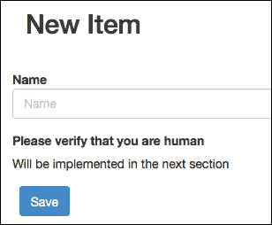

# 第四章. 创建和使用包

在本章中，您将学习如何安装、使用和创建 FuelPHP 包。为了说明目的，我们假设我们想要防止垃圾邮件发送者和机器人污染我们的网站，我们将探讨两种不同的解决方案来解决这个问题。我们首先将使用现有的包（recaptcha），然后我们将创建自己的包。

到本章结束时，您将了解：

+   CAPTCHA 是什么

+   如何手动或使用 oil 命令行安装外部包

+   reCAPTCHA 是什么以及如何使用相关的 FuelPHP 包

+   如何创建自己的包

+   启动文件是什么以及如何使用它

# CAPTCHA 是什么？

**CAPTCHA**（完全自动化的公开图灵测试，用于区分计算机和人类）通常用于防止机器人或程序访问网站的一些功能。例如，在博客中，您可能希望防止机器人在评论部分添加未经请求和不相关的广告。如果您希望用户支付会员费才能访问您的内容，您可能还希望防止程序访问此受限制的内容。

您可能已经看到了很多 CAPTCHA，通常以图像中的扭曲文本形式显示。一个知名的服务是 reCAPTCHA，其验证表单看起来如下所示：


不幸的是，由于创建垃圾邮件机器人的激励措施很多，没有 CAPTCHA 系统是完美的，但至少它们使机器人的工作更加困难。

# 初步步骤

您首先需要遵循以下步骤：

1.  安装新的 FuelPHP 实例。

1.  配置 Apache 和您的宿主文件以处理它。在本章中，我们将通过请求`http://mytest.app`来访问我们的应用程序。

1.  如有必要，更新 Composer。

1.  为您的应用程序创建一个新的数据库。

1.  配置 FuelPHP 以允许您的应用程序访问此数据库。

这些步骤已在第一章*创建您的第一个 FuelPHP 应用程序*中介绍，因此您可能想查看它。

# 生成示例应用程序

为了测试我们的包，我们将创建一个简单的应用程序来处理虚拟项目。为了完全清楚起见，我们在这里不关心应用程序的最终目标；这只是一个测试应用程序。大部分工作将在包内部完成。因此，用户界面和模型将非常简单，将由`oil`工具的 scaffold 命令完全生成。稍后，我们将将这些包连接到创建和编辑功能，以确定访问者是否为人类。

首先，使用以下命令生成 scaffold：

```php
php oil generate scaffold/crud item name:string

```

它将打印以下输出：

```php
Creating migration: APPPATH/migrations/001_create_items.php
Creating model: APPPATH/classes/model/item.php
Creating controller: APPPATH/classes/controller/item.php
Creating view: APPPATH/views/item/index.php
Creating view: APPPATH/views/item/view.php
Creating view: APPPATH/views/item/create.php
Creating view: APPPATH/views/item/edit.php
Creating view: APPPATH/views/item/_form.php
Creating view: APPPATH/views/template.php

```

然后，通过执行以下命令来执行生成的迁移文件：

```php
php oil refine migrate

```

如果您现在请求以下 URL，我们的测试应用程序应该可以完美运行：

`http://mytest.app/item`

# reCAPTCHA 解决方案

将 CAPTCHA 系统集成到您网站的第一种方法是通过使用 FuelPHP 的 **recaptcha 包**。这是一个方便的解决方案，因为它不需要实现太多，并且允许您集成一个您的访客已经习惯使用的知名 CAPTCHA 系统。

## 安装 recaptcha 包

首先，我们将安装 recaptcha 包，它可以将 **reCAPTCHA 服务**轻松集成到您的 FuelPHP 应用程序中。

reCAPTCHA 服务是由 Google 提供的一个流行且免费的服务，它通过要求访客在屏幕上输入扭曲文本图像中看到的单词来检查您的访客是否为机器人。一个有趣的事实是，它有助于将实际图像和书籍的文本数字化。

安装包非常简单。访问以下 URL：

[`github.com/fuel-packages/fuel-recaptcha`](https://github.com/fuel-packages/fuel-recaptcha)

现在，点击 **下载 ZIP** 按钮，然后解压缩文件到 `PKGPATH` 目录（`fuel/packages`）中。

### 注意

有其他下载包的方法。您可以使用以下命令使用 `oil` 工具：

```php
php oil package install recaptcha
```

建议您阅读有关此 `oil` 功能的官方文档，该文档可在以下 URL 获取：

[`fuelphp.com/docs/packages/oil/package.html`](http://fuelphp.com/docs/packages/oil/package.html)

（可以通过 FuelPHP 网站通过导航到 **DOCS** | **目录** | **Oil** | **包** 来访问）

一些包也可以通过 Composer 工具安装。

## 配置 recaptcha 包

在继续之前，您需要在 reCAPTCHA 网站上创建一个账户：

[`www.google.com/recaptcha`](http://www.google.com/recaptcha)

完成此操作后，您必须将 `PKGPATH/fuel-recaptcha/config/recaptcha.php` 配置文件复制到 `APPPATH/config/recaptcha.php`，并在新文件中设置 reCAPTCHA 网站提供的 `private_key` 和 `public_key` 密钥。

## 集成 recaptcha 包

现在我们已经安装并配置了 recaptcha 包到我们的 FuelPHP 实例中，我们只需将其集成到我们的创建和编辑表单中。打开 `APPPATH/views/item/_form.php` 文件，并在具有 `form-group` 类的两个 `div` 元素之间，添加以下代码：

```php
<div class="form-group">
<?php
echo Form::label('Please verify that you are human');

// It is how we display the recaptcha form as you can read
// in the package readme file.
echo ReCaptcha::instance()->get_html();
?>
</div>
```

在 `Item` 控制器的 `create` 和 `edit` 动作的开始处，添加以下代码行：

```php
Package::load('fuel-recaptcha');
```

如果您显示创建或编辑表单，reCAPTCHA 验证系统将如以下截图所示：


我们现在需要做的就是检查用户输入的值是否正确。打开 `Item` 控制器，并在 `create` 和 `edit` 动作中，围绕以下代码：

```php
$val = Model_Item::validate(/* 'create' or 'edit' */);

if ($val->run())
// And the following if else statement content
```

通过：

```php
if (static::is_captcha_correct())
{
    // Code to be surrounded
} else {
    Session::set_flash(
        'error',
        'You have entered an invalid value for the CAPTCHA'
    );
}
```

在 `Item` 控制器中，添加 CAPTCHA 验证方法：

```php
public static function is_captcha_correct() {
    // This is how a CAPTCHA is checked according to the
    // package readme file.
    return ReCaptcha::instance()
        ->check_answer(
            Input::real_ip(),
            Input::post('recaptcha_challenge_field'),
            Input::post('recaptcha_response_field')
    );
}
```

如果您为 CAPTCHA 输入无效值，任何项目添加/编辑都将失败。

# 创建您自己的包

我们之前看到的解决方案可以快速实现，但存在一个主要缺陷；reCAPTCHA 非常知名，有各种在线服务提供以几美元的价格解码数千个（它们可以使用光学字符识别甚至实际的人类解密者）。实际上，任何知名系统都存在同样的问题，因此有时最好的解决方案在于系统的原创性，而不是其绝对的鲁棒性。确实，即使新系统更加简单，它也会迫使垃圾邮件发送者专门创建新的机器人，如果他们想要污染你的网站，从而产生一种阻力（只要你的网站不是特别受欢迎）。

因此，我们将构建一个新的 CAPTCHA 包，以便创建我们自己的原创解决方案。我们不会显示包含扭曲文本的图像，而是简单地要求访客计算一个简单的加法。

### 注意

请注意，这个解决方案仅实现来演示如何构建一个包。因此，我们将选择一个非常简单的解决方案，它可能很容易被解码。欢迎你根据这个朴素的包创建你自己的鲁棒验证系统。

## 概念

由于我们需要检查用户是否在服务器上输入了正确的数字，我们将把预期的答案保存在数据库中。为此，我们将生成一个只包含 `id`、`expected_value` 和 `created_at` 属性的 `Captcha_Answer` 模型。

## 生成包

我们将再次使用 `oil` 命令为我们的包生成脚手架：

```php
php oil generate package captcha

```

这将打印以下输出：

```php
Creating file: PKGPATH/captcha/classes/captcha.php
Creating file: PKGPATH/captcha/config/captcha.php
Creating file: PKGPATH/captcha/bootstrap.php

```

你可以看到已经生成了几个文件。如果你打开位于 `PKGPATH/captcha/classes/captcha.php` 的 `Captcha` 类，你会看到该类位于 `Captcha` 命名空间中，并且已经实现了几个方法：

```php
<?php
namespace Captcha;

class CaptchaException extends \FuelException {}

class Captcha
{
    // ...
    protected static $_defaults = array();
    // ...
    protected $config = array();
    // ...
    public static function _init()
    {
        \Config::load('captcha', true);
    }
    // ...
    public static function forge($config = array())
    {
        $config = \Arr::merge(
            static::$_defaults,
            \Config::get('captcha', array()),
            $config
        );
        $class = new static($config);
        return $class;
    }
    // ...
    public function __construct(array $config = array())
    {
        $this->config = $config;
    }
    // ...
    public function get_config($key, $default = null)
    {
        return \Arr::get($this->config, $key, $default);
    }
    // ...
    public function set_config($key, $value)
    {
        \Arr::set($this->config, $key, $value);
        return $this;
    }
}
```

+   有五个方法，如下：构造函数，其中你传递包配置作为参数。

+   静态的 `forge` 方法，它获取位于 `PKGPATH/captcha/config/captcha.php` 的包配置文件并将其传递给构造函数。这意味着如果你使用 `forge` 方法创建一个 `Captcha` 对象，其配置将自动从配置文件中加载，而如果你使用构造函数创建它，你必须手动定义包配置。

+   `get_config` 和 `set_config` 方法是自解释的。

+   `_init` 方法，在初始化 `Captcha` 类时被调用。一般来说，在任意类中，如果你定义了一个静态的 `_init` 方法，当类被 FuelPHP 加载时，它将被调用。在我们的类中，该方法加载位于 `PKGPATH/captcha/config/captcha.php` 的配置文件。

`PKGPATH/captcha/config/captcha.php` 配置文件目前是一个空数组，但你可以根据需要添加任意多的参数。

我们生成的`captcha`包也包含一个位于`PKGPATH/captcha/bootstrap.php`的`bootstrap`文件。当包被加载时，此`bootstrap`文件将被执行。同样，当您的应用程序被加载时（几乎每次请求网页时），`APPPATH/bootstrap.php`文件将被执行。

如果您打开`PKGPATH/captcha/bootstrap.php`文件，您将看到以下代码：

```php
<?php

Autoloader::add_core_namespace('Captcha');

Autoloader::add_classes(array(
  'Captcha\\Captcha' => __DIR__ . '/classes/captcha.php',
  'Captcha\\CaptchaException' => __DIR__ . '/classes/captcha.php',

)); 
```

`Autoloader::add_classes`方法指定了 Autoloader 可以在哪里找到类。例如，在执行`bootstrap`文件后，FuelPHP 将知道`Captcha\Captcha`类位于`PKGPATH/captcha/classes/captcha.php`文件中。

`Autoloader::add_core_namespace`方法指定了需要添加到核心命名空间中的命名空间。在实践中，在执行`bootstrap`文件后，`\Captcha\Captcha`和`\Captcha`都将指向同一个类。

建议您阅读可以在以下位置找到的 Autoloader 官方文档：

[`fuelphp.com/docs/classes/autoloader.html`](http://fuelphp.com/docs/classes/autoloader.html)

(可以通过访问 FuelPHP 网站在**DOCS** | **目录** | **核心** | **自动加载器**处找到)

还建议您阅读有关包的官方文档：

[`fuelphp.com/docs/general/packages.html`](http://fuelphp.com/docs/general/packages.html)

(可以通过访问 FuelPHP 网站在**DOCS** | **目录** | **FuelPHP** | **通用** | **包**处找到)

## 生成 Captcha_Answer 模型

为了加快进程，我们再次使用`oil`命令行：

```php
php oil generate model captcha_answer expected_value:int created_at:int --crud

```

这将打印以下输出：

```php
Creating model: APPPATH/classes/model/captcha/answer.php
Creating migration: APPPATH/migrations/002_create_captcha_answers.php

```

在进行任何其他操作之前，您需要将这些文件移动到我们的包中：

+   将`APPPATH/classes/model/captcha/answer.php`移动到`PKGPATH/captcha/classes/model/captcha/answer.php`。

+   此外，将`APPPATH/migrations/002_create_captcha_answers.php`移动到`PKGPATH/captcha/migrations/001_create_captcha_answers.php`（别忘了重命名文件）。

完成后，打开`PKGPATH/captcha/classes/model/captcha/answer.php`，并在文件开头（在`<?php`之后）添加以下内容：

```php
namespace Captcha;
```

您还需要在模型内部添加以下属性，以便自动填充`created_at`属性：

```php
protected static $_created_at = 'created_at';
```

打开位于`PKGPATH/captcha/bootstrap.php`的`bootstrap`文件，并在传递给`Autoloader::add_classes`的数组末尾添加以下代码：

```php
    'Captcha\\Model_Captcha_Answer' => __DIR__ . '/classes/model/captcha/answer.php',
```

## 迁移包

现在我们需要执行`Captcha`包中的迁移文件。为了做到这一点，只需输入以下命令：

```php
php oil refine migrate --packages=captcha

```

## 将包集成到我们的应用程序中

在本节中，为了清晰起见，我们假设您尚未实现 reCAPTCHA 解决方案。尽管如此，值得注意的是，这个新的实现将明显受到它的启发。因此，如果您已经实现了 reCAPTCHA 解决方案，只需在执行过程中用新代码替换旧代码即可。

首先，在 `PKGPATH/captcha/classes/captcha.php` 中 `Captcha` 类的位置添加以下方法：

```php
public function check_answer($id, $answer) {
    return true;
}

public function get_html() {
    return '<div>Will be implemented in the next section</div>';
}
```

您可以注意到我们并没有在那些方法中实现任何功能；这些只是占位方法。由于它们稍微有些复杂，我们将在下一节中完成它们，但现在我们将它们连接到测试应用程序。打开 `APPPATH/views/item/_form.php`，并在具有 `form-group` 类的两个 `div` 元素之间添加以下代码行：

```php
<div class="form-group">
<?php
echo Form::label('Please verify that you are human');

// Displaying the captcha form
echo Captcha::forge()->get_html();
?>
</div>
```

在 `Item` 控制的 `create` 和 `edit` 动作的开头添加以下代码：

```php
Package::load('captcha');
```

我们现在需要检查用户输入的值是否正确。打开 `Item` 控制器，并在 `create` 和 `edit` 动作中，围绕以下代码：

```php
$val = Model_Item::validate(/* 'create' or 'edit' */);

if ($val->run())
// And the following if else statement content
```

通过：

```php
if (static::is_captcha_correct())
{
    // Code to be surrounded
} else {
    Session::set_flash(
        'error',
        'You have entered an invalid value for the captcha'
    );
}
```

最后，仍然在 `Item` 控制器中，添加 CAPTCHA 验证方法：

```php
public static function is_captcha_correct() {
    // Checking the captcha
    return Captcha::forge()
        ->check_answer(
            Input::post('captcha_id'),
            Input::post('captcha_answer')
    );
}
```

如果您现在测试您的应用程序，您将在 **请验证您是人类** 下方看到 **将在下一节实现** 的消息，并且任何项目都将被添加或更新而无需任何检查，如下面的截图所示：



## 实现 get_html 方法

打开 `Captcha` 类，并用以下代码替换 `get_html` 方法：

```php
/**
* Returns the CAPTCHA form
* 
* @return string the CAPTCHA form html code
*/
public function get_html() {

    // Getting configuration
    $min_number = $this->get_config('min_number');
    $max_number = $this->get_config('max_number');

    // Generating two random numbers
    $number_1 = rand($min_number, $max_number);
    $number_2 = rand($min_number, $max_number);

    // Computing the correct answer
    $answer = $number_1 + $number_2;

    // Saving the expected answer
    $captcha_answer = Model_Captcha_Answer::forge();
    $captcha_answer->expected_value = $answer;
    $captcha_answer->save();

    return \View::forge(
        'captcha',
        array(
            'number_1' => $number_1,
            'number_2' => $number_2,
            'captcha_answer' => $captcha_answer,
        )
    )->render();
}
```

如您所见，我们在 `get_html` 方法中调用了 `captcha` 视图。因此，我们需要实现它。创建 `PKGPATH/captcha/views/captcha.php` 视图文件，并添加以下内容：

```php
<div class="captcha_area">
    <div class="captcha_instruction">
        <?php echo $number_1; ?> + <?php echo $number_2; ?> ?
    </div>
    <div class="captcha_fields">
        <input type="hidden" name="captcha_id"
               value="<?php echo $captcha_answer->id; ?>" />
        <input type="text" name="captcha_answer"
               value="" class="col-md-4 form-control" />
    </div>
</div>
```

最后，如您可能在 `new get_html` 方法中注意到的那样，我们从配置文件中获取 `min_number` 和 `max_number`，因此我们需要定义这些值（请随意更改它们）。打开 `PKGPATH/captcha/config/captcha.php` 配置文件，并用以下代码替换其内容：

```php
<?php

return array(
    'min_number' => 1,
    'max_number' => 9,
);
```

如果您重新加载创建或编辑表单，您现在将看到 CAPTCHA 验证表单：


## 实现 CAPTCHA 验证方法

`check_answer` 方法相当简单；因为我们已经将预期的答案保存到了一个 `Model_Captcha_Answer` 实例中，所以我们只需要检索它并检查提交的答案是否正确。在 `Captcha` 类中，用以下代码替换 `check_answer` 方法：

```php
/**
* Check if the captcha is valid
* 
* @param int $id id of the CAPTCHA answer
* @param string $answer answer given by the visitor
* @return boolean is the answer correct ?
*/
public function check_answer($id, $answer) {
    // Model::find_by_pk finds an instance by its
    // Primary Key (in our case, id).
    $captcha_answer = Model_Captcha_Answer::find_by_pk(
        intval($id)
    );
    $correct = $captcha_answer->expected_value == $answer;

    // The answer has been checked, so no need to keep the
    // expected answer
    $captcha_answer->delete();

    return $correct;
}
```

## 清理旧的 CAPTCHA

如您可能已注意到，每次我们显示 CAPTCHA 时，我们都会在 `captcha_answers` 表中添加一行新数据，并且当用户提交答案时，这一行数据将被清除，或者说，如果用户没有提交表单，这一行数据将永远不会被删除。一个良好的做法是定期删除这些行。我们可以使用模型的删除方法来做这件事，但由于可能需要删除多行，我们将会简单地执行一个 SQL 请求。

仍然在 `Captcha` 类中，添加以下方法：

```php
/**
* Clean the old captchas
*/
public function clean_old_captchas() {
    \DB::query('
        DELETE FROM `captcha_answers`
        WHERE `created_at` < '.
       intval(\Date::forge()->get_timestamp()
        - $this->get_config('captcha_expiration'))
        .';')
        ->execute();
}
```

您可以在 `get_html` 和 `check_answer` 方法的开头添加以下内容：

```php
$this->clean_old_captchas();
```

由于我们使用`$this->get_config('captcha_expiration')`来确定`CAPTCHA`何时过期，我们需要在`PKGPATH/captcha/config/captcha.php`配置文件中定义`captcha_expiration`键：

```php
    // Captcha are expired 4 hours after generation
    'captcha_expiration' => 3600 * 4,
```

## 可能的改进

正如我们在本节开头所解释的，这个包当然可以改进。你可以在图片中显示添加的内容，而不是以纯文本形式显示。例如，你可以通过添加噪声和交替颜色使其稍微难以阅读。这超出了本章的范围，因为我们想专注于包，但建议你添加这样的功能来提高你的 PHP 和 FuelPHP 技能。

# 摘要

本章的主要内容是关于包：如何安装外部包以及如何创建自己的包。因此，你已经学会了如何创建和使用可重用的代码。我们使用了**fuel-recaptcha**包，但如果你访问网址[`github.com/fuel-packages?tab=repositories`](https://github.com/fuel-packages?tab=repositories)，你会看到那里有很多不同的包可供选择。由于 FuelPHP 也使用 Composer，你可以查看[`packagist.org/search/?q=fuel`](https://packagist.org/search/?q=fuel)并使用 Composer 安装额外的包。

当你考虑在你的应用程序中添加新功能时，查看是否已有满足你需求的项目总是一个好主意。如果你找不到，你可以改进一个足够接近的包或者创建自己的，就像我们用我们的自定义`Captcha`包所做的那样。一旦完成，考虑分享它，例如，通过在 GitHub 上发布；这样你就可以回馈给你带来这个令人惊叹框架的社区。

在下一章中，你将看到如何创建一个提供并使用其自身 API 的应用程序。我们还将探讨如何自动测试你的应用程序以防止不希望的反向回归。
