# 第六章：使用 Novius OS 构建网站

在本章中，我们将向您介绍**Novius OS**，这是一个基于 FuelPHP 的开源**内容管理系统**（或 CMS）。使用 Novius OS 可以极大地简化网站的实施和管理。它的后台办公包括重要且用户友好的功能，如网页、菜单、模板、应用程序、用户和权限管理；它目前提供六种语言（英语、法语、日语、俄语、西班牙语和世界语）。如果您想轻松构建一个非程序员用户可以轻松管理的复杂网站，它是一个出色的工具。

到本章结束时，您将了解：

+   如何安装和配置 Novius OS

+   Novius OS 的基本功能和如何使用它们来创建您的网站

+   Novius OS 文件系统层次结构

+   什么是 Novius OS 应用程序，如何生成一个，以及其主要组件

# 关于 Novius OS

Novius OS 是一个基于 FuelPHP 的开源 CMS，由 jQuery UI 和 Wijmo 库提供支持。它于 2011 年 12 月由法国里昂的一家小型网络公司 Novius 正式推出。设计和实施此项目的核心团队由一位用户体验设计师 - Antoine Lefeuvre - 和三位工程师 - Gilles Félix、Julian Espérat 和我 - 组成。然而，该软件也收到了开源社区的大量贡献。

在本章中，我们将假设您使用的是 Novius OS 的版本 5.0.1（Elche）（写作时的当前稳定版本）。这个 CMS 的官方网站可以在[`www.novius-os.org/`](http://www.novius-os.org/)找到。

它的官方文档可在以下网址找到：

+   [`docs.novius-os.org/en/elche/`](http://docs.novius-os.org/en/elche/)

+   [`docs-api.novius-os.org/en/elche`](http://docs-api.novius-os.org/en/elche)

### 注意

我在这本书中包含了对 Novius OS 的介绍，因为它基于 FuelPHP，我认为你们中的一些人可能会觉得这个系统很有用。尽管如此，由于我参与了该项目，我意识到我的观点可能会有所偏颇，这就是为什么这一章只是关于它的简短介绍。

# 获取 Novius OS

Novius OS 的要求与 FuelPHP 的要求相似：

+   PHP 5.3 或更高版本

+   MySQL

+   Apache 已启用 mod_rewrite

+   Windows (> Vista)、Linux 或 Mac OS

安装说明可在以下网址找到：

[`docs.novius-os.org/en/elche/install/install.html`](http://docs.novius-os.org/en/elche/install/install.html)

建议您遵循**通过 Zip 文件安装**部分中的说明（最简单和通用的解决方案）。如果您在 Linux 或 Mac OS 上进行开发，您可能希望遵循**安装**部分中的说明，因为它将下载此版本的最新修复。

你也可以配置一个虚拟主机，就像我们在前几章中为 FuelPHP 所做的那样（参考**高级安装**部分）。然而，我们将假设你只下载并解压了 Novius OS 到你的 web 服务器根目录下的 `novius-os` 文件夹中（`DOCUMENT_ROOT/novius-os`）。

# 配置 Novius OS

如果你输入 URL `http://localhost/novius-os`，Novius OS 安装向导就会出现。按照指示操作；它将首先检查你的服务器配置是否与 Novius OS 兼容，其次要求你提供数据库配置（你首先需要创建一个数据库），然后要求你提供一些信息以创建第一个用户账户（这是连接到 Novius OS 后台办公室所必需的），最后，询问你希望你的网站提供哪些语言。

你现在可以点击 **进入后台并登录**。

# 探索 Novius OS

在本节中，你将通过探索界面来了解 Novius OS 的主要功能。如果你之前从未使用过 Novius OS，这一步非常重要，因为如果你不知道如何使用 CMS，就无法理解实现细节。

以下登录网页将显示：

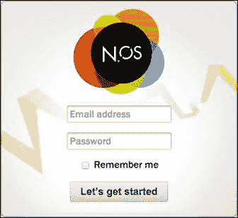

输入你在安装步骤中定义的凭据。

## 应用程序管理器

一旦连接，应用程序管理器就会出现：

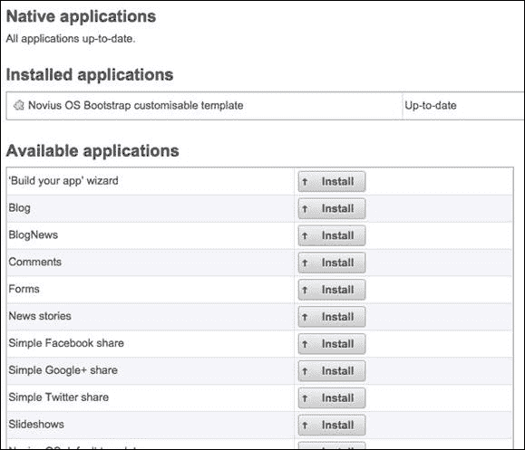

应用程序允许你为 Novius OS 添加新功能。例如，**博客**应用程序扩展了 Novius OS 的核心功能，为你的网站添加了一个完整的博客解决方案。如果你已经使用过其他 CMS，Novius OS 的应用程序与它们的模块或扩展同义。建议你阅读以下网址提供的关于应用程序和应用管理器的官方文档：

+   [`docs.novius-os.org/en/elche/understand/applications.html`](http://docs.novius-os.org/en/elche/understand/applications.html)

+   [`docs.novius-os.org/en/elche/manage/install_app.html`](http://docs.novius-os.org/en/elche/manage/install_app.html)

当你安装 Novius OS 时，已经有一些应用程序可用。然而，我们稍后会看到，你可以添加其他应用程序或创建自己的应用程序。Novius OS 的核心功能大多数是通过原生应用程序实现的，这些应用程序直接包含在核心中。你现在可以理解到，应用程序是 Novius OS 的一个关键特性，并且它们做了大部分的工作。

目前，大多数应用程序都只是可用但未安装。如果你想激活可用应用程序的功能，你必须安装它。点击 **博客** 旁边的 **安装** 按钮，以激活博客的功能。以下消息将出现在屏幕右上角：


在 **已安装的应用程序** 部分中，现在将显示以下三个应用程序：

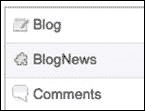

您可以看到，**博客** 应用程序已安装，但 **BlogNews** 和 **Comments** 也随它一起安装。这是因为这些应用程序是依赖项；**博客** 应用程序需要它们两个。Novius OS 允许应用程序相互依赖，并且系统会尝试管理任何潜在冲突。例如，您不能在不先卸载 **博客** 应用程序的情况下卸载 **BlogNews** 应用程序。

## Novius OS 桌面

要离开应用程序管理器，请点击屏幕左上角的 Novius OS 图标：


现在，Novius OS 桌面将显示：

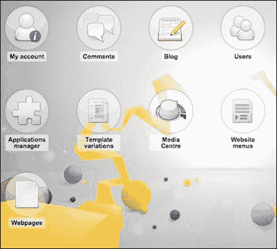

桌面显示称为 *启动器* 的图标，可以点击；它们通常允许您访问应用程序。例如，如果您点击 **应用程序管理器**，您将返回我们之前看到的屏幕。

## Novius OS 的前端和默认主页

如果您访问您的网站主页（`http://localhost/novius-os`），您将只能看到默认的 Novius OS 主页，因为我们没有定义任何内容。通过请求返回管理面板：

## Webpages 应用程序

Novius OS 的另一个重要特性是管理您的网页的能力。为了做到这一点，点击 **Webpages** 启动器，它将显示网页管理面板。一个空表格将出现，底部有几个按钮。点击 **添加页面** 按钮以创建您的第一个页面。然后会出现网页创建表单：


在这种情况下，您应该更改的三个字段是标题、内容和发布设置。

标题字段将定义您的网页的元数据标题。通常，此标题也将显示在网页内容上方。

内容字段将定义您的网页的核心内容。它是一个 WYSIWYG 字段，因此您还可以格式化文本或添加图片等功能。

发布设置允许您定义内容是否对访客可见。您可以使用 **标题** 字段下方的三个小图标进行更改：

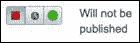

如果左侧按钮处于活动状态，如前一张截图所示，则网页不会被发布；也就是说，网页对访客不可见。右侧按钮允许您立即发布内容（只要您点击 **保存**/**添加** 按钮）。中间按钮允许您安排内容发布的时间。现在点击右侧按钮：


点击 **添加** 按钮以保存更改并创建新的网页。

您可能已经注意到，自从我们点击了 **Webpages** 启动器后，屏幕上方的部分出现了新的标签页：

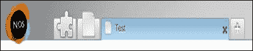

Novius OS 界面是围绕标签设计的。就像浏览器的标签一样，Novius OS 的标签允许您打开多个管理页面。尽管这对新用户来说可能会造成不稳定，但当您需要同时管理多个元素时，这种标签导航系统可能会很有用。

第一个标签包含 **应用程序管理器** 应用程序。由于我们不再需要它，请点击它，然后点击交叉按钮关闭它。

点击新的第一个标签（没有任何标题的标签），您现在将回到网页管理面板。然而，您新创建的页面现在将在表格中可见：

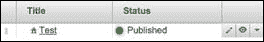

在网页标题旁边的房子图标表示这是主页。我们没有指定它，但 Novius OS 会自动选择第一个创建的网页作为主页。

在表格的每一行中，您都可以看到右下角有小的按钮。这些按钮允许您应用单个操作。在我们的例子中，第一个按钮允许您编辑网页，第二个按钮可以可视化它，第三个按钮显示一个下拉菜单，将显示更多操作。

如果您现在请求主页（`http://localhost/novius-os`），您将看到以下屏幕：

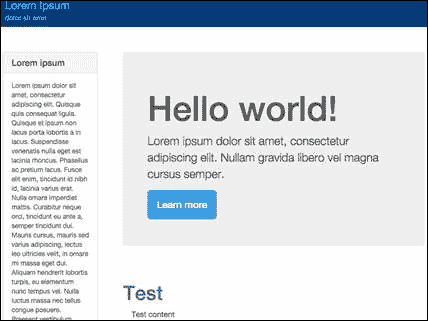

我们的内容在底部可见，但也有很多示例内容，我们当然希望删除。

## Novius OS 模板

您在网页中定义的内容将在模板内部显示，这与在 FuelPHP 中使用 **模板** 控制器时在模板内显示的视图类似。如果您回到网页编辑表单，您会注意到有一个名为 **模板变体** 的字段，其值设置为 **Bootstrap 可定制模板**。因此，要删除示例内容，我们必须编辑 **Bootstrap 可定制模板**。

为了完成这个操作，请回到 Novius OS 桌面（通过点击屏幕左上角的 **NOS** 图标），然后点击 **模板变体** 启动器。

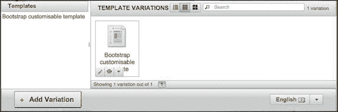

我们将在下一节讨论这个管理界面。首先，点击 **Bootstrap 可定制模板** 项中的编辑按钮（由铅笔图标表示）。将打开一个新标签，如下截图所示：

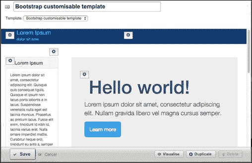

每个齿轮图标都允许您编辑模板的特定部分。请随意根据您的需求调整模板。

您还可以通过安装 **Novius OS 默认模板** 应用程序（这个配置较少）、外部应用程序或创建自己的应用程序来添加其他模板模型。

您会注意到一些模板部分显示以下菜单字段：

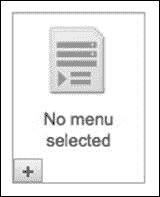

菜单字段允许你在网站上生成菜单。默认情况下，也就是说如果没有选择菜单，将构建一个默认菜单，从具有**显示在菜单中**配置的网页中构建（你可以在网页编辑表单中更改此配置）。你还可以通过点击管理桌面上的**网站菜单**启动器来创建自定义菜单。

### 注意

当你完成模板更改后，你可能需要刷新页面缓存。这可以通过在网页管理界面中点击**刷新页面缓存**链接来完成。一般来说，如果你发现尽管你在后台更新了内容，但你的网页没有变化，刷新这个缓存是个好主意。

## App Desk

如果你回到**模板变体**管理界面（你可以通过标签或点击**NOS**图标然后点击**模板变体**启动器来完成此操作），你会看到管理面板被分为三个部分：

+   上左部分列出了所有模板的原模型。

+   上右部分列出了所有变体，即我们为我们的网站适配的模板。

+   底部包含操作按钮。

你甚至可以通过点击顶部按钮来更改右上部分显示的方式：

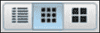

点击列表按钮时，这样显示管理面板：

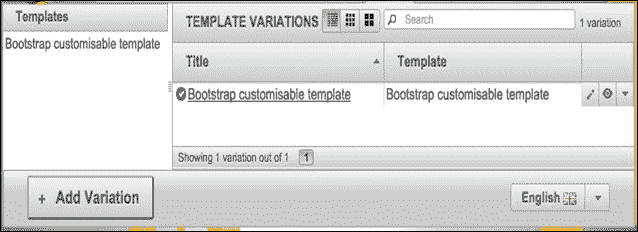

你可以注意到用户界面与**网页**管理界面非常相似。实际上，Novius OS 的大多数应用程序都将有一个通用的用户界面，因为核心提供了可以轻松重用的通用组件。你现在看到的主要管理界面，即你正在查看的界面，扩展了**App Desk**组件。通过最小配置，你可以以有组织和标准化的方式显示和管理你的应用程序数据。为了方便起见，这样的管理界面也被称为 App Desk。

这是当前 App Desk 的标准布局：

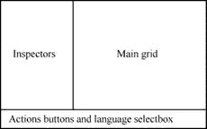

你可以注意到有 3 个组件，如下所示：

+   主要内容显示在主网格中。正如我们之前看到的，通常可以通过不同的方式显示主网格（列表、缩略图、层次结构等）。

+   在左侧，检查器显示相关内容（例如博客文章的分类），并过滤主网格的内容（例如，它可以过滤属于特定类别的博客文章）。

+   在底部，按钮允许用户执行一般操作，如创建新项目或刷新缓存。如果内容依赖于语言（例如，博客文章将包含英文、法语、西班牙语等内容），语言选择框也可能显示。

建议您查看有关 UI 指南的官方文档，可在 [`docs.novius-os.org/en/elche/understand/ergonomy.html`](http://docs.novius-os.org/en/elche/understand/ergonomy.html) 找到。

## 在您的网页中插入增强器

您可能还记得我们之前安装了 **博客** 应用程序。此应用程序允许您在网站中插入完整的博客解决方案。让我们看看在 Novius OS 中是如何操作的。

首先，返回 **网页** 管理标签页，创建一个标题为 **博客** 的新页面。保存并发布。如果您在右侧菜单（或手风琴）中点击 **URL（页面地址）** 标签，您将看到以下内容：

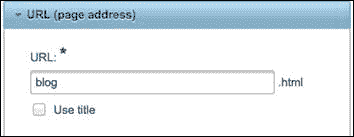

此字段指定了网页的相对 URL。在这种情况下，您可以通过输入以下 URL 访问您创建的网页：

`http://localhost/novius-os/blog.html`

**博客** 应用程序，就像大多数在网站前端显示的 Novius OS 应用程序一样，可以插入到网页内容中。为此，点击 **内容** WYSIWYG 输入。您将在顶部看到一个工具栏：

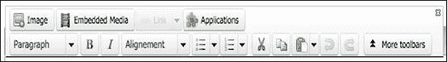

点击 **应用程序** 按钮，然后点击 **博客**：

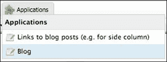

然后将出现一个配置框；您不需要更改任何内容：

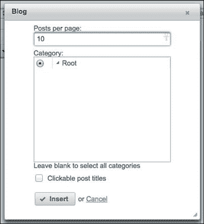

当您点击 **插入** 按钮，以下框将出现在 WYSIWYG 字段内：

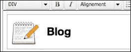

此框表示 **博客** 应用程序已插入到您的网页中。为了使用正确的术语，您插入了 **博客增强器**。增强器是一个应用程序组件，可以插入到大多数 WYSIWYG 字段中，以便在前端显示内容。一个应用程序可以有多个增强器，就像您在点击 **应用程序** 按钮时看到的；您可以选择 **链接到博客文章（例如，用于侧边栏）** 或 **博客**。这两个增强器都属于 **博客** 应用程序，但它们以不同的方式显示博客。

如果您再次请求 URL `http://localhost/novius-os/blog.html`，您将不会看到任何变化，这是正常的；您必须首先创建博客文章。在 Novius OS 管理面板中，返回桌面，点击 **博客** 启动器，并添加几篇博客文章（别忘了发布它们）。

如果您再次请求博客网页，您将看到以下文章：

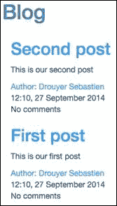

您可以通过点击文章的标题来查看特定的博客文章。如果您这样做，您将看到一个更完整的文章视图，并且 URL 将如下所示：

`http://localhost/novius-os/blog/POST_TITLE.html`

如您所见，**博客增强器**不仅显示内容，还创建额外的 URL。这是因为它是一个 URL 增强器，一种特殊的增强器，可以响应额外的 URL。具体来说，如果一个 URL 增强器托管在位于 `http://localhost/novius-os/PAGE.html` 的网页上，它也可以响应任何类似 `http://localhost/novius-os/PAGE/ANY_STRING.html` 的 URL。

当然，URL 增强器可以根据其实施和配置对每个 URL 做出不同的响应。

# Novius OS 文件系统层次结构

现在我们已经了解了 Novius OS 及其界面的基础知识，让我们深入了解我们安装 Novius OS 的目录。在撰写本文时，Novius OS（Elche）的当前版本具有以下目录层次结构：

+   `/local`: 这个文件夹包含所有特定于网站的代码、配置和应用程序。它包含以下文件夹：

    +   `/local/applications`: 这个文件夹包含所有可用的非核心应用程序。

    +   `/local/cache`: 这里所有的文件都允许 Novius OS 及其应用程序缓存数据，以提高网站的性能。

    +   `/local/classes`: 这包括网站使用的类，这些类不属于核心或任何应用程序。

    +   `/local/config`: 这包括配置文件，包括 FuelPHP 主配置文件和数据库配置文件。

    +   `/local/data`: 这些是由 Novius OS 及其应用程序创建的数据文件。

    +   `/local/metadata`: 这些是由 Novius OS 创建的文件。与 `/local/data` 不同，此文件夹内的文件仅在应用程序安装、升级或卸载时更改。

    +   `/local/views`: 这些是网站使用的视图。您可以在该文件夹内创建文件以覆盖应用程序视图。

+   `/logs`: 这包含日志文件。它与 FuelPHP 的日志文件夹类似。

+   `/novius-os`: 这是 Novius OS 核心，您不应该更改其中的任何内容。其中还包括 FuelPHP 核心和包。

+   `/public`: 这个目录对外部访客是可访问的。你可以在这里添加公开的文件（CSS、JS...）。

## 应用程序文件夹结构

在 `/local/applications` 目录内，每个文件夹都是一个应用程序。为了您的信息，您应该知道 Novius OS 所称的应用程序实际上是改进后的 FuelPHP 模块。如果您查看这些文件夹，您将看到以下结构：

+   `/classes`: 这些是应用程序使用的类。

    +   `/classes/controller`: 应用程序的控制器。

    +   `/classes/menu`: 应用程序关于菜单的信息。

    +   `/classes/model`: 应用程序的模型。

+   `/config`: 这些是应用程序的配置文件。以下是最重要的几个：

    +   `/config/metadata.config.php`: 这是元数据配置文件。它包含关于应用程序的所有关键信息：名称、图标、描述、依赖项、启动器、增强器等。

    +   `/config/permissions.config.php`：这允许应用程序处理自定义权限。

+   `/lang`：应用程序的翻译文件。

+   `/migrations`：应用程序的迁移文件。

+   `/static`：这是公共文件夹的等价物，但特定于应用程序。例如，如果 **Blog** 应用程序（位于 `local/applications/noviusos_blog`）已安装，则 `local/applications/noviusos_blog/static/img/blog-16.png` 文件可以通过 `http://localhost/novius-os/static/apps/noviusos_blog/img/blog-16.png` 访问。

+   `/views`：应用程序的视图文件。

## 文件扩展名

你可能已经注意到一些文件具有以下后缀：

+   模型的文件名以 `.model.php` 结尾

+   控制器的文件名以 `.ctrl.php` 结尾

+   配置的文件名以 `.config.php` 结尾

+   视图的文件名以 `.view.php` 结尾

这是 Novius OS 的一个约定，旨在增强开发者的体验。它之所以被实施，是因为开发者通常使用相同的文件名来命名文件（例如，一个 `post.php` 控制器，一个 `post.php` 视图，和一个 `post.php` 配置文件），如果他们在 IDE 的多个标签页上打开它们，大多数时候他们不知道他们正在寻找的文件在哪个标签页上。这是一个可选的约定，它不会改变文件执行的方式。

## 配置和类

另一个重要的约定涉及配置和类文件的位置。由于开发者经常需要为控制器和模型编写配置，因此配置文件路径与类文件路径相关。例如，在一个应用程序中，`classes/controller/front.ctrl.php` 控制器可以使用 `config/controller/front.config.php` 配置文件进行配置。如果控制器扩展了 Novius OS 的默认控制器之一，配置文件将自动加载。

一般而言，`config/FILE_PATH` 配置文件将与 `classes/FILE_PATH` 类文件相关联。这样，当你想了解其他人实现的应用程序时，你可以轻松地知道每个配置文件与哪个类相关联。

# 创建应用程序

要进一步理解 Novius OS 的工作原理，唯一的方法是创建一个应用程序。首先，我们将使用 Novius OS 的 **'Build you app'** 向导生成一个应用程序，这个向导试图实现与 `oil generate` 工具相同的目标，但它生成的是 Novius OS 应用程序而不是 FuelPHP 框架的脚手架。然后，我们将查看生成的大多数文件，并看看当我们调整它们时会发生什么。

## 安装 'Build your app' 向导

应用程序可用但需要安装。为此，请转到 Novius OS 桌面，点击 **应用程序管理器** 启动器，然后在 **可用** 应用程序下，点击 **'Build your app' 向导** 旁边的 **安装** 按钮。

## 生成应用程序

返回 Novius OS 桌面并点击**'构建您的应用程序'向导**启动器。将出现一个表单。正如第一章中所述，*构建您的第一个 FuelPHP 应用程序*，我们将生成一个将管理我们动物园猴子的应用程序。

首先，在**关于应用程序**下，将**应用程序名称**字段的值设置为**我的第一个应用程序**。**应用程序**文件夹和**应用程序命名空间**字段应自动完成，但您可以根据需要更改它们。

接下来，在**模型**下，将**名称**字段设置为`Monkey`，因为我们想生成一个`Monkey`模型。**表名**和**列前缀**字段应自动完成。

由于我们想要发布应用程序的内容，请勾选**URL 增强器**复选框。我们还想精确选择我们想在网站上显示的猴子，因为有些猴子可能暂时在动物园里，所以勾选**可发布行为**复选框。最后，我们想知道哪个用户将猴子输入到应用程序中，所以勾选**作者行为**复选框。

现在表单将看起来如下：

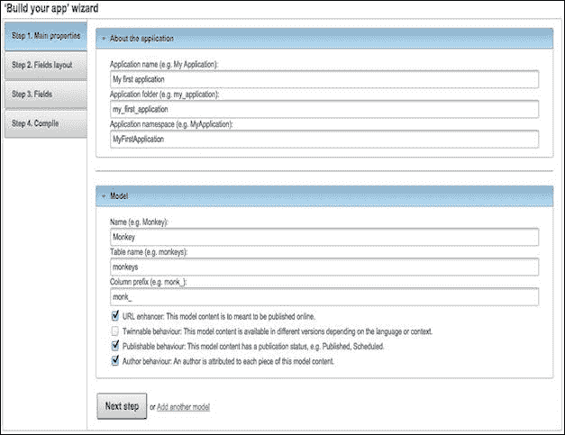

您现在可以点击**下一步**。

在这里，我们将定义管理表单的布局（我们在创建和编辑猴子时将使用的表单）。布局由**字段组**定义，这些字段组可以分为两种类型：

+   **主要列字段组**：这些包含您模型的最重要信息（或需要最多空间的信息），因此它们始终可见，并占据表单的大部分区域。通常，这些字段组将包含 WYSIWYG 编辑器或非常重要的字段。

+   **侧边栏字段组**：这些包含不需要太多空间的相关信息。它们将出现在屏幕右侧的菜单（或手风琴）中。

默认创建的第一个主要列字段组名为`Properties`。通过点击**下一步**按钮旁边的**添加另一个字段组**来创建一个新的字段组。将其**标题**字段设置为`Additional informations`，并将其类型设置为`Side column`。现在表单应该看起来如下：

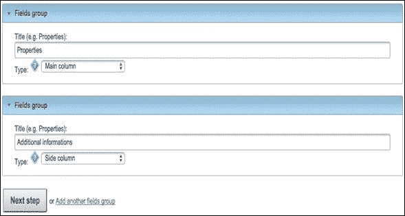

您现在可以点击**下一步**。

我们现在将定义我们的模型字段和属性。对于第一个字段，将其**标签**属性定义为`Name`，**列名**属性应自动完成，然后勾选**是否为表单标题**复选框（因为这个字段将被用作标题）。

点击**添加另一个字段**。对于新字段，将**标签**属性定义为`Still here`，在**类型**选择框中选择**复选框**，勾选**在** **App Desk** **中显示**复选框，然后在**字段**组选择框中选择**Additional informations (Side column)**。

点击**添加另一个字段**。对于新字段，将**标签**属性定义为`Height`，勾选**在应用程序桌面中显示**复选框，然后在**字段**组选择框中选择**附加信息（侧栏）**。

点击**添加另一个字段**。对于新字段，将**标签**属性定义为`Description`，然后在**类型**选择框中选择**WYSIWYG 文本编辑器**。

表单的结尾应如下所示：

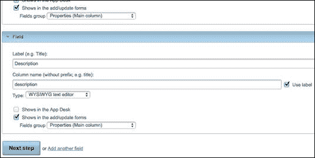

您现在可以点击**下一步**。以下对话框将出现：

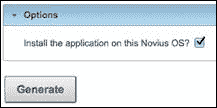

由于我们想要安装此应用程序，所以不要更改任何内容。

点击**生成**按钮。您将看到一个确认消息出现，其中包含各种链接到文档，以帮助您改进生成的应用程序。建议您查看此文档。

## 测试您生成的应用程序

返回 Novius OS 桌面并点击**Monkey**启动器。您将看到一个空的**应用程序桌面**出现。点击**添加 Monkey**按钮，创建表单将如您在**“构建您的应用程序”向导**表单中配置的那样出现。创建尽可能多的猴子，您将看到**应用程序桌面**逐渐填满。

由于我们勾选了**URL 增强器**复选框，我们的内容可以在网页上显示。返回 Novius OS 桌面，点击**网页**启动器，然后点击**添加页面**按钮。将网页的标题设置为`Monkey`，将其发布状态设置为**已发布**。接下来，为了添加我们的应用程序 URL 增强器，点击**内容**WYSIWYG。然后点击**应用程序**，然后点击**我的第一个应用程序 Monkey**。最后，通过点击**添加**按钮保存网页。

现在，如果您检查 URL `http://localhost/novius-os/monkey.html`，您将看到您的猴子列表：


如果您点击列表中的某个项目，将出现更详细视图：


在这种情况下详细视图的 URL 将如下所示：

`http://localhost/novius-os/monkey/my-first-monkey.html`

如您所见，通过使用**“构建您的应用程序”向导**选项，并且只填写很少的输入，我们创建了一个完整的应用程序框架。与`oil generate`实用程序一样，每次您想要实现一个应用程序时都应该使用向导，因为它将加快您的开发过程，并且您将有一个良好的基础开始。

## 应用程序基础知识

我们将使用此生成的应用程序来描述在 Novius OS 中应用程序的工作方式。我们不会过多地深入细节，但这应该足以让您开始并知道在哪里查找更多信息。

我们生成的应用程序可以在`local/applications/my_first_application`目录中找到。我们将查看的所有文件都位于文件夹内。

### 元数据配置文件

应用程序名称、依赖项、图标、启动器、增强器在哪里定义？

所有这些基本信息都包含在`config/metadata.config.php`中。这是创建应用程序所需的唯一文件。如果您打开此配置文件，应用程序的名称由`name`键定义，其命名空间由`namespace`键定义，其启动器由`launchers`键定义。这很简单，您可以在官方文档中了解更多信息，该文档可在[`docs-api.novius-os.org/en/elche/php/configuration/application/metadata.html`](http://docs-api.novius-os.org/en/elche/php/configuration/application/metadata.html)找到。

### 迁移文件

迁移文件位于`migrations`文件夹中，并在应用程序安装时执行。它们可以像正常的 FuelPHP 迁移文件一样实现，但如果您打开`migrations/001_install.php`，您将看到它是空的：

```php
<?php
namespace MyFirstApplication\Migrations;

class Install extends \Nos\Migration
{
}
```

这是因为`migration`文件扩展了`\Nos\Migration`。默认情况下，`up`方法将尝试执行与`migration`文件具有相似名称的 SQL 文件，在我们的例子中是`migrations/001_install.sql`。如果您打开此 SQL 文件，您将看到它只是创建了`monkeys`表。

### App desk

您的应用程序的 App Desk 是从以下 URL 加载的（如果您想检查，可以使用浏览器开发者工具）： 

`http://localhost/novius-os/admin/my_first_application/monkey/appdesk`

一般而言，当您输入`http://WEBSITE/admin/APPLICATION_FOLDER/CONTROLLER_PATH(/ACTION)`时，位于`local/applications/APPLICATION_FOLDER/classes/controller/admin/CONTROLLER_PATH`的控制器将执行`ACTION`动作。

因此，在我们的情况下，URL 执行了`my_first_application`应用程序中`controller/admin/monkey/appdesk.ctrl.php`控制器的`index`动作（因为如您所记得的，当 URL 中没有定义动作时，FuelPHP 将执行`index`动作）。让我们打开这个控制器：

```php
<?php
namespace MyFirstApplication;

class Controller_Admin_Monkey_Appdesk extends \Nos\Controller_Admin_Appdesk
{
}
```

再次强调，您可以看到一个空类。所有动作都定义在由我们的控制器扩展的`\Nos\Controller_Admin_Appdesk`类中。尽管返回的列表不是通过某种魔法过程自动生成的，但它是由配置文件生成的。

如您可能记得，我们之前提到配置文件路径与类文件路径相关。因此，我们可以在`config/controller/admin/monkey/appdesk.config.php`找到我们的控制器配置文件。如果您打开此文件，您将看到以下代码片段（注释已被删除）：

```php
<?php
return array(
    'model' => 'MyFirstApplication\Model_Monkey',
    'search_text' => 'monk_name',
);
```

它定义了必须由**App Desk**显示的模型以及当在**搜索**栏中写入内容时要扫描的列。您可以定义更多键，如检查器或查询。建议您阅读官方文档以了解更多关于此配置文件的信息：

[`docs-api.novius-os.org/en/elche/php/configuration/application/appdesk.html`](http://docs-api.novius-os.org/en/elche/php/configuration/application/appdesk.html)

这里定义的配置只是一个起点，但肯定不足以显示整个**应用桌面**。大部分必要的信息定义在`config/common/monkey.config.php`配置文件中（注释已被删除）：

```php
<?php
return array(
    'controller' => 'monkey/crud',
    'data_mapping' => array(
        'monk_name' => array(
            'title' => __('Name'),
        ),
        'monk_still_here' => array(
            'title' => __('Still here'),
            'value' => function($item) {
                return $item->monk_still_here ? __('Yes') :
                           __('No');
            },
        ),
        'monk_height' => array(
            'title' => __('Height'),
        ),
        'publication_status' => true,
    ),
);
```

如您所见，显示的列定义在`data_mapping`键中。每一列的标题由`title`键定义，除了`publication_status`，它是一个特殊情况。行值要么由键确定，要么由`value`回调确定。具体来说，应用桌面的每一行将显示以下属性：

+   在**名称**列下，`monk_name`属性

+   在**仍在**列下，根据`monk_still_here`属性，显示**是**或**否**

+   在**高度**列下，`monk_height`属性

为了训练自己，尝试更改一个列标题或添加一个`value`回调。

我们只是触及了表面，建议您阅读官方文档[`docs-api.novius-os.org/en/elche/php/configuration/application/common.html`](http://docs-api.novius-os.org/en/elche/php/configuration/application/common.html)。

### 编辑和创建表单

如果您创建或编辑一个猴子，您将看到 Novius OS 将请求以下 URL：

`http://localhost/novius-os/admin/my_first_application/monkey/crud/insert_update(/ID)`

因此，我们可以推断出`classes/controller/admin/monkey/crud.ctrl.php`控制器的`insert_update`动作被调用。如果您打开控制器，您将看到，正如您所猜想的，一个空类。同样，一切都在扩展的`\Nos\Controller_Admin_Crud`控制器中定义。

如果您阅读相关的`config/controller/admin/monkey/crud.config.php`配置文件，您将看到它定义了编辑和创建表单的布局和字段。所有字段都定义在`fields`键中。

为了训练自己，您可以通过编辑它们的`label`键来更改一些字段标签。

同样，我们只是触及了表面。建议您阅读官方文档[`docs-api.novius-os.org/en/elche/php/configuration/application/crud.html`](http://docs-api.novius-os.org/en/elche/php/configuration/application/crud.html)。

### 前端控制器

现在我们已经看到了后台办公室的工作方式，我们必须看看我们的 URL 增强器是如何工作的。

如您所回忆的那样，增强器是在`config/metadata.config.php`配置文件中声明的：

```php
'enhancers' => array(
    'my_first_application_monkey' => array(
        'title' => 'My first application Monkey',
        'desc'  => '',
        'urlEnhancer' => 'my_first_application/front/monkey/main',
    ),
),
```

再次提醒，建议您阅读关于元数据的官方文档。这里有趣的关键词是 `urlEnhancer`；如果您将增强器插入到网页中，每次网页显示时，Novius OS 都会触发一个对 `urlEnhancer` 的内部 HMVC 请求并显示返回的内容。在我们的例子中，当您显示 `http://localhost/novius-os/monkey.html` 网页（以及其中的猴子增强器），Novius OS 将内部请求 `my_first_application/front/monkey/main` 并显示返回的内容。

如您所猜，它调用 `Front_Monkey` 控制器的 `main` 操作。打开 `classes/controller/front/monkey.ctrl.php`，查看其 `action_main` 方法。您会看到该方法根据 `$enhancer_url` 变量返回单个猴子视图或列表。此变量在操作的开始处定义：

```php
$enhancer_url = $this->main_controller->getEnhancerUrl();
```

让我们以我们的例子说明 `$this->main_controller->getEnhancerUrl()` 方法返回的内容：

+   如果您请求 `http://localhost/novius-os/monkey.html`，它将返回一个空字符串

+   如果您请求 `http://localhost/novius-os/monkey/first.html`，它将返回 `first`

+   如果您请求 `http://localhost/novius-os/monkey/one/two.html`，它将返回 `one/two`

您明白了；它允许控制器知道在显示增强器时请求的是相对于网页 URL 的哪个 URL。现在这就有意义了；如果您请求 `monkey.html` 根网页，操作将返回列表，否则它将尝试找到具有类似 URL 的猴子。

如果您查看 `display_list_monkey` 和 `display_monkey` 方法，您可能会希望不会感到困惑，因为它们只包含 FuelPHP 代码（ORM、View::forge 等）。您可以看到它们分别显示位于 `views/front/monkey_list.view.php` 和 `views/front/monkey_item.view.php` 的 `front/monkey_list` 和 `front/monkey_item` 视图。为了训练自己，您可以尝试稍微调整它们。

### 注意

如果您编辑了视图，刷新网页但没有发生任何变化，您可能需要刷新 Novius OS 网页缓存。为此，请返回到 Novius OS 的后台，打开 Webpages App Desk，然后点击 **Add a page** 按钮旁边的 **Renew pages' cache**。

Front_Monkey 控制器中的 `getUrlEnhanced` 方法允许 Novius OS 将猴子实例映射到 URL。

再次强调，我们只是触及了表面。建议您阅读官方文档 [`docs.novius-os.org/en/latest/app_create/enhancer.html`](http://docs.novius-os.org/en/latest/app_create/enhancer.html) 以了解更多信息。

# 更多关于 Novius OS 的信息

我们没有涉及很多非常重要的功能，如应用程序扩展、行为、可配对行为、数据共享者和权限，但这将需要写另一本关于 Novius OS 的完整书籍。再次建议您阅读官方文档以了解更多关于这些功能的信息：

+   [`www.novius-os.org/`](http://www.novius-os.org/)

+   [`docs.novius-os.org/en/elche/`](http://docs.novius-os.org/en/elche/)

+   [`docs-api.novius-os.org/en/elche/`](http://docs-api.novius-os.org/en/elche/)

如果您有任何问题或遇到问题，您也可以在以下社区论坛寻求帮助：

[`forums.novius-os.org/en/`](http://forums.novius-os.org/en/)

# 摘要

现在，您应该已经对使用 Novius OS 能做什么有了概念。请注意，这只是一个简单的介绍：您应该阅读文档，以便更好地理解这个有潜力的 CMS。

在这次旅程中，通过实施各种项目，我们展示了如何使用 FuelPHP 的主要功能来构建强大、复杂且高效的程序。

最重要的是，我希望您喜欢阅读这本书，并从中学习到一些宝贵的技能。

如果您在书中或 FuelPHP 框架中遇到任何需要帮助的问题，请不要犹豫，给我发电子邮件或发推文给我。

非常感谢您的关注。
