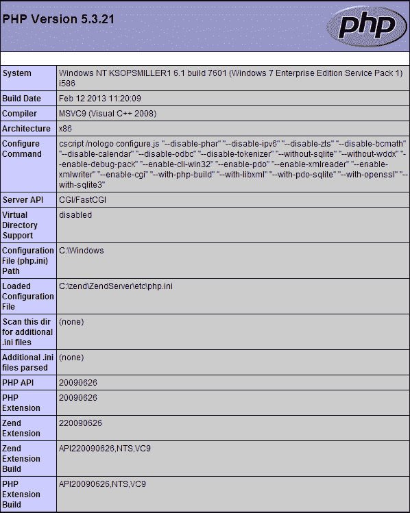
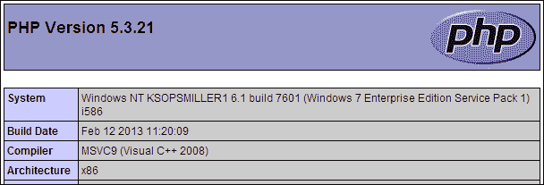
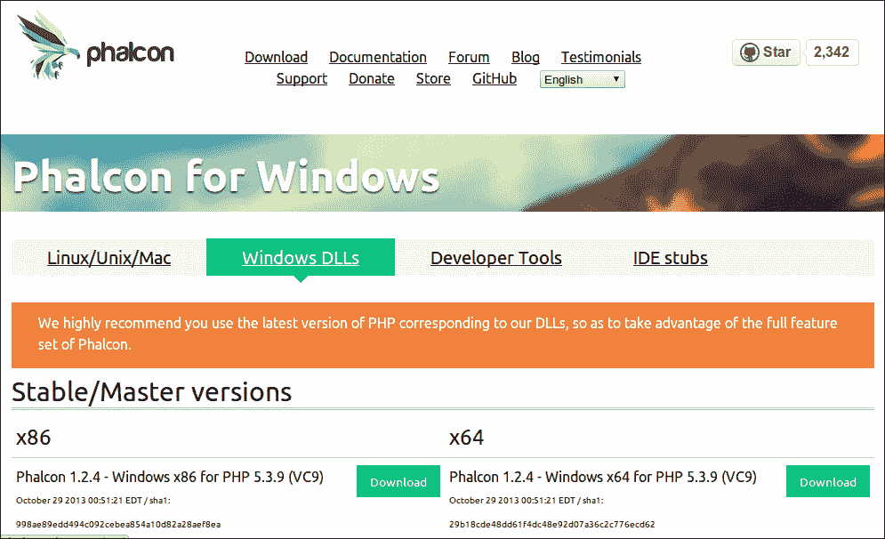
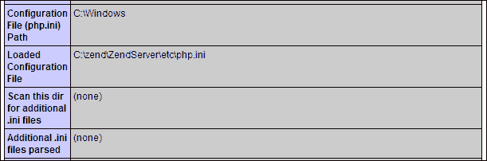
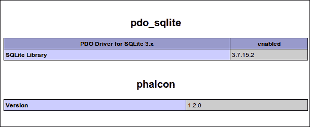

# 第一章 安装 Phalcon

本章将指导您在所选平台上安装 Phalcon。安装过程根据您使用的操作系统略有不同。由于 Phalcon 是用 C 语言编写的 PHP 扩展，因此安装过程比下载 PHP 文件存档并将其上传到您的服务器要复杂一些。

但安装过程仍然应该少于一个小时。根据您的系统和您对 PHP 扩展的经验，可能只需几分钟。在本章结束时，您将拥有一个高性能的 PHP 框架，这将简化您开发应用程序的过程，并帮助您更快地将项目启动运行。

在本章中，您将学习如何：

+   满足 Phalcon 的系统要求

+   找到适合 Windows 机器使用的正确 Phalcon DLL

+   在 Windows 机器上安装 Phalcon DLL

+   在 Linux 上安装 Phalcon

+   在 Mac 上安装 Phalcon

+   在 FreeBSD 上安装 Phalcon

+   编辑您的 `php.ini` 以使用 Phalcon

+   为 Phalcon 配置 Apache

# Phalcon 系统要求

当然，您需要一个 Web 服务器才能使用 Phalcon。Apache 是最常用的，但如果您有 Nginx 或 Cherokee Web 服务器，那也可以。如果您愿意，甚至可以使用 PHP 内置的 Web 服务器作为您的 Phalcon 开发服务器。为了本书的目的，我们假设您已经安装了 Apache。

此外，您还需要安装 PHP。虽然 Phalcon 可以与高于版本 5.3.1 的任何 PHP 版本一起工作，但建议您使用 PHP 5.3.11 或更高版本。5.3.11 之前的 PHP 版本仍然存在后来版本中已修复的安全漏洞和内存泄漏。

但这基本上就是您需要的。Phalcon 并不是特别挑剔。每个特定操作系统可能还有一些其他要求您需要满足，我们将在单独的安装过程中介绍它们。

# 在 Windows 上安装 Phalcon

在本节中，我们将指导您在 Windows 上安装 Phalcon。即使您不在 Windows 上安装扩展，也请阅读本节内容。其中许多步骤，如定位您的 `php.ini`，适用于所有操作系统。

Windows 版本的 Phalcon 扩展是以 DLL 的形式编译的。但是，您必须找到适合您 PHP 版本的正确 DLL。在 Windows 上安装 Phalcon 的第一个要求是使用 Windows Visual Studio 9.0 编译的 PHP 二进制文件。如果您使用的是其他版本的 Visual Studio，那么如果您想让 Phalcon 在您的系统上工作，您将不得不安装正确的 PHP 版本。

因此，让我们查看您的 PHP 安装，以确定您安装了哪个版本的 PHP。首先，您需要找到您的 Web 服务器的文档根目录。或者换句话说，您需要找到当您浏览到`http://localhost`时对应的文件夹，或者找到映射到`http://yourdomain.com`主页的您的服务器上的文件夹。我们将创建一个 PHP 文件，它会告诉我们如何选择正确的 PhalconPHP DLL 版本并将其放入该文件夹。

因此，打开您的文本编辑器或 IDE，创建一个新文件。将其命名为`info.php`。在该文件中，插入以下代码：

```php
<?php
  phpinfo();
?>
```

将文件保存到您的文档根目录。您的文档根目录取决于您在机器上安装了哪个 Web 服务器堆栈。它可能是来自官方网站的 Apache，例如 XAMPP、Wamp 或 AMPPS，或者是 Apache、PHP 和 MySQL 堆栈的其他版本。您最好的选择是访问您下载所选 Apache 版本的网站，并阅读文档。

保存文件后，浏览到`http://localhost/info.php`，您应该看到如下所示的页面截图：



您会注意到页面顶部的 PHP 版本。我们将关注由点分隔的前两个数字。它们将是如前一个屏幕截图所示的**5.3**或 5.4。如果它们是 5.2 或更低版本，您需要更新您的 PHP 安装。

接下来，您需要确保您的 PHP 版本是用 Microsoft Visual Studio 9.0 编译的。因此，在浏览器窗口中搜索单词**编译器**。在大多数浏览器中打开搜索框的命令是*Ctrl* + *F*。它通常位于页面顶部，如下面的屏幕截图所示。如果您的 PHP 是用 Visual Studio 9.0 编译的，您应该看到**MSVC9 (Visual C++) 2008**，如下面的屏幕截图所示：



在**编译器**下方，您将看到**架构**列表。它将显示**x86**或**x64**。在之前的屏幕截图中，PHP 是为**x86**架构编译的。

接下来，我们需要查看您是否有线程安全的 PHP 版本。因此，在浏览器窗口中搜索“PHP 扩展构建”。在此旁边，您将看到您 PHP 安装的构建版本。如果您看到此数字末尾有 NTS，则说明您没有线程安全的 PHP 版本。

现在我们有了这些信息，我们可以前往[`phalconphp.com/en/download/windows`](http://phalconphp.com/en/download/windows)。

### 小贴士

**下载示例代码**

你可以从你购买的所有 Packt 书籍的账户中下载示例代码文件，账户地址为[`www.packtpub.com`](http://www.packtpub.com)。如果你在其他地方购买了这本书，你可以访问[`www.packtpub.com/support`](http://www.packtpub.com/support)并注册以直接将文件通过电子邮件发送给你。你还可以通过访问 GitHub 页面[`eristoddle.github.io/phalconBlog/`](http://eristoddle.github.io/phalconBlog/)找到书中使用的所有代码。

在这里，我们将看到如下所示的页面，列出了多个版本的 Phalcon PHP 扩展：



虽然看起来可能有些令人畏惧，但我们刚刚完成了研究，这将使我们能够选择正确的版本。我们知道我们是否有线程安全的版本。我们知道我们是否有 x86 或 x64 架构。我们还知道我们是否有 PHP 5.3 或 5.4。不要担心 PHP 版本中的最后一个数字。我们只需要下载适合我们配置的扩展。PHP 5.3.9 的 Phalcon 扩展将适用于所有 PHP 5.3 版本，而 PHP 5.4.0 的扩展将适用于所有 PHP 5.4 版本。

下载扩展后，解压它。在 zip 文件中将会有一个 DLL 文件。接下来，我们需要将这个 DLL 文件移动到包含其他 PHP 扩展的文件夹中。如果你安装了 XAMPP，这个文件夹很可能是`c:\xampp\php\ext`，而对于 Wamp，则是`c:\wamp\bin\php_version_number\ext`，其中`php_version_number`将被你安装的 PHP 版本号所替换。对于其他版本的 Web 服务器堆栈，你将需要访问文档以找到 PHP 扩展文件夹。

现在我们已经将扩展放置到需要的位置，但还没有完成。我们需要在 PHP 运行时加载这个扩展。因此，我们必须找到`php.ini`文件并编辑它。但是，你知道吗，我们可以使用我们的`info.php`文件来告诉我们这个文件的位置。所以，再次在浏览器中加载它并搜索**已加载配置文件**。在这个条目旁边列出了其位置，如下面的截图所示：



一旦找到这个文件，就用你的文本编辑器或 IDE 打开它，并滚动到文件的底部。这个文件可能相当长。在文件的底部，你将想要添加以下行来告诉 PHP 加载 Phalcon：

```php
extension=php_phalcon.dll
```

保存文件。一些服务器堆栈，如 XAMPP，有桌面软件来停止和启动 Apache，而其他如来自官方网站的 Apache 则只有托盘图标来控制停止和启动服务器。或者，你也可以直接从命令行重启 Apache。现在重启 Apache，Phalcon 就安装完成了。但让我们检查一下。再次在浏览器中加载`http://localh` `ost/info.php`并搜索 Phalcon，你应该会看到一个如下所示的页面：



# 在 Linux 上安装 Phalcon

Linux 是最常见的用于服务器的操作系统。Phalcon 需要你拥有对服务器的 root 访问权限。如果你在一个共享服务器上，你将不会获得 root 访问权限，但你可能能够联系你的托管提供商为你安装 Phalcon。如果你有一个 VPS、云服务器或专用服务器，你很可能有 root 访问权限。如果没有，你可以要求你的托管提供商为你提供访问权限。

本书不涉及在每个 Linux 安装上安装 Phalcon 的过程，但 Phalcon 扩展的一些 Linux 版本有预构建版本。

对于 Debian Linux，你可以在以下链接找到仓库：

[`debrepo.frbit.com/`](http://debrepo.frbit.com/)

对于 Arch Linux，你可以访问以下链接下载 PKGBUILD：

[`aur.archlinux.org/packages.php?ID=61950`](http://aur.archlinux.org/packages.php?ID=61950)

对于 OpenSUSE，你可以在以下链接找到软件包：

[`software.opensuse.org/package/php5-phalcon`](http://software.opensuse.org/package/php5-phalcon)

对于所有其他版本的 Linux，我们将不得不自己编译 Phalcon。这并不难，如果你已经使用 Linux 一段时间了，你现在可能已经习惯了编译自己的软件。首先，我们必须确保我们安装了以下软件：

+   Git

+   GCC 编译器

+   PHP 开发资源

如果你还没有安装这些软件，你可以通过命令行安装它们。

对于 Ubuntu，命令行如下：

```php
sudo apt-get install git
sudo apt-get php5-devphp-mysqlgcc

```

对于 Fedora、CentOS 和 RHEL，命令行如下：

```php
sudo yum install git
sudo yum install php-develphp-mysqlnd ccc libtool

```

对于 OpenSUSE，命令行如下：

```php
yast2 -igit
yast2 -iphp5-pear php5-develphp5-mysqlgcc

```

对于 Solaris，命令行如下：

```php
pkginstall git
pkg install gcc-45 php-53 apache-php53

```

一旦满足所有要求，打开一个终端窗口并输入以下命令以下载 Git 仓库并编译 Phalcon 扩展：

```php
git clone git://github.com/phalcon/phalcon.git
cd cphalcon/build
sudo ./install

```

在某些 Linux 安装中，编译可能会失败，因为缺少 `libpcre3-dev`。你可以通过使用你的 Linux 软件包管理器安装此软件包来修复此问题。

你刚刚编译了你的第一个 PHP 扩展。现在我们需要将扩展的引用添加到 `php.ini` 文件中。我们可以通过创建一个 `info.php` 文件，如本章中 *在 Windows 上安装 Phalcon* 部分所述，在浏览器中加载它，并在结果页面中搜索 **Loaded Configuration File** 来找到它。在你的文件系统中定位列出的文件，并将以下行添加到文件的底部：

```php
extension=phalcon.so
```

现在，保存文件。如果您在 Debian 类型的 Linux 上安装 PHP 5.4 的 Phalcon，安装新 PHP 扩展的程序已更改。不再建议编辑主`php.ini`文件。在您找到`php.ini`文件的同一文件夹中，通常路径为`/etc/apache5/`，您将找到一个`mods-available`文件夹。您将在这个文件夹中创建一个仅用于 Phalcon 的自定义`.ini`文件，并将其命名为`phalcon.ini`。此文件将为空，因为我们没有为 Phalcon 添加任何自定义配置设置。然后，为了启用扩展，我们只需在命令行中运行以下命令：

```php
php5enmod phalcon

```

现在，重启您的 Web 服务器。重启 Apache 的命令取决于 Linux 的类型。对于 Debian 和 Ubuntu 类型的 Linux，您可以输入以下命令：

```php
sudo service apache2 restart
And for Red Hat, CentOS or Fedora, you would type:
sudo service httpd restart

```

# 在 Mac 上安装 Phalcon

要在 Mac 上安装 Phalcon，步骤基本上与在 Linux 上安装相同。您必须从源代码编译扩展。但首先有一些要求。您需要安装 Git、php5-devel 和带有命令行工具的 Xcode。Xcode 可以从官方 Mac 网站免费获取，但默认情况下并未安装。

此外，Xcode 的命令行工具默认情况下并未与 Xcode 一起安装。为了确保安装这些工具，打开 Xcode 的**偏好设置**面板，选择**下载**标签，然后点击位于**命令行工具**列表旁边的**安装**按钮。

要安装 Git，只需将您的网络浏览器指向[`git-scm.com/download/mac`](http://git-scm.com/download/mac)，下载文件，然后安装它。如果您系统上还没有安装 php5-devel，您也需要安装它。如何安装这取决于您安装的包管理器。Mac 上也有一些预构建的 php5-devel 二进制文件可用。在 Google 上搜索“install Mac php5-devel”应该会指引您正确的方向。

现在我们已经满足了所有要求，步骤与在 Linux 上安装 Phalcon 相同。首先，使用 Git 将源代码拉取到您的计算机上，并在终端中运行以下命令来构建扩展：

```php
git clone git://github.com/phalcon/phalcon.git
cd cphalcon/build
sudo ./install

```

然后，使用本章“在 Windows 上安装 Phalcon”部分中提到的步骤来定位您的`php.ini`文件。一旦找到您的`php.ini`文件，打开它，并在文件的底部添加以下行：

```php
extension=phalcon.so
```

接下来，重启 Apache，然后设置完成。

# 在 FreeBSD 上安装 Phalcon

如果您在 FreeBSD 上安装 Phalcon，您会很容易。Phalcon 有一个可用的端口。可以使用以下命令安装：

```php
pkg_add -r phalcon

```

或者

```php
export CFLAGS="-O2 -fno-delete-null-pointer-checks"cd/usr/ports/www/phalcon&& make install clean

```

# 可选的 Phalcon 依赖项

到目前为止，您应该已经安装了一个可工作的 Phalcon。但为了使用 Phalcon 的一些功能，您可能需要安装以下 PHP 扩展之一、一些或全部：

+   PDO

+   PDO/MySQL

+   PDO/PostgreSQL

+   PDO/SQLite

+   PDO/Oracle

+   mbstring

+   Mcrypt

+   openSSL

+   Mongo

只有在你打算使用它们提供的功能时，你才需要这些。就本书的目的而言，你需要确保你已经安装了 PDO、PDO/MySQL、Mcrypt 和 mbstring 扩展。

# 寻找帮助

Phalcon 一直在不断改进，但有时你可能会遇到标准安装过程可能不起作用或遇到其他错误的问题。本书的范围不包括在安装或使用 Phalcon 时可能发生的所有情况。为了找到这类问题的帮助，我建议查看以下三个地方：

+   Phalcon 的官方论坛：[`forum.phalconphp.com/`](http://forum.phalconphp.com/)

+   Phalcon 的 bug 跟踪器：[`github.com/phalcon/cphalcon/issues`](https://github.com/phalcon/cphalcon/issues)

+   Phalcon 的官方文档：[`docs.phalconphp.com/en/latest/`](http://docs.phalconphp.com/en/latest/)

# 摘要

在本章中，我们学习了如何为我们的操作系统选择正确的 Phalcon PHP 扩展版本。我们还学习了如何在多种系统上安装该扩展。我们编辑了`php.ini`文件，以便 Phalcon 现在将随我们的 PHP 安装一起加载，并成为语言的一个组成部分。

在下一章中，我们将开始开发我们的 Phalcon 博客，通过构建我们网站的骨架结构。
