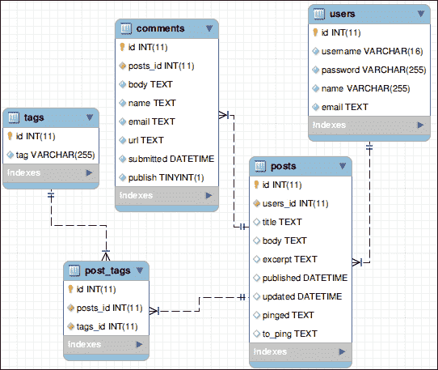
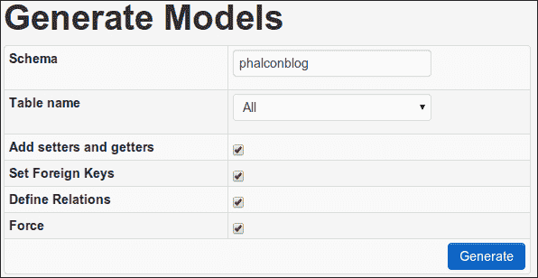
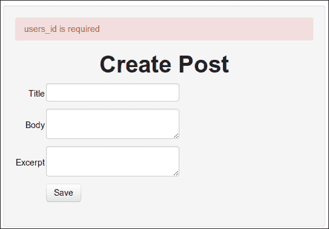
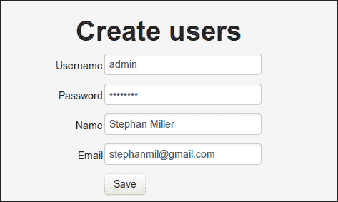
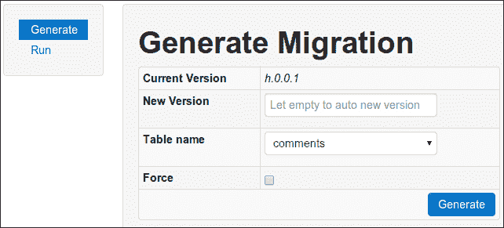

# 第四章：在 Phalcon 中处理数据

除非你正在构建一个通过 API 检索所有数据的程序，否则你很可能需要在应用程序中有一个数据库。Phalcon 为你提供了几种从 PHP 访问数据的方法。在前一章中，我们没有直接与我们的 MySQL 数据库交互。我们可以创建博客文章并将它们存储在我们的数据库中，但 Phalcon 模型为我们做了所有的脏活。我们所做的只是将数据库连接详情添加到我们的配置文件中。

在我们开始使用更多可用的 Phalcon 功能之前，我们的模型可以处理一些更多功能。但是，即使是最简单的应用程序也会发展到需要独特的数据库查询的程度。然而，数据库并不是在应用程序中处理数据的唯一方式。

在本章中，你将学习以下主题：

+   如何使用 Phalcon 模型的更高级功能

+   如何在 Phalcon 应用程序中存储会话数据

+   如何过滤和清理我们的数据

+   如何将我们的 MySQL 数据库替换为另一个数据库系统

+   如何使用 Phalcon 查询语言（PHQL）访问数据库

+   如何使用 Phalcon 的对象-文档映射器（ODM）

+   如何处理数据库迁移

# 添加模型

目前，我们的博客应用程序并没有做什么。我们可以创建和查看帖子，但仅此而已。我们需要考虑在我们的博客中还需要哪些其他表。

## 创建数据库表

我们将会有用户，并且每个用户都将能够写多篇帖子。因此，我们需要一个`users`表，并且我们需要在我们的`posts`表中添加一个`users_id`字段，以便每篇帖子都与一个用户相关联。以下是我们`users`表的 SQL 代码：

```php
CREATE TABLE IF NOT EXISTS `phalconblog`.`users` (
  `id` INT(11) NOT NULL AUTO_INCREMENT ,
  `username` VARCHAR(16) NOT NULL ,
  `password` VARCHAR(255) NOT NULL ,
  `name` VARCHAR(255) NOT NULL ,
  `email` TEXT NOT NULL ,
  PRIMARY KEY (`id`),
  UNIQUE KEY `username` (`username`)
);
```

在你的 MySQL 数据库上运行这个 SQL 片段。如果你需要使用`phpMyAdmin`的帮助，请参考第三章，*使用 Phalcon 模型、视图和控制器*，了解如何执行此代码。现在，你有一个可以存储关于你的用户的最小数据的表，包括他们选择的用户名和密码、他们的姓名和他们的电子邮件地址。我们在`username`列上创建了一个唯一键，因为我们不希望有两个用户使用相同的用户名。

此外，一个没有评论的博客实际上并不算是一个真正的博客。我们希望访客能够对我们的博客应用进行评论。以下是我们需要在数据库上运行的 SQL 代码，以创建我们的评论空间：

```php
CREATE TABLE IF NOT EXISTS `comments` (
  `id` int(11) NOT NULL AUTO_INCREMENT,
  `post_id` int(11) NOT NULL,
  `body` text NOT NULL,
  `name` text NOT NULL,
  `email` text NOT NULL,
  `url` text NOT NULL,
  `submitted` datetime NOT NULL,
  `publish` tinyint(1) NOT NULL,
  `posts_id` int(11) NOT NULL,
  PRIMARY KEY (`id`),
  KEY `fk_comments_posts1` (`posts_id`)
);
```

我们需要将每个评论与特定的帖子相关联，所以我们有一个`post_id`字段。为了存储评论者的详细信息，我们有`name`、`email`和`url`。我们有一个`submitted`日期，这样我们就可以对评论进行排序。此外，我们有一个`publish`字段，当评论提交时我们将它设置为`0`，当我们批准评论时设置为`1`。

我们可能需要组织我们的帖子。我们有几种选择来做这件事。我们可以使用分类，每个帖子都必须适合特定的分类。我们的分类可以有子分类，或者我们可以使用标签，每个标签可以自由地应用于任何帖子，每个帖子也可以有多个标签。或者我们可以两者都做，就像大多数博客应用一样。对于我们的应用，我们将为了简单起见只使用标签。运行以下 SQL 代码来创建`tags`表：

```php
CREATE TABLE IF NOT EXISTS `tags` (
  `id` int(11) NOT NULL AUTO_INCREMENT,
  `tag` varchar(255) NOT NULL,
  PRIMARY KEY (`id`),
  UNIQUE KEY `tag` (`tag`)
);
```

这个表没有太多内容，只有一个`id`和`tag`列。这是因为由于帖子与标签之间存在多对多关系，我们必须使用一个中间表来将我们的`posts`表与`tags`表相关联。然而，我们确实希望每个标签都是唯一的，所以我们把`tag`列设为唯一键。我们将把这个表称为`post_tags`，以下是你需要运行的 SQL 代码来创建它：

```php
CREATE TABLE IF NOT EXISTS `post_tags` (
  `id` int(11) NOT NULL AUTO_INCREMENT,
  `posts_id` int(11) NOT NULL,
  `tags_id` int(11) NOT NULL,
  PRIMARY KEY (`id`),
  KEY `fk_post_tags_tags1` (`tags_id`),
  KEY `fk_post_tags_posts1` (`posts_id`)
);
```

这只是一个 ID 表。这个表中的每条记录都将有一个唯一的 ID，一个帖子 ID 和一个标签 ID。

现在，我们需要修改我们的`posts`表。它需要一个用户 ID。以下是我们需要运行的 SQL 代码来删除并重新创建我们的`posts`表：

```php
DROP TABLE `posts`;
CREATE TABLE IF NOT EXISTS `posts` (
  `id` int(11) NOT NULL AUTO_INCREMENT,
  `users_id` int(11) NOT NULL,
  `title` text,
  `body` text,
  `excerpt` text,
  `published` datetime DEFAULT NULL,
  `updated` datetime DEFAULT NULL,
  `pinged` text,
  `to_ping` text,
  PRIMARY KEY (`id`),
  KEY `fk_posts_users` (`users_id`)
);
```

我们流程的最后一个步骤是在我们的表之间创建外键关系。运行以下 SQL 代码来向我们的数据库添加外键约束：

```php
ALTER TABLE `comments`
  ADD CONSTRAINT `fk_comments_posts1` FOREIGN KEY (`posts_id`) REFERENCES `posts` (`id`);
ALTER TABLE `posts`
  ADD CONSTRAINT `fk_posts_users` FOREIGN KEY (`users_id`) REFERENCES `users` (`id`);
ALTER TABLE `post_tags`
  ADD CONSTRAINT `fk_post_tags_tags1` FOREIGN KEY (`tags_id`) REFERENCES `tags` (`id`),
  ADD CONSTRAINT `fk_post_tags_posts1` FOREIGN KEY (`posts_id`) REFERENCES `posts` (`id`);
```

以下截图表示显示我们数据库中关系的图：



上述截图是从 MySQL Workbench 中的 EER 图工具生成的，您可以在[`www.mysql.com/products/workbench/`](http://www.mysql.com/products/workbench/)免费下载此工具。这个工具对于设计数据库来说非常实用。我用拖放和填写空白的方式创建了所有这些表格和关系。

## 生成模型

现在，让我们使用 Phalcon 网络工具一次性创建所有我们的新模型。浏览到`http://localhost/phalconBlog/webtools.php?_url=/models/index`，你会看到以下屏幕：



这次，我们将选择**表名**为**所有**，并确保我们检查**设置外键**、**定义关系**和**强制**。这样，网络工具就会在我们的模型中设置必要的关系。这将在位于`app`目录下的`models`文件夹中创建以下文件：

+   `Comments.php`

+   `PostTags.php`

+   `Tags.php`

+   `Users.php`

在我们继续重构本章剩余部分的博客项目时，我们将查看这些文件。但是，为了更好地理解我们刚才所做的工作，让我们看看 Phalcon 是如何处理关系的。Phalcon 模型管理器处理模型之间的关系，并且这些关系必须在这些模型的`initialize`函数中设置。通过让 Phalcon 网络工具定义关系，我们可以简单地让它为我们生成`initialize`函数。

在`Users.php`文件的`initialize`函数中，你会找到以下代码行：

```php
$this->hasMany("id", "Posts", "users_id");
```

这行代码设置了应用中文章和用户之间的关系。一个用户将拥有多个文章。这是四种方法之一。其他三种方法如下：

+   `hasOne()`

+   `belongsTo()`

+   `hasManyToMany()`

第一个参数是本地模型中作为关系键的字段。第二个参数是被引用的模型。第三个参数是远程模型的键。由于文章属于用户，我们将在`Posts`模型的`initialize`函数中找到以下代码行：

```php
$this->belongsTo("users_id", "Users", "id");
```

对于大部分情况，你可以忘记数据库中的关系和外键，只需将你的记录当作对象来处理。

# 在 Phalcon 中存储会话数据

首先，我们将赋予自己登录博客并存储用户信息到会话中的能力。我们将等到下一章再加密密码和设置用户权限。现在，我们只想在用户保存博客文章时保存用户 ID。

我们对模型进行了更改，但这并不意味着一切都会正常工作。浏览到`http://localhost/phalconBlog/posts/create`并尝试创建一个新的帖子。你将无法做到。相反，你将在浏览器中看到以下错误消息，因为我们刚刚创建了一个规则，要求我们的数据库中的每个帖子都必须有一个用户 ID：



另一个问题是为了有一个用户 ID，我们需要在`users`表中有一个用户来引用。因此，我们需要能够使用我们的应用程序向数据库中添加用户。所以，回到`http://localhost/phalconBlog/webtools.php?_url=/scaffold`并为你用户的表生成脚手架。我们将从中删除很多内容并更改一些东西，但同样，这是一个好的开始。

一旦你为你用户的表生成了脚手架，浏览到`http://localhost/phalconBlog/users/new`并创建你的用户，如下面的截图所示：



现在我们有了用户，让我们确保在创建新的博客文章时，用户 ID 与之相关联。我们将在用户的会话中设置一个`user_id`变量。首先，我们需要一个登录表单，并且我们可以将它放在`indexAction`函数的模板中，这样我们就可以在那里登录。打开位于`app/views/users`的`index.volt`文件，这是使用 Phalcon Web 工具生成的，并修改它以看起来像以下代码片段：

```php
{{ content() }}

{{ form("users/login", "method":"post", "autocomplete" : "off") }}

<h1>Users</h1>

<div>
    <label for="username">Username</label>
    {{ text_field("username", "size" : 30) }}
</div>

<div>
    <label for="password">Password</label>
    {{ password_field("password", "size" : 30) }}
</div>

{{ submit_button("Login", "class" : "btn") }}

{{ end_form() }}
```

我们剩下的是一个`username`和`password`字段以及一个**提交**按钮。我们还修改了网络工具为我们构建的原始搜索表单，将其提交到一个我们控制器中尚未存在的动作，即`loginAction`函数。

现在，让我们在位于`app/controllers`的`UsersController.php`文件中创建一个`loginAction`函数。我们将添加的方法是以下代码片段：

```php
public function loginAction() {

    if ($this->request->isPost() && isset($_POST('username') && isset($_POST('password')) {
        $query = Criteria::fromInput($this->di, "Users", $_POST);
        $this->persistent->parameters = $query->getParams();
        $parameters = $this->persistent->parameters;
        if (!is_array($parameters)) {
            $parameters = array();
        }
        $users = Users::findFirst($parameters);
        if (count($users) == 1) {
            $user = $users->getFirst();
            $this->session->set("user_id", $user->id);
            $this->flash->success("Welcome " . $user->name);
        } else {
            $this->flash->error("Username and Password combination not found");
        }
    }
    return $this->dispatcher->forward(
        array(
            "controller" => "posts",
            "action" => "index"
        )
    );
}
```

这个方法很简单。它检查是否存在`POST`变量，如果存在，则将`$parameters`设置为`POST`变量。然后，我们将`$users`变量设置为 Phalcon 模型`Find`方法的结果。由于我们在数据库中将`username`列设置为唯一键，我们应该得到一条或没有记录。如果没有记录，我们设置一个闪存消息告诉用户他们输入的内容不正确。如果得到一条记录，我们调用`$users->getFirst()`从我们的查询中获取第一条也是唯一的结果。然后，我们将会话变量`user_id`设置为我们的`$user`对象中的`id`实例。我们在`app/config`中的`services.php`文件加载时启动了会话，因此它在这个控制器中可用。

在我们打开此文件时，我们还应该创建一个注销动作。这个方法甚至更容易编写。我们只需调用`$this->session->remove($var)`，其中`$var`是我们想要从会话中删除的变量。以下是代码的示例：

```php
public function logoutAction(){
        $this->session->remove("user_id");
        $this->flash->success("You have been logged out");
        return $this->dispatcher->forward(
            array(
                "controller" => "users",
                "action" => "index"
            )
        );
    }
```

我们将对这个文件进行最后一次修改。我们已经设置了`indexAction`函数的视图，以便在调用`indexAction`函数时显示登录表单。但是，如果用户已经登录，让我们显示用户列表。为此，我们将修改`indexAction`函数，使其看起来像以下代码片段：

```php
public function indexAction() {
        $this->persistent->parameters = null;
        if ($this->session->has("user_id")) {
            return $this->dispatcher->forward(
                array(
                    "controller" => "users",
                    "action" => "search"
                )
            );
        }
    }
```

在这里，我们简单地检查会话中是否存在用户 ID，如果存在，则将用户转发到搜索控制器，该控制器在未提交搜索参数时显示所有用户的列表。

在我们设置此用户 ID 之前，我们仍然无法创建帖子。因此，打开位于`app/controllers`的`PostsController.php`文件。我们只需在创建博客帖子时设置此 ID，因此我们只将修改`createAction`函数。在我们使用`$post = new Posts()`实例化新帖子之前，我们将添加以下代码片段：

```php
if (!$this->session->has("user_id")) {
            $this->flash->error("Please log in to create a post");
            return $this->dispatcher->forward(
                array(
                    "controller" => "users",
                    "action" => "index"
                )
            );
        }
```

要检查会话中是否包含用户 ID，请将用户转发到登录页面。如果存在 ID，代码将创建新帖子，我们需要在`post`对象中添加以下代码行来添加我们的用户 ID：

```php
$post->users_id = $this->session->get("user_id");
```

最后，我们需要一种注销的方法。我们已经创建了`action`方法，但没有方法可以访问它。因此，打开位于`app/views/users`的`search.volt`文件，并在`{{ content() }}`标签之后添加以下代码片段：

```php
{{ link_to("users/logout/", "Logout", "class" : "btn") }}
```

这将在用户列表顶部添加一个按钮，用于注销我们。现在，我们可以无任何问题地登录并创建帖子。

# 过滤和清理数据

为了防止未经授权的访问、SQL 注入和其他针对我们应用程序的恶意攻击，我们需要过滤和清理用户输入。我们可以使用`Phalcon\Filter`组件来为我们完成这项工作。此组件为 PHP 过滤器扩展提供了包装器。

保护您的应用程序超出了本书的范围，但我们可以看看当我们将用户字段之一命名为电子邮件时，Phalcon 开发工具已经为我们添加的一个过滤器。在位于`app/controller`的`UsersControllers.php`文件中，您会发现`createAction`函数有以下代码行：

```php
$user->email = $this->request->getPost("email", "email");
```

过滤器对象是通过 Phalcon 请求对象访问的。第一个参数是我们正在访问的变量名，第二个可选参数是我们的过滤器。Phalcon 有以下内置过滤器：

| 名称 | 描述 |
| --- | --- |
| `string` | 移除标签 |
| `email` | 移除所有字符，除了字母、数字和特殊字符，如!、#、$、%、&、*、+、-、/、=、?、^、_、'、{、 | }、~、@和[] |
| `int` | 移除所有字符，除了数字、点、加号和减号 |
| `float` | 移除所有字符，除了数字、点、加号和减号 |
| `alphanum` | 移除所有字符，除了 a-z、A-Z 和 0-9 |
| `striptags` | 应用`strip_tags`函数 |
| `trim` | 应用`trim`函数 |
| `lower` | 应用`strtolower`函数 |
| `upper` | 应用`strtoupper`函数 |

您也可以编写自己的过滤器。您可以在[`docs.phalconphp.com/en/latest/reference/filter.html#creating-your-own-filters`](http://docs.phalconphp.com/en/latest/reference/filter.html#creating-your-own-filters)了解更多相关信息。

# 重新审视 Phalcon 模型

我们还需要在我们的应用程序中修复的另一件事是，我们的日期没有任何意义。在我们的`posts`表中，我们发布了和更新了日期，但我们没有使用。让我们确保我们设置了这些日期。让我们打开位于`app/model`的`Posts.php`文件。我们将在我们的帖子模型`initialize`函数中添加更多代码，并且我们将使用日期字段的行为。首先，在第一个 PHP 标签之后添加以下代码行：

```php
use Phalcon\Mvc\Model\Behavior\Timestampable;
```

然后，将以下代码行添加到该模型的`initialize`函数中：

```php
        $this->addBehavior(new Timestampable(
            array(
                'beforeCreate' => array(
                    'field' => 'published',
                    'format' => 'Y-m-d H:i:s'
                )
            )
        ));
        $this->addBehavior(new Timestampable(
            array(
                'beforeUpdate' => array(
                    'field' => 'updated',
                    'format' => 'Y-m-d H:i:s'
                )
            )
        ));
```

我们可以使用`Timestamable`行为来为我们处理发布的和更新的日期设置。第一个参数是我们附加此行为的活动，下一个参数是字段，第三个是日期格式。因此，当创建新记录时，发布的日期将被设置，当更新时，更新的日期也将被设置，而无需在控制器中修改数据时手动设置日期。

现在，让我们给我们的帖子添加标签。首先，我们需要回到浏览器中的 Phalcon Web 工具或命令行中的 Phalcon Developer Tools，并生成`tags`表和`post_tags`表的模型。然后，我们重新生成我们的`posts`表的模型。确保选择**设置外键**和**定义关系**。对于`posts`表，您将不得不设置**强制**选项。

打开您新生成的文件。您可以在位于`app`目录下的`models`文件夹中找到它们。在`Posts.php`文件的底部，您将找到以下新代码：

```php
public function initialize() {
    $this->hasMany("id", "PostTags", "posts_id", NULL);
    $this->belongsTo("users_id", "Users", "id", array("foreignKey" => true));
  }
```

在`Tags.php`文件的底部，您也将找到一个`initialize`函数：

```php
public function initialize() {
        $this->hasMany("id", "PostTags", "tags_id", NULL);
    }
```

在`PostTags.php`文件的底部，您将找到以下代码行：

```php
public function initialize() {
        $this->belongsTo("posts_id", "Posts", "id");
        $this->belongsTo("tags_id", "Tags", "id");
    }
```

这些模型`initialize`函数中的代码基于我们在数据库中创建的外键将这些模型关联起来，并允许我们以对象的形式创建、读取、更新和删除我们的记录。然而，我们仍然需要编写一些代码来实际保存我们保存帖子时的标签。

接下来，让我们在`Posts.php`文件中创建一个新的方法。

```php
public function addTags($tags) {
        foreach ($tags as $t) {
            $t = trim($t);
            $tag = Tags::findFirst(array("tag = '$t'"));
            if (!$tag) {
                $tag = new Tags();
                $tag->tag = $t;
                $tag->save();
            }
            $postTag = PostTags::findFirst(
                array(
                    "conditions" => "$this->id = ?1 AND tags_id = ?2",
                    "bind" => array(
                        1 => $this->id,
                        2 => $tag->id
                    )
                )
            );
            if (!$postTag) {
                $postTag = new PostTags();
                $postTag->posts_id = $this->id;
                $postTag->tags_id = $tag->id;
                $postTag->save();
            }
            unset($tag);
            unset($postTag);
        }
```

我们的功能接受一个标签数组作为第一个参数，以及一个帖子的 ID 作为第二个参数。在这里，我们遍历标签。使用`findFirst`，我们检查标签是否已经存在。在这个例子中，我们使用一个数组，它简单地保存了我们 SQL 查询的`WHERE`子句。如果存在标签，它将被加载到`$tag`变量中。如果没有，`$tag`将为 false，然后我们创建一个新的标签并保存它。接下来，我们检查`post_tag`表中是否有记录将当前标签与帖子 ID 相关联。如果有，我们加载它，如果没有，我们创建它并保存它。

我们已经处理了模型，所以让我们转到控制器。打开位于`app/controllers`目录下的`PostsController.php`文件。在`createAction`和`saveAction`函数中找到以下代码行：

```php
$success = $post->save;
```

这是在帖子创建或编辑后被保存到数据库的点。现在，`$post`对象将附加一个 ID。在每个帖子之后，添加以下代码行：

```php
  $tags = explode(",", $this->request->getPost("tags", "lower"));
  $post->addTags($tags);
```

在这里，我们假设当我们开始创建我们的表单时，我们将接受以逗号分隔的标签。因此，我们将这个标签字符串转换成一个数组，使用`explode`在将字符串设置为小写字母后进行，以确保更多的唯一性。然后，我们使用刚刚添加到我们的`Post`模型中的`addTags`方法来将标签保存到我们的数据库中。

现在，我们需要修改`editAction`函数，以便我们可以将标签发送到我们的编辑表单。在该函数中找到以下代码行：

```php
$this->view->id = $post->id;
```

在它之后添加以下代码：

```php
 $tagArray = array();
 foreach ($post->postTags as $postTag) {
       $tagArray[] = $postTag->tags->tag;
 }
$this->tag->setDefault("tags", implode(",", $tagArray));
```

现在我们只需要修改我们的帖子视图。位于`app/view/post`目录下的`edit.volt`和`new.volt`文件只需要在表格底部，在按钮标记之前添加一个用于标签的字段。

```php
<tr>
        <td align="right">
            <label for="tags">Tags</label>
        </td>
        <td align="left">
                {{ text_field("tags") }}
        </td>
    </tr>
```

在位于`app/view/post`目录下的`show.volt`文件中找到以下代码行：

```php
   {{ post.body }}
```

在之前的代码片段下方插入以下代码片段：

```php
 <div>
    
        {{ posttag.tags.tag }},
    
 </div>
```

现在，我们可以浏览到`http://localhost/phalconBlog/posts/new`并创建一个带有标签的帖子。

# 使用 PHQL

**Phalcon 查询语言**（**PHQL**）是一种高级 SQL 方言，它为 Phalcon 支持的数据库系统标准化 SQL 查询。然而，这并不是 PHQL 的唯一特性。它还具有以下特性：

+   它使用绑定参数来保护你的应用程序

+   它将表视为模型，字段视为类属性

+   它允许数据操作语句以防止数据丢失

+   它只允许每次调用一个查询，以防止 SQL 注入

我们将在侧边栏的搜索表单中使用 PHQL。目前，它实际上相当无用。我们将将其简化，只搜索正文字段，以便事情变得简单。现在，我们将让它工作得更好。我们可以通过不仅搜索正文，还搜索标题和摘要，使这个搜索字段的价值得到提升。因此，我们需要编辑位于`app/controllers`目录下的`PostsController.php`文件中的`searchAction`函数。以下代码片段告诉我们如何编辑文件：

```php
if ($this->request->isPost()) {
            //$query = Criteria::fromInput($this->di, "Posts", $_POST);
            //$this->persistent->parameters = $query->getParams();
            $this->persistent->parameters = $this->request->getPost();
        } else {
            $numberPage = $this->request->getQuery("page", "int");
        }

        $parameters = $this->persistent->parameters;
        if (!is_array($parameters)) {
            $parameters = array();
        }
        //$parameters["order"] = "id";
        $query = $parameters['body'];

        //$posts = Posts::find($parameters);
        $phql = "SELECT * FROM Posts WHERE body LIKE '%$query%' OR
            excerpt LIKE '%$query%' OR title LIKE '%$query%' ORDER BY id";
        $posts = $this->modelsManager->executeQuery($phql);
```

在之前的代码片段中已被注释掉的代码行是旧代码。代码的重要部分在末尾，我们在这里创建 PHQL 查询。注意，我们不是从表中选择，而是从实际模型中选择。然后，我们将`$posts`变量设置为`$this->modelsManager->executeQuery()`返回的结果。`modelsManager`是我们依赖注入容器中加载的服务。

PHQL 还可以帮助我们处理连接操作。由于我们已经定义了模型之间的关系，我们可以使用以下 PHQL 查询来获取带有用户名称的帖子列表：

```php
SELECT Posts.title, Users.name FROM Posts JOIN Users ORDER BY Users.name
```

注意，我们不需要指定连接操作的条件。在这里，假设了一个`INNER JOIN`操作，但可以使用任何类型的连接。

如果你不想编写 PHQL 语句，可以使用一个查询构建器，它类似于其他 PHP 框架（如 Zend 和 Yii）中的查询构建器。我们可以用以下几行代码构建之前的查询，并执行它并返回记录：

```php
$posts = $this->modelsManager->createBuilder()
    ->from('Posts')
    ->join('Users')
    ->orderBy('Users.name')
    ->getQuery()
    ->execute();
```

PHQL 是一种强大的语言，本书和应用程序的范围并不能真正体现其价值。要了解更多关于 PHQL 的知识，超出本书所能教授的内容，请访问[`docs.phalconphp.com/en/latest/reference/phql.html`](http://docs.phalconphp.com/en/latest/reference/phql.html)。

# 在 Phalcon 中切换数据库

我们在我们的应用程序中使用了 MySQL 数据库。如果我们想在中途更改数据库软件，只要我们的新数据库中有相同的数据结构，这并不会太难。目前，Phalcon 支持以下关系型数据库后端：

+   **MySQL**：这是世界上使用最广泛的关系型数据库管理系统，可在[`phalcon-php-framework-documentation.readthedocs.org/en/latest/api/Phalcon_Db_Dialect_Mysql.html`](https://phalcon-php-framework-documentation.readthedocs.org/en/latest/api/Phalcon_Db_Dialect_Mysql.html)找到。

+   **PostgreSQL**：这是一个强大、可靠且开源的数据库管理系统，可在[`phalcon-php-framework-documentation.readthedocs.org/en/latest/api/Phalcon_Db_Dialect_Postgresql.html`](https://phalcon-php-framework-documentation.readthedocs.org/en/latest/api/Phalcon_Db_Dialect_Postgresql.html)找到。

+   **SQLite**：这是一个自包含、无服务器的数据库引擎，可在[`phalcon-php-framework-documentation.readthedocs.org/en/latest/api/Phalcon_Db_Dialect_Sqlite.html`](https://phalcon-php-framework-documentation.readthedocs.org/en/latest/api/Phalcon_Db_Dialect_Sqlite.html)找到。

+   **Oracle**：这是由 Oracle 公司生产的对象关系型数据库管理系统，可在[`phalcon-php-framework-documentation.readthedocs.org/en/latest/api/Phalcon_Db_Dialect_Oracle.html`](https://phalcon-php-framework-documentation.readthedocs.org/en/latest/api/Phalcon_Db_Dialect_Oracle.html)找到。

我们的应用程序通过在`app/config`目录下的`services.php`文件中导入它来设置数据库适配器，如下所示：

```php
use Phalcon\Db\Adapter\Pdo\Mysql as DbAdapter;
```

如果我们想使用不同的数据库系统，我们只需在这里包含不同的适配器。每个适配器处理其相应数据库的大部分专有特性。

# Phalcon 的对象-文档映射器和 MongoDB

在 Phalcon 中，你不仅可以使用关系数据库，还可以使用 Phalcon 的**对象-文档映射器**（**ODM**）连接到 MongoDB。Phalcon 的 ODM 提供了 CRUD 功能、验证、事件和其他有用的服务。

你可以通过以下代码片段将 MongoDB 数据库的连接添加到你的依赖注入容器中：

```php
$di->set('mongo', function() {
    $mongo = new Mongo();
    return $mongo->selectDb("blog");}, true);
```

这将是一个连接到默认的 localhost MongoDB 实例的连接，该实例在默认端口上运行。

我们现在可以像在应用程序使用标准关系数据库时添加模型一样添加模型，但在这里，我们扩展了`\Phalcon\Mvc\Collection`。

```php
class Pages extends \Phalcon\Mvc\Collection{

}
```

真的，在你的模型文件中你只需要这些。这假设我们将使用名为`pages`的集合在我们的`blog`数据库中存储数据。这可能会有些令人困惑，但使用小写名称作为 MongoDB 集合的标准约定。这个类具有与 MongoDB PHP 扩展相同的函数。因此，如果我们想通过 ID 查找页面，我们将使用相同的函数名。

```php
$page = Pages::findById("5087358f2d42b8c3d15ec4e2");
```

每个集合都是一个具有 MongoDB 记录灵活性的对象。一旦你有了`page`对象，就可以对其进行修改并再次保存。

```php
$page->title = "New Title";

$page->adhoc = "Adhoc value just in this record";
$page->save();
```

你可以在[`docs.phalconphp.com/en/latest/reference/odm.html`](http://docs.phalconphp.com/en/latest/reference/odm.html)了解更多关于 ODM 的信息。

# 数据库迁移

Phalcon 开发者工具和 Phalcon Web 工具提供的一个另一个工具是管理不同软件环境之间的数据库更改。要生成数据库迁移，你需要在项目目录中运行以下命令：

```php
phalcon migration generate
```

此命令将简单地从你的数据库中导出每个对象到迁移类中。在我们的应用程序中，这些类将存储在`app`目录下名为当前迁移版本的文件夹中。假设你刚刚更改了应用程序的本地数据模型，并为它创建了一个迁移。然后，你只需将迁移上传到你的开发服务器，并运行以下命令来执行此服务器上数据库的更改：

```php
phalcon migration run
```

要列出可用的配置选项，请运行以下命令：

```php
phalcon migration
```

要使用 Web 工具，我们只需在我们的当前应用程序中浏览到`http://localhost/phalconBlog/webtools.php?_url=/migrations/index`，我们就会看到以下屏幕：



你可以在[`docs.phalconphp.com/en/latest/reference/migrations.html`](http://docs.phalconphp.com/en/latest/reference/migrations.html)了解更多关于 Phalcon 数据库迁移的信息。

# 摘要

在本章中，我们通过添加模型之间的关系来稍微完善了我们的博客应用程序。我们现在可以登录，创建自己的帖子，这些帖子包含更新和创建的日期，并为我们帖子添加标签。在重构应用程序以执行这些操作的过程中，我们学习了在 Phalcon 中处理数据的各种方法。然而，我们的应用程序远未完成。

在下一章中，我们将填补我们应用程序中的一些空白，包括对帖子进行评论的能力、隐藏未登录访客的内容和功能、加密用户密码、生成 RSS 源，以及在我们创建帖子时 ping 网站。
