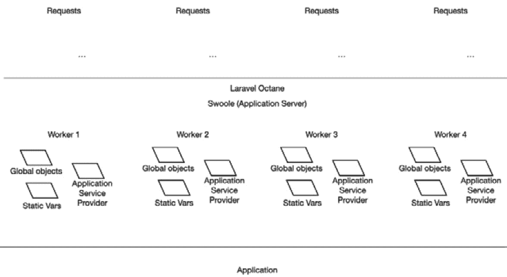

# 理解 Laravel Web 应用程序架构

本书是为希望以更可扩展的方式设计和构建他们的 Laravel Web 应用程序，并使其更高效性能的 **Laravel** 开发者而写的。

本书旨在为您提供有关如何改进 Web 应用程序软件架构的知识、建议和解释，从典型的 PHP Web 应用程序架构到更可扩展和高效架构。

它提供了使用 **Laravel Octane** 设计和构建高性能应用程序所需的所有内容的 360 度概览。我们将看到为什么 Laravel Octane 适合设计和构建高性能应用程序。这本书还涵盖了 Laravel Octane 使用的不同工具，例如 **Open Swoole** 和 **RoadRunner**，并列出并描述了各种功能和差异化元素。但最重要的是，它能够让你理解为什么以及何时使用 Open Swoole 或 RoadRunner。

但在开始之前，为什么使用 Laravel Octane？

Laravel Octane 是一个工具，允许我们访问我们刚才提到的两个应用程序服务器暴露的一些功能和特性。

Laravel Octane 的一个好处是显著提高了客户端（如网页浏览器）对 HTTP 请求的响应时间。当我们开发 Laravel 应用程序时，我们使用框架实现的一个重要软件层。这个软件层需要时间和资源来启动。即使我们只谈论少量资源和很短的时间，这种对每个请求的重复操作，尤其是在存在许多请求的环境中，也可能成为一个问题。或者更确切地说，它的优化可以带来巨大的好处。

通过应用程序服务器，Laravel Octane 正是这样做：优化了框架启动的过程，这通常发生在每个单独的请求中。我们将详细看到这是如何实现的；本质上，框架需要的对象和一切都被启动并分配到应用程序服务器的开始处，然后实例被提供给各个工作者。**工作者**是启动来服务请求的进程。

另一个有趣的原因是评估在您的 Laravel Web 应用程序中采用 Laravel Octane，是因为通过使用像 Swoole 这样的应用程序服务器，您可以访问 Swoole 实现的功能。

功能，例如，缓存驱动程序的先进机制、在各个工作者之间共享信息的共享存储以及并行执行任务。

这对于典型的 PHP 开发者来说是一个全新的概念，他们通常没有在 PHP 核心中立即可用的功能来并行化进程。

本章将向您介绍 Laravel 生态系统，并探讨 Laravel Octane 是什么。

本章旨在向您介绍应用服务器方法，在这种方法中，更多的工作者协同工作以管理多个请求。了解底层的操作行为使开发者能够避免一些错误，尤其是在工作者之间共享资源（对象和全局状态）时。这很重要，因为经典的 PHP 方法是使用一个专门的线程来管理一个请求。

在本章中，我们将涵盖以下主题：

+   探索 Laravel 生态系统

+   理解请求生命周期

+   了解应用服务器

# 技术要求

为了运行本书中展示的代码和工具，您必须在您的机器上安装 **PHP 引擎**。建议安装较新的 PHP 版本（至少 *8.0*，2020 年 11 月发布）。

此外，为了方便安装额外的工具，如果你使用 macOS，建议安装 Homebrew。在 GNU/Linux 系统中，将足够使用所使用的发行版的包管理器，而在 Windows 系统中，建议使用虚拟环境，例如 Docker。

在本章中，将展示一些命令和源代码，只是为了分享一些概念。在随后的章节中，特别是关于 RoadRunner 的第二章和关于 Open Swoole 的第三章，将逐步介绍每个包和工具的安装。

有些人，无论使用什么操作系统，都更喜欢通过使用 Docker 来维护一个“干净”的安装，无论主机操作系统是什么。在接下来的章节中，将处理操作系统依赖工具的安装，不同的方法将根据所使用的系统进行突出显示。

当前章节中描述的示例的源代码和配置文件可在以下位置找到：[`github.com/PacktPublishing/High-Performance-with-Laravel-Octane/tree/main/octane-ch01`](https://github.com/PacktPublishing/High-Performance-with-Laravel-Octane/tree/main/octane-ch01)

# 探索 Laravel 生态系统

Laravel 是 PHP 生态系统中的一个优秀框架，它帮助开发者快速、可靠地构建 Web 应用程序。

它包括一些 PHP 生态系统的优秀工具作为依赖项，例如 **Symfony** 包，以及一些其他坚实且成熟的包，如用于日志记录的 **Monolog**，用于访问文件和存储的 **Flysystem**，以及用于管理 Markdown 格式的 **CommonMark**。

从 Symfony 世界来看，Laravel 包括用于管理路由的 `Symfony/routing` 包，以及用于管理 HTTP 通信的 `http-foundation` 和 `http-kernel` 包。

所有这些只是为了说明 Laravel 使用了 PHP 生态系统的最佳部分，将它们组合在一起，并为开发者提供工具、辅助函数、类和方法，以简化所有工具的使用。

此外，Laravel 不仅仅是一个框架。Laravel 是一个生态系统。

Laravel 还提供与框架集成的应用程序和服务。

例如，Laravel 提供以下内容：

+   **收银员**：用于与 **Stripe** 和 **Paddle** 集成，处理支付和订阅流程。

+   **Breeze**、**Jetstream**、**Sanctum** 和 **Socialite**：用于管理授权、身份验证、社交登录集成流程和公开受保护的 API。

+   **黄昏** 和 **害虫**：用于测试。

+   **Echo**：用于实时广播事件。

+   **Envoyer**、**Forge** 和 **Vapor**：用于服务器或无服务器管理和部署流程管理。

+   **Mix**：通过完全集成 Laravel 前端的 webpack 配置编译 **JavaScript** 和 **CSS**。

+   **Horizon**：基于 **Redis** 的队列监控的 Web 用户界面。

+   **Nova**：Laravel 应用程序的管理员面板构建器。

+   **Sail**：基于 **Docker** 的本地开发环境。

+   **Scout**：一个全文搜索引擎，由 **Algolia**、**Meilisearch** 或简单的 **MySQL** 或 **PostgreSQL** 数据库提供支持。

+   **Spark**：用于管理应用程序中的计费/订阅的样板解决方案。

+   **Telescope**：用于显示调试和洞察的 UI 模块。

+   **Valet**：为运行 PHP 应用程序配置的 macOS 特定应用程序包。它依赖于 **nginx**、**PHP** 和 **Dnsmasq**。

+   **Octane**：用于提高性能和优化资源。

在这本书中，我们将分析此列表中的最后一个工具：Laravel Octane。

我们将介绍 Laravel 生态系统内其他工具的使用，例如 Sail（用于简化完整开发环境的安装过程），以及 Valet（用于正确设置本地环境以运行 Web 服务器和 PHP）。此外，Laravel Octane 依赖于本书中将深入探讨的重要软件。Laravel Octane 有严格的要求：它需要额外的软件，如 Swoole 或 RoadRunner。

但一步一个脚印。

在我们深入探讨工具及其配置之前，了解一些管理 **HTTP 请求** 的基本机制是很重要的。

HTTP

HTTP 是一种定义了在网络上获取资源（如 HTML 文档（网页）和资产）的规则、消息和方法的协议。客户端（需要资源的人）和服务器（提供资源的人）通过交换消息进行通信。客户端发送请求，服务器发送响应。

本书的一个目标是通过做不同的事情来赋予你提升你网络应用程序性能的能力，从设计应用程序架构开始，选择并使用正确的工具，编写代码，最后发布应用程序。

我们将要分析和使用的工具将完成大部分工作，但我认为理解其背后的动态对于有一个良好的意识了解各种工具如何工作，以便您能够以最佳方式配置、集成和使用它们，这一点非常重要。

在我们深入探讨 Laravel Octane 的工作原理之前，让我通过解释 HTTP 请求的生命周期来向您展示服务器通常如何处理 HTTP 请求。

# 理解 HTTP 请求生命周期

在执行 HTTP 请求的过程中涉及了许多组件。组件如下：

+   **客户端**：这是请求开始和响应结束的地方（例如，浏览器）。

+   **网络**：请求和响应通过这个连接服务器和客户端。

+   **代理（Proxy）**：这是一个可选组件，可以在请求到达 Web 服务器之前执行一些任务，例如缓存、重写和/或修改请求，并将请求转发到正确的 Web 服务器。

+   **Web 服务器**：它接收请求并负责选择正确的资源。

+   **PHP**：语言，或者更普遍地说，在服务器端语言的情况下，使用的特定语言引擎。在这种情况下，使用 PHP 解释器。PHP 解释器可以通过两种主要方式激活：作为 Web 服务器模块或作为单独的进程。在后一种情况下，使用一种称为**FastCGI 进程管理器（FPM）**的技术。我们将在稍后更详细地了解这种机制的工作原理。目前，了解 Web 服务器如何以某种方式调用服务器端语言解释器是有用的。通过这样做，我们的服务器能够解释语言。如果被调用的资源是具有特定 PHP 语法的 PHP 类型文件，则请求的资源文件将由 PHP 引擎解释。输出以响应的形式发送回 Web 服务器、网络，然后是浏览器。

+   **框架**：如果应用程序是用 PHP 编写的并且使用了框架，作为开发者，你可以访问类、方法和辅助工具来更快地构建你的应用程序。

组件在 HTTP 请求流中按顺序调用。HTTP 请求从浏览器开始，然后通过网络（可选地通过代理），直到到达调用 PHP 引擎并引导框架的 Web 服务器。

从性能的角度来看，如果你想要带来一些改进，你必须采取一些行动或根据这个架构的元素实现一些解决方案。

例如，在浏览器端，你可以处理浏览器中的缓存资源或优化你的 JavaScript 代码。在网络方面，一个解决方案可能是资源优化，例如，减少资源的重量或引入如 CDN 等架构元素。在 Web 服务器的情况下，一个有效的第一级改进可能是避免加载 PHP 引擎来处理静态资源（非 PHP 文件）。

所有这些微调将在最终章节中解决，我们将处理生产元素的配置和优化。本书的大部分内容涵盖了框架的优化。例如，在第二章和第三章中，讨论了使用 Octane 与 Swoole 和 RoadRunner 等工具，这些工具能够更高效、更有效地加载资源（共享对象和结构）。框架侧的性能改进点还包括通过使用队列系统引入异步方法（第六章和第七章）。

既然你已经了解了 HTTP 请求中涉及的组件，让我们看看 HTTP 请求的结构。

## HTTP 请求的结构

要详细了解典型 HTTP 请求中发生的情况，我们首先分析在请求期间浏览器发送到服务器的数据。请求主要特征是方法（`GET`、`POST`、`PUT`等）、URL 和 HTTP 头。

URL 在浏览器的地址栏中可见，而头由浏览器自动处理，对用户不可见。

以下描述了 HTTP 请求的结构：

+   `GET`方法：读取和检索资源

+   `POST`方法：创建新的资源

+   `PUT`方法：替换资源

+   `PATCH`方法：编辑资源

+   `DELETE`方法：删除资源

+   **URL**标识资源。我们将在下一节中解释 URL 结构（*处理 HTTP 请求*）。**头**包括允许服务器理解如何处理资源的信息。这些信息可以包括认证信息、资源所需的格式等。**体负载**是附加数据，例如，当表单提交到服务器时发送的数据。

既然你已经了解了 HTTP 请求的结构，让我们看看这样的请求是如何处理的。

## 处理 HTTP 请求

一个 URL 由协议、主机名、端口、路径和参数组成。一个典型的 URL 如下所示：

`<``protocol>://<hostname>:<port>/<path>?<parameters>`

例如，一个 URL 可以是以下形式：

`https://127.0.0.1:8000/home?cache=12345`

构成 HTTP 请求的每一部分都由处理 HTTP 请求的各种软件专门使用：

+   协议由浏览器用来确定通信加密（通过 HTTPS 加密或通过 HTTP 非加密）。

+   DNS 使用主机名解析主机名到 IP 地址，而 Web 服务器则用于涉及正确的虚拟主机。

+   端口由服务器的操作系统用来访问正确的进程。

+   路径被 Web 服务器用来调用正确的资源，并且用于框架激活路由机制。

+   应用程序使用参数来控制逻辑的行为（服务器端用于查询参数，客户端用于锚点参数）。例如，查询参数在 URL 中的`?`字符之后定义，而锚点参数在 URL 中的`#`字符之后定义：`https://127.0.0.1:8000/?queryparam=1#anchorparam`。

首先，定义了协议（通常是 HTTP 或 HTTPS）。接下来，指定了主机名，这对于确定要联系哪个服务器是有用的。然后，有一个通常不指定的部分，即端口号；通常，HTTP 的端口号是`80`，HTTPS 的端口号是`443`。还包括标识我们请求的服务器资源的路径。最后，还有两个其他可选部分处理参数。第一个是关于服务器端参数（查询字符串），第二个是关于客户端或 JavaScript 参数（带有锚点的参数）。

除了 URL 之外，请求的另一个特征元素是 HTTP 头部，这对于请求到达的服务器来说非常重要，以便更好地理解如何处理请求。

HTTP 头部基于一些信息和浏览状态由浏览器自动处理。通常，头部指定了资源的格式和其他信息；例如，它们指定了 MIME 类型、用户代理等等。

如果请求的资源受到保护，它们还指定了任何访问令牌。用于管理状态的头元素也以 cookie 和会话引用的形式存在于头部。这些信息对服务器理解并关联连续请求是有用的。

为什么理解一个请求是如何组成的如此重要？因为在分析关于性能的优化元素时，URL 的结构和组成头部的部分决定了网络架构（浏览器、网络、Web 服务器、服务器端语言和框架）中不同元素的行为。

例如，像主机名这样的元素对 DNS（网络）来说是有用的，可以将主机名解析为 IP 地址。了解这一点对于决定是否进行缓存，例如，对于名称解析来说是有用的。

每个涉及的元素都有其自身的特性，可以通过优化来获得更好的性能。

典型的对经典 PHP 应用程序的请求的一个特征元素是每个请求都是相互独立的。这意味着如果您的 PHP 脚本实例化了一个对象，这个操作会随着每个请求而重复。如果您的脚本只被调用几次且脚本很简单，这几乎没有影响。

让我们考虑一个场景，其中我们有一个基于框架的应用程序，该应用程序必须处理大量的并发请求。

一个基于框架的应用程序拥有许多可供使用的对象，这些对象必须在启动时实例化和配置。在经典的 PHP 案例中，框架的启动对应于一个请求。

另一方面，Laravel Octane 引入了一种新的启动应用程序的方式。

在经典的 Laravel 网络应用程序中，只需要一个网络服务器（如 nginx）或 Laravel 在开发者在本地计算机上进行开发时提供的内部网络服务器。一个经典网络服务器可以在没有任何类型的资源共享的情况下处理请求，除非这些资源是外部资源，如数据库或缓存管理器。

与经典网络服务器发生的情况相反，应用程序服务器有启动和管理多个工作进程执行的任务。每个工作进程将通过重用应用程序的对象和逻辑的一部分来处理多个请求。

这有一个好处，即你的应用程序的实际启动和设置各种对象是在从工作进程接收到的第一个请求上发生的，而不是在每个单独的请求上。

## HTTP 请求和 Laravel

从 Laravel 应用程序的角度来看，直接参与 HTTPS 请求的部分通常是路由和控制器。

通过 Laravel 应用程序处理请求通常意味着需要在控制器中实现路由部分和实现管理请求的逻辑。路由允许我们在 Laravel 应用程序中针对 URL 中的特定路径定义要执行的代码。例如，我们可能想要定义，特定类（如 `HomeController::home()`）中的方法代码必须在具有 `/home` 路径的请求中调用。在经典的 Laravel 定义中，我们会在 `routes/web.php` 文件中编写如下内容：

```php
Route::get('/home', [HomeController::class, 'home'])->name("home");
```

现在我们必须在 `HomeController` 类（我们必须创建）中实现管理请求的逻辑，并实现 `home` 方法。因此，在一个新的 `app/Http/Controllers/HomeController.php` 文件中，你必须实现扩展基本控制器类的 `HomeController` 类：

```php
<?php
namespace App\Http\Controllers;
class HomeController extends Controller
{
    public function home(): string
    {
        return "this is the Home page";
    }
}
```

既然你已经了解了网络服务器如何处理请求，那么让我们更多地了解 Laravel Octane 集成的应用程序服务器。

# 了解 Laravel Octane 的应用程序服务器

在 PHP 生态系统中，我们有几个应用程序服务器。

处理服务器配置、启动和执行的 Laravel Octane 集成了其中两个：Swoole 和 RoadRunner。

我们将在稍后详细讨论这些两个应用程序服务器的安装、配置和使用。

目前，对于我们来说，知道一旦安装了应用程序服务器，Laravel Octane 将负责它们的管理就足够了。Laravel Octane 还将通过以下命令负责它们的正确启动：

```php
php artisan octane:start
```

当 Laravel Octane 安装时，会添加 `octane:serve` 命令。

换句话说，Laravel Octane 对应用程序服务器（如 RoadRunner 或 Swoole）有很强的依赖性。

在启动时，Laravel Octane 通过 Swoole 或 RoadRunner 激活了一些工作进程，如下面的图所示：



图 1.1：工作进程的激活

## 工作进程是什么？

在 Octane 中，**工作进程**是一个负责处理与其关联的请求的进程。工作进程有责任启动框架和初始化框架对象。

这从性能角度来看具有极其积极的影响。框架是在分配给工作进程的第一个请求上实例化的。分配给该工作进程的第二个（以及随后的）请求将重用已经实例化的对象。这种副作用是，工作进程在请求之间共享全局对象和静态变量的实例。这意味着不同的控制器调用可以访问请求之间共享的数据结构。

更复杂的是，分配给同一工作进程的请求共享一个全局状态，但不同的工作进程是独立的，并且它们的作用域相互独立。因此，我们可以这样说，并非所有请求都共享相同的全局状态。当请求与同一工作进程相关联时，请求才共享全局状态。来自两个不同工作进程的两个请求之间没有任何共享。

为了最小化副作用，Laravel Octane 负责在请求之间管理框架直接拥有的类/对象的重置。

然而，Octane 无法管理和重置应用程序直接拥有的类。

因此，在使用 Octane 时，需要注意的主要是变量和对象的作用域和生命周期。

为了更好地理解这一点，我将给你一个非常基础的例子。

### 共享变量的示例

这个例子在 `routes/web.php` 文件中创建了一个 `path /` 的路由，并返回一个可读的时间戳。为了简化解释，我们将直接将逻辑写入路由文件，而不是调用并将逻辑委派给控制器：

```php
$myStartTime = microtime(true);
Route::get('/', function () use($myStartTime) {
    return DateTime::createFromFormat('U.u', $myStartTime)
    ->format("r (u)");
});
```

在 `routes/web.php` 路由文件（`web.php` 已经存储在 Laravel 根文件夹项目的 `routes` 目录中），实例化了一个 `$myStartTime` 变量，并将其分配为以毫秒表示的当前时间。然后，该变量通过 `use` 子句由 `route/management` 函数继承。

在与 `route/` 相关的函数的性能中，返回 `$myStartTime` 变量的内容，然后显示。

在 Laravel 应用程序的经典行为中，每次调用/执行时，变量都会被重新生成和重新初始化（每次都带有新值）。

要以经典模式启动 Laravel 应用程序，只需运行以下命令：

```php
php artisan serve
```

一旦启动网络服务器，请通过浏览器访问以下 URL：`http://127.0.0.1:8000`

通过不断刷新页面，每次都会显示不同的值；基本上，每次请求都会显示时间戳。

与使用 Laravel 提供的开发网络服务器不同，您将使用 Laravel Octane 并得到不同的结果。在每次页面刷新（网页重新加载）时，您都会看到相同的值。该值相对于第一个请求的时间戳。这意味着变量是在第一个请求中初始化的，然后该值在请求之间被重复使用。

如果您尝试多次刷新，在某些情况下，您可能会看到新值。

如果发生这种情况，这意味着请求是由第二个（或新的）工作者处理的。这意味着这种行为相当不可预测，因为 Octane 充当负载均衡器。当网络请求到来时，应用程序服务器将决定将请求分配给哪个工作者（那些可用的工作者之一）。

此外，另一个可能导致生成新值的情况是当您达到单个工作者管理的请求最大数量时。我们将在后面看到如何定义最大请求数量，通常，我们将在第二章和第三章中进行 Laravel Octane 配置的深入探讨。

当变量在应用程序服务器重启之前在工作者之间共享的行为仅适用于全局变量或存储在应用程序服务容器中的对象。局部变量（其作用域仅限于函数或方法的变量）不受影响。

例如，在前面显示的代码中，我将在由路由机制调用的函数中声明一个 `$myLocalStartTime` 变量。`$myLocalStartTime` 变量的作用域及其生命周期仅限于 `Closure` 函数：

```php
$myStartTime = microtime(true);
Route::get('/', function () use($myStartTime) {
    $myLocalStartTime = microtime(true);
    return DateTime::createFromFormat('U.u', $myStartTime)
    ->format("r (u)") . " - " .
    DateTime::createFromFormat('U.u', $myLocalStartTime)
    ->format("r (u)");
});
```

使用以下命令执行经典 Laravel 网络服务器：

```php
php artisan serve
```

您将看到每个新请求时这两个值都会改变。您可以通过打开浏览器到 `http://127.0.0.1:8000` 来看到这一点。

使用以下命令以服务器模式启动 Octane：

```php
php artisan octane:start
```

在浏览器中（`http://127.0.0.1:8000`），您将看到两个不同的日期/时间，带有毫秒数。如果您刷新页面，您将只看到第二个的变化（`$myLocalStartTime`）。

当您基于 Octane 构建应用程序时，您必须注意这种行为。

为了更好地理解这种行为，我们可以创建一个具有静态属性的类作为另一个例子。

### 创建具有静态属性的类

为了使这个例子尽可能简单，我在 `routes/web.php` 文件中创建了一个 `MyClass` 类。

我将添加新的路由，这些路由调用`MyClass`对象的`add()`方法，然后调用并返回由`get()`方法检索到的静态属性的值。

在`routes/web.php`中添加以下类：

```php
class MyClass
{
    public static $number = 0;
    public function __construct()
    {
        print "Construct\n";
    }
    public function __destruct()
    {
        print "Deconstruct\n";
    }
    public function add()
    {
        self::$number++;
    }
    public function get()
    {
        return self::$number;
    }
}
```

然后，在`routes/web.php`文件中，声明新的路由如下：

```php
Route::get('/static-class', function (MyClass $myclass) {
    $myclass->add();
    return $myclass->get();
});
```

接下来，你可以使用以下命令以经典方式启动 Laravel：

```php
php artisan serve
```

现在，如果你多次访问 URL `http://127.0.0.1:8000/static-class`，将显示值`1`。这是因为，传统上，对于每个请求，`MyClass`对象都是从零开始实例化的。

使用以下命令启动 Laravel Octane：

```php
php artisan octane:serve
```

如果你多次访问 URL `http://127.0.0.1:8000/static-class`，你将看到第一次请求的值为`1`，第二次为`2`，第三次为`3`，依此类推。这是因为，使用 Octane，`MyClass`对象为每个请求实例化，但静态值保存在内存中。

对于非静态属性，我们可以看到以下差异：

```php
class MyClass
{
    public static $numberStatic = 0;
    public $number = 0;
    public function __construct()
    {
        print "Construct\n";
    }
    public function __destruct()
    {
        print "Deconstruct\n";
    }
    public function add()
    {
        self::$numberStatic++;
        $this->number++;
    }
    public function get()
    {
        return self::$numberStatic . " - " . $this->number;
    }
}
```

在调用页面五次之后，浏览器中显示的结果如下：

```php
Construct Deconstruct 5 – 1
```

这相当简单，但最终有助于理解静态变量在底层的行为。

静态变量的使用并不罕见。只需想想单例对象或 Laravel 的应用容器。

为了避免意外行为——就像在这个特定示例中静态变量的情况，但更普遍地，与全局对象（Laravel 广泛使用它们）相关——必须注意显式重新初始化。在这种情况下，静态变量在构造函数中初始化。我的建议是在构造函数中显式初始化属性。这是因为在这种情况下，开发者有责任负责全局状态（对象和变量）的重新初始化。

```php
class MyClass
{
    public static $numberStatic = 0;
    public $number = 0;
    public function __construct()
    {
        print "Construct\n";
        self::$numberStatic = 0;
    }
    public function __destruct()
    {
        print "Deconstruct\n";
    }
    public function add()
    {
        self::$numberStatic++;
        $this->number++;
    }
    public function get()
    {
        return self::$numberStatic . " - " . $this->number;
    }
}
```

我们已经看到了一些关于如果你要安装和使用 Laravel Octane 时对代码影响的非常基础的示例。前面展示的示例故意设计得非常简单，但目的是易于理解。在我们将在实际场景中使用 Octane 的章节中，我们将涵盖更现实的示例。

现在我们将分析对性能的影响。所以，通过安装 Octane，我们在性能方面可能会有什么样的改进？

# 理解 Laravel Octane 中的性能测量

我们已经说过，在你的应用程序中引入 Laravel Octane 可以提升性能，主要是因为框架使用的对象和类的各种实例不再在每个 HTTP 请求中初始化，而是在应用程序服务器启动时初始化。因此，对于每个 HTTP 请求，框架对象被重用。重用框架对象可以节省在处理 HTTP 请求中的时间。

虽然在逻辑和可理解层面上，这可能在性能方面产生积极影响，但本部分的目标是通过尝试恢复一些指标和值来获取这种性能提升的实用反馈。

为了提供一个关于请求的好处和改进响应时间性能的大致指示，让我们尝试进行一个简单的性能测试。

为了做到这一点，我们将安装一个工具来生成和执行一些 HTTP 并发请求。这类工具有很多，其中之一是 **wrk** ([`github.com/wg/wrk`](https://github.com/wg/wrk))。

如果你有一个 macOS 环境，你可以使用 `brew` 命令（由 Homebrew 提供）来安装 `wrk` 工具。要安装该工具，请使用如下所示的 `brew install`：

```php
brew install wrk
```

使用 `wrk`，你可以生成一定时间内的并发请求。

我们将进行两次测试以进行比较：一次是在 nginx 上的经典 Web 应用程序上进行测试（`http://octane.test`），另一次是在 Laravel Octane 上的应用程序服务器上提供服务（http://octane.test:8000）。

两个 URL 的解析如下所示：

+   `http://octane.test/` 使用本地地址 `127.0.0.1` 解析，并将回复 nginx

+   `http://octane.test:8000/` 使用本地地址 `127.0.0.1` 解析，端口 `8000` 由 Swoole 绑定

`wrk` 执行将使用 4 个线程，打开 20 个连接，并持续 10 秒的测试。

因此，为了测试 NGINX，使用以下参数启动 `wrk` 命令：

```php
wrk -t4 -c20 -d10s http://octane.test
```

你将看到以下输出：

```php
Running 10s test @ http://octane.test
  4 threads and 20 connections
  Thread Stats   Avg      Stdev     Max   +/- Stdev
    Latency    51.78ms   61.33ms 473.05ms   88.54%
    Req/Sec   141.79     68.87   313.00     66.50%
  5612 requests in 10.05s, 8.47MB read
  Non-2xx or 3xx responses: 2
Requests/sec:    558.17
Transfer/sec:    863.14KB
```

要测试 Laravel Octane（RoadRunner），请使用以下命令：

```php
wrk -t4 -c20 -d10s http://octane.test:8000
```

你将看到以下输出：

```php
Running 10s test @ http://octane.test:8000
  4 threads and 20 connections
  Thread Stats   Avg      Stdev     Max   +/- Stdev
    Latency   134.58ms  178.24ms   1.09s    79.75%
    Req/Sec   222.72    192.63     1.02k    73.72%
  7196 requests in 10.02s, 8.06MB read
Requests/sec:    718.51
Transfer/sec:    823.76KB
```

这个测试非常基础，因为没有涉及特殊的服务器端逻辑或查询数据库，但运行这个测试有助于理解 Laravel（应用程序容器、请求等）启动基本对象时的原始差异，并感知它们的味道。

差异并不大（7,196 个请求与 5,612 个请求），大约 22%，但考虑到如果你添加了新的包和库（每个请求都要启动更多的代码），这种差异会增长。

考虑到 RoadRunner 和 Swoole 还提供了其他一些用于提高性能的工具，例如启用并发和执行并发任务。这些附加工具将在第 *2* 章和 *3* 章中展示。

为了更好地解释为什么 Laravel Octane 允许你实现这种改进，让我演示一下服务提供者是如何和何时实例化并加载到服务容器中的。

通常情况下，在一个经典的 Laravel 应用程序服务中，提供者会在每个请求中加载。

在 `app/Providers` 目录中创建一个新的服务提供者 `MyServiceProvider`：

```php
<?php
namespace App\Providers;
use Illuminate\Support\ServiceProvider;
class MyServiceProvider extends ServiceProvider
{
    public function __construct($app)
    {
        echo "NEW     - " . __METHOD__ . PHP_EOL;
        parent::__construct($app);
    }
    public function register()
    {
        echo "REGISTER     - " . __METHOD__ . PHP_EOL;
    }
    public function boot()
    {
        echo "BOOT     - " . __METHOD__ . PHP_EOL;
    }
}
```

新的服务提供者简单地在服务提供者创建、注册和启动时显示一条消息。

服务提供者的生命周期从三个阶段开始：创建、注册和启动。

`register()` 和 `boot()` 方法需要用于 *依赖解析*。首先，每个服务提供者都会被注册。一旦它们都被注册，它们就可以启动。如果一个服务提供者在 `boot` 方法中需要另一个服务，你可以确信它已经准备好使用，因为它已经被注册了。

然后，你必须注册服务提供者，所以需要在 `config/app.php` 文件中的 `providers` 数组中添加 `App\Providers\MyServiceProvider::class`。

在一个经典的 Laravel 网络应用程序中，对于每一个 HTTP 请求，`MyServiceProvider` 服务提供者都会被实例化，并且每次都会调用 `construct`、`register` 和 `boot` 方法，显示以下输出：

```php
NEW          - App\Providers\MyServiceProvider::__construct
REGISTER     - App\Providers\MyServiceProvider::register
BOOT         - App\Providers\MyServiceProvider::boot
```

使用 Laravel Octane，会发生一些不同的事情。

为了更好地理解，我们将使用两个参数启动 Laravel Octane 服务器：

+   `workers`：应该可用于处理请求的工作进程数量。我们将把这个数字设置为 `2`。

+   `max-requests`：在重新加载服务器之前要处理的请求数量。我们将把这个数字设置为每个工作进程的最大限制 `5`。

要以两个工作进程启动 Octane 服务器，并在处理五个请求后重新加载服务器，我们输入以下命令：

```php
php artisan octane:start --workers=2 --max-requests=5
```

启动 Octane 后，尝试使用浏览器访问以下 URL 进行多个请求：`http://127.0.0.1:8000`。

以下是输出结果：

```php
NEW          - App\Providers\MyServiceProvider::__construct
REGISTER     - App\Providers\MyServiceProvider::register
BOOT         - App\Providers\MyServiceProvider::boot
  200    GET / ...................................................... 113.62 ms
NEW          - App\Providers\MyServiceProvider::__construct
REGISTER     - App\Providers\MyServiceProvider::register
BOOT         - App\Providers\MyServiceProvider::boot
  200    GET / ....................................................... 85.49 ms
  200    GET / ........................................................ 7.57 ms
  200    GET / ........................................................ 6.96 ms
  200    GET / ........................................................ 6.40 ms
  200    GET / ........................................................ 7.27 ms
  200    GET / ........................................................ 3.97 ms
  200    GET / ........................................................ 5.17 ms
  200    GET / ........................................................ 8.41 ms
worker stopped
  200    GET / ........................................................ 4.84 ms
worker stopped
```

前两个请求大约需要 100 次调用 `register()` 和 `boot()` 方法。

因此，我们可以看到前两个请求（因为我们有两个工作进程，所以是两个）比后续请求（从第三个到第十个请求，响应时间低于 10 毫秒）慢一些（113.62 毫秒和 85.49 毫秒）。

另一个需要提到的重要事情是，`register` 和 `boot` 方法在前两个请求中会被调用，直到第十个请求（两个工作进程乘以最多五个请求）。后续请求会重复这种行为。

因此，在您的网络应用程序中安装 Laravel Octane 允许您提高应用程序的响应时间。

所有这些都不需要涉及某些工具，例如 Swoole 和 RoadRunner 等应用服务器提供的并发管理工具。

# 摘要

现在，我们已经了解了 Laravel Octane 的行为、一些优点和一些副作用，我们可以继续下一章，通过安装和配置两个 Laravel Octane 兼容的应用服务器之一：RoadRunner 应用服务器。

我们将回顾本章中提到的某些指令。本章的目标是提供一些有用的总结元素，以解决本书其余部分中更具体和详细的案例。

# 第二部分：应用服务器

Laravel Octane 使用应用服务器，如 RoadRunner 或 Swoole。在应用服务器而不是经典网络服务器上运行应用程序，允许开发者使用一些高级功能，例如更有效地管理多个工作进程、并发任务以及以更高效的方式引导应用程序；快速缓存，以及在工作进程之间共享数据。本部分包括以下章节：

+   *第二章*，*配置 RoadRunner 应用服务器*

+   *第三章*, *配置 Swoole 应用程序服务器*
