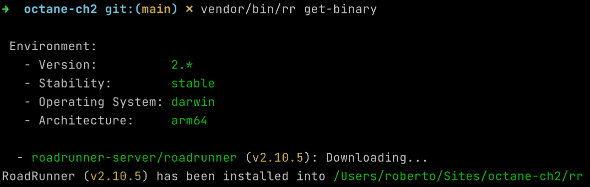
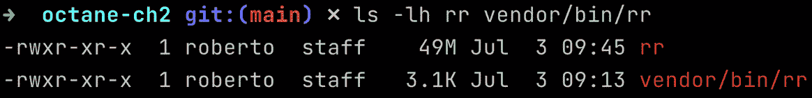
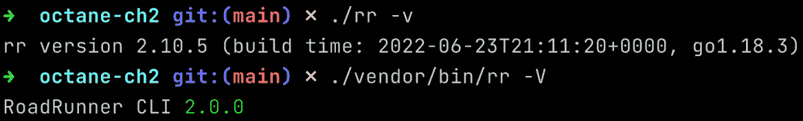
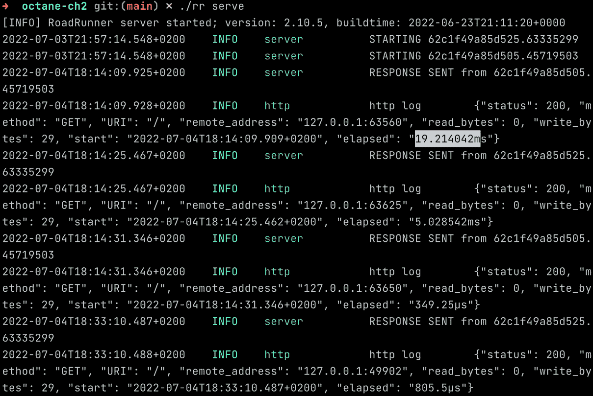

# 2

# 配置 RoadRunner 应用服务器

当在 Laravel 中开发一个 Web 应用程序时，我们习惯于使用 Web 服务器通过网络交付我们的 Web 应用程序。

Web 服务器通过 **HTTP** 或 **HTTPS** 协议公开应用程序，并实现与通过 HTTP 协议交付资源紧密相关的功能。

应用服务器在处理不同协议方面是一个结构化和更复杂的软件组件；它可以处理 HTTP，以及更底层的协议，如 **TCP**，或其他协议，如 **WebSocket**。

此外，应用服务器可以实现一个结构化的工作员结构。这意味着执行应用程序逻辑的应用服务器将执行委托给工作员。工作员是一个负责执行给定任务的隔离线程。

工作员管理允许通过应用服务器运行的应用程序访问并发性和并行任务执行等功能。

要能够管理各种工作员，应用服务器还必须能够实现跨工作员的负载分配功能，并且还必须能够实现适当的平衡（使用负载均衡器）。

在 PHP 生态系统中有很多应用服务器，其中两个是 **RoadRunner** 和 **Swoole**。它们与 Laravel 生态系统相关，因为它们直接由 Laravel Octane 支持。

这两种解决方案具有不同的功能；然而，它们都允许 Laravel Octane 启动不同的工作员，这些工作员将接管 HTTP 请求的解析。

通过 Laravel Octane 可访问的附加功能，仅在 Swoole（而不是 RoadRunner）中可用，包括执行多个并发函数的能力，通过特殊表以优化的方式管理共享数据，以及以计划重复的模式启动函数。我们将在 *第三章* 中介绍 Swoole 提供的附加功能，*配置 Swoole 应用服务器*。

在可用的功能方面，RoadRunner 可能是应用服务器中最简单的一个，它也是最容易安装的。

因此，为了熟悉 Laravel Octane 的配置，我们将从使用 RoadRunner 开始。

本章的目标是向您展示如何设置基本的 Laravel 应用程序，添加 Laravel Octane，使用 RoadRunner 启动 Octane，并对其进行配置。

理解设置和配置是允许您控制应用程序行为的第一个步骤。

在本章中，我们将涵盖以下主题：

+   设置基本的 Laravel 应用程序

+   安装 RoadRunner

+   安装 Laravel Octane

+   启动 Laravel Octane

+   Laravel Octane 和 RoadRunner 高级配置

# 技术要求

本章将涵盖框架和应用服务器设置（安装和配置）。

假设您已经安装了 PHP 和 Composer。我们建议您使用 PHP（至少版本 8.0）并将 Composer 更新到最新版本。

通常，我们有两种主要方法来安装语言和开发工具。第一种是在您的机器操作系统中直接安装工具。第二种是在隔离环境中安装工具，例如虚拟机或 Docker。

如果您想使用 Docker 跟随书中的说明和示例，假设您已经在您的机器上安装了 Docker Desktop。

对于 Docker，我们将提供您必要的说明，以便使用 PHP 和 Composer 运行一个镜像。

采用这种方法，您将能够以相同的方式运行命令和遵循示例，无论您是否有 Docker 或想原生运行 PHP 和 Composer。

我们将从控制台应用程序（或终端模拟器）启动命令，因此预期您非常熟悉此类应用程序（终端、iTerm2、MacOS 的 Warp、Windows 的 Windows Terminal、Terminator、xterm、GNOME 终端、GNU/Linux 的 Konsole，或者适用于所有操作系统的 Alacritty）。

在终端模拟器中，您需要一个 shell 环境，通常是 Bash 或 ZSH（Z shell）。我们将使用 shell 配置来设置一些环境变量，例如 `PATH` 变量。`PATH` 变量指定了搜索命令的目录。

源代码

您可以在本书的官方 GitHub 仓库中找到本章使用的示例源代码：[`github.com/PacktPublishing/High-Performance-with-Laravel-Octane/tree/main/octane-ch02`](https://github.com/PacktPublishing/High-Performance-with-Laravel-Octane/tree/main/octane-ch02)。

# 设置基本的 Laravel 应用程序

本章的目标是配置 Laravel Octane 与 RoadRunner 应用程序服务器。为此，我们必须安装 RoadRunner 应用程序服务器。然而，在安装之前，我们必须首先创建一个新的 Laravel 应用程序，然后添加并安装 Laravel Octane 包。简而言之，为了演示如何安装 RoadRunner，我们将执行以下操作：

1.  从头创建一个新的 Laravel 应用程序。

1.  将 Laravel Octane 包添加到新的 Laravel 应用程序中。

1.  安装 Laravel Octane，执行 Laravel Octane 包提供的特定命令。命令执行将创建一个基本配置，这对于我们开始使用 Laravel Octane 非常有用。我们将在后面的 *安装 Laravel Octane* 部分展示如何安装 Laravel Octane。

## 获取 Laravel 安装程序

要从头开始安装 Laravel，您可以使用 Laravel 安装程序。要全局安装 Laravel 安装程序，在您的终端模拟器中输入以下命令：

```php
composer global require laravel/installer
```

一旦安装了 Laravel，请确保您的 `PATH` 环境变量包括存储全局 composer 包的目录，通常是在您的主目录中的 `.composer/vendor/bin/`。

为了使`PATH`变量持久化并确保在操作系统重启后正确加载，您可以将其添加到您的 shell 配置文件中。例如，如果您正在使用 Zshell，请在您的`.zshrc`文件中添加此行：

```php
export PATH=$PATH:~/.composer/vendor/bin/
```

确保您的 shell 配置正确重新加载并且您正在使用 Zshell，请输入以下命令：

```php
source ~/.zshrc
```

如果您有疑问，请重新启动控制台应用程序（您用于启动命令的应用程序）。

要检查一切是否正常，请尝试通过命令行使用`-V`选项执行 Laravel 安装器工具：

```php
laravel -V
```

如果您收到类似`Laravel Installer 4.2.11`的输出，那么一切正常；否则，您可能会看到类似`command not found`的错误。在这种情况下，我的建议是检查以下内容：

+   `laravel`命令存在于`~/.composer/vendor/bin/`

+   `laravel`命令是可执行的

+   `PATH`变量包括`~/.composer/vendor/bin/`目录

要检查 Laravel 安装器命令是否存在并可执行，您可以使用经典的`ls`命令进行检查：

```php
ls -l ~/.composer/vendor/bin/laravel
```

要查看权限是否包含`x`字符，您将看到类似`-rwxr-xr-x`的输出。

如果命令存在于正确的位置但没有可执行权限，您可以使用`chmod`命令修复它，为所有者（`u`）添加可执行（`+x`）权限：

```php
chmod u+x ~/.composer/vendor/bin/laravel
```

如果命令存在并且具有正确的权限，请检查`PATH`变量是否正确并且包括`~/.composer/vendor/bin/`路径。

如果`PATH`变量不包括正确的路径，请检查您是否已将其添加到`PATH`变量中，如果`PATH`变量包括正确的路径，请确保已重新加载 shell 环境或至少重启您的终端模拟器。

我想对这种检查多说几句。这种检查很有用，并且随着我们添加新的命令，它将继续有用。命令的存在、其权限和其可达性是可以在遇到运行新安装的命令时节省时间的检查。

现在，让我向您展示如何在添加 Laravel Octane 之前安装 Laravel 应用程序。

## 从头开始安装新的 Laravel Web 应用程序

要创建一个新的基本 Laravel 应用程序，我们可以使用 Laravel 安装器：

```php
laravel new octane-ch2
```

如果您没有 Laravel 安装器，您可以使用`composer`命令安装 Laravel 应用程序：

```php
composer create-project laravel/laravel octane-ch2
```

在基本使用中，这些命令（`laravel new` 和 `composer create-project`）相当相似。它们执行以下操作：

+   克隆`laravel/laravel`仓库

+   从`.env.example`创建`.env`文件

+   安装`composer.json`中找到的所有依赖项

+   生成优化的自动加载文件

+   通过执行`php artisan package:discover`命令注册或发现任何新的支持包

+   发布`laravel-assets`文件

+   在`.env`文件中生成应用程序密钥

我建议你使用 Laravel 命令，因为它有一些额外的选项和参数，允许你启用一些很酷的功能，例如添加 Jetstream 框架，选择 Livewire 栈或 Inertia 作为 Jetstream，以及启用 Jetstream 的团队管理。所有这些选项，对于我们目前的目标来说都不是必需的，因此出于这个原因，使用第一个或第二个命令的结果是相同的。

因此，现在你可以进入新的 `octane-ch2` 目录来检查你的新 Laravel 应用程序。

要启动内部 Web 服务器，你可以使用 Laravel 提供的 `artisan` 命令：

```php
php artisan serve
```

如果你打开浏览器访问 http://127.0.0.1:8000，你可以看到 Laravel 的默认主页。

现在我们已经将 Laravel 应用程序启动并运行，是时候设置 RoadRunner 应用服务器了。

# 安装 RoadRunner

RoadRunner 是一个成熟且稳定的 PHP 应用服务器，因此你可以在生产环境中使用它。它是用 **Go** 编程语言编写的，这意味着在底层，RoadRunner 使用 Go 提供的 goroutines 和多线程功能。由于其 Go 实现，RoadRunner 在最常用的操作系统上运行，如 macOS、Windows、Linux、FreeBSD 和 ARM。

再次感谢其 Go 实现版本，RoadRunner 以二进制文件的形式发布，因此安装过程非常简单。

RoadRunner 是一个开源项目，因此你可以访问源代码、二进制文件和文档：

+   源代码：[`github.com/roadrunner-server/roadrunner`](https://github.com/roadrunner-server/roadrunner)

+   二进制发布：[`github.com/roadrunner-server/roadrunner/releases`](https://github.com/roadrunner-server/roadrunner/releases)

+   主要文档：[`roadrunner.dev/docs/readme/2.x/en`](https://roadrunner.dev/docs/readme/2.x/en)

我们可以通过多种方式获取 RoadRunner。

为了快速开始，我将使用 Composer 方法。Composer 方法需要两个步骤：

1.  安装 RoadRunner CLI。

1.  通过 RoadRunner CLI 获取 RoadRunner 二进制文件。

因此，作为第一步，让我根据官方文档安装 RoadRunner CLI，官方文档可在 [`roadrunner.dev/docs/intro-install`](https://roadrunner.dev/docs/intro-install) 找到：

```php
composer require spiral/roadrunner:v2.0 nyholm/psr7
```

如你所见，我们打算添加两个包：

+   RoadRunner CLI 版本 2

+   Nyholm 对 **PSR7** 的实现

Nyholm

Nyholm 是一个实现 PSR7 标准的开源 PHP 包。源代码在这里：[`github.com/Nyholm/psr7`](https://github.com/Nyholm/psr7)。

最后，`composer` 命令将两行添加到你的 `composer.json` 文件的 `require` 部分：

```php
        "nyholm/psr7": "¹.5",
        "spiral/roadrunner": "v2.0"
```

提到的 PSR7 是一个定义 PHP 接口以表示 HTTP 消息和 URI 的标准。这样，如果你打算使用一个库来管理 HTTP 消息和 URI，并且该库实现了 PSR7 标准，你就知道你有一些具有标准化签名的标准方法来管理请求。例如，你知道你有 `getMethod()` 来获取 HTTP 方法，其值是一个字符串（因为它是根据标准定义的）。

通过 Composer 安装 RoadRunner CLI 后，你将在 `vendor/bin/` 目录中找到 `rr` 可执行文件。

要检查它是否存在，请使用此命令：

```php
ls -l vendor/bin/rr
```

你将看到一个文件，大约 3 KB，具有可执行权限（由 `x` 符号表示）。

这个可执行文件是 RoadRunner CLI，它允许你安装 RoadRunner 应用程序服务器可执行文件。要获取可执行文件，你可以使用 `get-binary` 选项执行 RoadRunner CLI：

```php
vendor/bin/rr get-binary
```

命令执行生成的输出将显示软件包版本、操作系统和架构，如图下所示：



图 2.1：获取 RoadRunner 可执行文件

你可能会对此有些混淆，因为 RoadRunner CLI 可执行文件被命名为 `rr`，就像 RoadRunner 可执行文件一样。你应该知道的是，RoadRunner CLI 存储在 `vendor/bin` 目录中，而 RoadRunner 应用程序服务器可执行文件存储在项目根目录中。此外，CLI 大约 3 KB，而应用程序服务器大约 50 MB。



图 2.2：两个 rr 可执行文件，CLI 和应用程序服务器

此外，你可以使用显示版本选项运行两个可执行文件：



图 2.3：rr 版本

现在我们已经安装了 `rr` 可执行文件（RoadRunner），我们可以开始使用它了。

## 执行 RoadRunner 应用程序服务器（不使用 Octane）

要使用基本示例执行 RoadRunner 应用程序服务器，我们需要做以下事情：

+   创建一个配置文件

+   创建一个应用程序服务器在 HTTP 请求击中应用程序服务器时调用的 PHP 脚本

+   启动应用程序服务器

默认情况下，RoadRunner 的配置文件是 `.rr.yaml`。它包含许多配置指令和参数。

一个最小配置文件需要一些东西：

+   为每个工作实例启动的命令 (`server.command`)

+   绑定和监听新 HTTP 连接的地址和端口 (`http.address`)

+   要启动的工作进程数量 (`http.pool.num_workers`)

+   日志级别 (`logs.level`)

这里展示了考虑上述因素的一个配置文件示例：

```php
version: '2.7'
server:
  command: "php test-rr.php"
http:
  address: "0.0.0.0:8080"
  pool:
    num_workers: 2
logs:
  level: info
```

使用此配置文件，`test-rr.php` 是为工作进程启动的脚本，`8080` 是监听连接的端口，使用 `2` 个工作进程和 `info` 作为日志级别。

实现工作者逻辑的脚本文件是`test-rr.php`：

```php
<?php
include 'vendor/autoload.php';
use Nyholm\Psr7;
use Spiral\RoadRunner;
$worker = RoadRunner\Worker::create();
$psrFactory = new Psr7\Factory\Psr17Factory();
$worker = new RoadRunner\Http\PSR7Worker($worker, $psrFactory, $psrFactory, $psrFactory);
// creating a unique identifier specific for the worker
$id = uniqid('', true);
echo "STARTING ${id}";
while ($req = $worker->waitRequest()) {
    try {
        $rsp = new Psr7\Response();
        $rsp->getBody()->write("Hello ${id}");
        echo "RESPONSE SENT from ${id}";
        $worker->respond($rsp);
    } catch (\Throwable $e) {
        $worker->getWorker()->error((string) $e);
        echo 'ERROR ' . $e->getMessage();
    }
}
```

脚本执行以下操作：

+   包含`vendor/autoload.php`

+   使用 RoadRunner 提供的类实例化`worker`对象（`RoadRunner\Http\PSR7Worker`）

+   为显示流量如何平衡和委派给两个工作者生成一个唯一的 ID（`$id = uniqid('', true)`）

+   等待新的连接（`$worker->waitRequest()`）

+   当新的连接请求到达时，生成新的响应（`$worker->respond()`）

使用配置文件和前面的工作者脚本，您可以使用`serve`选项启动应用程序服务器：

```php
./rr serve
```

使用此配置，您将看到由服务器启动的一个服务器和两个工作者。

现在，您可以通过`curl`命令来启动服务。`curl`命令是一种向特定 URL 发送 HTTP 请求的命令。

在另一个终端模拟器（或另一个标签页）的实例中，启动以下命令：

```php
curl localhost:8080
```

通过执行`curl`四次，我们将向端口`8080`的应用程序服务器发送四个不同的请求。

在终端模拟器中，如果您启动应用程序服务器，您将看到应用程序服务器的日志：



图 2.4：应用程序服务器的 INFO 日志

最重要的是，在第一次请求后的前两次请求中，经过的时间至少减少了十倍。

如果您查看`elapsed`值，您将看到第一次请求需要 20 毫秒来执行，而后续请求大约需要几百微秒（1 毫秒等于 1,000 微秒）。

响应时间（以毫秒计的绝对值）可能取决于多个因素（负载、资源、内存、CPU）。请查看相对值以及响应时间在后续请求中的减少程度。响应时间从几毫秒显著减少到几微秒。

因此，我们说，得益于基于 RoadRunner 实现的工作者架构，我们可以提高性能，尤其是在第一次请求之后的请求中。

但我们如何在 Laravel 应用程序中包含和使用 RoadRunner 呢？

之前的示例在纯 PHP 环境中使用了 RoadRunner 提供的对象和方法。现在我们必须弄清楚如何将这些功能/改进包括在 Laravel 中，特别是与框架启动相关的一切。

这就是 Octane 的目标。它允许我们在隐藏集成复杂性、启动过程和配置的同时使用 RoadRunner 的功能。

# 安装 Laravel Octane

创建了脚本文件（`test-rr.php`）和配置文件（`.rr.yaml`），以便理解 RoadRunner 的操作动态。现在，让我们专注于 Laravel Octane 的安装。让我们从通过`laravel new`命令安装 Laravel 应用程序和通过运行`composer require`然后运行`rr get-binaries`来安装 RoadRunner 可执行文件继续讨论。让我简要回顾一下：

```php
# installing Laravel application
laravel new octane-ch2b
# entering into the directory
cd octane-ch2b
# installing RoadRunner CLI
composer require spiral/roadrunner:v2.0 nyholm/psr7
# Obtaining Roadrunner Application Server executable, via CLI
vendor/bin/rr get-binary
```

现在您可以安装 Laravel Octane：

```php
composer require laravel/octane
```

然后，您可以使用`octane:install`命令正确配置 Laravel Octane：

```php
php artisan octane:install
```

使用最新命令，您必须决定是使用 RoadRunner 还是 Swoole。为了本章的目的，选择 RoadRunner。我们将在下一章介绍 Swoole。

`octane:install`执行的任务如下：

+   避免在 Git 仓库中提交/push RoadRunner 文件：检查并最终修复包含`rr`（RoadRunner 可执行文件）和`.rr.yaml`（RoadRunner 配置文件）的`gitignore`文件。

+   确保项目中已安装 RoadRunner 包。如果没有，它将执行`composer require`命令。

+   确保 RoadRunner 二进制文件已安装到项目中。如果没有，它将执行`./vendor/bin/rr get-binary`以下载 RoadRunner 应用程序服务器。

+   确保 RoadRunner 二进制文件可执行（`chmod 755`）。

+   检查一些要求，例如版本 2.x，如果 RoadRunner 应用程序服务器已经安装。

+   在`.env`文件中设置`OCTANE_SERVER`环境变量（如果尚未存在）。

最后的`octane:install`命令将创建一个`config/octane.php`文件，并将一个新的配置键添加到`.env`文件中。新的键名为`OCTANE_SERVER`，其值设置为`roadrunner`。

此值在`config/octane.php`文件中使用：

```php
return [
    /*
    |--------------------------------------------------------------------------
    | Octane Server
    |--------------------------------------------------------------------------
    |
    | This value determines the default "server" that will
      be used by Octane
    | when starting, restarting, or stopping your server
      via the CLI. You
    | are free to change this to the supported server of
      your choosing.
    |
    | Supported: "roadrunner", "swoole"
    |
    */
    'server' => env('OCTANE_SERVER', 'roadrunner'),
```

因此，通过环境变量，您可以控制您想要使用哪个应用程序服务器。

现在我们已经安装了 Laravel Octane，是时候启动它了。

# 启动 Laravel Octane

要启动 Laravel Octane，请运行以下命令：

```php
php artisan octane:start
```

一旦 Laravel Octane 启动，您可以在浏览器中访问`http://127.0.0.1:8000`。

您的浏览器将显示经典的 Laravel 欢迎页面。Laravel 和 Laravel Octane 的欢迎页面在视觉上没有差异。最大的区别是您的应用程序通过 HTTP 服务的方式。

您可以使用一些参数来控制 Octane 的执行：

+   `--host`：默认`127.0.0.1`，服务器应绑定的 IP 地址

+   `--port`：默认`8000`，服务器应可用的端口

+   `--workers`：默认自动，应可用于处理请求的工作进程数量

+   `--max-requests`：默认`500`，在重新加载服务器之前要处理的请求数量

例如，您可以使用两个工作进程启动 Octane：

```php
php artisan octane:start --workers=2
```

因此，现在，在`http://localhost:8000`上打开页面超过两次（两个是工作进程的数量）。您可以通过浏览器打开页面或通过启动`curl`：

```php
curl localhost:8000
```

您可以看到一些我们已知的内容，因为之前已经测试了安装了 Laravel 的 RoadRunner。前两次请求（工作进程的数量为两个）比后续请求慢。

以下输出与 Laravel Octane 服务器显示的日志相关：

```php
  200    GET / .................................. 76.60 ms
  200    GET / .................................. 60.39 ms
  200    GET / ................................... 3.46 ms
  200    GET / ................................... 2.70 ms
  200    GET / ................................... 2.66 ms
  200    GET / ................................... 3.66 ms
```

如果您要启动服务器，请定义在启动服务器之前要处理的请求的最大数量（对于每个工作进程）：

```php
php artisan octane:start --workers=2 --max-requests=3
```

您可以看到类似的输出，但经过六次请求（两个工作进程的最大请求次数为三次），您将看到消息工作进程已停止，并且停止工作进程后的响应时间与第一次和第二次请求相同：

```php
  200    GET / .................................. 86.56 ms
  200    GET / .................................. 52.30 ms
  200    GET / ................................... 2.38 ms
  200    GET / ................................... 2.73 ms
  200    GET / ................................... 2.57 ms
worker stopped
  200    GET / ................................... 2.75 ms
worker stopped
  200    GET / .................................. 63.95 ms
  200    GET / .................................. 60.83 ms
  200    GET / ................................... 1.75 ms
  200    GET / ................................... 2.74 ms
```

为什么重启服务器很重要？为了确保我们防止由于对象（服务器和工作进程）的长期生命周期导致的任何内存泄漏问题，重置状态是一种常见的做法。如果您不打算在命令行中定义 `max-requests` 参数，Laravel Octane 会自动将其设置为 `500`。

在经典的 Web 服务器场景（没有 Laravel Octane）中，与您的应用程序相关的所有对象的生命周期，尤其是框架自动实例化和管理的对象的生命周期，都被限制在每个单独的请求中。在每次请求中，框架工作所需的所有对象都会被实例化，并在将响应发送回客户端时销毁对象。这也解释了为什么在具有 Web 服务器的经典框架中，响应时间比已初始化的工作者的响应时间长。

现在 Laravel Octane 已启动，我们可以查看其配置。

# Laravel Octane 和 RoadRunner 高级配置

如前所述，我们可以在启动 Laravel Octane 期间控制一些参数。这是因为您想更改一些选项，例如工作进程的数量或端口，以及，如以下示例所示，如果您想激活 HTTPS 协议。

在底层，Octane 从命令行收集参数和一些 Octane 配置，并启动 RoadRunner 进程（它启动了 `rr` 命令）。

在 Octane 源代码中，有一个名为 `StartRoadRunnerCommand.php` 的文件，该文件实现了一个 Laravel artisan 命令，其代码如下：

```php
$server = tap(new Process(array_filter([
    $roadRunnerBinary,
    '-c', $this->configPath(),
    '-o', 'version=2.7',
    '-o', 'http.address='.$this->option('host').':
      '.$this->option('port'),
    '-o', 'server.command='.(new PhpExecutableFinder)-
     >find().' '.base_path(config('octane.roadrunner
     .command', 'vendor/bin/roadrunner-worker')),
    '-o', 'http.pool.num_workers='.$this->workerCount(),
    '-o', 'http.pool.max_jobs='.$this->option(
      'max-requests'),
    '-o', 'rpc.listen=tcp://'.$this->option('host').':
     '.$this->rpcPort(),
    '-o', 'http.pool.supervisor.exec_ttl='
     .$this->maxExecutionTime(),
    '-o', 'http.static.dir='.base_path('public'),
    '-o', 'http.middleware='.config(
     'octane.roadrunner.http_middleware', 'static'),
    '-o', 'logs.mode=production',
    '-o', app()->environment('local') ? 'logs.level=debug'
     : 'logs.level=warn',
    '-o', 'logs.output=stdout',
    '-o', 'logs.encoding=json',
    'serve',
]), base_path(), [
    'APP_ENV' => app()->environment(),
    'APP_BASE_PATH' => base_path(),
    'LARAVEL_OCTANE' => 1,
]))->start();
```

查看此源代码有助于您了解用于启动 RoadRunner 可执行文件的参数。

使用 `-c` 选项（`$this->configPath()`），将加载一个额外的配置文件。这意味着如果 Octane 管理的基本选项与您的期望不匹配，您可以在 `.rr.yaml` 配置文件中定义它们。

Octane 管理的基本参数（如前所述）包括主机名、端口、工作进程数量、最大请求次数、管理器的最大执行时间、HTTP 中间件和日志级别。

RoadRunner 配置文件允许你加载特殊和高级配置。一个经典的例子是允许本地 RoadRunner 实例监听并接收 HTTPS 请求。

为什么需要在开发环境中本地提供 HTTPS？你可能需要激活 HTTPS 协议，因为一些浏览器功能仅在页面通过 HTTPS 或 localhost 提供服务时才可用。这些功能包括地理位置、设备运动、设备方向、音频录制、通知等。

通常，在本地开发过程中，我们习惯于通过 localhost 提供服务页面。在这种情况下，没有必要通过 HTTPS 提供服务。然而，如果我们想将页面暴露给本地网络，以便通过连接到本地网络的移动设备测试我们的 Web 应用程序，我们必须确保服务可以通过有效的本地网络地址访问，因此 localhost 是不够的。在这种情况下（对于那些特殊的浏览器功能），需要 HTTPS。

或者另一种场景，即你本地提供的页面包含在网页中（通过 iFrame 或作为资产），而主页面是通过 HTTPS 提供的。在这种情况下，在 HTTPS 环境中包含资产或包含通过 HTTP 提供的页面会在浏览器中引发安全异常。

如果你想要配置 Octane 以服务 HTTPS 请求，你必须执行以下操作：

+   安装一个允许你创建和管理证书的工具，例如**mkcert**。由于 HTTPS 的设计和实现，该协议需要公钥/私钥证书才能工作。

+   为 localhost 或你想要的地址创建证书。

+   查看 CA 证书和密钥存储位置。

为了更好地理解需要什么，让我们看看 RoadRunner 的 HTTPS 配置：

```php
version: "2.7"
http:
  # host and port separated by semicolon
  address: 127.0.0.1:8000
  ssl:
    # host and port separated by semicolon (default :443)
    address: :8893
    redirect: false
    # Path to the cert file. This option is required for
    # SSL working.
    # This option is required.
    cert: "./localhost.pem"
    # Path to the cert key file.
    # This option is required.
    key: "./localhost-key.pem"
    # Path to the root certificate authority file.
    # This option is optional.
    root_ca: "/Users/roberto/Library/Application\
              Support/mkcert/rootCA.pem"
```

两个必填字段和一个可选文件如下：

+   `Cert`：证书文件

+   `Key`：证书密钥文件

+   `Root_ca`：根证书颁发机构文件

使用前两个文件时，HTTPS 可以工作，但你的浏览器会发出警告（因为没有有效的证书，因为证书是自签名的）。只填写前两个参数，证书会被评估为自签名的，通常情况下，浏览器不会认为这样的证书是可信的。

使用第三个文件时，浏览器允许你通过 HTTPS 浏览而没有任何警告（证书是有效的）。

因此，首先，你必须安装**mkcert**。mkcert 的 Git 仓库是[`github.com/FiloSottile/mkcert`](https://github.com/FiloSottile/mkcert)。

mkcert 是一个适用于所有平台的开源工具。

安装 mkcert 并为 macOS 创建证书的说明如下：

```php
brew install mkcert
mkcert -install
mkcert localhost
```

如果你使用 Windows，可以使用 Chocolatey 软件包管理器（[`chocolatey.org/`](https://chocolatey.org/)）并使用以下命令：

```php
choco install mkcert
```

对于 GNU/Linux，你可以使用你发行版提供的软件包管理器。

现在，项目目录中有两个新文件：`localhost-key.pem`和`localhost.pem`。

注意

我强烈建议将这些两个文件列入 `.gitignore` 文件中，以防止它们被推送到你的 Git 仓库（如果使用的话）。

你可以在你的 `.rr.yaml` 文件中使用第一个作为 `key` 参数，第二个作为 `cert` 参数。

要填充 `root_ca` 参数，你必须通过 `mkcert` 命令（使用 `CAROOT` 选项）查看 CA 文件存储的位置：

```php
mkcert -CAROOT
```

此命令将显示存储 CA 文件的位置。

要查看 CA 文件名，请运行以下命令：

```php
ls "$(mkcert -CAROOT)"
```

你可以用 `rootCA.pem` 文件的完整路径填充 `root_ca` 参数。

注意

如果你使用的是 Firefox，并且仍然收到自签名证书警告，请安装 `certutil`（使用 Homebrew，`certutil` 包含在 `nss` 包中，因此执行 `brew install nss`），然后再次执行 `mkcert -install`（并重新启动 Firefox 浏览器）。

现在，你可以使用以下命令启动 Octane：

```php
php artisan octane:start
```

在 `address` 参数定义的 URL 上打开你的浏览器。根据最后一个示例中使用的参数（`.rr.yaml` 文件中的 RoadRunner 配置），你应该打开浏览器并打开此 URL：`https://127.0.0.1:8893`。（注意 `https://` 是协议而不是 `http://`）

因此，现在你已经熟悉了如何使用 Laravel Octane 安装 RoadRunner，启动 Octane 服务器，以及访问高级配置。

# 摘要

在本章中，我们探讨了使用 RoadRunner 应用程序服务器安装和配置 Laravel Octane。我们查看了我们从使用 RoadRunner 获得的好处以及如何启用高级功能，如 HTTPS 协议。

在下一章中，我们将看到如何使用 Swoole 做同样的事情。我们将看到 Swoole 相比 RoadRunner 的额外功能，并在 *第四章*，*构建 Laravel Octane 应用程序* 中，我们将开始查看使用 Octane 服务运行的 Web 应用程序的代码，该服务现在正在运行。
