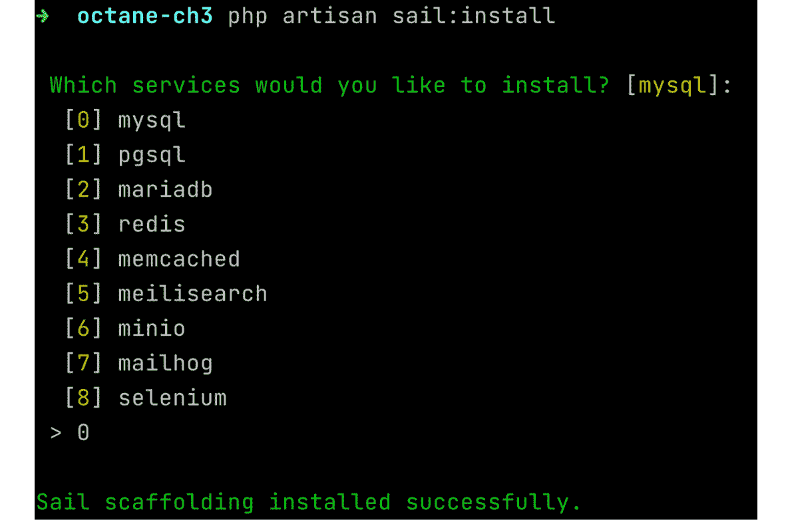
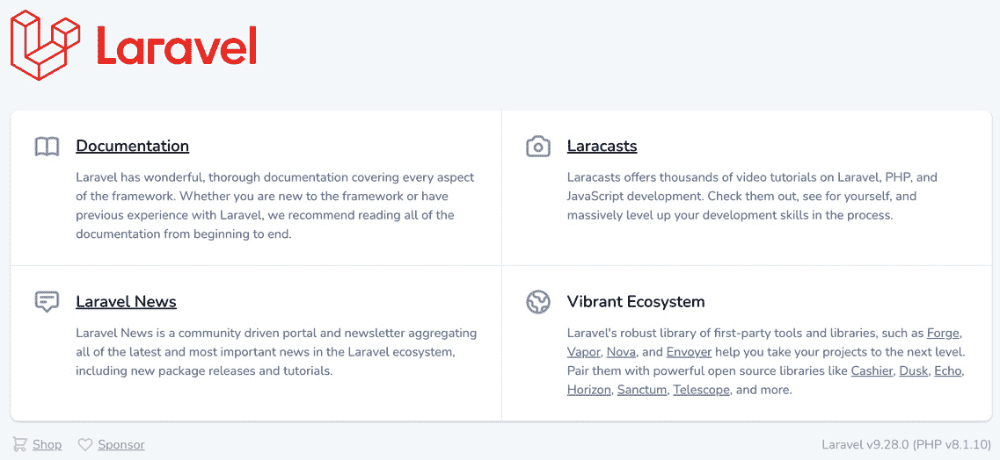
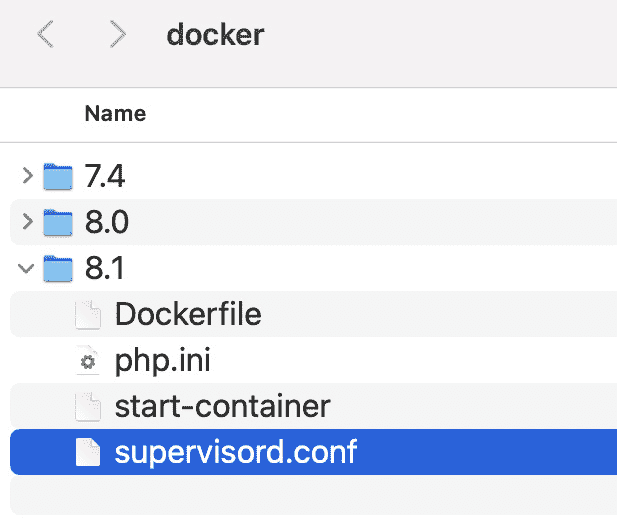
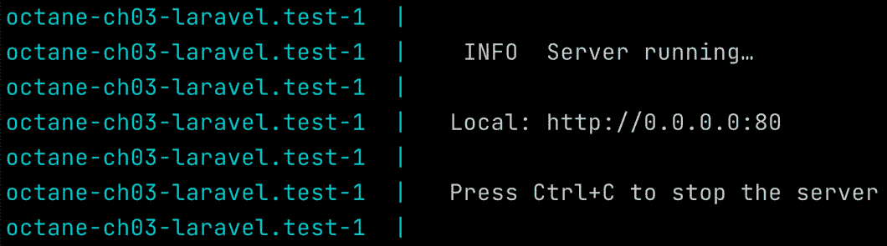
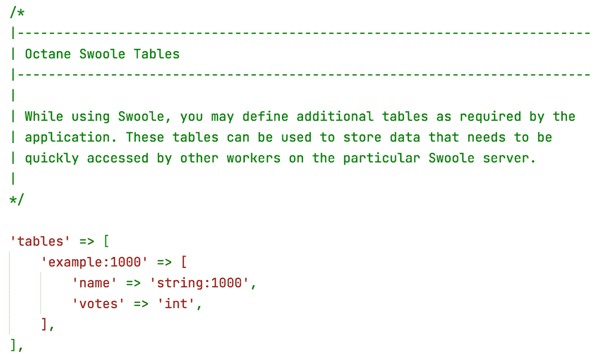

# 配置 Swoole 应用服务器

使用 Laravel Octane，您可以选择另一种类型的应用服务器。除了 RoadRunner 之外，我们还可以配置和使用 Swoole。这两个工具都允许您实现应用服务器。显然，这两个工具之间存在不同的元素，有时决定使用哪一个可能会很困难。

正如我们所见，RoadRunner 是一个独立的可执行文件，这意味着其安装，如在第二章*配置 RoadRunner 应用服务器*中所示，相当简单，不会影响 PHP 引擎的核心。这意味着它很可能对引擎核心中的其他工具没有副作用。这些工具（如 Xdebug）通常是诊断、监控和调试工具。

我想给出的建议是，在分析和选择应用服务器的过程中，评估可能对开发过程有用的各种其他工具（如 Xdebug），并评估它们与 Swoole 的兼容性。

尽管管理 Swoole 的复杂性更高，但 Swoole 提供了诸如内存缓存管理（性能上的好处）、Swoole Table（用于在不同进程之间共享信息的数据存储，便于进程间的信息共享和更好的协作），以及能够在特定间隔启动异步函数和进程的能力（从而实现函数的异步和并行执行）等额外和高级功能。

在本章中，我们将了解如何使用 Laravel Octane 安装和配置 Swoole，以及如何最好地使用 Swoole 提供的特定功能。在本章中，我们将探讨 Swoole 的功能，例如执行并发任务、执行间隔任务、使用 Swoole 提供的高性能缓存和存储机制，以及访问关于工作者使用情况的指标。所有这些功能都可通过 Swoole 应用服务器通过 Octane 提供。

尤其是以下内容：

+   使用 Laravel Sail 配置 Laravel Octane 与 Swoole

+   安装 Open Swoole

+   探索 Swoole 功能

# 技术要求

本章将涵盖 Swoole 和 Open Swoole 应用服务器的设置（安装和配置）。

与我们为 RoadRunner 所做的不同，在这种情况下，我们必须安装一个 **PHP 扩展社区库**（**PECL**）扩展，以便 PHP 能够与 Swoole 一起操作。

什么是 PECL？

PECL 是 PHP 扩展的仓库。PECL 扩展是用 C 语言编写的，并且必须编译后才能与 PHP 引擎一起使用。

由于安装 PECL 模块及其所有依赖项的编译、配置和设置复杂，我们将使用容器方法——因此，我们不会在我们的个人操作系统中安装编译 PHP 扩展所需的所有必要工具，而是使用**Docker**。

这使我们能够在真实的操作系统内托管一个运行中的操作系统（容器）。在容器中拥有一个隔离的操作系统目的是为了包含 PHP 开发环境所需的所有内容。

这意味着如果我们安装依赖项和工具，我们将在一个隔离的环境中完成，而不会影响我们的真实操作系统。

在上一章中，我们没有使用这种方法，因为要求更简单。然而，许多人使用容器方法来处理每个开发环境，即使是简单的那些。

随着开发环境开始需要额外的依赖项，它可能变得难以管理。在进化的情况下，这可能会变得尤其难以管理：试着想象同时管理多个版本的 PHP，这可能会需要依赖项的额外版本。为了在一致的环境中隔离和限制所有这些，建议使用容器方法。为此，建议安装**Docker Desktop** ([`www.docker.com/products/docker-desktop/`](https://www.docker.com/products/docker-desktop/))。

一旦我们安装了 Docker Desktop，我们将配置一个带有所需扩展的特定 PHP 镜像。

我们将要安装的所有新包都将存储在这个镜像中。当我们删除开发环境时，只需删除使用的镜像即可。我们操作系统中安装的唯一工具将是 Docker Desktop。

因此，要安装 Docker Desktop，只需下载并按照适用于您操作系统的安装向导进行即可。在 macOS 的情况下，请参考参考芯片的类型（Intel 或 Apple）。

如果你没有深入了解 Docker，不要担心——我们将使用 Laravel 生态系统中的另一个强大工具：**Laravel Sail**。

Laravel Sail 是一个命令行界面，它公开了用于管理 Docker 的命令，特别是针对 Laravel。Laravel Sail 简化了 Docker 镜像的使用和配置，使开发者能够专注于代码。

我们将使用 Laravel Sail 命令来创建开发环境，但底层将产生 Docker 命令和现成的 Docker 配置。

源代码

你可以在这个章节中使用的示例的源代码在本书的官方 GitHub 仓库中：[`github.com/PacktPublishing/High-Performance-with-Laravel-Octane/tree/main/octane-ch03`](https://github.com/PacktPublishing/High-Performance-with-Laravel-Octane/tree/main/octane-ch03)。

# 使用 Laravel Sail 设置 Laravel Octane 与 Swoole

为了有一个使用 Swoole 作为应用服务器并通过 Docker 容器运行的运行环境，你必须遵循一些步骤：

1.  设置 Laravel Sail

1.  安装 Laravel Octane

1.  设置 Laravel Octane 和 Swoole

## 设置 Laravel Sail

首先，创建你的 Laravel 应用：

```php
laravel new octane-ch03
cd octane-ch03
```

或者，如果你已经有了你的 Laravel 应用，你可以使用`composer show`命令来检查 Laravel Sail 是否已安装。此命令还会显示有关包的一些附加信息：

```php
composer show laravel/sail
```

如果 Laravel Sail 未安装，请运行`composer require` `laravel/sail --dev`。

一旦安装了 Sail，你必须创建一个`docker-compose.yml`文件。要创建`docker-compose.yml`文件，你可以使用`sail`命令，`sail:install`：

```php
php artisan sail:install
```

`sail:install`命令将为你创建 Docker 文件。`sail:install`过程将询问你想要启用哪个服务。为了开始，你可以选择默认项（`mysql`）：



图 3.1 – Laravel Sail 服务

回答`sail:install`命令中的问题以确定要包含哪些服务。Sail 的 Docker 配置从一组现成的模板（占位符）开始，`sail:install`命令包含了必要的模板。如果你对包含哪些模板以及它们是如何实现的感兴趣，请查看这里：[`github.com/laravel/sail/tree/1.x/stubs`](https://github.com/laravel/sail/tree/1.x/stubs)。

如果你查看这些模板，你会看到它们使用了环境变量，例如`${APP_PORT:-80}`。这意味着你可以通过环境变量来控制配置，这些变量可以通过`.env`文件进行配置。`.env`文件由 Laravel 的安装自动生成。如果由于某种原因`.env`文件不存在，你可以从`.env.example`文件（例如，当你克隆一个使用 Laravel Octane 的现有仓库时，可能`.env`文件包含在`.gitignore`文件中）复制`.env`文件。在示例中，如果你想自定义 Web 服务器接收请求的端口（`APP_PORT`），只需将参数添加到`.env`文件中：

```php
APP_PORT=81
```

在这种情况下，将使用端口`81`来服务你的 Laravel 应用，默认端口为`80`，如`${APP_PORT:-80}`所示。

注意

在*使用 Swoole 功能*部分的示例中，将使用`APP_PORT`设置为`81`的 Laravel Sail，因此所有示例都将引用主机`http://127.0.0.1:81`。

如果你已经修改了`.env`文件，你现在可以从你的 Laravel 项目目录中启动命令：

```php
./vendor/bin/sail up
```

这将启动 Docker 容器。第一次执行可能需要一些时间（几分钟），因为将下载预配置的包含 nginx、PHP 和 MySQL 的镜像。

一旦命令执行完成，你可以访问`http://127.0.0.1:81`页面并看到你的 Laravel 欢迎页面：



图 3.2 – Laravel 欢迎页面

与此容器方法相比，主要区别在于用于渲染页面的工具（nginx、PHP）包含在 Docker 图像中，而不是在您的主操作系统上。使用此方法，您甚至可能没有在主操作系统上安装 PHP 和 nginx 引擎。Laravel Sail 配置指示 Docker 使用容器来运行 PHP 和所有需要的工具，并将本地文件系统中的本地源代码（您的 Laravel 项目的根目录）指向本地文件系统。

现在我们已经将 Laravel Sail 与您的 Laravel 应用程序一起安装好了，我们必须添加 Laravel Octane 的相关内容，以便使用 Sail 提供的 Laravel 图像中已经包含的 Swoole 包。

让我们从安装 Laravel Octane 开始。

## 安装 Laravel Octane

我们将通过 Laravel Sail 提供的容器来安装 Laravel Octane。

因此，当 `sail up` 仍在运行（作为服务器运行）时，使用 `composer require` 命令启动 Octane 包。使用 `sail` 启动命令将在您的容器内执行您的命令：

```php
./vendor/bin/sail composer require laravel/octane
```

## 设置 Laravel Octane 和 Swoole

为了调整启动服务器的命令，您必须使用以下命令发布 Laravel Sail 文件：

```php
./vendor/bin/sail artisan sail:publish
```

此命令将从根项目目录中的 `docker` 目录中的包中复制 Docker 配置文件。

它创建了一个 `docker` 目录。在 `docker` 目录内，创建了多个目录，每个目录对应一个 PHP 版本：`7.4`、`8.0`、`8.1`。

在 `docker/8.1` 目录中，您有以下内容：

+   一个 Dockerfile。

+   `php.ini` 文件。

+   用于启动容器的 `start-container` 脚本。此脚本引用了带有引导配置的 `supervisor.conf` 文件。

+   包含监督脚本配置的 `supervisor.conf` 文件。



图 3.3 – Docker 配置文件（sail:publish 执行后）

`supervisord.conf` 文件很重要，因为它包含了容器中 web 服务器的引导命令。默认情况下，`supervisord.conf` 文件包含命令指令：

```php
command=/usr/bin/php -d variables_order=EGPCS /var/www/html/artisan serve --host=0.0.0.0 --port=80
```

现在，我们有了 Laravel Octane，所以不再使用经典的 `artisan serve`，而要改为使用 `artisan octane:start`；因此，在 `docker/supervisor.conf` 文件中，您必须调整命令行：

```php
command=/usr/bin/php -d variables_order=EGPCS /var/www/html/artisan octane:start --server=swoole --host=0.0.0.0 --port=80
```

如果您看的话，您会看到，使用 `artisan octane:start` 时，带有 `--server=swoole` 参数的 Swoole 服务器也被定义了。

注意

如果您对端口 `80` 和 `81` 感到困惑，只是为了澄清：容器中的应用服务器将监听内部端口 `80`。通过 `APP_PORT=81`，我们指示 Docker 将来自端口 `81` 的外部连接映射到内部端口 `80`。

当你更改一些 Docker 配置文件时，你必须重建镜像以便容器使用更改的文件。要重建镜像，请使用 `build` 选项：

```php
./vendor/bin/sail build --no-cache
```

这个命令需要一段时间才能完成，但一旦完成，你就可以执行 `sail up` 命令：

```php
./vendor/bin/sail up
```

当 Octane 准备就绪时，你会看到 `INFO Server` `running…` 消息：



图 3.4 – Octane 服务器正在运行

如果你打开你的浏览器，你可以访问 `http://localhost:81`。你的控制台中的消息表明服务器正在监听端口 `80`，但如我们之前提到的，监听端口 `80` 的进程是 Docker 容器内的内部进程。Docker 容器外部的进程（你的浏览器）必须引用暴露的端口（根据 `APP_PORT` 配置，为 `81`）。

在你的浏览器中，你会看到默认的 Laravel 欢迎页面。你可以从响应的 HTTP 服务器头中看出这个页面是由 Octane 和 Swoole 服务的。查看这个的一个方法是使用带有 `-I` 选项的 `curl` 命令来显示头信息，并使用 `grep` 命令过滤所需的头信息：

```php
curl -I 127.0.0.1:81 -s | grep ^Server
```

输出将如下所示：

```php
Server: swoole-http-server
```

这意味着 Laravel 应用程序是由 Octane 和 Swoole 应用服务器服务的。

因此，我们可以开始使用一些 Swoole 功能 – 但在那之前，让我们先安装 Open Swoole。

# 安装 Open Swoole

Laravel Sail 默认使用包含 Swoole 模块的 PHP 镜像。Swoole 以 PECL 模块的形式分发，你可以在这里找到它：[`pecl.php.net/package/swoole`](https://pecl.php.net/package/swoole)。源代码在这里：[`github.com/swoole/swoole-src`](https://github.com/swoole/swoole-src)。

一些开发者从 Swoole 的源代码中分叉，创建了 Open Swoole 项目来解决安全问题。

分叉的原因在此处报告：[`news-web.php.net/php.pecl.dev/17446`](https://news-web.php.net/php.pecl.dev/17446)。

因此，如果你想将 Swoole 作为 Laravel Octane 的引擎，你可以决定使用 Open Swoole 实现。如果你想使用 Open Swoole，安装和配置与 Swoole 相同；Open Swoole 也以 PECL 模块的形式分发。

Laravel Octane 支持两者。

为了演示目的，我将在操作系统（无 Docker）中直接为新的 Laravel 项目安装 Open Swoole。

```php
# installing new Laravel application
laravel new octane-ch03-openswoole
# entering into the new directory
cd octane-ch03-openswoole
# installing Pecl module
pecl install openswoole
# installing Octane package
composer require laravel/octane
# installing Laravel Octane files
php artisan octane:install
# launching the OpenSwoole server
php artisan octane:start
```

要检查 HTTP 响应是 Open Swoole 服务器创建的，在另一个终端会话中，启动以下 `curl` 命令：

```php
curl -I 127.0.0.1:8000 -s | grep ^Server
```

这是输出结果：

```php
Server: OpenSwoole 4.11.1
```

因此，Open Swoole 是 Swoole 项目的分支。我们将称之为 Swoole；你可以决定安装哪一个。在 *探索 Swoole 功能* 部分讨论的功能都由 Swoole 和 Open Swoole 支持。

在探索 Swoole 功能之前，我们应该安装一个额外的包来提高开发者体验。

# 在编辑代码之前

我们将使用 Swoole 功能，实现一些示例代码。当你更改（或编辑）你的代码，并且 Laravel Octane 已经加载了工作进程时，你必须重新加载工作进程。手动来说，你可以使用 Octane 命令。如果你使用 Laravel Sail（因此是 Docker），你必须在该容器中运行命令。命令如下：

```php
php artisan octane:reload --server=swoole
```

如果你在一个容器中运行，你必须使用`sail`命令：

```php
vendor/bin/sail php artisan octane:reload --server=swoole
```

如果你想要避免每次编辑或更改代码时手动重新加载工作进程，并且你希望 Octane 自动监视文件更改，你必须做以下操作：

+   安装`watch`模式

+   修改`supervisord`配置文件以使用`--watch`选项启动 Octane

+   重建镜像以反映更改

+   再次执行`Sail`

因此，首先，让我们安装`chokidar`：

```php
npm install --save-dev chokidar
```

在`docker/8.1/supervisord.conf`中，将`--watch`选项添加到`octane:start`命令指令中：

```php
command=/usr/bin/php -d variables_order=EGPCS /var/www/html/artisan octane:start --server=swoole --host=0.0.0.0 --port=80 --watch
```

然后，重建 Docker 镜像以确保配置更新生效，然后启动 Laravel Sail 服务：

```php
vendor/bin/sail build
vendor/bin/sail up
```

现在，当你编辑代码（在你的 Laravel 应用程序的 PHP 文件中）时，工作进程将自动重新加载。在 Octane 的输出消息中，你会看到以下内容：

```php
INFO  Application change detected. Restarting workers…
```

现在我们有了自动重新加载功能，我们可以探索 Swoole 的功能。

# 探索 Swoole 功能

Swoole 拥有许多我们可以在 Laravel Octane 应用程序中使用的功能，以提高我们应用程序的性能和速度。在本章中，我们将探讨这些功能，然后在随后的章节中，我们将使用这些功能。我们将探讨的 Swoole 功能如下：

+   并发任务

+   间隔命令执行

+   缓存

+   表格

+   指标

## 并发任务

使用 Swoole，可以并行执行多个任务。为了演示这一点，我们将实现两个执行需要一些时间的函数。

为了模拟这两个函数是耗时的，我们将使用`sleep()`函数，该函数会暂停执行一定数量的秒数。

这两个函数返回字符串：第一个返回“`Hello`”，第二个返回“`World`”。

我们将通过`sleep()`函数将执行时间设置为 2 秒。

在两个函数的经典顺序执行场景中，总耗时将是 4 秒加上由于开销而产生的毫秒数。

我们将使用`hrtime()`函数跟踪执行时间。

注意

当你需要跟踪一系列指令的执行时间时，建议使用`hrtime()`函数，因为它是一个返回单调时间戳的函数。单调时间戳是基于一个参考点（因此是相对的）计算的时间，并且不受系统日期更改（如自动时钟调整[NTP 或夏令时更新]）的影响。

我们还将使用两个匿名函数，因为在第二个示例（并发执行示例）中这将非常有用，以便能够更容易地进行比较。

在我们查看代码之前，我们将为了简单和专注，直接在`routes/web.php`文件中实现示例。您可以使用这段代码，特别是`Octane::concurrently()`，在您的控制器或其他 Laravel 应用程序的部分。

注意

为了访问这些示例，我们将使用 Laravel Sail 和 Swoole 的配置，将`APP_PORT`设置为`81`。如果您打算使用您本地的 Open Swoole 安装，请使用`127.0.0.1:8000`而不是`127.0.0.1:81`。

示例显示了顺序执行：

```php
Route::get('/serial-task', function () {
    $start = hrtime(true);
    [$fn1, $fn2] = [
        function () {
            sleep(2);
            return 'Hello';
        },
        function () {
            sleep(2);
            return 'World';
        },
    ];
    $result1 = $fn1();
    $result2 = $fn2();
    $end = hrtime(true);
    return "{$result1} {$result2} in ".($end - $start) /
      1000000000 .' seconds';
});
```

如果您使用浏览器访问`http://127.0.0.1:81/serial-task`页面，您应该在您的页面上看到以下输出：

```php
Hello World in 4.001601125 seconds
```

这两个函数是顺序执行的，这意味着执行时间是第一个函数的执行时间加上第二个函数的执行时间。

如果您使用`Octane::concurrently()`方法（将您的函数作为`Closure`数组传递）调用这两个函数，您可以在并行中执行这些函数：

```php
use Laravel\Octane\Facades\Octane;
Route::get('/concurrent-task', function () {
    $start = hrtime(true);
    [$result1, $result2] = Octane::concurrently([
        function () {
            sleep(2);
            return 'Hello';
        },
        function () {
            sleep(2);
            return 'World';
        },
    ]);
    $end = hrtime(true);
    return "{$result1} {$result2} in ".($end - $start) /
      1000000000 .' seconds';
});
```

如果您打开浏览器到`http://127.0.0.1:81/concurrent-task`，您将看到以下信息：

```php
Hello World in 2.035140709 seconds
```

另一点需要注意的是，对于并发函数，执行时间取决于函数内部发生的情况。例如，如果您想并行执行两个或更多函数，这些函数的执行时间不可预测，因为它们依赖于第三方因素，如网络服务的响应时间或数据库的工作负载，或者当正在解析大文件时，您可能无法对执行顺序或持续时间做出任何假设。

在下一个示例中，我们有两个简单的函数：第一个函数执行时间更长，因此尽管它是第一个函数，但它是在第二个函数之后完成的。这对于习惯于处理并行任务的人来说是显而易见的，但对于习惯于使用强同步语言（如没有 Swoole 或其他添加异步功能的工具的 PHP）的人来说可能不太明显：

```php
use Laravel\Octane\Facades\Octane;
Route::get('/who-is-the-first', function () {
    $start = hrtime(true);
    [$result1, $result2] = Octane::concurrently([
        function () {
            sleep(2);
            Log::info('Concurrent function: First');
            return 'Hello';
        },
        function () {
            sleep(1);
            Log::info('Concurrent function: Second');
            return 'World';
        },
    ]);
    $end = hrtime(true);
    return "{$result1} {$result2} in ".($end - $start) /
      1000000000 .' seconds';
});
```

结果是在日志文件中先打印第二条语句，然后再打印第一条。如果您查看`storage/logs/laravel.log`文件，您将看到以下内容：

```php
local.INFO: Concurrent function: Second
local.INFO: Concurrent function: First
```

这意味着由`Octane::concurrently`调用的函数的执行将在大致相同的时间开始，但它们完成的精确时刻取决于函数执行所需的时间。

为什么这一点需要记住？

因为如果两个函数完全独立于彼此，那么一切可能都会顺利。另一方面，如果函数使用相同的资源（例如，读写同一个数据库表），我们需要考虑两个操作之间的依赖关系。例如，一个函数可能会更改表中的数据，而另一个函数可能会读取它。读取数据的时间是相关的：考虑数据是在写入之前读取还是写入之后读取。在这种情况下，我们可能会有两种完全不同的行为。

不论如何，我们将在下一章更深入地探讨`concurrently`方法，在那里我们将使用 Octane 在更真实的场景中——例如，使用`concurrently`从多个数据库查询和多个 API 调用中检索数据。

## 间隔命令执行

有时候，你必须每 X 秒执行一次函数。例如，你可能想每 10 秒执行一次函数。使用 Swoole，你可以使用`Octane::tick()`函数，其中你可以提供一个名称（作为第一个参数）和定义一个`Closure`的函数作为第二个参数。

调用`tick()`函数的最佳位置是在你的服务提供者之一的`boot()`方法中。通常，我使用在`app/Providers`目录中默认创建的`AppServiceProvider`，这是当你使用`laravel new`命令设置新的 Laravel 应用程序时为你创建的。

在`app/Providers/AppServiceProvider.php`中的`boot()`方法中，使用一个非常简单的功能调用`Octane::tick()`函数，该功能使用时间戳记录一条消息。除非你在`.env`文件中有特殊配置，否则日志消息将被跟踪在`storage/logs/laravel.log`文件中：

```php
    public function boot()
    {
        Octane::tick('simple-ticker', fn () =>
        Log::info('OCTANE TICK.', ['timestamp' => now()]))
        ->seconds(10)
        ->immediate();
    }
```

在前面的代码片段中，我们使用了`Octane`和`Log`类，所以请记住在`AppServiceProvider.php`文件的顶部包含它们：

```php
use Laravel\Octane\Facades\Octane;
use Illuminate\Support\Facades\Log;
```

`Octane::tick()`方法返回一个实现了几个方法的`InvokeTickCallable`对象：

+   `__invoke()`: 一个特殊的方法，用于调用`tick()`监听器；它是负责执行传递给`tick()`方法的第二个参数中函数的方法。

+   `seconds()`: 一个方法，用于指示监听器应该自动调用（通过`__invoke()`方法）。它接受一个以秒为单位的整数参数。

+   `immediate()`: 一个方法，表示监听器应该在第一次 tick 时被调用（因此，尽可能快地）。

注意

当你启动`octane:start`命令时，会调用应用程序服务中的`tick()`方法。如果你使用 Laravel Sail，当运行`sail up`时，应用程序服务会被加载和启动，仅仅因为最终 Sail 启动了`supervisord`，而`supervisord`的配置中包含了`octane:start`命令。

一旦在`storage/logs/laravel.log`中启动了 Octane，你就可以看到`tick()`函数记录的消息：

```php
[2022-07-29 08:23:11] local.INFO: OCTANE TICK. {"timestamp":"2022-07-29 08:23:11"}
[2022-07-29 08:23:22] local.INFO: OCTANE TICK. {"timestamp":"2022-07-29 08:23:21"}
[2022-07-29 08:23:31] local.INFO: OCTANE TICK. {"timestamp":"2022-07-29 08:23:31"} [2022-07-26 20:45:19] local.INFO: OCTANE TICK. {"timestamp":"2022-07-26 20:45:19"}
```

在此代码片段中，Laravel 日志显示`tick()`方法的执行。

注意

对于实时显示日志，你可以使用`tail -f`命令——例如，`tail -f storage/logs/laravel.log`。

## 缓存

在基于工作者的系统中管理缓存机制，暂时保存一些数据，其中每个工作者都有自己的内存空间，可能并不那么简单。

Laravel Octane 提供了一个机制来非永久地保存不同工作者之间共享的数据。这意味着如果一个工作者需要存储一个值并使其对其他工作者的后续执行可用，这是可能的，可以通过缓存机制来实现。Laravel Octane 中的缓存机制是通过 Swoole Table 实现的，我们将在稍后详细了解。

在这个特定的情况下，我们将使用 Laravel 直接暴露的`Cache`类。Laravel 的缓存机制允许我们使用不同的驱动程序，例如，例如，数据库（MySQL、Postgresql 或 SQLite）、Memcache、Redis 或其他驱动程序。因为我们安装了 Laravel Octane 并使用了 Swoole，我们可以使用一个新的 Octane 特定驱动程序。如果我们想使用 Laravel 的缓存机制，我们将使用带有经典`store`方法的`Cache`类来存储值。在示例中，我们将在 Octane 驱动程序中存储一个名为`last-random-number`的键，并将其与一个随机数关联。在示例中，我们将通过之前看到的 Octane tick 函数调用负责在缓存中存储值的函数，并将间隔设置为 10 秒。我们将看到每 10 秒生成一个新的带有随机数的缓存值。我们还将实现一个新的路由，`/get-number`，我们将读取此值并在网页上显示它。

要使用 Octane 提供程序获取缓存实例，你可以使用`Cache::store('octane')`。一旦你有了实例，你可以使用`put()`方法来存储新值。

在`app/Providers/AppServiceProvider.php`文件中，在`boot()`方法中，添加以下内容：

```php
        Octane::tick('cache-last-random-number',
            function () {
                $number = rand(1, 1000);
                Cache::store('octane')->put(
                       'last-random-number', $number);
                Log::info("New number in cache: ${number}",
                         ['timestamp' => now()]);
                return;
            }
        )
        ->seconds(10)
        ->immediate();
```

确保你在文件开头包含正确的类。此代码片段需要的类如下：

```php
use Illuminate\Support\Facades\Cache;
use Laravel\Octane\Facades\Octane;
use Illuminate\Support\Facades\Log;
```

如果你想检查，你可以在`storage/logs/laravel.log`文件中查看`tick()`函数打印的日志消息。

现在，我们可以在`routes/web.php`文件中创建一个新的路由，从缓存中获取值（`last-random-number`）：

```php
use Illuminate\Support\Facades\Cache;
Route::get('/get-random-number', function () {
    $number = Cache::store('octane')->get(
      'last-random-number', 0);
    return $number;
});
```

如果你打开浏览器并访问你的`/get-random-number`路径（在我的情况下，`http://127.0.0.1:81/get-random-number`因为我使用 Laravel Sail 并且我在`.env`文件中设置了`APP_PORT=81`），你可以看到随机数。如果你刷新页面，你将在 10 秒内看到相同的数字，或者更一般地说，在`tick()`函数（在服务提供者文件中）设置的间隔时间内。

注意

Octane 缓存中的存储不是永久的；它是易变的。这意味着每次服务器重启时，你可能会丢失这些值。

使用 Octane 缓存，我们还有一些其他不错的方法，例如 `increment` 和 `decrement`，例如：

```php
Route::get('/increment-number', function () {
    $number =
      Cache::store('octane')->increment('my-number');
    return $number;
});
Route::get('/decrement-number', function () {
    $number =
      Cache::store('octane')->decrement('my-number');
    return $number;
});
Route::get('/get-number', function () {
    $number = Cache::store('octane')->get('my-number', 0);
    return $number;
});
```

现在，打开你的浏览器，多次加载 `/increment-number` 路径，然后加载 `/get-number`；你将看到增加的值。

其他用于管理多个值的实用函数包括 `putMany()`，它用于保存一个项目数组，以及 `many()`，它一次检索多个项目：

```php
Route::get('/save-many', function () {
    Cache::store('octane')->putMany([
        'my-number' => 42,
        'my-string' => 'Hello World!',
        'my-array' => ['Kiwi', 'Strawberry', 'Lemon'],
    ]);
    return "Items saved!";
});
Route::get('/get-many', function () {
    $array = Cache::store('octane')->many([
        'my-number',
        'my-string',
        'my-array',
    ]);
    return $array;
});
```

如果你首先在 `/save-many` 路径上打开浏览器，然后打开 `/get-many`，你将在页面上看到以下内容：

```php
{"my-number":42,"my-string":"Hello World!","my-array":["Kiwi","Strawberry","Lemon"]}
```

如果你使用 `putMany()` 方法将一个值作为数组的项目保存，你可以使用数组键作为缓存键来检索它：

```php
Route::get('/get-one-from-many/{key?}', function ($key = "my-number") {
    return Cache::store('octane')->get($key);
});
```

如果你打开 `/get-one-from-many/my-string` 页面，你将看到以下内容：

```php
Hello World!
```

这意味着从缓存中检索了具有 `"my-string"` 键的值。

最后，我们使用 Laravel 缓存机制，以 Swoole 作为后端提供者。

为什么我们应该使用 Swoole 作为后端缓存提供者？它相对于数据库等其他提供者有什么优势？我们已经看到，性能肯定是它的主要价值之一。使用这种类型的缓存允许我们以非常高效的方式在工作进程之间共享信息。Swoole 的官方文档报告，它支持每秒 2 百万的读写速率。

Laravel Octane 缓存是通过 Swoole 表实现的。在下一节中，我们将探讨 Swoole 表。

## Swoole 表

如果你想以比缓存更结构化的方式在多个工作进程之间共享数据，你可以使用 Swoole 表。如前所述，Octane 缓存使用 Swoole 表，所以让我更详细地解释一下 Swoole 表。

首先，如果你想使用 Swoole 表，你必须定义表的架构。架构在 `config/octane.php` 文件的 `tables` 部分中定义。



图 3.5 – config/octane.php 文件中表的配置

默认情况下，当你执行 `octane:install` 命令时，会为你创建一个 `config/octane.php` 文件，并且已经定义了一个表：一个名为 `example` 的表，最多有 1,000 行 (`example:1000`)，包含 2 个字段。第一个字段名为 `name`，是一个最大长度为 500 个字符的字符串，第二个字段名为 `votes`，类型为整数 (`int`)。

以同样的方式，你可以配置你的表。字段类型如下：

+   `int`: 用于整数

+   `float`: 用于浮点数

+   `string`: 用于字符串；你可以定义最大字符数

一旦你在配置文件中定义了表，你就可以设置表的值。

例如，我将创建一个最大 100 行的 `my-table` 表，并包含一些字段。在 `config/octane.php` 文件的 `tables` 部分中，我们将创建以下内容：

+   一个名为 `my-table` 的表，最多有 100 行

+   一个 `string` 类型的 UUID 字段（最大长度为 36 个字符）

+   一个 `string` 类型的名称字段（最大长度为 1000 个字符）

+   一个 `int` 类型的年龄字段

+   一个 `float` 类型的值字段

因此，配置如下：

```php
        'my-table:100' => [
            'uuid' => 'string:36',
            'name' => 'string:1000',
            'age' => 'int',
            'value' => 'float',
        ],
```

当服务器启动时，Octane 将为我们创建内存中的表。

现在，我们将创建两个路由：第一个路由用于向表中填充一些*假*数据，第二个路由用于从表中检索并显示信息。

第一个路由 `/table-create` 将执行以下操作：

+   获取 `my-table` 表的实例。`my-table` 是在 `config/octane.php` 中配置的表。

+   创建 90 行，为 `uuid`、`name`、`age` 和 `value` 字段填充数据。为了填充值，我们将使用 `fake()` 辅助函数。这个辅助函数允许你为 UUID、名称、整数数字、小数数字等生成随机值。

`routes/web.php` 文件中的代码如下：

```php
Route::get('/table-create', function () {
    // Getting the table instance
    $table = Octane::table('my-table');
    // looping 1..90 creating rows with fake() helper
    for ($i=1; $i <= 90; $i++) {
        $table->set($i,
        [
            'uuid' => fake()->uuid(),
            'name' => fake()->name(),
            'age' => fake()->numberBetween(18, 99),
            'value' => fake()->randomFloat(2, 0, 1000)
        ]);
    }
    return "Table created!";
});
```

该片段在调用 `/table-create` URL 时创建表。

如果你打开 `http://127.0.0.1:81/table-create`，你会看到一个带有一些行的表被创建。

在你的页面上，你可能会有这样的错误：

```php
Swoole\Table::set(): failed to set('91'), unable to allocate memory
```

确保配置文件中表的尺寸大于你创建的行数。当我们与数据库表一起工作时，我们不需要设置最大行数；在这种情况下，对于这种类型的表（在跨工作进程共享的内存表中），我们必须注意行数。

一切正常后，你将在网页上看到**表已创建**！这意味着行已正确创建。

为了验证这一点，我们将创建一个新的路由，`/table-get`，我们执行以下操作：

+   获取 `my-table` 表的实例（与我们在 `/table-create` 中使用的相同表）

+   获取索引为 1 的行

+   返回行（关联数组，其中项是具有 `uuid`、`name`、`age` 和 `value` 字段的行字段）

在 `routes/web.php` 文件中，定义新的路由：

```php
Route::get('/table-get', function () {
    $table = Octane::table('my-table');
    $row = $table->get(1);
    return $row;
});
```

打开 `https://127.0.0.1:81/table-get`（在打开 `/table-create` 之后，因为你必须先创建行才能访问它们），你应该看到如下内容：

```php
{"uuid":"6e7c7eb6-9ecf-3cf8-8de9-5034f4c44ab5","name":"Hugh Larson IV","age":81,"value":945.67}
```

你将看到内容方面有所不同，因为行是使用 `fake()` 辅助函数生成的，但在结构方面你会看到类似之处。

你也可以使用 `foreach()` 遍历 Swoole Table，你还可以在 `Table` 对象上使用 `count()` 函数（用于计数表中的元素）：

```php
Route::get('/table-get-all', function () {
    $table = Octane::table('my-table');
    $rows=[];
    foreach ($table as $key => $value) {
        $rows[$key] = $table->get($key);
    }
    // adding as first row the table rows count
    $rows[0] = count($table);
    return $rows;
});
```

在前面的示例中，对于行计数，你可以看到最后，我们可以访问 Swoole 对象并使用它实现的函数和方法。使用 Swoole 对象的另一个例子是访问服务器对象，如下一节中检索指标时所示。

## 指标

Swoole 提供了一种方法来检索关于应用服务器和工作进程资源使用情况的某些指标。如果你想要跟踪某些方面的使用情况——例如，时间、处理请求数量、活跃连接数、内存使用量、任务数量等，这非常有用。要检索指标，首先，你必须访问 Swoole 类实例。感谢 Laravel 提供的服务容器，你可以从容器中解析和访问对象。Swoole 服务器对象由 Octane 存储在容器中，因此，通过`App::make`，你可以访问 Swoole 服务器类实例。在`routes/web.php`文件中，你可以创建一个新的路由，在那里你可以做以下操作：

+   你可以通过`App::make`检索 Swoole 服务器。

+   一旦你可以访问该对象，你就可以使用它们的方法，例如，比如`stats`

+   Swoole 服务器`Stats`对象作为响应返回：

```php
use Illuminate\Support\Facades\App;
Route::get('/metrics', function () {
    $server = App::make(Swoole\Http\Server::class);
    return $server->stats();
});
```

在新的`/metrics`页面上，你可以看到 Swoole 服务器提供的所有指标。

对于所有方法，你可以直接看到 Swoole 提供的服务器文档：[`openswoole.com/docs/modules/swoole-server-stats`](https://openswoole.com/docs/modules/swoole-server-stats)。

# 摘要

在本章中，我们探讨了如何安装和配置 Swoole 环境。然后，我们还分析了该应用服务器暴露的各种功能。

我们通过简单的示例了解了这些功能，以便我们可以专注于单个特性。在下一章中，我们将探讨在更真实的应用服务器环境中使用 Laravel Octane。

# 第三部分：Laravel Octane——全面游览

这一部分的目标是展示如何最好地使用 Laravel Octane 和 Swoole 应用服务器提供的功能，特别是针对优化数据访问。本部分展示了具有缓存和并行查询的数据查询管理示例。

本部分包括以下章节：

+   *第四章*，*构建 Laravel Octane 应用*

+   *第五章*，*使用异步方法降低延迟和管理数据*
